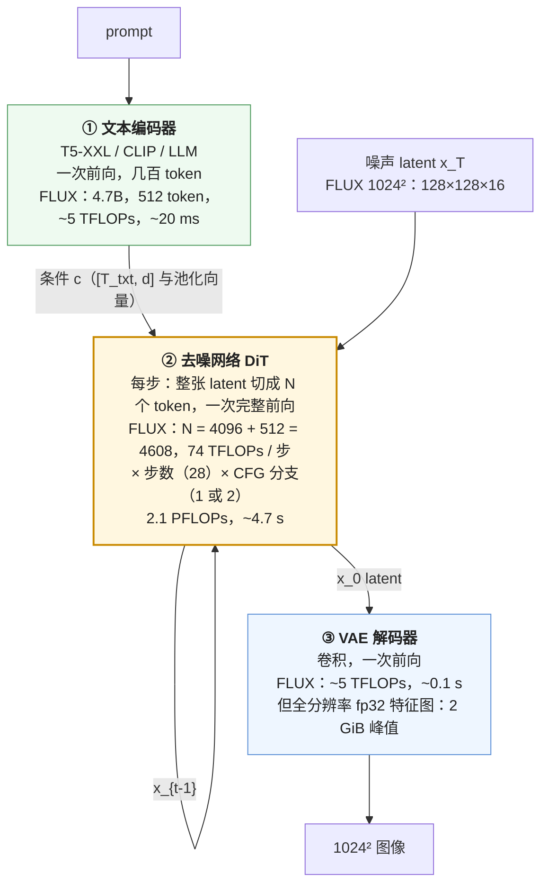
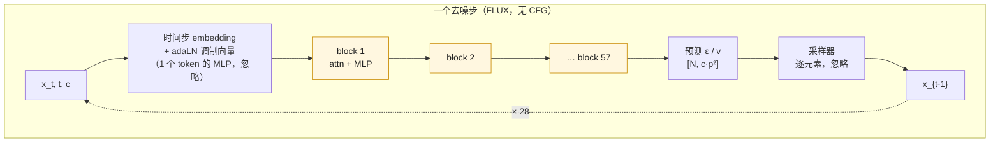
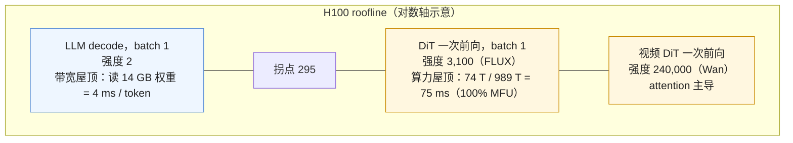

一张 1024² 的图从 prompt 到像素，在 GPU 上是三段完全不同的计算：文本编码器跑一次，几百个 token、几十毫秒；去噪网络对整张 latent 做一次完整前向，重复几十步，占掉 97% 以上的时间；VAE 解码器跑一次，算力不多但显存峰值可能比前两段加起来还大。这三段各花多少 FLOP、多少字节、多少秒，是本系列后面八篇每一项优化的坐标系——不算清这张账，就不知道 TeaCache 省的是哪一项、序列并行切的是哪一项、蒸馏到 4 步改的是哪一个乘数。

这一篇也要回答一个更根本的问题：**为什么这种负载的推理系统与 LLM 的几乎没有重叠？** 答案不在模型结构（DiT 就是 Transformer），而在一个数字：一次去噪前向的算术强度是几千 FLOP/字节，LLM decode 的是 2。前者在 batch 1 就撞上算力屋顶，后者在 batch 几十之前一直在带宽屋顶下——所有系统设计的分歧都从这里开始。

本篇要回答的核心问题是：

> **FLUX.1-dev 生成一张 1024² 的图、28 步，在一张 H100 上：每步多少 FLOPs、attention 占几成？[^q0] MFU 多少时是几秒、三段各占多少？[^q1] 换成 Wan2.1-14B 的 5 秒 720p，哪一项变了几个量级？[^q2]**

## 一、总览

### 1. 先说答案：三段、一本账

一次文生图 / 文生视频的生成是下面这条流水线：



三段的账（FLUX.1-dev，1024²，28 步，H100，DiT 的 MFU 取 0.45）：

| 段 | FLOPs | 占比 | 权重 | 激活峰值 | 时间 | 占比 |
|---|---|---|---|---|---|---|
| ① 文本编码器 | 4.9 T | 0.2% | 9.0 GiB（T5-XXL 4.7B + CLIP-L） | 小 | 22 ms | 0.5% |
| ② DiT × 28 步 | 2.1 P | 99.5% | 22.2 GiB（11.9B bf16） | 270 MiB | 4.68 s（167 ms / 步） | 97% |
| ③ VAE 解码 | 5.0 T | 0.2% | 320 MiB（fp32） | **2.0 GiB** | 102 ms | 2% |
| 合计 | 2.1 P | | 31.5 GiB | | 4.80 s | |

三个结论：

- **算力全在 DiT**。文本编码器与 VAE 加起来不到 1% 的 FLOPs、3% 的时间。后面八篇的所有"加速"都是在加速 DiT 的那 28 次前向；文本编码器与 VAE 只在显存（它们的权重要不要常驻）与 VAE 解码的激活峰值上出现。
- **一次 DiT 前向就是 compute-bound**。74 TFLOPs 除以读一遍 22 GiB 权重，算术强度 3,100 FLOP/字节，H100 的拐点是 295。不需要 batch，单请求就在算力屋顶上——这是与 LLM decode（强度 ≈ 2，batch 到几百才到拐点）最根本的差别。
- **图像模型是 GEMM 负载**：4608 个 token 的 attention 只占每步 FLOPs 的 20%，其余是线性层。到视频的 75,600 个 token 时这个比例翻过来（72%），负载变成 attention 负载——第四篇的主题。

### 2. 三本账：FLOP、字节、秒

与《RL 后训练基础设施》第一篇一样，全系列用三本账记每个机制：

| 账 | 记什么 | 第一篇给出 | 后面各篇在上面做的交换 |
|---|---|---|---|
| **FLOP** | 一次生成的总算量 = 三段之和；DiT 段 = 每步 FLOPs × 步数 × CFG 分支 | 每步的线性项与 attention 项 | 跨步缓存改"步数"的有效值（03）；稀疏 attention 改 attention 项的系数（04）；蒸馏改步数与 CFG（06） |
| **字节** | 显存 = 权重 + 激活 + VAE 解码峰值；通信 = 多卡时每步搬的字节 | 三段的权重与激活 | offload 改权重常驻量（02）；量化改权重字节数（02）；并行引入通信字节（05） |
| **秒** | 每步 = FLOPs / (峰值 × MFU)；总时间 = 三段之和 | MFU 假设下的时间 | 编译 / 后端 / 量化改 MFU（02）；并行用通信换墙钟（05）；serving 在多请求上摊（07） |

### 3. 记账符号

| 符号 | 含义 | FLUX.1-dev 1024² |
|---|---|---|
| $H, W, F$ | 输出的高、宽、帧数 | 1024, 1024, 1 |
| $f, f_t$ | VAE 的空间、时间下采样倍数 | 8, — |
| $c$ | latent 通道数 | 16 |
| $p, p_t$ | patch 的空间、时间边长（latent 像素） | 2, — |
| $N_\text{img}$ | 图像（视频）token 数 $= \frac{H}{fp}\cdot\frac{W}{fp}\cdot\frac{F_\text{lat}}{p_t}$ | 4096 |
| $N_\text{txt}$ | 与图像 token 一起进 self-attention 的文本 token 数 | 512 |
| $N$ | 序列长度 $= N_\text{img} + N_\text{txt}$ | 4608 |
| $P$ | DiT 参数量（决定权重字节数） | 11.9B |
| $P_\text{tok}$ | 一个 token 真正经过的参数量（决定 FLOPs） | 6.45B |
| $L, d$ | 含 self-attention 的层数、隐维度 | 57, 3072 |
| $T$ | 去噪步数 | 28 |
| $g$ | 每步的前向次数：CFG 为 2，guidance 蒸馏后为 1 | 1 |
| $\eta$ | DiT 前向的 MFU | 0.45（eager 约 0.3、编译后约 0.5） |

### 4. 本文的章节安排

| 章 | 主题 | 内容 |
|---|---|---|
| 二 | 一次生成的时间线 | 三段各做什么；扩散推理需要知道的最小集（不涉及数学）；CFG 为什么是两次前向 |
| 三 | token 账 | 从像素到 token 的两次压缩；图像与视频的 $N$；文本 token 进不进 attention |
| 四 | FLOP 账 | 每步 = $2 P_\text{tok} N + 4 L N^2 d$；$P_\text{tok} \ne P$；attention 占比随 $N$ 的变化；三段合计 |
| 五 | 字节账 | 权重、激活（为什么没有 KV cache）、VAE 解码的峰值；三段不必同时在卡上 |
| 六 | 秒的账 | roofline：为什么单请求就 compute-bound；每步时间；MFU 的实测反推；三段时间 |
| 七 | 与 LLM 推理的对照 | 同一张表上的两种负载；为什么 08 系列的方法大半用不上 |
| 八 | 四个放大器 | 分辨率、帧数、步数、CFG 各怎样放大账 |
| 九 | 动手：`diffusion_ledger.py` | 账本脚本的用法与输出 |
| 十 | 本文小结 | |
| 十一 | 自测 | 5 道题 |

## 二、一次生成的时间线

### 1. 三段各做什么

**① 文本编码器。** prompt 经 tokenizer 变成几十到几百个 token，过一个预训练的文本模型，得到每个 token 的向量（$[N_\text{txt}, d_\text{txt}]$）与一个池化向量。这是一次普通的 encoder 前向——形态上就是 LLM 的 prefill，只是小：T5-XXL 4.7B 处理 512 个 token 约 5 TFLOPs。它的输出在整个去噪过程中不变，算一次即可。SD3 / FLUX 用 T5-XXL + CLIP，Qwen-Image 用 Qwen2.5-VL-7B，Wan 用 umT5-XXL，HunyuanVideo 用一个 MLLM——文本编码器的参数量常常与 DiT 同量级（FLUX 的 T5 是 4.7B，DiT 是 11.9B），但只跑一次，所以在 FLOP 账上可以忽略、在字节账上不能。

**② 去噪网络。** 从一张标准高斯噪声 latent $x_T$ 出发，每一步网络接收当前的 $x_t$、时间步 $t$ 与文本条件，输出一个与 $x_t$ 同形状的预测（噪声 $\epsilon$ 或速度 $v$），采样器据此算出 $x_{t-1}$。重复 $T$ 步。**每一步都是对整张 latent 的一次完整前向**——没有哪一步可以只算一部分，也没有上一步的中间结果可以直接拿来用（第三篇讨论的"跨步冗余"是近似复用，不是精确复用）。这与 LLM 的 decode 形成对照：decode 每步只算一个新 token，靠 KV cache 免掉对历史 token 的重算；扩散的每步算的是全部 $N$ 个 token 的新值，没有"历史"可以缓存。

**③ VAE 解码器。** 最终的 latent $x_0$（$128 \times 128 \times 16$）过一个卷积解码器，上采样 8 倍回到 $1024 \times 1024 \times 3$ 的像素。一次前向，几 TFLOPs；但卷积在全分辨率上工作，中间特征图是 $[128, 1024, 1024]$ 的 fp32 张量（512 MiB 一份），几份同时存活就是 GiB 级——它是三段里**显存峰值**最容易出问题的一段，尤其到视频。

### 2. 扩散推理需要知道的最小集

本系列不涉及扩散的数学（在算法地图 L7 第五篇），但系统工程师需要知道下面五件事，它们各自对应一个系统含义：

| 事实 | 系统含义 |
|---|---|
| 网络的输入与输出同形状（$[N, c p^2]$ 的 latent patch），每步一次完整前向 | 每步 FLOPs 相同、显存相同；步与步之间无状态可缓存 |
| 采样沿一条平滑轨迹走，相邻步的输入与输出相似 | 第三篇：跨步缓存 |
| 步数 $T$ 是采样器的参数，不是模型的：同一个模型可以跑 50 步、28 步、8 步，少了质量掉；蒸馏可以让 4 步甚至 1 步够用 | 步数是账上最大的可调乘数；第六篇 |
| **Classifier-free guidance（CFG）**：为了让生成更遵循 prompt，每步跑两次前向——有条件的与无条件的（空 prompt）——按 $\hat\epsilon = \epsilon_\emptyset + w(\epsilon_c - \epsilon_\emptyset)$ 合成 | 每步 FLOPs ×2；两次前向可以拼成 batch 2 或放两组卡（第五篇的 CFG 并行）；guidance 蒸馏（FLUX.1-dev、HunyuanVideo）把它烤进模型，$g = 1$ |
| 采样器（DDIM、DPM-Solver、Euler for flow matching）本身的计算可忽略：对 $[N, c p^2]$ 做几次逐元素运算 | 不进账 |

### 3. 一步的时间线



一步里 GPU 的时间几乎全部在 57 个 block 的 GEMM 与 attention 上；调制、采样器、位置编码是零头。CFG 时这条链跑两遍（或以 batch 2 跑一遍——形状翻倍、时间也翻倍，因为已经 compute-bound）。

## 三、token 账：从像素到序列

### 1. 两次压缩

像素到 DiT 的输入经过两次下采样：VAE 把 $H \times W$ 压 $f$ 倍（$f = 8$），patchify 再压 $p$ 倍（$p = 2$）。一个 token 对应 $fp = 16$ 个像素边长的方块：

$$
N_\text{img} = \frac{H}{f p} \cdot \frac{W}{f p} \cdot \frac{F_\text{lat}}{p_t}, \qquad F_\text{lat} = \frac{F - 1}{f_t} + 1
$$

视频的 3D VAE 在时间上压 $f_t = 4$ 倍，且是**因果**的——第一帧单独编码，所以 81 帧得到 $80/4 + 1 = 21$ 个 latent 帧；$p_t = 1$（Wan、HunyuanVideo 都不在时间上 patchify）。

| 模型 | 输出 | latent | $N_\text{img}$ | $N_\text{txt}$ | $N$ |
|---|---|---|---|---|---|
| SD3-medium | 1024² | 128×128×16 | 4,096 | 333（77 CLIP + 256 T5） | 4,429 |
| FLUX.1-dev | 1024² | 128×128×16 | 4,096 | 512（T5） | 4,608 |
| Qwen-Image | 1024² | 128×128×16 | 4,096 | 512（Qwen2.5-VL） | 4,608 |
| Wan2.1-14B | 720×1280×81 帧 | 90×160×21 | 75,600 | 0（cross-attention） | 75,600 |
| HunyuanVideo | 720×1280×129 帧 | 90×160×33 | 118,800 | 256（MLLM） | 119,056 |

### 2. 文本 token 进不进 attention

这一列决定了 $N$ 里要不要加 $N_\text{txt}$，也决定了文本编码器输出在每步里怎样被用：

- **联合 attention（MMDiT，SD3 / FLUX / Qwen-Image / HunyuanVideo）**：文本 token 与图像 token 拼成一个序列做 self-attention。文本 token 也过线性层（双流块里过自己那套权重），也参与 $N^2$ 的 attention。FLUX 固定 pad 到 512 个 T5 token，所以 $N = 4608$ 而不是 4096——多了 12.5% 的序列、26% 的 attention。
- **cross-attention（SD 1.x / SDXL 的 U-Net、Wan、CogVideoX 的部分层）**：图像 token 做 self-attention，另有一层 cross-attention 把文本作为 K / V。文本不进 $N$；cross-attention 的 FLOPs 是 $4 N_\text{img} N_\text{txt} d$，与 self-attention 的 $4 N_\text{img}^2 d$ 相比可忽略（Wan：512 vs 75,600）。**cross-attention 的 K / V 可以跨步缓存**——它是全流程里唯一一份"KV cache"，每层 $2 N_\text{txt} d$ 个数，Wan 40 层共 200 MiB，SGLang 与 vLLM-Omni 都缓存了它。

### 3. 视频：token 数的三个乘数

Wan 720p 81 帧的 75,600 是 $45 \times 80 \times 21$：空间 $\frac{720}{16} \times \frac{1280}{16} = 45 \times 80 = 3600$，时间 21。**视频 token 数 = 一帧的 token 数 × latent 帧数**，5 秒 720p 是一张 720p 图的 21 倍、一张 1024² 图的 18 倍。这个数字进入 $N^2$ 之后是 340 倍——第四篇的全部内容由此而来。

## 四、FLOP 账：每步 = 线性项 + attention 项

### 1. 公式

一次 DiT 前向：

$$
\text{FLOPs}_\text{fwd} = \underbrace{2\, P_\text{tok}\, N}_{\text{线性层：每个 token 过一遍属于它的权重}} + \underbrace{4\, L\, N^2\, d}_{\text{attention：每层 } QK^\top \text{ 与 } PV \text{ 各 } 2N^2 d}
$$

一次生成的 DiT 段：$\text{FLOPs}_\text{DiT} = g \cdot T \cdot \text{FLOPs}_\text{fwd}$。

线性项是《Transformer 与 LLM》第二篇的 $2N$ 每 token 规则；attention 项是 $QK^\top$（$N \times d$ 乘 $d \times N$，$2N^2 d$）加 $PV$（同样 $2N^2 d$），每层一次，与 head 数无关（$h$ 个 head 各 $d/h$ 维，乘起来仍是 $d$）。MMDiT 的联合 attention 里 $N$ 是文本加图像的总长。

### 2. $P_\text{tok} \ne P$

这里有一个容易算错的地方：**FLOPs 用的不是参数量 $P$，而是一个 token 真正经过的参数量 $P_\text{tok}$**。FLUX.1-dev 有 11.9B 参数，但：

- 19 个双流块里，图像 token 只过图像流的权重（$12 d^2$：QKV 与输出投影 $4d^2$、MLP $8d^2$），文本 token 只过文本流的；两条流各 $12 d^2$，一个 token 只走一条；
- adaLN 调制的 MLP（每个双流块两条流各 $6 d^2$、每个单流块 $3 d^2$，合计 3.3B）只处理**一个**条件向量（时间步 + 池化文本），不随 $N$ 放大，FLOPs 可忽略——但权重字节数照算。

所以 $P_\text{tok} = 57 \times 12 d^2 = 6.45\text{B}$，是 $P$ 的 54%。用 $P$ 算会高估线性项 85%。

| 模型 | $P$ | $P_\text{tok}$ | 差在哪 |
|---|---|---|---|
| FLUX.1-dev | 11.9B | 6.45B | 双流另一半 + adaLN |
| SD3-medium | 2.0B | 0.68B | 同上（24 个双流块） |
| Qwen-Image | 20.4B | 6.8B | 同上（60 个双流块） |
| Wan2.1-14B | 14.3B | 12.0B | 调制向量、cross-attn 的 K / V 投影（只处理文本） |
| HunyuanVideo | 13.0B | 6.8B | 20 双流 + 40 单流，同 FLUX |

（Qwen-Image 20B 与 FLUX 12B 的每 token FLOPs 几乎相同——6.8B vs 6.45B——因为都是 $d = 3072$，Qwen-Image 多的是双流块数与 adaLN。参数量在这里主要是**显存**账的数字，不是算力账的。）

### 3. 五个模型的每步账

| 模型 | $N$ | 线性项 $2 P_\text{tok} N$ | attention $4 L N^2 d$ | attention 占比 | 每前向 | $g$ | $T$ | DiT 段合计 |
|---|---|---|---|---|---|---|---|---|
| SD3-medium | 4,429 | 6.0 T | 2.9 T | 32% | 8.9 T | 2 | 28 | 0.50 P |
| FLUX.1-dev | 4,608 | 59.4 T | 14.9 T | 20% | 74.3 T | 1 | 28 | 2.1 P |
| Qwen-Image | 4,608 | 62.7 T | 15.7 T | 20% | 78.3 T | 2 | 50 | 7.8 P |
| Wan2.1-14B | 75,600 | 1.8 P | 4.7 P | **72%** | 6.5 P | 2 | 50 | 650 P |
| HunyuanVideo | 119,056 | 1.6 P | 10.5 P | **87%** | 12.1 P | 1 | 50 | 604 P |

两点：

- **图像模型的 attention 占 20–30%**，是 GEMM 负载。SD3 的占比比 FLUX 高，因为它的 $d$ 小（1536）——线性项 $\propto P_\text{tok} \propto L d^2$，attention 项 $\propto L d$，$d$ 越小 attention 相对越大。
- **视频模型的 attention 占 70–90%**。Wan 一步 6.5 PFLOPs 里 4.7 P 是 attention；HunyuanVideo 129 帧的 attention 是线性项的 6.5 倍。这里要修正算法地图 L7 第六篇的一个粗估——那里把 HunyuanVideo 的 attention 项写成"与线性项相当、总计 300–400 P"；按 $4 L N^2 d$ 精确算，$4 \times 60 \times 119{,}056^2 \times 3072 = 10.5$ P，一步 12.1 P，50 步 604 P。视频生成的 attention 比直觉更重。

### 4. 三段合计

| | 文本编码器 | DiT 段 | VAE 解码 | 合计 | DiT 占比 |
|---|---|---|---|---|---|
| SD3-medium 1024² | 7.3 T（×2 CFG） | 499 T | 5.0 T | 512 T | 97.6% |
| FLUX.1-dev 1024² | 4.9 T | 2.08 P | 5.0 T | 2.09 P | 99.5% |
| Qwen-Image 1024² | 15.6 T | 7.8 P | 5.0 T | 7.9 P | 99.7% |
| Wan2.1-14B 720p 81f | 11.7 T | 650 P | 358 T | 650 P | 99.9% |
| HunyuanVideo 720p 129f | 4.0 T | 604 P | 571 T | 604 P | 99.9% |

VAE 解码的 FLOPs 按 SD 一族 $f = 8$ 解码器的经验密度 4.8 MFLOP / 输出像素估（1024² 约 5 T），视频按帧数线性放大到几百 T——数字不小，但与 DiT 段差三个量级。**除了 SD3 这种小 DiT 之外，三段合计 ≈ DiT 段**，后面各篇说"一次生成多少 FLOPs"时指的就是它。

## 五、字节账：权重、激活与没有 KV cache

### 1. 权重

| 模型 | DiT（bf16） | 文本编码器（bf16） | VAE（fp32） | 合计 | 80 GB 卡 | 24 GB 卡 |
|---|---|---|---|---|---|---|
| SD3-medium | 3.7 GiB | 10.3 GiB（T5 + 2×CLIP） | 0.3 GiB | 14.3 GiB | 放得下 | 放得下（不加载 T5 更稳） |
| FLUX.1-dev | 22.2 GiB | 9.0 GiB | 0.3 GiB | 31.5 GiB | 放得下 | **放不下**：需要 offload 或量化 |
| Qwen-Image | 38.0 GiB | 14.2 GiB（7B VL） | 0.3 GiB | 52.5 GiB | 放得下 | 放不下 |
| Wan2.1-14B | 26.6 GiB | 10.6 GiB（umT5） | 0.5 GiB | 37.7 GiB | 放得下 | 放不下 |
| HunyuanVideo | 24.2 GiB | 14.4 GiB | 0.9 GiB | 39.5 GiB | 放得下 | 放不下 |

文本编码器占了权重的三分之一到一半，而它只在开头跑一次——**三段不必同时在卡上**。文本编码器算完把它搬到 CPU（或干脆放在 CPU / 另一张卡上跑），VAE 只在最后加载，那么 DiT 段的显存需求就只有 DiT 自己的权重加激活：FLUX 22.5 GiB，24 GB 的 4090 勉强放得下。这是第二篇 offload 一节的起点，也是第七篇"三段分离"的起点。

### 2. 激活：为什么没有 KV cache

LLM decode 的显存里，KV cache 常常比权重还大（08 系列第五篇：一条 8K 上下文的 Llama-3-8B 请求 1 GiB）。扩散推理的激活账里**没有这一项**：

- 每步是一次完整前向，attention 的 K / V 由这一步的 $x_t$ 算出来、用完即弃，下一步的 $x_{t-1}$ 不同，K / V 要重算。没有"历史 token 的 K / V 供新 token 查询"这种结构——所有 token 都是"新"的。
- 唯一能跨步复用的是文本条件：cross-attention 模型的文本 K / V（Wan 每层 $2 \times 512 \times 5120 \times 2$ 字节 = 10 MiB，40 层 400 MiB），以及 MMDiT 里文本 token 的……什么都不能，因为它们也随每步的联合 attention 重算（文本流的输入每层都在变）。

激活的峰值是**一层里同时存活的几份 $[N, d]$ 张量**：残差流、Q / K / V、attention 输出、MLP 的中间（$4d$ 宽）。用 FlashAttention 时不物化 $N \times N$ 的分数矩阵，峰值随 $N$ **线性**。按 10 份 $d$ 宽张量估：

| 模型 | $N$ | DiT 激活峰值（× CFG batch） | 说明 |
|---|---|---|---|
| FLUX.1-dev | 4,608 | 270 MiB | 可忽略 |
| Qwen-Image | 4,608 | 540 MiB（×2） | 可忽略 |
| Wan2.1-14B | 75,600 | **14.4 GiB**（×2） | 与权重同量级 |
| HunyuanVideo | 119,056 | 6.8 GiB | $d$ 小、无 CFG |

没有 FlashAttention 时分数矩阵是 $h \times N^2$ 个数——Wan 的 $40 \times 75600^2 \times 2$ 字节 = 425 GiB，一层就放不下。**视频 DiT 的推理在 FlashAttention 之前是不可能的**，这也是为什么第四篇讨论的稀疏 attention 都要落到 block 粒度的 kernel 上：任何物化分数矩阵的做法在 $N = 10^5$ 上都不成立。

### 3. VAE 解码的峰值

解码器把 $[16, 128, 128]$ 的 latent 逐级上采样，最后几层在全分辨率 $1024 \times 1024$ 上以 128 个通道工作，一份 fp32 特征图 512 MiB，同时存活约 4 份（输入、卷积输出、残差、归一化的中间）——2 GiB。它随**像素数 × 帧数**线性：

| 输出 | VAE 解码激活峰值（不分块） |
|---|---|
| 1024² 图 | 2.0 GiB |
| 2048² 图 | 8.0 GiB |
| 720p × 81 帧（Wan） | **107 GiB** |
| 720p × 129 帧（HunyuanVideo） | **227 GiB** |

视频的 VAE 解码不分块是不可能的，所以 3D VAE 的解码器都内建了时间分块（因果卷积让它按 chunk 解码）与空间 tiling；xDiT 的 Parallel VAE 与 vLLM-Omni 的 VAE patch 并行把它切到多卡。**VAE 解码是三段里 OOM 最常发生的一段**——它的 FLOPs 只有 0.1%，但显存峰值可以是 DiT 段的十倍。第二篇与第九篇都会回到这里。

## 六、秒的账：为什么单请求就 compute-bound

### 1. roofline 上的位置

一次 DiT 前向读一遍权重（22.2 GiB）、做 74.3 TFLOPs：

$$
\text{算术强度} = \frac{\text{FLOPs}_\text{fwd}}{\text{权重字节}} = \frac{2 P_\text{tok} N + 4 L N^2 d}{2 P} \approx \frac{P_\text{tok}}{P} \cdot N \approx 3{,}100 \ \text{FLOP/字节}
$$

H100 的拐点是 $989 \text{ TFLOPS} / 3.35 \text{ TB/s} = 295$。3,100 在拐点右边十倍——**算力屋顶**。对照 LLM decode：每生成一个 token 读一遍权重、做 $2P$ FLOPs，强度 $= 2 \cdot (\text{batch})$，batch 1 时是 2，要到 batch 150 才到拐点。



这一个位置决定了全部系统设计：

| | memory-bound（LLM decode） | compute-bound（扩散 DiT） |
|---|---|---|
| 时间由什么决定 | 读权重的字节数 / 带宽 | FLOPs / (峰值 × MFU) |
| batch 的作用 | 同一份权重服务更多 token，吞吐近似线性增长 | 每个请求的 FLOPs 独立，batch 2 ≈ 2 倍时间，吞吐不变 |
| 量化的收益 | 权重字节数减半 → 时间减半 | 只有算力峰值翻倍（FP8 Tensor Core）才提速；权重变小只省显存 |
| 多卡的目的 | 装下权重、装下 KV | 切短一个请求的墙钟 |
| 优化的对象 | 字节 | FLOPs 与 MFU |

### 2. 每步时间与 MFU

$$
t_\text{step} = \frac{g \cdot \text{FLOPs}_\text{fwd}}{\text{峰值} \times \eta}
$$

FLUX 一步 74.3 T，H100 峰值 989 T，$\eta = 0.45$ 时 167 ms，28 步 4.68 s。$\eta$ 是这一账里唯一的经验参数，它可以从实测反推：xDiT 的 benchmark 页给出 FLUX.1-dev 28 步单张 H100 **eager 6.71 s、`torch.compile` 后 4.30 s**，对应 $\eta = 2.08\text{P} / 6.71 / 989\text{T} = 0.31$ 与 $0.49$。所以：

- **eager 的 MFU 约 0.3**：几十个小算子（归一化、调制、RoPE、gate、残差加）各自一次 kernel launch、各自读写一遍 $[N, d]$，GEMM 之外的时间占了近半；
- **编译后约 0.5**：小算子融合、launch 开销摊掉，GEMM 与 attention 本身各在 60–70% 的效率上；
- 再往上是第二篇的内容：FA3、FP8、融合 kernel，SGLang 的 benchmark 在 Qwen-Image 上把每步从 125 ms 压到 83 ms。

| 模型 | 每前向 | $g$ | 每步（$\eta = 0.45$） | $T$ | DiT 段时间 | 实测参考 |
|---|---|---|---|---|---|---|
| SD3-medium | 8.9 T | 2 | 40 ms | 28 | 1.1 s | — |
| FLUX.1-dev | 74.3 T | 1 | 167 ms | 28 | 4.7 s | xDiT：6.71 s eager / 4.30 s compile |
| Qwen-Image | 78.3 T | 2 | 352 ms | 50 | 17.6 s | SGLang：单卡约 20 s 量级 |
| Wan2.1-14B | 6.5 P | 2 | 29 s | 50 | 24 min | 单卡公开数字在 30–60 min 量级（eager、长序列 attention 效率低） |
| HunyuanVideo | 12.1 P | 1 | 27 s | 50 | 23 min | 同上 |

视频模型的实测通常比 $\eta = 0.45$ 的估算慢，原因是长序列 attention 在 eager 下的效率与显存压力（激活 14 GiB 加 CFG batch）；它们几乎总是在多卡上跑（第五篇）。

### 3. 三段的时间

| | 文本编码器 | DiT 段 | VAE 解码 | 合计 | DiT 占比 |
|---|---|---|---|---|---|
| SD3-medium | 33 ms | 1.12 s | 102 ms | 1.26 s | 89% |
| FLUX.1-dev | 22 ms | 4.68 s | 102 ms | 4.80 s | 97% |
| Qwen-Image | 70 ms | 17.6 s | 102 ms | 17.8 s | 99% |
| Wan2.1-14B | 52 ms | 24.3 min | 7.3 s | 24.5 min | 100% |
| HunyuanVideo | 18 ms | 22.6 min | 11.5 s | 22.8 min | 99% |

文本编码器按 MFU 0.22（小 batch prefill）、VAE 按 0.05（fp32 卷积、memory-bound）估。两点值得记：

- **VAE 解码 100 ms 不可忽视**——当 DiT 段被蒸馏到 4 步（第六篇：FLUX-schnell 0.67 s）时，VAE 的 0.1 s 变成 13%，文本编码器的 22 ms 变成 3%。少步模型的优化对象会移到这两段。
- **视频的 VAE 解码是秒级**：Wan 7 s、HunyuanVideo 12 s，且要分块。在多卡把 DiT 段压到几分钟之后，VAE 解码的几秒与它的分块 / 并行开始进入账（第五篇的 Parallel VAE、第七篇的 VAE stage 分离）。

## 七、与 LLM 推理的对照

把两种负载放在同一张表上（FLUX.1-dev 1024² vs Llama-3-8B 规格的 7B 模型生成 1000 token，都是 H100 单卡 batch 1）：

| | 7B LLM，1000 token | FLUX.1-dev，1024² 28 步 | 比值 |
|---|---|---|---|
| FLOPs | $2 \times 7\text{B} \times 1000 = 14$ T | 2.1 P | **150×** |
| 权重 | 14 GiB | 31.5 GiB（DiT 22 GiB） | 2× |
| 跨步状态 | KV cache，随上下文线性增长 | 无 | — |
| 每步形态 | 1 个 token，读一遍权重 | 4608 个 token，读一遍权重 | — |
| 算术强度 | 2 | 3,100 | 1500× |
| 瓶颈 | 带宽 | 算力 | — |
| 每步时间 | 6 ms（14 GiB / 3.35 TB/s / 0.7） | 167 ms | — |
| 步数 | 1000 | 28 | — |
| 总时间 | 6.0 s | 4.8 s | **0.8×** |
| 时长可预测性 | 不可预测（不知道要生成几个 token） | **完全可预测**（分辨率 × 步数 × CFG） |
| batch 对吞吐 | 近似线性提升（到拐点前） | 几乎无提升 |

**150 倍的 FLOPs，0.8 倍的时间**——这就是 compute-bound 与 memory-bound 的差别的全部含义。由此可以逐项对照 08 系列的机制在扩散上的命运：

| 08 系列的机制 | 它解决的问题 | 扩散上 | 替代物 |
|---|---|---|---|
| KV cache 与 PagedAttention | decode 不重算历史 token | 没有历史 token | 文本 K / V 缓存（cross-attn 模型，几百 MiB） |
| 连续批处理 | memory-bound 下 batch 提吞吐；请求长短不齐 | compute-bound，batch 不提吞吐；请求时长已知 | 同形状请求的静态 batch（小模型才值）、按时长的队列调度（07） |
| chunked prefill | prefill 与 decode 混排 | 每步都是"prefill"，没有 decode | — |
| 投机解码 | 串行 token 链猜多个 | 没有串行 token 链 | 步数蒸馏（06）、跨步缓存（03） |
| 权重量化 | 减少每步读的字节 | 读字节不是瓶颈；只有 Tensor Core 峰值翻倍才提速 | FP8 / INT4 的**算力**收益（02） |
| 张量并行 | 装下权重、切短每步读权重的时间 | 权重放得下；通信 $\propto N d$ 太贵 | 序列并行、CFG 并行、PipeFusion（05） |
| PD 分离 | prefill 与 decode 形态不同 | 三段形态不同：编码器小、DiT 重、VAE 显存峰值 | 三段分离（07） |
| 前缀缓存 | 多请求共享 prompt 前缀 | 文本编码器输出可缓存（几 MiB）；latent 无共享 | 提示词 embedding 缓存 |

只有一样东西是两边共有的：**GEMM 与 attention 的 kernel**。FlashAttention、FP8 GEMM、融合的归一化——扩散引擎与 LLM 引擎共用同一套 kernel 库（SGLang 的 sgl-kernel、vLLM 的 kernel），这也是 SGLang 与 vLLM 能把扩散接进自己框架的物质基础。

## 八、四个放大器

账上有四个乘数会被用户的一个参数改变。用 FLUX（$\eta = 0.45$）与 Wan 看每一个：

### 1. 分辨率：$N \propto$ 像素，attention $\propto N^2$

| FLUX | $N$ | attention 占比 | 每步 | 28 步 | DiT 激活 | VAE 激活 |
|---|---|---|---|---|---|---|
| 512² | 1,536 | 8% | 48 ms | 1.4 s | 90 MiB | 0.5 GiB |
| 768² | 2,816 | 13% | 94 ms | 2.6 s | 165 MiB | 1.1 GiB |
| 1024² | 4,608 | 20% | 167 ms | 4.7 s | 270 MiB | 2.0 GiB |
| 1536² | 9,728 | 35% | 431 ms | 12.1 s | 570 MiB | 4.5 GiB |
| 2048² | 16,896 | 48% | 939 ms | 26.3 s | 990 MiB | 8.0 GiB |

分辨率翻倍，像素 4 倍，线性项 4 倍，attention 16 倍：2048² 的一步是 1024² 的 5.6 倍，attention 占比从 20% 到 48%。**分辨率是图像服务里最贵的参数**，也是为什么服务要按分辨率分池、定价按像素（第七篇）。

### 2. 帧数：视频的 $N$ 再乘一个维度

| Wan 720p | $N$ | attention 占比 | 每步 | 50 步 | DiT 激活 | VAE 激活 |
|---|---|---|---|---|---|---|
| 17 帧 | 18,000 | 38% | 3.1 s | 2.6 min | 3.4 GiB | 22 GiB |
| 49 帧 | 46,800 | 62% | 13.1 s | 10.9 min | 8.9 GiB | 65 GiB |
| 81 帧 | 75,600 | 72% | 29.2 s | 24.3 min | 14.4 GiB | 107 GiB |
| 129 帧 | 118,800 | 80% | 66 s | 54 min | 22.7 GiB | 170 GiB |

帧数从 17 到 129（latent 帧 5 → 33，6.6 倍），每步时间 21 倍——因为 attention 项 $\propto N^2$ 并且已占大半。**视频时长是二次方的成本**，这是第四篇稀疏化与第六篇自回归（把长视频切成 chunk、让成本回到线性）的动机。

### 3. 步数：线性的乘数，也是最可改的

| FLUX 1024² | 50 步 | 28 步 | 8 步 | 4 步 | 1 步 |
|---|---|---|---|---|---|
| DiT 段 | 8.4 s | 4.7 s | 1.3 s | 0.67 s | 0.17 s |

步数是账上唯一**线性且可以被算法侧直接改掉**的乘数：不重训只换采样器（DPM-Solver / UniPC）能从 50 到 20 步；步数蒸馏（LCM、Turbo、DMD2、FLUX-schnell）到 4 步甚至 1 步。从 28 到 4 是 7 倍——比本系列任何一项系统优化都大。第六篇讨论它对系统的全部后果。

### 4. CFG：×2 或 ×1

| | CFG ×2 | guidance 蒸馏 ×1 |
|---|---|---|
| SD3-medium 28 步 | 1.12 s | 0.56 s |
| Qwen-Image 50 步 | 17.6 s | 8.8 s |
| Wan2.1-14B 50 步 | 24.3 min | 12.2 min |

CFG 把每步的前向翻倍。FLUX.1-dev 与 HunyuanVideo 把 guidance 蒸馏进了模型（$g = 1$），SD3 / Qwen-Image / Wan 没有。$g = 2$ 的模型有两条系统出路：两次前向放两组卡（第五篇的 CFG 并行，通信几乎为零）；或后半程不再算无条件分支（SGLang 的 CFG gating，有损）。

## 九、动手：`diffusion_ledger.py`

配套脚本在 `ai-learning-labs` 的 `diffusion-inference-infra/diffusion_ledger.py`，纯标准库。它把本文的全部公式实现为一个 `Ledger`，内置五个模型与六种 GPU 的规格：

```bash
python diffusion_ledger.py                                   # 五个模型的默认账 + 放大器扫描
python diffusion_ledger.py --model flux --gpu 4090           # 24 GB 卡：权重放不下的提示
python diffusion_ledger.py --model wan --frames 129 --sweep  # 帧数怎样放大 attention 占比
python diffusion_ledger.py --model flux --steps 4 --no-cfg   # 少步蒸馏后的账（第六篇）
python diffusion_ledger.py --model qwen --mfu 0.6            # 换 MFU 假设
```

FLUX 默认账的输出（节选）：

```text
[2] 一次 DiT 前向的 FLOPs
  线性项 2·P_tok·N : 59.4 TFLOPs   （P_tok = 6.45B，总参数 11.9B）
  attention 4·L·N²·d: 14.9 TFLOPs   占 20%
  合计             : 74.3 TFLOPs   ×1（CFG）×28 步
  算术强度         : 3,123 FLOP/字节（H100 SXM 的拐点 295）

[4] 显存
  DiT 权重 bf16    : 22.2 GiB
  文本编码器权重   : 9.0 GiB
  VAE 权重 fp32    : 320 MiB
  三段权重合计     : 31.5 GiB   （H100 SXM 80 GB）
  DiT 激活峰值     : 270 MiB   （无 KV cache；随 N 线性）
  VAE 解码激活峰值 : 2.0 GiB   （随像素×帧线性）

[5] 时间
  文本编码器       :      22 ms
  DiT 每步         :     167 ms   × 28 = 4.68 s
  VAE 解码         :     102 ms
  合计             :     4.80 s   DiT 占 97%

[6] 对照：7B LLM batch 1 生成 1000 token（memory-bound，带宽利用 70%）
  FLOPs 14.0 TFLOPs，每 token 6.0 ms，合计 5.97 s
  本次生成 = LLM 的 149× FLOPs，0.8× 时间
```

脚本里的几个经验常数值得知道来源：DiT 的 MFU 默认 0.45（xDiT 实测反推：eager 0.31、compile 0.49）；VAE 解码 4.8 MFLOP / 像素、MFU 0.05；激活按 10 份 $[N, d]$ 张量；VAE 解码激活按 4 份全分辨率 128 通道 fp32 特征图。它们决定的是数量级，改动它们不会改变本文的任何结论。后面各篇不再给脚本，但每篇都会把新机制写成这张账上的一项修正——例如第三篇的跨步缓存把"$T$"换成"$T_\text{full} + T_\text{hit} \cdot \epsilon$"，第五篇的序列并行给每步加一项通信时间。

## 十、本文小结

### 1. 要点回顾

| 项 | 规则 | 数字（FLUX.1-dev 1024² 28 步，H100） |
|---|---|---|
| 三段 | 文本编码器一次 → DiT × $T$ × $g$ → VAE 解码一次 | 4.9 T + 2.1 P + 5.0 T；22 ms + 4.68 s + 102 ms |
| token 数 | $N = \frac{H}{fp}\frac{W}{fp}\frac{F_\text{lat}}{p_t} + N_\text{txt}$ | 4096 + 512 = 4608；Wan 720p 81f 75,600 |
| 每步 FLOPs | $2 P_\text{tok} N + 4 L N^2 d$；$P_\text{tok} \ne P$ | 59.4 T + 14.9 T = 74.3 T；attention 20% |
| 视频 | attention 占比随 $N$ 翻转 | Wan 72%、HunyuanVideo 87%；一步 6.5–12 P |
| 显存 | 权重 + 激活（随 $N$ 线性，无 KV）+ VAE 解码峰值 | 31.5 GiB + 270 MiB + 2.0 GiB；Wan 激活 14 GiB、VAE 107 GiB |
| 三段不必同时在卡 | 文本编码器算完可让出；VAE 最后才要 | DiT 段只需 22.5 GiB |
| roofline | 强度 $\approx \frac{P_\text{tok}}{P} N$，单请求就 compute-bound | 3,100 vs 拐点 295；LLM decode 是 2 |
| 每步时间 | $g \cdot \text{FLOPs}_\text{fwd} / (\text{峰值} \cdot \eta)$ | 167 ms（$\eta$ 0.45）；实测 eager 0.31、compile 0.49 |
| 与 LLM | FLOPs 高两个量级、时间相近、瓶颈相反、时长可预测 | 150× FLOPs，0.8× 时间 |
| 放大器 | 分辨率（$N^2$）、帧数（$N^2$）、步数（线性）、CFG（×2） | 2048² 是 1024² 的 5.6×；129 帧是 17 帧的 21×；4 步是 28 步的 1/7 |

### 2. 公式速查

$$
\begin{aligned}
N &= \frac{H}{fp} \cdot \frac{W}{fp} \cdot \frac{F_\text{lat}}{p_t} + N_\text{txt}, \quad F_\text{lat} = \frac{F-1}{f_t} + 1 \\
\text{FLOPs}_\text{fwd} &= 2 P_\text{tok} N + 4 L N^2 d \\
\text{FLOPs}_\text{DiT} &= g \cdot T \cdot \text{FLOPs}_\text{fwd} \\
t_\text{step} &= \frac{g \cdot \text{FLOPs}_\text{fwd}}{\text{峰值} \cdot \eta}, \qquad t_\text{总} = t_\text{txt} + T \cdot t_\text{step} + t_\text{VAE} \\
\text{强度} &= \frac{\text{FLOPs}_\text{fwd}}{2P} \approx \frac{P_\text{tok}}{P} N
\end{aligned}
$$

### 3. 本篇涉及的算法侧结论

只用了三条：一步是一次对 $N$ 个 token 的完整前向；CFG 是两次前向；步数是采样器参数、可以被蒸馏。它们的来由在算法地图 L7 第五、六篇。

### 4. 下一篇

账算清了，下一篇开始在上面做第一类交换：不改 FLOPs、只改 $\eta$ 与字节——attention 后端、`torch.compile`、FP8 / INT4 量化、三段的 offload 与 VAE 分块，看单卡能把 FLUX 的 167 ms 压到多少、把 31.5 GiB 压到多少。

## 十一、自测

1. Qwen-Image 有 20.4B 参数、FLUX.1-dev 有 11.9B，两者 $d$ 都是 3072、$N$ 都是 4608。为什么两者一次前向的 FLOPs 几乎相同（78 T vs 74 T）？

   <details markdown="1">
   <summary>答案</summary>
   FLOPs 取决于每个 token 经过的参数 $P_\text{tok}$，不是总参数 $P$。两者都是双流 MMDiT，$P_\text{tok} = L_\text{attn} \times 12 d^2$：Qwen-Image 60 层 6.8B、FLUX 57 层 6.45B，只差 5%。Qwen-Image 多出的 8.5B 是双流的另一半（每个 token 只走一条）与 adaLN 调制 MLP（只处理一个条件向量），它们占显存、不占算力。参数量决定的是权重字节数（38 GiB vs 22 GiB）。详见[第四章](#四flop-账每步--线性项--attention-项)。
   </details>

2. Wan2.1-14B 生成 720p 81 帧，把帧数改成 129 帧（latent 帧 21 → 33），每步时间变成原来的多少倍？如果只有线性项、没有 attention 项，会是多少倍？

   <details markdown="1">
   <summary>答案</summary>
   $N$ 从 75,600 到 118,800（1.57 倍）。线性项 ×1.57；attention 项 ×1.57² = 2.47。原来 attention 占 72%：新每步 = $0.28 \times 1.57 + 0.72 \times 2.47 = 2.22$ 倍（账本：29.2 s → 66 s，2.26 倍，差别来自帧数取整）。只有线性项时是 1.57 倍。详见[第八章](#八四个放大器)。
   </details>

3. 一张 24 GB 的 RTX 4090 要跑 FLUX.1-dev。三段权重合计 31.5 GiB 放不下，但不做量化也能跑起来——靠什么？DiT 段实际需要多少显存？

   <details markdown="1">
   <summary>答案</summary>
   三段不必同时在卡上。文本编码器（9.0 GiB）先跑、跑完搬到 CPU 或释放；VAE（0.3 GiB）最后才加载。DiT 段只需自己的权重 22.2 GiB + 激活 270 MiB ≈ 22.5 GiB，24 GB 放得下（很紧）。VAE 解码的 2 GiB 峰值在 DiT 释放后再要。详见[第五章](#五字节账权重激活与没有-kv-cache)。
   </details>

4. 同一张 H100，FLUX 生成一张图 2.1 PFLOPs 用 4.8 s，7B LLM 生成 1000 token 14 TFLOPs 用 6 s。FLOPs 差 150 倍、时间反而更短，是因为什么？把两个负载各自的 batch 从 1 提到 2，吞吐各变成多少？

   <details markdown="1">
   <summary>答案</summary>
   DiT 一次前向的算术强度约 3,100 FLOP/字节，在 H100 拐点（295）之上，时间由 FLOPs / (峰值 × MFU) 决定；LLM decode 的强度是 2，时间由每步读 14 GiB 权重的带宽决定，1000 步 × 6 ms。batch 2：LLM 每步仍读一遍权重、服务两个请求，吞吐约 2 倍；DiT 每个请求的 FLOPs 独立、已在算力屋顶，batch 2 ≈ 2 倍时间，吞吐不变。详见[第六章](#六秒的账为什么单请求就-compute-bound)、[第七章](#七与-llm-推理的对照)。
   </details>

5. HunyuanVideo 720p 129 帧的 VAE 解码只有 571 TFLOPs（不到总 FLOPs 的 0.1%），为什么它是最容易 OOM 的一段？不分块时峰值大约多少？

   <details markdown="1">
   <summary>答案</summary>
   解码器在全分辨率 720×1280 上以 128 通道 fp32 工作，一帧一份特征图 472 MiB，129 帧 59 GiB，同时存活约 4 份 → 约 227 GiB，比 DiT 段的权重 + 激活（24 + 7 GiB）大一个量级。FLOPs 小是因为卷积核小、通道少；显存大是因为特征图在像素分辨率上。必须时间分块 / 空间 tiling 或多卡 Parallel VAE。详见[第五章](#五字节账权重激活与没有-kv-cache)。
   </details>

## 下一篇

[单卡执行：attention 后端、编译、FP8 / INT4 与 offload](/single-gpu-diffusion-execution-attention-compile-quantization-offload.html)

[^q0]: 一次前向 74.3 TFLOPs：线性项 $2 P_\text{tok} N = 2 \times 6.45\text{B} \times 4608 = 59.4$ T（$P_\text{tok}$ 是一个 token 经过的 6.45B，不是总参数 11.9B），attention $4 L N^2 d = 4 \times 57 \times 4608^2 \times 3072 = 14.9$ T，占 20%。FLUX.1-dev 是 guidance 蒸馏模型、无 CFG，每步就是一次前向；28 步合计 2.08 PFLOPs。详见[第四章](#四flop-账每步--线性项--attention-项)。

[^q1]: 每步 = 74.3 T / (989 T × $\eta$)：$\eta = 0.45$ 时 167 ms，28 步 4.68 s；实测 eager 6.71 s（$\eta$ 0.31）、`torch.compile` 后 4.30 s（0.49）。三段：文本编码器 22 ms（0.5%）、DiT 4.68 s（97%）、VAE 解码 102 ms（2%），合计 4.80 s。详见[第六章](#六秒的账为什么单请求就-compute-bound)。

[^q2]: $N$ 从 4,608 变成 75,600（16 倍），attention 项从 14.9 T 变成 4.7 P（316 倍，$N^2$），线性项从 59 T 到 1.8 P（30 倍，$N$ 与 $P_\text{tok}$ 各贡献一部分），attention 占比从 20% 翻到 72%；加上 CFG ×2 与 50 步，DiT 段从 2.1 P 到 650 P（310 倍）、单卡时间从 4.7 s 到 24 min。DiT 激活从 270 MiB 到 14.4 GiB，VAE 解码峰值从 2 GiB 到 107 GiB（必须分块）。详见[第三章](#三token-账从像素到序列)、[第四章](#四flop-账每步--线性项--attention-项)、[第五章](#五字节账权重激活与没有-kv-cache)。
