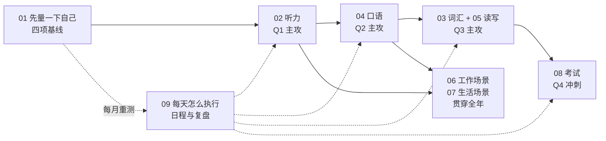

## 内容简介

《一年英语计划：从六级到海外工作生活》是一组共十篇的系列文章，是我给自己写的英语学习计划。起点是大学英语六级——能读技术文档、能看带字幕的剧，但美剧一关字幕就跟不上，开会想插一句话找不到词，去药店说不出「感冒药」，写邮件通篇都是中式句子。终点是一年后到海外做技术工作、独立生活，中间大概率还要考一门语言考试。

这不是一篇「英语学习方法大全」。方法大全我看过不少，问题从来不是不知道方法，而是**方法和我的时间对不上**：我每天能拿出来专注学英语的时间大约 30 分钟，剩下的只有吃饭和上下班路上这些只能用耳朵和手机的碎片。所以这个系列先做一件很多学习计划不做的事——算清时间账、定出这一年现实能到达的上限——然后把四项能力（听、说、读写、词汇）拆开，每一项回答三个问题：我现在到底差在哪，用什么方法练，每天的 30 分钟和碎片时间各承担什么。

它回答的问题是：

> **六级水平离「能用英语工作生活」到底差多远？每天一小时左右、十二个月，现实能走到哪？四项都弱的时候先练哪一项？30 分钟的专注时间和只能听的碎片时间，分别该做什么？考试和真实能力是一回事吗？**

写成第一人称是因为它首先是我自己要执行的东西——每篇末尾的「下周就可以做的事」是我的待办，第 01 篇的基线表是我每个月要重测的表格。但起点是六级、目标是海外技术岗、时间紧张的人应该不少，如果你也是，把里面的数字换成你自己的就能用。

## 为什么写这个系列？

### 六级是一个容易误判的起点

六级证书的实际含义是：在国内教育体系里，英语作为**读写考试科目**过关了。它没有检验过三样在海外每天都要用的能力：听真实语速的英语、在几秒内组织出一句话说出来、用生活词汇而不是学术词汇交流。我能读一篇 PyTorch 的 RFC 而不查词典，但听一段 NPR 的新闻只能抓住一半，这两件事在六级的分数上是看不出来差别的。

把六级放到国际标尺上看会更清楚。教育部的《中国英语能力等级量表》（CSE）把 CET-6 对标到 CSE 六级；2018 年 NEEA 和 British Council 的对接研究把 IELTS 6.0 对标到 CSE 六级，读写方向的对接研究把 CSE 六级对到 CEFR 的 B2[^cse]。所以一个诚实的估计是：**六级通过 ≈ CEFR B2 下沿 ≈ IELTS 5.5–6.0**，而且这个估计偏向读写——听说很可能还在 B1。这就是我的起点。

### 时间账决定一切

剑桥的经验数字是：从一个 CEFR 等级到下一个大约需要 200 小时的指导学习，越往上越多，B1 到 B2 大约 180–260 小时[^glh]。我的时间是每天 30 分钟专注 + 大约 60 分钟碎片音频，算成「有效学习时间」保守按每天 1 小时、乐观按 1.5 小时，一年就是 **350–500 小时**。

这个数字说明两件事。第一，一年内从 B2 下沿走到 B2 稳、C1 摸边是现实的，大致对应 IELTS 6.5–7.0；「一年后流利如母语」不是。第二，350–500 小时不够四项同时猛攻——按 200 小时一个等级算，均摊到四项每项只够走半个等级。所以这个计划的核心不是「学什么」，而是**顺序**：一个季度只主攻一项，其他三项维持不退步。

### 「专注时间」和「碎片时间」不能做同样的事

我试过在地铁上背单词、在饭桌上练口语，都坚持不了两周。原因不是懒，是这两类时间的物理条件不一样：碎片时间只有耳朵和一只手，没法开口，没法写；30 分钟专注时间有桌子和嘴，但很短。一个能坚持的计划必须让每类时间做它最适合的事——**碎片时间只做输入（泛听、复习词卡），30 分钟只做产出（说、写、听写）**。这条原则贯穿系列的每一篇。

### 现有材料的断层

- **考试培训**教题型套路，从 5.5 到 6.5 很有效，但考完了不会变成能开会、能看病的能力；
- **「沉浸式」建议**（多看剧、多和外国人聊）默认你有大量时间和环境，对每天 30 分钟、还在国内的人不适用；
- **App**（背单词、AI 口语陪练）各解决一个点，没有一个告诉你四项之间怎么排优先级、每天怎么组合；
- **成功经验帖**通常写在成功之后，省掉了「第三个月发现方法不对、重来」的部分。

这个系列想填的是从「知道所有方法」到「排出一份每天能执行、每月能验收的计划」之间的那段路，而且它会在执行中被改——先进草稿、跑一阵再发，就是为了这个。

## 系列的整体主线

主线是一句话：**先量、再排序、每类时间做它该做的事、每月验收**。十篇沿这条线走：

四个季度的主攻项按这个顺序排，理由写在每一篇里，这里先说结论：

| 季度 | 主攻 | 为什么这时候 | 维持项 |
|---|---|---|---|
| Q1 | 听力 | 听是其他三项的输入源；不先把耳朵打开，口语练的是自己想象的英语，词汇捞不到真实用法。碎片时间全是听力时间，Q1 的边际收益最高 | 词卡起步 |
| Q2 | 口语 | 听了三个月有了语感和素材，开口的门槛最低；口语是四项里最需要「专注时间 + 有嘴」的，30 分钟全给它 | 泛听、词卡 |
| Q3 | 词汇 + 读写 | 前两季从输入里捞出的词已经积累了几百张卡；写作是把说的东西固化，和口语共享句式库 | 泛听、每周一次真人口语 |
| Q4 | 考试 | 8–12 周的题型训练把能力翻译成分数；放在最后是因为考试分数有两年有效期，越晚考越接近出发 | 全部 |

工作场景（06）和生活场景（07）不占季度——它们是词汇和口语的**语料来源**，每周从里面挑一个场景练。

## 章节结构与分章导读

### 第 01 篇：先量一下自己——四项能力的基线测试

不测就没法知道进步。这一篇用免费或低成本的方式给四项各定一个可以重复的数字：CEFR 定级测试、掐表的 IELTS 样题、词汇量估算、一段真实语速音频的听写正确率、一段两分钟录音里的卡壳次数。它回答：六级到底对应什么水平？哪一项最弱？我的「基线表」长什么样、每个月怎么重测？

### 第 02 篇：听力——从「听不清」到「听得清」

「听不清」不是一个问题，是四个：连读弱读没建立、语速跟不上、词汇缺口、背景知识缺。这一篇给每一种一个检验法和一个练法，把精听（听写 + 影子跟读，占 30 分钟里的 15 分钟）和泛听（通勤 podcast）分开，并给出从慢速材料到无字幕剧集的分级表和每一级的「毕业判据」。它回答：为什么看剧十年听力没进步？听写要听到什么程度才算过？通勤路上该听什么？

### 第 03 篇：词汇——技术词够用，生活词空白

六级词汇表和 Oxford 3000 / 5000 的重叠在哪、缺口在哪。核心方法只有一条：造**句子卡**不造单词卡，词必须带着它出现的句子进 Anki。生活词按场景（厨房、医院、银行、租房、交通、办事）建表，每周一个场景。它回答：为什么背了六级词汇还是不会说「拧螺丝」？一天该加几张卡？卡片长什么样？

### 第 04 篇：口语——从卡壳到能说

卡壳有三种原因——找不到词、组不出句、怕错——分别对应不同的练法。四个台阶：影子跟读 → 自言自语 → 和 AI 语音对话 → 每周一次真人。给 AI 的 prompt 要它「只纠错、不夸奖」；也说清 AI 陪练能练什么（流利度、句式）、不能练什么（口音的真实反馈、社交节奏）。它回答：为什么听得懂说不出？自言自语真的有用吗？一周一次真人够不够？

### 第 05 篇：阅读与写作——从技术文档到成段英文

阅读从技术文档迁到新闻和长文的分级路线；写作三种体裁——工作邮件、design doc 段落、IELTS Task 2——共用一套「先结构后句子」的写法。用 LLM 做批改的 prompt 模板：只改错、标出中式表达、给母语者的写法，不重写全文。附一张 20 条以内的中式表达对照表。它回答：能读文档为什么读不动新闻？每周写多少？AI 批改怎么用才不会变成 AI 代写？

### 第 06 篇：工作场景——standup、code review、1:1 与面试

每个场景的固定句式：打断、澄清、不同意、推迟结论、汇报进度；code review 评论的语气梯度（nit / suggestion / blocking）；design doc 段落骨架；behavioral 面试的 STAR 模板，以及把手头项目预先写成三个英文故事。它回答：开会插不上话是语言问题还是句式问题？code review 里怎么说「这不对」而不冒犯人？面试的项目介绍要提前准备到什么程度？

### 第 07 篇：生活场景——租房、看病、银行、办事与社交

每个场景一张表：流程、关键句、对方会问什么。电话场景单独练——没有表情、有噪声、对方语速不会为你放慢，是所有场景里最难的。small talk 的规则和禁区，以及直接 / 间接表达的文化差异。这一篇出国前只能预习，出国后会重写。它回答：看病要提前准备哪些词？打电话之前要写什么？small talk 到底聊什么？

### 第 08 篇：考试怎么办——IELTS / TOEFL / PTE / Duolingo 对照与备考

四门考试的形式、时长、费用、口语是真人还是录音、认可范围、有效期的对照表；「能用」和「能考」的差距在题型套路、时间压力和写作评分标准上；一个 8–12 周的冲刺计划，把前七篇积累的能力映射到各题型。它回答：没定国家的话先考哪个？6.5 和 7.0 之间差的是什么？冲刺期该停掉哪些日常练习？

### 第 09 篇：每天怎么执行——30 分钟 + 碎片时间的日程与复盘

一天的模板（通勤泛听 → 午饭词卡 → 晚上 30 分钟产出）、一周的模板（五天产出 + 一天真人口语 + 一天写作）、每月用第 01 篇的基线表重测、季度切换主攻项的判据、工具链一览，以及掉链子之后怎么恢复。它回答：30 分钟具体怎么切？哪一天可以不学？连续断了一周怎么办？

### 第 10 篇：系列总结与一年检查点

一表总览、逐篇一句话、十二个月的检查点日历、本系列刻意不覆盖的内容和延伸阅读。

## 贯穿全系列的两条线

### 每日节奏线

每一篇的方法最终都要落到同一张日程表上。这张表的骨架在第 09 篇，但先放在这里，因为后面每一篇的「每日方案」都是在填这张表的某一格：

| 时段 | 时长 | 条件 | 做什么 | 出自 |
|---|---|---|---|---|
| 上班路上 | 20–30 min | 耳朵 | 泛听（分级 podcast） | 02 |
| 午饭 | 10 min | 手机 | Anki 复习 | 03 |
| 下班路上 | 20–30 min | 耳朵 | 泛听重听早上的内容 / 影子跟读（小声） | 02、04 |
| 晚上 | 30 min | 桌子 + 嘴 | 当季主攻项的产出练习：听写 / 口语 / 写作 / 真题 | 02、04、05、08 |
| 周末一次 | 30–45 min | 网络 | 真人口语（italki / Cambly / 语言交换） | 04 |
| 每月一次 | 60 min | 安静 | 基线重测 | 01 |

### 验收线

每一项能力都有一个可以数出来的指标，来自第 01 篇，之后每月记一次：

| 能力 | 指标 | 起点（我的估计） | 12 个月目标 |
|---|---|---|---|
| 听力 | 一段 2 分钟真实语速新闻的听写正确率 | 60–70% | ≥ 90% |
| 口语 | 2 分钟自由讲述里停顿 > 3 秒的次数 / 明显语法错 | 8–10 / 5+ | ≤ 2 / ≤ 1 |
| 词汇 | testyourvocab 估算 | 7,000–9,000 | ≥ 12,000，Oxford 5000 生活词全覆盖 |
| 写作 | 250 字议论文，LLM 标出的中式表达条数 | 8+ | ≤ 2 |
| 综合 | IELTS 模考（掐表） | 5.5–6.0 | ≥ 6.5，目标 7.0 |
| 真实场景 | 30 分钟英文 1:1 不切中文；独立完成一次看病 / 租房对话 | 做不到 | 做到 |

起点那一列是我写这篇时的估计，第 01 篇测完会改成实测值。

## 前置要求与说明

- **起点**：本系列假设读者有六级或相当水平——能读英文技术文档、认识 5,000 以上单词、语法概念完整。低于这个起点的话，先补词汇和语法比按这个计划练听说更划算。
- **时间**：每天约 30 分钟可以说话、写字的专注时间，加上 40–60 分钟只能听的碎片时间。时间更多的人可以把季度压成两个月，但不建议四项并行。
- **工具**：一部手机、耳机、Anki（免费）、一个能语音对话的 LLM 应用（ChatGPT / Gemini 等）、每周一次真人口语的预算（约 10–20 美元一次；没有预算可以用语言交换替代）。
- **不需要**：报班、教材、出国前的「环境」。
- **数字的时效**：考试费用、形式、认可范围写于 2026 年 9 月，第 08 篇标了核实日期，考前以官网为准。
- **这是草稿**：这个系列先在草稿里跑，我会按执行中的发现修改；第 07 篇在出国后会重写。

## 最终目标

十二个月后我希望能做到的，用上面的验收线来说是：真实语速的英文新闻听写正确率 90% 以上；两分钟讲一个项目不卡壳；Oxford 5000 里的生活词都认识、大部分会用；写一封邮件不需要先用中文想；IELTS 掐表模考 6.5 以上；用英语和一个技术同事聊 30 分钟不切回中文，独立完成一次看病或租房的对话。

这些目标每一条都能被数出来或做出来，没有一条是「感觉进步了」。达不到也能知道是哪一项没到、差多少——这比「一年后英语变好」有用得多。

[^cse]: CSE 与 CET 的对应见教育部考试中心《中国英语能力等级量表》说明；IELTS 与 CSE 的对接结果见 NEEA / British Council 联合发布的 [Results of Linking IELTS and Aptis to China's Standards of English Language Ability](https://www.britishcouncil.cn/en/exams/cse/results)（2018）：IELTS 总分 6.0 对应 CSE 六级。CSE 六级对 CEFR B2 的结论来自阅读能力的对接研究（Coniam 等，2022）。这些都是分技能、带误差的对应，用作起点估计足够，不能当成精确换算。
[^glh]: Cambridge English, [Guided learning hours](https://support.cambridgeenglish.org/hc/en-gb/articles/202838506-Guided-learning-hours)：累计到 B2 约 500–600 小时，到 C1 约 700–800 小时，相邻等级之间约 200 小时；Cambridge 博客给出 B1 → B2 约 180–260 小时。「指导学习时间」指有老师或教程组织的学习，自学的换算效率通常更低，所以我把自己的时间按保守口径折算。
