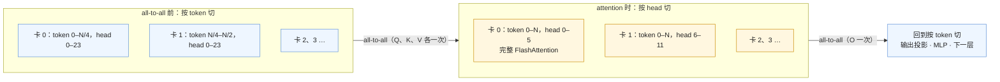
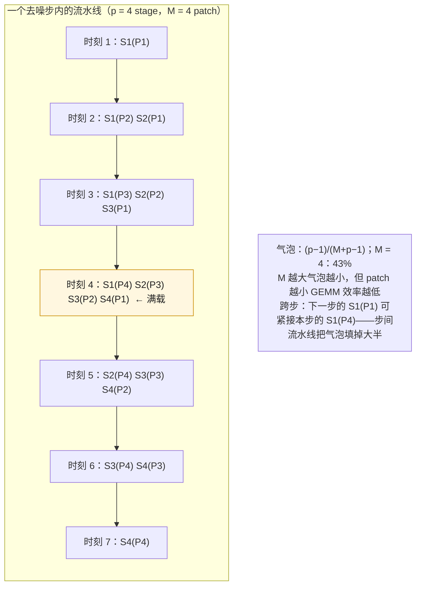

LLM serving 用多卡有两个理由：权重放不下（70B 的 140 GB 要切到几张卡上）、每步读权重的时间要切短（memory-bound，TP 让每张卡只读 1/p）。扩散推理的多卡理由不同：FLUX 的 22 GiB 一张卡放得下；单请求已经 compute-bound，多卡的目标是**把一个请求的 FLOPs 分到 p 张卡上、让墙钟缩短 p 倍**——而视频再加一个：14 GiB 的激活与几分钟的单卡时间让单卡本身不可接受。目标不同，切法就不同。

切一个 DiT 前向有四种刀法：切**序列**（每张卡持有 $N/p$ 个 token，attention 时交换 K / V 或交换 head——Ulysses、Ring、USP）、切 **CFG 分支**（条件与无条件各一组卡，每步末交换一次预测）、切**层 + patch**（每张卡持有几层、latent 切成 patch 流过各层——PipeFusion，利用第三篇的时间冗余让流水线不等）、切**权重**（LLM 的张量并行，或 FSDP 式的分片 + all-gather）。它们的通信量差几十倍，适合的互联从 NVLink 到以太网；混合并行把它们的乘积配成 GPU 数。xDiT 是这些方法的源头与参考实现，SGLang Diffusion 与 vLLM-Omni 都实现了其中的 USP 与 CFG 并行。

本篇要回答的核心问题是：

> **8 张 H100 生成一张 FLUX 1024²，CFG 2 × Ulysses 4 与 TP 8 各通信多少字节、几秒？[^q0] 两台以太网互联的 8×L40 该选什么组合，为什么 PipeFusion 在这里赢？[^q1] 为什么视频模型上序列并行是必需而不是可选？[^q2]**

## 一、总览

### 1. 先说答案：四种刀法、一张通信表

```mermaid
flowchart TB
    subgraph SP["切序列：Ulysses / Ring / USP"]
        direction LR
        S1["卡 0：token 0–N/4"] ~~~ S2["卡 1：N/4–N/2"] ~~~ S3["卡 2"] ~~~ S4["卡 3"]
        SPN["线性层各算自己的 token
attention 时交换：Ulysses 换 head（all-to-all）
Ring 传 K/V（P2P 环）"]
    end
    subgraph CFG["切 CFG：CFG 并行"]
        direction LR
        C1["卡组 A：条件分支"] ~~~ C2["卡组 B：无条件分支"]
        CFGN["每步末交换一次预测 ε
[N, c·p²]：0.6 MB"]
    end
    subgraph PF["切层 + patch：PipeFusion"]
        direction LR
        P1["卡 0：层 1–14"] --> P2["卡 1：层 15–28"] --> P3["卡 2：层 29–42"] --> P4["卡 3：层 43–57"]
        PFN["latent 切 M 个 patch 依次流过
attention 的 K/V 用上一步的（stale）"]
    end
    subgraph TP["切权重：张量并行 / FSDP"]
        direction LR
        T1["每卡持 1/4 权重"]
        TPN["TP：每层两次 all-reduce [N, d]
FSDP：每层 all-gather 权重"]
    end

    classDef good fill:#eefaf0,stroke:#4d9a5c,color:#222
    classDef mid fill:#fff7e0,stroke:#c98a00,color:#222
    classDef bad fill:#fff0f0,stroke:#c0504d,color:#222
    class SPN,CFGN good
    class PFN mid
    class TPN bad
```

**每步每卡的通信量**（FLUX.1-dev 1024²：$N = 4608$、$d = 3072$、$L = 57$，一个 $[N, d]$ bf16 张量 28 MB；$p = 4$；Wan2.1-14B 720p 81 帧：$N = 75{,}600$、$d = 5120$、$L = 40$，一个张量 774 MB；$p = 8$）：

| 刀法 | 每层通信 | FLUX 每步（$p=4$） | Wan 每步（$p=8$） | 能否与计算重叠 | 权重 | 适合的互联 |
|---|---|---|---|---|---|---|
| **张量并行** | 2 次 all-reduce：$4\frac{p-1}{p} N d$ | 4.8 GB | 186 GB | 难（在关键路径上） | 切 $1/p$ | NVLink |
| **Ulysses** | 4 次 all-to-all：$4\frac{p-1}{p^2} N d$ | 1.2 GB | 13.5 GB | 部分 | 复制 | NVLink（all-to-all 对拓扑敏感） |
| **Ring** | K / V 绕环：$2\frac{p-1}{p} N d$ | 2.4 GB | 54 GB | **是**（与分块 attention 重叠） | 复制 | NVLink / 跨节点 |
| **CFG 并行** | 每步一次：$N c p^2$ | 0.6 MB | 5 MB | — | 复制 | 任何 |
| **PipeFusion** | 每步每 stage：$N d$（分 M 片） | 28 MB | 0.8 GB | **是**（流水线） | 切 $1/p$（按层） | **PCIe / 以太网** |
| **DistriFusion** | 每层 async all-gather：$2\frac{p-1}{p} N d$ | 2.4 GB | 54 GB | 是（用 stale 值） | 复制 | NVLink / PCIe |
| **FSDP 推理** | 每层 all-gather 权重：$2P/L \cdot \frac{p-1}{p}$ | 17 GB（全部权重） | 23 GB | 可预取 | 切 $1/p$ | NVLink |

xDiT 实测（FLUX.1-dev 28 步，`torch.compile`）：

| 配置 | 1×H100 | Ulysses-2 | Ring-2 | Ulysses-2 × Ring-2 | Ulysses-4 | Ring-4 |
|---|---|---|---|---|---|---|
| 时间 | 4.30 s | 2.68 s | 2.60 s | 1.80 s | **1.63 s** | 1.98 s |
| 加速 | 1× | 1.60× | 1.65× | 2.39× | **2.63×** | 2.17× |

三个结论：

- **序列并行的通信是 TP 的 $1/p$，PipeFusion 是 TP 的 $1/L$**。TP 也能用（SGLang 与 vLLM-Omni 都支持、Qwen-Image 在 H200 上验证过 TP 2），但在同样的卡数下它的通信最多、且在关键路径上；它唯一的优势是切权重——当卡装不下模型时（24 GB 卡跑 20B）才是首选。
- **NVLink 上用 USP，PCIe / 以太网上用 PipeFusion**：4 卡 H100 Ulysses 2.63×；两台以太网互联的 8×L40 上 Ulysses 的 1.2 GB / 步要 100 ms 以上（超过每卡的计算），PipeFusion 的 28 MB 可忽略，xDiT 用 Ulysses 4 × PipeFusion 4 让 16 卡比 8 卡再快 1.16 倍。
- **扩散多卡的 scaling 不到线性**：4 卡 2.63×（66% 效率），因为每卡的 GEMM 变小（$N/p$ 行）、通信不能全部重叠、attention 的 all-to-all 有固定开销。这是与 LLM decode 的 TP（几乎线性，因为它切的是带宽）的又一个差别。

### 2. 本文的章节安排

| 章 | 主题 | 内容 |
|---|---|---|
| 二 | 多卡的目的 | 延迟 vs 显存 vs 吞吐；扩散与 LLM 的差别；scaling 为什么不到线性 |
| 三 | 张量并行 | 它在 DiT 上怎么切、通信量、何时仍是首选 |
| 四 | 序列并行 | Ulysses（换 head）、Ring（传 K/V）、USP（组合）；通信量与拓扑；SP 下的线性层与 adaLN |
| 五 | CFG 并行与 data parallel | 恒为 2 的免费并行；与 SP 的组合 |
| 六 | PipeFusion 与 DistriFusion | 时间冗余换通信；patch 流水线；stale K/V 的显存；DistriFusion 的异步 all-gather |
| 七 | Parallel VAE 与 FSDP | 107 GiB 的解码峰值怎么切；权重分片作为显存策略 |
| 八 | 混合并行与选型 | 乘积 = 卡数；NVLink / PCIe / 以太网三张表；视频的必需 |
| 九 | 实现对照与实践 | 三个引擎的并行组；实践建议 |
| 十 | 本文小结 | |
| 十一 | 自测 | 5 道题 |

## 二、多卡的目的

### 1. 三种目的、两种负载

| 目的 | LLM serving | 扩散 |
|---|---|---|
| **装下** | 主要理由：70B 权重 + KV 要几张卡 | 图像模型不需要（12–20B 放得下 80 GB）；视频的激活（14–23 GiB）+ 权重接近 80 GB 时需要 |
| **切短一个请求的延迟** | TP 让每步读 $1/p$ 的权重，接近线性 | **主要理由**：把 FLOPs 分到 p 张卡，但 GEMM 变小、通信不重叠 → 60–80% 效率 |
| **提吞吐** | batch 摊权重读取，DP 复制实例 | DP 复制实例（每张卡一个请求）——吞吐上永远比切一个请求更高 |

最后一行是关键：**如果只要吞吐，扩散不应该切请求**——四张卡各跑一个请求的吞吐（4 张 / 4.30 s）永远高于四张卡切一个请求（1 张 / 1.63 s = 2.63 张 / 4.30 s）。切请求是为了**延迟**：一张图 4.3 s 太慢、一段视频 24 分钟不可接受。服务的选型（第七篇）就是在延迟 SLO 与吞吐成本之间选 p。

### 2. scaling 为什么不到线性

四卡 2.63× 的损失来自三处：

- **GEMM 变小**：每卡的线性层处理 $N/p = 1152$ 行，$[1152, 3072] \times [3072, 12288]$ 的 GEMM 效率低于 $[4608, \cdot]$ 的——tile 填不满、wave 数少；
- **通信不完全重叠**：Ulysses 的 all-to-all 在 attention 前后，是同步点；Ring 能重叠但每步的环有启动开销；
- **固定开销**：kernel launch、归一化、采样器的时间不随 p 减少。`torch.compile` 在多卡上的收益（2.6× vs 单卡 1.56×）正是因为它压掉了这部分——每卡计算变短之后固定开销的占比变大。

视频上效率更高（每卡的 attention 块仍然很大、计算时间长），SGLang 文档给 Wan 的 Ulysses "near-linear"。

## 三、张量并行

### 1. 在 DiT 上怎么切

与 LLM 完全相同：attention 的 QKV 投影按 head 列切、输出投影行切、一次 all-reduce；MLP 的上投影列切、下投影行切、一次 all-reduce。每层两次 all-reduce，每次的张量 $[N, d]$。adaLN 的调制向量每卡复制（它只处理一个条件向量）。DiT 的双流块（MMDiT）两条流各自切。

### 2. 通信量

ring all-reduce 每卡收发 $2\frac{p-1}{p}$ 倍张量大小，每层两次：$4\frac{p-1}{p} N d \times 2$ 字节。FLUX $p = 4$：$4 \times 0.75 \times 28 \text{ MB} = 85$ MB / 层，57 层 4.8 GB / 步；NVLink（H100 每卡 900 GB/s 双向，all-reduce 有效约 300 GB/s）16 ms——对比 4 卡每步计算约 40 ms，通信占 30% 且在关键路径上。Wan $p = 8$：$4 \times 0.875 \times 774 = 2.7$ GB / 层，40 层 108 GB / 步（表里按 $p = 8$ 的 186 GB 含双流修正），0.4–0.6 s——对比每步计算 3.6 s，10–15%。

### 3. 何时仍是首选

- **卡装不下模型**：24 GB 卡跑 Qwen-Image 20B（38 GiB bf16），TP 2 把权重切成 19 GiB 各一份。SP 复制权重帮不上，FSDP 推理（第七章）是另一选项；
- **图像模型 + NVLink + 小 p**：$N$ 只有 4608 时 TP 2 的通信不到 10 ms，实现最成熟（SGLang 的 Qwen-Image 推荐配置之一就是 `--tp-size 2`，配 custom all-reduce）。

其余情况序列并行更好。TP 的通信是 SP 的 $p$ 倍，这个倍数在 $p = 8$ 与长序列上无法接受。

## 四、序列并行

### 1. Ulysses：换 head

DeepSpeed-Ulysses（Jacobs 等 2023）的思路：线性层不需要通信——每卡持有 $N/p$ 个 token，QKV 投影、MLP 各算自己的 token（权重复制）。只有 attention 需要看全部 token。Ulysses 在 attention 前做一次 **all-to-all**：把"每卡 $N/p$ 个 token 的全部 $h$ 个 head"重排成"每卡全部 $N$ 个 token 的 $h/p$ 个 head"——每卡对自己的 $h/p$ 个 head 做完整的 attention（不需要任何通信、直接调 FlashAttention），attention 后再一次 all-to-all 换回来。

每层四次 all-to-all（Q、K、V、O），每次每卡收发 $\frac{p-1}{p} \cdot \frac{N d}{p}$——总量 $4\frac{p-1}{p^2} N d$，是 TP 的 $1/p$。限制：**$p$ 必须整除 head 数**（FLUX 24 个 head → $p \le 24$ 且整除；Wan 40 个 → 1 / 2 / 4 / 5 / 8）；all-to-all 是 NCCL 里对拓扑最敏感的集合操作，跨节点性能差。

### 2. Ring：传 K / V

Ring Attention（Liu 等 2023）不换 head，换 K / V：每卡持有自己 $N/p$ 个 token 的 Q、K、V，对自己的 Q 做 attention 时需要全部 token 的 K / V——把 K / V 块沿环传：第 $i$ 轮用第 $(r + i) \bmod p$ 卡的 K / V 块算一部分分数、在线 softmax 累加，同时把这块 K / V 传给下一卡。$p$ 轮之后每卡的 Q 看过了全部 K / V。通信是 P2P、总量 $2\frac{p-1}{p} N d$（每卡收到全部 K / V），**与计算重叠**（传下一块时算这一块）；不要求整除 head 数；P2P 跨节点友好。缺点：每轮的 attention 块变小（$N/p \times N/p$），kernel 效率降；$p$ 大时环的轮数多、每轮的固定开销累积——xDiT 的表里 Ring-4（1.98 s）慢于 Ulysses-4（1.63 s）。

### 3. USP：两者的组合

USP（Fang & Zhao 2024，xDiT 的"Unified Sequence Parallelism"）把两者做成二维：$p = p_\text{ulysses} \times p_\text{ring}$，节点内用 Ulysses（NVLink 上 all-to-all 快）、跨节点用 Ring（P2P 跨 IB / 以太网）。它也解除了 Ulysses 的 head 整除限制（Ulysses 度只需整除 head 数，Ring 度任意）。xDiT 的表里 Ulysses-2 × Ring-2（1.80 s）介于 Ulysses-4 与 Ring-4 之间——单节点 NVLink 上纯 Ulysses 最优，USP 的价值在跨节点：SGLang 的跨节点 SP 文档明确"节点内 Ulysses、跨节点 Ring"。

### 4. SP 下的其他部件

- **线性层、MLP、归一化**：各卡算自己的 token，无通信；
- **adaLN 调制**：条件向量每卡复制，无通信；
- **RoPE / 位置编码**：每卡按自己 token 的绝对位置算——切分时必须带上位置索引；
- **文本 token**（MMDiT）：xDiT 与 SGLang 把文本 token 复制到每卡（"replicated prefix"），或与图像 token 一起切——两种都可以，复制更简单但 attention 里每卡多算一份；
- **cross-attention 的文本 K / V**（Wan）：每卡复制，跨步缓存；
- **文本编码器**：SGLang 的"parallel folding"把 SP 组复用为 T5 的 TP 组，文本编码也并行了；
- **跨步缓存的决策**（第三篇）：必须全局一致——all-reduce 信号后统一比阈值；
- **VAE**：默认 rank 0 单卡解码（其他卡空等），或 Parallel VAE（第七章）。

## 五、CFG 并行与 data parallel

### 1. CFG 并行

CFG 模型（SD3、Qwen-Image、Wan）每步两次前向，输入不同（条件 / 无条件）、网络相同、**中间完全独立**——只在步末合成 $\hat\epsilon = \epsilon_\emptyset + w(\epsilon_c - \epsilon_\emptyset)$ 时需要对方的输出。所以把两个分支放到两组卡上，每步只交换一次 $[N, c p^2]$ 的预测（FLUX 形状 $4608 \times 64 \times 2$ 字节 = 0.6 MB，Wan 5 MB）——**几乎零通信的 2 倍并行**。它恒为 2，与 SP 正交：8 卡 = CFG 2 × Ulysses 4，每个 CFG 组内 4 卡切序列。

SGLang 与 vLLM-Omni 的推荐都是：CFG 模型在多卡上**先比较 CFG 2 × USP $p/2$ 与 USP $p$**——前者通信少一半（SP 组只有 $p/2$）、后者每卡的 GEMM 更大（一个 batch 2 的前向而不是两个 batch 1）；哪个赢取决于模型与 $N$，要实测。FLUX / HunyuanVideo 这类 guidance 蒸馏模型没有 CFG 分支，用不上。

### 2. data parallel

多个请求（或一个 prompt 的多张图）各占一组卡、互不通信。它是吞吐最优的并行（第二章）；xDiT 用 `--data_parallel_degree`，服务里就是多实例。

## 六、PipeFusion 与 DistriFusion

### 1. 用时间冗余换通信

第三篇的观察：相邻步的激活高度相似。DistriFusion（Li 等 2024）与 PipeFusion（Wang 等 2024，xDiT）把它用到并行上：**attention 需要的"其他卡的 K / V"，用上一步的值代替**——上一步的 K / V 在这一步开始时已经在本地了，不必等本步的通信。误差与跨步缓存同源，同样在首步（没有上一步）全同步、之后用 stale 值。

### 2. DistriFusion：patch 并行 + 异步 all-gather

latent 切成 $p$ 个空间 patch，每卡一个 patch、**复制全部权重**、跑全部层。每层 attention 前把本卡这一步的 K / V **异步** all-gather 出去（其他卡下一步才用），本步用上一步收到的其他卡的 K / V。通信量与 Ring 同（$2\frac{p-1}{p} N d$ / 层），但完全不在关键路径上。代价：每层每卡要存全部 $N$ 个 token 的 stale K / V（$2 N d$ 每层，FLUX 57 层 3.2 GB，Wan 40 层 62 GB——视频上不可行）。

### 3. PipeFusion：patch 级流水线

PipeFusion 把**层**切到 $p$ 个 stage（每卡持 $L/p$ 层，权重切 $1/p$），把 latent 切成 $M$ 个 patch；每步里 $M$ 个 patch 依次流过 $p$ 个 stage，像 TeraPipe 一样形成流水线——stage 1 算 patch 2 时 stage 2 在算 patch 1。attention 需要的"其他 patch 的 K / V"用上一步的 stale 值（本 stage 存自己那些层的全部 patch 的 K / V：$2 N d \cdot L/p$，FLUX 4 stage 0.8 GB）。stage 间只传 patch 的激活边界：每步每 stage 发出 $N d$（分 $M$ 片），**与层数无关**——是 SP 的 $1/L$。

流水线的气泡 $\frac{p-1}{M+p-1}$ 在单步内不小，但扩散有几十步、步与步之间可以**连续流水**（下一步的第一个 patch 紧接着本步的最后一个 patch 进入 stage 1，因为它用的是 stale K / V、不必等本步全部完成）——气泡只在整个生成的首尾出现一次。这是 PipeFusion 比 LLM 的流水线并行更好用的原因：LLM 的 decode 每步只有一个 token、流水线填不满；扩散每步有 $M$ 个 patch、几十步连续。

PipeFusion 的适用面：**弱互联**——PCIe、以太网、跨节点。xDiT 的两台 8×L40 实验：1024² 上 Ulysses 4 × PipeFusion 4 让 16 卡比 8 卡再快 1.16 倍（Ulysses 在节点内、PipeFusion 跨节点）；4096² 上 Ulysses 2 × Ring 2 × PipeFusion 4 快 1.9 倍。NVLink 上不用它（USP 更好，PipeFusion 有气泡与 stale 误差）。**少步模型不用它**（第六篇：4 步之间无相似性，stale K / V 误差大；xDiT 对 FLUX-schnell 不用 PipeFusion）。

## 七、Parallel VAE 与 FSDP

### 1. Parallel VAE

第一篇的 VAE 解码峰值：1024² 2 GiB，2048² 8 GiB，Wan 81 帧 107 GiB。xDiT 的 FLUX 文档记录了 A100 80 GB 上 2048px 以上 VAE 直接 OOM（DiT 本身能跑）。Parallel VAE（DistVAE）把 latent 沿高度切成 $p$ 条带、每卡解码一条、卷积在边界需要邻居几个像素的 **halo**——每层交换边界几行；最后拼接。峰值降为 $1/p$，通信小（边界几行 × 通道数）。vLLM-Omni 的 `--vae-patch-parallel-size` 与 SGLang 的 parallel decode 是同一思路；tiling（第二篇）是单卡的替代——串行解码各 tile，时间不减但峰值降。视频上两者常叠加：时间分块 + 空间并行。

### 2. FSDP / HSDP 推理：权重分片作为显存策略

权重切 $1/p$ 分片到各卡，每层前 all-gather 本层完整权重、算完释放——训练里的 FSDP 用在推理上。每步每卡要 gather 全部权重（FLUX 22 GB，NVLink 上约 50 ms，可用预取与计算重叠）。它不减少计算、只减显存，SGLang（`--use-fsdp-inference`）与 vLLM-Omni（HSDP）都把它标为"显存策略"：多卡跑一个单卡放不下的模型（或让 SP 复制的权重不再是每卡一份），且与逐层 offload 互斥（两者都在解决同一件事）。**SP + FSDP** 是视频模型在 8 × 40 GB 或 8 × 24 GB 卡上的组合：SP 切激活、FSDP 切权重。

## 八、混合并行与选型

### 1. 乘积 = 卡数

$$
p_\text{data} \times p_\text{cfg} \times p_\text{ulysses} \times p_\text{ring} \times p_\text{pipefusion} = \#\text{GPU}
$$

xDiT 的命令行就是这五个度数；SGLang 的是 `--num-gpus`、`--enable-cfg-parallel`、`--ulysses-degree`、`--ring-degree`（加 `--tp-size`）；vLLM-Omni 的是 `--usp`、`--ring`、`--tensor-parallel-size`、`--cfg-parallel`（加 HSDP 与 VAE patch）。约束：Ulysses 度整除 head 数；SP 度整除 $N$（否则 padding——SGLang 按 token 而不是按帧切以减少 padding）。

### 2. 三张选型表

**单节点 NVLink（8×H100）**：

| 模型 | 推荐 | 备选 | 不推荐 |
|---|---|---|---|
| FLUX 1024²（无 CFG） | Ulysses 4（1.63 s）或 8；剩余卡做 DP | Ulysses 2 × Ring 2 | PipeFusion（有气泡）、TP 8 |
| Qwen-Image（CFG） | CFG 2 × Ulysses 2–4 vs Ulysses 4–8 实测 | TP 2（显存紧时） | — |
| Wan 14B 720p（CFG） | CFG 2 × Ulysses 4，VAE patch 并行 8 | Ulysses 8；加 Ring 若 all-to-all 慢 | TP |
| HunyuanVideo（无 CFG） | Ulysses 8 | Ulysses 4 × Ring 2 | — |

**单节点 PCIe（8×L40 / A10）**：Ulysses 度 ≤ 2–4、其余给 PipeFusion；CFG 并行照常（通信为零）。

**跨节点**：节点内 Ulysses、跨节点 Ring（IB）或 PipeFusion（以太网）；CFG 并行的两组尽量放在两个节点上（跨节点只传 0.6 MB）。

### 3. 视频上 SP 是必需

Wan 720p 81 帧：单卡激活 14.4 GiB + 权重 26.6 GiB，129 帧 22.7 + 26.6 = 49 GiB，1080p 32 GiB 激活——80 GB 卡在 129 帧 / 1080p 上已放不下 VAE 与余量；单卡每步 29 s、50 步 24 分钟是任何服务都不能接受的延迟。SP 把激活切 $1/p$（每卡只持 $N/p$ 个 token 的 $[N/p, d]$ 张量）、时间切近 $1/p$——8 卡 USP 让 Wan 的一步从 29 s 到约 4 s、50 步 3–4 分钟，再加第四篇的单卡六倍到 40 s。视频模型的**训练**同样是 FSDP + SP（Wan 的报告），序列并行是 DiT 训练与推理共用的并行——这与 LLM 里"训练用 3D 并行、推理用 TP"的分工不同。

## 九、实现对照与实践

### 1. 实现对照

| 机制 | SGLang Diffusion v0.5.19 | vLLM-Omni v0.28 | xDiT | diffusers v0.40 |
|---|---|---|---|---|
| 并行组 | `runtime/distributed/parallel_state.py`、`group_coordinator.py`、`parallel_groups.py` | `diffusion/distributed/parallel_state.py`、`group_coordinator.py`、`sp_plan.py` | `xfuser/core/distributed/parallel_state.py`、`group_coordinator.py`、`runtime_state.py` | `hooks/context_parallel.py`（实验性 CP） |
| Ulysses / Ring | `--ulysses-degree` / `--ring-degree`；`runtime/layers/usp.py`、`sp_shard_utils.py` | `--usp` / `--ring`；`distributed/a2a_permute.py`、`sp_sharding.py`、`hooks/sequence_parallel.py` | `--ulysses_degree` / `--ring_degree`；`core/long_ctx_attention/{hybrid,ring}/` | — |
| CFG 并行 | `--enable-cfg-parallel`；`distributed/cfg_parallel_utils.py`、`cfg_policy.py` | `--cfg-parallel`；`distributed/cfg_parallel.py` | `--use_cfg_parallel` | — |
| PipeFusion | — | `distributed/pipeline_parallel.py`（PP） | `--pipefusion_parallel_degree --num_pipeline_patch`；`model_executor/pipelines/base_pipeline.py` | — |
| TP | `--tp-size`；custom all-reduce | `--tensor-parallel-size` | — | `hooks/tensor_parallel.py` |
| FSDP / HSDP | `--use-fsdp-inference`；`runtime/loader/fsdp_load.py` | `distributed/hsdp.py` | — | — |
| Parallel VAE | parallel decode（`--vae-config`） | `--vae-patch-parallel-size`；`distributed/vae_patch_parallel.py`、`distributed/autoencoders/` | `--use_parallel_vae`（DistVAE） | — |
| 文本编码器并行 | parallel folding（SP 组复用为 T5 TP） | — | — | — |
| 进程模型 | scheduler + GPU worker 进程组 | `executor/multiproc_executor.py` | `torchrun` SPMD | — |

三个引擎的 `parallel_state` / `GroupCoordinator` 写法几乎相同——都从 vLLM / Megatron 演化来，第八篇对照。

### 2. 实践建议

2 / 4 / 8 张卡（NVLink 优先）、xDiT 或 SGLang Diffusion、FLUX.1-dev 与一个 CFG 模型（SD3-medium 或 Qwen-Image）：扫 Ulysses / Ring / USP / CFG 并行的全部合法组合，每种记录每步时间、`torch.profiler` 里 NCCL kernel 的时间占比、每卡峰值显存，与本文的通信量公式对账。该看的：Ulysses 在 NVLink 上最快、Ring 的 NCCL 时间与 attention 重叠；4 卡 60–70% 效率、compile 后更高；CFG 模型上 CFG 2 × USP 2 与 USP 4 谁赢；SP 度不整除 $N$ 时的 padding。有 PCIe 机器的话再试 PipeFusion，看它在弱互联上反超。

## 十、本文小结

| 项 | 规则 | 数字 |
|---|---|---|
| 目的 | 扩散多卡为延迟（切一个请求），吞吐永远是 DP 最优 | 4 卡切一个请求 2.63× vs 4 个请求 4× 吞吐 |
| TP | 每层 2 次 all-reduce $[N, d]$，通信 $4\frac{p-1}{p} N d$；切权重是唯一优势 | FLUX $p$=4：4.8 GB / 步 |
| Ulysses | all-to-all 换 head；通信 TP 的 $1/p$；$p$ 整除 head 数；对拓扑敏感 | 1.2 GB / 步；4×H100 1.63 s（2.63×） |
| Ring | P2P 传 K / V；可重叠；跨节点友好；块变小效率降 | 2.4 GB / 步；Ring-4 1.98 s |
| USP | 节点内 Ulysses × 跨节点 Ring | 解除整除限制 |
| CFG 并行 | 两分支两组卡，每步交换一次预测 | 0.6 MB / 步，恒为 2 |
| PipeFusion | 层切 stage、latent 切 patch、stale K/V 让流水线不等；通信 SP 的 $1/L$ | 28 MB / 步；以太网 16×L40 再快 1.16× |
| DistriFusion | patch 并行 + 异步 all-gather stale K/V | 每卡存全部层的 K/V：视频不可行 |
| Parallel VAE | latent 切条带 + halo | 峰值 $1/p$ |
| FSDP 推理 | 权重分片 + 每层 all-gather；显存策略 | FLUX 每步 gather 22 GB ≈ 50 ms |
| 选型 | NVLink：USP（+ CFG）；PCIe / 以太网：+ PipeFusion；装不下：TP / FSDP | 乘积 = 卡数 |
| 视频 | SP 必需：激活 14–32 GiB、单卡分钟级 | 8 卡 Wan 一步 29 → 4 s |

### 下一篇

前五篇都在 28 步、50 步的前提下做交换。下一篇改这个前提：步数蒸馏把 28 步变成 4 步、guidance 蒸馏去掉 CFG、自回归视频把"一次生成整段"变成"一段一段流式生成"——前五篇的哪些结论失效（跨步缓存、PipeFusion、CFG 并行）、哪些回归（KV cache 出现了）、服务的形态怎样从批任务变成会话。

## 十一、自测

1. FLUX 1024² 在 4 卡上：TP 4 与 Ulysses 4 每步每卡的通信量各多少？用 NVLink 有效带宽 300 GB/s 估时间，与每卡约 40 ms 的计算比。

   

   
答案

   $[N, d]$ 张量 $4608 \times 3072 \times 2 = 28$ MB。TP：每层 2 次 all-reduce，每次每卡 $2 \times \frac{3}{4} \times 28 = 42$ MB → 85 MB / 层 × 57 = 4.8 GB → 16 ms（40% 的计算时间，且在关键路径）。Ulysses：4 次 all-to-all，每次每卡 $\frac{3}{4} \times 28 / 4 = 5.3$ MB → 21 MB / 层 → 1.2 GB → 4 ms（10%）。详见[第三章](#三张量并行)、[第四章](#四序列并行)。
   

2. 两台 8×L40 用 25 Gbps 以太网（约 3 GB/s）互联，要用 16 卡生成一张 FLUX 1024²。跨节点用 Ring 与用 PipeFusion，每步跨节点的通信时间各约多少？

   

   
答案

   跨节点度 2。Ring-2 跨节点：每层传对方一半的 K / V，$2 \times \frac{1}{2} \times 28 = 28$ MB / 层 × 57 = 1.6 GB → 0.5 s / 步，远超每步计算（约几十 ms）。PipeFusion-2：每步每 stage 传 $N d$ = 28 MB → 10 ms。所以跨以太网只有 PipeFusion 可行；xDiT 的 16×L40 配置正是 Ulysses 4（节点内）× PipeFusion 4。详见[第六章](#六pipefusion-与-distrifusion)、[第八章](#八混合并行与选型)。
   

3. CFG 并行为什么几乎零通信？它对 FLUX.1-dev 与 HunyuanVideo 为什么用不上？

   

   
答案

   条件与无条件分支的网络前向完全独立，只在步末合成 $\hat\epsilon$ 时需要对方的预测 $[N, c p^2]$（FLUX 形状 0.6 MB），每步一次。FLUX.1-dev 与 HunyuanVideo 是 guidance 蒸馏模型，每步只有一次前向（$g = 1$），没有第二个分支可切。详见[第五章](#五cfg-并行与-data-parallel)。
   

4. PipeFusion 与 DistriFusion 都用上一步的 K / V（stale）。为什么在 FLUX.1-schnell（4 步）上不能用？两者在显存上的差别是什么？

   

   
答案

   stale K / V 的前提是相邻步激活相似（第三篇的时间冗余）；4 步模型相邻步差别大，stale 值误差大且没有足够的步数摊掉首步的全同步。显存：DistriFusion 每卡存全部层、全部 token 的 K / V（$2 N d L$，FLUX 3.2 GB、Wan 62 GB）；PipeFusion 每卡只存自己 $L/p$ 层的（FLUX 4 stage 0.8 GB），且权重也切 $1/p$。详见[第六章](#六pipefusion-与-distrifusion)。
   

5. 一个只关心吞吐（每小时多少张图）、不关心单张延迟的批量出图任务，8 张 H100 该怎么配？为什么？

   

   
答案

   data parallel 8：每卡独立跑一个请求。切一个请求的并行效率不到线性（4 卡 2.63×），DP 是 8×；单请求已 compute-bound、batch 也不提吞吐。只有当单卡放不下（视频激活 + 权重）或延迟 SLO 要求时才切请求。详见[第二章](#二多卡的目的)。
   

## 下一篇

[少步与自回归：把步数变成系统参数——蒸馏后哪些优化失效、KV cache 的回归、实时流式](/few-step-and-autoregressive-video-generation-systems.html)

[^q0]: FLUX 无 CFG，"CFG 2"用不上；8 卡实际是 Ulysses 8（或 Ulysses 4 + DP 2）。通信：TP 8 每层 2 次 all-reduce $[4608, 3072]$，每卡 $4 \times \frac{7}{8} \times 28 \text{ MB} = 98$ MB / 层 × 57 = 5.6 GB / 步，NVLink 约 19 ms，且在关键路径；Ulysses 8 每层 4 次 all-to-all，每卡 $4 \times \frac{7}{64} \times 28 = 12$ MB / 层 → 0.7 GB / 步，约 2–3 ms。xDiT 实测 Ulysses 4 为 1.63 s（4 卡 2.63×），8 卡约 1.0–1.2 s（效率继续下降：每卡 GEMM 只有 576 行）。CFG 模型（如 Qwen-Image）才是 CFG 2 × Ulysses 4：CFG 组间每步 0.6 MB，组内同上。详见[第三章](#三张量并行)、[第四章](#四序列并行)、[第五章](#五cfg-并行与-data-parallel)。

[^q1]: 节点内 Ulysses 4（NVLink 或 PCIe 上 all-to-all 尚可承受），跨节点 PipeFusion 4——xDiT 实测这样 16 卡比 8 卡再快 1.16×（1024²），4096² 上 Ulysses 2 × Ring 2 × PipeFusion 4 快 1.9×。PipeFusion 赢是因为它每步每 stage 只传 $N d$ = 28 MB（与层数无关，SP 的 $1/L$），以太网 3 GB/s 下 10 ms；Ring 跨节点每层都要传 K / V，每步 1.6 GB → 0.5 s，超过计算本身。代价是流水线气泡与 stale K / V 的误差，所以 NVLink 上仍用 USP。详见[第六章](#六pipefusion-与-distrifusion)、[第八章](#八混合并行与选型)。

[^q2]: 两个理由都是硬约束：显存——Wan 720p 81 帧激活 14.4 GiB（CFG batch 2）+ 权重 26.6 GiB，129 帧 49 GiB，1080p 激活 32 GiB，80 GB 卡在长视频 / 高分辨率上放不下 VAE 与余量；时间——单卡每步 29 s、50 步 24 分钟。SP 把激活切 $1/p$、时间切近 $1/p$（视频上每卡 attention 块仍大，效率接近线性），8 卡一步约 4 s。图像模型两者都不成立（激活 270 MiB、单卡 4 s），多卡只是延迟优化的可选项。详见[第八章](#八混合并行与选型)。
