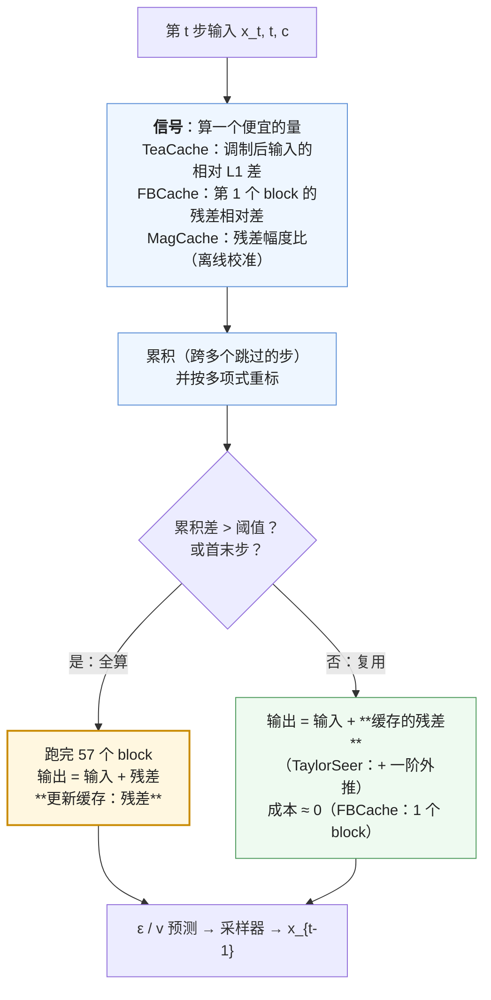
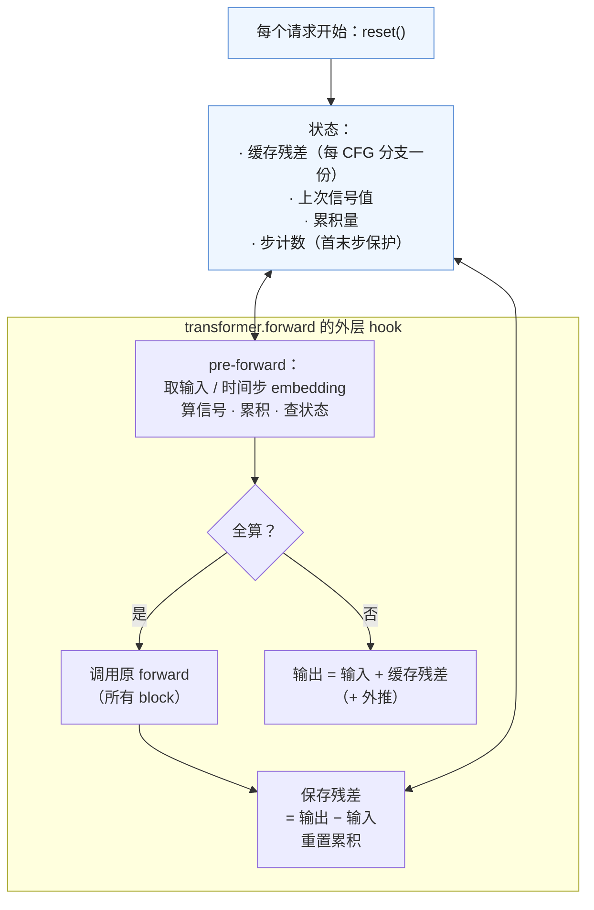

第一篇的账里有一个乘数 $T$——28 步、50 步——每一步都是对整张 latent 的一次完整前向。第二篇把每步的 $\eta$ 推高；这一篇问的是：**这 28 步真的都要算吗？** 扩散采样沿一条平滑的轨迹走，相邻两步网络的输出常常只差百分之几；如果能在算之前就知道"这一步的输出和上一步差不多"，就可以直接拿上一步的结果，把一步的 74 TFLOPs 变成几乎为零。这是扩散推理特有的第一类冗余——**时间冗余**（temporal redundancy，这里的"时间"指去噪步而不是视频帧），LLM decode 里没有对应物：每个新 token 都是新的，没有"和上一步差不多"可言。

从 2023 年的 DeepCache 到 2025 年的 Cache-DiT，这一族方法的结构完全相同：**一个便宜的信号预测这一步的输出变化有多大，一个阈值决定算还是复用，一份缓存保存上一次全算的结果**。它们的差别在信号是什么、缓存的是哪一层、复用是原样还是外推。本文把这一族放在同一张账上看：命中率怎样变成加速比、质量代价怎样度量、它与 CFG / 序列并行 / 少步蒸馏各怎样交互。

本篇要回答的核心问题是：

> **FLUX 28 步，TeaCache 阈值取 0.4：命中多少步、端到端加速多少？[^q0] 对原图的 PSNR 掉到多少、哪些地方先坏？[^q1] 同样的方法为什么在 FLUX.1-schnell 的 4 步上一步都省不下来？[^q2]**

## 一、总览

### 1. 先说答案：一个决策、一份缓存



FLUX.1-dev 1024² 28 步，H100（第二篇 compile 后基线 154 ms / 步）：

| 方法 | 参数 | 全算步数 | 命中步数 | 每命中步成本 | 端到端 | 加速 | 对基线 PSNR |
|---|---|---|---|---|---|---|---|
| 无 | — | 28 | 0 | — | 4.30 s | 1× | — |
| TeaCache | 阈值 0.25 | ~19 | ~9 | ~0 | ~2.9 s | ~1.5× | ~33 dB |
| TeaCache | 阈值 **0.4** | **~16** | **~12** | ~0 | **~2.4 s** | **~1.8×** | **~30 dB** |
| TeaCache | 阈值 0.6 | ~14 | ~14 | ~0 | ~2.15 s | ~2.0× | ~27 dB |
| FBCache | 阈值 0.08 | ~17 | ~11 | 1/57 步 | ~2.65 s | ~1.6× | ~31 dB |
| Cache-DiT DBCache | $F_n = 1, B_n = 0$，阈值 0.24 | ~16 | ~12 | 1/57 步 | ~2.45 s | ~1.75× | ~30 dB |
| Cache-DiT + TaylorSeer | 同上 + 一阶外推 | ~14 | ~14 | 1/57 步 + 外推 | ~2.2 s | ~2.0× | ~30 dB |

（加速比与阈值来自 TeaCache 仓库对 FLUX 的推荐档位——0.25 / 0.4 / 0.6 对应约 1.5 / 1.8 / 2.0×——与 diffusers / vLLM-Omni 文档给出的 1.5–2× 区间；PSNR 是这一族在 FLUX 上的典型值，具体数字随 prompt 与 seed 变。）

三个结论：

- **这一族的收益上限是 2× 左右**，因为：首末几步必须全算（构图与细节的决定期，变化大）；连续跳太多步误差累积；加速比 $= T / T_\text{full}$，从 28 步跳到 14 步就是 2×，再往下质量掉得快。视频模型上可以更高（TeaCache 在 Open-Sora-Plan 上 4.4×），因为视频的步与步更相似、步数更多（50–100）。
- **它是有损的、可调的、与"步数"这个乘数直接相关**：它实际上是一种自适应的"少步采样"——在变化小的区段自动减少步数。所以它与步数蒸馏（第六篇）**互斥**：4 步模型的每一步都在变化大的区段，没有步可跳。
- **实现全是 hook**：不改模型代码，在 transformer 的 forward 外面包一层，拦截输入、算信号、决定走哪条路。三个引擎与 diffusers 的实现都是这个形态，差别只在 hook 挂在哪一层、状态怎么管。

### 2. 本文的章节安排

| 章 | 主题 | 内容 |
|---|---|---|
| 二 | 为什么相邻步相似 | 轨迹的平滑性；变化率随 $t$ 的分布；哪些步不能跳 |
| 三 | 谱系 | DeepCache → FORA / Δ-DiT → TeaCache → FBCache → Cache-DiT（DBCache + TaylorSeer）→ MagCache → AdaCache；信号、缓存、复用方式的对照 |
| 四 | 三种信号 | 输入差（TeaCache）、首块残差差（FBCache）、离线校准的幅度比（MagCache）；多项式重标与累积 |
| 五 | 命中率 → 加速比 | 账：$T_\text{full} + T_\text{hit}\,\epsilon$；阈值扫描曲线的形状；上限 |
| 六 | 质量代价 | 度量；伪影的形态；首末步保护；阈值怎么定 |
| 七 | 交互 | CFG 的两份状态；序列并行下的一致决策；与 layerwise offload；与少步蒸馏互斥；与 CFG gating 的关系 |
| 八 | 实现 | hook 的结构；状态管理；四个实现的对照 |
| 九 | 本文小结 | |
| 十 | 自测 | 5 道题 |

## 二、为什么相邻步相似

### 1. 轨迹是平滑的

扩散采样（无论 DDPM 的随机版还是 DDIM / flow matching 的确定性版）在做的事是沿一条从噪声到数据的轨迹**数值积分**：每步网络给出当前位置的"方向"（$\epsilon$ 或速度 $v$），采样器沿它走一小段。轨迹越平滑，相邻两步的方向越接近。rectified flow（SD3 / FLUX / Wan 用的训练目标）把轨迹训练得尽量直——它们的相邻步输出比 DDPM 时代的 U-Net 更相似，跨步缓存的收益也更大。

用数字说：FLUX 28 步里，相邻步网络输出（残差）的相对 L1 差 $\frac{\lVert r_t - r_{t-1} \rVert_1}{\lVert r_{t-1} \rVert_1}$ 在中段常在 5–10%，开头几步与结尾几步到 20–40%。

### 2. 变化率随 $t$ 不均匀

```text
相对变化                    FLUX 28 步的典型形状（示意）
  40% ┤ █
      │ █ █
  20% ┤ █ █ █                                         █ █
      │ █ █ █ █                                     █ █ █
  10% ┤ █ █ █ █ █ ▄ ▄                             ▄ █ █ █
      │ █ █ █ █ █ █ █ ▄ ▄ ▄ ▄ ▄ ▄ ▄ ▄ ▄ ▄ ▄ ▄ ▄ ▄ █ █ █ █
   0% └─┴─┴─┴─┴─┴─┴─┴─┴─┴─┴─┴─┴─┴─┴─┴─┴─┴─┴─┴─┴─┴─┴─┴─┴─┴─┴─┴─
      1                 步 t                             28
      ← 决定构图：不能跳 →  ← 平缓：可跳 →      ← 决定细节：少跳 →
```

- **开头**（高噪声）：网络在决定"画什么、放哪"，每一步都大幅改变 latent 的低频结构——跳一步就换了构图；
- **中段**：结构定了，网络在逐步细化，相邻步的输出高度相关——这是缓存的收益区；
- **结尾**（低噪声）：在补高频细节，变化又变大——跳步的代价是纹理与文字的模糊。

所以所有方法都**强制首末步全算**，并且自适应方法（TeaCache、FBCache）的命中天然集中在中段——它们比均匀跳步（每两步跳一步）在同样命中数下质量更好，这是 TeaCache 论文的核心论点。

### 3. 视频更相似

视频模型的步与步更相似（TeaCache 在视频模型上到 2–4.4×，图像上 1.5–2×），原因是视频的 latent 里大部分 token 是"背景"——跨帧几乎不变、跨步也几乎不变；而且视频模型常用 50–100 步，中段更长。这也是 TeaCache 最初是为视频提出的原因。

## 三、谱系

| 方法 | 年 | 缓存什么 | 信号 | 跳过什么 | 复用方式 | 训练 |
|---|---|---|---|---|---|---|
| **DeepCache** | 2023 | U-Net 跳连上的高层特征 | 均匀间隔（每 $N$ 步全算一次） | 深层 block | 原样复用 | 无 |
| **FORA / Δ-DiT** | 2024 | DiT 的 attention / MLP 输出 | 均匀间隔 | 中间 block | 原样 | 无 |
| **TeaCache** | 2024.11 | 整个 transformer 的残差（输出 − 输入） | **调制后输入**的相对 L1 差，多项式重标、累积 | 整个 transformer | 原样 | 无（需离线拟合多项式系数，每模型一组） |
| **First-Block Cache** | 2025 | 从第 2 个 block 到最后的残差 | **第 1 个 block 的残差**相对差 | 第 2–57 block | 原样 | 无 |
| **Cache-DiT DBCache** | 2025 | 前 $F_n$ 个 block 之后的残差 | 前 $F_n$ 个 block 的残差差 | 第 $F_n$+1 到 $L - B_n$ 个 block（$B_n$ 个尾块仍算） | 原样 | 无 |
| **TaylorSeer** | 2025 | 残差及其对 $t$ 的差分（一阶 / 二阶） | 同 DBCache 或固定间隔 | 同 | **泰勒外推**：$r_t \approx r_{t_0} + (t - t_0) \dot r_{t_0}$ | 无 |
| **MagCache** | 2025 | 残差 | 残差**幅度比**随 $t$ 的曲线（离线校准一次，与 prompt 无关） | 整个 | 原样 | 无（离线校准） |
| **AdaCache** | 2024 | 逐层的残差 | 逐层的变化率 | 每层独立决定 | 原样 | 无 |
| **PAB**（Pyramid Attention Broadcast） | 2024 | attention 输出（按空间 / 时间 / 交叉三类） | 固定的广播间隔（三类不同） | attention 子层 | 原样 | 无 |

四个演化方向：

1. **信号从"固定间隔"到"自适应"**：均匀跳步在开头结尾也跳，质量差；TeaCache 之后都用一个与输出变化相关的信号决定。
2. **信号从"要算一部分才知道"到"算之前就知道"**：FBCache 要算完第一个 block 才能决定（成本 1/57 步）；TeaCache 只看输入与时间步 embedding（成本 ≈ 0）；MagCache 干脆离线校准好曲线（成本 0、与 prompt 无关，但不自适应）。
3. **复用从"原样"到"外推"**：原样复用把 $r_t$ 当成 $r_{t_0}$，误差 $\propto (t - t_0)$；TaylorSeer 用有限差分估计 $\dot r$ 做一阶外推，误差 $\propto (t - t_0)^2$，同样阈值下可以跳更多步——代价是多存一份差分、多一次逐元素运算。
4. **粒度从"整个网络"到"部分 block"**：FBCache / DBCache 保留头 $F_n$ 个（作为信号）与尾 $B_n$ 个 block 全算，中间跳过——尾块全算能修正一部分复用误差，用 $B_n / L$ 的成本换质量。

## 四、三种信号

### 1. TeaCache：调制后的输入

TeaCache（Liu 等 2024，"Timestep Embedding Tells"）的观察：网络**输出**的跨步差不能事先知道，但网络**输入**的跨步差可以——而两者强相关。直接用 $x_t$ 的差不够准（$x_t$ 的变化在高噪声与低噪声区含义不同），TeaCache 用**经时间步 embedding 调制后的输入**：第一个 block 的 adaLN 把 $x_t$ 归一化后乘上从 $t$ 算出的 scale、加 shift——这一步把"这一时刻网络实际看到的东西"算出来了，它的跨步相对 L1 差与输出的差几乎线性相关。再用一个**四次多项式**把输入差映射到估计的输出差（系数按模型离线拟合，FLUX 的一组是 $[498.7, -283.8, 55.9, -3.82, 0.264]$，vLLM-Omni 与 diffusers 都内置了几个模型的系数），跨跳过的步**累积**，累积值超过阈值才全算并清零。

$$
\delta_t = \frac{\lVert \text{mod}(x_t, t) - \text{mod}(x_{t+1}, t+1) \rVert_1}{\lVert \text{mod}(x_{t+1}, t+1) \rVert_1}, \qquad
\text{acc} \mathrel{+}= \text{poly}(\delta_t), \qquad
\text{全算} \iff \text{acc} > \tau \ \text{或首末步}
$$

阈值 $\tau$ 是用户唯一要调的量：FLUX 推荐 0.25 / 0.4 / 0.6 对应约 1.5 / 1.8 / 2.0×，HunyuanVideo 0.1 / 0.15 对应 1.6 / 2.1×——不同模型的尺度不同，因为多项式是按模型拟合的。

### 2. FBCache / DBCache：先算一点

First-Block Cache 的信号更直接：**算完第一个 block，看它的残差与上一次全算时的第一块残差差多少**：

$$
\text{diff} = \frac{\text{mean}\lvert r^{(1)}_t - r^{(1)}_{\text{cached}} \rvert}{\text{mean}\lvert r^{(1)}_{\text{cached}} \rvert}, \qquad \text{全算} \iff \text{diff} > \tau
$$

diffusers `FirstBlockCacheConfig` 的默认阈值 0.05（保守），社区常用 0.08–0.12（1.6–2×）。它不需要每模型拟合系数（第一块的残差已经是"网络怎么看这一步"的直接度量），代价是每步至少算一个 block（1/57 ≈ 2%）。Cache-DiT 的 DBCache 把"1 个头块"推广成 $F_n$ 个头块加 $B_n$ 个尾块（默认 $F_n = 1, B_n = 0$，阈值 0.24——注意它的 diff 定义与 FBCache 不同，尺度不可直接比），并可叠加 TaylorSeer 外推。

### 3. MagCache：离线校准

MagCache 观察到残差的**幅度比** $\lVert r_t \rVert / \lVert r_{t-1} \rVert$ 随 $t$ 的曲线在不同 prompt 之间几乎相同——它是模型与采样调度的性质，不是输入的性质。所以可以离线跑几十个 prompt 把曲线校准一次，推理时按曲线与累积误差预算决定跳哪些步，完全不需要在线算信号。它的优点是零开销、决策可预知（服务侧可以提前知道这个请求会全算几步——第七篇的调度用得上）；缺点是不自适应，对离分布的 prompt 可能跳错。

### 4. 对照

| | 信号成本 | 需要离线拟合 | 自适应 | 决策可预知 |
|---|---|---|---|---|
| TeaCache | ≈ 0（一次归一化 + L1） | 多项式系数（每模型） | 是 | 否 |
| FBCache / DBCache | $F_n / L$ 步 | 无 | 是 | 否 |
| MagCache | 0 | 幅度曲线（每模型 × 调度） | 否 | **是** |
| 均匀跳步 | 0 | 无 | 否 | 是 |

## 五、命中率 → 加速比

### 1. 账

把第一篇的 $\text{FLOPs}_\text{DiT} = g T \,\text{FLOPs}_\text{fwd}$ 改成：

$$
\text{FLOPs}_\text{DiT} = g \left( T_\text{full} + T_\text{hit} \cdot \epsilon \right) \text{FLOPs}_\text{fwd}, \qquad T_\text{full} + T_\text{hit} = T
$$

$\epsilon$ 是命中步的相对成本：TeaCache / MagCache 约 0（一次逐元素加法）；FBCache $1/L$；DBCache $(F_n + B_n)/L$；TaylorSeer 再加一次逐元素外推。加速比：

$$
\text{speedup} = \frac{T}{T_\text{full} + T_\text{hit}\,\epsilon} \approx \frac{T}{T_\text{full}} \quad (\epsilon \to 0)
$$

FLUX 28 步命中 12 步：$28 / 16 = 1.75\times$；命中 14 步：2×。**要 3× 就要跳掉三分之二的步**——28 步里只全算 9 步，其中首末各 2–3 步是强制的，中段只剩 4–5 个全算点撑起 20 多步，质量通常撑不住。视频的 50 步里跳 35 步（3.3×）却常常可以，因为中段长且相似。

### 2. 阈值扫描曲线的形状

```text
加速比                                         PSNR (dB)
 2.5 ┤                              ●            ┤ 40
     │                        ●                  │   ●
 2.0 ┤                   ●                       ┤ 35   ●
     │              ●                            │        ●
 1.5 ┤         ●                                 ┤ 30        ●
     │    ●                                      │              ●
 1.0 ┤●                                          ┤ 25               ●
     └──┬────┬────┬────┬────┬────┬──  τ          └──┬────┬────┬────┬────┬────┬──  τ
       0.1  0.2  0.3  0.4  0.5  0.6                0.1  0.2  0.3  0.4  0.5  0.6
      加速比对 τ 先快后饱和（首末步是硬底）        质量对 τ 先平后陡（累积误差超过去噪能吸收的量）
```

两条曲线的交叉区（FLUX 约 0.3–0.4）是实用的工作点。这条曲线要**按模型、按分辨率、按步数**各测一次——同一个 $\tau$ 在 50 步下命中更多、在 20 步下命中更少。

### 3. 它与"少步采样"的关系

跨步缓存本质上是**自适应的少步采样**：命中的步没有得到新的网络评估，等价于用更大的步长走过这一段。所以：

- 它与高阶采样器（DPM-Solver++ 已经把 50 步压到 20 步）**部分重叠**——采样器已经把"可跳的中段"压掉了一部分，20 步上的缓存收益低于 50 步上的；
- 它与步数蒸馏（第六篇）**互斥**：4 步模型的每步都在轨迹的转折点上，相邻步的输出差 50% 以上，任何阈值都不会命中——TeaCache 在 FLUX.1-schnell 上要么不跳（无加速）、要么跳了就坏；
- 它的 2× 上限，本质上是"28 步的模型里有大约 14 步是采样器的保守余量"。

## 六、质量代价

### 1. 度量

与第二篇的量化相同：对**同 seed 基线图**的 PSNR / SSIM / LPIPS 度量"变了多少"，ImageReward / GenEval / VBench 度量"整体好不好"。这一族的典型数字：TeaCache 阈值 0.4 在 FLUX 上 PSNR 约 30 dB、LPIPS 约 0.1；VBench 在视频上掉 0.07%（TeaCache 论文，Open-Sora-Plan 4.4× 时）。**FID 在这里几乎无用**：跳步改变的是单张图的细节与颜色，不是分布。

### 2. 伪影的形态

| 伪影 | 原因 | 对策 |
|---|---|---|
| 细纹理模糊、文字笔画粘连 | 结尾步被跳过，高频细节没补完 | 保护末尾更多步（`B_n` 尾块全算；末 3 步强制） |
| 颜色 / 亮度整体偏移 | 中段连续跳太多步，残差外推的偏差累积 | 降低阈值；TaylorSeer 外推代替原样复用 |
| 构图与基线不同 | 开头步被跳过（阈值太高、或首步保护不够） | 首 2–3 步强制全算 |
| 视频闪烁 | 相邻帧的跳步决策不同（逐帧独立缓存时） | 整段视频用同一决策（视频模型天然如此：整个 latent 一起决策） |
| CFG 下颜色饱和 | 条件 / 无条件分支的缓存状态混用 | 两份独立状态（第七章） |

### 3. 阈值怎么定

服务侧的做法：对每个模型 × 分辩率 × 步数，离线用一个几十条 prompt 的固定集扫阈值，记录（加速比，PSNR 分布的 p10，人工 A/B 通过率），选质量预算内的最大阈值，作为该配置的默认；允许用户按请求关闭（SGLang 的 `--enable-cache-dit` 与 `--cache-dit-params` 是采样参数、可按请求传）。第九篇给出完整流程。

## 七、交互

### 1. CFG：两份状态

CFG 每步两次前向（或 batch 2），条件分支与无条件分支的残差不同、变化率也不同。缓存状态必须**分两份**：条件用条件的缓存与累积量，无条件用无条件的。混用会让一支复用另一支的残差，图片饱和或发灰。所有实现都用一个"上下文键"区分（diffusers 的 `StateManager` 按 CFG 分支切换状态；vLLM-Omni 的 TeaCache hook 明确"CFG-aware state management"）。跳步决策两支各自做——通常两支会在相近的步命中，但不保证。

### 2. 序列并行：决策必须一致

多卡序列并行（第五篇）时每张卡只持有 $N / \text{sp}$ 个 token，各卡算出的信号（L1 差）不同。如果各卡各自决策，一张卡全算、另一张卡复用，attention 的 all-to-all 就会把不一致的中间状态拼在一起——结果错、或直接 hang（一张卡在等对方参与集合通信，对方走了复用路径没有发起）。所以决策必须**全局一致**：用 all-reduce 把信号平均后再比阈值，或只让 rank 0 决策再广播。这是 hook 实现里最容易漏的一处，第九篇的故障之一。

### 3. layerwise offload：跳过的层不用搬

第二篇的逐层预取与缓存天然配合：命中步跳过的 block 不需要搬权重上卡，H2D 也省了。SGLang 文档特别指出这一点，并注明"跳过之后的第一层可能要同步加载"（预取流没预到）。

### 4. 与 CFG gating

SGLang 的 **CFG gating**（`--cfg-gate-step 0.5`）是另一种利用冗余的方式：后半程不再算无条件分支，复用最后一次的"条件 − 无条件"残差。它跳的是 CFG 的那一半，与跳步正交、可叠加：CFG 模型 50 步，后 25 步 gating 省 25 次前向（25%），再叠 TeaCache 跳 20 步——但两者的误差会叠加，质量预算要一起算。

### 5. 与少步蒸馏互斥

已述：4 步模型无冗余。所以服务侧的规则是**蒸馏模型不开缓存**，SGLang 的 Cache-DiT 文档与 xDiT 的 benchmark 都在 schnell 上跳过这一项。

## 八、实现：全是 hook

### 1. 结构



FBCache 的 hook 挂在**第一个 block**（算完它才决策）与**尾块**（保存"第 2 块到末尾"的残差）上，中间的 block 各挂一个"若复用则跳过"的 hook；TeaCache 挂在整个 transformer 的 forward 上；DBCache 挂在第 $F_n$ 与第 $L - B_n$ 个 block 上。状态按请求生命周期管理——**忘了 reset 是最常见的 bug**：上一个请求的缓存残差被下一个请求的第一步复用。

### 2. 实现对照

| | diffusers v0.40 | SGLang Diffusion v0.5.19 | vLLM-Omni v0.28 | xDiT |
|---|---|---|---|---|
| 接口 | `model.enable_cache(FirstBlockCacheConfig(threshold=0.05))`；`TaylorSeerCacheConfig`、`MagCacheConfig`、`FasterCacheConfig`、`PyramidAttentionBroadcastConfig` | 原生：按请求 `--enable-cache-dit` + `--cache-dit-params`（`SGLANG_CACHE_DIT_*` 为服务默认）；`--enable-teacache`；diffusers 后端：`--cache-dit-config` | `--cache-backend teacache / magcache / cache_dit`；`DiffusionCacheConfig(rel_l1_thresh=0.2)` | `--use_teacache` / `--use_fbcache`；`xfuser/model_executor/cache/` |
| 位置 | `hooks/first_block_cache.py`（`FBCHeadBlockHook` / `FBCBlockHook`）、`taylorseer_cache.py`、`mag_cache.py`、`_common.py`（`TransformerBlockRegistry`） | `runtime/cache/teacache.py`（`TeaCacheMixin`）、`cache_dit_integration.py`、`spectrum.py` | `diffusion/cache/base.py`（`CacheBackend`、`CachedTransformer`）、`teacache/`（`hook.py`、`extractors.py`、`coefficient_estimator.py`）、`magcache/`、`cachedit/` | `xfuser/core/cache_manager/cache_manager.py`、`model_executor/cache/adapters/` |
| 状态管理 | `StateManager`，按 CFG 上下文切换 | 按请求的 `TeaCacheContext` | `state.py`，CFG-aware | — |
| 与 SP 的一致性 | 单卡库，不涉及 | 内部处理 | 内部处理 | 内部处理 |
| 系数 | `MagCacheConfig` 需 `mag_ratios`；TeaCache 系数在模型适配里 | 模型 sampling presets | `_MODEL_COEFFICIENTS`（FLUX、Qwen-Image、Z-Image…）+ 在线估计器 | 模型配置 |
| 互斥 | — | 与 breakable CUDA graph 互斥；TeaCache 与 Spectrum 互斥 | — | — |

四个实现的形态相同，说明这一族已经稳定：**hook + 状态 + 阈值**。Cache-DiT 作为独立库（vipshop/cache-dit）被 SGLang 与 vLLM-Omni 同时集成，正在成为这一族的事实标准接口。

### 3. 实践建议

一张卡、diffusers、FLUX.1-dev、20 个固定 prompt 与 seed、compile 后基线：`enable_cache(FirstBlockCacheConfig(threshold=τ))` 扫 τ ∈ {0.03, 0.05, 0.08, 0.12, 0.2}，每个 τ 记录：全算步的位置（在 hook 里打印 `should_compute`）、总时间、对基线的 PSNR / LPIPS 分布、目测文字与手指。该看的：命中集中在第 5–22 步；加速比对 τ 先快后饱和在 2× 附近；PSNR 在 τ ≈ 0.1 之后陡降；末尾步的命中比开头步的更伤细节。然后换 FLUX.1-schnell 4 步跑同一组 τ——应该看到零命中或全坏。

## 九、本文小结

| 项 | 规则 | 数字（FLUX 28 步） |
|---|---|---|
| 冗余的来源 | 采样沿平滑轨迹，相邻步输出相似；中段最相似，首末变化大 | 中段相对差 5–10%，首末 20–40% |
| 结构 | 便宜信号 → 阈值 → 复用缓存残差；首末步强制全算 | 全是 hook |
| 信号 | TeaCache：调制后输入的 L1 差 + 多项式；FBCache：首块残差差；MagCache：离线幅度曲线 | 成本 ≈ 0 / 1 个 block / 0 |
| 账 | $T \to T_\text{full} + T_\text{hit}\,\epsilon$；speedup $\approx T / T_\text{full}$ | 命中 12 步 1.75×；上限约 2×；视频可到 4× |
| 阈值 | 按模型 × 分辩率 × 步数扫曲线，取质量预算内最大 | FLUX TeaCache 0.25 / 0.4 / 0.6 → 1.5 / 1.8 / 2.0× |
| 质量 | 对基线图 PSNR / LPIPS；FID 无用；细节与文字先坏 | 0.4 → 约 30 dB |
| CFG | 两份状态 | 混用 → 饱和 / 发灰 |
| 序列并行 | 决策全局一致（all-reduce 信号或 rank 0 广播） | 否则结果错或 hang |
| 少步 | 互斥：4 步无冗余 | schnell 上零收益 |
| 外推 | TaylorSeer 一阶外推让同阈值跳更多步 | 误差 $\propto (\Delta t)^2$ |

### 下一篇

图像上 attention 只占 20%，缓存跳的是整步。到视频，$N$ 到十万、attention 占七成以上，冗余的另一种形态出现了：不是步与步之间，而是**token 与 token 之间**——大部分 token 对彼此的注意力接近零。第四篇讨论视频的长序列 attention 账与稀疏化。

## 十、自测

1. FLUX 28 步，TeaCache 命中 12 步、FBCache 命中 12 步。两者的端到端加速比各是多少？差别来自哪里？

   <details markdown="1">
   <summary>答案</summary>
   TeaCache 命中步成本 ≈ 0：$28 / 16 = 1.75\times$。FBCache 每命中步仍算第 1 个 block（$1/57$）：$28 / (16 + 12/57) = 1.73\times$。差别是 FBCache 的信号需要先算一个 block，而 TeaCache 只看调制后的输入；换来的是 FBCache 不需要每模型拟合多项式系数。详见[第五章](#五命中率--加速比)。
   </details>

2. 为什么这一族方法在图像上的加速上限是 2× 左右，而在视频上可以到 4×？

   <details markdown="1">
   <summary>答案</summary>
   加速比 ≈ $T / T_\text{full}$，首末几步必须全算（构图与细节的决定期），28 步里全算 14 步就是 2×，再少中段撑不住。视频的步与步更相似（大部分 token 是跨帧跨步不变的背景）、步数更多（50–100，中段更长），可以跳掉三分之二以上（TeaCache 在 Open-Sora-Plan 上 4.4×）。详见[第二章](#二为什么相邻步相似)、[第五章](#五命中率--加速比)。
   </details>

3. 一个 CFG 模型开了 TeaCache 后图片整体饱和、发灰，关掉就正常。最可能的实现错误是什么？

   <details markdown="1">
   <summary>答案</summary>
   条件分支与无条件分支共用了一份缓存状态（残差 / 累积量），一支复用了另一支的残差，CFG 合成 $\epsilon_\emptyset + w(\epsilon_c - \epsilon_\emptyset)$ 时差值被放大。正确做法是按 CFG 上下文各存一份状态、各自决策。详见[第七章](#七交互)。
   </details>

4. 4 卡序列并行下开 FBCache，偶发 NCCL 超时 hang。为什么？怎么修？

   <details markdown="1">
   <summary>答案</summary>
   每张卡只持有 $N/4$ 个 token，各自算出的首块残差差不同；若各卡独立比阈值，可能一张卡决定全算（进入后续 block 的 attention all-to-all）、另一张决定复用（不进入），集合通信一方缺席 → hang，或都进入但状态不一致 → 结果错。修法：把信号 all-reduce 平均后统一比阈值，或 rank 0 决策后广播布尔值。详见[第七章](#七交互)。
   </details>

5. MagCache 相比 TeaCache 有一个对服务调度有用的性质，是什么？代价是什么？

   <details markdown="1">
   <summary>答案</summary>
   MagCache 的跳步决策来自离线校准的幅度曲线，与 prompt 无关，所以**在请求开始前就知道它会全算哪些步、总共几步**——请求时长可精确预知，调度器可以据此排队（第七篇）。代价是不自适应：对离分布的 prompt 可能在该算的步跳了。TeaCache / FBCache 的决策依赖在线信号，时长只能估。详见[第四章](#四三种信号)。
   </details>

## 下一篇

[视频：长序列 attention 的账与稀疏化](/video-diffusion-long-sequence-attention-and-sparsity.html)

[^q0]: TeaCache 仓库对 FLUX 的推荐档位：阈值 0.25 / 0.4 / 0.6 对应约 1.5 / 1.8 / 2.0×。0.4 时 28 步里约 16 步全算、12 步复用（命中集中在第 5–22 步的中段，首末步强制全算），加速比 $28 / 16 \approx 1.75\times$，compile 后基线 4.30 s → 约 2.4 s。命中步的成本 ≈ 0（一次逐元素加法）。详见[第五章](#五命中率--加速比)。

[^q1]: 对同 seed 基线图的 PSNR 约 30 dB、LPIPS 约 0.1（阈值 0.25 约 33 dB、0.6 约 27 dB）。先坏的是高频细节：细纹理模糊、文字笔画粘连（结尾步被跳过），其次是整体颜色 / 亮度偏移（中段连续跳步的累积偏差）；构图一般不变（首步强制全算）。FID 对这类单图细节变化不敏感，不能用。详见[第六章](#六质量代价)。

[^q2]: 跨步缓存本质是自适应的少步采样：命中的步等价于用更大的步长走过轨迹的平缓段。FLUX.1-schnell 已经被蒸馏到 4 步，每一步都在轨迹的转折点上，相邻步输出的相对差 50% 以上，任何阈值下信号都超过阈值——不跳则零收益，强行跳则图坏。同理它与高阶采样器部分重叠（20 步上的收益低于 50 步上的）。详见[第五章](#五命中率--加速比)、[第七章](#七交互)。
