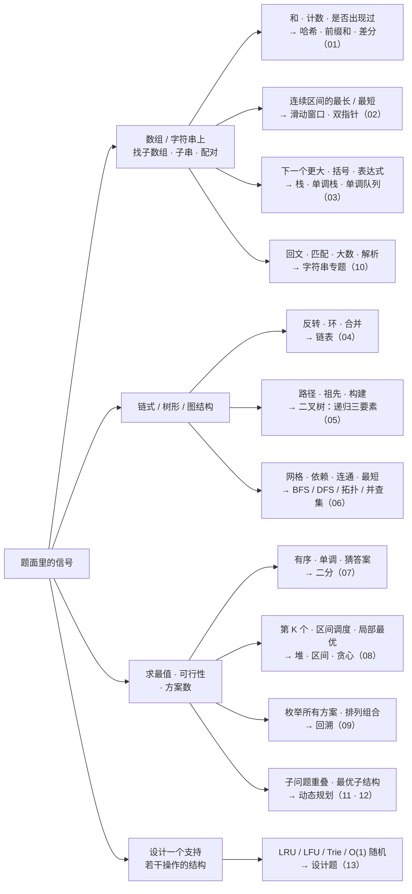
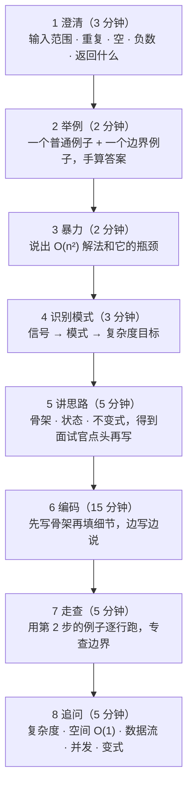

## 内容简介

《面试手撕代码》是一组共十八篇的系列文章，面向要参加 AI 算法 / AI-Infra / 后端岗位面试、需要在白板或共享编辑器上**当场写出能跑的代码**的求职者。前十三篇覆盖 LeetCode 中等偏上难度的算法题——按解题模式而不是按数据结构的名字组织，每篇讲清一种模式怎么识别、模板长什么样、三到五道最典型的题怎样从题面推到代码、面试官会顺着问什么；后六篇覆盖 AI 岗位特有的"手撕模型组件"——attention、Transformer block、反向传播、tokenizer、采样、损失函数、经典 ML 与评测指标、以及 Infra 岗的并发与系统题。

它回答的问题是：

> **面试官给你一道没见过的中等题，四十分钟。你怎样在前五分钟认出它属于哪一类、用哪个模板、复杂度是多少，然后把剩下的时间用来写对代码、想清边界、回答追问？**

答案不是"刷够五百道"。中等难度的面试题背后只有十来种模式；每种模式有一个可以背下来的骨架、两三处必错的边界、一组典型的追问。把这十来个骨架练到能默写，把每个骨架下最典型的三五道题推演过一遍，识别新题就是一件模式匹配的事。这个系列做的就是把模式、骨架、典型题、边界、追问按篇整理出来，并且**每一段代码都有 Python 与 Java 两个版本、都配有可以运行的测试**（[配套代码](https://github.com/arganzheng/ai-learning-labs/tree/main/coding-interview)）。

AI 岗位的"手撕"是另一类东西：不考你认不认得出模式，考你对模型组件的理解是不是精确到能写出来——multi-head attention 的四次 reshape 各是什么形状、softmax 为什么要减最大值、LayerNorm 的反向长什么样、top-p 采样在哪一步截断、DPO 的损失是哪两个 log 比。后六篇把这些组件从零实现一遍，用 PyTorch 的参考实现对拍，并列出面试官通常会追问的数值与形状问题。

这个系列**不属于**博客的三张学习地图——它不教你学会一个方向，只帮你把已经会的东西在面试里稳定地写出来。想系统学习，见[《AI 全栈工程师学习地图》](/ai-fullstack-learning-roadmap.html)。

## 为什么写这个系列？

### 手撕代码仍然是面试的门槛

不管岗位是算法、Infra 还是应用，2025 年的技术面试里几乎都保留了一到两轮现场编码。它筛的不是"会不会算法"，而是三件更基础的事：能不能把一个模糊的需求在几分钟内变成明确的输入输出与边界；能不能在没有 IDE 补全、没有运行反馈的情况下写出结构正确的代码；能不能在别人的追问下修改自己的方案而不崩。这三件事和日常工作里的能力高度相关，所以这一轮不会消失——但它考的方式高度程式化，可以针对性地准备。

### 大多数准备方法效率很低

按题号顺序刷、按数据结构分类刷、看题解背答案，这三种常见做法的共同问题是**没有形成模式层面的抽象**：刷了两百道题，遇到第两百零一道仍然要从零想。有效的做法是反过来的——先建立十来个模式的骨架，再用典型题把每个骨架练熟，最后用新题验证识别能力。这个系列按这个顺序组织：每篇一种模式，先讲"看到什么信号想到它"，再讲骨架，再用典型题推演，最后给一组题单让读者自己验证。

### AI 岗的手撕题没有现成的整理

LeetCode 类题目有大量资料，但"手写 multi-head attention""手写 BPE""手写 DPO loss"这类 AI 岗高频手撕题，散落在各种面经里，往往只有一句"考了 attention"，没有说清考到什么深度、哪里容易错、面试官会追问什么。后六篇把这些题按组件整理，每个组件给出面试里够用的实现、形状推演、与参考实现的对拍、以及追问清单。

## 一张图：从题面到模式

面试的前五分钟决定后面三十五分钟。下面这张图是本系列的骨架：看到题面里的什么信号，想到哪一类模式，去哪一篇。

这张图是**识别**用的，不是分类学：一道题常常同时落在两个分支（接雨水既是双指针也是单调栈，第 K 大既是堆也是快速选择），这时两种解法都要会，并能说出各自的复杂度与适用场景——这正是面试官追问的常见方向。

## 四十分钟怎么用

几条经验：

- **第 1 步别省。** "数组里有负数吗""重复元素算一个还是多个""空输入返回什么"——这些问题不是拖延，是面试官在观察你会不会先定义问题。答案往往直接决定用哪个模板（有负数就不能用滑动窗口求"和 ≥ target 的最短子数组"）。
- **第 3 步说出来但不写。** 暴力解证明你理解了题意，同时给了你一个复杂度基准："O(n²) 可以，但 n 到 10⁵ 会超时，所以要 O(n log n) 或 O(n)"。
- **第 5 步是最容易被跳过的。** 很多人想到思路就开始写，写到一半发现状态定义错了。先用两句话说清骨架，让面试官确认，再动手。
- **第 7 步用真实数据走。** 不是"我觉得这里对"，而是拿第 2 步的例子把每个变量的值写出来。90% 的边界 bug 在这一步暴露。

## 复杂度与数据规模

题面里的数据范围是最强的提示。一秒钟大约能做 $$10^8$$ 次简单操作，反推可接受的复杂度：

| $$n$$ 的量级 | 可接受的复杂度 | 对应模式 |
|---|---|---|
| $$\le 20$$ | $$O(2^n)$$、$$O(n!)$$ | 回溯、状压 DP |
| $$\le 500$$ | $$O(n^3)$$ | 区间 DP、Floyd |
| $$\le 5{,}000$$ | $$O(n^2)$$ | 二维 DP、暴力双重循环 |
| $$\le 10^5 \sim 10^6$$ | $$O(n \log n)$$、$$O(n)$$ | 排序、二分、堆、哈希、滑动窗口、单调栈 |
| $$\le 10^9$$ 或更大 | $$O(\log n)$$、$$O(1)$$ | 答案二分、数学 |

看到 $$n \le 20$$ 想回溯，看到 $$n \le 10^5$$ 排除 $$O(n^2)$$，看到 $$10^9$$ 的值域想值域二分——这一条能在第 4 步省下大量时间。

## 面试官在看什么

四个维度，权重大致相当：

| 维度 | 看的是 | 加分做法 | 减分做法 |
|---|---|---|---|
| 问题理解 | 有没有先定义清楚输入输出与边界 | 主动问范围、重复、空输入 | 拿到题就写 |
| 算法能力 | 能不能到达期望的复杂度 | 先说暴力再优化；说出复杂度的来由 | 只给一个方案、不知道它的复杂度 |
| 编码质量 | 代码结构、命名、边界处理 | 骨架先行；边界用哑节点 / 哨兵统一处理 | 特判堆叠、变量名 a b c |
| 沟通 | 能不能边写边说、能不能接住追问 | 走查时说出每个变量的值；追问时先复述再回答 | 沉默十分钟；被追问就推翻全部 |

一道题做不出来不是致命的——在暴力解上给出清楚的分析、诚实说出卡在哪里，比硬凑一个错误的"最优解"得分更高。

## 两种语言的速查

算法题用 Python 还是 Java 由岗位与个人熟练度决定；AI 算法岗默认 Python，后端与 Infra 岗常见 Java 或 C++。本系列的算法篇每段代码给两个版本，同一位置切换（页面上点 tab，选择会记住）。两种语言常用的容器与写法对照：

| 需求 | Python | Java |
|---|---|---|
| 栈 | `list`：`append` / `pop` / `[-1]` | `Deque<Integer> st = new ArrayDeque<>()`：`push` / `pop` / `peek`（不用 `Stack`） |
| 队列 / 双端队列 | `collections.deque`：`append` / `popleft` | `ArrayDeque`：`addLast` / `pollFirst` / `peekFirst` |
| 最小堆 | `heapq`：`heappush` / `heappop`；最大堆存负数 | `PriorityQueue<>()`；最大堆 `new PriorityQueue<>(Collections.reverseOrder())` |
| 哈希表 / 计数 | `dict` / `defaultdict(int)` / `Counter` | `HashMap`：`getOrDefault` / `merge(k, 1, Integer::sum)` / `computeIfAbsent` |
| 有序表 | `bisect` + `list`（插入 O(n)）；`sortedcontainers`（第三方） | `TreeMap` / `TreeSet`：`floorKey` / `ceilingKey` / `firstKey` |
| 二分 | `bisect_left` / `bisect_right` | `Arrays.binarySearch`（不保证第一个）；自己写 `lowerBound` |
| 排序自定义 | `sorted(key=...)`、`cmp_to_key` | `Arrays.sort(a, (x, y) -> Integer.compare(...))`（不要相减） |
| 无穷大 | `float("inf")` | `Integer.MAX_VALUE`（做加法前先想溢出）或 `Long` |
| 字符 ↔ 数字 | `ord(c) - 48`、`chr` | `c - '0'`、`(char) (i + 'a')` |

各篇末尾的「两种语言的坑」列出这一篇里两种语言各自容易错的地方：Python 的递归深度上限（默认 1000）、切片是拷贝、`//` 向下取整；Java 的 `int` 溢出、`Integer` 用 `==` 比较缓存范围外的值、`char` 参与运算自动提升为 `int`。

## 分章导读

### 第一部分：算法题（01–13）

每篇的结构相同：**识别信号 → 模板 → 主讲题逐题推演（配图）→ 变式与追问 → 两种语言的坑 → 题单 → 自测**。主讲题按三条标准选出：高频、能代表该模式的全部要点、有追问空间；其余高频题进题单只给一句提示。

| # | 篇 | 模式的骨架 | 主讲题 |
|---|---|---|---|
| 01 | [数组、哈希与前缀和](/coding-interview-arrays-hashing-prefix-sum.html) | 边查边存；`count[pre - k]`；把值当下标 | 560 · 128 · 41 · 238 · 1109 |
| 02 | [双指针与滑动窗口](/coding-interview-two-pointers-and-sliding-window.html) | 右扩左收；对撞；快慢 | 3 · 76 · 424 · 15 · 42 · 11 |
| 03 | [栈、单调栈与单调队列](/coding-interview-stack-monotonic-stack-and-queue.html) | 弹出即结算；哨兵；队首是最值 | 20 · 394 · 739 · 84 · 239 · 227 |
| 04 | [链表](/coding-interview-linked-list.html) | 哑节点；三指针反转；快慢指针 | 206 · 92 · 25 · 142 · 23 · 148 |
| 05 | [二叉树](/coding-interview-binary-tree.html) | 递归三要素；后序返回向下的信息、在合并处更新 | 102 · 236 · 105 · 124 · 98 · 297 · 437 |
| 06 | [图：BFS / DFS / 拓扑 / 并查集 / 最短路](/coding-interview-graph-bfs-dfs-topological-union-find.html) | 按层 BFS；入度为 0；`find` + `union`；堆 + 懒删除 | 200 · 994 · 207/210 · 127 · 721 · 743 |
| 07 | [二分](/coding-interview-binary-search.html) | 只有一个模板：第一个使谓词为真的位置 | 34 · 33 · 153 · 875 · 410 · 4 · 378 |
| 08 | [堆、Top-K、区间与贪心](/coding-interview-heap-topk-intervals-greedy.html) | 大小为 k 的堆；按端点排序；能证明的局部最优 | 215 · 347 · 295 · 56 · 253 · 435 · 45 |
| 09 | [回溯](/coding-interview-backtracking.html) | 做选择 → 递归 → 撤销；`start` 与同层去重 | 46/47 · 78/90 · 39/40 · 22 · 131 · 79 · 51 |
| 10 | [字符串](/coding-interview-strings.html) | 中心扩展；KMP 失配表；竖式；自定义比较 | 5 · 28 · 8 · 43 · 179 · 187 |
| 11 | [动态规划（一）：线性与二维](/coding-interview-dynamic-programming-linear-and-grid.html) | 状态定义五步法；滚动数组 | 322 · 300 · 53/152 · 1143 · 72 · 221 · 139 |
| 12 | [动态规划（二）：背包、区间、状态机、树形](/coding-interview-dynamic-programming-knapsack-interval-state-machine.html) | 容量倒序 / 正序；最后一个被处理的元素；状态转移图 | 416 · 518 · 312 · 188 · 309 · 337 · 10/44 |
| 13 | [设计题与数据结构实现](/coding-interview-design-problems-lru-lfu-trie.html) | 哈希 + 链表；频次桶；26 叉树；数组 + 下标哈希 | 146 · 460 · 208/212 · 380 · 307 |

11 与 12 两篇动态规划标为**可选**：不少公司明确不考 DP，或只考 11 里的线性 DP。时间紧的读者可以先跳过 12。

### 第二部分：AI 岗手撕（14–19）

每篇的结构：**面试怎么出题 → 形状推演 → 从零实现（逐行）→ 与 PyTorch 参考实现对拍 → 数值与边界陷阱 → 常见追问 → 自测**。实现用 NumPy，验证用 `torch`；第 19 篇的系统题用 Python 与 C++。

| # | 篇 | 内容 |
|---|---|---|
| 14 | [手撕 attention 家族](/coding-interview-attention-from-scratch.html) | 数值稳定的 softmax、scaled dot-product attention 与 causal mask、multi-head 的四次 reshape、GQA / MQA、RoPE、KV cache 增量解码、online softmax（FlashAttention 一趟分块的核心） |
| 15 | [手撕 Transformer block 与反向传播](/coding-interview-transformer-block-and-backprop.html) | LayerNorm / RMSNorm、GELU / SwiGLU、Embedding 与 tied head、完整 GPT block 前向；参数量与 FLOPs 口算；手写 Linear / Softmax-CE / LayerNorm 的反向并对拍；micrograd 式标量自动求导 |
| 16 | [手撕 tokenizer 与解码](/coding-interview-tokenizer-and-decoding.html) | BPE 训练与编码、temperature / top-k / top-p / min-p 采样、beam search、repetition penalty、蓄水池抽样、投机解码的接受规则 |
| 17 | [手撕损失函数与训练算法](/coding-interview-losses-and-training-algorithms.html) | 交叉熵 / KL / label smoothing、InfoNCE、DPO、PPO clipped objective 与 GAE、GRPO 组内优势、AdamW 一步、cosine + warmup、梯度裁剪、LoRA 层 |
| 18 | [手撕经典 ML 与评测指标](/coding-interview-classical-ml-and-metrics.html) | k-means、逻辑回归、KNN、PCA、AUC 的 $$O(n \log n)$$ 算法、P / R / F1、NDCG；conv2d via im2col、max pooling、IoU / NMS |
| 19 | [Infra 岗手撕：并发与系统](/coding-interview-infra-concurrency-and-systems.html) | 线程安全 LRU、生产者–消费者与线程池、内存池、分块矩阵乘（C++）、ring allreduce 模拟、paged KV block 分配器、token bucket 限流 |

## 阅读路径

| 你是 | 顺序 | 时间 |
|---|---|---|
| **AI 算法岗**，两周后面试 | 01 → 02 → 03 → 05 → 07 → 08 → 11 → 14 → 15 → 16 → 17；其余按面经补 | 约 14 小时 + 练题 |
| **AI-Infra / 后端岗** | 01 → 02 → 03 → 04 → 05 → 06 → 07 → 08 → 13 → 19；有时间加 14 | 约 14 小时 + 练题 |
| **只有三天** | 总纲的两张图 + 01 · 02 · 05 · 07 的模板与主讲题 + 14 的 attention；每篇只做自测 | 约 6 小时 |
| **系统复习** | 01 → 19 顺序读；每篇做完题单再进下一篇 | 约 25 小时 + 练题 |

练题的方法比数量重要：**每道题做两遍**——第一遍限时 30 分钟独立做，做不出来看题解；第二遍在一周后不看任何资料重写，能写出来才算过。一篇的题单全部过了再进下一篇。用一个表格记录每道题两遍的时间与卡点，两周后回看，卡点集中的模式就是要重点补的。

## 边界

这个系列**不讲**：

- 困难（hard）难度里的竞赛型题目：后缀自动机、网络流、FFT、高级数据结构（平衡树、可持久化）。它们在工业界面试里极少出现。
- 系统设计面试（"设计一个短链服务"）。那是另一类面试，另一套方法。
- 语言特性问答（GIL、JVM 内存模型）。Python 与 Java 的语言机制见 Infra 地图的 [01](/python-for-ai-infra.html) 与 [02](/cpp-for-ai-infra.html) 系列。
- 模型组件"为什么这样设计"的原理。后六篇只讲"怎么正确地写出来"；推导与设计动机在算法地图 [L3](/deep-learning-foundations.html)、[L4](/transformer-and-llm-for-infra-engineers.html)、[L5](/post-training-from-sft-to-verifiable-rewards.html) 各系列。

题目一律用自己的话复述题意并给 LeetCode 题号，不照抄题面。

## 版本基线

Python 3.12，标准库；Java 21 LTS（代码用 `--release 21` 编译）；后六篇 NumPy 2.x、PyTorch 2.5（只用作对拍的参考实现，CPU 即可）。

## 配套代码

[`ai-learning-labs/coding-interview/`](https://github.com/arganzheng/ai-learning-labs/tree/main/coding-interview)：`python/` 十三个文件（函数 + `unittest`）、`java/` 十三个类（`make test` 用 `-ea` 跑断言）、`ai/`（NumPy 实现 + `--check` 与 torch 对拍）、`infra/`（Python 与 C++）、`expected/`（完整输出）。README 里有每篇的**选题打分表**：候选题按高频 / 代表性 / 追问空间三条打分，落选的题与原因也列出来。
