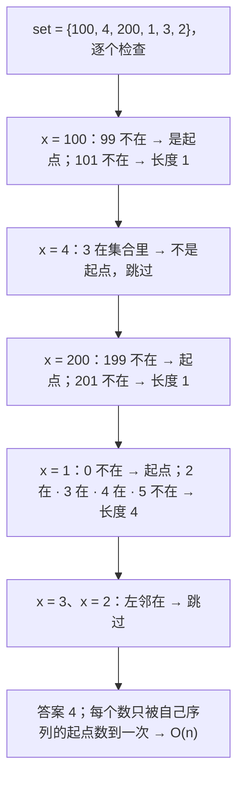
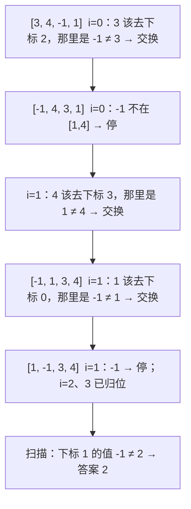

数组题是面试的开场题：题面短、代码短、十分钟内必须写完。它考的其实只有一件事——**能不能用一张哈希表换掉一层循环**。两数之和是"边查边存"，和为 K 的子数组是"前缀和 + 哈希计数"，最长连续序列是"只从起点数"，缺失的第一个正数是"把数组自己当哈希表"。四个题四种用法，背后是同一个动作：把"我之前见过什么"记下来，让第二层循环变成一次 O(1) 查询。

这一篇把哈希的四种用法、前缀和与差分这对互逆操作、以及原地哈希讲清楚，五道主讲题每道给完整的推演和 Python / Java 两个版本。

本篇要回答的核心问题是：

> **"和为 K 的子数组个数"为什么是前缀和 + 哈希，而不是滑动窗口？[^q0] "最长连续序列"怎样做到 O(n) 而不排序？[^q1] "缺失的第一个正数"要求 O(1) 额外空间，哈希表放在哪里？[^q2]**

## 一、识别信号

| 题面里出现 | 想到 | 为什么 |
|---|---|---|
| "两个元素的和 / 差 / 积等于 target" | 哈希：边查边存 | 对每个 $$x$$ 查 `target - x` 是否见过，O(1) |
| "子数组的和等于 K""和能被 K 整除" | 前缀和 + 哈希计数 | 子数组和 = 两个前缀和之差；数组有负数时窗口不单调，只能用哈希 |
| "是否出现过""连续序列""去重" | `set` | 成员查询 O(1) |
| "值域是 $$1 \ldots n$$""O(1) 额外空间" | 原地哈希：值 $$v$$ 放到下标 $$v-1$$ | 数组本身就是一张大小为 $$n$$ 的哈希表 |
| "多次区间加法、最后查每个位置" | 差分数组 | 区间加法 O(1)，最后一次前缀和还原 |
| "除自身以外""左边 / 右边的信息" | 前缀积 / 后缀积两趟 | 左右信息分别一趟，第二趟原地乘 |
| "只出现一次的数""不用额外空间" | 异或 | $$a \oplus a = 0$$ |

前缀和的核心恒等式只有一条：

$$
\text{sum}(i, j] = \text{pre}[j] - \text{pre}[i]
$$

"子数组和等于 K"就是"有多少对 $$(i, j)$$ 使 $$\text{pre}[j] - \text{pre}[i] = K$$"，即对每个 $$j$$ 数一下前面有多少个前缀和等于 $$\text{pre}[j] - K$$——这就是哈希计数。

## 二、模板

三个模板覆盖本篇全部主讲题。

### 1. 边查边存

<div class="code-tabs" markdown="1">
```python
def two_sum(nums, target):
    seen = {}                        # 值 -> 下标
    for i, x in enumerate(nums):
        if target - x in seen:       # 先查
            return [seen[target - x], i]
        seen[x] = i                  # 再存：保证配对的是"之前"的元素
    return []
```
```java
static int[] twoSum(int[] nums, int target) {
    Map<Integer, Integer> seen = new HashMap<>();
    for (int i = 0; i < nums.length; i++) {
        Integer j = seen.get(target - nums[i]);
        if (j != null) return new int[] {j, i};
        seen.put(nums[i], i);
    }
    return new int[0];
}
```
</div>

"先查再存"的顺序不能反：先存再查会让 `x` 和它自己配对（`target = 2x` 时）。

### 2. 前缀和 + 哈希计数

<div class="code-tabs" markdown="1">
```python
def subarray_sum(nums, k):
    count = defaultdict(int)
    count[0] = 1                     # 空前缀：让从下标 0 开始的子数组也能被数到
    pre = ans = 0
    for x in nums:
        pre += x
        ans += count[pre - k]        # 先查再存，避免把自己算进去
        count[pre] += 1
    return ans
```
```java
static int subarraySum(int[] nums, int k) {
    Map<Integer, Integer> count = new HashMap<>();
    count.put(0, 1);
    int pre = 0, ans = 0;
    for (int x : nums) {
        pre += x;
        ans += count.getOrDefault(pre - k, 0);
        count.merge(pre, 1, Integer::sum);
    }
    return ans;
}
```
</div>

`count[0] = 1` 是这个模板最容易漏的一行：它代表"什么都没加之前的前缀和是 0"，没有它，`[1, 2]` 中 `k = 3` 时整个数组这一个答案会丢。

### 3. 原地哈希

<div class="code-tabs" markdown="1">
```python
def first_missing_positive(nums):
    n = len(nums)
    for i in range(n):
        # 把 nums[i] 送到它该在的位置 nums[i]-1，直到当前位置的数不该在这里、或已经归位
        while 1 <= nums[i] <= n and nums[nums[i] - 1] != nums[i]:
            j = nums[i] - 1
            nums[i], nums[j] = nums[j], nums[i]
    for i in range(n):
        if nums[i] != i + 1:
            return i + 1
    return n + 1
```
```java
static int firstMissingPositive(int[] nums) {
    int n = nums.length;
    for (int i = 0; i < n; i++) {
        while (nums[i] >= 1 && nums[i] <= n && nums[nums[i] - 1] != nums[i]) {
            int j = nums[i] - 1, t = nums[i];
            nums[i] = nums[j];
            nums[j] = t;
        }
    }
    for (int i = 0; i < n; i++) if (nums[i] != i + 1) return i + 1;
    return n + 1;
}
```
</div>

`while` 里的条件 `nums[nums[i] - 1] != nums[i]`（而不是 `nums[i] != i + 1`）是为了处理重复：`[1, 1]` 里第二个 1 该去的位置已经有一个 1，再交换会死循环。

## 三、主讲题

### 1. LC 560 和为 K 的子数组

**题意**：整数数组（含负数），数有多少个连续子数组的和等于 $$k$$。

**为什么不是滑动窗口**：窗口法依赖"右扩和变大、左收和变小"的单调性，有负数时这条不成立。$$[1, -1, 1]$$，$$k = 1$$：窗口 $$[1]$$ 满足，右扩成 $$[1, -1]$$ 和变小，再右扩 $$[1, -1, 1]$$ 又满足——窗口法无法决定何时收左边。

**推演**：$$[1, 2, 3]$$，$$k = 3$$。

| 步 | $$x$$ | $$\text{pre}$$ | 查 `count[pre − 3]` | 累计 | 存后 `count` |
|---|---|---|---|---|---|
| 初始 | — | 0 | — | 0 | {0: 1} |
| 1 | 1 | 1 | count[−2] = 0 | 0 | {0: 1, 1: 1} |
| 2 | 2 | 3 | count[0] = 1 → 子数组 [1, 2] | 1 | {0: 1, 1: 1, 3: 1} |
| 3 | 3 | 6 | count[3] = 1 → 子数组 [3] | 2 | {…, 6: 1} |

答案 2。每一步查到的 `count[pre − k]` 就是"以当前位置结尾、和为 $$k$$ 的子数组个数"。

**追问**：

- *和能被 $$k$$ 整除的子数组（LC 974）*：把 `pre` 换成 `pre % k`（Python 的 `%` 对负数结果非负，Java 要 `((pre % k) + k) % k`）。
- *最长的和为 $$k$$ 的子数组（LC 325）*：哈希存"前缀和第一次出现的下标"而不是次数，`ans = max(ans, i - first[pre - k])`，并且**不覆盖**已有的键。
- *二维版本（LC 1074）*：枚举上下边界压成一维，$$O(m^2 n)$$。

### 2. LC 128 最长连续序列

**题意**：无序数组，求数值连续的最长序列长度，要求 $$O(n)$$。

**朴素想法**：排序后扫一遍，$$O(n \log n)$$，面试官会说"能不能 $$O(n)$$"。

**关键观察**：把所有数放进 `set`，对每个 $$x$$ 向右数 $$x+1, x+2, \ldots$$ 在不在集合里。直接这样做是 $$O(n^2)$$（$$[1, 2, 3, \ldots, n]$$ 里每个数都往右数到头）。修正：**只从序列的起点数**——$$x - 1$$ 不在集合里的 $$x$$ 才是起点。每个数只会被它所属序列的起点数到一次，总共 $$O(n)$$。



<div class="code-tabs" markdown="1">
```python
def longest_consecutive(nums):
    s = set(nums)
    best = 0
    for x in s:                      # 遍历 set 而不是 nums：重复元素只算一次
        if x - 1 in s:
            continue                 # 不是起点
        y = x
        while y + 1 in s:
            y += 1
        best = max(best, y - x + 1)
    return best
```
```java
static int longestConsecutive(int[] nums) {
    Set<Integer> set = new HashSet<>();
    for (int x : nums) set.add(x);
    int best = 0;
    for (int x : set) {
        if (set.contains(x - 1)) continue;
        int y = x;
        while (set.contains(y + 1)) y++;
        best = Math.max(best, y - x + 1);
    }
    return best;
}
```
</div>

**追问**：*为什么遍历 `set` 而不是 `nums`*——`nums` 里有大量重复时（如一万个 1），遍历 `nums` 会对同一个起点反复数，退化到 $$O(n \cdot L)$$。*能不能用并查集*——可以（$$x$$ 与 $$x+1$$ 合并），但更慢也更长，面试里说一句即可。

### 3. LC 41 缺失的第一个正数

**题意**：未排序整数数组（可有负数、零、大数、重复），找出没出现的最小正整数，要求 $$O(n)$$ 时间、$$O(1)$$ 额外空间。

**观察**：答案一定在 $$[1, n+1]$$ 里（$$n$$ 个数最多覆盖 $$1 \ldots n$$）。于是只关心值在 $$[1, n]$$ 的数，让"值 $$v$$ 在下标 $$v - 1$$"——数组自己就是一张哈希表。

**推演**：$$[3, 4, -1, 1]$$。



每次交换都让一个数归位，交换总次数 $$\le n$$，所以 `while` 嵌在 `for` 里仍是 $$O(n)$$。

**追问**：*为什么不能用负号标记法*——可以（LC 448 的做法：把出现过的值对应位置取负），但要先把非正数和大数替换成 $$n+1$$，两趟处理；交换法一趟到位。*重复元素怎么办*——`while` 条件里比较目标位置的值是否已经是它，见模板 3。

### 4. LC 238 除自身以外数组的乘积

**题意**：返回 `out[i]` = 除 `nums[i]` 外所有元素之积，不能用除法，$$O(n)$$，输出数组不算额外空间。

**推演**：`out[i]` = 左边所有数的积 × 右边所有数的积。第一趟正着写前缀积到 `out`，第二趟倒着用一个变量累乘后缀积。

| $$i$$ | `nums` | 第一趟后 `out[i]`（左积） | 第二趟 `suffix`（乘之前） | 最终 `out[i]` |
|---|---|---|---|---|
| 0 | 1 | 1 | 24 | 24 |
| 1 | 2 | 1 | 12 | 12 |
| 2 | 3 | 2 | 4 | 8 |
| 3 | 4 | 6 | 1 | 6 |

<div class="code-tabs" markdown="1">
```python
def product_except_self(nums):
    n = len(nums)
    out = [1] * n
    for i in range(1, n):
        out[i] = out[i - 1] * nums[i - 1]     # 左积
    suffix = 1
    for i in range(n - 1, -1, -1):
        out[i] *= suffix                      # 乘右积
        suffix *= nums[i]
    return out
```
```java
static int[] productExceptSelf(int[] nums) {
    int n = nums.length;
    int[] out = new int[n];
    out[0] = 1;
    for (int i = 1; i < n; i++) out[i] = out[i - 1] * nums[i - 1];
    int suffix = 1;
    for (int i = n - 1; i >= 0; i--) {
        out[i] *= suffix;
        suffix *= nums[i];
    }
    return out;
}
```
</div>

**追问**：*如果允许除法*——算总积再除，但要单独处理 0 的个数（一个 0：只有它的位置非零；两个以上：全 0）。*溢出*——题目保证乘积在 32 位内；面试里主动说一句"实际系统要用 `long` 或取模"。

### 5. LC 1109 航班预订统计

**题意**：$$n$$ 个航班，若干条预订 `[first, last, seats]` 表示 first 到 last 每个航班加 seats 个座位，返回每个航班的总座位。

**差分**：区间 $$[l, r]$$ 加 $$v$$，等价于差分数组 `diff[l] += v`、`diff[r+1] -= v`；最后做一次前缀和还原。每条预订 $$O(1)$$，总 $$O(n + m)$$。

| 预订 | `diff` 变化（1-based 航班） | 前缀和还原 |
|---|---|---|
| [1, 2, 10] | diff[1] += 10，diff[3] −= 10 | |
| [2, 3, 20] | diff[2] += 20，diff[4] −= 20 | |
| [2, 5, 25] | diff[2] += 25，diff[6] −= 25 | |
| 结果 | diff = [10, 45, −10, −20, 0, −25] | [10, 55, 45, 25, 25] |

<div class="code-tabs" markdown="1">
```python
def corp_flight_bookings(bookings, n):
    diff = [0] * (n + 1)
    for first, last, seats in bookings:
        diff[first - 1] += seats
        diff[last] -= seats              # last 是 1-based 闭区间右端 = 下一位的 0-based 下标
    out, run = [0] * n, 0
    for i in range(n):
        run += diff[i]
        out[i] = run
    return out
```
```java
static int[] corpFlightBookings(int[][] bookings, int n) {
    int[] diff = new int[n + 1];
    for (int[] b : bookings) {
        diff[b[0] - 1] += b[2];
        diff[b[1]] -= b[2];
    }
    int[] out = new int[n];
    int run = 0;
    for (int i = 0; i < n; i++) {
        run += diff[i];
        out[i] = run;
    }
    return out;
}
```
</div>

前缀和与差分互为逆运算：前缀和把"每个位置的值"变成"到此为止的累计"，差分把"区间加法"变成"两个端点的单点修改"。二维差分（LC 2536）是同一思路的四个角。

## 四、变式与追问

| 追问 | 应对 |
|---|---|
| 两数之和 → 数组有序 | 对撞双指针 $$O(1)$$ 空间（02 篇） |
| 两数之和 → 三数 / 四数 | 排序后固定一个 + 双指针（02 篇 LC 15） |
| 两数之和 → 数据流里不断加数、随时查 | 维护 `set`，`add` 存、`find` 查 |
| 560 → 最长 / 最短而不是个数 | 哈希存首次出现的下标 |
| 560 → 乘积等于 K | 取对数变成和（浮点风险），或改用双指针（全正数时） |
| 128 → 返回序列本身 | 记下最长的起点，最后按起点输出 |
| 41 → 找出所有缺失的数（LC 448） | 归位后扫描所有 `nums[i] != i + 1` 的位置 |
| 41 → 找重复的数（LC 287，不能改数组） | 把 `nums[i]` 当指针，Floyd 判环找入口（04 篇 LC 142 的同一推导） |
| 只出现一次的数 → 其他数出现三次（LC 137） | 按位统计 mod 3，或两变量状态机 |
| 只出现一次的数 → 有两个（LC 260） | 全体异或得 $$a \oplus b$$，取最低位 1 分两组各自异或 |

## 五、两种语言的坑

| | Python | Java |
|---|---|---|
| 负数取模 | `-1 % 3 == 2`，直接可用 | `-1 % 3 == -1`，要 `((x % k) + k) % k` |
| 哈希 key | `tuple` 可做 key，`list` 不能 | `int[]` 的 `hashCode` 是地址，不能做 key；用 `Arrays.toString` 或 `List.of` |
| 计数 | `Counter` / `defaultdict(int)`，缺省 0 | `getOrDefault(k, 0)`、`merge(k, 1, Integer::sum)` |
| 整数溢出 | 无 | 前缀和用 `long`；`Integer` 用 `equals` 比较 |
| 遍历时修改 | 遍历 `dict` 时不能增删 key | 同样会 `ConcurrentModificationException` |
| 交换 | `a[i], a[j] = a[j], a[i]` | 三行临时变量 |

## 六、题单

| 题 | 一句提示 |
|---|---|
| LC 1 两数之和 | 模板 1 |
| LC 217 / 219 存在重复元素 | `set`；II 版是大小为 $$k$$ 的窗口 `set` |
| LC 303 区域和检索 | 前缀和数组，查询 $$O(1)$$ |
| LC 523 / 974 连续子数组和能被 K 整除 | `pre % k` 做 key |
| LC 325 和等于 K 的最长子数组 | 哈希存首次下标 |
| LC 448 找到所有消失的数字 | 原地哈希，扫描未归位 |
| LC 287 寻找重复数 | Floyd 判环 |
| LC 136 / 137 / 260 只出现一次的数字 | 异或；mod 3 计数；最低位分组 |
| LC 169 多数元素 | Boyer–Moore 投票 |
| LC 2536 子矩阵元素加 1 | 二维差分 |

## 七、小结

| 用法 | 记什么 | 换掉什么 |
|---|---|---|
| 边查边存 | 值 → 下标 | 找配对的第二层循环 |
| 前缀和 + 计数 | 前缀和 → 出现次数（先放 `{0: 1}`） | 枚举所有子数组的 $$O(n^2)$$ |
| 只从起点数 | `set` 成员 | 排序的 $$\log n$$ |
| 原地哈希 | 值 $$v$$ → 下标 $$v - 1$$ | 额外的哈希表 |
| 差分 | 端点的增减 | 每次区间操作的 $$O(\text{len})$$ |
| 前缀积 / 后缀积 | 左积写在输出里，右积一个变量 | 除法与 $$O(n^2)$$ |

这一篇的每个模板都是 $$O(n)$$ 时间换 $$O(n)$$（或 $$O(1)$$）空间。下一篇讲另一种把 $$O(n^2)$$ 压到 $$O(n)$$ 的办法——不用额外空间，而是让两个指针只往一个方向走。

## 八、自测

1. `subarray_sum([1, -1, 0], 0)` 返回多少？请列出每一步的 `pre` 与 `count`。

   <details markdown="1">
   <summary>答案</summary>
   3。`count = {0: 1}`；$$x = 1$$：pre 1，查 count[1] = 0，存 {0:1, 1:1}；$$x = -1$$：pre 0，查 count[0] = 1（子数组 [1, −1]），存 {0:2, 1:1}；$$x = 0$$：pre 0，查 count[0] = 2（[1, −1, 0] 和 [0]），存 {0:3, 1:1}。合计 0 + 1 + 2 = 3。详见[第三章第 1 题](#1-lc-560-和为-k-的子数组)。
   </details>

2. 把 LC 128 的循环改成 `for x in nums`（遍历原数组而不是 `set`），输入一万个 1 和一个 2，复杂度变成多少？

   <details markdown="1">
   <summary>答案</summary>
   每个 1 都是起点（0 不在集合里），每次都要向右数到 2 再停，做一万次长度为 2 的扫描——这个例子还是 $$O(n)$$；但换成一万个 1 加 $$1 \ldots 5000$$，每个 1 都要数 5000 步，$$O(n \cdot L)$$，退化为 $$O(n^2)$$。遍历 `set` 则每个值只作为起点一次。详见[第三章第 2 题](#2-lc-128-最长连续序列)。
   </details>

3. LC 41 的 `while` 条件写成 `nums[i] != i + 1 and 1 <= nums[i] <= n` 会怎样？给出一个让它出错的输入。

   <details markdown="1">
   <summary>答案</summary>
   `[1, 1]`：$$i = 1$$ 时 `nums[1] = 1 ≠ 2` 且在范围内，交换 `nums[1]` 与 `nums[0]`——两个都是 1，交换后不变，条件仍成立，死循环。正确条件比较的是目标位置的值 `nums[nums[i] - 1] != nums[i]`：目标位置已经是 1，就不再交换。详见[第二章模板 3](#3-原地哈希)。
   </details>

4. LC 238 允许用除法、且 `nums` 里恰有一个 0，`out` 应该是什么？两个 0 呢？

   <details markdown="1">
   <summary>答案</summary>
   一个 0：除 0 所在位置外，所有 `out[i] = 0`；0 所在位置的 `out` = 其余所有非零数之积。两个或更多 0：全部 `out[i] = 0`（任何位置的"其他元素"里至少还有一个 0）。不用除法的两趟法自然处理这两种情况，这是它的另一个优点。详见[第三章第 4 题](#4-lc-238-除自身以外数组的乘积)。
   </details>

5. 用差分实现"区间 $$[l, r]$$ 每个位置加上等差数列 $$1, 2, \ldots, r - l + 1$$"，需要几次差分？

   <details markdown="1">
   <summary>答案</summary>
   两次。等差数列的一阶差分是常数 1（区间内）、末端有一个负跳变；常数的差分是端点上的单点修改。所以对二阶差分数组做：`d2[l] += 1`，`d2[r + 1] -= (r - l + 2)`，`d2[r + 2] += (r - l + 1)`，最后做两次前缀和还原。一般地：$$k$$ 次多项式的区间加需要 $$k + 1$$ 阶差分。详见[第三章第 5 题](#5-lc-1109-航班预订统计)。
   </details>

## 下一篇

[双指针与滑动窗口](/coding-interview-two-pointers-and-sliding-window.html)

[^q0]: 滑动窗口要求"右扩单调变大、左收单调变小"，数组含负数时不成立，无法决定何时收缩。前缀和把问题变成"有多少对 $$(i, j)$$ 满足 $$\text{pre}[j] - \text{pre}[i] = k$$"，对每个 $$j$$ 用哈希查 $$\text{pre}[j] - k$$ 出现过几次，一趟 $$O(n)$$；记得先放 `count[0] = 1`。详见[第三章第 1 题](#1-lc-560-和为-k-的子数组)。

[^q1]: 把所有数放进 `set`，只从"序列起点"（$$x - 1$$ 不在集合里的 $$x$$）向右数 $$x + 1, x + 2, \ldots$$。每个数只被它所属序列的起点数到一次，总共 $$O(n)$$；遍历 `set` 而不是原数组，重复值不会重复计数。详见[第三章第 2 题](#2-lc-128-最长连续序列)。

[^q2]: 放在数组自己身上。答案一定在 $$[1, n+1]$$，只关心值在 $$[1, n]$$ 的数，把值 $$v$$ 交换到下标 $$v - 1$$（`while` 条件比较目标位置是否已经是 $$v$$，防重复死循环）；交换总次数 $$\le n$$。最后第一个 `nums[i] != i + 1` 的 $$i + 1$$ 就是答案，都归位则 $$n + 1$$。详见[第三章第 3 题](#3-lc-41-缺失的第一个正数)。
