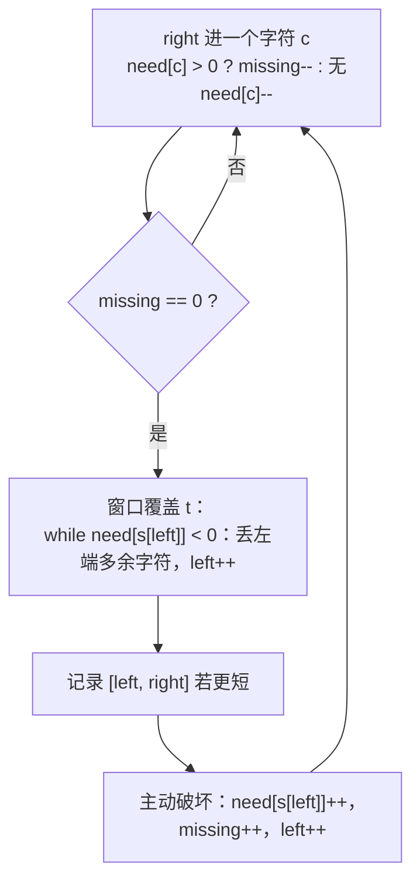
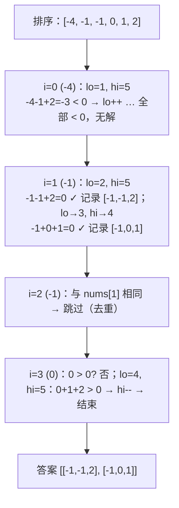
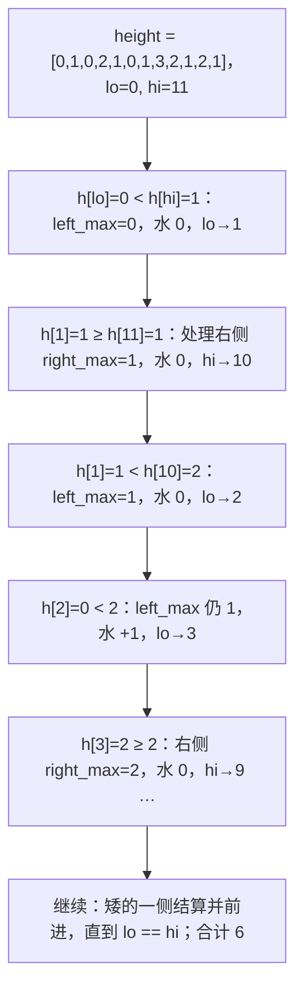

上一篇用哈希表换掉一层循环；这一篇不用额外空间，靠**单调性**做同一件事。两个指针都只往一个方向走，每个元素最多被每个指针经过一次，$$O(n^2)$$ 的枚举就变成了 $$O(n)$$。它有三种形态：同向的**滑动窗口**（子串、子数组问题）、相向的**对撞指针**（有序数组的配对、面积、接雨水）、同向不同速的**快慢指针**（原地分区、链表中点）。三种形态的代码骨架都不到十行，难点全在**什么时候动哪个指针**——这个决定必须能用一句话证明"不动的那种情况不可能更优"。

本篇要回答的核心问题是：

> **滑动窗口的"右扩左收"什么时候成立、什么时候不成立？[^q0] 最小覆盖子串里"已满足的字符数"怎样让每一步都是 O(1)？[^q1] 接雨水的双指针为什么可以只看自己这一侧的最大值？[^q2]**

## 一、识别信号

| 题面里出现 | 形态 | 单调性来自 |
|---|---|---|
| "最长 / 最短的连续子串（子数组），满足……" | 滑动窗口（变长） | 条件对窗口长度单调：越长越难满足（或越容易） |
| "长度为 $$k$$ 的子数组的……" | 滑动窗口（定长） | 窗口滑一格只进一个、出一个 |
| "有序数组里找两个数""两数之和 II" | 对撞指针 | 左指针右移和变大、右指针左移和变小 |
| "容器盛水""接雨水" | 对撞指针 | 矮的一侧决定上限 |
| "原地移除 / 分区 / 去重" | 快慢指针 | 慢指针是写位置、快指针是读位置 |
| "三数之和""四数之和" | 排序 + 固定 + 对撞 | 固定一个后退化为两数之和 |
| 数组含负数、求"和等于 K 的子数组" | **不能用窗口** → 前缀和 + 哈希（01 篇） | 和对长度不单调 |

最后一行是最常见的误用。滑动窗口能用的前提是：**当窗口不满足条件时，收缩左边一定不会让它"更满足"；扩展右边一定不会让它"更不满足"**（或者反过来）。全正数的"和 ≥ target"满足这条，含负数的"和 = k"不满足。

## 二、模板

### 1. 变长窗口

<div class="code-tabs" markdown="1">
```python
def longest_window(s):
    left = best = 0
    state = ...                          # 描述窗口的状态：计数、集合、和
    for right, ch in enumerate(s):
        add(state, ch)                   # 右端进窗
        while not ok(state):             # 窗口违规：收左边直到合法
            remove(state, s[left])
            left += 1
        best = max(best, right - left + 1)   # 每个 right 处窗口都合法
    return best
```
```java
static int longestWindow(String s) {
    int left = 0, best = 0;
    // state: 计数数组 / 集合 / 和
    for (int right = 0; right < s.length(); right++) {
        add(state, s.charAt(right));
        while (!ok(state)) remove(state, s.charAt(left++));
        best = Math.max(best, right - left + 1);
    }
    return best;
}
```
</div>

求"最短"时把 `while` 里的动作换过来：满足条件时记录答案并收左边，直到不满足。

### 2. 对撞指针

<div class="code-tabs" markdown="1">
```python
lo, hi = 0, len(a) - 1
while lo < hi:
    v = f(a[lo], a[hi])
    if v == target: ...                  # 记录，然后两边都动（跳过重复）
    elif v < target: lo += 1             # 需要变大：只有动 lo 能变大
    else: hi -= 1
```
```java
int lo = 0, hi = a.length - 1;
while (lo < hi) {
    int v = f(a[lo], a[hi]);
    if (v == target) {
        // ... 记录答案
        lo++;
        hi--;
    } else if (v < target) {
        lo++;
    } else {
        hi--;
    }
}
```
</div>

### 3. 快慢指针（原地分区）

<div class="code-tabs" markdown="1">
```python
slow = 0                                 # [0, slow) 是已处理好的前缀
for fast in range(len(a)):
    if keep(a[fast]):
        a[slow], a[fast] = a[fast], a[slow]
        slow += 1
```
```java
int slow = 0;
for (int fast = 0; fast < a.length; fast++) {
    if (keep(a[fast])) {
        int t = a[slow];
        a[slow] = a[fast];
        a[fast] = t;
        slow++;
    }
}
```
</div>

## 三、主讲题

### 1. LC 3 无重复字符的最长子串

**题意**：字符串里不含重复字符的最长子串长度。

**推演**：`"abba"`。状态是"每个字符最后出现的位置"。遇到重复字符时，左指针**直接跳到**重复字符上次位置的下一格，而不是一格一格收——但要防止往回跳。

| `right` | `ch` | `last[ch]` | `last[ch] >= left`? | `left` | 窗口 | `best` |
|---|---|---|---|---|---|---|
| 0 | a | — | 否 | 0 | a | 1 |
| 1 | b | — | 否 | 0 | ab | 2 |
| 2 | b | 1 | 是 → left = 2 | 2 | b | 2 |
| 3 | a | 0 | **否**（0 < 2，不能往回跳） | 2 | ba | 2 |

第 4 行是这题的唯一陷阱：`a` 上次出现在 0，但窗口已经从 2 开始，如果无条件写 `left = last[a] + 1 = 1` 就把窗口往回扩了，会得出错误的 `"bba"`。

<div class="code-tabs" markdown="1">
```python
def length_of_longest_substring(s):
    last = {}
    left = best = 0
    for right, ch in enumerate(s):
        if ch in last and last[ch] >= left:
            left = last[ch] + 1          # 直接跳到重复字符的下一位
        last[ch] = right
        best = max(best, right - left + 1)
    return best
```
```java
static int lengthOfLongestSubstring(String s) {
    int[] last = new int[128];
    Arrays.fill(last, -1);
    int left = 0, best = 0;
    for (int right = 0; right < s.length(); right++) {
        char ch = s.charAt(right);
        if (last[ch] >= left) left = last[ch] + 1;
        last[ch] = right;
        best = Math.max(best, right - left + 1);
    }
    return best;
}
```
</div>

**追问**：*至多含 $$k$$ 个不同字符的最长子串（LC 340）*——状态换成计数字典，`while len(count) > k` 收左边。*字符集是 Unicode 怎么办*——Java 用 `HashMap<Character, Integer>` 代替 `int[128]`。

### 2. LC 76 最小覆盖子串

**题意**：在 `s` 里找最短的子串，包含 `t` 的所有字符（含重复次数）。

**难点**：判断"窗口是否覆盖 t"如果每次比较两个计数表，是 $$O(\lvert \Sigma \rvert)$$。用一个整数 `missing`（还差几个字符）把它变成 $$O(1)$$：

- `need[c]` 初始为 `t` 里 `c` 的个数；`missing = |t|`。
- 右端进一个字符 `c`：若 `need[c] > 0`，说明它是还缺的，`missing -= 1`；无论如何 `need[c] -= 1`（可能变负，表示窗口里多余）。
- `missing == 0` 时窗口已覆盖。收左边：左端字符 `need[s[left]] < 0` 说明多余，可以放心丢；等于 0 时它是必需的，丢掉后 `missing += 1`，窗口重新变得不满足。



<div class="code-tabs" markdown="1">
```python
def min_window(s, t):
    need = Counter(t)
    missing = len(t)
    left = 0
    best = (0, float("inf"))
    for right, ch in enumerate(s):
        if need[ch] > 0:
            missing -= 1
        need[ch] -= 1
        if missing == 0:
            while need[s[left]] < 0:          # 左端多余
                need[s[left]] += 1
                left += 1
            if right - left < best[1] - best[0]:
                best = (left, right)
            need[s[left]] += 1                # 主动破坏窗口，继续找更短的
            missing += 1
            left += 1
    return "" if best[1] == float("inf") else s[best[0]: best[1] + 1]
```
```java
static String minWindow(String s, String t) {
    int[] need = new int[128];
    for (char c : t.toCharArray()) need[c]++;
    int missing = t.length(), left = 0, bestL = 0, bestR = Integer.MAX_VALUE;
    for (int right = 0; right < s.length(); right++) {
        if (need[s.charAt(right)]-- > 0) missing--;
        if (missing == 0) {
            while (need[s.charAt(left)] < 0) need[s.charAt(left++)]++;
            if (right - left < bestR - bestL) {
                bestL = left;
                bestR = right;
            }
            need[s.charAt(left++)]++;
            missing++;
        }
    }
    return bestR == Integer.MAX_VALUE ? "" : s.substring(bestL, bestR + 1);
}
```
</div>

`"ADOBECODEBANC"`, `t = "ABC"`：第一次 `missing == 0` 在 right = 5（`ADOBEC`），收左边丢不掉 A（need[A] = 0），记录长度 6，破坏后 missing = 1；之后在 right = 10（`CODEBA`）、right = 12（`BANC`）各记录一次，最短 `BANC`。

**追问**：*找出 `s` 里所有 `t` 的字母异位词（LC 438）*——定长窗口版本，窗口长度固定为 $$\lvert t \rvert$$，`missing == 0` 且长度恰好时记录。*`t` 里有重复字符*——上面的计数法天然处理。

### 3. LC 424 替换后的最长重复字符

**题意**：最多替换 $$k$$ 个字符，求全部相同的最长子串。

**条件**：窗口合法 ⟺ `窗口长 - 窗口内最高频字符数 <= k`（其余字符都替换掉）。

**巧妙之处**：`max_freq` 只需记历史最大、不必在收左边时减小。理由：答案只关心**最长**的合法窗口；窗口一旦到达长度 $$L$$，之后就不需要再缩短——收左边时右边同步右移，窗口长度保持不变，等待下一次能扩大的机会。`max_freq` 偏大只会让窗口"该收时没收"，但不会让记录的最大长度错误，因为一个更大的 `max_freq` 一定在之前的某个真实窗口里出现过。

<div class="code-tabs" markdown="1">
```python
def character_replacement(s, k):
    count = defaultdict(int)
    left = max_freq = 0
    for right, ch in enumerate(s):
        count[ch] += 1
        max_freq = max(max_freq, count[ch])   # 历史最大即可
        if right - left + 1 - max_freq > k:
            count[s[left]] -= 1
            left += 1                         # 只收一格：窗口长度不再变小
    return len(s) - left                      # 最终窗口长度就是答案
```
```java
static int characterReplacement(String s, int k) {
    int[] count = new int[26];
    int left = 0, maxFreq = 0;
    for (int right = 0; right < s.length(); right++) {
        maxFreq = Math.max(maxFreq, ++count[s.charAt(right) - 'A']);
        if (right - left + 1 - maxFreq > k) count[s.charAt(left++) - 'A']--;
    }
    return s.length() - left;
}
```
</div>

注意这里是 `if` 而不是 `while`：每步最多右扩一格，所以最多也只需收一格。

### 4. LC 15 三数之和

**题意**：找出所有和为 0 的三元组，不能重复。

**推演**：排序，固定 `i`，在 `(i, n-1]` 上对撞找两数之和为 `-nums[i]`。三处去重：`i` 与前一个相同则跳过；找到一组后 `lo` 跳过相同值；`hi` 跳过相同值。



<div class="code-tabs" markdown="1">
```python
def three_sum(nums):
    nums.sort()
    n, out = len(nums), []
    for i in range(n - 2):
        if nums[i] > 0:
            break                        # 最小的数已 > 0，后面不可能凑出 0
        if i > 0 and nums[i] == nums[i - 1]:
            continue                     # 去重 1
        lo, hi = i + 1, n - 1
        while lo < hi:
            s = nums[i] + nums[lo] + nums[hi]
            if s < 0:
                lo += 1
            elif s > 0:
                hi -= 1
            else:
                out.append([nums[i], nums[lo], nums[hi]])
                lo += 1
                hi -= 1
                while lo < hi and nums[lo] == nums[lo - 1]:
                    lo += 1              # 去重 2
                while lo < hi and nums[hi] == nums[hi + 1]:
                    hi -= 1              # 去重 3
    return out
```
```java
static List<List<Integer>> threeSum(int[] nums) {
    Arrays.sort(nums);
    List<List<Integer>> out = new ArrayList<>();
    for (int i = 0; i < nums.length - 2; i++) {
        if (nums[i] > 0) break;
        if (i > 0 && nums[i] == nums[i - 1]) continue;
        int lo = i + 1, hi = nums.length - 1;
        while (lo < hi) {
            int s = nums[i] + nums[lo] + nums[hi];
            if (s < 0) lo++;
            else if (s > 0) hi--;
            else {
                out.add(Arrays.asList(nums[i], nums[lo], nums[hi]));
                lo++;
                hi--;
                while (lo < hi && nums[lo] == nums[lo - 1]) lo++;
                while (lo < hi && nums[hi] == nums[hi + 1]) hi--;
            }
        }
    }
    return out;
}
```
</div>

**追问**：*四数之和（LC 18）*——再套一层循环，$$O(n^3)$$，注意 Java 里四个 `int` 相加要用 `long`。*最接近的三数之和（LC 16）*——同样的对撞，记录 `|s - target|` 最小者。*为什么不用哈希做三数之和*——可以 $$O(n^2)$$ 但去重麻烦、常数大；排序 + 双指针是标准答案。

### 5. LC 42 接雨水

**题意**：柱状图能接多少雨水。

**关键结论**：位置 $$i$$ 上的水位 = $$\min(\text{leftMax}_i, \text{rightMax}_i)$$。两趟预处理（左最大数组、右最大数组）是 $$O(n)$$ 空间的做法；双指针把空间压到 $$O(1)$$。

**为什么双指针成立**：维护 `left_max`（`lo` 左侧含自身的最大）和 `right_max`。当 `height[lo] < height[hi]` 时，`right_max >= height[hi] > height[lo]`，且 `right_max` 只会更大，所以位置 `lo` 的水位由 `left_max` 决定——**右侧的具体情况已经不影响它**，可以放心结算 `lo`。对称地处理另一侧。



<div class="code-tabs" markdown="1">
```python
def trap(height):
    lo, hi = 0, len(height) - 1
    left_max = right_max = water = 0
    while lo < hi:
        if height[lo] < height[hi]:
            left_max = max(left_max, height[lo])
            water += left_max - height[lo]   # 矮侧的水位由自己这侧的最大决定
            lo += 1
        else:
            right_max = max(right_max, height[hi])
            water += right_max - height[hi]
            hi -= 1
    return water
```
```java
static int trap(int[] h) {
    int lo = 0, hi = h.length - 1, leftMax = 0, rightMax = 0, water = 0;
    while (lo < hi) {
        if (h[lo] < h[hi]) {
            leftMax = Math.max(leftMax, h[lo]);
            water += leftMax - h[lo++];
        } else {
            rightMax = Math.max(rightMax, h[hi]);
            water += rightMax - h[hi--];
        }
    }
    return water;
}
```
</div>

**追问**：*单调栈解法*——按"层"横着算水，03 篇给出；面试里两种都要能说。*二维接雨水（LC 407）*——从四周边界入堆，每次弹出最矮的边界向内扩展（Dijkstra 思路），08 篇提要。

### 6. LC 11 盛最多水的容器

**题意**：两条线段与 x 轴围成的最大面积，面积 = 两线距离 × 较矮者高度。

**决定**：移动**矮**的那一侧。理由：距离一定变小；如果移动高的那侧，新的高度 ≤ 原矮者，面积必定变小；只有移动矮的一侧才有可能变大。

<div class="code-tabs" markdown="1">
```python
def max_area(height):
    lo, hi, best = 0, len(height) - 1, 0
    while lo < hi:
        best = max(best, min(height[lo], height[hi]) * (hi - lo))
        if height[lo] < height[hi]:
            lo += 1
        else:
            hi -= 1
    return best
```
```java
static int maxArea(int[] h) {
    int lo = 0, hi = h.length - 1, best = 0;
    while (lo < hi) {
        best = Math.max(best, Math.min(h[lo], h[hi]) * (hi - lo));
        if (h[lo] < h[hi]) lo++;
        else hi--;
    }
    return best;
}
```
</div>

这题与接雨水共用一句证明——"移动高的一侧不可能更优"——面试里把这句说清楚比代码本身更重要。

## 四、变式与追问

| 追问 | 应对 |
|---|---|
| 最长 → 最短（LC 209 长度最小的子数组） | 满足条件时记录并收左边，`while total >= target` |
| 变长 → 定长（LC 567 字符串的排列） | 窗口长固定 $$= \lvert s_1 \rvert$$，一进一出，比较计数 |
| 窗口内"不同元素个数 ≤ k"（LC 340 / 992） | 计数字典 + `len(count)`；"恰好 k" = "≤ k" − "≤ k−1" |
| 窗口内最大值（LC 239） | 单调队列（03 篇） |
| 含负数的"和 = k" | 前缀和 + 哈希（01 篇），窗口不适用 |
| 快慢指针原地去重（LC 26 / 80） | 慢指针写、快指针读；"至多两次"比较 `a[slow - 2]` |
| 链表上的快慢指针 | 中点、判环、倒数第 k 个（04 篇） |
| 三数之和 → 四数 / 最接近 / 较小的（LC 259） | 多一层循环；记录差；`s < target` 时 `hi - lo` 个全部计入 |

## 五、两种语言的坑

| | Python | Java |
|---|---|---|
| 字符计数 | `Counter` / `dict` 通用 | `int[128]`（ASCII）或 `int[26]`（小写）比 `HashMap` 快得多；Unicode 才用 `HashMap` |
| 字符串切片 | `s[a:b]` 是 $$O(b-a)$$ 拷贝，循环里别切 | `substring` 同样拷贝（JDK 7u6 起） |
| 无穷大初值 | `float("inf")` | `Integer.MAX_VALUE`，比较前不做加法 |
| 三数相加 | 不溢出 | 三个 `int` 相加可能溢出（值域 ±10⁹ 时用 `long`） |
| 排序 | `nums.sort()` 原地；`sorted()` 返回新表 | `Arrays.sort(int[])` 是双轴快排（最坏 $$O(n^2)$$，面试可以提一句） |
| 输出去重后的三元组 | `list` 直接 append | `Arrays.asList(...)` 返回定长视图；要可变用 `new ArrayList<>(List.of(...))` |

## 六、题单

| 题 | 一句提示 |
|---|---|
| LC 167 两数之和 II（有序） | 对撞指针 |
| LC 209 长度最小的子数组 | 最短窗口模板 |
| LC 438 找到所有字母异位词 | 定长窗口 + `missing` |
| LC 567 字符串的排列 | 同上，返回布尔 |
| LC 340 至多 K 个不同字符 | 计数字典大小 |
| LC 1004 最大连续 1 的个数 III | 与 424 同型：0 的个数 ≤ k |
| LC 26 / 80 删除有序数组中的重复项 | 快慢指针 |
| LC 283 移动零 | 快慢指针分区 |
| LC 16 / 18 最接近的三数之和 / 四数之和 | 15 的变形 |
| LC 977 有序数组的平方 | 对撞指针从两端往中间填 |

## 七、小结

| 形态 | 指针怎么动 | 单调性的来源 | 代表题 |
|---|---|---|---|
| 变长窗口 | 右端每步进一格；违规时左端收 | 条件对窗口长度单调 | 3 · 76 · 424 |
| 定长窗口 | 一进一出 | 长度固定 | 567 · 438 |
| 对撞 | 由 $$f(a[lo], a[hi])$$ 与目标的比较决定动哪个 | 数组有序 / 矮侧决定上限 | 15 · 11 · 42 |
| 快慢 | 快指针读、慢指针写 | 已处理前缀不再改变 | 26 · 283 |

写窗口题时先把**状态**（计数、集合、和）与**合法条件**写成一句话，再决定"违规时收左边"还是"满足时收左边"，代码就只剩填空。

## 八、自测

1. 用滑动窗口求"和 ≥ target 的最短子数组"（LC 209），为什么要求数组全正？给一个含负数的反例。

   <details markdown="1">
   <summary>答案</summary>
   窗口法依赖"右扩和不减、左收和不增"，这样每个 right 处收到不能再收就是该 right 的最优左端。含负数时不成立：`[1, 2, -5, 4]`，target 3。窗口法：right = 1 时和 3，记录长度 2，收左边后和 2；right = 2 和 −3；right = 3 和 1，始终 < 3——返回 2。正确答案是 1（`[4]`）：负数把和拖低后窗口再也收不动，把 `[4]` 这个更短的解漏掉了。含负数的版本要用前缀和 + 单调队列（LC 862）。详见[第一章](#一识别信号)。
   </details>

2. LC 3 里去掉 `last[ch] >= left` 这个判断、直接写 `left = last[ch] + 1`，输入 `"abba"` 会返回什么？

   <details markdown="1">
   <summary>答案</summary>
   3（错误，正确是 2）。right = 3 遇到 `a`，`last[a] = 0`，无条件 `left = 1`，窗口变成 `"bba"` 长度 3——但它含重复的 b。判断的作用是禁止左指针往回跳。详见[第三章第 1 题](#1-lc-3-无重复字符的最长子串)。
   </details>

3. LC 76 的 `missing` 为什么用 `need[ch] > 0` 判断而不是 `need[ch] >= 0`？

   <details markdown="1">
   <summary>答案</summary>
   `need[ch] > 0` 表示窗口里 `ch` 还不够 `t` 要求的个数，再进一个才"补上一个缺口"，`missing` 才该减。`need[ch] == 0` 表示已经刚好够，再进就是多余，不该减 `missing`（否则 `missing` 会提前归零，把不满足的窗口当作满足）。`need[ch] < 0` 表示已经多余。详见[第三章第 2 题](#2-lc-76-最小覆盖子串)。
   </details>

4. LC 424 里 `max_freq` 不随收左边而减小，为什么答案仍然正确？构造一个 `max_freq` 偏大的时刻说明它无害。

   <details markdown="1">
   <summary>答案</summary>
   `"AAABBBB"`、k = 0。到 right = 2 时 `max_freq = 3`、窗口 `AAA` 长 3。之后遇到 B 窗口违规、每步收一格，窗口长保持 3，`max_freq` 保持 3（真实的 B 计数到 right = 5 才到 3）。窗口长度只在真实合法时才增长，最终 `len - left = 4`（`BBBB`）正确。`max_freq` 偏大只让窗口"本该收却没收"，但窗口长度已经在之前某个真实窗口达到过，答案不会偏大。详见[第三章第 3 题](#3-lc-424-替换后的最长重复字符)。
   </details>

5. 接雨水的双指针里，`height[lo] < height[hi]` 时结算 `lo`，用的是 `left_max` 而不是 `min(left_max, right_max)`。为什么此时 `left_max <= right_max` 一定成立？

   <details markdown="1">
   <summary>答案</summary>
   `right_max >= height[hi]`（它是 `hi` 右侧含自身的最大）。而 `height[hi] > height[lo]`，且 `left_max` 是 `lo` 左侧含自身的最大——如果 `left_max > right_max >= height[hi]`，那么在之前的某一步 `left_max` 所在位置的高度已经大于当时的 `height[hi]`，按规则那一步会处理右侧而不是左侧，`lo` 不会走到这里。所以此刻 `left_max <= right_max`，水位 = `left_max`。详见[第三章第 5 题](#5-lc-42-接雨水)。
   </details>

## 下一篇

[栈、单调栈与单调队列](/coding-interview-stack-monotonic-stack-and-queue.html)

[^q0]: 成立的条件是合法性对窗口长度单调：右扩不会让"违规"变"合法"（或反之），左收不会让"合法"变"违规"。全正数的"和 ≥ target"、"不含重复字符"、"不同字符 ≤ k"都满足；含负数的"和 = k"不满足——右扩可能让和变小，无法决定何时收左边，要改用前缀和 + 哈希。详见[第一章](#一识别信号)。

[^q1]: 用一个整数 `missing`（还差多少字符）代替每步比较两张计数表。右端进字符 `c` 时若 `need[c] > 0` 则 `missing -= 1`，然后 `need[c] -= 1`（可为负 = 多余）；`missing == 0` 即覆盖。收左边时 `need[s[left]] < 0` 的字符是多余的可以丢；丢到必需字符后主动破坏窗口（`missing += 1`）继续找更短的。每步 $$O(1)$$，总 $$O(\lvert s \rvert + \lvert t \rvert)$$。详见[第三章第 2 题](#2-lc-76-最小覆盖子串)。

[^q2]: 位置 $$i$$ 的水位是 $$\min(\text{leftMax}_i, \text{rightMax}_i)$$。当 `height[lo] < height[hi]` 时，`right_max >= height[hi] > height[lo]`，且此时必有 `left_max <= right_max`（否则之前某一步会先处理右侧），所以 $$\min$$ 就是 `left_max`，右侧的其余信息不再影响 `lo`，可以结算并前进；对称地处理 `hi`。每个位置结算一次，$$O(n)$$、$$O(1)$$ 空间。详见[第三章第 5 题](#5-lc-42-接雨水)。
