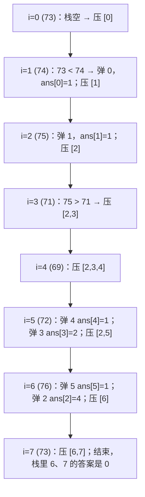
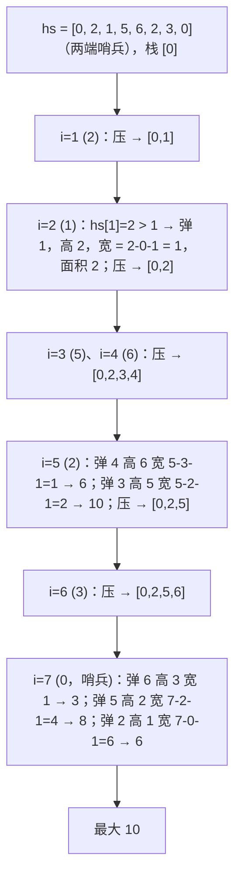

栈解决的是"**最近的未完成事项**"：括号匹配里最近一个没配对的左括号、表达式里最近一个还没结算的运算数、嵌套字符串里最近一个还没展开的 `[`。单调栈是它的特化——栈里的元素保持单调，于是"弹出"这个动作有了新含义：**被弹出的元素在此刻找到了它右侧第一个更大（或更小）的数，左侧第一个更大的就是新栈顶**。每日温度、柱状图最大矩形、接雨水都是这一句话。单调队列把同样的想法用在滑动窗口上：队首永远是窗口最值。

这一篇的六道主讲题，前三道是普通栈（括号、解码、计算器），后三道是单调结构（每日温度、柱状图、滑窗最大值）。每道题的代码都短，但"弹出时结算什么"这一句必须想清楚。

本篇要回答的核心问题是：

> **单调栈里的元素弹出时，为什么左右两侧的边界同时确定了？[^q0] 柱状图最大矩形的两端哨兵各解决什么问题？[^q1] 滑动窗口最大值为什么用双端队列而不是堆？[^q2]**

## 一、识别信号

| 题面里出现 | 想到 | 弹出时结算什么 |
|---|---|---|
| 括号、标签、嵌套是否合法 | 栈：左入右配 | 弹出 = 配对成功 |
| 嵌套的重复 / 展开（`3[a2[c]]`） | 栈存（外层结果, 重复数） | 弹出 = 把内层结果重复后接回外层 |
| 中缀表达式、只有 `+ − × ÷` | 栈存带符号的项 | 乘除立即与栈顶结算，加减延迟到最后求和 |
| "下一个更大 / 更小的元素""等几天温度更高" | 单调递减栈（存下标） | 弹出的元素：右侧第一个更大 = 当前元素 |
| "以某柱子为高的最大矩形""最大宽度" | 单调递增栈 + 哨兵 | 弹出的元素：左边界 = 新栈顶，右边界 = 当前 |
| "滑动窗口的最大 / 最小值" | 单调双端队列 | 队尾弹出永不再当最值的元素；队首过期则弹 |
| "去掉 k 个数字使结果最小""字典序最小子序列" | 单调栈 + 剩余配额 | 弹出比当前大的，直到配额用完 |

单调栈处理的问题有个共同形状：**每个元素想知道离它最近的、满足某种大小关系的邻居**。暴力是 $$O(n^2)$$，单调栈让每个元素入栈一次、出栈一次，$$O(n)$$。

## 二、模板

### 1. 单调栈（找右侧第一个更大）

<div class="code-tabs" markdown="1">
```python
stack = []                               # 存下标；对应值从栈底到栈顶递减
for i, x in enumerate(a):
    while stack and a[stack[-1]] < x:    # 栈顶比 x 小：x 就是它右侧第一个更大
        j = stack.pop()
        settle(j, left=stack[-1] if stack else -1, right=i)
    stack.append(i)
# 循环结束后栈里剩下的元素：右侧没有更大的
```
```java
Deque<Integer> stack = new ArrayDeque<>();
for (int i = 0; i < a.length; i++) {
    while (!stack.isEmpty() && a[stack.peek()] < a[i]) {
        int j = stack.pop();
        settle(j, stack.isEmpty() ? -1 : stack.peek(), i);
    }
    stack.push(i);
}
```
</div>

四种变体只改比较符：找"右侧第一个更大"用递减栈 `<`；"右侧第一个更小"用递增栈 `>`；要不要包含相等（`<=` / `>=`）决定重复元素归谁，柱状图题里两种都对，去重类题里要想清楚。

### 2. 单调队列（滑动窗口最大值）

<div class="code-tabs" markdown="1">
```python
dq = deque()                             # 存下标；值从队首到队尾递减
for i, x in enumerate(a):
    while dq and a[dq[-1]] <= x:         # 比 x 小的永远不会再是窗口最大
        dq.pop()
    dq.append(i)
    if dq[0] <= i - k:                   # 队首滑出窗口
        dq.popleft()
    if i >= k - 1:
        out.append(a[dq[0]])
```
```java
Deque<Integer> dq = new ArrayDeque<>();
for (int i = 0; i < a.length; i++) {
    while (!dq.isEmpty() && a[dq.peekLast()] <= a[i]) dq.pollLast();
    dq.addLast(i);
    if (dq.peekFirst() <= i - k) dq.pollFirst();
    if (i >= k - 1) out[i - k + 1] = a[dq.peekFirst()];
}
```
</div>

## 三、主讲题

### 1. LC 20 有效的括号

**题意**：`()[]{}` 组成的串是否合法。

**推演**：左括号入栈；右括号时栈空或栈顶不匹配则非法；结束时栈必须为空。三个失败条件对应三个测试：`"(]"`（不匹配）、`"("`（结束非空）、`")"`（栈空时遇右括号）。

<div class="code-tabs" markdown="1">
```python
def is_valid(s):
    pair = {")": "(", "]": "[", "}": "{"}
    stack = []
    for ch in s:
        if ch in pair:
            if not stack or stack.pop() != pair[ch]:
                return False
        else:
            stack.append(ch)
    return not stack
```
```java
static boolean isValid(String s) {
    Deque<Character> stack = new ArrayDeque<>();
    for (char c : s.toCharArray()) {
        if (c == '(') stack.push(')'); // 直接压"期望的右括号"，省一张映射表
        else if (c == '[') stack.push(']');
        else if (c == '{') stack.push('}');
        else if (stack.isEmpty() || stack.pop() != c) return false;
    }
    return stack.isEmpty();
}
```
</div>

**追问**：*最长有效括号子串（LC 32）*——栈存下标，栈底放一个"最后一个不匹配位置"，配对时长度 = `i - stack[-1]`。*最少添加几个使合法（LC 921）*——只需两个计数器，不需要栈。

### 2. LC 394 字符串解码

**题意**：`3[a2[c]]` → `accaccacc`。数字、`[`、`]`、字母，可嵌套。

**推演**：遇到 `[` 时把"到目前为止的外层结果"和"即将重复的次数"一起压栈，当前串清空；遇到 `]` 弹出，`当前串 = 外层 + 当前串 × 次数`。

| 字符 | 动作 | `cur` | `num` | 栈 |
|---|---|---|---|---|
| 3 | 累数 | "" | 3 | [] |
| [ | 压 ("", 3)，清空 | "" | 0 | [("", 3)] |
| a | 追加 | "a" | 0 | |
| 2 | 累数 | "a" | 2 | |
| [ | 压 ("a", 2) | "" | 0 | [("", 3), ("a", 2)] |
| c | 追加 | "c" | | |
| ] | 弹 ("a", 2)：cur = "a" + "c"×2 | "acc" | | [("", 3)] |
| ] | 弹 ("", 3)：cur = "" + "acc"×3 | "accaccacc" | | [] |

<div class="code-tabs" markdown="1">
```python
def decode_string(s):
    stack = []                           # (外层已解码的串, 重复次数)
    cur, num = "", 0
    for ch in s:
        if ch.isdigit():
            num = num * 10 + int(ch)     # 数字可能多位
        elif ch == "[":
            stack.append((cur, num))
            cur, num = "", 0
        elif ch == "]":
            prev, k = stack.pop()
            cur = prev + cur * k
        else:
            cur += ch
    return cur
```
```java
static String decodeString(String s) {
    Deque<Integer> counts = new ArrayDeque<>();
    Deque<StringBuilder> prefixes = new ArrayDeque<>();
    StringBuilder cur = new StringBuilder();
    int num = 0;
    for (char c : s.toCharArray()) {
        if (Character.isDigit(c)) num = num * 10 + (c - '0');
        else if (c == '[') {
            counts.push(num);
            prefixes.push(cur);
            cur = new StringBuilder();
            num = 0;
        } else if (c == ']') {
            StringBuilder prev = prefixes.pop();
            int k = counts.pop();
            for (int i = 0; i < k; i++) prev.append(cur);
            cur = prev;
        } else cur.append(c);
    }
    return cur.toString();
}
```
</div>

**追问**：*递归写法*——`decode(i)` 返回解码到匹配 `]` 的串与新下标，本质相同（递归栈代替显式栈）。*输出长度可能极大*——如果只问长度，用同样的栈存长度而不是串。

### 3. LC 227 基本计算器 II

**题意**：含 `+ − × ÷` 与空格的非负整数表达式，向零取整。

**思路**：把表达式看成若干**带符号的项**之和：`3+2*2` = `(+3) + (+2×2)`。栈存各项；遇到乘除时，它的优先级高，立刻与栈顶结算（弹出栈顶、乘或除、压回）；遇到加减只是决定下一个数的符号。最后求和。

技巧：在串末尾补一个 `+`，把最后一个数"逼"进栈，省去循环后的特判。

<div class="code-tabs" markdown="1">
```python
def calculate(s):
    stack = []
    num, op = 0, "+"                     # op 是"当前数前面的运算符"
    for ch in s + "+":
        if ch.isdigit():
            num = num * 10 + int(ch)
        elif ch in "+-*/":
            if op == "+":
                stack.append(num)
            elif op == "-":
                stack.append(-num)
            elif op == "*":
                stack.append(stack.pop() * num)
            else:
                stack.append(int(stack.pop() / num))   # 向零取整；// 是向下取整
            num, op = 0, ch
    return sum(stack)
```
```java
static int calculate(String s) {
    Deque<Integer> stack = new ArrayDeque<>();
    int num = 0;
    char op = '+';
    String t = s + "+";
    for (int i = 0; i < t.length(); i++) {
        char c = t.charAt(i);
        if (Character.isDigit(c)) num = num * 10 + (c - '0');
        else if (c != ' ') {
            switch (op) {
                case '+' -> stack.push(num);
                case '-' -> stack.push(-num);
                case '*' -> stack.push(stack.pop() * num);
                default -> stack.push(stack.pop() / num); // Java 的 / 本来就向零取整
            }
            num = 0;
            op = c;
        }
    }
    int sum = 0;
    for (int v : stack) sum += v;
    return sum;
}
```
</div>

**追问**：*加括号（LC 224）*——遇 `(` 递归（或把当前结果与符号压栈），遇 `)` 返回。*逆波兰表达式（LC 150）*——数字入栈，运算符弹两个算一个，注意 `a - b` 的顺序是"先弹的是 b"。

### 4. LC 739 每日温度

**题意**：对每一天，求要等几天才有更高的温度；没有则 0。

**推演**：`[73, 74, 75, 71, 69, 72, 76, 73]`。栈存下标，值递减。



<div class="code-tabs" markdown="1">
```python
def daily_temperatures(temps):
    out = [0] * len(temps)
    stack = []
    for i, t in enumerate(temps):
        while stack and temps[stack[-1]] < t:
            j = stack.pop()
            out[j] = i - j               # 弹出时结算：j 的下一个更暖日是 i
        stack.append(i)
    return out
```
```java
static int[] dailyTemperatures(int[] t) {
    int[] out = new int[t.length];
    Deque<Integer> stack = new ArrayDeque<>();
    for (int i = 0; i < t.length; i++) {
        while (!stack.isEmpty() && t[stack.peek()] < t[i]) {
            int j = stack.pop();
            out[j] = i - j;
        }
        stack.push(i);
    }
    return out;
}
```
</div>

**追问**：*下一个更大元素 II（LC 503，循环数组）*——遍历 $$2n$$ 次、下标取模。*从右往左扫*——也行：栈里存的是"右侧候选"，当前元素弹掉比自己小的后，栈顶就是答案。两种方向面试里都可能被问到。

### 5. LC 84 柱状图中最大的矩形

**题意**：以每根柱子为高能画出的最大矩形，取最大。

**转化**：以柱子 $$j$$ 为高的矩形，左边界是 $$j$$ 左侧第一个比它矮的柱子、右边界是右侧第一个比它矮的。**单调递增栈**：弹出 $$j$$ 时，当前 $$i$$ 就是右边界，新栈顶就是左边界，宽 = $$i - \text{stack.top} - 1$$。

**两端哨兵**：在两端各补一个高度 0。开头的 0 保证栈永远非空（省去"栈空时左边界是 −1"的判断）；结尾的 0 把所有柱子在循环内逼出栈（省去循环后的清理）。



<div class="code-tabs" markdown="1">
```python
def largest_rectangle_area(heights):
    hs = [0] + heights + [0]
    stack = [0]
    best = 0
    for i in range(1, len(hs)):
        while hs[stack[-1]] > hs[i]:
            h = hs[stack.pop()]
            width = i - stack[-1] - 1    # 左边界 = 新栈顶，右边界 = i
            best = max(best, h * width)
        stack.append(i)
    return best
```
```java
static int largestRectangleArea(int[] heights) {
    int n = heights.length;
    int[] hs = new int[n + 2];
    System.arraycopy(heights, 0, hs, 1, n);
    Deque<Integer> stack = new ArrayDeque<>();
    stack.push(0);
    int best = 0;
    for (int i = 1; i < hs.length; i++) {
        while (hs[stack.peek()] > hs[i]) {
            int h = hs[stack.pop()];
            best = Math.max(best, h * (i - stack.peek() - 1));
        }
        stack.push(i);
    }
    return best;
}
```
</div>

**相等高度**：用 `>` 而不是 `>=`，相等的柱子留在栈里，等更矮的来时一起弹；前一个相等柱子算出的宽度偏小，但后一个会算出正确的完整宽度，最大值不受影响。

**追问**：*最大矩形（LC 85，01 矩阵）*——逐行累加高度得到柱状图，每行调用一次 84，$$O(mn)$$。*接雨水的单调栈解*——同一个栈，弹出时算的是"这一层的水"：`(min(左, 右) - 弹出高度) × (右 - 左 - 1)`。

### 6. LC 239 滑动窗口最大值

**题意**：长度 $$k$$ 的窗口从左到右滑，输出每个窗口的最大值。

**为什么不用堆**：堆能 $$O(\log k)$$ 取最大，但窗口左端滑出的元素不一定是堆顶，删除要懒删除（堆里存 (值, 下标)，取顶时丢弃过期的），可行但 $$O(n \log k)$$。单调队列 $$O(n)$$。

**不变式**：队列里的下标递增、对应值递减。新元素 $$x$$ 进来时，队尾所有 $$\le x$$ 的元素**永远不会再当窗口最大**（它们比 $$x$$ 小又比 $$x$$ 先过期），弹掉。队首如果已滑出窗口，弹掉。队首就是当前最大。

| $$i$$ | $$x$$ | 弹队尾 | 队列（下标） | 队首过期？ | 输出 |
|---|---|---|---|---|---|
| 0 | 1 | | [0] | | |
| 1 | 3 | 弹 0 (1 ≤ 3) | [1] | | |
| 2 | −1 | | [1, 2] | | 3 |
| 3 | −3 | | [1, 2, 3] | | 3 |
| 4 | 5 | 弹 3、2、1 | [4] | | 5 |
| 5 | 3 | | [4, 5] | | 5 |
| 6 | 6 | 弹 5、4 | [6] | | 6 |
| 7 | 7 | 弹 6 | [7] | | 7 |

<div class="code-tabs" markdown="1">
```python
def max_sliding_window(nums, k):
    dq = deque()
    out = []
    for i, x in enumerate(nums):
        while dq and nums[dq[-1]] <= x:
            dq.pop()
        dq.append(i)
        if dq[0] <= i - k:
            dq.popleft()
        if i >= k - 1:
            out.append(nums[dq[0]])
    return out
```
```java
static int[] maxSlidingWindow(int[] nums, int k) {
    int n = nums.length;
    int[] out = new int[n - k + 1];
    Deque<Integer> dq = new ArrayDeque<>();
    for (int i = 0; i < n; i++) {
        while (!dq.isEmpty() && nums[dq.peekLast()] <= nums[i]) dq.pollLast();
        dq.addLast(i);
        if (dq.peekFirst() <= i - k) dq.pollFirst();
        if (i >= k - 1) out[i - k + 1] = nums[dq.peekFirst()];
    }
    return out;
}
```
</div>

**追问**：*窗口最小值*——比较符反过来。*和至少为 K 的最短子数组（LC 862，含负数）*——前缀和上用单调递增队列，每个 right 弹掉队首满足 `pre[right] - pre[q[0]] >= k` 的并记录，再弹掉队尾 `pre >= pre[right]` 的；这是"含负数不能用滑动窗口"的正解。

## 四、变式与追问

| 追问 | 应对 |
|---|---|
| 单调栈从右往左扫 | 栈存右侧候选，当前元素弹掉比自己小的，栈顶即答案；两种方向都会 |
| 相等元素归谁 | `<` vs `<=` 决定；柱状图两者都对，"移掉 k 位数字"（LC 402）要用 `>` 保留相等 |
| 循环数组的下一个更大（LC 503） | 遍历 $$2n$$，下标 `i % n` |
| 股票价格跨度（LC 901，在线） | 单调栈存 (价格, 跨度)，弹出时累加跨度 |
| 子数组最小值之和（LC 907） | 每个元素作为最小值的区间 = 左右第一个更小者之间，贡献 = 值 × 左长 × 右长；相等一侧用 `<=` 防重复计数 |
| 表达式含括号 / 一元负号 | 递归下降；或栈里压 (结果, 符号) |
| 最小栈（LC 155） | 辅助栈同步存"当前最小"，每个操作 $$O(1)$$ |
| 用栈实现队列 / 用队列实现栈（LC 232 / 225） | 两个栈，倒一次均摊 $$O(1)$$（13 篇） |

## 五、两种语言的坑

| | Python | Java |
|---|---|---|
| 栈 | `list`：`append` / `pop()` / `[-1]` | `ArrayDeque`：`push` / `pop` / `peek`；**不要用 `java.util.Stack`**（同步、继承 `Vector`） |
| 双端队列 | `collections.deque`：`append` / `pop` / `popleft` / `[0]` / `[-1]` | `ArrayDeque`：`addLast` / `pollLast` / `pollFirst` / `peekFirst` / `peekLast`；`push` 等价于 `addFirst` |
| 遍历 `ArrayDeque` 求和 | — | `for (int v : stack)` 从栈顶到栈底，求和不影响 |
| 除法向零取整 | `int(a / b)`；`a // b` 向下取整（`-7 // 2 == -4`） | `a / b` 本来就向零 |
| 字符判数字 | `ch.isdigit()` | `Character.isDigit(c)`；`c - '0'` 转数字 |
| 字符串拼接 | `cur += ch` 在 CPython 有优化，但正规写法用 `list` + `join` | 用 `StringBuilder`；`String +=` 在循环里是 $$O(n^2)$$ |
| 空栈取顶 | `stack[-1]` 抛 `IndexError` | `peek()` 返回 `null`；`pop()` 抛 `NoSuchElementException`；空判 `isEmpty()` |

## 六、题单

| 题 | 一句提示 |
|---|---|
| LC 150 逆波兰表达式求值 | 运算符弹两个，注意顺序 |
| LC 155 最小栈 | 辅助栈 |
| LC 32 最长有效括号 | 栈存下标，栈底放"上一个不匹配位置" |
| LC 224 基本计算器（含括号） | 227 + 递归或压栈 |
| LC 496 / 503 下一个更大元素 I / II | 单调递减栈；II 遍历两遍 |
| LC 85 最大矩形 | 逐行 84 |
| LC 42 接雨水（单调栈版） | 弹出时算一层水 |
| LC 402 移掉 K 位数字 | 单调递增栈 + 配额；前导零 |
| LC 901 股票价格跨度 | 在线单调栈 |
| LC 907 子数组的最小值之和 | 左右第一个更小者，贡献法 |
| LC 862 和至少为 K 的最短子数组 | 前缀和 + 单调队列 |
| LC 1696 跳跃游戏 VI | DP + 单调队列优化窗口最大值 |

## 七、小结

| 结构 | 不变式 | 弹出时结算 | 代表题 |
|---|---|---|---|
| 普通栈 | 栈顶是最近的未完成事项 | 配对 / 展开 / 结算优先级高的运算 | 20 · 394 · 227 |
| 单调递减栈 | 栈底到栈顶递减 | 被弹者的右侧第一个更大 = 当前；左侧第一个更大 = 新栈顶 | 739 · 496 · 503 |
| 单调递增栈 | 递增 | 被弹者的左右第一个更小 → 以它为高的最大宽度 | 84 · 85 · 907 |
| 单调队列 | 下标递增、值递减 | 队尾弹掉永不再当最值者；队首弹掉过期者 | 239 · 862 · 1696 |

哨兵是这类题的通用技巧：开头的哨兵让栈永远非空，结尾的哨兵让所有元素在循环内被结算。写单调栈时先决定"递增还是递减""要不要含相等"，再写比较符。

## 八、自测

1. `daily_temperatures` 的 `while` 条件改成 `<=`（相等也弹），输入 `[70, 70, 71]` 结果如何变化？哪个是对的？

   <details markdown="1">
   <summary>答案</summary>
   用 `<`：i = 1 时 70 不弹，栈 [0, 1]；i = 2 弹 1（ans[1] = 1）、弹 0（ans[0] = 2）→ `[2, 1, 0]`，正确（"更高"是严格的）。用 `<=`：i = 1 时弹 0，ans[0] = 1——把 70 当成了比 70 更高，错误。比较符由题目里"更大"是否严格决定。详见[第三章第 4 题](#4-lc-739-每日温度)。
   </details>

2. LC 84 去掉结尾哨兵，循环后栈里还剩哪些柱子？怎样补上它们的结算？

   <details markdown="1">
   <summary>答案</summary>
   剩下的是"右侧没有更矮柱子"的那些（一个递增序列）。要再写一个循环逐个弹出，右边界统一取 $$n$$（原数组长度），宽 = $$n - \text{新栈顶} - 1$$。结尾补一个 0 就是让这个循环并进主循环。详见[第三章第 5 题](#5-lc-84-柱状图中最大的矩形)。
   </details>

3. 用 `int(a / b)` 而不是 `a // b` 实现向零取整，在什么输入下会出问题？

   <details markdown="1">
   <summary>答案</summary>
   `a / b` 是浮点除法，`a` 超过 $$2^{53}$$ 时精度丢失（LeetCode 的数据范围内不会）。更稳的写法：`q = abs(a) // abs(b)`，再按符号取负；或 `-(-a // b) if (a < 0) != (b < 0) else a // b`。Java 的整数 `/` 天然向零取整，没有这个问题。详见[第三章第 3 题](#3-lc-227-基本计算器-ii)。
   </details>

4. 滑动窗口最大值里，队尾弹出用 `<=` 还是 `<`？两种写法结果一样吗？复杂度呢？

   <details markdown="1">
   <summary>答案</summary>
   结果一样（相等元素谁留下都给出同样的最大值）。`<=` 把相等的旧元素也弹掉，队列更短；`<` 保留它们，队列里可能有一串相等值，过期时逐个从队首弹。两者都是每个元素进出各一次，$$O(n)$$。习惯用 `<=`。详见[第三章第 6 题](#6-lc-239-滑动窗口最大值)。
   </details>

5. 用单调栈解接雨水（LC 42），弹出高度为 `bottom` 的柱子时，这一层水的体积公式是什么？为什么弹出后栈空时要 `break`？

   <details markdown="1">
   <summary>答案</summary>
   弹出下标 $$j$$（高 `bottom`）后，左边界是新栈顶 $$l$$、右边界是当前 $$i$$，这一层水 $$= (\min(h_l, h_i) - \text{bottom}) \times (i - l - 1)$$。栈空说明 $$j$$ 左侧没有比它高的柱子，左边挡不住水，这一层不存在，直接 `break` 去压入 $$i$$。详见[第四章](#四变式与追问)与 02 篇的双指针解对照。
   </details>

## 下一篇

[链表](/coding-interview-linked-list.html)

[^q0]: 递减栈里，栈顶 $$j$$ 被当前 $$i$$ 弹出的条件是 $$a_j < a_i$$，而 $$j$$ 与 $$i$$ 之间的元素都已被弹出（它们比 $$a_i$$ 小，否则还在栈里挡着），所以 $$i$$ 是 $$j$$ 右侧第一个更大的；弹出后的新栈顶 $$l$$ 在 $$j$$ 之前入栈且没被 $$j$$ 弹掉，说明 $$a_l \ge a_j$$，且 $$l$$ 与 $$j$$ 之间的元素都被 $$j$$ 或更早的元素弹掉了，所以 $$l$$ 是 $$j$$ 左侧第一个不小于它的。两侧边界在同一时刻确定。详见[第二章模板 1](#1-单调栈找右侧第一个更大)。

[^q1]: 开头补 0：栈底永远有一个不会被弹出的元素，弹出时"新栈顶"总存在，不必判断栈空、不必把左边界特判为 −1。结尾补 0：它比所有柱子矮，循环最后一步把栈里剩下的全部柱子弹出并结算，不必在循环后再写一段清理代码。两个哨兵把三段逻辑压成一个循环。详见[第三章第 5 题](#5-lc-84-柱状图中最大的矩形)。

[^q2]: 堆取最大是 $$O(\log k)$$，但窗口左端滑出的元素不一定在堆顶，只能懒删除，总 $$O(n \log k)$$。单调双端队列利用一条观察：新元素 $$x$$ 进入时，队尾所有 $$\le x$$ 的元素既比 $$x$$ 小又比 $$x$$ 先过期，永远不会再是窗口最大，可以直接丢；队首过期就弹。每个元素进出各一次，$$O(n)$$，队首就是答案。详见[第三章第 6 题](#6-lc-239-滑动窗口最大值)。
