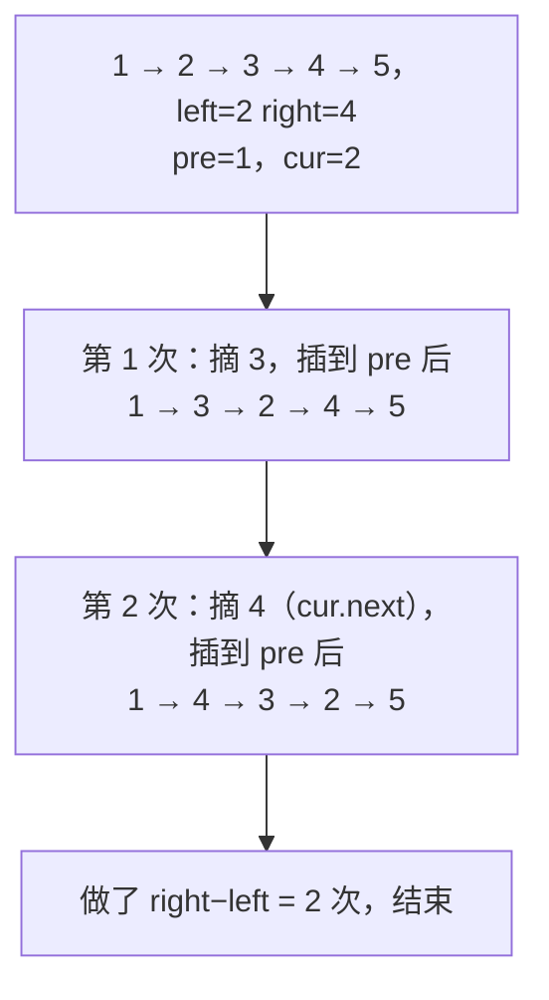
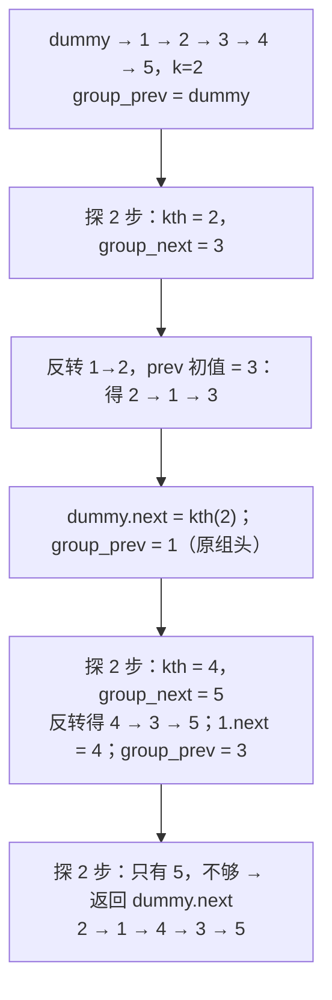
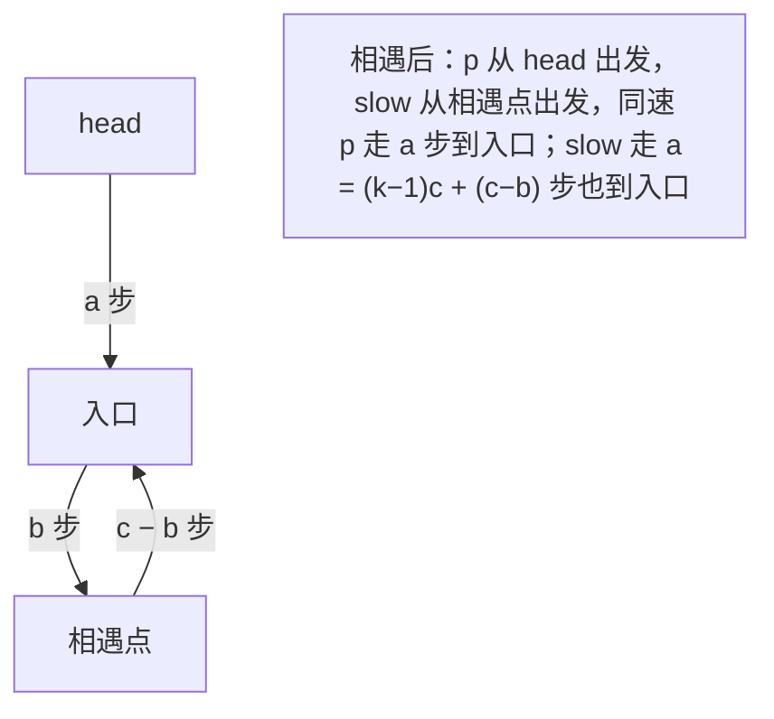

链表题不考算法，考**手稳**：指针改错一个顺序就丢掉半条链。它在面试里出现频率极高，因为十分钟内能看出一个人写代码是不是有章法——有没有用哑节点统一头节点的特殊情况、反转时三个指针的赋值顺序对不对、边界（空链表、单节点、恰好整除）有没有想到。这一篇把链表题的三个骨架（哑节点、三指针反转、快慢指针）讲透，六道主讲题覆盖反转家族、环、合并与排序，每道都画出指针的移动。

本篇要回答的核心问题是：

> **哑节点到底省掉了哪些特判？[^q0] 快慢指针相遇后，为什么一个指针回到头、两个同速再走就在环入口相遇？[^q1] K 个一组反转怎样做到 O(1) 空间且代码不失控？[^q2]**

## 一、识别信号

| 题面里出现 | 想到 | 骨架 |
|---|---|---|
| 可能删除 / 修改头节点 | 哑节点 `dummy.next = head`，最后返回 `dummy.next` | 统一"头"与"中间"的处理 |
| 反转（全部 / 区间 / 每 k 个） | 三指针 `prev, cur, nxt` 或头插法 | 一次改一条 `next`，顺序固定 |
| 中点、倒数第 k 个、判环、环入口 | 快慢指针 | 一个走一步一个走两步；或一个先走 k 步 |
| 两条链的交点 | 两指针各走 A + B | 长度差自动抵消 |
| 合并有序链 | 哑节点 + 尾指针；k 条用堆 | 每次接最小者 |
| 排序链表 | 归并（快慢指针找中点断开） | $$O(n \log n)$$、$$O(\log n)$$ 栈 |
| 含随机指针的复制 | 哈希 `old → new` 两趟；或交织节点 $$O(1)$$ 空间 | |
| 回文判断 | 中点 + 反转后半 + 比较 + 恢复 | |

## 二、模板

### 1. 节点定义与哑节点

<div class="code-tabs" markdown="1">
```python
class ListNode:
    def __init__(self, val=0, next=None):
        self.val, self.next = val, next

dummy = ListNode(0, head)               # 哑节点：head 也有了"前驱"
prev, cur = dummy, head
...
return dummy.next                        # 头可能已经变了，从哑节点取
```
```java
static class ListNode {
    int val;
    ListNode next;

    ListNode(int v) {
        val = v;
    }

    ListNode(int v, ListNode n) {
        val = v;
        next = n;
    }
}

ListNode dummy = new ListNode(0, head);
ListNode prev = dummy, cur = head;
// ...
return dummy.next;
```
</div>

### 2. 三指针反转

<div class="code-tabs" markdown="1">
```python
prev, cur = None, head
while cur:
    nxt = cur.next                       # 1 先保存下一个
    cur.next = prev                      # 2 反向
    prev = cur                           # 3 两个指针前进
    cur = nxt
return prev                              # 新头
```
```java
ListNode prev = null, cur = head;
while (cur != null) {
    ListNode nxt = cur.next;
    cur.next = prev;
    prev = cur;
    cur = nxt;
}
return prev;
```
</div>

Python 里可以写成一行 `cur.next, prev, cur = prev, cur, cur.next`——右侧先整体求值再依次赋值，所以顺序安全；但面试里建议写四行，面试官一眼能看懂。

### 3. 快慢指针

<div class="code-tabs" markdown="1">
```python
slow = fast = head
while fast and fast.next:                # 两个判断都要：fast 可能停在最后一个或 None
    slow = slow.next
    fast = fast.next.next
# 奇数长度：slow 是中点；偶数长度：slow 是第二个中点
```
```java
ListNode slow = head, fast = head;
while (fast != null && fast.next != null) {
    slow = slow.next;
    fast = fast.next.next;
}
```
</div>

想让偶数长度时 `slow` 停在**第一个**中点（归并排序切分要这样），把 `fast` 初始化为 `head.next`。

## 三、主讲题

### 1. LC 206 反转链表

**题意**：反转整条链，返回新头。

**推演**：`1 → 2 → 3`。

| 步 | `prev` | `cur` | 操作后 |
|---|---|---|---|
| 初始 | None | 1 | 1 → 2 → 3 |
| 1 | 1 | 2 | 1 → None；2 → 3 |
| 2 | 2 | 3 | 2 → 1 → None；3 |
| 3 | 3 | None | 3 → 2 → 1 → None |

<div class="code-tabs" markdown="1">
```python
def reverse_list(head):
    prev, cur = None, head
    while cur:
        nxt = cur.next
        cur.next = prev
        prev, cur = cur, nxt
    return prev
```
```java
static ListNode reverseList(ListNode head) {
    ListNode prev = null, cur = head;
    while (cur != null) {
        ListNode nxt = cur.next;
        cur.next = prev;
        prev = cur;
        cur = nxt;
    }
    return prev;
}
```
</div>

**递归版**（面试常要求两种都写）：先反转 `head.next` 之后的部分得到新头，此时 `head.next` 是那段的尾，把 `head` 接到它后面。

<div class="code-tabs" markdown="1">
```python
def reverse_list_recursive(head):
    if not head or not head.next:
        return head
    new_head = reverse_list_recursive(head.next)
    head.next.next = head                # head.next 现在是反转段的尾巴
    head.next = None
    return new_head
```
```java
static ListNode reverseListRecursive(ListNode head) {
    if (head == null || head.next == null) return head;
    ListNode newHead = reverseListRecursive(head.next);
    head.next.next = head;
    head.next = null;
    return newHead;
}
```
</div>

递归深度 $$O(n)$$：Python 默认递归上限 1000，长链会 `RecursionError`，面试里要主动说。

### 2. LC 92 反转链表 II

**题意**：反转第 `left` 到第 `right` 个节点（1-based）。

**头插法**：定位到 `left` 的前驱 `pre`，然后做 `right − left` 次"把 `cur.next` 摘下、插到 `pre` 后面"。`cur` 自己不动，每次它后面的节点被搬到前面去。



<div class="code-tabs" markdown="1">
```python
def reverse_between(head, left, right):
    dummy = ListNode(0, head)
    pre = dummy
    for _ in range(left - 1):
        pre = pre.next                   # pre 停在第 left-1 个
    cur = pre.next
    for _ in range(right - left):
        nxt = cur.next                   # 摘下 nxt
        cur.next = nxt.next
        nxt.next = pre.next              # 插到 pre 后面
        pre.next = nxt
    return dummy.next
```
```java
static ListNode reverseBetween(ListNode head, int left, int right) {
    ListNode dummy = new ListNode(0, head), pre = dummy;
    for (int i = 1; i < left; i++) pre = pre.next;
    ListNode cur = pre.next;
    for (int i = 0; i < right - left; i++) {
        ListNode nxt = cur.next;
        cur.next = nxt.next;
        nxt.next = pre.next;
        pre.next = nxt;
    }
    return dummy.next;
}
```
</div>

`left = 1` 时 `pre` 就是哑节点——这正是哑节点的价值：反转包含头节点的区间与反转中间区间是同一段代码。

### 3. LC 25 K 个一组翻转链表

**题意**：每 $$k$$ 个节点一组反转，不足 $$k$$ 的尾部保持原样。

**分解**：外层循环每次处理一组：(1) 从 `group_prev` 往后探 $$k$$ 步找到 `kth`，不够则结束；(2) 记下 `group_next = kth.next`；(3) 用三指针反转 `group_prev.next … kth`，`prev` 初值设为 `group_next`，这样反转后的尾巴自然指向下一组；(4) 把 `group_prev.next` 接到 `kth`，`group_prev` 前进到反转后的组尾。



<div class="code-tabs" markdown="1">
```python
def reverse_k_group(head, k):
    dummy = ListNode(0, head)
    group_prev = dummy
    while True:
        kth = group_prev
        for _ in range(k):
            kth = kth.next
            if not kth:
                return dummy.next        # 不足 k 个，结束
        group_next = kth.next
        prev, cur = group_next, group_prev.next
        while cur is not group_next:     # 反转这一组
            nxt = cur.next
            cur.next = prev
            prev, cur = cur, nxt
        tmp = group_prev.next            # 原组头，反转后成为组尾
        group_prev.next = kth
        group_prev = tmp
```
```java
static ListNode reverseKGroup(ListNode head, int k) {
    ListNode dummy = new ListNode(0, head), groupPrev = dummy;
    while (true) {
        ListNode kth = groupPrev;
        for (int i = 0; i < k && kth != null; i++) kth = kth.next;
        if (kth == null) return dummy.next;
        ListNode groupNext = kth.next, prev = groupNext, cur = groupPrev.next;
        while (cur != groupNext) {
            ListNode nxt = cur.next;
            cur.next = prev;
            prev = cur;
            cur = nxt;
        }
        ListNode tmp = groupPrev.next;
        groupPrev.next = kth;
        groupPrev = tmp;
    }
}
```
</div>

把 `prev` 初值设为 `group_next` 而不是 `None` 是这段代码不失控的关键：反转后不需要再找组尾去接下一组。

**追问**：*递归写法*——反转前 $$k$$ 个后递归处理剩下的，代码更短但 $$O(n/k)$$ 栈。*不足 $$k$$ 也反转*——去掉探测步骤。*两两交换（LC 24）*——$$k = 2$$ 的特例。

### 4. LC 142 环形链表 II

**题意**：返回环的入口节点，无环返回 `None`。

**Floyd 算法**：快慢指针相遇后，一个指针回到 `head`，两个同速前进，再次相遇处就是入口。

**证明**：设头到入口距离 $$a$$，入口到相遇点 $$b$$，环长 $$c$$。相遇时慢指针走了 $$a + b$$，快指针走了 $$a + b + kc$$（多绕 $$k$$ 圈）且是慢指针的两倍：

$$
2(a + b) = a + b + kc \implies a = kc - b = (k-1)c + (c - b)
$$

也就是：从头走 $$a$$ 步到入口，等于从相遇点走 $$c - b$$ 步（回到入口）再绕 $$k - 1$$ 圈。所以两个指针同速走 $$a$$ 步后都在入口。



<div class="code-tabs" markdown="1">
```python
def detect_cycle(head):
    slow = fast = head
    while fast and fast.next:
        slow, fast = slow.next, fast.next.next
        if slow is fast:                 # 相遇
            p = head
            while p is not slow:
                p, slow = p.next, slow.next
            return p
    return None
```
```java
static ListNode detectCycle(ListNode head) {
    ListNode slow = head, fast = head;
    while (fast != null && fast.next != null) {
        slow = slow.next;
        fast = fast.next.next;
        if (slow == fast) {
            ListNode p = head;
            while (p != slow) {
                p = p.next;
                slow = slow.next;
            }
            return p;
        }
    }
    return null;
}
```
</div>

**追问**：*环长*——相遇后让一个指针再绕一圈计数。*寻找重复数（LC 287）*——把 `nums[i]` 当 `next` 指针，同一算法。*为什么快慢指针一定相遇*——进环后每步距离缩短 1，最多 $$c$$ 步相遇。

### 5. LC 23 合并 K 个升序链表

**题意**：$$k$$ 条有序链合并为一条。

**堆**：把每条链的头入最小堆，每次弹出最小的接到结果尾部，再把它的下一个入堆。$$N$$ 个节点各进出堆一次，$$O(N \log k)$$。

<div class="code-tabs" markdown="1">
```python
def merge_k_lists(lists):
    heap = [(node.val, i, node) for i, node in enumerate(lists) if node]
    heapq.heapify(heap)                  # (值, 链编号, 节点)：编号避免值相等时比较节点
    dummy = tail = ListNode()
    while heap:
        _, i, node = heapq.heappop(heap)
        tail.next = node
        tail = node
        if node.next:
            heapq.heappush(heap, (node.next.val, i, node.next))
    return dummy.next
```
```java
static ListNode mergeKLists(ListNode[] lists) {
    PriorityQueue<ListNode> pq = new PriorityQueue<>((x, y) -> Integer.compare(x.val, y.val));
    for (ListNode n : lists) if (n != null) pq.offer(n);
    ListNode dummy = new ListNode(0), tail = dummy;
    while (!pq.isEmpty()) {
        ListNode n = pq.poll();
        tail.next = n;
        tail = n;
        if (n.next != null) pq.offer(n.next);
    }
    return dummy.next;
}
```
</div>

Python 元组里加链编号 `i` 是必须的：两个节点值相等时 `heapq` 会去比较第三个元素 `node`，`ListNode` 没定义 `<` 就会抛 `TypeError`。

**追问**：*分治合并*——两两合并，$$\log k$$ 轮，每轮 $$O(N)$$，同样 $$O(N \log k)$$、$$O(1)$$ 额外空间（不算递归栈）。*合并两条（LC 21）*——哑节点 + 尾指针，谁小接谁，最后接上剩余。

### 6. LC 148 排序链表

**题意**：$$O(n \log n)$$ 排序链表，进阶要求 $$O(1)$$ 空间。

**归并**：快慢指针找中点并**断开**，递归排序两半，合并。`fast` 从 `head.next` 出发，保证偶数长度时 `slow` 停在前半末尾，`[1, 2]` 才能切成 `[1]` 与 `[2]`（否则切成 `[1, 2]` 与空，死循环）。

<div class="code-tabs" markdown="1">
```python
def sort_list(head):
    if not head or not head.next:
        return head
    slow, fast = head, head.next         # fast 先一步：偶数长度时 slow 落在前半末尾
    while fast and fast.next:
        slow, fast = slow.next, fast.next.next
    mid, slow.next = slow.next, None     # 断开
    return merge_two_lists(sort_list(head), sort_list(mid))
```
```java
static ListNode sortList(ListNode head) {
    if (head == null || head.next == null) return head;
    ListNode slow = head, fast = head.next;
    while (fast != null && fast.next != null) {
        slow = slow.next;
        fast = fast.next.next;
    }
    ListNode mid = slow.next;
    slow.next = null;
    return mergeTwoLists(sortList(head), sortList(mid));
}
```
</div>

**追问**：*$$O(1)$$ 空间*——自底向上归并：步长 1, 2, 4, … 每轮把链切成长度为步长的段两两合并，无递归。面试里说清思路即可，很少要求现场写完。*为什么不用快排*——链表随机访问差、分区不方便，归并的顺序访问天然适合。

## 四、变式与追问

| 追问 | 应对 |
|---|---|
| 删除倒数第 $$n$$ 个（LC 19） | 快指针先走 $$n + 1$$ 步（从哑节点），两指针同行，慢指针停在待删节点前驱 |
| 相交链表（LC 160） | 两指针各走完自己再走对方的链，第二轮对齐；无交点时同时到 `None` |
| 回文链表（LC 234） | 中点 → 反转后半 → 比较 → **恢复**（面试加分） |
| 随机链表复制（LC 138）$$O(1)$$ 空间 | 每个节点后插入副本 → 设副本的 random = 原 random.next → 拆分 |
| 两数相加（LC 2 / 445） | 进位模拟；445 高位在前用栈或先反转 |
| 奇偶链表（LC 328） | 两条链分别串再接 |
| 旋转链表（LC 61） | 成环后在 $$n - k \bmod n$$ 处断开 |
| 删除排序链表中的重复元素 II（LC 82） | 哑节点 + 跳过整段相等值 |
| LRU 缓存（LC 146） | 哈希 + 双向链表（13 篇） |

## 五、两种语言的坑

| | Python | Java |
|---|---|---|
| 节点比较 | `is` 比较身份，`==` 默认也是身份，但别依赖 | `==` 比较引用（正确）；`equals` 未重写等价于 `==` |
| 多重赋值 | `a, b = b, a` 右侧先算完；`cur.next, prev, cur = prev, cur, cur.next` 顺序安全 | 没有元组赋值，必须用临时变量，注意顺序 |
| 堆里放节点 | 元组第二项放序号，避免比较节点 | `PriorityQueue` 传比较器 `(x, y) -> Integer.compare(x.val, y.val)` |
| 递归深度 | 默认 1000，长链递归反转会崩；`sys.setrecursionlimit` 治标 | 默认栈约 512 KB–1 MB，几万层会 `StackOverflowError` |
| 空判断 | `while fast and fast.next` | `while (fast != null && fast.next != null)`，短路求值顺序不能反 |
| 哑节点 | `ListNode(0, head)` | 需要有两个参数的构造器，或 `new ListNode(0); dummy.next = head` |

## 六、题单

| 题 | 一句提示 |
|---|---|
| LC 21 合并两个有序链表 | 哑节点 + 尾指针 |
| LC 19 删除链表的倒数第 N 个结点 | 快指针先走 $$n+1$$ |
| LC 876 链表的中间结点 | 快慢指针 |
| LC 141 环形链表 | 快慢指针相遇 |
| LC 160 相交链表 | 各走 A + B |
| LC 234 回文链表 | 中点 + 反转 + 恢复 |
| LC 138 随机链表的复制 | 哈希两趟 / 交织节点 |
| LC 24 两两交换链表中的节点 | 25 的 $$k = 2$$ |
| LC 2 两数相加 | 进位模拟 |
| LC 82 / 83 删除排序链表中的重复元素 | 哑节点 + 跳段 |
| LC 328 奇偶链表 | 两条链再接 |
| LC 61 旋转链表 | 成环再断 |

## 七、小结

| 骨架 | 用途 | 记住 |
|---|---|---|
| 哑节点 | 头可能被删 / 被换 / 被反转 | `dummy.next = head`，返回 `dummy.next` |
| 三指针反转 | 全部 / 区间 / 分组 | 先存 `nxt`，再改 `cur.next`，再前进 |
| 头插法 | 区间反转 | `pre` 不动，`cur` 不动，搬 `cur.next` |
| 快慢指针 | 中点 / 判环 / 入口 | `while fast and fast.next`；切分时 `fast = head.next` |
| 双指针对齐 | 倒数第 $$k$$ / 相交 | 先走 $$k$$ 步 / 各走 A + B |
| 堆 | 多路合并 | 元组带序号 |

链表题写完后一定用 `[]`、`[1]`、`[1, 2]` 三个输入过一遍——绝大多数 bug 在这三个输入上暴露。

## 八、自测

1. 三指针反转里把 `cur.next = prev` 写在 `nxt = cur.next` 之前会发生什么？

   <details markdown="1">
   <summary>答案</summary>
   `cur.next` 已经指向 `prev`，再取 `nxt = cur.next` 拿到的是 `prev`（第一次是 `None`），链表后半段全部丢失，循环在第一步或第二步就结束，返回只有一个节点的链。顺序必须是"先存后改"。详见[第二章模板 2](#2-三指针反转)。
   </details>

2. LC 148 里把 `fast` 初始化为 `head`（而不是 `head.next`），输入 `[2, 1]` 会怎样？

   <details markdown="1">
   <summary>答案</summary>
   `slow` 停在第二个中点（值 1），`mid = slow.next = None`，前半是整条链 `[2, 1]`、后半为空——递归 `sort_list([2, 1])` 和原问题一样，无限递归直到 `RecursionError` / `StackOverflowError`。`fast = head.next` 让偶数长度时 `slow` 停在前半末尾，切成 `[2]` 与 `[1]`。详见[第三章第 6 题](#6-lc-148-排序链表)。
   </details>

3. 快慢指针相遇时，慢指针一定还没在环里走满一圈——为什么？

   <details markdown="1">
   <summary>答案</summary>
   慢指针进入环时，快指针已在环里某处，两者距离 $$d < c$$（环长）。之后每步快指针追近 1，最多 $$d < c$$ 步相遇，慢指针在环里走了不到一圈。这保证了证明中 $$b < c$$，$$c - b$$ 是从相遇点到入口的正向距离。详见[第三章第 4 题](#4-lc-142-环形链表-ii)。
   </details>

4. `merge_k_lists` 的堆元组去掉链编号 `i`，什么输入会报错？Java 版为什么不需要？

   <details markdown="1">
   <summary>答案</summary>
   两条链的头值相等（如 `[1, 4]` 与 `[1, 3]`）：`heapq` 比较 `(1, node_a)` 与 `(1, node_b)`，第一项相等就比较 `ListNode`，没定义 `__lt__` 抛 `TypeError`。Java 版用显式比较器只比 `val`，相等时不再比较别的字段，不需要序号。详见[第三章第 5 题](#5-lc-23-合并-k-个升序链表)。
   </details>

5. 相交链表（LC 160）的"各走 A + B"法，两条链不相交时为什么能正确返回 `None` 而不是死循环？

   <details markdown="1">
   <summary>答案</summary>
   设长度 $$m, n$$。`p` 走完 A（$$m$$ 步）后转到 B，`q` 走完 B（$$n$$ 步）后转到 A；再走到各自第二条链的末尾时，`p` 共走 $$m + n$$ 步、`q` 共走 $$n + m$$ 步，同时到达 `None`，`p is q` 成立（都是 `None`），循环结束返回 `None`。相交时两者在第二轮的公共段开头相遇。详见[第四章](#四变式与追问)。
   </details>

## 下一篇

[二叉树](/coding-interview-binary-tree.html)

[^q0]: 省掉所有"当前节点是头"的分支：删除头节点（LC 19 / 82 / 203）、在头前插入、反转包含头的区间（LC 92 `left = 1`）、分组反转的第一组（LC 25）。有了 `dummy`，头节点也有前驱，"修改前驱的 `next`"这一个动作对所有位置通用；结果从 `dummy.next` 取，头是否被换掉不需要知道。详见[第二章模板 1](#1-节点定义与哑节点)。

[^q1]: 设头到入口 $$a$$、入口到相遇点 $$b$$、环长 $$c$$。相遇时快指针走了慢指针的两倍：$$2(a+b) = a + b + kc$$，得 $$a = (k-1)c + (c-b)$$。从头走 $$a$$ 步到入口；从相遇点走 $$a$$ 步 = 先走 $$c - b$$ 步回到入口、再绕 $$k - 1$$ 圈，也停在入口。所以同速走 $$a$$ 步后两者在入口相遇。详见[第三章第 4 题](#4-lc-142-环形链表-ii)。

[^q2]: 外层每轮处理一组：先从组前驱探 $$k$$ 步找到 `kth`（不够则结束），记 `group_next = kth.next`；用三指针反转这一组，但 `prev` 的初值设为 `group_next` 而不是 `None`——反转后组尾自动接上下一组，不必再找尾；最后 `group_prev.next = kth`，`group_prev` 前进到原组头（现在的组尾）。只用常数个指针，每个节点处理一次，$$O(n)$$ / $$O(1)$$。详见[第三章第 3 题](#3-lc-25-k-个一组翻转链表)。
