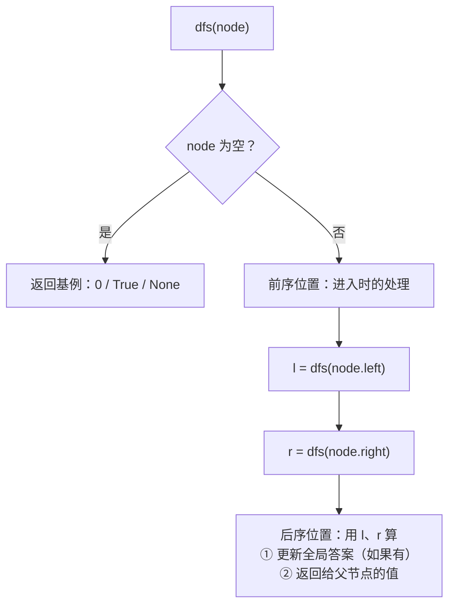
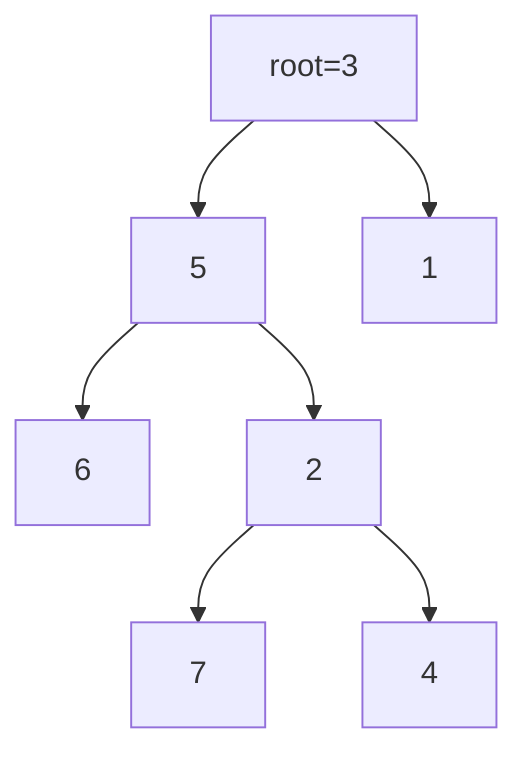
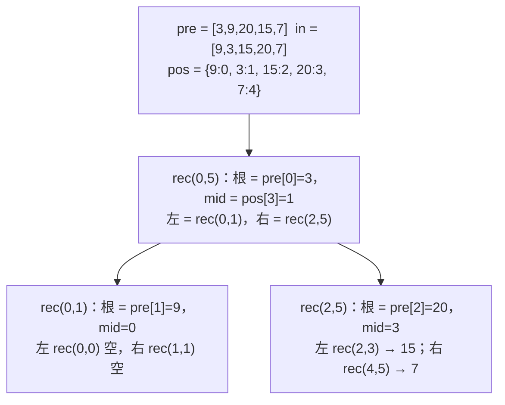
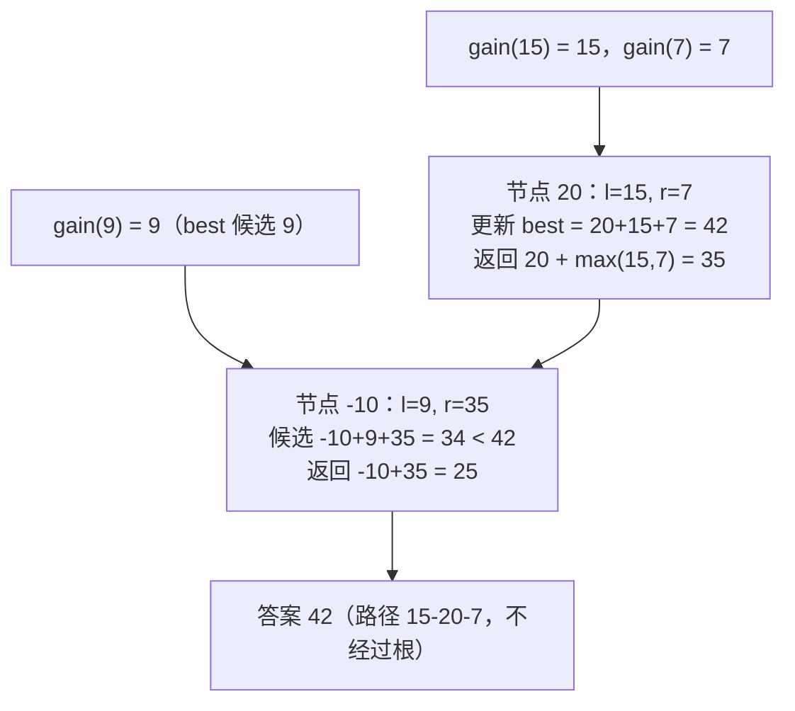

二叉树是面试里出题最多的一类结构，因为它天然是递归的：**一个节点的答案 = 用左右子树的答案拼出来**。几乎所有树题都能用同一个框架写完——决定递归函数返回什么、在哪个位置（前 / 中 / 后序）处理当前节点、递归的终点是什么。难点不在代码长度（多数树题十行以内），而在**返回值和"要更新的全局答案"不是一回事**：直径、最大路径和、LCA 这类题，递归返回的是"向下的一条链"，答案在合并处产生。这一篇用七道主讲题把这个框架讲透，顺带把迭代遍历、层序、序列化、BST 的性质讲清。

本篇要回答的核心问题是：

> **递归函数"返回什么"和"更新什么"为什么常常不是同一个量？[^q0] 验证 BST 为什么不能只比较父子节点？[^q1] 前序 + 中序建树时，哈希表和递归指针各解决什么问题？[^q2]**

## 一、识别信号

| 题面里出现 | 想到 | 遍历顺序 |
|---|---|---|
| 深度、高度、节点数、是否平衡、是否对称 | 后序：先算子树再算自己 | 后序 |
| 路径长度、直径、路径和最大 | 后序返回"向下最长链"，在合并处更新全局最大 | 后序 |
| 最近公共祖先 | 后序：左右各返回找到的目标 | 后序 |
| 按层输出、右视图、最小深度、锯齿 | BFS，每轮先记队列长度 | 层序 |
| 前序 + 中序建树、序列化 | 前序定根，中序定分界 | 前序 |
| 有序性、第 k 小、验证 BST、两数之和 | 中序是升序 | 中序 |
| 路径和等于 K 的路径数 | 树上前缀和 + 哈希（01 篇的树版）、回溯撤销 | 前序 |
| 展开为链表、右指针 | 原地改指针 | 前序 / Morris |

## 二、模板

### 1. 递归三要素

写任何树递归前先回答三个问题：

1. **函数返回什么**——给父节点用的信息（深度、链长、是否找到、子树和）。
2. **在哪里处理当前节点**——前序（进入时）、后序（左右回来后）。
3. **终止条件**——通常是 `node is None` 返回什么（0、`True`、`None`、`(0, 0)`）。



### 2. 后序"返回链、更新路径"

<div class="code-tabs" markdown="1">
```python
best = 0
def dfs(node):
    nonlocal best
    if not node:
        return 0
    l, r = dfs(node.left), dfs(node.right)
    best = max(best, combine(l, r, node))        # 路径在这里"拐弯"，更新答案
    return extend(max(l, r), node)               # 返回只能往一边走的链
```
```java
static int best;

static int dfs(TreeNode node) {
    if (node == null) return 0;
    int l = dfs(node.left), r = dfs(node.right);
    best = Math.max(best, combine(l, r, node));
    return extend(Math.max(l, r), node);
}
```
</div>

### 3. 层序

<div class="code-tabs" markdown="1">
```python
q = deque([root] if root else [])
while q:
    level = []
    for _ in range(len(q)):                      # 先记长度：这一层有几个
        node = q.popleft()
        level.append(node.val)
        if node.left: q.append(node.left)
        if node.right: q.append(node.right)
    out.append(level)
```
```java
Deque<TreeNode> q = new ArrayDeque<>();
if (root != null) q.add(root);
while (!q.isEmpty()) {
    List<Integer> level = new ArrayList<>();
    for (int n = q.size(); n > 0; n--) {
        TreeNode node = q.poll();
        level.add(node.val);
        if (node.left != null) q.add(node.left);
        if (node.right != null) q.add(node.right);
    }
    out.add(level);
}
```
</div>

### 4. 迭代中序

<div class="code-tabs" markdown="1">
```python
stack, cur = [], root
while cur or stack:
    while cur:                                   # 一路向左压栈
        stack.append(cur)
        cur = cur.left
    cur = stack.pop()
    visit(cur)                                   # 弹出即访问
    cur = cur.right                              # 转向右子树
```
```java
Deque<TreeNode> stack = new ArrayDeque<>();
TreeNode cur = root;
while (cur != null || !stack.isEmpty()) {
    while (cur != null) {
        stack.push(cur);
        cur = cur.left;
    }
    cur = stack.pop();
    visit(cur);
    cur = cur.right;
}
```
</div>

## 三、主讲题

### 1. LC 102 二叉树的层序遍历

**题意**：按层返回节点值。

BFS 的唯一要点是"先记下队列长度再循环"，这样一轮正好处理一层。

<div class="code-tabs" markdown="1">
```python
def level_order(root):
    out = []
    q = deque([root] if root else [])
    while q:
        level = []
        for _ in range(len(q)):
            node = q.popleft()
            level.append(node.val)
            if node.left:
                q.append(node.left)
            if node.right:
                q.append(node.right)
        out.append(level)
    return out
```
```java
static List<List<Integer>> levelOrder(TreeNode root) {
    List<List<Integer>> out = new ArrayList<>();
    if (root == null) return out;
    Deque<TreeNode> q = new ArrayDeque<>(List.of(root));
    while (!q.isEmpty()) {
        List<Integer> level = new ArrayList<>();
        for (int n = q.size(); n > 0; n--) {
            TreeNode node = q.poll();
            level.add(node.val);
            if (node.left != null) q.add(node.left);
            if (node.right != null) q.add(node.right);
        }
        out.add(level);
    }
    return out;
}
```
</div>

**追问**：*右视图（LC 199）*——每层最后一个。*锯齿形（LC 103）*——奇数层反转。*最小深度（LC 111）*——BFS 遇到第一个叶子就返回，比 DFS 快。*每层最大值 / 平均值*——同一循环。

### 2. LC 236 二叉树的最近公共祖先

**题意**：给两个节点 `p`、`q`，返回最近公共祖先。

**后序**：`dfs(node)` 返回"在 `node` 子树里找到的 `p` 或 `q`（或 LCA）"。如果左右都非空，说明 `p`、`q` 分居两侧，`node` 就是 LCA；只有一侧非空就返回那一侧；`node` 本身是 `p` 或 `q` 时直接返回自己（另一个一定在它子树里或另一侧，都不影响答案）。



| 查询 | 递归过程 | 结果 |
|---|---|---|
| p = 5, q = 4 | `dfs(5)` 命中 p 直接返回 5（不再往下）；`dfs(1)` 子树无目标返回 `None`；root 收到左 5、右 `None` | 5 |
| p = 6, q = 4 | `dfs(5)`：左 `dfs(6)` 返 6，右 `dfs(2)` 返 4，两侧都有 → 返回 5；root 收到左 5、右 `None` | 5 |
| p = 6, q = 8 | `dfs(5)` 返 6（来自左），`dfs(1)` 返 8（来自右），root 两侧都有 | 3 |

<div class="code-tabs" markdown="1">
```python
def lowest_common_ancestor(root, p, q):
    if not root or root is p or root is q:
        return root
    l = lowest_common_ancestor(root.left, p, q)
    r = lowest_common_ancestor(root.right, p, q)
    if l and r:
        return root                              # 两侧各一个：当前就是 LCA
    return l or r                                # 只有一侧有：把找到的往上传
```
```java
static TreeNode lowestCommonAncestor(TreeNode root, TreeNode p, TreeNode q) {
    if (root == null || root == p || root == q) return root;
    TreeNode l = lowestCommonAncestor(root.left, p, q);
    TreeNode r = lowestCommonAncestor(root.right, p, q);
    if (l != null && r != null) return root;
    return l != null ? l : r;
}
```
</div>

**追问**：*BST 的 LCA（LC 235）*——用大小关系走，$$O(h)$$ 不用递归。*有父指针*——两条链的相交问题（04 篇 LC 160）。*`p` 或 `q` 可能不在树里（LC 1644）*——要额外统计找到几个。

### 3. LC 105 从前序与中序遍历序列构造二叉树

**题意**：给前序、中序（无重复），还原树。

**两个工具**：哈希表 `pos[val] → 中序下标`，让"根在中序里的位置"是 $$O(1)$$；一个前序指针 `pre_idx` 顺序消耗前序数组——因为前序的顺序就是"根、左子树全部、右子树全部"，先递归左子树自然先消耗左子树的节点。递归只需要传中序的区间 `[lo, hi)`。



<div class="code-tabs" markdown="1">
```python
def build_tree(preorder, inorder):
    pos = {v: i for i, v in enumerate(inorder)}
    pre_idx = [0]                                # 用 list 装一个 int，闭包里可改

    def rec(lo, hi):                             # 中序区间 [lo, hi)
        if lo >= hi:
            return None
        val = preorder[pre_idx[0]]
        pre_idx[0] += 1
        node = TreeNode(val)
        mid = pos[val]
        node.left = rec(lo, mid)                 # 先建左：前序指针先消耗左子树
        node.right = rec(mid + 1, hi)
        return node

    return rec(0, len(inorder))
```
```java
static int preIdx;

static TreeNode buildTree(int[] preorder, int[] inorder) {
    Map<Integer, Integer> pos = new HashMap<>();
    for (int i = 0; i < inorder.length; i++) pos.put(inorder[i], i);
    preIdx = 0;
    return rec(preorder, pos, 0, inorder.length);
}

private static TreeNode rec(int[] pre, Map<Integer, Integer> pos, int lo, int hi) {
    if (lo >= hi) return null;
    TreeNode n = new TreeNode(pre[preIdx++]);
    int mid = pos.get(n.val);
    n.left = rec(pre, pos, lo, mid);
    n.right = rec(pre, pos, mid + 1, hi);
    return n;
}
```
</div>

**追问**：*中序 + 后序（LC 106）*——后序从尾往前取根，先建**右**子树。*前序 + 后序（LC 889）*——不唯一，取前序第二个元素为左子树根。*为什么不能前序 + 后序唯一确定*——单孩子节点无法区分左右。

### 4. LC 124 二叉树中的最大路径和

**题意**：路径是任意两节点间的一条链（不必经过根），求节点和最大。节点值可负。

**模板 2 的典型应用**：`gain(node)` 返回"从 `node` 向下走一条链的最大和"（负贡献截断为 0）；答案在每个节点处用 `node.val + l + r` 更新（路径在此拐弯）。



<div class="code-tabs" markdown="1">
```python
def max_path_sum(root):
    best = float("-inf")                         # 节点可能全负，不能初始化为 0

    def gain(node):
        nonlocal best
        if not node:
            return 0
        l = max(gain(node.left), 0)              # 负贡献不要
        r = max(gain(node.right), 0)
        best = max(best, node.val + l + r)       # 在这里拐弯的路径
        return node.val + max(l, r)              # 给父节点：只能带一侧

    gain(root)
    return best
```
```java
static int best;

static int maxPathSum(TreeNode root) {
    best = Integer.MIN_VALUE;
    gain(root);
    return best;
}

private static int gain(TreeNode n) {
    if (n == null) return 0;
    int l = Math.max(gain(n.left), 0), r = Math.max(gain(n.right), 0);
    best = Math.max(best, n.val + l + r);
    return n.val + Math.max(l, r);
}
```
</div>

**追问**：*直径（LC 543）*——同一模板，`gain` 返回深度、`best` 更新 `l + r`。*路径必须从根开始*——那就是 `gain(root)` 本身。*要输出路径*——在更新 `best` 时记下拐点，再从拐点两侧沿最大链下行。

### 5. LC 98 验证二叉搜索树

**题意**：判断是否是 BST：左子树所有节点 < 根 < 右子树所有节点。

**错误做法**：只比较 `node.left.val < node.val < node.right.val`。反例：`[5, 4, 6, null, null, 3, 7]`——3 在 5 的右子树里却小于 5，但它的父节点 6 > 3 满足局部比较。

**正确做法**：递归时带**上下界** `(lo, hi)`，向左走时上界收紧为 `node.val`，向右走时下界收紧。

<div class="code-tabs" markdown="1">
```python
def is_valid_bst(root):
    def check(node, lo, hi):
        if not node:
            return True
        if not (lo < node.val < hi):
            return False
        return check(node.left, lo, node.val) and check(node.right, node.val, hi)
    return check(root, float("-inf"), float("inf"))
```
```java
static boolean isValidBST(TreeNode r) {
    return check(r, Long.MIN_VALUE, Long.MAX_VALUE);
}

private static boolean check(TreeNode n, long lo, long hi) { // long：节点值可能是 Integer 极值
    if (n == null) return true;
    if (n.val <= lo || n.val >= hi) return false;
    return check(n.left, lo, n.val) && check(n.right, n.val, hi);
}
```
</div>

**另一种做法**：中序遍历必须严格递增，用一个 `prev` 变量比较。两种都要会说。

**追问**：*第 k 小（LC 230）*——迭代中序数到第 k 个即停，$$O(h + k)$$。*两数之和 IV（LC 653）*——中序得有序数组 + 对撞指针，或哈希。*恢复 BST（LC 99）*——中序里找两个逆序位置交换。

### 6. LC 297 二叉树的序列化与反序列化

**题意**：树 ↔ 字符串，能无损还原。

**前序 + 空标记**：`3,9,#,#,20,15,#,#,7,#,#`。反序列化按同样的前序顺序消费 token：遇 `#` 返回空，否则建节点、递归建左、递归建右。用迭代器（Python）或队列（Java）顺序消费，不需要传下标。

<div class="code-tabs" markdown="1">
```python
def serialize(root):
    out = []
    def rec(node):
        if not node:
            out.append("#")
            return
        out.append(str(node.val))
        rec(node.left)
        rec(node.right)
    rec(root)
    return ",".join(out)

def deserialize(data):
    it = iter(data.split(","))
    def rec():
        tok = next(it)
        if tok == "#":
            return None
        node = TreeNode(int(tok))
        node.left = rec()
        node.right = rec()
        return node
    return rec()
```
```java
static String serialize(TreeNode root) {
    StringBuilder sb = new StringBuilder();
    ser(root, sb);
    return sb.substring(0, sb.length() - 1);
}

private static void ser(TreeNode n, StringBuilder sb) {
    if (n == null) {
        sb.append("#,");
        return;
    }
    sb.append(n.val).append(',');
    ser(n.left, sb);
    ser(n.right, sb);
}

static TreeNode deserialize(String data) {
    return des(new ArrayDeque<>(Arrays.asList(data.split(","))));
}

private static TreeNode des(Deque<String> toks) {
    String t = toks.poll();
    if (t.equals("#")) return null;
    TreeNode n = new TreeNode(Integer.parseInt(t));
    n.left = des(toks);
    n.right = des(toks);
    return n;
}
```
</div>

**追问**：*层序版本*——LeetCode 的输入格式就是层序 + `null`，用队列配对父子。*BST 能省掉 `#` 吗（LC 449）*——能：前序序列 + 上下界即可唯一还原。*为什么只有前序（无 `#`）不够*——单孩子节点无法区分左右。

### 7. LC 437 路径总和 III

**题意**：路径必须向下（父到子），求和等于 `target` 的路径数。

**树上前缀和**：把 01 篇的"前缀和 + 哈希计数"搬到树上——从根到当前节点的路径和是"前缀和"，`count[pre - target]` 就是以当前节点结尾的答案数。区别是**离开一个节点时要撤销它的计数**（回溯），否则兄弟子树会读到不属于自己祖先链的前缀。

<div class="code-tabs" markdown="1">
```python
def path_sum_iii(root, target):
    count = defaultdict(int)
    count[0] = 1
    ans = 0

    def dfs(node, pre):
        nonlocal ans
        if not node:
            return
        pre += node.val
        ans += count[pre - target]
        count[pre] += 1
        dfs(node.left, pre)
        dfs(node.right, pre)
        count[pre] -= 1                          # 回溯：离开这条祖先链

    dfs(root, 0)
    return ans
```
```java
static int pathSumIII(TreeNode root, int target) {
    Map<Long, Integer> count = new HashMap<>();
    count.put(0L, 1);
    return dfs(root, 0L, target, count);
}

private static int dfs(TreeNode n, long pre, int target, Map<Long, Integer> count) {
    if (n == null) return 0;
    pre += n.val;
    int ans = count.getOrDefault(pre - target, 0);
    count.merge(pre, 1, Integer::sum);
    ans += dfs(n.left, pre, target, count) + dfs(n.right, pre, target, count);
    count.merge(pre, -1, Integer::sum);
    return ans;
}
```
</div>

**追问**：*路径必须根到叶（LC 112 / 113）*——简单的 DFS 减 `target`，到叶子判 0。*$$O(n^2)$$ 的双重递归*——对每个节点做一次"从它向下的路径和"，面试先说这个再优化到前缀和。

## 四、变式与追问

| 追问 | 应对 |
|---|---|
| 递归改迭代 | 前序 / 中序用栈（模板 4）；后序 = 前序（右左）再反转；层序用队列 |
| $$O(1)$$ 空间遍历 | Morris：用叶子的空右指针临时指回前驱，遍历完恢复 |
| 展开为链表（LC 114） | 左子树最右节点接上右子树，右指针指向左子树，左置空，$$O(1)$$ 空间 |
| 翻转 / 对称 / 相同（LC 226 / 101 / 100） | 两棵树同时递归 |
| 是否平衡（LC 110） | 后序返回高度，不平衡返回 −1 提前终止 |
| 完全二叉树节点数（LC 222） | 左右高度相等则 $$2^h - 1$$，否则递归，$$O(\log^2 n)$$ |
| 填充右侧指针（LC 116 / 117） | 层序；或用已建好的上一层链表遍历下一层，$$O(1)$$ 空间 |
| 子树是否相同 / 子结构（LC 572） | 每个节点尝试匹配；或序列化后做字符串匹配 |
| N 叉树 | `for child in node.children`，其余同 |

## 五、两种语言的坑

| | Python | Java |
|---|---|---|
| 递归里改外层变量 | `nonlocal best`；或用 `self.best` / 单元素列表 | 静态字段或类字段；多线程环境别用静态 |
| 递归深度 | 默认 1000，退化成链的树（$$n = 10^4$$）会崩，要 `sys.setrecursionlimit` 或改迭代 | 默认栈 $$\sim 10^4$$ 层通常够，深链也可能 `StackOverflowError` |
| 无穷初值 | `float("-inf")` | `Integer.MIN_VALUE`；上下界用 `Long` 避免节点值恰好是极值 |
| 节点比较 | `root is p` | `root == p`（引用相等） |
| 迭代器消费 token | `it = iter(list)`; `next(it)` | `Deque<String>` 的 `poll()` |
| 空树 | `deque([root] if root else [])` | 先 `if (root == null) return out;` |
| 三元表达式 | `l or r` 利用真值（节点对象为真） | `l != null ? l : r` |

## 六、题单

| 题 | 一句提示 |
|---|---|
| LC 94 / 144 / 145 三种遍历 | 迭代版都要会；后序 = 反转的"根右左" |
| LC 104 / 111 最大 / 最小深度 | 后序；最小深度注意单孩子节点 |
| LC 226 翻转二叉树 | 交换后递归 |
| LC 101 对称二叉树 | 镜像比较两子树 |
| LC 543 二叉树的直径 | 与 124 同模板 |
| LC 110 平衡二叉树 | 高度 + 提前终止 |
| LC 230 BST 第 K 小 | 迭代中序 |
| LC 199 右视图 | 层序取末 |
| LC 114 展开为链表 | 原地改指针 |
| LC 106 中序 + 后序建树 | 后序倒着取根，先建右 |
| LC 112 / 113 路径总和 I / II | 根到叶 DFS |
| LC 108 有序数组转 BST | 取中点为根递归 |
| LC 116 填充右侧指针 | 层序或上一层链 |

## 七、小结

| 题型 | 返回给父节点 | 在哪更新答案 | 代表题 |
|---|---|---|---|
| 子树属性 | 深度 / 节点数 / 是否合法 | 返回值本身 | 104 · 110 · 98 |
| 路径类 | 向下的最长 / 最大链 | 合并处：`l + r + node` | 124 · 543 |
| 查找类 | 找到的节点或 `None` | 两侧都非空的节点 | 236 |
| 构建类 | 建好的子树根 | — | 105 · 106 · 108 · 297 |
| 计数类 | — | 前序位置用哈希，离开时撤销 | 437 |
| 按层 | — | BFS 每轮一层 | 102 · 199 · 111 |

写树题时先用一句话回答"返回什么"，再写终止条件，最后填后序位置的合并逻辑——顺序对了，代码基本不会错。

## 八、自测

1. `max_path_sum` 里 `best` 初始化为 0 会在什么输入上出错？

   <details markdown="1">
   <summary>答案</summary>
   全负数的树，如单节点 `[-3]`：正确答案 −3，但 `best = 0` 永远不被更新（`-3 + 0 + 0 < 0`），返回 0。路径至少含一个节点，所以 `best` 必须初始化为 `-inf` / `Integer.MIN_VALUE`。注意 `gain` 里的截断为 0 是对的——那是"子树贡献可以不要"，与"路径至少一个节点"不矛盾。详见[第三章第 4 题](#4-lc-124-二叉树中的最大路径和)。
   </details>

2. LC 236 的递归里，`root is p` 时直接返回 `root` 而不再往下找 `q`——如果 `q` 就在 `p` 的子树里，答案对吗？如果 `q` 在另一侧呢？

   <details markdown="1">
   <summary>答案</summary>
   都对。`q` 在 `p` 子树里：LCA 就是 `p`，返回 `p` 正确。`q` 在另一侧：父节点收到左 `p`、右 `q` 两侧非空，返回父节点，正确。这是因为返回值的含义是"这棵子树里找到的目标之一或 LCA"，`p` 自己就已经是"找到的目标"，不需要知道 `q` 在哪。详见[第三章第 2 题](#2-lc-236-二叉树的最近公共祖先)。
   </details>

3. 反序列化 `"1,#,2,#,#"` 会得到什么树？如果把 `rec()` 里建左右子树的两行顺序换过来会怎样？

   <details markdown="1">
   <summary>答案</summary>
   根 1，左空，右 2（2 的左右都空）。换顺序后消费 token 的顺序变成"根、右、左"，`"1,#,2,#,#"` 会被解析成根 1、右空、左 2——与序列化时的前序不一致。序列化与反序列化必须用同一种顺序。详见[第三章第 6 题](#6-lc-297-二叉树的序列化与反序列化)。
   </details>

4. LC 437 去掉 `count[pre] -= 1` 这一行，什么形状的树会算错？

   <details markdown="1">
   <summary>答案</summary>
   左子树在祖先链上留下的前缀和会被右子树误用。`[2, -2, 0]`（根 2，左 −2，右 0）、target 2：正确答案 2（`[2]` 与 `2→0`）。去掉撤销后：左子树 −2 的 `pre = 0`，往 `count[0]` 加了一次（此时 `count[0] = 2`）；进入右子树 0，`pre = 2`，查 `count[2 − 2] = count[0]` 得到 2 而不是 1——多算了一条"从 −2 出发"的不存在的路径，返回 3。撤销保证 `count` 里只有当前节点的祖先链。详见[第三章第 7 题](#7-lc-437-路径总和-iii)。
   </details>

5. 验证 BST 的"中序递增"法，为什么要用**严格**递增？把 `Long` 上下界法改成 `int`，哪个输入会出错？

   <details markdown="1">
   <summary>答案</summary>
   BST 的定义要求左子树所有值**小于**根、右子树**大于**根，相等值不合法（LeetCode 98 的定义），所以中序序列必须严格递增，用 `prev < cur` 判断。`int` 上下界：单节点 `[2147483647]`——初始上界 `Integer.MAX_VALUE`，条件 `val < hi` 不成立，误判为非 BST；用 `Long` 或用 `null` 表示无界即可。详见[第三章第 5 题](#5-lc-98-验证二叉搜索树)。
   </details>

## 下一篇

[图：BFS / DFS / 拓扑 / 并查集 / 最短路](/coding-interview-graph-bfs-dfs-topological-union-find.html)

[^q0]: 返回值是给**父节点**用的信息，必须是"能继续往上延伸"的量——从当前节点向下的一条链（深度、单侧最大和）；而答案往往是"在某个节点拐弯"的量（直径 = 左链 + 右链，路径和 = 左 + 右 + 自己），它不能再往上延伸，只能在拐点处更新一个全局变量。分清这两个量，直径、最大路径和、LCA 一类题都是同一个模板。详见[第二章模板 2](#2-后序返回链更新路径)。

[^q1]: BST 的约束是**全局**的：右子树里的每个节点都要大于根，而不只是右孩子。`[5, 4, 6, null, null, 3, 7]` 里 3 是 6 的左孩子（3 < 6 局部成立），但 3 在 5 的右子树里却小于 5。正确做法是递归时带上下界 `(lo, hi)`，向左走上界收为 `node.val`、向右走下界收为 `node.val`；或者中序遍历检查严格递增。详见[第三章第 5 题](#5-lc-98-验证二叉搜索树)。

[^q2]: 哈希表 `pos[val] → 中序下标` 把"根在中序里的位置"从 $$O(n)$$ 线性查找变成 $$O(1)$$，总复杂度从 $$O(n^2)$$ 降到 $$O(n)$$。前序指针 `pre_idx` 利用"前序 = 根、左子树全部、右子树全部"的性质顺序消耗前序数组：先递归建左子树自然先用掉左子树的节点，所以递归只需传中序区间 `[lo, hi)`，不必计算前序区间。详见[第三章第 3 题](#3-lc-105-从前序与中序遍历序列构造二叉树)。
