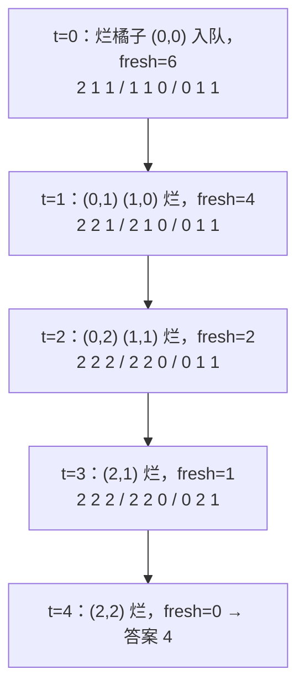
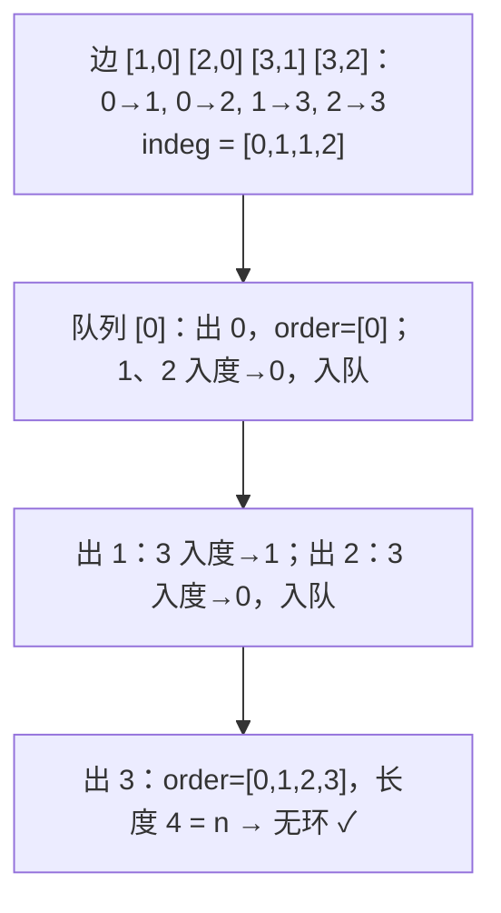
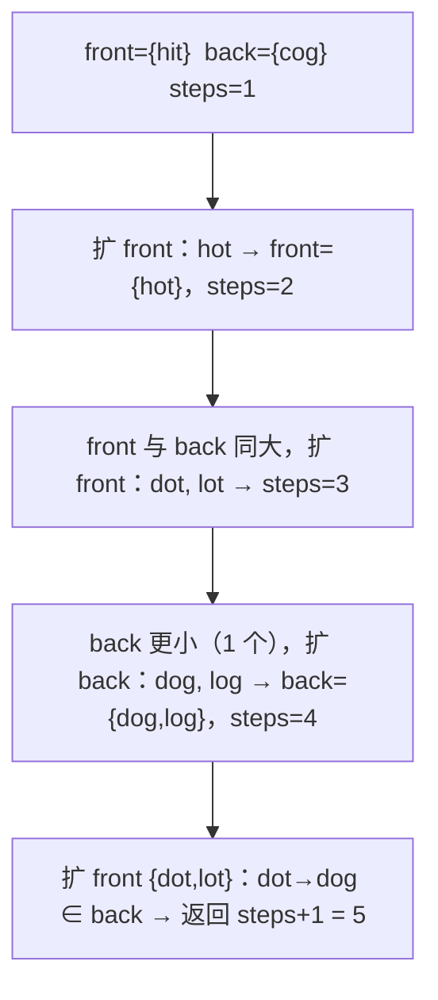

面试里的图题很少给你一张"图"——给的是网格、课程依赖、单词列表、账户邮箱，第一步是**看出它是图**：格子是节点、四邻是边；课程是节点、先修关系是有向边；单词是节点、改一个字母能到达是边。看出来之后，可用的算法只有五个：BFS（最短步数、按层扩散）、DFS（连通块、路径存在性）、拓扑排序（有向无环图的依赖顺序）、并查集（动态连通性）、Dijkstra（带权最短路）。这一篇六道主讲题每种一到两道，重点是**建图**和**visited 放在哪**——图题的 bug 多半出在这两处。

本篇要回答的核心问题是：

> **BFS 的 visited 标记应该在入队时打还是出队时打？[^q0] 拓扑排序怎样同时判断有没有环？[^q1] 并查集的路径压缩和按大小合并各起什么作用，写哪一个就够？[^q2]**

## 一、识别信号

| 题面里出现 | 算法 | 建图方式 |
|---|---|---|
| 网格里的岛屿、区域、连通块个数 | DFS / BFS 洪水填充 | 隐式：格子 + 四方向 |
| "最少步数 / 最短时间 / 几分钟后"（无权） | BFS，按层计数 | 多源时所有源同时入队 |
| 先修课程、任务依赖、编译顺序、"能否完成" | 拓扑排序（Kahn） | 邻接表 + 入度数组 |
| "是否有环"（有向） | Kahn 输出不满 $$n$$；或 DFS 三色 | |
| 朋友圈、账户合并、等式方程、动态加边问连通 | 并查集 | `parent[]` 数组 |
| 带正权的最短路 | Dijkstra（堆 + 懒删除） | 邻接表 `(v, w)` |
| 带负权 / 最多 $$k$$ 站 | Bellman-Ford / 限层 BFS | |
| 单词接龙、状态转换、八数码 | BFS on 状态图（双向 BFS 加速） | 隐式：由规则生成邻居 |
| 复制一张图 | DFS + 哈希 `old → new` | |

## 二、模板

### 1. 网格 DFS（洪水填充）

<div class="code-tabs" markdown="1">
```python
DIRS = ((1, 0), (-1, 0), (0, 1), (0, -1))

def sink(grid, i, j):
    if not (0 <= i < m and 0 <= j < n) or grid[i][j] != "1":
        return                                   # 越界或不是目标：直接返回（把边界判断放进递归入口）
    grid[i][j] = "0"                             # 原地标记 visited
    for di, dj in DIRS:
        sink(grid, i + di, j + dj)
```

```java
static final int[][] DIRS = {{1, 0}, {-1, 0}, {0, 1}, {0, -1}};

static void sink(char[][] g, int i, int j) {
    if (i < 0 || j < 0 || i >= g.length || j >= g[0].length || g[i][j] != '1') return;
    g[i][j] = '0';
    for (int[] d : DIRS) sink(g, i + d[0], j + d[1]);
}
```

</div>

### 2. BFS（按层）

<div class="code-tabs" markdown="1">
```python
q = deque(sources)
for s in sources: visited.add(s)                 # 入队时标记
steps = 0
while q:
    for _ in range(len(q)):                      # 一层
        u = q.popleft()
        if u == target: return steps
        for v in neighbors(u):
            if v not in visited:
                visited.add(v)                   # 入队时标记，不是出队时
                q.append(v)
    steps += 1
```
```java
Deque<int[]> q = new ArrayDeque<>(sources);
int steps = 0;
while (!q.isEmpty()) {
    for (int n = q.size(); n > 0; n--) {
        int[] u = q.poll();
        if (isTarget(u)) return steps;
        for (int[] v : neighbors(u))
            if (!visited[v[0]][v[1]]) {
                visited[v[0]][v[1]] = true;
                q.add(v);
            }
    }
    steps++;
}
```
</div>

### 3. Kahn 拓扑排序

<div class="code-tabs" markdown="1">
```python
graph = defaultdict(list)
indeg = [0] * n
for a, b in edges:                               # b -> a（b 是 a 的先修）
    graph[b].append(a)
    indeg[a] += 1
q = deque(i for i in range(n) if indeg[i] == 0)
order = []
while q:
    u = q.popleft()
    order.append(u)
    for v in graph[u]:
        indeg[v] -= 1
        if indeg[v] == 0:
            q.append(v)
# len(order) < n 说明有环
```
```java
List<List<Integer>> graph = ...; // 邻接表
int[] indeg = new int[n];
for (int[] e : edges) {
    graph.get(e[1]).add(e[0]);
    indeg[e[0]]++;
}

Deque<Integer> q = new ArrayDeque<>();
for (int i = 0; i < n; i++) {
    if (indeg[i] == 0) q.add(i);
}

int[] order = new int[n];
int k = 0;
while (!q.isEmpty()) {
    int u = q.poll();
    order[k++] = u;
    for (int v : graph.get(u)) {
        if (--indeg[v] == 0) q.add(v);
    }
}
// k < n 说明有环
```
</div>

### 4. 并查集

<div class="code-tabs" markdown="1">
```python
class UnionFind:
    def __init__(self, n):
        self.parent = list(range(n))
        self.size = [1] * n
        self.count = n                           # 连通块数

    def find(self, x):
        while self.parent[x] != x:
            self.parent[x] = self.parent[self.parent[x]]   # 路径减半
            x = self.parent[x]
        return x

    def union(self, a, b):
        ra, rb = self.find(a), self.find(b)
        if ra == rb:
            return False
        if self.size[ra] < self.size[rb]:
            ra, rb = rb, ra
        self.parent[rb] = ra                     # 小挂大
        self.size[ra] += self.size[rb]
        self.count -= 1
        return True
```
```java
static class UnionFind {
    int[] parent, size;
    int count;

    UnionFind(int n) {
        parent = new int[n];
        size = new int[n];
        count = n;
        for (int i = 0; i < n; i++) {
            parent[i] = i;
            size[i] = 1;
        }
    }

    int find(int x) {
        while (parent[x] != x) {
            parent[x] = parent[parent[x]];
            x = parent[x];
        }
        return x;
    }

    boolean union(int a, int b) {
        int ra = find(a), rb = find(b);
        if (ra == rb) return false;
        if (size[ra] < size[rb]) {
            int t = ra;
            ra = rb;
            rb = t;
        }
        parent[rb] = ra;
        size[ra] += size[rb];
        count--;
        return true;
    }
}
```
</div>

### 5. Dijkstra（堆 + 懒删除）

<div class="code-tabs" markdown="1">
```python
dist = {src: 0}
heap = [(0, src)]
while heap:
    d, u = heapq.heappop(heap)
    if d > dist.get(u, inf):
        continue                                 # 过期条目：更短的已经处理过
    for v, w in graph[u]:
        if d + w < dist.get(v, inf):
            dist[v] = d + w
            heapq.heappush(heap, (d + w, v))     # 不删旧条目，靠上面的判断跳过
```
```java
int[] dist = new int[n];
Arrays.fill(dist, Integer.MAX_VALUE);
dist[src] = 0;
PriorityQueue<int[]> pq = new PriorityQueue<>((a, b) -> Integer.compare(a[0], b[0]));
pq.offer(new int[] {0, src});
while (!pq.isEmpty()) {
    int[] cur = pq.poll();
    int d = cur[0], u = cur[1];
    if (d > dist[u]) continue;
    for (int[] e : graph.get(u))
        if (d + e[1] < dist[e[0]]) {
            dist[e[0]] = d + e[1];
            pq.offer(new int[] {dist[e[0]], e[0]});
        }
}
```
</div>

## 三、主讲题

### 1. LC 200 岛屿数量

**题意**：`'1'` 陆地 `'0'` 水，四连通的陆地算一个岛，数岛。

每遇到一个 `'1'`，计数加一，然后 DFS 把整座岛"沉掉"（改成 `'0'`），这样不需要额外的 visited 数组。

<div class="code-tabs" markdown="1">
```python
def num_islands(grid):
    m, n = len(grid), len(grid[0])

    def sink(i, j):
        if not (0 <= i < m and 0 <= j < n) or grid[i][j] != "1":
            return
        grid[i][j] = "0"
        for di, dj in DIRS:
            sink(i + di, j + dj)

    count = 0
    for i in range(m):
        for j in range(n):
            if grid[i][j] == "1":
                count += 1
                sink(i, j)
    return count
```
```java
static int numIslands(char[][] g) {
    int count = 0;
    for (int i = 0; i < g.length; i++)
        for (int j = 0; j < g[0].length; j++)
            if (g[i][j] == '1') {
                count++;
                sink(g, i, j);
            }
    return count;
}
```
</div>

**追问**：*不能修改输入*——用 `visited` 集合。*递归深度*——$$300 \times 300$$ 全是陆地时递归 $$9 \times 10^4$$ 层，Python 会崩，改用显式栈或 BFS。*岛的最大面积（LC 695）*——DFS 返回面积。*岛的周长（LC 463）*——每个陆地格子的四邻里"水或边界"的个数之和。

### 2. LC 994 腐烂的橘子

**题意**：2 是烂橘子、1 是好橘子，每分钟烂橘子感染四邻，问几分钟全烂；不可能返回 −1。

**多源 BFS**：所有烂橘子**同时**入队作为第 0 层，按层扩散，层数就是分钟数。同时数好橘子，结束时还有剩就返回 −1。



<div class="code-tabs" markdown="1">
```python
def oranges_rotting(grid):
    m, n = len(grid), len(grid[0])
    q = deque()
    fresh = 0
    for i in range(m):
        for j in range(n):
            if grid[i][j] == 2:
                q.append((i, j))
            elif grid[i][j] == 1:
                fresh += 1
    minutes = 0
    while q and fresh:                           # fresh 为 0 就不再多算一分钟
        for _ in range(len(q)):
            i, j = q.popleft()
            for di, dj in DIRS:
                x, y = i + di, j + dj
                if 0 <= x < m and 0 <= y < n and grid[x][y] == 1:
                    grid[x][y] = 2               # 入队时标记
                    fresh -= 1
                    q.append((x, y))
        minutes += 1
    return -1 if fresh else minutes
```
```java
static int orangesRotting(int[][] g) {
    int m = g.length, n = g[0].length, fresh = 0, minutes = 0;
    Deque<int[]> q = new ArrayDeque<>();
    for (int i = 0; i < m; i++)
        for (int j = 0; j < n; j++) {
            if (g[i][j] == 2) q.add(new int[] {i, j});
            else if (g[i][j] == 1) fresh++;
        }
    while (!q.isEmpty() && fresh > 0) {
        for (int s = q.size(); s > 0; s--) {
            int[] c = q.poll();
            for (int[] d : DIRS) {
                int x = c[0] + d[0], y = c[1] + d[1];
                if (x >= 0 && y >= 0 && x < m && y < n && g[x][y] == 1) {
                    g[x][y] = 2;
                    fresh--;
                    q.add(new int[] {x, y});
                }
            }
        }
        minutes++;
    }
    return fresh == 0 ? minutes : -1;
}
```
</div>

`while q and fresh` 里的 `fresh` 条件处理两个边界：一开始就没有好橘子返回 0（而不是 1）；最后一层烂完后不再多计一分钟。

**追问**：*01 矩阵（LC 542，每个格子到最近 0 的距离）*——所有 0 为源的多源 BFS，是同一模板。*为什么不对每个好橘子单独 BFS*——$$O((mn)^2)$$；多源 BFS 一次算完所有距离。

### 3. LC 207 / 210 课程表

**题意**：$$n$$ 门课，`[a, b]` 表示学 `a` 前要先学 `b`。能否学完？给出一个顺序。

**Kahn**：入度为 0 的课先学；学完一门，它的后继入度减一，减到 0 就可以学。最后学到的课数不等于 $$n$$，说明剩下的课互相依赖——有环。



<div class="code-tabs" markdown="1">
```python
def find_order(num_courses, prerequisites):
    graph = defaultdict(list)
    indeg = [0] * num_courses
    for a, b in prerequisites:                   # b -> a
        graph[b].append(a)
        indeg[a] += 1
    q = deque(i for i in range(num_courses) if indeg[i] == 0)
    order = []
    while q:
        u = q.popleft()
        order.append(u)
        for v in graph[u]:
            indeg[v] -= 1
            if indeg[v] == 0:
                q.append(v)
    return order if len(order) == num_courses else []

def can_finish(num_courses, prerequisites):
    return len(find_order(num_courses, prerequisites)) == num_courses
```
```java
static int[] findOrder(int numCourses, int[][] prerequisites) {
    List<List<Integer>> graph = new ArrayList<>();
    for (int i = 0; i < numCourses; i++) graph.add(new ArrayList<>());
    int[] indeg = new int[numCourses];
    for (int[] p : prerequisites) {
        graph.get(p[1]).add(p[0]);
        indeg[p[0]]++;
    }
    Deque<Integer> q = new ArrayDeque<>();
    for (int i = 0; i < numCourses; i++) if (indeg[i] == 0) q.add(i);
    int[] order = new int[numCourses];
    int k = 0;
    while (!q.isEmpty()) {
        int u = q.poll();
        order[k++] = u;
        for (int v : graph.get(u)) if (--indeg[v] == 0) q.add(v);
    }
    return k == numCourses ? order : new int[0];
}
```
</div>

**DFS 三色法**（面试常要求第二种）：白 = 未访问，灰 = 在当前递归栈上，黑 = 已完成。DFS 时遇到灰色节点就是环。拓扑序 = 节点变黑的逆序。

<div class="code-tabs" markdown="1">
```python
def can_finish_dfs(num_courses, prerequisites):
    graph = defaultdict(list)
    for a, b in prerequisites:
        graph[b].append(a)
    color = [0] * num_courses                    # 0 白 1 灰 2 黑

    def dfs(u):
        color[u] = 1
        for v in graph[u]:
            if color[v] == 1 or (color[v] == 0 and not dfs(v)):
                return False                     # 遇到灰色：环
        color[u] = 2
        return True

    return all(color[i] or dfs(i) for i in range(num_courses))
```
```java
static boolean canFinishDfs(int n, int[][] pre) {
    List<List<Integer>> g = new ArrayList<>();
    for (int i = 0; i < n; i++) g.add(new ArrayList<>());
    for (int[] p : pre) g.get(p[1]).add(p[0]);
    int[] color = new int[n];
    for (int i = 0; i < n; i++) if (color[i] == 0 && !dfs(g, color, i)) return false;
    return true;
}

private static boolean dfs(List<List<Integer>> g, int[] color, int u) {
    color[u] = 1;
    for (int v : g.get(u))
        if (color[v] == 1 || (color[v] == 0 && !dfs(g, color, v))) return false;
    color[u] = 2;
    return true;
}
```
</div>

**追问**：*字典序最小的拓扑序*——队列换成最小堆。*所有可能的顺序*——回溯枚举（指数级）。*课程表 IV（LC 1462，查询 a 是否 b 的先修）*——拓扑序上传递可达集合（bitset）。

### 4. LC 127 单词接龙

**题意**：从 `beginWord` 每次改一个字母、且中间词都在字典里，最少几步到 `endWord`（步数含首尾）。

**状态图 BFS**：单词是节点，改一个字母能到达是边。邻居生成：对每个位置尝试 26 个字母，$$O(L \cdot 26)$$ 每个词。字典用 `set`，访问过就删掉（兼作 visited）。

**双向 BFS**：从两端同时扩展，每次扩展**较小**的一侧，两侧相遇即停。单向 BFS 访问 $$O(b^d)$$ 个状态，双向是 $$O(2 b^{d/2})$$，深度大时快几个量级。



<div class="code-tabs" markdown="1">
```python
def ladder_length(begin, end, word_list):
    words = set(word_list)
    if end not in words:
        return 0
    front, back = {begin}, {end}
    steps = 1
    while front and back:
        if len(front) > len(back):
            front, back = back, front            # 总是扩展小的一侧
        nxt = set()
        for w in front:
            for i in range(len(w)):
                for c in "abcdefghijklmnopqrstuvwxyz":
                    cand = w[:i] + c + w[i + 1:]
                    if cand in back:
                        return steps + 1
                    if cand in words:
                        words.remove(cand)       # 用过就删，兼作 visited
                        nxt.add(cand)
        front = nxt
        steps += 1
    return 0
```
```java
static int ladderLength(String begin, String end, List<String> wordList) {
    Set<String> words = new HashSet<>(wordList);
    if (!words.contains(end)) return 0;
    Set<String> front = new HashSet<>(List.of(begin)), back = new HashSet<>(List.of(end));
    int steps = 1;
    while (!front.isEmpty() && !back.isEmpty()) {
        if (front.size() > back.size()) {
            Set<String> t = front;
            front = back;
            back = t;
        }
        Set<String> next = new HashSet<>();
        for (String w : front) {
            char[] cs = w.toCharArray();
            for (int i = 0; i < cs.length; i++) {
                char orig = cs[i];
                for (char c = 'a'; c <= 'z'; c++) {
                    cs[i] = c;
                    String cand = new String(cs);
                    if (back.contains(cand)) return steps + 1;
                    if (words.remove(cand)) next.add(cand);
                }
                cs[i] = orig;
            }
        }
        front = next;
        steps++;
    }
    return 0;
}
```
</div>

**追问**：*输出所有最短路径（LC 126）*——BFS 建层图 + DFS 回溯。*字典很大、单词很长*——用通配模式 `h*t` 预建邻接（每个词 $$L$$ 个模式），邻居生成从 $$26L$$ 降到按模式查表。

### 5. LC 721 账户合并

**题意**：每个账户 `[名字, 邮箱…]`，有共同邮箱的账户属于同一个人，合并后每人一条（邮箱排序）。

**并查集**：账户下标作为节点；扫描每个邮箱，第一次见到就记 `owner[email] = i`，再见到就 `union(i, owner[email])`。最后按根聚合邮箱。

<div class="code-tabs" markdown="1">
```python
def accounts_merge(accounts):
    uf = UnionFind(len(accounts))
    owner = {}
    for i, acc in enumerate(accounts):
        for email in acc[1:]:
            if email in owner:
                uf.union(i, owner[email])
            else:
                owner[email] = i
    groups = defaultdict(list)
    for email, i in owner.items():
        groups[uf.find(i)].append(email)
    return [[accounts[r][0]] + sorted(emails) for r, emails in groups.items()]
```
```java
static List<List<String>> accountsMerge(List<List<String>> accounts) {
    UnionFind uf = new UnionFind(accounts.size());
    Map<String, Integer> owner = new HashMap<>();
    for (int i = 0; i < accounts.size(); i++)
        for (String email : accounts.get(i).subList(1, accounts.get(i).size())) {
            Integer j = owner.putIfAbsent(email, i);
            if (j != null) uf.union(i, j);
        }
    Map<Integer, TreeSet<String>> groups = new HashMap<>();
    for (Map.Entry<String, Integer> e : owner.entrySet())
        groups.computeIfAbsent(uf.find(e.getValue()), k -> new TreeSet<>()).add(e.getKey());
    List<List<String>> out = new ArrayList<>();
    for (Map.Entry<Integer, TreeSet<String>> e : groups.entrySet()) {
        List<String> acc = new ArrayList<>();
        acc.add(accounts.get(e.getKey()).get(0));
        acc.addAll(e.getValue());
        out.add(acc);
    }
    return out;
}
```
</div>

**追问**：*省份数量（LC 547）*——最简单的并查集计数。*等式方程可满足性（LC 990）*——`==` 合并、`!=` 查同根。*冗余连接（LC 684）*——加边时发现已同根，那条边就是冗余。*为什么不用 DFS*——也可以（邮箱为节点建图后找连通块），并查集代码更短，且支持在线加边。

### 6. LC 743 网络延迟时间

**题意**：有向带权图，从 `k` 出发，信号到达所有节点的最短时间；到不了返回 −1。

**Dijkstra**：堆里放 `(dist, node)`，弹出时若 `dist` 大于已知最短则是过期条目跳过（懒删除）。不需要 `decrease-key`。

<div class="code-tabs" markdown="1">
```python
def network_delay_time(times, n, k):
    graph = defaultdict(list)
    for u, v, w in times:
        graph[u].append((v, w))
    dist = {k: 0}
    heap = [(0, k)]
    while heap:
        d, u = heapq.heappop(heap)
        if d > dist.get(u, float("inf")):
            continue
        for v, w in graph[u]:
            nd = d + w
            if nd < dist.get(v, float("inf")):
                dist[v] = nd
                heapq.heappush(heap, (nd, v))
    return max(dist.values()) if len(dist) == n else -1
```
```java
static int networkDelayTime(int[][] times, int n, int k) {
    List<List<int[]>> graph = new ArrayList<>();
    for (int i = 0; i <= n; i++) graph.add(new ArrayList<>());
    for (int[] t : times) graph.get(t[0]).add(new int[] {t[1], t[2]});
    int[] dist = new int[n + 1];
    Arrays.fill(dist, Integer.MAX_VALUE);
    dist[k] = 0;
    PriorityQueue<int[]> pq = new PriorityQueue<>((a, b) -> Integer.compare(a[0], b[0]));
    pq.offer(new int[] {0, k});
    while (!pq.isEmpty()) {
        int[] cur = pq.poll();
        int d = cur[0], u = cur[1];
        if (d > dist[u]) continue;
        for (int[] e : graph.get(u)) {
            int nd = d + e[1];
            if (nd < dist[e[0]]) {
                dist[e[0]] = nd;
                pq.offer(new int[] {nd, e[0]});
            }
        }
    }
    int best = 0;
    for (int i = 1; i <= n; i++) {
        if (dist[i] == Integer.MAX_VALUE) return -1;
        best = Math.max(best, dist[i]);
    }
    return best;
}
```
</div>

**追问**：*为什么 Dijkstra 不能有负权*——弹出即定终值的性质依赖"再走一步不会更短"。*K 站中转内最便宜（LC 787）*——Bellman-Ford 松弛 $$k+1$$ 轮，或 BFS 按层带 `(cost)`。*概率最大的路径（LC 1514）*——乘法权重取最大，堆改成最大堆。*网格最小体力（LC 1631）*——权是路径上的最大边差，Dijkstra 变体或二分 + BFS。

## 四、变式与追问

| 追问 | 应对 |
|---|---|
| visited 何时标记 | BFS 入队时；DFS 进入时；否则同一节点重复入队，最坏 $$O(V^2)$$ 或死循环 |
| 网格 BFS 的 visited | 原地改值（能改时）；否则 `boolean[m][n]` |
| 八方向 / 马步 | 改 `DIRS` |
| 无权图求最短路用 DFS？ | 不行，DFS 找到的是"一条"路径；最短要 BFS |
| 判断无向图有环 | 并查集加边时已同根；或 DFS 记父节点 |
| 判断二分图（LC 785） | BFS 染色，相邻同色则否 |
| 图的克隆（LC 133） | 哈希 `old → new` 兼作 visited，DFS 时先登记再递归 |
| 最小生成树 | Kruskal：边排序 + 并查集；Prim：堆 |
| 欧拉路径（LC 332 重新安排行程） | Hierholzer，邻接表用堆保证字典序 |
| 强连通分量 | Tarjan / Kosaraju，面试极少要求现场写 |

## 五、两种语言的坑

| | Python | Java |
|---|---|---|
| 邻接表 | `defaultdict(list)`，节点可以是任意可哈希对象 | `List<List<Integer>>` 先为每个节点 `new ArrayList<>()`；或 `Map<Integer, List<Integer>>` + `computeIfAbsent` |
| 网格坐标入队 | 元组 `(i, j)` | `int[]{i, j}`；`int[]` 不能做 `HashSet` 的 key（用 `i * n + j` 编码） |
| 递归深度 | 网格 DFS 很容易超 1000，用 BFS 或显式栈 | 一般够，但 $$10^5$$ 级深链也会溢出 |
| 堆里放元组 / 数组 | `(dist, node)` 自然按 dist 比较 | `PriorityQueue<int[]>` 必须传比较器 |
| 字符串改一位 | 切片拼接（每次新串） | `toCharArray()` 改后 `new String(cs)`，改完记得还原 |
| `set` 迭代时删 | 不能边遍历边删；上面代码删的是另一个 `set` | 同样；`words.remove` 返回布尔可以省一次 `contains` |
| 无穷大 | `float("inf")`，`dict.get(v, inf)` | `Integer.MAX_VALUE`，加法前先判断 |

## 六、题单

| 题 | 一句提示 |
|---|---|
| LC 695 岛屿的最大面积 | DFS 返回面积 |
| LC 130 被围绕的区域 | 从边界的 O 出发洪水填充，剩下的 O 翻转 |
| LC 417 太平洋大西洋水流 | 从两个海洋反向 DFS，取交集 |
| LC 542 01 矩阵 | 多源 BFS |
| LC 1091 二进制矩阵中的最短路径 | 八方向 BFS |
| LC 133 克隆图 | DFS + 哈希 |
| LC 547 省份数量 | 并查集计数 |
| LC 684 冗余连接 | 并查集找第一条成环边 |
| LC 990 等式方程的可满足性 | 并查集 |
| LC 785 判断二分图 | 染色 |
| LC 787 K 站中转内最便宜的航班 | Bellman-Ford $$k+1$$ 轮 |
| LC 1584 连接所有点的最小费用 | Kruskal |
| LC 433 最小基因变化 | 与 127 同型 |

## 七、小结

| 算法 | 用于 | 复杂度 | 关键细节 |
|---|---|---|---|
| 网格 DFS | 连通块、洪水填充 | $$O(mn)$$ | 边界判断放递归入口；原地标记 |
| BFS | 无权最短、按层扩散 | $$O(V + E)$$ | 入队时标记；先记队列长度；多源同时入队 |
| Kahn 拓扑 | 依赖顺序、判环 | $$O(V + E)$$ | 输出数 $$< n$$ 即有环 |
| DFS 三色 | 判环、拓扑（逆后序） | $$O(V + E)$$ | 灰色再遇即环 |
| 并查集 | 动态连通、分组 | 均摊近 $$O(1)$$ | 路径压缩 + 按大小合并 |
| Dijkstra | 正权最短路 | $$O(E \log E)$$ | 堆 + 懒删除；弹出时比较 dist |
| 双向 BFS | 状态空间大的最短步数 | $$O(b^{d/2})$$ | 扩展小的一侧 |

图题的三步：**看出是图 → 建图（显式邻接表或隐式邻居函数）→ 套模板**。visited 的位置和"入队时还是出队时标记"想清楚，剩下的就是抄模板。

## 八、自测

1. 把 BFS 的 visited 标记从"入队时"改到"出队时"，在什么图上会变慢？会不会出错？

   <details markdown="1">
   <summary>答案</summary>
   不会出错（出队时检查已访问则跳过，答案仍正确），但同一节点可能被多个前驱重复入队。完全图或稠密网格上队列长度可达 $$O(E)$$，最坏时间 $$O(V^2)$$ 而不是 $$O(V + E)$$；多源 BFS 里更明显。入队时标记保证每个节点入队一次。详见[第二章模板 2](#2-bfs按层)。
   </details>

2. `oranges_rotting` 的循环条件去掉 `and fresh`，输入 `[[2, 1]]` 和 `[[0, 2]]` 各返回什么？

   <details markdown="1">
   <summary>答案</summary>
   `[[2, 1]]`：第 1 分钟感染 (0,1)，`fresh = 0`；但队列里还有 (0,1)，再循环一轮什么都不感染，`minutes` 变成 2——错误（应为 1）。`[[0, 2]]`：没有好橘子，正确答案 0；去掉条件后队列里有 (0,1)，循环一轮 `minutes = 1`——错误。`and fresh` 让"没有好橘子可感染"时立刻停止。详见[第三章第 2 题](#2-lc-994-腐烂的橘子)。
   </details>

3. 三色 DFS 判环里，为什么遇到**黑色**节点不算环？

   <details markdown="1">
   <summary>答案</summary>
   黑色表示该节点及其所有后继都已经探索完毕且没有发现环。从当前节点走到黑色节点，只是找到了另一条通向已完成区域的路，不构成回到当前递归栈的环。只有灰色（还在当前栈上）节点才说明存在 $$u \to \cdots \to v \to \cdots \to u$$ 的回路。详见[第三章第 3 题](#3-lc-207--210-课程表)。
   </details>

4. 并查集只写路径压缩、不按大小合并，最坏复杂度是多少？只按大小合并、不压缩呢？

   <details markdown="1">
   <summary>答案</summary>
   只压缩：单次 `find` 最坏 $$O(\log n)$$ 均摊（更精确是 $$O(\log_{2 + m/n} n)$$）。只按大小（或按秩）合并：树高 $$\le \log n$$，单次 $$O(\log n)$$ 最坏。两者都用是 $$O(\alpha(n))$$ 均摊，实际当作常数。面试里写其中一个就能过，两个都写更稳；本篇模板用"路径减半 + 按大小"，各两行。详见[第二章模板 4](#4-并查集)。
   </details>

5. Dijkstra 的懒删除版本，堆里最多有多少条目？如果忘了 `if d > dist[u]: continue` 会怎样？

   <details markdown="1">
   <summary>答案</summary>
   每次成功松弛推一条，最多 $$O(E)$$ 条目，所以复杂度写成 $$O(E \log E)$$（等价 $$O(E \log V)$$）。忘了跳过过期条目：答案仍正确（过期条目的 `d` 大于 `dist[u]`，用它松弛不会更新任何邻居），但每个过期条目都会白白遍历一遍邻接表，复杂度退化到 $$O(E \cdot \deg)$$，稠密图上明显变慢。详见[第三章第 6 题](#6-lc-743-网络延迟时间)。
   </details>

## 下一篇

[二分](/coding-interview-binary-search.html)

[^q0]: 入队时。出队时标记虽然结果正确，但同一节点会被多个前驱重复入队，队列长度可达 $$O(E)$$、最坏时间 $$O(V^2)$$；入队时标记保证每个节点入队一次，$$O(V + E)$$。网格题里"入队时把格子改成已访问值"就是这个原则。DFS 对应的是"进入节点时标记"。详见[第二章模板 2](#2-bfs按层)。

[^q1]: Kahn 算法只会出队入度为 0 的节点；环上的节点入度永远减不到 0，永远不会出队。所以出队总数（`len(order)`）小于 $$n$$ 就说明有环，等于 $$n$$ 则 `order` 就是一个合法拓扑序——一次遍历同时得到"能否完成"与"顺序"。DFS 三色法则是遍历时遇到灰色（在栈上的）节点即有环。详见[第三章第 3 题](#3-lc-207--210-课程表)。

[^q2]: 路径压缩（或本篇的路径减半）让 `find` 沿途的节点直接指向更高的祖先，把树压扁；按大小合并让小树挂到大树下，树高不超过 $$\log n$$。两者任写一个都能把单次操作降到 $$O(\log n)$$，两个都写是 $$O(\alpha(n))$$ 均摊——实际当作常数。面试里推荐两个都写（各两行），至少写路径压缩。详见[第二章模板 4](#4-并查集)。
