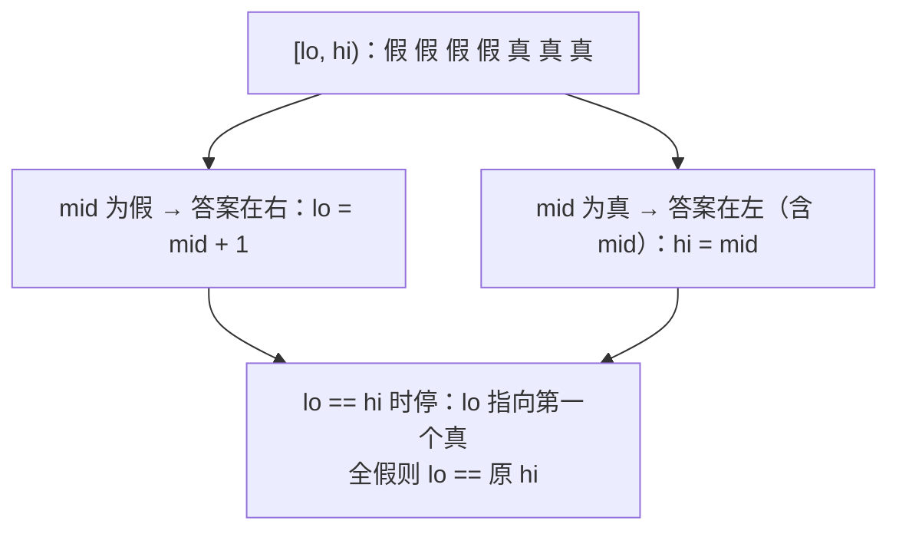
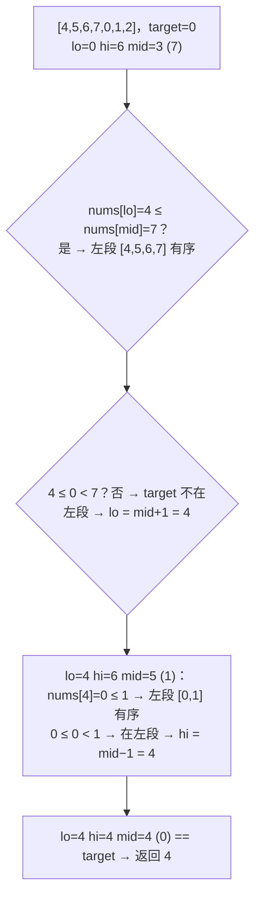
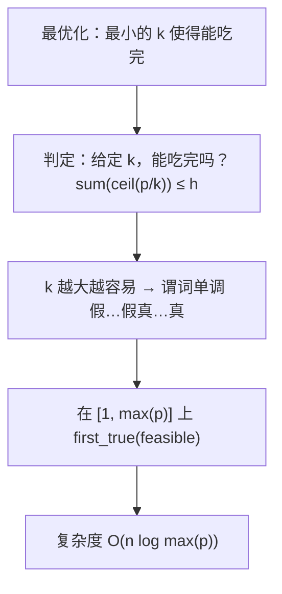
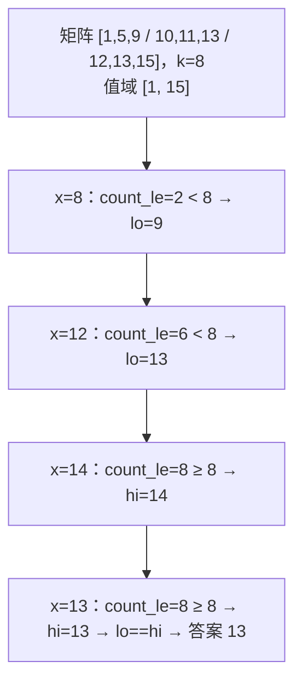
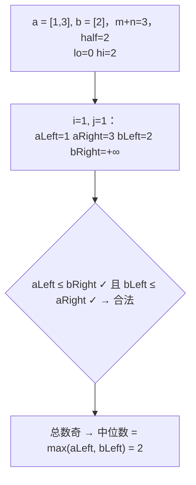

二分是"人人都会、人人都写错"的算法：`lo <= hi` 还是 `lo < hi`、`mid` 还是 `mid + 1`、返回 `lo` 还是 `hi`，每次都要现场想一遍。根源在于把二分当成"在有序数组里找一个值"——那只是它最窄的用法。**二分的本质是：在一个"假假假……真真真"的单调谓词序列上，找第一个真的位置。**用这一个定义写一个 `first_true(lo, hi, pred)`，所有二分题——找值、找边界、旋转数组、找峰值、"答案二分"、值域二分——都变成"写出那个谓词"。这一篇七道主讲题全部用同一个函数。

本篇要回答的核心问题是：

> **为什么"第一个使谓词为真的位置"这一个模板能覆盖全部二分题？[^q0] "答案二分"（吃香蕉、运输包裹、分割数组）怎样把最优化问题变成判定问题？[^q1] 两个有序数组的中位数为什么在短数组上二分切分点？[^q2]**

## 一、识别信号

| 题面里出现 | 谓词 `pred(i)` | 答案 |
|---|---|---|
| 有序数组找 target 的位置 / 插入位置 | `a[i] >= target` | `first_true`（再检查是否等于） |
| target 的起止范围 | `a[i] >= t` 与 `a[i] > t` | 两次 |
| 旋转有序数组 | 每次判断 `mid` 落在哪一段 | 变体，见第 2 题 |
| 旋转数组最小值 | `a[i] <= a[-1]` | `first_true` |
| 峰值 | `a[i] > a[i+1]` | `first_true` |
| "最小的 x 使得能在 h 小时内完成""最少的运力" | `feasible(x)`（x 越大越容易） | 值域上 `first_true` |
| "最大的 x 使得……"（x 越大越难） | `not feasible(x)` | `first_true - 1` |
| 有序矩阵第 k 小、两数组中位数 | `count_le(x) >= k` / 切分点合法 | 值域 / 下标上二分 |
| 平方根、开 k 次方 | `m * m > x` | `first_true - 1` |
| 数据范围 $$10^9$$ 以上、答案是一个整数 | 想值域二分 | |

判断能不能二分只看一条：**谓词是否单调**——存在一个分界点，左边全假右边全真（或反过来）。"数组有序"只是它的特例。

## 二、模板

<div class="code-tabs" markdown="1">
```python
def first_true(lo, hi, pred):
    """在 [lo, hi) 上返回第一个 pred(i) 为真的 i；全假返回 hi。要求 pred 单调。"""
    while lo < hi:
        mid = (lo + hi) // 2
        if pred(mid):
            hi = mid                             # mid 为真：答案在 [lo, mid]
        else:
            lo = mid + 1                         # mid 为假：答案在 [mid+1, hi)
    return lo

def lower_bound(a, x):                           # 第一个 >= x
    return first_true(0, len(a), lambda i: a[i] >= x)

def upper_bound(a, x):                           # 第一个 > x
    return first_true(0, len(a), lambda i: a[i] > x)
```
```java
static int firstTrue(int lo, int hi, IntPredicate pred) {
    while (lo < hi) {
        int mid = lo + (hi - lo) / 2; // 不写 (lo + hi) / 2：int 会溢出
        if (pred.test(mid)) hi = mid;
        else lo = mid + 1;
    }
    return lo;
}

static int lowerBound(int[] a, int x) {
    return firstTrue(0, a.length, i -> a[i] >= x);
}

static int upperBound(int[] a, int x) {
    return firstTrue(0, a.length, i -> a[i] > x);
}
```
</div>

四条性质，记住就不会写错：

1. 区间是**左闭右开** `[lo, hi)`，`hi` 是"全假时的返回值"，天然表示"没找到"。
2. 循环条件 `lo < hi`，结束时 `lo == hi`，返回哪个都一样。
3. `mid` 为真收 `hi = mid`（mid 可能就是答案，不能丢）；为假收 `lo = mid + 1`（mid 一定不是）。
4. `mid = (lo + hi) // 2` 向下取整，保证 `mid < hi`，`hi = mid` 一定缩小区间，不会死循环。

要"最后一个为真"（谓词是"真真真假假假"）：对 `not pred` 用 `first_true` 再减 1。



## 三、主讲题

### 1. LC 34 在排序数组中查找元素的第一个和最后一个位置

**题意**：有序数组，返回 target 的起止下标，不存在返回 `[-1, -1]`。

两次 `first_true`：起点是第一个 `>= target`，终点是第一个 `> target` 减一。起点越界或值不等于 target 就是不存在。

<div class="code-tabs" markdown="1">
```python
def search_range(nums, target):
    lo = lower_bound(nums, target)
    if lo == len(nums) or nums[lo] != target:
        return [-1, -1]
    return [lo, upper_bound(nums, target) - 1]
```
```java
static int[] searchRange(int[] nums, int target) {
    int lo = lowerBound(nums, target);
    if (lo == nums.length || nums[lo] != target) return new int[] {-1, -1};
    return new int[] {lo, upperBound(nums, target) - 1};
}
```
</div>

**追问**：*搜索插入位置（LC 35）*——就是 `lower_bound`。*统计出现次数*——`upper - lower`。*Python 的 `bisect_left` / `bisect_right`*——就是这两个函数；Java 的 `Arrays.binarySearch` 有重复元素时不保证返回第一个，面试要自己写。

### 2. LC 33 搜索旋转排序数组

**题意**：有序数组在某点旋转（`[4,5,6,7,0,1,2]`），无重复，找 target。

这题的谓词不是全局单调的，所以要**变体**：每次看 `mid` 落在哪一段有序区间——`nums[lo] <= nums[mid]` 说明 `[lo, mid]` 有序（左段），否则 `[mid, hi]` 有序（右段）；再判断 target 是否在那个有序段里，决定往哪边走。



<div class="code-tabs" markdown="1">
```python
def search_rotated(nums, target):
    lo, hi = 0, len(nums) - 1
    while lo <= hi:
        mid = (lo + hi) // 2
        if nums[mid] == target:
            return mid
        if nums[lo] <= nums[mid]:                # 左半有序
            if nums[lo] <= target < nums[mid]:
                hi = mid - 1
            else:
                lo = mid + 1
        else:                                    # 右半有序
            if nums[mid] < target <= nums[hi]:
                lo = mid + 1
            else:
                hi = mid - 1
    return -1
```
```java
static int searchRotated(int[] nums, int target) {
    int lo = 0, hi = nums.length - 1;
    while (lo <= hi) {
        int mid = lo + (hi - lo) / 2;
        if (nums[mid] == target) return mid;
        if (nums[lo] <= nums[mid]) {
            if (nums[lo] <= target && target < nums[mid]) hi = mid - 1;
            else lo = mid + 1;
        } else {
            if (nums[mid] < target && target <= nums[hi]) lo = mid + 1;
            else hi = mid - 1;
        }
    }
    return -1;
}
```
</div>

这是本篇唯一用闭区间 `[lo, hi]` + `lo <= hi` 的题——因为它是"找等于"而不是"找边界"，找到就返回。

**追问**：*有重复（LC 81）*——`nums[lo] == nums[mid] == nums[hi]` 时无法判断哪段有序，`lo += 1; hi -= 1` 收缩一步，最坏退化 $$O(n)$$。*先找最小值再二分*——也行：LC 153 找到旋转点，再在对应段上普通二分，两次 $$O(\log n)$$。

### 3. LC 153 寻找旋转排序数组中的最小值

**题意**：旋转有序数组（无重复）的最小值。

**谓词**：`nums[i] <= nums[-1]`。旋转后，最小值及其右边的元素都 ≤ 末尾元素，左边的都 > 末尾元素——一个标准的"假假假真真真"序列，最小值就是第一个真。

<div class="code-tabs" markdown="1">
```python
def find_min_rotated(nums):
    i = first_true(0, len(nums) - 1, lambda m: nums[m] <= nums[-1])
    return nums[i]
```
```java
static int findMinRotated(int[] nums) {
    int last = nums[nums.length - 1];
    return nums[firstTrue(0, nums.length - 1, m -> nums[m] <= last)];
}
```
</div>

`hi = len - 1` 而不是 `len`：末尾元素自己一定满足谓词，可以排除在搜索范围外（也避免 `nums[-1] <= nums[-1]` 这种平凡真）。

**追问**：*峰值（LC 162）*——谓词 `nums[i] > nums[i+1]`（"开始下坡"的第一个位置），`hi = len - 1` 保证 `i + 1` 不越界；数组两端视为 $$-\infty$$ 保证一定有峰。*有重复的最小值（LC 154）*——与 81 同样退化。

### 4. LC 875 爱吃香蕉的珂珂

**题意**：$$n$$ 堆香蕉，每小时选一堆吃 $$k$$ 根（不够就吃完这堆），求 $$h$$ 小时内吃完的最小 $$k$$。

**答案二分**：直接求"最小的 $$k$$"不好算，但给定 $$k$$ 判断"能否在 $$h$$ 小时内吃完"很容易：$$\sum_i \lceil p_i / k \rceil \le h$$。$$k$$ 越大越容易——谓词单调。于是在 $$[1, \max p]$$ 上找第一个可行的 $$k$$。



<div class="code-tabs" markdown="1">
```python
def min_eating_speed(piles, h):
    def ok(k):
        return sum((p + k - 1) // k for p in piles) <= h   # 向上取整
    return first_true(1, max(piles) + 1, ok)
```
```java
static int minEatingSpeed(int[] piles, int h) {
    int max = Arrays.stream(piles).max().getAsInt();
    return firstTrue(
            1,
            max + 1,
            k -> {
                long hours = 0; // 求和可能溢出 int
                for (int p : piles) hours += (p + k - 1) / k;
                return hours <= h;
            });
}
```
</div>

**答案二分的三步**：(1) 确定答案的范围 `[lo, hi)`——下界是理论最小（1 或 `max(w)`），上界是"一定可行"的值加一；(2) 写 `feasible(x)`，通常是贪心模拟，$$O(n)$$；(3) 确认单调方向，`first_true` 或 `first_true - 1`。

### 5. LC 410 分割数组的最大值

**题意**：把数组分成 $$k$$ 段连续子数组，让"各段和的最大值"最小。

**谓词**：给定上限 `cap`，贪心地从左往右装，装不下就开新段，数段数 $$\le k$$ 即可行。`cap` 越大段数越少——单调。范围 `[max(nums), sum(nums)]`。

这题与 LC 1011（运送包裹的最低运力）**完全同构**：包裹 = 数组元素，天数 = 段数，运力 = cap。

<div class="code-tabs" markdown="1">
```python
def split_array(nums, k):
    def ok(cap):
        parts, cur = 1, 0
        for x in nums:
            if cur + x > cap:
                parts += 1                       # 开新段
                cur = 0
            cur += x
        return parts <= k
    return first_true(max(nums), sum(nums) + 1, ok)
```
```java
static int splitArray(int[] nums, int k) {
    int max = 0, sum = 0;
    for (int w : nums) {
        max = Math.max(max, w);
        sum += w;
    }
    return firstTrue(
            max,
            sum + 1,
            cap -> {
                int used = 1, cur = 0;
                for (int w : nums) {
                    if (cur + w > cap) {
                        used++;
                        cur = 0;
                    }
                    cur += w;
                }
                return used <= k;
            });
}
```
</div>

**为什么贪心判定是对的**：给定 cap，能装就装（不提前开新段）得到的段数最少——提前开段只会让后面的元素更挤。

**追问**：*DP 解法*——$$O(n^2 k)$$，面试先说二分。*输出分割方案*——用最终 cap 再跑一遍贪心记录边界。*制作 m 束花（LC 1482）、最小化最大距离（LC 1552）*——同一模板，只换 `feasible`。

### 6. LC 378 有序矩阵中第 K 小的元素

**题意**：每行每列都递增的 $$n \times n$$ 矩阵，第 $$k$$ 小。

**值域二分**：谓词 `count_le(x) >= k`（矩阵里 $$\le x$$ 的元素至少 $$k$$ 个）。`count_le` 从左下角出发走"阶梯"：当前元素 $$\le x$$ 就整列上面的 $$i + 1$$ 个都算上、右移；否则上移。$$O(n)$$。值域范围 `[matrix[0][0], matrix[-1][-1]]`。



<div class="code-tabs" markdown="1">
```python
def kth_smallest_matrix(matrix, k):
    n = len(matrix)

    def count_le(x):
        i, j, c = n - 1, 0, 0                    # 左下角
        while i >= 0 and j < n:
            if matrix[i][j] <= x:
                c += i + 1                       # 这一列从顶到 i 都 <= x
                j += 1
            else:
                i -= 1
        return c

    return first_true(matrix[0][0], matrix[-1][-1] + 1, lambda x: count_le(x) >= k)
```
```java
static int kthSmallestMatrix(int[][] matrix, int k) {
    int n = matrix.length;
    return firstTrue(
            matrix[0][0],
            matrix[n - 1][n - 1] + 1,
            x -> {
                int i = n - 1, j = 0, c = 0;
                while (i >= 0 && j < n) {
                    if (matrix[i][j] <= x) {
                        c += i + 1;
                        j++;
                    } else i--;
                }
                return c >= k;
            });
}
```
</div>

**为什么答案一定在矩阵里**：`first_true` 返回的是最小的满足 `count_le(x) >= k` 的 $$x$$，若 $$x$$ 不在矩阵里，`count_le(x - 1) == count_le(x)`，$$x - 1$$ 也满足，矛盾。

**追问**：*堆解法*——$$k$$ 路归并 $$O(k \log n)$$，$$k$$ 小时更好。*两个有序数组的第 k 小*——第 7 题的一般化。*乘法表第 k 小（LC 668）*——`count_le(x) = sum(min(x // i, n))`。

### 7. LC 4 寻找两个正序数组的中位数

**题意**：两个有序数组，$$O(\log(m + n))$$ 求合并后的中位数。

**切分点二分**：在短数组 $$a$$ 上选切分点 $$i$$（左半取 $$a$$ 的前 $$i$$ 个），则 $$b$$ 的左半必须取 $$j = \lceil (m + n) / 2 \rceil - i$$ 个，让左半总数正好一半。切分合法 ⟺ 左半的最大 $$\le$$ 右半的最小，即 `a[i-1] <= b[j]` 且 `b[j-1] <= a[i]`。不合法时：`a[i-1] > b[j]` 说明 $$a$$ 左边取多了，`hi = i - 1`；否则 `lo = i + 1`。越界处用 $$\pm\infty$$。



<div class="code-tabs" markdown="1">
```python
def find_median_sorted_arrays(a, b):
    if len(a) > len(b):
        a, b = b, a                              # 在短的上二分
    m, n = len(a), len(b)
    half = (m + n + 1) // 2
    lo, hi = 0, m
    while lo <= hi:
        i = (lo + hi) // 2                       # a 的左半取 i 个
        j = half - i                             # b 的左半取 j 个
        a_left = a[i - 1] if i > 0 else float("-inf")
        a_right = a[i] if i < m else float("inf")
        b_left = b[j - 1] if j > 0 else float("-inf")
        b_right = b[j] if j < n else float("inf")
        if a_left <= b_right and b_left <= a_right:
            if (m + n) % 2:
                return float(max(a_left, b_left))
            return (max(a_left, b_left) + min(a_right, b_right)) / 2
        if a_left > b_right:
            hi = i - 1                           # a 左边取多了
        else:
            lo = i + 1
```
```java
static double findMedianSortedArrays(int[] a, int[] b) {
    if (a.length > b.length) return findMedianSortedArrays(b, a);
    int m = a.length, n = b.length, half = (m + n + 1) / 2, lo = 0, hi = m;
    while (lo <= hi) {
        int i = lo + (hi - lo) / 2, j = half - i;
        int aLeft = i > 0 ? a[i - 1] : Integer.MIN_VALUE,
                aRight = i < m ? a[i] : Integer.MAX_VALUE;
        int bLeft = j > 0 ? b[j - 1] : Integer.MIN_VALUE,
                bRight = j < n ? b[j] : Integer.MAX_VALUE;
        if (aLeft <= bRight && bLeft <= aRight) {
            if ((m + n) % 2 == 1) return Math.max(aLeft, bLeft);
            return (Math.max(aLeft, bLeft) + (double) Math.min(aRight, bRight)) / 2;
        }
        if (aLeft > bRight) hi = i - 1;
        else lo = i + 1;
    }
    throw new IllegalArgumentException("inputs not sorted");
}
```
</div>

**为什么在短数组上二分**：$$j = \text{half} - i$$ 要落在 $$[0, n]$$ 内。$$a$$ 短时 $$i \in [0, m]$$ 推出 $$j \ge \text{half} - m \ge 0$$、$$j \le \text{half} \le n$$，不需要额外检查越界。

## 四、变式与追问

| 追问 | 应对 |
|---|---|
| 找最后一个满足条件的 | 对 `not pred` 用 `first_true` 再减一；或谓词取反后找第一个不满足 |
| 浮点二分（求 $$\sqrt{x}$$ 到 $$10^{-6}$$） | 固定迭代 100 次或 `while hi - lo > eps`，`mid = (lo + hi) / 2` |
| 二分找不到时返回什么 | `first_true` 返回 `hi`（全假）；插入位置就是它 |
| 有序矩阵搜索（LC 74 / 240） | 74 当一维数组二分；240 从右上角走阶梯 $$O(m + n)$$ |
| 山脉数组找目标（LC 1095） | 先找峰，再在两段各二分 |
| 数据流 / 无限长有序（LC 702） | 先倍增找上界，再二分 |
| 答案不是整数 | 值域二分到精度，或把问题离散化 |
| 三分查找（单峰函数极值） | 两个三等分点比较；面试少见，说得出即可 |

## 五、两种语言的坑

| | Python | Java |
|---|---|---|
| `mid` 溢出 | 无 | `(lo + hi) / 2` 在 `lo + hi > 2^31` 时溢出；写 `lo + (hi - lo) / 2` 或 `(lo + hi) >>> 1` |
| `m * m > x` | 无 | `m * m` 溢出：`(long) m * m` |
| 求和判定 | 无 | `sum(ceil(p / k))` 可能超 `int`，用 `long` |
| 内置二分 | `bisect_left` / `bisect_right`（等价 lower / upper bound） | `Arrays.binarySearch` 重复时位置不定；`Collections.binarySearch` 同 |
| 谓词传参 | `lambda`，可捕获外部变量 | `IntPredicate`，lambda 捕获的局部变量必须 effectively final |
| 向上取整 | `(p + k - 1) // k` 或 `-(-p // k)` | `(p + k - 1) / k`；`Math.ceil` 是浮点，别用 |
| $$\pm\infty$$ | `float("inf")` | `Integer.MIN_VALUE / MAX_VALUE`，注意不能再做加减 |

## 六、题单

| 题 | 一句提示 |
|---|---|
| LC 35 搜索插入位置 | `lower_bound` |
| LC 704 二分查找 | `lower_bound` + 检查 |
| LC 69 x 的平方根 | 最后一个 $$m^2 \le x$$ |
| LC 162 寻找峰值 | 第一个 `a[i] > a[i+1]` |
| LC 81 搜索旋转排序数组 II | 33 + 三者相等时收缩 |
| LC 154 寻找旋转数组最小值 II | 153 + 相等时 `hi -= 1` |
| LC 1011 在 D 天内送达包裹 | 与 410 同构 |
| LC 1482 制作 m 束花所需的最少天数 | 答案二分 |
| LC 1552 两球之间的磁力 | 最大化最小距离：`first_true(not ok) - 1` |
| LC 74 / 240 搜索二维矩阵 | 一维化 / 阶梯 |
| LC 668 乘法表中第 K 小的数 | 值域二分 + 计数 |
| LC 719 找出第 K 小的数对距离 | 值域二分 + 双指针计数 |
| LC 287 寻找重复数（二分解） | 值域二分：`count(<= x) > x` |

## 七、小结

| 题型 | 搜索空间 | 谓词 | 复杂度 |
|---|---|---|---|
| 找值 / 边界 | 下标 | `a[i] >= t` | $$O(\log n)$$ |
| 旋转数组 | 下标 | 与 `a[-1]` 比 / 判断哪段有序 | $$O(\log n)$$ |
| 峰值 | 下标 | `a[i] > a[i+1]` | $$O(\log n)$$ |
| 答案二分 | 答案值域 | `feasible(x)`（贪心模拟） | $$O(n \log V)$$ |
| 值域第 k 小 | 值域 | `count_le(x) >= k` | $$O(n \log V)$$ |
| 两数组中位数 | 短数组的切分点 | 左半最大 ≤ 右半最小 | $$O(\log \min(m, n))$$ |

写二分只做两件事：**写出谓词并确认它单调**、**确定搜索区间 `[lo, hi)` 的含义**。剩下的交给 `first_true`。

## 八、自测

1. `first_true` 里把 `mid = (lo + hi) // 2` 改成 `(lo + hi + 1) // 2` 会怎样？

   <details markdown="1">
   <summary>答案</summary>
   两个问题。一是越界：区间长为 1 时（`lo = 2, hi = 3`）`mid = 3 = hi`，而 `hi` 不在 `[lo, hi)` 内，`pred(3)` 可能读到数组外。二是死循环：若 `pred(3)` 为真则 `hi = mid = 3`，区间没有缩小，下一轮完全相同。向下取整保证 `mid < hi`，于是 `hi = mid` 严格缩小、`lo = mid + 1` 也严格缩小。只有"最后一个为真、收 `lo = mid`"的镜像模板才需要向上取整。详见[第二章](#二模板)。
   </details>

2. 用 `first_true` 写"最大的 $$x$$ 使得 $$x^2 \le n$$"（LC 69），搜索区间和谓词各是什么？为什么区间上界要 `n + 1`？

   <details markdown="1">
   <summary>答案</summary>
   谓词 `m * m > n`（"假假假真真真"），区间 `[0, n + 1)`，答案 `first_true - 1`。上界取 `n + 1` 是为了 `n = 0` 和 `n = 1` 时区间非空且包含正确答案（`n = 1`：`m = 1` 时 `1 > 1` 假、`m = 2` 时真，`first_true = 2`，答案 1）；更紧的上界 `n // 2 + 2` 也行。详见[第一章](#一识别信号)。
   </details>

3. LC 410 的 `feasible(cap)` 用贪心"能装就装"数段数。证明：没有任何分法能用更少的段。

   <details markdown="1">
   <summary>答案</summary>
   归纳：设贪心的第 $$t$$ 段结束于位置 $$g_t$$，任意合法分法的第 $$t$$ 段结束于 $$o_t$$。$$t = 1$$：贪心第一段尽可能长，$$g_1 \ge o_1$$。若 $$g_t \ge o_t$$，则贪心第 $$t + 1$$ 段从 $$g_t + 1$$ 开始、尽可能长；任意分法第 $$t + 1$$ 段从 $$o_t + 1 \le g_t + 1$$ 开始，其结束位置 $$o_{t+1}$$ 处的段和 $$\le$$ cap，那么从更靠后的 $$g_t + 1$$ 到 $$o_{t+1}$$ 的和只会更小也 $$\le$$ cap，贪心至少能到 $$o_{t+1}$$，$$g_{t+1} \ge o_{t+1}$$。所以贪心每段结束不早于任何分法，段数不多于任何分法。详见[第三章第 5 题](#5-lc-410-分割数组的最大值)。
   </details>

4. LC 378 的 `count_le` 从左下角走阶梯，为什么是 $$O(n)$$ 而不是 $$O(n^2)$$？

   <details markdown="1">
   <summary>答案</summary>
   每一步要么 `j += 1`（右移）要么 `i -= 1`（上移），$$j$$ 最多增到 $$n$$、$$i$$ 最多减到 $$-1$$，总步数 $$\le 2n$$。正确性来自矩阵行列都递增：`matrix[i][j] <= x` 时同列上方全部 $$\le x$$（一次数 `i + 1` 个），`> x` 时同行右方全部 $$> x$$（这一行不用再看，上移）。详见[第三章第 6 题](#6-lc-378-有序矩阵中第-k-小的元素)。
   </details>

5. LC 4 里如果两个数组长度相同、都在 `a` 上二分，`j = half - i` 会越界吗？如果 `a` 比 `b` 长呢？

   <details markdown="1">
   <summary>答案</summary>
   长度相同（$$m = n$$）：$$\text{half} = m$$ 或 $$m$$（奇偶），$$i \in [0, m]$$ 则 $$j \in [0, m] = [0, n]$$，不越界。$$a$$ 更长（$$m > n$$）：$$i$$ 可取到 $$m$$，此时 $$j = \text{half} - m < 0$$；$$i = 0$$ 时 $$j = \text{half} > n$$ 也可能越界。所以要先交换让 $$a$$ 是短的——这正是代码第一行的作用。详见[第三章第 7 题](#7-lc-4-寻找两个正序数组的中位数)。
   </details>

## 下一篇

[堆、Top-K、区间与贪心](/coding-interview-heap-topk-intervals-greedy.html)

[^q0]: 二分能用的唯一条件是谓词单调（存在分界点，左边全假右边全真）。"找 target"是 `a[i] >= target` 的第一个真再检查相等；"找最后一个"是对取反谓词找第一个真再减一；旋转数组最小值是 `a[i] <= a[-1]`；峰值是 `a[i] > a[i+1]`；答案二分是 `feasible(x)`；值域第 k 小是 `count_le(x) >= k`。区间统一为左闭右开 `[lo, hi)`，`hi` 兼作"没找到"，`mid` 向下取整、真收 `hi = mid`、假收 `lo = mid + 1`，永远不会死循环或差一。唯一的例外是"找等于就返回"的旋转数组搜索（LC 33），用闭区间变体。详见[第二章](#二模板)。

[^q1]: 直接求"最小的 $$k$$"难，但"给定 $$k$$ 能不能做到"容易（一次 $$O(n)$$ 贪心模拟），且 $$k$$ 越大越容易——谓词单调。于是在答案的值域 `[理论下界, 一定可行的值 + 1)` 上对 `feasible` 做 `first_true`，总复杂度 $$O(n \log V)$$。三步：定范围、写判定、确认单调方向。吃香蕉的判定是 $$\sum \lceil p_i / k \rceil \le h$$，运输包裹与分割数组的判定是"贪心装箱的段数 $$\le k$$"，两题完全同构。详见[第三章第 4 题](#4-lc-875-爱吃香蕉的珂珂)与[第 5 题](#5-lc-410-分割数组的最大值)。

[^q2]: 中位数把合并后的序列切成左右两半，左半有 $$\lceil (m+n)/2 \rceil$$ 个元素。若 $$a$$ 贡献 $$i$$ 个到左半，$$b$$ 必须贡献 $$j = \text{half} - i$$ 个；切分合法当且仅当 `a[i-1] <= b[j]` 且 `b[j-1] <= a[i]`。在短数组上枚举 $$i \in [0, m]$$ 时 $$j$$ 自动落在 $$[0, n]$$ 内不越界；`a[i-1] > b[j]` 说明 $$i$$ 取大了往左收，否则往右，$$O(\log \min(m, n))$$。详见[第三章第 7 题](#7-lc-4-寻找两个正序数组的中位数)。
