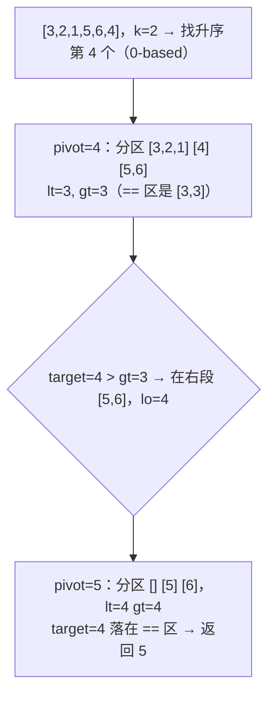
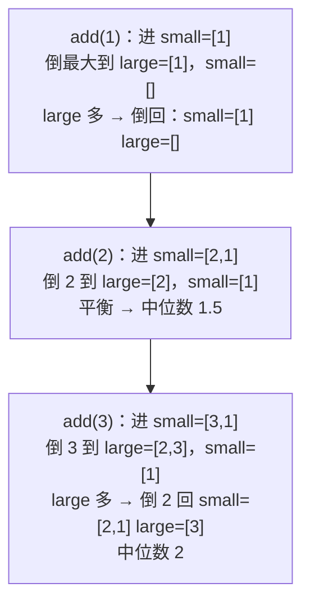
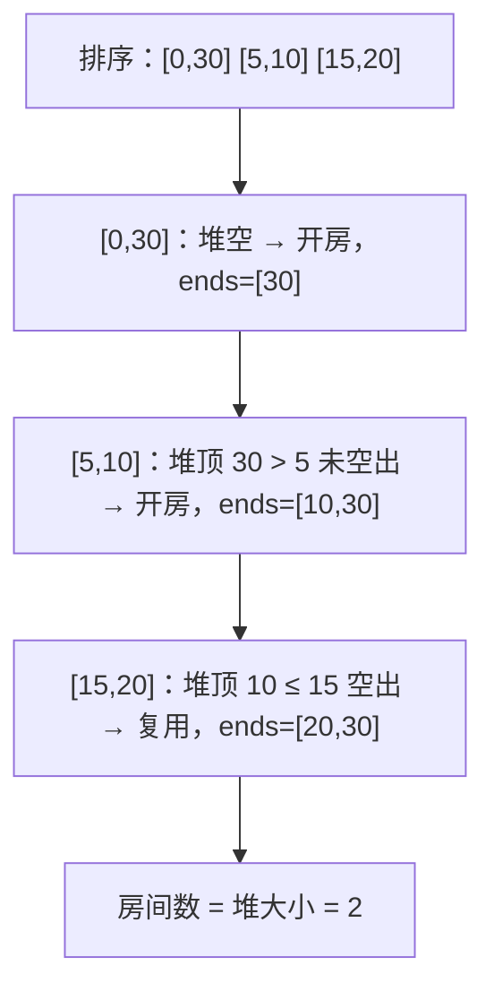
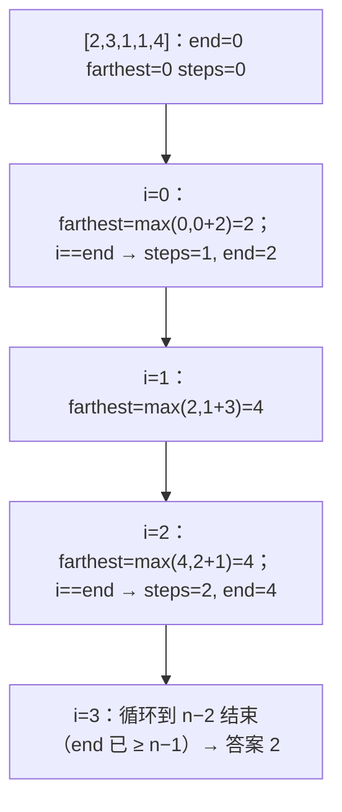

这一篇把三类"看起来不同、写起来相似"的题放在一起：**Top-K**（第 K 大、前 K 个高频、数据流中位数）靠堆，**区间**（合并、插入、最少箭、会议室）靠按端点排序后一趟扫描，**贪心**（跳跃游戏、加油站、任务调度）靠一个能证明的局部最优选择。它们的共同点是——**先决定按什么键排序或维护什么顺序，剩下的就是一趟循环**。堆是"动态维护顺序"的工具；排序是"一次性确定顺序"；贪心是"证明这个顺序下的局部选择就是全局最优"。六道主讲题里，快速选择、双堆中位数、会议室 II 是面试的常客。

本篇要回答的核心问题是：

> **第 K 大用大小为 K 的最小堆还是快速选择？各在什么场景下更好？[^q0] 数据流中位数的两个堆怎样维持平衡、为什么每次插入要"先进一个堆再倒到另一个"？[^q1] 会议室 II 为什么按开始时间排序、用最小堆存结束时间？[^q2]**

## 一、识别信号

| 题面里出现 | 想到 | 复杂度 |
|---|---|---|
| "第 K 大 / 小""前 K 个" | 大小为 K 的堆（反向）；或快速选择 | $$O(n \log k)$$ / 期望 $$O(n)$$ |
| "前 K 个高频" | 计数 + 桶排序（$$O(n)$$）或堆 | $$O(n)$$ / $$O(n \log k)$$ |
| "数据流""随时查询中位数 / 第 K 大" | 双堆 / 大小为 K 的堆 | 每次 $$O(\log n)$$ |
| "合并 K 个有序……" | 堆做 K 路归并 | $$O(N \log k)$$ |
| "合并重叠区间""插入区间" | 按起点排序，一趟扫 | $$O(n \log n)$$ |
| "最少移除多少区间使不重叠""最少几支箭" | 按**右端点**排序贪心 | $$O(n \log n)$$ |
| "最少需要几个会议室""最大重叠数" | 按起点排序 + 最小堆存结束；或扫描线 | $$O(n \log n)$$ |
| "能否到达""最少跳几次""从哪个加油站出发" | 贪心：维护"最远能到"或"亏空重来" | $$O(n)$$ |
| "任务冷却""重新排列使相邻不同" | 最高频优先（堆）或公式 | $$O(n)$$ |

**堆 vs 排序**：只要前 K 个，堆 $$O(n \log k)$$；要全部有序，排序 $$O(n \log n)$$；只要第 K 个而不要顺序，快速选择期望 $$O(n)$$。

## 二、模板

### 1. 大小为 K 的堆（求第 K 大 / 前 K 大）

<div class="code-tabs" markdown="1">
```python
heap = []                                        # 最小堆，只保留最大的 k 个；堆顶就是第 k 大
for x in nums:
    if len(heap) < k:
        heapq.heappush(heap, x)
    elif x > heap[0]:
        heapq.heapreplace(heap, x)               # 弹出堆顶再推入，比 pop + push 少一次调整
return heap[0]
```
```java
PriorityQueue<Integer> pq = new PriorityQueue<>();
for (int x : nums) {
    if (pq.size() < k) pq.offer(x);
    else if (x > pq.peek()) {
        pq.poll();
        pq.offer(x);
    }
}
return pq.peek();
```
</div>

**方向要反着来**：求第 K **大**用**最小**堆（堆顶是"K 个里最小的"，也就是第 K 大）；求第 K 小用最大堆。Python 没有最大堆，存负数。

### 2. 区间：按起点排序一趟扫

<div class="code-tabs" markdown="1">
```python
intervals.sort()                                 # 按起点
out = []
for s, e in intervals:
    if out and s <= out[-1][1]:                  # 与上一段重叠（相邻算重叠）
        out[-1][1] = max(out[-1][1], e)
    else:
        out.append([s, e])
```
```java
Arrays.sort(intervals, (a, b) -> Integer.compare(a[0], b[0]));
List<int[]> out = new ArrayList<>();
for (int[] iv : intervals) {
    if (!out.isEmpty() && iv[0] <= out.get(out.size() - 1)[1])
        out.get(out.size() - 1)[1] = Math.max(out.get(out.size() - 1)[1], iv[1]);
    else out.add(new int[] {iv[0], iv[1]});
}
```
</div>

### 3. 贪心的写法

贪心题没有统一模板，但有统一的**论证方式**——交换论证：假设最优解在某一步没有做贪心选择，把它换成贪心选择，结果不会更差。面试里把这句话说出来，比代码更重要。

## 三、主讲题

### 1. LC 215 数组中的第 K 个最大元素

**堆解**：模板 1，$$O(n \log k)$$，$$O(k)$$ 空间，适合数据流或 $$k \ll n$$。

**快速选择**：随机选 pivot，三路分区成 `< pivot`、`== pivot`、`> pivot`，看第 K 大（升序第 $$n - k$$ 个）落在哪一段，只递归那一段。期望 $$O(n)$$，最坏 $$O(n^2)$$（随机 pivot 让最坏几乎不发生），$$O(1)$$ 空间但会**修改数组**。



<div class="code-tabs" markdown="1">
```python
def find_kth_largest_quickselect(nums, k):
    target = len(nums) - k                       # 第 k 大 = 升序第 target 个（0-based）
    lo, hi = 0, len(nums) - 1
    while True:
        pivot = nums[random.randint(lo, hi)]
        lt, i, gt = lo, lo, hi                   # [lo,lt) < p, [lt,i) == p, (gt,hi] > p
        while i <= gt:
            if nums[i] < pivot:
                nums[lt], nums[i] = nums[i], nums[lt]
                lt += 1
                i += 1
            elif nums[i] > pivot:
                nums[gt], nums[i] = nums[i], nums[gt]
                gt -= 1                          # 换过来的还没看，i 不动
            else:
                i += 1
        if target < lt:
            hi = lt - 1
        elif target > gt:
            lo = gt + 1
        else:
            return pivot                         # target 落在 == 区
```
```java
static int findKthLargestQuickselect(int[] nums, int k) {
    Random rnd = new Random();
    int target = nums.length - k, lo = 0, hi = nums.length - 1;
    while (true) {
        int pivot = nums[lo + rnd.nextInt(hi - lo + 1)];
        int lt = lo, i = lo, gt = hi;
        while (i <= gt) {
            if (nums[i] < pivot) swap(nums, lt++, i++);
            else if (nums[i] > pivot) swap(nums, i, gt--);
            else i++;
        }
        if (target < lt) hi = lt - 1;
        else if (target > gt) lo = gt + 1;
        else return pivot;
    }
}
```
</div>

**三路分区**（Dutch national flag）比两路分区多几行，但重复元素多时不会退化——面试里大量重复元素是常见的追问。

**追问**：*不能修改数组、内存有限、数据流*——用堆。*要前 K 大的元素本身（无序即可）*——快速选择分区后取 `[target:]`。*第 K 大是唯一值的第 K 大*——先去重。

### 2. LC 347 前 K 个高频元素

**题意**：返回出现频率前 $$k$$ 高的元素。

**桶排序**：频率最多是 $$n$$，建 $$n + 1$$ 个桶，`buckets[freq]` 放频率为 `freq` 的元素，从高频桶往下取 $$k$$ 个。$$O(n)$$——比堆的 $$O(n \log k)$$ 更优，面试里两种都要说。

<div class="code-tabs" markdown="1">
```python
def top_k_frequent(nums, k):
    count = Counter(nums)
    buckets = [[] for _ in range(len(nums) + 1)]
    for x, c in count.items():
        buckets[c].append(x)
    out = []
    for c in range(len(buckets) - 1, 0, -1):
        for x in buckets[c]:
            out.append(x)
            if len(out) == k:
                return out
    return out
```
```java
static int[] topKFrequent(int[] nums, int k) {
    Map<Integer, Integer> count = new HashMap<>();
    for (int x : nums) count.merge(x, 1, Integer::sum);
    List<List<Integer>> buckets = new ArrayList<>();
    for (int i = 0; i <= nums.length; i++) buckets.add(new ArrayList<>());
    for (Map.Entry<Integer, Integer> e : count.entrySet())
        buckets.get(e.getValue()).add(e.getKey());
    int[] out = new int[k];
    int idx = 0;
    for (int c = nums.length; c > 0 && idx < k; c--)
        for (int x : buckets.get(c)) if (idx < k) out[idx++] = x;
    return out;
}
```
</div>

**堆解**：`heapq.nlargest(k, count, key=count.get)` 一行；Java 用 `PriorityQueue<Map.Entry>` 按值比较，大小为 $$k$$。

**追问**：*前 K 个高频单词、同频按字典序（LC 692）*——堆的比较器变成 (频次升序, 单词降序)，弹出后反转。*K 个最接近原点的点（LC 973）*——同样的大小为 K 的堆，键是距离平方（不要开根号）。

### 3. LC 295 数据流的中位数

**题意**：支持 `addNum` 与 `findMedian`。

**双堆**：`small` 是大顶堆存较小的一半，`large` 是小顶堆存较大的一半，保持 `|small| == |large|` 或多一个。中位数 = `small` 顶（奇数）或两顶平均。

**插入的顺序**：新数先进 `small`，再把 `small` 的最大弹到 `large`——这一进一出保证 `small` 的所有元素 $$\le$$ `large` 的所有元素；如果 `large` 多了，再把 `large` 的最小弹回 `small`。每次最多三次堆操作，$$O(\log n)$$。



<div class="code-tabs" markdown="1">
```python
class MedianFinder:
    def __init__(self):
        self.small = []                          # 大顶堆（存负数）：较小的一半
        self.large = []                          # 小顶堆：较大的一半

    def add_num(self, num):
        heapq.heappush(self.small, -num)
        heapq.heappush(self.large, -heapq.heappop(self.small))   # 先过 small 再倒过去
        if len(self.large) > len(self.small):
            heapq.heappush(self.small, -heapq.heappop(self.large))

    def find_median(self):
        if len(self.small) > len(self.large):
            return float(-self.small[0])
        return (-self.small[0] + self.large[0]) / 2
```
```java
static class MedianFinder {
    private final PriorityQueue<Integer> small =
            new PriorityQueue<>(Collections.reverseOrder());
    private final PriorityQueue<Integer> large = new PriorityQueue<>();

    void addNum(int num) {
        small.offer(num);
        large.offer(small.poll());
        if (large.size() > small.size()) small.offer(large.poll());
    }

    double findMedian() {
        return small.size() > large.size() ? small.peek() : (small.peek() + large.peek()) / 2.0;
    }
}
```
</div>

**追问**：*滑动窗口中位数（LC 480）*——双堆 + 懒删除，或有序表。*数据范围小（0–100）*——计数数组，$$O(1)$$ 插入、$$O(100)$$ 查询。*99% 的数在 0–100、1% 极大*——计数 + 两个堆存两端。

### 4. LC 56 合并区间

**题意**：合并所有重叠区间。

按起点排序后，当前区间起点 $$\le$$ 结果最后一段的终点就合并（终点取 max），否则开新段。相邻（`[1,4]` 与 `[4,5]`）按题意算重叠。

<div class="code-tabs" markdown="1">
```python
def merge_intervals(intervals):
    intervals.sort()
    out = []
    for s, e in intervals:
        if out and s <= out[-1][1]:
            out[-1][1] = max(out[-1][1], e)      # 注意 max：[1,10] 后接 [2,3] 终点仍是 10
        else:
            out.append([s, e])
    return out
```
```java
static int[][] mergeIntervals(int[][] intervals) {
    Arrays.sort(intervals, (a, b) -> Integer.compare(a[0], b[0]));
    List<int[]> out = new ArrayList<>();
    for (int[] iv : intervals) {
        if (!out.isEmpty() && iv[0] <= out.get(out.size() - 1)[1])
            out.get(out.size() - 1)[1] = Math.max(out.get(out.size() - 1)[1], iv[1]);
        else out.add(new int[] {iv[0], iv[1]});
    }
    return out.toArray(new int[0][]);
}
```
</div>

**追问**：*插入区间（LC 57，已排序不重叠 + 一个新区间）*——三段：左边全部不相交的直接放；重叠的全部并进新区间；右边直接放，$$O(n)$$ 不用排序。*区间列表的交集（LC 986）*——双指针，交集 `[max(s), min(e)]`，谁的终点小谁前进。*删除被覆盖区间（LC 1288）*——按起点升序、终点降序排序，扫一遍。

### 5. LC 253 会议室 II

**题意**：给会议时间段，最少需要几个会议室。

**按开始时间排序 + 最小堆存结束时间**：依次处理会议，如果堆顶（最早结束的会议室）已经空出（`end <= start`），复用它（弹出再推入新结束时间）；否则开新房间。堆的大小就是需要的房间数。



<div class="code-tabs" markdown="1">
```python
def min_meeting_rooms(intervals):
    intervals.sort()
    ends = []                                    # 各房间的结束时间，最小堆
    for s, e in intervals:
        if ends and ends[0] <= s:
            heapq.heapreplace(ends, e)           # 复用最早空出的房间
        else:
            heapq.heappush(ends, e)
    return len(ends)
```
```java
static int minMeetingRooms(int[][] intervals) {
    Arrays.sort(intervals, (a, b) -> Integer.compare(a[0], b[0]));
    PriorityQueue<Integer> ends = new PriorityQueue<>();
    for (int[] iv : intervals) {
        if (!ends.isEmpty() && ends.peek() <= iv[0]) ends.poll();
        ends.offer(iv[1]);
    }
    return ends.size();
}
```
</div>

**扫描线**（第二种解法，面试常问）：把每个区间拆成 `(start, +1)` 与 `(end, −1)` 两个事件排序，扫过去维护当前重叠数，最大值就是答案。排序时同一时刻 −1 排在 +1 前（`[1,5]` 与 `[5,10]` 只要一间）。

**追问**：*为什么按开始排序*——处理到某个会议时，之前开始的会议都已处理，堆里是"此刻正在进行或已结束"的会议，堆顶是最早结束的，能空出的一定是它。*返回每个会议分到哪个房间*——堆里存 `(end, room_id)`。*最大重叠时刻*——扫描线里记录达到最大值的位置。

### 6. LC 45 跳跃游戏 II

**题意**：`nums[i]` 是位置 $$i$$ 最远能跳的距离，求到达末尾的最少跳数（保证能到）。

**按层贪心**：把"一跳能到的范围"看成 BFS 的一层。维护当前层的右边界 `end` 和下一层能到的最远 `farthest`；走到 `end` 时跳数加一，`end = farthest`。不需要真的 BFS。



<div class="code-tabs" markdown="1">
```python
def jump(nums):
    steps = end = farthest = 0
    for i in range(len(nums) - 1):               # 到 n-2：站在最后一格不用再跳
        farthest = max(farthest, i + nums[i])
        if i == end:                             # 走完当前层
            steps += 1
            end = farthest
    return steps
```
```java
static int jump(int[] nums) {
    int steps = 0, end = 0, farthest = 0;
    for (int i = 0; i < nums.length - 1; i++) {
        farthest = Math.max(farthest, i + nums[i]);
        if (i == end) {
            steps++;
            end = farthest;
        }
    }
    return steps;
}
```
</div>

**为什么循环到 $$n - 2$$**：如果循环到 $$n - 1$$，当 `end` 恰好等于 $$n - 1$$ 时会多算一跳。

**追问**：*能否到达（LC 55）*——只维护 `reach = max(reach, i + nums[i])`，`i > reach` 时失败。*加油站（LC 134）*——总油量 $$\ge$$ 总消耗必有解；从 0 出发，油箱为负时把起点设为下一站、油箱清零，一趟 $$O(n)$$；证明：从 `start` 到 `i` 亏空，说明 `start … i` 之间任何一点出发到 `i` 也亏空（前缀和更小），起点只能在 `i + 1` 之后。*任务调度器（LC 621）*——公式 $$\max(n, (\text{maxFreq} - 1)(k + 1) + \text{ties})$$，或用堆模拟每一轮取频次最高的 $$k + 1$$ 个。

## 四、变式与追问

| 追问 | 应对 |
|---|---|
| 无重叠区间（LC 435，最少删几个） | 按**右端点**排序，保留结束最早的（留给后面最多空间），与当前保留的重叠就删 |
| 最少的箭引爆气球（LC 452） | 同上，一箭射所有与当前右端相交的；注意坐标可到 $$\pm 2^{31}$$，比较别用减法 |
| 合并 K 个有序数组 / 链表（LC 23） | 堆存 (值, 来源下标, 位置)，$$O(N \log k)$$（04 篇） |
| 丑数 II（LC 264）、超级丑数 | 堆 + 集合去重；或多指针 DP |
| 前 K 个高频 → 数据流 | 计数哈希 + 大小 K 的堆，值变时懒删除或重新推 |
| 重构字符串 / 相邻不同（LC 767） | 最大堆按频次，每次取两个 |
| 分发饼干 / 糖果（LC 455 / 135） | 排序 + 双指针；两趟扫 |
| 买卖股票 II（LC 122） | 所有上坡都吃：$$\sum \max(0, p_{i+1} - p_i)$$ |
| 区间调度的加权版 | 贪心失效 → DP + 二分（12 篇提要） |
| 两球之间最大化最小距离（LC 1552） | 答案二分 + 贪心判定（07 篇） |

## 五、两种语言的坑

| | Python | Java |
|---|---|---|
| 最大堆 | 存负数；或元组第一项取负 | `new PriorityQueue<>(Collections.reverseOrder())` 或 `(a, b) -> b - a`（小心溢出） |
| 堆里放复合元素 | 元组 `(key, tiebreak, payload)`，`payload` 可能不可比较时必须有 `tiebreak` | `PriorityQueue<int[]>` 传比较器；对象实现 `Comparable` |
| 替换堆顶 | `heapreplace`（先弹后推）、`heappushpop`（先推后弹） | 只能 `poll()` + `offer()` |
| 排序自定义键 | `sort(key=lambda x: x[1])`；`sort()` 稳定 | `Arrays.sort(a, (x, y) -> Integer.compare(x[1], y[1]))`；**别写 `x[1] - y[1]`**（溢出）；对象数组排序稳定，基本类型不稳定 |
| 区间列表转数组 | 直接返回 `list` | `out.toArray(new int[0][])` |
| 随机数 | `random.randint(lo, hi)` 闭区间 | `rnd.nextInt(hi - lo + 1) + lo` |
| `Counter.most_common(k)` | 有，$$O(n \log k)$$ | 没有等价物，自己用堆 |

## 六、题单

| 题 | 一句提示 |
|---|---|
| LC 973 最接近原点的 K 个点 | 大小 K 的最大堆，键是距离平方 |
| LC 692 前 K 个高频单词 | 比较器 (频次, 字典序) |
| LC 703 数据流中的第 K 大元素 | 大小 K 的最小堆 |
| LC 264 丑数 II | 堆 + 去重 |
| LC 57 插入区间 | 三段处理 |
| LC 435 无重叠区间 | 按右端点贪心 |
| LC 452 用最少数量的箭引爆气球 | 同上 |
| LC 986 区间列表的交集 | 双指针 |
| LC 55 跳跃游戏 | 维护最远可达 |
| LC 134 加油站 | 亏空重来 |
| LC 621 任务调度器 | 公式或堆模拟 |
| LC 767 重构字符串 | 最大堆每次取两个 |
| LC 122 买卖股票的最佳时机 II | 吃所有上坡 |
| LC 1046 最后一块石头的重量 | 最大堆模拟 |

## 七、小结

| 类型 | 排序 / 维护的键 | 一趟循环做什么 | 代表题 |
|---|---|---|---|
| Top-K | 大小为 K 的反向堆 | 比堆顶好就替换 | 215 · 347 · 973 |
| 两半分割 | 大顶 + 小顶双堆 | 先进小半再倒，再平衡 | 295 · 480 |
| 合并 / 插入区间 | 起点 | 与上一段重叠就扩终点 | 56 · 57 |
| 选最多不重叠 | **终点** | 保留结束最早的 | 435 · 452 |
| 资源数 | 起点 + 结束时间堆 | 堆顶已结束则复用 | 253 |
| 可达 / 最少步 | 最远可达边界 | 到边界跳数加一 | 55 · 45 |
| 环形 / 亏空 | 累计余量 | 负了就从下一站重来 | 134 |

写这类题先问自己一句：**"按什么排序（或堆里放什么），扫一遍时每步做什么"**——答出来就有了代码。

## 八、自测

1. 用大小为 K 的堆求第 K 大，堆里放的是最大的 K 个还是最小的 K 个？为什么用最小堆？

   <details markdown="1">
   <summary>答案</summary>
   放最大的 K 个。用最小堆是因为堆顶是这 K 个里最小的——正好是第 K 大；新元素只需与堆顶比较：比堆顶大就替换（它挤掉了当前第 K 大），否则一定不在前 K 里。如果用最大堆，堆顶是最大值，无法 $$O(1)$$ 判断新元素是否该进入。详见[第二章模板 1](#1-大小为-k-的堆求第-k-大--前-k-大)。
   </details>

2. 三路分区的快速选择里，`nums[i] > pivot` 时交换后为什么 `i` 不加一？

   <details markdown="1">
   <summary>答案</summary>
   从 `gt` 位置换过来的元素还没有被检查过，它可能小于、等于或大于 pivot，必须在下一轮再看一次。而 `nums[i] < pivot` 时从 `lt` 换过来的元素一定是已检查过的等于 pivot 的元素（`[lt, i)` 区间全是 `== pivot`），所以可以 `i += 1`。详见[第三章第 1 题](#1-lc-215-数组中的第-k-个最大元素)。
   </details>

3. `MedianFinder.add_num` 里如果改成"比 `small` 顶小就进 `small`，否则进 `large`，再平衡"，会出什么问题？

   <details markdown="1">
   <summary>答案</summary>
   逻辑上也能做对，但要处理 `small` 为空时的比较、以及平衡时两个方向的倒动，分支更多、更容易写错。"先进 `small` 再把最大倒到 `large`"用两次固定的堆操作保证了不变式（`small` 全部 $$\le$$ `large` 全部），只剩一个方向的平衡判断。面试里选分支最少的写法。详见[第三章第 3 题](#3-lc-295-数据流的中位数)。
   </details>

4. 合并区间时把 `out[-1][1] = max(out[-1][1], e)` 写成 `out[-1][1] = e`，什么输入会错？

   <details markdown="1">
   <summary>答案</summary>
   一个大区间包含后面的小区间：`[[1, 10], [2, 3]]`——正确结果 `[[1, 10]]`，错误写法得到 `[[1, 3]]`，终点被缩小了。按起点排序只保证起点递增，终点不保证。详见[第三章第 4 题](#4-lc-56-合并区间)。
   </details>

5. 会议室 II 的扫描线解法里，同一时刻的 `+1` 和 `−1` 事件哪个先处理？`[[1, 5], [5, 10]]` 分别得到什么答案？

   <details markdown="1">
   <summary>答案</summary>
   `−1` 先处理（一个会议在 5 结束、另一个在 5 开始，可以用同一间）。先 −1：时刻 5 计数 1 → 0 → 1，最大 1，答案 1，正确。先 +1：1 → 2 → 1，最大 2，错误。排序键写成 `(时刻, 事件类型)` 且 −1 < +1 即可（Python 的元组排序天然如此）。堆解法里对应的是 `ends[0] <= s`（含等于）。详见[第三章第 5 题](#5-lc-253-会议室-ii)。
   </details>

## 下一篇

[回溯](/coding-interview-backtracking.html)

[^q0]: 堆：大小为 K 的**最小**堆，每个元素与堆顶比较，$$O(n \log k)$$、$$O(k)$$ 空间、不改输入、天然支持数据流——$$k \ll n$$ 或数据不能全放内存时用它。快速选择：随机 pivot 三路分区，只递归目标所在段，期望 $$O(n)$$、$$O(1)$$ 额外空间，但会打乱数组、最坏 $$O(n^2)$$、不能用于流——静态数组、$$k$$ 接近 $$n/2$$ 时用它。面试里两种都要能写，并说出各自的适用场景。详见[第三章第 1 题](#1-lc-215-数组中的第-k-个最大元素)。

[^q1]: 大顶堆 `small` 存较小的一半、小顶堆 `large` 存较大的一半，保持 `|small| ∈ {|large|, |large| + 1}`。每次插入：先推入 `small`，再把 `small` 的最大弹到 `large`——这一进一出保证 `small` 的所有元素 $$\le$$ `large` 的所有元素（新数无论多大，都先经过 `small` 的筛选）；如果 `large` 变得比 `small` 多，把 `large` 的最小弹回 `small`。三次堆操作、一个方向的平衡判断，$$O(\log n)$$，中位数从两个堆顶 $$O(1)$$ 读出。详见[第三章第 3 题](#3-lc-295-数据流的中位数)。

[^q2]: 按开始时间处理，到某个会议时之前开始的会议都已分配房间；堆里存每个房间当前会议的结束时间，堆顶是最早空出的房间——如果连它都没空出（`end > start`），其他房间更不可能，必须开新房；如果它空出了，复用它（弹出再推入新结束时间）。堆的大小就是同时需要的最大房间数。每个会议一次堆操作，$$O(n \log n)$$。等价解法是扫描线：`+1` / `−1` 事件排序后求最大前缀和。详见[第三章第 5 题](#5-lc-253-会议室-ii)。
