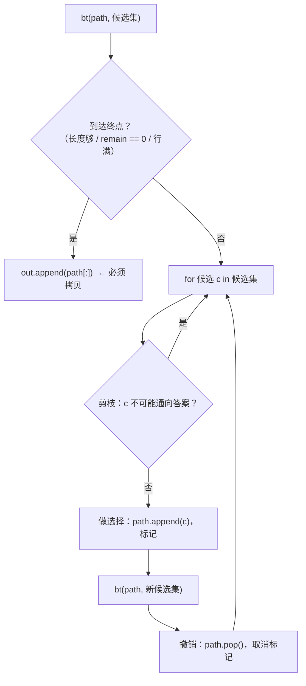
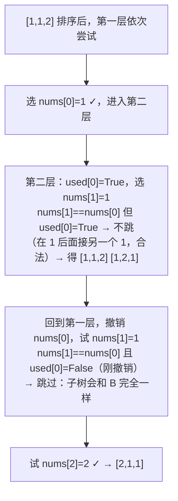
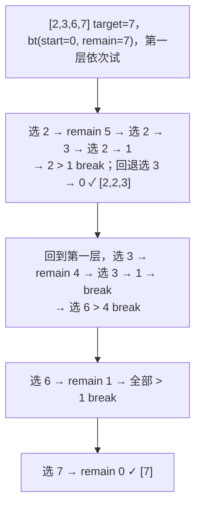
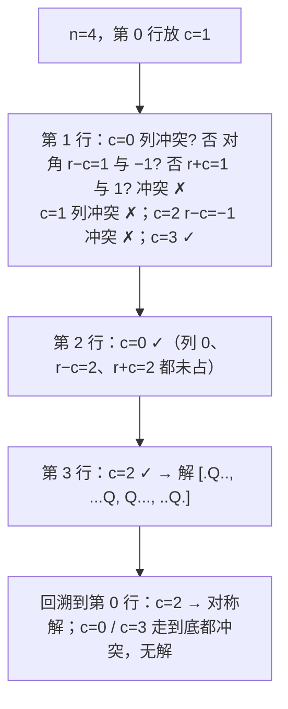

回溯是"枚举所有方案"的标准写法：排列、组合、子集、切分、棋盘放置。它的代码只有一个骨架——**做选择、递归、撤销选择**——所有题的差别只在三处：候选集合怎么定（从哪开始、能不能重复选）、怎么去重（排序后跳过同层相同值）、怎么剪枝（提前判断这条路不可能有答案）。这一篇把骨架和三处差别讲清，七组主讲题（排列 / 排列去重、子集 / 子集去重、组合总和 I / II、括号生成、回文切分、单词搜索、N 皇后）覆盖面试里能遇到的全部回溯形态。

本篇要回答的核心问题是：

> **排列、组合、子集三种题的递归参数差在哪里？[^q0] "排序后跳过同层相同值"的去重为什么对排列要多加一个 `not used[i-1]` 条件？[^q1] 回溯的复杂度怎么估、剪枝能改变量级吗？[^q2]**

## 一、识别信号

| 题面里出现 | 形态 | 候选集 | 去重 |
|---|---|---|---|
| "所有排列" | 排列 | 全部未用元素（`used[]`） | 排序 + `nums[i] == nums[i-1] and not used[i-1]` |
| "所有子集""所有组合" | 组合 | 从 `start` 往后（不回头） | 排序 + `i > start and nums[i] == nums[i-1]` |
| "和为 target，可重复选" | 组合（可重） | 从 `start` 往后，递归传 `i` | 排序后 `> remain` 就 `break` |
| "和为 target，每个用一次，有重复" | 组合（不可重） | 递归传 `i + 1` | 同层去重 |
| "所有合法括号""所有 IP 地址" | 约束构造 | 由约束决定能放什么 | 天然无重 |
| "所有切分方式"（回文、IP） | 切分 | `end` 从 `start` 往后 | 天然无重 |
| "网格里找单词""N 皇后""数独" | 棋盘搜索 | 相邻格 / 本行每列 | 原地标记 + 恢复 |
| $$n \le 20$$ 左右 | 说明预期就是指数级枚举 | | |

回溯与 DFS 的区别只在"撤销"：DFS 在图上走（visited 不撤销，每个节点访问一次），回溯在**决策树**上走（走完一支要撤销，让兄弟分支能重新选）。

## 二、模板



<div class="code-tabs" markdown="1">
```python
def backtrack(nums):
    out, path = [], []

    def bt(start):                               # 排列：没有 start，用 used[]；组合：有 start
        if done(path):
            out.append(path[:])                  # 拷贝！path 之后会被修改
            return
        for i in range(start, len(nums)):
            if should_skip(i):                   # 去重 / 剪枝
                continue
            path.append(nums[i])                 # 做选择
            bt(i + 1)                            # 递归（可重复选则传 i）
            path.pop()                           # 撤销

    bt(0)
    return out
```
```java
static List<List<Integer>> backtrack(int[] nums) {
    List<List<Integer>> out = new ArrayList<>();
    bt(nums, 0, new ArrayDeque<>(), out);
    return out;
}
private static void bt(int[] nums, int start, Deque<Integer> path, List<List<Integer>> out) {
    if (done(path)) { out.add(new ArrayList<>(path)); return; }
    for (int i = start; i < nums.length; i++) {
        if (shouldSkip(i)) continue;
        path.addLast(nums[i]);
        bt(nums, i + 1, path, out);
        path.removeLast();
    }
}
```
</div>

## 三、主讲题

### 1. LC 46 / 47 全排列（无重 / 有重）

**LC 46**：每层从全部元素里选一个没用过的，`used[]` 标记。$$n!$$ 个叶子，每个拷贝 $$O(n)$$，总 $$O(n \cdot n!)$$。

**LC 47 有重复**：先排序；同一层里，如果 `nums[i] == nums[i-1]` 且 `nums[i-1]` **还没被用**，说明前一个相同元素在这一层刚被试过又撤销了，再选 `nums[i]` 会生成完全相同的分支——跳过。



<div class="code-tabs" markdown="1">
```python
def permute_unique(nums):
    nums.sort()
    out, path, used = [], [], [False] * len(nums)

    def bt():
        if len(path) == len(nums):
            out.append(path[:])
            return
        for i, x in enumerate(nums):
            if used[i] or (i > 0 and nums[i] == nums[i - 1] and not used[i - 1]):
                continue
            used[i] = True
            path.append(x)
            bt()
            path.pop()
            used[i] = False

    bt()
    return out
```
```java
static List<List<Integer>> permuteUnique(int[] nums) {
    Arrays.sort(nums);
    List<List<Integer>> out = new ArrayList<>();
    bt47(nums, new boolean[nums.length], new ArrayDeque<>(), out);
    return out;
}
private static void bt47(int[] nums, boolean[] used, Deque<Integer> path, List<List<Integer>> out) {
    if (path.size() == nums.length) { out.add(new ArrayList<>(path)); return; }
    for (int i = 0; i < nums.length; i++) {
        if (used[i] || (i > 0 && nums[i] == nums[i - 1] && !used[i - 1])) continue;
        used[i] = true; path.addLast(nums[i]);
        bt47(nums, used, path, out);
        path.removeLast(); used[i] = false;
    }
}
```
</div>

去掉 LC 46 的 `used` 判断后只剩排序 + 去重，这就是两题唯一的区别。

**追问**：*用 `used[i-1]` 而不是 `not used[i-1]` 行不行*——也能去重（保证相同元素按原顺序使用），但剪枝发生得更晚、效率差。*不用排序去重*——每层用一个 `set` 记录本层已选过的值，$$O(n)$$ 额外空间，适合元素不可排序的情形。*下一个排列（LC 31）*——不是回溯，是 $$O(n)$$ 的原地操作。

### 2. LC 78 / 90 子集（无重 / 有重）

**LC 78**：决策树上**每个节点**都是一个答案（不只是叶子），所以 `out.append` 放在函数开头、无终止条件；用 `start` 保证不回头选，避免 `[1,2]` 与 `[2,1]` 重复。$$2^n$$ 个子集，总 $$O(n \cdot 2^n)$$。

**LC 90 有重复**：排序 + 同层去重 `i > start and nums[i] == nums[i-1]`。注意条件是 `i > start` 不是 `i > 0`——`[1, 2, 2]` 里 `[1, 2, 2]` 这个子集需要在第二层接连选两个 2，第二个 2 的 `i` 等于 `start`，不能跳。

<div class="code-tabs" markdown="1">
```python
def subsets_with_dup(nums):
    nums.sort()
    out, path = [], []

    def bt(start):
        out.append(path[:])                      # 每个节点都是答案
        for i in range(start, len(nums)):
            if i > start and nums[i] == nums[i - 1]:
                continue                         # 同层去重
            path.append(nums[i])
            bt(i + 1)
            path.pop()

    bt(0)
    return out
```
```java
static List<List<Integer>> subsetsWithDup(int[] nums) {
    Arrays.sort(nums);
    List<List<Integer>> out = new ArrayList<>();
    bt90(nums, 0, new ArrayDeque<>(), out);
    return out;
}
private static void bt90(int[] nums, int start, Deque<Integer> path, List<List<Integer>> out) {
    out.add(new ArrayList<>(path));
    for (int i = start; i < nums.length; i++) {
        if (i > start && nums[i] == nums[i - 1]) continue;
        path.addLast(nums[i]);
        bt90(nums, i + 1, path, out);
        path.removeLast();
    }
}
```
</div>

**追问**：*位掩码枚举子集*——`for mask in range(1 << n)`，第 $$j$$ 位为 1 就选 `nums[j]`，$$O(n \cdot 2^n)$$ 无递归；有重复时不方便去重。*长度为 k 的组合（LC 77）*——终止条件 `len(path) == k`，剪枝 `len(nums) - i >= k - len(path)`。

### 3. LC 39 / 40 组合总和（可重 / 不可重）

**LC 39 可重复选**：递归传 `i`（不是 `i + 1`）。排序后 `candidates[i] > remain` 直接 `break`（后面更大，不用再试）。

**LC 40 每个只用一次、有重复**：递归传 `i + 1` + 同层去重。



<div class="code-tabs" markdown="1">
```python
def combination_sum(candidates, target):
    candidates.sort()
    out, path = [], []

    def bt(start, remain):
        if remain == 0:
            out.append(path[:])
            return
        for i in range(start, len(candidates)):
            if candidates[i] > remain:
                break                            # 排序后：后面的更大，整层剪掉
            path.append(candidates[i])
            bt(i, remain - candidates[i])        # 传 i：可以再选自己
            path.pop()

    bt(0, target)
    return out
```
```java
static List<List<Integer>> combinationSum(int[] candidates, int target) {
    Arrays.sort(candidates);
    List<List<Integer>> out = new ArrayList<>();
    bt39(candidates, 0, target, new ArrayDeque<>(), out);
    return out;
}
private static void bt39(int[] c, int start, int remain, Deque<Integer> path, List<List<Integer>> out) {
    if (remain == 0) { out.add(new ArrayList<>(path)); return; }
    for (int i = start; i < c.length && c[i] <= remain; i++) {
        path.addLast(c[i]);
        bt39(c, i, remain - c[i], path, out);
        path.removeLast();
    }
}
```
</div>

**追问**：*只问方案数（LC 377 / 518）*——不要回溯，用 DP（12 篇）：回溯是指数级，DP 是 $$O(n \cdot \text{target})$$。*组合总和 III（LC 216，1–9 选 k 个）*——两个终止条件同时满足。*为什么 39 用 `break` 而 40 用 `continue` 去重*——`break` 是剪枝（后面都不可能），`continue` 是去重（跳过这一个，后面还可能有）；40 里两者都有。

### 4. LC 22 括号生成

**题意**：生成 $$n$$ 对括号的所有合法组合。

**约束式回溯**：不枚举所有 $$2^{2n}$$ 个串再检查，而是**只走合法的边**——左括号数 $$< n$$ 时可以放左；右括号数 $$<$$ 左括号数时可以放右。生成的每个叶子都合法，无需去重。方案数是卡特兰数 $$C_n = \frac{1}{n+1}\binom{2n}{n}$$。

<div class="code-tabs" markdown="1">
```python
def generate_parenthesis(n):
    out = []

    def bt(s, open_, close):
        if len(s) == 2 * n:
            out.append(s)
            return
        if open_ < n:
            bt(s + "(", open_ + 1, close)
        if close < open_:
            bt(s + ")", open_, close + 1)

    bt("", 0, 0)
    return out
```
```java
static List<String> generateParenthesis(int n) {
    List<String> out = new ArrayList<>();
    bt22(n, new StringBuilder(), 0, 0, out);
    return out;
}
private static void bt22(int n, StringBuilder sb, int open, int close, List<String> out) {
    if (sb.length() == 2 * n) { out.add(sb.toString()); return; }
    if (open < n) { sb.append('('); bt22(n, sb, open + 1, close, out); sb.deleteCharAt(sb.length() - 1); }
    if (close < open) { sb.append(')'); bt22(n, sb, open, close + 1, out); sb.deleteCharAt(sb.length() - 1); }
}
```
</div>

Python 版用字符串拼接传参、天然"撤销"（不可变对象）；Java 版用 `StringBuilder` 要手动 `deleteCharAt`。

**追问**：*电话号码的字母组合（LC 17）*——多阶段笛卡尔积，每层一个数字。*复原 IP 地址（LC 93）*——切分型 + 每段的约束（0–255、无前导零、恰好四段）。

### 5. LC 131 分割回文串

**题意**：把字符串切成若干段，每段都是回文，返回所有切法。

**切分型回溯**：`bt(start)` 枚举下一段的结束位置 `end`，`s[start:end+1]` 是回文才递归。判断回文用预处理的 `is_pal[i][j]` 表（区间 DP，$$O(n^2)$$），避免每次 $$O(n)$$ 判断。

<div class="code-tabs" markdown="1">
```python
def partition_palindrome(s):
    n = len(s)
    is_pal = [[False] * n for _ in range(n)]
    for i in range(n - 1, -1, -1):
        for j in range(i, n):
            is_pal[i][j] = s[i] == s[j] and (j - i < 2 or is_pal[i + 1][j - 1])
    out, path = [], []

    def bt(start):
        if start == n:
            out.append(path[:])
            return
        for end in range(start, n):
            if is_pal[start][end]:
                path.append(s[start:end + 1])
                bt(end + 1)
                path.pop()

    bt(0)
    return out
```
```java
static List<List<String>> partition(String s) {
    int n = s.length();
    boolean[][] isPal = new boolean[n][n];
    for (int i = n - 1; i >= 0; i--)
        for (int j = i; j < n; j++)
            isPal[i][j] = s.charAt(i) == s.charAt(j) && (j - i < 2 || isPal[i + 1][j - 1]);
    List<List<String>> out = new ArrayList<>();
    bt131(s, 0, isPal, new ArrayDeque<>(), out);
    return out;
}
private static void bt131(String s, int start, boolean[][] isPal, Deque<String> path, List<List<String>> out) {
    if (start == s.length()) { out.add(new ArrayList<>(path)); return; }
    for (int end = start; end < s.length(); end++) {
        if (!isPal[start][end]) continue;
        path.addLast(s.substring(start, end + 1));
        bt131(s, end + 1, isPal, path, out);
        path.removeLast();
    }
}
```
</div>

**追问**：*最少切几刀（LC 132）*——不要回溯，DP：`f[i] = min(f[j] + 1)` 对所有 `is_pal[j+1][i]`。*单词拆分 II（LC 140）*——同样的切分型，段是否在字典里；加记忆化避免重复子问题。

### 6. LC 79 单词搜索

**题意**：网格里能否沿相邻格子（不重复用）拼出单词。

**棋盘回溯**：从每个格子出发 DFS，匹配第 `k` 个字符；走过的格子临时改成 `#`，回来时恢复。复杂度 $$O(mn \cdot 3^L)$$（每步最多 3 个方向，不走回头路）。

<div class="code-tabs" markdown="1">
```python
def exist(board, word):
    m, n = len(board), len(board[0])

    def dfs(i, j, k):
        if k == len(word):
            return True
        if not (0 <= i < m and 0 <= j < n) or board[i][j] != word[k]:
            return False
        tmp, board[i][j] = board[i][j], "#"      # 标记
        found = (dfs(i + 1, j, k + 1) or dfs(i - 1, j, k + 1) or
                 dfs(i, j + 1, k + 1) or dfs(i, j - 1, k + 1))
        board[i][j] = tmp                        # 恢复
        return found

    return any(dfs(i, j, 0) for i in range(m) for j in range(n))
```
```java
static boolean exist(char[][] board, String word) {
    for (int i = 0; i < board.length; i++)
        for (int j = 0; j < board[0].length; j++)
            if (dfs(board, word, i, j, 0)) return true;
    return false;
}
private static boolean dfs(char[][] b, String w, int i, int j, int k) {
    if (k == w.length()) return true;
    if (i < 0 || j < 0 || i >= b.length || j >= b[0].length || b[i][j] != w.charAt(k)) return false;
    char tmp = b[i][j];
    b[i][j] = '#';
    boolean found = dfs(b, w, i + 1, j, k + 1) || dfs(b, w, i - 1, j, k + 1)
                 || dfs(b, w, i, j + 1, k + 1) || dfs(b, w, i, j - 1, k + 1);
    b[i][j] = tmp;
    return found;
}
```
</div>

**剪枝**：先统计网格字母计数，单词里某字母数量超过网格就直接返回 `False`；单词首字母在网格里比尾字母多时，反转单词再搜（从稀少的一端开始，分支更少）。

**追问**：*找出多个单词（LC 212）*——所有单词建 Trie，一次 DFS 沿 Trie 走（13 篇）。*为什么用 `or` 短路*——找到一条就不再搜其他方向。

### 7. LC 51 N 皇后

**题意**：$$n \times n$$ 棋盘放 $$n$$ 个皇后互不攻击，返回所有摆法。

**逐行放置**：每行必放一个，只需枚举列。冲突检查用三个集合：列、主对角线（`r - c` 相同）、副对角线（`r + c` 相同）——$$O(1)$$ 判断，不用扫棋盘。



<div class="code-tabs" markdown="1">
```python
def solve_n_queens(n):
    out = []
    cols, diag1, diag2 = set(), set(), set()
    queens = [-1] * n                            # queens[r] = 该行皇后所在列

    def bt(r):
        if r == n:
            out.append(["." * c + "Q" + "." * (n - c - 1) for c in queens])
            return
        for c in range(n):
            if c in cols or (r - c) in diag1 or (r + c) in diag2:
                continue
            cols.add(c); diag1.add(r - c); diag2.add(r + c)
            queens[r] = c
            bt(r + 1)
            cols.remove(c); diag1.remove(r - c); diag2.remove(r + c)

    bt(0)
    return out
```
```java
static List<List<String>> solveNQueens(int n) {
    List<List<String>> out = new ArrayList<>();
    bt51(n, 0, new int[n], new boolean[n], new boolean[2 * n], new boolean[2 * n], out);
    return out;
}
private static void bt51(int n, int r, int[] queens, boolean[] cols, boolean[] d1, boolean[] d2, List<List<String>> out) {
    if (r == n) {
        List<String> board = new ArrayList<>();
        for (int c : queens) { char[] row = new char[n]; Arrays.fill(row, '.'); row[c] = 'Q'; board.add(new String(row)); }
        out.add(board);
        return;
    }
    for (int c = 0; c < n; c++) {
        if (cols[c] || d1[r - c + n] || d2[r + c]) continue;   // r-c 可能为负，加 n 偏移
        cols[c] = d1[r - c + n] = d2[r + c] = true; queens[r] = c;
        bt51(n, r + 1, queens, cols, d1, d2, out);
        cols[c] = d1[r - c + n] = d2[r + c] = false;
    }
}
```
</div>

**追问**：*只要解的个数（LC 52）*——去掉构造棋盘，计数即可；还可以用位运算表示三个集合，$$n = 8$$ 时 92 个解。*数独（LC 37）*——同样的"放一个、检查、递归、撤销"，候选是 1–9，检查行 / 列 / 宫三个集合。

## 四、剪枝与复杂度

回溯的复杂度 = **决策树节点数 × 每个节点的工作量**。不剪枝时：

| 题型 | 叶子数 | 总复杂度 |
|---|---|---|
| 排列 | $$n!$$ | $$O(n \cdot n!)$$ |
| 子集 | $$2^n$$ | $$O(n \cdot 2^n)$$ |
| 组合 $$C(n, k)$$ | $$\binom{n}{k}$$ | $$O(k \binom{n}{k})$$ |
| 括号 | $$C_n \approx 4^n / n^{1.5}$$ | $$O(4^n / \sqrt{n})$$ |
| 单词搜索 | — | $$O(mn \cdot 3^L)$$ |
| N 皇后 | $$\le n!$$ | 实际远小于 $$n!$$（剪枝） |

**剪枝不改变最坏量级，但决定能否在时限内跑完**。三类剪枝：

1. **可行性剪枝**：当前部分解已不可能通向答案（`candidates[i] > remain`、皇后冲突）。
2. **最优性剪枝**：当前代价已超过已知最优（分支限界，求最值的题）。
3. **对称性剪枝**：N 皇后第一行只试一半的列，解数翻倍。

排序是很多剪枝的前提：排序后 `> remain` 可以 `break` 而不是 `continue`，把 $$O(n)$$ 的一层缩成常数。

## 五、两种语言的坑

| | Python | Java |
|---|---|---|
| 收集答案 | `out.append(path[:])`——不拷贝会全是同一个引用，最后全空 | `out.add(new ArrayList<>(path))`；`Deque` 转 `List` 要拷贝 |
| `path` 的结构 | `list`：`append` / `pop` | `ArrayDeque`：`addLast` / `removeLast`（比 `ArrayList.remove(size-1)` 略快，且语义清楚） |
| 字符串构造 | 拼接传参自动"撤销" | `StringBuilder` 要 `deleteCharAt`；或 `setLength(len - 1)` |
| 集合做 visited | `set` 的 `add` / `remove` | `boolean[]` 比 `HashSet<Integer>` 快得多；对角线下标加偏移 |
| 递归深度 | 排列深度 $$n$$，一般不超 1000 | 一般够 |
| 闭包 | 嵌套函数访问外层 `out` / `path` 无需声明；改外层 `int` 要 `nonlocal` | 传参或静态字段 |
| 布尔短路 | `a or b or c` | `\|\|` 同理；别用 `\|` |

## 六、题单

| 题 | 一句提示 |
|---|---|
| LC 46 全排列 | `used[]` |
| LC 78 子集 | 每个节点都是答案 |
| LC 77 组合 | 终止 `len == k` + 剩余数量剪枝 |
| LC 17 电话号码的字母组合 | 多阶段笛卡尔积 |
| LC 93 复原 IP 地址 | 切分 + 每段约束 |
| LC 216 组合总和 III | 两个终止条件 |
| LC 401 二进制手表 | 组合 |
| LC 37 解数独 | 三集合检查；找到一个解就返回 |
| LC 52 N 皇后 II | 计数版 |
| LC 140 单词拆分 II | 切分 + 记忆化 |
| LC 491 递增子序列 | 每层 `set` 去重（不能排序） |
| LC 526 优美的排列 | 排列 + 约束剪枝 |
| LC 698 划分为 k 个相等的子集 | 桶回溯 + 排序降序 + 跳过相等空桶 |

## 七、小结

| 形态 | 递归参数 | 候选 | 去重 | 代表题 |
|---|---|---|---|---|
| 排列 | 无（靠 `used`） | 所有未用 | 排序 + `== 前一个 and not used[前一个]` | 46 · 47 |
| 子集 / 组合 | `start` | `[start, n)` | 排序 + `i > start and == 前一个` | 78 · 90 · 77 |
| 可重复组合 | `start`，递归传 `i` | `[start, n)` | 排序 + `> remain` break | 39 |
| 约束构造 | 计数器 | 由约束决定 | 天然无重 | 22 · 93 |
| 切分 | `start` | `end ∈ [start, n)` | 天然无重 | 131 · 140 |
| 棋盘 | 位置 | 相邻 / 本行各列 | 原地标记 | 79 · 51 · 37 |

写回溯前先回答三个问题：**递归参数是什么、候选集合怎么定、终止条件在哪**——然后套模板，最后加去重和剪枝。

## 八、自测

1. 把 `out.append(path[:])` 写成 `out.append(path)`，`permute([1, 2, 3])` 返回什么？

   <details markdown="1">
   <summary>答案</summary>
   六个**空列表**。`out` 里六次放进的是同一个 `path` 对象的引用，回溯结束时 `path` 已被全部 `pop` 空，所以六个引用都指向 `[]`。Java 里 `out.add(path)` 同理（还会因为 `Deque` 不是 `List` 直接编译不过）。详见[第二章](#二模板)。
   </details>

2. LC 47 的去重条件改成 `nums[i] == nums[i-1] and used[i-1]`（去掉 `not`），结果还对吗？效率有什么变化？

   <details markdown="1">
   <summary>答案</summary>
   结果仍然正确——它强制相同元素按原顺序使用（只有前一个已用才能用后一个），同样消除了重复。但效率更差：`not used[i-1]` 在**同一层**立刻跳过重复分支；`used[i-1]` 的版本要等递归下去到更深层才能发现无法继续、再回溯，多走了很多无效节点。`[1,1,1,1,1]` 上差距很明显。详见[第三章第 1 题](#1-lc-46--47-全排列无重--有重)。
   </details>

3. LC 90 的去重条件写成 `i > 0 and nums[i] == nums[i-1]`，`[1, 2, 2]` 会漏掉哪个子集？

   <details markdown="1">
   <summary>答案</summary>
   漏掉 `[1, 2, 2]` 和 `[2, 2]`。选完第一个 2 后进入下一层 `start = 2`，此时 `i = 2 = start`，`nums[2] == nums[1]` 且 `i > 0`，被错误地跳过——但这是"在 2 后面再接一个 2"，是合法的。`i > start` 才表示"同一层里前面已经试过相同的值"。详见[第三章第 2 题](#2-lc-78--90-子集无重--有重)。
   </details>

4. LC 39 里如果 `candidates` 不排序、把 `break` 改成 `continue`，结果对吗？复杂度呢？

   <details markdown="1">
   <summary>答案</summary>
   结果正确（`continue` 只是跳过不可行的候选，不影响其他）。但失去了剪枝：排序后 `break` 能在遇到第一个 `> remain` 时结束整层循环，不排序时每层都要扫完全部候选。最坏情况下决策树的节点数不变，但每个节点的常数从"提前退出"变成 $$O(n)$$。`candidates = [1, 2, 3, …]`、target 大时差别明显。详见[第三章第 3 题](#3-lc-39--40-组合总和可重--不可重)。
   </details>

5. N 皇后的三个集合分别用 `c`、`r - c`、`r + c` 做键，为什么这三个量能唯一标识列、主对角线、副对角线？Java 版为什么 `d1` 的下标要 `+ n`？

   <details markdown="1">
   <summary>答案</summary>
   同一列的格子 `c` 相同；同一条主对角线（左上到右下）上，行加一列也加一，`r - c` 不变；同一条副对角线（右上到左下）上，行加一列减一，`r + c` 不变。三个量各取 $$n$$、$$2n - 1$$、$$2n - 1$$ 种值，恰好一一对应。`r - c` 的取值范围是 $$[-(n-1), n-1]$$，Java 用数组做集合时下标不能为负，加 $$n$$ 偏移到 $$[1, 2n - 1]$$。详见[第三章第 7 题](#7-lc-51-n-皇后)。
   </details>

## 下一篇

[字符串](/coding-interview-strings.html)

[^q0]: 排列不需要 `start`：每层都从头扫全部元素，用 `used[]` 排除已选的（顺序不同算不同方案）。组合与子集用 `start`：每层只从 `start` 往后选，保证不回头（`[1,2]` 与 `[2,1]` 算同一个）；元素只能用一次时递归传 `i + 1`，可重复选时传 `i`。子集与组合的另一个差别是子集在每个节点都收集答案、没有终止条件，组合只在长度到 `k`（或 `remain == 0`）时收集。详见[第一章](#一识别信号)与[第七章](#七小结)。

[^q1]: 排列里同一个值可能在不同层被使用（`[1,1,2]` 的第二层要在第一个 1 后面接第二个 1，这是合法的）。只用 `nums[i] == nums[i-1]` 会把这种情况也跳掉。加上 `not used[i-1]`：前一个相同值**没被用**说明它在本层刚被试过又撤销了，再选当前值会生成完全相同的子树，才该跳过；前一个**已被用**说明它在上层被选了，当前是接在它后面，不跳。子集 / 组合有 `start` 保证不回头，用 `i > start` 就够。详见[第三章第 1 题](#1-lc-46--47-全排列无重--有重)。

[^q2]: 复杂度 = 决策树节点数 × 每节点工作量（通常是拷贝答案的 $$O(n)$$）：排列 $$O(n \cdot n!)$$、子集 $$O(n \cdot 2^n)$$、组合 $$O(k \binom{n}{k})$$、括号 $$O(4^n / \sqrt{n})$$、网格单词 $$O(mn \cdot 3^L)$$。剪枝（可行性、最优性、对称性）不改变最坏上界，但能把实际访问的节点数减少几个量级——N 皇后 $$n = 8$$ 理论 $$8! = 40320$$ 个叶子、实际只有约 2000 个合法的局部摆法被展开。排序常是剪枝的前提，让 `continue` 变成 `break`。详见[第四章](#四剪枝与复杂度)。
