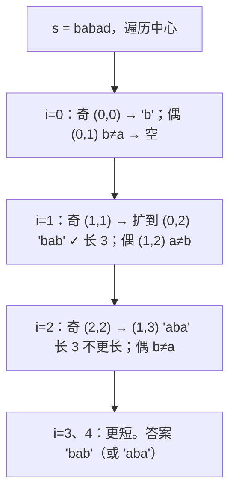
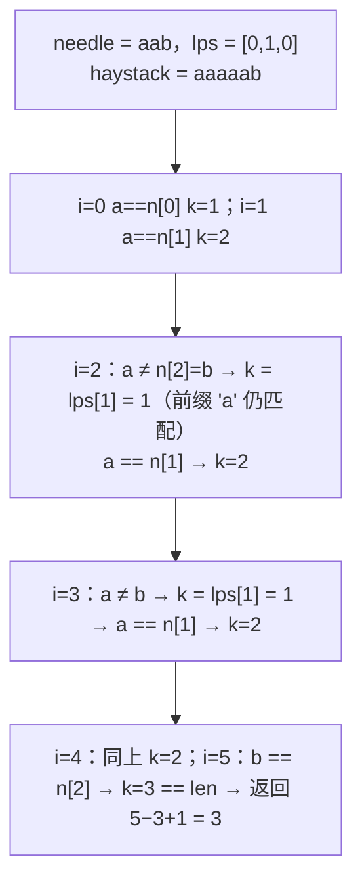
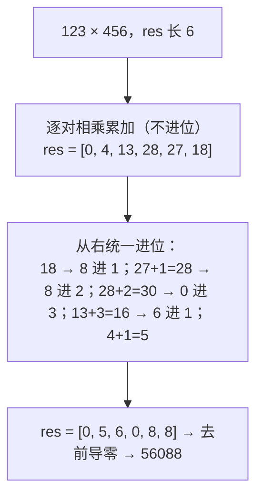

字符串题一半是前面几篇模式的字符版（滑动窗口、哈希计数、栈），另一半是这一篇要讲的**字符串特有的技巧**：回文的中心扩展与 Manacher、子串匹配的 KMP 失配表、手写解析（atoi）、大数的竖式运算、以及"拼起来最大"这类自定义排序。这些题代码都不长，但边界多——空串、前导零、符号、溢出、相等元素的排序稳定性——面试官正是靠这些边界筛人。

本篇要回答的核心问题是：

> **最长回文子串为什么中心扩展比区间 DP 更适合面试，Manacher 又改进了什么？[^q0] KMP 的失配表 `lps` 到底存的是什么，为什么匹配失败时跳到 `lps[k-1]` 不会漏解？[^q1] "拼接后最大的数"为什么排序比较器用 `a+b` 与 `b+a` 就是对的？[^q2]**

## 一、识别信号

| 题面里出现 | 想到 | 备注 |
|---|---|---|
| 最长回文子串 / 回文子串个数 | 中心扩展 $$O(n^2)$$；Manacher $$O(n)$$ | 区间 DP 也行但多 $$O(n^2)$$ 空间 |
| "在 s 里找 t 第一次出现" | KMP（或直接用库函数并说明复杂度） | 暴力 $$O(nm)$$，KMP $$O(n+m)$$ |
| 字母异位词分组 / 判断 | 排序后作 key，或 26 位计数作 key | 计数比排序快 |
| 字符串转整数、解析表达式 | 状态机：空白 → 符号 → 数字 → 截断 | 溢出判断在乘 10 之前 |
| 大数加 / 乘 | 竖式：`res[i+j+1] += a[i]*b[j]`，最后统一进位 | 别转成整数 |
| "拼接成最大的数" | 自定义比较 `a+b` vs `b+a` | 结果开头是 0 要特判 |
| 重复的定长子串、滚动哈希 | Rabin–Karp | 字母表小时用位运算压缩 |
| 反转单词 / 压缩 / 原地修改 | 双指针 | Java 用 `char[]` |
| 最长公共前缀 | 纵向扫描 | |
| 编辑距离、最长公共子序列 | DP（11 篇） | |
| 括号 / 解码 / 计算器 | 栈（03 篇） | |
| 无重复最长子串 / 最小覆盖 | 滑动窗口（02 篇） | |

## 二、模板

### 1. 中心扩展

<div class="code-tabs" markdown="1">
```python
def expand(s, l, r):                             # 从中心 (l, r) 向外扩，返回最长回文的 [l, r]
    while l >= 0 and r < len(s) and s[l] == s[r]:
        l -= 1
        r += 1
    return l + 1, r - 1

for i in range(len(s)):
    expand(s, i, i)                              # 奇数长度：中心是一个字符
    expand(s, i, i + 1)                          # 偶数长度：中心是两个字符之间
```
```java
static int[] expand(String s, int l, int r) {
    while (l >= 0 && r < s.length() && s.charAt(l) == s.charAt(r)) { l--; r++; }
    return new int[]{l + 1, r - 1};
}
```
</div>

### 2. KMP 失配表

<div class="code-tabs" markdown="1">
```python
def build_lps(pattern):
    """lps[i] = pattern[:i+1] 的最长"真前缀 == 真后缀"的长度"""
    lps = [0] * len(pattern)
    k = 0                                        # 当前匹配的前缀长度
    for i in range(1, len(pattern)):
        while k and pattern[i] != pattern[k]:
            k = lps[k - 1]                       # 退到更短的前缀再试
        if pattern[i] == pattern[k]:
            k += 1
        lps[i] = k
    return lps
```
```java
static int[] buildLps(String p) {
    int[] lps = new int[p.length()];
    for (int i = 1, k = 0; i < p.length(); i++) {
        while (k > 0 && p.charAt(i) != p.charAt(k)) k = lps[k - 1];
        if (p.charAt(i) == p.charAt(k)) k++;
        lps[i] = k;
    }
    return lps;
}
```
</div>

### 3. 竖式

<div class="code-tabs" markdown="1">
```python
res = [0] * (m + n)                              # 位数最多 m + n
for i in range(m - 1, -1, -1):
    for j in range(n - 1, -1, -1):
        res[i + j + 1] += int(a[i]) * int(b[j])  # a[i] 与 b[j] 的乘积落在第 i+j+1 位（从高位数）
for k in range(m + n - 1, 0, -1):                # 统一进位
    res[k - 1] += res[k] // 10
    res[k] %= 10
```
```java
int[] res = new int[m + n];
for (int i = m - 1; i >= 0; i--)
    for (int j = n - 1; j >= 0; j--)
        res[i + j + 1] += (a.charAt(i) - '0') * (b.charAt(j) - '0');
for (int k = m + n - 1; k > 0; k--) { res[k - 1] += res[k] / 10; res[k] %= 10; }
```
</div>

## 三、主讲题

### 1. LC 5 最长回文子串

**题意**：返回最长的回文子串。

**中心扩展**：$$2n - 1$$ 个中心（$$n$$ 个字符 + $$n - 1$$ 个间隙），每个中心向两侧扩到不相等为止，$$O(n^2)$$ 时间、$$O(1)$$ 空间。比区间 DP（$$O(n^2)$$ 时间 + $$O(n^2)$$ 空间）省空间、代码短，面试首选。



<div class="code-tabs" markdown="1">
```python
def longest_palindrome(s):
    best_l = best_r = 0

    def expand(l, r):
        while l >= 0 and r < len(s) and s[l] == s[r]:
            l -= 1
            r += 1
        return l + 1, r - 1

    for i in range(len(s)):
        for l, r in (expand(i, i), expand(i, i + 1)):
            if r - l > best_r - best_l:
                best_l, best_r = l, r
    return s[best_l:best_r + 1]
```
```java
static String longestPalindrome(String s) {
    int bestL = 0, bestR = 0;
    for (int i = 0; i < s.length(); i++) {
        for (int[] lr : new int[][]{expand(s, i, i), expand(s, i, i + 1)}) {
            if (lr[1] - lr[0] > bestR - bestL) { bestL = lr[0]; bestR = lr[1]; }
        }
    }
    return s.substring(bestL, bestR + 1);
}
```
</div>

**Manacher**（$$O(n)$$，面试里说清思路、能写出来是加分）：在字符间插 `#` 统一奇偶；维护"最右回文右边界 `right` 及其中心 `center`"；对于 `i < right` 的位置，它关于 `center` 的镜像 `2·center − i` 的回文半径可以直接复用（取 `min(right − i, p[镜像])`），再从这个起点向外扩。每个位置扩展时 `right` 只增不减，总 $$O(n)$$。

<div class="code-tabs" markdown="1">
```python
def manacher(s):
    t = "#" + "#".join(s) + "#"                  # 统一奇偶：回文中心总是某个字符
    n = len(t)
    p = [0] * n                                  # p[i]：以 i 为中心的回文半径（不含中心）
    center = right = 0
    best_len = best_center = 0
    for i in range(n):
        if i < right:
            p[i] = min(right - i, p[2 * center - i])   # 镜像复用
        while i - p[i] - 1 >= 0 and i + p[i] + 1 < n and t[i - p[i] - 1] == t[i + p[i] + 1]:
            p[i] += 1
        if i + p[i] > right:
            center, right = i, i + p[i]
        if p[i] > best_len:
            best_len, best_center = p[i], i
    start = (best_center - best_len) // 2        # 换回原串下标
    return s[start:start + best_len]
```
```java
static String manacher(String s) {
    StringBuilder tb = new StringBuilder("#");
    for (char c : s.toCharArray()) tb.append(c).append('#');
    String t = tb.toString();
    int n = t.length();
    int[] p = new int[n];
    int center = 0, right = 0, bestLen = 0, bestCenter = 0;
    for (int i = 0; i < n; i++) {
        if (i < right) p[i] = Math.min(right - i, p[2 * center - i]);
        while (i - p[i] - 1 >= 0 && i + p[i] + 1 < n && t.charAt(i - p[i] - 1) == t.charAt(i + p[i] + 1)) p[i]++;
        if (i + p[i] > right) { center = i; right = i + p[i]; }
        if (p[i] > bestLen) { bestLen = p[i]; bestCenter = i; }
    }
    int start = (bestCenter - bestLen) / 2;
    return s.substring(start, start + bestLen);
}
```
</div>

**追问**：*回文子串个数（LC 647）*——中心扩展时每扩一步计数加一。*最长回文子序列（LC 516）*——不是子串，区间 DP（12 篇）。*验证回文（LC 125，忽略非字母数字）*——对撞双指针跳过无效字符。

### 2. LC 28 找出字符串中第一个匹配项的下标（KMP）

**题意**：`haystack` 里 `needle` 第一次出现的位置，无则 −1。

**KMP 的核心**：匹配失败时，主串指针 `i` **不回退**，只让模式串指针 `k` 退到 `lps[k-1]`——因为已匹配的 `needle[:k]` 里，长为 `lps[k-1]` 的真后缀等于同长的真前缀，这段不需要重新比。

**`lps` 的含义**：`lps[i]` = `pattern[:i+1]` 的"最长真前缀等于真后缀"的长度。`aabaaab` 的 lps 是 `[0, 1, 0, 1, 2, 2, 3]`——`aabaaab` 的前缀 `aab` 等于后缀 `aab`，所以 `lps[6] = 3`。



<div class="code-tabs" markdown="1">
```python
def str_str(haystack, needle):
    if not needle:
        return 0
    lps = build_lps(needle)
    k = 0
    for i, ch in enumerate(haystack):
        while k and ch != needle[k]:
            k = lps[k - 1]                       # i 不回退，k 退到能复用的前缀
        if ch == needle[k]:
            k += 1
        if k == len(needle):
            return i - k + 1
    return -1
```
```java
static int strStr(String haystack, String needle) {
    if (needle.isEmpty()) return 0;
    int[] lps = buildLps(needle);
    for (int i = 0, k = 0; i < haystack.length(); i++) {
        while (k > 0 && haystack.charAt(i) != needle.charAt(k)) k = lps[k - 1];
        if (haystack.charAt(i) == needle.charAt(k)) k++;
        if (k == needle.length()) return i - k + 1;
    }
    return -1;
}
```
</div>

注意 `build_lps` 与 `str_str` 的主循环是**同一段代码**——建表就是"模式串自己匹配自己"。

**追问**：*为什么是 $$O(n + m)$$*——`k` 每次最多加一（总共 $$\le n$$ 次），每次 `while` 里减少至少一，减少的总量不超过增加的总量，所以 `while` 总执行 $$\le n$$ 次。*重复的子字符串（LC 459）*——`s` 由子串重复构成 ⟺ `lps[-1] > 0` 且 `n % (n − lps[-1]) == 0`。*最短回文串（LC 214）*——对 `s + '#' + reverse(s)` 求 lps。*直接用 `str.find` 可以吗*——可以，但要说出它是 $$O(nm)$$ 最坏（实际用的是两路算法）并能手写 KMP。

### 3. LC 8 字符串转换整数（atoi）

**题意**：模拟 C 的 `atoi`：跳前导空格 → 读一个可选符号 → 读数字直到非数字 → 截断到 32 位。

**状态机**：四个阶段线性走过去。唯一的难点是**溢出判断**：Java / C++ 里 `num * 10 + d` 可能已经溢出，要在乘之前判断 `num > (MAX − d) / 10`；Python 没有溢出，直接算出来再比较。

<div class="code-tabs" markdown="1">
```python
def my_atoi(s):
    INT_MAX, INT_MIN = 2 ** 31 - 1, -2 ** 31
    i, n = 0, len(s)
    while i < n and s[i] == " ":
        i += 1
    sign = 1
    if i < n and s[i] in "+-":
        sign = -1 if s[i] == "-" else 1
        i += 1
    num = 0
    while i < n and s[i].isdigit():
        num = num * 10 + (ord(s[i]) - 48)
        if sign * num > INT_MAX:                 # Python 没有溢出，可以算完再截
            return INT_MAX
        if sign * num < INT_MIN:
            return INT_MIN
        i += 1
    return sign * num
```
```java
static int myAtoi(String s) {
    int i = 0, n = s.length(), sign = 1, num = 0;
    while (i < n && s.charAt(i) == ' ') i++;
    if (i < n && (s.charAt(i) == '+' || s.charAt(i) == '-')) sign = s.charAt(i++) == '-' ? -1 : 1;
    while (i < n && Character.isDigit(s.charAt(i))) {
        int d = s.charAt(i++) - '0';
        if (num > (Integer.MAX_VALUE - d) / 10)  // 乘 10 之前判断
            return sign == 1 ? Integer.MAX_VALUE : Integer.MIN_VALUE;
        num = num * 10 + d;
    }
    return sign * num;
}
```
</div>

Java 版对负数的处理：`|INT_MIN| = INT_MAX + 1`，输入 `-2147483648` 时 `num` 累到 `214748364`、下一位 `d = 8`：`214748364 > (2147483647 − 8) / 10 = 214748363` 成立，返回 `INT_MIN`——恰好正确。这是因为截断值刚好是边界；面试里要能说清这个巧合。

**追问**：*有效数字（LC 65，含小数、指数）*——完整状态机，画出状态转移图再写。*整数反转（LC 7）*——同样的溢出判断。*字符串相加（LC 415）*——双指针从尾加，进位。

### 4. LC 43 字符串相乘

**题意**：两个非负整数字符串相乘，不能用大整数库或直接转换。

**竖式**：`a[i] × b[j]` 的结果落在 `res[i + j + 1]`（下标从高位数），所有乘积先累加不进位，最后从低位到高位统一进位。$$O(mn)$$。



<div class="code-tabs" markdown="1">
```python
def multiply(a, b):
    if a == "0" or b == "0":
        return "0"
    m, n = len(a), len(b)
    res = [0] * (m + n)
    for i in range(m - 1, -1, -1):
        for j in range(n - 1, -1, -1):
            res[i + j + 1] += (ord(a[i]) - 48) * (ord(b[j]) - 48)
    for k in range(m + n - 1, 0, -1):
        res[k - 1] += res[k] // 10
        res[k] %= 10
    return "".join(map(str, res)).lstrip("0")
```
```java
static String multiply(String a, String b) {
    if (a.equals("0") || b.equals("0")) return "0";
    int m = a.length(), n = b.length();
    int[] res = new int[m + n];
    for (int i = m - 1; i >= 0; i--)
        for (int j = n - 1; j >= 0; j--)
            res[i + j + 1] += (a.charAt(i) - '0') * (b.charAt(j) - '0');
    for (int k = m + n - 1; k > 0; k--) { res[k - 1] += res[k] / 10; res[k] %= 10; }
    StringBuilder sb = new StringBuilder();
    for (int d : res) if (!(sb.length() == 0 && d == 0)) sb.append(d);
    return sb.toString();
}
```
</div>

**为什么 `i + j + 1`**：`a[i]` 是 $$10^{m-1-i}$$ 位、`b[j]` 是 $$10^{n-1-j}$$ 位，乘积是 $$10^{(m+n-2)-(i+j)}$$ 位；`res` 长 $$m + n$$、下标 $$k$$ 对应 $$10^{m+n-1-k}$$，解得 $$k = i + j + 1$$。

**追问**：*为什么最后统一进位而不是边乘边进*——`res[k]` 最大 $$81 \times \min(m, n) + 9$$，不会溢出 `int`，统一进位代码更短。*Karatsuba*——$$O(n^{1.58})$$，面试说得出即可。

### 5. LC 179 最大数

**题意**：一组非负整数，拼接成最大的数（字符串形式）。

**自定义比较**：`a` 应排在 `b` 前 ⟺ `a + b > b + a`（字符串拼接后比较）。`[3, 30, 34, 5, 9]` → `9534330`。

**为什么这个比较是合法的全序**：需要传递性——若 `a+b ≥ b+a` 且 `b+c ≥ c+b`，则 `a+c ≥ c+a`。把 `a+b` 看成数值 $$a \cdot 10^{|b|} + b$$，条件等价于 $$\frac{a}{10^{|a|} - 1} \ge \frac{b}{10^{|b|} - 1}$$——每个数映射到一个实数，比较的是这个实数，所以传递性成立。

<div class="code-tabs" markdown="1">
```python
def largest_number(nums):
    def cmp(a, b):                               # a 该排前面 → 负
        return -1 if a + b > b + a else (1 if a + b < b + a else 0)

    strs = sorted(map(str, nums), key=cmp_to_key(cmp))
    out = "".join(strs)
    return "0" if out[0] == "0" else out        # [0, 0] → "0" 而不是 "00"
```
```java
static String largestNumber(int[] nums) {
    String[] strs = Arrays.stream(nums).mapToObj(String::valueOf).toArray(String[]::new);
    Arrays.sort(strs, (x, y) -> (y + x).compareTo(x + y));   // 降序：y+x 大的排前
    if (strs[0].equals("0")) return "0";
    return String.join("", strs);
}
```
</div>

**追问**：*最小数（剑指 45）*——比较反过来。*为什么不能按数值排序*——`3` 与 `30`：数值 30 > 3，但拼接 `330 > 303`。*Java 里传递性不成立的比较器会怎样*——`TimSort` 可能抛 `IllegalArgumentException: Comparison method violates its general contract`。

### 6. LC 187 重复的 DNA 序列

**题意**：找出所有出现超过一次的长度为 10 的子串。

**滚动哈希**：字母表只有 4 个字符，每个 2 bit，10 个字符 20 bit——用一个整数表示窗口，滑动时左移两位、`or` 新字符、`and` 掩码，$$O(1)$$ 更新，无哈希冲突。通用字母表用 Rabin–Karp：`h = (h × base + c − c_out × base^k) mod p`，可能冲突要验证。

<div class="code-tabs" markdown="1">
```python
def find_repeated_dna_sequences(s):
    if len(s) < 10:
        return []
    code = {"A": 0, "C": 1, "G": 2, "T": 3}
    mask = (1 << 20) - 1
    h = 0
    seen, out = set(), set()
    for i, ch in enumerate(s):
        h = ((h << 2) | code[ch]) & mask         # 左移两位、加新字符、截到 20 位
        if i >= 9:
            if h in seen:
                out.add(s[i - 9:i + 1])
            seen.add(h)
    return sorted(out)
```
```java
static List<String> findRepeatedDnaSequences(String s) {
    if (s.length() < 10) return List.of();
    Map<Character, Integer> code = Map.of('A', 0, 'C', 1, 'G', 2, 'T', 3);
    int mask = (1 << 20) - 1, h = 0;
    Set<Integer> seen = new HashSet<>();
    TreeSet<String> out = new TreeSet<>();
    for (int i = 0; i < s.length(); i++) {
        h = ((h << 2) | code.get(s.charAt(i))) & mask;
        if (i >= 9 && !seen.add(h)) out.add(s.substring(i - 9, i + 1));
    }
    return new ArrayList<>(out);
}
```
</div>

**追问**：*直接用 `set` 存子串*——也是 $$O(n)$$ 次操作，但每次切片 $$O(10)$$ 且存 $$n$$ 个字符串，滚动哈希把每步降到常数且只存整数。*最长重复子串（LC 1044）*——二分长度 + Rabin–Karp 判重。

## 四、变式与追问

| 追问 | 应对 |
|---|---|
| 字母异位词分组（LC 49） | 26 位计数元组作 key（比排序 key 省一个 log） |
| 反转字符串里的单词（LC 151） | `split` + 反转；进阶 $$O(1)$$：整体反转再逐词反转（Java 用 `char[]`） |
| 压缩字符串（LC 443） | 读写双指针原地；计数转字符串逐位写 |
| 最长公共前缀（LC 14） | 纵向扫描，遇不同即停 |
| 字符串相加（LC 415） | 尾部双指针 + 进位 |
| 判断子序列（LC 392） | 双指针；大量查询时预处理"下一个字符位置"表 |
| Z 字形变换（LC 6） | 按行模拟，方向变量 |
| 整数转罗马数字 / 罗马转整数（LC 12 / 13） | 贪心从大到小减 / 左小右大则减 |
| 版本号比较（LC 165） | `split('.')` 后逐段 `int` 比较，缺段补 0 |
| 单词规律 / 同构字符串（LC 290 / 205） | 双向映射 |

## 五、两种语言的坑

| | Python | Java |
|---|---|---|
| 字符串不可变 | 拼接 `+=` 在循环里 CPython 有优化但别依赖；用 `list` + `join` | 用 `StringBuilder`；`String +=` 在循环里 $$O(n^2)$$ |
| 字符与数字 | `ord(c) - 48`、`chr(48 + d)`、`c.isdigit()` | `c - '0'`、`(char) ('0' + d)`、`Character.isDigit` |
| 切片 | `s[a:b]` 拷贝 $$O(b-a)$$ | `substring` 拷贝（JDK 7u6 起） |
| 溢出 | 无；用 `2**31 - 1` 比较 | `Integer.MAX_VALUE`；乘 10 之前判断 |
| 自定义排序 | `cmp_to_key` 或 `key=` | `Comparator` lambda；比较器必须满足传递性 |
| 字符串比较 | `<` 按字典序 | `compareTo`；`==` 比较引用（**错误**），用 `equals` |
| 原地修改 | 不可能，转 `list` | `toCharArray()` 修改后 `new String(cs)` |
| `strip` / `split` | `split()` 无参数按任意空白且丢空串 | `trim().split("\\s+")`；`split` 是正则 |

## 六、题单

| 题 | 一句提示 |
|---|---|
| LC 647 回文子串 | 中心扩展计数 |
| LC 125 验证回文串 | 对撞指针跳无效字符 |
| LC 49 字母异位词分组 | 计数 key |
| LC 242 有效的字母异位词 | 计数比较 |
| LC 415 字符串相加 | 尾部双指针 |
| LC 7 整数反转 | 溢出判断 |
| LC 65 有效数字 | 状态机 |
| LC 151 反转字符串中的单词 | 双反转 |
| LC 443 压缩字符串 | 读写指针 |
| LC 14 最长公共前缀 | 纵向扫描 |
| LC 459 重复的子字符串 | `lps` 性质 |
| LC 214 最短回文串 | KMP on `s#rev(s)` |
| LC 1044 最长重复子串 | 二分 + 滚动哈希 |
| LC 6 Z 字形变换 | 按行模拟 |

## 七、小结

| 技巧 | 复杂度 | 关键细节 | 代表题 |
|---|---|---|---|
| 中心扩展 | $$O(n^2)$$ / $$O(1)$$ | $$2n - 1$$ 个中心，奇偶都试 | 5 · 647 |
| Manacher | $$O(n)$$ | 插 `#`、镜像复用、右边界只增 | 5 |
| KMP | $$O(n + m)$$ | `lps` = 真前缀 == 真后缀的最长；建表与匹配同一段代码 | 28 · 459 · 214 |
| 状态机解析 | $$O(n)$$ | 溢出在乘之前判；截断值恰是边界 | 8 · 7 · 65 |
| 竖式 | $$O(mn)$$ | `res[i+j+1]`；统一进位；去前导零 | 43 · 415 |
| 自定义排序 | $$O(n \log n \cdot L)$$ | `a+b` vs `b+a`；证明传递性；全零特判 | 179 |
| 滚动哈希 | $$O(n)$$ | 小字母表位压缩无冲突；否则 mod 大素数 + 验证 | 187 · 1044 |

字符串题写完一定过三个输入：**空串、单字符、全相同字符**。

## 八、自测

1. 中心扩展为什么要试 $$2n - 1$$ 个中心而不是 $$n$$ 个？漏掉偶数中心会漏掉什么？

   <details markdown="1">
   <summary>答案</summary>
   奇数长度回文的中心是一个字符（$$n$$ 个），偶数长度回文的中心在两个字符之间（$$n - 1$$ 个间隙）。只试 $$n$$ 个字符中心会漏掉所有偶数长度的回文——`"cbbd"` 会返回 `"c"` 而不是 `"bb"`。Manacher 插 `#` 就是为了把两种中心统一成一种。详见[第三章第 1 题](#1-lc-5-最长回文子串)。
   </details>

2. 手算 `build_lps("ababaca")`。

   <details markdown="1">
   <summary>答案</summary>
   `[0, 0, 1, 2, 3, 0, 1]`。`a`→0；`ab`→0；`aba`→1（a）；`abab`→2（ab）；`ababa`→3（aba）；`ababac`：k=3 时 `c ≠ b`，退 `lps[2] = 1`，`c ≠ b`，退 `lps[0] = 0`，`c ≠ a` → 0；`ababaca`：`a == a` → 1。详见[第二章模板 2](#2-kmp-失配表)。
   </details>

3. Java 版 `myAtoi` 的溢出判断 `num > (Integer.MAX_VALUE - d) / 10`，为什么对负数也正确？输入 `"-2147483649"` 返回什么？

   <details markdown="1">
   <summary>答案</summary>
   `INT_MIN` 的绝对值是 `INT_MAX + 1`。累到 `num = 214748364` 时下一位 `d = 9`（`-2147483649`）：`214748364 > (2147483647 − 9) / 10 = 214748363`，触发截断返回 `INT_MIN`——正确。`d = 8`（`-2147483648`）同样触发，返回 `INT_MIN`，也恰好正确。`d = 7` 不触发，`num = 2147483647`，`sign * num = -2147483647`，正确。所以正负共用一个判断在边界上刚好成立。详见[第三章第 3 题](#3-lc-8-字符串转换整数atoi)。
   </details>

4. 竖式乘法里 `res[k]` 在统一进位前最大可能是多少？会溢出 `int` 吗？

   <details markdown="1">
   <summary>答案</summary>
   `res[k]` 累加的是所有 `i + j + 1 = k` 的乘积，最多 $$\min(m, n)$$ 项，每项 $$\le 81$$，所以 $$\le 81 \min(m, n)$$；LeetCode 里长度 $$\le 200$$，最大 16200，远不到 $$2^{31}$$。进位时再加上来自低位的进位（$$\le 1620$$），仍安全。详见[第三章第 4 题](#4-lc-43-字符串相乘)。
   </details>

5. `largest_number([0, 0])` 若不做特判返回什么？`[0, 1]` 呢？特判为什么只看 `out[0]`？

   <details markdown="1">
   <summary>答案</summary>
   `[0, 0]` 不特判返回 `"00"`，应为 `"0"`。`[0, 1]` 排序后 `"1" + "0" = "10" > "01"`，1 在前，返回 `"10"`，正确不需特判。排序后如果第一个是 `"0"`，说明所有数都是 0（任何非零数拼在前面都更大），所以只看 `out[0]` 就够。详见[第三章第 5 题](#5-lc-179-最大数)。
   </details>

## 下一篇

[动态规划（一）：线性与二维](/coding-interview-dynamic-programming-linear-and-grid.html)

[^q0]: 中心扩展与区间 DP 都是 $$O(n^2)$$ 时间，但中心扩展 $$O(1)$$ 空间、十行代码、且平均情况远快于 $$n^2$$（多数中心扩一两步就停），DP 要 $$O(n^2)$$ 的表。Manacher 把它做到 $$O(n)$$：插 `#` 统一奇偶后，维护当前最右回文的 `center` 与 `right`，位置 `i < right` 时它的回文半径可以从镜像位置 `2·center − i` 复用 `min(right − i, p[镜像])`，只从这个起点继续扩；`right` 只增不减，扩展总步数 $$O(n)$$。详见[第三章第 1 题](#1-lc-5-最长回文子串)。

[^q1]: `lps[i]` 是 `pattern[:i+1]` 的最长"真前缀 == 真后缀"的长度。匹配了 `k` 个字符后在 `needle[k]` 失败，已匹配的 `needle[:k]` 里末尾长 `lps[k-1]` 的一段等于开头同长的一段——所以主串这 `lps[k-1]` 个字符已经与模式开头匹配，直接从 `needle[lps[k-1]]` 继续比。不会漏解是因为 `lps` 取的是**最长**的，任何更短的合法对齐都会在后续的 `while` 里被依次尝试到。详见[第三章第 2 题](#2-lc-28-找出字符串中第一个匹配项的下标kmp)。

[^q2]: 定义 `a ≻ b` ⟺ `a + b > b + a`（字符串拼接后比较）。把 `a + b` 看成数值 $$a \cdot 10^{|b|} + b$$，不等式 $$a \cdot 10^{|b|} + b > b \cdot 10^{|a|} + a$$ 等价于 $$\frac{a}{10^{|a|} - 1} > \frac{b}{10^{|b|} - 1}$$，即每个数映射到实数 $$f(x) = x / (10^{|x|} - 1)$$ 后按 $$f$$ 降序——这是一个真正的全序，传递性自动成立，排序结果就是最优拼接。别忘了全零时返回 `"0"`。详见[第三章第 5 题](#5-lc-179-最大数)。
