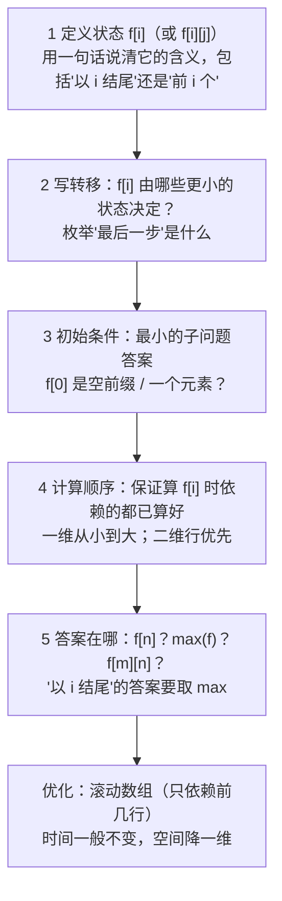
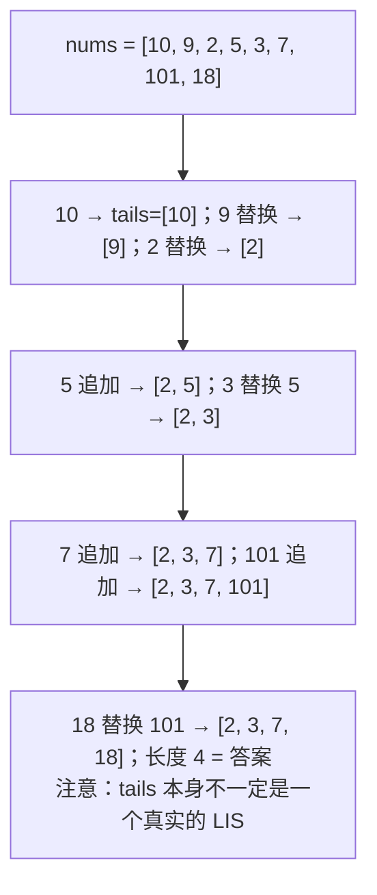
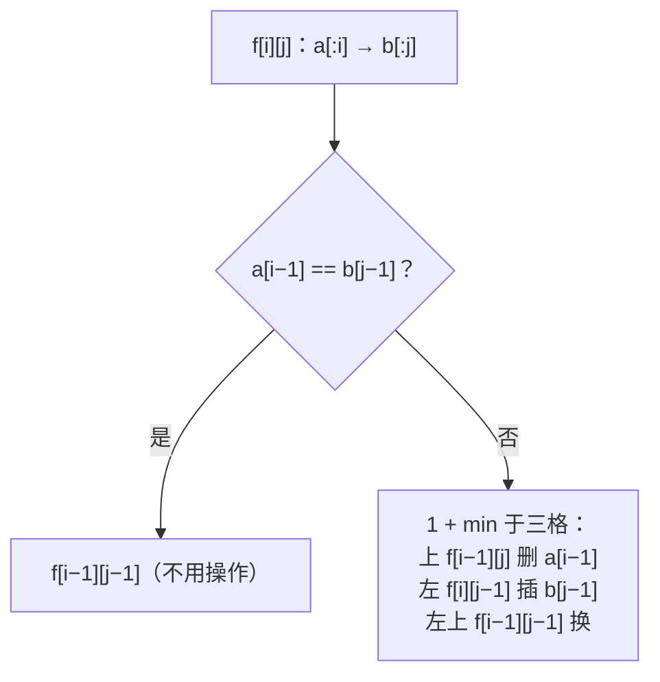

动态规划是面试里最让人紧张的一类题，但中等难度的 DP 只有两种形状：**一维**（状态是"前 $$i$$ 个元素"或"到第 $$i$$ 个位置"）和**二维**（状态是"前 $$i$$ 个与前 $$j$$ 个"或"格子 $$(i, j)$$"）。这一篇讲这两种，下一篇讲背包、区间、状态机、树形。DP 题的难点从来不在代码——代码几乎都是两层循环加一个 `max` / `min`——而在**状态的定义**：定义对了转移是显然的，定义错了怎么凑都不对。所以这一篇先讲一套"五步法"，再用七道主讲题把它练熟。

本篇要回答的核心问题是：

> **怎样从题面推出 DP 的状态定义，而不是靠背题？[^q0] 最长递增子序列的 $$O(n \log n)$$ 解法里 `tails` 数组存的是什么？[^q1] 编辑距离的三种操作各对应状态表里的哪一格？[^q2]**

## 一、识别信号

| 题面里出现 | 状态形状 | 代表题 |
|---|---|---|
| "有多少种方法到第 $$n$$ 阶 / 解码 / 拆分" | 一维计数：`f[i]` = 前 $$i$$ 个的方案数 | 70 · 91 · 139 |
| "不能选相邻的，求最大" | 一维最值：`f[i]` = 前 $$i$$ 个的最优 | 198 · 213 |
| "最少硬币 / 最少完全平方数凑出 $$n$$" | 一维最值，转移枚举最后一个 | 322 · 279 |
| "最长递增子序列" | `f[i]` = **以 $$i$$ 结尾**的最长 | 300 |
| "最大子数组和 / 乘积" | `f[i]` = **以 $$i$$ 结尾**的最优 | 53 · 152 |
| "网格从左上到右下" | `f[i][j]` = 到 $$(i, j)$$ 的方案数 / 最小和 | 62 · 64 |
| "最大正方形 / 矩形" | `f[i][j]` = 以 $$(i, j)$$ 为右下角 | 221 |
| "两个字符串的公共 / 距离 / 匹配" | `f[i][j]` = `a[:i]` 与 `b[:j]` 的答案 | 1143 · 72 · 97 |
| "回文子串 / 子序列" | `f[i][j]` = 区间 $$[i, j]$$（下一篇） | 5 · 516 |

**判断能不能 DP**：问题能分成子问题；子问题的最优解能拼出原问题的最优解（最优子结构）；子问题大量重复（否则直接递归就行）。反例：最长简单路径没有最优子结构。

## 二、五步法



**第 1 步的两个常见形态**："前 $$i$$ 个元素的答案"（答案在 `f[n]`，如爬楼梯、打家劫舍）与"以第 $$i$$ 个元素结尾的答案"（答案是 `max(f)`，如 LIS、最大子数组和）。看题目问的是"整体最优"还是"必须包含末尾"来定——求"子数组 / 子序列"的最值几乎都用后者，因为"以 $$i$$ 结尾"才有明确的转移（要不要接上 $$i - 1$$ 结尾的那段）。

**第 2 步的方法**：想"最后一步是什么"。爬楼梯最后一步是 1 阶或 2 阶；零钱兑换最后一枚是哪种硬币；编辑距离最后一个字符是删、增还是换。把所有可能的最后一步枚举出来，取 max / min / sum。

## 三、主讲题

### 1. LC 322 零钱兑换

**题意**：硬币面额任选、无限个，凑出 `amount` 的最少硬币数，凑不出返回 −1。

**五步**：`f[a]` = 凑出金额 $$a$$ 的最少硬币数；最后一枚是 $$c$$：`f[a] = min(f[a − c]) + 1`；`f[0] = 0`，其余初始化为"无穷"（用 `amount + 1` 代替，避免溢出）；从小到大；答案 `f[amount]`，若仍是无穷则 −1。$$O(\text{amount} \times \lvert \text{coins} \rvert)$$。

| $$a$$ | 0 | 1 | 2 | 3 | 4 | 5 | 6 | 7 | 8 | 9 | 10 | 11 |
|---|---|---|---|---|---|---|---|---|---|---|---|---|
| `f[a]`（coins = 1, 2, 5） | 0 | 1 | 1 | 2 | 2 | 1 | 2 | 2 | 3 | 3 | 2 | **3** |

<div class="code-tabs" markdown="1">
```python
def coin_change(coins, amount):
    INF = amount + 1                             # 最多 amount 枚 1 元硬币，amount+1 就是"不可能"
    f = [0] + [INF] * amount
    for a in range(1, amount + 1):
        for c in coins:
            if c <= a and f[a - c] + 1 < f[a]:
                f[a] = f[a - c] + 1
    return -1 if f[amount] == INF else f[amount]
```
```java
static int coinChange(int[] coins, int amount) {
    int INF = amount + 1;
    int[] f = new int[amount + 1];
    Arrays.fill(f, INF);
    f[0] = 0;
    for (int a = 1; a <= amount; a++)
        for (int c : coins) if (c <= a) f[a] = Math.min(f[a], f[a - c] + 1);
    return f[amount] == INF ? -1 : f[amount];
}
```
</div>

**追问**：*方案数（LC 518）*——外层换成硬币、内层金额，`f[a] += f[a − c]`（顺序决定是"组合"还是"排列"，下一篇背包讲）。*为什么不能贪心*——`[1, 3, 4]` 凑 6：贪心 4+1+1 三枚，最优 3+3 两枚。*BFS 解*——把金额当节点，每次减一枚硬币，最少步数就是 BFS 层数。

### 2. LC 300 最长递增子序列

**题意**：严格递增子序列的最长长度。

**$$O(n^2)$$**：`f[i]` = 以 `nums[i]` **结尾**的 LIS 长度；`f[i] = 1 + max(f[j])` 对所有 $$j < i$$ 且 `nums[j] < nums[i]`；答案 `max(f)`。

**$$O(n \log n)$$**（面试必问的优化）：维护 `tails[k]` = 长度为 $$k + 1$$ 的递增子序列的**最小可能末尾**。`tails` 是严格递增的。新元素 $$x$$：在 `tails` 里二分找第一个 $$\ge x$$ 的位置——找到就替换（同样长度、末尾更小、以后更容易接），找不到（$$x$$ 比全部大）就追加（长度加一）。答案是 `len(tails)`。



<div class="code-tabs" markdown="1">
```python
def length_of_lis_patience(nums):
    tails = []
    for x in nums:
        i = bisect_left(tails, x)                # 第一个 >= x 的位置（严格递增：相等也替换）
        if i == len(tails):
            tails.append(x)
        else:
            tails[i] = x
    return len(tails)
```
```java
static int lengthOfLIS(int[] nums) {
    int[] tails = new int[nums.length];
    int size = 0;
    for (int x : nums) {
        int lo = 0, hi = size;
        while (lo < hi) {
            int mid = (lo + hi) >>> 1;
            if (tails[mid] < x) lo = mid + 1;
            else hi = mid;
        }
        tails[lo] = x;
        if (lo == size) size++;
    }
    return size;
}
```
</div>

**追问**：*非严格递增*——`bisect_right`（第一个 $$> x$$）。*输出一个 LIS*——记录每个元素被放在 `tails` 的哪个位置（即它结尾的 LIS 长度）和前驱，最后回溯。*俄罗斯套娃信封（LC 354）*——按宽升序、宽相同时高**降序**排序，再对高做 LIS。*为什么替换不会让答案变大*——替换只是让同长度的末尾更小，长度不变。

### 3. LC 53 / 152 最大子数组和 / 乘积

**LC 53 Kadane**：`f[i]` = 以 $$i$$ 结尾的最大子数组和 = `max(nums[i], f[i−1] + nums[i])`——要么接上前面，要么从自己重新开始。答案 `max(f)`。滚动成一个变量。

**LC 152 乘积**：负数乘负数变大，所以要同时维护以 $$i$$ 结尾的**最大**和**最小**乘积；`nums[i]` 为负时两者交换角色。

<div class="code-tabs" markdown="1">
```python
def max_sub_array(nums):
    best = cur = nums[0]
    for x in nums[1:]:
        cur = max(x, cur + x)                    # 前面的和为负就丢掉
        best = max(best, cur)
    return best

def max_product(nums):
    best = cur_max = cur_min = nums[0]
    for x in nums[1:]:
        cands = (x, cur_max * x, cur_min * x)
        cur_max, cur_min = max(cands), min(cands)
        best = max(best, cur_max)
    return best
```
```java
static int maxSubArray(int[] nums) {
    int best = nums[0], cur = nums[0];
    for (int i = 1; i < nums.length; i++) {
        cur = Math.max(nums[i], cur + nums[i]);
        best = Math.max(best, cur);
    }
    return best;
}

static int maxProduct(int[] nums) {
    int best = nums[0], curMax = nums[0], curMin = nums[0];
    for (int i = 1; i < nums.length; i++) {
        int x = nums[i];
        int mx = Math.max(x, Math.max(curMax * x, curMin * x));
        int mn = Math.min(x, Math.min(curMax * x, curMin * x));
        curMax = mx;
        curMin = mn;
        best = Math.max(best, curMax);
    }
    return best;
}
```
</div>

**追问**：*输出子数组*——`cur` 从自己重新开始时记下起点。*环形数组最大子数组和（LC 918）*——`max(普通最大, 总和 − 普通最小)`，全负时特判。*分治解法*——$$O(n \log n)$$，跨中点的最大和 = 左半最大后缀 + 右半最大前缀，面试说得出即可。

### 4. LC 1143 最长公共子序列

**题意**：两个字符串的最长公共子序列长度。

**二维状态**：`f[i][j]` = `a[:i]` 与 `b[:j]` 的 LCS。最后一步：若 `a[i−1] == b[j−1]`，两个都用上，`f[i−1][j−1] + 1`；否则至少有一个不在 LCS 里，`max(f[i−1][j], f[i][j−1])`。`f[0][*] = f[*][0] = 0`。答案 `f[m][n]`。

|  | ∅ | a | c | e |
|---|---|---|---|---|
| **∅** | 0 | 0 | 0 | 0 |
| **a** | 0 | **1** | 1 | 1 |
| **b** | 0 | 1 | 1 | 1 |
| **c** | 0 | 1 | **2** | 2 |
| **d** | 0 | 1 | 2 | 2 |
| **e** | 0 | 1 | 2 | **3** |

<div class="code-tabs" markdown="1">
```python
def longest_common_subsequence(a, b):
    m, n = len(a), len(b)
    f = [[0] * (n + 1) for _ in range(m + 1)]
    for i in range(1, m + 1):
        for j in range(1, n + 1):
            if a[i - 1] == b[j - 1]:
                f[i][j] = f[i - 1][j - 1] + 1
            else:
                f[i][j] = max(f[i - 1][j], f[i][j - 1])
    return f[m][n]
```
```java
static int longestCommonSubsequence(String a, String b) {
    int m = a.length(), n = b.length();
    int[][] f = new int[m + 1][n + 1];
    for (int i = 1; i <= m; i++)
        for (int j = 1; j <= n; j++)
            f[i][j] =
                    a.charAt(i - 1) == b.charAt(j - 1)
                            ? f[i - 1][j - 1] + 1
                            : Math.max(f[i - 1][j], f[i][j - 1]);
    return f[m][n];
}
```
</div>

**追问**：*输出 LCS*——从 `f[m][n]` 回溯：相等则取字符斜走，否则往大的方向走。*滚动数组*——只依赖上一行和本行左边，两行即可（斜上角要用一个临时变量存）。*最长公共子串*——不相等时置 0，答案取全表 max。

### 5. LC 72 编辑距离

**题意**：把 `a` 变成 `b` 的最少操作数（插入、删除、替换各算一步）。

**状态**：`f[i][j]` = `a[:i]` → `b[:j]` 的最少操作。相等则 `f[i−1][j−1]`；否则三种最后一步：

- **删除** `a[i−1]`：`f[i−1][j] + 1`（上方格子）
- **插入** `b[j−1]`：`f[i][j−1] + 1`（左方格子）
- **替换** `a[i−1]` → `b[j−1]`：`f[i−1][j−1] + 1`（左上格子）

初始 `f[i][0] = i`（全删）、`f[0][j] = j`（全插）。



|  | ∅ | r | o | s |
|---|---|---|---|---|
| **∅** | 0 | 1 | 2 | 3 |
| **h** | 1 | 1 | 2 | 3 |
| **o** | 2 | 2 | 1 | 2 |
| **r** | 3 | 2 | 2 | 2 |
| **s** | 4 | 3 | 3 | 2 |
| **e** | 5 | 4 | 4 | **3** |

<div class="code-tabs" markdown="1">
```python
def min_distance(a, b):
    m, n = len(a), len(b)
    f = [[0] * (n + 1) for _ in range(m + 1)]
    for i in range(m + 1):
        f[i][0] = i
    for j in range(n + 1):
        f[0][j] = j
    for i in range(1, m + 1):
        for j in range(1, n + 1):
            if a[i - 1] == b[j - 1]:
                f[i][j] = f[i - 1][j - 1]
            else:
                f[i][j] = 1 + min(f[i - 1][j], f[i][j - 1], f[i - 1][j - 1])
    return f[m][n]
```
```java
static int minDistance(String a, String b) {
    int m = a.length(), n = b.length();
    int[][] f = new int[m + 1][n + 1];
    for (int i = 0; i <= m; i++) f[i][0] = i;
    for (int j = 0; j <= n; j++) f[0][j] = j;
    for (int i = 1; i <= m; i++)
        for (int j = 1; j <= n; j++)
            f[i][j] =
                    a.charAt(i - 1) == b.charAt(j - 1)
                            ? f[i - 1][j - 1]
                            : 1 + Math.min(f[i - 1][j - 1], Math.min(f[i - 1][j], f[i][j - 1]));
    return f[m][n];
}
```
</div>

**追问**：*只允许插入和删除（LC 583）*——去掉替换项；答案 = $$m + n - 2 \cdot \text{LCS}$$。*操作代价不同*——三项各乘权重。*一次编辑距离（LC 161）*——不用 DP，双指针 $$O(n)$$。*输出操作序列*——回溯表。

### 6. LC 221 最大正方形

**题意**：01 矩阵里全 1 的最大正方形面积。

**状态**：`f[i][j]` = 以 $$(i, j)$$ 为**右下角**的最大正方形边长。`matrix[i][j] == 1` 时 `f[i][j] = 1 + min(上, 左, 左上)`——三个方向的正方形都至少要有边长 $$k - 1$$ 才能撑起边长 $$k$$。用 $$(m+1) \times (n+1)$$ 的表把边界并进去。

<div class="code-tabs" markdown="1">
```python
def maximal_square(matrix):
    m, n = len(matrix), len(matrix[0])
    f = [[0] * (n + 1) for _ in range(m + 1)]   # 多一行一列：边界自然是 0
    best = 0
    for i in range(1, m + 1):
        for j in range(1, n + 1):
            if matrix[i - 1][j - 1] == "1":
                f[i][j] = 1 + min(f[i - 1][j], f[i][j - 1], f[i - 1][j - 1])
                best = max(best, f[i][j])
    return best * best
```
```java
static int maximalSquare(char[][] matrix) {
    int m = matrix.length, n = matrix[0].length, best = 0;
    int[][] f = new int[m + 1][n + 1];
    for (int i = 1; i <= m; i++)
        for (int j = 1; j <= n; j++)
            if (matrix[i - 1][j - 1] == '1') {
                f[i][j] = 1 + Math.min(f[i - 1][j - 1], Math.min(f[i - 1][j], f[i][j - 1]));
                best = Math.max(best, f[i][j]);
            }
    return best * best;
}
```
</div>

**追问**：*最大矩形（LC 85）*——正方形的 `min` 技巧对矩形不成立，要用逐行柱状图 + 单调栈（03 篇）。*统计全 1 正方形个数（LC 1277）*——`sum(f)`：以 $$(i, j)$$ 为右下角的正方形恰有 `f[i][j]` 个。

### 7. LC 139 单词拆分

**题意**：字符串能否被拆成字典里的单词（可重复用）。

**状态**：`f[i]` = `s[:i]` 能否拆分。最后一个单词是 `s[j:i]`：`f[i] = any(f[j] and s[j:i] in words)`。`f[0] = True`。$$O(n^2)$$ 次子串查询（限制 $$j$$ 只回看最长单词长度可以优化）。

<div class="code-tabs" markdown="1">
```python
def word_break(s, word_dict):
    words = set(word_dict)
    f = [True] + [False] * len(s)
    for i in range(1, len(s) + 1):
        for j in range(i):
            if f[j] and s[j:i] in words:
                f[i] = True
                break
    return f[-1]
```
```java
static boolean wordBreak(String s, List<String> wordDict) {
    Set<String> words = new HashSet<>(wordDict);
    boolean[] f = new boolean[s.length() + 1];
    f[0] = true;
    for (int i = 1; i <= s.length(); i++)
        for (int j = 0; j < i; j++)
            if (f[j] && words.contains(s.substring(j, i))) {
                f[i] = true;
                break;
            }
    return f[s.length()];
}
```
</div>

**追问**：*输出所有拆法（LC 140）*——回溯 + 记忆化（09 篇）。*为什么回溯会超时*——`"aaaa…"` + `["a", "aa", "aaa"]` 有指数级拆法，判定题只需 DP 记录"能否"。*Trie 优化*——从 $$j$$ 出发沿 Trie 走，避免每次切子串。

## 四、变式与追问

| 追问 | 应对 |
|---|---|
| 滚动数组 | 一维依赖前两项 → 两个变量；二维依赖上一行 → 两行（或一行 + 临时变量存左上） |
| 输出方案而不只是最值 | 保留整张表回溯；或额外记 `choice[i]` |
| 记忆化递归 vs 递推 | 记忆化写起来直观（自顶向下，只算需要的状态），递推省栈空间可滚动；面试两种都能写，先写记忆化再说怎么改递推是稳妥路线 |
| 打家劫舍环形（LC 213） | 拆成"不偷第一间"与"不偷最后一间"两次线性 |
| 解码方法（LC 91） | `f[i] = f[i−1]·[s[i−1]≠'0'] + f[i−2]·[10 ≤ s[i−2:i] ≤ 26]` |
| 不同路径有障碍（LC 63） | 障碍格 `f = 0` |
| 三角形最小路径和（LC 120） | 自底向上，原地 |
| 最长公共子串 | 不等时置 0，取全表 max |
| 交错字符串（LC 97） | `f[i][j]` = `s1[:i]` 与 `s2[:j]` 能否交错成 `s3[:i+j]` |
| 不同的子序列（LC 115） | 计数版 LCS：相等时 `f[i−1][j−1] + f[i−1][j]` |

## 五、两种语言的坑

| | Python | Java |
|---|---|---|
| 二维表初始化 | `[[0] * (n+1) for _ in range(m+1)]`；**不要** `[[0]*(n+1)] * (m+1)`（所有行是同一个列表） | `new int[m+1][n+1]` 默认 0；`boolean[][]` 默认 false |
| 无穷大 | `float("inf")` 可与 int 比较；或用 `amount + 1` | `Integer.MAX_VALUE` 加 1 溢出成负；用 `amount + 1` 或 `MAX_VALUE / 2` |
| 递归深度 | 记忆化递归 `lru_cache` 深度受限（1000） | 一般够 |
| 记忆化 | `@functools.lru_cache(None)` 一行 | `HashMap` 或数组 + 哨兵值 |
| 切片子串查询 | `s[j:i] in words` 每次拷贝 | `substring` 同样拷贝；可用 `startsWith(word, j)` 避免 |
| 二维表滚动 | `f, g = g, f` 交换两行 | 交换引用 `int[] t = prev; prev = cur; cur = t;` 并清零 |
| `>>>` | 无（无溢出问题） | 无符号右移做 mid，避免溢出 |

## 六、题单

| 题 | 一句提示 |
|---|---|
| LC 70 爬楼梯 | 斐波那契，两个变量 |
| LC 198 / 213 打家劫舍 I / II | `max(f[i−1], f[i−2] + x)`；环形拆两次 |
| LC 91 解码方法 | 两项之和，注意 0 |
| LC 279 完全平方数 | 与 322 同型 |
| LC 62 / 63 不同路径 I / II | 一维滚动 `f[j] += f[j−1]` |
| LC 64 最小路径和 | 原地 DP |
| LC 120 三角形最小路径和 | 自底向上 |
| LC 152 乘积最大子数组 | 同时维护最大最小 |
| LC 918 环形子数组的最大和 | 总和 − 最小子数组 |
| LC 354 俄罗斯套娃信封 | 排序 + LIS |
| LC 583 两个字符串的删除操作 | LCS 变形 |
| LC 97 交错字符串 | 二维布尔 |
| LC 1277 统计全为 1 的正方形子矩阵 | `sum(f)` |

## 七、小结

| 状态形状 | 含义 | 答案 | 代表题 |
|---|---|---|---|
| `f[i]`：前 $$i$$ 个 | 整体最优 / 方案数 | `f[n]` | 70 · 198 · 322 · 139 |
| `f[i]`：以 $$i$$ 结尾 | 必须包含第 $$i$$ 个 | `max(f)` | 300 · 53 · 152 |
| `f[i][j]`：格子 | 到 $$(i, j)$$ / 以 $$(i, j)$$ 为右下角 | `f[m][n]` / `max` | 62 · 64 · 221 |
| `f[i][j]`：两个前缀 | `a[:i]` 与 `b[:j]` | `f[m][n]` | 1143 · 72 · 97 |

写 DP 先用一句话把状态定义写在注释里，再问"最后一步是什么"得到转移——这两步做对，代码是两层循环加一个取最值。

## 八、自测

1. LIS 的 `tails` 数组是不是一个真实的递增子序列？用 `[3, 1, 2]` 说明。

   <details markdown="1">
   <summary>答案</summary>
   不一定。`[3, 1, 2]`：3 → `tails=[3]`；1 替换 → `[1]`；2 追加 → `[1, 2]`。这里恰好是真实子序列。换 `[2, 5, 1]`：`[2]` → `[2, 5]` → 1 替换 2 → `[1, 5]`，但 `[1, 5]` 不是原数组的子序列（1 在 5 之后）。`tails[k]` 只保证"存在某个长度 $$k+1$$ 的递增子序列以 `tails[k]` 结尾"，不同位置的元素可能来自不同的子序列。长度是对的，序列不是。详见[第三章第 2 题](#2-lc-300-最长递增子序列)。
   </details>

2. `coin_change` 的 `INF` 用 `float("inf")`（Python）或 `Integer.MAX_VALUE`（Java）会有什么问题？

   <details markdown="1">
   <summary>答案</summary>
   Python 用 `float("inf")` 能工作，但 `f` 里混入浮点，返回值可能变成 `3.0`；Java 用 `Integer.MAX_VALUE` 时 `f[a − c] + 1` 溢出成负数，`min` 会选中它，结果全错。用 `amount + 1` 既是整数又不溢出，且语义清晰（不可能比 `amount` 枚 1 元硬币还多）。详见[第三章第 1 题](#1-lc-322-零钱兑换)。
   </details>

3. `max_product` 里为什么候选是三个（`x`、`cur_max·x`、`cur_min·x`）而不是两个？

   <details markdown="1">
   <summary>答案</summary>
   `x` 单独一项对应"从自己重新开始"（前面的乘积可能是 0 或符号不利）；`cur_max·x` 是"接上前面的最大"；`cur_min·x` 是"接上前面的最小"——`x` 为负时最小乘以负变最大。少了 `x` 这一项，`[0, 2]` 会得到 0（`cur_max = 0` 后 `0·2 = 0`）而不是 2。详见[第三章第 3 题](#3-lc-53--152-最大子数组和--乘积)。
   </details>

4. 编辑距离表里 `f[i][0] = i`、`f[0][j] = j` 各代表什么操作？如果题目只允许替换，表该怎么初始化？

   <details markdown="1">
   <summary>答案</summary>
   `f[i][0] = i`：把 `a[:i]` 变成空串，删 $$i$$ 次；`f[0][j] = j`：从空串变成 `b[:j]`，插 $$j$$ 次。只允许替换时长度必须相等（$$m = n$$），否则无解；此时 `f[i][0]`（$$i > 0$$）与 `f[0][j]`（$$j > 0$$）都是无穷，转移只剩 `f[i−1][j−1] + [a[i−1] ≠ b[j−1]]`，答案就是汉明距离。详见[第三章第 5 题](#5-lc-72-编辑距离)。
   </details>

5. 把 `maximal_square` 的转移改成 `1 + min(上, 左)`（去掉左上），什么输入会算错？

   <details markdown="1">
   <summary>答案</summary>
   `[[1, 1], [1, 1]]`：右下角 `1 + min(上=1, 左=1) = 2`，恰好对。但 `[[0, 1], [1, 1]]`：右下角的上、左都是 1，`1 + min(1, 1) = 2`，而左上角是 0，无法构成 2×2——正确答案是 1。左上那一项保证正方形的对角格也被覆盖。详见[第三章第 6 题](#6-lc-221-最大正方形)。
   </details>

## 下一篇

[动态规划（二）：背包、区间、状态机、树形](/coding-interview-dynamic-programming-knapsack-interval-state-machine.html)

[^q0]: 五步法：① 用一句话定义状态（"前 $$i$$ 个的最优"还是"以 $$i$$ 结尾的最优"——求子数组 / 子序列的最值用后者，因为只有"以 $$i$$ 结尾"才有明确的转移）；② 枚举"最后一步是什么"得到转移（最后一枚硬币是哪种、最后一个字符是删 / 增 / 换）；③ 初始条件是最小子问题（空前缀）；④ 计算顺序保证依赖已算好；⑤ 答案在 `f[n]` 还是 `max(f)`。定义写对了转移是显然的；定义错了怎么凑都不对。详见[第二章](#二五步法)。

[^q1]: `tails[k]` = 所有长度为 $$k + 1$$ 的递增子序列中，**最小的末尾元素**。它严格递增。新元素 $$x$$ 二分找第一个 $$\ge x$$ 的位置：找到就替换（长度不变、末尾更小、以后更容易接）；找不到就追加（$$x$$ 能接在最长的后面，长度加一）。答案是 `len(tails)`；`tails` 本身不一定是一个真实的子序列，只有长度是对的。详见[第三章第 2 题](#2-lc-300-最长递增子序列)。

[^q2]: `f[i][j]` = `a[:i]` 变成 `b[:j]` 的最少操作。末字符不等时的三个候选：**删除** `a[i−1]` 对应上方格 `f[i−1][j]`（删掉后剩 `a[:i−1]` 对 `b[:j]`）；**插入** `b[j−1]` 对应左方格 `f[i][j−1]`（插入后 `b[:j]` 的末字符已匹配，剩 `a[:i]` 对 `b[:j−1]`）；**替换**对应左上格 `f[i−1][j−1]`（换完两个末字符都匹配）。相等时直接取左上格不加一。边界 `f[i][0] = i` 全删、`f[0][j] = j` 全插。详见[第三章第 5 题](#5-lc-72-编辑距离)。
