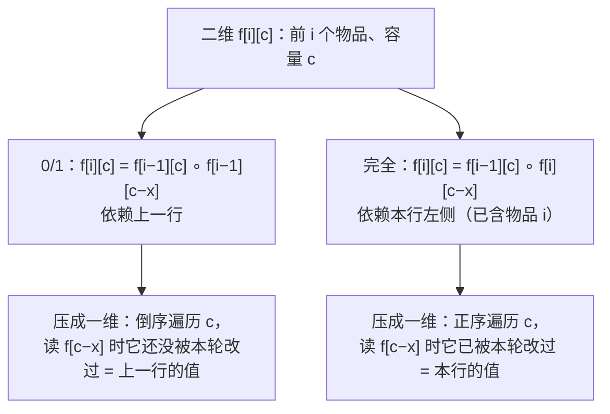
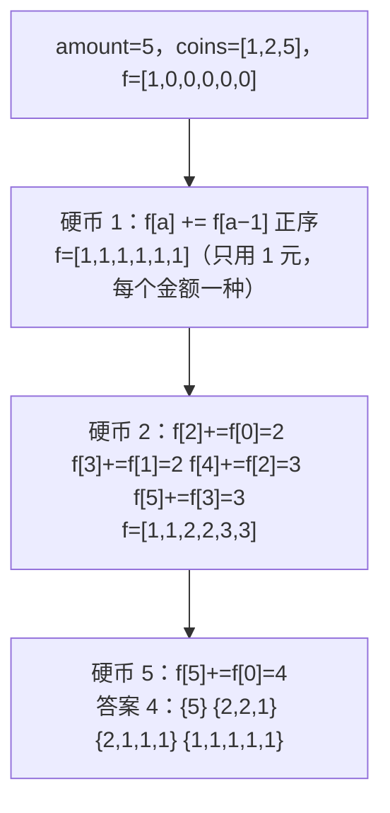
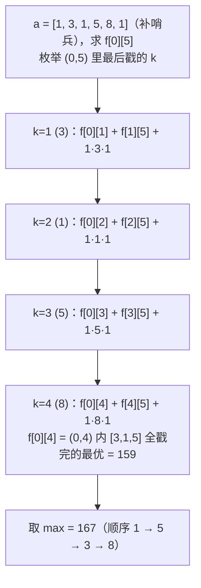
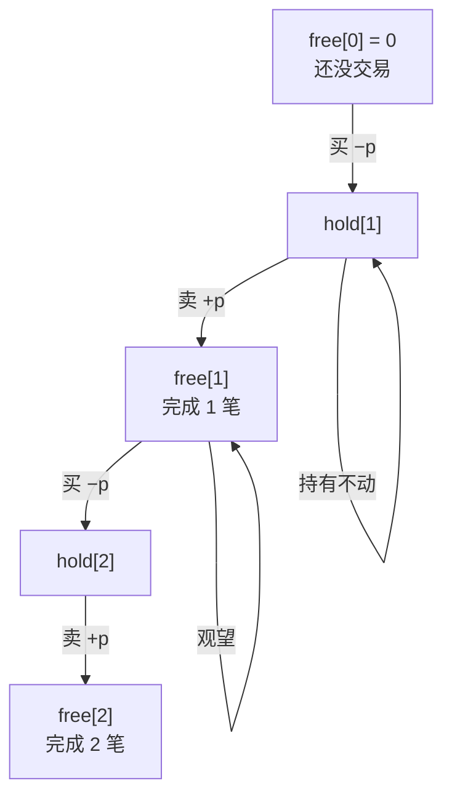

上一篇的 DP 状态是"前 $$i$$ 个"或"两个前缀"，这一篇是四种形状更特殊的状态：**背包**（前 $$i$$ 个物品、容量 $$c$$——"选不选"的问题几乎都是它，包括分割等和子集、目标和、零钱兑换 II）、**区间**（区间 $$[i, j]$$ 的答案由更短的区间拼出——戳气球、最长回文子序列）、**状态机**（每个时刻处于有限几种状态之一——买卖股票全家族）、**树形**（子树的答案拼出父节点——打家劫舍 III）。再加两道字符串匹配（正则、通配符）——它们是二维 DP 里最容易写错转移的。这些题面试频率比第一篇低，但一旦考到区分度很高。

本篇要回答的核心问题是：

> **0/1 背包和完全背包的一维写法只差"容量正序还是倒序"，为什么？[^q0] 区间 DP 的"枚举最后一个被处理的元素"怎样把戳气球从无从下手变成三重循环？[^q1] 买卖股票六道题为什么是同一个状态机？[^q2]**

## 一、识别信号

| 题面里出现 | 形状 | 状态 |
|---|---|---|
| "能否选出子集使和为 / 分成两半 / 装满容量" | 0/1 背包（可行性） | `f[c]`：容量 $$c$$ 能否恰好装满 |
| "有多少种选法凑出 target"（每个一次） | 0/1 背包（计数） | `f[c] += f[c − x]`，容量**倒序** |
| "硬币无限、凑出 amount 的方案数" | 完全背包（计数） | 容量**正序** |
| "戳气球 / 合并石子 / 最长回文子序列 / 矩阵链乘" | 区间 DP | `f[i][j]`：区间 $$[i, j]$$ 的最优 |
| "买卖股票"（一次 / 多次 / k 次 / 冷冻期 / 手续费） | 状态机 | `hold` / `free`（× 交易次数） |
| "树上不选相邻节点 / 树的最大独立集" | 树形 DP | 后序返回 `(选, 不选)` |
| "正则 / 通配符匹配" | 二维匹配 | `f[i][j]`：`s[:i]` 与 `p[:j]` 是否匹配 |
| "访问所有节点的最短路 / 分配任务" | 状压 DP | `f[mask][last]` |

## 二、模板

### 1. 背包（一维滚动）

<div class="code-tabs" markdown="1">
```python
# 0/1 背包：每个物品最多选一次 —— 容量倒序
f = [0] * (cap + 1)
for x in items:
    for c in range(cap, x - 1, -1):              # 倒序：f[c - x] 还是"上一个物品"的值
        f[c] = op(f[c], f[c - x])

# 完全背包：每个物品可选无限次 —— 容量正序
for x in items:
    for c in range(x, cap + 1):                  # 正序：f[c - x] 已经包含了本物品，允许再选
        f[c] = op(f[c], f[c - x])
```
```java
// 0/1
for (int x : items) for (int c = cap; c >= x; c--) f[c] = op(f[c], f[c - x]);
// 完全
for (int x : items) for (int c = x; c <= cap; c++) f[c] = op(f[c], f[c - x]);
```
</div>

`op` 是 `or`（可行性）、`+`（计数）、`max` / `min`（最值）。



### 2. 区间 DP

<div class="code-tabs" markdown="1">
```python
for length in range(2, n + 1):                   # 先算短区间
    for i in range(n - length + 1):
        j = i + length - 1
        for k in range(i, j):                    # 枚举分割点 / 最后处理的元素
            f[i][j] = best(f[i][j], f[i][k] + f[k + 1][j] + cost(i, k, j))
```
```java
for (int len = 2; len <= n; len++)
    for (int i = 0; i + len - 1 < n; i++) {
        int j = i + len - 1;
        for (int k = i; k < j; k++) f[i][j] = best(f[i][j], f[i][k] + f[k + 1][j] + cost(i, k, j));
    }
```
</div>

外层按**区间长度**递增，保证算 `f[i][j]` 时所有更短的子区间都已算好。另一种等价写法是 `i` 从大到小、`j` 从小到大。

### 3. 状态机

<div class="code-tabs" markdown="1">
```python
hold, free = -inf, 0                             # 持有 / 空仓 时的最大收益
for p in prices:
    hold, free = max(hold, free - p), max(free, hold + p)   # 同时更新：右边用的都是上一天的值
return free
```
```java
int hold = Integer.MIN_VALUE / 2, free = 0;
for (int p : prices) { int nh = Math.max(hold, free - p), nf = Math.max(free, hold + p); hold = nh; free = nf; }
return free;
```
</div>

## 三、主讲题

### 1. LC 416 分割等和子集

**题意**：能否把数组分成两个和相等的子集。

**转化**：总和奇数直接否；否则问"能否选出子集和为 `total / 2`"——0/1 背包可行性。`f[c]` = 能否恰好凑出 $$c$$，`f[0] = True`，每个物品倒序更新 `f[c] |= f[c − x]`。$$O(n \cdot S)$$。

| 处理物品 | `f[0..11]` 中为真的容量（nums = 1, 5, 11, 5，target = 11） |
|---|---|
| 初始 | 0 |
| 1 | 0, 1 |
| 5 | 0, 1, 5, 6 |
| 11 | 0, 1, 5, 6, **11** |
| 5 | 0, 1, 5, 6, 10, 11 |

<div class="code-tabs" markdown="1">
```python
def can_partition(nums):
    total = sum(nums)
    if total % 2:
        return False
    target = total // 2
    f = [True] + [False] * target
    for x in nums:
        for c in range(target, x - 1, -1):       # 倒序：每个物品只用一次
            f[c] = f[c] or f[c - x]
    return f[target]
```
```java
static boolean canPartition(int[] nums) {
    int total = 0;
    for (int x : nums) total += x;
    if (total % 2 != 0) return false;
    int target = total / 2;
    boolean[] f = new boolean[target + 1];
    f[0] = true;
    for (int x : nums) for (int c = target; c >= x; c--) f[c] |= f[c - x];
    return f[target];
}
```
</div>

**追问**：*目标和（LC 494，每个数前加 + 或 −）*——设正号子集和为 $$P$$，$$P - (S - P) = \text{target}$$，$$P = (S + \text{target}) / 2$$，转成"凑出 $$P$$ 的方案数"，0/1 背包计数。*最后一块石头（LC 1049）*——两堆差最小 = 找最接近 $$S/2$$ 的子集和。*位运算加速*——`bits |= bits << x`，用一个大整数当布尔数组，Python 里极快。

### 2. LC 518 零钱兑换 II

**题意**：硬币无限，凑出 `amount` 的**组合**数（不计顺序）。

**完全背包计数**：外层硬币、内层容量正序，`f[a] += f[a − c]`。

**为什么外层必须是硬币**：外层硬币保证"先决定用几个 1，再决定用几个 2……"，每种组合只被数一次。如果外层是金额、内层是硬币，`1+2` 和 `2+1` 会被分别计数——那是**排列**数（LC 377 组合总和 IV 要的正是这个）。



<div class="code-tabs" markdown="1">
```python
def change(amount, coins):
    f = [1] + [0] * amount
    for c in coins:                              # 外层硬币：组合数
        for a in range(c, amount + 1):           # 正序：可以重复用
            f[a] += f[a - c]
    return f[amount]
```
```java
static int change(int amount, int[] coins) {
    int[] f = new int[amount + 1];
    f[0] = 1;
    for (int c : coins) for (int a = c; a <= amount; a++) f[a] += f[a - c];
    return f[amount];
}
```
</div>

**追问**：*最少硬币数（LC 322）*——同样完全背包，`op` 换成 `min`，此时内外层顺序无所谓（最值不怕重复计数）。*完全平方数（LC 279）*——物品是 $$1, 4, 9, \ldots$$。

### 3. LC 312 戳气球

**题意**：戳破气球 $$k$$ 得 $$\text{nums}[k-1] \times \text{nums}[k] \times \text{nums}[k+1]$$ 枚硬币（越界当 1），戳完所有气球的最大得分。

**难点**：戳破一个气球后相邻关系会变，正着想（先戳哪个）子问题不独立。**反着想**：在开区间 $$(i, j)$$ 里，哪个气球 $$k$$ 是**最后**被戳的？最后戳它时，$$(i, k)$$ 和 $$(k, j)$$ 里的气球都已经没了，它的邻居就是 $$i$$ 和 $$j$$（区间边界，不会变）。于是

$$
f[i][j] = \max_{i < k < j} \big( f[i][k] + f[k][j] + a[i] \cdot a[k] \cdot a[j] \big)
$$

两端补 1 作为哨兵，答案 `f[0][n+1]`。$$O(n^3)$$。



<div class="code-tabs" markdown="1">
```python
def max_coins(nums):
    a = [1] + nums + [1]
    n = len(a)
    f = [[0] * n for _ in range(n)]
    for length in range(2, n):                   # j - i >= 2 才有气球可戳
        for i in range(n - length):
            j = i + length
            for k in range(i + 1, j):            # k：(i, j) 里最后戳的
                f[i][j] = max(f[i][j], f[i][k] + f[k][j] + a[i] * a[k] * a[j])
    return f[0][n - 1]
```
```java
static int maxCoins(int[] nums) {
    int n = nums.length + 2;
    int[] a = new int[n];
    a[0] = a[n - 1] = 1;
    System.arraycopy(nums, 0, a, 1, nums.length);
    int[][] f = new int[n][n];
    for (int len = 2; len < n; len++)
        for (int i = 0; i + len < n; i++) {
            int j = i + len;
            for (int k = i + 1; k < j; k++)
                f[i][j] = Math.max(f[i][j], f[i][k] + f[k][j] + a[i] * a[k] * a[j]);
        }
    return f[0][n - 1];
}
```
</div>

**追问**：*为什么不能想"第一个戳的"*——第一个戳 $$k$$ 后，$$k$$ 左右两段合并成一段，子问题不再是独立的区间。*矩阵链乘法、合并石子*——同一模板，`cost` 不同（合并石子的 `cost` 是区间和，用前缀和 $$O(1)$$ 取）。*最长回文子序列（LC 516）*——区间 DP 的简单版：`s[i] == s[j]` 则 `f[i+1][j−1] + 2`，否则 `max(f[i+1][j], f[i][j−1])`，$$O(n^2)$$。

### 4. LC 188 买卖股票的最佳时机 IV（含 121 / 122 / 123）

**题意**：最多 $$k$$ 笔交易（一买一卖算一笔），最大收益。

**状态机**：每天结束时要么持有股票（`hold`）要么空仓（`free`），加上"已用几笔交易"的维度 $$j$$。

- `free[j] = max(free[j], hold[j] + p)`：今天卖出，完成第 $$j$$ 笔
- `hold[j] = max(hold[j], free[j−1] − p)`：今天买入，开始第 $$j$$ 笔

$$j$$ 倒序更新可以复用一维数组。$$k \ge n/2$$ 时交易次数不受限，退化成 LC 122（所有上坡都吃）。



<div class="code-tabs" markdown="1">
```python
def max_profit_k(k, prices):
    if not prices:
        return 0
    if k >= len(prices) // 2:                    # 次数不受限：LC 122
        return sum(max(0, b - a) for a, b in zip(prices, prices[1:]))
    hold = [float("-inf")] * (k + 1)
    free = [0] * (k + 1)
    for p in prices:
        for j in range(k, 0, -1):                # j 倒序：free[j-1] 还是昨天的
            free[j] = max(free[j], hold[j] + p)
            hold[j] = max(hold[j], free[j - 1] - p)
    return free[k]
```
```java
static int maxProfitK(int k, int[] prices) {
    if (prices.length == 0) return 0;
    if (k >= prices.length / 2) {
        int s = 0;
        for (int i = 1; i < prices.length; i++) s += Math.max(0, prices[i] - prices[i - 1]);
        return s;
    }
    int[] hold = new int[k + 1], free = new int[k + 1];
    Arrays.fill(hold, Integer.MIN_VALUE / 2);   // /2：防止 + p 溢出
    for (int p : prices)
        for (int j = k; j >= 1; j--) {
            free[j] = Math.max(free[j], hold[j] + p);
            hold[j] = Math.max(hold[j], free[j - 1] - p);
        }
    return free[k];
}
```
</div>

**全家族**：

| 题 | 约束 | 状态 |
|---|---|---|
| 121 | 一笔 | `k = 1`；或维护最低价 |
| 122 | 无限 | `hold` / `free` 两状态 |
| 123 | 两笔 | `k = 2` |
| 188 | $$k$$ 笔 | 上面的代码 |
| 309 | 卖出后冷冻一天 | 三状态：`hold` / `sold`（今天刚卖）/ `rest` |
| 714 | 每笔手续费 | 卖出时 `hold + p − fee` |

**追问**：*冷冻期（LC 309）*——`hold = max(hold, rest − p)`，`sold = hold + p`，`rest = max(rest, sold)`；答案 `max(sold, rest)`。注意买入只能从 `rest` 转来（`sold` 后必须冷冻一天）。*为什么 `hold` 初始化为 −∞*——第一天之前不可能持有；Java 用 `MIN_VALUE / 2` 防止加 `p` 溢出。

### 5. LC 337 打家劫舍 III

**题意**：二叉树，不能同时偷父子节点，最大总金额。

**树形 DP**：后序遍历，每个节点返回一对 `(偷这个节点的最大, 不偷这个节点的最大)`：

- 偷当前：`node.val + 左.不偷 + 右.不偷`
- 不偷当前：`max(左) + max(右)`（子节点偷不偷都行）

<div class="code-tabs" markdown="1">
```python
def rob_tree(root):
    def dfs(node):
        if not node:
            return 0, 0                          # (偷, 不偷)
        l_take, l_skip = dfs(node.left)
        r_take, r_skip = dfs(node.right)
        take = node.val + l_skip + r_skip
        skip = max(l_take, l_skip) + max(r_take, r_skip)
        return take, skip
    return max(dfs(root))
```
```java
static int robTree(TreeNode root) { int[] r = dfs(root); return Math.max(r[0], r[1]); }
private static int[] dfs(TreeNode n) {
    if (n == null) return new int[]{0, 0};
    int[] l = dfs(n.left), r = dfs(n.right);
    return new int[]{n.val + l[1] + r[1], Math.max(l[0], l[1]) + Math.max(r[0], r[1])};
}
```
</div>

**追问**：*为什么不能"隔层取"*——奇数层全偷或偶数层全偷不是最优（`[4, 1, null, 2, null, 3]` 偷 4 和 3）。*一般图上的最大独立集*——NP 难；树上 DP 之所以可行是因为子树独立。*监控二叉树（LC 968）*——三状态树形 DP（有摄像头 / 被覆盖 / 未覆盖）。

### 6. LC 10 / 44 正则表达式匹配 / 通配符匹配

**LC 10**：`.` 匹配任一字符，`x*` 匹配零或多个 `x`。状态 `f(i, j)` = `s[i:]` 与 `p[j:]` 是否匹配（记忆化写法更自然）：

- `p[j+1] == '*'`：要么跳过 `x*`（`f(i, j+2)`），要么当前字符匹配 `x` 且继续用 `x*`（`first and f(i+1, j)`）
- 否则：`first and f(i+1, j+1)`

其中 `first = i < len(s) and p[j] in (s[i], '.')`。

<div class="code-tabs" markdown="1">
```python
def is_match_regex(s, p):
    @lru_cache(maxsize=None)
    def f(i, j):
        if j == len(p):
            return i == len(s)                   # 模式用完，串也要用完
        first = i < len(s) and p[j] in (s[i], ".")
        if j + 1 < len(p) and p[j + 1] == "*":
            return f(i, j + 2) or (first and f(i + 1, j))
        return first and f(i + 1, j + 1)
    return f(0, 0)
```
```java
static boolean isMatchRegex(String s, String p) {     // 自底向上：f[i][j] = s[i:] 与 p[j:] 匹配
    int m = s.length(), n = p.length();
    boolean[][] f = new boolean[m + 1][n + 1];
    f[m][n] = true;
    for (int i = m; i >= 0; i--)
        for (int j = n - 1; j >= 0; j--) {
            boolean first = i < m && (p.charAt(j) == s.charAt(i) || p.charAt(j) == '.');
            if (j + 1 < n && p.charAt(j + 1) == '*') f[i][j] = f[i][j + 2] || (first && f[i + 1][j]);
            else f[i][j] = first && f[i + 1][j + 1];
        }
    return f[0][0];
}
```
</div>

**LC 44**：`?` 匹配一个，`*` 匹配任意长（含空）。`f[i][j]` = `s[:i]` 与 `p[:j]` 匹配：`p[j−1] == '*'` 时 `f[i][j−1]`（`*` 匹配空）`or f[i−1][j]`（`*` 再吃一个字符）；否则 `f[i−1][j−1] and (p[j−1] == '?' or 相等)`。初始 `f[0][j]` = 前 $$j$$ 个模式字符全是 `*`。

<div class="code-tabs" markdown="1">
```python
def is_match_wildcard(s, p):
    m, n = len(s), len(p)
    f = [[False] * (n + 1) for _ in range(m + 1)]
    f[0][0] = True
    for j in range(1, n + 1):
        f[0][j] = f[0][j - 1] and p[j - 1] == "*"
    for i in range(1, m + 1):
        for j in range(1, n + 1):
            if p[j - 1] == "*":
                f[i][j] = f[i][j - 1] or f[i - 1][j]
            else:
                f[i][j] = f[i - 1][j - 1] and p[j - 1] in (s[i - 1], "?")
    return f[m][n]
```
```java
static boolean isMatchWildcard(String s, String p) {
    int m = s.length(), n = p.length();
    boolean[][] f = new boolean[m + 1][n + 1];
    f[0][0] = true;
    for (int j = 1; j <= n; j++) f[0][j] = f[0][j - 1] && p.charAt(j - 1) == '*';
    for (int i = 1; i <= m; i++)
        for (int j = 1; j <= n; j++) {
            char c = p.charAt(j - 1);
            if (c == '*') f[i][j] = f[i][j - 1] || f[i - 1][j];
            else f[i][j] = f[i - 1][j - 1] && (c == '?' || c == s.charAt(i - 1));
        }
    return f[m][n];
}
```
</div>

**`*` 转移的理解**：`f[i−1][j]` 表示"`*` 已经匹配了 `s[:i−1]` 的某个后缀，再多吃一个 `s[i−1]`"——这一项让 `*` 能匹配任意长度而不用枚举。

**追问**：*两题的 `*` 有何不同*——正则的 `*` 依附前一个字符（`a*` 是零或多个 a），通配符的 `*` 独立（任意串）。*贪心解通配符*——记录最近一个 `*` 的位置回退，$$O(mn)$$ 最坏但平均快。*为什么正则用记忆化更自然*——转移里有 `j + 2`，自底向上要倒着填，边界多。

## 四、变式与追问

| 追问 | 应对 |
|---|---|
| 多重背包（每个物品最多 $$k_i$$ 个） | 拆成 $$\log k_i$$ 个 0/1 物品（二进制拆分） |
| 二维费用背包（LC 474 一和零） | `f[a][b]` 两个容量都倒序 |
| 恰好装满 vs 至多装满 | 恰好：`f[0] = 0` 其余 −∞；至多：全部初始化 0 |
| 区间 DP 输出方案 | 记录每个 `f[i][j]` 取最优时的 `k`，递归输出 |
| 合并石子（相邻两堆） | 区间 DP，`cost` = 区间和 |
| 石子游戏 / 预测赢家（LC 877 / 486） | 区间 DP，`f[i][j]` = 先手净胜分 |
| 股票 + 冷冻期 + 手续费 | 状态机叠加约束 |
| 树形 DP 求直径 / 最大路径和 | 05 篇的"返回链、更新路径" |
| 状压 DP（LC 847 访问所有节点最短路） | `(node, mask)` 上 BFS，$$O(n \cdot 2^n)$$ |
| 数位 DP | 面试极少，说得出"按位枚举 + 是否贴上界"即可 |

## 五、两种语言的坑

| | Python | Java |
|---|---|---|
| 负无穷 | `float("-inf")`，加减安全 | `Integer.MIN_VALUE / 2`：留出加法空间；直接用 `MIN_VALUE` 加正数会溢出成大正数 |
| 记忆化 | `@lru_cache(maxsize=None)`；参数必须可哈希 | 数组 + 哨兵（`Boolean[][]` 用 `null` 表示未算，或 `int[][]` 用 −1） |
| 二维布尔表 | `[[False] * (n+1) for _ in range(m+1)]` | `new boolean[m+1][n+1]` 默认 false |
| 大整数位运算背包 | `bits \|= bits << x`，Python 大整数天然支持 | `BitSet` 或 `long[]` 手动移位 |
| 多重赋值 | `hold, free = ..., ...` 同时更新 | 先算到临时变量再赋值，否则 `free` 用到已更新的 `hold` |
| 元组返回 | `return take, skip` | `int[]{take, skip}` |
| 三重循环性能 | 戳气球 $$n = 300$$，$$2.7 \times 10^7$$ 次，Python 约 3 秒接近超时 | 无压力 |

## 六、题单

| 题 | 一句提示 |
|---|---|
| LC 494 目标和 | 转成子集和计数 |
| LC 1049 最后一块石头的重量 II | 最接近 $$S/2$$ 的子集和 |
| LC 474 一和零 | 二维费用 0/1 背包 |
| LC 377 组合总和 IV | 完全背包**排列**数：外层金额 |
| LC 279 完全平方数 | 完全背包最值 |
| LC 516 最长回文子序列 | 区间 DP |
| LC 1039 多边形三角剖分 | 与戳气球同型 |
| LC 877 石子游戏 | 区间 DP 或数学（先手必胜） |
| LC 121 / 122 / 123 / 309 / 714 买卖股票 | 状态机全家族 |
| LC 968 监控二叉树 | 三状态树形 DP |
| LC 1143 → 583 → 712 | LCS 的三个变形 |
| LC 847 访问所有节点的最短路径 | 状压 BFS |
| LC 698 划分为 k 个相等的子集 | 状压 DP 或回溯 |

## 七、小结

| 形状 | 状态 | 转移的关键 | 代表题 |
|---|---|---|---|
| 0/1 背包 | `f[c]` | 容量**倒序**，每物品一次 | 416 · 494 · 474 |
| 完全背包 | `f[c]` | 容量**正序**；组合数外层物品、排列数外层容量 | 518 · 322 · 377 |
| 区间 | `f[i][j]` | 按长度递增；枚举**最后**处理的 $$k$$ | 312 · 516 · 石子 |
| 状态机 | `hold` / `free` × 次数 | 同时更新；−∞ 初始化 | 121–714 |
| 树形 | 后序返回元组 | `(选, 不选)` 或 `(链, 更新)` | 337 · 968 |
| 匹配 | `f[i][j]` 布尔 | `*` 的两个分支：匹配空 / 再吃一个 | 10 · 44 |

背包只记一条：**倒序 = 一次，正序 = 无限**。区间只记一条：**最后一个被处理的是谁**。状态机只记一条：**画出状态转移图再写代码**。

## 八、自测

1. 把 `can_partition` 的内层循环改成正序，输入 `[1, 2]`、target 3 会怎样？

   <details markdown="1">
   <summary>答案</summary>
   物品 1 正序：`f[1] |= f[0]` 真，`f[2] |= f[1]` 真（1 被用了两次！），`f[3] |= f[2]` 真。结论"能凑出 3"是对的，但过程里 `f[2] = True` 表示"用两个 1 凑出 2"——违反了每个物品只用一次。换 `[1]`、target 2：正序会得到 `f[2] = True`（错误），倒序得到 `False`（正确）。详见[第二章模板 1](#1-背包一维滚动)。
   </details>

2. LC 518 把内外层循环交换（外层金额、内层硬币），`amount = 3`、`coins = [1, 2]` 得到几？它数的是什么？

   <details markdown="1">
   <summary>答案</summary>
   3：`1+1+1`、`1+2`、`2+1`。数的是**排列**数（有序序列），LC 377 组合总和 IV 要的就是这个。外层硬币得到 2（`{1,1,1}`、`{1,2}`），是组合数。外层硬币相当于"按硬币种类顺序做决定"，每个多重集只对应一种决定顺序。详见[第三章第 2 题](#2-lc-518-零钱兑换-ii)。
   </details>

3. 戳气球里为什么 `f[i][j]` 定义为**开**区间 $$(i, j)$$ 而不是闭区间？

   <details markdown="1">
   <summary>答案</summary>
   开区间的两端 $$i$$、$$j$$ 是"在这个子问题里**不会被戳**的边界"，所以最后戳 $$k$$ 时它的邻居一定是 $$a[i]$$ 和 $$a[j]$$——邻居固定，子问题才独立。如果用闭区间，最后戳 $$k$$ 时它的邻居是区间外面的元素，那些元素是否已被戳取决于外层的决策，子问题就不独立了。补两个哨兵 1 让整个数组也是一个开区间 $$(0, n+1)$$。详见[第三章第 3 题](#3-lc-312-戳气球)。
   </details>

4. 冷冻期版本（LC 309）的三个状态里，为什么买入只能从 `rest` 转来、不能从 `sold` 转来？如果允许会算出什么错误答案？

   <details markdown="1">
   <summary>答案</summary>
   `sold` 表示"今天刚卖出"，规则要求卖出后隔一天才能买，所以明天不能从 `sold` 直接买；必须先转到 `rest`（休息一天）再买。允许的话相当于没有冷冻期，退化成 LC 122：`[1, 2, 3, 0, 2]` 会得到 4（1→2、2→3、0→2）而不是正确的 3（1→3 卖出，冷冻，0→2）。详见[第三章第 4 题](#4-lc-188-买卖股票的最佳时机-iv含-121--122--123)。
   </details>

5. 通配符匹配里 `f[i][j] = f[i][j−1] or f[i−1][j]`（`p[j−1] == '*'`），两项分别是什么含义？为什么不需要枚举 `*` 匹配几个字符？

   <details markdown="1">
   <summary>答案</summary>
   `f[i][j−1]`：`*` 匹配空串，`s[:i]` 要与 `p[:j−1]` 匹配。`f[i−1][j]`：`*` 至少匹配一个字符，把 `s[i−1]` 吃掉后 `s[:i−1]` 仍与 `p[:j]`（`*` 还在）匹配。第二项是递归的：`f[i−1][j]` 又可以展开成 `f[i−1][j−1] or f[i−2][j]`……于是"`*` 匹配 $$0, 1, 2, \ldots$$ 个字符"的所有可能都被这两项的传递覆盖，不用显式枚举，从 $$O(mn \cdot m)$$ 降到 $$O(mn)$$。详见[第三章第 6 题](#6-lc-10--44-正则表达式匹配--通配符匹配)。
   </details>

## 下一篇

[设计题与数据结构实现](/coding-interview-design-problems-lru-lfu-trie.html)

[^q0]: 二维写法里 0/1 背包的 `f[i][c]` 依赖 `f[i−1][c−x]`（上一行：物品 $$i$$ 还没用过），完全背包依赖 `f[i][c−x]`（本行：物品 $$i$$ 可能已经用过，允许再用）。压成一维后只有一行：容量**倒序**遍历时读 `f[c−x]` 它还没被本轮改过，等于上一行的值——每个物品最多用一次；容量**正序**遍历时 `f[c−x]` 已被本轮更新，等于本行的值——物品可以重复用。详见[第二章模板 1](#1-背包一维滚动)。

[^q1]: 正着想"先戳哪个"不行，因为戳掉一个后相邻关系变化、子问题不独立。反着想：在开区间 $$(i, j)$$ 里最后一个被戳的是 $$k$$，此时 $$(i, k)$$ 与 $$(k, j)$$ 里的气球都已戳完，$$k$$ 的邻居恰是不会被戳的边界 $$a[i]$$、$$a[j]$$，得分 $$a[i] a[k] a[j]$$ 与两个子区间的决策无关，于是 $$f[i][j] = \max_k (f[i][k] + f[k][j] + a[i] a[k] a[j])$$。两端补 1 作哨兵，按区间长度递增填表，$$O(n^3)$$。"枚举最后处理的元素"是区间 DP 的通用切入点。详见[第三章第 3 题](#3-lc-312-戳气球)。

[^q2]: 每天结束时只有两种状态：持有（`hold`）或空仓（`free`），转移只有买（`free → hold`，−p）、卖（`hold → free`，+p）、不动。121 / 122 / 123 / 188 的区别只是交易次数上限 $$k$$（1、∞、2、$$k$$），给状态加一个"已用次数"维度即可；309 把 `free` 拆成 `sold`（刚卖，明天不能买）与 `rest`；714 在卖出时减手续费。画出状态转移图，每条边写上收益变化，代码就是对每天、每个状态取 max。详见[第三章第 4 题](#4-lc-188-买卖股票的最佳时机-iv含-121--122--123)。
