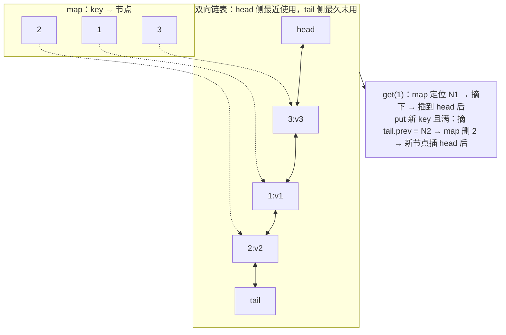
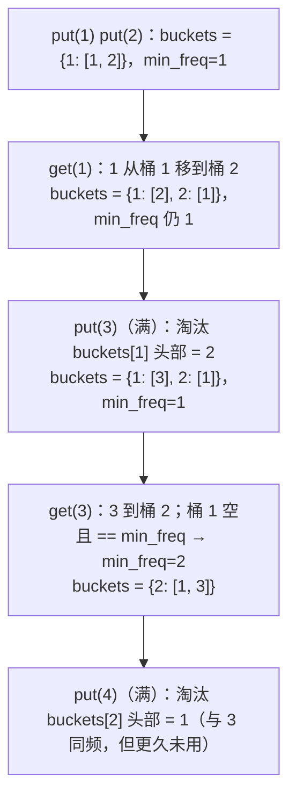
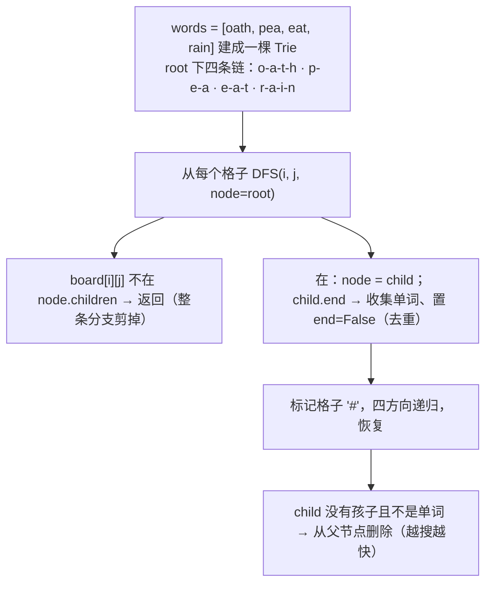
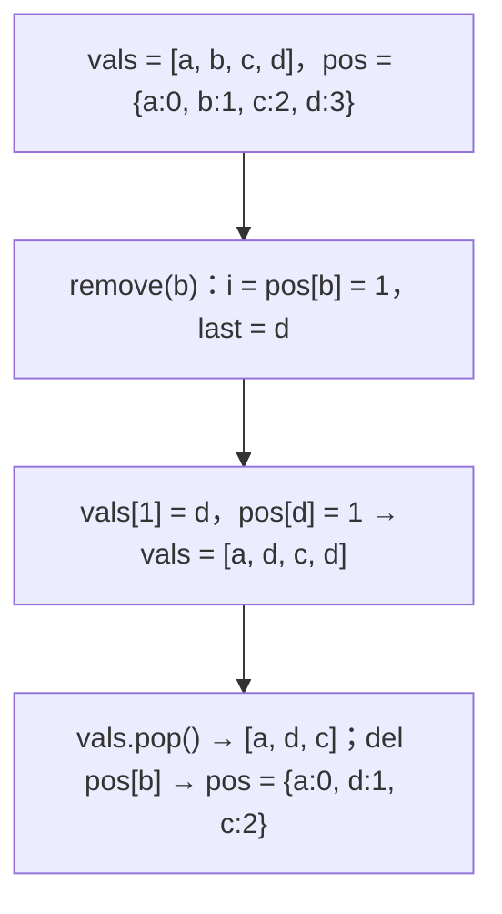
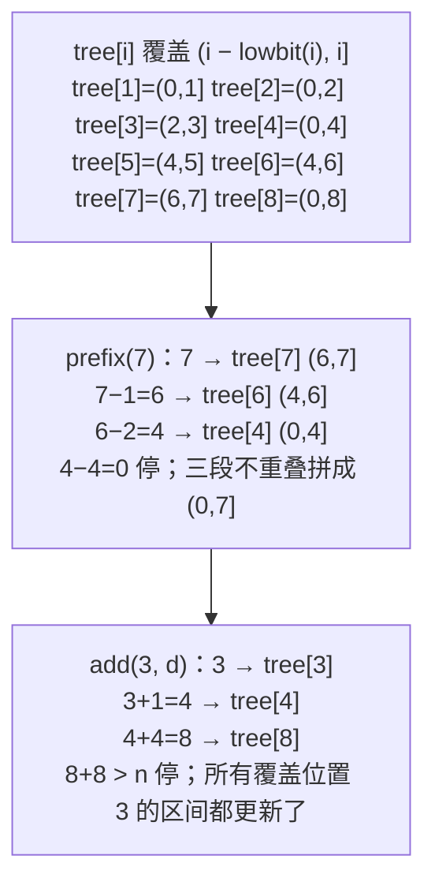

设计题的题面是"实现一个类，支持这几个操作，每个操作 O(1) / O(log n)"。它考的不是算法，而是**组合数据结构**：单一结构做不到的复杂度，用两个结构互相索引来做到——LRU 是哈希表索引双向链表的节点，LFU 再加一层频次桶，O(1) 随机删除是数组配上"值到下标"的哈希，Trie 是把公共前缀共享的 26 叉树。这类题代码量比算法题大（三五十行），面试官看的是结构清不清楚、每个操作的每一步是不是都 O(1)、边界（容量为 0、key 已存在、删最后一个）有没有处理。这一篇五道主讲题是最高频的五个设计题，每道都先画结构图再写。

本篇要回答的核心问题是：

> **LRU 为什么必须是哈希表 + 双向链表，单用其中一个为什么做不到 O(1)？[^q0] LFU 怎样在 O(1) 内找到"频次最低且最久未用"的键？[^q1] "O(1) 插入删除随机"里删除时为什么要把末尾元素换到被删位置？[^q2]**

## 一、识别信号

| 题面里出现 | 结构组合 | 每个操作 |
|---|---|---|
| "最近最少使用缓存" | 哈希表 → 双向链表节点 | $$O(1)$$ |
| "最不经常使用缓存" | 哈希表 + 频次 → 有序集合（`OrderedDict` / `LinkedHashSet`）+ `min_freq` | $$O(1)$$ |
| "前缀查询""自动补全""多个单词的网格搜索" | Trie | $$O(L)$$ |
| "O(1) 插入、删除、等概率随机" | 动态数组 + 值 → 下标哈希 | $$O(1)$$ |
| "单点更新 + 区间求和" | 树状数组 / 线段树 | $$O(\log n)$$ |
| "按时间戳查最近的值" | 每个 key 一个递增列表 + 二分（或 `TreeMap.floorEntry`） | $$O(\log n)$$ |
| "推特 / 消息流：关注、发推、取最新 10 条" | 每人一条时间倒序列表 + 堆做 $$k$$ 路归并 | $$O(k \log k)$$ |
| "用栈实现队列 / 用队列实现栈" | 两个栈倒一次 | 均摊 $$O(1)$$ |
| "最小栈""最大栈" | 辅助栈同步存极值 | $$O(1)$$ |
| "有序表：插入、删除、查第 k 小、查排名" | Python 没有内置 → `sortedcontainers` / 手写平衡结构；Java `TreeMap` | $$O(\log n)$$ |

设计题的通用思路：**先写出每个操作要做的事，再问"哪一步不是 O(1)"，给那一步加一个索引结构**。

## 二、主讲题

### 1. LC 146 LRU 缓存

**题意**：容量固定的缓存，`get(key)` 命中返回值并标记为最近使用，`put(key, value)` 插入或更新，满了淘汰最久未使用的。都要 $$O(1)$$。

**为什么是哈希 + 双向链表**：

- 只用哈希表：`get` $$O(1)$$，但"找最久未用的"要遍历，$$O(n)$$。
- 只用链表：按使用顺序排列，淘汰尾部 $$O(1)$$，但 `get` 要遍历找 key，$$O(n)$$。
- 哈希表存 `key → 链表节点`：`get` 通过哈希 $$O(1)$$ 定位节点，然后把节点摘下来移到头部——**摘节点**要改前驱的 `next`，所以必须是**双向**链表；淘汰尾部 $$O(1)$$。



两个哨兵 `head`、`tail` 让"摘节点""插头部"不用判断空链表 / 头尾特殊情况。

<div class="code-tabs" markdown="1">
```python
class _DNode:
    __slots__ = ("key", "val", "prev", "next")

    def __init__(self, key=0, val=0):
        self.key, self.val = key, val
        self.prev = self.next = None


class LRUCache:
    def __init__(self, capacity):
        self.cap = capacity
        self.map = {}
        self.head, self.tail = _DNode(), _DNode()          # 哨兵
        self.head.next, self.tail.prev = self.tail, self.head

    def _remove(self, node):
        node.prev.next, node.next.prev = node.next, node.prev

    def _add_front(self, node):
        node.next, node.prev = self.head.next, self.head
        self.head.next.prev = node
        self.head.next = node

    def get(self, key):
        if key not in self.map:
            return -1
        node = self.map[key]
        self._remove(node)
        self._add_front(node)                              # 标记为最近使用
        return node.val

    def put(self, key, value):
        if key in self.map:
            node = self.map[key]
            node.val = value
            self._remove(node)
            self._add_front(node)
            return
        if len(self.map) == self.cap:
            lru = self.tail.prev                           # 最久未用
            self._remove(lru)
            del self.map[lru.key]                          # 节点里存 key 就是为了这一步
        node = _DNode(key, value)
        self.map[key] = node
        self._add_front(node)
```
```java
static class LRUCache {
    private static class Node { int key, val; Node prev, next; Node(int k, int v) { key = k; val = v; } }
    private final int cap;
    private final Map<Integer, Node> map = new HashMap<>();
    private final Node head = new Node(0, 0), tail = new Node(0, 0);

    LRUCache(int capacity) { cap = capacity; head.next = tail; tail.prev = head; }

    private void remove(Node n) { n.prev.next = n.next; n.next.prev = n.prev; }
    private void addFront(Node n) { n.next = head.next; n.prev = head; head.next.prev = n; head.next = n; }

    int get(int key) {
        Node n = map.get(key);
        if (n == null) return -1;
        remove(n); addFront(n);
        return n.val;
    }

    void put(int key, int value) {
        Node n = map.get(key);
        if (n != null) { n.val = value; remove(n); addFront(n); return; }
        if (map.size() == cap) { Node lru = tail.prev; remove(lru); map.remove(lru.key); }
        n = new Node(key, value);
        map.put(key, n); addFront(n);
    }
}
```
</div>

**库实现**（先手写再提）：Python `OrderedDict` 的 `move_to_end` / `popitem(last=False)`；Java `LinkedHashMap(cap, 0.75f, true)` + 重写 `removeEldestEntry`。面试里说出"底层就是哈希 + 双向链表"。

**追问**：*线程安全*——整体加锁最简单；分段锁会破坏全局 LRU 顺序（19 篇）。*过期时间*——节点加 `expire` 字段，`get` 时检查；或再加一个按过期时间的堆。*为什么节点要存 key*——淘汰尾节点时要从 `map` 删掉它，只有节点自己知道自己的 key。

### 2. LC 460 LFU 缓存

**题意**：淘汰**使用次数最少**的；次数相同淘汰最久未用的。全部 $$O(1)$$。

**结构**：三张表——`kv`（key → value）、`kf`（key → 频次）、`buckets`（频次 → 该频次下按访问顺序排列的 key 集合，用 `OrderedDict` / `LinkedHashSet`：插入序即 LRU 序）——加一个 `min_freq`。

- **访问 key**：从 `buckets[f]` 删掉，加到 `buckets[f+1]` 末尾，`kf[key] += 1`；若 `buckets[f]` 空了且 `f == min_freq`，`min_freq += 1`。
- **插入新 key 且满**：从 `buckets[min_freq]` 头部弹出一个（频次最低里最久未用的），删掉；新 key 频次 1，`min_freq = 1`。

**为什么 `min_freq` 维护是 O(1)**：新 key 进来 `min_freq` 必然变 1；访问一个 key 使其频次 +1 时，只有当它是 `min_freq` 桶里最后一个时 `min_freq` 才 +1（不可能跳更多，因为它自己刚进了 `min_freq + 1` 桶）。



<div class="code-tabs" markdown="1">
```python
class LFUCache:
    def __init__(self, capacity):
        self.cap = capacity
        self.kv, self.kf = {}, {}
        self.buckets = defaultdict(OrderedDict)            # freq -> OrderedDict(key -> None)
        self.min_freq = 0

    def _touch(self, key):
        f = self.kf[key]
        del self.buckets[f][key]
        if not self.buckets[f]:
            del self.buckets[f]
            if self.min_freq == f:
                self.min_freq = f + 1
        self.kf[key] = f + 1
        self.buckets[f + 1][key] = None

    def get(self, key):
        if key not in self.kv:
            return -1
        self._touch(key)
        return self.kv[key]

    def put(self, key, value):
        if self.cap == 0:
            return
        if key in self.kv:
            self.kv[key] = value
            self._touch(key)
            return
        if len(self.kv) == self.cap:
            evict, _ = self.buckets[self.min_freq].popitem(last=False)   # 最低频里最久未用
            if not self.buckets[self.min_freq]:
                del self.buckets[self.min_freq]
            del self.kv[evict], self.kf[evict]
        self.kv[key], self.kf[key] = value, 1
        self.buckets[1][key] = None
        self.min_freq = 1
```
```java
static class LFUCache {
    private final int cap;
    private final Map<Integer, Integer> kv = new HashMap<>(), kf = new HashMap<>();
    private final Map<Integer, LinkedHashSet<Integer>> buckets = new HashMap<>();
    private int minFreq = 0;

    LFUCache(int capacity) { cap = capacity; }

    private void touch(int key) {
        int f = kf.get(key);
        buckets.get(f).remove(key);
        if (buckets.get(f).isEmpty()) { buckets.remove(f); if (minFreq == f) minFreq = f + 1; }
        kf.put(key, f + 1);
        buckets.computeIfAbsent(f + 1, k -> new LinkedHashSet<>()).add(key);
    }

    int get(int key) {
        if (!kv.containsKey(key)) return -1;
        touch(key);
        return kv.get(key);
    }

    void put(int key, int value) {
        if (cap == 0) return;
        if (kv.containsKey(key)) { kv.put(key, value); touch(key); return; }
        if (kv.size() == cap) {
            LinkedHashSet<Integer> b = buckets.get(minFreq);
            int evict = b.iterator().next();
            b.remove(evict);
            if (b.isEmpty()) buckets.remove(minFreq);
            kv.remove(evict); kf.remove(evict);
        }
        kv.put(key, value); kf.put(key, 1);
        buckets.computeIfAbsent(1, k -> new LinkedHashSet<>()).add(key);
        minFreq = 1;
    }
}
```
</div>

**追问**：*不用 `OrderedDict` 手写*——每个频次桶一个双向链表（LRU 的结构），节点里多存 `freq`；代码翻倍，面试里说清结构即可。*容量 0*——`put` 直接返回，否则 `buckets[min_freq]` 为空会崩。

### 3. LC 208 / 212 实现 Trie / 单词搜索 II

**Trie**：每个节点是"字符 → 子节点"的映射加一个 `end` 标记；`insert` / `search` / `startsWith` 都是沿字符走 $$O(L)$$。字母表固定小写时用长 26 的数组比哈希快。

<div class="code-tabs" markdown="1">
```python
class TrieNode:
    __slots__ = ("children", "end")

    def __init__(self):
        self.children = {}
        self.end = False


class Trie:
    def __init__(self):
        self.root = TrieNode()

    def insert(self, word):
        node = self.root
        for ch in word:
            node = node.children.setdefault(ch, TrieNode())
        node.end = True

    def _walk(self, prefix):
        node = self.root
        for ch in prefix:
            node = node.children.get(ch)
            if node is None:
                return None
        return node

    def search(self, word):
        node = self._walk(word)
        return node is not None and node.end

    def starts_with(self, prefix):
        return self._walk(prefix) is not None
```
```java
static class Trie {
    private static class Node { Node[] ch = new Node[26]; boolean end; }
    private final Node root = new Node();

    void insert(String w) {
        Node n = root;
        for (char c : w.toCharArray()) { int i = c - 'a'; if (n.ch[i] == null) n.ch[i] = new Node(); n = n.ch[i]; }
        n.end = true;
    }
    private Node walk(String p) {
        Node n = root;
        for (char c : p.toCharArray()) { n = n.ch[c - 'a']; if (n == null) return null; }
        return n;
    }
    boolean search(String w) { Node n = walk(w); return n != null && n.end; }
    boolean startsWith(String p) { return walk(p) != null; }
}
```
</div>

**LC 212 单词搜索 II**：网格里找出字典中所有出现的单词。对每个单词做 LC 79 是 $$O(W \cdot mn \cdot 3^L)$$；把所有单词建成 Trie，网格 DFS 时**沿 Trie 走**——当前格子的字符不在当前 Trie 节点的孩子里就剪掉，一次 DFS 同时匹配所有单词。命中后把 `end` 置空（或删掉 `word`）去重；叶子用完后从 Trie 摘掉，越搜越快。



<div class="code-tabs" markdown="1">
```python
def find_words(board, words):
    root = TrieNode()
    for w in words:
        node = root
        for ch in w:
            node = node.children.setdefault(ch, TrieNode())
        node.end = True
    m, n = len(board), len(board[0])
    out = []

    def dfs(i, j, parent, path):
        ch = board[i][j]
        node = parent.children.get(ch)
        if node is None:
            return                                         # 剪枝：没有单词以这个前缀开头
        path += ch
        if node.end:
            out.append(path)
            node.end = False                               # 去重
        board[i][j] = "#"
        for di, dj in ((1, 0), (-1, 0), (0, 1), (0, -1)):
            x, y = i + di, j + dj
            if 0 <= x < m and 0 <= y < n and board[x][y] != "#":
                dfs(x, y, node, path)
        board[i][j] = ch
        if not node.children and not node.end:
            del parent.children[ch]                        # 叶子用完，摘掉

    for i in range(m):
        for j in range(n):
            dfs(i, j, root, "")
    return out
```
```java
static List<String> findWords(char[][] board, String[] words) {
    TrieNode root = new TrieNode();
    for (String w : words) {
        TrieNode n = root;
        for (char c : w.toCharArray()) { if (n.ch[c - 'a'] == null) n.ch[c - 'a'] = new TrieNode(); n = n.ch[c - 'a']; }
        n.word = w;                                        // 叶子直接存单词，省去拼接 path
    }
    List<String> out = new ArrayList<>();
    for (int i = 0; i < board.length; i++) for (int j = 0; j < board[0].length; j++) dfs(board, i, j, root, out);
    return out;
}
private static class TrieNode { TrieNode[] ch = new TrieNode[26]; String word; }
private static void dfs(char[][] b, int i, int j, TrieNode parent, List<String> out) {
    if (i < 0 || j < 0 || i >= b.length || j >= b[0].length || b[i][j] == '#') return;
    char c = b[i][j];
    TrieNode n = parent.ch[c - 'a'];
    if (n == null) return;
    if (n.word != null) { out.add(n.word); n.word = null; }
    b[i][j] = '#';
    dfs(b, i + 1, j, n, out); dfs(b, i - 1, j, n, out); dfs(b, i, j + 1, n, out); dfs(b, i, j - 1, n, out);
    b[i][j] = c;
}
```
</div>

**追问**：*为什么用 Trie 而不是哈希集合存所有前缀*——哈希集合也能剪枝（存所有前缀），但空间是 $$O(\sum L^2)$$，Trie 是 $$O(\sum L)$$ 且共享前缀。*添加与搜索单词——含 `.` 通配（LC 211）*——`.` 时遍历所有孩子递归。*数组两数的最大异或（LC 421）*——二进制 Trie，从高位往下贪心。

### 4. LC 380 O(1) 时间插入、删除和获取随机元素

**题意**：`insert` / `remove` / `getRandom`（等概率）都 $$O(1)$$。

**结构**：动态数组存元素（`getRandom` 就是随机下标），哈希表存 `值 → 下标`（`insert` / `remove` 定位 $$O(1)$$）。**删除**是关键：数组中间删除是 $$O(n)$$，所以把**末尾元素换到被删位置**，再弹掉末尾——顺序不重要，随机性不受影响。



<div class="code-tabs" markdown="1">
```python
class RandomizedSet:
    def __init__(self):
        self.vals = []
        self.pos = {}

    def insert(self, val):
        if val in self.pos:
            return False
        self.pos[val] = len(self.vals)
        self.vals.append(val)
        return True

    def remove(self, val):
        if val not in self.pos:
            return False
        i, last = self.pos[val], self.vals[-1]
        self.vals[i], self.pos[last] = last, i             # 末尾换到 i；即使 val 就是末尾也正确
        self.vals.pop()
        del self.pos[val]
        return True

    def get_random(self):
        return random.choice(self.vals)
```
```java
static class RandomizedSet {
    private final List<Integer> vals = new ArrayList<>();
    private final Map<Integer, Integer> pos = new HashMap<>();
    private final Random rnd = new Random();
    boolean insert(int v) { if (pos.containsKey(v)) return false; pos.put(v, vals.size()); vals.add(v); return true; }
    boolean remove(int v) {
        Integer i = pos.get(v);
        if (i == null) return false;
        int last = vals.get(vals.size() - 1);
        vals.set(i, last); pos.put(last, i);
        vals.remove(vals.size() - 1); pos.remove(v);
        return true;
    }
    int getRandom() { return vals.get(rnd.nextInt(vals.size())); }
}
```
</div>

`remove` 的顺序要注意：先 `pos[last] = i`，再 `del pos[val]`——当 `val` 恰是末尾元素时 `last == val`，先删再设会把刚删的又加回去。

**追问**：*允许重复（LC 381）*——`pos` 的值变成下标集合 `set`，删除时任取一个下标，把末尾换过去并更新末尾元素的下标集合。*黑名单中的随机数（LC 710）*——把黑名单映射到末尾区间的白名单数。*为什么不用 `set` + `random.choice`*——`set` 不支持下标随机访问，`list(set)` 是 $$O(n)$$。

### 5. LC 307 区域和检索——数组可修改

**题意**：支持 `update(i, val)` 和 `sumRange(l, r)`，两者都要快。

**前缀和**：查询 $$O(1)$$ 但更新 $$O(n)$$；**树状数组**（Fenwick）：两者都 $$O(\log n)$$，代码比线段树短得多。

**原理**：`tree[i]` 存原数组区间 `(i − lowbit(i), i]` 的和，其中 `lowbit(i) = i & -i` 是 `i` 二进制最低位的 1。更新 `i` 时沿 `i += lowbit(i)` 向上更新所有包含它的区间；求前缀和 `[1, i]` 时沿 `i -= lowbit(i)` 累加不重叠的区间。1-based。



<div class="code-tabs" markdown="1">
```python
class NumArray:
    def __init__(self, nums):
        self.n = len(nums)
        self.nums = nums[:]
        self.tree = [0] * (self.n + 1)
        for i, x in enumerate(nums):
            self._add(i + 1, x)

    def _add(self, i, delta):
        while i <= self.n:
            self.tree[i] += delta
            i += i & -i                                    # 加上最低位的 1

    def _prefix(self, i):
        s = 0
        while i > 0:
            s += self.tree[i]
            i -= i & -i                                    # 去掉最低位的 1
        return s

    def update(self, index, val):
        self._add(index + 1, val - self.nums[index])
        self.nums[index] = val

    def sum_range(self, left, right):
        return self._prefix(right + 1) - self._prefix(left)
```
```java
static class NumArray {
    private final int n; private final int[] nums, tree;
    NumArray(int[] a) { n = a.length; nums = a.clone(); tree = new int[n + 1]; for (int i = 0; i < n; i++) add(i + 1, a[i]); }
    private void add(int i, int d) { for (; i <= n; i += i & -i) tree[i] += d; }
    private int prefix(int i) { int s = 0; for (; i > 0; i -= i & -i) s += tree[i]; return s; }
    void update(int index, int val) { add(index + 1, val - nums[index]); nums[index] = val; }
    int sumRange(int l, int r) { return prefix(r + 1) - prefix(l); }
}
```
</div>

**追问**：*线段树*——支持区间最值、区间更新（懒标记），树状数组只方便做可差分的操作（和、异或、计数）；面试里说清区别，线段树代码约 60 行，除非明确要求一般不现场写。*$$O(n)$$ 建树*——`tree[i] += nums[i-1]` 后把 `tree[i]` 加到 `tree[i + lowbit(i)]`，一趟完成。*计算右侧小于当前元素的个数（LC 315）*——离散化后用树状数组做"动态计数 + 前缀查询"。

## 三、其他常考设计题

| 题 | 结构 | 关键点 |
|---|---|---|
| LC 155 最小栈 | 辅助栈同步存当前最小 | `push` 时存 `min(val, 栈顶最小)` |
| LC 232 用栈实现队列 | 入栈 + 出栈 | 出栈空时把入栈全倒过去；均摊 $$O(1)$$ |
| LC 225 用队列实现栈 | 一个队列 | `push` 后把前面的元素全部出队再入队 |
| LC 355 设计推特 | 每人时间倒序列表 + 关注集合 + 堆 | `getNewsFeed` 是 $$k$$ 路归并取前 10 |
| LC 981 基于时间的键值存储 | `key → [(time, value)]` 递增 + 二分 | `bisect_right − 1`；Java `TreeMap.floorEntry` |
| LC 705 / 706 设计哈希集合 / 映射 | 桶数组 + 链表 | 说清扩容与负载因子 |
| LC 622 / 641 循环队列 / 双端队列 | 定长数组 + 头尾指针取模 | 满 / 空的区分：多留一格或计数 |
| LC 1206 设计跳表 | 多层链表 + 随机层高 | 面试极少现场写，说清 $$O(\log n)$$ 期望 |
| LC 715 Range 模块 | 有序区间表 | Python 用 `sortedcontainers`，Java `TreeMap` |
| LC 295 数据流中位数 | 双堆 | 08 篇 |

**有序表**是 Python 面试的一个尴尬点：标准库没有平衡树。选项：`bisect` + `list`（插入 $$O(n)$$，$$n \le 10^4$$ 时可接受）、`sortedcontainers.SortedList`（第三方，说明面试环境是否允许）、或用堆 / 树状数组绕过。Java 直接用 `TreeMap` / `TreeSet`。

## 四、两种语言的坑

| | Python | Java |
|---|---|---|
| 双向链表节点 | 普通类 + `__slots__` 省内存 | 内部静态类 |
| 有序字典 | `OrderedDict`：`move_to_end`、`popitem(last=False)`；3.7+ 普通 `dict` 也有序但没有 `move_to_end` | `LinkedHashMap`（`accessOrder=true` 按访问序）；`LinkedHashSet` 只有插入序 |
| 迭代器取第一个 | `next(iter(od))` | `set.iterator().next()` |
| 有序表 | `bisect` / `sortedcontainers` | `TreeMap`：`floorKey` / `ceilingKey` / `firstKey` / `pollFirstEntry` |
| 随机 | `random.choice(list)`、`random.randint` | `new Random().nextInt(n)`；多线程用 `ThreadLocalRandom` |
| 位运算 `lowbit` | `i & -i` 直接可用（任意精度） | `i & -i` 同样正确（补码） |
| 类里的辅助方法 | 前置下划线约定私有 | `private` |
| 空容器判断 | `if not self.buckets[f]` | `isEmpty()`；`get` 可能返回 `null` |

## 五、题单

| 题 | 一句提示 |
|---|---|
| LC 155 最小栈 | 辅助栈 |
| LC 232 / 225 栈队互实现 | 两个栈 / 一个队列 |
| LC 355 设计推特 | 堆归并 |
| LC 981 基于时间的键值存储 | 二分 / `floorEntry` |
| LC 211 添加与搜索单词 | Trie + `.` 递归 |
| LC 421 数组中两个数的最大异或值 | 二进制 Trie |
| LC 381 O(1) 插入删除随机（允许重复） | 下标集合 |
| LC 705 / 706 设计哈希集合 / 映射 | 拉链法 |
| LC 622 设计循环队列 | 取模 |
| LC 315 计算右侧小于当前元素的个数 | 树状数组 / 归并 |
| LC 715 Range 模块 | 有序区间 |
| LC 1472 设计浏览器历史 | 两个栈或数组 + 指针 |

## 六、小结

| 题 | 组合 | 每步为什么 O(1) / O(log n) |
|---|---|---|
| LRU | 哈希表 → 双向链表节点（哨兵） | 哈希定位；双向链表摘 / 插头 / 删尾 |
| LFU | 哈希 × 2 + 频次 → 有序集合 + `min_freq` | 桶间移动 $$O(1)$$；`min_freq` 只在桶空时 +1 或重置为 1 |
| Trie | 26 叉树 + `end` | 沿字符走 $$O(L)$$；多单词搜索共享前缀剪枝 |
| O(1) 随机集 | 数组 + 值 → 下标 | 删除时末尾换位再弹 |
| 树状数组 | `lowbit` 分块 | 更新 / 查询各走 $$O(\log n)$$ 个节点 |

设计题的写法：**先列操作，再找瓶颈步骤，给它加索引；写代码前画出结构图**。写完用容量 1 / 容量 0 / 重复 key / 删最后一个元素四个边界过一遍。

## 七、自测

1. LRU 的双向链表换成单向链表，哪个操作做不到 O(1)？

   <details markdown="1">
   <summary>答案</summary>
   "把 `get` 命中的节点从链表中间摘下来"——需要改前驱节点的 `next`，单向链表找前驱要 $$O(n)$$。（可以让哈希表存"前驱节点"来绕过，但移动后所有相关前驱都要更新，更复杂。）删尾同理需要尾的前驱。双向链表的 `prev` 指针就是为这两步准备的。详见[第二章第 1 题](#1-lc-146-lru-缓存)。
   </details>

2. LFU 里 `_touch` 把 key 从频次 `f` 移到 `f + 1` 后，`min_freq` 为什么最多只加 1？

   <details markdown="1">
   <summary>答案</summary>
   `min_freq` 只在"桶 `f` 变空且 `f == min_freq`"时改变。此时刚被移走的 key 进了桶 `f + 1`，所以桶 `f + 1` 非空，最小频次恰好是 `f + 1`，不可能更大。其他情况（桶 `f` 还有别的 key，或 `f` 不是最小）`min_freq` 不变。所以不需要扫描找新的最小值。详见[第二章第 2 题](#2-lc-460-lfu-缓存)。
   </details>

3. `RandomizedSet.remove` 把两行 `self.pos[last] = i` 和 `del self.pos[val]` 顺序调换，`remove` 末尾元素时会怎样？

   <details markdown="1">
   <summary>答案</summary>
   `val` 是末尾时 `last == val`。先 `del pos[val]` 再 `pos[last] = i` 会把刚删掉的 key 又加回 `pos`（值为它原来的下标），而 `vals` 里已经 `pop` 掉了——`pos` 里出现一个指向不存在位置的脏条目，之后 `insert(val)` 会错误地返回 `False`。先设后删则 `pos[val] = i` 被随后的 `del` 一起删掉，正确。详见[第二章第 4 题](#4-lc-380-o1-时间插入删除和获取随机元素)。
   </details>

4. 树状数组 `prefix(6)` 累加了哪几个 `tree` 元素？它们各覆盖原数组哪一段？

   <details markdown="1">
   <summary>答案</summary>
   6 = `110₂`，`lowbit = 2`：累加 `tree[6]`，覆盖 `(4, 6]`；6 − 2 = 4 = `100₂`，`lowbit = 4`：累加 `tree[4]`，覆盖 `(0, 4]`；4 − 4 = 0 停。两段拼成 `(0, 6]`，即前 6 个元素。一般地，`prefix(i)` 访问的元素个数等于 `i` 二进制里 1 的个数，$$\le \log n$$。详见[第二章第 5 题](#5-lc-307-区域和检索数组可修改)。
   </details>

5. LC 212 里把命中单词后的 `node.end = False` 去掉，会出什么问题？把"叶子用完就摘掉"去掉呢？

   <details markdown="1">
   <summary>答案</summary>
   去掉 `end = False`：同一个单词从网格的不同起点或不同路径都能拼出时会被重复收集（`["a"]` 在全是 a 的网格里会收集 $$mn$$ 次）。去掉摘叶子：结果仍正确，但已经找到的单词的分支仍留在 Trie 里，后续 DFS 会继续沿它走到底再无功而返，最坏慢几倍；这是纯优化。详见[第二章第 3 题](#3-lc-208--212-实现-trie--单词搜索-ii)。
   </details>

## 下一篇

[手撕 attention 家族](/coding-interview-attention-from-scratch.html)

[^q0]: `get` 要 $$O(1)$$ 定位 key → 需要哈希表；"最久未用"要 $$O(1)$$ 找到并淘汰 → 需要一个按使用顺序排列的序列，尾部就是答案；`get` 命中后要把节点从序列中间移到头部 → 摘中间节点必须知道前驱，所以是**双向**链表。单用哈希表找最久未用要 $$O(n)$$；单用链表定位 key 要 $$O(n)$$。哈希表的值直接指向链表节点，两者合起来每个操作都是常数步。详见[第二章第 1 题](#1-lc-146-lru-缓存)。

[^q1]: 三张表加一个数：`kv`、`kf`（key → 频次）、`buckets`（频次 → 按访问顺序的有序集合，`OrderedDict` / `LinkedHashSet`，头部是最久未用）、`min_freq`。淘汰时取 `buckets[min_freq]` 的头部即可。`min_freq` 的维护是 $$O(1)$$：插入新 key 时重置为 1；某 key 从桶 `f` 升到 `f + 1` 时，只有当桶 `f` 变空且 `f == min_freq` 才让 `min_freq = f + 1`（此时桶 `f + 1` 一定非空）。详见[第二章第 2 题](#2-lc-460-lfu-缓存)。

[^q2]: 数组中间删除要移动后面所有元素，$$O(n)$$。把末尾元素搬到被删位置、更新它在哈希表里的下标、再弹掉末尾，只动两个元素，$$O(1)$$——集合不关心顺序，`getRandom` 的等概率性不受影响。注意顺序：先 `pos[last] = i` 再 `del pos[val]`，否则删末尾元素自己时会留下脏条目。详见[第二章第 4 题](#4-lc-380-o1-时间插入删除和获取随机元素)。
