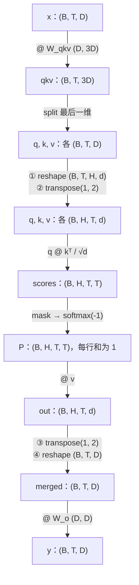
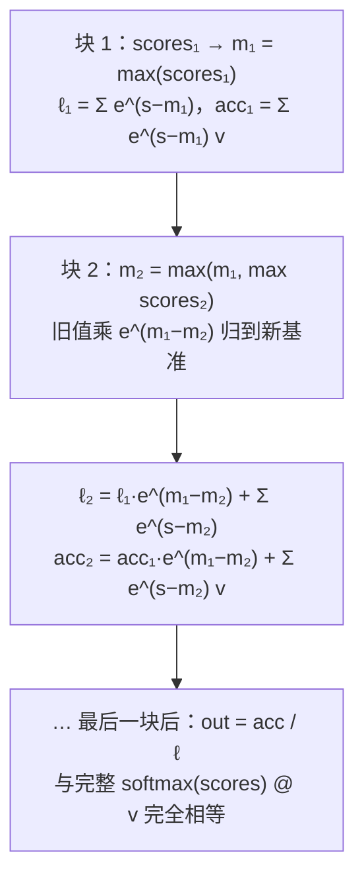

"手写一个 multi-head attention"是 AI 岗面试的第一道手撕题，几乎每家都考。它筛的不是"会不会调 `nn.MultiheadAttention`"，而是四件事：**形状**（`reshape` 和 `transpose` 的顺序为什么是那样）、**数值**（softmax 为什么减最大值、mask 为什么用 $$-\infty$$ 而不是 0）、**变体**（GQA 在哪一步复制、RoPE 旋转的是哪两个维度）、**推理**（KV cache 缓存的是什么、增量解码为什么不用 mask）。追问会一直深入到 online softmax——FlashAttention 一趟分块的核心。这一篇把这条链从零写完，每一步都和 PyTorch 的参考实现对拍。

原理与设计动机不在这里展开：attention 变体和 KV cache 的账见 [Transformer 与 LLM（03）](/attention-variants-and-kv-cache.html)，位置编码见[（04）](/positional-encoding-and-long-context.html)。这一篇只回答"怎样在二十分钟内写对"。

本篇要回答的核心问题是：

> **multi-head attention 的四次形状变换各是什么、为什么必须先 `reshape` 再 `transpose`？[^q0] KV cache 缓存了什么、增量解码那一步为什么不需要 causal mask？[^q1] online softmax 为什么能只扫一遍 K/V 就得到与完整 softmax 相同的结果？[^q2]**

## 一、面试怎么出题

| 出题方式 | 考点 | 通常的追问 |
|---|---|---|
| "写一个 scaled dot-product attention" | 公式、mask、缩放 | 为什么除 $$\sqrt{d}$$？mask 为什么是 $$-\infty$$？ |
| "扩展成 multi-head" | 四次形状变换 | 为什么先 reshape 再 transpose？参数量多少？ |
| "改成 GQA / MQA" | 在哪一步复制 KV 头 | 省了多少 KV cache？ |
| "加上 RoPE" | 旋转哪两个维度、频率怎么算 | 为什么内积只依赖相对位置？ |
| "写推理时的 KV cache" | 缓存什么、怎么追加、attention 的形状 | 每 token 缓存多少字节？ |
| "softmax 数值稳定性" | 减最大值 | log-softmax 怎么写？ |
| "FlashAttention 的核心思想用代码表达" | online softmax | 为什么能分块？块间怎么合并？ |

## 二、形状推演

设 batch $$B$$、序列长 $$T$$、模型维 $$D$$、头数 $$H$$、每头维 $$d = D / H$$。



**为什么先 `reshape` 再 `transpose`**：`(B, T, D)` 的最后一维 $$D$$ 在内存里是连续的，`reshape(B, T, H, d)` 只是把这 $$D$$ 个数**按顺序切成 $$H$$ 段**——不移动数据。然后 `transpose(1, 2)` 把 $$H$$ 换到 $$T$$ 前面，得到 `(B, H, T, d)`，这样每个头的 `(T, d)` 矩阵可以独立做 `@`。如果直接 `reshape(B, H, T, d)`，会把属于不同 token 的数混进同一个头——形状对了，数全错。

**合并**是严格的逆操作：先 `transpose(1, 2)` 回到 `(B, T, H, d)`，再 `reshape(B, T, D)`。PyTorch 里 `transpose` 后的张量非连续，`reshape` 会自动拷贝；写 `.view()` 会报错，要先 `.contiguous()`。

## 三、从零实现

### 1. softmax

```python
def softmax(x, axis=-1):
    x = x - x.max(axis=axis, keepdims=True)     # 减最大值：exp 不上溢，结果不变
    e = np.exp(x)
    return e / e.sum(axis=axis, keepdims=True)

def log_softmax(x, axis=-1):
    m = x.max(axis=axis, keepdims=True)
    return x - m - np.log(np.exp(x - m).sum(axis=axis, keepdims=True))   # x - logsumexp(x)
```

**为什么减最大值不改变结果**：$$\frac{e^{x_i - m}}{\sum_j e^{x_j - m}} = \frac{e^{x_i} e^{-m}}{e^{-m} \sum_j e^{x_j}}$$，$$e^{-m}$$ 约掉。减完后最大的指数是 $$e^0 = 1$$，不会上溢；其他项最小趋于 0，分母至少是 1，不会除零。

不减会怎样：`exp([1000, 1001, 1002])` 全部上溢成 `inf`，`inf / inf = nan`。配套脚本里可以看到 `[nan nan nan]` 与 `[0.090 0.245 0.665]` 的对照。

**log-softmax** 不要写成 `np.log(softmax(x))`：极小概率处 `softmax` 已经下溢成 0，`log(0) = -inf`。写成 $$x - \text{logsumexp}(x)$$ 全程无下溢。

### 2. scaled dot-product attention

```python
def causal_mask(T):
    return np.tril(np.ones((T, T), dtype=bool))   # 下三角 True = 可见

def sdpa(q, k, v, mask=None):
    d = q.shape[-1]
    scores = q @ np.swapaxes(k, -1, -2) / math.sqrt(d)   # (..., T_q, T_k)
    if mask is not None:
        scores = np.where(mask, scores, -np.inf)          # 不可见 → -inf → softmax 后恰为 0
    return softmax(scores) @ v
```

三个必问点：

- **为什么除 $$\sqrt{d}$$**：$$q, k$$ 的分量方差为 1 时，内积 $$q \cdot k$$ 的方差是 $$d$$。不缩放的话 $$d = 128$$ 时分数的标准差是 11，softmax 几乎变成 one-hot，梯度消失。除以 $$\sqrt{d}$$ 把方差拉回 1。
- **mask 为什么是 $$-\infty$$ 而不是 0**：分数为 0 经过 softmax 仍有正概率（$$e^0 = 1$$）；$$-\infty$$ 才让 $$e^{-\infty} = 0$$，该位置的权重恰好为 0。实现上用 `-1e9` 或 `float('-inf')`，PyTorch 的 `masked_fill(mask, float('-inf'))`。
- **一行全被 mask 会怎样**：全 $$-\infty$$ 的 softmax 是 `nan`。causal mask 不会出现（对角线总是可见）；padding mask 可能出现，要单独处理。

### 3. multi-head attention

```python
def split_heads(x, n_heads):                     # (B, T, D) -> (B, H, T, d)
    B, T, D = x.shape
    return x.reshape(B, T, n_heads, D // n_heads).transpose(0, 2, 1, 3)

def merge_heads(x):                              # (B, H, T, d) -> (B, T, D)
    B, H, T, d = x.shape
    return x.transpose(0, 2, 1, 3).reshape(B, T, H * d)

def mha(x, w_qkv, w_o, n_heads, causal=True):
    B, T, D = x.shape
    q, k, v = np.split(x @ w_qkv, 3, axis=-1)                 # 各 (B, T, D)
    q, k, v = (split_heads(t, n_heads) for t in (q, k, v))   # 各 (B, H, T, d)
    out = sdpa(q, k, v, causal_mask(T) if causal else None)  # (B, H, T, d)
    return merge_heads(out) @ w_o                            # (B, T, D)
```

**参数量**：$$W_{qkv}$$ 是 $$D \times 3D$$，$$W_o$$ 是 $$D \times D$$，合计 $$4D^2$$（GPT-2 带 bias 再加 $$4D$$）。多头**不增加**参数量：$$H$$ 个头各 $$D \times d$$ 的投影拼起来就是一个 $$D \times D$$。

**FLOPs**（一层、一个序列）：投影 $$2 \cdot T \cdot 4D^2$$；$$QK^\top$$ 与 $$PV$$ 各 $$2 \cdot H \cdot T^2 \cdot d = 2 T^2 D$$，合计 $$8 T D^2 + 4 T^2 D$$。$$T > 2D$$ 时 attention 项超过投影项——这是长上下文的成本来源。

对拍：把 `w_qkv.T` 写进 `nn.MultiheadAttention(D, H, bias=False, batch_first=True).in_proj_weight`（PyTorch 存的是 $$(3D, D)$$、算的是 $$xW^\top$$），`w_o.T` 写进 `out_proj.weight`，传 `attn_mask=~causal_mask`，最大误差 $$10^{-10}$$ 量级。

### 4. GQA / MQA

Grouped-query attention：$$H$$ 个 query 头共享 $$H_{kv}$$ 个 KV 头（$$H_{kv} = 1$$ 就是 MQA）。**在哪一步复制**：KV 投影只算 $$H_{kv}$$ 份，`split_heads` 后沿头维 `repeat`，让每 $$H / H_{kv}$$ 个 q 头对上同一个 kv 头，然后 `sdpa` 不变。

```python
def gqa(x, w_q, w_kv, w_o, n_heads, n_kv_heads):
    B, T, D = x.shape
    q = split_heads(x @ w_q, n_heads)                        # (B, H, T, d)
    k, v = np.split(x @ w_kv, 2, axis=-1)                    # 各 (B, T, H_kv·d)
    k, v = split_heads(k, n_kv_heads), split_heads(v, n_kv_heads)   # (B, H_kv, T, d)
    rep = n_heads // n_kv_heads
    k, v = np.repeat(k, rep, axis=1), np.repeat(v, rep, axis=1)     # (B, H, T, d)
    return merge_heads(sdpa(q, k, v, causal_mask(T))) @ w_o
```

**省了什么**：KV cache 与 KV 投影参数都从 $$H$$ 份变成 $$H_{kv}$$ 份。Llama-3-70B：$$H = 64$$、$$H_{kv} = 8$$，KV cache 缩小 8 倍。计算量（$$QK^\top$$、$$PV$$）不变——因为 q 头没少。PyTorch 2.5 起 `F.scaled_dot_product_attention(..., enable_gqa=True)` 直接支持，对拍用它。

### 5. RoPE

旋转位置编码把 $$q$$、$$k$$ 的每一对相邻维度 $$(x_{2i}, x_{2i+1})$$ 看作复平面上的一个点，在位置 $$t$$ 旋转角度 $$t \cdot \theta_i$$，$$\theta_i = \text{base}^{-2i/d}$$（低维旋转快、高维旋转慢）。

```python
def rope_cos_sin(T, d, base=10000.0):
    inv_freq = base ** (-np.arange(0, d, 2) / d)             # (d/2,)：θ_i
    angles = np.arange(T)[:, None] * inv_freq[None, :]       # (T, d/2)：t·θ_i
    return np.cos(angles), np.sin(angles)

def apply_rope(x, cos, sin):                                 # x: (..., T, d)
    x1, x2 = x[..., 0::2], x[..., 1::2]                      # 偶数维、奇数维配对
    out = np.empty_like(x)
    out[..., 0::2] = x1 * cos - x2 * sin
    out[..., 1::2] = x1 * sin + x2 * cos
    return out
```

**为什么内积只依赖相对位置**：旋转 $$R_\alpha$$ 是正交矩阵，$$(R_{t\theta} q) \cdot (R_{s\theta} k) = q^\top R_{t\theta}^\top R_{s\theta} k = q^\top R_{(s - t)\theta} k$$，只与 $$s - t$$ 有关。配套脚本里 $$q$$ 在位置 $$t$$、$$k$$ 在 $$t + 2$$，$$t = 0, 3, 6$$ 三次内积完全相等。

**只加在 q 和 k 上**，不加在 v 上——位置信息只用来决定"看谁"，不改变"看到什么"。配对方式有两种约定：相邻配对（上面的写法，GPT-J 风格）和前后半配对（$$x_i$$ 与 $$x_{i + d/2}$$，Llama / HF 的 `rotate_half`）——两种数学等价但不能混用，加载权重时要对上。

### 6. KV cache 与增量解码

推理时每生成一个 token 都要对全部历史做 attention。历史 token 的 $$k$$、$$v$$ 不会变（它们只依赖自己的输入），所以缓存起来；每步只算**新 token** 的 $$q, k, v$$，把 $$k, v$$ 追加进缓存，用新 $$q$$ 对全部缓存的 $$k, v$$ 做 attention。

```python
class KVCache:
    def __init__(self, B, H, T_max, d):
        self.k = np.zeros((B, H, T_max, d))
        self.v = np.zeros((B, H, T_max, d))
        self.len = 0

    def append(self, k_new, v_new):              # k_new: (B, H, t, d)
        t = k_new.shape[2]
        self.k[:, :, self.len:self.len + t] = k_new
        self.v[:, :, self.len:self.len + t] = v_new
        self.len += t
        return self.k[:, :, :self.len], self.v[:, :, :self.len]

def decode_step(x_new, w_qkv, w_o, n_heads, cache):      # x_new: (B, 1, D)
    q, k, v = (split_heads(t, n_heads)
               for t in np.split(x_new @ w_qkv, 3, axis=-1))   # 各 (B, H, 1, d)
    k_all, v_all = cache.append(k, v)                       # (B, H, len, d)
    out = sdpa(q, k_all, v_all)                             # 新 token 看全部历史：不需要 mask
    return merge_heads(out) @ w_o
```

**为什么不需要 mask**：causal mask 的作用是让位置 $$t$$ 看不到 $$t' > t$$ 的 token。增量解码时缓存里只有 $$\le t$$ 的 token，新 token 是最后一个，本来就看不到"未来"。**只有 prefill（一次喂入整段 prompt）需要 mask**。

**每 token 缓存多少字节**：$$2 \times L \times H_{kv} \times d \times \text{bytes}$$。Llama-3-8B（$$L = 32$$，$$H_{kv} = 8$$，$$d = 128$$，bf16）：$$2 \times 32 \times 8 \times 128 \times 2 = 131{,}072$$ B = 128 KB / token；8K 上下文 1 GB。配套脚本验证：逐 token 增量解码的输出与一次性全序列 causal attention 的输出最大差 $$10^{-15}$$。

### 7. online softmax

FlashAttention 不把 $$T \times T$$ 的分数矩阵写进显存，而是把 $$K, V$$ 分块，**扫一遍**就算出每一行的输出。难点在 softmax 的分母要全行的和——分块时后面的块还没看到。解法：维护三个量并**在最大值变化时重新缩放**。

对一行 query $$q$$，维护：$$m$$（迄今最大分数）、$$\ell$$（迄今 $$\sum e^{s - m}$$）、$$\text{acc}$$（迄今 $$\sum e^{s - m} v$$）。新块的分数 $$s$$：

$$
m' = \max(m, \max s), \quad
\ell' = \ell \cdot e^{m - m'} + \sum e^{s - m'}, \quad
\text{acc}' = \text{acc} \cdot e^{m - m'} + \sum e^{s - m'} v
$$

```python
def attention_online(q, k, v, block):            # q: (d,), k/v: (T, d)
    d = q.shape[-1]
    m, l, acc = -np.inf, 0.0, np.zeros(v.shape[-1])
    for s in range(0, k.shape[0], block):
        scores = k[s:s + block] @ q / math.sqrt(d)
        m_new = max(m, scores.max())
        scale = math.exp(m - m_new) if m > -np.inf else 0.0   # 旧累计值按新最大值重新缩放
        p = np.exp(scores - m_new)
        l = l * scale + p.sum()
        acc = acc * scale + p @ v[s:s + block]
        m = m_new
    return acc / l
```



**为什么正确**：完整 softmax 的输出是 $$\frac{\sum_j e^{s_j - M} v_j}{\sum_j e^{s_j - M}}$$，$$M$$ 是全行最大。分块时每一步用当前的 $$m$$ 作基准，$$m$$ 变大时把旧的 $$\ell$$、$$\text{acc}$$ 乘 $$e^{m_\text{old} - m_\text{new}}$$ 换到新基准——这正是把 $$e^{s - m_\text{old}}$$ 改写成 $$e^{s - m_\text{new}} \cdot e^{m_\text{new} - m_\text{old}}$$ 的逆。最后 $$m = M$$，分子分母都与完整版一致。配套脚本 `block=2` 对 7 个 key 的输出与普通 attention 差 $$10^{-16}$$。

**这就是 FlashAttention 的核心**：显存占用从 $$O(T^2)$$ 降到 $$O(T)$$（不存分数矩阵），且 $$K, V$$ 只从 HBM 读一遍。反向传播时重算分数而不是存下来，用计算换访存。

## 四、与参考实现对拍

`attention.py --check` 做了七组断言（全部 float64，容差 $$10^{-10}$$）：

| 我的实现 | 参考 | 备注 |
|---|---|---|
| `softmax` / `log_softmax` | `torch.softmax` / `log_softmax` | |
| `sdpa` + `causal_mask` | `F.scaled_dot_product_attention(is_causal=True)` | |
| `mha` | `nn.MultiheadAttention(bias=False, batch_first=True)` | 权重要转置写入；`attn_mask` 语义是 True = 屏蔽 |
| `gqa` | `F.scaled_dot_product_attention(enable_gqa=True)` | PyTorch ≥ 2.5 |
| 增量解码 | 全序列 causal `mha` | 逐 token 拼接后比较 |
| `attention_online` | `sdpa` | 任意块大小 |
| RoPE | 相对位置性质 | 不同绝对位置、同一相对距离的内积相等 |

面试时不一定能跑对拍，但要能**说出对拍的方法**——这本身就是加分项。

## 五、数值与形状陷阱

| 陷阱 | 现象 | 修法 |
|---|---|---|
| softmax 不减最大值 | `nan` | 减 `max` |
| `log(softmax(x))` | `-inf` | `x - logsumexp(x)` |
| mask 填 0 或 `-1e4` | 被屏蔽位置仍有权重 / fp16 下 `-1e4` 不够小 | `-inf` 或 `torch.finfo(dtype).min` |
| 一行全 mask | `nan` | 保证至少一个可见，或事后把 `nan` 置 0 |
| `reshape(B, H, T, d)` 直接切 | 形状对、数错 | 先 `reshape(B, T, H, d)` 再 `transpose` |
| `transpose` 后 `.view()` | 报错 non-contiguous | `.reshape()` 或先 `.contiguous()` |
| 忘记除 $$\sqrt{d}$$ | 训练不稳定、attention 尖锐 | 缩放 |
| KV cache 用 `list.append` | 每步拼接 $$O(T)$$ 拷贝 | 预分配 `T_max`，写入切片 |
| RoPE 配对方式与权重不一致 | loss 不降、生成乱码 | 确认相邻配对还是 `rotate_half` |
| `nn.MultiheadAttention` 的 `attn_mask` | True 表示**屏蔽** | 与自己 mask 的语义取反 |

## 六、常见追问

| 追问 | 要点 |
|---|---|
| 为什么用 softmax 而不是其他归一化？ | 可微、输出是概率分布、对最大值敏感；线性 attention 用核函数替代 softmax 换取 $$O(T)$$ |
| 为什么 $$Q$$、$$K$$、$$V$$ 要三个不同的投影？ | $$Q$$ 与 $$K$$ 决定"看谁"（相似度），$$V$$ 决定"拿什么"；共用一个矩阵会把两种角色绑死 |
| 多头比单头好在哪？参数量一样吗？ | 参数量一样；每个头在不同子空间算相似度，能同时关注不同模式 |
| $$T$$ 很长时瓶颈在哪？ | $$QK^\top$$ 的 $$O(T^2 d)$$ 计算与 $$O(T^2)$$ 显存；FlashAttention 解决显存，稀疏 / 线性 attention 解决计算 |
| MQA 与 GQA 的取舍？ | MQA 省得最多但质量略降；GQA（如 8 组）是两者折中，Llama-2/3 用它 |
| RoPE 怎么外推到更长的上下文？ | 缩放 $$\theta$$（位置插值、NTK-aware、YaRN），见 [Transformer 与 LLM（04）](/positional-encoding-and-long-context.html) |
| KV cache 太大怎么办？ | GQA、量化到 int8 / fp8、驱逐（H2O、StreamingLLM）、paged 管理（vLLM），见[高效推理（05）](/kv-cache-compression-quantization-eviction-and-sparse-attention.html) |
| FlashAttention 为什么反向要重算？ | 存分数矩阵要 $$O(T^2)$$ 显存；重算的 FLOPs 比从 HBM 读回来便宜 |
| causal attention 能不能只算下三角省一半？ | FlashAttention 的块级跳过就是这样做的；朴素实现算全矩阵再 mask |
| 训练与推理的 attention 有什么不同？ | 训练一次算全序列（teacher forcing）；推理 prefill 全序列 + decode 逐 token 用 KV cache |

## 七、小结

| 组件 | 一句话 | 关键形状 / 公式 |
|---|---|---|
| softmax | 减最大值再 exp | $$e^{x - m} / \sum e^{x - m}$$ |
| SDPA | 缩放、mask、softmax、加权和 | $$\text{softmax}(QK^\top / \sqrt{d} + M) V$$ |
| MHA | reshape → transpose → 每头 SDPA → transpose → reshape | $$(B, T, D) \to (B, H, T, d) \to (B, T, D)$$ |
| GQA | KV 头数少于 Q 头数，split 后 repeat | KV cache 缩小 $$H / H_{kv}$$ 倍 |
| RoPE | 相邻两维按位置旋转，只加在 Q、K | $$\theta_i = \text{base}^{-2i/d}$$；内积依赖 $$s - t$$ |
| KV cache | 缓存历史的 K、V，新 token 只算自己 | 每 token $$2 L H_{kv} d \cdot \text{bytes}$$ |
| online softmax | 分块扫描，最大值变时重缩放 $$\ell$$、acc | 显存 $$O(T^2) \to O(T)$$ |

配套代码：[`coding-interview/ai/attention.py`](https://github.com/arganzheng/ai-learning-labs/blob/main/coding-interview/ai/attention.py)，`python attention.py` 打印形状推演与数值示例，`--check` 跑全部对拍。

## 八、自测

1. $$D = 512$$、$$H = 8$$，一个 `(2, 10, 512)` 的输入经过 `split_heads` 后形状是什么？`scores` 的形状？如果错误地写成 `x.reshape(2, 8, 10, 64)`，形状对不对、数对不对？

   <details markdown="1">
   <summary>答案</summary>
   `split_heads` → `(2, 8, 10, 64)`；`scores = q @ kᵀ` → `(2, 8, 10, 10)`。直接 `reshape(2, 8, 10, 64)` 形状"对"但数据错：它把连续的 640 个数（10 个 token × 64 维）当成一个头，实际每个头应该是每个 token 的第 $$64h \ldots 64h + 63$$ 维。必须 `reshape(2, 10, 8, 64).transpose(0, 2, 1, 3)`。详见[第二章](#二形状推演)。
   </details>

2. 把 causal mask 里的 $$-\infty$$ 换成 $$-10^4$$，在 fp32 下有问题吗？fp16 下呢？

   <details markdown="1">
   <summary>答案</summary>
   fp32 下 $$e^{-10^4 - m}$$ 远小于 $$10^{-38}$$，下溢成 0，没问题。fp16 的最小正数约 $$6 \times 10^{-8}$$、最大约 65504：如果分数本身在 $$10^4$$ 量级（未缩放、$$d$$ 大时可能），$$-10^4$$ 相对不够小，屏蔽位置仍有权重；且 $$-10^4$$ 在 fp16 里能表示，但加上分数后可能越界。安全写法是 `torch.finfo(dtype).min` 或 `-inf`。详见[第三章第 2 节](#2-scaled-dot-product-attention)。
   </details>

3. Llama-3-8B：$$L = 32$$、$$H = 32$$、$$H_{kv} = 8$$、$$d = 128$$，bf16。（a）每 token 的 KV cache 多少字节？（b）如果不用 GQA（$$H_{kv} = 32$$）呢？（c）batch 32、上下文 4K 时两者各占多少显存？

   <details markdown="1">
   <summary>答案</summary>
   （a）$$2 \times 32 \times 8 \times 128 \times 2 = 131{,}072$$ B = 128 KB。（b）$$H_{kv} = 32$$ 时 512 KB，4 倍。（c）token 数 $$32 \times 4096 = 131{,}072$$：GQA 版 16 GB，MHA 版 64 GB——后者比 8B 模型的权重（16 GB）还大 4 倍。这就是 GQA 成为标配的原因。详见[第三章第 6 节](#6-kv-cache-与增量解码)。
   </details>

4. online softmax 里如果不做 `scale = exp(m - m_new)` 的重缩放、直接累加 `p.sum()` 和 `p @ v`，结果会怎样？什么情况下恰好不出错？

   <details markdown="1">
   <summary>答案</summary>
   不同块用了不同的基准 $$m$$，$$e^{s - m_1}$$ 与 $$e^{s - m_2}$$ 不在同一尺度上，直接相加后分子分母都错，输出偏向"基准更小的块"。只有当所有块的最大值恰好相同（或最大值出现在第一块、之后不再增大）时 `scale = 1`，结果碰巧正确。重缩放是把之前所有项统一换到新基准 $$m_\text{new}$$ 上。详见[第三章第 7 节](#7-online-softmax)。
   </details>

5. 增量解码时把新 token 的 $$q$$ 对缓存里全部 $$k$$ 做 attention，形状是 `(B, H, 1, len)`。如果一次解码 $$t > 1$$ 个新 token（投机解码验证 draft 时），需要什么样的 mask？

   <details markdown="1">
   <summary>答案</summary>
   `scores` 形状 `(B, H, t, len + t)`。前 `len` 列是历史，全部可见；后 `t` 列是新 token 之间的关系，需要下三角 causal mask（第 $$i$$ 个新 token 只能看到前 $$i$$ 个新 token）。即 mask = `[全 True 的 (t, len) | tril 的 (t, t)]` 横向拼接。这是 prefill（`len = 0`）与单 token decode（`t = 1`）之间的一般情形。详见[第三章第 6 节](#6-kv-cache-与增量解码)。
   </details>

## 下一篇

[手撕 Transformer block 与反向传播](/coding-interview-transformer-block-and-backprop.html)

[^q0]: 四次：① `reshape(B, T, H, d)` 把最后一维 $$D$$ 按顺序切成 $$H$$ 段（不移动数据）；② `transpose(1, 2)` 得 `(B, H, T, d)`，让每个头的 `(T, d)` 能独立做矩阵乘；attention 之后 ③ `transpose(1, 2)` 回到 `(B, T, H, d)`；④ `reshape(B, T, D)` 拼回。必须先 reshape 再 transpose，因为 `(B, T, D)` 里连续的是 $$D$$，直接 `reshape(B, H, T, d)` 会把不同 token 的数切进同一个头——形状对但数全错。详见[第二章](#二形状推演)。

[^q1]: 缓存每一层、每个 KV 头、每个历史 token 的 $$k$$ 和 $$v$$ 向量（每 token $$2 L H_{kv} d$$ 个数），因为它们只依赖各自的输入、之后不会变。每步只算新 token 的 $$q, k, v$$，把 $$k, v$$ 追加进缓存，用新 $$q$$ 对全部缓存做 attention。不需要 mask 是因为 causal mask 的作用是屏蔽"未来"的 token，而缓存里只有过去的 token、新 token 是最后一个——没有未来可屏蔽。只有 prefill 阶段（一次喂整段 prompt）需要 mask。详见[第三章第 6 节](#6-kv-cache-与增量解码)。

[^q2]: 完整 softmax 需要全行的最大值 $$M$$ 和分母 $$\sum e^{s - M}$$，分块时看不到后面的块。online softmax 维护当前块内的最大值 $$m$$、分母 $$\ell$$、分子 $$\text{acc}$$；新块让最大值变成 $$m'$$ 时，把旧的 $$\ell$$ 与 $$\text{acc}$$ 乘 $$e^{m - m'}$$——这等价于把之前所有 $$e^{s - m}$$ 改写成 $$e^{s - m'}$$，统一到新基准。扫完最后一块时 $$m = M$$，分子分母与完整版逐项相同，$$\text{acc} / \ell$$ 就是精确结果。代价是每块多一次标量指数运算，收益是不必存 $$T \times T$$ 的分数矩阵。详见[第三章第 7 节](#7-online-softmax)。
