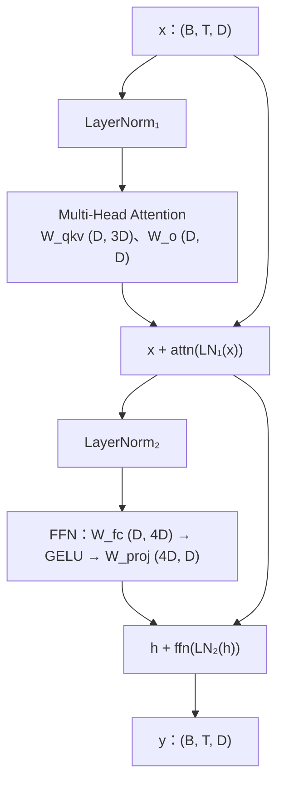
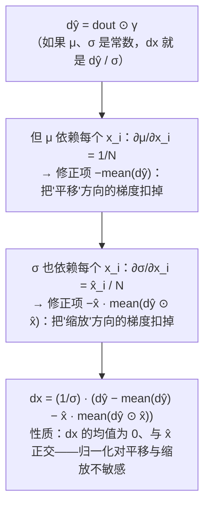

上一篇写完 attention，这一篇把它装进一个完整的 Transformer block，再往下挖一层：**反向传播**。面试里这两块常常连着问——"写一个 GPT block"之后是"LayerNorm 的反向怎么算""交叉熵对 logits 的梯度是什么""不用框架写一个两层网络的训练"，最后可能到"实现一个最小的自动求导"。这些题考的是对链式法则的**操作性理解**：每个算子的局部导数是什么、怎么和上游梯度相乘、形状怎么对上。参数量与 FLOPs 的口算也在这里——它们是面试里最容易拿分的"算术题"。

原理与推导在算法地图里：反向传播见[深度学习基础（01）](/backpropagation-by-hand.html)，归一化与残差见[（02）](/initialization-normalization-and-residual.html)，参数量与算量见 [Transformer 与 LLM（01）](/transformer-anatomy-and-parameter-count.html)、[（02）](/transformer-flops-bytes-and-roofline.html)。

本篇要回答的核心问题是：

> **一个 GPT 层的参数量为什么约等于 $$12D^2$$、每 token 前向 FLOPs 为什么约等于 $$2 \times$$ 参数量？[^q0] softmax + 交叉熵对 logits 的梯度为什么是 $$p - y$$？[^q1] LayerNorm 的反向传播里那两个"减均值"项从哪来？[^q2]**

## 一、面试怎么出题

| 出题方式 | 考点 | 追问 |
|---|---|---|
| "写 LayerNorm / RMSNorm" | 沿哪一维、有偏方差、eps 位置 | 两者差别？为什么 LLaMA 用 RMSNorm？ |
| "写一个 GPT block 前向" | pre-LN 结构、残差、FFN 的维度 | post-LN 与 pre-LN 差别？SwiGLU 为什么三个矿阵？ |
| "GPT-2 small 多少参数？" | 分块口算 | 哪部分最大？tied embedding 省多少？ |
| "一个 token 的前向多少 FLOPs？" | $$2N$$ 与 attention 项 | 什么时候 attention 项超过线性项？ |
| "写 Linear / softmax-CE / LayerNorm 的反向" | 局部导数 × 上游梯度 | 为什么 CE 的梯度那么简单？ |
| "不用框架训练一个两层网络" | 前向、反向、更新循环 | loss 为什么下降？学习率大了会怎样？ |
| "实现一个自动求导" | 计算图、拓扑序、`_backward` 闭包 | 为什么梯度要累加而不是赋值？ |

## 二、Transformer block 的结构



这是 **pre-LN**（GPT-2 起的标准）：归一化在子层**之前**，残差直连。原始 Transformer 是 post-LN（`LN(x + sublayer(x))`），深层时训练不稳定。

```python
def gpt_block(x, p, n_heads):
    h = layer_norm(x, p["ln1_g"], p["ln1_b"])
    x = x + mha(h, p["w_qkv"], p["w_o"], n_heads, causal=True)
    h = layer_norm(x, p["ln2_g"], p["ln2_b"])
    x = x + gelu_tanh(h @ p["w_fc"] + p["b_fc"]) @ p["w_proj"] + p["b_proj"]
    return x
```

对拍：用 `F.layer_norm`、`F.scaled_dot_product_attention`、`F.gelu(approximate="tanh")` 拼出同样的块，最大误差 $$10^{-10}$$。

### 1. LayerNorm 与 RMSNorm

```python
def layer_norm(x, gamma, beta, eps=1e-5):
    mu = x.mean(-1, keepdims=True)
    var = x.var(-1, keepdims=True)                # 有偏方差（除 N），与 torch 一致
    return (x - mu) / np.sqrt(var + eps) * gamma + beta

def rms_norm(x, gamma, eps=1e-6):
    rms = np.sqrt((x * x).mean(-1, keepdims=True) + eps)
    return x / rms * gamma                        # 不减均值、没有 beta
```

三个细节：沿**最后一维**（特征维）归一化，每个 token 独立——这是它与 BatchNorm 的区别，也是它不依赖 batch、适合变长序列的原因；方差是**有偏**的（除 $$N$$ 不除 $$N - 1$$）；`eps` 加在开方**里面**。RMSNorm 去掉了均值中心化和 `beta`，少一次归约、少 $$D$$ 个参数，效果相当——LLaMA 全系用它。

### 2. 激活与 FFN

```python
def gelu_tanh(x):                                 # GPT-2 用的 tanh 近似
    return 0.5 * x * (1 + np.tanh(math.sqrt(2 / math.pi) * (x + 0.044715 * x ** 3)))

def silu(x):
    return x / (1 + np.exp(-x))                   # x · σ(x)，也叫 Swish

def swiglu_ffn(x, w_gate, w_up, w_down):          # LLaMA：三个矩阵
    return (silu(x @ w_gate) * (x @ w_up)) @ w_down
```

GELU 有精确版（$$x \Phi(x)$$，用 `erf`）和 tanh 近似，两者差 $$10^{-3}$$ 量级；对拍时要指定 `approximate="tanh"`。SwiGLU 用**门控**替代单一激活：`gate` 路过 SiLU 后逐元素乘 `up` 路。为了参数量与 $$4D$$ 的 FFN 持平，中间维取 $$\frac{8}{3}D$$（再对齐到 256 的倍数，LLaMA-7B 是 11008）。

## 三、参数量与 FLOPs 口算

### 1. 参数量

一层（GPT-2 风格，带 bias）：

| 部分 | 参数 | 数量 |
|---|---|---|
| attention | $$W_q, W_k, W_v, W_o$$ 各 $$D^2$$ + 4 个 bias | $$4D^2 + 4D$$ |
| FFN | $$W_{fc}$$ $$D \times 4D$$、$$W_{proj}$$ $$4D \times D$$ + bias | $$8D^2 + 5D$$ |
| 2 个 LayerNorm | $$\gamma, \beta$$ 各 $$D$$ | $$4D$$ |
| **合计** | | $$12D^2 + 13D \approx 12D^2$$ |

整个模型：$$L \times 12D^2$$ + 嵌入 $$V \times D$$ + 位置 $$T_{\max} \times D$$（+ 输出头 $$V \times D$$，若不与嵌入共享）。

**GPT-2 small**（$$V = 50257$$，$$D = 768$$，$$L = 12$$，$$T_{\max} = 1024$$，tied）：每层 7,087,872；12 层 85,054,464；嵌入 38,597,376 + 位置 786,432；最后一个 LN 1,536；**总计 124,439,808**——就是常说的 124M。嵌入占 31%：小模型里嵌入是大头，$$D$$ 变大后 $$12D^2 L$$ 迅速主导。配套脚本用 `nn.MultiheadAttention + Linear×2 + LayerNorm×2` 数了一遍，与公式逐位相等。

### 2. FLOPs

每 token 前向：每个参数参与一次乘加 = 2 FLOPs，所以线性项 $$\approx 2 N_\text{非嵌入} = 2 \times 12D^2 L$$；attention 的 $$QK^\top$$ 与 $$PV$$ 各 $$2Td$$ 每头、$$2TD$$ 每层，合计 $$4TDL$$。

GPT-2 small、$$T = 1024$$：线性 $$169.9$$ M、attention $$37.7$$ M，attention 占 18%。attention 项超过线性项的条件：$$4TDL > 24D^2 L \iff T > 6D$$——$$D = 768$$ 时 $$T > 4608$$。

**训练** FLOPs 是前向的 3 倍（反向要算对输入和对权重两组梯度）：每 token $$\approx 6N$$，这是 Chinchilla 里 $$C = 6ND$$ 的来源（$$D$$ 这里是 token 数）。

## 四、反向传播

### 1. 链式法则的操作形式

对每个算子 $$y = f(x)$$，反向时拿到上游梯度 $$\frac{\partial L}{\partial y}$$（记 `dout`，与 $$y$$ 同形），要算出 $$\frac{\partial L}{\partial x}$$（与 $$x$$ 同形）和对参数的梯度。**形状检查**是最有效的自查：`dx.shape == x.shape`、`dw.shape == w.shape`。

### 2. Linear

$$y = xW$$，$$x: (N, \text{in})$$，$$W: (\text{in}, \text{out})$$：

$$
\frac{\partial L}{\partial x} = \frac{\partial L}{\partial y} W^\top, \qquad
\frac{\partial L}{\partial W} = x^\top \frac{\partial L}{\partial y}
$$

```python
def linear_backward(x, w, dout):
    return dout @ w.T, x.T @ dout                 # dx: (N, in), dw: (in, out)
```

记法：`dx` 要把 `out` 维消掉、变回 `in` 维，所以乘 $$W^\top$$；`dw` 的形状是 `(in, out)`，只有 $$x^\top \cdot \text{dout}$$ 能拼出来。bias 的梯度是 `dout.sum(0)`。

### 3. softmax + 交叉熵

$$L = -\frac{1}{N} \sum_n \log p_{n, y_n}$$，$$p = \text{softmax}(z)$$。对单个样本：

$$
\frac{\partial L_n}{\partial z_j} = p_j - \mathbb{1}[j = y_n]
$$

```python
def softmax_ce_forward_backward(logits, targets):
    N = logits.shape[0]
    p = softmax(logits)
    loss = -np.log(p[np.arange(N), targets]).mean()
    dlogits = p.copy()
    dlogits[np.arange(N), targets] -= 1           # p - onehot
    return loss, dlogits / N                      # mean 的 1/N
```

**为什么这么简单**：$$\log p_y = z_y - \log \sum_k e^{z_k}$$，对 $$z_j$$ 求导：第一项给 $$\mathbb{1}[j = y]$$，第二项给 $$-p_j$$。softmax 的雅可比 $$p_i(\delta_{ij} - p_j)$$ 与 $$-1/p_y$$ 相乘后全部约掉。这也是为什么框架把 softmax 和 CE 合成一个算子（`F.cross_entropy` 接收 logits）——数值更稳、梯度更简单。

### 4. LayerNorm

$$\hat{x} = (x - \mu) / \sigma$$，$$y = \gamma \hat{x} + \beta$$，$$\sigma = \sqrt{\text{var} + \epsilon}$$。对 $$\gamma, \beta$$ 的梯度是逐维求和；对 $$x$$ 的梯度是难点，因为 $$\mu$$ 和 $$\sigma$$ 都依赖 $$x$$ 的每个分量：

$$
\frac{\partial L}{\partial x} = \frac{1}{\sigma} \left( d\hat{x} - \text{mean}(d\hat{x}) - \hat{x} \cdot \text{mean}(d\hat{x} \odot \hat{x}) \right), \quad d\hat{x} = \frac{\partial L}{\partial y} \odot \gamma
$$

```python
def layer_norm_backward(x, gamma, dout, eps=1e-5):
    mu = x.mean(-1, keepdims=True)
    var = x.var(-1, keepdims=True)
    inv = 1 / np.sqrt(var + eps)
    xhat = (x - mu) * inv
    dgamma = (dout * xhat).reshape(-1, x.shape[-1]).sum(0)
    dbeta = dout.reshape(-1, x.shape[-1]).sum(0)
    dxhat = dout * gamma
    dx = inv * (dxhat - dxhat.mean(-1, keepdims=True)
                - xhat * (dxhat * xhat).mean(-1, keepdims=True))
    return dx, dgamma, dbeta
```



对拍：`F.layer_norm` 的 autograd，`dx`、`dgamma`、`dbeta` 三者误差都在 $$10^{-10}$$。

### 5. 一个完整的训练循环

```python
def two_layer_mlp_train(X, y, hidden, steps, lr, rng):
    W1 = rng.standard_normal((n_in, hidden)) * math.sqrt(2 / n_in)   # He 初始化
    b1 = np.zeros(hidden)
    W2 = rng.standard_normal((hidden, n_cls)) * math.sqrt(2 / hidden)
    b2 = np.zeros(n_cls)
    for _ in range(steps):
        z1 = X @ W1 + b1                          # 前向
        a1 = np.maximum(z1, 0)
        logits = a1 @ W2 + b2
        loss, dlogits = softmax_ce_forward_backward(logits, y)
        da1, dW2 = linear_backward(a1, W2, dlogits)   # 反向：从后往前
        db2 = dlogits.sum(0)
        dz1 = da1 * (z1 > 0)                      # ReLU 的导数：正区间 1，否则 0
        _, dW1 = linear_backward(X, W1, dz1)
        db1 = dz1.sum(0)
        W1 -= lr * dW1; b1 -= lr * db1; W2 -= lr * dW2; b2 -= lr * db2   # SGD
```

XOR 型数据（线性不可分）、隐层 16、300 步：loss 从 0.80 降到 0.05。面试里写这个循环的要点是**顺序**——前向按层存下中间量（`z1`、`a1`），反向严格倒序，每一步的输入是上一步的输出梯度。

### 6. micrograd：最小自动求导

```python
class Value:
    def __init__(self, data, children=(), op=""):
        self.data, self.grad = float(data), 0.0
        self._children, self._backward = children, lambda: None

    def __mul__(self, other):
        other = other if isinstance(other, Value) else Value(other)
        out = Value(self.data * other.data, (self, other), "*")
        def _backward():
            self.grad += other.data * out.grad    # 累加，不是赋值：一个变量可能被用多次
            other.grad += self.data * out.grad
        out._backward = _backward
        return out
    # __add__ / __pow__ / relu / exp / log 同理：out 记住输入与局部导数

    def backward(self):
        topo, seen = [], set()
        def build(v):                             # 后序 DFS 得到拓扑序
            if v not in seen:
                seen.add(v)
                for c in v._children:
                    build(c)
                topo.append(v)
        build(self)
        self.grad = 1.0
        for v in reversed(topo):                  # 从输出往输入，保证用到某节点的 grad 时它已算完
            v._backward()
```

三个要点：**每个算子在前向时就把反向闭包挂在输出上**（闭包捕获了输入和输出的引用）；**梯度累加**（`+=`）——同一个 `Value` 在图里被多个节点用到时，各分支的贡献要加起来；**拓扑序**保证反向到某节点时，它的所有下游都已经把梯度传给它。$$f = \text{relu}(ab + a^2) / b$$ 在 $$a = 2, b = 3$$ 处，`a.grad = 7/3`、`b.grad = -4/9`，与 torch 完全一致。

## 五、与参考实现对拍

`transformer_block.py --check`：

| 我的实现 | 参考 |
|---|---|
| `layer_norm` / `rms_norm` / `gelu` / `gelu_tanh` / `silu` | `F.layer_norm` / `F.rms_norm` / `F.gelu(approximate=...)` / `F.silu` |
| `layer_norm_backward` | `F.layer_norm` 的 autograd（`dx`、`dgamma`、`dbeta`） |
| `softmax_ce_forward_backward` | `F.cross_entropy` 的 loss 与 autograd |
| `linear_backward` | `x @ w` 的 autograd |
| `gpt_block` | 用 torch 算子拼的同结构块 |
| `gpt_params` | `nn.MultiheadAttention + Linear×2 + LayerNorm×2` 的 `numel` 之和 |
| `Value` | `torch.tensor(requires_grad=True)` 的标量运算 |

## 六、陷阱

| 陷阱 | 现象 | 修法 |
|---|---|---|
| LayerNorm 用无偏方差（`ddof=1`） | 与 torch 差 $$\sqrt{N/(N-1)}$$ | `x.var()` 默认有偏；torch 的 `var` 默认**无偏**，对拍时注意 |
| `eps` 加在开方外面 | 数值差异 | 加在里面 |
| 沿错误的维归一化 | 形状能过、结果全错 | 最后一维 |
| GELU 精确版对拍 tanh 版 | 差 $$10^{-3}$$ | 指定 `approximate` |
| CE 梯度忘除 $$N$$ | 学习率等效放大 $$N$$ 倍 | `mean` 对应 `/ N` |
| 反向时用了错误的中间量 | ReLU 的导数要用 `z1`（激活前）判断 | 前向存好每一层的输入 |
| 梯度用 `=` 而不是 `+=` | 变量被多次使用时梯度丢失 | 累加 |
| 拓扑序错 | 某节点的 grad 未算完就被用 | 后序 DFS 再反转 |
| 忘记 `zero_grad` | 跨 step 梯度累积 | 每步清零（micrograd 里手动置 0） |
| He / Xavier 初始化写错方差 | loss 不降或 `nan` | ReLU 用 $$\sqrt{2/\text{in}}$$ |

## 七、常见追问

| 追问 | 要点 |
|---|---|
| pre-LN 与 post-LN？ | pre-LN 残差路径是恒等的、深层稳定、不需要 warmup 那么久；post-LN 表达能力略强但难训 |
| 为什么 LN 不是 BN？ | 序列长度可变、batch 内 token 数不一、推理时 batch 可能是 1；LN 每个 token 独立 |
| RMSNorm 为什么够用？ | 实验上均值中心化贡献很小；省一次归约在大模型上可观 |
| FFN 为什么是 $$4D$$？ | 经验值；SwiGLU 为了参数持平用 $$\frac{8}{3}D$$ |
| 参数量里 embedding 算不算？ | 算总参数量算；算 FLOPs 时嵌入查表不算乘加（输出头算） |
| 训练 FLOPs 为什么是 $$6N$$？ | 前向 $$2N$$，反向对输入 $$2N$$、对权重 $$2N$$ |
| 反向为什么要存前向的激活？ | 局部导数依赖输入（ReLU 看 $$z$$、矩阵乘看 $$x$$）；显存瓶颈的来源，activation checkpointing 用重算换显存 |
| 为什么 CE 用 logits 而不是 probs？ | 数值稳定（logsumexp）、梯度简单（$$p - y$$） |
| 自动求导和符号求导、数值求导的区别？ | 数值：有限差分，$$O(n)$$ 次前向；符号：表达式膨胀；自动：精确、一次反向 $$O(1)$$ 倍前向成本 |
| 前向模式与反向模式？ | 反向模式一次得到所有输入的梯度（输出是标量时最优）；前向模式一次得到一个方向导数 |

## 八、小结

| 组件 | 前向 | 反向 |
|---|---|---|
| Linear $$y = xW$$ | $$xW$$ | $$dx = dy\,W^\top$$，$$dW = x^\top dy$$ |
| ReLU | $$\max(0, z)$$ | $$dz = dy \odot [z > 0]$$ |
| softmax + CE | $$-\log p_y$$ | $$dz = (p - y) / N$$ |
| LayerNorm | $$\gamma \hat{x} + \beta$$ | $$dx = \frac{1}{\sigma}(d\hat{x} - \overline{d\hat{x}} - \hat{x}\,\overline{d\hat{x} \odot \hat{x}})$$ |
| 参数量 | 每层 $$12D^2$$ | GPT-2 small 124M |
| FLOPs | 前向 $$2N + 4TDL$$ 每 token | 训练 $$6N$$ |

配套代码：[`coding-interview/ai/transformer_block.py`](https://github.com/arganzheng/ai-learning-labs/blob/main/coding-interview/ai/transformer_block.py)。

## 九、自测

1. LLaMA-2-7B：$$D = 4096$$、$$L = 32$$、$$V = 32000$$、FFN 中间维 11008、无 bias、RMSNorm、GQA 未启用（$$H_{kv} = H$$）、输出头不共享。口算参数量。

   <details markdown="1">
   <summary>答案</summary>
   每层 attention $$4D^2 = 67.1$$M；SwiGLU FFN 三个矩阵 $$3 \times 4096 \times 11008 = 135.3$$M；两个 RMSNorm $$2D = 8$$K。每层约 202.4M，32 层 6.48B。嵌入 $$32000 \times 4096 = 131$$M，输出头同样 131M，最后一个 RMSNorm 4K。总计约 6.74B——官方数字 6.74B。详见[第三章第 1 节](#1-参数量)。
   </details>

2. 训练一个 7B 模型 2T token，需要多少 FLOPs？在 1000 张 H100（每张 bf16 峰值约 989 TFLOP/s，MFU 40%）上要多少天？

   <details markdown="1">
   <summary>答案</summary>
   $$6 \times 7 \times 10^9 \times 2 \times 10^{12} = 8.4 \times 10^{22}$$ FLOPs。有效算力 $$1000 \times 989 \times 10^{12} \times 0.4 = 3.96 \times 10^{17}$$ FLOP/s。时间 $$8.4 \times 10^{22} / 3.96 \times 10^{17} = 2.1 \times 10^5$$ s ≈ 2.5 天。（实际还有 attention 项与通信开销，会更长。）详见[第三章第 2 节](#2-flops)。
   </details>

3. `softmax_ce_forward_backward` 里如果 `loss` 用 `sum` 而不是 `mean`，`dlogits` 该怎么改？两种写法训练出来的模型一样吗？

   <details markdown="1">
   <summary>答案</summary>
   去掉 `/ N`，`dlogits = p - onehot`。梯度大了 $$N$$ 倍，相当于学习率放大 $$N$$ 倍：用 SGD 时步长变了、训练轨迹不同（可能发散）；用 Adam 时因为归一化了梯度尺度，几乎不受影响（只有 `eps` 的相对大小变了）。所以 `mean` 是让学习率与 batch size 解耦的约定。详见[第四章第 3 节](#3-softmax--交叉熵)。
   </details>

4. `layer_norm_backward` 返回的 `dx`，为什么每一行的均值恰好是 0？这对应 LayerNorm 的什么性质？

   <details markdown="1">
   <summary>答案</summary>
   `dx = inv · (dxhat − mean(dxhat) − xhat · mean(dxhat·xhat))`。第一项减第二项均值为 0；第三项 `xhat` 的均值本身是 0（它是标准化后的量），乘常数后均值仍 0。所以 `dx` 均值为 0。对应的性质：LayerNorm 对输入的**平移不敏感**——$$x + c\mathbb{1}$$ 与 $$x$$ 输出相同，所以损失沿 $$\mathbb{1}$$ 方向的导数必为 0。同理 `dx` 与 `xhat` 正交对应缩放不敏感。详见[第四章第 4 节](#4-layernorm)。
   </details>

5. micrograd 里 `a = Value(2); b = a * a; c = a + b; c.backward()`，`a.grad` 是多少？如果 `_backward` 里用 `=` 代替 `+=` 会得到多少？

   <details markdown="1">
   <summary>答案</summary>
   $$c = a + a^2$$，$$dc/da = 1 + 2a = 5$$。`a` 被用了三次（`a * a` 两次、`a + b` 一次），三条路径的贡献 $$2 + 2 + 1$$ 要累加。用 `=` 时后算的分支覆盖先算的：拓扑序反向先执行 `c` 的 `_backward`（`a.grad = 1`，`b.grad = 1`），再执行 `b` 的（`a.grad = 2`，再 `a.grad = 2`），最终 2——错误。详见[第四章第 6 节](#6-micrograd最小自动求导)。
   </details>

## 下一篇

[手撕 tokenizer 与解码](/coding-interview-tokenizer-and-decoding.html)

[^q0]: 一层的矩阵：attention 四个 $$D \times D$$（$$4D^2$$），FFN 两个 $$D \times 4D$$（$$8D^2$$），合计 $$12D^2$$；bias 与 LN 只有 $$O(D)$$，占比 0.1% 量级。每个参数在前向里恰好参与一次乘加（2 FLOPs），所以每 token 线性项 FLOPs $$= 2 \times 12D^2 L = 2N_\text{非嵌入}$$；attention 的 $$QK^\top$$、$$PV$$ 另加 $$4TDL$$，$$T < 6D$$ 时是小项。训练是前向的 3 倍：$$6N$$。GPT-2 small 按此算得 124,439,808，与 `nn` 模块逐个数出的结果一致。详见[第三章](#三参数量与-flops-口算)。

[^q1]: $$\log p_y = z_y - \log \sum_k e^{z_k}$$。对 $$z_j$$ 求导：第一项给 $$\mathbb{1}[j = y]$$，第二项给 $$-\frac{e^{z_j}}{\sum_k e^{z_k}} = -p_j$$。所以 $$\partial(-\log p_y) / \partial z_j = p_j - \mathbb{1}[j = y]$$，即 $$p - \text{onehot}(y)$$；对 batch 取 mean 再除 $$N$$。softmax 的雅可比与 $$-1/p_y$$ 相乘后完全约掉，这是把 softmax 与 CE 合成一个算子的原因——数值稳定且梯度是一次减法。详见[第四章第 3 节](#3-softmax--交叉熵)。

[^q2]: 若 $$\mu$$、$$\sigma$$ 是常数，$$dx = d\hat{x} / \sigma$$。但 $$\mu = \frac{1}{N}\sum x_i$$ 依赖每个 $$x_i$$（$$\partial\mu/\partial x_i = 1/N$$），经 $$\hat{x} = (x - \mu)/\sigma$$ 传回的梯度是 $$-\frac{1}{N}\sum_j d\hat{x}_j = -\text{mean}(d\hat{x})$$；$$\sigma$$ 同样依赖每个 $$x_i$$（$$\partial\sigma/\partial x_i = \hat{x}_i / N$$），传回 $$-\hat{x}_i \cdot \text{mean}(d\hat{x} \odot \hat{x})$$。两项分别扣掉梯度里"整体平移"与"整体缩放"的分量——LayerNorm 对这两种变化不敏感，所以损失在这两个方向上的导数必须为 0。详见[第四章第 4 节](#4-layernorm)。
