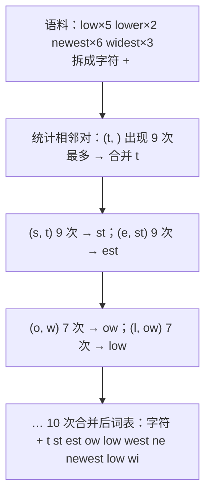
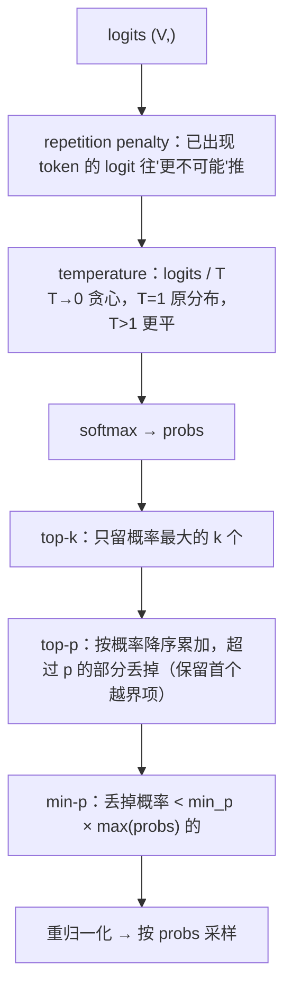

模型的两端——文本进去之前的 tokenizer、logits 出来之后的解码——是面试里"看起来简单、写起来处处是坑"的手撕题。BPE 的训练循环十几行，但"合并的优先级怎么定""编码时按什么顺序应用 merge"两个细节决定了写出来的东西对不对；top-p 采样的截断位置差一个元素就是另一个算法；beam search 里"完成的序列怎么处理""长度归一化"是必问；投机解码的接受-拒绝规则一行公式，但要能证明"最终分布等于目标分布"。这一篇把这五组东西从零写出来，每个都有数值验证。

原理与取舍在算法地图里：分词见[预训练（01）](/tokenizer-vocabulary-and-token-efficiency.html)，解码策略见[高效推理（01）](/decoding-strategies-sampling-and-constrained-generation.html)，投机解码见[（02）](/speculative-decoding-drafters-acceptance-and-trees.html)。

本篇要回答的核心问题是：

> **BPE 训练时"合并最频繁的相邻对"如何做到确定性、编码时为什么必须按训练顺序应用 merge？[^q0] top-k、top-p、min-p 三种截断各在哪一步、按什么顺序叠加？[^q1] 投机解码的接受规则 $$\min(1, p/q)$$ 加拒绝后重采样，为什么得到的分布恰好是 $$p$$？[^q2]**

## 一、面试怎么出题

| 出题方式 | 考点 | 追问 |
|---|---|---|
| "实现 BPE 的训练" | 统计相邻对、合并、重复 | 复杂度？tie 怎么打破？词尾标记为什么要？ |
| "用训练好的 merge 表编码一个词" | 按优先级应用 | 为什么不是贪心最长匹配？未登录字符？ |
| "写 temperature / top-k / top-p 采样" | 顺序、截断边界、重归一化 | temperature → 0 是什么？top-p 保留几个？ |
| "写 beam search" | 候选扩展、剪到 beam 个、eos 处理 | 长度惩罚？beam 大一定好？ |
| "从数据流里等概率抽 k 个" | 蓄水池抽样 | 证明每个元素概率 $$k/n$$ |
| "投机解码的接受规则" | $$\min(1, p/q)$$ + 残差重采样 | 证明无偏；接受率与 $$p, q$$ 距离的关系 |
| "repetition penalty 怎么实现" | 对已出现 token 的 logit 惩罚 | 正负 logit 为什么处理不同？ |

## 二、BPE

### 1. 训练

BPE 训练是一个贪心循环：把每个词拆成字符（末尾加 `</w>` 表示词尾），统计所有**相邻符号对**的出现次数（按词频加权），把最频繁的一对合并成一个新符号，重复 $$k$$ 次。merge 表的顺序就是优先级。

```python
def bpe_train(corpus, num_merges):
    words = Counter(tuple(w) + ("</w>",) for w in corpus)       # 词 → 频次，词是符号元组
    merges = []
    for _ in range(num_merges):
        pairs = Counter()
        for sym, freq in words.items():
            for a, b in zip(sym, sym[1:]):
                pairs[(a, b)] += freq
        if not pairs:
            break
        best = max(pairs, key=lambda p: (pairs[p], p))   # 频次相同按字典序：确定性
        merges.append(best)
        words = Counter({_merge(sym, best): f for sym, f in words.items()})
    return merges

def _merge(sym, pair):                                           # 把元组里所有相邻的 pair 合成一个符号
    out, i = [], 0
    while i < len(sym):
        if i + 1 < len(sym) and (sym[i], sym[i + 1]) == pair:
            out.append(sym[i] + sym[i + 1]); i += 2
        else:
            out.append(sym[i]); i += 1
    return tuple(out)
```



**三个细节**：`</w>` 让"词尾的 t"和"词中的 t"是不同符号，否则 `est` 会跨词边界合并；tie-break 用 `(频次, 字典序)`，否则 `Counter` 的迭代顺序决定结果、不同运行不一致；每次合并后要重新统计——朴素实现 $$O(k \cdot \text{语料大小})$$，工业实现用增量更新（只重算受影响的词）。

### 2. 编码

编码时**不是**贪心最长匹配，而是把 merge 表当优先级：反复找当前符号序列里**rank 最小**（最早学到）的相邻对合并，直到没有可合并的。这保证编码结果与训练时的切分一致。

```python
def bpe_encode(word, merges):
    sym = tuple(word) + ("</w>",)
    rank = {p: i for i, p in enumerate(merges)}
    while len(sym) > 1:
        cands = [(rank[(a, b)], (a, b)) for a, b in zip(sym, sym[1:]) if (a, b) in rank]
        if not cands:
            break
        _, pair = min(cands)                                     # 优先级最高的对
        sym = _merge(sym, pair)
    return list(sym)
```

`lowest` → `['low', 'est</w>']`；`newer`（训练集里没有）→ `['ne', 'w', 'e', 'r', '</w>']`：未见过的组合退化到更小的单元，永远不会失败——这是 BPE 没有 OOV 的原因（字节级 BPE 把字符再换成 256 个字节，连未见字符也能编码）。

**为什么不能贪心最长匹配**：词表里同时有 `est</w>` 和 `west</w>`，`newest` 贪心会先匹配 `ne`……不同实现顺序不同、结果不同；按 merge rank 应用是唯一与训练一致的方式。

## 三、采样

logits 到 token 的流水线：



```python
def sample_logits(logits, temperature=1.0, top_k=0, top_p=1.0, min_p=0.0, rng=None):
    if temperature == 0:
        return int(logits.argmax())                              # 贪心
    probs = softmax(logits / temperature)
    if 0 < top_k < len(probs):
        kth = np.sort(probs)[-top_k]
        probs = np.where(probs >= kth, probs, 0.0)
    if top_p < 1.0:
        order = np.argsort(-probs)
        cum = np.cumsum(probs[order])
        cutoff = order[cum - probs[order] >= top_p]              # 前面的累计已经 >= p 的元素：丢
        probs[cutoff] = 0.0
    if min_p > 0:
        probs = np.where(probs >= min_p * probs.max(), probs, 0.0)
    probs = probs / probs.sum()
    return int(rng.choice(len(probs), p=probs))
```

**top-p 的边界**：`cum - probs[order] >= top_p` 表示"在这个元素**之前**累计已经达到 p"——它和之后的都丢；第一个让累计越过 p 的元素**保留**（否则 `top_p = 0.5`、首个概率 0.6 时会一个都不剩）。HF 的实现是同一语义（`sorted_indices_to_remove` 右移一位）。

**为什么 temperature 在 softmax 之前、截断在之后**：temperature 改变分布的形状（$$T < 1$$ 让大的更大），截断是在形状确定后砍尾巴；先截断再调温会让保留集合与最终分布不一致。三种截断的直觉：top-k 固定个数、不看分布形状；top-p 自适应个数——分布尖时留得少、平时留得多；min-p 用相对阈值，对"一个很确定 + 一堆长尾"的分布比 top-p 更稳（top-p 会把长尾留进来）。

配套脚本用 `[2.0, 1.5, 1.0, 0.0, -1.0]` 采一万次：`T=0.5` 把首项概率从 0.46 推到 0.65；`top_k=2` 只剩前两个；`top_p=0.8` 留三个（0.46 + 0.28 = 0.74 < 0.8，第三个 0.17 让累计越界、保留）。

**repetition penalty**（HF 的写法）：已出现 token 的 logit 若为正则除以 `penalty`、若为负则乘以 `penalty`——两种情况都朝"更负"推。直接统一除会让负 logit 变得**更大**。

## 四、beam search

每步：对每个 beam 取 top-b 个下一 token，得到最多 $$b^2$$ 个候选，按累计 log 概率排序取前 $$b$$ 个作为新 beam。遇到 `eos` 的候选移入 `finished`，不再扩展。最后在 `finished`（加上未完成的）里按分数选最优。

```python
def beam_search(step_fn, bos, eos, beam, max_len, length_alpha=0.0):
    beams = [([bos], 0.0)]                                       # (序列, 累计 log p)
    finished = []
    for _ in range(max_len):
        cands = []
        for seq, score in beams:
            lp = step_fn(seq)                                    # 该前缀下的 log probs (V,)
            for t in np.argpartition(-lp, beam)[:beam]:          # 每个 beam 只需 top-b 个候选
                cands.append((seq + [int(t)], score + float(lp[t])))
        cands.sort(key=lambda c: -c[1])
        beams = []
        for seq, score in cands:
            if seq[-1] == eos:
                finished.append((seq, score))                    # 完成的不占 beam 位
            else:
                beams.append((seq, score))
            if len(beams) == beam:
                break
        if not beams:
            break
    finished.extend(beams)
    norm = lambda s: s[1] / (len(s[0]) ** length_alpha) if length_alpha else s[1]
    return max(finished, key=norm)
```

**为什么用 log 概率相加**：概率相乘会下溢；log 域加法等价且稳定。**长度归一化**：不归一化时短序列天然占优（每多一步都乘一个 $$< 1$$ 的数），`score / len^alpha`（$$\alpha \approx 0.6 \sim 1$$）抵消这一偏置。

配套的玩具 LM 里贪心得到 `[1, 0, 3]` 概率 0.15，beam=2 找到 `[2, 3]` 概率 0.38——贪心第一步选了概率 0.5 的 token 1，但它之后的路都不好；beam 保留了第一步概率 0.4 的 token 2。

**beam 越大越好吗**：不是。beam 大会让"安全、通用、短"的序列胜出（beam search curse），NMT 里 beam > 10 常常 BLEU 下降；开放生成里 beam search 会产生重复，采样更合适。

## 五、蓄水池抽样

数据流里等概率抽 $$k$$ 个、不知道总长、只能过一遍：前 $$k$$ 个直接放进池子；第 $$i$$ 个（$$i > k$$）以 $$k/i$$ 的概率替换池子里随机一个。

```python
def reservoir_sample(stream, k, rng):
    res = []
    for i, x in enumerate(stream, 1):
        if i <= k:
            res.append(x)
        else:
            j = rng.randint(1, i)                                # 1..i 均匀
            if j <= k:
                res[j - 1] = x                                   # 以 k/i 的概率替换第 j 个
    return res
```

**证明每个元素最终在池子里的概率是 $$k/n$$**：第 $$i$$ 个元素进入的概率是 $$k/i$$；之后每个 $$m > i$$ 到来时它被换出的概率是 $$\frac{k}{m} \cdot \frac{1}{k} = \frac{1}{m}$$，留下的概率 $$\frac{m-1}{m}$$。连乘 $$\frac{k}{i} \cdot \frac{i}{i+1} \cdot \frac{i+1}{i+2} \cdots \frac{n-1}{n} = \frac{k}{n}$$。前 $$k$$ 个元素同理（进入概率 1，之后每步留下 $$\frac{m-1}{m}$$，连乘 $$\frac{k}{n}$$）。配套脚本流长 10、$$k = 3$$、两万次，每个元素频率 0.297–0.303。

它在 AI 里的位置：从大语料流里抽验证集、从日志流里抽样本做评测、在线 RL 的 replay buffer。

## 六、投机解码的接受规则

小模型（draft，分布 $$q$$）先猜一个 token $$x$$，大模型（target，分布 $$p$$）一次前向验证。规则：以概率 $$\min(1, p(x)/q(x))$$ **接受** $$x$$；否则**拒绝**，从残差分布 $$\text{norm}(\max(0, p - q))$$ 重采一个。

```python
def speculative_accept(q, p, draft_token, rng):
    if rng.random() < min(1.0, p[draft_token] / q[draft_token]):
        return True, draft_token
    resid = np.maximum(p - q, 0)
    resid /= resid.sum()
    return False, int(rng.choice(len(p), p=resid))
```

**为什么最终分布是 $$p$$**：最终输出 $$x$$ 的概率 = 接受时得到 $$x$$ + 拒绝时重采到 $$x$$：

$$
q(x) \min\!\left(1, \frac{p(x)}{q(x)}\right) + \underbrace{\Big(1 - \sum_y q(y)\min\!\big(1, \tfrac{p(y)}{q(y)}\big)\Big)}_{\text{拒绝概率}} \cdot \frac{\max(0, p(x) - q(x))}{\sum_y \max(0, p(y) - q(y))}
$$

第一项是 $$\min(p(x), q(x))$$。拒绝概率 $$= 1 - \sum_y \min(p, q) = \sum_y \max(0, p - q)$$（因为 $$\sum p = \sum q = 1$$），恰好是残差的归一化常数，约掉后第二项是 $$\max(0, p(x) - q(x))$$。两项相加 $$= \min(p, q) + \max(0, p - q) = p(x)$$。

**接受率** $$= \sum_y \min(p, q) = 1 - \text{TV}(p, q)$$（总变差距离）。配套脚本 $$q = [0.5, 0.3, 0.2]$$、$$p = [0.2, 0.3, 0.5]$$：三万次后输出分布 `[0.205, 0.300, 0.495]`，接受率 0.702（理论 0.7）。

这是 LC 470 / 528 一类"用一个分布生成另一个分布"题的 AI 版——拒绝采样的一个特例，且拒绝后不是重来而是用残差一次补齐。

## 七、与参考实现对拍

`tokenizer_decoding.py --check`：

| 检查 | 方法 |
|---|---|
| BPE 无损 | `"".join(encode(w)) == w + "</w>"`，含训练集外的词 |
| temperature | 与 `torch.softmax(logits / T)` 一致 |
| top-k / top-p 支撑集 | 3000 次采样的结果集合 ⊆ 理论允许集合 |
| repetition penalty | 惩罚后已出现 token 的概率严格下降 |
| beam = 1 | 与贪心解码序列相同 |
| 蓄水池 | 每个元素频率与 $$k/n$$ 偏差 < 0.02 |
| 投机解码 | 输出频率与 $$p$$ 各分量偏差 < 0.01 |

## 八、陷阱

| 陷阱 | 现象 | 修法 |
|---|---|---|
| BPE tie-break 不确定 | 两次训练 merge 表不同 | `(频次, 字典序)` 排序 |
| 编码用贪心最长匹配 | 与训练切分不一致、复现不了 tokenizer | 按 merge rank |
| 忘记 `</w>` | 跨词合并 | 加词尾标记（或字节级的空格前缀 `Ġ`） |
| top-p 把首个越界项也丢 | `top_p` 小于首项概率时一个不剩 | 保留首个越界项 |
| 截断后不重归一化 | `np.random.choice` 报 `probabilities do not sum to 1` | `probs /= probs.sum()` |
| temperature 在 softmax 之后除 | 不再是概率 | 除 logits |
| repetition penalty 统一除 | 负 logit 变大 | 正除负乘 |
| beam 里完成的序列继续扩展 | eos 后接 token、浪费 beam | 移入 `finished` |
| 概率相乘 | 下溢成 0 | log 域相加 |
| 投机解码拒绝后从 $$p$$ 重采 | 分布偏离 $$p$$（接受的部分已经拿了 $$\min(p, q)$$） | 从残差 $$\max(0, p - q)$$ 重采 |
| 蓄水池用 `random() < k / i` 再随机选位置 | 正确但两次随机 | `randint(1, i) <= k` 一次搞定 |

## 九、常见追问

| 追问 | 要点 |
|---|---|
| BPE、WordPiece、Unigram 的区别？ | BPE 合并最频繁对；WordPiece 合并让语言模型似然增益最大的对；Unigram 从大词表往下删 |
| 词表大小怎么选？ | 大：序列短、嵌入参数多、稀有 token 训不好；小：序列长；32K–128K 是当前范围，见[预训练（01）](/tokenizer-vocabulary-and-token-efficiency.html) |
| 字节级 BPE 的好处？ | 256 个基础符号覆盖一切、无 OOV；代价是非英语文本 token 数多 |
| temperature 0 与 argmax？ | 等价；实现上要单独分支避免除零 |
| top-p 与 top-k 能同时用吗？ | 能，先 k 后 p（HF 顺序）；也常只用其一 |
| beam search 用于开放生成为什么不好？ | 高概率序列往往重复、乏味；人类文本本身不是最大似然序列 |
| 投机解码为什么能加速？ | 大模型一次前向验证 $$k$$ 个 draft token（batch 维并行），接受率高时每次前向产出多个 token；decode 是 memory-bound，多算几个 token 几乎不多花时间 |
| 接受率低怎么办？ | 换更像 target 的 draft（同家族小模型、Medusa 头、EAGLE）；树形 draft 提高每次验证的期望接受数 |
| 约束解码（JSON、语法）怎么做？ | 每步用状态机 / 语法把不合法 token 的 logit 置 $$-\infty$$ |

## 十、小结

| 组件 | 核心一句 | 验证 |
|---|---|---|
| BPE 训练 | 反复合并最频繁的相邻对，tie 按字典序 | merge 表确定 |
| BPE 编码 | 按 merge rank 依次应用，不是贪心 | 无损还原 |
| 采样 | penalty → T → softmax → top-k → top-p → min-p → 归一化 | 支撑集正确 |
| beam search | log 域累加、每步剪到 $$b$$、eos 移出、长度归一化 | $$b = 1$$ 即贪心 |
| 蓄水池 | 第 $$i$$ 个以 $$k/i$$ 替换 | 每元素 $$k/n$$ |
| 投机解码 | 接受 $$\min(1, p/q)$$，拒绝后从 $$\max(0, p-q)$$ 重采 | 输出分布 $$= p$$ |

配套代码：[`coding-interview/ai/tokenizer_decoding.py`](https://github.com/arganzheng/ai-learning-labs/blob/main/coding-interview/ai/tokenizer_decoding.py)。

## 十一、自测

1. 语料 `["ab"] * 3 + ["abc"] * 2`，做 2 次 BPE 合并，merge 表是什么？`"abcd"` 编码成什么？

   <details markdown="1">
   <summary>答案</summary>
   拆分：`a b </w>` ×3、`a b c </w>` ×2。相邻对：`(a, b)` 5 次、`(b, </w>)` 3、`(b, c)` 2、`(c, </w>)` 2。第一次合并 `ab`；之后 `(ab, </w>)` 3、`(ab, c)` 2、`(c, </w>)` 2 → 合并 `ab</w>`。merge 表 `[(a, b), (ab, </w>)]`。编码 `abcd`：`a b c d </w>` → rank 0 的 `(a, b)` 合并 → `ab c d </w>`；`(ab, </w>)` 不相邻，无可合并 → `['ab', 'c', 'd', '</w>']`。详见[第二章](#二bpe)。
   </details>

2. `probs = [0.6, 0.25, 0.1, 0.05]`，`top_p = 0.5` 保留哪些？`top_p = 0.85` 呢？`min_p = 0.2` 呢？

   <details markdown="1">
   <summary>答案</summary>
   `top_p = 0.5`：首项 0.6 已越界，但它是首个越界项，保留；只剩 `[0.6]`。`top_p = 0.85`：0.6（累计 0.6 < 0.85）留，0.25（累计 0.85，之前累计 0.6 < 0.85）留，0.1 之前累计 0.85 ≥ 0.85 丢——保留前两个。`min_p = 0.2`：阈值 $$0.2 \times 0.6 = 0.12$$，保留 ≥ 0.12 的：前两个。详见[第三章](#三采样)。
   </details>

3. beam search 不做长度归一化时，为什么倾向于短序列？如果 `step_fn` 在每一步都给 eos 概率 0.3，beam=1 会生成多长？

   <details markdown="1">
   <summary>答案</summary>
   每加一个 token 累计 log 概率就加一个负数，长序列的分数必然更低；完成的短序列与未完成的长序列比较时短的占优。eos 概率 0.3 意味着每步 eos 的 log 概率 $$\ln 0.3 = -1.2$$；若其他 token 中最大的概率 > 0.3，贪心会一直不选 eos 直到 `max_len`；若 eos 是每步最大的（其他都 < 0.3），第一步就停，长度 1。这说明贪心 / beam 的停止完全由局部概率决定，与"合理长度"无关——长度归一化与 `min_length` 是为此打的补丁。详见[第四章](#四beam-search)。
   </details>

4. 蓄水池抽样里把 `j = randint(1, i); if j <= k` 改成 `if random() < k / i: res[randint(0, k-1)] = x`，还对吗？

   <details markdown="1">
   <summary>答案</summary>
   对。第 $$i$$ 个元素进入的概率仍是 $$k/i$$，进入后替换的位置均匀随机，每个已在池中的元素被换出的概率是 $$\frac{k}{i} \cdot \frac{1}{k} = \frac{1}{i}$$——与原写法相同。只是多用了一次随机数。原写法把"是否替换"和"替换谁"合成一次 `randint`。详见[第五章](#五蓄水池抽样)。
   </details>

5. 投机解码里 $$q = [0.9, 0.1]$$、$$p = [0.5, 0.5]$$。draft 采出 token 0 的概率、被接受的概率、拒绝后重采得到 token 1 的概率各是多少？验证最终分布。

   <details markdown="1">
   <summary>答案</summary>
   draft 出 0 的概率 0.9，接受概率 $$\min(1, 0.5/0.9) = 5/9$$；出 1 的概率 0.1，接受概率 $$\min(1, 0.5/0.1) = 1$$。总接受率 $$0.9 \times 5/9 + 0.1 = 0.6 = 1 - \text{TV}$$（TV $$= 0.4$$）。拒绝（概率 0.4）后残差 $$\max(0, p - q) = [0, 0.4]$$，归一化后必出 token 1。最终：token 0 概率 $$0.9 \times 5/9 = 0.5$$；token 1 概率 $$0.1 + 0.4 = 0.5$$。等于 $$p$$。详见[第六章](#六投机解码的接受规则)。
   </details>

## 下一篇

[手撕损失函数与训练算法](/coding-interview-losses-and-training-algorithms.html)

[^q0]: 确定性靠 tie-break：选最频繁对时用 `(频次, 字典序)` 作键，频次相同取字典序最小的，与遍历顺序无关。编码必须按 merge 表的顺序（rank）应用——每次在当前符号序列里找 rank 最小的相邻对合并——因为训练时正是按这个顺序把词切成这些符号的；贪心最长匹配或任意顺序会得到不同的切分，与训练时的词表统计不一致，模型没见过那样的 token 序列。详见[第二章](#二bpe)。

[^q1]: 顺序：repetition penalty（改 logits）→ temperature（除 logits）→ softmax → top-k（只留概率最大的 $$k$$ 个）→ top-p（按概率降序累加，从"之前累计已 $$\ge p$$"的元素起全部丢弃，首个越界项保留）→ min-p（丢掉概率 $$< \text{min\_p} \times \max$$ 的）→ 重归一化 → 采样。temperature 必须在 softmax 前（它改的是分布形状），截断必须在 softmax 后（它砍的是概率尾巴）。top-k 固定个数、top-p 按累计概率自适应、min-p 按相对最大值自适应。详见[第三章](#三采样)。

[^q2]: 输出 $$x$$ 的概率 $$= q(x)\min(1, p(x)/q(x)) + P(\text{拒绝}) \cdot \frac{\max(0, p(x) - q(x))}{\sum_y \max(0, p(y) - q(y))}$$。第一项 $$= \min(p(x), q(x))$$；拒绝概率 $$= 1 - \sum_y \min(p, q) = \sum_y \max(0, p - q)$$（利用 $$\sum p = \sum q = 1$$），与残差的归一化常数约掉，第二项 $$= \max(0, p(x) - q(x))$$。相加得 $$\min(p, q) + \max(0, p - q) = p(x)$$。接受率 $$= \sum \min(p, q) = 1 - \text{TV}(p, q)$$。详见[第六章](#六投机解码的接受规则)。
