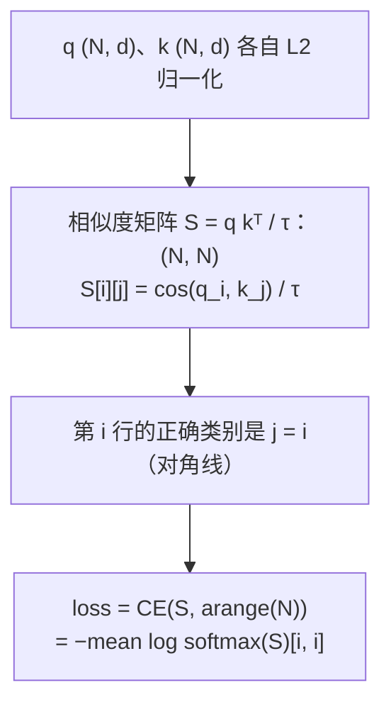
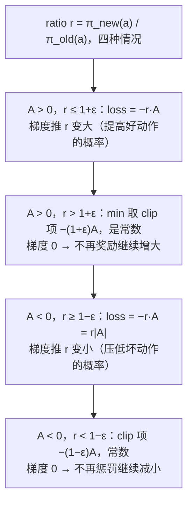

"写出 DPO 的损失函数""PPO 的 clipped objective 是什么""AdamW 一步更新怎么算"——这些题是算法岗面试的第二梯队手撕题，考的是**能不能把论文里的公式落成十行正确的代码**。它们的共同难点是细节：label smoothing 平滑的是哪个分布、KL 的两个参数谁是 target、DPO 的四个 log 概率怎么组合、GAE 的递推从哪一端开始、AdamW 的 weight decay 为什么不进动量、LoRA 的 B 为什么初始化为零。这一篇每个组件给出实现、与 PyTorch（或 trl 的公式）对拍、以及面试官会追的一两个"为什么"。

推导与动机在算法地图：损失与优化器见[深度学习基础（03）](/optimizers-from-sgd-to-adamw.html)，PPO / GRPO 见[后训练（03）](/online-rl-ppo-grpo-and-the-rlhf-trio.html)，DPO 见[（04）](/offline-rl-dpo-and-its-family.html)，LoRA 见 [Transformer 与 LLM（07）](/quantization-speculative-decoding-and-lora.html)。

本篇要回答的核心问题是：

> **DPO 的损失只用四个序列 log 概率，它们怎样组合、$$\beta$$ 起什么作用？[^q0] GAE 的递推为什么从轨迹末尾往前算、$$\lambda$$ 在偏差与方差之间怎么调？[^q1] AdamW 与"Adam + L2 正则"的区别在代码的哪一行？[^q2]**

## 一、面试怎么出题

| 出题方式 | 考点 | 追问 |
|---|---|---|
| "写交叉熵，支持 label smoothing 和 ignore_index" | log-softmax、目标分布、mask | 平滑为什么能防过拟合？ |
| "写 KL 散度" | 方向、log 域输入 | 前向 KL 与反向 KL 的区别？蒸馏用哪个？ |
| "写 InfoNCE" | 相似度矩阵 + 对角线为正样本 | 温度的作用？batch 大小的影响？ |
| "写 DPO 损失" | 四个 log 概率、$$\beta$$、sigmoid | 为什么不需要 reward model？ |
| "写 GAE 和 PPO 的 clipped loss" | 反向递推、ratio、clip | 为什么 clip 而不是 KL 惩罚？ |
| "GRPO 的优势怎么算" | 组内标准化 | 为什么不需要 critic？ |
| "写 AdamW 的一步" | 一二阶矩、偏差修正、解耦衰减 | 为什么要偏差修正？ |
| "写 cosine + warmup 调度" | 分段函数 | warmup 为什么必要？ |
| "写梯度裁剪" | 全局范数 | 按值裁剪与按范数裁剪的区别？ |
| "写 LoRA 层" | 低秩分解、缩放、合并 | B 为什么初始化为 0？推理时怎么零开销？ |

## 二、分类与蒸馏损失

### 1. 交叉熵

```python
def cross_entropy(logits, targets, label_smoothing=0.0, ignore_index=-100):
    mask = targets != ignore_index                               # SFT 里 prompt 部分的 loss mask
    lp = log_softmax(logits[mask])
    t = targets[mask]
    nll = -lp[np.arange(len(t)), t]
    if label_smoothing == 0:
        return nll.mean()
    smooth = -lp.mean(-1)                                        # 对均匀分布的交叉熵
    return ((1 - label_smoothing) * nll + label_smoothing * smooth).mean()
```

**label smoothing 平滑的是目标分布**：把 one-hot 换成 $$(1 - \epsilon) \cdot \text{onehot} + \epsilon / C$$，损失变成 $$(1 - \epsilon) \cdot \text{NLL} + \epsilon \cdot \text{CE}(\text{uniform})$$。它阻止 logits 无限拉大（one-hot 的最优解是 $$z_y \to \infty$$），是一种正则。**ignore_index** 是 SFT 的 loss mask 机制：把 prompt 位置的 target 设成 −100，只在回答 token 上算损失。与 `F.cross_entropy(label_smoothing=ε, ignore_index=-100)` 对拍到 $$10^{-10}$$。

### 2. KL 散度

```python
def kl_div(log_p, log_q):                                        # KL(p || q)
    p = np.exp(log_p)
    return (p * (log_p - log_q)).sum(-1).mean()
```

**方向**：$$\text{KL}(p \| q) = \sum p \log(p / q)$$，$$p$$ 是"真"分布（teacher / 参考）、$$q$$ 是被优化的分布（student / policy）。蒸馏用前向 KL（teacher 在前）：student 要覆盖 teacher 的所有模式；RLHF 的 KL 惩罚通常是 $$\text{KL}(\pi \| \pi_\text{ref})$$（policy 在前，反向），只惩罚 policy 偏离参考的地方。PyTorch 的 `F.kl_div(input, target)` 参数顺序是 **(log q, p)**——与数学记法相反，对拍时要 `log_target=True, reduction="batchmean"`。

### 3. 数值稳定的 BCE 与 focal loss

```python
def binary_cross_entropy_with_logits(z, y):
    return (np.maximum(z, 0) - z * y + np.log1p(np.exp(-np.abs(z)))).mean()   # 不先算 sigmoid

def focal_loss(logits, targets, gamma=2.0):
    lp = log_softmax(logits)[np.arange(len(targets)), targets]
    p = np.exp(lp)
    return (-(1 - p) ** gamma * lp).mean()                       # 容易的样本（p 大）权重小
```

BCE 直接 `log(sigmoid(z))` 在 $$z \ll 0$$ 时下溢；恒等式 $$-\log \sigma(z) = \max(z, 0) - zy + \log(1 + e^{-\lvert z \rvert})$$ 全程稳定。

## 三、对比学习：InfoNCE

$$N$$ 对 $$(q_i, k_i)$$，第 $$i$$ 个 query 的正样本是 $$k_i$$、负样本是其他 $$N - 1$$ 个 $$k$$。损失就是**相似度矩阵上的交叉熵，标签是对角线**：

```python
def info_nce(q, k, temperature=0.07):                            # q, k 已 L2 归一化
    logits = q @ k.T / temperature                               # (N, N)
    return cross_entropy(logits, np.arange(len(q)))
```



**温度 $$\tau$$**：余弦相似度在 $$[-1, 1]$$，直接 softmax 太平；除以 $$\tau = 0.07$$ 把范围拉到 $$[-14, 14]$$，让难负样本的梯度更大。**batch 大小**：负样本数 $$= N - 1$$，越大越接近真实分布，所以对比学习偏爱大 batch（或 MoCo 的队列）。随机基线是 $$\ln N$$；配套脚本里正负样本噪声从 1.0 降到 0.05，loss 从 2.11（≈ $$\ln 8$$）降到 0.0008。CLIP 是双向版本：行方向 + 列方向各算一次取平均。

## 四、偏好与 RL

### 1. DPO

```python
def dpo_loss(logp_chosen, logp_rejected, ref_logp_chosen, ref_logp_rejected, beta=0.1):
    margin = beta * ((logp_chosen - ref_logp_chosen) - (logp_rejected - ref_logp_rejected))
    return -np.log(1 / (1 + np.exp(-margin))).mean()             # -log sigmoid(margin)
```

四个量都是**序列级 log 概率**（每个 token 的 log prob 求和）：policy 对 chosen / rejected、reference 对 chosen / rejected。组合方式：先各自减去 reference（得到"相对 reference 的提升"），再 chosen 减 rejected，乘 $$\beta$$，过 $$-\log\sigma$$。

**直觉**：$$\beta(\log\frac{\pi(y)}{\pi_\text{ref}(y)})$$ 就是 DPO 推导里隐式的 reward；损失让 chosen 的隐式 reward 高于 rejected——是 Bradley–Terry 偏好模型的负对数似然。**$$\beta$$** 控制偏离 reference 的代价：$$\beta$$ 大，很小的 log 比差异就饱和 sigmoid，policy 不敢离 reference 太远；$$\beta$$ 小则反之。初始时四个量两两相等，margin = 0，loss = $$\ln 2 = 0.693$$——配套脚本第一行正是这个数，是检查实现的好基准。与 trl 的 `sigmoid` loss `-F.logsigmoid(beta * logits)` 对拍一致。

### 2. GAE

```python
def gae(rewards, values, gamma=0.99, lam=0.95):                  # values 长 T+1，末尾是 bootstrap
    T = len(rewards)
    adv = np.zeros(T)
    last = 0.0
    for t in reversed(range(T)):                                 # 从末尾往前
        delta = rewards[t] + gamma * values[t + 1] - values[t]   # TD 误差
        last = delta + gamma * lam * last
        adv[t] = last
    return adv, adv + values[:-1]                                # (advantages, returns)
```

$$A_t = \sum_{l \ge 0} (\gamma\lambda)^l \delta_{t+l}$$ 是无穷级数，但可以写成递推 $$A_t = \delta_t + \gamma\lambda A_{t+1}$$——所以**必须从轨迹末尾往前算**（$$A_T = 0$$ 或用 bootstrap）。$$\lambda = 0$$ 时 $$A_t = \delta_t$$（一步 TD：低方差高偏差）；$$\lambda = 1$$ 时 $$A_t = \sum \gamma^l r_{t+l} - V_t$$（蒙特卡洛回报：无偏高方差）。0.95 是常用折中。配套脚本把递推结果与显式级数逐项相加对拍。

### 3. PPO clipped objective

```python
def ppo_clip_loss(logp_new, logp_old, adv, eps=0.2):
    ratio = np.exp(logp_new - logp_old)                          # π_new / π_old
    return -np.minimum(ratio * adv, np.clip(ratio, 1 - eps, 1 + eps) * adv).mean()
```



**为什么是 min 而不是直接 clip**：`min` 让 clip 只在"改进方向越界"时生效——$$A > 0$$ 且 $$r$$ 已经大于 $$1 + \epsilon$$ 时不再给梯度（防止一步走太远），但 $$A > 0$$ 且 $$r < 1 - \epsilon$$ 时仍用原始项（允许把过低的概率拉回来）。是一个**悲观下界**。配套脚本：$$A = 1$$，`ratio` 从 1.0 到 1.65，loss 在 $$-1.2$$ 处截平。

### 4. GRPO

```python
def grpo_advantages(rewards):                                    # 同一 prompt 的 G 个回答
    return (rewards - rewards.mean()) / (rewards.std() + 1e-8)
```

GRPO 用**组内标准化**代替 critic：对同一个 prompt 采 $$G$$ 个回答，每个回答的优势是它的 reward 相对组内均值的 z-score。省掉 value 网络（等于省一个和 policy 同大小的模型），代价是每个 prompt 要采多个样本。优势对序列内所有 token 相同。之后仍用 PPO 的 clipped objective（加 KL 惩罚）。

## 五、优化器与调度

### 1. AdamW

```python
class AdamW:
    def step(self, grads):
        self.t += 1
        for k in self.p:
            g = grads[k]
            self.m[k] = self.b1 * self.m[k] + (1 - self.b1) * g              # 一阶矩（动量）
            self.v[k] = self.b2 * self.v[k] + (1 - self.b2) * g * g          # 二阶矩
            m_hat = self.m[k] / (1 - self.b1 ** self.t)                      # 偏差修正
            v_hat = self.v[k] / (1 - self.b2 ** self.t)
            self.p[k] -= self.lr * (m_hat / (np.sqrt(v_hat) + self.eps) + self.wd * self.p[k])
```

**偏差修正**：$$m$$、$$v$$ 从 0 初始化，前几步的估计偏小（第一步 $$m_1 = 0.1 g$$）；除以 $$1 - \beta^t$$ 修正，$$t$$ 大时趋于 1。**AdamW 与 Adam + L2 的区别在最后一行**：L2 正则是把 $$\lambda\theta$$ 加到梯度 $$g$$ 里、再进 $$m$$ 和 $$v$$——衰减项会被 $$\sqrt{v}$$ 归一化，梯度大的参数几乎不衰减；AdamW 把 $$\lambda\theta$$ **直接**加在更新里（解耦），每个参数按同样的比例衰减。与 `torch.optim.AdamW` 同初值同梯度序列 10 步对拍，误差 $$10^{-12}$$。

**每参数的状态**：$$m$$、$$v$$ 各一份 fp32 → 每个参数 8 字节优化器状态，加上 fp32 主权重 4 字节、梯度 2–4 字节，训练时每参数 16 字节左右——这是 7B 模型全参数训练要 112 GB 以上显存的来源。

### 2. cosine + warmup

```python
def cosine_with_warmup(step, warmup, total, lr_max, lr_min=0.0):
    if step < warmup:
        return lr_max * (step + 1) / warmup                      # 线性升
    progress = (step - warmup) / max(1, total - warmup)
    return lr_min + 0.5 * (lr_max - lr_min) * (1 + math.cos(math.pi * min(1.0, progress)))
```

**warmup 为什么必要**：Adam 初期二阶矩估计不准（偏差修正只能部分补救），大学习率下前几步更新方向噪声大，容易把预训练权重打乱；线性升让统计量先稳定。**cosine** 让学习率平滑降到 0（或 `lr_min`），末期小步长收敛到更平的极小值。

### 3. 梯度裁剪

```python
def clip_grad_norm(grads, max_norm):
    total = math.sqrt(sum((g * g).sum() for g in grads.values()))   # 所有参数拼成一个向量的 L2 范数
    if total > max_norm:
        scale = max_norm / (total + 1e-6)
        for k in grads:
            grads[k] *= scale
    return total
```

**按范数**（这里）保持梯度方向、只缩放长度，是 Transformer 训练的标准；**按值**（`clip(g, -c, c)`）逐元素截断会改变方向，RNN 时代常用。`clip_grad_norm_` 返回裁剪前的范数——它是训练监控的重要指标（loss spike 前范数常先飙升）。

## 六、LoRA

```python
class LoRALinear:
    def __init__(self, w, r, alpha, rng):
        self.w = w                                               # 冻结
        self.a = rng.standard_normal((w.shape[0], r)) / math.sqrt(r)   # (in, r) 随机
        self.b = np.zeros((r, w.shape[1]))                       # (r, out) 零初始化
        self.scale = alpha / r

    def forward(self, x):
        return x @ self.w + self.scale * (x @ self.a) @ self.b   # 先 x@A 再 @B：O(in·r + r·out)

    def merge(self):
        return self.w + self.scale * self.a @ self.b             # 推理时合并，零额外开销
```

**B 为什么初始化为 0**：让 $$\Delta W = AB = 0$$，训练开始时模型与原模型完全一致（A、B 都随机会让初始输出被噪声破坏）。A 随机保证梯度不为零（若 A、B 都是 0，$$\partial L / \partial B = A^\top(\cdot) = 0$$，永远学不动）。**计算顺序**：`(x @ A) @ B` 是 $$O(\text{in} \cdot r + r \cdot \text{out})$$，`x @ (A @ B)` 要先算出 $$\text{in} \times \text{out}$$ 的矩阵，失去了低秩的好处。**alpha / r**：让不同 $$r$$ 下更新的尺度相近，调 $$r$$ 时不用重调学习率。参数量 $$r(\text{in} + \text{out})$$ vs $$\text{in} \cdot \text{out}$$；配套例子 $$8 \times 6$$ 的矩阵、$$r = 2$$：28 vs 48（真实场景 $$4096^2$$、$$r = 16$$：0.8%）。

## 七、与参考实现对拍

`losses_training.py --check`：

| 我的实现 | 参考 |
|---|---|
| `cross_entropy(label_smoothing, ignore_index)` | `F.cross_entropy(..., label_smoothing=ε, ignore_index=-100)` |
| `kl_div` | `F.kl_div(log_q, log_p, log_target=True, reduction="batchmean")` |
| `binary_cross_entropy_with_logits` | `F.binary_cross_entropy_with_logits` |
| `info_nce` | `F.cross_entropy(q @ k.T / τ, arange(N))` |
| `dpo_loss` | `-F.logsigmoid(β · logits).mean()`（trl 的 sigmoid loss） |
| `gae` | 显式级数 $$\sum (\gamma\lambda)^l \delta_{t+l}$$ |
| `ppo_clip_loss` | 区间内 $$= -rA$$；越界 $$= -(1 \pm \epsilon) A$$ |
| `AdamW` | `torch.optim.AdamW` 同初值同梯度 10 步 |
| `clip_grad_norm` | `torch.nn.utils.clip_grad_norm_` |
| `LoRALinear.merge` | `forward` 与合并后的 `x @ W'` |

## 八、陷阱

| 陷阱 | 现象 | 修法 |
|---|---|---|
| `log(softmax(x))` | `-inf` | `log_softmax` |
| KL 的参数顺序 | 算成反向 KL | 数学 $$\text{KL}(p \| q)$$：$$p$$ 在前是 target；`F.kl_div(input=log q, target=p)` |
| label smoothing 平滑 logits | 不是正则 | 平滑目标分布 |
| ignore_index 用 0 | 把 token 0 的 loss 也丢了 | 用 −100 |
| DPO 忘减 reference | 变成纯 SFT 对比，policy 漂移 | 四项都要 |
| DPO 用 token 平均而不是求和 | 长短回答不可比、与推导不符 | 序列 log prob 求和（有变体用平均，要说明） |
| GAE 正向递推 | 结果错 | `reversed(range(T))` |
| PPO 用 `clip(ratio) * adv` 不取 min | 失去悲观下界 | `min(rA, clip(r)A)` |
| Adam 忘偏差修正 | 前几步步长偏小 | 除 $$1 - \beta^t$$ |
| weight decay 加进梯度 | 变成 L2 正则（Adam 下无效） | 解耦加在更新里 |
| LoRA 两个矩阵都随机 | 初始输出被破坏 | B 置零 |
| LoRA 先算 `A @ B` | 失去低秩收益 | `(x @ A) @ B` |
| cosine 忘 `min(1, progress)` | 训练超出 total 步后 lr 回升 | 截断 |

## 九、常见追问

| 追问 | 要点 |
|---|---|
| 为什么 SFT 只在回答上算 loss？ | prompt 是给定的条件，让模型学预测它没有意义、还会稀释信号 |
| DPO 相对 RLHF-PPO 的优缺点？ | 不需要 reward model 与在线采样、稳定、便宜；但离线数据无法探索、易过拟合偏好数据、reference 固定 |
| PPO 里 KL 惩罚与 clip 都需要吗？ | clip 限制每步的 policy 变化，KL 限制与 reference 的总偏离；RLHF 通常两者都有 |
| GRPO 为什么对推理任务有效？ | 可验证奖励（对 / 错）下，组内对比就是很好的 baseline；省掉 critic 让 RL 便宜一半 |
| Adam 的 $$\epsilon$$ 有什么用？ | 防除零、也决定小梯度参数的有效学习率；bf16 训练里常调大到 $$10^{-6}$$ |
| 为什么 LLM 训练 weight decay 只加在矩阵上？ | bias、LayerNorm 的 $$\gamma$$、embedding 通常不衰减；衰减它们没有正则意义且会伤性能 |
| warmup 多长？ | 预训练常 1–2% 总步数；微调几十到几百步 |
| LoRA 加在哪些矩阵上？ | 最初只 $$W_q, W_v$$；后来发现全部线性层（含 FFN）效果更好；$$r$$ 8–64 |
| QLoRA 是什么？ | 冻结权重量化到 4 bit（NF4）、LoRA 在 bf16 上训练，前向时反量化 |
| 梯度累积与 batch size 的关系？ | 累积 $$k$$ 步等价于 batch × $$k$$（loss 要除 $$k$$）；BatchNorm 除外 |

## 十、小结

| 组件 | 公式一句 | 关键行 |
|---|---|---|
| CE + smoothing | $$(1 - \epsilon)\text{NLL} + \epsilon\,\text{CE}(u)$$ | `smooth = -lp.mean(-1)` |
| KL | $$\sum p(\log p - \log q)$$ | 谁是 target |
| InfoNCE | $$\text{CE}(qk^\top / \tau, \text{diag})$$ | 温度 |
| DPO | $$-\log\sigma(\beta[(\pi_w - \pi^\text{ref}_w) - (\pi_l - \pi^\text{ref}_l)])$$ | 四项、初值 $$\ln 2$$ |
| GAE | $$A_t = \delta_t + \gamma\lambda A_{t+1}$$ | 反向递推 |
| PPO | $$-\min(rA, \text{clip}(r)A)$$ | min |
| GRPO | $$(r - \bar{r}) / \sigma_r$$ | 组内 |
| AdamW | $$\theta -= \eta(\hat{m}/(\sqrt{\hat{v}} + \epsilon) + \lambda\theta)$$ | 解耦的 $$\lambda\theta$$ |
| 裁剪 | $$g \leftarrow g \cdot \min(1, c / \|g\|)$$ | 全局范数 |
| LoRA | $$W + \frac{\alpha}{r} AB$$ | B = 0，`(xA)B` |

配套代码：[`coding-interview/ai/losses_training.py`](https://github.com/arganzheng/ai-learning-labs/blob/main/coding-interview/ai/losses_training.py)。

## 十一、自测

1. DPO 训练刚开始时 loss 是多少？训练一段时间后 loss 降到 0.1，此时 chosen 与 rejected 的隐式 reward 差大约多少（$$\beta = 0.1$$）？

   <details markdown="1">
   <summary>答案</summary>
   初始 policy = reference，四项两两相消，margin = 0，loss $$= -\log\sigma(0) = \ln 2 \approx 0.693$$。loss = 0.1 意味着 $$\sigma(\text{margin}) = e^{-0.1} \approx 0.905$$，margin $$= \ln(0.905 / 0.095) \approx 2.25$$；margin $$= \beta \cdot \Delta$$，所以 log 比之差 $$\Delta \approx 22.5$$——即 $$\log\frac{\pi(y_w)}{\pi_\text{ref}(y_w)} - \log\frac{\pi(y_l)}{\pi_\text{ref}(y_l)} \approx 22.5$$，对应序列概率比变化 $$e^{22.5}$$ 量级——DPO 的 $$\beta$$ 小时 policy 会大幅偏离 reference。详见[第四章第 1 节](#1-dpo)。
   </details>

2. 一条 3 步轨迹，$$r = [0, 0, 1]$$，$$V = [0.5, 0.5, 0.5, 0]$$（最后是 bootstrap），$$\gamma = 1$$。分别用 $$\lambda = 0$$ 和 $$\lambda = 1$$ 算 $$A$$。

   <details markdown="1">
   <summary>答案</summary>
   $$\delta = [0 + 0.5 - 0.5, 0 + 0.5 - 0.5, 1 + 0 - 0.5] = [0, 0, 0.5]$$。$$\lambda = 0$$：$$A = \delta = [0, 0, 0.5]$$——只有最后一步"知道"拿到了奖励。$$\lambda = 1$$：从后往前 $$A_2 = 0.5$$，$$A_1 = 0 + 0.5 = 0.5$$，$$A_0 = 0 + 0.5 = 0.5$$——奖励信号传遍整条轨迹（等于 MC 回报 $$1 - V_t = 0.5$$）。$$\lambda$$ 控制信号往前传多远。详见[第四章第 2 节](#2-gae)。
   </details>

3. AdamW 第一步（$$t = 1$$）、梯度 $$g$$、无 weight decay，参数更新量是多少？和 SGD 比呢？

   <details markdown="1">
   <summary>答案</summary>
   $$m_1 = (1 - \beta_1) g$$，$$\hat{m}_1 = g$$；$$v_1 = (1 - \beta_2) g^2$$，$$\hat{v}_1 = g^2$$；更新 $$= \eta \cdot g / (\lvert g \rvert + \epsilon) \approx \eta \cdot \text{sign}(g)$$。第一步 Adam 每个参数都移动约 $$\eta$$（与梯度大小无关，只看符号）；SGD 移动 $$\eta g$$。这是 Adam 需要 warmup 的直观原因：初期它对所有参数一视同仁地迈满步。详见[第五章第 1 节](#1-adamw)。
   </details>

4. `clip_grad_norm` 的 `max_norm = 1.0`，两个参数的梯度分别是 `[3, 4]` 和 `[0]`。裁剪后各是多少？如果改成按值裁剪到 $$[-1, 1]$$ 呢？

   <details markdown="1">
   <summary>答案</summary>
   全局范数 $$\sqrt{9 + 16} = 5$$，scale $$= 1/5$$，裁剪后 `[0.6, 0.8]` 与 `[0]`——方向不变，范数 1。按值裁剪：`[1, 1]` 与 `[0]`——方向从 $$(3, 4)$$ 变成 $$(1, 1)$$，范数 $$\sqrt{2}$$。按范数保方向，是 Transformer 训练的标准。详见[第五章第 3 节](#3-梯度裁剪)。
   </details>

5. LoRA 的 $$W$$ 是 $$4096 \times 4096$$，$$r = 16$$，$$\alpha = 32$$。（a）可训练参数是全量的百分之几？（b）`forward` 里 LoRA 分支多算多少 FLOPs（相对主分支）？（c）如果误写成 `x @ (A @ B)`，多算多少？

   <details markdown="1">
   <summary>答案</summary>
   （a）$$r(\text{in} + \text{out}) = 16 \times 8192 = 131{,}072$$，全量 $$16.8$$M，0.78%。（b）主分支每 token $$2 \times 4096^2 = 33.6$$M FLOPs；LoRA 分支 $$2 \times 4096 \times 16 + 2 \times 16 \times 4096 = 262$$K，多 0.78%。（c）先算 $$AB$$：$$2 \times 4096 \times 16 \times 4096 = 537$$M FLOPs（比主分支还多 16 倍），再 $$x @ (AB)$$ 又 33.6M——完全失去低秩的意义（除非像推理时那样只合并一次）。详见[第六章](#六lora)。
   </details>

## 下一篇

[手撕经典 ML 与评测指标](/coding-interview-classical-ml-and-metrics.html)

[^q0]: 四个序列级 log 概率：policy 与 reference 各对 chosen（$$y_w$$）与 rejected（$$y_l$$）。先各自减 reference 得到"相对提升" $$\log\frac{\pi(y)}{\pi_\text{ref}(y)}$$（这是 DPO 推导出的隐式 reward，差一个常数），再 chosen 减 rejected，乘 $$\beta$$，过 $$-\log\sigma$$——就是 Bradley–Terry 偏好模型的负对数似然。$$\beta$$ 是隐式 reward 的温度，也是偏离 reference 的代价：$$\beta$$ 大时很小的 log 比差就饱和 sigmoid，policy 不敢离 reference 太远。初值 $$\ln 2$$ 是实现自检的基准。详见[第四章第 1 节](#1-dpo)。

[^q1]: $$A_t = \sum_{l \ge 0}(\gamma\lambda)^l \delta_{t+l}$$ 依赖 $$t$$ 之后所有的 TD 误差，写成递推 $$A_t = \delta_t + \gamma\lambda A_{t+1}$$ 后只能从末尾（$$A_T = 0$$）往前算，每步 $$O(1)$$。$$\lambda = 0$$ 时 $$A_t = \delta_t$$：只用一步的 TD 误差，方差低但依赖 $$V$$ 的准确性（偏差高）；$$\lambda = 1$$ 时 $$A_t = \sum \gamma^l r_{t+l} - V_t$$：蒙特卡洛回报，无偏但方差高（依赖整条轨迹的随机性）。0.9–0.97 是常用折中，奖励稀疏、轨迹长时倾向更大的 $$\lambda$$ 让信号传得更远。详见[第四章第 2 节](#2-gae)。

[^q2]: 在最后一行更新里：AdamW 是 `p -= lr * (m_hat / (sqrt(v_hat) + eps) + wd * p)`——衰减项 $$\lambda\theta$$ 直接加在更新量里，不经过 $$m$$、$$v$$。"Adam + L2"是把 $$\lambda\theta$$ 加进梯度 `g = g + wd * p` 再算 $$m$$、$$v$$，衰减项会被 $$\sqrt{\hat{v}}$$ 归一化——梯度大的参数（$$v$$ 大）几乎不衰减，梯度小的参数衰减过头，正则效果与参数的梯度尺度耦合。解耦后每个参数按同一比例 $$\eta\lambda$$ 衰减，这是 Loshchilov & Hutter 提出 AdamW 的原因，也是 LLM 训练的默认选择。详见[第五章第 1 节](#1-adamw)。
