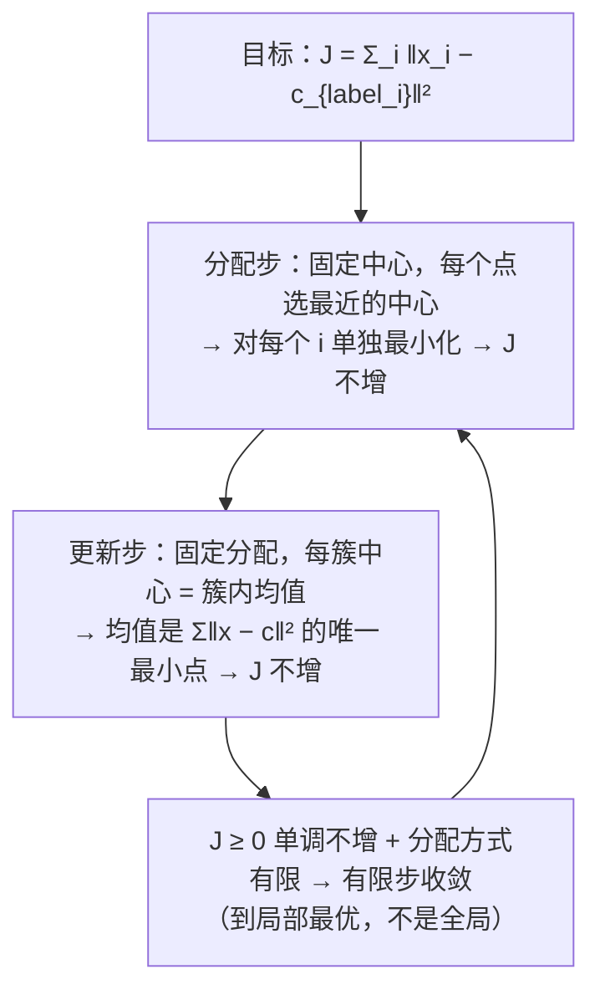
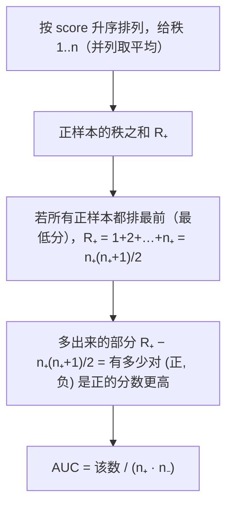
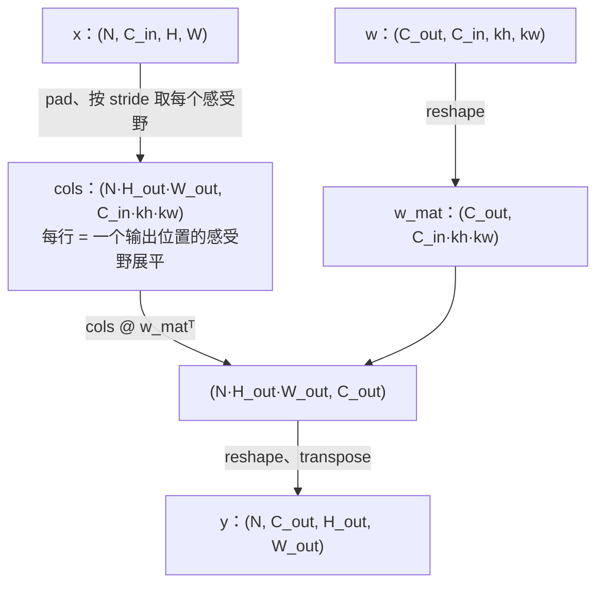

LLM 时代的面试仍然会让你手写 k-means、逻辑回归、PCA——不是因为工作里要用它们，而是它们十行代码就能暴露一个人对"模型 = 目标函数 + 优化"的理解是否到位。评测指标是另一类高频手撕：AUC 怎么在 $$O(n \log n)$$ 内算、NDCG 的折扣是什么、F1 在类别极不平衡时为什么比准确率靠谱。CV 相关岗位再加两道：用 im2col 把卷积写成矩阵乘、NMS。这一篇每个组件给出面试够用的实现和一个能说清的"为什么"。

原理在算法地图 [L2 经典机器学习](/classical-machine-learning-in-the-llm-era.html)与[后训练（08）评测](/evaluating-llms-benchmarks-judges-and-contamination.html)；卷积见[深度学习基础（05）](/cnn-from-lenet-to-resnet-and-vit.html)。

本篇要回答的核心问题是：

> **k-means 的两步各在优化什么、为什么一定收敛？[^q0] AUC 为什么等于"随机一对正负样本排对的概率"，怎样用排序 $$O(n \log n)$$ 算出来？[^q1] im2col 把卷积变成矩阵乘，展开后的矩阵形状是什么、代价是什么？[^q2]**

## 一、面试怎么出题

| 出题方式 | 考点 | 追问 |
|---|---|---|
| "写 k-means" | 分配 / 更新两步、初始化 | 为什么收敛？怎么选 k？k-means++ 是什么？ |
| "写逻辑回归的梯度下降" | sigmoid、梯度 $$X^\top(p - y)/n$$ | 为什么梯度这么简单？L2 正则加在哪？ |
| "写 KNN" | 距离、Top-K、投票 | 复杂度？k 怎么选？维度灾难？ |
| "写 PCA" | 中心化、SVD、投影 | 为什么用 SVD 而不是特征分解？方差解释比？ |
| "写 P / R / F1 / AUC" | 混淆矩阵、秩统计 | 类别不平衡时看哪个？AUC 与 PR-AUC？ |
| "写 NDCG@k" | 折扣、增益、理想排序 | 为什么用 $$2^{rel} - 1$$？与 MRR 的区别？ |
| "写 conv2d" | im2col、输出尺寸公式 | 参数量？FLOPs？为什么 GPU 上这样做？ |
| "写 NMS / IoU" | 排序 + 抑制 | 复杂度？soft-NMS？ |

## 二、经典模型

### 1. k-means

```python
def kmeans(X, k, iters, rng):
    centers = X[rng.integers(len(X))][None]
    for _ in range(1, k):                                        # k-means++：按 D² 概率选下一个中心
        d2 = ((X[:, None, :] - centers[None]) ** 2).sum(-1).min(1)
        centers = np.vstack([centers, X[rng.choice(len(X), p=d2 / d2.sum())]])
    for _ in range(iters):
        d2 = ((X[:, None, :] - centers[None]) ** 2).sum(-1)     # (n, k) 到每个中心的距离
        labels = d2.argmin(1)                                    # E 步：分配到最近中心
        new = np.array([X[labels == j].mean(0) if (labels == j).any() else centers[j]
                        for j in range(k)])                      # M 步：中心 = 簇均值；空簇保留旧中心
        if np.allclose(new, centers):
            break
        centers = new
    return centers, labels
```



**k-means++** 让初始中心彼此远离（按到已选中心距离平方的概率抽），比随机初始化稳定得多，`sklearn` 默认用它。**空簇**：某轮没有点分给某个中心时保留旧中心（或重新随机），否则 `mean` 得到 `nan`。**选 k**：肘部法（$$J$$ 随 $$k$$ 的下降拐点）、轮廓系数；面试里说得出即可。配套脚本三团高斯点收敛到 `[0, 0.2] [2.7, 5.1] [5.9, 0.0]`，真值 `[0,0] [3,5] [6,0]`。

### 2. 逻辑回归

```python
def logistic_regression(X, y, lr, steps, l2=0.0):
    n, d = X.shape
    w, b = np.zeros(d), 0.0
    for _ in range(steps):
        p = sigmoid(X @ w + b)
        g = p - y                                                # ∂L/∂z，与 softmax-CE 同型
        w -= lr * (X.T @ g / n + l2 * w)
        b -= lr * g.mean()
    return w, b
```

**梯度为什么是 $$X^\top(p - y) / n$$**：BCE 对 logit $$z$$ 的导数是 $$p - y$$（上一篇 softmax-CE 的二分类版），链式法则乘 $$\partial z / \partial w = x$$。**L2 正则**加在 $$w$$ 上、不加在 $$b$$ 上。与 torch 用 `binary_cross_entropy_with_logits` + 手动 GD 同步数同学习率对拍，参数误差 $$10^{-10}$$。

**追问**：*为什么不用闭式解*——逻辑回归没有闭式解（线性回归有 $$(X^\top X)^{-1} X^\top y$$）；牛顿法（IRLS）二阶收敛快但每步 $$O(d^3)$$。*多分类*——softmax 回归，梯度 $$X^\top(P - Y) / n$$。

### 3. KNN

```python
def knn_predict(X_train, y_train, x, k):
    heap = []                                                    # 大小 k 的最大堆（存负距离）
    for xi, yi in zip(X_train, y_train):
        d = ((xi - x) ** 2).sum()
        if len(heap) < k:
            heapq.heappush(heap, (-d, int(yi)))
        elif -d > heap[0][0]:
            heapq.heapreplace(heap, (-d, int(yi)))
    return int(np.bincount([yi for _, yi in heap]).argmax())
```

08 篇的"大小为 k 的堆"直接复用：$$O(n \log k)$$ 找最近的 $$k$$ 个，多数投票。没有训练过程（懒惰学习），预测 $$O(nd)$$——大数据集上要 KD-tree / 球树（低维）或近似最近邻（HNSW、IVF，高维——向量检索就是它）。**k 的选择**：小 k 方差大（受噪声影响）、大 k 偏差大（边界模糊）；奇数避免平票。**维度灾难**：高维下所有点距离趋于相同，KNN 失效——这是嵌入要降维、检索要学习度量的原因。

### 4. PCA

```python
def pca(X, n_components):
    Xc = X - X.mean(0)                                           # 必须中心化
    _, S, Vt = np.linalg.svd(Xc, full_matrices=False)           # X_c = U S Vᵀ
    comps = Vt[:n_components]                                    # 主成分 = 右奇异向量
    var_ratio = S[:n_components] ** 2 / (S ** 2).sum()           # 方差解释比 = 奇异值平方占比
    return Xc @ comps.T, comps, var_ratio
```

**为什么 SVD 而不是协方差矩阵的特征分解**：协方差 $$\frac{1}{n-1} X_c^\top X_c = V \frac{S^2}{n-1} V^\top$$，两者数学等价；但直接对 $$X_c$$ 做 SVD 不需要显式构造 $$d \times d$$ 协方差（$$d$$ 大时省内存），且数值上更稳（不平方条件数）。**必须中心化**：不减均值时第一主成分会指向数据的均值方向而不是方差最大方向。配套脚本：把二维高斯沿 0.6 rad 拉伸，第一主成分 `[0.833, −0.553]`（真值 `±[0.825, −0.565]`），方差解释 `[0.975, 0.025]`；与协方差特征分解对拍子空间一致。

## 三、评测指标

### 1. 精确率、召回率、F1

```python
def precision_recall_f1(y_true, y_pred):
    tp = ((y_pred == 1) & (y_true == 1)).sum()
    fp = ((y_pred == 1) & (y_true == 0)).sum()
    fn = ((y_pred == 0) & (y_true == 1)).sum()
    p = tp / (tp + fp) if tp + fp else 0.0
    r = tp / (tp + fn) if tp + fn else 0.0
    f1 = 2 * p * r / (p + r) if p + r else 0.0                   # 调和平均
    return p, r, f1
```

**类别不平衡时**：99% 负样本，全预测负的准确率 99%，但召回 0、F1 0。F1 是 P、R 的调和平均——两者之一很低时 F1 就低，比算术平均严格。多分类的 macro-F1（各类 F1 平均）与 micro-F1（全局 TP/FP/FN）取舍：macro 让少数类有同等权重。

### 2. AUC

```python
def roc_auc(y_true, scores):
    order = np.argsort(scores)
    ranks = np.empty(len(scores))
    i = 0
    while i < len(scores):                                       # 并列分数取平均秩
        j = i
        while j + 1 < len(scores) and scores[order[j + 1]] == scores[order[i]]:
            j += 1
        ranks[order[i:j + 1]] = (i + j) / 2 + 1
        i = j + 1
    n_pos = y_true.sum(); n_neg = len(y_true) - n_pos
    return (ranks[y_true == 1].sum() - n_pos * (n_pos + 1) / 2) / (n_pos * n_neg)
```

**AUC = 随机一个正样本得分高于随机一个负样本的概率**（ROC 曲线下面积的另一种解释，Mann–Whitney U 统计量）。定义式是 $$O(n_+ n_-)$$ 双重循环；**秩法**：按分数排序后，每个正样本的秩减去它前面的正样本数就是"排在它下面的负样本数"，$$\sum_{\text{pos}} \text{rank} - \frac{n_+(n_+ + 1)}{2}$$ 是所有"正 > 负"对的个数，除以 $$n_+ n_-$$。并列分数算 0.5，对应取平均秩。配套脚本 20 组含大量并列的随机数据，秩法与 $$O(n^2)$$ 定义式误差 $$10^{-12}$$。



**追问**：*AUC 与 PR-AUC*——ROC 在负样本极多时对 FP 不敏感（FPR 分母大），PR 曲线更能反映少数类；欺诈、检索类任务看 PR-AUC。*AUC 的不足*——它只看排序、不看校准（概率值是否可信），阈值相关的指标要另看。

### 3. NDCG

```python
def ndcg_at_k(relevance, k):                                     # relevance 按模型排序给出
    rel = relevance[:k]
    discounts = 1 / np.log2(np.arange(2, len(rel) + 2))          # 1/log2(i+1)，i 从 1 起
    dcg = ((2 ** rel - 1) * discounts).sum()
    ideal = np.sort(relevance)[::-1][:k]
    idcg = ((2 ** ideal - 1) * discounts[:len(ideal)]).sum()
    return dcg / idcg if idcg > 0 else 0.0
```

**三个部件**：增益 $$2^{rel} - 1$$（让高相关的文档权重指数级更大；线性增益 $$rel$$ 也常用）、位置折扣 $$1 / \log_2(i + 1)$$（第 1 位不折、第 2 位 0.63、第 10 位 0.29）、除以理想排序的 DCG 归一化到 $$[0, 1]$$。配套例子 `[3, 2, 3, 0, 1, 2]` 的 NDCG@5 = 0.876——把第三位的 3 换到第二位就是 1.0。**MRR** 只看第一个相关结果的位置（$$1 / \text{rank}$$），适合"只要一个正确答案"的场景；NDCG 适合多相关文档、分级相关度。RAG 的检索评测两者都常报。

## 四、卷积、池化与 NMS

### 1. conv2d via im2col

卷积的每个输出位置是"感受野与核的内积"，把所有感受野展平成行、核展平成列，卷积就是一次矩阵乘——GPU 上 GEMM 高度优化，这是 cuDNN 早期的实现方式。

```python
def im2col(x, kh, kw, stride, pad):                              # x: (N, C, H, W)
    N, C, H, W = x.shape
    xp = np.pad(x, ((0, 0), (0, 0), (pad, pad), (pad, pad)))
    H_out = (H + 2 * pad - kh) // stride + 1
    W_out = (W + 2 * pad - kw) // stride + 1
    cols = np.empty((N, H_out, W_out, C, kh, kw))
    for i in range(H_out):
        for j in range(W_out):
            cols[:, i, j] = xp[:, :, i * stride:i * stride + kh, j * stride:j * stride + kw]
    return cols.reshape(N * H_out * W_out, C * kh * kw), H_out, W_out

def conv2d(x, w, b=None, stride=1, pad=0):                       # w: (C_out, C_in, kh, kw)
    C_out = w.shape[0]
    cols, H_out, W_out = im2col(x, *w.shape[2:], stride, pad)    # (N·Ho·Wo, C_in·kh·kw)
    out = cols @ w.reshape(C_out, -1).T                          # (N·Ho·Wo, C_out)
    if b is not None:
        out += b
    return out.reshape(x.shape[0], H_out, W_out, C_out).transpose(0, 3, 1, 2)
```



**输出尺寸**：$$H_\text{out} = \lfloor (H + 2p - k) / s \rfloor + 1$$。**参数量**：$$C_\text{out} \cdot C_\text{in} \cdot k_h \cdot k_w + C_\text{out}$$（与输入尺寸无关——这是卷积的参数共享）。**FLOPs**：$$2 \cdot N \cdot H_\text{out} W_\text{out} \cdot C_\text{out} \cdot C_\text{in} k_h k_w$$。**代价**：`cols` 比 `x` 大 $$k_h k_w$$ 倍（重叠的感受野被复制），3×3 核多用 9 倍内存——现代实现用隐式 GEMM / Winograd / FFT 避开。与 `F.conv2d` 在三组 stride / pad 下对拍到 $$10^{-10}$$。

**max pooling** 同样滑窗，取 `max((2, 3))`；反向时梯度只流向最大值的位置。

### 2. IoU 与 NMS

```python
def iou(a, b):                                   # a: (4,)，b: (M, 4)，框是 [x1, y1, x2, y2]
    x1 = np.maximum(a[0], b[:, 0]); y1 = np.maximum(a[1], b[:, 1])
    x2 = np.minimum(a[2], b[:, 2]); y2 = np.minimum(a[3], b[:, 3])
    inter = np.clip(x2 - x1, 0, None) * np.clip(y2 - y1, 0, None)   # 不相交时 clip 到 0
    area_a = (a[2] - a[0]) * (a[3] - a[1])
    area_b = (b[:, 2] - b[:, 0]) * (b[:, 3] - b[:, 1])
    return inter / (area_a + area_b - inter)

def nms(boxes, scores, iou_thresh):
    order = np.argsort(-scores)
    keep = []
    while len(order):
        i = order[0]
        keep.append(int(i))                                      # 分数最高的一定保留
        if len(order) == 1:
            break
        ious = iou(boxes[i], boxes[order[1:]])
        order = order[1:][ious <= iou_thresh]                    # 压掉与它重叠过多的
    return keep
```

NMS 是贪心：每轮取剩余最高分的框、删掉与它 IoU 超过阈值的框。最坏 $$O(M^2)$$（所有框互不重叠时）。**soft-NMS** 不删而是按 IoU 衰减分数，缓解密集目标被误删。**IoU 的两个坑**：不相交时 `x2 - x1` 为负，要 clip 到 0；坐标是否含端点（像素坐标 +1）要与数据集约定一致。配套脚本与 `torchvision.ops.nms` 对拍（30 个随机框）。

## 五、与参考实现对拍

`classical_ml_metrics.py --check`：

| 我的实现 | 参考 |
|---|---|
| `conv2d`（三组 stride / pad）、`max_pool2d` | `F.conv2d`、`F.max_pool2d` |
| `roc_auc` | $$O(n^2)$$ 定义式，20 组含并列分数 |
| `pca` | 协方差矩阵的 `eigh`（子空间与方差解释比） |
| `nms` | `torchvision.ops.nms`（若已安装） |
| `logistic_regression` | torch 上同步数同 lr 的手动 GD |
| `precision_recall_f1`、`ndcg_at_k` | 手算小例子 |
| `knn_predict`（k = 1） | 最近邻的标签 |
| `kmeans` | 收敛后中心 = 簇均值（不动点） |

## 六、陷阱

| 陷阱 | 现象 | 修法 |
|---|---|---|
| k-means 空簇 | `mean` 得 `nan` | 保留旧中心或重随机 |
| k-means 随机初始化 | 结果随 seed 大幅变化 | k-means++ + 多次重启取最小 $$J$$ |
| PCA 不中心化 | 第一主成分指向均值 | 减均值 |
| PCA 对协方差做 `eig` 而非 `eigh` | 复数特征值、顺序乱 | 对称矩阵用 `eigh`，或直接 SVD |
| AUC 并列分数算 0 或 1 | 与定义不符 | 平均秩（算 0.5） |
| AUC 只有一类 | 除零 | 返回 `nan` 并说明 |
| F1 的 P、R 为 0 | 除零 | 特判 |
| NDCG 的折扣从 $$\log_2 1 = 0$$ 开始 | 除零 | $$\log_2(i + 1)$$，$$i$$ 从 1 |
| 输出尺寸公式忘 `+ 1` 或用 `ceil` | 形状不匹配 | `floor((H + 2p − k) / s) + 1` |
| im2col 后 `w` 的 reshape 顺序 | 结果全错 | `w.reshape(C_out, -1)` 与 `cols` 最后一维顺序一致（C, kh, kw） |
| IoU 不相交时为负 | 负 IoU | clip 到 0 |
| NMS 阈值语义 | `>` 还是 `>=` 压掉 | 与参考实现一致（torchvision 是 `>`） |
| 逻辑回归 L2 正则加在 bias 上 | 偏置被拉向 0 | 只正则 $$w$$ |

## 七、常见追问

| 追问 | 要点 |
|---|---|
| k-means 与 GMM / EM 的关系？ | k-means 是各向同性、等方差、硬分配的 GMM 的 EM |
| k-means 对什么数据不行？ | 非凸簇、大小差异大的簇、不同密度；用 DBSCAN / 谱聚类 |
| 逻辑回归为什么是线性模型？ | 决策边界 $$w^\top x + b = 0$$ 是超平面；非线性靠特征 |
| 生成式 vs 判别式？ | 朴素贝叶斯建模 $$p(x \mid y)$$，逻辑回归直接建模 $$p(y \mid x)$$ |
| PCA 与 SVD 的关系？ | PCA = 中心化数据的 SVD；奇异值平方 / $$(n-1)$$ = 主成分方差 |
| PCA 的局限？ | 线性、对尺度敏感（要标准化）、方差大不等于信息多 |
| 准确率、AUC、F1 各在什么时候用？ | 平衡数据看准确率；排序质量看 AUC；不平衡且关心少数类看 F1 / PR-AUC |
| 校准是什么？ | 预测 0.8 的样本里应有 80% 是正类；看 reliability diagram、ECE；温度缩放校准 |
| 卷积为什么参数少？ | 局部连接 + 权重共享；一个 3×3×64→64 的卷积 37K 参数，全连接同尺寸要几十亿 |
| 1×1 卷积干什么？ | 跨通道线性组合 = 每个像素上的全连接；用来升降维（bottleneck） |
| 为什么 NMS 要按类别分开做？ | 不同类的框重叠是正常的（人骑马）；class-wise NMS |

## 八、小结

| 组件 | 核心 | 复杂度 |
|---|---|---|
| k-means | 分配 → 均值，$$J$$ 单调不增 | $$O(nkd \cdot \text{iters})$$ |
| 逻辑回归 | $$w -= \eta X^\top(p - y) / n$$ | $$O(nd \cdot \text{steps})$$ |
| KNN | 大小 k 的堆 + 投票 | 预测 $$O(nd)$$ |
| PCA | 中心化 → SVD → 前 k 个右奇异向量 | $$O(nd^2)$$ |
| AUC | 正样本秩和 − $$n_+(n_+ + 1)/2$$，除 $$n_+ n_-$$ | $$O(n \log n)$$ |
| NDCG | $$\sum (2^{rel} - 1) / \log_2(i + 1)$$，除理想值 | $$O(k \log k)$$ |
| conv2d | im2col → GEMM | $$O(N H_o W_o C_o C_i k^2)$$ |
| NMS | 按分排序、贪心压制 | 最坏 $$O(M^2)$$ |

配套代码：[`coding-interview/ai/classical_ml_metrics.py`](https://github.com/arganzheng/ai-learning-labs/blob/main/coding-interview/ai/classical_ml_metrics.py)。

## 九、自测

1. k-means 的目标 $$J$$ 单调不增且有限步收敛——为什么"有限步"？它能保证全局最优吗？

   <details markdown="1">
   <summary>答案</summary>
   $$n$$ 个点分给 $$k$$ 个簇的分配方式有限（$$k^n$$ 种）；每次迭代 $$J$$ 严格下降或分配不变（不变即收敛），同一分配不可能重复出现（否则 $$J$$ 会回到之前的值，与严格下降矛盾），所以最多 $$k^n$$ 步停止。只保证局部最优：不同初始化收敛到不同的分配，$$J$$ 可能差很多——所以要 k-means++ 与多次重启。详见[第二章第 1 节](#1-k-means)。
   </details>

2. `scores = [0.9, 0.8, 0.8, 0.3]`，`y = [1, 0, 1, 0]`，手算 AUC。

   <details markdown="1">
   <summary>答案</summary>
   正负对：(0.9, 0.8) 正 > 负 ✓ 1；(0.9, 0.3) ✓ 1；(0.8, 0.8) 并列 0.5；(0.8, 0.3) ✓ 1。合计 3.5 / 4 = 0.875。秩法：升序 0.3 (1)、0.8、0.8（并列，平均秩 2.5）、0.9 (4)；正样本秩和 $$2.5 + 4 = 6.5$$，减 $$n_+(n_+ + 1)/2 = 3$$ 得 3.5，除 $$2 \times 2 = 4$$，0.875。一致。详见[第三章第 2 节](#2-auc)。
   </details>

3. 输入 $$224 \times 224 \times 3$$，卷积核 $$7 \times 7$$、64 个输出通道、stride 2、pad 3。输出尺寸、参数量、FLOPs 各是多少？

   <details markdown="1">
   <summary>答案</summary>
   $$H_\text{out} = \lfloor (224 + 6 - 7) / 2 \rfloor + 1 = 112$$。参数 $$64 \times 3 \times 49 + 64 = 9{,}472$$。FLOPs $$2 \times 112^2 \times 64 \times 3 \times 49 = 236$$M（ResNet 的第一层）。im2col 后的 `cols` 是 $$(12544, 147)$$，比输入（150K 个数）大 12 倍。详见[第四章第 1 节](#1-conv2d-via-im2col)。
   </details>

4. NDCG 的增益改成线性 $$rel$$（而不是 $$2^{rel} - 1$$），相关度 0/1/2/3 四档的相对权重怎么变？什么场景下更合适？

   <details markdown="1">
   <summary>答案</summary>
   指数增益 $$0, 1, 3, 7$$：最高档是次高档的 2.3 倍；线性 $$0, 1, 2, 3$$：1.5 倍。指数增益强调"把最相关的排最前"，适合网页搜索（用户只看前几个）；线性增益对各档一视同仁，适合推荐里多个"还不错"的结果同样有价值的场景。两者都是合法的 NDCG 定义，报数时要说明用的是哪个（`sklearn` 默认线性）。详见[第三章第 3 节](#3-ndcg)。
   </details>

5. PCA 前不做标准化（各特征除以标准差），一个特征单位是米、另一个是毫米，会发生什么？

   <details markdown="1">
   <summary>答案</summary>
   毫米那一维数值大一千倍、方差大一百万倍，第一主成分几乎完全沿着它——PCA 只是在"找方差最大的方向"，而方差随单位变化。标准化后每个特征方差为 1，主成分反映的是特征之间的相关结构而不是单位。何时不标准化：各特征本来同单位、且方差大小本身有意义（如像素强度）。详见[第二章第 4 节](#4-pca)。
   </details>

## 下一篇

[Infra 岗手撕：并发与系统](/coding-interview-infra-concurrency-and-systems.html)

[^q0]: 目标 $$J = \sum_i \\lvert x_i - c_{\text{label}_i}\ \rvert^2$$。分配步固定中心，让每个点选最近的中心——对每个 $$i$$ 单独最小化，$$J$$ 不增；更新步固定分配，让每簇中心等于簇内均值——均值是 $$\sum \\lvert x - c\ \rvert^2$$ 的唯一最小点，$$J$$ 不增。$$J \ge 0$$ 单调不增、分配方式有限且不会重复，所以有限步收敛——但只到局部最优，初始化决定落在哪个局部最优，故用 k-means++ 与多次重启。详见[第二章第 1 节](#1-k-means)。

[^q1]: ROC 曲线下面积等于 Mann–Whitney U 统计量归一化：随机取一个正样本和一个负样本，正的分数更高的概率（并列算 0.5）。按分数排序后给秩，正样本的秩和 $$R_+$$ 减去"所有正样本排最前时的秩和" $$n_+(n_+ + 1)/2$$，就是所有"正 > 负"对的个数（并列取平均秩自动给 0.5），除以 $$n_+ n_-$$。排序 $$O(n \log n)$$，比定义式的 $$O(n_+ n_-)$$ 双循环快得多。详见[第三章第 2 节](#2-auc)。

[^q2]: 把每个输出位置对应的感受野（$$C_\text{in} \times k_h \times k_w$$ 个数）展平成一行，所有位置堆成 `cols`：形状 $$(N \cdot H_\text{out} W_\text{out}, C_\text{in} k_h k_w)$$；核展平成 $$(C_\text{out}, C_\text{in} k_h k_w)$$；卷积 $$=$$ `cols @ w_mat.T`，再 reshape 回 $$(N, C_\text{out}, H_\text{out}, W_\text{out})$$。代价是内存：相邻感受野重叠，`cols` 比输入大约 $$k_h k_w / s^2$$ 倍（3×3、stride 1 时 9 倍），换来的是一次高度优化的 GEMM。现代实现（隐式 GEMM、Winograd）避开显式展开。详见[第四章第 1 节](#1-conv2d-via-im2col)。
