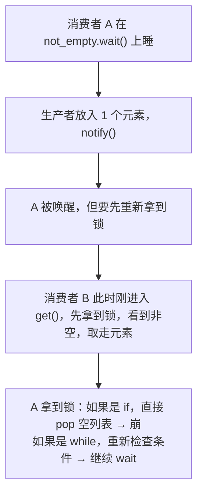
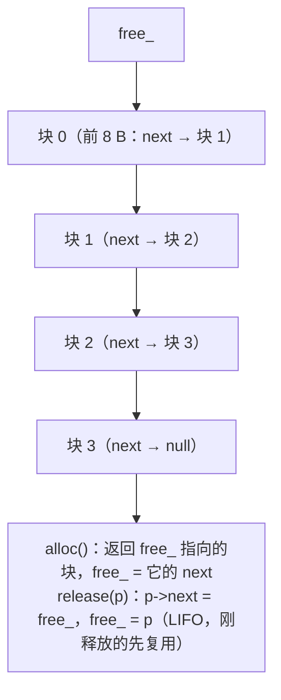
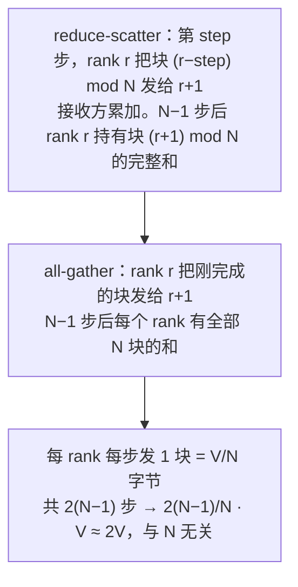
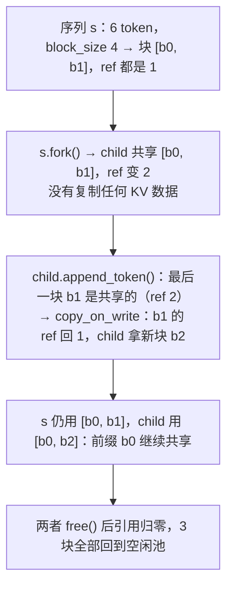

AI-Infra 岗的手撕题和算法岗不同：不考 DP，考**系统**——一把锁保护什么、条件变量为什么要 `while`、线程池的异常怎么传回、内存池的空闲链表放在哪、矩阵乘为什么换个循环顺序快十倍、ring allreduce 每个 rank 发多少字节、paged KV cache 的引用计数和 copy-on-write、令牌桶怎样用一个时间戳懒补充。这些题的代码都不长，但每一道背后都有一个"为什么这样设计"的追问，答得出来才算过。这一篇 Python 与 C++ 各自负责擅长的部分：并发原语、模拟与协议用 Python 讲清逻辑，内存池、GEMM、线程安全容器用 C++ 落到底。

系统层面的原理在 Infra 地图：并发见 [Python 在 AI-Infra（03）](/python-for-ai-infra.html)，内存与所有权见 [C++ 在 AI-Infra](/cpp-for-ai-infra.html)，allreduce 见[通信与互联](/communication-and-interconnect-for-ai-infra.html)，paged attention 见 [vLLM 系列](/deep-dive-into-vllm.html)。

本篇要回答的核心问题是：

> **条件变量的等待为什么必须写成 `while` 而不是 `if`？[^q0] ring allreduce 每个 rank 发送的数据量为什么与 rank 数无关？[^q1] paged KV cache 的 fork 为什么只加引用计数、写的时候才复制？[^q2]**

## 一、面试怎么出题

| 出题方式 | 语言 | 考点 | 追问 |
|---|---|---|---|
| "把 LRU 改成线程安全的" | Python / C++ | 锁的粒度、`get` 也要锁 | 缓存穿透（miss 时重复计算）怎么防？读多写少能否优化？ |
| "手写一个有界阻塞队列" | Python / C++ | 锁 + 两个条件变量、`while` 等待 | 为什么两个条件变量？`notify` 还是 `notify_all`？ |
| "写一个线程池" | Python / C++ | 任务队列、worker 循环、Future、优雅关闭 | 异常怎么传回？怎么停？ |
| "写一个固定大小的内存池" | C++ | 空闲链表嵌在块内、O(1) 分配释放 | 为什么不用 `malloc`？线程安全怎么做？ |
| "矩阵乘法，然后优化它" | C++ | 循环顺序、分块、向量化 | 为什么 ikj 比 ijk 快？分块什么时候有用？ |
| "模拟 ring allreduce" | Python | reduce-scatter + all-gather 各 $$N - 1$$ 步 | 每 rank 通信量？为什么不用参数服务器？ |
| "写 paged KV cache 的块分配器" | Python | 空闲块池、引用计数、COW | 碎片？抢占？前缀缓存？ |
| "写一个限流器" | Python | 令牌桶懒补充、漏桶 | 分布式限流？突发怎么处理？ |

## 二、并发原语

### 1. 线程安全的 LRU

```python
class ThreadSafeLRU:
    def __init__(self, capacity):
        self.od = OrderedDict()
        self.lock = threading.Lock()

    def get(self, key):
        with self.lock:                                          # get 也改链表顺序，必须加锁
            if key not in self.od:
                return None
            self.od.move_to_end(key)
            return self.od[key]

    def get_or_compute(self, key, compute):
        v = self.get(key)
        if v is not None:
            return v
        v = compute(key)                                         # 锁外计算：compute 可能很慢
        with self.lock:
            if key in self.od:                                   # 二次检查：别人可能已经放进来了
                self.od.move_to_end(key)
                return self.od[key]
            self.od[key] = v
            if len(self.od) > self.cap:
                self.od.popitem(last=False)
            return v
```

**两个要点**：`get` 不是只读操作——它把节点移到头部，不加锁会破坏链表；`get_or_compute` 的**缓存穿透**问题——多个线程同时 miss 同一个 key 会重复计算。持锁计算最简单但把慢操作串行化了；上面的"锁外计算 + 锁内二次检查"允许重复计算但不阻塞其他 key；更进一步是"每个 key 一个正在计算的 Future"（singleflight），第二个 miss 的线程等第一个的结果。配套脚本 8 线程 1600 次访问，热点 key 命中 1258 次。

C++ 版（`topk_lru.cpp`）：`unordered_map<K, list::iterator>` + `list<pair<K, V>>` + `mutex`。`list::splice` 把节点移到头部是 $$O(1)$$ 且**不使迭代器失效**——这是选 `std::list` 而不是 `deque` / `vector` 的原因。

**追问**：*读多写少*——`shared_mutex`（读写锁）对 LRU 帮助不大，因为 `get` 也是写；可以改 LRU-K 或用 CLOCK 近似（`get` 只置一个原子位）。*分段锁*——按 key 哈希分成 $$n$$ 个独立的小 LRU，各自加锁，牺牲全局 LRU 精度换并发。

### 2. 有界阻塞队列

```python
class BoundedQueue:
    def __init__(self, capacity):
        self.items, self.cap = [], capacity
        self.lock = threading.Lock()
        self.not_full = threading.Condition(self.lock)           # 两个条件变量共用一把锁
        self.not_empty = threading.Condition(self.lock)

    def put(self, item):
        with self.not_full:
            while len(self.items) >= self.cap:                   # while 不是 if
                self.not_full.wait()
            self.items.append(item)
            self.not_empty.notify()                              # 叫醒一个消费者

    def get(self):
        with self.not_empty:
            while not self.items:
                self.not_empty.wait()
            item = self.items.pop(0)
            self.not_full.notify()
            return item
```



**为什么 `while`**：被唤醒到重新拿到锁之间，条件可能已被别的线程改变（上图）；POSIX 还允许**虚假唤醒**（没人 `notify` 也可能返回）。`while` 让每次醒来都重新验证。**两个条件变量**：只用一个的话 `notify` 可能叫醒一个生产者而不是消费者（反之亦然），浪费一次唤醒甚至死锁；分开后 `put` 只叫消费者、`get` 只叫生产者。**`notify` vs `notify_all`**：这里每次只放 / 取一个元素，`notify` 一个就够；条件复杂（多个线程可能同时满足）时用 `notify_all`。

**关闭**：每个消费者一个哨兵对象（`SENTINEL`），生产者全部结束后 `put` $$n_\text{consumers}$$ 个哨兵。

### 3. 线程池

```python
class ThreadPool:
    def __init__(self, n_workers):
        self.tasks = queue.Queue()
        self.workers = [threading.Thread(target=self._run, daemon=True) for _ in range(n_workers)]
        for w in self.workers: w.start()

    def _run(self):
        while True:
            item = self.tasks.get()
            if item is None:                                     # 关闭信号
                return
            fn, args, fut = item
            try:
                fut.set(result=fn(*args))
            except BaseException as e:                           # 异常传回 Future，worker 不能死
                fut.set(exc=e)

    def submit(self, fn, *args):
        fut = ThreadPool.Future()
        self.tasks.put((fn, args, fut))
        return fut

    def shutdown(self):
        for _ in self.workers: self.tasks.put(None)              # 每个 worker 一个 None
        for w in self.workers: w.join()
```

`Future` 是一个 `Event` 加结果 / 异常槽：`result()` 等 `Event`，有异常就在**调用方**重新抛出。**异常必须捕获**——否则一个坏任务杀死一个 worker，池子悄悄变小。**关闭**：`None` 哨兵每个 worker 一个；要"等任务全部完成再关"就先 `tasks.join()`。Python 里线程池适合 IO 密集；CPU 密集受 GIL 限制要用进程池——面试要主动说这一句（实测见[算法工程师的工具箱（01）：Python 使用层](/python-in-use-for-algorithm-engineers.html)：CPU 密集任务 8 线程 1.0×、8 进程 3.1×）。

## 三、内存与计算（C++）

### 1. 固定大小块的内存池

```cpp
class FixedPool {
    struct Node { Node* next; };                                 // 空闲块的前 8 字节复用为链表指针
    char* buf_; Node* free_; size_t block_, count_;
public:
    FixedPool(size_t block_size, size_t count)
        : block_(std::max(block_size, sizeof(Node))), count_(count) {
        buf_ = static_cast<char*>(std::malloc(block_ * count_));
        free_ = nullptr;
        for (size_t i = count_; i-- > 0;) {                      // 倒着串：分配时地址递增
            Node* n = reinterpret_cast<Node*>(buf_ + i * block_);
            n->next = free_; free_ = n;
        }
    }
    void* alloc() { if (!free_) return nullptr; Node* n = free_; free_ = n->next; return n; }
    void release(void* p) { Node* n = static_cast<Node*>(p); n->next = free_; free_ = n; }
};
```



**空闲链表嵌在块内**：不需要额外的元数据数组，空闲块自己的内存存指针（被分配出去的块不在链表里，内容随用户）。**为什么不用 `malloc`**：通用分配器要处理任意大小、有锁、有元数据头（16 字节）、可能碎片化；固定大小池 $$O(1)$$、无碎片、cache 友好（连续、LIFO 复用刚释放的热块）——PyTorch 的 CUDA caching allocator、vLLM 的 KV block 池都是这个思路的变体。**线程安全**：加一把 `mutex`，或每线程一个池（thread-local cache，像 tcmalloc），或无锁的 CAS 栈（要处理 ABA）。

### 2. 矩阵乘法：循环顺序与分块

```cpp
// ijk：内层沿 k，B[k*n + j] 每次跳一行（stride n），cache 不友好
for i: for j: { s = 0; for k: s += A[i*n+k] * B[k*n+j]; C[i*n+j] = s; }

// ikj：内层沿 j，A[i][k] 是标量、B[k][j] 与 C[i][j] 都连续 → 向量化
for i: for k: { a = A[i*n+k]; for j: C[i*n+j] += a * B[k*n+j]; }

// 分块：让 A、B、C 的 bs×bs 子块同时驻留 cache，块内 ikj
for i0: for k0: for j0: for i in block: for k in block: for j in block: ...
```

配套程序 $$n = 512$$、`-O2`、Apple M 系列：

| 写法 | 时间 | GFLOP/s | 加速 |
|---|---|---|---|
| ijk | 93 ms | 2.9 | 1× |
| ikj | 8.3 ms | 32 | 11× |
| blocked（bs = 64） | 12 ms | 22 | 8× |

**ikj 为什么快 11 倍**：内层循环对 `B` 和 `C` 是连续访问（stride 1），每个 cache line 的 16 个 float 全用上，且编译器能向量化成 SIMD；ijk 的内层对 `B` 是 stride $$n$$，每次访问都可能 miss。**分块为什么在这里反而慢**：$$n = 512$$ 的三个矩阵共 3 MB，M 系列的 L2 有 16 MB，ikj 已经全在 cache 里；分块只增加了循环开销、缩短了向量化的内层长度。分块在矩阵**不能**装进 cache 时才有用（$$n = 2048$$、48 MB 时仍是 ikj 快——因为硬件预取器对 stride-1 流很有效）。真正的 BLAS 分块是为**寄存器**分块（micro-kernel 4×4 或 8×8 全在寄存器里）加 panel packing，不是简单的三重块循环。

面试里这道题的价值不在写出分块，而在**测了再说**：说"分块一定快"是背书，测出来解释为什么不快才是理解。

## 四、通信与推理系统

### 1. ring allreduce 模拟

$$N$$ 个 rank 各持一个长 $$N$$ 块的向量，目标是每个 rank 都得到全部向量之和。两阶段、各 $$N - 1$$ 步：

```python
def ring_allreduce(chunks_per_rank):
    N = len(chunks_per_rank); data = [list(c) for c in chunks_per_rank]
    for step in range(N - 1):                                    # reduce-scatter
        new = [list(d) for d in data]
        for r in range(N):
            idx = (r - step) % N                                 # rank r 第 step 步发块 idx 给右邻
            new[(r + 1) % N][idx] += data[r][idx]                # 右邻把它加到自己的块上
        data = new
    for step in range(N - 1):                                    # all-gather
        new = [list(d) for d in data]
        for r in range(N):
            idx = (r + 1 - step) % N
            new[(r + 1) % N][idx] = data[r][idx]                 # 传递已完成的块
        data = new
    return data
```



**通信量**：每个 rank 每步发一块（$$V / N$$ 字节），$$2(N - 1)$$ 步，合计 $$2 \frac{N - 1}{N} V < 2V$$——**与 rank 数无关**，这是 ring 的关键性质（参数服务器方案里 server 的入流量是 $$N \cdot V$$，随 $$N$$ 线性增长）。代价是延迟：$$2(N - 1)$$ 个串行步，$$N$$ 大时延迟主导，所以 NCCL 对小消息用 tree、大消息用 ring。配套脚本 $$N = 4$$：每 rank 发 6 块。

### 2. paged KV cache 块分配器

```python
class BlockAllocator:
    def __init__(self, n_blocks):
        self.free = list(range(n_blocks)); self.ref = [0] * n_blocks
    def alloc(self):
        b = self.free.pop(); self.ref[b] = 1; return b
    def share(self, b):
        self.ref[b] += 1; return b                               # fork：只加引用
    def release(self, b):
        self.ref[b] -= 1
        if self.ref[b] == 0: self.free.append(b)
    def copy_on_write(self, b):
        if self.ref[b] == 1: return b                            # 独占：原地写
        self.ref[b] -= 1; return self.alloc()                    # 共享：复制一份再写

class Sequence:
    def append_token(self):
        if self.n_tokens % self.bs == 0:                         # 当前块满：申请新块
            self.blocks.append(self.alloc.alloc())
        elif self.alloc.ref[self.blocks[-1]] > 1:                # 最后一块是共享的：写前复制
            self.blocks[-1] = self.alloc.copy_on_write(self.blocks[-1])
        self.n_tokens += 1
    def fork(self):
        child = Sequence(self.alloc, self.bs)
        child.blocks = [self.alloc.share(b) for b in self.blocks]   # 共享全部已有块
        child.n_tokens = self.n_tokens
        return child
```



**为什么这样设计**：beam search / 一个 prompt 采 $$n$$ 个回答时，所有分支共享同一段 prompt 的 KV——fork 时复制会让显存乘 $$n$$；只加引用计数是 $$O(\text{块数})$$ 的元数据操作，KV 数据一字节不动。**写时复制**保证共享块不被某个分支的追加破坏：只有最后一个未满的块可能被写，也只复制它一块。这就是 vLLM PagedAttention 的核心：逻辑块 → 物理块的映射表 + 引用计数 + COW，让 KV 显存像操作系统的虚拟内存一样按需分配、无外部碎片（内部碎片最多一个块）。

**追问**：*前缀缓存*——把 prompt 的块按内容哈希登记，相同前缀的新请求直接 `share`。*显存不够*——抢占：换出（swap 到 CPU）或重算（丢掉块、之后重新 prefill）低优先级序列。*块大小怎么选*——大块碎片多、小块映射表大且 attention kernel 访存零散；vLLM 默认 16 token。

### 3. 令牌桶限流

```python
class TokenBucket:
    def __init__(self, rate, capacity, now=time.monotonic):
        self.rate, self.cap, self.now = rate, capacity, now
        self.tokens, self.last = float(capacity), now()
        self.lock = threading.Lock()

    def try_acquire(self, n=1):
        with self.lock:
            t = self.now()
            self.tokens = min(self.cap, self.tokens + (t - self.last) * self.rate)   # 懒补充
            self.last = t
            if self.tokens >= n:
                self.tokens -= n
                return True
            return False
```

**懒补充**：不用后台线程定时加令牌，每次请求时按流逝时间一次补齐——一个时间戳、一个浮点数就够。**令牌桶 vs 漏桶**：令牌桶允许突发（桶里存的令牌一次用完），长期速率是 `rate`；漏桶让输出严格匀速。API 限流一般用令牌桶（允许短时抢发）。配套用假时钟验证：容量 5、速率 10/s，突发通过 5 个，0.25 s 后再通过 2 个。**分布式**：令牌状态放 Redis，用 Lua 脚本保证"读时间 → 补充 → 扣减"原子。

## 五、陷阱

| 陷阱 | 现象 | 修法 |
|---|---|---|
| LRU 的 `get` 不加锁 | 链表被并发修改损坏 | `get` 也要锁 |
| miss 时持锁计算 | 慢任务串行化所有请求 | 锁外算 + 锁内二次检查，或 singleflight |
| 条件变量用 `if` | 虚假唤醒 / 竞争导致 pop 空 | `while` |
| 只用一个条件变量 | 唤醒了错误的一方 | `not_full` / `not_empty` 分开 |
| worker 不捕获异常 | 线程池悄悄变小 | 异常存进 Future |
| 关闭时只 `put` 一个 `None` | 只有一个 worker 退出 | 每个 worker 一个哨兵 |
| 内存池块小于指针大小 | 空闲链表写不进块里 | `block = max(block, sizeof(Node*))` |
| `release` 传入非本池指针 | 链表损坏 | `owns()` 检查（debug 下 assert） |
| GEMM 内层循环 stride 大 | 慢 10 倍 | 让最内层沿连续维 |
| 相信"分块一定快" | 测出来更慢 | 先测再说，解释 cache 大小 |
| allreduce 用 PS 拓扑 | server 带宽随 $$N$$ 增长 | ring / tree |
| fork 时复制 KV | 显存乘 $$n$$ | 引用计数 + COW |
| 释放共享块不看引用 | 另一分支读到脏数据 | `ref == 0` 才回收 |
| 令牌桶不加锁 | 并发请求超发 | `Lock`；分布式用原子脚本 |

## 六、常见追问

| 追问 | 要点 |
|---|---|
| Python 的 GIL 对这些代码有什么影响？ | 锁仍然需要（GIL 在字节码之间可以切换）；CPU 密集用进程；IO 密集线程够用 |
| `Lock` 与 `RLock`？ | 同一线程重入用 `RLock`；无需重入用 `Lock` 更快 |
| 死锁的四个条件与预防？ | 互斥、持有并等待、不可抢占、循环等待；按固定顺序加锁、超时、一次申请全部 |
| 无锁数据结构？ | CAS 循环；ABA 问题；Python 里几乎不做，C++ 用 `std::atomic` |
| 内存池怎么支持多种大小？ | size class（8、16、32…）各一个池，像 jemalloc / tcmalloc |
| CUDA 的 caching allocator 与这里的池有什么关系？ | 同样是"申请大块、内部切分、释放不还给系统"；多了 stream 语义与碎片整理 |
| GEMM 在 GPU 上怎么分块？ | 三级：全局内存 → shared memory tile → 寄存器 tile；Tensor Core 是 16×16 的 micro-kernel |
| allreduce 的 tree 与 ring 的取舍？ | ring 带宽最优、延迟 $$O(N)$$；tree 延迟 $$O(\log N)$$、带宽差常数；NCCL 按消息大小选 |
| reduce-scatter + all-gather 在 FSDP / ZeRO 里怎么用？ | 反向后 reduce-scatter 梯度（每 rank 只留自己分片），前向前 all-gather 参数 |
| vLLM 的 block table 存在哪里？ | GPU 上的 int 数组，kernel 按它把逻辑位置翻译成物理地址 |
| 限流器怎么做到集群级？ | 中心化（Redis + Lua）或本地配额 + 周期同步；或按实例平分配额 |

## 七、小结

| 题 | 结构 / 算法 | 一句话 |
|---|---|---|
| 线程安全 LRU | 一把锁 + `OrderedDict` / `list + unordered_map` | `get` 也要锁；miss 时锁外算、锁内二次检查 |
| 有界队列 | 锁 + 两个条件变量 | `while` 等待；两个变量各叫各的 |
| 线程池 | 任务队列 + worker 循环 + Future | 异常进 Future；哨兵关闭 |
| 内存池 | 块内嵌空闲链表 | $$O(1)$$、无碎片、LIFO 热块 |
| GEMM | 循环顺序 → 向量化；分块看 cache | 测了再说 |
| ring allreduce | reduce-scatter + all-gather | 每 rank $$2\frac{N-1}{N}V$$，与 $$N$$ 无关 |
| paged KV | 空闲池 + 引用计数 + COW | fork 零拷贝、写时才复制一块 |
| 令牌桶 | 时间戳懒补充 | 允许突发、长期匀速 |

配套代码：[`coding-interview/infra/`](https://github.com/arganzheng/ai-learning-labs/tree/main/coding-interview/infra)——`concurrency.py`（前三题 + allreduce、paged KV、令牌桶，`python concurrency.py` 跑全部自检）、`memory_pool.cpp`、`blocked_gemm.cpp`、`topk_lru.cpp`（`make run`）。

## 八、自测

1. `BoundedQueue.put` 里把 `self.not_empty.notify()` 改成 `self.not_full.notify()`，会发生什么？

   <details markdown="1">
   <summary>答案</summary>
   放入元素后叫醒的是在等"不满"的**生产者**而不是等"不空"的消费者。消费者在 `not_empty.wait()` 上永远等不到通知（除非别的 `get` 恰好 `notify`，但 `get` 叫的是 `not_full`）；队列里有元素却没人消费，生产者填满后也在 `not_full.wait()` 上睡——死锁。两个条件变量的意义就是各叫各的。详见[第二章第 2 节](#2-有界阻塞队列)。
   </details>

2. `ThreadPool.shutdown` 想改成"等所有已提交任务完成后再关"，怎么改？如果 `submit` 与 `shutdown` 并发调用会怎样？

   <details markdown="1">
   <summary>答案</summary>
   在放哨兵之前先 `self.tasks.join()`（`queue.Queue` 要配合 worker 里的 `task_done()`），或者直接放哨兵——哨兵排在已提交任务之后，worker 取到哨兵时前面的任务已经处理完，所以当前实现本来就是"完成后再关"。并发 `submit` 可能把任务排在哨兵之后，永远不被执行；要加一个 `closed` 标志，`shutdown` 后 `submit` 抛异常。详见[第二章第 3 节](#3-线程池)。
   </details>

3. 内存池 `block_size = 4`、`count = 100`，在 64 位机器上实际每块多大？为什么？

   <details markdown="1">
   <summary>答案</summary>
   8 字节。空闲块要在自己的内存里存一个 `Node*`（8 字节），所以块至少 `sizeof(Node*)`；构造函数用 `max(block_size, sizeof(Node))` 抬到 8。要支持真正的 4 字节块，可以用 32 位下标代替指针（`uint32_t next_index`），tcmalloc 的小对象就这样做。详见[第三章第 1 节](#1-固定大小块的内存池)。
   </details>

4. `blocked_gemm` 在 $$n = 512$$ 时分块比 ikj 慢，什么条件下分块会反过来更快？怎么验证？

   <details markdown="1">
   <summary>答案</summary>
   当工作集显著超过 cache、且硬件预取跟不上时：把 `n` 加到几千（三个矩阵几百 MB）、或换到 L2 更小的机器、或关掉 `-O2` 的向量化让内存成为瓶颈。验证：跑 `blocked_gemm 4096` 比较；再改 `bs` 扫 32/64/128 看拐点。如果仍是 ikj 快，说明预取器把 stride-1 流处理得很好——那结论就是"这台机器上简单分块没用，要做寄存器分块 + packing 才能超过"。详见[第三章第 2 节](#2-矩阵乘法循环顺序与分块)。
   </details>

5. 序列 `s` 有 10 个 token、`block_size = 4`（3 块，最后一块 2 个 token），`fork` 出 `c1`、`c2`。之后 `s`、`c1`、`c2` 各追加一个 token，总共占几块？每块的引用计数是多少？

   <details markdown="1">
   <summary>答案</summary>
   fork 后 3 块引用都是 3。`s` 追加：最后一块共享（ref 3）→ COW：ref 变 2，`s` 拿新块 b3（3 个 token）。`c1` 追加：最后一块 ref 2 → COW：ref 变 1，`c1` 拿 b4。`c2` 追加：最后一块 ref 1（只剩它自己）→ 原地写。合计 5 块：b0、b1 各 ref 3（共享前缀），b2 ref 1（`c2`），b3 ref 1（`s`），b4 ref 1（`c1`）。前缀 8 个 token 的 KV 只存一份。详见[第四章第 2 节](#2-paged-kv-cache-块分配器)。
   </details>

## 系列结束

十九篇到此结束。回到[总纲](/coding-interview.html)看两张图（模式识别、四十分钟流程）与阅读路径；每篇的题单做两遍，卡点集中的模式回来重读。

[^q0]: 两个原因。竞争：线程被 `notify` 唤醒后要重新竞争锁，在拿到锁之前另一个线程可能已经把队列取空 / 填满，条件不再成立；虚假唤醒：POSIX 允许 `wait` 在没有 `notify` 时返回。`while` 让线程每次醒来都重新检查条件、不满足就继续等；`if` 会在条件已变的情况下继续执行，`pop` 空列表或越界写。详见[第二章第 2 节](#2-有界阻塞队列)。

[^q1]: 向量切成 $$N$$ 块，每个 rank 每一步只发**一块**（$$V / N$$ 字节）给右邻；reduce-scatter 与 all-gather 各 $$N - 1$$ 步，合计每 rank 发送 $$2(N - 1) \cdot V / N = 2\frac{N - 1}{N} V < 2V$$。$$N$$ 翻倍时块变小一半、步数翻倍，乘积不变。相比之下参数服务器的 server 要接收 $$N \cdot V$$。代价是 $$2(N - 1)$$ 个串行步的延迟，所以小消息用 tree。详见[第四章第 1 节](#1-ring-allreduce-模拟)。

[^q2]: fork（beam search、多采样）的分支共享同一段前缀的 KV，复制会让显存乘分支数；只加引用计数是元数据操作，KV 一字节不动。分支之后各自追加 token 时，只有**最后一个未满的块**会被写——写前检查引用计数，大于 1 就复制这一块（旧块引用减一、拿新块），其余共享的满块永远不需要复制。这样前缀始终只存一份，每个分支只多占它自己独有的那几块。详见[第四章第 2 节](#2-paged-kv-cache-块分配器)。
