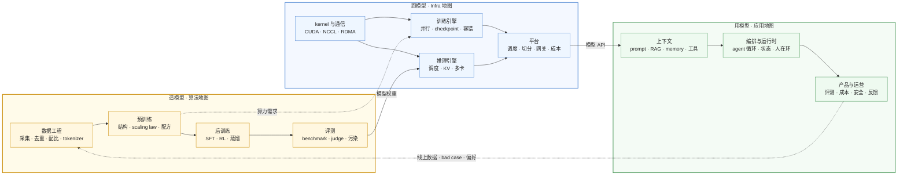

## 内容简介

这个博客的技术文章围绕三张学习地图组织：[《AI-Infra 工程师学习地图》](/ai-infra-learning-roadmap.html)、[《AI 算法工程师学习地图》](/ai-algorithm-engineer-learning-roadmap.html)、[《AI 应用工程师学习地图》](/ai-application-engineer-learning-roadmap.html)。每张地图把一个方向的知识分层，说明每层回答什么问题、按什么顺序学、哪些已经写成了系列。本文是三张地图之上的一页总览，回答的是三张地图各自不回答的问题：

> **为什么是三张而不是一张？三张地图之间怎么分工、在哪里交汇？一个人该从哪一张进入，读到哪里该换到另一张？**

三张地图对应的是同一个系统里的三种角色。一个大模型从数据到用户手里，要被**造出来**（预训练、后训练、评测）、被**跑起来**（引擎、集群、平台）、被**用起来**（检索、工具、编排、产品）。三件事用同一批名词——Python、PyTorch、Transformer、KV cache、LoRA、量化、评测、Agent——但对每个名词的追问方向完全不同。把它们塞进一张地图，结果是每个名词都要讲三遍，或者只讲一遍而对另两种读者是错的。分成三张，每张才能对自己的读者说真话。

| 地图 | 面向 | 一句话 | 层 | 已写成的系列 |
|---|---|---|---|---|
| [AI-Infra](/ai-infra-learning-roadmap.html) | **跑模型的人**：从后端工程师到 PyTorch / vLLM / NCCL 的贡献者 | 模型在硬件上怎么花钱、系统怎么实现 | 五层 + 横切 + 两个选修 | 十一个系列：十个写完，09 RL 后训练基础设施总纲已发、各篇在写 |
| [AI 算法工程师](/ai-algorithm-engineer-learning-roadmap.html) | **造模型的人**：能复现论文、设计后训练配方、把模型评测清楚 | 为什么这样建模、效果如何、怎么证明 | 八层 + 横切 | 全部写完：三篇导读 + 五个系列 + 共享 04 系列 |
| [AI 应用工程师](/ai-application-engineer-learning-roadmap.html) | **用模型做产品的人**：在非确定性组件之上做可靠产品 | 用什么、怎么组合、效果好不好 | 七层 + 横切 + 选修 | 地图已成，系列待写 |

## 一张图：模型的一生与三种工程师

把三张地图放到同一条链上，就是一个模型从数据到用户、再从用户回到数据的循环：

三个方向之间有两条实线和两条虚线。实线是**产物的流动**：算法侧交出一份权重，Infra 侧把它变成一个模型 API，应用侧在 API 之上做产品。虚线是**需求的回流**：预训练的算力需求决定了训练引擎要解决什么问题（千卡并行、容错、MFU），线上产品的 bad case 与用户偏好回流成下一轮后训练的数据。

这两条虚线是三张地图不能各自独立的原因。训练引擎的每一个设计决定（为什么按这种方式切分状态、为什么 checkpoint 间隔是这个数）都来自算法侧的一个需求；后训练的每一轮数据（偏好对、失败轨迹、工具调用记录）都来自应用侧的一个产品。一个只读一张地图的人能把自己的那一段做好，但不知道上游为什么这样要求、下游怎样使用自己的产出。三张地图各自的末尾都有一节"与另两张地图的关系"，说的就是这两条虚线。

## 分工的规则

三张地图之间的分工不是按名词划的——几乎每个名词都在三张地图上出现——而是按**对同一个名词的追问方向**划的：

> **同一个主题，算法地图回答"为什么这样建模、效果如何"，Infra 地图回答"在硬件上花多少钱、系统怎么实现"，应用地图回答"用什么、怎么组合、效果好不好"。**

用几个最容易混的名词说明这条规则怎么用：

| 名词 | 在算法地图里 | 在 Infra 地图里 | 在应用地图里 |
|---|---|---|---|
| 模型 | 结构、训练、能力：为什么是这个结构，怎么训出来 | 一个计算对象：参数量、FLOPs、字节数、KV，在硬件上怎么跑 | 一个组件：API 契约、失效模式、按 token 计费、上下文上限，怎么选型 |
| 推理 | 改变模型或解码过程的方法：量化选哪种、投机解码的草稿模型、KV 压缩 | 引擎机制：PagedAttention、continuous batching、PD 分离——模型不知道它们存在 | 一次调用：延迟形态（TTFT / TPOT）、流式、缓存前缀、成本 |
| 微调 | 配方：SFT 数据、LoRA 的秩与目标矩阵、DPO 的 β | 账：LoRA 的参数与状态、多 LoRA 服务的 kernel 与调度 | 决策：何时需要微调而不是 prompt / RAG，数据怎么准备，效果怎么评 |
| 评测 | 模型能力：benchmark 协议、LLM-as-judge 的偏差、污染、`pass@k` | 性能：吞吐、延迟、MFU、有效利用率 | 应用效果：任务完成率、faithfulness、在线指标、回归 |
| Agent | 能力的训练：工具调用数据、多轮 RL、轨迹 | RL 后训练的 rollout 基础设施：环境与训练器的共置、权重同步 | 编排：工具、循环、状态、权限、人在环、[harness](/ai-application-engineer-learning-roadmap.html#三个-harness-案例) |
| 成本 | 按训练算力的账：$$6ND$$、GPU 小时、数据配比换成 epoch | 按 GPU 小时的账：分配率、使用率、每百万 token 的成本 | 按 token 的账：预算、缓存、路由到便宜的模型 |
| 数据 | 决策：配比、质量过滤、去重的阈值、合成数据 | 实现：tokenization 离线化、流式加载、打包、checkpoint I/O | 回流：trace、用户反馈、bad case 怎么变成下一轮数据 |
| 安全 | 对齐与拒答训练 | 平台层的隔离、多租户与审计 | prompt injection、工具权限、PII |

读到一个名词时先问"这是哪个方向的追问"，比记住它"属于"哪张地图更有用——因为它三张都属于。

### 一个共享的系列

三张地图只有一个系列是共享的：[《Transformer 与 LLM：结构、算量与数值》](/transformer-and-llm-for-infra-engineers.html)（Infra 地图的 04、算法地图的 L4）。它讨论的对象是"模型作为一个计算对象的成本"——参数量、FLOPs、字节数、KV、通信量——恰好是算法工程师与 Infra 工程师对话的语言：前者从中知道自己的每个结构决定在硬件上花多少钱，后者从中知道要优化什么。它只讨论成本表本身；这张表的训练侧——tokenizer、scaling law、数据工程、训练配方——是紧接着它发布的算法地图系列[《预训练：从 tokenizer 到训练配方》](/pretraining-from-tokenizer-to-training-recipe.html)，不共享：Infra 读者不需要读，算法读者读完 04 接着读。应用工程师读 04 的 KV cache 与多模态两篇，能理解长上下文与图片为什么贵。

### 一个常见的误分类

三张地图各有一段专门纠正一个误分类，合起来看更清楚：

- PagedAttention、continuous batching、chunked prefill、PD 分离**不是推理算法**，是推理引擎的调度与内存管理机制；模型不知道它们的存在，输出分布也不因它们改变。它们属于 Infra 地图。算法侧的推理优化只有改变模型或解码过程的那些。
- Agent 框架（LangGraph、各家 Agent SDK）与 Agent 产品属于应用地图；Agent **能力的训练**——工具调用数据、多轮环境、延后的奖励——属于算法地图的后训练；RL 训练的 rollout 引擎属于 Infra 地图。三张地图上都有"Agent"，说的是三件事。
- 模型网关在应用地图里是"使用"（接入、路由、fallback），在 Infra 地图里是"建设"（多租户、配额、可观测）。

## 从哪一张进入

三张地图各自内部的层是有序的，但三张地图之间**没有先后**——它们是三个方向，不是三个阶段。进入哪一张由你要做的事决定，而不是由"基础"决定：

| 你是 | 先读 | 什么时候翻到另一张 |
|---|---|---|
| 后端工程师，想进 AI 基础设施 | Infra 地图 | 读 04 系列时会碰到算法侧的动机；到 07 训练引擎、10 平台时，读算法地图的 L4、L5 知道用户在要什么 |
| 想做模型：后训练、数据、预训练 | 算法地图 | 读 L4 时读的就是共享系列；做后训练的 RL 时读 Infra 地图的 09 [《RL 后训练基础设施》](/rl-post-training-infrastructure.html)；做推理效率（L6）时必须读 Infra 08 |
| 想用模型做产品 | 应用地图 | 读 L1"模型作为组件"时翻 Infra 08 的前两篇，理解 token 计费与延迟形态的来源；读 L3 检索时翻 04 系列的 KV cache 篇，理解长上下文为什么贵；考虑微调时翻算法地图的 L5 |
| 产品经理 / 技术负责人 | 应用地图的 L1、L7、场景轴 | 需要判断"自建还是用 API"时读 Infra 地图的 10 与算法地图的 L5 概念层 |
| 不确定方向，想先建立全貌 | 本文 → 三张地图的"内容简介"与"两张图" | 三张地图的开头各有一张架构图和一张学习路径表，加起来两小时能读完；再挑一张深入 |

三张地图有一块**共同的前置**：Python 与 PyTorch 的使用。Infra 地图把它展开成两个系列（01 Python、03 PyTorch，讲的是机制与实现）；算法地图把它压成一篇导读（L1 工具箱，讲的是用法）；应用地图假设已具备。一个从零开始的人，Infra 地图的 01 与 03 是三条路都用得上的地基——但算法与应用方向不需要读到 Dispatcher 与 Autograd 引擎那么深。

### 全栈的一条线

如果目标不是某一个方向，而是把三张地图都走一遍，推荐的顺序是把三张地图**交织**而不是逐张读完：

1. **前置**：Infra 01 Python、02 C++（可略）、03 PyTorch——两张地图共用的工具。
2. **算法基础**：算法地图 L0–L3——数学、工具箱、经典机器学习、深度学习基础六篇。
3. **共享的核心**：04 系列 8 篇——Transformer 的结构与成本，两张地图在这里会合；算法方向接着读预训练 4 篇。
4. **造模型**：算法地图 L5 后训练八篇——SFT、偏好、在线与离线 RL、推理模型、Agent RL、蒸馏、评测。
5. **跑模型**：Infra 地图 05–10——kernel、通信、训练引擎、推理引擎、RL 后训练系统、平台；再加 11 开源贡献。
6. **用模型**：应用地图 L1–L7——组件观、上下文、检索、Agent、评测、运营、产品。

这也是本博客文章的发布顺序：三张地图先发，然后前置系列、算法基础、共享系列、后训练、Infra 系统各系列，应用地图的系列在最后。按发布时间从头读，读到的就是这条线。

## 三张地图共有的写法

三张地图和它们下面的系列共用几条约定，读的时候知道这些约定能省时间：

**每张地图两张图。** 一张描述**系统怎么叠起来**（Infra 的架构视图、算法的模型生命周期、应用的架构视图），一张描述**人怎么进入它**（学习路径）。两张图的层不重合——架构上的一层可能对应学习上的三层，反过来也是——混在一起是很多学习计划失败的原因。每张地图都有一节"两张图的叠加"把它们对上。

**每层回答一个问题。** 学习路径表里每一层都写成一个问句（"梯度怎么流？为什么深了就难训？""模型这一步该看到什么？"）。问句是这一层的验收标准：能回答就是学会了，不能回答就回去读。

**推导 → 算账 → 与真实系统对照。** 系列文章的每一章大体按这个顺序走：先从定义推出结论（中间步骤不省），再用一个真实模型或真实集群的数字把它算出来，再指出它在 PyTorch / vLLM / 某篇技术报告里的形态。数字分三类并明确标注：理论下界或估算、公开论文与报告里的数字、本地实测的数字。三类不混用。

**系列自治，地图说依赖。** 每个系列都能单独读懂，正文里保留理解它所需的最小知识集；系列之间的先后关系只在地图里说明。所以从任何一个系列进入都可以，但按地图给的顺序读会少走回头路。

**边界写在末尾。** 每张地图、每个系列的末尾都有一节"边界与说明"：主线是什么、替代品在哪里提及、什么不在地图上、版本基线是什么。这一节决定了地图在什么范围内为自己的说法负责。

## 现状与更新

| 地图 | 已写 | 待写 |
|---|---|---|
| AI-Infra | 十个系列共 85 篇：Python 7、C++ 8、PyTorch 10、Transformer 与 LLM 8、GPU kernel 10、通信 8、大规模训练 8、vLLM 14、平台 8、开源贡献 4；09 RL 后训练基础设施的[总纲](/rl-post-training-infrastructure.html) | RL 后训练基础设施 8 篇正文；两个选修（ML 编译器、扩散模型推理基础设施）暂以地图里的段落代替，后者计划作为短系列补上 |
| AI 算法工程师 | L0–L2 各一篇导读，L3 深度学习基础 6 篇，L4 共享 04 系列 + 预训练 4 篇，L5 后训练 8 篇，L6 高效推理与压缩 6 篇，L7 多模态 7 篇，横切实验方法论 1 篇 | — |
| AI 应用工程师 | 地图本身（含场景轴与三个 harness 案例） | 全部系列 |

三张地图会随文章的增加更新"已有的文章与系列"一节，也会随领域变化更新层的内容——算法地图的"版本与时效"一节说了这件事：2023 年的主线是 SFT + PPO，2024 年是 DPO 一族，2025 年是可验证奖励的 RL，地图列出的是当前的主线并会随之更新，不变的是结构。

三张地图都开着评论与划线评论。哪一层的问句你回答不上来、哪一段推导跳步了、哪一个数字对不上，划出来说一句，是这组文章改进的主要来源。
