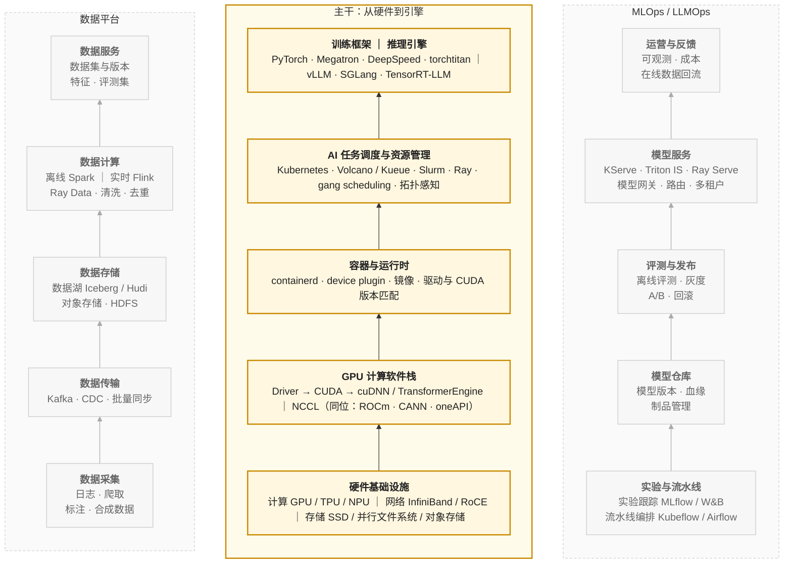
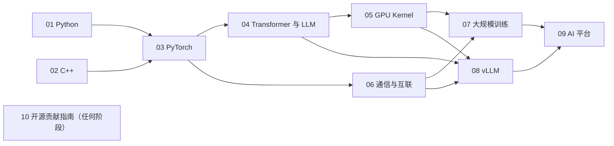

## 内容简介

这是一张给后端工程师——尤其是 Java、Go 等托管语言背景的工程师——转向 AI-Infra 方向的学习地图。它把这个方向需要的知识组织成十个系列，说明每个系列解决什么问题、为什么放在那个位置、彼此之间如何依赖，以及按不同目标应该走哪条路径。

地图回答三个问题：

> **AI-Infra 由哪些层组成？每一层需要掌握什么？按什么顺序学？**

"AI-Infra"这个词覆盖的范围很宽，从 GPU 驱动到模型交付平台都算。但如果目标是**能够阅读、修改和贡献 PyTorch、vLLM、NCCL、Megatron 这类核心项目**，需要的知识是可以枚举的：

| 需要什么 | 具体是什么 |
|---|---|
| 两门语言 | Python 承担控制平面，C++ 承担执行平面 |
| 一个框架 | PyTorch：Tensor、Autograd、算子、编译器、分布式 |
| 一类模型 | Transformer / LLM：它在硬件上怎么花钱 |
| 一层 kernel | CUDA / Triton：写到硬件极限的能力 |
| 一层通信 | NCCL / RDMA：多卡多机协同的底座 |
| 两类引擎 | 训练框架与推理引擎 |
| 一层平台 | 资源调度与模型交付 |
| 一套方法 | 如何进入并贡献一个百万行的开源项目 |

每个系列独立成篇、自成体系：读者可以从任何一个系列进入，不需要先读完前面的；系列之间不互相引用。它们的依赖关系只在这张地图里说明。

## 两张图：架构视图与学习路径

理解 AI-Infra 需要两张图：一张描述**系统怎么叠起来**，一张描述**人怎么进入这个系统**。前者是坐标系，后者是路径；两者的层不重合，混在一起是很多学习计划失败的原因。

### 第一张图：架构视图

AI-Infra 的**架构视图**（技术栈）如下。中间是从硬件到引擎自下而上的主干，共五层；左翼是数据平台，自身也分五层，从采集到服务，向引擎供给训练与评测数据；右翼是 MLOps / LLMOps，同样分五层，从实验到运营，把引擎的产出变成可运维的服务，并把线上数据回流到数据平台。两翼不挂在主干的某一层上，而是各自独立成栈，与主干的多个层打交道：

三个栈之间的关系：数据平台向主干**供给**训练与评测数据；主干**产出**模型与服务，交给 MLOps 管理和交付；MLOps 把线上数据**回流**到数据平台，形成闭环。

这张图描述的是**系统怎么叠起来**，它是理解这个领域的坐标系，但不是学习顺序。按它自下而上学，会先学 GPU 驱动和 device plugin，然后是 CUDA，然后才碰到 PyTorch——一个不知道 PyTorch 为什么需要 Caching Allocator 的人，学 CUDA 内存 API 时不知道该关心什么；一个没跑过分布式训练的人，学 gang scheduling 时不知道它在解决什么。

学习顺序应该跟着**问题出现的顺序**走：先有一个能运行的系统，再向下问它为什么这样运行，再向上问它如何被组织和交付。下面的地图就是这样组织的：它不是架构视图的翻版，而是一条从用户代码出发、逐步向下再向上的路径。

### 架构视图里看不见的东西

架构视图有一个特点：它只画**组件**，不画**人怎么进入组件**。有四样东西在架构图上没有独立的位置，却是从"会用这个栈"走向"能改这个栈"的分水岭：

| 架构图上没有的 | 为什么是分水岭 |
|---|---|
| 语言（Python、C++） | 每一层的源码都由它们写成，读不懂语言就读不懂任何一层 |
| 模型知识（Transformer / LLM） | 引擎和 kernel 的所有优化都以模型的算量和访存量为目标 |
| kernel 编程（CUDA / Triton） | 架构图把它藏在"GPU 软件栈"里，但它是高价值贡献最集中的地方 |
| 贡献方法 | 架构图描述系统，不描述如何参与建设系统 |

这四样东西在地图里各占一个系列。

### 第二张图：学习路径

学习路径分五层，加一个横切、一个选修。层的顺序就是推荐的学习顺序，也是各系列的发布顺序。

| 层 | 主题 | # | 系列 |
|---|---|---|---|
| L1 | 语言与工程 | 01 | Python 在 AI-Infra：从语言机制到生产交付 |
| | | 02 | C++ 在 AI-Infra：从对象模型到算子扩展 |
| L2 | 计算运行时 | 03 | PyTorch 深度实践：从 Tensor 到深度学习运行时 |
| | | 04 | Transformer 与 LLM：结构、算量与数值 |
| | | 05 | GPU Kernel 工程：从 CUDA 执行模型到 FlashAttention |
| L3 | 通信与互联 | 06 | 通信与互联：从 NCCL 到 RDMA |
| L4 | 引擎 | 07 | 大规模训练工程：从 Megatron 到容错 |
| | | 08 | 大模型推理系统揭秘：从 vLLM 看 LLM Serving Infra 核心技术 |
| L5 | 平台 | 09 | AI 平台工程：资源层与交付层 |
| 横切 | 方法 | 10 | AI-Infra 开源贡献指南 |
| 选修 | 编译器 | — | ML 编译器内部（MLIR / Triton 编译器 / TVM） |

### 两张图的叠加

把学习路径叠到架构视图上，可以看到每个系列在技术栈上的落点：

| 架构视图中的位置 | 组件 | 覆盖它的系列 |
|---|---|---|
| 主干：训练框架 ｜ 推理引擎 | PyTorch · Megatron · DeepSpeed ｜ vLLM | 03 · 07 ｜ 08 |
| 主干：AI 任务调度与资源管理 | K8s · Volcano · Kueue · Slurm · Ray | 09（资源层） |
| 主干：容器与运行时 | containerd · device plugin | 09（资源层） |
| 主干：GPU 计算软件栈 | Driver → CUDA → cuDNN / TE ｜ NCCL | 05 ｜ 06 |
| 主干：硬件基础设施 | 计算 GPU ｜ 网络 IB / RoCE ｜ 存储 | 05 ｜ 06 ｜ 09 |
| 左翼：数据平台 | 训练数据管线 ｜ 数据与 checkpoint 存储 | 07 ｜ 09 |
| 右翼：MLOps / LLMOps | Serving 平台 · 模型网关 · 可观测 | 09（交付层） |
| 图上没有的 | 语言 ｜ 模型知识 ｜ 贡献方法 | 01 · 02 ｜ 04 ｜ 10 |

## 逐层说明

### L1 语言与工程

AI-Infra 的核心项目几乎都是同一个结构：**Python 外壳，C++ 内核**。

| 项目 | Python 层 | C++ 层 |
|---|---|---|
| PyTorch | `torch/` | `c10/` · `aten/` · `torch/csrc/` |
| vLLM | `vllm/` | `csrc/` |
| FlashAttention | `flash_attn/` | `csrc/` |
| Triton | `python/triton/` | `lib/` · `include/` |
| NCCL | — | `src/` |

Python 承担组织、调度、扩展、观测和交付——控制平面；C++ 和 CUDA 承担真正的计算——执行平面。两门语言都要会，但要会的不是语法，而是**这些项目实际使用的那个子集，以及它背后的机制**。

对 Java 背景的工程师，Python 的门槛在于它的动态性（一切都在运行时发生）；C++ 的门槛在于它的确定性（对象在哪里、活多久、谁负责释放，全部由程序员决定）。两者恰好在 Java 的两侧。

#### 01 Python 在 AI-Infra：从语言机制到生产交付

> **在 AI-Infra 系统里，Python 并不承担最重的计算，那它到底承担什么？为此需要掌握它的哪些机制？**

七篇：语言机制与运行时 → 类型系统与数据契约 → 并发与异步 → 动态机制与插件架构 → 内存管理 → 测试与调试 → 工程化与交付。前六篇解决"写对"，第七篇解决"交付"。

#### 02 C++ 在 AI-Infra：从对象模型到算子扩展

> **PyTorch 和 vLLM 的 C++ 源码里，这段代码为什么这样写？**

八篇：编译模型与项目布局 → 值语义与所有权 → 模板 → 多态与类型擦除 → 宏与静态注册 → 并发与 TLS 守卫 → pybind11 与 ABI → 构建、调试与测试。以 PyTorch 和 vLLM 的真实源码为教材，以 Java 为参照系，练手项目 mini-c10 逐篇长成一个带 Dispatcher 的最小 Tensor 库。

### L2 计算运行时

这一层回答"一次模型计算是怎么执行的"。它有三个视角：**框架**怎么组织计算（03），**模型**在硬件上怎么花钱（04），**kernel** 怎么写到硬件极限（05）。三者顺序上先框架、再模型、再 kernel：不理解框架就不知道 kernel 在哪里被调用；不理解模型的算量与访存量，就不知道该优化哪个 kernel。

#### 03 PyTorch 深度实践：从 Tensor 到深度学习运行时

> **PyTorch 如何把张量计算表达成可求导、可扩展、可优化、可分布式执行的深度学习系统？**

十篇：整体架构 → Tensor 与内存布局 → Autograd → Module 与训练系统 → Dispatcher 与算子系统 → C++ 扩展与自定义算子 → 编译执行与图优化 → 性能优化与调试 → 分布式 PyTorch → 工程体系。它是整张地图的枢纽：向下接 C++ 和 kernel，向上接训练框架和推理引擎，向旁接通信。

#### 04 Transformer 与 LLM：结构、算量与数值

> **Infra 工程师不训练模型，但必须知道自己在优化什么：这个模型的每一步算多少、读多少、存多少？**

七篇。Transformer 前向的逐层算量与访存量；Attention 变体（MHA / GQA / MQA / MLA）与 KV cache 大小的推导；位置编码与长上下文；MoE 的路由与通信形态；浮点格式（FP32 / TF32 / BF16 / FP16 / FP8 / INT8 / INT4）、数值稳定性与混合精度为什么能工作；量化算法（GPTQ / AWQ / SmoothQuant / FP8）的原理与代价；投机解码的数学；LoRA 等参数高效方法的计算形态。

这一篇由**推导**驱动而不是由 API 驱动。它同时服务两类读者：Infra 工程师借它理解优化对象，算法工程师借它理解自己的模型在硬件上的成本。

#### 05 GPU Kernel 工程：从 CUDA 执行模型到 FlashAttention

> **一个 kernel 为什么快、为什么慢，以及如何把它写到接近硬件极限？**

十篇：GPU 硬件与 Roofline → CUDA 编程模型 → 访存合并与 elementwise → 共享内存与 reduction → GEMM 分块 → Tensor Core 与 CUTLASS → Triton → Attention kernel → 量化与融合 kernel → 剖析、测试与贡献。CUDA 与 Triton 两条路线在同一组 kernel 上并行推进；练手项目是一个 decoder layer 的 kernel 全集。

这是 AI-Infra 贡献者最稀缺的一层：vLLM、SGLang、FlashInfer、PyTorch 的高价值 PR 大多落在这里。

### L3 通信与互联

单卡之外的一切——训练也好、推理也好——都建立在通信之上。通信自成一层，而不是训练的附属：训练用它同步梯度和分片参数，推理用它做张量并行和 KV 传输，两者的通信模式不同，但底座相同。

#### 06 通信与互联：从 NCCL 到 RDMA

> **一次 all_reduce 从调用到完成，数据在 PCIe、NVLink、InfiniBand 上是怎么流动的？为什么有时候是带宽的问题，有时候是延迟的问题？**

七篇。硬件互联：PCIe / NVLink / NVSwitch / InfiniBand / RoCE 的拓扑与带宽，NUMA 与亲和性；RDMA 与 GPUDirect；NCCL 的算法（Ring / Tree / CollNet）、channel、protocol（LL / LL128 / Simple）与拓扑探测；nccl-tests 与调优参数；集合通信的正确性、死锁与 hang 的排查；推理侧的 KV 传输层（NIXL / UCX）。

### L4 引擎

引擎是把模型、kernel、通信组织成一个持续运行的系统。训练引擎围绕**状态**（参数、梯度、优化器状态、激活值）组织，推理引擎围绕**请求**（调度、KV cache、token 生成）组织。两者共享底层，但问题形态完全不同。

#### 07 大规模训练工程：从 Megatron 到容错

> **一个千卡训练任务，怎么配、怎么跑满、怎么跑一个月不倒？**

八篇。Megatron-LM / DeepSpeed / torchtitan 的架构对比与源码导读；多维并行的实际配置与 MFU 计算；分布式 checkpoint 与恢复；容错、弹性、straggler 与 silent data corruption；训练稳定性（loss spike、梯度范数）；数据管线（tokenization、数据混合、shuffle、流式加载）；长时训练的可观测。

#### 08 大模型推理系统揭秘：从 vLLM 看 LLM Serving Infra 核心技术

> **一个文本生成请求，为什么会逐渐演化成一个涉及计算、显存、调度、通信与状态管理的复杂系统？**

十二篇：问题定义 → 指标体系 → 请求生命周期 → 调度 → KV Cache → GPU 执行 → 多卡扩展 → 模型适配 → 硬件抽象 → PD 分离 → Serving Infra 的演进 → 源码走读。以 vLLM 为分析对象，建立一套可迁移到其他推理框架的分析方法。

### L5 平台

平台是"平台"一个词盖住的两部分：**资源层**是架构视图主干中引擎之下的三层（容器运行时、任务调度与资源管理、硬件中的存储与网络），承载引擎运行；**交付层**是架构视图的右翼 MLOps / LLMOps，把引擎变成服务（Serving 平台、模型网关、可观测）。两者在架构上一个在引擎之下、一个在引擎之侧，在学习顺序上都在引擎之后——因为它们的每个设计决定都是被引擎的需求推出来的。

#### 09 AI 平台工程：资源层与交付层

> **一个 GPU 集群如何被切分、调度和喂饱？一个训好的模型如何变成一个可运维的服务？**

八篇。资源层：容器里的 GPU（device plugin、驱动与 CUDA 版本匹配、镜像）；K8s 上的 AI 任务调度（Volcano / Kueue、gang scheduling、拓扑感知）、Slurm 与 Ray；GPU 切分（MIG / vGPU / 时间片）；RDMA 网络配置；存储与 checkpoint I/O（对象存储、并行文件系统）。交付层：Serving 平台（KServe / Triton Inference Server / Ray Serve）、模型网关与路由、多租户与配额、可观测与成本。

### 横切：10 AI-Infra 开源贡献指南

> **面对一个百万行的开源项目，如何找到切入点、做出一个能被合入的改动？**

四篇。读大型代码库的方法；从 issue / RFC / roadmap 找切入点；benchmark 与 PR 描述的规范；CI、review 文化与 maintainer 沟通；以 PyTorch 和 vLLM 各一个真实 PR 走一遍完整流程。它不属于任何一层，对每一层都适用。

### 选修：ML 编译器内部

`torch.compile` 的用法与 Inductor 的工作方式在 03 中覆盖，Triton 的编译流水线在 05 中覆盖。这对绝大多数 AI-Infra 工作已经足够。MLIR 的方言设计、TVM 的调度语言、Triton 编译器自身的实现，只对准备从事编译器开发的读者必要，不进入主线。

## 系列之间的依赖

系列之间的依赖只在这里说明；每个系列的正文都是自治的，不假设读者读过其他系列，也不引用其他系列。

几条主要的依赖关系：

- **01、02 → 03**：读 PyTorch 源码需要两门语言。Python 部分主要用到 01 的动态机制和内存管理；C++ 部分主要用到 02 的所有权、模板和静态注册。
- **03 → 04**：模型的算量和访存量要落到 Tensor 和算子上才有意义。
- **04 → 05、08**：kernel 系列的 attention 和量化篇、vLLM 系列的 KV cache 和量化篇，都把模型结构当作已知。
- **03 → 06**：通信系列假设读者知道并行策略需要哪些集合通信原语；03 的第九篇建立了这个需求。
- **05、06 → 07、08**：两类引擎都建立在 kernel 和通信之上。
- **07、08 → 09**：平台的设计决定来自引擎的需求。

"自治"和"依赖"并不矛盾：依赖描述的是**最佳阅读顺序**，自治保证的是**任何一个系列都能单独读懂**。每个系列都会在正文中保留理解它自己所需的最小知识集，深入的展开只在一个系列出现。例如集合通信原语的语义在 03 和 06 都会出现，但 NCCL 的实现细节只在 06；CUDA 执行模型的最小概念在 03 中出现，完整展开只在 05。

## 按目标选择路径

十个系列全部读完是一条完整的路径，但大多数读者有更具体的目标。

| 目标 | 路径 | 说明 |
|---|---|---|
| 写 kernel，给 vLLM / SGLang / FlashInfer / PyTorch 贡献算子 | 02 → 03（2、5、6、8 篇）→ 04 → 05 → 10 | 当前最稀缺、也最容易做出可见贡献的方向 |
| 分布式训练基础设施 | 03（4、8、9 篇）→ 04 → 06 → 07 → 09（资源层） | 重心在状态、通信与容错 |
| 推理系统与 LLM Serving | 03（2、4、8、9 篇）→ 04 → 08 → 06 → 05（8、9 篇） | 先建立系统视角，再向下到通信和 kernel |
| AI 平台与集群 | 01 → 03（1、4、8、9 篇）→ 08（1–5 篇）→ 07（checkpoint、容错篇）→ 09 | 平台工程师不写 kernel，但要知道引擎对资源层提出了什么要求 |
| 读懂源码，暂时不定方向 | 01 → 02 → 03 → 04 | 到 04 为止具备阅读这个领域几乎任何项目源码的基础，再按兴趣向下（05、06）或向上（07、08、09） |

## 边界与说明

### 主线与替代品

地图以 **NVIDIA GPU + CUDA、PyTorch、vLLM** 为主线，因为它们是当前开源 AI-Infra 的事实标准，源码和社区都最活跃。同一位置的替代品会在相关系列中提及，但不展开：

| 位置 | 主线 | 同位替代品 |
|---|---|---|
| 硬件与软件栈 | NVIDIA GPU · CUDA | AMD ROCm / HIP · 华为 CANN · Intel oneAPI · Google TPU / XLA |
| 训练框架 | PyTorch · Megatron-LM · DeepSpeed · torchtitan | JAX · TensorFlow |
| 推理引擎 | vLLM | SGLang · TensorRT-LLM · LMDeploy · llama.cpp |
| 调度与平台 | Kubernetes · Volcano / Kueue · Slurm · Ray | — |

学会主线之后迁移到替代品的成本，远低于一开始就同时学几套。

### 不在地图上的内容

- **算法与训练方法**：预训练配方、SFT、RLHF / DPO、评测、数据工程。这些属于算法工程师的路径，另有一张地图；04 是两条路径的交点。
- **通用后端与云原生知识**：K8s 本身、网络基础、Linux 系统编程。假设读者作为后端工程师已经具备；09 只讲它们在 AI 负载下的特殊之处。
- **数学**：线性代数、概率、优化的系统课程。04 和 05 会在需要处给出推导，但不从零讲起。
- **Agent 框架与应用层**：RAG、工具调用、编排框架。它们在推理引擎之上，属于应用开发，不是基础设施。

### 版本与时效

各系列在自己的总纲中声明版本基线。总的原则是：**机制比 API 稳定，分析方法比具体数字稳定**。地图本身描述的是知识的结构，这个结构在近几年是稳定的；变化快的是每一层里的具体项目和接口。

### 关于"AI-Infra 专家"

这张地图的目标是**贡献者**，不是"专家"：读完之后能够在这些项目里读懂源码、定位问题、做出改动。专家是在某一层长期工作的结果，地图只负责把人送到那一层的入口。

## 系列总览

| # | 系列 | 层 | 篇数 |
|---|---|---|---|
| 01 | [Python 在 AI-Infra：从语言机制到生产交付](/python-for-ai-infra.html) | L1 | 7 |
| 02 | [C++ 在 AI-Infra：从对象模型到算子扩展](/cpp-for-ai-infra.html) | L1 | 8 |
| 03 | [PyTorch 深度实践：从 Tensor 到深度学习运行时](/deep-dive-into-pytorch.html) | L2 | 10 |
| 04 | [Transformer 与 LLM：结构、算量与数值](/transformer-and-llm-for-infra-engineers.html) | L2 | 7 |
| 05 | [GPU Kernel 工程：从 CUDA 执行模型到 FlashAttention](/gpu-kernel-engineering.html) | L2 | 10 |
| 06 | [通信与互联：从 NCCL 到 RDMA](/communication-and-interconnect-for-ai-infra.html) | L3 | 7 |
| 07 | [大规模训练工程：从 Megatron 到容错](/large-scale-training-engineering.html) | L4 | 8 |
| 08 | [大模型推理系统揭秘：从 vLLM 看 LLM Serving Infra 核心技术](/deep-dive-into-vllm.html) | L4 | 12 |
| 09 | [AI 平台工程：资源层与交付层](/ai-platform-engineering.html) | L5 | 8 |
| 10 | [AI-Infra 开源贡献指南](/contributing-to-ai-infra-open-source.html) | 横切 | 4 |

## 最终目标

读完这张地图上的系列之后，面对一条训练日志或一个推理服务的性能问题，读者应该能够沿着整个栈追问下去：

| 追问 | 答案来自 |
|---|---|
| 这行 Python 代码调用了哪个算子？ | 01 · 03 |
| 算子怎么分发到 CUDA 实现？那段 C++ 在做什么？ | 02 · 03 |
| 这个 kernel 读写多少字节、离硬件极限多远？ | 04 · 05 |
| 多卡之间的通信走了什么路径、为什么是这个耗时？ | 06 |
| 训练框架为什么这样切分状态？推理引擎为什么这样调度请求？ | 07 · 08 |
| 集群为什么把任务放在这几张卡上？服务为什么这样扩缩容？ | 09 |
| 发现问题之后，怎么把修复合入上游？ | 10 |

十个系列不是为了覆盖更多名词，而是为了让这条追问链没有断点。
