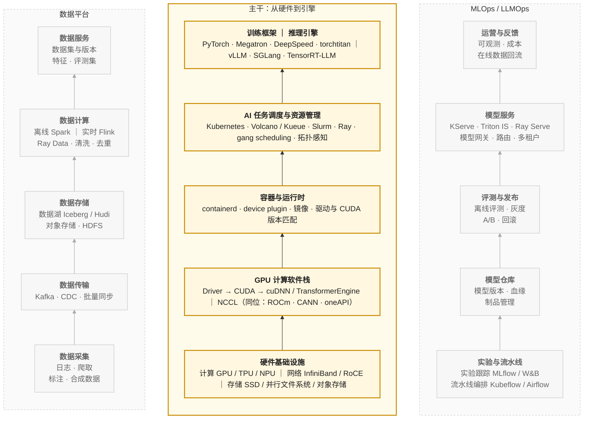
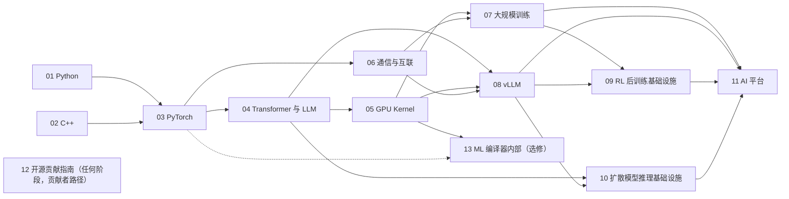

## 内容简介

这是一张给后端工程师——尤其是 Java、Go 等托管语言背景的工程师——转向 AI-Infra 方向的学习地图。它把这个方向需要的知识组织成十二个系列，说明每个系列解决什么问题、为什么放在那个位置、彼此之间如何依赖，以及按不同目标应该走哪条路径。

它是三张 AI 学习地图中的第二张（三张的总览与分工见[《AI 全栈学习地图》](/ai-fullstack-learning-roadmap.html)）：第一张[《AI 算法工程师学习地图》](/ai-algorithm-engineer-learning-roadmap.html)面向**造模型的人**，这一张面向**跑模型的人**（AI-Infra 工程师），第三张[《AI 应用工程师学习地图》](/ai-application-engineer-learning-roadmap.html)面向**用模型的人**。本地图的 01 Python、03 PyTorch、04 Transformer 与 LLM 三个系列与算法地图共享。三张地图有重叠的名词，分工在本文末尾的[《与算法工程师地图的关系》](#与算法工程师地图的关系)一节说明。

地图回答三个问题：

> **AI-Infra 由哪些层组成？每一层需要掌握什么？按什么顺序学？**

"AI-Infra"这个词覆盖的范围很宽，从 GPU 驱动到模型交付平台都算。但如果目标是**能够阅读、修改和贡献 PyTorch、vLLM、NCCL、Megatron 这类核心项目**，需要的知识是可以枚举的：

| 需要什么 | 具体是什么 |
|---|---|
| 两门语言 | Python 承担控制平面，C++ 承担执行平面 |
| 一个框架 | PyTorch：Tensor、Autograd、算子、编译器、分布式 |
| 一类模型 | Transformer / LLM：它在硬件上怎么花钱 |
| 一层 kernel | CUDA / Triton：写到硬件极限的能力 |
| 一层通信 | NCCL / RDMA：多卡多机协同的底座 |
| 两类引擎 | 训练框架与推理引擎 |
| 一类组合 | RL 后训练：把两类引擎放进同一个循环、同一组 GPU |
| 另一半推理 | 扩散模型推理：compute-bound 的生成 serving，与 LLM serving 几乎每个答案都相反 |
| 一层平台 | 资源调度与模型交付 |
| 一套方法 | 如何进入并贡献一个百万行的开源项目 |

每个系列独立成篇、自成体系：读者可以从任何一个系列进入，不需要先读完前面的；系列之间不互相引用。它们的依赖关系只在这张地图里说明。

## 两张图：架构视图与学习路径

理解 AI-Infra 需要两张图：一张描述**系统怎么叠起来**，一张描述**人怎么进入这个系统**。前者是坐标系，后者是路径；两者的层不重合，混在一起是很多学习计划失败的原因。

### 第一张图：架构视图

AI-Infra 的**架构视图**（技术栈）如下。中间是从硬件到引擎自下而上的主干，共五层；左翼是数据平台，自身也分五层，从采集到服务，向引擎供给训练与评测数据；右翼是 MLOps / LLMOps，同样分五层，从实验到运营，把引擎的产出变成可运维的服务，并把线上数据回流到数据平台。两翼不挂在主干的某一层上，而是各自独立成栈，与主干的多个层打交道：

三个栈之间的关系：数据平台向主干**供给**训练与评测数据；主干**产出**模型与服务，交给 MLOps 管理和交付；MLOps 把线上数据**回流**到数据平台，形成闭环。

这张图描述的是**系统怎么叠起来**，它是理解这个领域的坐标系，但不是学习顺序。按它自下而上学，会先学 GPU 驱动和 device plugin，然后是 CUDA，然后才碰到 PyTorch——一个不知道 PyTorch 为什么需要 Caching Allocator 的人，学 CUDA 内存 API 时不知道该关心什么；一个没跑过分布式训练的人，学 gang scheduling 时不知道它在解决什么。

学习顺序应该跟着**问题出现的顺序**走：先有一个能运行的系统，再向下问它为什么这样运行，再向上问它如何被组织和交付。下面的地图就是这样组织的：它不是架构视图的翻版，而是一条从用户代码出发、逐步向下再向上的路径。

### 架构视图里看不见的东西

架构视图有一个特点：它只画**组件**，不画**人怎么进入组件**。有四样东西在架构图上没有独立的位置，却是从"会用这个栈"走向"能改这个栈"的分水岭：

| 架构图上没有的 | 为什么是分水岭 |
|---|---|
| 语言（Python、C++） | 每一层的源码都由它们写成，读不懂语言就读不懂任何一层 |
| 模型知识（Transformer / LLM） | 引擎和 kernel 的所有优化都以模型的算量和访存量为目标 |
| kernel 编程（CUDA / Triton） | 架构图把它藏在"GPU 软件栈"里，但它是高价值贡献最集中的地方 |
| 贡献方法 | 架构图描述系统，不描述如何参与建设系统 |

这四样东西在地图里各占一个系列。

### 第二张图：学习路径

学习路径分五层，加一个横切、一个选修。层的顺序就是推荐的学习顺序，也是各系列的发布顺序（10 是 2026 年 9 月补进 L4 的，编号按发布顺序排在 09 之后）。

| 层 | 主题 | # | 系列 |
|---|---|---|---|
| L1 | 语言与工程 | 01 | Python 在 AI-Infra：从语言机制到生产交付 |
| | | 02 | C++ 在 AI-Infra：从对象模型到算子扩展 |
| L2 | 计算运行时 | 03 | PyTorch 深度实践：从 Tensor 到深度学习运行时 |
| | | 04 | Transformer 与 LLM：结构、算量与数值 |
| | | 05 | GPU Kernel 工程：从 CUDA 执行模型到 FlashAttention |
| L3 | 通信与互联 | 06 | 通信与互联：从 NCCL 到 RDMA |
| L4 | 引擎 | 07 | 大规模训练工程：从并行策略到容错恢复 |
| | | 08 | 大模型推理系统揭秘：从 vLLM 看 LLM Serving Infra 核心技术 |
| | | 09 | RL 后训练基础设施：rollout 与训练如何共享一组 GPU |
| | | 10 | 扩散模型推理基础设施：从一次去噪到一个生成服务 |
| L5 | 平台 | 11 | AI 平台工程：资源层与交付层 |
| 横切 | 方法（贡献者路径） | 12 | AI-Infra 开源贡献指南 |
| 选修 | 编译器 | 13 | ML 编译器内部：从 SSA、MLIR 到 Triton 编译器 |

### 两张图的叠加

把学习路径叠到架构视图上，可以看到每个系列在技术栈上的落点：

| 架构视图中的位置 | 组件 | 覆盖它的系列 |
|---|---|---|
| 主干：训练框架 ｜ 推理引擎 | PyTorch · Megatron · DeepSpeed ｜ vLLM ｜ 两者的组合：verl · slime ｜ 生成模型推理：SGLang Diffusion · vLLM-Omni · xDiT | 03 · 07 ｜ 08 ｜ 09 ｜ 10 |
| 主干：AI 任务调度与资源管理 | K8s · Volcano · Kueue · Slurm · Ray | 11（资源层） |
| 主干：容器与运行时 | containerd · device plugin | 11（资源层） |
| 主干：GPU 计算软件栈 | Driver → CUDA → cuDNN / TE ｜ NCCL | 05 ｜ 06 |
| 主干：硬件基础设施 | 计算 GPU ｜ 网络 IB / RoCE ｜ 存储 | 05 ｜ 06 ｜ 11 |
| 左翼：数据平台 | 训练数据管线 ｜ 数据与 checkpoint 存储 | 07 ｜ 11 |
| 右翼：MLOps / LLMOps | Serving 平台 · 模型网关 · 可观测 | 11（交付层） |
| 图上没有的 | 语言 ｜ 模型知识 ｜ 贡献方法 | 01 · 02 ｜ 04 ｜ 12 |

## 逐层说明

### L1 语言与工程

AI-Infra 的核心项目几乎都是同一个结构：**Python 外壳，C++ 内核**。

| 项目 | Python 层 | C++ 层 |
|---|---|---|
| PyTorch | `torch/` | `c10/` · `aten/` · `torch/csrc/` |
| vLLM | `vllm/` | `csrc/` |
| FlashAttention | `flash_attn/` | `csrc/` |
| Triton | `python/triton/` | `lib/` · `include/` |
| NCCL | — | `src/` |

Python 承担组织、调度、扩展、观测和交付——控制平面；C++ 和 CUDA 承担真正的计算——执行平面。两门语言都要会，但要会的不是语法，而是**这些项目实际使用的那个子集，以及它背后的机制**。

对 Java 背景的工程师，Python 的门槛在于它的动态性（一切都在运行时发生）；C++ 的门槛在于它的确定性（对象在哪里、活多久、谁负责释放，全部由程序员决定）。两者恰好在 Java 的两侧。

#### 01 Python 在 AI-Infra：从语言机制到生产交付

> **在 AI-Infra 系统里，Python 并不承担最重的计算，那它到底承担什么？为此需要掌握它的哪些机制？**

七篇：语言机制与运行时 → 类型系统与数据契约 → 并发与异步 → 动态机制与插件架构 → 内存管理 → 测试与调试 → 工程化与交付。前六篇解决"写对"，第七篇解决"交付"。本系列与[算法地图](/ai-algorithm-engineer-learning-roadmap.html)共享：算法地图的 L1 工具箱只讲 Python 的用法，把语言机制与运行时交给这里——它是 L1 的**深入篇**，两张地图的第一个交点。

#### 02 C++ 在 AI-Infra：从对象模型到算子扩展

> **PyTorch 和 vLLM 的 C++ 源码里，这段代码为什么这样写？**

八篇：编译模型与项目布局 → 值语义与所有权 → 模板 → 多态与类型擦除 → 宏与静态注册 → 并发与 TLS 守卫 → pybind11 与 ABI → 构建、调试与测试。以 PyTorch 和 vLLM 的真实源码为教材，以 Java 为参照系，练手项目 mini-c10 逐篇长成一个带 Dispatcher 的最小 Tensor 库。

### L2 计算运行时

这一层回答"一次模型计算是怎么执行的"。它有三个视角：**框架**怎么组织计算（03），**模型**在硬件上怎么花钱（04），**kernel** 怎么写到硬件极限（05）。三者顺序上先框架、再模型、再 kernel：不理解框架就不知道 kernel 在哪里被调用；不理解模型的算量与访存量，就不知道该优化哪个 kernel。

#### 03 PyTorch 深度实践：从 Tensor 到深度学习运行时

> **PyTorch 如何把张量计算表达成可求导、可扩展、可优化、可分布式执行的深度学习系统？**

十篇：整体架构 → Tensor 与内存布局 → Autograd → Module 与训练系统 → Dispatcher 与算子系统 → C++ 扩展与自定义算子 → 编译执行与图优化 → 性能优化与调试 → 分布式 PyTorch → 工程体系。它是整张地图的枢纽：向下接 C++ 和 kernel，向上接训练框架和推理引擎，向旁接通信。本系列同样与算法地图共享：算法地图 L1 讲 PyTorch 的"用"（五个对象、二十行训练循环、显存的账），本系列讲"改"（Dispatcher、Autograd 引擎、编译、分布式），是 L1 的第二个深入篇。

#### 04 Transformer 与 LLM：结构、算量与数值

> **Infra 工程师不训练模型，但必须知道自己在优化什么：这个模型的每一步算多少、读多少、存多少？**

八篇：Transformer 前向的逐层算量与访存量；Attention 变体（MHA / GQA / MQA / MLA）与 KV cache 大小的推导；位置编码与长上下文；MoE 的路由与通信形态；浮点格式（FP32 / TF32 / BF16 / FP16 / FP8 / INT8 / INT4）、数值稳定性与混合精度为什么能工作；量化算法（GPTQ / AWQ / SmoothQuant / FP8）的原理与代价；投机解码的数学；LoRA 等参数高效方法的计算形态；多模态：vision encoder 的算量、connector 决定的 image token 数、image token 在 decoder 里与文本同价的 KV。这张成本表的训练侧——tokenizer 与词表、scaling law、数据工程、训练配方与稳定性——是算法地图的[《预训练：从 tokenizer 到训练配方》](/pretraining-from-tokenizer-to-training-recipe.html)（四篇）；Infra 工程师读它能理解 $$6ND$$ 的 $$N$$、$$D$$ 从哪来、数据管线的 CPU 与 I/O 形态、以及 loss spike 在系统侧的代价，但它不在本地图的主线上。

这一篇由**推导**驱动而不是由 API 驱动。它同时服务两类读者：Infra 工程师借它理解优化对象，算法工程师借它理解自己的模型在硬件上的成本。

#### 05 GPU Kernel 工程：从 CUDA 执行模型到 FlashAttention

> **一个 kernel 为什么快、为什么慢，以及如何把它写到接近硬件极限？**

十篇：GPU 硬件与 Roofline → CUDA 编程模型 → 访存合并与 elementwise → 共享内存与 reduction → GEMM 分块 → Tensor Core 与 CUTLASS → Triton → Attention kernel → 量化与融合 kernel → 剖析、测试与贡献。CUDA 与 Triton 两条路线在同一组 kernel 上并行推进；练手项目是一个 decoder layer 的 kernel 全集。

这是 AI-Infra 贡献者最稀缺的一层：vLLM、SGLang、FlashInfer、PyTorch 的高价值 PR 大多落在这里。

### L3 通信与互联

单卡之外的一切——训练也好、推理也好——都建立在通信之上。通信自成一层，而不是训练的附属：训练用它同步梯度和分片参数，推理用它做张量并行和 KV 传输，两者的通信模式不同，但底座相同。

#### 06 通信与互联：从 NCCL 到 RDMA

> **一次 all_reduce 从调用到完成，数据在 PCIe、NVLink、InfiniBand 上是怎么流动的？为什么有时候是带宽的问题，有时候是延迟的问题？**

八篇。硬件互联：PCIe / NVLink / NVSwitch / InfiniBand / RoCE 的拓扑与带宽，NUMA 与亲和性；RDMA 与 GPUDirect；NCCL 的算法（Ring / Tree / CollNet）、channel、protocol（LL / LL128 / Simple）与拓扑探测；nccl-tests 与调优参数；集合通信的正确性、死锁与 hang 的排查；推理侧的 KV 传输层（NIXL / UCX）；MoE 的 all-to-all、DeepEP 与 GPU 发起的通信（NVSHMEM / IBGDA）。

### L4 引擎

引擎是把模型、kernel、通信组织成一个持续运行的系统。训练引擎围绕**状态**（参数、梯度、优化器状态、激活值）组织，推理引擎围绕**请求**（调度、KV cache、token 生成）组织。两者共享底层，但问题形态完全不同。这一层有第三个系列：RL 后训练把两类引擎放进同一个循环、同一组 GPU，它的问题不是任何一类引擎内部的，而是**两者之间**的——显存归属、权重同步、异步与环境调度。还有第四个：扩散模型推理——同样是推理引擎，但负载从 memory-bound 换成 compute-bound，08 的方法在它身上大半用不上，需要另一套。

#### 07 大规模训练工程：从并行策略到容错恢复

> **一个千卡训练任务，怎么配、怎么跑满、怎么跑一个月不倒？**

八篇。Megatron-LM / DeepSpeed / torchtitan 的架构对比与源码导读；多维并行的实际配置与 MFU 计算；分布式 checkpoint 与恢复；容错、弹性、straggler 与 silent data corruption；训练稳定性（loss spike、梯度范数）；数据管线（tokenization、数据混合、shuffle、流式加载）；长时训练的可观测。

#### 08 大模型推理系统揭秘：从 vLLM 看 LLM Serving Infra 核心技术

> **一个文本生成请求，为什么会逐渐演化成一个涉及计算、显存、调度、通信与状态管理的复杂系统？**

十四篇：问题定义 → 指标体系 → 请求生命周期 → 调度 → KV Cache → GPU 执行 → 解码的扩展 → 多卡扩展 → 模型适配 → 请求形态 → 硬件抽象 → PD 分离 → Serving Infra 的演进 → 源码走读。以 vLLM 为分析对象，建立一套可迁移到其他推理框架的分析方法。

#### 09 RL 后训练基础设施：rollout 与训练如何共享一组 GPU

> **一个 RL 后训练任务同时是一个推理服务和一个训练任务，这两样东西怎样共享一组 GPU，而不让任何一方在等另一方？**

八篇。一步 RL 里生成、打分、训练三段的算力、显存与时间账（rollout 为什么占墙钟的 60–80%）；共置、分离与异步三种系统形态的利用率与正确性交换；共置下训练状态与 KV cache 的显存归属切换（vLLM 的 sleep / wake_up、SGLang 的 memory saver）；权重同步——从 FSDP / Megatron 的分片布局到 vLLM 的 TP / EP 布局，NCCL 广播、CUDA IPC、NIXL、量化传输与增量同步；异步与 off-policy 的 staleness 控制、部分 rollout、训推不一致；Agent 训练的多轮 rollout、沙箱集群与环境服务化；verl、slime、OpenRLHF、AReaL 四个框架的架构对比与源码导读；配置推导、全步 MFU、RL 状态的 checkpoint、确定性与排障。

这是 07 与 08 两条线会合的地方，也是当前增长最快的一类 AI-Infra 负载。它曾在本图作为选修，理由是"组件都已覆盖、框架尚在收敛"；到 2026 年两个理由都不再成立：编排本身（显存切换、布局映射、异步修正、环境调度）是 07、08 里都没有的新机制，而框架的机制层已经稳定到可以写机制、少写实现。算法本身（奖励、目标函数、配方）属于算法地图 L5 的[《后训练》](/post-training-from-sft-to-verifiable-rewards.html)系列。

#### 10 扩散模型推理基础设施：从一次去噪到一个生成服务

> **一个 12B 的图像模型生成一张图要 2 PFLOPs，是 7B LLM 回答一千 token 的 150 倍，时间却差不多；一个 14B 的视频模型生成 5 秒 720p 要 650 PFLOPs。这种负载的推理系统该长什么样？为什么 vLLM 的那一套——KV cache、连续批处理、PD 分离——在它身上大半用不上？**

九篇。一次生成的三段（文本编码器、DiT × 步数 × CFG、VAE 解码）的 FLOPs、显存与时间账，以及为什么单请求就是 compute-bound；单卡的 attention 后端、编译、FP8 / INT4（SVDQuant）、offload 与 VAE 分块；相邻去噪步的时间冗余（TeaCache、First-Block Cache、Cache-DiT 一族）；视频的十万级 token 让 attention 占到七成之后的稀疏化（Sparse VideoGen、Radial Attention、STA）；多卡为什么用序列并行、CFG 并行与 PipeFusion 而不是张量并行；步数蒸馏与自回归视频（CausVid、Self-Forcing）之后哪些优化失效、KV cache 怎样回归；生成服务的请求形态、批处理为什么几乎不提吞吐、三段分离、LoRA / ControlNet 与异步任务 API；SGLang Diffusion、vLLM-Omni、xDiT 三个引擎的对照导读；配置推导、有损优化的质量评测与排障。

它是推理主线的**另一半**：08 讲 memory-bound 的 serving，10 讲 compute-bound 的 serving，几乎每一个系统答案都相反。它曾在本图作为选修，理由是"读者面窄"；到 2026 年这个理由不再成立——SGLang 与 vLLM 两个 LLM serving 主项目都把扩散 / 全模态纳入了自己的框架，图像与视频生成已经是与 LLM 并列的一类 serving 负载。模型本身（扩散的数学、DiT、文生图与视频配方、步数蒸馏的方法）属于算法地图 L7 的[《多模态》](/multimodal-from-vision-encoders-to-diffusion.html)系列第六至九篇。

### L5 平台

平台是"平台"一个词盖住的两部分：**资源层**是架构视图主干中引擎之下的三层（容器运行时、任务调度与资源管理、硬件中的存储与网络），承载引擎运行；**交付层**是架构视图的右翼 MLOps / LLMOps，把引擎变成服务（Serving 平台、模型网关、可观测）。两者在架构上一个在引擎之下、一个在引擎之侧，在学习顺序上都在引擎之后——因为它们的每个设计决定都是被引擎的需求推出来的。

#### 11 AI 平台工程：资源层与交付层

> **一个 GPU 集群如何被切分、调度和喂饱？一个训好的模型如何变成一个可运维的服务？**

八篇。资源层：容器里的 GPU（device plugin、驱动与 CUDA 版本匹配、镜像）；K8s 上的 AI 任务调度（Volcano / Kueue、gang scheduling、拓扑感知）、Slurm 与 Ray；GPU 切分（MIG / 时间片 / MPS / HAMi，商业 vGPU 仅作对照）；RDMA 网络配置；存储与 checkpoint I/O（对象存储、并行文件系统）。交付层：Serving 平台（KServe / Triton Inference Server / Ray Serve）、模型网关与路由、多租户与配额、可观测与成本。

架构视图右翼的其余几层——实验跟踪与流水线、模型仓库与血缘、离线评测与灰度发布——是 MLOps 的通用问题，与 AI 负载的特殊性关系不大，本系列不展开，只在模型网关一篇把模型仓库当作版本来源提及。

### 横切：12 AI-Infra 开源贡献指南

> **面对一个百万行的开源项目，如何找到切入点、做出一个能被合入的改动？**

四篇。读大型代码库的方法；从 issue / RFC / roadmap 找切入点；benchmark 与 PR 描述的规范；CI、review 文化与 maintainer 沟通；以 PyTorch 和 vLLM 各一个真实 PR 走一遍完整流程。它不属于任何一层，对每一层都适用——但它是**贡献者路径**上的一段：这张地图的目标是把读者送到能改这个栈的位置，这四篇讲的就是"怎么改进上游"；只做部署与运维、不打算给上游提 PR 的读者可以跳过，下面「按目标选择路径」里只有贡献方向的路径包含它。

### 选修：ML 编译器内部

十三篇加一篇总结。`torch.compile` 的用法与 Inductor 的工作方式在 03 中覆盖，Triton 的编译流水线在 05 中从用户视角覆盖——这对绝大多数 AI-Infra 工作已经足够。选修补的是这两篇下面的东西：编译器本身的机制（IR、SSA、pass、pattern rewrite、dialect conversion、数据流分析）与 Triton 编译器源码里这些机制怎样落地——从 Python AST 到 TTIR、AxisInfo、layout 系统与 Linear Layout、layout 优化与 Tensor Core 路径、软件流水与 Hopper / Blackwell / warp specialization / Gluon、TritonGPU 到 LLVM 的下降、缓存与运行时、AMD 后端对照；再用 TVM 的调度语言做对照，最后是编译器开发者的工作台。全部真实 IR 在一台没有 GPU 的 Mac 上用 `triton-opt` 与从源码构建的 Triton v3.8.0 跑出来。它只对准备读 Triton / MLIR 源码、给编译器提 PR、或给新硬件接后端的读者必要，不进入主线；读它之前至少读过 05 的第七篇。

## 系列之间的依赖

系列之间的依赖只在这里说明；每个系列的正文都是自治的，不假设读者读过其他系列，也不引用其他系列。

几条主要的依赖关系：

- **01、02 → 03**：读 PyTorch 源码需要两门语言。Python 部分主要用到 01 的动态机制和内存管理；C++ 部分主要用到 02 的所有权、模板和静态注册。
- **03 → 04**：模型的算量和访存量要落到 Tensor 和算子上才有意义。
- **04 → 05、08**：kernel 系列的 attention 和量化篇、vLLM 系列的 KV cache 和量化篇，都把模型结构当作已知。
- **03 → 06**：通信系列假设读者知道并行策略需要哪些集合通信原语；03 的第九篇建立了这个需求。
- **05、06 → 07、08**：两类引擎都建立在 kernel 和通信之上。
- **07、08 → 09**：RL 后训练把训练器与推理引擎放进同一个循环；它把两者当作黑盒使用，但读者必须知道黑盒里的状态放在哪、KV cache 有多大，才能理解显存切换与权重同步在搬什么。
- **04、08 → 10**：扩散推理系列的每个结论都是对照 LLM serving 说的（没有 KV、compute-bound、batch 无益、时长可预测），读者必须先知道 08 的那一套是什么；04 给出 $$2PN + 4LN^2d$$ 的算量规则，10 的账在它上面加了"每 token 经过的参数"与序列长度这两个维度。
- **07、08、09、10 → 11**：平台的设计决定来自引擎的需求；RL 任务对平台的要求（两类 GPU 池、沙箱集群、不同的弹性语义）与预训练、推理服务都不同，生成服务又多出按形状分池、GPU·秒计费与异步 job。
- **05 → 13（选修）**：编译器系列顺着 Triton 的编译流水线自上而下，把 05 第七篇那张六层图的每一层打开；读者要先会写 Triton kernel、读过 TTGIR 与 PTX。03 的第七篇（Dynamo → AOTAutograd → Inductor）是它的另一个入口，但不是必需。

"自治"和"依赖"并不矛盾：依赖描述的是**最佳阅读顺序**，自治保证的是**任何一个系列都能单独读懂**。每个系列都会在正文中保留理解它自己所需的最小知识集，深入的展开只在一个系列出现。例如集合通信原语的语义在 03 和 06 都会出现，但 NCCL 的实现细节只在 06；CUDA 执行模型的最小概念在 03 中出现，完整展开只在 05。

## 按目标选择路径

十二个系列全部读完是一条完整的路径，但大多数读者有更具体的目标。含 12 的只有贡献方向的路径；其余路径不以给上游提 PR 为目标，不含它。

| 目标 | 路径 | 说明 |
|---|---|---|
| 写 kernel，给 vLLM / SGLang / FlashInfer / PyTorch 贡献算子 | 02 → 03（2、5、6、8 篇）→ 04 → 05 → 12 | 当前最稀缺、也最容易做出可见贡献的方向 |
| 分布式训练基础设施 | 03（4、8、9 篇）→ 04 → 06 → 07 → 11（资源层） | 重心在状态、通信与容错 |
| 推理系统与 LLM Serving | 03（2、4、8、9 篇）→ 04 → 08 → 06 → 05（8、9 篇） | 先建立系统视角，再向下到通信和 kernel |
| 图像 / 视频生成的推理服务 | 04 → 08（1–5 篇）→ 10 → 05（8、9 篇）→ 06 | 08 只需读到知道 KV、批处理与 TP 在解决什么；10 的每一篇都对照它 |
| RL 后训练基础设施 | 03（4、9 篇）→ 04 → 07（1、2、5 篇）→ 08（1–5 篇）→ 09 | 训练与推理两条线会合的方向；07、08 只需读到能理解状态与 KV 的字节数 |
| AI 平台与集群 | 01 → 03（1、4、8、9 篇）→ 08（1–5 篇）→ 07（checkpoint、容错篇）→ 10（1、7 篇）→ 11 | 平台工程师不写 kernel，但要知道引擎对资源层提出了什么要求 |
| 读懂源码，暂时不定方向 | 01 → 02 → 03 → 04 | 到 04 为止具备阅读这个领域几乎任何项目源码的基础，再按兴趣向下（05、06）或向上（07、08、09、10、11） |

## 与算法工程师地图的关系

这张地图与[《AI 算法工程师学习地图》](/ai-algorithm-engineer-learning-roadmap.html)有大量重叠的名词——Python、PyTorch、CUDA、Transformer、LoRA、量化、混合精度、DDP / FSDP。重叠是正常的：两类工程师面对同一个系统。分工用一条规则说清：

> **同一个主题，算法地图回答"为什么这样建模、效果如何"，Infra 地图回答"在硬件上花多少钱、系统怎么实现"。**

| 重叠主题 | Infra 地图负责（本图） | 算法地图负责 | 本图系列 |
|---|---|---|---|
| Python | 语言机制、运行时、内存、C 扩展、交付 | 会写、会读训练代码 | 01 |
| PyTorch | Dispatcher、Autograd 引擎、编译、分布式通信栈的实现 | Tensor / Autograd / Module / DataLoader / AMP / DDP 的用法 | 03 |
| GPU / CUDA | CUDA 编程模型、访存、Tensor Core、Triton、FlashAttention 的实现 | 算力与带宽两个上限、显存去向、为什么 batch 大才快 | 05 |
| Transformer 结构 | 各结构的参数量、FLOPs、KV、通信量 | 各结构的建模动机与效果 | 04（共享） |
| 量化 | 字节数与收益区间、量化 kernel | 选哪种方法、精度损失多大 | 04 · 05 |
| LoRA | 参数与状态的账、多 LoRA 服务的 kernel 与调度 | 微调配方、秩与目标矩阵的选择 | 04 · 08 |
| 投机解码 | 加速比的数学、引擎中的实现 | 草稿模型的训练、接受率 | 04 · 08 |
| 混合精度 / FP8 | 格式、累加精度、数值丢失的位置 | 用法、对训练稳定性的影响 | 04 |
| 分布式训练 | 并行策略、checkpoint、容错、MFU | DDP / FSDP 的启用、并行度对配方的影响 | 03 · 07 |
| 推理系统机制 | PagedAttention、continuous batching、chunked prefill、PD 分离 | 知道存在；自己的结构对它们意味着什么 | 08 |
| RL 后训练 | rollout 引擎与训练器的共置 / 分离 / 异步、显存切换、权重同步、环境调度 | 算法：奖励、目标函数、配方 | 09 |
| 数据管线 | tokenization 离线化、流式加载、打包的**实现** | 数据配比、质量、去重的**决策** | 07 |
| 多模态 | 理解模型：encoder 的调度与缓存、image token 的 KV、请求形态；生成模型：compute-bound 的推理、序列并行、跨步缓存、生成服务 | VLM 架构选择、对齐训练、扩散模型的数学与配方 | 04 · 08 · 10 |

三个系列两张地图共享。01 Python 与 03 PyTorch 是算法地图 L1 工具箱的深入篇：算法侧讲"用"，它们讲"为什么这样工作"与"怎么改"。04 讨论的对象——模型作为一个计算对象的成本——恰好是两类工程师对话的语言：Infra 工程师从中知道要优化什么，算法工程师从中知道自己的每个结构决定在硬件上花多少钱。

## 边界与说明

### 主线与替代品

地图以 **NVIDIA GPU + CUDA、PyTorch、vLLM** 为主线，因为它们是当前开源 AI-Infra 的事实标准，源码和社区都最活跃。同一位置的替代品会在相关系列中提及，但不展开：

| 位置 | 主线 | 同位替代品 |
|---|---|---|
| 硬件与软件栈 | NVIDIA GPU · CUDA | AMD ROCm / HIP · 华为 CANN · Intel oneAPI · Google TPU / XLA |
| 训练框架 | PyTorch · Megatron-LM · DeepSpeed · torchtitan | JAX · TensorFlow |
| 推理引擎 | vLLM | SGLang · TensorRT-LLM · LMDeploy · llama.cpp |
| 调度与平台 | Kubernetes · Volcano / Kueue · Slurm · Ray | — |

学会主线之后迁移到替代品的成本，远低于一开始就同时学几套。

### 不在地图上的内容

- **算法与训练方法**：预训练配方、数据配比、SFT、RLHF / DPO / GRPO、评测、多模态的对齐训练、扩散模型的数学与配方。这些属于[算法工程师的地图](/ai-algorithm-engineer-learning-roadmap.html)；04 是两条路径的交点，10 只讲扩散模型的推理系统。
- **经典机器学习与前 Transformer 时代的深度学习**：scikit-learn 一族、XGBoost、CNN / RNN 的模型谱系。AI-Infra 的负载以 Transformer 为主，CNN 时代的推理基础设施（TensorRT、Triton Inference Server）只在 11 作为 serving 平台出现。残差连接、LayerNorm 这些 Transformer 借用的部件，04 在需要处直接给出；想系统补的话，算法地图的 [L2 经典机器学习](/classical-machine-learning-in-the-llm-era.html)与 [L3 深度学习基础](/deep-learning-foundations.html)两个系列分别为十篇与六篇。
- **NLP 基础与 tokenizer**：分词算法（BPE / SentencePiece）、词向量、n-gram。tokenizer 在本图中只以它对系统的影响出现：词表大小决定 embedding 与 lm_head 的参数量（04 第一篇）、tokenize / detokenize 在推理引擎里留在 CPU 侧的进程（08 第三篇）、离线 tokenization 与 `.bin / .idx` 索引（07 第七篇）。算法侧的完整讲法在预训练系列[第一篇](/tokenizer-vocabulary-and-token-efficiency.html)。
- **通用后端与云原生知识**：K8s 本身、网络基础、Linux 系统编程。假设读者作为后端工程师已经具备；11 只讲它们在 AI 负载下的特殊之处。
- **数学的系统课程**：不从零讲线性代数、概率与优化。但 AI-Infra 用到的数学是一个很小的子集，列出来比一句"另有课程"更有用；每一条在算法地图的 [L0 数学系列](/math-for-ai-algorithm-engineers.html)里都有一篇从定义讲起：

  | 数学 | 用在哪里 | L0 系列 |
  |---|---|---|
  | 矩阵乘法的形状规则、转置、分块 | 04 第一、二篇的参数量与 FLOPs；05 的 GEMM 分块 | [第一篇](/vectors-matrices-shapes-and-flops.html) |
  | 范数、误差的相对与绝对量 | 04 第六篇的数值误差、第七篇的量化误差 | [第二篇](/inner-product-norms-and-cosine-similarity.html) |
  | softmax、交叉熵、KL 散度 | 04 第七篇的投机解码分布等式；05 的 online softmax | [第五](/from-maximum-likelihood-to-cross-entropy.html)、[六篇](/entropy-cross-entropy-and-kl-to-dpo.html) |
  | 期望、概率分布的基本操作 | 04 第五篇的期望激活专家数、第七篇的期望接受长度 | [第四篇](/probability-basics-language-model-as-conditional-distribution.html) |
  | 链式法则 | 03 第三篇的 Autograd | [第七篇](/derivatives-gradients-chain-rule-and-policy-gradient.html) |
  | 指数加权平均 | 07 第一篇的 Adam 状态与它的 8 字节/参数 | 算法地图 L3 [优化器](/optimizers-from-sgd-to-adamw.html)一篇 |
  | 幂律与对数坐标 | 04 第二篇的 scaling law、05 与 06 的 Roofline 与带宽-延迟模型 | [第八篇](/statistical-inference-and-fitting-scaling-laws.html) |

  超出这张表的推导，04 和 05 会在需要处自带。
- **Agent 框架与应用层**：RAG、工具调用、编排框架、Prompt 工程。它们在推理引擎之上，属于应用开发，是[第三张地图](/ai-application-engineer-learning-roadmap.html)的内容。

### 版本与时效

各系列在自己的总纲中声明版本基线。总的原则是：**机制比 API 稳定，分析方法比具体数字稳定**。地图本身描述的是知识的结构，这个结构在近几年是稳定的；变化快的是每一层里的具体项目和接口。

### 关于"AI-Infra 专家"

这张地图的目标是**贡献者**，不是"专家"：读完之后能够在这些项目里读懂源码、定位问题、做出改动。专家是在某一层长期工作的结果，地图只负责把人送到那一层的入口。

## 系列总览

| # | 系列 | 层 | 篇数 | 时长 |
|---|---|---|---|---|
| 01 | [Python 在 AI-Infra：从语言机制到生产交付](/python-for-ai-infra.html)（与算法地图共享） | L1 | 7 | 14h |
| 02 | [C++ 在 AI-Infra：从对象模型到算子扩展](/cpp-for-ai-infra.html) | L1 | 8 | 33h |
| 03 | [PyTorch 深度实践：从 Tensor 到深度学习运行时](/deep-dive-into-pytorch.html)（与算法地图共享） | L2 | 10 | 15h |
| 04 | [Transformer 与 LLM：结构、算量与数值](/transformer-and-llm-for-infra-engineers.html)（与算法地图共享） | L2 | 8 | 11h |
| 05 | [GPU Kernel 工程：从 CUDA 执行模型到 FlashAttention](/gpu-kernel-engineering.html) | L2 | 10 | 21h |
| 06 | [通信与互联：从 NCCL 到 RDMA](/communication-and-interconnect-for-ai-infra.html) | L3 | 8 | 20h |
| 07 | [大规模训练工程：从并行策略到容错恢复](/large-scale-training-from-parallelism-to-fault-tolerance.html) | L4 | 8 | 22h |
| 08 | [大模型推理系统揭秘：从 vLLM 看 LLM Serving Infra 核心技术](/deep-dive-into-vllm.html) | L4 | 14 | 17h |
| 09 | [RL 后训练基础设施：rollout 与训练如何共享一组 GPU](/rl-post-training-infrastructure.html) | L4 | 8 | 8h |
| 10 | [扩散模型推理基础设施：从一次去噪到一个生成服务](/diffusion-model-inference-infrastructure.html) | L4 | 9 | 13h |
| 11 | [AI 平台工程：资源层与交付层](/ai-platform-engineering.html) | L5 | 8 | 21h |
| 12 | [AI-Infra 开源贡献指南](/contributing-to-ai-infra-open-source.html) | 横切 | 4 | 9h |
| 13 | [ML 编译器内部：从 SSA、MLIR 到 Triton 编译器](/ml-compiler-internals.html) | 选修 | 13 | 16h |

时长按每分钟 450 字估算通读一遍的量（含代码），主线十二个系列合计约 203 小时，加选修约 219 小时。篇数与时长只计正文；每个系列末尾另有一篇「系列总结与通关自测」（逐篇回顾 + 判断计算 / 跨篇综合 / 面试题三段自测），读完正文再做。这是给贡献者的深度；只想建立系统视角的读者，每个总纲都有一节「第一遍怎么读」，挑出必读的篇与章。

### 配套代码

文中引用的数字与输出由 [ai-learning-labs](https://github.com/arganzheng/ai-learning-labs) 里的脚本跑出来，按系列 key 分目录，文章末尾的"配套代码"链接指向对应目录。本地图上有代码的系列：

| # | 目录 | 需要 |
|---|---|---|
| 01 | `python-for-ai-infra/` | Python 3.10+ 标准库 |
| 02 | `cpp-for-ai-infra/` | C++17 编译器 + make；mini-c10 逐篇长成 |
| 04 | `transformer-and-llm/` | 成本表的计算脚本，纯 Python 为主 |
| 09 | `rl-post-training-infra/` | 第一篇的账本，纯 Python；后续实验需 verl 与 8 卡 |
| 10 | `diffusion-inference-infra/` | 第一篇的账本（三段 FLOPs / 显存 / 时间、五个模型预设），纯 Python |

03、05–08、11、12、13 以源码走读为主，示例直接给出命令与输出，暂无单独目录（13 的全部 IR 由文中给出的 `triton-opt` / `mlir-opt` / `llc` 命令在本地复现）。

**哪些需要硬件，哪些不需要**：01、02、03、04 与两本账本（09、10 第一篇）在笔记本上就能跑——Python、C++ 编译器、CPU 版 PyTorch 足够，03 的 Dispatcher 与 Autograd 走读也可以在 CPU 上打断点单步跟。05 GPU Kernel 与 06 通信必须有 NVIDIA 卡（Mac 的 MPS 不能跑 CUDA，FlashAttention、NCCL 也没有 Mac 实现），按小时租一张卡足以完成 05 的全部实验；07 大规模训练与 09 的 verl 实验要多卡，文中给的是源码走读与可以对照日志验算的账本。08 vLLM 在 CPU 上能装能跑（`VLLM_TARGET_DEVICE=cpu`），足够走读调度与 KV 管理的代码路径，但性能数字要在卡上看。没有卡不妨碍读完这张地图——所有"千卡""H100"的数字都是算出来的，读者可以用同一套公式验算。选修 13 特意全程不用 GPU：Homebrew 的 LLVM（`mlir-opt` / `opt` / `llc`）与 macOS 上从源码构建的 Triton 编译器（`triton-opt`、lit 测试、从 Python 编到 PTX 与 AMD ISA）足够跑出文中每一份 IR，只有最后把 cubin 跑起来那一步需要卡。

## 最终目标

读完这张地图上的系列之后，面对一条训练日志或一个推理服务的性能问题，读者应该能够沿着整个栈追问下去：

| 追问 | 答案来自 |
|---|---|
| 这行 Python 代码调用了哪个算子？ | 01 · 03 |
| 算子怎么分发到 CUDA 实现？那段 C++ 在做什么？ | 02 · 03 |
| 这个 kernel 读写多少字节、离硬件极限多远？ | 04 · 05 |
| 多卡之间的通信走了什么路径、为什么是这个耗时？ | 06 |
| 训练框架为什么这样切分状态？推理引擎为什么这样调度请求？ | 07 · 08 |
| RL 训练里推理引擎和训练器怎样轮流用同一组 GPU？新权重怎么进引擎？ | 09 |
| 一张图 / 一段视频为什么 FLOPs 是 LLM 的几百倍、时间却相近？它的服务为什么不用 KV cache 与连续批处理？ | 10 |
| 集群为什么把任务放在这几张卡上？服务为什么这样扩缩容？ | 11 |
| 发现问题之后，怎么把修复合入上游？ | 12 |

十二个系列不是为了覆盖更多名词，而是为了让这条追问链没有断点。
