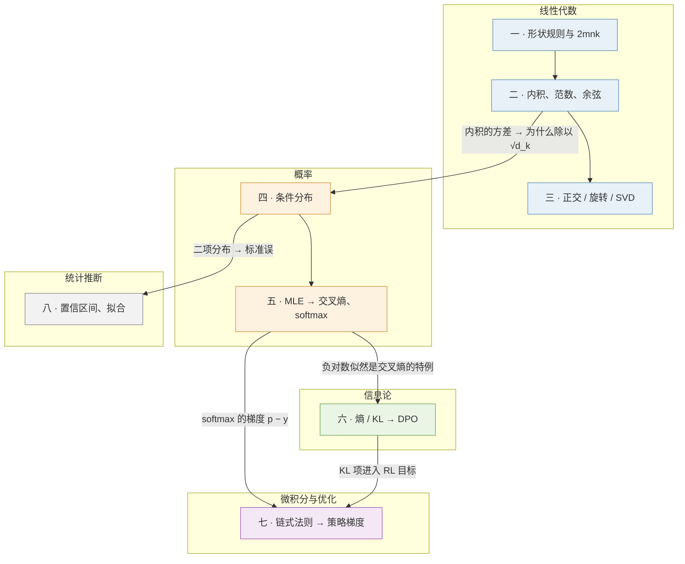

## 内容简介

《算法工程师的数学：读公式不卡壳的最小集》是一组共八篇的系列文章，对应[《AI 算法工程师学习地图》](/ai-algorithm-engineer-learning-roadmap.html)的第 L0 层，也是整张地图的第一个系列。它面向**会一门编程语言、大学数学基本忘光、还没有碰过 AI** 的读者，讲的是后面所有层——深度学习、Transformer、预训练、后训练、压缩、多模态——会反复用到的那一小块数学：**它们是什么、在 AI 里长什么样、怎么代进一个真实模型算出一个数字**。

它回答的问题是：

> **拿到一篇 LLM 论文，能不能读懂它的每一个公式；给一个建模假设，能不能推出它的训练 loss；给一个评测结果，能不能判断差异是真的还是噪声？[^q0]**

问算法工程师"需要多少数学"，得到的答案通常在两个极端之间摇摆：要么"不需要，调库就行"，要么"先把数学分析、矩阵论、测度论学完"。两个答案都不对。前者的问题是：读 DPO 论文卡在第一个公式、看到 loss 曲线不知道 1.8 是好是坏、把 A/B 差 1 个点当成结论；后者的问题是：学了两年还没有摸到模型。

正确的答案是一个**最小集**：把后面所有层要用到的数学列出来，只学这些，学到两个标准——**读公式不卡壳**（每个符号知道是什么、每个等号知道为什么成立），**推导 loss 不出错**（从建模假设出发，自己写出交叉熵、DPO、策略梯度的表达式）。本系列按这个标准，把数学分成四个分支、八篇文章，每篇只讲后面用得上的概念，每个概念说明它在哪一层、哪个公式里出现，并尽可能把它**算成一个数字**——因为算法工程师的数学最终要落到"这个决定花多少钱、这个差异是不是噪声"。

举一个例子说明这个系列的取法。"矩阵乘法"是每本线性代数教材的第一章；本系列第一篇要把它变成三件可用的事：（一）**形状规则**——$$[m, k] \times [k, n] \to [m, n]$$，内维必须相同，这是读任何模型结构图时的第一反应；（二）**成本规则**——每个输出元素 $$k$$ 次乘加，一共 $$2mnk$$ 次浮点运算；（三）**代一个数字**——Llama-3-8B 的隐藏维度 4096，一个 token 经过一个 $$4096 \times 4096$$ 的权重矩阵是 33.5 MFLOPs，4096 个 token 是 137 GFLOPs。会了这三件事，L4 里"训练一个模型要多少算力"整本账都只是它的重复应用。

系列覆盖的范围可以概括为四个分支（统计推断单列），共八篇；学完的检验标准是文末[自测](#自测八个公式)里的八个公式——每一个都能读懂，就可以离开 L0：

| 分支 | 概念 | 篇 |
|---|---|---|
| 线性代数 | 形状与 FLOPs · 内积 / 范数 / 余弦 · 正交 / 旋转 / SVD / 低秩 | 一、二、三 |
| 概率 | 条件分布与贝叶斯 · 最大似然 → 交叉熵 · softmax 与采样 | 四、五 |
| 信息论 | 熵 / 困惑度 · 交叉熵 = 熵 + KL · KL 的方向 · KL 约束下的最优策略 → DPO | 六 |
| 微积分与优化 | 链式法则 · softmax 的梯度 · 期望的梯度 → 策略梯度 · SGD 与学习率 | 七 |
| 统计推断 | 置信区间 · 显著性 · 最小二乘拟合 · scaling law | 八 |

Table: 数学系列覆盖的四个分支与对应篇目

## 为什么写这个系列？

### 数学只有在被用到时才记得住

"先学两年数学再碰模型"的路径大部分人走不完，原因不是难，而是没有用处就记不住。本系列的每一个概念都紧挨着它在 AI 里的用法出现：讲条件概率时讲的是"语言模型就是 $$p(x_t \mid x_{<t})$$"；讲 KL 散度时推的是 RLHF 的约束项与 DPO 的 loss；讲置信区间时算的是 HumanEval 上差 3 个点算不算显著。这样学下来的数学，读论文时是"知道它在说什么"，而不是"要看懂的东西"。

### 现有材料的断层

- **教材**（线性代数、概率论、数理统计、最优化各一本）完整但每本几百页，其中后面用到的不到十分之一，且不告诉你哪十分之一；
- **"机器学习的数学"类书籍**（Deisenroth 等《Mathematics for Machine Learning》是其中最好的）深度合适，但成书时 LLM 尚未出现，对不到 DPO、GRPO、scaling law 上；
- **论文与技术报告**假设读者会，公式一行带过；
- **博客**大多止于"KL 散度衡量两个分布的距离"这一句，不推、不算、不解释方向为什么重要。

本系列取的是中间那段路：只讲后面用到的部分，每个概念推到公式、代到真实模型算出数字，八篇加起来大约一本教材一章的篇幅。

## 适合哪些读者？

### 从零开始的 AI 学习者

你会写程序，但线性代数、概率论是几年前的课，现在只记得名字。本系列假设的起点正是这里：每个概念从定义讲起，不假设你记得任何公式。读完之后可以直接进 L1 工具箱与 L2 经典机器学习。

### 后端工程师转算法

你会用 API 调模型，想弄懂论文里的公式在说什么。数学是转型最大的缺口，但不需要系统补——按本系列的顺序，八篇过一遍，之后遇到读不懂的公式回来查对应的那一节。

### 做后训练但基础是"跳过来"的工程师

你在用 `trl` 做 SFT / DPO，能跑通，但不知道 DPO 的 loss 为什么长那样、$$\beta$$ 在控制什么、GRPO 里的优势为什么要减均值。第五、六、七篇是为此准备的：MLE → 交叉熵、KL 约束 → DPO、期望的梯度 → 策略梯度，三条推导链各在一页纸以内。

### 要做评测、要读实验结果的人

"提升了 1.5 个点"到底算不算提升？第八篇给出置信区间与显著性的算法，以及几个常用 benchmark 的实际数字。

## 系列的整体主线

八篇按"先会算形状与成本，再会把模型看成分布，再会度量分布之间的差，再会对目标求导，最后会判断实验结果"的顺序推进：

| 篇 | 主题 | 内容 |
|---|---|---|
| 一 | 向量、矩阵与形状 | 形状规则、$$2mnk$$、张量与广播；一个 token 过一层要算多少 |
| 二 | 内积、范数与余弦相似度 | attention score、embedding 检索、正则化项、量化误差 |
| 三 | 正交与旋转、特征值与 SVD | RoPE 为什么编码相对位置；低秩近似与 LoRA 的参数量 |
| 四 | 概率入门 | 语言模型是一个条件分布 贝叶斯 常见分布 为什么除以 $$\sqrt{d_k}$$ |
| 五 | 从最大似然到交叉熵 | 第一个要会推的 loss；softmax、温度与采样 |
| 六 | 熵、交叉熵与 KL | 困惑度 KL 的方向 从 KL 约束的最优策略推出 DPO |
| 七 | 导数、梯度与链式法则 | softmax 的梯度 $$p - y$$ 期望的梯度与策略梯度 SGD |
| 八 | 统计推断与拟合 | 评测的置信区间与显著性 最小二乘 scaling law 的算例 |

Table: 八篇的主题与内容

前三篇是**线性代数**：模型的每一层都是矩阵乘法，所有关于形状、成本、相似度、低秩的直觉都从这里来。第四、五篇是**概率**：把"语言模型"这个对象定义清楚——它是一个条件分布——然后从这个定义推出训练目标。第六篇是**信息论**：度量两个分布之间的差，后训练的全部约束项都是它。第七篇是**微积分与优化**：有了目标怎么求导、怎么更新。第八篇是**统计推断**：怎么判断一个结果不是噪声。

把这段话画出来：五个分支各占一列，每篇落在自己的分支里；箭头是**推导上的依赖**——箭头尾端的结论被箭头头端用作前提——不是阅读顺序。八篇按编号读没有问题；但如果只想弄懂某一个公式，沿箭头往回找就是它的最小前置。

```mermaid
%% 图：数学系列的推导依赖：五个分支各占一列，箭头是推导上的依赖而不是阅读顺序
flowchart TB
  subgraph LA["线性代数"]
    direction TB
    P1["一 · 形状规则与 2mnk"]
    P2["二 · 内积、范数、余弦"]
    P3["三 · 正交 / 旋转 / SVD"]
    P1 --> P2 --> P3
  end
  subgraph PR["概率"]
    direction TB
    P4["四 · 条件分布"]
    P5["五 · MLE → 交叉熵、softmax"]
    P4 --> P5
  end
  subgraph IT["信息论"]
    P6["六 · 熵 / KL → DPO"]
  end
  subgraph CA["微积分与优化"]
    P7["七 · 链式法则 → 策略梯度"]
  end
  subgraph ST["统计推断"]
    P8["八 · 置信区间、拟合"]
  end
  P2 -- "内积的方差 → 为什么除以 √d_k" --> P4
  P5 -- "负对数似然是交叉熵的特例" --> P6
  P5 -- "softmax 的梯度 p − y" --> P7
  P6 -- "KL 项进入 RL 目标" --> P7
  P4 -- "二项分布 → 标准误" --> P8
  classDef la fill:#e8f1f8,stroke:#5b8db8
  classDef pr fill:#fdf1e0,stroke:#d1913c
  classDef it fill:#eaf5e6,stroke:#6aa84f
  classDef ca fill:#f4e8f7,stroke:#9b59b6
  classDef st fill:#f2f2f2,stroke:#888
  class P1,P2,P3 la
  class P4,P5 pr
  class P6 it
  class P7 ca
  class P8 st
```

三条交织的线索——每篇推出什么、算出哪个数字、对应 LLM 里的什么——按篇列出来。**推导线**里每一项都是在那一篇里从上一项推出来的：形状规则给出矩阵乘法怎么算，内积是它的单个元素；条件分布定义了语言模型，MLE 是"选让数据概率最大的参数"，取负对数、除以 token 数就是交叉熵；交叉熵 = 熵 + KL 是一个恒等式（第六篇从三个量的定义两行展开得到）；KL 约束下的最优策略有闭式解，反解奖励代回偏好模型就是 DPO。表里的每一个箭头与等号，在对应篇里都有完整的推导，这里只列结果。

| 篇 | 推导线（这一篇推出的结论） | 数字线（代真实模型算出的数） | LLM 线（它在模型里是什么） |
|---|---|---|---|
| 一 | 形状规则 $$[m,k] \times [k,n] \to [m,n]$$、成本规则 $$2mnk$$ | 33.5 MFLOPs / token（Llama-3-8B 的一个 $$4096 \times 4096$$） | attention 与 MLP 的 GEMM |
| 二 | 内积、范数、余弦 = 内积 ÷ 两个长度 | $$\lVert W - \hat W \rVert_F$$ 不是量化该最小化的量 | attention score、embedding 检索 |
| 三 | 旋转矩阵正交 → RoPE 只依赖相对位置；截断 SVD 是最优低秩近似 | LoRA $$r = 16$$：41.9 M 参数、0.52% | RoPE、LoRA |
| 四 | 链式法则分解联合概率 → 语言模型是条件分布；独立和的方差相加 → 除以 $$\sqrt{d_k}$$ | 分量方差 $$\sigma^2$$ 时 $$D$$ 个分量的内积方差是 $$D\sigma^4$$（单位方差时 $$D$$） | next-token 预测、attention 的缩放 |
| 五 | MLE → 取负对数、除以 $$T$$ → 交叉熵 loss | 初始 loss $$= \ln V = 11.8$$ | SFT / 预训练的 loss、温度与采样 |
| 六 | 交叉熵 = 熵 + KL（恒等式）；KL 约束最优策略闭式解 → 反解奖励 → DPO | PPL $$= e^{1.8} = 6.05$$ | RLHF 的 KL 项、DPO、蒸馏 |
| 七 | 链式法则 → softmax 梯度 $$p - y$$ log-derivative trick → 策略梯度 减 baseline 不改期望 | — | 反向传播、REINFORCE / PPO / GRPO 的优势 |
| 八 | 中心极限定理 → 标准误 → 置信区间；幂律取对数是直线 → 最小二乘 | HumanEval ±6.1%；Chinchilla $$D/N \approx 20$$ | 评测的显著性、scaling law |

Table: 八篇的推导线、数字线与 LLM 线

每一篇都用同样的方法：**从定义讲起，推到公式，代入真实模型算出数字，指出它在后面哪一层、哪个公式里出现，篇末自测**。

## 每个分支在后面哪里用到

后面各层对四个分支的依赖是多对多的，用一张矩阵看：行是后面的层，列是四个分支，格子里是那一层用到的概念（"—"表示基本不用）。

| 后面的层 | 线性代数 | 概率与统计 | 信息论 | 微积分与优化 |
|---|---|---|---|---|
| **L3 深度学习**：反向传播、初始化、优化器 | 形状规则、范数 | — | — | 链式法则、SGD |
| **L4 Transformer**：attention 的 GEMM、RoPE、参数量 | 形状与 FLOPs、内积、旋转矩阵 | — | — | — |
| **L4 预训练**：交叉熵 loss、scaling law 拟合 | — | 条件分布、MLE | 交叉熵、困惑度 | 期望的梯度、学习率 |
| **L5 后训练**：奖励模型、DPO、PPO / GRPO、蒸馏 | — | Bradley-Terry、条件分布 | KL 及其方向、KL 约束下的最优策略 | 策略梯度 |
| **L5 评测**：置信区间、显著性 | — | 统计推断 | — | — |
| **L6 压缩**：量化误差、投机解码接受率、LoRA | 范数、SVD 与低秩 | — | [总变差距离](# "tip: total variation distance，两个分布 p、q 之间的距离：TV(p, q) = ½ Σ ∣p(x) − q(x)∣，取值 0 到 1，等于 1 − Σ min(p, q)。投机解码里草稿模型的 token 被接受的概率恰好是 1 − TV。第六篇讲。") | — |
| **L7 多模态**：[CLIP](# "tip: Contrastive Language–Image Pre-training，OpenAI 2021 年的图文模型：一个图片编码器、一个文本编码器，把图和文字映射进同一个向量空间，训练目标是让配对的图文余弦相似度高、不配对的低（对比学习）。第二篇讲余弦相似度时展开，L7 多模态第一篇讲它的 loss。") 对比学习、扩散的高斯噪声 | 内积与余弦相似度 | 高斯分布 | 对比学习的交叉熵 | — |

Table: 后面各层对四个数学分支的依赖矩阵

两个分支的去向值得先说明。**信息论**看起来最"理论"，却是后训练的主语言：SFT 的 loss 是交叉熵，RLHF 与 DPO 的约束是 KL，蒸馏的目标是 KL，投机解码的接受率是两个分布的[总变差](# "tip: 总变差距离（total variation distance）：TV(p, q) = ½ Σ ∣p(x) − q(x)∣，两个分布最多能差多少概率质量，取值 0 到 1。投机解码的接受率 = 1 − TV(目标分布, 草稿分布)。第六篇讲。")。**概率统计**里最容易被跳过的是统计推断那一半（置信区间、显著性），但它决定了 L5 评测的结论是否成立——没有它，"提升了 2 个点"只是一个没有含义的数字。

## 章节结构与分章导读

### 1. 向量、矩阵与形状：一个 token 过一层要算多少

第一篇建立整个系列最常用的两条规则：形状规则与成本规则。

这一篇会覆盖：

- 标量、向量、矩阵、张量：它们是什么、怎么写、在代码里是什么形状；
- 矩阵乘法的定义与形状规则：$$[m, k] \times [k, n] \to [m, n]$$，内维必须相同；
- 成本规则：每个输出元素 $$k$$ 次乘加，共 $$2mnk$$ FLOPs；FLOPs 是什么、怎么数；
- 转置、单位矩阵、逐元素运算、广播：训练代码里出现的形状操作；
- 代一个数字：Llama-3-8B 的 $$d = 4096$$，一个 token 过 $$W_Q$$ 是 33.5 MFLOPs，4096 个 token 是 137 GFLOPs；
- 一层 Transformer 有哪些矩阵、加起来多大——为 L4 的完整算账铺路。

核心问题是：

> **看到任何一个矩阵乘法，能不能立刻写出输出形状和 FLOPs？[^q1]**

### 2. 内积、范数与余弦相似度

第二篇讲向量之间怎么比较——这是 attention、检索、正则化、量化误差共用的一套语言。

这一篇会覆盖：

- 内积的定义与几何含义（投影、夹角）；attention score $$q^T k$$ 就是内积；
- $$L_2$$ 范数是长度，$$L_1$$ 范数是绝对值之和，Frobenius 范数是矩阵拉直后的 $$L_2$$；
- 余弦相似度：内积除以两个长度，只比方向不比大小；embedding 检索与 CLIP 用它；
- 范数作为正则化项：weight decay 的 $$\frac{\lambda}{2}\lVert W \rVert_F^2$$、Lasso 的 $$L_1$$ 为什么产生稀疏；
- 范数作为误差度量：量化把 $$W$$ 变成 $$\hat W$$，GPTQ 最小化的是 $$\lVert WX - \hat W X \rVert_F$$ 而不是 $$\lVert W - \hat W \rVert_F$$——逼近的是权重作用在输入上的结果。

核心问题是：

> **两个向量"像不像"有几种算法？各在哪里用？[^q2]**

### 3. 正交与旋转、特征值与 SVD：从 RoPE 到 LoRA

第三篇讲矩阵的两种"好性质"：正交（保持内积）与低秩（少量方向解释全部）。

这一篇会覆盖：

- 正交矩阵 $$R^T R = I$$ 保持内积；二维旋转矩阵；两次旋转等于角度相加；
- RoPE：把 query 与 key 按位置旋转，内积只依赖相对位置——一行推导；
- 秩：矩阵真正携带的自由度；SVD $$W = U \Sigma V^T$$ 的形状图与含义；
- 截断 SVD 是最好的低秩近似（Eckart–Young）；参数量从 $$mn$$ 降到 $$r(m + n)$$；
- LoRA：微调的改动假设低秩，$$\Delta W = BA$$；Llama-3-8B 上 $$r = 16$$ 只有 0.52% 的参数；
- 特征值是 SVD 在对称方阵上的特例：PCA、Hessian 的曲率——只需概念。

核心问题是：

> **RoPE 为什么能编码相对位置？LoRA 为什么能用半个百分点的参数微调？[^q3]**

### 4. 概率入门：语言模型是一个条件分布

第四篇从零建立概率的语言，然后用它给出语言模型的定义。

这一篇会覆盖：

- 随机变量与分布；联合、边缘、条件概率与它们的关系 $$p(a, b) = p(a \mid b)\,p(b)$$；
- 贝叶斯公式：它在最大后验、朴素贝叶斯、扩散模型的反向过程里出现；
- 独立性；期望与方差的定义与几条性质；
- 链式法则：序列的联合概率分解为逐 token 的条件概率——语言模型就是每一项的参数化；
- 常见分布与它们的出场：伯努利 / 二项（评测每道题对错）、类别（next-token）、高斯（初始化、扩散）、均匀；
- 高斯的两条性质：独立和的方差相加（初始化推导、扩散多步等价一步）、$$D$$ 个独立分量（每个方差 $$\sigma^2$$）的内积方差是 $$D\sigma^4$$，单位方差时就是 $$D$$——这是 attention 除以 $$\sqrt{d_k}$$ 的原因。

核心问题是：

> **"语言模型是一个条件分布"这句话的每个词是什么意思？它决定了哪些事？**

### 5. 从最大似然到交叉熵：第一个要会推的 loss

第五篇推出训练日志里那个 loss 从哪里来。

这一篇会覆盖：

- 最大似然估计：从一枚抛了 10 次的硬币开始——选让训练集出现概率最大的参数；似然曲线画出来；
- 语言模型是一个会看上下文的骰子：三个 token 的玩具模型，一句话的概率逐位相乘，两个候选参数谁的似然大；
- 三步推导：乘积取对数变求和（1000 个 0.01 相乘为什么是 0）、取负变最小化、除以 token 数——就是每 token 的负对数似然；$$-\log p$$ 的曲线；bit 是"猜数字要问几个问题"；
- SFT 的 loss mask（画出一条真实对话的 26 个 token 哪 3 个算 loss）、奖励模型（曲线）、DPO 都是同一个模板换一个概率；
- 一个立刻能用的数字：训练开始时 loss 约为 $$\ln V$$——nanoGPT 莎士比亚实测首步 4.1676 vs $$\ln 65 = 4.174$$；三种 bug（初始化太大、目标泄漏、pad 算进 loss）的曲线各长什么样；
- softmax：为什么用指数；手算与 PyTorch 对拍；GPT-2 在"确定"与"开放"位置的真实分布；温度、top-k、top-p 在真实分布上的效果；
- 减去最大值的数值技巧，以及它在 FlashAttention 在线 softmax 里的形态；
- 案例：读懂一条真实训练日志——困惑度、bits/char、train–val 差距。

核心问题是：

> **能不能从"语言模型是条件分布"出发，三行推出交叉熵 loss？[^q4]**

### 6. 熵、交叉熵与 KL：从困惑度到 DPO

第六篇是后训练的主语言：三个量的定义、它们之间的等式、KL 的方向、以及一条完整的推导链。

这一篇会覆盖：

- 熵：不确定程度；nat 与 bit；困惑度 $$e^{\text{loss}}$$ 的直觉，loss 1.8 对应 PPL 6.05；
- 交叉熵 = 熵 + KL；训练时 $$p$$ 是 one-hot 所以交叉熵就是负对数似然；蒸馏时 $$p$$ 是软分布；
- 数据本身有熵，loss 降不到 0：Chinchilla 的 $$E = 1.69$$；
- KL 的方向：forward 覆盖模式、reverse 寻找模式；RLHF 的 KL 项是 reverse——"对齐降低多样性"的数学根源；
- Bradley-Terry：偏好如何变成概率，奖励模型的 loss 是逻辑回归；
- KL 约束下的最优策略有闭式解；反解奖励、代入 Bradley-Terry、$$Z(x)$$ 抵消——得到 DPO；
- 总变差距离与投机解码的接受率；互信息与对比学习。

核心问题是：

> **能不能分清熵、交叉熵、KL 各是什么？能不能从 KL 约束的最优策略推出 DPO 的 loss？**

### 7. 导数、梯度与链式法则：softmax 的梯度与策略梯度

第七篇讲"有了目标怎么求导、怎么更新"。

这一篇会覆盖：

- 导数是割线的极限（画出来）；偏导、梯度、Jacobian 各是什么形状；梯度垂直于等高线、指向增长最快的方向（箭头场）；
- 链式法则：复合函数的导数是局部导数的乘积；计算图上"每条路径相乘、不同路径相加"；手算、`autograd`、有限差分三方对拍；反向传播是它的逐层套用；
- softmax + 交叉熵的梯度 $$p - y$$：两步推导；它说明的三件事；
- 期望的梯度：分布依赖参数时不能直接把梯度移进期望；log-derivative trick；
- 策略梯度 REINFORCE——用一个 10 个 token 的玩具策略把精确梯度算出来，与采样估计比：无偏但方差大；减 baseline 方差减半、减错了更糟；奖励整体抬高 10 分时不减 baseline 的 REINFORCE 会坍缩；GRPO 的 $$1 - 1/G$$ 偏差精确枚举出来；PPO 与 GRPO 各在改哪一步；
- 梯度下降：三种学习率的轨迹、学习率上限由最陡方向的曲率决定、随机梯度的噪声、warmup；凸与非凸、鞍点——只到概念；拉格朗日乘子的相切图；
- 案例：在莎士比亚 nanoGPT 上用元音比例做奖励跑一次最小的 RL——奖励怎么涨、模型怎么坏（全写 `i`）、KL 惩罚怎么刹车。

核心问题是：

> **能不能用链式法则推一层的梯度？能不能对一个期望求导，得到策略梯度？**

### 8. 统计推断与拟合：评测的置信区间与 scaling law

第八篇讲怎么判断一个数字是不是噪声，以及怎么从一组数字拟合一条规律。

这一篇会覆盖：

- 抽样噪声长什么样：同一个 80% 的模型在 164 题上评 1000 次，正确率从 0.70 散到 0.89；标准误就是这团散布的标准差；中心极限定理画出来；
- 置信区间：$$\hat p \pm 1.96 \times$$ 标准误；100 个区间里 94 个盖住真值；HumanEval / GSM8K / MMLU 的实际数字；
- 两个模型的比较：真差 3 个点的两个模型，独立比较 24% 的次数看起来反了；同一套题的配对检验，分歧题越少越灵敏；
- 假设检验与 p 值：置换检验直接把 p 值算出来；三个误读各配一个数字；**实跑 20 次训练**的多种子实验——+20% 学习率显著、+2% 分不出来、单种子对比 8% 会反向；
- 最小二乘：5 个点手算直线与残差；幂律取对数后是直线——为什么 scaling law 的图都是双对数；
- 用 7 个真实小模型拟一条自己的 scaling law：bootstrap 区间很窄但外推的第 7 个点落在区间外——误差来自公式形式不是噪声；
- Chinchilla 的拟合式与五个常数；等 loss 线与等算力线相切给出最优 $$N, D$$；$$D/N \approx 20$$ 从哪来、为什么是一个区间；代两组数字感受"过训练"的取舍；
- 案例：读到"提升了 1.5 个点"时的七问检查表。

核心问题是：

> **HumanEval 上差 3 个点算不算提升？scaling law 的曲线是怎么拟出来的？[^q5]**

### 9. 系列总结与通关自测

最后一篇不讲新内容：把八篇正文压成一张「问题 → 结论 → 必记数字」的表并逐篇回顾，拎出贯穿全系列的几条线与常见误区，然后给一套三段式通关自测——十道判断与计算、五道跨篇综合、若干道面试题，答案各自折叠，附「读过 / 掌握 / 能教人」的判据。各篇末尾的自测检验的是一篇读懂了没有，这一篇检验的是八篇能不能连起来用；读完正文再做。

## 前置要求与说明

### 前置要求

- 高中数学：函数、指数与对数、求和符号；
- 会一门编程语言，看得懂几行伪代码；
- 不要求记得任何大学数学；不要求了解任何 AI 概念——用到的（token、attention、loss）都会在出现时用一句话解释。

### 配套代码

前四篇与第六篇的算例都能手算，有意不配脚本，目的是建立"看到公式先代个数"的习惯。第五、七、八篇的例子、图与实验由 [ai-learning-labs/math-for-ai](https://github.com/arganzheng/ai-learning-labs/tree/main/math-for-ai) 生成——硬币的似然曲线、GPT-2 的真实分布、10 个 token 的策略梯度实验、在 nanoGPT 上跑的最小 RL、20 次实跑的多种子对比、7 个小模型的 scaling law 拟合——CPU 可跑，每个脚本几分钟，文中每个数字都能对上。

### 关于文中指向后面文章的链接

本系列是地图的第一层，正文里会说"这个概念在 L4 的《Transformer 与 LLM》第六篇用来算整个模型的账"。这些链接都是**去向**——告诉你这个概念将在哪里用到、用到什么程度，不是前置阅读；按地图顺序学的读者读到这里时那些文章还没读，这是预期的。

### 版本与基线

- 算账时引用的真实模型：Llama-3-8B（$$d = 4096$$、32 层、词表 128256）、Llama-3.1 系列的公开配置；benchmark 题数取自各自的官方版本（HumanEval 164、GSM8K 1319、MMLU 14042）；
- scaling law 的常数取自 Chinchilla 论文（Hoffmann 等 2022）；
- 论文引用以第一作者与年份标注。

## 章节目录

1. [向量、矩阵与形状：一个 token 过一层要算多少](/vectors-matrices-shapes-and-flops.html)
2. [内积、范数与余弦相似度](/inner-product-norms-and-cosine-similarity.html)
3. [正交与旋转、特征值与 SVD：从 RoPE 到 LoRA](/orthogonal-rotation-svd-and-low-rank.html)
4. [概率入门：语言模型是一个条件分布](/probability-basics-language-model-as-conditional-distribution.html)
5. [从最大似然到交叉熵：第一个要会推的 loss](/from-maximum-likelihood-to-cross-entropy.html)
6. [熵、交叉熵与 KL：从困惑度到 DPO](/entropy-cross-entropy-and-kl-to-dpo.html)
7. [导数、梯度与链式法则：softmax 的梯度与策略梯度](/derivatives-gradients-chain-rule-and-policy-gradient.html)
8. [统计推断与拟合：评测的置信区间与 scaling law](/statistical-inference-and-fitting-scaling-laws.html)
9. [系列总结与通关自测](/math-for-ai-series-recap-and-self-test.html)

## 自测：八个公式

这八个公式是 L0 的**出口标准**。第一次读到这里读不懂它们是正常的；正确的用法是**带着这张表去学**：卡在哪一个，看它右边那列，去读对应的那一篇，学完再回来。检验的标准是：每个符号知道是什么、每一步等号知道为什么、能说出它在算什么。

| # | 公式 | 出处 | 用到的分支（本系列哪一篇） |
|---|---|---|---|
| 1 | $$\mathcal{L} = -\frac{1}{T}\sum_t \log p_\theta(x_t \mid x_{<t})$$ | 预训练 / SFT 的 loss | 概率：链式法则、MLE（四、五）· 信息论：交叉熵（六） |
| 2 | $$\partial \mathcal{L} / \partial z = p - y$$ | softmax 与交叉熵的梯度 | 概率：softmax（五）· 微积分：链式法则（七） |
| 3 | $$\text{Attention}(Q, K, V) = \text{softmax}(QK^T / \sqrt{d_k})\, V$$ | Transformer | 线性代数：形状与内积（一、二）· 概率：为什么除 $$\sqrt{d_k}$$（四） |
| 4 | $$(R_{m\theta} q)^T (R_{n\theta} k) = q^T R_{(n-m)\theta} k$$ | RoPE | 线性代数：正交与旋转矩阵（三） |
| 5 | $$L(N, D) = E + A/N^\alpha + B/D^\beta$$，$$C \approx 6ND$$ | Chinchilla scaling law | 优化：约束极值、统计：拟合（八） |
| 6 | $$-\log \sigma(\beta \log \frac{\pi_\theta(y_w)}{\pi_{\text{ref}}(y_w)} - \beta \log \frac{\pi_\theta(y_l)}{\pi_{\text{ref}}(y_l)})$$ | DPO | 概率：Bradley-Terry、信息论：KL 方向与约束最优策略（六） |
| 7 | $$\nabla_\theta J = \mathbb{E}_{\pi_\theta}[A(y)\, \nabla_\theta \log \pi_\theta(y)]$$ | 策略梯度 / PPO / GRPO | 微积分：期望的梯度（七） |
| 8 | $$\alpha = \sum_x \min(p(x), q(x))$$ | 投机解码接受率 | 信息论：总变差距离（六） |

Table: L0 出口标准：八个公式及其出处

八个都能读懂，L0 就够了，可以进入 L1；卡在哪一个，就按右边那列回到对应的那一篇。不需要"学完再走"——后面各层的文章本身就是最好的练习题。

## 最终目标

读完这套系列之后，面对一篇 LLM 论文或一份实验结果，读者应该能够回答下面这些问题。每个问题的答案压成一两句放在脚注里（读完系列再点开核对；每条答案末尾指向讲它的那一篇）：

| 问题 | 篇 |
|---|---|
| 这个矩阵乘法的输出是什么形状、要算多少？[^q6] | [一](/vectors-matrices-shapes-and-flops.html) |
| attention score 为什么是内积？检索为什么用余弦？[^q7] | [二](/inner-product-norms-and-cosine-similarity.html) |
| RoPE 为什么编码相对位置？[^q8] LoRA 的 $$r = 16$$ 加了多少参数？[^q9] | [三](/orthogonal-rotation-svd-and-low-rank.html) |
| "语言模型是条件分布"决定了哪些事？[^q10] 为什么除以 $$\sqrt{d_k}$$？[^q11] | [四](/probability-basics-language-model-as-conditional-distribution.html) |
| 训练日志里的 loss 是什么？开始时应该是多少？[^q12] | [五](/from-maximum-likelihood-to-cross-entropy.html) |
| PPL 6 是什么意思？[^q13] RLHF 的 KL 项为什么让模型变"保守"？[^q14] DPO 从哪来？[^q15] | [六](/entropy-cross-entropy-and-kl-to-dpo.html) |
| GRPO 的优势为什么减均值？[^q16] 学习率太大会怎样？[^q17] | [七](/derivatives-gradients-chain-rule-and-policy-gradient.html) |
| HumanEval 差 3 个点算不算提升？[^q18] $$D/N \approx 20$$ 是怎么算出来的？[^q19] | [八](/statistical-inference-and-fitting-scaling-laws.html) |

Table: 读完数学系列后应能回答的问题

最终目标是三种能力：

1. **读公式**：每个符号知道是什么、每个等号知道为什么成立；
2. **推 loss**：从建模假设出发，自己写出交叉熵、DPO、策略梯度的表达式；
3. **算数字**：把公式代到真实模型与真实 benchmark 上，回答"花多少钱、是不是噪声"。

这一层是整张地图的地基。它不难，但没有它，后面每一层的公式都只能靠背。

[^q0]: 读完八篇的目标就是这三件事，判据是「读公式不卡壳、推导 loss 不出错、把差异算成数字」：（一）读公式——每个符号知道是什么、每个等号知道为什么成立，靠线性代数（形状、内积、范数、SVD）与概率（条件分布、期望、KL）两套语言；（二）推 loss——从「语言模型是条件分布」+ 最大似然三行推出交叉熵，从 Bradley-Terry + RLHF 闭式解推出 DPO，从期望回报求导推出策略梯度；（三）判差异——给评测结果算标准误与置信区间（HumanEval 164 题差 3 个点在噪声范围内），用最小二乘拟合 scaling law 并看残差。上表「问题 → 篇」给出每个问题对应的章节与答案。
[^q1]: 能，两条规则：形状 $$[m,k]\times[k,n]\to[m,n]$$（内维必须相同）；成本每个输出元素 $$k$$ 次乘加，共 $$2mnk$$ FLOPs。代数字：一个 token 过 Llama-3-8B 的 $$4096\times 4096$$ 权重是 33.5 MFLOPs，4096 个 token 是 137 GFLOPs；整模型一个 token 前向约 $$2N$$、训练约 $$6N$$ FLOPs。第一篇把这两条规则套在 attention 的四个矩阵、FFN 与 lm_head 上逐个算一遍。
[^q2]: 三种：**内积** $$q^\top k$$（既看方向也看长度，attention score 用它，因为长度本身携带信息且可学）；**余弦相似度**（内积除以两个范数，只看方向，embedding 检索用它，因为不同文本的向量长度无意义）；**距离 / 范数** $$\lVert a-b\rVert$$（L2 距离用于聚类与量化误差，L1 用于稀疏正则，Frobenius 范数用于权重衰减与矩阵近似误差）。第二篇把三者的几何含义（投影、夹角）与适用场景逐个对应。
[^q3]: RoPE 把 $$q$$、$$k$$ 各按位置旋转 $$R_m$$、$$R_n$$，正交矩阵保持内积，两次旋转等于角度相加，于是 $$\langle R_m q, R_n k\rangle = \langle q, R_{n-m} k\rangle$$ 只依赖相对位置 $$n-m$$，绝对位置被抵消。LoRA 的依据是微调的权重增量 $$\Delta W$$ 近似低秩：SVD 说明少量奇异方向解释了大部分能量，所以把 $$\Delta W$$ 写成 $$BA$$（$$r=16$$ 时一个 $$4096\times4096$$ 矩阵只需 $$2\times 4096\times 16 = 131{,}072$$ 个参数，不到原矩阵的 1%），Llama-3-8B 全部挂上约 41.9M 可训练参数——半个百分点。
[^q4]: 能：（1）建模假设——序列概率按链式法则分解为 $$p(x)=\prod_t p(x_t\mid x_{<t})$$，模型输出每一步的条件分布；（2）最大似然——最大化训练数据的对数似然 $$\sum_t \log p_\theta(x_t\mid x_{<t})$$；（3）取负号、按 token 平均，就是交叉熵 loss $$-\frac{1}{T}\sum_t \log p_\theta(x_t\mid x_{<t})$$。它等于真实分布与模型分布的交叉熵，因此 loss 的下界是数据的熵、$$e^{\text{loss}}$$ 是困惑度；训练开始时 loss 应接近 $$\ln V$$（词表 128K 时 11.8）。
[^q5]: 多半不算：HumanEval 只有 164 题，pass@1 为 $$p$$ 时标准误 $$\sqrt{p(1-p)/164}$$ 约 3.5–3.9 个点，3 个点在一个标准误以内；要看多 seed / 多次采样的方差、做配对检验、或换更大的评测集。scaling law 的曲线是在对数坐标下对 $$(N, L)$$ 或 $$(C, L)$$ 做最小二乘拟合幂律 $$L = E + A/N^\alpha + B/D^\beta$$，Chinchilla 用 400 多个 70M–16B 的模型拟出 $$D/N\approx 20$$；拟合要看残差与外推区间，几个点决定的指数误差很大。
[^q6]: 形状规则：$$[m, k] \times [k, n] \to [m, n]$$，内维必须相同，批维度括起来只看最后两维；成本规则：$$2mnk$$ FLOPs——每个输出元素 $$k$$ 次乘加。一个 token 过 Llama-3-8B 的一个 $$4096 \times 4096$$ 矩阵是 $$2 \times 4096^2 \approx 33.5$$ MFLOPs；过整个模型约 $$2N$$。[第一篇](/vectors-matrices-shapes-and-flops.html)。
[^q7]: 内积同时含方向与大小、且 $$QK^T$$ 一次矩阵乘就算出所有 token 对的内积，query 的长度本身还携带"这个 token 想看多少"的信息；检索库里的向量长度不一、只关心方向，所以用余弦（内积除以两个长度）——向量都归一化之后余弦退化为内积，仍是一次矩阵乘。[第二篇](/inner-product-norms-and-cosine-similarity.html)。
[^q8]: 把位置 $$m$$ 的 query 旋转 $$m\theta$$、位置 $$n$$ 的 key 旋转 $$n\theta$$；旋转矩阵正交且 $$R_\alpha^T R_\beta = R_{\beta - \alpha}$$，所以 $$(R_{m\theta} q)^T (R_{n\theta} k) = q^T R_{(n - m)\theta} k$$ 只依赖相对位置 $$n - m$$。[第三篇](/orthogonal-rotation-svd-and-low-rank.html)。
[^q9]: 每个矩阵加 $$r(\text{in} + \text{out})$$ 个参数（$$\Delta W = BA$$ 两个瘦矩阵）。Llama-3-8B 一层七个矩阵 1.31 M、32 层 **41.9 M**，占 8.03 B 的 **0.52%**。[第三篇](/orthogonal-rotation-svd-and-low-rank.html)。
[^q10]: 训练目标是让每个位置给真实下一个 token 的概率最大（MLE → 交叉熵）；生成只能逐 token 采样、每步以上一步为条件（所以有 KV cache）；换温度 / top-p 就是换分布，评测必须固定采样设置；RL 里的策略 $$\pi(y \mid x)$$ 就是这个条件分布，整条回答的概率是逐 token 概率的乘积。[第四篇](/probability-basics-language-model-as-conditional-distribution.html)。
[^q11]: $$q$$、$$k$$ 各分量独立、零均值、方差 $$\sigma^2$$ 时，每个乘积 $$q_i k_i$$ 的方差是 $$\sigma^4$$，$$D = d_k$$ 个相加得 $$d_k \sigma^4$$（单位方差时是 $$d_k$$）；除以 $$\sqrt{d_k}$$ 把方差拉回 $$\sigma^4$$（单位方差时回到 1），softmax 才不会一开始就饱和成 one-hot。[第四篇](/probability-basics-language-model-as-conditional-distribution.html)。
[^q12]: 每 token 的负对数似然 $$-\frac{1}{T}\sum_t \log p_\theta(x_t \mid x_{<t})$$，单位 nat，从 MLE 取负对数、除以 token 数三步得到。开始时模型近似均匀，loss $$\approx \ln V$$——Llama-3 的词表 128256 给 **11.8**；远大于它是初始化太大，远小于它是数据泄漏或算错。[第五篇](/from-maximum-likelihood-to-cross-entropy.html)。
[^q13]: PPL $$= e^{\text{loss}}$$：loss 1.8 nat 对应 PPL $$e^{1.8} = 6.05$$，含义是模型平均每步在约 6 个等可能的候选里犹豫。[第六篇](/entropy-cross-entropy-and-kl-to-dpo.html)。
[^q14]: RLHF 的约束项 $$\text{KL}(\pi \,\Vert\, \pi_{\text{ref}})$$ 期望在 $$\pi$$ 上取，是 **reverse** 方向（mode-seeking）：策略可以放弃参考模型的部分模式（惩罚小），但不能去参考模型认为不可能的地方（惩罚巨大）——所以分布收窄、多样性下降。[第六篇](/entropy-cross-entropy-and-kl-to-dpo.html)。
[^q15]: 四步：KL 约束下的最优策略有闭式解 $$\pi^* \propto \pi_{\text{ref}}\, e^{r/\beta}$$；反解出 $$r = \beta \log(\pi^*/\pi_{\text{ref}}) + \beta \log Z$$；代入 Bradley-Terry 的 $$\sigma(r_w - r_l)$$；同一 prompt 的 $$\log Z$$ 抵消，剩下只含策略与参考模型的 loss——就是 DPO。[第六篇](/entropy-cross-entropy-and-kl-to-dpo.html)。
[^q16]: 策略梯度 $$\mathbb{E}[R(y)\nabla \log \pi_\theta(y)]$$ 里减去一个与 $$y$$ 无关的 baseline，期望不变（$$\mathbb{E}[\nabla \log \pi] = 0$$）、方差降低；GRPO 用同一 prompt 的组内均值当 baseline——但组均值含自身，不满足"与 $$y$$ 无关"，估计有 $$(1-1/G)$$ 的缩放偏差，$$G$$ 大时可忽略；减均值后的 $$R - \bar R$$ 就是优势。[第七篇](/derivatives-gradients-chain-rule-and-policy-gradient.html)。
[^q17]: 每步跨过谷底，loss 震荡或发散（爆成 NaN）；太小则几乎不动。随机梯度的噪声方差 $$\propto 1/B$$ 决定学习率上限，所以训练初期要 warmup。[第七篇](/derivatives-gradients-chain-rule-and-policy-gradient.html)。
[^q18]: 分辨不出。HumanEval 只有 164 题：准确率 80% 时标准误 $$\sqrt{0.8 \times 0.2 / 164} \approx 3.1$$ 个点，95% 区间约 **±6.1 个点**（50% 时 ±7.7）——3 个点在噪声里。正确做法是同一批题的配对比较，它比独立比较灵敏得多。[第八篇](/statistical-inference-and-fitting-scaling-laws.html)。
[^q19]: 固定算力 $$C = 6ND$$，对 $$L(N, D) = E + A/N^\alpha + B/D^\beta$$ 用拉格朗日乘子求极值，$$N^*$$、$$D^*$$ 都随 $$C$$ 的约 0.5 次幂增长，比值由 $$A, B, \alpha, \beta$$ 决定，Chinchilla 拟出来约 20（70B 对应 1.4T token）；拟合常数有标准误，20 是一个区间不是常数。[第八篇](/statistical-inference-and-fitting-scaling-laws.html)。
