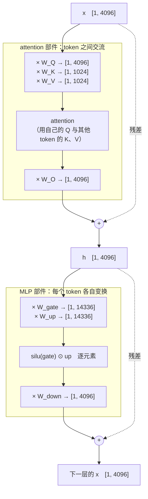

打开任何一个大模型的结构图，看到的全是矩阵乘法：一个 token（模型处理文字的最小单位，大致是一个词或半个词——"我爱北京"约 3 个 token，"tokenizer" 会被切成两三个；模型读到的不是字，而是 token 的编号）变成一个向量，向量乘一个矩阵变成另一个向量，再乘一个矩阵……几十层之后输出下一个 token 的概率。所以线性代数在 AI 里的第一个用处不是什么高深的定理，而是两条极其朴素的规则：**形状规则**（什么形状乘什么形状得到什么形状）与**成本规则**（这一乘要算多少次）。会了这两条，读模型结构图、算训练成本、判断"这个改动为什么慢"都有了起点。

本篇从零建立这两条规则。全篇的核心问题是：

> **看到任何一个矩阵乘法，能不能立刻写出输出形状和 FLOPs？[^q0] 能不能代入一个真实模型算出一个数字？[^q1]**

## 一、总览

### 1. 本文的对象

Llama-3-8B 的一层里最常见的一步：一个 token 的表示（一个长 4096 的向量）乘一个 $$4096 \times 4096$$ 的权重矩阵。本文要把这一步的每个字都解释清楚——"长 4096 的向量"是什么、"$$4096 \times 4096$$ 的矩阵"是什么、"乘"是怎么定义的、算了多少次——然后把它推广到一层、一个模型。

### 2. 本文的章节安排

| 章 | 主题 | 内容 |
|---|---|---|
| 二 | 从标量到张量 | 标量、向量、矩阵、张量各是什么、怎么写、代码里是什么形状 |
| 三 | 矩阵乘法与形状规则 | 定义、内维必须相同、三种看法、单位矩阵与转置 |
| 四 | 成本规则 | FLOPs 是什么、$$2mnk$$ 从哪来、代 Llama-3-8B 的数字 |
| 五 | 训练代码里的形状操作 | 批维度、逐元素运算、广播、reshape |
| 六 | 一层 Transformer 有哪些矩阵 | 七个权重矩阵、一层的参数量与 FLOPs、为 L4 的算账铺路 |
| 七 | 本文小结 | |
| 八 | 自测 | 五道题 |

## 二、从标量到张量

### 1. 四种东西

数学里的"数"按维度分四种，代码里对应四种形状：

| 名字 | 例子 | 维度 | 代码里的形状（shape） |
|---|---|---:|---|
| 标量 | `3.7` | 0 | `()` |
| 向量 | `(0.2, -1.1, 0.5)` | 1 | `(3,)` |
| 矩阵 | `[[1, 2, 3], [4, 5, 6]]` | 2 | `(2, 3)`——2 行 3 列 |
| 张量 | 一批 32 张 28×28 的灰度图 | 3 | `(32, 28, 28)` |

**标量**（scalar）是一个数：学习率 0.001、loss 1.83、温度 0.7。

**向量**（vector）是一列数，用一个粗体或普通小写字母写 $$a = (a_1, a_2, \dots, a_d)$$，$$d$$ 叫它的**维度**或**长度**。在 AI 里，**一个 token 在模型里的表示就是一个向量**：Llama-3-8B 里每个 token 是一个长 4096 的向量，这个 4096 叫**隐藏维度**（hidden size），写作 $$d$$ 或 $$d_{\text{model}}$$。"隐藏"是沿用神经网络的老说法：输入层的值（token 的编号）与输出层的值（下一个 token 的概率）是外面能看到的，夹在中间那几十层的向量对外不可见，所以叫**隐藏层**，它的宽度就叫隐藏维度——没有别的含义。

"列向量"需要说清楚，因为它常引起困惑：向量本身没有横竖，代码里就是一个一维数组 `(4096,)`。**横竖是数学书写的约定**——为了让"矩阵乘向量"能按矩阵乘法的规则算（下一章），要把 $$d$$ 个数当成一个 $$d \times 1$$ 的矩阵（竖着排，**列向量**）或 $$1 \times d$$ 的矩阵（横着排，**行向量**）。教材默认竖着排，写 $$Wx$$；$$a^T$$ 表示把它横过来——$$T$$ 是**转置**（transpose）。本文与 PyTorch 的代码习惯是横着排、写 $$xW$$（第三章第 4 节会对照这两种写法），两者说的是同一个向量。

**矩阵**（matrix）是一张数表，$$m$$ 行 $$n$$ 列写作 $$W \in \mathbb{R}^{m \times n}$$（读作"$$W$$ 是一个 $$m$$ 乘 $$n$$ 的实数矩阵"），第 $$i$$ 行第 $$j$$ 列的元素写 $$W_{ij}$$。在 AI 里，**模型的参数几乎全是矩阵**：一个 $$4096 \times 4096$$ 的矩阵有 $$4096 \times 4096 = 16{,}777{,}216$$ 个数，约 16.8M 参数。

**张量**（tensor）是三维及以上的数表。它没有更多的数学，只是"矩阵再堆一维"：一批 32 个句子、每句 512 个 token、每个 token 4096 维，就是一个形状 $$(32, 512, 4096)$$ 的三维张量。PyTorch 里所有东西都叫 tensor，包括 0 维的标量；但数学运算——尤其是矩阵乘法——只作用在**最后两维**上，其余维度只是"有很多份"。具体地说：形状 $$(32, 512, 4096)$$ 的张量乘一个 $$4096 \times 4096$$ 的矩阵 $$W$$，做的是 **32 次一样的 $$[512 \times 4096] \times [4096 \times 4096]$$ 矩阵乘法**——第 1 句话的 512 个 token 乘 $$W$$、第 2 句话的 512 个 token 乘同一个 $$W$$……得到 $$(32, 512, 4096)$$。前面那个 32 不参与任何数学运算，只表示"这件事做 32 份"。这不是因为右边恰好是二维矩阵：**矩阵乘法的定义本身就是二维运算**——一行乘一列。两个三维张量相乘（`torch.matmul` 的 $$(32, 512, 4096) \times (32, 4096, 64)$$）仍然是逐份做 32 次 $$[512 \times 4096] \times [4096 \times 64]$$，第一维只要求两边相等（或可广播），从不参与乘加；不存在"三维都参与"的矩阵乘法。真要让三个维度同时参与求和，用的是别的运算——`einsum` 或 `tensordot` 指定沿哪些维求和（L1 第二篇第四章）。第五章第 1 节再展开批维度的账。

对后端工程师，一个有用的事实：不论几维，张量在内存里都是**一段连续的一维数组**，外加两组元数据——`shape`（每一维多长）和 `stride`（沿每一维走一步要跳过多少个元素）。形状 $$(32, 512, 4096)$$ 的张量就是 $$32 \times 512 \times 4096$$ 个 float 排成一行，元素 `[b, t, i]` 在第 `b*512*4096 + t*4096 + i` 个位置——与一个带 `int[] shape, stride` 元数据的 `ByteBuffer` 没有本质区别。"几维"是读法，不是存法；形状不匹配的报错发生在元数据检查，与内存无关。这个事实解释了本篇第五章的 reshape / view 为什么零成本、广播为什么不复制内存，也是 Infra 地图 [03 系列](/deep-dive-into-pytorch.html)讲 `TensorImpl` 与 storage 的起点。

### 2. 怎么读形状

读形状的习惯是本篇最想建立的东西。看到任何一个量，先问"它是几维的、每一维是多少、每一维代表什么"。

| 量 | 几维 | 每一维代表什么 |
|---|---:|---|
| $$x \in \mathbb{R}^{4096}$$ | 1 | 一个 token 的表示：4096 个数 |
| $$X \in \mathbb{R}^{512 \times 4096}$$ | 2 | 一句话 512 个 token：512 行，每行是一个 token 的表示 |
| $$W \in \mathbb{R}^{4096 \times 4096}$$ | 2 | 一个权重矩阵：把 4096 维映到 4096 维 |
| `X[32, 512, 4096]` | 3 | 32 句话，每句 512 个 token，每个 token 4096 维 |

约定：本系列把"一批 token"写成**每行一个 token** 的矩阵 $$X \in \mathbb{R}^{T \times d}$$——$$T$$ 是**一句话里的 token 数**（序列长度，seq），$$d$$ 是每个 token 的维度（hidden）。这是 PyTorch 布局 `[batch, seq, hidden]` 去掉第一维的样子：三维的 `[B, T, d]` 里 $$B$$ 是第几句话、$$T$$ 是句内第几个 token、$$d$$ 是特征——最后一维永远是特征。公式里通常省掉 $$B$$，因为矩阵乘法对每句话做的事完全一样（上一节说的"有很多份"），写出来只是多一层括号；代码里 $$B$$ 是真实存在的，第五章第 1 节讨论它怎么进成本账。

## 三、矩阵乘法与形状规则

### 1. 定义

矩阵 $$A \in \mathbb{R}^{m \times k}$$ 与 $$B \in \mathbb{R}^{k \times n}$$ 的乘积 $$C = AB \in \mathbb{R}^{m \times n}$$，每个元素是

$$
C_{ij} = \sum_{l=1}^{k} A_{il}\, B_{lj}
$$

——$$A$$ 的第 $$i$$ **行**与 $$B$$ 的第 $$j$$ **列**对应位置相乘再加起来。画出来：


注意三个矩形的边长：$$A$$ 的宽（$$k$$ 列）等于 $$B$$ 的高（$$k$$ 行）——这就是下一节"内维相同"的几何形象；$$C$$ 的高取自 $$A$$、宽取自 $$B$$。

一个能手算的例子（$$m = 2, k = 3, n = 2$$）：

$$
\begin{pmatrix} 1 & 2 & 3 \\ 4 & 5 & 6 \end{pmatrix}
\begin{pmatrix} 1 & 0 \\ 0 & 1 \\ 1 & 1 \end{pmatrix}
=
\begin{pmatrix} 1\cdot1 + 2\cdot0 + 3\cdot1 & 1\cdot0 + 2\cdot1 + 3\cdot1 \\ 4\cdot1 + 5\cdot0 + 6\cdot1 & 4\cdot0 + 5\cdot1 + 6\cdot1 \end{pmatrix}
=
\begin{pmatrix} 4 & 5 \\ 10 & 11 \end{pmatrix}
$$

左边 $$[2 \times 3]$$，右边 $$[3 \times 2]$$，结果 $$[2 \times 2]$$。

### 2. 形状规则

从定义直接得到本篇第一条规则：

> **$$[m, k] \times [k, n] \to [m, n]$$：左边的列数必须等于右边的行数（内维 $$k$$ 相同），结果取左边的行数与右边的列数。**

内维不同就不能乘——这是读模型代码时第一个要检查的东西，也是 `RuntimeError: mat1 and mat2 shapes cannot be multiplied (512x4096 and 1024x4096)` 这类报错的全部含义：512×4096 的东西不能乘 1024×4096 的东西，因为 4096 ≠ 1024。

两个推论：

- **矩阵乘法不交换**：$$AB \ne BA$$，一般连形状都对不上（$$[m,k] \times [k,n]$$ 能乘，$$[k,n] \times [m,k]$$ 除非 $$n = m$$ 否则不能）。
- **结合律成立**：$$(AB)C = A(BC)$$。这在算成本时有用：同样的结果，先乘哪两个成本可能差很多（第四章）。

### 3. 三种看法

同一个矩阵乘法可以从三个角度看，各在不同场合有用。三种看法说的是**同一个计算**，只是把注意力放在结果的不同部分上：一次看整个输出向量、一次看每一行、一次看单个元素。下面都用上一节那个能手算的例子

$$
A = \begin{pmatrix} 1 & 2 & 3 \\ 4 & 5 & 6 \end{pmatrix},\quad
B = \begin{pmatrix} 1 & 0 \\ 0 & 1 \\ 1 & 1 \end{pmatrix},\quad
AB = \begin{pmatrix} 4 & 5 \\ 10 & 11 \end{pmatrix}
$$

来说。

**看法一：一个向量过一个矩阵是一次"变换"——看整个输出向量。** 只取 $$A$$ 的第一行 $$x = (1, 2, 3)$$，它乘 $$B$$ 得到 $$(4, 5)$$：一个 3 维向量进去，一个 2 维向量出来，$$B$$ 把它从 3 维"变换"到了 2 维。神经网络的每一个"线性层"（`nn.Linear`）就是这个：输入 `in_features` 维，输出 `out_features` 维，权重是一个 `[out, in]` 的矩阵，一个 token 的向量过一层就是被变换一次。

**看法二：一批向量过同一个矩阵是"把每一行分别变换"——看每一行。** $$A$$ 有两行 $$(1, 2, 3)$$ 与 $$(4, 5, 6)$$，$$AB$$ 的两行 $$(4, 5)$$ 与 $$(10, 11)$$ 恰好是这两行**各自**乘 $$B$$ 的结果——把第二行改成任何数，第一行的结果 $$(4, 5)$$ 不变。所以 $$Y = XW$$ 里 $$X$$ 的每一行是一个 token，$$Y$$ 的每一行是对应 token 变换后的结果，各行互不影响。这是为什么一句话里 512 个 token 可以一起算、一批 32 句话也可以一起算：它们只是同一个矩阵乘法的不同行，摞在一起算是为了快，不是因为它们之间有什么关系。

**看法三：$$C_{ij}$$ 是 $$A$$ 的第 $$i$$ 行与 $$B$$ 的第 $$j$$ 列的"相似度"——看单个元素。** $$C_{11} = 4$$ 是 $$A$$ 的第 1 行 $$(1, 2, 3)$$ 与 $$B$$ 的第 1 列 $$(1, 0, 1)$$ 对应位置相乘再加：$$1 \cdot 1 + 2 \cdot 0 + 3 \cdot 1 = 4$$。这个"对应位置相乘再加"叫两个向量的**内积**（第二篇专门讲它）。为什么说它是"相似度"？看一个更小的例子：

$$
Q = \begin{pmatrix} 1 & 0 \\ 0 & 1 \end{pmatrix},\quad
K = \begin{pmatrix} 1 & 0 \\ 1 & 1 \end{pmatrix},\quad
QK^T = \begin{pmatrix} 1 & 1 \\ 0 & 1 \end{pmatrix}
$$

$$Q$$ 的两行是两个 query 向量 $$q_1 = (1, 0)$$、$$q_2 = (0, 1)$$，$$K$$ 的两行是两个 key 向量 $$k_1 = (1, 0)$$、$$k_2 = (1, 1)$$；$$K^T$$ 把 key 竖起来当列，于是 $$(QK^T)_{ij}$$ 就是 $$q_i$$ 与 $$k_j$$ 的内积。读这张 $$2 \times 2$$ 表：$$q_1$$ 与 $$k_1$$ 方向相同，内积 1；$$q_2$$ 与 $$k_1$$ 互相垂直，内积 0；$$q_2$$ 与 $$k_2$$ 有一半重合，内积 1。**方向越接近内积越大，垂直为 0，相反为负**——这就是"相似度"的含义。attention 正是这样用它：每一行是一个 token 的 query，每一列是一个 token 的 key，$$(QK^T)_{ij}$$ 越大，"第 $$i$$ 个 token 该看第 $$j$$ 个 token"就越多。一次矩阵乘法算出了所有 token 对之间的相似度，这是看法三的用处。

### 4. 转置与单位矩阵

**转置** $$A^T$$ 把行列互换：$$A \in \mathbb{R}^{m \times n}$$ 则 $$A^T \in \mathbb{R}^{n \times m}$$，$$(A^T)_{ij} = A_{ji}$$。一条常用规则：$$(AB)^T = B^T A^T$$——顺序反过来（用形状检查：$$AB$$ 是 $$[m, n]$$，转置是 $$[n, m]$$，$$B^T A^T$$ 是 $$[n, k] \times [k, m] = [n, m]$$，对上了）。

转置在代码里到处出现，有一个值得记住的具体例子：PyTorch 的 `nn.Linear(in, out)` 把权重存成 `[out, in]`，前向算的是 $$y = x W^T + b$$。所以文档里写 $$xW^T$$、论文里写 $$Wx$$、本文写 $$XW$$，指的是同一件事，只是把向量摆成行还是列、把矩阵存成 `[in, out]` 还是 `[out, in]` 的差别。读代码时用形状规则对一下就不会乱。

**单位矩阵** $$I$$ 是对角线全 1、其余全 0 的方阵，$$IA = AI = A$$——乘它什么都不变。它在第三篇（正交矩阵 $$R^T R = I$$）和 L3（残差连接的 Jacobian 是 $$I + J$$）里出现。

## 四、成本规则：这一乘要算多少

### 1. FLOPs 是什么

FLOP 是 floating-point operation，**一次浮点运算**——一次加法或一次乘法各算一个。FLOPs（复数）是运算的总次数，是衡量"这一步要算多少"的标准单位。注意区分 **FLOPs**（次数，衡量工作量）与 **FLOPS**（每秒次数，衡量硬件速度，如"一张 H100 约 989 TFLOPS"）；后面各篇说"FLOPs"都指前者。

### 2. $$2mnk$$ 从哪来

回到定义：$$C = AB$$，$$C$$ 有 $$m \times n$$ 个元素，每个元素 $$C_{ij} = \sum_{l=1}^{k} A_{il} B_{lj}$$ 要做 $$k$$ 次乘法和 $$k - 1$$ 次加法，约 $$2k$$ 次运算。所以

$$
\text{FLOPs}(A B) \approx m \cdot n \cdot 2k = 2mnk
$$

这是本篇第二条规则：

> **$$[m, k] \times [k, n]$$ 的矩阵乘法约需 $$2mnk$$ FLOPs——三个维度的乘积再乘 2。**

"约"是因为把 $$k - 1$$ 次加法算成了 $$k$$ 次；硬件上一次"乘加"（FMA）本来就是一条指令，所以工业界统一按 2 计。

写成代码，$$\sum$$ 就是最内层循环，三个维度就是三层循环，$$2mnk$$ 就是最内层那行执行的次数乘 2：

```python
for i in range(m):            # C 的每一行
    for j in range(n):        # C 的每一列
        for l in range(k):    # 内维：A 的第 i 行 · B 的第 j 列
            C[i][j] += A[i][l] * B[l][j]   # 一次乘 + 一次加 = 2 FLOPs
```

后面所有关于矩阵乘法的公式——形状规则（`A[i][l]` 与 `B[l][j]` 共用同一个 `l`，所以 $$A$$ 的列数必须等于 $$B$$ 的行数）、$$C_{ij}$$ 是行 $$i$$ 与列 $$j$$ 的内积、转置为什么出现——都能在这三行里指出来。GPU 上的实现当然不是这样写的（Infra 地图的 [05 系列](/gpu-kernel-engineering.html)讲它怎么分块、怎么并行），但算的东西一样，FLOPs 也一样。

### 3. 代一个数字

Llama-3-8B 的隐藏维度 $$d = 4096$$（`config.json` 里的 `hidden_size`）。attention 里把输入投影成 query 的权重 $$W_Q$$ 是一个 $$4096 \times 4096$$ 的矩阵。一个 token 是一个长 4096 的行向量，经过 $$W_Q$$ 就是一次 $$[1, 4096] \times [4096, 4096]$$ 的矩阵乘；prefill 4096 个 token 时，输入摞成 $$[4096, 4096]$$，同一个 $$W_Q$$ 不变。把 $$m, k, n$$ 对上去，两条规则各走一遍：

```text
一个 token：   x [1 × 4096]   ×  W_Q [4096 × 4096]  →  q [1 × 4096]
               m = 1             k = 4096, n = 4096
               FLOPs = 2 m n k = 2 × 1 × 4096 × 4096 ≈ 33.5 M

4096 个 token： X [4096 × 4096] ×  W_Q [4096 × 4096]  →  Q [4096 × 4096]
               m = 4096          k = 4096, n = 4096
               FLOPs = 2 × 4096 × 4096 × 4096 ≈ 137 G     ← m 大 4096 倍，FLOPs 也大 4096 倍
```

两个观察，后面每一层都会用到：

- **一个 token 过一个 $$d \times d$$ 的矩阵，FLOPs 是 $$2d^2$$，恰好是这个矩阵参数量（$$d^2$$）的两倍。** 推而广之：一个 token 过整个模型的 FLOPs 约等于**参数量的两倍**，$$2N$$。这是 L4 里"训练 FLOPs $$\approx 6ND$$"（$$D$$ 个 token，前向 $$2N$$、反向 $$4N$$）的起点。
- **token 数 $$m$$ 是线性的。** 4096 个 token 就是 4096 倍——所以算力账里"处理了多少 token"是最重要的变量。

### 4. 结合律与成本

$$(AB)C$$ 与 $$A(BC)$$ 结果相同，成本可以差很多。设 $$A \in \mathbb{R}^{4096 \times 4096}$$、$$B \in \mathbb{R}^{4096 \times 16}$$、$$C \in \mathbb{R}^{16 \times 4096}$$，$$x \in \mathbb{R}^{1 \times 4096}$$，要算 $$x(BC)$$：

| 顺序 | 第一步 | FLOPs | 第二步 | FLOPs | 合计 |
|---|---|---:|---|---:|---:|
| 先乘两个矩阵 | $$BC$$：$$[4096 \times 16] \times [16 \times 4096] \to [4096 \times 4096]$$ | $$2 \times 4096 \times 4096 \times 16 \approx 537$$ M | $$x(BC)$$：$$[1 \times 4096] \times [4096 \times 4096]$$ | $$2 \times 4096 \times 4096 \approx 33.5$$ M | **≈ 570 M** |
| 先让向量过瘦矩阵 | $$xB$$：$$[1 \times 4096] \times [4096 \times 16] \to [1 \times 16]$$ | $$2 \times 4096 \times 16 \approx 131$$ K | $$(xB)C$$：$$[1 \times 16] \times [16 \times 4096] \to [1 \times 4096]$$ | $$2 \times 16 \times 4096 \approx 131$$ K | **≈ 262 K**（少两千倍） |

这正是第三篇 LoRA 的形状：$$\Delta W = BA$$ 两个瘦矩阵。**每一步都在线算**时（训练、多租户共用底座切换 adapter），先让输入过瘦的那个，不要每次都乘成大矩阵；训完只服务一个 adapter 时则反过来——**一次性**算出 $$W' = W + BA$$ 合并进权重（第三篇 §六），之后推理零额外开销。两种做法不矛盾：前者省的是每步重复算 $$BA$$ 的 570 MFLOPs，后者是把它算一次存下来。

## 五、训练代码里的形状操作

### 1. 批维度

真实代码里的输入不是 $$[T, d]$$ 而是 $$[B, T, d]$$：$$B$$ 句话、每句 $$T$$ 个 token、每个 $$d$$ 维。矩阵乘法只作用于最后两维，前面的维度是"批"——同一件事做 $$B$$ 遍。所以 `torch.matmul(X, W)` 在 $$X$$ 是 $$[B, T, d]$$、$$W$$ 是 $$[d, d']$$ 时输出 $$[B, T, d']$$，FLOPs 是 $$B \times 2Td d'$$。读形状时把前面的批维度"括起来"，只看最后两维是否满足 $$[\cdot, k] \times [k, \cdot]$$。

### 2. 逐元素运算

两个**形状相同**的矩阵可以逐元素相加、相乘（记作 $$A + B$$、$$A \odot B$$，后者叫 Hadamard 积，代码里就是 `A * B`）。激活函数（ReLU、GELU、SiLU）、残差连接（$$x + f(x)$$）、门控（Llama 的 MLP 里 `silu(gate) * up`）都是逐元素运算。它们的 FLOPs 与元素个数同阶（$$mn$$），比矩阵乘法（$$2mnk$$）少一个 $$k$$ 的因子——这是为什么算模型成本时通常只数矩阵乘法。

### 3. 广播

形状不完全相同的张量相加时，框架按**广播**（broadcasting）规则把小的那个"复制"到大的形状：从最后一维往前对齐，每一维要么相等、要么其中一个是 1（或不存在）。

| 表达式 | 结果 | 发生了什么 |
|---|---|---|
| `X[512, 4096] + b[4096]` | `[512, 4096]` | `b` 被复制 512 行，加到每个 token 上（Linear 的偏置） |
| `X[32, 512, 4096] * s[32, 512, 1]` | `[32, 512, 4096]` | 每个 token 乘自己的一个标量（比如归一化的缩放） |
| `X[512, 4096] + Y[4096, 512]` | 报错 | 4096 ≠ 512 且都不是 1 |

广播不是数学概念，是 NumPy / PyTorch 的约定，但它决定了代码里大量"看起来形状不对却能跑"的表达式在做什么；L1 工具箱第二篇会专门练它。"复制"打了引号：框架并不真的把 `b` 复制 512 份，而是把它在那一维的 stride 设为 0——同一段内存被读 512 次，写成循环就是 `for t: for i: Y[t][i] = X[t][i] + b[i]`，`b[i]` 的下标里没有 `t`。广播是零内存开销的，代价只在计算。

### 4. reshape 与 view

同样 $$B \times T \times d$$ 个数，可以看成 $$[B, T, d]$$、$$[B \cdot T, d]$$ 或 $$[B, T, h, d/h]$$（多头 attention 把 $$d$$ 拆成 $$h$$ 个头）。这些操作不改变任何数值，只改变"怎么读"。PyTorch 的 `view` 只改 `shape` 与 `stride` 两组元数据，一个字节都不搬；`reshape` 在内存连续时等价于 `view`，不连续时才复制。转置也只是交换两维的 stride——所以转置之后的张量"不连续"，再 `view` 会报错，要先 `.contiguous()`。这是训练代码里最常见的一类报错，知道存法就知道原因。多头 attention 的全部形状变化就是一串 reshape 与转置：

```text
X [B, T, d]  →  Q = X W_Q  [B, T, d]  →  reshape  [B, T, h, d_h]  →  转置  [B, h, T, d_h]
每个头独立做 [T, d_h] × [d_h, T] → [T, T] 的 QK^T，共 B × h 个这样的乘法
```

Llama-3-8B：$$h = 32$$ 个头，每头 $$d_h = 4096 / 32 = 128$$。

## 六、一层 Transformer 有哪些矩阵

### 1. 七个权重矩阵

先说一层在做什么，再数它有哪些矩阵。一个 Transformer 层只有两个部件，每个 token 的向量依次经过它们：**attention**（注意力）让每个 token 看一眼句子里的其他 token、把有用的信息加到自己身上——它是唯一一处 token 之间发生交流的地方；**MLP**（多层感知机，两三个矩阵乘法夹一个非线性函数）对每个 token 各自做一次变换，token 之间互不影响。两个部件的输出都加回输入（**残差连接**，$$x + f(x)$$，L3 会讲它为什么必要）。把这条路径上的每个矩阵标出来：



七个带 $$W$$ 的框就是这一层的全部参数；其余框（attention 内部、逐元素运算、加法）没有参数。用形状规则逐个读 Llama-3-8B 的这七个矩阵（$$d = 4096$$；MLP 中间维度 $$d_{ff} = 14336$$，先把向量放大到 3.5 倍再压回来；attention 用 **GQA**——32 个 query 头，但 key / value 只有 8 个头、由每 4 个 query 头共用，所以 $$W_K, W_V$$ 的输出维是 $$8 \times 128 = 1024$$ 而不是 4096。为什么要共用：推理时每个 token 的 K、V 要存下来反复用，头少四倍存的就少四倍，L4 第四篇算这笔账）：

| 矩阵 | 形状 `[in, out]` | 参数量 | 一个 token 的 FLOPs（2 × 参数量） |
|---|---|---:|---:|
| $$W_Q$$ | 4096 × 4096 | 16.8 M | 33.5 M |
| $$W_K$$ | 4096 × 1024 | 4.2 M | 8.4 M |
| $$W_V$$ | 4096 × 1024 | 4.2 M | 8.4 M |
| $$W_O$$ | 4096 × 4096 | 16.8 M | 33.5 M |
| $$W_{\text{gate}}$$ | 4096 × 14336 | 58.7 M | 117.4 M |
| $$W_{\text{up}}$$ | 4096 × 14336 | 58.7 M | 117.4 M |
| $$W_{\text{down}}$$ | 14336 × 4096 | 58.7 M | 117.4 M |
| **一层合计** | | **218 M** | **436 M** |
| × 32 层 | | 6.98 B | 14.0 G |
| + 词嵌入 | 128256 × 4096 | 0.53 B | （查表，不算矩阵乘） |
| + 输出层 | 4096 × 128256 | 0.53 B | 1.05 G |
| **总计** | | **≈ 8.03 B** | **一个 token 前向 ≈ 15 G FLOPs ≈ 2N** |

三件事从这张表直接读出来：

- **参数量的大头在 MLP**（三个 $$4096 \times 14336$$ 占一层的 81%），不在 attention；
- **一个 token 过整个模型约 $$2N$$ FLOPs**——每个参数用一次乘一次加，与第四章的观察一致；
- 这张表还**没有算 attention 里 $$QK^T$$ 与 $$\text{softmax}(\cdot) V$$ 那两个矩阵乘**：它们的形状是 $$[T, d_h] \times [d_h, T]$$，FLOPs 与序列长度 $$T$$ 的平方成正比、与参数量无关，短序列时可以忽略，长序列时不能。

### 2. 为 L4 铺路

到这里，形状规则与成本规则已经足够读懂 L4《Transformer 与 LLM》第二篇对整个模型的算账——那一篇的每一行都是本篇两条规则的重复应用：数出每个矩阵的形状、乘 2、乘 token 数、加上 attention 的平方项、乘 3 变成训练。这里只要求会两条规则；到了 L4，它们会被用来回答"训一个 8B 模型要多少 GPU 小时"。

## 七、本文小结

- 标量 / 向量 / 矩阵 / 张量是 0 / 1 / 2 / 多维的数表；**一个 token 在模型里是一个向量**（Llama-3-8B：4096 维），**模型的参数是一堆矩阵**；张量的矩阵乘法只作用于最后两维。
- **形状规则**：$$[m, k] \times [k, n] \to [m, n]$$，内维必须相同。矩阵乘法不交换、满足结合律；$$(AB)^T = B^T A^T$$。
- **成本规则**：$$2mnk$$ FLOPs。一个 token 过一个 $$d \times d$$ 矩阵是 $$2d^2$$，过整个模型约 $$2N$$（$$N$$ 是参数量）；token 数是线性因子。
- 结合律让同一个结果的成本差几千倍——LoRA 在线用时先过瘦矩阵；只服务一个 adapter 时一次性合并 $$W + BA$$。
- 批维度"括起来"只看最后两维；逐元素运算与广播的成本比矩阵乘法少一个 $$k$$ 因子；reshape 不改数值只改读法。
- 一层 Llama-3-8B 有七个权重矩阵、约 218M 参数，81% 在 MLP；全模型 8.03B，一个 token 前向约 15 GFLOPs。

## 八、自测

1. $$A \in \mathbb{R}^{3 \times 5}$$，$$B \in \mathbb{R}^{5 \times 2}$$：$$AB$$ 是什么形状？$$BA$$ 能不能算？$$(AB)^T$$ 等于什么？

   <details markdown="1"><summary>答案</summary>

   $$[3, 2]$$；不能，$$2 \ne 3$$；$$B^T A^T$$，形状 $$[2, 3]$$。

   </details>

2. `nn.Linear(4096, 14336)` 的权重存成什么形状？一个 token 过它是多少 FLOPs？一句 2048 个 token 呢？

   <details markdown="1"><summary>答案</summary>

   `[14336, 4096]`；$$2 \times 4096 \times 14336 \approx 117$$ M；乘 2048 约 240 G。

   </details>

3. $$X \in \mathbb{R}^{512 \times 4096}$$ 与 $$b \in \mathbb{R}^{4096}$$ 相加，结果是什么形状？与 $$c \in \mathbb{R}^{512}$$ 相加呢？

   <details markdown="1"><summary>答案</summary>

   $$[512, 4096]$$（$$b$$ 广播到每一行）；报错，4096 ≠ 512。

   </details>

4. 把 $$[B, T, 4096]$$ 的张量拆成 32 个头，每个头多少维？$$QK^T$$ 对一个头、一句 $$T$$ 个 token 是多少 FLOPs（用 $$T$$ 表示）？

   <details markdown="1"><summary>答案</summary>

   128 维；$$[T, 128] \times [128, T]$$ 是 $$2 \times 128 \times T^2 = 256\,T^2$$。

   </details>

5. 一个 70B 参数的模型，一个 token 前向大约多少 FLOPs？处理 1 万亿（$$10^{12}$$）个 token 呢？

   <details markdown="1"><summary>答案</summary>

   $$2N = 1.4 \times 10^{11}$$；乘 $$10^{12}$$ 得 $$1.4 \times 10^{23}$$——这就是训练 FLOPs 里"前向"的那一份，训练还要乘 3。

   </details>

下一篇讲向量之间怎么比较：内积、范数与余弦相似度——attention 的 score、检索的相似度、正则化项与量化误差用的是同一套语言。

[^q0]: **能**，两条规则就够：形状规则 $$[m, k] \times [k, n] \to [m, n]$$（内维必须相同；批维度括起来只看最后两维）与成本规则 $$2mnk$$ FLOPs（每个输出元素一次乘加）。逐元素运算比矩阵乘少一个 $$k$$ 因子，所以算账时只数矩阵乘。详见[第三章](#三矩阵乘法与形状规则)、[第四章](#四成本规则这一乘要算多少)。
[^q1]: 能。Llama-3-8B：一个 token 过一个 $$4096 \times 4096$$ 的 $$W_Q$$ 是 $$2 \times 4096^2 \approx 33.5$$ M FLOPs；一层七个矩阵 218 M 参数、436 M FLOPs；全模型 8.03 B 参数，一个 token 前向约 15 G FLOPs $$\approx 2N$$。详见[第六章](#六一层-transformer-有哪些矩阵)。
