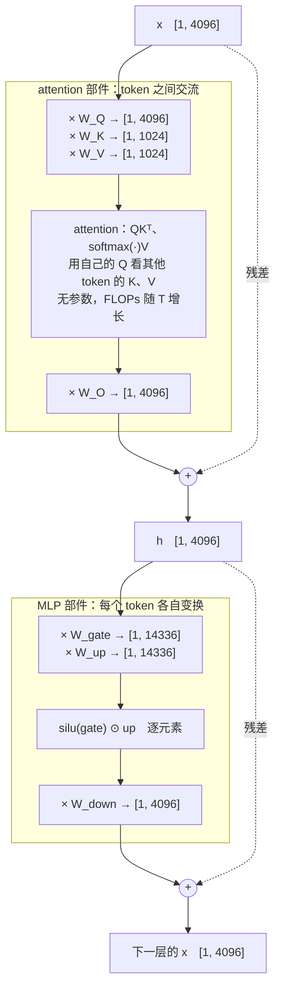

打开任何一个大模型的结构图，看到的全是矩阵乘法：一个 token（模型处理文字的最小单位，大致是一个词或半个词——"我爱北京"约 3 个 token——不是一字一个，常用词"北京"通常整个是一个 token，"我""爱"各一个；反过来英文长词 "tokenizer" 会被切成两三个。切法由分词器（tokenizer）的词表决定，不同模型不同；模型读到的不是字，而是 token 在词表里的编号）变成一个向量，向量乘一个矩阵变成另一个向量，再乘一个矩阵……几十层之后输出下一个 token 的概率。所以线性代数在 AI 里的第一个用处不是什么高深的定理，而是两条极其朴素的规则：**形状规则**（什么形状乘什么形状得到什么形状）与**成本规则**（这一乘要算多少次）。会了这两条，读模型结构图、算训练成本、判断"这个改动为什么慢"都有了起点。

本篇从零建立这两条规则。全篇的核心问题是：

> **看到任何一个矩阵乘法，能不能立刻写出输出形状和 FLOPs？[^q0] 能不能代入一个真实模型算出一个数字？[^q1]**

## 一、总览

### 1. 本文的对象

Llama-3-8B 的一层里最常见的一步：一个 token 的表示（一个长 4096 的向量）乘一个 $$4096 \times 4096$$ 的权重矩阵。本文要把这一步的每个字都解释清楚——"长 4096 的向量"是什么、"$$4096 \times 4096$$ 的矩阵"是什么、"乘"是怎么定义的、算了多少次——然后把它推广到一层、一个模型。

### 2. 本文的章节安排

| 章 | 主题 | 内容 |
|---|---|---|
| 二 | 从标量到张量 | 标量、向量、矩阵、张量各是什么、怎么写、代码里是什么形状 |
| 三 | 矩阵乘法与形状规则 | 定义、内维必须相同、三种看法、单位矩阵与转置 |
| 四 | 成本规则 | FLOPs 是什么、$$2mnk$$ 从哪来、代 Llama-3-8B 的数字 |
| 五 | 训练代码里的形状操作 | 批维度、逐元素运算、广播、reshape |
| 六 | 一层 Transformer 有哪些矩阵 | 七个权重矩阵、打分前为什么要投影（$$W_Q, W_K$$）、$$W_O$$ 在多头里做什么、一层的参数量与 FLOPs、为 L4 的算账铺路 |
| 七 | 本文小结 | |
| 八 | 自测 | 五道题 |

Table: 本文的章节安排

## 二、从标量到张量

### 1. 四个称呼，一个东西

标量、向量、矩阵，看起来是不同的东西，其实都可以统一到**张量（Tensor）**这个概念下。在深度学习中，可以先把张量理解为**多维数值数组**：没有轴的是标量，一个轴的是向量，两个轴的是矩阵，更多轴的则称为高阶张量。

在 PyTorch 中，它们都可以用同一种类型 `torch.Tensor` 表示，下面这些称呼的区别主要体现在**形状（shape）和轴数**上：

| 名字 | 例子 | 轴的数量（张量维数） | 代码里的形状（shape） | 底层本质 |
| :--- | :--- | :--- | :--- | :--- |
| 标量 | `3.7` | 0 | `()` | 零维张量 |
| 向量 | `(0.2, -1.1, 0.5)` | 1 | `(3,)` | 一维张量 |
| 矩阵 | `[[1, 2, 3], [4, 5, 6]]` | 2 | `(2, 3)`，即 2 行 3 列 | 二维张量 |
| 高阶张量 | 一批 32 张 28×28 的灰度图 | 3 | `(32, 28, 28)` | 本例为三维张量 |

Table: 标量、向量、矩阵、张量的维度与代码形状

**标量**（scalar）是一个数：学习率 0.001、loss 1.83、温度 0.7。

**向量**（vector）是一组有序的数，写作 `a = (a₁, a₂, …, a_d)`，其中 *d* 是向量的**长度**，也常叫向量的**维度**。注意这里“维度”的两种用法：长 4096 的向量在数学上叫“4096 维向量”，但在代码里是形状为 `(4096,)` 的**一维张量**——前者数分量，后者数轴。

在 AI 里，**一个 token 在模型内部通常用一个向量表示**。例如，Llama-3-8B 的每个 token 的主干隐藏表示是一个长 4096 的向量，这个 4096 叫**隐藏维度**（hidden size），常写作 *d* 或 `d_model`。“隐藏”沿用神经网络的术语，指输入与输出之间的内部表示，并不是说这些值无法查看。为什么 token 的向量也算"内部"：模型从外面接到的只是 token 的**编号**（一个整数，比如"北京"→ 20302），第一步就把编号查表换成一个 4096 维的向量——从这一步起，直到最后一层输出下一个 token 的概率之前，所有向量都只在模型内部流动，外面既不输入它们也不读取它们，所以整段都叫隐藏表示，它的宽度就叫隐藏维度。

向量作为抽象对象不必区分横竖，代码中的一维张量也没有行、列之分。为了使用矩阵乘法，可以把它写成形状为 `(d, 1)` 的**列向量**，或 `(1, d)` 的**行向量**。教材常用列向量，写 `Wx`；`xᵀ` 中的 `T` 表示**转置**，把列向量变成行向量，反之亦然。

本文按 token 沿行排列的习惯写 `xW`。两种约定可以表示同一个线性变换，但切换约定时，**权重矩阵也要转置**：`(Wx)ᵀ = xᵀWᵀ`，不能只把乘法顺序调换。PyTorch 两种写法都支持；一维张量在 `matmul` 中的处理规则将在后文说明，第三章第 4 节会对照这两种约定。

**矩阵**（matrix）是一张二维数表。矩阵 *W* 有 *m* 行、*n* 列，形状就是 `(m, n)`；第 *i* 行、第 *j* 列的元素写作 `Wᵢⱼ`。在大语言模型里，**大部分参数存放在矩阵中**，例如嵌入矩阵和线性层的权重；也有归一化权重、偏置等向量参数。一个 `4096 × 4096` 的矩阵包含 `16,777,216` 个数，约 16.8M 参数。

**张量**（tensor）在本文的深度学习语境中，可以理解为按若干个轴组织起来的数值数组。三维及以上的张量，可以直观地看作“把矩阵再堆一维或多维”。例如，一批 32 个句子，每句统一为 512 个 token，每个 token 用长 4096 的向量表示，合起来就是形状为 `(32, 512, 4096)` 的三维张量，三个轴分别表示**批次、序列、特征**。

**各个轴怎样参与计算，取决于具体运算。**“最后两维做矩阵乘法，前面的维度组织批次”是 `torch.matmul` 在**两个输入都至少二维时**的规则，不是所有张量运算的规则。这里用 `@` 表示矩阵乘法；`*` 则表示逐元素乘法。

例如，输入 *X* 的形状为 `(32, 512, 4096)`，权重 *W* 的形状为 `(4096, 4096)`：

`(32, 512, 4096) @ (4096, 4096) → (32, 512, 4096)`

这在数学上相当于做 32 份 `(512, 4096) @ (4096, 4096)`：每句话的 512 个 token 都乘同一个 *W*。前面的 `32` 用来索引批次，**本次运算不会沿批次轴求和，也不会混合不同句子的数据**。这里的“32 份”描述的是计算含义，不代表底层一定调用 32 次独立运算。

两个输入都带批次维度时也是如此：

`(32, 512, 4096) @ (32, 4096, 64) → (32, 512, 64)`

这次是 32 对矩阵分别相乘，右边每一批可以是不同的矩阵。一般规则是：

- **矩阵维度**：左边最后一维必须等于右边倒数第二维，也就是 `(m, k) @ (k, n) → (m, n)`。这里的 *k* 必须相等，不能靠广播匹配。
- **批次维度**：去掉最后两维后，剩余形状**从右向左对齐**，缺失的维度按 `1` 处理；每对大小必须相等，或者其中一个为 `1`。
- **结果形状**：广播后的批次形状，再接上 `(m, n)`。

所以，输入的维数和批次大小不必完全相同：

| 左边形状 | 右边形状 | 结果 |
| :--- | :--- | :--- |
| `(5, 32, 512, 4096)` | `(32, 4096, 64)` | `(5, 32, 512, 64)` |
| `(5, 1, 512, 4096)` | `(1, 32, 4096, 64)` | `(5, 32, 512, 64)` |
| `(2, 32, 512, 4096)` | `(5, 32, 4096, 64)` | 报错：批次大小 `2` 与 `5` 不兼容 |

简单说：**对这类 `matmul`，最后两维负责矩阵乘法，前面的维度负责批次对应与广播。**如果要指定其他轴之间的对应关系或收缩求和，可以使用 `einsum`、`tensordot` 等运算（L1 第二篇第四章）。第五章第 1 节再展开批维度的账。

对后端工程师，一个有用的理解是：**常见的稠密张量由底层存储和描述访问方式的元数据组成**。除了数据类型、设备等信息，关键元数据包括：

- `shape`：每个轴有多长。
- `stride`：沿每个轴走一步，要在底层存储中跨过多少个元素。
- `storage_offset`：张量的起点相对底层存储偏移多少个元素。

对于按通常行优先方式连续存储、起始偏移为 0 的 `(32, 512, 4096)` 张量，`stride` 为 `(512*4096, 4096, 1)`，元素 `[b, t, i]` 位于底层存储的第 `b*512*4096 + t*4096 + i` 个位置，按零开始计数。可以把它类比为一个附带形状、步长和偏移信息的 `ByteBuffer`。

但**张量不一定连续，也不一定独占一份存储**：转置、切片后的张量可以共享原有数据，只改变访问方式。因此，“几维”主要描述数据的组织方式，不代表内存中真的存在多维格子；而 `shape` 与 `stride` 会影响是否能直接改变视图，以及运算效率。

这也解释了第五章的几个行为：**`view` 在布局兼容时只改元数据，不复制数据；`reshape` 能共享存储时共享，否则可能复制；广播本身通常无需实际复制数据，但运算结果仍可能需要新内存。**这些概念也是 Infra 地图 [03 系列](/deep-dive-into-pytorch.html)介绍 `TensorImpl` 与 storage 的起点。

### 2. 怎么读形状

读形状的习惯是本篇最想建立的东西。看到任何一个量，先问"它是几维的、每一维是多少、每一维代表什么"。

| 量 | 几维 | 每一维代表什么 |
|---|---:|---|
| $$x \in \mathbb{R}^{4096}$$ | 1 | 一个 token 的表示：4096 个数 |
| $$X \in \mathbb{R}^{512 \times 4096}$$ | 2 | 一句话 512 个 token：512 行，每行是一个 token 的表示 |
| $$W \in \mathbb{R}^{4096 \times 4096}$$ | 2 | 一个权重矩阵：把 4096 维映到 4096 维 |
| `X[32, 512, 4096]` | 3 | 32 句话，每句 512 个 token，每个 token 4096 维 |

Table: 读形状：几个量的维数与每一维的含义

约定：本系列把"一批 token"写成**每行一个 token** 的矩阵 $$X \in \mathbb{R}^{T \times d}$$——$$T$$ 是**一句话里的 token 数**（序列长度，seq），$$d$$ 是每个 token 的维度（hidden）。这是 PyTorch 布局 `[batch, seq, hidden]` 去掉第一维的样子：三维的 `[B, T, d]` 里 $$B$$ 是第几句话、$$T$$ 是句内第几个 token、$$d$$ 是特征——最后一维永远是特征。公式里通常省掉 $$B$$，因为矩阵乘法对每句话做的事完全一样（上一节说的"有很多份"），写出来只是多一层括号；代码里 $$B$$ 是真实存在的，第五章第 1 节讨论它怎么进成本账。

## 三、矩阵乘法与形状规则

### 1. 定义

矩阵 $$A \in \mathbb{R}^{m \times k}$$ 与 $$B \in \mathbb{R}^{k \times n}$$ 的乘积 $$C = AB \in \mathbb{R}^{m \times n}$$，每个元素是

$$
C_{ij} = \sum_{l=1}^{k} A_{il}\, B_{lj}
$$

——$$A$$ 的第 $$i$$ **行**与 $$B$$ 的第 $$j$$ **列**对应位置相乘再加起来。画出来：


注意三个矩形的边长：$$A$$ 的宽（$$k$$ 列）等于 $$B$$ 的高（$$k$$ 行）——这就是下一节"内维相同"的几何形象；$$C$$ 的高取自 $$A$$、宽取自 $$B$$。

一个能手算的例子（$$m = 2, k = 3, n = 2$$）：

$$
\begin{pmatrix} 1 & 2 & 3 \\ 4 & 5 & 6 \end{pmatrix}
\begin{pmatrix} 1 & 0 \\ 0 & 1 \\ 1 & 1 \end{pmatrix}
=
\begin{pmatrix} 1\cdot1 + 2\cdot0 + 3\cdot1 & 1\cdot0 + 2\cdot1 + 3\cdot1 \\ 4\cdot1 + 5\cdot0 + 6\cdot1 & 4\cdot0 + 5\cdot1 + 6\cdot1 \end{pmatrix}
=
\begin{pmatrix} 4 & 5 \\ 10 & 11 \end{pmatrix}
$$

左边 $$[2 \times 3]$$，右边 $$[3 \times 2]$$，结果 $$[2 \times 2]$$。

### 2. 形状规则

从定义直接得到本篇第一条规则：

> **$$[m, k] \times [k, n] \to [m, n]$$：左边的列数必须等于右边的行数（内维 $$k$$ 相同），结果取左边的行数与右边的列数。**

内维不同就不能乘——这是读模型代码时第一个要检查的东西，也是 `RuntimeError: mat1 and mat2 shapes cannot be multiplied (512x4096 and 1024x4096)` 这类报错的全部含义：512×4096 的东西不能乘 1024×4096 的东西，因为 4096 ≠ 1024。

两个推论：

- **矩阵乘法不交换**：$$AB \ne BA$$，一般连形状都对不上（$$[m,k] \times [k,n]$$ 能乘，$$[k,n] \times [m,k]$$ 除非 $$n = m$$ 否则不能）。
- **结合律成立**：$$(AB)C = A(BC)$$。这在算成本时有用：同样的结果，先乘哪两个成本可能差很多（第四章）。

### 3. 三种看法

同一个矩阵乘法可以从三个角度看，各在不同场合有用。三种看法说的是**同一个计算**，只是把注意力放在结果的不同部分上：一次看整个输出向量、一次看每一行、一次看单个元素。下面都用上一节那个能手算的例子

$$
A = \begin{pmatrix} 1 & 2 & 3 \\ 4 & 5 & 6 \end{pmatrix},\quad
B = \begin{pmatrix} 1 & 0 \\ 0 & 1 \\ 1 & 1 \end{pmatrix},\quad
AB = \begin{pmatrix} 4 & 5 \\ 10 & 11 \end{pmatrix}
$$

来说。

**看法一：一个向量过一个矩阵是一次"变换"——看整个输出向量。** 只取 $$A$$ 的第一行 $$x = (1, 2, 3)$$，它乘 $$B$$ 得到 $$(4, 5)$$：一个 3 维向量进去，一个 2 维向量出来，$$B$$ 把它从 3 维"变换"到了 2 维。神经网络的每一个"线性层"（`nn.Linear`）就是这个：输入 `in_features` 维，输出 `out_features` 维，权重是一个 `[out, in]` 的矩阵，一个 token 的向量过一层就是被变换一次。

**看法二：一批向量过同一个矩阵是"把每一行分别变换"——看每一行。** $$A$$ 有两行 $$(1, 2, 3)$$ 与 $$(4, 5, 6)$$，$$AB$$ 的两行 $$(4, 5)$$ 与 $$(10, 11)$$ 恰好是这两行**各自**乘 $$B$$ 的结果——把第二行改成任何数，第一行的结果 $$(4, 5)$$ 不变。所以 $$Y = XW$$ 里 $$X$$ 的每一行是一个 token，$$Y$$ 的每一行是对应 token 变换后的结果，各行互不影响。这是为什么一句话里 512 个 token 可以一起算、一批 32 句话也可以一起算：它们只是同一个矩阵乘法的不同行，摞在一起算是为了快，不是因为它们之间有什么关系。

**看法三：$$C_{ij}$$ 是 $$A$$ 的第 $$i$$ 行与 $$B$$ 的第 $$j$$ 列的"相似度"——看单个元素。** $$C_{11} = 4$$ 是 $$A$$ 的第 1 行 $$(1, 2, 3)$$ 与 $$B$$ 的第 1 列 $$(1, 0, 1)$$ 对应位置相乘再加：$$1 \cdot 1 + 2 \cdot 0 + 3 \cdot 1 = 4$$。这个"对应位置相乘再加"叫两个向量的**内积**（第二篇专门讲它）。为什么说它是"相似度"？看一个更小的例子：

$$
Q = \begin{pmatrix} 1 & 0 \\ 0 & 1 \end{pmatrix},\quad
K = \begin{pmatrix} 1 & 0 \\ 1 & 1 \end{pmatrix},\quad
QK^T = \begin{pmatrix} 1 & 1 \\ 0 & 1 \end{pmatrix}
$$

$$Q$$ 的两行是两个 query 向量 $$q_1 = (1, 0)$$、$$q_2 = (0, 1)$$，$$K$$ 的两行是两个 key 向量 $$k_1 = (1, 0)$$、$$k_2 = (1, 1)$$；$$K^T$$ 把 key 竖起来当列，于是 $$(QK^T)_{ij}$$ 就是 $$q_i$$ 与 $$k_j$$ 的内积。读这张 $$2 \times 2$$ 表：$$q_1$$ 与 $$k_1$$ 方向相同，内积 1；$$q_2$$ 与 $$k_1$$ 互相垂直，内积 0；$$q_2$$ 与 $$k_2$$ 有一半重合，内积 1。**方向越接近内积越大，垂直为 0，相反为负**——这就是"相似度"的含义。attention 正是这样用它：每一行是一个 token 的 query，每一列是一个 token 的 key，$$(QK^T)_{ij}$$ 越大，"第 $$i$$ 个 token 该看第 $$j$$ 个 token"就越多。一次矩阵乘法算出了所有 token 对之间的相似度，这是看法三的用处。

### 4. 转置与单位矩阵

**转置** $$A^T$$ 把行列互换：$$A \in \mathbb{R}^{m \times n}$$ 则 $$A^T \in \mathbb{R}^{n \times m}$$，$$(A^T)_{ij} = A_{ji}$$。一条常用规则：$$(AB)^T = B^T A^T$$——顺序反过来（用形状检查：$$AB$$ 是 $$[m, n]$$，转置是 $$[n, m]$$，$$B^T A^T$$ 是 $$[n, k] \times [k, m] = [n, m]$$，对上了）。

转置在代码里到处出现，有一个值得记住的具体例子：PyTorch 的 `nn.Linear(in, out)` 把权重存成 `[out, in]`，前向算的是 $$y = x W^T + b$$。所以文档里写 $$xW^T$$、论文里写 $$Wx$$、本文写 $$XW$$，指的是同一件事，只是把向量摆成行还是列、把矩阵存成 `[in, out]` 还是 `[out, in]` 的差别。读代码时用形状规则对一下就不会乱。

**单位矩阵** $$I$$ 是对角线全 1、其余全 0 的方阵，$$IA = AI = A$$——乘它什么都不变。它在第三篇（正交矩阵 $$R^T R = I$$）和 L3（残差连接的 Jacobian 是 $$I + J$$）里出现。

## 四、成本规则：这一乘要算多少

### 1. FLOPs 是什么

FLOP 是 floating-point operation，**一次浮点运算**——一次加法或一次乘法各算一个。FLOPs（复数）是运算的总次数，是衡量"这一步要算多少"的标准单位。注意区分 **FLOPs**（次数，衡量工作量）与 **FLOPS**（每秒次数，衡量硬件速度，如"一张 H100 约 989 TFLOPS"）；后面各篇说"FLOPs"都指前者。

### 2. $$2mnk$$ 从哪来

回到定义：$$C = AB$$，$$C$$ 有 $$m \times n$$ 个元素，每个元素 $$C_{ij} = \sum_{l=1}^{k} A_{il} B_{lj}$$ 要做 $$k$$ 次乘法和 $$k - 1$$ 次加法，约 $$2k$$ 次运算。所以

$$
\text{FLOPs}(A B) \approx m \cdot n \cdot 2k = 2mnk
$$

这是本篇第二条规则：

> **$$[m, k] \times [k, n]$$ 的矩阵乘法约需 $$2mnk$$ FLOPs——三个维度的乘积再乘 2。**

"约"是因为把 $$k - 1$$ 次加法算成了 $$k$$ 次；硬件上一次"乘加"（FMA）本来就是一条指令，所以工业界统一按 2 计。

写成代码，$$\sum$$ 就是最内层循环，三个维度就是三层循环，$$2mnk$$ 就是最内层那行执行的次数乘 2：

```python title="三层循环的矩阵乘：最内层每次 2 FLOPs"
for i in range(m):            # C 的每一行
    for j in range(n):        # C 的每一列
        for l in range(k):    # 内维：A 的第 i 行 · B 的第 j 列
            C[i][j] += A[i][l] * B[l][j]   # 一次乘 + 一次加 = 2 FLOPs
```

后面所有关于矩阵乘法的公式——形状规则（`A[i][l]` 与 `B[l][j]` 共用同一个 `l`，所以 $$A$$ 的列数必须等于 $$B$$ 的行数）、$$C_{ij}$$ 是行 $$i$$ 与列 $$j$$ 的内积、转置为什么出现——都能在这三行里指出来。GPU 上的实现当然不是这样写的（Infra 地图的 [05 系列](/gpu-kernel-engineering.html)讲它怎么分块、怎么并行），但算的东西一样，FLOPs 也一样。

### 3. 代一个数字

Llama-3-8B 的隐藏维度 $$d = 4096$$（`config.json` 里的 `hidden_size`）。attention 里把输入投影成 query 的权重 $$W_Q$$ 是一个 $$4096 \times 4096$$ 的矩阵。一个 token 是一个长 4096 的行向量，经过 $$W_Q$$ 就是一次 $$[1, 4096] \times [4096, 4096]$$ 的矩阵乘；prefill 4096 个 token 时，输入摞成 $$[4096, 4096]$$，同一个 $$W_Q$$ 不变。把 $$m, k, n$$ 对上去，两条规则各走一遍：

```text title="W_Q 上一个 token 与 4096 个 token 的 FLOPs 对比"
一个 token：   x [1 × 4096]   ×  W_Q [4096 × 4096]  →  q [1 × 4096]
               m = 1             k = 4096, n = 4096
               FLOPs = 2 m n k = 2 × 1 × 4096 × 4096 ≈ 33.5 M

4096 个 token： X [4096 × 4096] ×  W_Q [4096 × 4096]  →  Q [4096 × 4096]
               m = 4096          k = 4096, n = 4096
               FLOPs = 2 × 4096 × 4096 × 4096 ≈ 137 G     ← m 大 4096 倍，FLOPs 也大 4096 倍
```

两个观察，后面每一层都会用到：

- **一个 token 过一个 $$d \times d$$ 的矩阵，FLOPs 是 $$2d^2$$，恰好是这个矩阵参数量（$$d^2$$）的两倍。** 推而广之：一个 token 过整个模型的 FLOPs 约等于**参数量的两倍**，$$2N$$——前提是**每个参数都参与了这个 token 的计算**。稠密模型（Llama 这类）几乎如此，只有词嵌入例外：它是按编号查一行，不是矩阵乘（第六章的表里单列了它）；MoE 模型（如 DeepSeek-V3）每个 token 只经过被选中的少数专家，这时要用"激活参数量"代替 $$N$$，L4 第八篇讲。这是 L4 里"训练 FLOPs $$\approx 6ND$$"（$$D$$ 个 token，前向 $$2N$$、反向 $$4N$$）的起点。
- **token 数 $$m$$ 是线性的。** 4096 个 token 就是 4096 倍——所以算力账里"处理了多少 token"是最重要的变量。

### 4. 结合律与成本

$$(AB)C$$ 与 $$A(BC)$$ 结果相同，成本可以差很多。设 $$B \in \mathbb{R}^{4096 \times 16}$$、$$C \in \mathbb{R}^{16 \times 4096}$$，$$x \in \mathbb{R}^{1 \times 4096}$$，要算 $$x(BC)$$：

| 顺序 | 第一步 | FLOPs | 第二步 | FLOPs | 合计 |
|---|---|---:|---|---:|---:|
| 先乘两个矩阵 | $$BC$$：$$[4096 \times 16] \times [16 \times 4096] \to [4096 \times 4096]$$ | $$2 \times 4096 \times 4096 \times 16 \approx 537$$ M | $$x(BC)$$：$$[1 \times 4096] \times [4096 \times 4096]$$ | $$2 \times 4096 \times 4096 \approx 33.5$$ M | **≈ 570 M** |
| 先让向量过瘦矩阵 | $$xB$$：$$[1 \times 4096] \times [4096 \times 16] \to [1 \times 16]$$ | $$2 \times 4096 \times 16 \approx 131$$ K | $$(xB)C$$：$$[1 \times 16] \times [16 \times 4096] \to [1 \times 4096]$$ | $$2 \times 16 \times 4096 \approx 131$$ K | **≈ 262 K**（少两千倍） |

Table: 矩阵乘法结合顺序不同的 FLOPs 对比

这正是第三篇 LoRA 的形状：$$\Delta W = BA$$ 两个瘦矩阵。**每一步都在线算**时（训练、多租户共用底座切换 adapter），先让输入过瘦的那个，不要每次都乘成大矩阵；训完只服务一个 adapter 时则反过来——**一次性**算出 $$W' = W + BA$$ 合并进权重（第三篇 §六），之后推理零额外开销。两种做法不矛盾：前者省的是每步重复算 $$BA$$ 的 570 MFLOPs，后者是把它算一次存下来。


## 五、训练代码里的形状操作

### 1. 批维度

真实代码里的输入不是 $$[T, d]$$ 而是 $$[B, T, d]$$：$$B$$ 句话、每句 $$T$$ 个 token、每个 $$d$$ 维。矩阵乘法只作用于最后两维，前面的维度是"批"——同一件事做 $$B$$ 遍。所以 `torch.matmul(X, W)` 在 $$X$$ 是 $$[B, T, d]$$、$$W$$ 是 $$[d, d']$$ 时输出 $$[B, T, d']$$，FLOPs 是 $$B \times 2Td d'$$。读形状时把前面的批维度"括起来"，只看最后两维是否满足 $$[\cdot, k] \times [k, \cdot]$$。

用小数字走一遍：$$B = 2$$ 句话、每句 $$T = 3$$ 个 token、每个 token $$d = 4$$ 维，$$X$$ 的形状是 $$[2, 3, 4]$$，一共 24 个数；$$W$$ 是 $$[4, 5]$$。`X @ W` 做的是：取第 1 句话的 $$[3, 4]$$ 乘 $$W$$ 得 $$[3, 5]$$，再取第 2 句话的 $$[3, 4]$$ 乘同一个 $$W$$ 得 $$[3, 5]$$，叠起来就是 $$[2, 3, 5]$$。FLOPs 是 $$2 \times (2 \times 3 \times 4 \times 5) = 240$$——括号里是 $$B \times T \times d \times d'$$，前面的 2 是"一乘一加"。$$B$$ 和 $$T$$ 在这里的地位一样：都只是"这件事做多少遍"，所以成本里它们只是线性因子，真正决定一次矩阵乘法形状的只有 $$d$$ 和 $$d'$$。

### 2. 逐元素运算

两个**形状相同**的矩阵可以逐元素相加、相乘（记作 $$A + B$$、$$A \odot B$$，后者叫 Hadamard 积，代码里就是 `A * B`）。激活函数（ReLU、GELU、SiLU）、残差连接（$$x + f(x)$$）、门控（Llama 的 MLP 里 `silu(gate) * up`）都是逐元素运算。用 $$2 \times 2$$ 的例子看清"逐元素"三个字：

$$
\begin{pmatrix} 1 & 2 \\ 3 & 4 \end{pmatrix} \odot \begin{pmatrix} 10 & 20 \\ 30 & 40 \end{pmatrix} = \begin{pmatrix} 1 \times 10 & 2 \times 20 \\ 3 \times 30 & 4 \times 40 \end{pmatrix} = \begin{pmatrix} 10 & 40 \\ 90 & 160 \end{pmatrix}
$$

每个位置只和**自己对应位置**的那个数打交道，没有任何"行乘列再求和"，所以形状不变、也不需要 $$k$$ 这个中间维。写成循环就是 `for i: for j: C[i][j] = A[i][j] * B[i][j]`。它和第三章的内积是亲戚：**两个向量的内积 = 先逐元素相乘，再把结果全部加起来**——$$\langle a, b \rangle = \sum_i a_i b_i$$，`(a * b).sum()`；矩阵乘法的每一格又是一个内积。所以三者的成本是一级一级上去的：逐元素 $$mn$$ 次乘法；内积多一步求和；矩阵乘法要做 $$mn$$ 个长度为 $$k$$ 的内积，$$2mnk$$。逐元素运算比矩阵乘法少一个 $$k$$ 的因子——这是为什么算模型成本时通常只数矩阵乘法。

### 3. 广播

形状不完全相同的两个张量做逐元素运算（相加、相乘、比较……）时，框架按**广播**（broadcasting）规则把小的那个"复制"到大的形状：从最后一维往前对齐，每一维要么相等、要么其中一个是 1（或不存在）。它解决的是一个天天遇到的需求——给一句话里每个 token 的向量都加上同一个偏置 `b`，不想真的把 `b` 抄 512 份再相加。

![广播：X[2, 3] + b[3]，b 先被看成 (1, 3)、再沿第一维"撑"成 (2, 3)，两行读的是同一段内存，结果逐元素相加](/img/in-post/vectors-matrices-broadcasting-x-plus-b.svg)

| 表达式 | 结果 | 发生了什么 |
|---|---|---|
| `X[512, 4096] + b[4096]` | `[512, 4096]` | `b` 被复制 512 行，加到每个 token 上（Linear 的偏置） |
| `X[32, 512, 4096] * s[32, 512, 1]` | `[32, 512, 4096]` | 每个 token 乘自己的一个标量（比如归一化的缩放） |
| `X[512, 4096] + Y[4096, 512]` | 报错 | 4096 ≠ 512 且都不是 1 |

Table: 广播的三个例子

广播不是数学概念，是 NumPy / PyTorch 的约定，但它决定了代码里大量"看起来形状不对却能跑"的表达式在做什么；L1 工具箱第二篇会专门练它。"复制"打了引号：框架并不真的把 `b` 复制 512 份，而是把它在那一维的 stride 设为 0——同一段内存被读 512 次，写成循环就是 `for t: for i: Y[t][i] = X[t][i] + b[i]`，`b[i]` 的下标里没有 `t`。广播是零内存开销的，代价只在计算。顺带一提，Spark / Flink 里也有"广播变量"（把一份小数据发到集群的每台机器上），和这里只是同名：张量广播发生在同一进程的一次运算里，只是按形状规则对齐下标，没有任何数据搬运。

### 4. reshape 与 view

同样 $$B \times T \times d$$ 个数，可以看成 $$[B, T, d]$$、$$[B \cdot T, d]$$ 或 $$[B, T, h, d/h]$$（多头 attention 把 $$d$$ 拆成 $$h$$ 个头）。这些操作不改变任何数值，只改变"怎么读"。PyTorch 的 `view` 只改 `shape` 与 `stride` 两组元数据，一个字节都不搬；`reshape` 在内存连续时等价于 `view`，不连续时才复制。转置也只是交换两维的 stride——所以转置之后的张量"不连续"，再 `view` 会报错，要先 `.contiguous()`。这是训练代码里最常见的一类报错，知道存法就知道原因。多头 attention 的全部形状变化就是一串 reshape 与转置，用 $$T = 3$$、$$d = 4$$、$$h = 2$$ 的玩具尺寸把每一步画出来：

![多头 attention 的形状变化：Q [T, d] 先 reshape 成 [T, h, d_h]（同一行的 d 个数按顺序分给 h 个头），再转置成 [h, T, d_h]（每个头拿到自己的 [T, d_h] 小矩阵），然后每个头各自做 [T, d_h] × [d_h, T] → [T, T] 的 QKᵀ](/img/in-post/vectors-matrices-multi-head-reshape-transpose.svg)

1. $$Q = X W_Q$$，形状 $$[B, T, d]$$：每个 token 一行 $$d$$ 个数；
2. **reshape** 成 $$[B, T, h, d_h]$$（$$d_h = d / h$$）：不动任何数，只是把每行的 $$d$$ 个数"按顺序切成 $$h$$ 段"，第 0 段归头 0、第 1 段归头 1……；
3. **转置** 第 1、2 维得到 $$[B, h, T, d_h]$$：把"每个 token 的各个头"重排成"每个头的所有 token"，于是头 $$i$$ 拿到一个自己的 $$[T, d_h]$$ 小矩阵；
4. 每个头独立做 $$[T, d_h] \times [d_h, T] \to [T, T]$$ 的 $$QK^T$$，得到一张"第 $$i$$ 个 token 看第 $$j$$ 个 token 多少分"的表；$$B$$ 句话 × $$h$$ 个头，共 $$B \times h$$ 个这样的小乘法。

拆头的意义在第 4 步：$$h$$ 个头各算一张分数表，可以各自关注不同的关系（一个头看语法、一个头看指代……）；成本上，$$h$$ 个 $$[T, d_h]$$ 的小乘法加起来与一个 $$[T, d]$$ 的大乘法相同（$$h \times 2T^2 d_h = 2T^2 d$$）。Llama-3-8B：$$h = 32$$ 个头，每头 $$d_h = 4096 / 32 = 128$$。

## 六、一层 Transformer 有哪些矩阵

### 1. 七个权重矩阵

先说一层在做什么，再数它有哪些矩阵。一个 Transformer 层只有两个部件，每个 token 的向量依次经过它们：**attention**（注意力）让每个 token 看一眼句子里的其他 token、把有用的信息加到自己身上——它是唯一一处 token 之间发生交流的地方；**MLP**（多层感知机，两三个矩阵乘法夹一个非线性函数）对每个 token 各自做一次变换，token 之间互不影响。两个部件的输出都加回输入（**残差连接**，$$x + f(x)$$，L3 会讲它为什么必要）。把这条路径上的每个矩阵标出来：


```mermaid
%%{init: {"flowchart": {"wrappingWidth": 180}}}%%
%% 图：一个 Transformer 层的七个权重矩阵：attention 部件四个、MLP 部件三个，以 Llama-3-8B 的形状标注
flowchart TB
    X["x　[1, 4096]"]
    subgraph ATTN["attention 部件：token 之间交流"]
        direction TB
        P["× W_Q → [1, 4096]<br/>× W_K → [1, 1024]<br/>× W_V → [1, 1024]"]
        A["attention：QKᵀ、softmax(·)V<br/>用自己的 Q 看其他 token 的 K、V<br/>无参数，FLOPs 随 T 增长"]
        O["× W_O → [1, 4096]"]
        P --> A --> O
    end
    subgraph MLP["MLP 部件：每个 token 各自变换"]
        direction TB
        G["× W_gate → [1, 14336]<br/>× W_up → [1, 14336]"]
        S["silu(gate) ⊙ up　逐元素"]
        D["× W_down → [1, 4096]"]
        G --> S --> D
    end
    X --> P
    O --> ADD1(("+")) --> H["h　[1, 4096]"]
    X -. 残差 .-> ADD1
    H --> G
    D --> ADD2(("+")) --> Y["下一层的 x　[1, 4096]"]
    H -. 残差 .-> ADD2
```

先用一组小数字把这条路径走一遍——取 $$d = 4$$、MLP 中间维 $$d_{ff} = 8$$、只有 1 个头，一个 token 的向量 $$x = (1, 0, 2, 1)$$：

| 步骤 | 运算 | 输入形状 | 权重形状 | 输出形状 | 这一步在做什么 |
|---|---|---|---|---|---|
| ① | $$q = x W_Q$$，$$k = x W_K$$，$$v = x W_V$$ | `[1, 4]` | 三个 `[4, 4]` | 三个 `[1, 4]` | 把同一个 token 投影成"我要找什么 / 我是什么 / 我能提供什么"三个向量 |
| ② | 与句中 $$T$$ 个 token 的 $$k$$ 算内积、softmax、加权求和它们的 $$v$$ | `[1, 4]` 与 `[T, 4]` | 无 | `[1, 4]` | 唯一一处看别的 token；没有参数 |
| ③ | $$\times W_O$$，加回 $$x$$ | `[1, 4]` | `[4, 4]` | `[1, 4]` | $$W_O$$ 是**输出投影**：把 ② 的结果写回残差流，多头时让每个头都能写到全部维度、各头的结果相加（第 3 节有图），再加回 $$x$$ 得 $$h$$ |
| ④ | $$g = h W_{\text{gate}}$$，$$u = h W_{\text{up}}$$ | `[1, 4]` | 两个 `[4, 8]` | 两个 `[1, 8]` | 两路并行放大到 2 倍宽（Llama 是 3.5 倍）：$$W_{\text{up}}$$ 这一路出"内容"，$$W_{\text{gate}}$$ 这一路出"门"，下一步用门决定每个通道放行多少 |
| ⑤ | $$\text{silu}(g) \odot u$$ | 两个 `[1, 8]` | 无 | `[1, 8]` | 逐元素：门控，决定每个通道留多少 |
| ⑥ | $$\times W_{\text{down}}$$，加回 $$h$$ | `[1, 8]` | `[8, 4]` | `[1, 4]` | 压回原宽度，残差相加，交给下一层 |

Table: 一个 token 过一层的六步：玩具尺寸 d = 4、d_ff = 8 下每一步的形状

数字之前先回答两个更要紧的问题：每个矩阵**是什么**、**为什么少不了它**——尤其是 ③ 的 $$W_O$$ 和 ④ 的 $$W_{\text{gate}}$$，它们不像 $$W_Q, W_K, W_V$$ 那样有现成的名字可以望文生义：

| 矩阵 | 它是什么 | 为什么需要它 |
|---|---|---|
| $$W_Q$$ | 把 token 投影成 query——"我在找什么" | 分数 $$q_i \cdot k_j = x_i W_Q W_K^T x_j^T$$；不投影时分数就是 $$x_i \cdot x_j$$，必然对称、且每个 token 给自己的分最高。投影把分数变成一个可学的关系 $$M = W_Q W_K^T$$（第 2 节用数字算一遍） |
| $$W_K$$ | 投影成 key——"我是什么、能被怎么找到" | 与 $$W_Q$$ 分开，"找"与"被找"才能不对称：代词要找名词，名词不必找代词 |
| $$W_V$$ | 投影成 value——"被选中后我提供什么" | 让"怎么匹配"（Q、K）与"传什么内容"（V）解耦：匹配上的 token 传出去的可以和它的 key 完全不同 |
| $$W_O$$ | **输出投影**（output projection）：把 ② 的加权和投影回残差流 | 32 个头各自算出的 128 维只是**拼接**在一起、各占一段；$$W_O$$ 把每个头的 128 维映到残差流的全部 4096 维，再把各头的贡献相加（第 3 节有图和数字） |
| $$W_{\text{gate}}$$ | MLP 的**门**：$$g = h W_{\text{gate}}$$，过 SiLU 后逐元素乘到另一路上 | 门控让每个中间通道按输入决定"放行多少"，而不是 ReLU 那种只会把负数关掉；同样参数量下比"两个矩阵夹一个激活"效果更好（SwiGLU，Shazeer 2020）。它**不是必需的**：只有 GLU 一族的 MLP 才有，GPT-2 的 MLP 只有两个矩阵（见表后） |
| $$W_{\text{up}}$$ | 把 $$h$$ 放大到 $$d_{ff} = 14336$$ 维 | 更宽的中间层 = 更多可以被门选中的通道，FFN 存"知识"的容量主要在这里（L4 第一篇第四章把 FFN 看成键值记忆） |
| $$W_{\text{down}}$$ | 把 14336 维压回 4096 维，加回残差流 | 中间层的结果要回到残差流才能被下一层和输出层用到；它与 $$W_{\text{up}}$$ 一起构成"先展开再压回"的瓶颈 |

Table: 七个矩阵各是什么、为什么少不了：attention 的四个管 token 之间怎么交流，MLP 的三个管每个 token 自己怎么变换

$$W_{\text{gate}}$$ 不是 Transformer 必需的。原始 Transformer、BERT、GPT-2 / GPT-3 的 MLP 只有两个矩阵：$$\text{GELU}(h W_1)\, W_2$$，$$W_1$$ 把 $$d$$ 放大到 $$d_{ff} = 4d$$、$$W_2$$ 压回来，参数 $$2 \times 4d \times d = 8d^2$$。多出 $$W_{\text{gate}}$$ 的是 **GLU**（gated linear unit）一族：$$\big(\text{act}(h W_{\text{gate}}) \odot h W_{\text{up}}\big)\, W_{\text{down}}$$——激活用 SiLU 叫 SwiGLU（PaLM、Llama、Mistral、Qwen），用 GELU 叫 GeGLU（Gemma）。三个矩阵若仍取 $$4d$$ 宽就是 $$12d^2$$，所以 GLU 通常把 $$d_{ff}$$ 缩到 $$\tfrac{8}{3} d$$，$$3 \times \tfrac{8}{3} d \times d = 8d^2$$，与两矩阵版参数持平；Llama-3-8B 在此基础上再乘 1.3、向上取整到 1024 的倍数：$$\tfrac{8}{3} \times 4096 \approx 10922$$，$$\times 1.3 \approx 14198$$，取整得 14336（3.5 倍）。

参数只在 ①③④⑥ 四步里出现：$$3 \times 16 + 16 + 2 \times 32 + 32 = 160$$ 个数，FLOPs 恰好是它的两倍 320（再加 ② 里随 $$T$$ 变的那部分）。把 4 换成 4096、8 换成 14336、1 个头换成 32 个 query 头 + 8 个 KV 头，就是下面 Llama-3-8B 的表。七个带 $$W$$ 的框就是这一层的全部参数；其余框（attention 内部、逐元素运算、加法）没有参数。用形状规则逐个读 Llama-3-8B 的这七个矩阵（$$d = 4096$$；MLP 中间维度 $$d_{ff} = 14336$$，先把向量放大到 3.5 倍再压回来；attention 用 **GQA**——32 个 query 头，但 key / value 只有 8 个头、由每 4 个 query 头共用，所以 $$W_K, W_V$$ 的输出维是 $$8 \times 128 = 1024$$ 而不是 4096。为什么要共用：推理时每个 token 的 K、V 要存下来反复用，头少四倍存的就少四倍，L4 第七篇算这笔账）：

| 矩阵 | 形状 `[in, out]` | 参数量 | 一个 token 的 FLOPs（2 × 参数量） |
|---|---|---:|---:|
| $$W_Q$$ | 4096 × 4096 | 16.8 M | 33.5 M |
| $$W_K$$ | 4096 × 1024 | 4.2 M | 8.4 M |
| $$W_V$$ | 4096 × 1024 | 4.2 M | 8.4 M |
| $$W_O$$ | 4096 × 4096 | 16.8 M | 33.5 M |
| $$W_{\text{gate}}$$ | 4096 × 14336 | 58.7 M | 117.4 M |
| $$W_{\text{up}}$$ | 4096 × 14336 | 58.7 M | 117.4 M |
| $$W_{\text{down}}$$ | 14336 × 4096 | 58.7 M | 117.4 M |
| **一层合计** | | **218 M** | **436 M** |
| × 32 层 | | 6.98 B | 14.0 G |
| + 词嵌入 | 128256 × 4096 | 0.53 B | （查表，不算矩阵乘） |
| + 输出层 | 4096 × 128256 | 0.53 B | 1.05 G |
| **总计** | | **≈ 8.03 B** | **一个 token 前向 ≈ 15 G FLOPs ≈ 2N** |
| 表外：attention 的 $$QK^T$$ 与 $$\text{softmax}(\cdot)V$$ | 每层 $$[T, d_h] \times [d_h, T]$$ 与 $$[T, T] \times [T, d_h]$$，32 个头 | 0（无参数） | 每层 $$4Td$$：$$T = 512$$ 时 8.4 M（≈ 一层权重的 2%），$$T = 8192$$ 时 134 M（≈ 31%），$$T = 128$$K 时 2.1 G（≈ 5 倍） |

Table: Llama-3-8B 一层的七个权重矩阵：形状、参数量与 FLOPs

三件事从这张表直接读出来：

- **参数量的大头在 MLP**（三个 $$4096 \times 14336$$ 占一层的 81%），不在 attention；
- **一个 token 过整个模型约 $$2N$$ FLOPs**——每个参数用一次乘一次加，与第四章的观察一致；
- 上图 attention 框里的 $$QK^T$$ 与 $$\text{softmax}(\cdot) V$$ 那两个矩阵乘**不在七个矩阵里**——它们乘的是数据和数据（Q 乘 K、分数乘 V），没有参数，所以表的主体没有它们，单列在表外一行：一个 token 在每层要与全部 $$T$$ 个 token 各算一次内积再各加权一次，FLOPs 是每层 $$4Td$$、与参数量无关，随 $$T$$ 线性增长（整句话一起算就是 $$T^2$$）。$$T = 512$$ 时只占一层权重 FLOPs 的 2%，可以忽略；$$T = 128$$K 时是权重的 5 倍，成了大头——这就是长上下文贵在哪里。

这七个矩阵只是**一层 block 里带参数的部分**。整台 decoder-only Transformer 还有几样不在这七个里的部件——两张 embedding 表、LayerNorm 的缩放与偏置、lm_head——它们和这七个矩阵怎么对应，以及同一套矩阵在 GPT-2 small 里叫什么、形状多大，见《Transformer 与 LLM》第一篇《[从一句话到下一个 token](/transformer-architecture-from-a-sentence-to-the-next-token.html)》第一章「六种部件」后面的对应表。

### 2. 打分前为什么要先投影：$$W_Q$$ 与 $$W_K$$

attention 第 ② 步给"第 $$i$$ 个 token 看第 $$j$$ 个 token"打的分是 $$q_i \cdot k_j$$。把 ① 代进去，用 $$(AB)^T = B^T A^T$$：

$$
s_{ij} = (x_i W_Q)(x_j W_K)^T = x_i \,(W_Q W_K^T)\, x_j^T = x_i M x_j^T
$$

所以 $$W_Q$$ 和 $$W_K$$ 合起来只决定一件事：一个 $$d \times d$$ 的矩阵 $$M = W_Q W_K^T$$，它规定"什么样的 $$i$$ 该看什么样的 $$j$$"。不投影就是 $$M = I$$，分数退化成 $$x_i \cdot x_j$$，从式子能直接读出三处差别：

- **对称 vs 不对称**：$$x_i \cdot x_j = x_j \cdot x_i$$，"它"看"猫"多少分，"猫"就必然看"它"多少分；$$M$$ 不对称时 $$s_{ij} \ne s_{ji}$$。
- **看像不像 vs 看该不该**：$$x_i \cdot x_i = \lVert x_i \rVert^2$$，而柯西–施瓦茨不等式给出 $$x_i \cdot x_j \le \lVert x_i \rVert \lVert x_j \rVert$$——各 token 向量长度相近时，每个 token 给自己的分最高、其次是和自己方向接近的，attention 退化成"找近义词"。$$M$$ 可以把一个方向映到另一个方向，例如把"代词性"映到"名词性"，分数衡量的就变成"该不该看"。
- **一种关系 vs 每头一种**：$$M$$ 是学出来的，每个头一个，32 个头可以学 32 种不同的关系。

二维玩具最清楚：第 0 维表示"名词性"、第 1 维表示"代词性"，猫 = (1, 0)、它 = (0, 1)；取 $$W_K = I$$，$$W_Q = \begin{pmatrix} 0 & 0 \\ 1 & 0 \end{pmatrix}$$——第 0 行是 0 表示名词不找任何东西，第 1 行 (1, 0) 表示代词去找名词方向：

| query → key | 不投影：$$x_i \cdot x_j$$ | 投影后：$$x_i W_Q W_K^T x_j^T$$ |
|---|---:|---:|
| 它 → 猫 | 0 | **1** |
| 它 → 它 | **1** | 0 |
| 猫 → 它 | 0 | 0 |
| 猫 → 猫 | **1** | 0 |

Table: 二维玩具的 attention 分数：不投影时每个 token 只给自己高分；投影后"它"去看"猫"，"猫"却不看"它"

那为什么不直接学一个 $$M$$，而要拆成 $$W_Q$$、$$W_K$$ 两个？两条原因都是形状与成本：① 每个头的 $$W_Q^i, W_K^i$$ 都是 $$d \times d_h$$，$$M^i = W_Q^i (W_K^i)^T$$ 的秩至多 $$d_h = 128$$；两个瘦矩阵存 $$2 \times 4096 \times 128 \approx 1.05$$ M 个数，直接存 $$4096 \times 4096$$ 的 $$M^i$$ 是 16.8 M——和第四章 LoRA 的 $$BA$$ 一样是低秩分解。② $$k_j = x_j W_K$$ 只依赖 token $$j$$ 自己，算一次就能被之后所有 query 复用，这就是推理时缓存的 KV cache（L4 第七篇）；直接用 $$M$$ 则没有可缓存的 per-token 中间量。$$W_V$$ 与 $$W_K$$ 分开是同一个道理：分数由 $$q, k$$ 决定，传过去的内容是 $$v$$，"凭什么被选中"和"选中后给什么"不必是同一个向量。

### 3. $$W_O$$：多头拼接之后的那一步

② 对每个头各算一次：头 $$i$$ 用自己的分数加权求和自己的 $$v$$，得到一个 $$d_h$$ 维的输出 $$o^i$$。32 个头的输出**拼接**成一个 $$32 \times 128 = 4096$$ 维的向量 $$o$$——拼接只是并排摆放：头 1 的结果在第 0–127 格、头 2 在第 128–255 格……然后乘 $$W_O$$（$$4096 \times 4096$$），再加回 $$x$$。

把 $$W_O$$ 按行切成 $$h$$ 块、每块 $$d_h$$ 行，$$o$$ 的第 $$i$$ 段只会乘到第 $$i$$ 块（行向量乘矩阵 = 用向量的每个数给矩阵对应那一行加权，再把各行相加）：

$$
o W_O = [\,o^1, o^2, \dots, o^h\,] \begin{pmatrix} W_O^1 \\ W_O^2 \\ \vdots \\ W_O^h \end{pmatrix} = \sum_{i=1}^{h} o^i W_O^i
$$

每个 $$W_O^i$$ 是 $$d_h \times d$$：把头 $$i$$ 的 128 个数映到残差流的**全部** 4096 维。所以 $$W_O$$ 做的事是：**每个头各自写回整条残差流，各头写回的结果相加**。用上面六步表里的 $$x = (1, 0, 2, 1)$$、$$d = 4$$，拆成 2 个头、每头 $$d_h = 2$$ 算一遍：


对照两种做法：

- **没有 $$W_O$$**，直接把拼接结果 $$o = (1, 2, 3, -1)$$ 加回 $$x$$，得到 $$(2, 2, 5, 0)$$：头 1 只能改残差流的第 0、1 维，头 2 只能改第 2、3 维。可残差流的维度不是按头分配的——embedding 的第 0 维并不"属于头 1"，下一层的 $$W_Q$$、MLP 读的是整条向量。
- **有 $$W_O$$**，$$h = (1, 2, 6, 4)$$：两个头都写到了 4 维；第 2 维同时收到两个头的 1 和 3，第 0 维里两个头的 $$+1$$ 与 $$-1$$ 抵消。"混合各头"指的就是这一步相加。

两点补充：

- **能不能把 $$W_O$$ 并进 $$W_V$$？** 头 $$i$$ 写回的是 $$\sum_j a_{ij}\, x_j W_V^i W_O^i$$（$$a_{ij}$$ 是 softmax 后的分数），数学上每个头的 $$W_V^i W_O^i$$ 可以乘成一个 $$4096 \times 4096$$ 的矩阵，但 32 个头要存 $$32 \times 4096^2 \approx 537$$ M 个数；分开存（按每头一份 $$W_V$$ 算）是 $$32 \times (4096 \times 128 + 128 \times 4096) \approx 33.6$$ M，少 16 倍。所以 $$W_V$$、$$W_O$$ 分开也是低秩分解，和上一节的 $$W_Q W_K^T$$ 一样。
- **代码里**：`o = attn.transpose(1, 2).reshape(B, T, d)` 就是第五章 reshape 那张图倒着走一遍（先转置回 $$[B, T, h, d_h]$$，再把最后两维合并），然后 `o @ W_O`。

上面的数字与配图由配套仓库 [`math-for-ai/01_attention_projections.py`](https://github.com/arganzheng/ai-learning-labs/blob/main/math-for-ai/01_attention_projections.py) 输出。

### 4. 为 L4 铺路

到这里，形状规则与成本规则已经足够读懂 L4《Transformer 与 LLM》第十篇对整个模型的算账——那一篇的每一行都是本篇两条规则的重复应用：数出每个矩阵的形状、乘 2、乘 token 数、加上 attention 的平方项、乘 3 变成训练。这里只要求会两条规则；到了 L4，它们会被用来回答"训一个 8B 模型要多少 GPU 小时"。

## 七、本文小结

- 标量 / 向量 / 矩阵 / 张量是 0 / 1 / 2 / 多维的数表；**一个 token 在模型里是一个向量**（Llama-3-8B：4096 维），**模型的参数是一堆矩阵**；张量的矩阵乘法只作用于最后两维。
- **形状规则**：$$[m, k] \times [k, n] \to [m, n]$$，内维必须相同。矩阵乘法不交换、满足结合律；$$(AB)^T = B^T A^T$$。
- **成本规则**：$$2mnk$$ FLOPs。一个 token 过一个 $$d \times d$$ 矩阵是 $$2d^2$$，过整个模型约 $$2N$$（$$N$$ 是参数量）；token 数是线性因子。
- 结合律让同一个结果的成本差几千倍——LoRA 在线用时先过瘦矩阵；只服务一个 adapter 时一次性合并 $$W + BA$$。
- 批维度"括起来"只看最后两维；逐元素运算与广播的成本比矩阵乘法少一个 $$k$$ 因子；reshape 不改数值只改读法。
- 一层 Llama-3-8B 有七个权重矩阵、约 218M 参数，81% 在 MLP；全模型 8.03B，一个 token 前向约 15 GFLOPs。
- attention 分数 $$x_i W_Q W_K^T x_j^T$$：投影让分数成为可学的、不对称的关系；$$W_O = $$ 每个头各自写回整条残差流再相加；$$W_{\text{gate}}$$ 只属于 GLU 一族的 MLP。

## 八、自测

1. $$A \in \mathbb{R}^{3 \times 5}$$，$$B \in \mathbb{R}^{5 \times 2}$$：$$AB$$ 是什么形状？$$BA$$ 能不能算？$$(AB)^T$$ 等于什么？

   <details markdown="1"><summary>答案</summary>

   $$[3, 2]$$；不能，$$2 \ne 3$$；$$B^T A^T$$，形状 $$[2, 3]$$。

   </details>

2. `nn.Linear(4096, 14336)` 的权重存成什么形状？一个 token 过它是多少 FLOPs？一句 2048 个 token 呢？

   <details markdown="1"><summary>答案</summary>

   `[14336, 4096]`；$$2 \times 4096 \times 14336 \approx 117$$ M；乘 2048 约 240 G。

   </details>

3. $$X \in \mathbb{R}^{512 \times 4096}$$ 与 $$b \in \mathbb{R}^{4096}$$ 相加，结果是什么形状？与 $$c \in \mathbb{R}^{512}$$ 相加呢？

   <details markdown="1"><summary>答案</summary>

   $$[512, 4096]$$（$$b$$ 广播到每一行）；报错，4096 ≠ 512。

   </details>

4. 把 $$[B, T, 4096]$$ 的张量拆成 32 个头，每个头多少维？$$QK^T$$ 对一个头、一句 $$T$$ 个 token 是多少 FLOPs（用 $$T$$ 表示）？

   <details markdown="1"><summary>答案</summary>

   128 维；$$[T, 128] \times [128, T]$$ 是 $$2 \times 128 \times T^2 = 256\,T^2$$。

   </details>

5. 一个 70B 参数的模型，一个 token 前向大约多少 FLOPs？处理 1 万亿（$$10^{12}$$）个 token 呢？

   <details markdown="1"><summary>答案</summary>

   $$2N = 1.4 \times 10^{11}$$；乘 $$10^{12}$$ 得 $$1.4 \times 10^{23}$$——这就是训练 FLOPs 里"前向"的那一份，训练还要乘 3。

   </details>

下一篇讲向量之间怎么比较：内积、范数与余弦相似度——attention 的 score、检索的相似度、正则化项与量化误差用的是同一套语言。

[^q0]: **能**，两条规则就够：形状规则 $$[m, k] \times [k, n] \to [m, n]$$（内维必须相同；批维度括起来只看最后两维）与成本规则 $$2mnk$$ FLOPs（每个输出元素一次乘加）。逐元素运算比矩阵乘少一个 $$k$$ 因子，所以算账时只数矩阵乘。详见[第三章](#三矩阵乘法与形状规则)、[第四章](#四成本规则这一乘要算多少)。
[^q1]: 能。Llama-3-8B：一个 token 过一个 $$4096 \times 4096$$ 的 $$W_Q$$ 是 $$2 \times 4096^2 \approx 33.5$$ M FLOPs；一层七个矩阵 218 M 参数、436 M FLOPs；全模型 8.03 B 参数，一个 token 前向约 15 G FLOPs $$\approx 2N$$。详见[第六章](#六一层-transformer-有哪些矩阵)。
