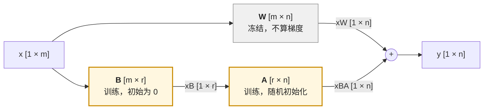

前两篇把矩阵当作"一堆数"，讨论它的形状、成本和向量之间的比较。这一篇看矩阵的两种**结构**：一种是**正交**——矩阵只旋转、不拉伸，内积在它作用下不变；另一种是**低秩**——一个巨大的矩阵其实只由少数几个方向撑起来。前者解释了现代 LLM 的位置编码 RoPE 为什么只用一个旋转就让 attention 只依赖相对位置；后者解释了 LoRA 为什么能用半个百分点的参数微调一个 8B 模型。

全篇的核心问题是：

> **RoPE 为什么能编码相对位置？[^q0] LoRA 的 $$r = 16$$ 在 Llama-3-8B 上加了多少参数、为什么够用？[^q1]**

## 一、总览

### 1. 两条线

```text
正交线：R^T R = I  →  保持内积  →  二维旋转矩阵  →  角度相加  →  RoPE：内积只依赖 n − m
低秩线：秩 = 自由度  →  SVD：W = U Σ V^T  →  截断是最好的低秩近似  →  LoRA：ΔW = BA，参数 r(m+n)
```

两条线在一个地方汇合：SVD 里的 $$U, V$$ 就是正交矩阵——任何矩阵都可以写成"旋转 · 拉伸 · 旋转"。

### 2. 本文的章节安排

| 章 | 主题 | 内容 |
|---|---|---|
| 二 | 正交矩阵 | 定义、保持内积与长度、逆就是转置 |
| 三 | 旋转与 RoPE | 二维旋转矩阵、角度相加、RoPE 一行推导、复数写法、多维怎么做 |
| 四 | 秩与 SVD | 秩是什么、SVD 的形状图与含义、几何直觉 |
| 五 | 低秩近似 | Eckart–Young、参数量 $$r(m + n)$$、什么样的矩阵近似得好 |
| 六 | LoRA | $$\Delta W = BA$$、Llama-3-8B 的数字、推理时怎么用、假设何时成立 |
| 七 | 特征值 | SVD 在对称方阵上的特例；PCA 与 Hessian——只到概念 |
| 八 | 本文小结 | |
| 九 | 自测 | 五道题 |

## 二、正交矩阵

### 1. 定义

方阵 $$R \in \mathbb{R}^{d \times d}$$ 是**正交矩阵**，如果

$$
R^T R = R R^T = I
$$

用列来看：$$R^T R$$ 的第 $$(i, j)$$ 个元素是 $$R$$ 的第 $$i$$ 列与第 $$j$$ 列的内积；等于单位矩阵意味着**每一列长度为 1、不同列互相垂直**（内积为 0）。一组这样的向量叫**正交基**。

### 2. 保持内积与长度

正交矩阵最重要的性质：作用在两个向量上，它们的内积不变：

$$
(Ra)^T (Rb) = a^T R^T R\, b = a^T I\, b = a^T b
$$

推论：长度不变（$$\lVert Ra \rVert = \lVert a \rVert$$，取 $$b = a$$），夹角不变。所以正交矩阵做的是**刚体变换**——旋转或镜面反射——不拉伸、不压缩、不剪切。

第三个性质：**逆就是转置**，$$R^{-1} = R^T$$。一般矩阵求逆要 $$O(d^3)$$ 的计算，正交矩阵翻个身就行。

正交矩阵在 AI 里的三个出场：RoPE（下一章）、SVD 里的 $$U$$ 与 $$V$$（第四章）、以及某些量化方法（L6 讲的"旋转量化"：先用一个正交矩阵把权重的 outlier 打散再量化，因为正交变换不改变 $$WX$$ 的结果——$$W R^T \cdot R X = WX$$）。

## 三、旋转与 RoPE

### 1. 二维旋转矩阵

把平面上的向量逆时针转 $$\theta$$ 角，用矩阵写是

$$
R_\theta = \begin{pmatrix} \cos\theta & -\sin\theta \\ \sin\theta & \cos\theta \end{pmatrix}
$$

验证它正交：两列 $$(\cos\theta, \sin\theta)$$ 与 $$(-\sin\theta, \cos\theta)$$ 各长 1（$$\cos^2 + \sin^2 = 1$$），内积 $$-\cos\theta\sin\theta + \sin\theta\cos\theta = 0$$。

两条性质，RoPE 全靠它们：

- **两次旋转等于角度相加**：$$R_\alpha R_\beta = R_{\alpha + \beta}$$（转 $$\beta$$ 再转 $$\alpha$$，一共转 $$\alpha + \beta$$）；
- **转置是反向旋转**：$$R_\alpha^T = R_{-\alpha}$$（正交矩阵的逆是转置，旋转的逆是反向转）。

### 2. RoPE 一行推导

位置编码要解决的问题：attention 的 score $$q^T k$$（第二篇）不知道两个 token 相隔多远，需要把位置信息放进去。RoPE（Rotary Position Embedding）的做法是：**第 $$m$$ 个位置的 query 旋转 $$m\theta$$，第 $$n$$ 个位置的 key 旋转 $$n\theta$$**，然后照常算内积：

$$
(R_{m\theta}\, q)^T (R_{n\theta}\, k) = q^T R_{m\theta}^T R_{n\theta}\, k = q^T R_{-m\theta} R_{n\theta}\, k = q^T R_{(n - m)\theta}\, k
$$

三步：转置乘进去、转置变反向旋转、角度相加。结果里只剩 $$n - m$$——**内积只依赖两个 token 的相对位置**，绝对位置 $$m, n$$ 各自是多少不重要。这正是我们想要的：一句话整体往后挪十个位置，每对 token 之间的 attention 分数不变。

```text
位置 m 的 q ──旋转 mθ──┐
                      ├── 内积 ──►  q^T R_{(n−m)θ} k     只看 n − m
位置 n 的 k ──旋转 nθ──┘
```

### 3. 复数写法

把二维向量 $$(x, y)$$ 看成复数 $$x + iy$$，旋转 $$\theta$$ 就是乘 $$e^{i\theta}$$（欧拉公式 $$e^{i\theta} = \cos\theta + i\sin\theta$$）。RoPE 论文用的就是这个记号：位置 $$m$$ 的 query 乘 $$e^{im\theta}$$，内积变成 $$\text{Re}[q \bar k\, e^{i(m - n)\theta}]$$——同一件事，两种写法等价。代码实现里通常用复数版（`torch.polar`、`view_as_complex`），读论文时用矩阵版，两者能互相翻译即可。

### 4. 从二维到 128 维

$$q$$ 是 128 维，不是 2 维。RoPE 把 128 维**拆成 64 对**，每对是一个二维平面，各自旋转，但**每对用不同的角速度** $$\theta_i$$：

$$
\theta_i = \text{base}^{-2i/d_h}, \qquad i = 0, 1, \dots, d_h/2 - 1
$$

$$\text{base}$$ 通常是 10000（Llama-3 用 500000）。第 0 对转得最快（$$\theta_0 = 1$$，每挪一个位置转 1 弧度），最后一对转得最慢（$$\theta_{63} = 10000^{-126/128} \approx 1.2 \times 10^{-4}$$，要挪几千个位置才转 1 弧度）。快的对分辨近距离，慢的对分辨远距离——像钟表的秒针、分针、时针。

长上下文外推（PI、NTK-aware、YaRN）全是在改这组 $$\theta_i$$ 随 $$i$$ 的分布：训练时只见过 8K 位置，推理要到 128K，慢的那些对没转过那么大的角度，怎么办——把 $$\theta_i$$ 缩小、把 base 调大、或者分频段处理。读懂本章这一行推导，L4《Transformer 与 LLM》第四篇讨论这些方法时就没有数学障碍了。

## 四、秩与 SVD

### 1. 秩：矩阵真正携带的自由度

一个矩阵的**秩**（rank）是它的列向量中线性无关的个数——"有多少列不能由其他列线性组合得到"。

```text
┌ 1  2  3 ┐
│ 2  4  6 │    第 2 行是第 1 行的 2 倍，第 3 行是第 1 行的 3 倍
└ 3  6  9 ┘    → 三行只有一个方向，秩 = 1
```

这个 $$3 \times 3$$ 矩阵有 9 个数，但真正独立的只有 5 个：第一行的 3 个数加另两行的 2 个倍数（秩 $$r$$ 的 $$m \times n$$ 矩阵自由度是 $$r(m + n - r)$$，这里 $$1 \times (3 + 3 - 1) = 5$$；秩不是自由度，秩是"方向的个数"）。秩 $$r$$ 的 $$m \times n$$ 矩阵，可以写成 $$m \times r$$ 与 $$r \times n$$ 两个矩阵的乘积（上面的例子：$$(1, 2, 3)^T \times (1, 2, 3)$$）。**秩越低，矩阵越"简单"、越可压缩。**

满秩（$$r = \min(m, n)$$）的矩阵没有这种冗余。神经网络训练出来的权重矩阵通常接近满秩——但**微调时权重的改动量**往往不是，这是 LoRA 的出发点（第六章）。

### 2. SVD：任何矩阵都能这样分解

**奇异值分解**（Singular Value Decomposition）说：任何 $$W \in \mathbb{R}^{m \times n}$$（设 $$m \ge n$$）都可以写成

$$
W = U \Sigma V^T
$$

其中 $$U \in \mathbb{R}^{m \times n}$$ 的列互相垂直、长度为 1；$$V \in \mathbb{R}^{n \times n}$$ 是正交矩阵；$$\Sigma \in \mathbb{R}^{n \times n}$$ 是对角阵，对角线上是**从大到小**排列的非负数 $$\sigma_1 \ge \sigma_2 \ge \dots \ge \sigma_n \ge 0$$，叫**奇异值**。画成形状：

```text
  W [m × n]   =    U [m × n]    ·   Σ [n × n]   ·   Vᵀ [n × n]

  ┌─────────┐     ┌───────────┐   ┌─────────┐   ┌───────────┐
  │         │     │ |  |    | │   │ σ₁      │   │ ── v₁ᵀ ── │
  │    W    │  =  │ u₁ u₂ … uₙ│ · │   σ₂    │ · │ ── v₂ᵀ ── │
  │         │     │ |  |    | │   │      ⋱  │   │     ⋮     │
  └─────────┘     └───────────┘   └─────────┘   └───────────┘
                  列互相垂直、长 1    降序的奇异值    行互相垂直、长 1
```

它的含义可以拆成三步动作：$$W$$ 作用在任何向量 $$x$$ 上，$$Wx = U(\Sigma(V^T x))$$——先用 $$V^T$$ **旋转**（正交，不改长度），再用 $$\Sigma$$ 沿各坐标轴**拉伸**（第 $$i$$ 个轴拉 $$\sigma_i$$ 倍），再用 $$U$$ **旋转**到输出空间。任何矩阵都是"旋转 · 拉伸 · 旋转"。

另一种读法：$$W = \sum_{i=1}^{n} \sigma_i\, u_i v_i^T$$——$$W$$ 是 $$n$$ 个秩为 1 的矩阵 $$u_i v_i^T$$ 的加权和，权重是奇异值。**奇异值大的方向对 $$W$$ 贡献大，小的贡献小。** 秩恰好是非零奇异值的个数。

### 3. 一个 $$2 \times 2$$ 的例子

$$W = \begin{pmatrix} 3 & 0 \\ 0 & 1 \end{pmatrix}$$ 已经是对角的：$$U = V = I$$，$$\sigma_1 = 3, \sigma_2 = 1$$。它把 $$x$$ 轴拉 3 倍、$$y$$ 轴不动：单位圆变成一个长轴 3、短轴 1 的椭圆。一般的 $$W$$ 也把单位圆变成椭圆，只是椭圆的轴不再沿坐标轴——$$U$$ 的列是椭圆的轴方向，$$\sigma_i$$ 是半轴长。

## 五、低秩近似

### 1. Eckart–Young 定理

只保留前 $$r$$ 个奇异值（把 $$\sigma_{r+1}, \dots, \sigma_n$$ 置零），得到

$$
W_r = U_r \Sigma_r V_r^T = \sum_{i=1}^{r} \sigma_i\, u_i v_i^T
$$

它的秩是 $$r$$。Eckart–Young 定理说：**在所有秩不超过 $$r$$ 的矩阵中，$$W_r$$ 是离 $$W$$ 最近的**（按 Frobenius 范数，也按谱范数），且误差恰好是被扔掉的奇异值：

$$
\lVert W - W_r \rVert_F = \sqrt{\sigma_{r+1}^2 + \dots + \sigma_n^2}
$$

这是"低秩近似"的全部数学：想用一个简单矩阵近似一个复杂矩阵，做 SVD、留大的、扔小的，没有更好的办法。

```text
  只留前 r 个奇异值（r ≪ n）：

  W_r [m × n]  ≈   U_r [m × r]  ·  Σ_r [r × r]  ·  V_rᵀ [r × n]
  参数量  m·n   →    m·r    +     r      +    r·n   ≈  r (m + n)
```

### 2. 什么样的矩阵近似得好

近似的误差取决于奇异值**衰减得多快**。如果 $$\sigma_1, \dots, \sigma_r$$ 占了全部奇异值平方和的 99%，留 $$r$$ 个就只丢 1% 的"能量"。自然图像、文本的共现矩阵、推荐系统的评分矩阵都有这种性质——前几十个方向解释大部分变化。随机矩阵没有：它的奇异值差不多大，扔谁都损失一样多。

### 3. 参数量的账

原矩阵 $$mn$$ 个数，低秩形式 $$r(m + n)$$ 个。$$m = n = 4096$$、$$r = 16$$：$$16 \times 8192 = 131{,}072$$ 对 $$16{,}777{,}216$$，只有 **0.78%**。而且按上一篇结合律那一节，用它时永远是 $$x \to xB \to (xB)A$$ 两次瘦乘法，成本也只有原来的 0.78%。

## 六、LoRA

### 1. 想法

**微调**是拿一个训好的模型在少量新数据上继续训。全量微调要更新全部 $$N$$ 个参数，每个参数还要配梯度、优化器状态（L1 工具箱第四篇算这笔账：每参数 16 字节，8B 模型 128 GB，一张卡放不下）。

LoRA（Low-Rank Adaptation）的假设是：**微调对权重的改动 $$\Delta W$$ 是低秩的**——预训练已经学到了"通用能力"，微调只是在少数几个方向上调一调。于是不存 $$\Delta W \in \mathbb{R}^{m \times n}$$，而存两个瘦矩阵

$$
\Delta W = BA, \qquad B \in \mathbb{R}^{m \times r},\; A \in \mathbb{R}^{r \times n},\; r \ll m, n
$$

前向变成 $$y = xW + x(BA) = xW + (xB)A$$（按行向量约定，$$x \in \mathbb{R}^{1 \times m}$$）。$$W$$ 冻结不动，只训 $$A, B$$。$$r$$ 叫 LoRA 的秩，常取 8、16、64。



灰色的 $$W$$ 是原模型的权重，训练时只读不写；黄色的 $$A, B$$ 是新增的两个瘦矩阵，全部可训练参数都在这里。输入 $$x$$ 走两条路再相加——上一篇第四章的结合律说过，永远先算瘦的 $$xB$$，不要把 $$BA$$ 乘成一个 $$m \times n$$ 的大矩阵。

它与 SVD 的关系：$$B$$ 对应 $$U_r \Sigma_r$$、$$A$$ 对应 $$V_r^T$$——只是不再要求正交，直接当参数学。初始化时一个为零、另一个随机（原论文 $$B = 0$$、$$A$$ 随机；反过来 $$A = 0$$、$$B$$ 随机也能学，两个都为零则梯度全零学不动）——所以一开始 $$\Delta W = 0$$，模型行为不变。

### 2. Llama-3-8B 的数字

对一层里全部七个线性层（上一篇第六章的表）都加 $$r = 16$$ 的 LoRA：

```text
矩阵      形状 [in, out]      原参数量        LoRA 参数量 r × (in + out)
W_Q       4096 × 4096        16.8 M          16 × 8192   = 131 K
W_K       4096 × 1024         4.2 M          16 × 5120   =  82 K
W_V       4096 × 1024         4.2 M          16 × 5120   =  82 K
W_O       4096 × 4096        16.8 M          16 × 8192   = 131 K
W_gate    4096 × 14336       58.7 M          16 × 18432  = 295 K
W_up      4096 × 14336       58.7 M          16 × 18432  = 295 K
W_down    14336 × 4096       58.7 M          16 × 18432  = 295 K
──────────────────────────────────────────────────────────────────
一层       218 M                              1.31 M      （0.60%）
× 32 层    6.98 B                             41.9 M
占全模型 8.03 B 的                             0.52%
```

**用半个百分点的参数微调一个 8B 模型**——训练时只有这 41.9M 个参数需要梯度和优化器状态，显存从 128 GB 降到十几 GB（L1 第四篇算）。

### 3. 推理时怎么用

训完之后有两种用法：

- **合并**：算出 $$W' = W + BA$$（一次 $$[4096, 16] \times [16, 4096]$$ 的乘法），之后推理与原模型完全一样，零额外开销；
- **不合并**：保留 $$W$$ 与 $$(A, B)$$，推理时多算两次瘦乘法。好处是同一个基座模型可以挂多个 LoRA（多租户 serving），切换只换几十 MB 的 $$A, B$$。

### 4. 假设何时成立

"$$\Delta W$$ 低秩"是一个**经验假设**，不是定理。它在"教模型一种格式 / 风格 / 领域词汇"这类任务上成立得很好，在"注入大量新知识"上成立得差——后者的改动不是少数几个方向能表示的。秩取多少、加在哪些层、学习率怎么配（LoRA 通常要比全量微调大一个量级的学习率），L5 后训练系列第一篇展开。这里只要理解：**LoRA 的全部数学就是本章的低秩近似，它省的每一个参数都来自 $$r(m + n) \ll mn$$。**

## 七、特征值

### 1. 与 SVD 的关系

对**对称方阵** $$A = A^T$$，SVD 退化成**特征分解**：

$$
A = Q \Lambda Q^T
$$

$$Q$$ 正交，$$\Lambda$$ 对角，对角线上是**特征值** $$\lambda_i$$（可正可负），$$Q$$ 的列是**特征向量**——$$A$$ 作用在特征向量上只是把它拉长 $$\lambda_i$$ 倍：$$A q_i = \lambda_i q_i$$，$$\lambda_i < 0$$ 时方向翻转（所以"不改方向"只对正特征值成立）。奇异值是特征值的绝对值；把负号吸收进 $$U$$ 或 $$V$$ 的对应列后，SVD 与特征分解才严格对上。

### 2. 两个出场

- **PCA**（主成分分析，L2 系列讲）：数据的协方差矩阵是对称的，它的特征向量是数据方差最大的方向，特征值是那个方向上的方差。把高维 embedding 投到前两个特征向量上就是常见的"可视化"。
- **优化景观**（L3 讲）：loss 对参数的二阶导数矩阵（Hessian）是对称的，它的特征值描述曲率——在**梯度为零的点**上，全正是"碗底"（局部极小），全负是"山顶"（局部极大），有正有负是"鞍点"（某个方向往下走 loss 会降）；梯度不为零的地方谈曲率不谈极值。

两处都只需要概念：知道"对称矩阵的特征向量是一组互相垂直的方向、特征值是各方向的拉伸倍数"即可，不需要手算。

## 八、本文小结

- **正交矩阵** $$R^T R = I$$：列互相垂直、长 1；保持内积、长度与夹角；逆等于转置。
- **旋转** $$R_\theta$$ 是最简单的正交矩阵：$$R_\alpha R_\beta = R_{\alpha+\beta}$$，$$R_\alpha^T = R_{-\alpha}$$。**RoPE** 把位置 $$m$$ 的 query 转 $$m\theta$$、位置 $$n$$ 的 key 转 $$n\theta$$，内积 $$= q^T R_{(n-m)\theta} k$$ 只依赖相对位置；128 维拆成 64 对、各用不同角速度 $$\theta_i = \text{base}^{-2i/d}$$；长上下文外推全是在改这组 $$\theta_i$$。
- **秩**是矩阵真正的自由度；**SVD** $$W = U\Sigma V^T$$ 把任何矩阵写成"旋转 · 拉伸 · 旋转"，$$W = \sum_i \sigma_i u_i v_i^T$$，奇异值大的方向贡献大。
- **低秩近似**：截断 SVD 是最好的（Eckart–Young），误差是扔掉的奇异值；参数量 $$mn \to r(m + n)$$。
- **LoRA** 假设微调的 $$\Delta W$$ 低秩，存 $$BA$$ 两个瘦矩阵；Llama-3-8B 上 $$r = 16$$ 是 41.9M 参数、占 0.52%；可合并或多 LoRA 共享基座；"低秩"是经验假设，注入大量新知识时不成立。
- **特征值**是 SVD 在对称方阵上的特例；PCA 的主方向、Hessian 的曲率——只需概念。

## 九、自测

1. 验证 $$R_\theta^T R_\theta = I$$（把两个 $$2 \times 2$$ 矩阵乘出来）。

   <details markdown="1"><summary>答案</summary>

   两列长 1、互相垂直。

   </details>

2. RoPE 里，若把所有位置整体加 100（$$m \to m + 100$$，$$n \to n + 100$$），attention score 变不变？为什么？

   <details markdown="1"><summary>答案</summary>

   不变，$$n - m$$ 不变。

   </details>

3. $$W = \begin{pmatrix} 2 & 2 \\ 2 & 2 \end{pmatrix}$$ 的秩是多少？它的非零奇异值是多少？（提示：$$W = (1, 1)^T (2, 2)$$，$$\sigma_1 = \lVert (1,1) \rVert \cdot \lVert (2, 2) \rVert$$。）

   <details markdown="1"><summary>答案</summary>

   秩 1；$$\sigma_1 = \sqrt{2} \times 2\sqrt{2} = 4$$。

   </details>

4. 一个 $$8192 \times 8192$$ 的矩阵，$$r = 64$$ 的 LoRA 占它多少比例？$$r = 8$$ 呢？

   <details markdown="1"><summary>答案</summary>

   $$64 \times 16384 / 8192^2 = 1.56\%$$；$$0.20\%$$。

   </details>

5. 为什么 LoRA 初始化时要让 $$B = 0$$ 而不是 $$A = 0$$、或者两个都随机？

   <details markdown="1"><summary>答案</summary>

   要让初始 $$\Delta W = BA = 0$$ 使模型行为不变，同时要让梯度能流：$$B = 0, A$$ 随机时，对 $$B$$ 的梯度 $$\propto A \ne 0$$，第一步就能更新；若 $$A = 0$$ 且 $$B = 0$$，两者的梯度都是零，永远动不了；两个都随机则初始 $$\Delta W \ne 0$$，一开始就破坏了预训练模型。

   </details>

线性代数到此为止。下一篇换一种语言：概率——把"语言模型"这个对象定义清楚，它是一个条件分布。

[^q0]: 把位置 $$m$$ 的 query 旋转 $$m\theta$$、位置 $$n$$ 的 key 旋转 $$n\theta$$；旋转矩阵正交且 $$R_\alpha^T R_\beta = R_{\beta - \alpha}$$，所以内积 $$q^T R_{(n-m)\theta} k$$ 只依赖相对位置 $$n - m$$，绝对位置被抵消掉了。详见[第二章](#二正交矩阵)、[第三章](#三旋转与-rope)。
[^q1]: $$r = 16$$ 时每个矩阵加 $$r(\text{in} + \text{out})$$ 个参数，一层七个矩阵 1.31 M、32 层 **41.9 M**，占 8.03 B 的 **0.52%**。够用的理由是 SVD 给的：如果微调的改动 $$\Delta W$$ 低秩，那么截断到 $$r$$ 个奇异方向就是最优近似（Eckart–Young）；「低秩」是经验假设——教格式、风格时成立，灌大量新知识时不成立。详见[第四](#四秩与-svd)至[六章](#六lora)。
