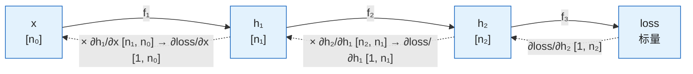

前两篇给了目标：交叉熵、KL、DPO 的 loss。这一篇讲**怎么让参数朝着目标变好**——求导，然后往导数的反方向走一小步。全部工具只有三件：导数（一个数变一点，函数变多少）、梯度（很多个数一起变时的导数）、链式法则（复合函数的导数是局部导数的乘积）。用它们推两个后面反复出现的结果：softmax + 交叉熵的梯度是 $$p - y$$（简洁到令人怀疑），以及目标是期望时的梯度——策略梯度，RL 的全部算法都建立在它上面。最后讲用梯度更新参数的最简单方法与学习率。

全篇的核心问题是：

> **能不能用链式法则推一层的梯度？[^q0] 能不能对一个期望求导，得到策略梯度？[^q1]**

## 一、总览

### 1. 本文的对象

| | 对象 | 含义 | 形状 / 几何 |
|---|---|---|---|
| 三件工具 | 导数 $$f'(x)$$ | 一个输入变一点，输出变多少 | 斜率 |
| | 梯度 $$\nabla_\theta L$$ | $$\theta$$ 的每个分量各变一点，$$L$$ 变多少 | 指向 $$L$$ 增长最快的方向的向量，形状 = $$\theta$$ |
| | Jacobian $$\partial y / \partial x$$ | 向量对向量：每个输出对每个输入 | 矩阵 $$[\dim y, \dim x]$$ |
| | 链式法则 $$\partial L / \partial \theta = (\partial L / \partial g)(\partial g / \partial \theta)$$ | 复合函数：局部导数相乘 | 反向传播 = 逐层套用 |
| 两个结果 | softmax + CE 的梯度 | $$= p - y$$ | 第四章 |
| | 策略梯度 | $$\nabla_\theta \mathbb{E}_{y \sim \pi_\theta}[R(y)] = \mathbb{E}[R(y)\nabla\log\pi_\theta(y)]$$ | 第五章 |
| 一个方法 | 梯度下降 | $$\theta \leftarrow \theta - \eta\nabla L$$ | 第六章 |

### 2. 本文的章节安排

| 章 | 主题 | 内容 |
|---|---|---|
| 二 | 导数、偏导与梯度 | 定义、几何含义、梯度的形状 |
| 三 | 链式法则与 Jacobian | 复合函数、向量情形、反向传播是它的逐层套用 |
| 四 | softmax + 交叉熵的梯度 | 两步推出 $$p - y$$；它说明的三件事 |
| 五 | 期望的梯度：策略梯度 | 为什么不能直接求、log-derivative trick、REINFORCE、baseline 与优势、PPO / GRPO 各改哪一步 |
| 六 | 梯度下降与学习率 | 更新规则、随机梯度的噪声、学习率与 warmup、凸与鞍点 |
| 七 | 拉格朗日乘子 | 带约束的极值：上一篇闭式解与下一篇 Chinchilla 用的工具 |
| 八 | 本文小结 | |
| 九 | 自测 | 五道题 |

## 二、导数、偏导与梯度

### 1. 导数

函数 $$f(x)$$ 在 $$x$$ 处的**导数** $$f'(x) = \frac{df}{dx}$$ 是"$$x$$ 增加一个很小的量 $$\epsilon$$ 时 $$f$$ 增加多少倍的 $$\epsilon$$"：

$$
f(x + \epsilon) \approx f(x) + f'(x)\, \epsilon
$$

几何上是曲线在该点的斜率。几条后面要用的导数：

| $$f(x)$$ | $$f'(x)$$ | 备注 |
|---|---|---|
| $$x^2$$ | $$2x$$ | |
| $$e^x$$ | $$e^x$$ | |
| $$\ln x$$ | $$1/x$$ | |
| $$\sigma(x)$$ | $$\sigma(x)(1 - \sigma(x))$$ | sigmoid 的导数用自己表示 |
| $$c \cdot f(x)$$ | $$c \cdot f'(x)$$ | 常数倍 |
| $$f + g$$ | $$f' + g'$$ | 和的导数是导数的和 |

### 2. 偏导与梯度

函数有多个输入 $$L(\theta_1, \theta_2, \dots, \theta_n)$$ 时，对某一个输入求导、其余固定，叫**偏导** $$\frac{\partial L}{\partial \theta_i}$$。把所有偏导排成一个向量就是**梯度**：

$$
\nabla_\theta L = \left( \frac{\partial L}{\partial \theta_1}, \dots, \frac{\partial L}{\partial \theta_n} \right) \in \mathbb{R}^{n}
$$

**梯度与被求导的参数形状相同**：$$\theta$$ 是 $$4096 \times 4096$$ 的矩阵，$$\nabla_\theta L$$ 也是 $$4096 \times 4096$$ 的矩阵，第 $$(i, j)$$ 个元素是 $$L$$ 对 $$\theta_{ij}$$ 的偏导。这是读任何梯度公式时的形状检查。

几何含义：梯度**指向 $$L$$ 增长最快的方向**，长度是那个方向上的斜率。$$\theta$$ 沿任意方向 $$v$$ 走一小步，$$L$$ 的变化约为 $$\nabla_\theta L \cdot v$$（内积，第二篇）；要让 $$L$$ 下降最快，就沿 $$-\nabla_\theta L$$ 走——这是第六章梯度下降的全部理由。

一个例子：$$L(\theta_1, \theta_2) = \theta_1^2 + 3\theta_2$$，$$\nabla L = (2\theta_1, 3)$$；在 $$(1, 0)$$ 处是 $$(2, 3)$$，往 $$(-2, -3)$$ 方向走 $$L$$ 降得最快。

## 三、链式法则与 Jacobian

### 1. 标量情形

$$L = f(g(\theta))$$，先算 $$g$$ 再算 $$f$$。链式法则：

$$
\frac{dL}{d\theta} = \frac{df}{dg} \cdot \frac{dg}{d\theta}
$$

"外层对内层的导数 × 内层对参数的导数"。例：$$L = (3\theta + 1)^2$$，令 $$g = 3\theta + 1$$，$$L = g^2$$，$$\frac{dL}{d\theta} = 2g \cdot 3 = 6(3\theta + 1)$$。

### 2. 向量情形与 Jacobian

先看一个能手算的例子。两个输入、两个输出的函数：

$$
g(\theta_1, \theta_2) = \begin{pmatrix} g_1 \\ g_2 \end{pmatrix} = \begin{pmatrix} \theta_1 \theta_2 \\ \theta_1 + \theta_2 \end{pmatrix}
$$

"$$g$$ 对 $$\theta$$ 的导数"要回答的是：每个输入变一点，**每个**输出各变多少——两个输入 × 两个输出，一共四个数，排成一张表：

| | 对 $$\theta_1$$ 求导 | 对 $$\theta_2$$ 求导 |
|---|---|---|
| $$g_1 = \theta_1\theta_2$$ | $$\partial g_1 / \partial \theta_1 = \theta_2$$ | $$\partial g_1 / \partial \theta_2 = \theta_1$$ |
| $$g_2 = \theta_1 + \theta_2$$ | $$\partial g_2 / \partial \theta_1 = 1$$ | $$\partial g_2 / \partial \theta_2 = 1$$ |

每一格都是第二章的偏导：对一个变量求导、另一个当常数。在 $$\theta = (2, 3)$$ 处这张表是 $$\begin{pmatrix} 3 & 2 \\ 1 & 1 \end{pmatrix}$$。这张表就是 **Jacobian**：**行**对应输出（$$g_1, g_2$$），**列**对应输入（$$\theta_1, \theta_2$$），第 $$(i, j)$$ 格是"第 $$i$$ 个输出对第 $$j$$ 个输入的偏导"。一般地，$$g: \mathbb{R}^n \to \mathbb{R}^m$$（$$n$$ 个输入、$$m$$ 个输出）的 Jacobian 是 $$m$$ 行 $$n$$ 列：

$$
\frac{\partial g}{\partial \theta} \in \mathbb{R}^{m \times n}, \qquad \left(\frac{\partial g}{\partial \theta}\right)_{ij} = \frac{\partial g_i}{\partial \theta_j}
$$

写成循环就是"对每个输出、对每个输入，各求一次偏导"：

```python
J = [[0.0] * n for _ in range(m)]      # m 行（输出）× n 列（输入）
for i in range(m):                     # 第 i 个输出 g_i
    for j in range(n):                 # 对第 j 个输入 θ_j 求偏导
        J[i][j] = d(g[i]) / d(theta[j])
```

它的用处是**链式法则在向量情形下的形式**。设 $$L = f(g(\theta))$$，$$f$$ 把 $$m$$ 个数变成一个标量（比如 $$L = g_1 + 2 g_2$$）。$$\theta_j$$ 变一点会让每个 $$g_i$$ 都变一点，每个 $$g_i$$ 的变化又各自影响 $$L$$，所以 $$L$$ 对 $$\theta_j$$ 的导数要把所有路径加起来：

$$
\frac{\partial L}{\partial \theta_j} = \sum_{i=1}^{m} \frac{\partial L}{\partial g_i} \cdot \frac{\partial g_i}{\partial \theta_j}
$$

这个"对 $$i$$ 求和"正好是一次矩阵乘法（第一篇：矩阵乘的每个元素是一行乘一列、沿内维求和）：

$$
\underbrace{\frac{\partial L}{\partial \theta}}_{[1, n]} = \underbrace{\frac{\partial L}{\partial g}}_{[1, m]} \cdot \underbrace{\frac{\partial g}{\partial \theta}}_{[m, n]}
$$

用第一篇的形状规则检查：$$[1, m] \times [m, n] = [1, n]$$，与 $$\theta$$ 同形——第二章说过梯度总与被求导的参数同形。回到例子：$$L = g_1 + 2g_2$$，$$\partial L / \partial g = (1, 2)$$；在 $$\theta = (2, 3)$$ 处

$$
\frac{\partial L}{\partial \theta} = (1, 2) \begin{pmatrix} 3 & 2 \\ 1 & 1 \end{pmatrix} = (1 \cdot 3 + 2 \cdot 1,\; 1 \cdot 2 + 2 \cdot 1) = (5, 4)
$$

直接验算：$$L = \theta_1\theta_2 + 2(\theta_1 + \theta_2)$$，$$\partial L / \partial \theta_1 = \theta_2 + 2 = 5$$，$$\partial L / \partial \theta_2 = \theta_1 + 2 = 4$$。一致。

### 3. 反向传播就是逐层套用

一个 $$L$$ 层的网络是 $$L$$ 个函数的复合：$$\text{loss} = f_L(f_{L-1}(\cdots f_1(x)))$$。对第 $$l$$ 层参数的梯度，按链式法则是从 loss 一路乘到第 $$l$$ 层的局部 Jacobian 的乘积。**反向传播**就是从输出往输入方向逐层做这个乘法，每层把上游传来的梯度（一个与本层输出同形的量）乘上自己的局部 Jacobian，传给下游。



实线是前向（每层把上一层的输出变成自己的输出），虚线是反向：从 loss 出发带着一个 $$[1, n_2]$$ 的行向量，每经过一层就右乘该层的 Jacobian，形状从 $$[1, n_2]$$ 变成 $$[1, n_1]$$ 再变成 $$[1, n_0]$$——每一步都是上一节那个 $$[1, m] \times [m, n]$$。

这个过程和异常沿调用栈向上传播很像：前向是一串嵌套调用 `f3(f2(f1(x)))`，反向是从最外层开始，每一层收到上游传来的"你的输出对 loss 负多少责任"（$$\partial \text{loss} / \partial h_l$$），乘上自己的局部导数，把责任分摊到自己的参数和输入上，再把对输入的那份传给下一层。每一层只需要知道自己那一步的导数，不需要知道整个网络长什么样——这就是为什么 PyTorch 能对任意组合的算子自动求导：每种算子只实现自己的"局部导数 × 上游梯度"。

工程上从不显式构造 Jacobian（一个 $$[4096, 4096]$$ 层的 Jacobian 对 batch 里每个 token 都是 $$4096 \times 4096$$），而是直接算"上游梯度 × Jacobian"这个乘积（叫 VJP，vector-Jacobian product），每种层有自己的高效公式。L3 系列第一篇手推一个两层网络并写出这些公式；这里只要求会一个最重要的局部导数——下一章。

最常用的一个 VJP 值得在这里先看一眼，因为它解释了反向传播公式里那些"莫名出现"的转置。线性层 $$Y = XW$$（$$X$$ 是 $$[B, k]$$，$$W$$ 是 $$[k, n]$$），上游传来 $$G = \partial L / \partial Y$$，与 $$Y$$ 同形 $$[B, n]$$。要算 $$\partial L / \partial W$$。先写前向的循环，再问"$$W_{lj}$$ 被谁用过"：

```python
# 前向：W[l][j] 参与了 batch 里每个样本 i 的 Y[i][j]
for i in range(B):
    for j in range(n):
        for l in range(k):
            Y[i][j] += X[i][l] * W[l][j]

# 反向：链式法则——W[l][j] 对 loss 的影响 = 它影响过的每个 Y[i][j] 的影响之和
for l in range(k):
    for j in range(n):
        for i in range(B):
            dW[l][j] += X[i][l] * G[i][j]   # 对 i 求和：X 的第 l 列 · G 的第 j 列
```

最内层对 $$i$$ 求和，用的是 $$X$$ 的**第 $$l$$ 列**和 $$G$$ 的第 $$j$$ 列——"拿列当行用"在矩阵语言里就是转置，所以 $$\partial L / \partial W = X^T G$$，形状 $$[k, B] \times [B, n] = [k, n]$$，与 $$W$$ 相同（用形状规则检查：只有这一种摆法能得到 $$[k, n]$$）。同理 $$\partial L / \partial X = G W^T$$（$$[B, n] \times [n, k]$$）。所有反向传播公式里的转置都是这么来的：某个下标在前向里是"被共用"的，反向就要对它求和。

## 四、softmax + 交叉熵的梯度

### 1. 设定

logits $$z \in \mathbb{R}^V$$，$$p = \text{softmax}(z)$$，真实标签 one-hot $$y$$（真实 token 那一位是 1），loss $$L = -\sum_j y_j \log p_j$$（第五篇）。求 $$\frac{\partial L}{\partial z}$$——loss 对 logits 的梯度，反向传播进入模型的第一步。

### 2. 两步推导

**第一步：$$\log p_j$$ 对 $$z_k$$ 的导数。** $$\log p_j = z_j - \log\sum_i e^{z_i}$$（softmax 取对数）。对 $$z_k$$ 求导：第一项给 $$\delta_{jk}$$（$$j = k$$ 时 1，否则 0），第二项给 $$\frac{e^{z_k}}{\sum_i e^{z_i}} = p_k$$。所以

$$
\frac{\partial \log p_j}{\partial z_k} = \delta_{jk} - p_k
$$

**第二步：对 $$y$$ 加权求和。** $$L = -\sum_j y_j \log p_j$$，

$$
\frac{\partial L}{\partial z_k} = -\sum_j y_j (\delta_{jk} - p_k) = -y_k + p_k \sum_j y_j = p_k - y_k
$$

（用了 $$\sum_j y_j = 1$$。）写成向量：

$$
\frac{\partial L}{\partial z} = p - y
$$

**梯度就是"预测概率减去真实概率"。**

### 3. 它说明的三件事

| 位置 | 梯度 | 范围 | 含义 |
|---|---|---|---|
| 真实 token 的位置（$$y_k = 1$$） | $$p_k - 1$$ | $$[-1, 0]$$ | 预测越准（$$p_k \to 1$$）梯度越接近 0 |
| 其他 token 的位置（$$y_k = 0$$） | $$p_k - 0$$ | $$[0, 1]$$ | 被"推低"，推的力度是它当前的概率 |

举一个 $$V = 3$$ 的数字例子：logits $$z = (2, 1, 0)$$，$$p = \text{softmax}(z) \approx (0.665, 0.245, 0.090)$$，真实 token 是第 2 个，$$y = (0, 1, 0)$$。梯度 $$p - y = (0.665, -0.755, 0.090)$$：第 2 位是负的（往上推，因为梯度下降走 $$-\nabla$$），另外两位是正的（往下推），推得最狠的是当前概率最高的第 1 位。

- **梯度有界**，每个分量在 $$[-1, 1]$$ 内。对比用均方误差（MSE）做分类：梯度里会多一个 $$p_k(1 - p_k)$$ 的因子，预测很错（$$p_k \approx 0$$）时梯度反而接近零、学不动。这是交叉熵比 MSE 更适合分类的原因之一。
- **预测越准梯度越小**：$$p_k \to 1$$ 时梯度 $$\to 0$$，模型自动在"已经会的"位置上少更新。
- **所有 $$V$$ 个 logits 都收到梯度**，不只是正确答案那一个：错误 token 的概率越高被推得越狠。

这个式子还是理解 **logits 级蒸馏**的入口：把 one-hot $$y$$ 换成 teacher 的软分布 $$p_{\text{teacher}}$$，同样的推导给出梯度 $$p_{\text{student}} - p_{\text{teacher}}$$——student 被推向 teacher 的整个分布。

## 五、期望的梯度：策略梯度

### 1. 问题

RL 的目标是最大化**期望奖励**：

$$
J(\theta) = \mathbb{E}_{y \sim \pi_\theta}\big[R(y)\big] = \sum_y \pi_\theta(y)\, R(y)
$$

$$\pi_\theta$$ 是策略（条件分布，省略了 prompt $$x$$），$$y$$ 是一条回答，$$R(y)$$ 是它的奖励（一个数，来自奖励模型或规则验证器）。想对 $$\theta$$ 求梯度然后往上走。

困难：**期望里的分布本身依赖 $$\theta$$**。不能把 $$\nabla_\theta$$ 直接移进期望——$$\mathbb{E}_{y \sim \pi_\theta}[\nabla_\theta R(y)]$$ 是零，因为 $$R(y)$$ 不含 $$\theta$$（奖励是外部给的，往往还不可导：对错、编译通过与否）。

### 2. log-derivative trick

从求和形式出发，对 $$\theta$$ 求导（$$R(y)$$ 是常数）：

$$
\nabla_\theta J = \sum_y R(y)\, \nabla_\theta \pi_\theta(y)
$$

这不是一个期望（没有 $$\pi_\theta(y)$$ 做权重），不能用采样估计。用一个恒等式把 $$\pi_\theta$$ 变出来：

$$
\nabla_\theta \pi_\theta(y) = \pi_\theta(y)\, \nabla_\theta \log \pi_\theta(y)
$$

（由 $$\nabla \log f = \nabla f / f$$ 移项。）代入：

$$
\nabla_\theta J = \sum_y \pi_\theta(y)\, R(y)\, \nabla_\theta \log \pi_\theta(y) = \mathbb{E}_{y \sim \pi_\theta}\big[ R(y)\, \nabla_\theta \log \pi_\theta(y) \big]
$$

现在右边**是一个期望**，可以用采样估计：从当前策略采 $$n$$ 条回答 $$y_1, \dots, y_n$$，各算奖励，用

$$
\hat g = \frac{1}{n} \sum_{i=1}^{n} R(y_i)\, \nabla_\theta \log \pi_\theta(y_i)
$$

当梯度。这就是**策略梯度定理**的最简形式，用它的算法叫 **REINFORCE**。

读它：$$\nabla_\theta \log \pi_\theta(y_i)$$ 是"让回答 $$y_i$$ 的概率增大的方向"（正是上一篇 MLE 的梯度——把 $$y_i$$ 当训练数据）；乘上奖励 $$R(y_i)$$：**奖励高的回答，往增大它概率的方向走得多；奖励低（负）的，反向走**。策略梯度就是"按奖励加权的最大似然"。

### 3. baseline 与优势

REINFORCE 的问题是**方差大**：奖励如果全是正的（比如 0–10 分），每条回答都被"增大概率"，只是幅度不同，采样的噪声会淹没信号。修法：给 $$R$$ 减一个不依赖 $$y$$ 的**基线** $$b$$，

$$
\nabla_\theta J = \mathbb{E}_{y \sim \pi_\theta}\big[ (R(y) - b)\, \nabla_\theta \log \pi_\theta(y) \big]
$$

**期望不变，方差降低。** 期望不变的证明只需一行：

$$
\mathbb{E}_{y \sim \pi_\theta}\big[\nabla_\theta \log \pi_\theta(y)\big] = \sum_y \pi_\theta(y) \frac{\nabla_\theta \pi_\theta(y)}{\pi_\theta(y)} = \nabla_\theta \sum_y \pi_\theta(y) = \nabla_\theta 1 = 0
$$

——"让概率增大的方向"在策略自己的分布下平均为零（概率总和恒为 1，不能所有回答都增大），所以减去常数倍的它不改变期望。$$R(y) - b$$ 叫**优势**（advantage）$$A(y)$$："这条回答比平均好多少"。好于平均的被增大、差于平均的被减小，而不是所有回答都被增大。

### 4. PPO 与 GRPO 各改哪一步

L5 后训练系列里的每一种在线 RL 算法都是在 $$\mathbb{E}[A(y)\nabla\log\pi_\theta(y)]$$ 这个式子上做两件事——**baseline 从哪来、更新怎么限**：

| 算法 | baseline / 优势从哪来 | 更新幅度怎么限 |
|---|---|---|
| REINFORCE | $$b = 0$$ 或一个滑动平均 | 不限 |
| PPO | 一个单独训练的价值网络估 $$b$$（critic），逐 token 的优势 | 把 $$\pi_\theta / \pi_{\text{old}}$$ 的比值裁剪在 $$[1 - \epsilon, 1 + \epsilon]$$，加 KL 惩罚 |
| GRPO | 同一个 prompt 采 $$G$$ 条回答，用这一组的均值当 $$b$$、用组内标准差归一化：$$A_i = (R_i - \text{mean}) / \text{std}$$ → 不需要价值网络 | 同 PPO 的裁剪 |

读懂本章，这些算法之间的差别就只剩这两个问题；GRPO 论文里"优势为什么减均值"的答案就是第 3 节那一行证明。

### 5. 与 DPO 的关系

上一篇的 DPO 不走这条路：它把 RL 目标的最优解反解出来，直接在偏好数据上做监督学习，不需要采样、不需要估计期望的梯度。代价是只能用离线的偏好对，不能像策略梯度那样在训练中不断从当前策略采新样本并用验证器打分——这是"离线 vs 在线"的根本差别，L5 展开。

## 六、梯度下降与学习率

### 1. 更新规则

有了梯度，最简单的优化是沿负梯度走一步：

$$
\theta \leftarrow \theta - \eta\, \nabla_\theta L
$$

$$\eta$$ 是**学习率**（learning rate），控制步长。第二章说过 $$-\nabla L$$ 是下降最快的方向；$$\eta$$ 小时每步 $$L$$ 约降 $$\eta \lVert \nabla L \rVert^2$$。

### 2. 随机梯度

真实的 $$L$$ 是全部训练数据上的平均，算一次要过全部数据（几万亿 token），不现实。**随机梯度下降**（SGD）用一个 **batch**（比如几百万 token）估计梯度。估计有噪声：batch 越大噪声越小，方差与 batch 大小 $$B$$ 成反比（第四篇：样本均值的方差是 $$\sigma^2 / n$$）。噪声不全是坏事（帮助跳出鞍点、有正则效果），但它决定了学习率的上限：噪声大时步子不能迈太大。这是"batch 变大、学习率要跟着调"这类 scaling 规则的来源，L4 预训练系列的配方篇会碰到。

### 3. 学习率、warmup 与调度

| | 现象 / 做法 |
|---|---|
| $$\eta$$ 太大 | 每步跨过谷底，loss 震荡或发散（爆成 NaN） |
| $$\eta$$ 太小 | 每步几乎不动，loss 平缓下降但慢到不可接受 |
| warmup | 开始的几百到几千步从很小的 $$\eta$$ 线性升到目标值——训练初期梯度方向噪声大、Adam 的统计量还没稳定，先小步走 |
| 衰减 | 之后按 cosine 或线性慢慢降到目标值的 1/10 左右——后期需要小步精调 |

看 loss 曲线判断学习率对不对，是横切"实验方法论"的基本功。Momentum、Adam / AdamW、weight decay 与 $$L_2$$ 正则的区别、梯度裁剪——这些都建立在 SGD 之上，但它们的设计动机要到训练神经网络时才看得见，放在 L3 系列第三篇。

### 4. 凸与非凸

**凸函数**（碗形，任意两点连线在函数上方）只有一个极小值，梯度下降一定收敛到它。神经网络的 loss **非凸**：有很多局部极小，还有**鞍点**——梯度为零但不是极小（某些方向往下走 $$L$$ 会降；Hessian 有负特征值，第三篇第七章）。实践发现高维空间里鞍点远多于坏的局部极小，而随机梯度的噪声足以逃离鞍点——所以不必对非凸过度担心，但要理解"收敛到哪"依赖初始化与学习率，同一个模型换个种子结果会略有不同（第八篇：报多个种子的均值与标准差）。

## 七、拉格朗日乘子

上一篇的闭式解与下一篇的 Chinchilla 都要解一个**带约束的极值**问题："在 $$g(\theta) = c$$ 的条件下最大化 $$f(\theta)$$"。工具是**拉格朗日乘子**：构造

$$
\mathcal{L}(\theta, \lambda) = f(\theta) - \lambda\,(g(\theta) - c)
$$

对 $$\theta$$ 和 $$\lambda$$ 分别求导令为零。直觉：在最优点，$$f$$ 的梯度必须与约束面 $$g = c$$ 的梯度平行（否则沿约束面还能走一步让 $$f$$ 变大），$$\lambda$$ 就是那个平行的倍数。

一个例子：在 $$x + y = 10$$ 下最大化 $$xy$$。$$\mathcal{L} = xy - \lambda(x + y - 10)$$，$$\partial_x: y = \lambda$$，$$\partial_y: x = \lambda$$，所以 $$x = y = 5$$。下一篇用它在"算力 $$C = 6ND$$ 固定"下最小化 loss $$L(N, D)$$，得到 Chinchilla 的 $$D/N \approx 20$$；上一篇的 $$\pi^* \propto \pi_{\text{ref}} e^{r/\beta}$$ 也是它在约束 $$\sum_y \pi(y) = 1$$ 下解出来的。

## 八、本文小结

- **导数**是斜率；**梯度**是所有偏导排成的向量，**与参数同形**，指向增长最快的方向；沿 $$-\nabla L$$ 走降得最快。
- **链式法则**：复合函数的导数是局部导数的乘积；向量情形是 Jacobian 的矩阵乘法（用形状规则检查）；**反向传播**是从 loss 往输入逐层套用它，工程上直接算"上游梯度 × Jacobian"而不构造 Jacobian。
- **softmax + 交叉熵的梯度 $$= p - y$$**：两步推出（$$\partial\log p_j / \partial z_k = \delta_{jk} - p_k$$，对 $$y$$ 加权）；梯度有界、预测越准越小、所有 logits 都收到；换 $$y$$ 为软分布就是蒸馏的梯度。
- **策略梯度**：期望里的分布依赖参数，用 $$\nabla\pi = \pi\nabla\log\pi$$ 把它变回期望，$$\nabla J = \mathbb{E}[R(y)\nabla\log\pi_\theta(y)]$$——按奖励加权的最大似然；减 **baseline** 得到**优势**，期望不变（$$\mathbb{E}[\nabla\log\pi] = 0$$）、方差降低；PPO 用价值网络估 baseline 并裁剪，GRPO 用组内均值当 baseline、去掉价值网络。
- **梯度下降** $$\theta \leftarrow \theta - \eta\nabla L$$；随机梯度的噪声方差 $$\propto 1/B$$，决定学习率上限；warmup 与衰减；非凸 loss 有鞍点，随机性足以逃离。
- **拉格朗日乘子**解带约束的极值：$$\mathcal{L} = f - \lambda(g - c)$$，是上一篇闭式解与下一篇 Chinchilla 的工具。

## 九、自测

1. $$L(\theta) = (\theta_1 - 2)^2 + 4\theta_2^2$$，梯度是什么？在 $$(0, 1)$$ 处梯度下降一步（$$\eta = 0.1$$）后到哪？

   <details markdown="1"><summary>答案</summary>

   $$(2(\theta_1 - 2), 8\theta_2)$$；在 $$(0, 1)$$ 处是 $$(-4, 8)$$，一步后 $$(0.4, 0.2)$$。

   </details>

2. $$L = \log\sigma(w x)$$（$$w, x$$ 标量），用链式法则求 $$\frac{dL}{dw}$$（提示：$$\sigma' = \sigma(1 - \sigma)$$，$$\frac{d}{du}\log u = 1/u$$）。

   <details markdown="1"><summary>答案</summary>

   $$\frac{1}{\sigma(wx)} \cdot \sigma(wx)(1 - \sigma(wx)) \cdot x = (1 - \sigma(wx))\, x$$。

   </details>

3. 三个 token 的分类，logits 给出 $$p = (0.7, 0.2, 0.1)$$，真实标签是第 2 个：loss 对 logits 的梯度是什么？哪个分量最大？

   <details markdown="1"><summary>答案</summary>

   $$p - y = (0.7, -0.8, 0.1)$$；第 2 个分量绝对值最大——真实 token 被"拉高"最多。

   </details>

4. 一组 GRPO 采样的 4 条回答奖励是 $$(1, 0, 0, 1)$$，优势各是多少（减均值、除标准差）？如果 4 条全是 1 呢？

   <details markdown="1"><summary>答案</summary>

   均值 0.5、标准差 0.5，优势 $$(1, -1, -1, 1)$$；全是 1 时均值 1、标准差 0，优势全为 0（除零要加 $$\epsilon$$）——这一组没有信号，GRPO 会跳过它，这是"太易或太难的题不提供梯度"的来源。

   </details>

5. 为什么策略梯度里给奖励减一个常数不改变期望？用一句话说出用到的等式。

   <details markdown="1"><summary>答案</summary>

   $$\mathbb{E}_{y \sim \pi_\theta}[\nabla_\theta \log \pi_\theta(y)] = \nabla_\theta \sum_y \pi_\theta(y) = \nabla_\theta 1 = 0$$。

   </details>

最后一篇讲统计推断与拟合：怎么判断评测上差 3 个点是不是噪声，以及 scaling law 的曲线是怎么从一组实验点拟出来的。

[^q0]: 能。链式法则说复合函数的导数是局部导数的乘积，向量情形是 Jacobian 的矩阵乘（用形状规则检查）；反向传播就是从 loss 往输入逐层套用它。最重要的一个局部导数是 softmax + 交叉熵：$$\partial L / \partial z = p - y$$，两步推出，有界、预测越准越小。详见[第三章](#三链式法则与-jacobian)、[第四章](#四softmax--交叉熵的梯度)。
[^q1]: 能。$$J = \mathbb{E}_{y \sim \pi_\theta}[R(y)]$$ 里分布本身依赖参数，用 $$\nabla \pi = \pi \nabla \log \pi$$ 把梯度写回期望，得到策略梯度 $$\mathbb{E}[R(y) \nabla \log \pi_\theta(y)]$$——按奖励加权的最大似然；减一个 baseline 期望不变、方差降低，PPO 用价值网络估它、GRPO 用组内均值。详见[第五章](#五期望的梯度策略梯度)。
