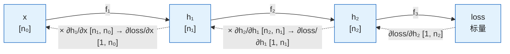

前两篇给了目标：交叉熵、KL、DPO 的 loss。这一篇讲**怎么让参数朝着目标变好**——求导，然后往导数的反方向走一小步。全部工具只有三件：导数（一个数变一点，函数变多少）、梯度（很多个数一起变时的导数）、链式法则（复合函数的导数是局部导数的乘积）。用它们推两个后面反复出现的结果：softmax + 交叉熵的梯度是 $$p - y$$（简洁到令人怀疑），以及目标是期望时的梯度——策略梯度，RL 的全部算法都建立在它上面。最后讲用梯度更新参数的最简单方法与学习率。

这一篇是机器学习的发动机：**没有梯度就没有训练**。所以每个概念都配一张图、一个能手算的数字例子和一段能跑的代码——文中的全部数字与图由 [`math-for-ai/07_gradients_and_policy_gradient.py`](https://github.com/arganzheng/ai-learning-labs/blob/main/math-for-ai/07_gradients_and_policy_gradient.py) 生成；第八章还在一个真模型上把策略梯度从头跑一遍（[`07_rl_on_nanogpt.py`](https://github.com/arganzheng/ai-learning-labs/blob/main/math-for-ai/07_rl_on_nanogpt.py)），看它怎么把奖励推高、又怎么把模型搞坏。

全篇的核心问题是：

> **能不能用链式法则推一层的梯度？[^q0] 能不能对一个期望求导，得到策略梯度？[^q1]**

## 一、总览

### 1. 本文的对象

| | 对象 | 含义 | 形状 / 几何 |
|---|---|---|---|
| 三件工具 | 导数 $$f'(x)$$ | 一个输入变一点，输出变多少 | 斜率 |
| | 梯度 $$\nabla_\theta L$$ | $$\theta$$ 的每个分量各变一点，$$L$$ 变多少 | 指向 $$L$$ 增长最快的方向的向量，形状 = $$\theta$$ |
| | Jacobian $$\partial y / \partial x$$ | 向量对向量：每个输出对每个输入 | 矩阵 $$[\dim y, \dim x]$$ |
| | 链式法则 $$\partial L / \partial \theta = (\partial L / \partial g)(\partial g / \partial \theta)$$ | 复合函数：局部导数相乘 | 反向传播 = 逐层套用 |
| 两个结果 | softmax + CE 的梯度 | $$= p - y$$ | 第四章 |
| | 策略梯度 | $$\nabla_\theta \mathbb{E}_{y \sim \pi_\theta}[R(y)] = \mathbb{E}[R(y)\nabla\log\pi_\theta(y)]$$ | 第五章 |
| 一个方法 | 梯度下降 | $$\theta \leftarrow \theta - \eta\nabla L$$ | 第六章 |

Table: 本文的对象：三件工具与它们的几何含义

### 2. 本文的章节安排

| 章 | 主题 | 内容 |
|---|---|---|
| 二 | 导数、偏导与梯度 | 割线到切线；梯度的形状与几何（等高线与箭头场） |
| 三 | 链式法则与 Jacobian | 复合函数、向量情形、计算图<br/>手算 / autograd / 有限差分三方对拍<br/>反向传播是它的逐层套用 |
| 四 | softmax + 交叉熵的梯度 | 两步推出 $$p - y$$；它说明的三件事 |
| 五 | 期望的梯度：策略梯度 | 为什么不能直接求、log-derivative trick、REINFORCE<br/>**10 个 token 的玩具策略**：精确梯度 vs 采样估计、baseline 为什么降方差、GRPO 的偏差、四种方法的训练曲线<br/>PPO / GRPO 各改哪一步 |
| 六 | 梯度下降与学习率 | 更新规则、三种学习率的轨迹、随机梯度的噪声、warmup、凸与鞍点 |
| 七 | 拉格朗日乘子 | 带约束的极值：等高线与约束线相切；上一篇闭式解与下一篇 Chinchilla 用的工具 |
| 八 | 案例：在一个真模型上做最小的 RL | 莎士比亚 nanoGPT + 元音奖励：奖励涨、模型坏、KL 惩罚 |
| 九 | 本文小结 |  |
| 十 | 自测 | 七道题 |

Table: 本文的章节安排

## 二、导数、偏导与梯度

### 1. 导数

函数 $$f(x)$$ 在 $$x$$ 处的**导数** $$f'(x) = \frac{df}{dx}$$ 是"$$x$$ 增加一个很小的量 $$\epsilon$$ 时 $$f$$ 增加多少倍的 $$\epsilon$$"：

$$
f(x + \epsilon) \approx f(x) + f'(x)\, \epsilon
$$

几何上是曲线在该点的斜率。"斜率"怎么量？在 $$x$$ 和 $$x + \epsilon$$ 两点之间连一条直线（割线），它的斜率是 $$\frac{f(x + \epsilon) - f(x)}{\epsilon}$$；让 $$\epsilon$$ 越来越小，割线越来越贴近曲线，斜率趋向一个数——那个数就是导数。用 $$f(x) = x^2$$ 在 $$x = 1$$ 处算一遍：

| $$\epsilon$$ | 1 | 0.5 | 0.1 | 0.01 | 0.001 |
|---|---:|---:|---:|---:|---:|
| 割线斜率 $$\frac{f(1 + \epsilon) - f(1)}{\epsilon}$$ | 3.00 | 2.50 | 2.10 | 2.01 | 2.001 |

Table: 割线斜率随 $$\epsilon$$ 缩小趋向 2 = $$f'(1)$$


趋向的极限是 2，与公式 $$f'(x) = 2x$$ 在 $$x = 1$$ 处一致。这个"把 $$\epsilon$$ 取得很小算一个比值"的动作叫**有限差分**（finite difference），它不需要任何公式，任何函数都能这么算——所以它是检验梯度代码有没有写错的标准工具（第三章会用）。几条后面要用的导数：

| $$f(x)$$ | $$f'(x)$$ | 备注 |
|---|---|---|
| $$x^2$$ | $$2x$$ | |
| $$e^x$$ | $$e^x$$ | |
| $$\ln x$$ | $$1/x$$ | |
| $$\sigma(x)$$ | $$\sigma(x)(1 - \sigma(x))$$ | sigmoid 的导数用自己表示 |
| $$c \cdot f(x)$$ | $$c \cdot f'(x)$$ | 常数倍 |
| $$f + g$$ | $$f' + g'$$ | 和的导数是导数的和 |

Table: 后面要用到的几条导数

### 2. 偏导与梯度

函数有多个输入 $$L(\theta_1, \theta_2, \dots, \theta_n)$$ 时，对某一个输入求导、其余固定，叫**偏导** $$\frac{\partial L}{\partial \theta_i}$$。把所有偏导排成一个向量就是**梯度**：

$$
\nabla_\theta L = \left( \frac{\partial L}{\partial \theta_1}, \dots, \frac{\partial L}{\partial \theta_n} \right) \in \mathbb{R}^{n}
$$

**梯度与被求导的参数形状相同**：$$\theta$$ 是 $$4096 \times 4096$$ 的矩阵，$$\nabla_\theta L$$ 也是 $$4096 \times 4096$$ 的矩阵，第 $$(i, j)$$ 个元素是 $$L$$ 对 $$\theta_{ij}$$ 的偏导。这是读任何梯度公式时的形状检查。

几何含义：梯度**指向 $$L$$ 增长最快的方向**，长度是那个方向上的斜率。$$\theta$$ 沿任意方向 $$v$$ 走一小步，$$L$$ 的变化约为 $$\nabla_\theta L \cdot v$$（内积，第二篇）；要让 $$L$$ 下降最快，就沿 $$-\nabla_\theta L$$ 走——这是第六章梯度下降的全部理由。

一个例子：$$L(\theta_1, \theta_2) = \theta_1^2 + 3\theta_2^2$$——一个椭圆形的碗，$$\theta_2$$ 方向更陡。$$\nabla L = (2\theta_1, 6\theta_2)$$；在 $$(1, 1)$$ 处是 $$(2, 6)$$，往 $$(-2, -6)$$ 方向走 $$L$$ 降得最快。把这个碗画成**等高线**（$$L$$ 相等的点连成的曲线，像地图上的海拔线），再在每个点画出梯度的箭头：


三件事一眼看见：箭头**垂直于等高线**（沿等高线走 $$L$$ 不变，所以变化最快的方向一定垂直于它）；箭头**指向外**（$$L$$ 增大的方向）；$$\theta_2$$ 方向的箭头**更长**（那边更陡，同样走一步 $$L$$ 变得更多）。第六章的梯度下降就是沿着绿箭头一步一步走向碗底。

## 三、链式法则与 Jacobian

### 1. 标量情形

$$L = f(g(\theta))$$，先算 $$g$$ 再算 $$f$$。链式法则：

$$
\frac{dL}{d\theta} = \frac{df}{dg} \cdot \frac{dg}{d\theta}
$$

"外层对内层的导数 × 内层对参数的导数"。例：$$L = (3\theta + 1)^2$$，令 $$g = 3\theta + 1$$，$$L = g^2$$，$$\frac{dL}{d\theta} = 2g \cdot 3 = 6(3\theta + 1)$$。

### 2. 向量情形与 Jacobian

先看一个能手算的例子。两个输入、两个输出的函数：

$$
g(\theta_1, \theta_2) = \begin{pmatrix} g_1 \\ g_2 \end{pmatrix} = \begin{pmatrix} \theta_1 \theta_2 \\ \theta_1 + \theta_2 \end{pmatrix}
$$

"$$g$$ 对 $$\theta$$ 的导数"要回答的是：每个输入变一点，**每个**输出各变多少——两个输入 × 两个输出，一共四个数，排成一张表：

| | 对 $$\theta_1$$ 求导 | 对 $$\theta_2$$ 求导 |
|---|---|---|
| $$g_1 = \theta_1\theta_2$$ | $$\partial g_1 / \partial \theta_1 = \theta_2$$ | $$\partial g_1 / \partial \theta_2 = \theta_1$$ |
| $$g_2 = \theta_1 + \theta_2$$ | $$\partial g_2 / \partial \theta_1 = 1$$ | $$\partial g_2 / \partial \theta_2 = 1$$ |

Table: 两输入两输出的 Jacobian

每一格都是第二章的偏导：对一个变量求导、另一个当常数。在 $$\theta = (2, 3)$$ 处这张表是 $$\begin{pmatrix} 3 & 2 \\ 1 & 1 \end{pmatrix}$$。这张表就是 **Jacobian**：**行**对应输出（$$g_1, g_2$$），**列**对应输入（$$\theta_1, \theta_2$$），第 $$(i, j)$$ 格是"第 $$i$$ 个输出对第 $$j$$ 个输入的偏导"。一般地，$$g: \mathbb{R}^n \to \mathbb{R}^m$$（$$n$$ 个输入、$$m$$ 个输出）的 Jacobian 是 $$m$$ 行 $$n$$ 列：

$$
\frac{\partial g}{\partial \theta} \in \mathbb{R}^{m \times n}, \qquad \left(\frac{\partial g}{\partial \theta}\right)_{ij} = \frac{\partial g_i}{\partial \theta_j}
$$

写成循环就是"对每个输出、对每个输入，各求一次偏导"：

```python title='Jacobian 的循环写法：对每个输出、每个输入各求一次偏导'
J = [[0.0] * n for _ in range(m)]      # m 行（输出）× n 列（输入）
for i in range(m):                     # 第 i 个输出 g_i
    for j in range(n):                 # 对第 j 个输入 θ_j 求偏导
        J[i][j] = d(g[i]) / d(theta[j])
```

它的用处是**链式法则在向量情形下的形式**。设 $$L = f(g(\theta))$$，$$f$$ 把 $$m$$ 个数变成一个标量（比如 $$L = g_1 + 2 g_2$$）。$$\theta_j$$ 变一点会让每个 $$g_i$$ 都变一点，每个 $$g_i$$ 的变化又各自影响 $$L$$，所以 $$L$$ 对 $$\theta_j$$ 的导数要把所有路径加起来：

$$
\frac{\partial L}{\partial \theta_j} = \sum_{i=1}^{m} \frac{\partial L}{\partial g_i} \cdot \frac{\partial g_i}{\partial \theta_j}
$$

这个"对 $$i$$ 求和"正好是一次矩阵乘法（第一篇：矩阵乘的每个元素是一行乘一列、沿内维求和）：

$$
\underbrace{\frac{\partial L}{\partial \theta}}_{[1, n]} = \underbrace{\frac{\partial L}{\partial g}}_{[1, m]} \cdot \underbrace{\frac{\partial g}{\partial \theta}}_{[m, n]}
$$

用第一篇的形状规则检查：$$[1, m] \times [m, n] = [1, n]$$，与 $$\theta$$ 同形——第二章说过梯度总与被求导的参数同形。回到例子：$$L = g_1 + 2g_2$$，$$\partial L / \partial g = (1, 2)$$；在 $$\theta = (2, 3)$$ 处

$$
\frac{\partial L}{\partial \theta} = (1, 2) \begin{pmatrix} 3 & 2 \\ 1 & 1 \end{pmatrix} = (1 \cdot 3 + 2 \cdot 1,\; 1 \cdot 2 + 2 \cdot 1) = (5, 4)
$$

直接验算：$$L = \theta_1\theta_2 + 2(\theta_1 + \theta_2)$$，$$\partial L / \partial \theta_1 = \theta_2 + 2 = 5$$，$$\partial L / \partial \theta_2 = \theta_1 + 2 = 4$$。一致。

把这个例子画成**计算图**——每个中间量一个框、每条边标上局部导数——链式法则就变成一条看得见的规则：


**从 $$L$$ 回到某个 $$\theta$$：每条路径上的局部导数相乘，不同路径相加。** $$\theta_1$$ 到 $$L$$ 有两条路——经 $$g_1$$（$$1 \times 3$$）和经 $$g_2$$（$$2 \times 1$$），加起来 5。这就是上面那个矩阵乘法在图上的样子。用代码把三种算法对一下（`chain` 段）：

```python title='同一个梯度的三种算法：autograd 与有限差分对数'
th = torch.tensor([2.0, 3.0], requires_grad=True)
g1, g2 = th[0] * th[1], th[0] + th[1]
L = g1 + 2 * g2
L.backward()
print(th.grad)                     # tensor([5., 4.])  ← autograd 沿计算图反向套链式法则

eps = 1e-4                         # 有限差分：不用任何公式，把 θ 各挪一点看 L 变多少
Lf = lambda a, b: a * b + 2 * (a + b)
print((Lf(2 + eps, 3) - Lf(2 - eps, 3)) / (2 * eps),     # 5.0000
      (Lf(2, 3 + eps) - Lf(2, 3 - eps)) / (2 * eps))     # 4.0000
```

手算 (5, 4)、`autograd` (5, 4)、有限差分 (5.0000, 4.0000)——三者一致。第三种叫 **gradient check**：任何时候怀疑反向传播写错了（自己写的层、自己写的 kernel），就用它对一遍；L3 系列第一篇手写整个网络的反向传播时靠的就是这个检查。

### 3. 反向传播就是逐层套用

一个 $$L$$ 层的网络是 $$L$$ 个函数的复合：$$\text{loss} = f_L(f_{L-1}(\cdots f_1(x)))$$。对第 $$l$$ 层参数的梯度，按链式法则是从 loss 一路乘到第 $$l$$ 层的局部 Jacobian 的乘积。**反向传播**就是从输出往输入方向逐层做这个乘法，每层把上游传来的梯度（一个与本层输出同形的量）乘上自己的局部 Jacobian，传给下游。


```mermaid
%% 图：反向传播就是逐层套用链式法则：实线前向，虚线反向，每过一层右乘一个 Jacobian
flowchart LR
    X["x<br/>[n₀]"] -->|"f₁"| H1["h₁<br/>[n₁]"] -->|"f₂"| H2["h₂<br/>[n₂]"] -->|"f₃"| LO["loss<br/>标量"]
    LO -.->|"∂loss/∂h₂ [1, n₂]"| H2
    H2 -.->|"× ∂h₂/∂h₁ [n₂, n₁] → ∂loss/∂h₁ [1, n₁]"| H1
    H1 -.->|"× ∂h₁/∂x [n₁, n₀] → ∂loss/∂x [1, n₀]"| X
    classDef t fill:#e3f2fd,stroke:#1565c0,color:#222
    class X,H1,H2,LO t
```

实线是前向（每层把上一层的输出变成自己的输出），虚线是反向：从 loss 出发带着一个 $$[1, n_2]$$ 的行向量，每经过一层就右乘该层的 Jacobian，形状从 $$[1, n_2]$$ 变成 $$[1, n_1]$$ 再变成 $$[1, n_0]$$——每一步都是上一节那个 $$[1, m] \times [m, n]$$。

这个过程和异常沿调用栈向上传播很像：前向是一串嵌套调用 `f3(f2(f1(x)))`，反向是从最外层开始，每一层收到上游传来的"你的输出对 loss 负多少责任"（$$\partial \text{loss} / \partial h_l$$），乘上自己的局部导数，把责任分摊到自己的参数和输入上，再把对输入的那份传给下一层。每一层只需要知道自己那一步的导数，不需要知道整个网络长什么样——这就是为什么 PyTorch 能对任意组合的算子自动求导：每种算子只实现自己的"局部导数 × 上游梯度"。

工程上从不显式构造 Jacobian（一个 $$[4096, 4096]$$ 层的 Jacobian 对 batch 里每个 token 都是 $$4096 \times 4096$$），而是直接算"上游梯度 × Jacobian"这个乘积（叫 VJP，vector-Jacobian product），每种层有自己的高效公式。L3 系列第一篇手推一个两层网络并写出这些公式；这里只要求会一个最重要的局部导数——下一章。

最常用的一个 VJP 值得在这里先看一眼，因为它解释了反向传播公式里那些"莫名出现"的转置。线性层 $$Y = XW$$（$$X$$ 是 $$[B, k]$$，$$W$$ 是 $$[k, n]$$），上游传来 $$G = \partial L / \partial Y$$，与 $$Y$$ 同形 $$[B, n]$$。要算 $$\partial L / \partial W$$。先写前向的循环，再问"$$W_{lj}$$ 被谁用过"：

```python title='线性层的 VJP：从前向循环推出 ∂L/∂W = Xᵀ G'
# 前向：W[l][j] 参与了 batch 里每个样本 i 的 Y[i][j]
for i in range(B):
    for j in range(n):
        for l in range(k):
            Y[i][j] += X[i][l] * W[l][j]

# 反向：链式法则——W[l][j] 对 loss 的影响 = 它影响过的每个 Y[i][j] 的影响之和
for l in range(k):
    for j in range(n):
        for i in range(B):
            dW[l][j] += X[i][l] * G[i][j]   # 对 i 求和：X 的第 l 列 · G 的第 j 列
```

最内层对 $$i$$ 求和，用的是 $$X$$ 的**第 $$l$$ 列**和 $$G$$ 的第 $$j$$ 列——"拿列当行用"在矩阵语言里就是转置，所以 $$\partial L / \partial W = X^T G$$，形状 $$[k, B] \times [B, n] = [k, n]$$，与 $$W$$ 相同（用形状规则检查：只有这一种摆法能得到 $$[k, n]$$）。同理 $$\partial L / \partial X = G W^T$$（$$[B, n] \times [n, k]$$）。所有反向传播公式里的转置都是这么来的：某个下标在前向里是"被共用"的，反向就要对它求和。

## 四、softmax + 交叉熵的梯度

### 1. 设定

logits $$z \in \mathbb{R}^V$$，$$p = \text{softmax}(z)$$，真实标签 one-hot $$y$$（真实 token 那一位是 1），loss $$L = -\sum_j y_j \log p_j$$（第五篇）。求 $$\frac{\partial L}{\partial z}$$——loss 对 logits 的梯度，反向传播进入模型的第一步。

### 2. 两步推导

**第一步：$$\log p_j$$ 对 $$z_k$$ 的导数。** $$\log p_j = z_j - \log\sum_i e^{z_i}$$（softmax 取对数）。对 $$z_k$$ 求导：第一项给 $$\delta_{jk}$$（$$j = k$$ 时 1，否则 0），第二项给 $$\frac{e^{z_k}}{\sum_i e^{z_i}} = p_k$$。所以

$$
\frac{\partial \log p_j}{\partial z_k} = \delta_{jk} - p_k
$$

**第二步：对 $$y$$ 加权求和。** $$L = -\sum_j y_j \log p_j$$，

$$
\frac{\partial L}{\partial z_k} = -\sum_j y_j (\delta_{jk} - p_k) = -y_k + p_k \sum_j y_j = p_k - y_k
$$

（用了 $$\sum_j y_j = 1$$。）写成向量：

$$
\frac{\partial L}{\partial z} = p - y
$$

**梯度就是"预测概率减去真实概率"。**

### 3. 它说明的三件事

| 位置 | 梯度 | 范围 | 含义 |
|---|---|---|---|
| 真实 token 的位置（$$y_k = 1$$） | $$p_k - 1$$ | $$[-1, 0]$$ | 预测越准（$$p_k \to 1$$）梯度越接近 0 |
| 其他 token 的位置（$$y_k = 0$$） | $$p_k - 0$$ | $$[0, 1]$$ | 被"推低"，推的力度是它当前的概率 |

Table: softmax 交叉熵梯度在两类位置上的范围与含义

举一个 $$V = 3$$ 的数字例子：logits $$z = (2, 1, 0)$$，$$p = \text{softmax}(z) \approx (0.665, 0.245, 0.090)$$，真实 token 是第 2 个，$$y = (0, 1, 0)$$。梯度 $$p - y = (0.665, -0.755, 0.090)$$：第 2 位是负的（往上推，因为梯度下降走 $$-\nabla$$），另外两位是正的（往下推），推得最狠的是当前概率最高的第 1 位。


用 `autograd` 验证（`smgrad` 段）：`z = torch.tensor([2., 1., 0.], requires_grad=True)`，`loss = -torch.log(torch.softmax(z, 0)[1])`，`loss.backward()`，`z.grad` 给出 `[0.665, -0.755, 0.090]`——与 $$p - y$$ 逐位一致。

- **梯度有界**，每个分量在 $$[-1, 1]$$ 内。对比用均方误差（MSE）做分类：梯度里会多一个 $$p_k(1 - p_k)$$ 的因子，预测很错（$$p_k \approx 0$$）时梯度反而接近零、学不动。这是交叉熵比 MSE 更适合分类的原因之一。
- **预测越准梯度越小**：$$p_k \to 1$$ 时梯度 $$\to 0$$，模型自动在"已经会的"位置上少更新。
- **所有 $$V$$ 个 logits 都收到梯度**，不只是正确答案那一个：错误 token 的概率越高被推得越狠。

这个式子还是理解 **logits 级蒸馏**的入口：把 one-hot $$y$$ 换成 teacher 的软分布 $$p_{\text{teacher}}$$，同样的推导给出梯度 $$p_{\text{student}} - p_{\text{teacher}}$$——student 被推向 teacher 的整个分布。

## 五、期望的梯度：策略梯度

### 1. 问题

第四章的梯度有一个前提：每个位置都有一个"正确答案" $$y$$，loss 是它的 $$-\log p$$。后训练里有一大类问题没有这个前提——一道数学题有很多种对的写法、一个回答只能被打个分而没有唯一标准答案。这时手里只有一个**打分函数**：模型自己生成一条回答 $$y$$，验证器或奖励模型给它一个分 $$R(y)$$。目标从"让正确答案的概率大"变成"让**平均分**高"——这就是**强化学习**（RL）在 LLM 里的形态：没有标签，只有分数；模型要靠自己采样出来的回答和它们得到的分数来改进。写成式子，RL 的目标是最大化**期望奖励**：

$$
J(\theta) = \mathbb{E}_{y \sim \pi_\theta}\big[R(y)\big] = \sum_y \pi_\theta(y)\, R(y)
$$

$$\pi_\theta$$ 是策略（条件分布，省略了 prompt $$x$$），$$y$$ 是一条回答，$$R(y)$$ 是它的奖励（一个数，来自奖励模型或规则验证器）。想对 $$\theta$$ 求梯度然后往上走。

困难：**期望里的分布本身依赖 $$\theta$$**。不能把 $$\nabla_\theta$$ 直接移进期望——$$\mathbb{E}_{y \sim \pi_\theta}[\nabla_\theta R(y)]$$ 是零，因为 $$R(y)$$ 不含 $$\theta$$（奖励是外部给的，往往还不可导：对错、编译通过与否）。

### 2. log-derivative trick

从求和形式出发，对 $$\theta$$ 求导（$$R(y)$$ 是常数）：

$$
\nabla_\theta J = \sum_y R(y)\, \nabla_\theta \pi_\theta(y)
$$

这不是一个期望（没有 $$\pi_\theta(y)$$ 做权重），不能用采样估计。用一个恒等式把 $$\pi_\theta$$ 变出来：

$$
\nabla_\theta \pi_\theta(y) = \pi_\theta(y)\, \nabla_\theta \log \pi_\theta(y)
$$

（由 $$\nabla \log f = \nabla f / f$$ 移项。）代入：

$$
\nabla_\theta J = \sum_y \pi_\theta(y)\, R(y)\, \nabla_\theta \log \pi_\theta(y) = \mathbb{E}_{y \sim \pi_\theta}\big[ R(y)\, \nabla_\theta \log \pi_\theta(y) \big]
$$

现在右边**是一个期望**，可以用采样估计：从当前策略采 $$n$$ 条回答 $$y_1, \dots, y_n$$，各算奖励，用

$$
\hat g = \frac{1}{n} \sum_{i=1}^{n} R(y_i)\, \nabla_\theta \log \pi_\theta(y_i)
$$

当梯度。这就是**策略梯度定理**的最简形式，用它的算法叫 **REINFORCE**。

读它：$$\nabla_\theta \log \pi_\theta(y_i)$$ 是"让回答 $$y_i$$ 的概率增大的方向"（正是上一篇 MLE 的梯度——把 $$y_i$$ 当训练数据）；乘上奖励 $$R(y_i)$$：**奖励高的回答，往增大它概率的方向走得多；奖励低（负）的，反向走**。策略梯度就是"按奖励加权的最大似然"。

#### 一个能算出精确答案的玩具

上面的推导有两个词值得怀疑："用采样估计"——估得准吗？"REINFORCE"——它真的能学会东西吗？用一个小到可以把精确答案算出来的例子看清楚（`pg` 段）：

| 设定 | 取值 |
|---|---|
| 策略 | 10 个 token（数字 0–9）上的 softmax，参数是 10 个 logits $$z$$，初始全为 0（均匀分布） |
| 回答 | 一次只生成一个 token $$k$$ |
| 奖励 | $$k$$ 是偶数得 1 分，奇数得 0 分 |
| 目标 | $$J = \mathbb{E}[R] = \sum_k \pi_k R_k$$ = "生成偶数的概率"，初始 0.5 |

Table: 玩具策略的设定

因为只有 10 个 token，$$J$$ 可以直接对 $$z$$ 求导，不用采样：$$\partial J / \partial z_k = \pi_k (R_k - J)$$（用第四章的 $$\partial \pi_j / \partial z_k = \pi_j(\delta_{jk} - \pi_k)$$ 推两行）。初始时每个偶数 token 的分量是 $$0.1 \times (1 - 0.5) = +0.05$$，奇数是 $$-0.05$$——**比平均好的往上、比平均差的往下**，这是精确答案。

然后按 REINFORCE 的方法估计它：采 $$n = 4$$ 个 token，算 $$\frac{1}{4}\sum_i R(k_i)\nabla_z \log \pi(k_i)$$。重复 20,000 次，看 $$\partial J / \partial z_0$$（token 0，偶数）这个分量的估计值分布：


| 估计方法 | 20,000 次估计的均值 | 标准差 |
|---|---:|---:|
| 精确值 | 0.0500 | — |
| REINFORCE（$$b = 0$$） | 0.0511 | 0.144 |
| 减 baseline $$b = 0.5$$（= 平均奖励） | 0.0503 | **0.070** |
| 减一个离谱的 baseline $$b = -5$$ | 0.0543 | 0.898 |
| GRPO：$$b$$ = 组内均值（含自己） | **0.0374** | 0.063 |
| RLOO：$$b$$ = 其余三条的均值 | 0.0505 | 0.085 |

Table: 同一个梯度分量的五种估计（$$n = 4$$，20,000 次）

先看第一行：REINFORCE 的 20,000 次估计平均是 0.0511，与精确值 0.05 一致——**采样估计是无偏的**，推导没骗人。但标准差 0.144 是精确值的三倍：单看一次估计，它经常是负的（左图蓝色分布有一大块在 0 左边）。这就是"方差大"的具体含义，也是下一节 baseline 要解决的问题。

### 3. baseline 与优势

REINFORCE 的问题是**方差大**：奖励如果全是正的（比如 0–10 分），每条回答都被"增大概率"，只是幅度不同，采样的噪声会淹没信号。修法：给 $$R$$ 减一个不依赖 $$y$$ 的**基线** $$b$$，

$$
\nabla_\theta J = \mathbb{E}_{y \sim \pi_\theta}\big[ (R(y) - b)\, \nabla_\theta \log \pi_\theta(y) \big]
$$

**期望不变，方差通常降低。** 期望不变的证明只需一行（前提：$$b$$ **不依赖当前这条** $$y$$）：

$$
\mathbb{E}_{y \sim \pi_\theta}\big[\nabla_\theta \log \pi_\theta(y)\big] = \sum_y \pi_\theta(y) \frac{\nabla_\theta \pi_\theta(y)}{\pi_\theta(y)} = \nabla_\theta \sum_y \pi_\theta(y) = \nabla_\theta 1 = 0
$$

——"让概率增大的方向"在策略自己的分布下平均为零（概率总和恒为 1，不能所有回答都增大），所以减去常数倍的它不改变期望。$$R(y) - b$$ 叫**优势**（advantage）$$A(y)$$："这条回答比平均好多少"。好于平均的被增大、差于平均的被减小，而不是所有回答都被增大。两个附注：（1）"方差降低"不是对任意 $$b$$ 都成立——取一个离奖励很远的 $$b$$ 方差反而变大，方差最小的 $$b$$ 有闭式（按 $$\lVert\nabla\log\pi\rVert^2$$ 加权的奖励均值），实践里用奖励均值或价值网络是它的近似；（2）证明用到 $$b$$ 与 $$y$$ 无关，若 $$b$$ 里**含 $$y$$ 自己的奖励**（比如同一组 $$G$$ 条回答的均值，其中一条就是 $$y$$），这一行就不成立了——见下一节。

回到玩具实验的表：减 $$b = 0.5$$ 后均值仍是 0.05（**期望不变**），标准差从 0.144 降到 0.070（**方差减半**），左图绿色分布明显更窄、更集中在精确值附近。减一个离谱的 $$b = -5$$，均值还是对的（0.054），标准差却涨到 0.898——**"减 baseline 降方差"不是对任何 $$b$$ 都成立**，减错了比不减还糟。

方差在训练里意味着什么？右图的训练曲线里有一对对照：奖励是 0 / 1 时，不减 baseline 的 REINFORCE 也能把 P(偶数) 从 0.5 推到 0.99（蓝线）——采到奇数不推、采到偶数推高，信号很干净。但把奖励整体抬高 10 分变成 10 / 11（对"哪个更好"毫无影响），同样的 REINFORCE 就出事了（红线）：20 个种子里 7 个**坍缩到某个奇数 token**、P(偶数) = 0，再也学不回来——每条采到的回答都被"奖励 10"猛推，前几步碰巧多采了哪个 token 就把概率全押上去，1 分的差别淹没在 10 分的噪声里。减了组内均值（绿线）就与抬不抬无关：10 / 11 与 0 / 1 的曲线完全一样。这就是 baseline 在实践中不可省略的原因——真实的奖励模型给的分数从来不是以 0 为中心的。

### 4. PPO 与 GRPO 各改哪一步

L5 后训练系列里的每一种在线 RL 算法都是在 $$\mathbb{E}[A(y)\nabla\log\pi_\theta(y)]$$ 这个式子上做两件事——**baseline 从哪来、更新怎么限**：

| 算法 | baseline / 优势从哪来 | 更新幅度怎么限 |
|---|---|---|
| REINFORCE | $$b = 0$$ 或一个滑动平均 | 不限 |
| PPO | 一个单独训练的价值网络估 $$b$$（critic），逐 token 的优势 | 把 $$\pi_\theta / \pi_{\text{old}}$$ 的比值裁剪在 $$[1 - \epsilon, 1 + \epsilon]$$，加 KL 惩罚 |
| GRPO | 同一个 prompt 采 $$G$$ 条回答，用这一组的均值当 $$b$$、用组内标准差归一化：$$A_i = (R_i - \text{mean}) / \text{std}$$ → 不需要价值网络 | 同 PPO 的裁剪 |

Table: REINFORCE、PPO、GRPO 的 baseline 来源与更新限制

读懂本章，这些算法之间的差别就只剩这两个问题。但 GRPO 的"减组内均值"**不能**直接套第 3 节那一行证明——组均值里含 $$R_i$$ 自己，不是"与 $$y$$ 无关的 $$b$$"。在玩具实验上把它算出来：$$G = 2$$ 时枚举全部 $$10 \times 10 = 100$$ 种采样组合、按概率加权求期望——GRPO 估计的期望是 0.0250，正好是精确梯度 0.05 的 $$1 - 1/2 = 0.5$$ 倍；$$n = 4$$ 时表里的均值 0.0374 ≈ $$0.05 \times (1 - 1/4)$$。所以 GRPO 的估计是**有偏的**（方向对、尺度缩 $$1 - 1/G$$，$$G$$ 大时可忽略），再除以组内标准差又引入一个偏差；严格无偏的做法是留一法（**RLOO**：每条的 baseline 用其余 $$G - 1$$ 条的均值），表里它的均值 0.0505 回到了精确值。L5 第三篇的 Dr. GRPO 讨论的就是这些。

有偏为什么还是最常用的？看右图的紫线：GRPO 在四种方法里**收敛最快**（到 P(偶数) = 0.9 平均只要 38 步，减均值不除标准差的要 86 步）。除以组内标准差把每一组的优势都拉到同一个尺度——奖励差得小的组和差得大的组走一样大的步子，相当于自适应的学习率；尺度缩 $$1 - 1/G$$ 的偏差被学习率吸收了，方向仍然是对的。这是一个"有偏但方差小、步幅稳"胜过"无偏但抖"的例子，机器学习里到处都是这种取舍。另外 PPO 的裁剪限制的是**这一项的梯度**在比值越界后归零，不是更新后比值不会越界的硬保证。

### 5. 与 DPO 的关系

上一篇的 DPO 不走这条路：它把 RL 目标的最优解反解出来，直接在偏好数据上做监督学习，不需要采样、不需要估计期望的梯度。代价是只能用离线的偏好对，不能像策略梯度那样在训练中不断从当前策略采新样本并用验证器打分——这是"离线 vs 在线"的根本差别，L5 展开。

## 六、梯度下降与学习率

### 1. 更新规则

有了梯度，最简单的优化是沿负梯度走一步：

$$
\theta \leftarrow \theta - \eta\, \nabla_\theta L
$$

$$\eta$$ 是**学习率**（learning rate），控制步长。第二章说过 $$-\nabla L$$ 是下降最快的方向；$$\eta$$ 小时每步 $$L$$ 约降 $$\eta \lVert \nabla L \rVert^2$$。在第二章那个碗 $$L = \theta_1^2 + 3\theta_2^2$$ 上从 $$(2, 1)$$ 出发走 12 步，三种学习率（`gd` 段）：


| $$\eta$$ | 12 步后 | $$L$$ | 发生了什么 |
|---|---|---:|---|
| 0.02 | (1.225, 0.216) | 1.64 | 太小：每步只挪一点，离碗底还远 |
| 0.15 | (0.028, 0.000) | 0.001 | 合适：$$\theta_2$$ 方向 3 步就到底（每步乘 $$1 - 6 \times 0.15 = 0.1$$） |
| 0.34 | (0.000, 1.601) | 7.69 | 太大：$$\theta_2$$ 每步乘 $$1 - 6 \times 0.34 = -1.04$$，符号翻转、幅度变大——发散 |

Table: 三种学习率从 (2, 1) 出发走 12 步的结果

红色轨迹揭示了学习率上限从哪来：碗在 $$\theta_2$$ 方向的曲率是 6，一步 $$\theta_2 \leftarrow \theta_2 - \eta \cdot 6\theta_2 = (1 - 6\eta)\theta_2$$，要收敛必须 $$\lvert 1 - 6\eta \rvert < 1$$，即 $$\eta < 1/3$$。**最陡的方向决定学习率的上限**——而 $$\theta_1$$ 方向（曲率 2）在这个 $$\eta$$ 下走得慢得多。真实网络的 loss 面在不同方向上曲率差几个数量级，这是 Adam 这类"每个参数自己一个步长"的优化器存在的理由（L3 系列第三篇）。

### 2. 随机梯度

真实的 $$L$$ 是全部训练数据上的平均，算一次要过全部数据（几万亿 token），不现实。**随机梯度下降**（SGD）用一个 **batch**（比如几百万 token）估计梯度。估计有噪声：batch 越大噪声越小，方差与 batch 大小 $$B$$ 成反比（第四篇：样本均值的方差是 $$\sigma^2 / n$$）。上图右边是给梯度加上噪声后的轨迹：噪声小时（大 batch）几乎沿着光滑的路线下山，噪声大时（小 batch）在碗底附近来回乱撞、停不下来。噪声不全是坏事（帮助跳出鞍点、有正则效果），但它决定了学习率的上限：噪声大时步子不能迈太大。这是"batch 变大、学习率要跟着调"这类 scaling 规则的来源，L4 预训练系列的配方篇会碰到。

### 3. 学习率、warmup 与调度

| | 现象 / 做法 |
|---|---|
| $$\eta$$ 太大 | 每步跨过谷底，loss 震荡或发散（爆成 NaN） |
| $$\eta$$ 太小 | 每步几乎不动，loss 平缓下降但慢到不可接受 |
| warmup | 开始的几百到几千步从很小的 $$\eta$$ 线性升到目标值——训练初期梯度方向噪声大、Adam 的统计量还没稳定，先小步走 |
| 衰减 | 之后按 cosine 或线性慢慢降到目标值的 1/10 左右——后期需要小步精调 |

Table: 学习率过大与过小的现象及应对

看 loss 曲线判断学习率对不对，是横切"实验方法论"的基本功。Momentum、Adam / AdamW、weight decay 与 $$L_2$$ 正则的区别、梯度裁剪——这些都建立在 SGD 之上，但它们的设计动机要到训练神经网络时才看得见，放在 L3 系列第三篇。

### 4. 凸与非凸

**凸函数**（碗形，任意两点连线在函数上方）没有"假的"局部极小——任何局部极小都是全局极小（但不一定唯一：常函数处处是极小；也不一定存在：$$e^x$$ 凸却没有极小值）。梯度下降在凸且平滑的函数上、步长合适时收敛到全局极小；步长太大照样发散——$$L = x^2$$、$$\eta = 2$$ 从 $$x = 1$$ 出发得到 $$-3, 9, -27, 81, \ldots$$。神经网络的 loss **非凸**：有很多局部极小，还有**鞍点**——梯度为零但不是极小（某些方向往下走 $$L$$ 会降；Hessian 有负特征值，第三篇第七章）。实践发现高维空间里鞍点远多于坏的局部极小，而随机梯度的噪声通常足以逃离鞍点（是经验与部分理论结果，不是保证）——所以不必对非凸过度担心，但要理解"收敛到哪"依赖初始化与学习率，同一个模型换个种子结果会略有不同（第八篇：报多个种子的均值与标准差）。

## 七、拉格朗日乘子

上一篇的闭式解与下一篇的 Chinchilla 都要解一个**带约束的极值**问题："在 $$g(\theta) = c$$ 的条件下最大化 $$f(\theta)$$"。工具是**拉格朗日乘子**：构造

$$
\mathcal{L}(\theta, \lambda) = f(\theta) - \lambda\,(g(\theta) - c)
$$

对 $$\theta$$ 和 $$\lambda$$ 分别求导令为零。直觉：在最优点，$$f$$ 的梯度必须与约束面 $$g = c$$ 的梯度平行（否则沿约束面还能走一步让 $$f$$ 变大），$$\lambda$$ 就是那个平行的倍数。

一个例子：在 $$x + y = 10$$ 下最大化 $$xy$$。先用最笨的办法——沿约束线走一遍：$$x = 0, 1, \dots, 10$$ 时 $$xy = 0, 9, 16, 21, 24, \mathbf{25}, 24, 21, 16, 9, 0$$，$$x = y = 5$$ 最大。再看它的几何：


在 $$(2, 8)$$，$$xy = 16$$ 的等高线**穿过**约束线——说明沿着约束线往一边走能到更高的等高线，还没到最优。在 $$(5, 5)$$，$$xy = 25$$ 的等高线与约束线**相切**——再沿约束线走任何方向都只能到更低的等高线。相切意味着两条线在这一点的法向量平行，也就是 $$\nabla f \parallel \nabla g$$：$$\nabla f = (y, x) = (5, 5)$$，$$\nabla g = (1, 1)$$，倍数 $$\lambda = 5$$。用公式算：$$\mathcal{L} = xy - \lambda(x + y - 10)$$，$$\partial_x: y = \lambda$$，$$\partial_y: x = \lambda$$，所以 $$x = y = 5$$——与几何、与笨办法三者一致。下一篇用它在"算力 $$C = 6ND$$ 固定"下最小化 loss $$L(N, D)$$，得到 Chinchilla 的 $$D/N \approx 20$$；上一篇的 $$\pi^* \propto \pi_{\text{ref}} e^{r/\beta}$$ 也是它在约束 $$\sum_y \pi(y) = 1$$ 下解出来的。

## 八、案例：在一个真模型上做最小的 RL

第五章的玩具只有 10 个 token、一步生成。把同样的算法用到一个真的语言模型上，看它在真实的规模上是什么样——包括它会怎么出事。

### 1. 设定

| | 取值 |
|---|---|
| 策略 $$\pi_\theta$$ | 《Transformer 原理与实现》第四篇在 MacBook 上训好的字符级莎士比亚 nanoGPT，0.8M 参数，val loss 1.72 |
| 一条回答 | 从换行符开始自由生成 63 个字符 |
| 奖励 $$R$$ | 生成文本里**元音（a e i o u）占字母的比例**——一个可验证、不需要人标注的分数。莎士比亚原文约 0.39 |
| 算法 | 每步采 $$G = 16$$ 条，优势 = 组内标准化 $$(R_i - \text{mean}) / \text{std}$$（GRPO 的骨架，没有裁剪），loss $$= -\frac{1}{G}\sum_i A_i \sum_t \log\pi_\theta(y_{i,t})$$ |
| KL 惩罚 | 可选：$$R_i \leftarrow R_i - \beta \cdot \text{KL}_i$$，$$\text{KL}_i$$ 是这条回答上 $$\log\pi_\theta - \log\pi_{\text{ref}}$$ 的每 token 平均（$$\pi_{\text{ref}}$$ 是训练前的模型，冻结） |
| 优化 | AdamW，lr $$10^{-4}$$，80 步，梯度裁剪 1.0 |

Table: 最小 RL 实验的设定

一条回答的 $$\log\pi_\theta(y)$$ 是它 63 个 token 的 $$\log$$ 概率之和——第五篇的链式法则；$$\nabla\log\pi_\theta(y)$$ 由 `autograd` 沿整个 Transformer 反传——第三章的链式法则。核心循环只有十几行（`07_rl_on_nanogpt.py`）：

```python title='GRPO 核心循环：采样、奖励、KL 惩罚、组内标准化'
seqs = model.generate(prompt, T)                   # 采 G 条回答            [G, 1+T]
R = torch.tensor([reward_fn(decode(s)) for s in seqs])
lp = seq_logprobs(model, seqs)                     # 每条每个 token 的 log π  [G, T]，带梯度
kl = (lp.detach() - seq_logprobs(ref, seqs)).mean(1)
R = R - beta * kl                                  # KL 惩罚进奖励
adv = (R - R.mean()) / (R.std() + 1e-6)            # 组内标准化：GRPO 的优势
loss = -(adv[:, None] * lp).mean()                 # 最大化 E[A · log π]
loss.backward(); opt.step()
```

### 2. 结果


| step | $$\beta = 0$$：奖励 | val loss | 样本 | $$\beta = 0.5$$：奖励 | val loss | 样本 |
|---:|---:|---:|---|---:|---:|---|
| 0 | 0.378 | 1.72 | `We hath been that ign you speak with in leased o` | 0.378 | 1.72 | 同左 |
| 10 | 0.972 | 3.98 | `LeaoueouuiooueouaeiiouuiouaiaioUeouuoueeouaiouau` | 0.537 | 2.37 | `He oar our one foe in time a,\nOUpor old;\nOur I h` |
| 30 | 0.999 | 5.75 | `iiiiiiiiiiiiiiiiieiiiiiiiiiiiiiiiiiiiiiiiiiiiiii` | 0.549 | 2.72 | `The bey you toued you se thed: a a woul to me.` |
| 80 | 1.000 | 6.80 | `iiiiiiiiiiiiiiiiiiiiiiiiiiiiiiiiiiiiiiiiiiiiiiii` | 0.608 | 3.19 | `As have too rago is a soo hit how?\nI am is a you` |

Table: 两个 run 的奖励、val loss 与生成样本

### 3. 它说明的三件事

**策略梯度真的能用。** 没有任何标签，只有一个分数，10 步之内模型就把奖励从 0.38 推到 0.97。第五章的公式在 0.8M 参数的 Transformer 上和在 10 个 logits 上一样管用——$$\nabla\log\pi$$ 从哪来、乘什么权重，没有区别。

**它会找最省事的路——reward hacking。** 我们想要的是"元音多一点的莎士比亚"，模型学到的是"全写 i"。奖励函数说什么它就优化什么，不多不少；val loss 从 1.72 涨到 6.8（比随机初始化的 4.17 还差）说明它已经完全不会写英文了。真实的 RLHF 里奖励模型是一个神经网络，它的漏洞比"元音比例"隐蔽得多，但被钻的方式是一样的——这是后训练系列反复讨论的核心风险。

**KL 惩罚是刹车。** $$\beta = 0.5$$ 时模型在"奖励"和"别离原来的自己太远"之间折中：它学会了多用 `too`、`you`、`soo`、`a`、`I` 这些元音多的词，奖励 0.38 → 0.61，文本还大致是英文，val loss 只涨到 3.2。这正是上一篇"KL 约束下的最优策略 $$\pi^* \propto \pi_{\text{ref}} e^{r/\beta}$$"在实践中的样子：$$\beta$$ 越大越像参考模型、奖励涨得越慢；$$\beta$$ 越小奖励涨得越快、模型坏得越快。PPO 的裁剪、GRPO 的 KL 项、DPO 里的 $$\beta$$ 都是这个刹车的不同实现。

三点之外还有一个坦白：这个实验的 lr、$$\beta$$、步数是试了两三组之后定的——$$\text{lr} = 3 \times 10^{-4}$$ 时 $$\beta = 0.1$$ 也在 10 步内坍缩成 `oooo`。RL 对超参数的敏感远超监督学习，这也是后训练系列会用整整一篇讲"怎么让 RL 训练稳定"的原因。

## 九、本文小结

- **导数**是斜率——割线在 $$\epsilon \to 0$$ 时的极限（$$x^2$$ 在 1 处 3 → 2.5 → 2.1 → 2）；有限差分是检查梯度代码的标准工具。**梯度**是所有偏导排成的向量，**与参数同形**，垂直于等高线、指向增长最快的方向；沿 $$-\nabla L$$ 走降得最快。
- **链式法则**：复合函数的导数是局部导数的乘积；向量情形是 Jacobian 的矩阵乘法（用形状规则检查）；计算图上"每条路径相乘、不同路径相加"（手算 (5, 4) = autograd = 有限差分）；**反向传播**是从 loss 往输入逐层套用它，工程上直接算"上游梯度 × Jacobian"而不构造 Jacobian。
- **softmax + 交叉熵的梯度 $$= p - y$$**：两步推出（$$\partial\log p_j / \partial z_k = \delta_{jk} - p_k$$，对 $$y$$ 加权）；梯度有界、预测越准越小、所有 logits 都收到；换 $$y$$ 为软分布就是蒸馏的梯度。
- **策略梯度**：期望里的分布依赖参数，用 $$\nabla\pi = \pi\nabla\log\pi$$ 把它变回期望，$$\nabla J = \mathbb{E}[R(y)\nabla\log\pi_\theta(y)]$$——按奖励加权的最大似然。玩具实验：采样估计无偏（均值 0.051 vs 精确 0.050）但方差大（std 0.144）；减 **baseline** 得到**优势**，期望不变（$$\mathbb{E}[\nabla\log\pi] = 0$$）、方差减半（0.070），减错了反而更大（0.898）；奖励整体抬高 10 分，不减 baseline 的 REINFORCE 有 7/20 的种子坍缩。GRPO 用组内均值当 baseline，估计缩 $$1 - 1/G$$ 倍（有偏）但除以 std 后收敛最快；RLOO 无偏；PPO 用价值网络估 baseline 并裁剪。
- **梯度下降** $$\theta \leftarrow \theta - \eta\nabla L$$；学习率上限由最陡方向的曲率决定（曲率 6 → $$\eta < 1/3$$，0.34 发散）；随机梯度的噪声方差 $$\propto 1/B$$，小 batch 在碗底乱撞；warmup 与衰减；非凸 loss 有鞍点，随机性足以逃离。
- **拉格朗日乘子**解带约束的极值：最优点处目标的等高线与约束线相切、$$\nabla f \parallel \nabla g$$；$$\mathcal{L} = f - \lambda(g - c)$$，是上一篇闭式解与下一篇 Chinchilla 的工具。
- **在真模型上做 RL**：元音奖励 + GRPO 骨架，10 步把奖励从 0.38 推到 0.97——然后全写 `i`，val loss 1.72 → 6.8（reward hacking）；加 $$\beta = 0.5$$ 的 KL 惩罚，奖励到 0.61、文本仍是英文。奖励函数说什么模型就优化什么；KL 是刹车。

## 十、自测

1. $$L(\theta) = (\theta_1 - 2)^2 + 4\theta_2^2$$，梯度是什么？在 $$(0, 1)$$ 处梯度下降一步（$$\eta = 0.1$$）后到哪？

   <details markdown="1"><summary>答案</summary>

   $$(2(\theta_1 - 2), 8\theta_2)$$；在 $$(0, 1)$$ 处是 $$(-4, 8)$$，一步后 $$(0.4, 0.2)$$。

   </details>

2. $$L = \log\sigma(w x)$$（$$w, x$$ 标量），用链式法则求 $$\frac{dL}{dw}$$（提示：$$\sigma' = \sigma(1 - \sigma)$$，$$\frac{d}{du}\log u = 1/u$$）。

   <details markdown="1"><summary>答案</summary>

   $$\frac{1}{\sigma(wx)} \cdot \sigma(wx)(1 - \sigma(wx)) \cdot x = (1 - \sigma(wx))\, x$$。

   </details>

3. 三个 token 的分类，logits 给出 $$p = (0.7, 0.2, 0.1)$$，真实标签是第 2 个：loss 对 logits 的梯度是什么？哪个分量最大？

   <details markdown="1"><summary>答案</summary>

   $$p - y = (0.7, -0.8, 0.1)$$；第 2 个分量绝对值最大——真实 token 被"拉高"最多。

   </details>

4. 一组 GRPO 采样的 4 条回答奖励是 $$(1, 0, 0, 1)$$，优势各是多少（减均值、除标准差）？如果 4 条全是 1 呢？

   <details markdown="1"><summary>答案</summary>

   均值 0.5、标准差 0.5，优势 $$(1, -1, -1, 1)$$；全是 1 时均值 1、标准差 0，优势全为 0（除零要加 $$\epsilon$$）——这一组没有信号，GRPO 会跳过它，这是"太易或太难的题不提供梯度"的来源。

   </details>

5. 为什么策略梯度里给奖励减一个常数不改变期望？用一句话说出用到的等式。

   <details markdown="1"><summary>答案</summary>

   $$\mathbb{E}_{y \sim \pi_\theta}[\nabla_\theta \log \pi_\theta(y)] = \nabla_\theta \sum_y \pi_\theta(y) = \nabla_\theta 1 = 0$$。

   </details>

6. $$L = \theta_1^2 + 3\theta_2^2$$ 上梯度下降，学习率 0.3 会不会发散？0.5 呢？

   <details markdown="1"><summary>答案</summary>

   看最陡的 $$\theta_2$$ 方向：每步乘 $$1 - 6\eta$$。$$\eta = 0.3$$ 时是 $$-0.8$$，绝对值小于 1，收敛（但来回跳）；$$\eta = 0.5$$ 时是 $$-2$$，发散。上限是 $$1/3$$。

   </details>

7. 第八章的实验里，如果把奖励换成"生成文本里空格的比例"，你预计 $$\beta = 0$$ 时模型会学成什么样？这说明奖励函数设计时该问什么问题？

   <details markdown="1"><summary>答案</summary>

   全写空格（或几乎全是空格）——奖励最大的输出往往是退化的。设计奖励时要问："**让这个分数最高的输出是什么？我想要那个东西吗？**"如果答案是"不想"，要么改奖励（比如加长度、流畅度的约束），要么靠 KL 惩罚把模型按在参考分布附近。

最后一篇讲统计推断与拟合：怎么判断评测上差 3 个点是不是噪声，以及 scaling law 的曲线是怎么从一组实验点拟出来的。

配套代码：[`math-for-ai/07_gradients_and_policy_gradient.py`](https://github.com/arganzheng/ai-learning-labs/blob/main/math-for-ai/07_gradients_and_policy_gradient.py)（割线、梯度场、链式法则三方对拍、$$p - y$$、玩具策略的全部实验、学习率轨迹、拉格朗日）与 [`07_rl_on_nanogpt.py`](https://github.com/arganzheng/ai-learning-labs/blob/main/math-for-ai/07_rl_on_nanogpt.py)（第八章，需要先按《Transformer 原理与实现》第四篇训出莎士比亚 checkpoint）；输出在 `expected/`。

[^q0]: 能。链式法则说复合函数的导数是局部导数的乘积，向量情形是 Jacobian 的矩阵乘（用形状规则检查）；反向传播就是从 loss 往输入逐层套用它。最重要的一个局部导数是 softmax + 交叉熵：$$\partial L / \partial z = p - y$$，两步推出，有界、预测越准越小。详见[第三章](#三链式法则与-jacobian)、[第四章](#四softmax--交叉熵的梯度)。
[^q1]: 能。$$J = \mathbb{E}_{y \sim \pi_\theta}[R(y)]$$ 里分布本身依赖参数，用 $$\nabla \pi = \pi \nabla \log \pi$$ 把梯度写回期望，得到策略梯度 $$\mathbb{E}[R(y) \nabla \log \pi_\theta(y)]$$——按奖励加权的最大似然；减一个 baseline 期望不变、方差降低，PPO 用价值网络估它、GRPO 用组内均值。详见[第五章](#五期望的梯度策略梯度)，[第八章](#八案例在一个真模型上做最小的-rl)在 nanoGPT 上跑了一遍。
