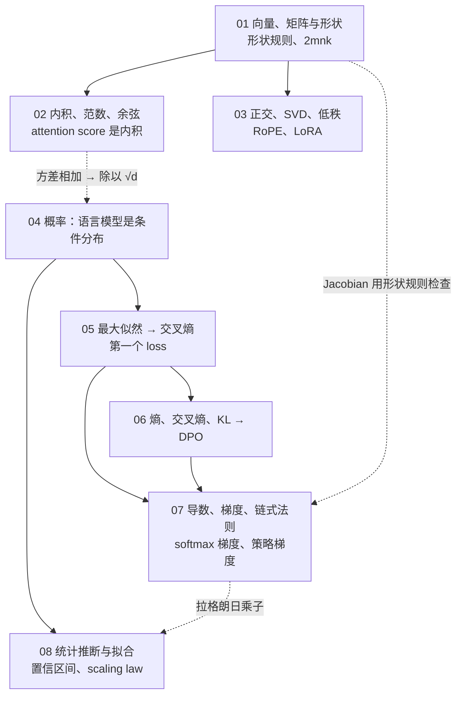
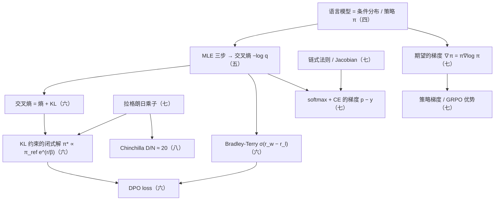

八篇正文回答了一个问题：**拿到一篇 LLM 论文能不能读懂它的每一个公式，给一个建模假设能不能推出它的训练 loss，给一个评测结果能不能判断差异是真的还是噪声**。前三篇是线性代数（形状与成本、向量的比较、正交与低秩），第四、五篇是概率（语言模型是一个条件分布、从最大似然推出交叉熵），第六篇是信息论（熵、交叉熵、KL 到 DPO），第七篇是微积分与优化（链式法则、$$p - y$$、策略梯度），第八篇是统计推断（置信区间与 scaling law 的拟合）。八篇合起来，是[《AI 算法工程师学习地图》](/ai-algorithm-engineer-learning-roadmap.html)的 L0 层——后面每一层的公式都建在这一小块数学上。

本文不讲新内容，做三件事：把八篇压成一张表与八段回顾，把贯穿八篇的几条线拎出来，然后给一套三段式的通关自测——判断与计算、跨篇综合、面试题。各篇末尾的自测检验的是"这一篇读懂了没有"，这里检验的是"八篇能不能连起来用"：一个符号在第一篇是形状、在第七篇是梯度、在第八篇是估计量，要能在三个身份之间自由切换。

> **读完这八篇，你应该能回答哪些问题？[^q0] 哪些数字与结论必须能脱口而出？[^q1] 怎么判断自己是"读过"还是"掌握"了？[^q2]**

先把整个系列放在一张图上——箭头是**推导或前置上的依赖**（箭头尾端的结论被箭头头端当作前提），不是阅读顺序：

## 一、总览：系列回答的问题与主线

系列的一句话主张是：**算法工程师需要的数学是一个最小集，每个概念只学到"读公式不卡壳、推导 loss 不出错、代进真实模型算出一个数字"三个标准**。主线按"先会算形状与成本，再会把模型看成分布，再会度量分布之间的差，再会对目标求导，最后会判断实验结果"推进；每篇用同一种方法——从定义讲起，推到公式，代入 Llama-3-8B（$$d = 4096$$、32 层、词表 128256）或真实 benchmark 的题数算出数字，指出它在后面哪一层、哪个公式里出现。

| 篇 | 回答的问题 | 一句话结论 | 必记的数字 / 公式 |
|---|---|---|---|
| [第一篇：向量、矩阵与形状](/vectors-matrices-shapes-and-flops.html) | 看到任何一个矩阵乘法，能不能立刻写出输出形状和 FLOPs？ | 两条规则够用：形状规则 $$[m, k] \times [k, n] \to [m, n]$$、成本规则 $$2mnk$$；一个 token 过整个模型约 $$2N$$ FLOPs | Llama-3-8B：$$W_Q$$ 一个 token 33.5 MFLOPs、4096 个 token 137 GFLOPs；一层七个矩阵 218M 参数、81% 在 MLP；全模型 8.03B、一个 token 前向约 15 GFLOPs；训练 $$6ND$$ |
| [第二篇：内积、范数与余弦相似度](/inner-product-norms-and-cosine-similarity.html) | 两个向量"像不像"有几种算法？各在哪里用？ | 三个词一套语言：内积含方向与大小、范数只量大小、余弦只比方向；范数有长度 / 正则化项 / 误差度量三个身份 | $$\langle a, b \rangle = \lVert a \rVert \lVert b \rVert \cos\theta$$；$$QK^T$$ 是一张内积表；高维随机余弦标准差 $$1/\sqrt{d}$$，1024 维约 0.03；weight decay $$\frac{\lambda}{2}\lVert W \rVert_F^2$$；GPTQ 最小化 $$\lVert WX - \hat W X \rVert_F$$ |
| [第三篇：正交与旋转、特征值与 SVD](/orthogonal-rotation-svd-and-low-rank.html) | RoPE 为什么能编码相对位置？LoRA 为什么能用半个百分点的参数微调？ | 正交保内积，所以旋转 $$m\theta$$ 与 $$n\theta$$ 后的内积只剩 $$n - m$$；截断 SVD 是最好的低秩近似，LoRA 的每个参数都省在 $$r(m + n) \ll mn$$ | $$(R_{m\theta} q)^T (R_{n\theta} k) = q^T R_{(n-m)\theta} k$$；$$\theta_i = \text{base}^{-2i/d_h}$$，128 维拆 64 对；$$W = U \Sigma V^T$$；Llama-3-8B 上 $$r = 16$$ 是 41.9M 参数、0.52% |
| [第四篇：概率入门](/probability-basics-language-model-as-conditional-distribution.html) | "语言模型是一个条件分布"每个词是什么意思？它决定了哪些事？ | 语言模型是链式法则 $$p(x_{1:T}) = \prod_t p(x_t \mid x_{<t})$$ 里每一项的参数化；它决定 next-token 目标、逐 token 生成、KV cache、评测依赖采样设置 | $$p(a, b) = p(a \mid b)\,p(b)$$；独立和的方差相加，标准差 $$\sqrt{n}\sigma$$；样本均值标准差 $$\sigma/\sqrt{n}$$；高斯 95% 在 $$\mu \pm 1.96\sigma$$；$$d_k = 128$$ 时 score 标准差约 11.3，所以除 $$\sqrt{d_k}$$ |
| [第五篇：从最大似然到交叉熵](/from-maximum-likelihood-to-cross-entropy.html) | 能不能三行推出交叉熵 loss？训练开始时 loss 应该是多少？ | 取对数 → 取负 → 除以 token 数，得到每 token 负对数似然；真实分布 one-hot 时它就是交叉熵；所有 loss 都是这个模板换一个概率 | $$\mathcal{L} = -\frac{1}{T}\sum_t \log p_\theta(x_t \mid x_{<t})$$；初始 loss $$\approx \ln V$$，Llama-3 是 11.8；1 nat = 1.44 bit；softmax 差值决定比值，差 1 是 2.7 倍、差 5 是 148 倍；温度改变分布 |
| [第六篇：熵、交叉熵与 KL](/entropy-cross-entropy-and-kl-to-dpo.html) | 熵、交叉熵、KL 各是什么？能不能从 KL 约束的最优策略推出 DPO？ | $$H(p, q) = H(p) + D_{\mathrm{KL}}(p \Vert q)$$；KL 不对称，RLHF 用 reverse（mode-seeking 倾向）——"对齐降低多样性"还要奖励形状配合，不是定义行为；闭式解反解奖励、代入 Bradley-Terry、$$Z(x)$$ 抵消得 DPO | PPL $$= e^{\text{loss}}$$，loss 1.8 ↔ PPL 6.05 ↔ 2.6 bit；loss 降不到数据的熵 $$E = 1.69$$ 以下；$$\pi^* \propto \pi_{\text{ref}}\, e^{r/\beta}$$；$$\sigma(2) = 0.88$$；接受率 $$\alpha = \sum_x \min(p, q) = 1 - \mathrm{TV}$$ |
| [第七篇：导数、梯度与链式法则](/derivatives-gradients-chain-rule-and-policy-gradient.html) | 能不能用链式法则推一层的梯度？能不能对一个期望求导得到策略梯度？ | 梯度与参数同形；softmax + 交叉熵的梯度是 $$p - y$$；期望的梯度用 $$\nabla\pi = \pi\nabla\log\pi$$ 写回期望，策略梯度是"按奖励加权的最大似然"，减 baseline 期望不变 | $$\partial \mathcal{L}/\partial z = p - y$$，分量在 $$[-1, 1]$$；$$\nabla J = \mathbb{E}[R(y)\nabla\log\pi_\theta(y)]$$；$$\mathbb{E}[\nabla\log\pi] = 0$$；GRPO 优势 $$(R_i - \text{mean})/\text{std}$$；随机梯度噪声方差 $$\propto 1/B$$ |
| [第八篇：统计推断与拟合](/statistical-inference-and-fitting-scaling-laws.html) | HumanEval 差 3 个点算不算提升？$$D/N \approx 20$$ 从哪来？ | 95% 区间 $$= \hat p \pm 1.96\,\text{SE}$$，164 题分辨不出 3 个点；幂律在双对数上是直线；固定 $$C = 6ND$$ 用拉格朗日乘子，$$N$$、$$D$$ 应同步增长 | HumanEval ±6.1%、GSM8K ±1.6%、MMLU ±0.8%；独立比较显著差异 8.7 / 2.3 / 1.1 个点；$$E = 1.69, A = 406.4, B = 410.7, \alpha = 0.34, \beta = 0.28$$；$$N_{\text{opt}} \propto C^{0.45}$$、$$D_{\text{opt}} \propto C^{0.55}$$；70B ↔ 1.4T |

### 1. 本文的章节安排

| 章 | 内容 |
|---|---|
| 二 | 逐篇回顾：核心问题、结论、必记、常见误解 |
| 三 | 贯穿八篇的五条线：形状规则、独立和的方差相加、$$-\log p$$ 模板、拉格朗日乘子与 KL 约束、loss 这个数字的一生 |
| 四 | 常见误区表 |
| 五 | 通关自测：A 判断与计算 10 题、B 跨篇综合 5 题、C 面试题 7 题、D 掌握判据 |
| 六 | 下一步 |

## 二、逐篇回顾

### 1. 第一篇：向量、矩阵与形状——一个 token 过一层要算多少

**核心问题**（[第一篇](/vectors-matrices-shapes-and-flops.html)）：看到任何一个矩阵乘法，能不能立刻写出输出形状和 FLOPs？能不能代入一个真实模型算出一个数字？

**结论**：一个 token 在模型里是一个向量（Llama-3-8B：4096 维），模型的参数是一堆矩阵，张量的矩阵乘法只作用于最后两维。形状规则 $$[m, k] \times [k, n] \to [m, n]$$ 要求内维相同，是读模型代码和 `shapes cannot be multiplied` 报错时的第一反应；成本规则 $$2mnk$$ 来自每个输出元素 $$k$$ 次乘加。两条规则推出两个后面反复用的观察：一个 token 过一个 $$d \times d$$ 矩阵是 $$2d^2$$ FLOPs，恰好是参数量的两倍，所以过整个模型约 $$2N$$，训练每个 token 再乘 3 得 $$6ND$$；token 数是线性因子，所以算力账里"处理了多少 token"是最重要的变量。结合律让同一个结果的成本差几千倍——$$x(BC)$$ 先算瘦的 $$xB$$ 是 262 KFLOPs，先算 $$BC$$ 是 570 MFLOPs，这正是 LoRA 推理时永远不要把两个瘦矩阵乘成大矩阵的理由。一层 Llama-3-8B 有七个权重矩阵，$$W_K, W_V$$ 因为 GQA 只有 $$4096 \times 1024$$，MLP 的三个 $$4096 \times 14336$$ 占一层参数的 81%。

**必记**：

- 形状规则 $$[m, k] \times [k, n] \to [m, n]$$；$$(AB)^T = B^T A^T$$；批维度括起来只看最后两维。
- 成本规则 $$2mnk$$；一个 token 过 $$4096 \times 4096$$ 的 $$W_Q$$ 是 33.5 MFLOPs，4096 个 token 是 137 GFLOPs。
- 一层 218M 参数、436 MFLOPs/token；32 层 6.98B；词嵌入与输出层各 0.53B；全模型 8.03B，一个 token 前向约 15 GFLOPs $$\approx 2N$$。
- 训练 FLOPs $$\approx 6ND$$：前向 $$2N$$、反向 $$4N$$，乘 $$D$$ 个 token。
- attention 里 $$QK^T$$ 与 $$\text{softmax}(\cdot)V$$ 的 FLOPs 是 $$[T, d_h] \times [d_h, T]$$，与 $$T^2$$ 成正比、与参数量无关；逐元素运算比矩阵乘少一个 $$k$$ 因子。
- 多头：$$h = 32$$，$$d_h = 128$$；reshape 不改数值只改读法。

**常见误解**："算模型成本只看参数量就够了"——参数量给的是 $$2N$$ 那一份，attention 的 $$T^2$$ 项与参数无关，长序列时不能忽略。另一个：`nn.Linear` 的权重存成 `[out, in]`、论文写 $$Wx$$、本系列写 $$XW$$ 是三件不同的事——它们是同一件事，只是行列向量与存储布局的差别，用形状规则对一下就不会乱。

### 2. 第二篇：内积、范数与余弦相似度

**核心问题**（[第二篇](/inner-product-norms-and-cosine-similarity.html)）：两个向量"像不像"有几种算法？各在哪里用？为什么 attention 用内积、检索用余弦、量化误差用 Frobenius 范数？

**结论**：五个看起来不同的问题——attention、检索、CLIP、量化误差、正则化——用的是同一套只有三个词的语言。内积 $$\langle a, b \rangle = \lVert a \rVert \lVert b \rVert \cos\theta$$ 是矩阵乘法的最小情形（一行乘一列），同时含方向与大小；attention 的 $$S = QK^T$$ 就是一张 $$T \times T$$ 的内积表，所以 score 同时受方向与长度影响，QK-norm 这类技术能稳定训练正是因为把长度的影响去掉了。范数只量大小：$$L_2$$ 是长度、$$L_1$$ 是绝对值之和、$$L_\infty$$ 是最大绝对值（量化的缩放因子）、Frobenius 是矩阵拉直后的 $$L_2$$。余弦是内积除掉两个长度、只剩方向，等于两个归一化向量的内积——embedding 检索存之前先归一化，余弦检索就变成一次 $$[1, 1024] \times [1024, N]$$ 的矩阵乘。范数还有另外两个身份：作正则化项时 weight decay 是 $$\frac{\lambda}{2}\lVert W \rVert_F^2$$、导数 $$\lambda W$$ 每步把参数往零缩，$$L_1$$ 因为零点附近惩罚不变小而产生稀疏；作误差度量时量化不该看 $$\lVert W - \hat W \rVert_F$$ 而该看 $$\lVert WX - \hat W X \rVert_F$$——逼近的是权重作用在输入上的结果，$$XX^T$$ 给每个权重不同的重要性。

**必记**：

- $$\langle a, b \rangle = a^T b = \sum_i a_i b_i = \lVert a \rVert \lVert b \rVert \cos\theta$$；同向为正、垂直为零、反向为负。
- $$(3, -4)$$：$$L_1 = 7$$、$$L_2 = 5$$、$$L_\infty = 4$$；归一化 $$\hat a = a / \lVert a \rVert$$ 保留方向抹掉大小。
- 高维随机向量的余弦标准差约 $$1/\sqrt{d}$$，$$d = 1024$$ 时 0.03；学到的 embedding 有各向异性，无关对余弦常 0.3–0.6，阈值按模型校准。
- weight decay $$\frac{\lambda}{2}\lVert W \rVert_F^2$$，LLM 预训练常用 $$\lambda = 0.1$$，导数 $$\lambda W$$。
- 量化误差看 $$\lVert WX - \hat W X \rVert_F$$，$$\lVert (W - \hat W) X \rVert_F^2 = \text{tr}((W - \hat W) X X^T (W - \hat W)^T)$$。
- 范数的三个身份：长度 / 归一化（余弦、QK-norm、RMSNorm 的分母）、正则化项、误差度量。

**常见误解**："余弦 0.5 才算有点像"——那是二维平面的直觉，高维里随机向量对的余弦在 $$\pm 0.1$$ 以内；但真实 embedding 各向异性，"多少算相关"要按具体模型的无关对分布校准。另一个："逐元素四舍五入是最优量化"——它最小化的是 $$\lVert W - \hat W \rVert_F$$，输入里有 outlier 通道时应该把对应列量得更准，哪怕别的列更差。

### 3. 第三篇：正交与旋转、特征值与 SVD——从 RoPE 到 LoRA

**核心问题**（[第三篇](/orthogonal-rotation-svd-and-low-rank.html)）：RoPE 为什么能编码相对位置？LoRA 的 $$r = 16$$ 在 Llama-3-8B 上加了多少参数、为什么够用？

**结论**：两条线。正交线：$$R^T R = I$$ 意味着每列长 1、互相垂直，作用在两个向量上内积不变、长度不变、逆就是转置，所以正交矩阵做的是刚体变换。二维旋转矩阵 $$R_\theta$$ 有两条性质——$$R_\alpha R_\beta = R_{\alpha+\beta}$$、$$R_\alpha^T = R_{-\alpha}$$——RoPE 全靠它们：位置 $$m$$ 的 query 转 $$m\theta$$、位置 $$n$$ 的 key 转 $$n\theta$$，内积三步化成 $$q^T R_{(n-m)\theta} k$$，只剩相对位置。128 维拆成 64 对各自旋转，角速度 $$\theta_i = \text{base}^{-2i/d_h}$$ 从 1 到约 $$1.2 \times 10^{-4}$$，快的对分辨近距离、慢的分辨远距离；长上下文外推（PI、NTK-aware、YaRN）全是在改这组 $$\theta_i$$。低秩线：秩是矩阵真正的自由度；SVD $$W = U\Sigma V^T$$ 把任何矩阵写成"旋转 · 拉伸 · 旋转"，$$W = \sum_i \sigma_i u_i v_i^T$$，奇异值大的方向贡献大；Eckart–Young 说截断 SVD 是最好的低秩近似，误差是扔掉的奇异值，参数量 $$mn \to r(m + n)$$。LoRA 假设微调的改动 $$\Delta W$$ 低秩，存 $$BA$$ 两个瘦矩阵，$$B = 0$$ 初始化让初始行为不变、梯度能流；合并后零开销，不合并可多 LoRA 共享基座。两条线在 SVD 汇合——$$U, V$$ 就是正交矩阵。

**必记**：

- $$(R_{m\theta} q)^T (R_{n\theta} k) = q^T R_{-m\theta} R_{n\theta} k = q^T R_{(n-m)\theta} k$$；整体平移位置 score 不变。
- $$\theta_i = \text{base}^{-2i/d_h}$$，base 通常 10000，Llama-3 用 500000；$$\theta_0 = 1$$，$$\theta_{63} \approx 1.2 \times 10^{-4}$$。
- $$\lVert W - W_r \rVert_F = \sqrt{\sigma_{r+1}^2 + \dots + \sigma_n^2}$$；$$4096 \times 4096$$、$$r = 16$$：131,072 对 16,777,216，0.78%。
- Llama-3-8B 七个矩阵全加 $$r = 16$$：一层 1.31M（0.60%）、32 层 41.9M、占 8.03B 的 0.52%。
- 全量微调每参数 16 字节、8B 模型 128 GB；LoRA 只有 41.9M 参数要梯度与优化器状态，显存降到十几 GB。
- 对称方阵 $$A = Q\Lambda Q^T$$，奇异值是特征值的绝对值；PCA 的主方向、Hessian 的曲率只需概念。

**常见误解**："RoPE 是把绝对位置加进 token"——它确实按绝对位置旋转，但内积里绝对位置被抵消，只剩 $$n - m$$。另一个："$$\Delta W$$ 低秩是定理"——它是经验假设，教格式、风格、领域词汇时成立得好，注入大量新知识时不成立。

### 4. 第四篇：概率入门——语言模型是一个条件分布

**核心问题**（[第四篇](/probability-basics-language-model-as-conditional-distribution.html)）："语言模型是一个条件分布"这句话的每个词是什么意思？它决定了哪些事？

**结论**：分布是"每个取值的概率"，非负、和为 1——语言模型最后一层输出的就是词表上 128256 个这样的数。联合、边缘、条件由一条定义式相连 $$p(a, b) = p(a \mid b)\,p(b)$$，条件改变分布（不知天气时带伞 0.3，知道下雨后 0.8），独立即条件不改变分布；贝叶斯公式翻转条件方向，在 MAP（先验 = 正则化项，weight decay 等价于高斯先验）、朴素贝叶斯、扩散反向过程里出现。概率的链式法则 $$p(x_{1:T}) = \prod_t p(x_t \mid x_{<t})$$ 是恒等式、不含假设，语言模型是每一项的参数化。这个定义决定四件事：训练目标是 next-token prediction；推理逐 token 生成；KV cache 能增量追加（条件不变缓存就有效）；评测依赖采样设置（换温度就是换分布）。RL 里的策略 $$\pi_\theta(y \mid x)$$ 是同一个条件分布换了名字。期望线性、不需要独立；方差常数倍平方、独立和相加——这一条性质推出三件事：初始化标准差 $$\sim 1/\sqrt{d}$$、扩散 $$T$$ 步等价一步、attention 除以 $$\sqrt{d_k}$$。

**必记**：

- $$p(a, b) = p(a \mid b)\,p(b)$$；$$p(a \mid b) = p(b \mid a)\,p(a) / p(b)$$；独立 $$\Leftrightarrow p(a, b) = p(a)\,p(b)$$。
- $$\text{Var}[aX] = a^2 \text{Var}[X]$$；独立和 $$\text{Var}[X + Y] = \text{Var}[X] + \text{Var}[Y]$$，$$n$$ 项标准差 $$\sqrt{n}\sigma$$；样本均值标准差 $$\sigma/\sqrt{n}$$，误差减半要四倍样本。
- 伯努利方差 $$p(1 - p)$$，二项 $$np(1 - p)$$；十道题各 0.8 答对，期望 8、标准差 1.26。
- 高斯 68% 在 $$\mu \pm \sigma$$、95% 在 $$\mu \pm 1.96\sigma$$；中心极限定理让正确率、层输出、梯度噪声都近似高斯。
- 初始化 $$\sigma_W^2 = 1/d$$，$$1/\sqrt{4096} = 0.0156$$，Llama 用 0.02 同量级。
- $$q^T k$$ 是 $$d_k$$ 项之和，方差 $$d_k$$，$$d_k = 128$$ 时标准差约 11.3；除 $$\sqrt{d_k}$$ 拉回 1；若 $$q_i, k_i$$ 方差是 4，除完还剩 4——QK-norm 的动机。

**常见误解**："独立变量相加，标准差相加"——相加的是方差，标准差只按 $$\sqrt{n}$$ 涨。另一个："$$\pi$$ 和 $$p$$ 是两种东西"——RL 论文里的策略就是条件分布 $$p(y \mid x)$$，整条回答的概率是逐 token 概率的乘积。

### 5. 第五篇：从最大似然到交叉熵——第一个要会推的 loss

**核心问题**（[第五篇](/from-maximum-likelihood-to-cross-entropy.html)）：能不能从"语言模型是条件分布"出发，三行推出交叉熵 loss？训练开始时 loss 应该是多少？

**结论**：最大似然选让训练集出现概率最大的参数；似然是各样本概率的乘积，取对数变求和（数值稳定、单调不变）。三步：取对数、取负、除以 token 数，得到每 token 负对数似然 $$-\frac{1}{T}\sum_t \log p_\theta(x_t \mid x_{<t})$$——$$p = 0.9$$ 罚 0.105、$$p = 0.1$$ 罚 2.30、$$p = 0.001$$ 罚 6.91。它就是交叉熵：真实分布 one-hot 时 $$H(p, q)$$ 只剩 $$-\log q(x_t)$$ 一项。这三行是后面所有 loss 的模板，区别只在"把哪个概率放进 $$-\log$$"：SFT 只对回答部分求和（loss mask）、奖励模型放 $$\sigma(r_w - r_l)$$、DPO 再把 $$r$$ 换成 $$\beta\log(\pi_\theta/\pi_{\text{ref}})$$、分类放真实类别的概率。一个立刻能用的数字：随机初始化的模型输出接近均匀，初始 loss $$\approx \ln V$$；远大于它是初始化太大，远小于它是数据泄漏或 loss 算错——训练前最便宜的 sanity check。softmax 把 logits 变成分布，保序、差值决定比值、平移不变；实现上减最大值防溢出，FlashAttention 的在线 softmax 靠的就是平移不变。温度缩放 logits 的差，$$\tau \to 0$$ 是 greedy，$$\tau$$ 大趋向均匀；top-k / top-p 截断小概率 token。同一个模型不同采样设置是不同的分布，评测必须固定它们。

**必记**：

- $$\mathcal{L} = -\frac{1}{T_{\text{total}}}\sum_{i, t}\log p_\theta(x_t^{(i)} \mid x_{<t}^{(i)})$$；1 nat = 1.44 bit，loss 1.8 nat = 2.6 bit/token。
- 初始 loss $$\ln V$$：Llama-2 32000 → 10.4；Llama-3 128256 → 11.8；Qwen2.5 151936 → 11.9；GPT-2 50257 → 10.8。
- 第一步 loss 20 是初始化太大；第一步 loss 5 是数据泄漏或 loss 算错。
- softmax $$p_j = e^{z_j}/\sum_k e^{z_k}$$；$$p_j / p_k = e^{z_j - z_k}$$，差 1 是 2.7 倍、差 5 是 148 倍；$$e^{z}$$ 在 $$z$$ 约 88 以上溢出 float32。
- 温度：logits $$(2, 1, 0)$$ 在 $$\tau = 1$$ 是 $$(0.665, 0.245, 0.090)$$，$$\tau = 0.5$$ 是 $$(0.867, 0.117, 0.016)$$，$$\tau = 2$$ 是 $$(0.506, 0.307, 0.186)$$。
- 代码生成常用 $$\tau$$ 0.0–0.2，创意写作 0.7–1.0；top-k 常取 50、top-p 常取 0.9。

**常见误解**："第一步 loss 越低越好"——远低于 $$\ln V$$ 是模型在没学之前就知道答案，几乎总是泄漏或 mask 算错。另一个："温度只是随机性开关，不影响模型好坏的比较"——greedy 与 temperature 0.6 / top-p 0.95 是两个分布，分数不能直接比。

### 6. 第六篇：熵、交叉熵与 KL——从困惑度到 DPO

**核心问题**（[第六篇](/entropy-cross-entropy-and-kl-to-dpo.html)）：能不能分清熵、交叉熵、KL 各是什么？能不能从 KL 约束的最优策略推出 DPO 的 loss？

**结论**：熵 $$H(p) = -\sum p\log p$$ 是分布自身的不确定程度，均匀分布最大（$$\log V$$）、确定性分布为 0；交叉熵 $$H(p, q) = -\sum p\log q$$ 是用 $$q$$ 编码 $$p$$ 的平均码长；KL 是多付的那部分，$$H(p, q) = H(p) + D_{\mathrm{KL}}(p \Vert q)$$，非负、不对称。训练时 $$p$$ 是 one-hot 所以交叉熵就是负对数似然；蒸馏时 $$p$$ 是 teacher 的软分布，最小化交叉熵与最小化 KL 只差常数；等式还说明 loss 降不到数据的熵以下——Chinchilla 的 $$E = 1.69$$ 就是对这个下限的估计。困惑度 $$e^{\text{loss}}$$ 读作"每步平均在几个 token 里犹豫"。KL 的方向决定行为：forward 期望在 $$p$$ 上、mode-covering、$$q$$ 变宽；reverse 期望在 $$q$$ 上、mode-seeking、$$q$$ 收窄。RLHF 的 $$\beta D_{\mathrm{KL}}(\pi \Vert \pi_{\text{ref}})$$ 是 reverse——策略可以放弃参考模型的一部分模式，但不能去参考模型认为不可能的地方，于是在高概率区里挑奖励高的收窄，"对齐降低多样性"不是副作用而是定义行为。Bradley-Terry 把偏好变成概率 $$\sigma(r_w - r_l)$$，奖励模型的 loss 是逻辑回归。DPO 的推导链四步：KL 约束目标的闭式解 $$\pi^* = \frac{1}{Z}\pi_{\text{ref}} e^{r/\beta}$$ → 反解 $$r = \beta\log(\pi^*/\pi_{\text{ref}}) + \beta\log Z$$ → 代入 Bradley-Terry，同一 prompt 的 $$Z(x)$$ 抵消 → 用 $$\pi_\theta$$ 代 $$\pi^*$$ 套模板。没有一步超出最小集。

**必记**：

- $$H(p, q) = H(p) + D_{\mathrm{KL}}(p \Vert q)$$；$$p = (0.5, 0.5)$$、$$q = (0.9, 0.1)$$：$$H(p) = 0.693$$、$$H(p, q) = 1.204$$、$$D(p \Vert q) = 0.511$$、$$D(q \Vert p) = 0.368$$。
- PPL $$= e^{\text{loss}}$$：2.5 → 12.2、2.0 → 7.39、1.8 → 6.05、1.5 → 4.48、1.0 → 2.72；bit/token = loss × 1.44。
- PPL 依赖 tokenizer，跨 tokenizer 比要用 bits per byte。
- reverse KL：$$q$$ 在 $$p$$ 为零处有概率则惩罚无穷；$$\beta$$ 越大越保守，越小越激进、越容易 reward hacking。
- $$\sigma(0) = 0.5$$、$$\sigma(2) = 0.88$$、$$\sigma(-2) = 0.12$$；$$\mathcal{L}_{\text{RM}} = -\log\sigma(r_w - r_l)$$。
- $$\mathcal{L}_{\text{DPO}} = -\log\sigma\big(\beta\log\frac{\pi_\theta(y_w)}{\pi_{\text{ref}}(y_w)} - \beta\log\frac{\pi_\theta(y_l)}{\pi_{\text{ref}}(y_l)}\big)$$；去掉 $$\pi_{\text{ref}}$$ 就失去"不偏离"的约束。
- 总变差 $$\mathrm{TV} = \frac{1}{2}\sum\lvert p - q \rvert$$，对称有界；投机解码接受率 $$\alpha = 1 - \mathrm{TV}$$，拒绝采样保证输出严格服从 $$p$$。

**常见误解**："KL 是距离，方向无所谓"——它不对称，两个方向的值不同、行为相反，RLHF 用 reverse 是有意的选择（样本从正在训的策略里抽即可）。另一个："对齐后模型变保守是训练没调好"——reverse KL 的 mode-seeking 倾向加上奖励模型偏好某类回答，共同造成它；但 reverse KL 本身不保证多样性下降（ref (0.9, 0.1)、$$r = (0, \ln 9)$$ 时最优策略 (0.5, 0.5) 熵反而升），$$\beta$$ 调的是贴近参考的程度。

### 7. 第七篇：导数、梯度与链式法则——softmax 的梯度与策略梯度

**核心问题**（[第七篇](/derivatives-gradients-chain-rule-and-policy-gradient.html)）：能不能用链式法则推一层的梯度？能不能对一个期望求导，得到策略梯度？

**结论**：导数是斜率；梯度是所有偏导排成的向量，与参数同形（$$\theta$$ 是 $$4096 \times 4096$$ 的矩阵，梯度也是），指向增长最快的方向，沿 $$-\nabla L$$ 走降得最快。链式法则说复合函数的导数是局部导数的乘积，向量情形是 Jacobian 的矩阵乘法 $$[1, m] \times [m, n] = [1, n]$$（用第一篇的形状规则检查）；反向传播是从 loss 往输入逐层套用它，工程上直接算"上游梯度 × Jacobian"而不构造 Jacobian。最重要的一个局部导数两步推出：$$\partial\log p_j/\partial z_k = \delta_{jk} - p_k$$，对 one-hot 的 $$y$$ 加权求和得 $$\partial L/\partial z = p - y$$——梯度有界、预测越准越小、所有 logits 都收到梯度；换 $$y$$ 为 teacher 的软分布就是蒸馏的梯度。RL 的目标 $$J = \mathbb{E}_{y \sim \pi_\theta}[R(y)]$$ 里分布依赖参数，不能把梯度直接移进期望；用 $$\nabla\pi = \pi\nabla\log\pi$$ 把它变回期望，得策略梯度 $$\mathbb{E}[R(y)\nabla\log\pi_\theta(y)]$$——按奖励加权的最大似然。REINFORCE 方差大，减一个不依赖 $$y$$ 的 baseline 期望不变（$$\mathbb{E}[\nabla\log\pi] = \nabla\sum\pi = 0$$）、方差降低，$$R - b$$ 叫优势。PPO 用价值网络估 baseline 并裁剪比值、加 KL 惩罚；GRPO 同一 prompt 采 $$G$$ 条用组内均值当 baseline、组内标准差归一化，不需要价值网络。梯度下降 $$\theta \leftarrow \theta - \eta\nabla L$$；随机梯度的噪声方差 $$\propto 1/B$$，决定学习率上限；warmup 与衰减；非凸 loss 的鞍点靠随机性逃离。拉格朗日乘子 $$\mathcal{L} = f - \lambda(g - c)$$ 是第六篇闭式解与第八篇 Chinchilla 共用的工具。

**必记**：

- $$\sigma'(x) = \sigma(x)(1 - \sigma(x))$$；$$\frac{d}{dw}\log\sigma(wx) = (1 - \sigma(wx))\,x$$。
- $$\partial \mathcal{L}/\partial z = p - y$$：真实位置 $$p_k - 1 \in [-1, 0]$$，其余 $$p_k \in [0, 1]$$；MSE 做分类会多一个 $$p_k(1 - p_k)$$ 因子，预测很错时反而学不动。
- $$\nabla_\theta J = \mathbb{E}_{y \sim \pi_\theta}[(R(y) - b)\nabla_\theta\log\pi_\theta(y)]$$；$$\mathbb{E}_{y \sim \pi_\theta}[\nabla_\theta\log\pi_\theta(y)] = 0$$。
- GRPO：$$A_i = (R_i - \text{mean})/\text{std}$$；奖励 $$(1, 0, 0, 1)$$ 的优势是 $$(1, -1, -1, 1)$$；全 1 时优势全 0、这组没有信号。
- PPO 把 $$\pi_\theta/\pi_{\text{old}}$$ 裁剪在 $$[1 - \epsilon, 1 + \epsilon]$$；DPO 不走这条路，是离线的监督学习。
- 每步 $$L$$ 约降 $$\eta\lVert\nabla L\rVert^2$$；warmup 几百到几千步；衰减到目标值的 1/10 左右。

**常见误解**："减 baseline 会让梯度有偏"——只要 $$b$$ 不依赖 $$y$$，期望严格不变，改变的只有方差（方差也不是任意 $$b$$ 都降）；GRPO 的组均值含 $$y$$ 自己，那一行证明**不适用**，估计缩了 $$(1 - 1/G)$$ 倍（Bernoulli 算例 0.25 vs 0.125），留一法才严格无偏。另一个："鞍点和局部极小是非凸优化的大麻烦"——高维空间里鞍点远多于坏的局部极小，随机梯度的噪声通常足以逃离（经验，非保证），但收敛到哪依赖初始化与学习率，所以要报多个种子。

### 8. 第八篇：统计推断与拟合——评测的置信区间与 scaling law

**核心问题**（[第八篇](/statistical-inference-and-fitting-scaling-laws.html)）：HumanEval 上差 3 个点算不算提升？scaling law 的曲线是怎么拟出来的、$$D/N \approx 20$$ 从哪来？

**结论**：评测正确率 $$\hat p = k/n$$ 是真实正确率的带噪声观测；每道题是伯努利试验，$$\hat p$$ 的标准误 $$\text{SE} = \sqrt{\hat p(1 - \hat p)/n}$$，随 $$\sqrt{n}$$ 缩小；中心极限定理让它近似高斯，于是 95% 区间是 $$\hat p \pm 1.96\,\text{SE}$$。代真实题数：HumanEval 164 题在 80% 附近半宽 ±6.1%，"80.0%"的真实含义是 74% 到 86%；两个模型独立比较时差值的 SE 是 $$\sqrt{\text{SE}_1^2 + \text{SE}_2^2}$$，显著差异要 8.7 个点。结论直接而残酷：HumanEval 差 3 个点在噪声里，GSM8K 差 2 个点勉强，只有 MMLU 的规模能分辨 1 个点。配对比较（同一套题逐题看分歧）比独立比较灵敏，但量级不变。假设检验与置信区间是一回事的两种说法（差值区间不含 0 $$\Leftrightarrow$$ p < 0.05）；p 值不是零假设为真的概率、显著不等于效果大、不显著不等于没差异；训练有随机性，报 3–5 个种子的均值 ± 标准差。拟合是最小化一个 loss，与训练模型是同一件事：直线用最小二乘；幂律 $$y = cx^{-\alpha}$$ 取对数在双对数坐标上是直线，斜率就是指数；$$L(N, D) = E + A/N^\alpha + B/D^\beta$$ 五个常数用非线性最小二乘。$$E$$ 是数据的熵、$$A/N^\alpha$$ 是模型太小、$$B/D^\beta$$ 是数据太少；固定 $$C = 6ND$$ 用拉格朗日乘子得 $$\alpha A/N^\alpha = \beta B/D^\beta$$，$$N_{\text{opt}} \propto C^{0.45}$$、$$D_{\text{opt}} \propto C^{0.55}$$——参数与数据同步增长；$$D/N \approx 20$$ 是实验规模上另外两种方法给出的经验比例。拟合常数是估计值、有标准误，直接代常数解出的 $$D/N$$ 远大于 20，外推到实验范围之外不确定性放大。

**必记**：

- $$\text{SE}(\hat p) = \sqrt{\hat p(1 - \hat p)/n}$$；95% 用 1.96、99% 用 2.58、90% 用 1.64。
- HumanEval 164 题 / 0.80：SE 3.1%、±6.1%、独立比较显著差异 8.7 个点；GSM8K 1319 / 0.90：0.8%、±1.6%、2.3 个点；MMLU 14042 / 0.70：0.4%、±0.8%、1.1 个点。
- 差值的 SE $$= \sqrt{\text{SE}_1^2 + \text{SE}_2^2}$$，两个 3.1% 是 4.4%；配对检验（McNemar）只看分歧题。
- 双对数直线斜率 $$-0.07$$：参数量 ×10，loss ×0.85；斜率 $$-0.1$$、×100：loss ×0.63。
- Chinchilla：$$E = 1.69$$、$$A = 406.4$$、$$B = 410.7$$、$$\alpha = 0.34$$、$$\beta = 0.28$$；8B 配 160B 是 2.16、配 15T 是 1.95，94 倍数据换 0.21 nat；70B 配 1.4T 是 1.94。
- $$\alpha A/N^\alpha = \beta B/D^\beta$$；$$N_{\text{opt}} \propto C^{\beta/(\alpha+\beta)} = C^{0.45}$$，$$D_{\text{opt}} \propto C^{0.55}$$；$$D/N \approx 20$$，70B ↔ 1.4T。

**常见误解**："p < 0.05 说明提升很大"——它只说差异不像噪声，MMLU 上 1.1 个点可以显著但意义要另论。另一个："Chinchilla 说 8B 配 160B 最优，Llama-3 训 15T 是浪费"——那是训练算力下的最优，8B 多花 94 倍数据换 0.21 nat，值不值取决于推理成本；且这组常数只有量级参考价值。

## 三、贯穿全系列的几条线

### 1. 形状规则：从矩阵乘法到 Jacobian

第一篇建立的 $$[m, k] \times [k, n] \to [m, n]$$ 在其后每一篇都以新身份出现。第二篇的内积是它的最小情形——$$[1, d] \times [d, 1]$$ 得一个标量——而 attention 的 $$QK^T$$ 是 $$[T, d_h] \times [d_h, T]$$ 得一张 $$T \times T$$ 的表，余弦检索归一化后是 $$[1, 1024] \times [1024, N]$$ 一次算完全库。第三篇的 SVD 形状图 $$[m, n] = [m, n] \cdot [n, n] \cdot [n, n]$$、截断后 $$[m, r] \cdot [r, r] \cdot [r, n]$$，以及 LoRA 的 $$x \to xB \to (xB)A$$，都是读形状；参数量 $$r(m + n)$$ 与结合律带来的两千倍成本差都从形状直接读出。

第七篇把同一条规则用在导数上：梯度与参数同形，Jacobian 是 $$[\dim y, \dim x]$$，链式法则的向量形式 $$[1, m] \times [m, n] = [1, n]$$ 用形状规则检查；反向传播工程上从不构造 $$[4096, 4096]$$ 的 Jacobian，而是算"上游梯度 × Jacobian"这个乘积。读任何梯度公式，第一件事仍然是对形状。

成本规则是形状规则的影子：第一篇的 $$2mnk$$ 给出一个 token 过模型 $$\approx 2N$$、训练 $$\approx 6ND$$，第八篇的 Chinchilla 约束 $$C = 6ND$$ 直接沿用它——scaling law 的整套约束极值建立在第一篇的两条规则上。

### 2. 独立和的方差相加：从初始化到置信区间

第四篇的一条性质——独立变量之和方差相加、标准差只按 $$\sqrt{n}$$ 涨——在系列里出现了六次。第四篇自己用它推三件事：一层网络输出的方差是 $$d\sigma_W^2\sigma_x^2$$，所以初始化标准差取 $$1/\sqrt{d}$$ 量级（Llama 的 0.02 与 $$1/\sqrt{4096} = 0.0156$$ 同量级）；扩散 $$T$$ 步加噪等价一步；attention 的 $$q^T k$$ 是 $$d_k$$ 项之和，方差 $$d_k$$，$$d_k = 128$$ 时标准差约 11.3，不除 $$\sqrt{d_k}$$ softmax 就饱和。第二篇从另一侧说了同一件事：内积同时受长度影响，QK-norm 把长度去掉才稳定。

第七篇用它解释随机梯度：batch 均值的方差 $$\propto 1/B$$，噪声决定学习率的上限，这是"batch 变大学习率要跟着调"的来源。第八篇把它变成评测的工具：$$\hat p$$ 是 $$n$$ 个独立 0/1 的平均，$$\text{SE} = \sqrt{p(1 - p)/n}$$，题数翻四倍标准误减半；两个独立估计之差的方差相加，所以差值的 SE 是 $$\sqrt{\text{SE}_1^2 + \text{SE}_2^2}$$，HumanEval 的显著差异才要 8.7 个点。中心极限定理（第四篇）则保证这些和近似高斯，1.96 这个数字才可用。

### 3. 同一个模板：把什么概率放进负对数

第四篇定义了对象——语言模型是 $$p(x_t \mid x_{<t})$$，RL 里的策略 $$\pi(y \mid x)$$ 是同一个条件分布。第五篇从它出发三步推出 $$-\frac{1}{T}\sum_t\log p_\theta(x_t \mid x_{<t})$$，并指出这三行是后面所有 loss 的模板：SFT 换成只对回答求和，奖励模型换成 $$\sigma(r_w - r_l)$$，DPO 再换一次，分类换成真实类别的概率。读新 loss 先问"什么概率进了 $$-\log$$"。

第六篇给出模板的信息论解释与两次套用：one-hot 时交叉熵只剩 $$-\log q(x_t)$$，所以"最小化交叉熵"与"最大似然"是同一件事；Bradley-Terry 的 $$\sigma(r_w - r_l)$$ 放进 $$-\log$$ 是奖励模型的 loss（逻辑回归），闭式解反解出的 $$r$$ 代进去、$$Z(x)$$ 抵消是 DPO。第七篇对模板求导：softmax + 交叉熵的梯度 $$p - y$$，蒸馏只是把 $$y$$ 换成软分布；策略梯度 $$\mathbb{E}[R\nabla\log\pi]$$ 是"按奖励加权的最大似然"——$$\nabla\log\pi_\theta(y)$$ 正是把 $$y$$ 当训练数据时 MLE 的梯度。四篇合起来，预训练、SFT、奖励模型、DPO、REINFORCE、GRPO 的目标函数只是同一个 $$-\log p$$ 换了六次概率。

### 4. 拉格朗日乘子与"不偏离"的约束

第七篇第七章给出工具：在 $$g(\theta) = c$$ 下极值化 $$f(\theta)$$，构造 $$\mathcal{L} = f - \lambda(g - c)$$，最优点 $$f$$ 的梯度与约束面的梯度平行。它在系列里解了两个约束极值。第六篇：在 $$\sum_y\pi(y) = 1$$ 下最大化 $$\mathbb{E}_\pi[r] - \beta D_{\mathrm{KL}}(\pi \Vert \pi_{\text{ref}})$$，得闭式解 $$\pi^* \propto \pi_{\text{ref}}e^{r/\beta}$$——最优策略 = 参考模型 × 按奖励指数加权，$$\beta$$ 小时放大得猛；这个解是 DPO 推导链的第一步。第八篇：在 $$6ND = C$$ 下最小化 $$L(N, D)$$，得 $$\alpha A/N^\alpha = \beta B/D^\beta$$——模型太小与数据太少的损失按 $$\alpha : \beta$$ 平衡，解出 $$N_{\text{opt}} \propto C^{0.45}$$、$$D_{\text{opt}} \propto C^{0.55}$$。

"不偏离"这条约束本身也贯穿三篇。第六篇说 RLHF 的 KL 项是 reverse 方向，策略在参考模型的高概率区里收窄，$$\beta$$ 越大越贴近参考模型；第七篇的 PPO 把 $$\pi_\theta/\pi_{\text{old}}$$ 裁剪在 $$[1 - \epsilon, 1 + \epsilon]$$ 并加 KL 惩罚，是同一个约束换成"每步不要走太远"；DPO 的 loss 里 $$\pi_{\text{ref}}$$ 之所以出现，就是因为闭式解带着它——去掉 $$\pi_{\text{ref}}$$，loss 退化成只比较策略自己给两个回答的对数概率，约束消失。

### 5. loss 这个数字的一生

系列里的数字线可以沿着一条训练曲线读。第五篇：训练第一步 loss 应在 $$\ln V$$——Llama-3 的 128256 词表给 11.8，远高是初始化太大、远低是泄漏。第六篇：$$\ln V$$ 就是均匀分布的熵，随机初始化的模型交叉熵等于它；训练中 loss 1.8 读作 PPL 6.05、2.6 bit/token，看到 PPL 6 要知道 loss 1.8。第六篇又给出下限：$$H(p, q) = H(p) + D_{\mathrm{KL}}$$，loss 降不到数据的熵以下，Chinchilla 的 $$E = 1.69$$ 是对这条渐近线的估计。

第八篇把这条曲线的终点算出来：$$L = E + A/N^\alpha + B/D^\beta$$，8B 配 160B token 是 2.16，配 15T 是 1.95，多花 94 倍数据换 0.21 nat，值不值取决于推理成本；70B 配 1.4T 是 1.94。第一篇的 $$6ND$$ 给出这条曲线每一段要付的算力。从 11.8 出发、经过 1.95、逼近 1.69——这一个数字把第一、五、六、八篇串在一起，而第五篇提醒：PPL 依赖 tokenizer，跨 tokenizer 比要换成 bits per byte。

| 概念 | 出现的篇 | 关系 |
|---|---|---|
| 形状规则、$$2mnk$$ | 一、二、三、七、八 | 一定义；二内积是最小情形、$$QK^T$$ 是内积表；三 SVD 与 LoRA 读形状；七 Jacobian 用它检查；八 $$C = 6ND$$ 沿用成本规则 |
| 独立和的方差相加 | 二、四、七、八 | 四推初始化、扩散、$$\sqrt{d_k}$$；二从长度角度说 QK-norm；七 SGD 噪声 $$\propto 1/B$$；八 SE 与差值的 SE |
| 条件分布 $$p(x_t \mid x_{<t})$$、策略 $$\pi$$ | 四、五、六、七 | 四定义；五推 loss；六把 $$\pi$$ 放进 KL 约束；七对 $$\mathbb{E}_\pi$$ 求梯度 |
| $$-\log p$$ 模板 | 五、六、七 | 五给模板与四次套用；六给信息论解释、RM 与 DPO；七对它求导得 $$p - y$$、策略梯度是加权 MLE |
| KL 与 $$\pi_{\text{ref}}$$ | 六、七 | 六 reverse KL、闭式解、DPO；七 PPO 的裁剪与 KL 惩罚、DPO 是离线 |
| 拉格朗日乘子 | 六、七、八 | 七给工具；六解闭式解；八解 Chinchilla 的 $$N, D$$ 分配 |
| $$\ln V$$、PPL、$$E$$ | 五、六、八 | 五初始 loss；六熵、PPL、下限；八 $$E = 1.69$$ 与算例 |
| 1.96、高斯、中心极限定理 | 四、八 | 四给性质；八给置信区间与显著性 |
| 结合律、低秩 | 一、三 | 一算两千倍成本差；三 LoRA 的 $$xB \to (xB)A$$ |

图里每条箭头是"下游的推导用到了上游的结论"：DPO 同时依赖闭式解与 Bradley-Terry，闭式解同时依赖 KL 的定义与拉格朗日乘子，Chinchilla 与闭式解共用一个工具，$$p - y$$ 同时依赖交叉熵与链式法则。

## 四、常见误区

| 误区 | 为什么错 | 正确的说法 | 出处 |
|---|---|---|---|
| 算模型成本只看参数量 | $$QK^T$$ 与 $$\text{softmax}(\cdot)V$$ 的 FLOPs 与 $$T^2$$ 成正比、与参数无关 | 短序列 $$\approx 2N$$，长序列要加 attention 的平方项 | [第一篇](/vectors-matrices-shapes-and-flops.html) |
| LoRA 推理时先算 $$BA$$ 再乘输入 | 结合律下 $$x(BC)$$ 是 570 MFLOPs、$$(xB)C$$ 是 262 KFLOPs | 永远先让输入过瘦矩阵，或训完合并 $$W + BA$$ | [第一篇](/vectors-matrices-shapes-and-flops.html) |
| 余弦 0.5 才算"有点像" | 高维随机向量的余弦标准差约 $$1/\sqrt{d}$$，1024 维是 0.03 | 检索里 0.3 已是明显相关、0.8 几乎同义 | [第二篇](/inner-product-norms-and-cosine-similarity.html) |
| 量化误差就是 $$\lVert W - \hat W \rVert_F$$ | 模型输出的是 $$WX$$ 不是 $$W$$，outlier 通道放大误差 | 最小化 $$\lVert WX - \hat W X \rVert_F$$，$$XX^T$$ 给权重不同的重要性 | [第二篇](/inner-product-norms-and-cosine-similarity.html) |
| RoPE 给 token 加的是绝对位置 | $$R_{m\theta}^T R_{n\theta} = R_{(n-m)\theta}$$，绝对位置在内积里抵消 | score 只依赖 $$n - m$$，整体平移不变 | [第三篇](/orthogonal-rotation-svd-and-low-rank.html) |
| "微调的改动低秩"是定理 | 它是经验假设 | 教格式 / 风格时成立，注入大量新知识时不成立 | [第三篇](/orthogonal-rotation-svd-and-low-rank.html) |
| 独立变量相加，标准差相加 | 相加的是方差 | $$n$$ 项的标准差是 $$\sqrt{n}\sigma$$，样本均值是 $$\sigma/\sqrt{n}$$ | [第四篇](/probability-basics-language-model-as-conditional-distribution.html) |
| 训练第一步 loss 越低越好 | 随机模型只能给均匀分布，loss 应是 $$\ln V$$ | 远低于 $$\ln V$$ 是数据泄漏或 loss 算错 | [第五篇](/from-maximum-likelihood-to-cross-entropy.html) |
| 温度不影响模型之间的比较 | 同一个模型不同温度是不同的分布 | 比较必须固定采样设置；带温度要多跑几次报方差 | [第五篇](/from-maximum-likelihood-to-cross-entropy.html) |
| KL 是距离，方向无所谓 | KL 不对称，$$q$$ 表达能力不够时 forward 覆盖、reverse 收窄 | RLHF 用 reverse；"对齐降低多样性"要奖励形状配合，有熵上升的反例 | [第六篇](/entropy-cross-entropy-and-kl-to-dpo.html) |
| 策略梯度减 baseline 会引入偏差 | $$\mathbb{E}_{\pi_\theta}[\nabla\log\pi_\theta] = 0$$ | 期望不变、方差降低；GRPO 减组均值同理 | [第七篇](/derivatives-gradients-chain-rule-and-policy-gradient.html) |
| HumanEval 差 3 个点是提升 | 164 题、80% 附近区间半宽 ±6.1%，独立比较要 8.7 个点 | 在噪声里；配对更灵敏但量级不变 | [第八篇](/statistical-inference-and-fitting-scaling-laws.html) |

## 五、通关自测

### A. 判断与计算（10 题）

1. $$A \in \mathbb{R}^{2 \times 7}$$，$$B \in \mathbb{R}^{7 \times 5}$$：$$AB$$ 是什么形状、多少 FLOPs？$$BA$$ 能不能算？

   

答案

   $$[2, 5]$$；$$2mnk = 2 \times 2 \times 5 \times 7 = 140$$ FLOPs；不能，$$5 \ne 2$$。

   

2. Llama-3-8B 的 $$W_{\text{down}}$$ 是 $$14336 \times 4096$$：一个 token 过它多少 FLOPs？prefill 8192 个 token 呢？

   

答案

   $$2 \times 14336 \times 4096 \approx 117$$ MFLOPs；乘 8192 约 962 GFLOPs（约 0.96 TFLOPs）——token 数是线性因子。

   

3. 一个 405B 参数的模型，一个 token 前向大约多少 FLOPs？用 15T token 训练它的总 FLOPs 大约是多少？

   

答案

   $$2N = 8.1 \times 10^{11}$$；训练 $$6ND = 6 \times 4.05 \times 10^{11} \times 1.5 \times 10^{13} \approx 3.6 \times 10^{25}$$。

   

4. $$a = (2, 0)$$，$$b = (1, 1)$$：内积、余弦相似度、夹角各是多少？$$(1, -2, 2)$$ 的 $$L_1$$、$$L_2$$、$$L_\infty$$ 范数各是多少？

   

答案

   内积 2；$$\lVert a \rVert = 2$$、$$\lVert b \rVert = \sqrt 2$$，余弦 $$2 / (2\sqrt 2) = 0.707$$，45°；范数 5、3、2。

   

5. RoPE 下，query 在位置 3、key 在位置 10 的 score，与 query 在位置 103、key 在位置 110 的 score 一样吗？把 query 放到位置 10、key 放到位置 3 呢？

   

答案

   一样，$$n - m = 7$$ 不变；不一样，变成 $$q^T R_{-7\theta} k$$——旋转方向反了，RoPE 区分"谁在前谁在后"。

   

6. 只给 $$W_{\text{gate}}$$（$$4096 \times 14336$$）加 $$r = 32$$ 的 LoRA，加多少参数、占该矩阵多少？若七个矩阵全加 $$r = 32$$，全模型多少？

   

答案

   $$32 \times (4096 + 14336) = 589{,}824 \approx 590$$ K，占 58.7M 的 1.0%；LoRA 参数量与 $$r$$ 成正比，$$r = 16$$ 是 41.9M，$$r = 32$$ 是 83.9M，占 8.03B 的 1.04%。

   

7. logits $$(3, 1, 1)$$ 的 softmax 与 $$(5, 3, 3)$$ 的一样吗？温度 0.5 时 $$(3, 1, 1)$$ 的分布是什么？

   

答案

   一样——平移不变，都是 $$(0.787, 0.107, 0.107)$$；温度 0.5 把 logits 变成 $$(6, 2, 2)$$，$$e^6 = 403.4$$、$$e^2 = 7.39$$，$$p = (0.965, 0.018, 0.018)$$，logits 差被放大两倍所以更尖。

   

8. 词表 32000 的模型，训练第一步 loss 应该在多少附近？对应的困惑度是多少？训到 loss 2.0 时困惑度是多少？

   

答案

   $$\ln 32000 = 10.4$$；PPL $$= e^{10.4} \approx 32000 = V$$——均匀分布在 $$V$$ 个 token 里犹豫；loss 2.0 时 PPL $$= e^{2.0} = 7.39$$。

   

9. 三个 token 的分类，softmax 给出 $$p = (0.1, 0.6, 0.3)$$，真实标签是第 1 个：loss 对 logits 的梯度是什么？哪个错误 token 被推得最狠？这个位置的 loss 是多少 nat？

   

答案

   $$p - y = (-0.9, 0.6, 0.3)$$；第 2 个（当前概率 0.6 最高，推低的力度就是它的概率）；loss $$= -\ln 0.1 = 2.30$$ nat。

   

10. GSM8K 有 1319 题，一个模型正确率 50%：标准误与 95% 区间半宽是多少？另一个模型独立评测得 53%，差异显著吗？

    

答案

    $$\text{SE} = \sqrt{0.5 \times 0.5 / 1319} \approx 1.4\%$$，半宽 $$1.96 \times 1.4 \approx 2.7$$ 个点；差值的 SE $$\approx 1.4\% \times \sqrt 2 = 1.9\%$$，显著差异要 $$1.96 \times 1.9 \approx 3.8$$ 个点，3 个点不显著——配对比较可能分辨，独立比较不行。

    

### B. 跨篇综合（5 题）

1. 训练算力 $$10^{24}$$ FLOPs，按 Chinchilla 的 $$D/N \approx 20$$ 模型该多大、数据多少？这个模型推理时一个 token 多少 FLOPs？算力翻 10 倍时 $$N$$、$$D$$ 各该乘多少？

   

答案

   第一篇：$$C = 6ND$$；第八篇：$$D = 20N$$ 代入得 $$120N^2 = 10^{24}$$，$$N \approx 91$$B、$$D \approx 1.8$$T；第一篇：推理一个 token $$2N \approx 1.8 \times 10^{11}$$ FLOPs；第八篇：$$N_{\text{opt}} \propto C^{0.45}$$、$$D_{\text{opt}} \propto C^{0.55}$$，算力 ×10 则 $$N$$ ×2.8、$$D$$ ×3.5——注意这两个指数与前半用的固定 $$D/N = 20$$ 不是同一套口径：按 0.45 / 0.55 外推 $$D/N$$ 会随算力涨（×10 时从 20 变成约 25），$$D/N \approx 20$$ 是 Chinchilla 在实验规模上用另两种方法得到的经验比例（第八篇 §五.4 的"诚实注脚"）。答题时说明用了哪一套。

   

2. HumanEval 在 80% 附近的区间半宽是 ±6.1%。想把它缩到 ±3 个点，需要多少题？为什么不是两倍？

   

答案

   第八篇：半宽 $$= 1.96\,\text{SE}$$，需要 $$\text{SE} = 1.53\%$$，$$n = 0.8 \times 0.2 / 0.0153^2 \approx 680$$ 题；第四篇：样本均值的标准差是 $$\sigma/\sqrt n$$，误差减半要四倍样本——6.1 → 3 略多于减半，所以约 4.2 倍、从 164 到约 680。

   

3. 词表 128256 的模型，训练曲线从哪个数字出发？按 Chinchilla 公式 8B 配 15T token 算到 1.95 时，困惑度是多少？再训下去最低能到哪、对应困惑度多少？

   

答案

   第五篇：初始 loss $$\ln 128256 = 11.8$$；第六篇：PPL $$= e^{1.95} \approx 7.0$$；第六篇 + 第八篇：loss 降不到数据的熵 $$E = 1.69$$ 以下，对应 PPL $$e^{1.69} \approx 5.4$$——这是渐近线，且该常数只有量级参考价值。

   

4. 记 DPO 的隐含奖励差为 $$u = \beta\log\frac{\pi_\theta(y_w)}{\pi_{\text{ref}}(y_w)} - \beta\log\frac{\pi_\theta(y_l)}{\pi_{\text{ref}}(y_l)}$$，$$\mathcal{L} = -\log\sigma(u)$$。$$\partial\mathcal{L}/\partial u$$ 是什么？它说明 DPO 在什么样的偏好对上几乎不更新？

   

答案

   第七篇：$$\frac{d}{du}\log\sigma(u) = 1 - \sigma(u)$$，所以 $$\partial\mathcal{L}/\partial u = -(1 - \sigma(u)) = -\sigma(-u)$$，对参数的梯度是 $$-(1 - \sigma(u))\,\beta\,[\nabla\log\pi_\theta(y_w) - \nabla\log\pi_\theta(y_l)]$$；第六篇：$$u$$ 大意味着策略相对参考模型已经明显更偏好 $$y_w$$，此时 $$1 - \sigma(u) \to 0$$，这对样本几乎不再提供梯度——与第七篇 $$p - y$$"预测越准梯度越小"是同一件事。

   

5. 给 Llama-3-8B 加 $$r = 16$$ 的 LoRA 微调：可训练参数的梯度与优化器状态占多少显存？推理时不合并，每个 token 多算多少 FLOPs、占前向的多少？

   

答案

   第三篇：41.9M 可训练参数，每参数 16 字节，约 0.67 GB（全量微调是 8.03B × 16 字节 = 128 GB；冻结的权重仍要放显存，所以总共是十几 GB）；第一篇：一个参数用一次乘一次加，LoRA 每 token 多 $$2 \times 41.9\text{M} \approx 84$$ MFLOPs，对 15 GFLOPs 的前向是 0.56%，且要按 $$xB \to (xB)A$$ 的顺序算。

   

### C. 面试题（7 题）

1. 估一下一个 token 过 Llama-3-8B 要多少 FLOPs，训练它 15T token 要多少；这个估算漏了什么？

   

答案

   **答案要点**：(1) 每个参数一次乘一次加，一个 token 前向 $$\approx 2N \approx 15$$ GFLOPs（7 个矩阵 × 32 层 436 MFLOPs × 32 加输出层 1.05 G）；(2) 训练每 token $$6N$$（反向是前向的两倍），$$6 \times 8 \times 10^9 \times 1.5 \times 10^{13} \approx 7 \times 10^{23}$$；(3) 漏了 attention 的 $$QK^T$$ 与 $$\text{softmax}(\cdot)V$$——$$[T, d_h] \times [d_h, T]$$，与 $$T^2$$ 成正比、与参数无关，长序列不能忽略；(4) 漏了逐元素运算，但它们比矩阵乘少一个 $$k$$ 因子，可以不数；(5) 词嵌入是查表不算矩阵乘。
   **追问方向**：GQA 为什么让 $$W_K, W_V$$ 只有 $$4096 \times 1024$$；参数量的大头为什么在 MLP（81%）；FLOPs 与 FLOPS 的区别。
   **好答案与一般答案的区别**：一般答案背 $$6ND$$；好答案能从 $$2mnk$$ 推出它，并说清 $$T^2$$ 项在什么时候必须加回来。

   

2. attention 为什么用内积而不用余弦？为什么要除以 $$\sqrt{d_k}$$？QK-norm 在解决什么？

   

答案

   **答案要点**：(1) $$QK^T$$ 是一张内积表，一次矩阵乘法算完，且 query 的长度本身携带"这个 token 想看多少"的信息；(2) $$q^T k$$ 是 $$d_k$$ 项独立乘积之和，方差 $$d_k$$、标准差 $$\sqrt{d_k}$$，$$d_k = 128$$ 时约 11.3，softmax 的差值决定比值（差 5 就是 148 倍），不除就全压在最大项上、梯度接近零；(3) 除以 $$\sqrt{d_k}$$ 把方差拉回 1，前提是 $$q_i, k_i$$ 方差约 1；(4) 若 $$q, k$$ 的方差涨到 4，除完标准差还剩 4——内积同时受长度影响，QK-norm 先归一化再算内积，把长度的影响去掉；(5) 检索用余弦是因为库里向量长度不一、只关心方向，归一化后余弦退化为内积。
   **追问方向**：softmax 减最大值为什么不改结果、FlashAttention 的在线 softmax 靠哪条性质；初始化标准差为什么取 $$1/\sqrt d$$ 量级（同一条方差性质）。
   **好答案与一般答案的区别**：一般答案说"防止 softmax 饱和"；好答案用"独立和的方差相加"算出 11.3，并把 QK-norm、初始化、$$\sqrt{d_k}$$ 归到同一条性质。

   

3. 用一行推导说明 RoPE 为什么编码相对位置；长上下文外推方法（PI、NTK-aware、YaRN）在改什么？

   

答案

   **答案要点**：(1) 位置 $$m$$ 的 query 转 $$m\theta$$、位置 $$n$$ 的 key 转 $$n\theta$$，$$(R_{m\theta}q)^T(R_{n\theta}k) = q^T R_{m\theta}^T R_{n\theta} k = q^T R_{(n-m)\theta} k$$，用了正交矩阵的转置是逆、旋转角度相加；(2) 结果只含 $$n - m$$，整句平移 score 不变；(3) 128 维拆 64 对，$$\theta_i = \text{base}^{-2i/d_h}$$ 从 1 到约 $$1.2 \times 10^{-4}$$，快的对分辨近距离、慢的分辨远距离；(4) 训练只见过 8K 位置、推理到 128K 时慢的对没转过那么大的角，外推方法全是在改这组 $$\theta_i$$——缩小 $$\theta_i$$、调大 base（Llama-3 用 500000）、或分频段处理；(5) 复数写法 $$e^{im\theta}$$ 与矩阵写法等价，代码用前者。
   **追问方向**：正交矩阵为什么保持内积；旋转量化为什么可以先乘一个正交矩阵再量化（$$WR^T \cdot RX = WX$$）。
   **好答案与一般答案的区别**：一般答案说"RoPE 是相对位置编码"；好答案写出那一行推导，并说出外推方法改的是 $$\theta_i$$ 的分布而不是别的。

   

4. LoRA 为什么能用半个百分点的参数微调？参数量怎么算？什么时候不该用？

   

答案

   **答案要点**：(1) 假设微调的改动 $$\Delta W$$ 低秩，存 $$BA$$ 两个瘦矩阵，参数量 $$mn \to r(m + n)$$；(2) Llama-3-8B 七个矩阵全加 $$r = 16$$：一层 1.31M、32 层 41.9M、占 0.52%；单个 $$4096 \times 4096$$ 是 0.78%；(3) 数学根据是 Eckart–Young：若改动真的低秩，截断到 $$r$$ 个奇异方向是最优近似；(4) 省的是梯度与优化器状态——全量每参数 16 字节、8B 是 128 GB，LoRA 降到十几 GB；(5) $$B = 0$$ 初始化让初始行为不变且梯度能流；推理可合并（零开销）或不合并（多 LoRA 共享基座）；(6) "低秩"是经验假设，教格式、风格成立，注入大量新知识不成立；LoRA 通常要比全量微调大一个量级的学习率。
   **追问方向**：为什么不能先算 $$BA$$ 再乘输入（结合律，两千倍）；$$r$$ 翻倍参数量怎么变（线性）；随机矩阵为什么低秩近似不好。
   **好答案与一般答案的区别**：一般答案说"LoRA 参数少、训得快"；好答案把 SVD、Eckart–Young、$$r(m + n)$$ 与 0.52% 连成一条线，并说出假设失效的场景。

   

5. 从头推一遍 DPO 的 loss。$$\beta$$ 在控制什么？为什么 loss 里有 $$\pi_{\text{ref}}$$？

   

答案

   **答案要点**：(1) 起点是 RLHF 目标：最大化 $$\mathbb{E}_\pi[r] - \beta D_{\mathrm{KL}}(\pi \Vert \pi_{\text{ref}})$$，KL 是 reverse 方向；(2) 在 $$\sum_y\pi(y) = 1$$ 下用拉格朗日乘子，闭式解 $$\pi^* = \frac{1}{Z(x)}\pi_{\text{ref}}\,e^{r/\beta}$$——参考模型 × 按奖励指数加权；(3) 反解 $$r = \beta\log(\pi^*/\pi_{\text{ref}}) + \beta\log Z(x)$$；(4) 代入 Bradley-Terry 的 $$\sigma(r_w - r_l)$$，同一 prompt 的 $$\log Z(x)$$ 抵消；(5) 套 $$-\log$$ 模板并用 $$\pi_\theta$$ 代 $$\pi^*$$，得 $$-\log\sigma(\beta\log\frac{\pi_\theta(y_w)}{\pi_{\text{ref}}(y_w)} - \beta\log\frac{\pi_\theta(y_l)}{\pi_{\text{ref}}(y_l)})$$；(6) $$\beta$$ 控制"偏好增量"的尺度，越大越贴近参考模型、越小越激进；$$\pi_{\text{ref}}$$ 来自闭式解，去掉它 loss 退化成只比较策略自己给两个回答的对数概率，"不偏离"的约束消失。
   **追问方向**：reverse KL 的 mode-seeking 倾向与奖励形状如何共同影响多样性（含反例）；DPO 与 PPO / GRPO 的离线 vs 在线差别；$$\sigma(2) = 0.88$$ 这种分差与胜率的换算。
   **好答案与一般答案的区别**：一般答案背 loss 的形状；好答案说出每一步用了哪个工具（拉格朗日乘子、Bradley-Terry、$$Z$$ 抵消），并解释 $$\pi_{\text{ref}}$$ 与 $$\beta$$ 各来自哪一步。

   

6. GRPO 里优势为什么要减组内均值、除组内标准差？一组回答全对时怎么办？它与 PPO 的区别在哪一步？

   

答案

   **答案要点**：(1) 策略梯度 $$\mathbb{E}[R\nabla\log\pi]$$ 是按奖励加权的最大似然，奖励全正时每条回答都被增大概率，方差大；(2) 减一个不依赖 $$y$$ 的 baseline 期望不变——$$\mathbb{E}_{\pi_\theta}[\nabla\log\pi_\theta] = \nabla\sum\pi = 0$$——方差降低，$$R - b$$ 是优势；(3) GRPO 用同一 prompt 的 $$G$$ 条回答的均值当 $$b$$、组内标准差归一化，不需要价值网络；(4) 奖励 $$(1, 0, 0, 1)$$ 的优势是 $$(1, -1, -1, 1)$$；全 1 时标准差为 0、优势全 0，这组没有信号，除零要加 $$\epsilon$$——"太易或太难的题不提供梯度"；(5) 所有在线 RL 算法只在两处不同：baseline 从哪来、更新怎么限；PPO 用价值网络估 baseline，两者都把 $$\pi_\theta/\pi_{\text{old}}$$ 裁剪在 $$[1 - \epsilon, 1 + \epsilon]$$。
   **追问方向**：为什么不能把 $$\nabla$$ 直接移进期望（$$R$$ 不含 $$\theta$$、往往不可导）；一条回答的 $$\log\pi_\theta(y \mid x)$$ 怎么算（逐 token 之和）；DPO 为什么不需要采样。
   **好答案与一般答案的区别**：一般答案说"归一化让训练稳定"；好答案写出 $$\mathbb{E}[\nabla\log\pi] = 0$$ 那一行，并说清全对组为什么没有梯度。

   

7. 论文说"我们的模型比基线高 2 个点"，你会问哪些问题才决定信不信？

   

答案

   **答案要点**：(1) benchmark 多少题：标准误 $$\sqrt{\hat p(1 - \hat p)/n}$$，HumanEval 164 题半宽 ±6.1%、GSM8K ±1.6%、MMLU ±0.8%，独立比较显著差异分别要 8.7、2.3、1.1 个点——2 个点只在 MMLU 量级上可信；(2) 是独立比较还是同一套题的配对比较：配对只看分歧题，更灵敏，但量级不变；(3) 采样设置是否固定：greedy 与 temperature 0.6 / top-p 0.95 是两个分布，分数不能直接比；带温度的要多跑几次报方差；(4) 训练随机性：是否报了 3–5 个种子的均值 ± 标准差；(5) 显著不等于效果大，不显著不等于没差异；p 值不是零假设为真的概率；(6) 差值的 SE 是 $$\sqrt{\text{SE}_1^2 + \text{SE}_2^2}$$，差值区间不含 0 才等价于 p < 0.05。
   **追问方向**：想分辨 3 个点需要多少题（区间半宽按 $$1/\sqrt n$$ 缩，题数要翻四倍才减半）；scaling law 拟合出的指数也有置信区间，外推为什么危险。
   **好答案与一般答案的区别**：一般答案说"要看是否显著"；好答案先算出该 benchmark 的标准误，再问配对、采样设置与种子三件事。

   

### D. 掌握判据

| 水平 | 表现 |
|---|---|
| 读过 | 能说出八篇各讲什么；知道 $$2mnk$$、$$\sqrt{d_k}$$、$$\ln V$$、KL 的方向、$$p - y$$、1.96 这些名词 |
| 掌握 | A 组能不翻书算出 8 题以上；B 组能说出每题用了哪几篇的什么；拿到一个新 loss 能说出"什么概率进了 $$-\log$$"，拿到一个评测数字能算出它的区间 |
| 能教人 | C 组每题能给出全部要点并预判追问；能独立在一页纸内推完 MLE → 交叉熵、KL 约束 → DPO、softmax 梯度、策略梯度四条推导；能解释每个反直觉结论（对齐降低多样性何时成立何时不成立、HumanEval 分辨不出 3 个点、RoPE 只剩 $$n - m$$）为什么成立 |

通关标准：A 组至少 8 题、B 组至少 4 题、C 组每题能说出一半以上要点。另一个检验是总纲里的八个公式：每个符号知道是什么、每一步等号知道为什么、能说出它在算什么——八个都行，这一层就够了。没过的部分回到第二章对应篇的"必记"，再回该篇正文；四条推导要动笔各推一遍，推过一次，读论文时的公式就从"要看懂的东西"变成"知道它在说什么的东西"。

## 六、下一步

八篇讲的是后面所有层会反复用到的那一小块数学，有意不讲的部分各有去处：

- **动手**：本系列不配脚本，所有算例都是手算；从这里进入 L1 [《算法工程师的工具箱》](/tooling-for-ai-algorithm-engineers.html)，把形状规则、广播、交叉熵在代码里练一遍。
- **反向传播的完整推导、初始化与归一化、Momentum / Adam / AdamW、weight decay 与 $$L_2$$ 正则的区别、梯度裁剪**：建立在第七篇的 SGD 之上，设计动机要到训练神经网络时才看得见，在 L3 [《深度学习基础》](/deep-learning-foundations.html)。
- **Transformer 的完整算账、scaling law 的实验设计**：第一篇的两条规则与第八篇的拟合在 L4 [《Transformer 与 LLM：结构、算量与数值》](/transformer-and-llm-for-infra-engineers.html)与[《预训练：从 tokenizer 到训练配方》](/pretraining-from-tokenizer-to-training-recipe.html)里被用来算整个模型与整次训练的账。
- **SFT、奖励模型、DPO 一族、PPO / GRPO 的配方**：第五、六、七篇给了它们的数学，L5 [《后训练：从 SFT 到可验证奖励》](/post-training-from-sft-to-verifiable-rewards.html)讲怎么用。
- **量化、投机解码、LoRA 的工程**：第二、三、六篇给了范数、低秩与总变差，L6 [《高效推理与压缩》](/efficient-inference-and-compression-for-llms.html)展开。
- **不在最小集里的**：测度论、泛函分析、随机过程、矩阵微分的完整体系、凸优化的对偶与内点法——用到时（比如扩散模型的 SDE 视角）在对应的层按需补一节。

三张地图的分工与本系列在其中的位置见[《AI 算法工程师学习地图》](/ai-algorithm-engineer-learning-roadmap.html)。回到总纲：[《算法工程师的数学：读公式不卡壳的最小集》](/math-for-ai-algorithm-engineers.html)。

## 七、延伸阅读

本系列有意不展开的内容，以及它们在哪个系列里：

- **不是数学教材**：每个概念只讲到后面用到的深度。SVD 讲到"任何矩阵可以分解成正交基与奇异值、截断即低秩近似"，不证明存在性；中心极限定理讲到"为什么可以用正态近似"，不证明。
- **不在最小集里的**：测度论、泛函分析、随机过程、矩阵微分的完整体系、凸优化的对偶与内点法。用到时（比如扩散模型的 SDE 视角）在对应的层按需补一节。
- **Momentum、Adam / AdamW、weight decay 与 $$L_2$$ 正则的区别、梯度裁剪**：建立在 SGD 之上，但设计动机要到训练神经网络时才看得见，放在 L3 深度学习基础系列。
- **反向传播的完整推导**、**Transformer 的完整算账**、**scaling law 的实验设计**：分别在 L3、L4 系列。本系列只给它们需要的数学。
- **代码**：本系列不配脚本。所有算例都是可以手算或用计算器算的数字，目的是建立"看到公式先代个数"的习惯；动手的部分从 L1 工具箱开始。

[^q0]: 八个，每篇一个：看到矩阵乘法能写出形状与 FLOPs（$$2mnk$$、$$2N$$、$$6ND$$）；两个向量像不像有内积、范数、余弦三种算法、各在哪用；RoPE 为什么只剩相对位置、LoRA 为什么 0.52% 的参数够用；"语言模型是一个条件分布"每个词是什么、决定了哪四件事；能三行推出交叉熵、知道初始 loss 是 $$\ln V$$；分得清熵、交叉熵、KL、能从 KL 约束的最优策略推出 DPO；能用链式法则推 $$p - y$$、能对期望求导得到策略梯度；能算评测的置信区间、知道 $$D/N \approx 20$$ 从哪来。详见[第二章](#二逐篇回顾)。
[^q1]: 形状规则 $$[m, k] \times [k, n] \to [m, n]$$ 与 $$2mnk$$；Llama-3-8B 一个 token 前向约 15 GFLOPs $$\approx 2N$$、训练 $$6ND$$；LoRA $$r = 16$$ 是 41.9M、0.52%；RoPE $$q^T R_{(n-m)\theta} k$$；$$d_k = 128$$ 时 score 标准差约 11.3；初始 loss $$\ln V$$，Llama-3 是 11.8；loss 1.8 ↔ PPL 6.05 ↔ 2.6 bit；$$H(p, q) = H(p) + D_{\mathrm{KL}}(p \Vert q)$$，RLHF 用 reverse；$$\pi^* \propto \pi_{\text{ref}}e^{r/\beta}$$ → DPO；$$\partial\mathcal{L}/\partial z = p - y$$；$$\mathbb{E}[\nabla\log\pi] = 0$$；HumanEval ±6.1%、显著差异 8.7 个点；Chinchilla $$E = 1.69$$、$$N_{\text{opt}} \propto C^{0.45}$$、$$D/N \approx 20$$。详见[第一章](#一总览系列回答的问题与主线)、[第三章](#三贯穿全系列的几条线)。
[^q2]: 用第五章的三段自测：A 组 10 题判断与计算（至少 8 题）、B 组 5 题跨篇综合（至少 4 题）、C 组 7 道面试题（每题说出一半以上要点）；D 组的表给出"读过 / 掌握 / 能教人"三级的表现。另一个检验是总纲的八个公式表，每个符号、每个等号都能说出为什么。详见[第五章](#五通关自测)。
