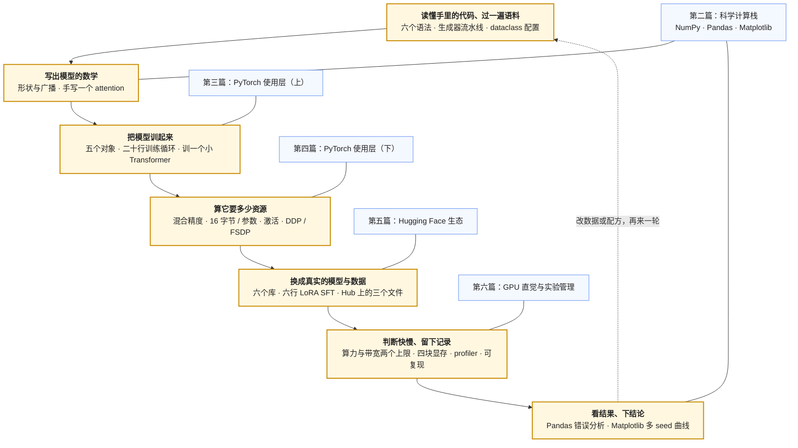

## 内容简介

《算法工程师的工具箱：从一个想法到一次能跑的实验》是一组共六篇的系列文章，对应[《AI 算法工程师学习地图》](/ai-algorithm-engineer-learning-roadmap.html)的第 L1 层（编程与工具）。它面向读完 [L0 数学](/math-for-ai-algorithm-engineers.html)、会一门编程语言、准备第一次亲手训一个模型的读者，讲的是**把一个想法变成一次能跑、能复现、能与 baseline 对比的实验，要经过哪些工具、每个工具用到什么程度**。

它回答的问题是：

> **能不能在一天之内，把一篇论文里的方法变成一次能跑、能复现、能与 baseline 对比的实验？**

算法工程师的日常是把一个想法变成一次实验：读到一篇论文说"把 DPO 的 sigmoid 换成 hinge 会更稳"，当天下午就要在一个 1B 模型、一万条偏好对上跑出对比曲线。这条路上要经过的东西很固定——NumPy / Pandas 处理数据与结果、PyTorch 定义与训练模型、Hugging Face 提供模型与训练器、GPU 决定跑得动跑不动、实验跟踪工具记录发生了什么。每一样都能学成一门专业，但算法工程师对每一样的需求只到某个深度为止，越过那条线就进入了 Infra 地图的范围。本系列逐个工具说明那条线在哪里：会到什么程度就够、哪些内部不需要懂、以及为什么。和 L0 一样，每一篇尽量给出一个能算出来的数字——因为"跑得动跑不动"最终是显存与算力的算术，而不是对工具的熟悉程度。

举一个例子说明这个系列的取法。"全量微调一个 8B 模型要多少显存"在第四篇里是一道算术题：训练时每个参数在显存里有五份东西（bf16 权重 2 字节、bf16 梯度 2 字节、fp32 主权重 4 字节、AdamW 的两个矩各 4 字节），共 16 字节；Llama-3-8B 的 8.03B 参数 × 16 = 128.5 GB，一张 80 GB 的卡放不下；换成 LoRA（L0 第三篇算过是 41.9M 可训练参数）就是 16.06 GB 的冻结权重加 0.67 GB 的训练状态，一张卡绰绰有余。会算这笔账，"全量还是 LoRA、几张卡"就从试出来变成算出来。

系列覆盖的范围可以概括为六层工具：

```text
语言（用法）   Python 使用层：训练代码里的六个语法 · 生成器流式过语料 · dataclass 配置 · 多进程        → 第一篇
数值与数据     NumPy 的形状与广播 · Pandas 的错误分析 · Matplotlib 看曲线                → 第二篇
框架（用法）   PyTorch 五个对象 · 二十行训练循环 · Autograd 三件事                        → 第三篇
框架（资源）   混合精度 · 显存的账（16 字节 / 参数）· 激活与 checkpointing · DDP / FSDP    → 第四篇
模型生态       Hugging Face 六个库 · 六行 LoRA SFT · Hub 三个文件 · 读源码                → 第五篇
硬件与管理     两个上限 · 四块显存 · profiler · 实验记录的最小一行                        → 第六篇
```


## 为什么写这个系列？

### 这一层原来是一篇导读，读者需要的是能动手

这个系列的前身是一篇导读，只回答"每个工具用到什么程度"。它对已经会用这些工具的人是一张清单，对第一次接触的人是一堆名词。展开成系列之后，每一篇都从"要做什么事"出发——写一个 attention、写一个训练循环、算一笔显存账、组装一次微调、读一张 profiler 表——把工具放在事里讲，并配上可以直接运行的脚本。

### "用"与"改"的边界

同一个名词——Python、PyTorch、CUDA——在两张地图上都出现，分工用一句话说清：**算法地图"用"它们，Infra 地图"改"它们**。

| 工具 | 算法工程师（本系列） | Infra 工程师（Infra 地图） |
|---|---|---|
| Python | 训练代码里出现的那一小撮语法的**用法**：协议方法、生成器、装饰器、上下文管理器、`dataclass`、多进程（第一篇） | GIL、内存模型、C 扩展、打包交付 → [01 系列](/python-for-ai-infra.html) |
| PyTorch | Tensor / Autograd / Module / DataLoader / Optimizer / AMP / DDP-FSDP 的**用法** | Dispatcher、Autograd 引擎、编译、分布式通信栈的**实现** → [03 系列](/deep-dive-into-pytorch.html) |
| GPU | 算力与带宽两个上限、显存去向、为什么 batch 大才快 | CUDA 编程模型、访存、Tensor Core、写 kernel → [05 系列](/gpu-kernel-engineering.html) |
| 分布式训练 | DDP / FSDP 启用、并行度对配方的影响 | 并行策略、checkpoint、容错、MFU → [07 系列](/large-scale-training-from-parallelism-to-fault-tolerance.html) |

需要越界的时候是知道的：当你发现"用"解决不了问题——一个算子太慢、一个并行策略框架不支持、一个 OOM 靠调参绕不过去——就是该翻 Infra 地图的时候。

### 现有材料的断层

- **官方教程**（PyTorch "Learn the Basics"、Hugging Face LLM Course）逐个 API 讲，不告诉你哪些是算法工作里天天用的、哪些一年碰不到一次；
- **课程代码**（nanoGPT、"Let's build GPT"）是最好的范本，但假设你已经会 NumPy 与 PyTorch 的基本操作；
- **框架文档**是参考手册，不是学习路径；
- **博客**大多是某一个库的入门，不讲"这一层到哪里为止"。

本系列取的是"一次实验要经过的六层"这条线，每层只讲到能做实验为止，篇幅控制在每篇一小时。


## 适合哪些读者？

### 第一次亲手训一个模型的人

你读完了 L0，会写程序，但没有用过 NumPy 与 PyTorch。本系列按"做一件事"的顺序把工具带出来：第一篇把训练代码里反复出现的 Python 语法讲到能读能用，第二篇用 NumPy 写一个 attention，第三篇写一个能跑的训练循环，第四篇算它的显存，第五篇用 Hugging Face 组装一次真实模型的微调，第六篇看它跑得快不快、记录它以便复现。

### 后端工程师转算法

你会 Python，会用 API 调模型，想自己训一个。你的缺口不是语言而是"科学计算的那套东西"——形状、广播、张量、自动求导——从第二篇开始补；第一篇可以快速翻过，只看第五章那张"PyTorch API ↔ Python 协议"的对照表。Python 的机制（GIL、内存、C 扩展）不在本系列里，在 Infra 01。

### 会用 `Trainer` 但不知道它在做什么的人

你能跑通 `trl` 的 SFT，但 loss 不对、OOM、跑得慢的时候不知道往哪看。第三篇的二十行训练循环是所有高层封装背后的东西，第四篇的显存账与第六篇的 profiler 是排查这三类问题的工具。

### Infra 工程师，想知道算法同事怎么用你维护的东西

你维护训练框架与集群，想知道用户视角的 PyTorch 与 Hugging Face 长什么样、他们最常撞的墙是什么。第四、六篇直接回答。


## 系列的整体主线

六篇按"一次实验从数据到结论"的顺序推进——左列是实验的一步，右列是那一步用到的工具与讲它的篇：



第一篇是**语言**：训练代码里反复出现的那一小撮 Python 语法，讲到能读能用。二到四篇是**框架**：先在 NumPy 上建立形状直觉，再把它搬到 PyTorch 上写训练循环，再算这个循环要多少资源。第五篇是**生态**：真实的模型与数据从哪来、微调怎么组装。第六篇是**硬件与管理**：为什么快为什么慢、怎么让实验可追溯。

三条交织的线索：

```text
形状线：`__getitem__` 取一条样本 → 轴与广播 → Tensor 的形状 → 激活的形状与大小 → 模型分片的形状 → profiler 表里每个算子的形状
数字线：19 MB 文件读成 list 要 103 MB、生成器 12 MB → einsum 一行 → 二十行训练循环 → 16 字节 / 参数 · 128.5 GB · 16.7 GB → 六行 SFT → 4.8 ms / token · 295 FLOP / 字节
工程线：GIL 让 8 线程 1.0× → 形状错误不报错 → zero_grad 与 no_grad → OOM 落在哪一块 → 从 compute_loss 往下追源码 → 一行记录换可复现
```

每一篇都用同样的方法：**从要做的事出发，把工具带出来，讲到能做为止，给出能算的数字与能跑的脚本，指出越过哪条线就进了 Infra 地图**。


## 章节结构与分章导读

### 1. Python 使用层：读懂训练代码的语法、流式过一遍语料、把实验写成脚本

第一篇从算法工作里要做的四件事出发——过一遍语料、写配置、读懂训练代码、把预处理跑快——把训练代码里反复出现的那一小撮 Python 语法带出来，讲到会读会用为止。

这一篇会覆盖：

- 环境：一个项目一个环境，`python -m pip`；`import torch` 出问题先怀疑环境；
- 流式过一遍语料：生成器 vs 一次读进 `list`（19 MB 文件：103 MB vs 12 MB 峰值内存）；读 → 过滤 → 去重 → 统计每步一个生成器串成流水线；
- 配置：`@dataclass` 的默认值、`replace` 覆盖、`asdict` 存盘、`__post_init__` 校验；可变默认值的坑；
- 训练代码里的六个语法与 PyTorch API 的对照：`__len__` / `__getitem__` ↔ `Dataset`，生成器 ↔ `DataLoader`，`__call__` → `forward` ↔ `nn.Module`，装饰器 ↔ `@torch.no_grad()`，上下文管理器 ↔ `with autocast`，`**kwargs` ↔ 配置透传；一个 40 行的"玩具 PyTorch"；
- 多进程预处理：串行 / 8 线程 / 8 进程 = 0.46 s / 0.46 s / 0.15 s——GIL 为什么让线程没用、进程为什么到不了 8×、`chunksize`；
- 出错的时候：traceback 从下往上读，形状 / 设备 / 类型三类错的第一反应，`assert` 形状与 `breakpoint()`；
- 一张表：本篇每一节的机制在 Infra 01 系列哪一篇。

核心问题是：

> **别人的训练代码里 `__getitem__`、`yield`、`@torch.no_grad()`、`with autocast(...)`、`**kwargs` 各在干什么？一份 10 GB 的 JSONL 语料怎么在 16 GB 内存的机器上过一遍？预处理开多线程为什么没用？**

### 2. 科学计算栈：NumPy 的形状直觉、Pandas 的错误分析、Matplotlib 的曲线

第二篇建立整个系列最基础的直觉：**形状**。PyTorch 的 Tensor 语义与 NumPy 的 ndarray 一致，所以先在 NumPy 上建立。

这一篇会覆盖：

- ndarray：形状、dtype、索引与切片；
- 轴（axis）：所有"沿哪个维度"的操作是一个概念——softmax 沿词表维、LayerNorm 沿 hidden 维、loss 沿 token 维平均；
- 广播的三条规则，以及为什么形状错误常常**不报错**；
- reshape / transpose：多头 attention 的形状变换；`reshape` 不移动数据、`transpose` 之后内存不连续；
- `einsum`：把公式翻译成代码的最短路径，attention 的 $$QK^T$$ 一行；
- 用 NumPy 写一个单头 causal self-attention 的前向，与 PyTorch 对数值；
- Pandas：评测结果的错误分析——`groupby`、`merge`、`query`，找 baseline 对而新模型错的题；
- Matplotlib：loss 曲线的读法——对数 x 轴看早期，多 seed 画均值与阴影带。

核心问题是：

> **看到一个 attention 的公式，能不能写出对应的 `einsum`？拿到评测结果，能不能按类别算出错误率？**

### 3. PyTorch 使用层（上）：五个对象与二十行训练循环

第三篇把形状直觉搬到 PyTorch 上，写出一个完整的训练循环。

这一篇会覆盖：

- 五个核心对象：`Tensor`、Autograd、`nn.Module`、`Dataset` / `DataLoader`、`Optimizer`——各管什么、最小用法；
- 从 NumPy 到 Tensor：同一套形状规则，多了 `device`、`dtype`、`requires_grad`；
- Autograd 只需要知道三件事：前向记图、`backward()` 累加到 `.grad`（所以要 `zero_grad`）、`no_grad` 下不建图；
- `nn.Module`：参数的容器与前向逻辑；`__init__` 与 `forward`；`parameters()`、`state_dict()`；
- 二十行训练循环逐行解释：`autocast`、`cross_entropy(...).float()`、`ignore_index=-100`、`clip_grad_norm_`、`set_to_none=True`——每一行对应 L0 或 L3 的一个概念；
- 训一个字符级小 Transformer，loss 曲线正常下降；
- `Trainer` 一类高层封装做的是同一件事加日志、checkpoint、分布式——行为不符合预期时回到这二十行想。

核心问题是：

> **不用 `Trainer`，能不能从零写一个训练循环、在小数据集上训一个小 Transformer、并解释每一行为什么在那里？**

### 4. PyTorch 使用层（下）：混合精度、显存的账与多卡启用

第四篇讲这个训练循环要多少资源：这是"全量还是 LoRA、几张卡"的第一道约束。

这一篇会覆盖：

- 混合精度：`autocast` 让矩阵乘在 bf16 上跑、reduction 留在 fp32；bf16 为什么不需要 loss scaling、fp16 为什么需要；
- **显存的账**：训练时每参数 16 字节（bf16 权重 + bf16 梯度 + fp32 主权重 + AdamW 两个矩）；Llama-3-8B 全量微调 128.5 GB、LoRA 16.7 GB、QLoRA 约 5 GB；
- 激活是第五块：与参数量无关、与 batch × 序列长度成正比；gradient checkpointing 用约 30% 的计算换掉大部分激活；
- 一个 OOM 先问落在哪一块；
- 多卡启用即可：DDP（每卡一份完整模型，all-reduce 梯度）、FSDP（参数 / 梯度 / 状态切到各卡）；`torchrun`；张量并行、流水并行属于预训练规模；
- 在跑之前算出显存、与 `max_memory_allocated()` 对比。

核心问题是：

> **能不能算出一个 8B 模型全量微调要多少显存、为什么 LoRA 能放进一张卡？OOM 的时候知道看哪一块？**

### 5. Hugging Face 生态：六个库与一次 LoRA SFT 的组装

第五篇进入真实的模型与数据。

这一篇会覆盖：

- 六个库各管什么：`transformers`（模型定义与加载、`generate`、`Trainer`）、`datasets`（Arrow、`map`、`streaming`）、`tokenizers`（BPE 训练与编码）、`peft`（LoRA）、`trl`（SFT / DPO / GRPO / Reward 的 Trainer）、`accelerate`（多卡启动）；
- Hub 上的三个文件：`config.json`（从它算参数量）、`tokenizer.json`（词表、特殊 token、chat template）、`*.safetensors`；
- 六行组装一次 LoRA SFT，以及它背后发生的每件事——chat template、loss mask、packing、LoRA 挂载——在第三篇的二十行里的对应位置；
- 为什么读源码是学后训练最快的路：`modeling_llama.py`、`dpo_trainer.py` 的 `dpo_loss`、`peft` 的 `Linear.forward`、`generate` 的 `LogitsProcessor`——各自的入口与长度；
- 在一个 0.5B 模型上跑通一次 LoRA SFT。

核心问题是：

> **能不能用 `peft` + `trl` 在一小时内跑起一个 LoRA SFT？卡住的时候能不能直接读源码找到原因？**

### 6. GPU 直觉与实验管理：两个上限、四块显存、能复现

第六篇讲两件事：为什么快为什么慢，以及怎么让实验可追溯。

这一篇会覆盖：

- GPU 的两个上限：算力与显存带宽；算术强度；H100 的 ridge 约 295 FLOP / 字节；
- decode 是 memory-bound（8B 模型 batch 1 下限 4.8 ms / token）、prefill 与训练是 compute-bound——"为什么 batch 大才快"；
- 显存的四块（权重、梯度与状态、激活、KV cache）与 OOM 归因；
- kernel、launch 开销、stream 与为什么 `time.time()` 测不出 GPU 时间；
- 读 `torch.profiler` 的表：前三个最耗时的算子、GPU 空转比例；
- 实验管理的最小记录：run id、commit、配置、数据版本、seed、环境、指标——齐了才谈复现；W&B / MLflow、Hydra、git 各管哪一项；
- 随机性：seed、确定性算法、多 seed 报均值与方差。

核心问题是：

> **不写 kernel，能不能解释一次训练为什么慢、一次推理为什么快不起来、一个 OOM 从哪里来？三个月后能不能复现今天这次实验？**


## 贯穿全系列的实践线

本系列的每一篇配一个可以在 CPU 上运行的脚本，在 [ai-learning-labs/algorithm-tooling](https://github.com/arganzheng/ai-learning-labs/tree/main/algorithm-tooling)：

```text
第一篇    只用标准库：生成器流式过 10 万行 JSONL 并量峰值内存；dataclass 配置；40 行玩具 PyTorch；串行 / 线程 / 进程对比；读 traceback
第二篇    NumPy 单头 causal attention 与 PyTorch 对数值；Pandas 对一份评测结果做错误分析；Matplotlib 画多 seed 的 loss 曲线
第三篇    二十行训练循环训一个字符级小 Transformer，loss 曲线正常下降
第四篇    显存账本：全量 / LoRA / QLoRA 三种方案的参数与状态字节数；bf16 与 fp32 的实际字节；激活的估算
第五篇    peft + trl 在 Qwen2.5-0.5B 上跑一次 LoRA SFT（需要下载模型）
第六篇    torch.profiler 看一步训练的前几个算子；写出一次实验的最小记录并用 seed 复现
```

六件事做完，L1 就够了。其中第四篇的账最值得做：它把"跑得动跑不动"从试出来变成算出来。

与它平行的源码阅读线：

```text
第三篇    Karpathy nanoGPT 的 train.py（约 300 行）——"从零写训练循环"的范本
第五篇    transformers/models/llama/modeling_llama.py · trl/trainer/dpo_trainer.py 的 dpo_loss · peft/tuners/lora/layer.py
第六篇    Horace He, "Making Deep Learning Go Brrrr From First Principles"
```


## 阅读路径建议

### 完整学习路径

```text
1 → 2 → 3 → 4 → 5 → 6
```

### 只想尽快跑起第一次微调

```text
3 → 5 → 4
```

先写训练循环，再用 Hugging Face 组装真实模型的微调，卡在显存时回第四篇算账。第一篇在读不懂别人代码时补、第二篇在形状报错时补、第六篇在跑得慢或要复现时补。

### 已经会用 `Trainer`，想知道它背后是什么

```text
3 → 4 → 6
```

### Infra 工程师，想知道用户视角

```text
4 → 6
```


## 本系列的边界

- **Python 的机制**：第一篇只讲训练代码里那一小撮语法的用法；它们在解释器里怎么实现——GIL、生成器的暂停恢复、描述符与元类、内存模型、C 扩展、打包交付——在 Infra 地图的 [01 系列](/python-for-ai-infra.html)——它是两张地图共享的基础、本系列第一篇的深入篇，紧接本系列发布。
- **PyTorch 内部**：Dispatcher、Autograd 引擎、编译、分布式通信栈的实现。在 Infra 地图的 [03 系列](/deep-dive-into-pytorch.html)——同样两张地图共享，本系列讲"用"，它讲"改"。
- **GPU 编程**：CUDA、kernel、Tensor Core。本系列只到"读 profiler 知道慢在哪"；写 kernel 在 Infra 05 系列。
- **并行策略的选择与实现**：张量 / 流水 / 专家并行、checkpoint、容错。在 Infra 07 系列。本系列只到 DDP / FSDP 启用。
- **每个训练概念的原理**：混合精度为什么能工作、梯度裁剪剪的是什么、warmup 为什么必须。分别在 L4《Transformer 与 LLM》第六篇与 L3 深度学习基础系列。本系列只讲怎么用、在训练循环的哪一行。
- **后训练算法本身**：SFT 的数据、DPO / GRPO 的原理。在 L5 后训练系列。本系列只到"用 `trl` 跑起来、知道去哪读源码"。


## 前置要求与说明

### 前置要求

- [L0 数学](/math-for-ai-algorithm-engineers.html)前三篇：形状规则与 FLOPs、内积、LoRA 的参数量；第五篇的交叉熵；
- **Python**：会读会写基本语法（变量、函数、类、列表与字典）。训练代码里实际出现的语言特性是一个很窄的子集，读几个主流仓库（`transformers` 的 `Trainer`、`trl` 的各个 Trainer、nanoGPT）就能看到全部——下表是清单：**第一篇**把它们的用法讲完，"深入"一列是 Infra 01 系列里讲机制的篇目：

| 特性 | 在训练代码里的样子 | 要到什么程度 | 深入 |
|---|---|---|---|
| 面向对象与协议方法 | `class MyModel(nn.Module)` 重写 `forward`、`Dataset` 的 `__len__` / `__getitem__`、`model(x)` 走 `__call__` | 会继承、会重写方法、知道 `super().__init__()` 为什么必须调、知道 PyTorch 的 API 各建在哪个协议上（第一篇第五章） | 01 系列[第一篇](/python-language-mechanisms-and-runtime-internals.html) |
| `dataclass` 与类型标注 | `@dataclass class TrainConfig: lr: float = 1e-5` | 配置全用它 | 01 系列[第二篇](/python-type-system-and-data-contract-design.html) |
| 装饰器 | `@torch.no_grad()`、`@torch.compile`、`@property` | 会用、知道装饰器就是"函数包函数" | 01 系列[第四篇](/python-reflection-metaprogramming-and-plugin-architecture.html) |
| 上下文管理器 | `with torch.autocast(...)`、`with torch.no_grad()` | 会用；`contextlib.contextmanager` 会写一个 | 同上 |
| 生成器与迭代器 | 流式数据集 `yield` 一条条样本、`for batch in dataloader` | 理解惰性求值：数据不必全进内存（第一篇第三章） | 01 系列[第一篇](/python-language-mechanisms-and-runtime-internals.html) |
| 异常处理 | 捕获 OOM 后减 batch 重试 | 基本 `try / except / finally` | — |
| 多进程 | `DataLoader(num_workers=8)`、`Pool.map`、`torchrun --nproc_per_node=8` | 知道每个 rank 是一个进程、进程间不共享内存、GIL 为什么让线程帮不上忙（第一篇第六章） | 01 系列[第三篇](/python-concurrency-asynchrony-and-task-collaboration.html) |
| `asyncio` | RL 训练里 rollout 与训练的并发、调用外部 API 做评测 | 基本用法：`async def`、`await`、`gather` | 同上 |
| 包与环境 | `pip` / `uv` / `conda`、`requirements.txt`、虚拟环境 | 能建一个干净可复现的环境（第一篇第二章） | 01 系列[第七篇](/python-engineering-and-production-delivery.html) |

一个现实的标准：**能读懂 nanoGPT 的 `train.py`（约 300 行）与 `trl` 里 `DPOTrainer` 的 loss 函数**，Python 就够了。GIL 与真正的并行、引用计数与垃圾回收、C 扩展与 pybind11、打包成 wheel——这些在算法工作里几乎不出现，出现时就是越界的信号。

不要求：有 GPU（全部脚本 CPU 可跑；第五篇的微调在 CPU 上慢但能跑通）；了解任何具体的模型结构。

### 版本与基线

- PyTorch 2.x；Hugging Face 各库以文中出现的接口为准，库的版本变化快、函数名会变，但找入口的方法不变（从 Trainer 的 `compute_loss` 往下追）；
- 算账时引用的真实模型：Llama-3-8B（8.03B 参数、$$d = 4096$$、32 层）；硬件：H100 SXM（80 GB HBM3、3.35 TB/s、bf16 稠密约 989 TFLOPS）；
- 脚本在 CPU 上运行，第五篇的模型是 Qwen2.5-0.5B。


## 章节目录

1. [Python 使用层：读懂训练代码的语法、流式过一遍语料、把实验写成脚本](/python-in-use-for-algorithm-engineers.html)
2. [科学计算栈：NumPy 的形状直觉、Pandas 的错误分析、Matplotlib 的曲线](/numpy-pandas-matplotlib-for-algorithm-engineers.html)
3. [PyTorch 使用层（上）：五个对象与二十行训练循环](/pytorch-in-use-five-objects-and-a-training-loop.html)
4. [PyTorch 使用层（下）：混合精度、显存的账与多卡启用](/pytorch-in-use-mixed-precision-memory-ledger-and-multi-gpu.html)
5. [Hugging Face 生态：六个库与一次 LoRA SFT 的组装](/hugging-face-ecosystem-six-libraries-and-a-lora-sft.html)
6. [GPU 直觉与实验管理：两个上限、四块显存、能复现](/gpu-intuition-and-experiment-management.html)


## 怎么学

### 材料

| 工具 | 材料 | 说明 |
|---|---|---|
| Python | 官方 tutorial 的 Classes、Iterators / Generators、`dataclasses` 与 `multiprocessing` 几节；Fluent Python（Luciano Ramalho）第 1、17、24 章 | 前者按需查；后者是想弄清"为什么"时的书，不必通读 |
| NumPy | 官方 "NumPy fundamentals"（特别是 Broadcasting 与 Indexing 两节）；Nicolas Rougier《From Python to NumPy》 | 后者的练习建立形状直觉最快 |
| PyTorch | 官方 "Learn the Basics" 与 "Deep Learning with PyTorch: A 60 Minute Blitz"；Karpathy 的 nanoGPT 与 "Let's build GPT" 视频 | 官方教程建立五个对象；nanoGPT 是"从零写训练循环"的范本，读完能改 |
| Hugging Face | 官方 LLM Course（hf.co/learn）；`trl` 与 `peft` 文档里的示例脚本；`transformers` 源码 | 课程过一遍即可，源码是主教材 |
| GPU 直觉 | [《Transformer 与 LLM》第二篇](/transformer-flops-bytes-and-roofline.html)；"Making Deep Learning Go Brrrr From First Principles"（Horace He） | 后者一篇博客讲透三种瓶颈；不需要 CUDA 教材 |
| 实验管理 | W&B 或 MLflow 的快速入门；Hydra 文档 | 半天 |

### 顺序

从"做一件事"倒推：先写训练循环（第三篇），它会逼你学会 PyTorch 的五个对象与看曲线；然后补形状（第二篇）；再进 HF 生态与显存账（第五、四篇）；最后看 profiler（第六篇）。全部做完大约两到三周。不要按库逐个学完——工具在被用来做一件事时才记得住，这与 L0 对数学的建议是同一条。

L1 与 L0 可以交错：写训练循环时遇到 `cross_entropy` 为什么要 `.float()`、`clip_grad_norm_` 在防什么，回 L0 与 L3 找答案。


## 最终目标

读完这套系列之后，面对一次要做的实验，读者应该能够回答：

```text
别人代码里的 __getitem__ / yield / @no_grad / **kwargs 在干什么？   → 第一篇
这个公式对应什么 einsum？我的形状对不对？                    → 第二篇
不用 Trainer 怎么写训练循环？每一行为什么在那里？              → 第三篇
这个模型全量微调要多少显存？LoRA 呢？OOM 落在哪一块？          → 第四篇
怎么用 peft + trl 一小时跑起 SFT？卡住了去读哪个文件？          → 第五篇
这一步 300 ms 花在哪？decode 为什么快不起来？                  → 第六篇
三个月后怎么复现今天这次实验？                                → 第六篇
```

最终目标是三种能力：

1. **组装能力**：把数据、模型、训练循环、评测拼成一次能跑的实验；
2. **算账能力**：在跑之前算出显存与时间，判断跑得动跑不动、瓶颈在哪；
3. **追溯能力**：出问题时从高层封装回到二十行训练循环，从报错回到显存的四块，从慢回到 profiler 表；实验结果三个月后能复现。

工具的检验是做，不是读。六篇的六个脚本跑完、改过，L1 就够了；接下来紧随本系列发布的 Infra 01 Python 与 03 PyTorch 两个系列是它的深入篇，按需再读；然后进 L2 经典机器学习。
