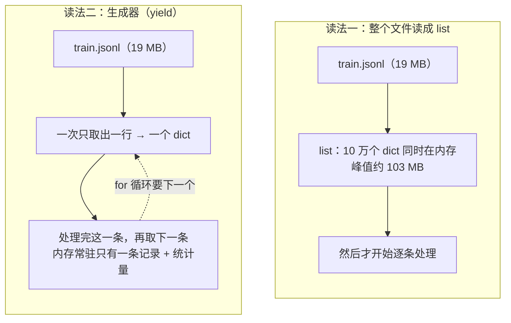

算法工程师每天写的 Python 不多，读的很多：`transformers` 的 `Trainer`、别人的数据脚本、论文附带的训练代码。这些代码里反复出现同一小撮语法——`__getitem__`、`yield`、`@torch.no_grad()`、`with torch.autocast(...)`、`**kwargs`、`@dataclass`——它们不是 PyTorch 发明的，是 Python 的**协议**：PyTorch 只是约定"你按这个形状写，我就能用"。本篇从要做的四件事出发——过一遍语料、写配置、读懂训练代码、把预处理跑快——把这一小撮语法带出来，讲到会读会用为止。Python 的**机制**（这些语法在解释器里怎么实现、GIL 是什么、装饰器怎么改函数）是 Infra 地图 [01 系列](/python-for-ai-infra.html)的内容，那是本篇的深入篇，本篇末尾给出对照表。

全篇的核心问题是：

> **别人的训练代码里 `__getitem__`、`yield`、`@torch.no_grad()`、`with autocast(...)`、`**kwargs` 各在干什么？[^q0] 一份 10 GB 的 JSONL 语料怎么在 16 GB 内存的机器上过一遍、去重、统计？[^q1] 预处理太慢，开多线程为什么没用、开多进程为什么也到不了 8 倍？[^q2]**

## 一、总览

### 1. 本文的组织方式

本文不按语法特性排，按**算法工作里要做的事**排：先是环境（第二章，一切的前提），然后是过一遍语料（第三章）、写配置（第四章）、读懂训练代码（第五章）、把预处理跑快（第六章）、出错时定位（第七章）——每件事把它需要的那几个语法带出来，用到时才讲。这样做的代价是同一个机制（生成器）会在第三章和第五章各出现一次；好处是每个语法都有一个"为什么需要它"。第八章是一张对照表：本文每一节"怎么用"背后的"为什么"在 Infra 01 系列的哪一篇。

### 2. 四件事、一小撮语法

| 要做的事 | 用到的语法 | 章 |
|---|---|---|
| 过一遍语料：读、过滤、去重、统计 | `with open`、`json`、**生成器**（`yield`）、`Counter`、`pathlib` | 三 |
| 写一份能存能改的配置 | **`@dataclass`**、`replace`、`asdict`、类型标注 | 四 |
| 读懂训练代码 | `__len__` / `__getitem__`、迭代协议、`__call__`、**装饰器**、**上下文管理器**、`*args` / `**kwargs` | 五 |
| 把预处理跑快 | `multiprocessing.Pool`、GIL、`chunksize` | 六 |
| 出错时定位 | 读 traceback、`assert` 形状、`breakpoint()` | 七 |

Table: 训练代码里的四件事与用到的语法

### 3. 本文的章节安排

| 章 | 主题 | 内容 |
|---|---|---|
| 二 | 环境 | 一个项目一个环境；`import torch` 报错多半是环境的事 |
| 三 | 流式过一遍语料 | 一次读进内存 vs 生成器：19 MB 文件 103 MB vs 12 MB；生成器串成流水线 |
| 四 | 配置：`dataclass` | 默认值、覆盖、存盘、构造时校验；可变默认值的坑 |
| 五 | 训练代码里的六个语法 | PyTorch 的每个 API 对应 Python 的哪个协议；一个 40 行的"玩具 PyTorch" |
| 六 | 多进程预处理 | 串行 / 线程 / 进程：0.46 s / 0.46 s / 0.15 s；为什么线程不行、进程也到不了 8× |
| 七 | 出错的时候 | traceback 从下往上读；三类最常见的错 |
| 八 | 越过哪条线进 Infra 01 | 本篇每一节的机制在 01 系列哪一篇 |
| 九 | 本文小结 | |
| 十 | 自测 | 五道题 |

Table: 本文的章节安排

## 二、环境

### 1. Python 的"环境"是什么

Python 解释器启动时，从几个固定目录（`sys.path`）里找 `import` 的包，其中最重要的是 `site-packages`。系统自带的那个 Python 只有一个 `site-packages`，所有项目装的包混在一起：项目 A 要 `torch 2.4`、项目 B 要 `torch 2.6`，装后者就把前者覆盖了。**环境**（virtual environment）就是给一个项目单独造一份 `site-packages` 和一个指向它的 `python` 可执行文件——Java 里对应的不是 JDK，而是每个项目自己的依赖树（Maven 的 `.m2` 按坐标隔离，Python 的包没有坐标，只能靠目录隔离）。

建环境有三种常见工具，做的是同一件事：

1. **`venv`**：标准库自带，`python -m venv .venv` 在项目目录下造一个 `.venv/`；只管 Python 包，Python 解释器本身用系统的。
2. **`conda`**：连解释器版本、CUDA 运行库这类非 Python 的东西一起管，`conda create -n proj python=3.12`；重，但在没有 root、要换 Python 版本的机器上省事。
3. **`uv`**：Rust 写的新一代工具，兼容 `venv` + `pip` 的用法但快一到两个数量级，还能锁依赖、管 Python 版本；本系列的脚本用它。

装包的工具是 `pip`（`uv pip` 是同一套接口）。**一条规则：一个项目一个环境，环境里装什么写在文件里**（`requirements.txt` 或 `pyproject.toml`）。

### 2. 四条命令

```bash
uv venv && source .venv/bin/activate              # 或 python -m venv .venv / conda create -n proj python=3.12
uv pip install torch --index-url https://download.pytorch.org/whl/cu124   # GPU 版 torch 要指定 CUDA 版本的源
uv pip install -r requirements.txt                # numpy pandas transformers ...
python -m pip list | grep -i torch                # python -m：用"当前这个 python"的 pip，不会装错环境
```

### 3. 出问题先怀疑环境

`import torch` 报 `ModuleNotFoundError`、`torch.cuda.is_available()` 是 `False`、两台机器结果不一样——三件事的第一嫌疑都是环境：终端里的 `python` 与 IDE 里的不是同一个、装了 CPU 版的 torch、依赖版本没锁。`pip freeze > requirements.lock` 把实验时的版本存进 run 目录（第六篇"能复现"的一部分）。环境、打包与交付的完整做法在 Infra 01 第七篇。

## 三、流式过一遍语料

### 1. 两种读法




语料通常是 **JSONL**：一行一个 JSON 对象。最直接的读法是整个文件读成一个 `list`：

```python
records = [json.loads(line) for line in path.read_text().splitlines()]   # 全部进内存
```

另一种是**生成器**：函数体里有 `yield`，调用它不执行，返回一个可以 `for` 的对象，每次 `for` 要下一个时才执行到下一个 `yield`：

```python
def iter_jsonl(path):
    with open(path, encoding="utf-8") as f:
        for line in f:                 # 文件对象本身就是逐行的迭代器，不会一次读完
            yield json.loads(line)
```

合成一份 10 万行、19.4 MB 的 JSONL 语料，两种读法各过一遍，用 `tracemalloc` 量峰值内存：

```text
一次读进 list: 100,000 条, 峰值内存 102.9 MB  （≈ 文件大小 × 5.3）
生成器流式:   峰值内存 11.5 MB  （只有去重的哈希集合在涨）
```

`list` 的峰值是文件大小的 5 倍：每行变成一个 `dict`，每个键、每个字符串都是独立的 Python 对象，各带几十字节的头。10 GB 的语料按这个比例要 50 GB 内存。生成器一次只在内存里放一行，峰值与文件大小**无关**——那 11.5 MB 几乎全是去重用的哈希集合。

### 2. 串成流水线

生成器可以套生成器，每一层只管一件事：

```python
def clean(records, min_words=5):
    seen = set()
    for r in records:
        if len(r["text"].split()) < min_words: continue          # 过滤
        h = hashlib.md5(r["text"].encode()).hexdigest()
        if h in seen: continue                                   # 精确去重
        seen.add(h); yield r

by_source, lengths = Counter(), Counter()
for r in clean(iter_jsonl(path)):                                # 读 → 过滤 → 去重 → 统计，一行一行流过去
    by_source[r["source"]] += 1
    lengths[min(len(r["text"].split()) // 10 * 10, 50)] += 1
```

```text
读文件 ──行──▶ json.loads ──dict──▶ 过滤 ──▶ 去重 ──▶ Counter
          每个箭头上同一时刻只有一条记录；内存里常驻的只有 seen 和两个 Counter
```

```text
过滤 + 去重后保留 92,867 / 100,000 条; 按来源: {'book': 30964, 'code': 31155, 'web': 30748}
按长度分桶(词数下界): 0+: 8339, 10+: 16465, 20+: 16754, 30+: 16550, 40+: 16529, 50+: 18230
```

这就是数据工程的最小形态：**读、过滤、去重、统计**四步，每步一个生成器。预训练系列第三篇的数据流水线——质量过滤、MinHash 近似去重（L2 第五篇）、配比——是同一个骨架换上更重的每一步。`Counter` 是 `dict` 的子类，`Counter()[k] += 1` 不用先判断键在不在；`pathlib.Path` 让 `path / "train.jsonl"`、`path.stat().st_size`、`path.exists()` 不用拼字符串。

### 3. 与 `datasets` 的关系

本系列第五篇[《Hugging Face 生态：六个库与一次 LoRA SFT 的组装》](/hugging-face-ecosystem-six-libraries-and-a-lora-sft.html)第三章会用到的 `datasets` 库，把这一套做成了链式调用：

```python
ds = load_dataset("json", data_files="train.jsonl", streaming=True)   # 返回 IterableDataset，不读文件
ds = ds.filter(lambda r: len(r["text"].split()) >= 5)                # 只记下"要过滤"，不执行
ds = ds.map(lambda r: {"n_words": len(r["text"].split())})           # 同样只记下
for r in ds: ...                                                      # 到这里才逐条读、过滤、map
```

它的内核就是上面那条生成器流水线。`IterableDataset` 里存的是一个"怎么产生样本"的生成器工厂（`_ex_iterable`），`.filter()` 和 `.map()` 各返回一个新的 `IterableDataset`，把自己包在上一层的生成器外面——与 `clean(iter_jsonl(path))` 的套法一样，只是套的动作被记成了对象。所以 `streaming=True` 的数据集没有 `len()`（生成器不知道自己有多长），`.map()` 不立即执行（只是又包了一层），真正的读取发生在 `for` 拿第一条的时候。非 streaming 的 `Dataset` 则先把数据写成 Arrow 文件再内存映射，`len()` 有了，`.map()` 也变成立刻跑完并缓存结果。

## 四、配置：`dataclass`

训练脚本的参数——模型名、学习率、batch、步数、LoRA 目标层——要能**有默认值、能从命令行覆盖、能存进 run 目录、能被 IDE 补全**。`@dataclass` 一次满足：

```python
from dataclasses import dataclass, field, asdict, replace

@dataclass
class TrainConfig:
    model: str = "Qwen/Qwen2.5-0.5B"
    lr: float = 2e-5
    batch_size: int = 8
    max_steps: int = 1000
    warmup: int = 50
    lora_targets: list[str] = field(default_factory=lambda: ["q_proj", "v_proj"])

    def __post_init__(self):
        assert self.warmup <= self.max_steps, f"warmup {self.warmup} > max_steps {self.max_steps}"
```

装饰器 `@dataclass` 读类体里的**类型标注**，自动生成 `__init__`、`__repr__`、`__eq__`。三个日常操作：

```python
cfg  = TrainConfig()                                   # 默认
cfg2 = replace(cfg, lr=1e-4, max_steps=200)            # 覆盖：返回新对象，原来的不动
json.dump(asdict(cfg2), open(run_dir / "config.json", "w"))   # 存盘：dataclass → dict → JSON
```

```text
覆盖后: 0.0001 200 | 原来的: 2e-05 1000
两个默认对象的 lora_targets 是否同一个 list: False
非法配置在构造时就报错: warmup 500 > max_steps 200
```

两个细节值得记住：

1. **可变默认值要用 `field(default_factory=...)`。** 类体里的 `lora_targets: list = ["q_proj"]` 在**定义类时**求值一次，那个 `list` 对象成为类属性，之后每个实例的默认值都是同一个对象——实例 A `append` 了，实例 B 也看得到。Java 里字段初始化器 `List<String> tags = new ArrayList<>();` 是每次 `new` 都执行一遍，所以没有这个坑；Python 的函数默认参数（`def f(x=[])`）也是同一个陷阱。`default_factory=lambda: [...]` 传的是一个"每次构造时调用一次"的函数，每个实例拿到自己的 `list`。`dataclass` 会直接拒绝 `list` / `dict` / `set` 字面量默认值并抛 `ValueError`，但自定义的可变对象它查不出来，要自己记住。
2. **校验放在 `__post_init__`。** `dataclass` 生成的 `__init__` 赋完值会调它；非法组合在构造时就炸，而不是训了 500 步之后。

`transformers` 的 `TrainingArguments`、`peft` 的 `LoraConfig` 都是 `dataclass`，`Trainer(args=TrainingArguments(...))` 传的就是这样一个对象；命令行解析用 `argparse` 或 `HfArgumentParser`（直接从 `dataclass` 的字段生成参数），配置文件用 JSON / YAML 读成 `dict` 后 `TrainConfig(**d)` 展开。

类型标注 `lr: float` 在运行时**不做检查**（传字符串也能构造），它服务的是阅读、IDE 补全与 `dataclass` 这类读标注的工具；要做校验用 `pydantic`。类型系统的完整讨论在 Infra 01 第二篇。

## 五、训练代码里的六个语法

### 1. 对照表

PyTorch 的每个核心 API 都建在一个 Python 协议上。左边是你在训练代码里看到的，中间是它要求你写的，右边指向下面那段 40 行"玩具 PyTorch"里对应的实现：

| PyTorch 里看到的 | Python 协议 | 玩具实现 | 要点 |
|---|---|---|---|
| `Dataset` | 序列协议：`__len__` + `__getitem__` | ① `ToyDataset` | 写了这两个方法，`len(ds)`、`ds[3]`、`for x in ds` 就都能用——Python 见到 `ds[3]` 就调 `ds.__getitem__(3)`。`torch.utils.data.Dataset` 要的就是这两个，`DataLoader` 按索引来取 |
| `DataLoader`，`for batch in loader` | 迭代协议：`__iter__` / 生成器 | ② `loader` | `for batch in loader` 每次要下一个 batch 时才取样本、才 `collate`——所以 `DataLoader` 不会把整个数据集拼好放内存里；`IterableDataset` 就是让你自己写 `__iter__`（一个生成器），第三章的流式读取直接能当它用 |
| `nn.Module`，`model(x)` | 可调用对象：`__call__` → `forward` | ③ `ToyModel` | `model(x)` 是 `model.__call__(x)`，`nn.Module` 在 `__call__` 里先跑 hooks 再调你写的 `forward`。所以**永远写 `model(x)` 而不是 `model.forward(x)`**——后者跳过了 hooks（`register_forward_hook`、`torch.compile` 的一部分机制都挂在那里） |
| `@torch.no_grad()`、`@torch.compile` | 装饰器：`fn = deco(fn)` | ④ `timed` | "函数包函数"的语法糖，`@torch.no_grad()` 是同一个形状——返回一个进入时关梯度、退出时恢复的包装函数。`@dataclass`、`@functools.lru_cache`、`@app.route` 全是它 |
| `with torch.autocast(...)`、`with torch.no_grad()` | 上下文管理器：`__enter__` / `__exit__` | ⑤ `seeded` | 进入时改一个状态，退出时**保证**恢复，中间抛异常也恢复。`@contextmanager` 把一个 `yield` 前后各一段的生成器变成它 |
| `Trainer(**kwargs)`、`model.generate(**inputs)` | 参数打包与展开：`*args` / `**kwargs` | ⑥ `wrapper(*args, **kwargs)` | `*args` 把多余的位置参数收成 tuple，`**kwargs` 把多余的关键字参数收成 dict；调用时 `f(*t, **d)` 反过来展开。`Trainer(**config)`、`tokenizer(text, **kw)` 都是把一个 dict 原样透传下去——看到它就去找那个 dict 里有什么键 |

Table: PyTorch 核心 API 与 Python 协议的对照

### 2. 一个 40 行的"玩具 PyTorch"

用纯 Python 把左列每一样各写一个最小版，跑起来与真的形状一致（①–⑥ 对应上表）：

```python
class ToyDataset:                                   # ① Dataset：两个方法就够
    def __init__(self, texts): self.texts = texts
    def __len__(self): return len(self.texts)
    def __getitem__(self, i): return {"input_ids": [ord(c) % 128 for c in self.texts[i]], "label": len(self.texts[i]) % 2}

def collate(items):                                 # 一批样本拼成 batch：右侧 pad 到最长
    T = max(len(x["input_ids"]) for x in items)
    return {"input_ids": [x["input_ids"] + [0] * (T - len(x["input_ids"])) for x in items],
            "attention_mask": [[1] * len(x["input_ids"]) + [0] * (T - len(x["input_ids"])) for x in items],
            "labels": [x["label"] for x in items]}

def loader(ds, batch_size, shuffle, seed=0):        # ② DataLoader 的骨架：一个生成器
    idx = list(range(len(ds)))
    if shuffle: random.Random(seed).shuffle(idx)
    for s in range(0, len(idx), batch_size):
        yield collate([ds[i] for i in idx[s:s + batch_size]])

class ToyModel:                                     # ③ nn.Module：model(x) 走 __call__，__call__ 再调 forward
    def __init__(self): self.calls = 0
    def __call__(self, batch):
        self.calls += 1                             # 真实的 __call__ 在这里跑 forward hooks
        return self.forward(batch)
    def forward(self, batch): return [sum(row) / max(1, sum(m)) for row, m in zip(batch["input_ids"], batch["attention_mask"])]

def timed(fn):                                      # ④ 装饰器：@timed 等价于 one_epoch = timed(one_epoch)
    @wraps(fn)
    def wrapper(*args, **kwargs):                   # ⑥ *args / **kwargs：原样接住任何参数再原样传下去
        t0 = time.perf_counter(); out = fn(*args, **kwargs)
        print(f"[{fn.__name__} 用时 {time.perf_counter() - t0:.3f}s]"); return out
    return wrapper

@contextmanager
def seeded(seed):                                   # ⑤ 上下文管理器：进入时做一件事，退出时（哪怕出错）恢复
    state = random.getstate(); random.seed(seed)
    try: yield
    finally: random.setstate(state)
```

把它们拼起来跑一遍——`@timed` 装饰的 `one_epoch` 就是一个最小的训练循环骨架：

```python
@timed
def one_epoch(model, ds, batch_size):
    n = 0
    for batch in loader(ds, batch_size, shuffle=True, seed=0):
        model(batch); n += len(batch["labels"])
    return n

ds = ToyDataset(["attention is all you need", "loss", "the memory ledger", "bf16", "rope", "kv cache", "sft", "dpo", "grpo"])
model = ToyModel()
print(f"len(ds) = {len(ds)}; ds[0] = {ds[0]}")
first = next(loader(ds, 4, shuffle=False))
print(f"第一个 batch: input_ids 形状 [{len(first['input_ids'])}, {len(first['input_ids'][0])}], labels = {first['labels']}")
n = one_epoch(model, ds, 4)
print(f"一个 epoch 看了 {n} 个样本, model 被调用 {model.calls} 次 (= ceil({len(ds)} / 4))")
with seeded(42): a = [random.random() for _ in range(3)]
with seeded(42): b = [random.random() for _ in range(3)]
print(f"seeded(42) 两次得到相同的数: {a == b}; 退出后随机状态已恢复")
```

```text
len(ds) = 9; ds[0] = {'input_ids': [97, 116, 116, ...], 'label': 1}
第一个 batch: input_ids 形状 [4, 25], labels = [1, 0, 1, 0]
[one_epoch 用时 0.000s]
一个 epoch 看了 9 个样本, model 被调用 3 次 (= ceil(9 / 4))
seeded(42) 两次得到相同的数: True; 退出后随机状态已恢复
```

## 六、多进程预处理

### 1. 三个数字

tokenize、正则清洗、哈希这类**CPU 密集**的预处理，单进程跑 10 万行 0.46 秒，一亿行就是 8 分钟。把同一个函数用三种方式跑：

```python
total = sum(map(tokenize_count, lines))                        # 串行
with ThreadPool(8) as pool: pool.map(tokenize_count, lines, chunksize=2000)   # 8 线程
with Pool(8) as pool:       pool.map(tokenize_count, lines, chunksize=2000)   # 8 进程
```

```text
100,000 行, 共 3,146,454 个 token; 8 个 worker
串行:   0.46s
线程池: 0.46s  （1.0×，GIL 让 CPU 密集的线程几乎不并行）
进程池: 0.15s  （3.1×，进程各有一个解释器，代价是启动与序列化）
```

### 2. 为什么

- **线程 1.0×**：CPython 有一把全局解释器锁（GIL），同一时刻只有一个线程在执行 Python 字节码。线程对**等待**（网络、磁盘、等 GPU）有用，对**算**没用。这也是 `DataLoader(num_workers=4)` 开的是**进程**而不是线程的原因。
- **进程 3.1× 而不是 8×**：每个进程是一个独立解释器，要启动、要把输入 `pickle` 过去、把结果 `pickle` 回来。任务越轻，序列化占比越大；`chunksize` 让每次传一批而不是一条，是最重要的调节旋钮。任务重（每条几毫秒以上）时能接近核数。
- **进程间不共享内存**：全局变量在子进程里是拷贝，改了主进程看不见；传给 `Pool.map` 的函数必须是模块顶层可导入的（lambda 不行，因为要 `pickle` 函数本身）。

`datasets` 的 `.map(num_proc=8)` 就是这个 `Pool`；GIL 的来历、`asyncio` 在什么时候比线程更合适、进程池与 `DataLoader` worker 的内部，在 Infra 01 第三篇。

## 七、出错的时候

### 1. traceback 从下往上读

```text
Traceback (most recent call last):
  File ".../00_python_in_use.py", line 286, in exp_traceback
    train_step([[1.0, 2.0, 3.0], [4.0, 5.0]])
  File ".../00_python_in_use.py", line 279, in train_step
    return forward(batch)
  File ".../00_python_in_use.py", line 274, in forward
    h = project(batch, [[0.1] * 4 for _ in range(3)])   # w: [3, 4]
  File ".../00_python_in_use.py", line 269, in project
    assert len(row) == d_in, f"shape mismatch: ..."
AssertionError: shape mismatch: x row has 2 features, w expects 3
```

**最后一行是错误本身**（哪一类、什么信息），**往上第一帧是出错的位置**，再往上是它怎么被一层层调到的。PyTorch 的 traceback 常有二三十层，中间大半在 `torch/nn/modules/module.py` 的 `_call_impl` 里——那是 `__call__` 转 `forward` 的机制代码，跳过；找**你自己文件**出现的最后一帧。

### 2. 三类最常见的错

| 错误类型 | 报错长什么样 | 第一反应 |
|---|---|---|
| 形状 | `mat1 and mat2 shapes cannot be multiplied (32x768 and 1024x768)` | 在出错前一行 `print(x.shape, w.shape)`；第二篇的形状规则 |
| 设备 | `Expected all tensors to be on the same device, but found cuda:0 and cpu` | 某个张量忘了 `.to(device)`——常见于手建的 mask 或 label |
| 类型 | `expected scalar type Float but found BFloat16` | `autocast` 之外把 bf16 与 fp32 混算了；第四篇 |

Table: 三类最常见的错误与第一反应

形状错误在 PyTorch 里**经常不报错**——广播把 `[B, T]` 和 `[T, 1]` 加在一起也能算出一个结果（第二篇"能跑但错"）。在形状会变的地方写一句 `assert x.shape == (B, T, d), x.shape`，错了当场停在这一行，而不是在几百步之后的 loss 曲线上。要看某一行时的变量值，在那一行前写 `breakpoint()`，运行到那里会进入 pdb：`p x.shape` 打印、`n` 下一行、`c` 继续。测试与调试的系统做法在 Infra 01 第六篇。

## 八、越过哪条线进 Infra 01

本篇讲"怎么用"，每一节背后都有一个"为什么是这样"，那是 Infra 地图 01 系列的内容——两张地图共享，紧接本系列发布：

| 本篇 | 你会用了 | 想知道机制去 |
|---|---|---|
| 三 | 生成器、迭代协议、`with open` | [01 第一篇](/python-execution-model-scopes-imports-and-exceptions.html)：生成器怎么暂停恢复、迭代协议、名字绑定 |
| 四 | `dataclass`、类型标注 | [01 第二篇](/python-type-expression-and-the-typing-toolbox.html)：类型系统、`Protocol`、pydantic 与数据契约 |
| 六 | `Pool`、GIL、`chunksize` | [01 第三篇](/python-concurrency-asynchrony-and-task-collaboration.html)：GIL、线程 / 进程 / asyncio 的选择、`DataLoader` worker |
| 五 | 装饰器、`__call__`、`__getitem__` | [01 第四篇](/python-reflection-metaprogramming-and-plugin-architecture.html)：描述符、元类、算子注册表怎么用装饰器实现 |
| 三 | 峰值内存、对象开销 | [01 第五篇](/python-memory-management-and-optimization.html)：引用计数、对象头、为什么一个 dict 比它的 JSON 大 5 倍 |
| 七 | traceback、`assert`、`breakpoint()` | [01 第六篇](/python-unit-testing-troubleshooting-and-debugging.html)：pytest、性能剖析、线上排障 |
| 二 | venv、`requirements` | [01 第七篇](/python-engineering-and-production-delivery.html)：打包、`pyproject`、镜像与交付 |

Table: 本篇各章对应的 Infra 01 系列机制篇

算法工作的日常在左边两列就够了；读框架源码、给框架提 PR、排查 `DataLoader` 卡死这类问题时，右边那一列是必需的。

## 九、本文小结

- **环境**：一个项目一个环境，`python -m pip`；`import torch` 出问题先怀疑环境。
- **流式过语料**：一次读进 `list` 的峰值内存是文件大小的 5 倍（19 MB → 103 MB），生成器与文件大小无关（12 MB）；读 → 过滤 → 去重 → 统计每步一个生成器串起来，是数据工程的最小形态。
- **配置**：`@dataclass` 读类型标注生成 `__init__` / `__repr__`；`replace` 覆盖、`asdict` 存盘、`__post_init__` 校验；可变默认值用 `field(default_factory=...)`。
- **六个语法**：`__len__` / `__getitem__` 是 `Dataset`；生成器是 `DataLoader`；`__call__` → `forward` 是 `nn.Module`（所以写 `model(x)`）；装饰器是 `@torch.no_grad()`；上下文管理器是 `with autocast`；`**kwargs` 是配置透传。
- **多进程**：GIL 让 CPU 密集的线程不并行（1.0×）；进程池 8 个 worker 3.1×，差在启动与 `pickle`，`chunksize` 是旋钮；`DataLoader(num_workers)` 与 `datasets.map(num_proc)` 都是它。
- **出错**：traceback 最后一行是错、往上第一帧是位置、找自己文件的最后一帧；形状 / 设备 / 类型三类错各有第一反应；`assert` 形状，`breakpoint()` 停下来看。

配套代码：本文的全部数字（峰值内存、三种并发方式的耗时、玩具 PyTorch 的输出）由 [`algorithm-tooling/00_python_in_use.py`](https://github.com/arganzheng/ai-learning-labs/blob/main/algorithm-tooling/00_python_in_use.py) 产生，只用标准库；想复现或改着玩时去拉它，读本文不需要。

## 十、自测

1. 一个 30 GB 的 JSONL 文件，机器内存 32 GB，`json.loads` 每行后要统计各来源的条数。能不能做？用什么写法？

   <details markdown="1"><summary>答案</summary>

   能。用生成器逐行读（文件对象本身就是逐行迭代器），`Counter` 累加——峰值内存只有一行加一个 `Counter`，与 30 GB 无关。读成 `list` 需要约 150 GB（5 倍），不行。

   </details>

2. `for batch in DataLoader(ds, batch_size=8)` 时，`ds.__getitem__` 会在什么时候被调用？一共调多少次？

   <details markdown="1"><summary>答案</summary>

   在 `for` 每次要下一个 batch 时才被调用（迭代是惰性的），每个 batch 调 8 次，一个 epoch 共 `len(ds)` 次。数据集不会被提前全部取出来放内存。

   </details>

3. `model.forward(x)` 与 `model(x)` 的输出一样，为什么仍然要写后者？

   <details markdown="1"><summary>答案</summary>

   `model(x)` 走 `nn.Module.__call__`，在调 `forward` 前后执行 forward hooks（`register_forward_hook`、一些 profiler 与 `torch.compile` 的机制挂在那里）；直接调 `forward` 跳过了它们，行为在挂了 hook 时会不同。

   </details>

4. 把一个 CPU 密集的清洗函数从 `map` 改成 `ThreadPool(8).map`，速度几乎不变。为什么？改什么能变？

   <details markdown="1"><summary>答案</summary>

   GIL：同一时刻只有一个线程执行 Python 字节码，CPU 密集的线程不并行。改用 `multiprocessing.Pool`（每个进程独立解释器），并设合适的 `chunksize` 减少序列化开销；任务越重越接近核数倍。

   </details>

5. `@dataclass class C: tags: list = []` 会怎样？正确写法是什么？

   <details markdown="1"><summary>答案</summary>

   `dataclass` 直接拒绝并抛 `ValueError: mutable default ... use default_factory`——因为默认值只创建一次，所有实例会共享同一个 `list`。正确写法 `tags: list = field(default_factory=list)`。

   </details>

下一篇进入数据科学三剑客：在 NumPy 上建立形状直觉——轴、广播、`einsum`，手写一个 causal attention 并与 PyTorch 对数值；然后用 Pandas 分析评测结果、用 Matplotlib 看训练曲线。

[^q0]: 它们各是一个 Python 协议，PyTorch 建在上面：`__len__` / `__getitem__` 是 `Dataset` 的全部要求，`DataLoader` 按索引来取；`yield` 定义生成器，`for batch in loader` 每次要下一个才算下一个，所以数据不会一次全进内存；`@torch.no_grad()` 是装饰器——"函数包函数"，进入时关梯度、退出时恢复；`with autocast(...)` 是上下文管理器，进入改状态、退出（含异常）保证恢复；`**kwargs` 把一个 dict 原样透传给下一层，看到它就去找那个 dict 里有什么键。另外 `model(x)` 走 `__call__` 再到 `forward`，hooks 挂在中间，所以不要直接调 `forward`。详见[第五章](#五训练代码里的六个语法)。
[^q1]: 用生成器逐行读，读 → 过滤 → 去重 → 统计每步一个生成器串起来，同一时刻内存里只有一条记录加去重用的哈希集合。实测 19.4 MB 的 JSONL 读成 `list` 峰值 102.9 MB（文件大小的 5.3 倍，每个 dict、每个字符串都是带头的 Python 对象），生成器 11.5 MB 且与文件大小无关；按 5 倍算，10 GB 读成 `list` 要 50 GB，流式几十 MB 就够。精确去重靠内容哈希的集合；近似去重（MinHash）在 L2 第五篇。详见[第三章](#三流式过一遍语料)。
[^q2]: 线程没用是因为 GIL：CPython 同一时刻只让一个线程执行字节码，CPU 密集的任务 8 线程 1.0×；线程只对等待（I/O、等 GPU）有用。进程池每个 worker 是独立解释器，实测 8 个 worker 3.1×，差在进程启动、输入输出的 `pickle` 序列化——任务越轻占比越大；`chunksize` 让每次传一批，任务越重越接近核数倍。`DataLoader(num_workers)` 与 `datasets.map(num_proc)` 用的都是进程池。详见[第六章](#六多进程预处理)。
