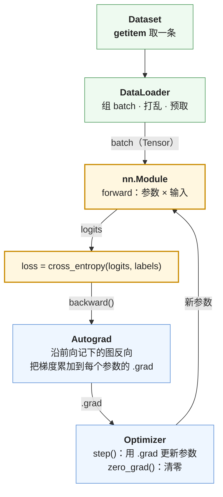

PyTorch 的使用层只有五个对象：`Tensor`（数据与形状）、Autograd（自动求导）、`nn.Module`（参数的容器与前向逻辑）、`Dataset` / `DataLoader`（取数与组 batch）、`Optimizer`（用梯度更新参数）。把它们拼起来就是一个训练循环，二十行。所有高层封装——`transformers` 的 `Trainer`、`trl` 的各个 Trainer、Lightning——做的都是这二十行加上日志、checkpoint、分布式。能写出这二十行、并解释每一行为什么在那里，PyTorch 的使用层就过关了；遇到高层封装行为不符合预期时，也是回到这二十行想。

本篇写出它，并用它训一个字符级小 Transformer。全篇的核心问题是：

> **不用 `Trainer`，能不能从零写一个训练循环、在小数据集上训一个小 Transformer、并解释每一行为什么在那里？**


## 一、总览

### 1. 五个对象

```text
Tensor          NumPy 的 ndarray + device + dtype + requires_grad
Autograd        前向记图 · backward() 累加到 .grad · no_grad 下不建图
nn.Module       参数的容器（parameters / state_dict）+ 前向逻辑（forward）
Dataset/Loader  __getitem__ 取一条 · DataLoader 组 batch、打乱、多进程预取
Optimizer       step() 用 .grad 更新参数 · zero_grad() 清零 · 学习率调度器
```

五个对象在一步训练里各站一个位置，数据沿着一个环流动——第六章的二十行代码就是把这个环写出来：



绿色是数据怎么进来，黄色是前向算出 loss，蓝色是梯度怎么回去再改参数。Tensor 没有单独画：环上流动的每一样东西——batch、logits、loss、.grad、参数——都是 Tensor。

### 2. 本文的章节安排

| 章 | 主题 | 内容 |
|---|---|---|
| 二 | Tensor | 从 ndarray 到 Tensor：多了什么；`device`、`dtype`、原地操作 |
| 三 | Autograd | 三件事：记图、累加、`no_grad`；一个手算例子 |
| 四 | nn.Module | `__init__` 与 `forward`；`parameters()`、`state_dict()`；组合 |
| 五 | Dataset、DataLoader 与 Optimizer | 取数、组 batch；`step` / `zero_grad`；调度器 |
| 六 | 二十行训练循环 | 逐行解释：每一行对应 L0 / L3 的哪个概念 |
| 七 | 训一个小 Transformer | 84 万参数、CPU 一分钟、PPL 从 128 到 9.6 |
| 八 | 自测 | 五道题 |
| 九 | 本文小结 | |

配套脚本：[`02_train_loop.py`](https://github.com/arganzheng/ai-learning-labs/blob/main/algorithm-tooling/02_train_loop.py) 与模型定义 [`tinygpt.py`](https://github.com/arganzheng/ai-learning-labs/blob/main/algorithm-tooling/tinygpt.py)。


## 二、Tensor

### 1. 从 ndarray 到 Tensor

上一篇的形状规则、轴、广播、reshape / transpose、einsum 在 Tensor 上**原样成立**（`torch.einsum` 的写法完全一样）。Tensor 多了三样东西：

```python
x = torch.zeros(32, 128, 4096, dtype=torch.bfloat16, device="cuda", requires_grad=False)
x.device          # 在哪：cpu / cuda:0 / mps
x.dtype           # 什么精度：float32 / bfloat16 / float16 / int8 …
x.requires_grad   # 要不要对它求导：参数 True，数据 False
```

- **`device`**：数据在 CPU 内存还是 GPU 显存。两个 Tensor 运算必须在同一个 device 上，`RuntimeError: Expected all tensors to be on the same device` 是最常见的报错之一；`x.to("cuda")`、`model.to("cuda")` 搬过去。
- **`dtype`**：训练用 `float32` 或 `bfloat16`，推理还可能 `int8`；`x.float()`、`x.to(torch.bfloat16)` 转换。第三篇讲 dtype 与显存、混合精度的关系。
- **`requires_grad`**：Autograd 只跟踪它为 True 的 Tensor 及其下游。模型参数默认 True，输入数据默认 False。

### 2. 原地操作与 `.item()`

带下划线的方法是**原地**（in-place）操作：`x.add_(1)` 改 `x` 自己，`x.add(1)` 返回新 Tensor。原地操作省显存但可能破坏 Autograd 需要保存的中间量，训练代码里一般只对不需要求导的东西用（比如 `opt.zero_grad()` 内部的清零）。

`loss.item()` 把一个单元素 Tensor 变成 Python 数字——**它会等 GPU 算完**（同步），日志里每步都 `.item()` 会拖慢训练，所以第六章的循环每 10 步才 log 一次。


## 三、Autograd

### 1. 三件事

Autograd 是 PyTorch 帮你算梯度（L0 第七篇）的机制。使用层只需要知道三件事：

**第一，前向时记录计算图。** 对 `requires_grad=True` 的 Tensor 做的每个运算都被记下来（用了哪个函数、输入是谁），形成一张从参数到 loss 的图。

**第二，`loss.backward()` 从 loss 反向走一遍图，把每个叶子参数的梯度累加到它的 `.grad` 里。** 是**累加**不是覆盖——连续两次 `backward()` 不 `zero_grad`，`.grad` 里是两次的和。所以每步更新前要 `opt.zero_grad()`。这个设计的副产品是**梯度累积**不需要额外代码：想用 4 倍的有效 batch，就每 4 个 batch 才 `step` 和 `zero_grad` 一次。

**第三，`torch.no_grad()` 下不建图。** 推理与评测必须加，否则每一步的中间量都被保存等待一个永远不会来的 `backward`，显存很快用光。`@torch.no_grad()` 装饰整个函数，或 `with torch.no_grad():` 包一段。

### 2. 一个手算的例子

```python
w = torch.tensor(3.0, requires_grad=True)
x = torch.tensor(2.0)
loss = (w * x - 1) ** 2        # (3·2 − 1)² = 25
loss.backward()
w.grad                          # 2 · (w·x − 1) · x = 2 · 5 · 2 = 20
loss.backward()                 # 报错：图已释放。要再算得重新前向
```

链式法则（L0 第七篇）：$$\partial L / \partial w = 2(wx - 1) \cdot x = 20$$，与 `w.grad` 一致。第二次 `backward` 报错是因为默认反向后释放图以省显存——每次前向建一张新图，这就是"动态图"的含义。Autograd 引擎怎么实现、每个算子的 backward 函数在哪，属于 Infra 03 系列第三篇。


## 四、nn.Module

### 1. 两个方法

`nn.Module` 是参数的容器加前向逻辑。写一个只需要两个方法：

```python
class MLP(nn.Module):
    def __init__(self, d, d_ff):
        super().__init__()                        # 必须：让 Module 的注册机制生效
        self.up = nn.Linear(d, d_ff)              # 子模块：赋值给 self 就自动注册
        self.down = nn.Linear(d_ff, d)
    def forward(self, x):                         # 只写前向；反向 Autograd 管
        return self.down(F.gelu(self.up(x)))
```

- `__init__` 里赋给 `self` 的 `nn.Module` 或 `nn.Parameter` 会被**自动注册**——这就是 `super().__init__()` 必须调的原因，注册机制在父类里；
- `forward` 只写前向，调用时写 `mlp(x)` 而不是 `mlp.forward(x)`（前者会触发 hook 等机制）；
- 普通的 Python 列表里的 Module **不会**被注册，要用 `nn.ModuleList`。

### 2. 参数与状态

```python
list(model.parameters())        # 所有可训练参数的迭代器：交给 Optimizer
sum(p.numel() for p in model.parameters())   # 参数量
model.state_dict()              # {"up.weight": Tensor, "up.bias": ..., ...}：保存 / 加载用
model.load_state_dict(torch.load("ckpt.pt"))
model.train(); model.eval()     # 切换 dropout / BatchNorm 的行为
model.to("cuda")                # 所有参数搬到 GPU
```

`state_dict` 是"参数名 → Tensor"的字典，checkpoint 就是它；Hugging Face 的 `safetensors` 文件存的也是它（第四篇）。

### 3. 组合

Module 可以嵌套。脚本里的小 Transformer 是三层嵌套：`TinyGPT` 包含 `nn.ModuleList` 的若干 `Block`，每个 `Block` 包含 `LayerNorm`、`Linear`、一个 `nn.Sequential` 的 MLP。`parameters()` 会递归收集全部。L4 的 `modeling_llama.py` 是同样的结构放大版：`LlamaModel` → `LlamaDecoderLayer` → `LlamaAttention` / `LlamaMLP`。


## 五、Dataset、DataLoader 与 Optimizer

### 1. 取数与组 batch

```python
class MyDataset(torch.utils.data.Dataset):
    def __len__(self): return len(self.items)
    def __getitem__(self, i): return self.items[i]         # 返回一条样本

loader = DataLoader(ds, batch_size=32, shuffle=True, num_workers=4, collate_fn=collate)
for batch in loader: ...
```

`Dataset` 只定义"第 $$i$$ 条是什么"；`DataLoader` 负责打乱、按 `batch_size` 取、用 `collate_fn` 把一个 list 的样本拼成一个 batch 的 Tensor（padding 到同长等）、用 `num_workers` 个子进程预取。子进程各自是一个 Python 进程，不共享内存——这是"多进程"的用法（总纲前置清单里的一项）。

脚本里的语料是一个长字符串，随机切窗口，用一个 `get_batch` 函数代替 `Dataset` + `DataLoader`；真实项目里用后者，`datasets` 库（第四篇）返回的对象可以直接喂 `DataLoader`。

### 2. Optimizer 与调度器

```python
opt = torch.optim.AdamW(model.parameters(), lr=3e-4, weight_decay=0.1)
sched = torch.optim.lr_scheduler.LambdaLR(opt, lr_lambda)   # 每步乘一个系数：warmup + cosine
opt.step()          # 用每个参数的 .grad 更新它
sched.step()        # 学习率走一步
opt.zero_grad(set_to_none=True)
```

`Optimizer` 拿着 `model.parameters()`，`step()` 时读每个的 `.grad` 做更新（L0 第七篇：$$\theta \leftarrow \theta - \eta \nabla L$$；AdamW 多了两个矩，L3 第三篇讲）。`weight_decay=0.1` 是 L0 第二篇的正则化项。调度器控制学习率随步数怎么变：warmup 再 cosine 衰减是 LLM 训练的标配（L0 第七篇第六章）。


## 六、二十行训练循环

### 1. 代码

```python
model = MyModel(cfg).to("cuda")
opt = torch.optim.AdamW(model.parameters(), lr=cfg.lr, weight_decay=0.1)
sched = get_cosine_schedule_with_warmup(opt, cfg.warmup, cfg.total_steps)
loader = DataLoader(ds, batch_size=cfg.bs, shuffle=True, num_workers=4, collate_fn=collate)

for step, batch in enumerate(loader):
    batch = {k: v.to("cuda", non_blocking=True) for k, v in batch.items()}
    with torch.autocast("cuda", dtype=torch.bfloat16):
        logits = model(batch["input_ids"])
        loss = F.cross_entropy(logits.view(-1, V).float(), batch["labels"].view(-1), ignore_index=-100)
    loss.backward()
    torch.nn.utils.clip_grad_norm_(model.parameters(), 1.0)
    opt.step(); sched.step(); opt.zero_grad(set_to_none=True)
    if step % 10 == 0: log({"loss": loss.item(), "lr": sched.get_last_lr()[0]})
```

### 2. 逐行解释

| 行 | 做什么 | 对应的概念 |
|---|---|---|
| `.to("cuda")` | 模型与数据搬到 GPU；`non_blocking=True` 让拷贝与计算重叠 | Tensor 的 device |
| `torch.autocast(..., bfloat16)` | 矩阵乘在 bf16 上跑、reduction 留 fp32 | 混合精度，第三篇；数值格式在 L4 第六篇 |
| `logits.view(-1, V)` | `[B, T, V]` 展平成 `[B·T, V]`：`cross_entropy` 要二维输入 | 上一篇的 reshape |
| `.float()` | 在 fp32 上算 softmax + log，避免 bf16 下溢出 / 精度损失 | L0 第五篇：softmax 的数值 |
| `ignore_index=-100` | labels 里为 −100 的位置不算 loss | **SFT 的 loss mask**（L0 第五篇第四章）；prompt 与 padding 标成 −100 |
| `loss.backward()` | 反向传播，梯度累加到 `.grad` | Autograd 第二件事；L0 第七篇链式法则 |
| `clip_grad_norm_(..., 1.0)` | 梯度总范数超过 1.0 就整体缩放到 1.0 | **梯度裁剪**：防 loss spike，L3 第三篇 |
| `opt.step()` | 用梯度更新参数 | AdamW，L3 第三篇 |
| `sched.step()` | 学习率按 warmup + cosine 走一步 | L0 第七篇第六章 |
| `zero_grad(set_to_none=True)` | 清梯度；置 None 而不是填 0，省一次显存写 | Autograd 累加语义 |
| `loss.item()` 每 10 步 | 同步 GPU 取数，别每步做 | 第二章 |

`cross_entropy` 算的就是 L0 第五篇的每 token 负对数似然：输入 logits，内部做 log-softmax 再取真实 label 那一位取负、对所有非 −100 的位置平均。

### 3. 与 `Trainer` 的关系

`transformers.Trainer`、`trl.SFTTrainer` 做的是同样的事：`compute_loss` 是第 9–10 行，`training_step` 是第 11–13 行，外面包上日志、评估、checkpoint、混合精度与分布式的配置。它们的行为不符合预期时——loss 不降、显存爆、学习率不对——回到这二十行想"它在我这张表的哪一行做了不同的事"，然后去读它的源码（第四篇给入口）。


## 七、训一个小 Transformer

### 1. 设定

脚本用 Python 标准库的源码（本机就有）做字符级语料，词表 128（ASCII），模型 4 层、$$d = 128$$、4 个头、序列长 128，共 840,448 个参数。训练循环就是第六章那二十行（CPU 上不开 `autocast`，原因见下）。

### 2. 输出

```text
语料: 1,800,000 训练字符, 200,000 验证字符; 词表 128; 初始 loss 应约 ln V = 4.85
模型: 4 层, d=128, 840,448 参数
step    0  loss 5.065  lr 6.00e-06  grad_norm 2.01    0.1s
step  100  loss 2.720  lr 2.98e-04  grad_norm 0.34    5.1s
step  200  loss 2.447  lr 2.84e-04  grad_norm 0.31   10.5s
step  300  loss 2.287  lr 2.56e-04  grad_norm 0.31   16.2s
step  500  loss 2.330  lr 1.76e-04  grad_norm 0.56   27.4s
step  800  loss 2.190  lr 5.82e-05  grad_norm 0.35   43.1s
step  999  loss 2.022  lr 3.00e-05  grad_norm 0.31   53.6s
验证 loss 2.261  (PPL 9.6)
采样(温度 0.8): 'def ovates the iord undsthians idul t flilen re ones arigsinepr of t t fibjeale tt b'
```

三件事对上了 L0：

- **第一步 loss 5.07 ≈ $$\ln 128 = 4.85$$**：随机初始化的模型接近均匀分布（L0 第五篇的 sanity check）。略高于 4.85 是因为初始 logits 不完全为零。
- **PPL 从 128 降到 9.6**：一分钟之后模型每步"在不到 10 个字符里犹豫"（L0 第六篇）。采样出来的文本已经有 `def`、空格、换行的结构，单词还是胡编的——84 万参数、一分钟能到的程度。
- **grad_norm 在 0.3 上下，没有触发裁剪**（阈值 1.0）；第一步 2.0 是正常的——初始化后梯度大。曲线里能看到 warmup（前 50 步学习率从 0 升到 $$3 \times 10^{-4}$$）与 cosine 衰减（到 $$3 \times 10^{-5}$$）。

### 3. 一个 CPU 上的陷阱

脚本里 `autocast` 只在 CUDA 上启用。作者机器上开着 bf16 autocast 在 CPU 训，一步 1.4 秒；关掉是 0.05 秒——**慢 30 倍**。原因是 CPU 没有 bf16 的硬件路径，PyTorch 用软件模拟。混合精度的收益完全来自硬件（GPU 的 Tensor Core），没有硬件时它只是开销。第三篇讲它在 GPU 上为什么快、省多少显存。


## 八、自测

1. 连续调两次 `loss.backward()`（中间重新前向）而不 `zero_grad`，`.grad` 里是什么？这在什么场景下是有意为之？
2. 为什么评测时要 `torch.no_grad()`？不加会怎样？
3. 一个 `nn.Module` 的 `__init__` 里写 `self.layers = [nn.Linear(8, 8) for _ in range(3)]`，`model.parameters()` 会包含它们吗？该怎么写？
4. `cross_entropy(logits.view(-1, V).float(), labels.view(-1), ignore_index=-100)`：三个细节各在做什么？
5. 训练循环的第一步 loss 是 12.3，模型词表 32000，可能出了什么问题？

答案要点：（1）两次梯度的和；梯度累积——用小 batch 模拟大 batch。（2）不建图省显存与时间；不加则每步保存中间量、显存持续增长直到 OOM。（3）不会，Python list 不注册；用 `nn.ModuleList`。（4）`view(-1, V)` 展平成二维；`.float()` 在 fp32 上算 softmax；`ignore_index=-100` 是 loss mask。（5）$$\ln 32000 = 10.4$$，12.3 明显偏高——初始 logits 太大，检查输出层初始化。


## 九、本文小结

- PyTorch 使用层是**五个对象**：Tensor（ndarray + device + dtype + requires_grad）、Autograd、`nn.Module`、`Dataset` / `DataLoader`、`Optimizer`。上一篇的形状规则在 Tensor 上原样成立。
- **Autograd 三件事**：前向记图；`backward()` 把梯度**累加**到 `.grad`（所以要 `zero_grad`，也因此梯度累积不需要额外代码）；`no_grad` 下不建图（推理评测必加）。默认反向后释放图，每次前向建新图。
- **`nn.Module`**：`__init__` 注册子模块与参数（`super().__init__()` 必须调；list 不注册要用 `ModuleList`），`forward` 只写前向；`parameters()` 交给优化器，`state_dict()` 就是 checkpoint。
- **`DataLoader`** 负责打乱、组 batch、`collate_fn`、多进程预取；**`Optimizer.step()`** 用 `.grad` 更新，调度器管学习率（warmup + cosine）。
- **二十行训练循环**的每一行都对应一个概念：`autocast` 是混合精度、`.float()` 是 softmax 的数值、`ignore_index=-100` 是 SFT 的 loss mask、`clip_grad_norm_` 是梯度裁剪、`set_to_none=True` 省一次显存写、`.item()` 会同步别每步做。`Trainer` 做的是同一件事加日志 / checkpoint / 分布式。
- 84 万参数的字符级 Transformer，CPU 一分钟：第一步 loss 5.07 ≈ $$\ln 128$$，PPL 128 → 9.6。CPU 上开 bf16 autocast 慢 30 倍——混合精度的收益全来自硬件。

下一篇讲这个训练循环要多少资源：混合精度在 GPU 上为什么快、显存的账（每参数 16 字节）、激活与 checkpointing、以及多卡怎么启用。
