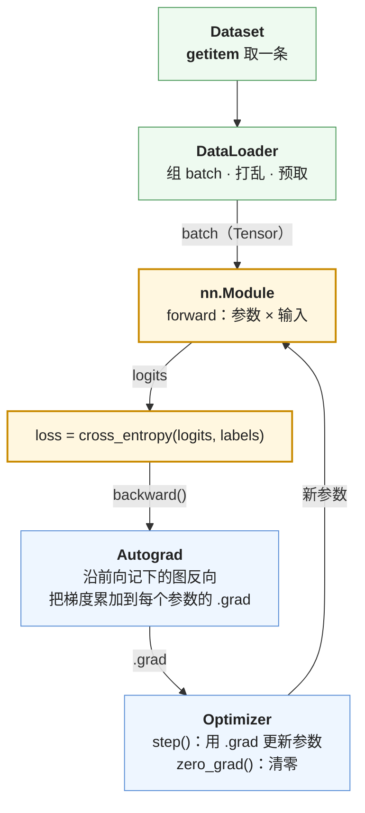
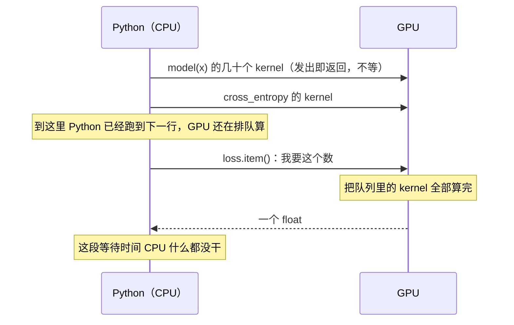
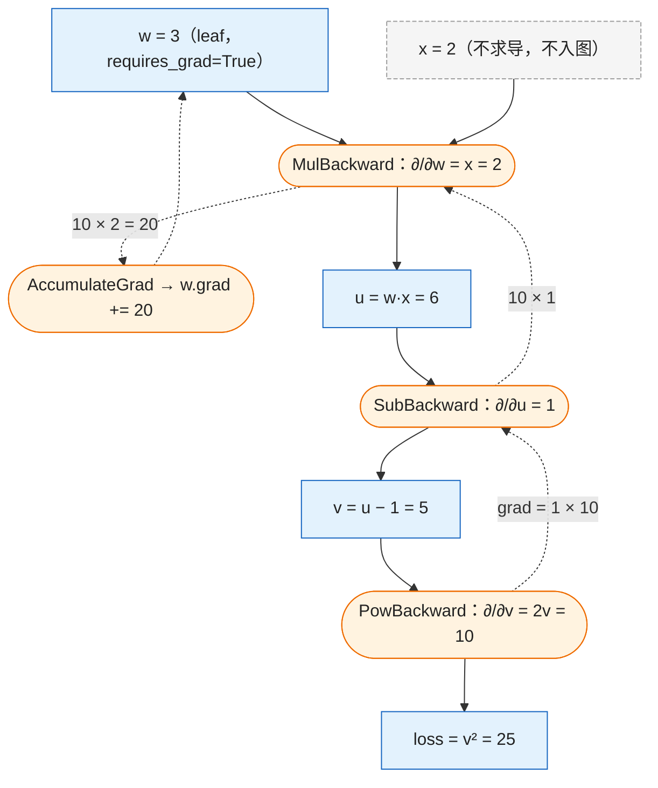
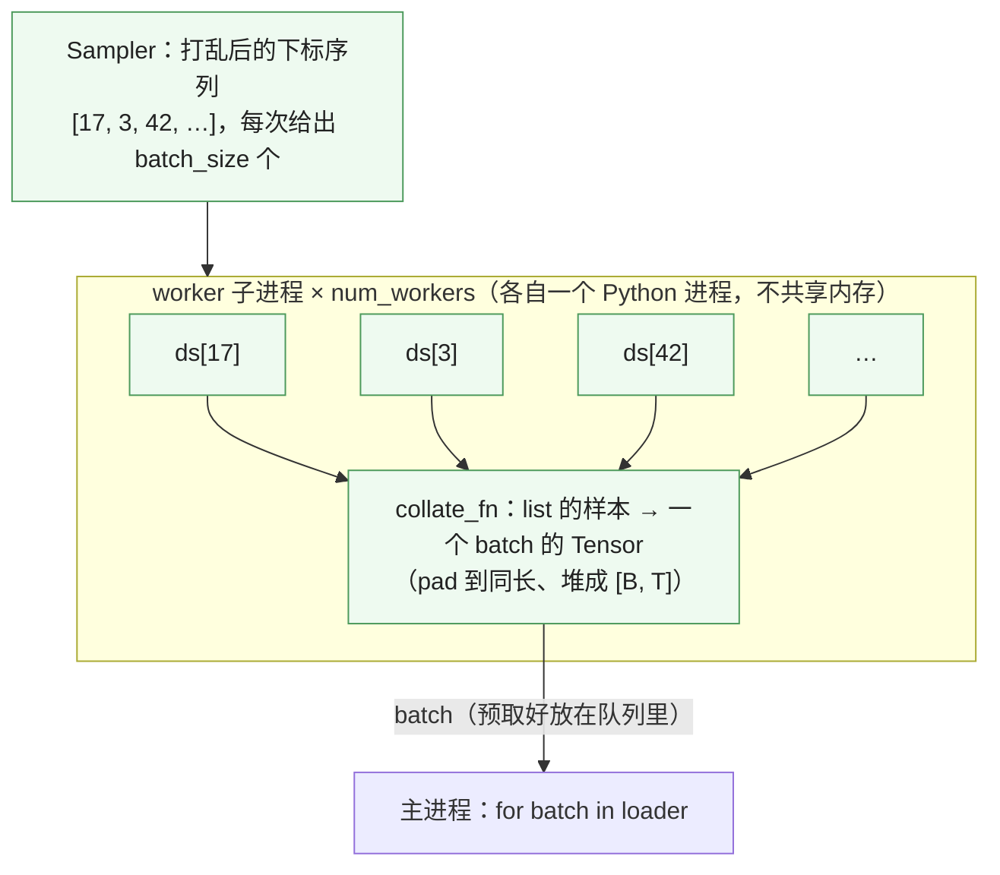

PyTorch 的使用层只需要掌握五个对象：

1. **`Tensor`**：数据与形状。上一篇的 ndarray 加上"在哪个设备上"和"要不要求导"。
2. **Autograd**：自动求导。前向时记下计算图，`backward()` 沿图反向算出每个参数的梯度。
3. **`nn.Module`**：参数的容器与前向逻辑。一个模型、一层、一个 MLP 都是它。
4. **`Dataset` / `DataLoader`**：取数与组 batch。前者定义"第 $$i$$ 条是什么"，后者负责打乱、拼 batch、多进程预取。
5. **`Optimizer`**：用梯度更新参数。`step()` 读每个参数的 `.grad` 做一次更新。

把它们拼起来就是一个训练循环，二十行。所有高层封装——`transformers` 的 `Trainer`、`trl` 的各个 Trainer、Lightning——做的都是这二十行加上日志、checkpoint、分布式。本篇把这二十行写出来，逐行解释每一行为什么在那里，并用它训一个字符级小 Transformer。全篇的核心问题是：

> **不用 `Trainer`，能不能从零写一个训练循环、在小数据集上训一个小 Transformer、并解释每一行为什么在那里？[^q0]**

## 一、总览

### 1. 本文的组织方式

先分别看五个对象各是什么、最小用法是什么（二到五章），再把它们拼成二十行训练循环并真的训一个模型（第六章）。顺序按数据在一步训练里流动的方向：数据先变成 Tensor，前向经过 Module，反向靠 Autograd，最后 Optimizer 改参数；`Dataset` / `DataLoader` 与 `Optimizer` 放在一章，因为它们只是"取数"和"更新"两个动作，各自都很短。本文的全部代码都在正文里，读完不需要打开别的文件。

### 2. 五个对象

| 对象 | 是什么 | 最小用法 |
|---|---|---|
| `Tensor` | ndarray + `device` + `requires_grad`（dtype 两者都有，Tensor 多了训练用的 bf16 / fp16 / fp8） | `x.to("cuda")`、`x.float()`、`x.shape` |
| Autograd | 前向记图 · `backward()` 累加到 `.grad` · `no_grad` 下不建图 | `loss.backward()`、`with torch.no_grad():` |
| `nn.Module` | 参数的容器（`parameters` / `state_dict`）+ 前向逻辑（`forward`） | 继承、写 `__init__` 与 `forward`、调用 `model(x)` |
| `Dataset` / `DataLoader` | `__getitem__` 取一条 · `DataLoader` 组 batch、打乱、多进程预取 | `for batch in DataLoader(ds, batch_size=32, shuffle=True)` |
| `Optimizer` | `step()` 用 `.grad` 更新参数 · `zero_grad()` 清零 · 学习率调度器 | `opt.step(); sched.step(); opt.zero_grad()` |

Table: PyTorch 的五个对象与最小用法

五个对象在一步训练里各站一个位置，数据沿着一个环流动——第六章的二十行代码就是把这个环写出来：



一步训练里五个对象的位置。绿色是数据怎么进来，黄色是前向算出 loss，蓝色是梯度怎么回去再改参数。Tensor 没有单独画：环上流动的每一样东西——batch、logits、loss、.grad、参数——都是 Tensor。

### 3. 本文的章节安排

| 章 | 主题 | 内容 |
|---|---|---|
| 二 | Tensor | 从 ndarray 到 Tensor：多了什么；`device`、`dtype`；原地操作；`.item()` 为什么会等 GPU |
| 三 | Autograd | 三件事：记图、累加、`no_grad`；一个手算例子与它的计算图 |
| 四 | nn.Module | `__init__` 与 `forward`；注册机制与 `ModuleList`；`state_dict` 里有什么；本文要训的小 Transformer |
| 五 | Dataset、DataLoader 与 Optimizer | 取数、组 batch 的流程图；`step` / `zero_grad`；调度器不是优化器 |
| 六 | 二十行训练循环，训一个小 Transformer | 代码、逐行解释、多出来的四样、跑起来的输出、与 `Trainer` 的关系 |
| 七 | 本文小结 | |
| 八 | 自测 | 五道题 |

Table: 本文的章节安排

## 二、Tensor

### 1. 从 ndarray 到 Tensor

上一篇的形状规则、轴、广播、reshape / transpose、einsum 在 Tensor 上**原样成立**（`torch.einsum` 的写法完全一样），dtype 的概念也一样。Tensor 多出来的是两件事：数据可以在 GPU 上，以及可以被求导。

```python
x = torch.zeros(32, 128, 4096, dtype=torch.bfloat16, device="cuda", requires_grad=False)
x.device          # 在哪：cpu / cuda:0 / mps
x.dtype           # 什么精度：float32 / bfloat16 / float16 / int8 …
x.requires_grad   # 要不要对它求导：参数 True，数据 False
```

1. **`device`**：数据在 CPU 内存还是 GPU 显存。两个 Tensor 运算必须在同一个 device 上，`RuntimeError: Expected all tensors to be on the same device` 是最常见的报错之一；`x.to("cuda")`、`model.to("cuda")` 搬过去。
2. **`dtype`**：ndarray 也有，但 NumPy 没有 `bfloat16` / `float16` 这些为训练设计的低精度类型，也没有 `int8` 量化推理的整套算子。训练用 `float32` 或 `bfloat16`，推理还可能 `int8`；`x.float()`、`x.to(torch.bfloat16)` 转换。第四篇讲 dtype 与显存、混合精度的关系。
3. **`requires_grad`**：Autograd 只跟踪它为 True 的 Tensor 及其下游。模型参数默认 True，输入数据默认 False。

### 2. 原地操作

带下划线的方法是**原地**（in-place）操作：`x.add_(1)` 改 `x` 自己，`x.add(1)` 返回新 Tensor。原地操作省显存但可能破坏 Autograd 需要保存的中间量——反向时要用前向的某个值，而它已经被原地改掉了，PyTorch 会报 `one of the variables needed for gradient computation has been modified by an inplace operation`。训练代码里一般只对不需要求导的东西用（比如 `opt.zero_grad()` 内部的清零、`clip_grad_norm_` 对 `.grad` 的缩放）。

### 3. `.item()` 会等 GPU

`loss.item()` 把一个单元素 Tensor 变成 Python 数字。它看起来只是取一个数，实际上是一次**同步**：



`.item()` 为什么慢。CPU 向 GPU 发 kernel 是异步的——发出去就返回，GPU 在后面排队算；`.item()` 要一个具体的数，只能停下来等队列清空。每步都 `.item()`，CPU 就每步都等 GPU 算完再发下一步的 kernel，两者从并行变成串行。所以第六章的循环每 10 步才 log 一次；要在 GPU 上累计 loss 用 Tensor 加（`total += loss.detach()`），最后再 `.item()` 一次。

## 三、Autograd

### 1. 三件事

Autograd 是 PyTorch 帮你算梯度（L0 第七篇）的机制。使用层只需要知道三件事：

1. **前向时记录计算图。** 对 `requires_grad=True` 的 Tensor 做的每个运算都被记下来（用了哪个函数、输入是谁），形成一张从参数到 loss 的图。下一小节画出这张图。
2. **`loss.backward()` 从 loss 反向走一遍图，把每个叶子参数的梯度累加到它的 `.grad` 里。** 是**累加**不是覆盖——连续两次 `backward()` 不 `zero_grad`，`.grad` 里是两次的和。所以每步更新前要 `opt.zero_grad()`。这个设计的副产品是**梯度累积**几乎不需要额外代码：想用 4 倍的有效 batch，就每 4 个 batch 才 `step` 和 `zero_grad` 一次——只有两处要留意：每个小 batch 的 loss 要除以累积步数（或按总 token 数归一化），否则梯度是 4 倍；梯度裁剪要放在累积完、`step` 之前，而不是每个小 batch 都裁。
3. **`torch.no_grad()` 下不建图。** 推理与评测必须加，否则每一步的中间量都被保存等待一个永远不会来的 `backward`，显存很快用光。`@torch.no_grad()` 装饰整个函数，或 `with torch.no_grad():` 包一段。

### 2. 一个手算的例子

```python
w = torch.tensor(3.0, requires_grad=True)
x = torch.tensor(2.0)
loss = (w * x - 1) ** 2        # (3·2 − 1)² = 25
loss.backward()
w.grad                          # 20
loss.backward()                 # 报错：图已释放。要再算得重新前向
```

前向时 Autograd 记下的图是这样的（矩形是 Tensor，圆角是记下的反向节点；实线是前向数据流，虚线是 `backward()` 走的路）：



`loss = (w·x − 1)²` 的计算图。前向从上往下算出 25，同时每个运算记下自己的反向节点；`backward()` 从 loss 沿虚线往回走，每经过一个节点乘上它的局部导数。

`w.grad = 20` 是链式法则（L0 第七篇）一步步乘出来的。把 $$L = (wx - 1)^2$$ 看成三层函数的复合：$$u = wx$$，$$v = u - 1$$，$$L = v^2$$。每一层对自己输入的导数：

$$
\frac{\partial L}{\partial v} = 2v = 2 \times 5 = 10,\qquad
\frac{\partial v}{\partial u} = 1,\qquad
\frac{\partial u}{\partial w} = x = 2
$$

链式法则说复合函数的导数是各层导数的乘积：

$$
\frac{\partial L}{\partial w} = \frac{\partial L}{\partial v} \cdot \frac{\partial v}{\partial u} \cdot \frac{\partial u}{\partial w} = 10 \times 1 \times 2 = 20
$$

图 3 虚线上的数字就是这三次相乘：从 loss 出发带着 1，过 `PowBackward` 乘 10，过 `SubBackward` 乘 1，过 `MulBackward` 乘 2，到 `w` 时是 20，`AccumulateGrad` 把它加进 `w.grad`。第二次 `backward` 报错是因为默认反向后释放图以省显存——每次前向建一张新图，这就是"动态图"的含义。Autograd 引擎怎么实现、每个算子的 backward 函数在哪，属于 Infra 03 系列第三篇。

## 四、nn.Module

### 1. 两个方法

`nn.Module` 是参数的容器加前向逻辑。写一个只需要两个方法：

```python
class MLP(nn.Module):
    def __init__(self, d, d_ff):
        super().__init__()                        # 必须：让 Module 的注册机制生效
        self.up = nn.Linear(d, d_ff)              # 子模块：赋值给 self 就自动注册
        self.down = nn.Linear(d_ff, d)
    def forward(self, x):                         # 只写前向；反向 Autograd 管
        return self.down(F.gelu(self.up(x)))
```

1. `__init__` 里赋给 `self` 的 `nn.Module` 或 `nn.Parameter` 会被**自动注册**——这就是 `super().__init__()` 必须调的原因，注册机制在父类里。
2. `forward` 只写前向，调用时写 `mlp(x)` 而不是 `mlp.forward(x)`（前者会触发 hook 等机制，第一篇第五章）。

### 2. 注册机制与 `ModuleList`

"自动注册"是怎么发生的：`nn.Module` 重写了 `__setattr__`（第一篇讲的协议方法之一）。执行 `self.up = nn.Linear(...)` 时，Python 调 `Module.__setattr__(self, "up", value)`，它检查 `value` 的类型——是 `nn.Module` 就记进 `self._modules["up"]`，是 `nn.Parameter` 就记进 `self._parameters`，其他类型才当普通属性存。`parameters()`、`state_dict()`、`.to("cuda")` 都是沿 `_modules` 递归下去收集的。

这解释了一个常见的坑：`self.layers = [nn.Linear(8, 8) for _ in range(3)]`——赋进来的 `value` 是一个 Python `list`，不是 `nn.Module`，`__setattr__` 把它当普通属性存下，里面三个 `Linear` 没有一个被注册。`model.parameters()` 里没有它们，优化器不会更新它们，`state_dict()` 里也没有它们，`.to("cuda")` 也搬不动它们。`nn.ModuleList` 就是一个"自己是 `nn.Module` 的 list"：`self.layers = nn.ModuleList([...])` 让注册机制看到一个 Module，再由它把里面的每一层注册成 `layers.0`、`layers.1`、`layers.2`。字典用 `nn.ModuleDict`，顺序执行的一串用 `nn.Sequential`。

### 3. 参数与状态

```python
list(model.parameters())        # 所有可训练参数的迭代器：交给 Optimizer
sum(p.numel() for p in model.parameters())   # 参数量
model.state_dict()              # {"up.weight": Tensor, "up.bias": ..., ...}：保存 / 加载用
model.load_state_dict(torch.load("ckpt.pt"))
model.train(); model.eval()     # 切换 dropout / BatchNorm 的行为
model.to("cuda")                # 所有参数搬到 GPU
```

`state_dict()` 返回一个有序字典 `OrderedDict[str, Tensor]`：**键是参数在模块树里的路径，值是参数的 Tensor**。用下一小节的小 Transformer打印出来的前几项：

```text
tok.weight                 torch.Size([128, 128])
pos.weight                 torch.Size([128, 128])
blocks.0.ln1.weight        torch.Size([128])
blocks.0.ln1.bias          torch.Size([128])
blocks.0.qkv.weight        torch.Size([384, 128])
blocks.0.proj.weight       torch.Size([128, 128])
blocks.0.ln2.weight        torch.Size([128])
blocks.0.ln2.bias          torch.Size([128])
blocks.0.mlp.0.weight      torch.Size([512, 128])
blocks.0.mlp.0.bias        torch.Size([512])
blocks.0.mlp.2.weight      torch.Size([128, 512])
blocks.0.mlp.2.bias        torch.Size([128])
blocks.1.ln1.weight        ...
```

关于它的四件事：

1. **键的名字来自注册**：`blocks.0.mlp.2.weight` 就是 `self.blocks[0].mlp[2].weight` 这条属性路径，`ModuleList` / `Sequential` 里的位置变成数字。加载一个 checkpoint 报 `Missing key(s)` / `Unexpected key(s)`，是两边的模块树不一样——名字对不上。
2. **里面有参数，也有 buffer**：`register_buffer` 注册的东西（BatchNorm 的 running mean、RoPE 的 cos/sin 表）不参与求导但属于模型状态，也在 `state_dict` 里；纯 Python 属性（`self.heads = 4`）不在。
3. **里面没有结构**：它只是"名字 → 数值"，不记录 `forward` 怎么写、层怎么连。所以加载前要先用同样的代码 `TinyGPT(cfg)` 建出一个空模型，再 `load_state_dict`——这也是为什么 Hugging Face 的模型目录里 `config.json`（结构）和 `*.safetensors`（`state_dict`）是分开的两个文件（第五篇）。
4. **checkpoint 就是它**：`torch.save(model.state_dict(), "ckpt.pt")` 存的就是这个字典（pickle 格式）；`safetensors` 是同一个字典的另一种磁盘格式，去掉了 pickle 的任意代码执行风险、支持只读某几个键。训练中断续跑还要存 `opt.state_dict()`（AdamW 的两个矩）和 `sched.state_dict()`。

### 4. 本文要训的模型

第六章要训的是一个 4 层、$$d = 128$$、4 头、序列长 128、词表 128（ASCII）的字符级 decoder-only Transformer，共 840,448 个参数。它是三层嵌套的 `nn.Module`：`TinyGPT` 包含一个 `nn.ModuleList` 的 4 个 `Block`，每个 `Block` 包含 `LayerNorm`、`Linear` 与一个 `nn.Sequential` 的 MLP。完整定义如下——每一行都是本章讲过的东西：

```python
@dataclass
class Config:
    vocab: int = 128; d: int = 128; heads: int = 4; layers: int = 4; seq: int = 128
    lr: float = 3e-4; batch: int = 32; steps: int = 1000; warmup: int = 50; seed: int = 0

class Block(nn.Module):
    def __init__(self, cfg):
        super().__init__()
        self.ln1 = nn.LayerNorm(cfg.d)
        self.qkv = nn.Linear(cfg.d, 3 * cfg.d, bias=False)       # 一次算出 Q、K、V
        self.proj = nn.Linear(cfg.d, cfg.d, bias=False)
        self.ln2 = nn.LayerNorm(cfg.d)
        self.mlp = nn.Sequential(nn.Linear(cfg.d, 4 * cfg.d), nn.GELU(), nn.Linear(4 * cfg.d, cfg.d))
        self.heads = cfg.heads                                     # 普通属性：不注册，不进 state_dict

    def forward(self, x):
        B, T, D = x.shape
        q, k, v = self.qkv(self.ln1(x)).split(D, dim=-1)
        q, k, v = (t.view(B, T, self.heads, D // self.heads).transpose(1, 2) for t in (q, k, v))   # 上一篇第四章的多头形状变换
        a = F.scaled_dot_product_attention(q, k, v, is_causal=True)            # 上一篇第五章手写的那 30 行
        x = x + self.proj(a.transpose(1, 2).reshape(B, T, D))                   # 残差
        return x + self.mlp(self.ln2(x))

class TinyGPT(nn.Module):
    def __init__(self, cfg):
        super().__init__()
        self.tok = nn.Embedding(cfg.vocab, cfg.d)                  # 字符 id → 向量
        self.pos = nn.Embedding(cfg.seq, cfg.d)                    # 位置 → 向量
        self.blocks = nn.ModuleList(Block(cfg) for _ in range(cfg.layers))   # 不能用 list
        self.ln = nn.LayerNorm(cfg.d)
        self.head = nn.Linear(cfg.d, cfg.vocab, bias=False)        # 向量 → 128 个 logits

    def forward(self, idx):                                        # idx: [B, T] 的字符 id
        B, T = idx.shape
        x = self.tok(idx) + self.pos(torch.arange(T, device=idx.device))
        for b in self.blocks:
            x = b(x)
        return self.head(self.ln(x))                               # logits [B, T, vocab]
```

L4 的 `modeling_llama.py` 是同样的结构放大版：`LlamaModel` → `LlamaDecoderLayer` → `LlamaAttention` / `LlamaMLP`，多了 RoPE、RMSNorm、GQA 与 SwiGLU，骨架一样。840,448 这个数怎么来的：`tok` 与 `pos` 各 $$128 \times 128 = 16{,}384$$；每个 Block 里 `qkv` $$128 \times 384 = 49{,}152$$、`proj` $$16{,}384$$、两个 LayerNorm 各 $$256$$、MLP $$128 \times 512 + 512 + 512 \times 128 + 128 = 131{,}712$$，合计 $$197{,}760$$，4 层 $$791{,}040$$；最后的 `ln` 256、`head` 16,384。加起来 $$16{,}384 \times 2 + 791{,}040 + 256 + 16{,}384 = 840{,}448$$。这是 L0 第一篇"从结构算参数量"的最小练习。

## 五、Dataset、DataLoader 与 Optimizer

### 1. 取数与组 batch

```python
class MyDataset(torch.utils.data.Dataset):
    def __len__(self): return len(self.items)
    def __getitem__(self, i): return self.items[i]         # 返回一条样本

loader = DataLoader(ds, batch_size=32, shuffle=True, num_workers=4, collate_fn=collate)
for batch in loader: ...
```

`Dataset` 只定义"第 $$i$$ 条是什么"，其余全是 `DataLoader` 的事。一个 batch 从哪来：



`DataLoader` 的一步。四个参数各对应图里一个环节：`shuffle=True` 决定 Sampler 给出的顺序；`batch_size` 决定每次取多少个下标；`collate_fn` 把 `batch_size` 个 `__getitem__` 的返回值拼成一个 batch 的 Tensor（默认实现只会 `torch.stack` 同形状的 Tensor，变长序列要自己写 pad）；`num_workers` 个子进程各自跑"取 + collate"，把做好的 batch 放进队列，主进程只管取。子进程各自是一个 Python 进程、不共享内存——这是第一篇第六章"多进程"的用法，也是 `num_workers=0` 时训练循环常被取数卡住的原因。

本文第六章的语料是一个长字符串，随机切 128 个字符的窗口，用一个 `get_batch` 函数就够了，没有用 `Dataset` + `DataLoader`（下面会给出它的代码）。真实项目里用后者：`datasets` 库（第五篇）返回的对象可以直接喂 `DataLoader`。

### 2. Optimizer 与调度器

```python
opt = torch.optim.AdamW(model.parameters(), lr=3e-4, weight_decay=0.1)    # 优化器：拿着全部参数
sched = torch.optim.lr_scheduler.LambdaLR(opt, lr_lambda)                # 调度器：拿着优化器，每步改它的 lr
opt.step()          # 用每个参数的 .grad 更新它
sched.step()        # 学习率走一步：opt.param_groups[0]["lr"] 变成新值
opt.zero_grad(set_to_none=True)
```

这里只有**一个**优化器。`sched` 不是第二个优化器，是一个**学习率调度器**（scheduler）：它不碰参数，只在每次 `sched.step()` 时按预定曲线算出新的学习率，写进 `opt.param_groups[i]["lr"]`——下一次 `opt.step()` 就用新值。两者的分工：`Optimizer` 决定"用梯度怎么改参数"（L0 第七篇：$$\theta \leftarrow \theta - \eta \nabla L$$；AdamW 多了两个矩，L3 第三篇讲；`weight_decay=0.1` 是 L0 第二篇的正则化项），调度器决定"这一步的 $$\eta$$ 是多少"。先 warmup 再 cosine 衰减是 LLM 训练的标配（L0 第七篇第六章）；本文用的曲线：

```python
def cosine_with_warmup(step, cfg):
    if step < cfg.warmup:
        return step / cfg.warmup                                   # 前 warmup 步：从 0 线性升到 1
    p = (step - cfg.warmup) / max(1, cfg.steps - cfg.warmup)       # 之后：cosine 从 1 降到 0.1
    return 0.1 + 0.9 * 0.5 * (1 + math.cos(math.pi * p))

sched = torch.optim.lr_scheduler.LambdaLR(opt, lambda s: cosine_with_warmup(s, cfg))   # lr = cfg.lr × 这个系数
```

## 六、二十行训练循环，训一个小 Transformer

### 1. 语料与取数

语料用 Python 标准库自带的 `.py` 源文件——任何装了 Python 的机器上都有，不用下载——拼成一个约 200 万字符的长字符串，非 ASCII 字符丢掉，每个字符就是一个 token（词表 128）。取一个 batch 就是随机切 32 个长 128 的窗口，目标是每个位置的下一个字符：

```python
def load_corpus(max_chars=2_000_000):
    stdlib = Path(sysconfig.get_paths()["stdlib"])                 # 标准库所在目录
    text = "".join(p.read_text(errors="ignore").encode("ascii", "ignore").decode()
                   for p in sorted(stdlib.glob("*.py")))[:max_chars]
    ids = torch.tensor([ord(c) for c in text], dtype=torch.long)   # 字符 → 0–127 的整数
    split = int(0.9 * len(ids))
    return ids[:split], ids[split:]                                # 训练 / 验证

def get_batch(data, cfg, gen):
    ix = torch.randint(len(data) - cfg.seq - 1, (cfg.batch,), generator=gen)   # 32 个随机起点
    x = torch.stack([data[i : i + cfg.seq] for i in ix])           # [B, T]：输入
    y = torch.stack([data[i + 1 : i + cfg.seq + 1] for i in ix])   # [B, T]：每个位置的下一个字符
    return x, y
```

### 2. 二十行

```python
cfg = Config()
torch.manual_seed(cfg.seed); gen = torch.Generator().manual_seed(cfg.seed)
train, val = load_corpus()
# !ref model
model = TinyGPT(cfg).to(DEV)
# !ref opt
opt = torch.optim.AdamW(model.parameters(), lr=cfg.lr, weight_decay=0.1)
# !ref sched
sched = torch.optim.lr_scheduler.LambdaLR(opt, lambda s: cosine_with_warmup(s, cfg))

for step in range(cfg.steps):
    # !ref batch
    x, y = get_batch(train, cfg, gen)
    # !ref to-dev
    x, y = x.to(DEV, non_blocking=True), y.to(DEV, non_blocking=True)
    # !ref autocast
    with torch.autocast(DEV, dtype=torch.bfloat16, enabled=DEV == "cuda"):
        # !ref forward
        logits = model(x)                       # [B, T, V]
        # !ref loss
        loss = F.cross_entropy(logits.view(-1, cfg.vocab).float(), y.view(-1))
    # !ref backward
    loss.backward()
    # !ref clip
    gnorm = torch.nn.utils.clip_grad_norm_(model.parameters(), 1.0)
    # !ref update
    opt.step(); sched.step(); opt.zero_grad(set_to_none=True)
    # !ref log +1
    if step % 100 == 0:
        print(f"step {step:4d}  loss {loss.item():.3f}  lr {sched.get_last_lr()[0]:.2e}  grad_norm {gnorm:.2f}")

# !ref eval +4
model.eval()
with torch.no_grad():
    x, y = get_batch(val, Config(batch=64), gen)
    val_loss = F.cross_entropy(model(x).view(-1, cfg.vocab), y.view(-1)).item()
print(f"验证 loss {val_loss:.3f}  (PPL {math.exp(val_loss):.1f})")
```

用真实数据（SFT）时[取 batch 那一行](#batch)换成 `for step, batch in enumerate(loader)`，[算 loss 那一行](#loss)多一个 `ignore_index=-100`——下面的逐行解释里一起讲。

### 3. 逐行解释

下面每条开头的代码就是上面的某一行：悬停它，那一行会亮起；点击跳过去。反过来，代码左侧蓝色的行号悬停就能看到对应的解释。

- [`TinyGPT(cfg).to(DEV)`](#model)：建模型并把全部参数搬到 GPU（第二章的 `device`；`DEV = "cuda" if torch.cuda.is_available() else "cpu"`）。
- [`AdamW(model.parameters(), ...)`](#opt)：优化器拿到全部可训练参数的引用；`weight_decay=0.1` 是 L0 第二篇的正则化。
- [`LambdaLR(opt, ...)`](#sched)：调度器拿到优化器，每步按 warmup + cosine 改它的学习率（第五章第 2 节）。
- [`get_batch(train, cfg, gen)`](#batch)：取一个 batch，`x` 是 `[32, 128]` 的字符 id，`y` 是每个位置的下一个字符。真实项目里这一行是 `for step, batch in enumerate(loader)`（第五章第 1 节）。
- [`.to(DEV, non_blocking=True)`](#to-dev)：数据搬到 GPU，`non_blocking=True` 让拷贝与前一步的计算重叠（第二章）。
- [`torch.autocast(..., bfloat16)`](#autocast)：这段里的矩阵乘在 bf16 上跑、reduction 留 fp32——混合精度，第四篇讲；数值格式在 L4 第六篇。`enabled=DEV == "cuda"` 是因为 CPU 没有 bf16 硬件路径，开了慢 30 倍（第 6 节）。
- [`model(x)`](#forward)：前向，走 `__call__` → `forward`（第四章），得到 `[B, T, V]` 的 logits。
- [`cross_entropy(logits.view(-1, V).float(), y.view(-1))`](#loss)：三个细节。`view(-1, V)` 把 `[B, T, V]` 展平成 `[B·T, V]`，因为 `cross_entropy` 要二维输入（上一篇的 reshape）；`.float()` 让 softmax + log 在 fp32 上算，避免 bf16 下溢出和精度损失（L0 第五篇：softmax 的数值）；SFT 时还要加 `ignore_index=-100`——labels 里**你自己标成** −100 的位置不算 loss，这就是 **SFT 的 loss mask**（L0 第五篇第四章）。注意 `ignore_index` 只是"跳过值为 −100 的位置"，它不知道哪些是 prompt、哪些是 padding：把 prompt 与 padding 写成 −100 是数据处理（collator / 模板）那一步的事，这一行只负责跳过。还有 labels 与 logits 的**错位**：位置 $$t$$ 的 logits 预测的是 $$x_{t+1}$$，所以要么 labels 整体左移一位（HF 的 `labels=input_ids` 是模型内部帮你 shift），要么自己 `logits[:, :-1]` 对 `labels[:, 1:]`——上面的玩具循环里 `x`、`y` 已经是错开一位取的。`cross_entropy` 算的就是 L0 第五篇的每 token 负对数似然：内部做 log-softmax，取真实 label 那一位取负，对所有非 −100 的位置平均。
- [`loss.backward()`](#backward)：反向传播，梯度累加到每个参数的 `.grad`（第三章第二件事；L0 第七篇链式法则）。
- [`clip_grad_norm_(..., 1.0)`](#clip)：算所有梯度拼起来的总范数，超过 1.0 就整体缩放到 1.0——**梯度裁剪**，防 loss spike（L3 第三篇）。返回值是裁剪前的范数，值得打出来看。
- [`opt.step(); sched.step(); opt.zero_grad(set_to_none=True)`](#update)：三件事一行。`opt.step()`——AdamW 用 `.grad` 更新参数（L3 第三篇）；`sched.step()`——学习率按曲线走一步（L0 第七篇第六章）；`opt.zero_grad(set_to_none=True)`——清梯度，置 `None` 而不是填 0，省一次显存写。清零放在 `step` 之后而不是 `backward` 之前，是为了让第三章说的梯度累积只改这一行的位置就能实现。
- [`if step % 100 == 0: print(...)`](#log)：每 100 步才 `loss.item()`——它会同步 GPU（第二章第 3 节），别每步做。
- [评估那五行](#eval)：`model.eval()` 切换 dropout / BatchNorm 的行为（本模型没有，写上是习惯），`torch.no_grad()` 不建图（第三章第三件事），验证集上算一次 loss，`exp` 一下就是 [PPL](# "tip: perplexity，困惑度 = exp(每 token 交叉熵)。直觉是模型每步在多少个候选里犹豫：PPL 128 等于在 128 个字符里均匀乱猜，PPL 9.6 是在不到 10 个里犹豫；L0 第六篇")。

### 4. 多出来的四样

它比教程里常见的循环长。教程的最小版只有五行——前向、算 loss、`backward`、`step`、`zero_grad`——那是[第一章](#一总览)那个环的骨架，能跑 MNIST。多出来的四样是 LLM 训练的标配，每一样都对应一种不加就会遇到的故障：

1. **[`autocast`](#autocast)。** 不开，所有矩阵乘在 fp32 上跑：显存里的激活是 bf16 的两倍，Tensor Core 的 bf16 吞吐也用不上，同一张卡上速度与能放的 batch 都差一倍多。只对 GPU 成立——CPU 上开它是纯开销。
2. **[`.float()` 与 `ignore_index`](#loss)。** 不加 `.float()`，softmax 在 bf16 上算：bf16 只有 8 位尾数，几万个 logits 里 `exp` 之后求和会丢掉小项，loss 从第一步起就带着系统误差，训到后期梯度不准。不加 `ignore_index=-100`（且 labels 里没把 prompt / padding 标成 −100），SFT 数据里的 prompt 也被当成学习目标——模型花一半算力去学"复述问题"，而且 padding 位置的 loss 会把平均值拉偏。
3. **[`clip_grad_norm_`](#clip)。** 不裁，某一个 batch 里的坏样本产生一个特别大的梯度，一步就把参数推到很远的地方，loss 冲上去，之后可能回不来——这就是 loss spike。裁剪把这一步的总范数压回 1.0，参数只往那个方向走一小步。
4. **学习率调度（[建调度器](#sched)、[每步 `sched.step()`](#update)）。** 不 warmup，第一步就用 $$3 \times 10^{-4}$$：AdamW 的二阶矩估计在前几步还没稳定，实际步长可能比设定大很多倍，前几步就发散（L3 第三篇讲 Adam 为什么需要 warmup）；不衰减，后期学习率太大，loss 在最优点附近来回抖、收不下去。

所以**这二十行是正常的、也是够用的**：真实训练代码只会在它外面再包日志、评估、checkpoint 与分布式，不会在里面再多什么——那层外壳就是第 7 节的 `Trainer`。

### 5. 跑起来

在 CPU 上跑 1000 步约一分钟：

```text
语料: 1,800,000 训练字符, 200,000 验证字符; 词表 128; 初始 loss 应约 ln V = 4.85
模型: 4 层, d=128, 840,448 参数
step    0  loss 5.065  lr 6.00e-06  grad_norm 2.01    0.1s
step  100  loss 2.720  lr 2.98e-04  grad_norm 0.34    5.1s
step  200  loss 2.447  lr 2.84e-04  grad_norm 0.31   10.5s
step  300  loss 2.287  lr 2.56e-04  grad_norm 0.31   16.2s
step  500  loss 2.330  lr 1.76e-04  grad_norm 0.56   27.4s
step  800  loss 2.190  lr 5.82e-05  grad_norm 0.35   43.1s
step  999  loss 2.022  lr 3.00e-05  grad_norm 0.31   53.6s
验证 loss 2.261  (PPL 9.6)
采样(温度 0.8): 'def ovates the iord undsthians idul t flilen re ones arigsinepr of t t fibjeale tt b'
```

三件事对上了 L0：

1. **第一步 loss 5.07 ≈ $$\ln 128 = 4.85$$**：随机初始化的模型接近均匀分布（L0 第五篇的 sanity check）。略高于 4.85 是因为初始 logits 不完全为零。
2. **PPL 从 128 降到 9.6**：一分钟之后模型每步"在不到 10 个字符里犹豫"（L0 第六篇）。采样出来的文本已经有 `def`、空格、换行的结构，单词还是胡编的——84 万参数、一分钟能到的程度。
3. **grad_norm 在 0.3 上下，没有触发裁剪**（阈值 1.0）；第一步 2.0 是正常的——初始化后梯度大。lr 一列能看到 warmup（前 50 步从 0 升到 $$3 \times 10^{-4}$$）与 cosine 衰减（到 $$3 \times 10^{-5}$$）。

### 6. 一个 CPU 上的陷阱

[`autocast` 那一行](#autocast)的 `enabled=DEV == "cuda"` 不是可有可无的：在 CPU 上开着 bf16 autocast 训，一步 1.4 秒；关掉是 0.05 秒——**慢 30 倍**。原因是 CPU 没有 bf16 的硬件路径，PyTorch 用软件模拟。混合精度的收益完全来自硬件（GPU 的 Tensor Core），没有硬件时它只是开销。第四篇讲它在 GPU 上为什么快、省多少显存。

### 7. 与 `Trainer` 的关系

`transformers.Trainer`、`trl.SFTTrainer` 做的是同样的事，对应到上面的代码：`compute_loss` 是[前向](#forward) + [算 loss](#loss)两行，`training_step` 是[反向](#backward)、[裁剪](#clip)、[更新与清零](#update)三行，`autocast` 由 `TrainingArguments(bf16=True)` 打开，学习率曲线由 `lr_scheduler_type` 与 `warmup_steps` 决定，外面再包上日志、评估、checkpoint 与分布式。它们的行为不符合预期时——loss 不降、显存爆、学习率不对——回到这二十行想"它在第几行做了和我不一样的事"，然后去读它的源码（第五篇给入口）。

## 七、本文小结

- PyTorch 使用层是**五个对象**：Tensor（ndarray + device + requires_grad）、Autograd、`nn.Module`、`Dataset` / `DataLoader`、`Optimizer`。上一篇的形状规则在 Tensor 上原样成立。
- **Autograd 三件事**：前向记图；`backward()` 把梯度**累加**到 `.grad`（所以要 `zero_grad`，也因此梯度累积不需要额外代码）；`no_grad` 下不建图（推理评测必加）。默认反向后释放图，每次前向建新图。`w.grad = 20` 是链式法则三个局部导数 $$10 \times 1 \times 2$$ 的乘积。
- **`nn.Module`**：`__setattr__` 把赋给 `self` 的 Module / Parameter 注册进 `_modules` / `_parameters`（`super().__init__()` 必须调；Python list 不注册，要用 `ModuleList`），`forward` 只写前向；`state_dict()` 是"属性路径 → Tensor"的有序字典，含参数与 buffer、不含结构，checkpoint 就是它。
- **`DataLoader`**：Sampler 出下标 → worker 子进程 `__getitem__` + `collate_fn` → 队列 → 主进程；**`Optimizer.step()`** 用 `.grad` 更新，调度器不是第二个优化器，只负责每步改 `param_groups[i]["lr"]`。
- **二十行训练循环**的每一行都对应一个概念：`autocast` 是混合精度、`.float()` 是 softmax 的数值、`ignore_index=-100` 是 SFT 的 loss mask、`clip_grad_norm_` 是梯度裁剪、`set_to_none=True` 省一次显存写、`.item()` 会同步别每步做。多出来的四样各防一种故障。`Trainer` 做的是同一件事加日志 / checkpoint / 分布式。
- 84 万参数的字符级 Transformer，CPU 一分钟：第一步 loss 5.07 ≈ $$\ln 128$$，PPL 128 → 9.6。CPU 上开 bf16 autocast 慢 30 倍——混合精度的收益全来自硬件。

配套代码：本文的模型、语料与训练循环完整可运行的版本在 [`algorithm-tooling/02_train_loop.py`](https://github.com/arganzheng/ai-learning-labs/blob/main/algorithm-tooling/02_train_loop.py) 与 [`tinygpt.py`](https://github.com/arganzheng/ai-learning-labs/blob/main/algorithm-tooling/tinygpt.py)（`python 02_train_loop.py`，CPU 约一分钟；`--quick` 跑 100 步）。正文已包含全部代码，想复现数字或改着玩时去拉它。

## 八、自测

1. 连续调两次 `loss.backward()`（中间重新前向）而不 `zero_grad`，`.grad` 里是什么？这在什么场景下是有意为之？

   <details markdown="1"><summary>答案</summary>

   两次梯度的和；梯度累积——用小 batch 模拟大 batch。

   </details>

2. 为什么评测时要 `torch.no_grad()`？不加会怎样？

   <details markdown="1"><summary>答案</summary>

   不建图省显存与时间；不加则每步保存中间量、显存持续增长直到 OOM。

   </details>

3. 一个 `nn.Module` 的 `__init__` 里写 `self.layers = [nn.Linear(8, 8) for _ in range(3)]`，`model.parameters()` 会包含它们吗？该怎么写？

   <details markdown="1"><summary>答案</summary>

   不会：`__setattr__` 收到的是一个 Python list，不是 Module，当普通属性存了；用 `nn.ModuleList`。

   </details>

4. `cross_entropy(logits.view(-1, V).float(), labels.view(-1), ignore_index=-100)`：三个细节各在做什么？

   <details markdown="1"><summary>答案</summary>

   `view(-1, V)` 展平成二维；`.float()` 在 fp32 上算 softmax；`ignore_index=-100` 是 loss mask。

   </details>

5. 训练循环的第一步 loss 是 12.3，模型词表 32000，可能出了什么问题？

   <details markdown="1"><summary>答案</summary>

   $$\ln 32000 = 10.4$$，12.3 明显偏高——初始 logits 太大，检查输出层初始化。

   </details>

下一篇讲这个训练循环要多少资源：混合精度在 GPU 上为什么快、显存的账（每参数 16 字节）、激活与 checkpointing、以及多卡怎么启用。

[^q0]: **能**。五个对象各站一个位置：`Dataset` / `DataLoader` 取数组 batch，`nn.Module` 前向算 logits，`cross_entropy` 算 loss，Autograd 反向把梯度累加到 `.grad`，`Optimizer.step()` 更新参数（[第一章](#一总览)的环，[第二](#二tensor)至[五章](#五datasetdataloader-与-optimizer)逐个展开）。二十行里每一行都对应一个概念：`autocast` 是混合精度、`.float()` 是 softmax 的数值、`ignore_index=-100` 是 SFT 的 loss mask、`clip_grad_norm_` 是梯度裁剪、`zero_grad(set_to_none=True)` 是 Autograd 的累加语义、`.item()` 每 100 步一次是避免同步。84 万参数的字符级 Transformer 在 CPU 上一分钟从 PPL 128 到 9.6，第一步 loss 5.07 $$\approx \ln 128$$ 是 L0 第五篇那个检查（[第六章](#六二十行训练循环训一个小-transformer)）。
