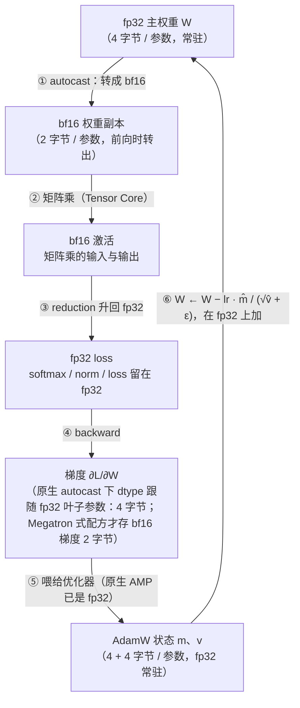

上一篇的二十行训练循环写出来之后，第一个撞上的问题几乎总是 `CUDA out of memory`。这一篇把"跑得动跑不动"从试出来变成算出来：训练时每个参数在显存里有几份东西、各多少字节；激活为什么与参数量无关却可能是大头；混合精度省的是哪一块；LoRA 为什么能把 128 GB 变成 17 GB；一张卡放不下时 DDP 与 FSDP 各做了什么。这是 L5 里"全量还是 LoRA、几张卡"这个决策的第一道约束，先于任何效果上的考虑。

全篇的核心问题是：

> **能不能算出一个 8B 模型全量微调要多少显存、为什么 LoRA 能放进一张卡？[^q0] OOM 的时候知道看哪一块？[^q1]**

## 一、总览

### 1. 一张账

```text
每个可训练参数         bf16 权重 2 + bf16 梯度 2 + fp32 主权重 4 + AdamW 一阶矩 4 + 二阶矩 4 = 16 字节（Megatron 式配方；原生 autocast 是 fp32 参数 + fp32 梯度 + 8，也约 16）
Llama-3-8B 全量        8.03 B × 16 = 128.5 GB        一张 80 GB 的卡放不下
LoRA r=16              冻结 bf16 16.1 GB + 41.9 M × 16 = 0.67 GB = 16.7 GB    一张卡绰绰有余
QLoRA                  4-bit 基座 4.4 GB + 0.67 GB ≈ 5.1 GB                   消费级显卡
激活（账外的一块）      与参数量无关；B=1, T=4096 时 32 层约 16.5 GiB；B=8 时 132 GiB —— checkpointing 换掉
```

### 2. 本文的章节安排

| 章 | 主题 | 内容 |
|---|---|---|
| 二 | 混合精度 | `autocast` 做了什么；bf16 vs fp16；为什么主权重仍是 fp32 |
| 三 | 显存的账 | 16 字节 / 参数从哪来；全量 / LoRA / QLoRA 三种方案 |
| 四 | 激活：账外的一块 | 不按参数算的那一块：与什么成正比、多大、gradient checkpointing 怎么换 |
| 五 | OOM 归因 | 先问落在哪一块 |
| 六 | 多卡启用即可 | DDP、FSDP、`torchrun`；更大的并行属于预训练规模 |
| 七 | 算的与量的 | `max_memory_allocated` 对账 |
| 八 | 本文小结 | |
| 九 | 自测 | 五道题 |

配套脚本：[`03_memory_ledger.py`](https://github.com/arganzheng/ai-learning-labs/blob/main/algorithm-tooling/03_memory_ledger.py)。

## 二、混合精度

### 1. `autocast` 做了什么

```python
with torch.autocast("cuda", dtype=torch.bfloat16):
    logits = model(x)
    loss = F.cross_entropy(logits.float(), y)
```

在这个上下文里，PyTorch 按一张内置的表决定每个算子用什么精度：**矩阵乘法、卷积**在 bf16 上跑（输入自动转成 bf16）；**reduction 类**——softmax、LayerNorm、loss、求和——留在 fp32。前者是计算与显存的大头，bf16 让它快一倍多、中间结果的显存减半；后者对精度敏感，多几个数在 fp32 上算不费什么。

脚本量了一下：

```text
autocast 下: Linear 输出 torch.bfloat16, .float() 后 softmax torch.float32; 权重本身仍是 torch.float32（主副本不变）
```

最后半句是关键：**`autocast` 不改变参数的存储精度**。参数本体仍是 fp32（或你加载时指定的 dtype），前向时临时转成 bf16 参与矩阵乘。优化器更新的是那份 fp32 的"主权重"（master weights）。一步训练里数据在两种精度之间怎么走，画出来是这样——每个方框就是显存里的一份东西，括号里是每个参数占的字节数：



图里 ⑥ 那一步为什么必须在 fp32 上做：bf16 只有 7 位尾数（约 3 位十进制有效数字），学习率 $$10^{-5}$$ 乘梯度得到的更新量加到一个 bf16 权重上常常**被吞掉**——$$1.0 + 10^{-5}$$ 在 bf16 里还是 $$1.0$$，训练看起来在跑、权重却一动不动。所以结论是：**bf16 算（① ② ④），fp32 存（W、m、v）**。图上五个带字节数的方框就是下一章"16 字节 / 参数"那张账的来源——但要说清是**哪种配方**：原生 `autocast` 下参数是 fp32 叶子，bf16 副本是前向时临时转出的、梯度也回到 fp32（4 + 4 + 4 + 4，外加临时的 bf16 副本），本地验证 `p.grad.dtype == torch.float32`；"2 + 2 + 4 + 4 + 4 = 16"是 Megatron / DeepSpeed 那种**常驻 bf16 权重与 bf16 梯度 + fp32 主权重**的配方。两种加起来都在 16 字节上下，但方框对应的东西不同，读到那里可以翻回来对。L4《Transformer 与 LLM》第六篇会再讲数值格式的位布局与这个吞掉现象的边界。

### 2. bf16 与 fp16

两种 16 位格式的差别只在把 16 位怎么分给指数和尾数：

```text
            符号  指数（决定范围）        尾数（决定精度）
fp32        1    8 位  ┌────────┐       23 位 ┌───────────────────────┐
bf16        1    8 位  ┌────────┐        7 位 ┌───────┐                   ← 砍尾数，保范围
fp16        1    5 位  ┌─────┐          10 位 ┌──────────┐                ← 砍指数，保精度
```

| 格式 | 最大值 | 有效十进制位 | 后果 |
|---|---|---|---|
| fp32 | $$3.4 \times 10^{38}$$ | 约 7 | 基准 |
| bf16 | $$3.4 \times 10^{38}$$（与 fp32 相同） | 约 3 | 训练里的数几乎碰不到上限（不是"不会溢出"——$$10^{20}$$ 的平方照样 inf）；精度低，所以主权重不能用它存（上一节） |
| fp16 | 65504 | 约 4 | 范围窄：梯度容易下溢成 0 或上溢成 inf，要靠 **loss scaling** 兜底 |

**loss scaling**（`GradScaler`）是给 fp16 打的补丁：把 loss 乘一个大数（如 $$2^{16}$$）再反向，让小梯度不下溢，更新前再除回去；遇到 inf 就跳过这一步并把倍数减半。bf16 与 fp32 同指数位，不需要这一套。当前 LLM 训练基本用 bf16，`GradScaler` 只在没有原生 bf16 的老硬件（V100 及更早——bf16 Tensor Core 从 Ampere / A100 开始）上遇到。

> **注意**：混合精度的全部收益来自硬件对 bf16 矩阵乘的专门支持。普通笔记本 / 桌面 CPU 没有这条路径，`autocast` 在 CPU 上反而慢 30 倍（上一篇末尾的陷阱）；带 AVX-512 BF16 / AMX 的服务器 Xeon（Cooper Lake、Sapphire Rapids 起）是例外，PyTorch 的 CPU autocast 就是为它们准备的。

## 三、显存的账

### 1. 16 字节 / 参数

把第二章那张图里五个带字节数的方框抄下来加一遍，就是训练时每个**可训练**参数在显存里占的字节：

| 显存里的一份 | 图中的位置 | 精度 | 字节 / 参数 |
|---|---|---|---|
| 权重副本（前向用） | 方框 ①→② | bf16 | 2 |
| 梯度 | 方框 ④ | bf16 | 2 |
| 主权重 W | 顶部常驻 | fp32 | 4 |
| AdamW 一阶矩 m | 底部常驻 | fp32 | 4 |
| AdamW 二阶矩 v | 底部常驻 | fp32 | 4 |
| **合计** | | | **16** |

前两份是混合精度的工作副本，后三份是优化器需要的状态（AdamW 的两个矩是 L3 第三篇的内容，这里只需要知道它们各是一份与参数同形的 fp32 张量）。如果用 SGD 没有矩，就是 8 字节；用 8-bit 优化器把两个矩量化，约 10 字节；但 LLM 训练的标配是 AdamW，按 16 算。这五份有一个共同点：**都随参数量伸缩**——参数翻倍，它们一起翻倍。第四章的激活不满足这一点，所以要单独记一笔。

### 2. 三种方案

代入 Llama-3-8B（8.03B 参数，L0 第一篇算的）与 L0 第三篇算的 $$r = 16$$ LoRA（41.9M 可训练参数）：

```text
方案                                    冻结/权重      训练状态       合计
全量微调 (bf16 + AdamW)                  —            128.5 GB     128.5 GB    ← 8.03 B × 16
LoRA r=16 (冻结 bf16 基座)               16.1 GB       0.67 GB      16.7 GB    ← 8.03 B × 2 + 41.9 M × 16
QLoRA (4-bit 基座 ≈ 0.5 B/参数 + 常数)    4.4 GB        0.67 GB       5.1 GB
```

读它：

- **全量微调**：每个参数 16 字节，128.5 GB，还没算激活。一张 80 GB 的 H100 放不下；至少两张卡并用 FSDP 把状态切开（第六章）。
- **LoRA**：基座冻结，不需要梯度与优化器状态，只留一份 bf16 权重（2 字节 / 参数 = 16.1 GB）；可训练的只有 41.9M 个 LoRA 参数，它们的 16 字节合计 0.67 GB。**一张卡绰绰有余。** 这就是 LoRA 在工程上流行的原因——L0 第三篇讲了它的数学，这里是它省下的每一个字节。
- **QLoRA**：基座再量化到 4 bit（约 0.5 字节 / 参数，加上量化常数略多），4.4 GB；LoRA 部分不变。消费级 24 GB 显卡能跑。代价是每次前向要把 4-bit 权重反量化成 bf16 参与矩阵乘，慢一些；量化本身在 L6 系列。

结论一眼可见，而且**先于任何效果上的考虑**：不是"LoRA 效果够不够好"，而是"不用 LoRA 你有几张卡"。

### 3. 推理只有一份

推理时没有梯度、没有优化器状态、不需要 fp32 主权重——只有一份权重：bf16 2 字节 / 参数（8B 模型 16 GB），量化后 1 或 0.5 字节。所以同一个模型，训练的显存是推理的 8 倍。

## 四、激活：账外的一块

### 1. 与什么成正比

第三章的 16 字节全是"每个参数多少字节"，随参数量伸缩。显存里还有一类东西不按参数算——**激活**（activation）：前向传播每一层的中间结果。反向传播需要它们来算梯度（L0 第七篇：$$\partial L / \partial W$$ 需要该层的输入），所以前向时必须保存到反向结束。它的大小**与参数量无关**，与 **batch × 序列长度 × 层数 × 隐藏维度**成正比——同一个模型，batch 翻倍它翻倍，参数账一个字节不变。

```text
显存 = ┌── 按参数算的（第三章）──────────────────┐ + ┌── 按 B × T 算的（本章）──┐
       │ 权重 2 + 梯度 2 + 主权重 4 + m 4 + v 4  │   │ 激活                     │
       └── 随参数量伸缩 ─────────────────────────┘   └── 随 batch、序列长度伸缩 ─┘
```

### 2. 多大

Llama-3-8B，$$B = 1$$、$$T = 4096$$：

```text
残差流一份 (B × T × d × 2 字节)：       4096 × 4096 × 2 = 32 MiB/层，32 层 1.0 GiB
反向要保存的主要中间量（每层约 6 份 d 维 + 3 份 d_ff 维，bf16）：约 528 MiB/层，32 层 16.5 GiB   ← 比参数的 16 GB 都大
B = 8 时 ×8：                            132 GiB
```

第二行是粗估（attention 的输入、$$q, k, v$$、attention 输出、MLP 输入、gate 与 up 的 14336 维中间量、激活函数的输入……每一项都是 $$B \times T \times (\text{d 或 } d_{ff})$$ 个 bf16），精确的公式与每一项的来源在 Infra 07 系列第一篇。量级是要记住的：**长序列、大 batch 下，激活是显存的大头，可以比参数与优化器状态加起来还大。**

### 3. gradient checkpointing

**激活重算**（gradient checkpointing / activation recomputation）：前向时只保存每层的**输入**（上面第一行的 1 GiB），丢掉中间量；反向到某一层时，用保存的输入重新前向一遍这一层，拿到中间量再算梯度。代价是多做一次前向——约 30% 的额外计算（L3 第一篇算：前向 1 份、反向 2 份，重算多 1 份，$$4/3$$）。换来的是激活从 16.5 GiB 降到 1 GiB。

```python
model.gradient_checkpointing_enable()          # Hugging Face 模型一行开启
# 或 torch.utils.checkpoint.checkpoint(block, x)  # 自己的模型逐块包
```

长序列微调几乎总是开着它。

## 五、OOM 归因

一个 `CUDA out of memory`，先问它落在哪一块：

| 现象 | 落在哪 | 怎么办 |
|---|---|---|
| 模型刚加载就 OOM | 权重本身 | 换 bf16 / 量化 / 更多卡 |
| 加了优化器、第一步 `backward` 后 OOM | 梯度 + 优化器状态（14 字节 / 可训练参数） | LoRA 减可训练参数；FSDP 切状态；8-bit 优化器 |
| 参数没变、batch 没变、序列变长了就 OOM | 激活 | gradient checkpointing；减 batch；缩短序列 |
| 加了 LoRA 还是 OOM | 不是参数的问题——看激活 | 同上 |
| 评测 / 生成时 OOM | 忘了 `no_grad`；或 KV cache（第六篇） | 加 `no_grad`；减并发 |
| 显存"够"却 OOM，报错里 reserved 远大于 allocated | 碎片 | `PYTORCH_CUDA_ALLOC_CONF=expandable_segments:True`；`empty_cache` |

这张表加上第三章的账，能解释绝大多数 OOM。第六篇把"显存的四块"（权重、梯度与状态、激活、KV cache）放到推理场景里再讲一遍。

## 六、多卡启用即可

### 1. DDP：每卡一份完整模型

**DistributedDataParallel**：每张卡一份完整的模型与优化器状态，各算自己那份 batch 的梯度，`backward` 结束时用 all-reduce 把梯度平均，然后各自 `step`——数学上等价于一个 8 倍大的 batch。

```bash
torchrun --nproc_per_node=8 train.py
```

```python
dist.init_process_group("nccl")
model = DistributedDataParallel(model.to(local_rank), device_ids=[local_rank])
sampler = DistributedSampler(ds)          # 让每张卡拿到不同的数据
```

每张卡是一个独立的 Python **进程**（`rank`），进程间不共享内存，只通过集合通信交换梯度。前提是**模型加状态能放进一张卡**——按第三章的账，8B 全量微调不行，8B LoRA 可以。

### 2. FSDP：切开

**FullyShardedDataParallel**：把参数、梯度、优化器状态**切成 8 份**分到各卡，前向 / 反向到某一层时临时 all-gather 那一层的完整参数，用完即丢。8 张 80 GB 卡上，128.5 GB 的训练状态切成每卡 16 GB，全量微调 8B 就放得下了。代价是通信：前向每层一次 all-gather，反向再一次 all-gather（除非 `reshard_after_forward=False` 留着不放）加一次 reduce-scatter 梯度。

```python
model = FullyShardedDataParallel(model, ...)   # 或 accelerate / trl 的配置文件一行切换
```

### 3. 更大的并行

张量并行、流水线并行、专家并行——把**单层**切到多卡、把**不同层**放到不同卡、把 MoE 的专家分到不同卡——是预训练规模（几百到几千卡）才需要的，由 Megatron、DeepSpeed、torchtitan 一类框架提供。算法工程师知道它们各切什么、对 batch 与学习率有什么影响即可。DDP / FSDP 的通信内部（bucket、overlap、`ProcessGroupNCCL`）在 Infra 03 系列第九篇与 06 系列；并行策略的选择在 07 系列第二篇。

## 七、算的与量的

账要对得上实测才算会算。PyTorch 提供 `torch.cuda.max_memory_allocated()`（峰值分配）与 `memory_reserved()`（向驱动申请的总量，含碎片）。做法：跑之前按本篇算出预期值，跑一步之后读峰值，误差在 30% 以内算对账成功。

脚本在有 CUDA 的机器上会跑一段：8 层 `Linear(2048, 2048)` 共 33.6M 参数、fp32 训练，算 4 + 4 + 4 + 4 = 16 字节 / 参数 = 0.54 GB，量峰值应在 0.5–0.7 GB（多出的是激活与临时量）。没有 GPU 的机器上它打印一句跳过——但 dtype 那一节在 CPU 上就能验证：

```text
torch.float32    1000×1000 = 4.0 MB  (element_size 4)
torch.bfloat16   1000×1000 = 2.0 MB  (element_size 2)
torch.int8       1000×1000 = 1.0 MB  (element_size 1)
```

`x.numel() * x.element_size()` 就是任何张量的字节数，整篇的账都是它的加法。

## 八、本文小结

- **混合精度**：`autocast` 让矩阵乘在 bf16 上跑、reduction 留 fp32，**不改变参数存储精度**；主权重与优化器状态留 fp32 是因为 bf16 尾数太短会吞掉小更新。bf16 与 fp32 同指数位不需要 loss scaling，fp16 需要 `GradScaler`。普通 CPU 没有 bf16 硬件，开了反而慢（带 AMX 的服务器 Xeon 除外）。
- **显存的账**：每个可训练参数 **16 字节**（Megatron 式 2 + 2 + 4 + 4 + 4；原生 autocast 是 4 + 4 + 4 + 4 加临时 bf16 副本，量级相同）。Llama-3-8B 全量 128.5 GB、LoRA 16.7 GB、QLoRA 约 5 GB——"全量还是 LoRA"的第一道约束是有几张卡，先于效果。推理只有一份权重，是训练的 1/8。
- **激活**是账外的一块：不按参数算，与参数量无关，与 batch × 序列 × 层数 × $$d$$ 成正比；8B 在 $$T = 4096$$、$$B = 1$$ 时约 16.5 GiB，$$B = 8$$ 时 132 GiB，可以比参数与状态加起来还大。**gradient checkpointing** 只存每层输入、反向重算，多约 30% 计算换掉大部分激活。
- **OOM 先问落在哪一块**：加载就爆是权重、第一步 backward 爆是状态、序列变长爆是激活、生成时爆是忘了 `no_grad` 或 KV cache。
- **多卡启用即可**：DDP 每卡一份完整模型、all-reduce 梯度（前提是放得进一张卡）；FSDP 把参数 / 梯度 / 状态切到各卡、按层 all-gather（8 卡上 128.5 GB → 每卡 16 GB）。张量 / 流水 / 专家并行属于预训练规模。
- **算的与量的**：`numel() × element_size()` 是任何张量的字节数；跑前算、跑后 `max_memory_allocated()` 对账，误差 30% 内算会算。

## 九、自测

1. 一个 70B 模型全量微调（bf16 + AdamW）要多少显存？8 张 80 GB 卡够不够？

   <details markdown="1"><summary>答案</summary>

   $$70 \times 16 = 1120$$ GB；8 卡共 640 GB 不够，要 16 卡以上 + FSDP。

   </details>

2. 同一个 70B 模型 $$r = 64$$ 的 LoRA（假设可训练 1.3%）要多少？

   <details markdown="1"><summary>答案</summary>

   冻结 140 GB + $$0.013 \times 70\text{B} \times 16 = 14.6$$ GB ≈ 155 GB，两张卡。

   </details>

3. 为什么 `autocast` 下参数仍是 fp32？如果把参数也存成 bf16 直接更新会怎样？

   <details markdown="1"><summary>答案</summary>

   bf16 尾数 7 位，$$10^{-5}$$ 量级的更新加到 1 附近的权重上被吞掉，训练停滞；所以主权重与优化器状态用 fp32。

   </details>

4. 序列长度从 4K 加到 32K，激活变多少倍？attention 里 $$[T, T]$$ 的 score（如果显式存）变多少倍？

   <details markdown="1"><summary>答案</summary>

   激活线性，8 倍；score 平方，64 倍——这是长上下文要 FlashAttention（不显式存 score）的原因。

   </details>

5. 8 卡 DDP 训一个 8B LoRA 与 8 卡 FSDP 全量微调 8B，每张卡的显存各约多少？

   <details markdown="1"><summary>答案</summary>

   DDP：每卡一份完整的 16.7 GB + 激活；FSDP：128.5 / 8 = 16 GB + 激活——两者相近，但后者是全量微调。

   </details>

下一篇进入 Hugging Face 生态：六个库各管什么、六行组装一次 LoRA SFT、Hub 上的三个文件、以及为什么读源码是学后训练最快的路。

[^q0]: 算得出。每个可训练参数 16 字节（bf16 权重 2 + bf16 梯度 2 + fp32 主权重 4 + AdamW 两个矩 8），Llama-3-8B 全量 $$8.03 \text{B} \times 16 = 128.5$$ GB，一张 80 GB 的卡放不下；LoRA 冻结基座只留一份 bf16 权重 16.1 GB，41.9 M 可训练参数的 16 字节只有 0.67 GB，合计 16.7 GB——一张卡放得下。这还没算激活：与参数量无关、与 $$B \times T \times$$ 层数 $$\times d$$ 成正比，$$T = 4096$$ 时 $$B = 1$$ 约 16.5 GiB，用 gradient checkpointing 换掉。详见[第三章](#三显存的账)、[第四章](#四激活账外的一块)。
[^q1]: 按爆的时机归因：加载就爆是权重，第一步 backward 爆是梯度与优化器状态，序列变长爆是激活，生成时爆是忘了 `no_grad` 或 KV cache。详见[第五章](#五oom-归因)。
