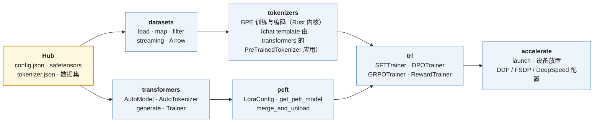
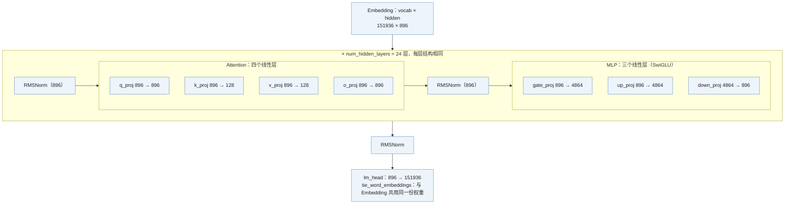

前两篇的训练循环训的是自己写的小模型。真实工作里模型不是自己写的——是从 Hugging Face Hub 下载的 Llama、Qwen、DeepSeek；数据也不是随机切窗口——是 Hub 上的数据集经过 chat template、loss mask、packing；训练器也不是二十行——是 `trl` 的 `SFTTrainer` / `DPOTrainer` / `GRPOTrainer`。Hugging Face 的六个库把这条路铺好了，六行代码能组装一次 LoRA SFT。这一篇讲六个库各管什么、六行背后发生了什么、以及一个比任何教程都重要的习惯：**卡住的时候直接读源码**。

全篇的核心问题是：

> **能不能用 `peft` + `trl` 在一小时内跑起一个 LoRA SFT？[^q0] 卡住的时候能不能直接读源码找到原因？[^q1]**

## 一、总览

### 1. 本文的组织方式

按一次微调里遇到东西的顺序：先看 Hub 上下载下来的是什么（第二章：三个文件），再看六个库各接手哪一段（第三章），然后把六行代码写出来、对照第三篇的二十行看每一行背后发生了什么（第四章），在一个 0.5B 模型上真的跑一遍、看清 chat template、loss mask、LoRA 参数量这些名词的实物（第五章），最后讲一个习惯：卡住的时候去哪读源码（第六章）。

### 2. 六个库



### 3. 本文的章节安排

| 章 | 主题 | 内容 |
|---|---|---|
| 二 | Hub 上的三个文件 | `config.json`、`tokenizer.json`、`*.safetensors`；从 config 算参数量 |
| 三 | 六个库各管什么 | `transformers`、`datasets`、`tokenizers`、`peft`、`trl`、`accelerate` |
| 四 | 六行组装一次 LoRA SFT | 代码；背后的每件事在第三篇二十行里的位置 |
| 五 | 在 0.5B 模型上跑通 | chat template、loss mask 比例、LoRA 参数量、20 步的 loss |
| 六 | 为什么读源码是最快的路 | 六个入口与它们的长度；从 `compute_loss` 往下追 |
| 七 | 本文小结 | |
| 八 | 自测 | 五道题 |

## 二、Hub 上的三个文件

拿到一个模型的 Hub 页面，先看三个文件：

### 1. `config.json`：结构超参数

```json
{"hidden_size": 896, "num_hidden_layers": 24, "num_attention_heads": 14, "num_key_value_heads": 2,
 "intermediate_size": 4864, "vocab_size": 151936, "tie_word_embeddings": true, ...}
```

这是 Qwen2.5-0.5B 的。这几个数决定了模型的全部结构——一个 decoder-only Transformer 就是下面这张图，`config.json` 的每个字段对应图里一个尺寸：



`config.json` 里的数字在结构里的位置。`num_attention_heads: 14` 与 `num_key_value_heads: 2` 决定 k/v 的宽度：每个头 $$896 / 14 = 64$$ 维，K、V 只有 2 个头，所以是 $$2 \times 64 = 128$$（GQA，L4 第三篇）。

参数量就是把图里每个矩形的面积加起来（L0 第一篇"从结构算参数量"），Qwen2 的 q/k/v 带 bias：

| 部件 | 形状 | 参数 |
|---|---|---:|
| `q_proj` | 896 × 896 + 896 | 803,712 |
| `k_proj`、`v_proj` | 各 896 × 128 + 128 | 229,632 |
| `o_proj` | 896 × 896 | 802,816 |
| `gate_proj`、`up_proj`、`down_proj` | 各 896 × 4864 | 13,074,432 |
| 两个 RMSNorm | 各 896 | 1,792 |
| **一层合计** | | **14,912,384** |
| 24 层 | | 357,897,216 |
| Embedding（与 lm_head 共用） | 151936 × 896 | 136,134,656 |
| 最后的 RMSNorm | | 896 |
| **总计** | | **494,032,768** |

`tie_word_embeddings: true` 说明输出层与词嵌入共享一份权重——小模型常这样做，否则 `lm_head` 还要再加 136M，词嵌入就占了近一半。加载后 `sum(p.numel() for p in model.parameters())` 数出 494M，与名字里的 "0.5B" 对上。L4《Transformer 与 LLM》第一篇专门教从 `config.json` 算参数量。

### 2. `tokenizer.json` 与 `tokenizer_config.json`

词表、合并规则、特殊 token（`<|im_start|>`、`<|im_end|>`、`<|endoftext|>`）、以及 **chat template**——一段 [Jinja](# "tip: Python 生态的模板引擎（Flask / Django 网页模板用的那个）：模板里用 for 循环遍历 messages，用双花括号占位符填入 message.content，渲染后得到一个字符串。chat template 用它把 messages 列表渲染成模型训练时见过的那种带特殊 token 的文本") 模板，规定"一轮对话怎么拼成一个字符串"。第五章会看到它的输出。L4 预训练系列的第一篇讲 tokenizer 本身。

### 3. `*.safetensors`：权重

`state_dict`（第三篇第四章）的磁盘格式。一个 `.safetensors` 文件只有三段：8 个字节写 header 有多长，然后是一段 JSON header，然后是所有张量的原始字节首尾相接：


这个格式有三个后果，图 3 下方各一句：**能只读某一层**（读 header 知道字节区间，内存映射那一段即可，不必把 1 GB 全读进来——`from_pretrained(..., device_map=...)` 按层加载靠的就是它）；**不能执行代码**（header 是 JSON、数据区是数，加载过程没有任何 Python 对象被反序列化——`torch.save` 的 pickle 格式则可以在加载时执行任意代码，所以 Hub 默认用 safetensors）；**分片**（大模型按名字切成 `model-0000k-of-0000n.safetensors`，`model.safetensors.index.json` 是"张量名 → 在哪个文件"的索引）。

模型卡（README）里的评测数字要带着 L0 第八篇的置信区间读。以 Qwen2.5-0.5B 技术报告里的两个数为例：GSM8K 41.6%，这个集有 1,319 题，95% 区间 $$\pm 1.96\sqrt{0.416 \times 0.584 / 1319} \approx \pm 2.7$$ 个点；HumanEval 30.5%，只有 164 题，区间 $$\pm 7.0$$ 个点。所以两个 0.5B 模型在 HumanEval 上差 5 个点，分不出谁好；差 2 个点的 GSM8K 也在噪声里。

## 三、六个库各管什么

| 库 | 负责 | 要会的 |
|---|---|---|
| `transformers` | 模型定义与加载（`modeling_llama.py` 一类）、tokenizer 封装、`generate`、`Trainer` | `AutoModelForCausalLM.from_pretrained(..., dtype=torch.bfloat16)`；`tokenizer.apply_chat_template`；`generate` 的采样参数；读 `modeling_*.py` |
| `datasets` | 数据加载与处理，底层 Apache Arrow（内存映射、零拷贝） | `load_dataset`、`map(batched=True, num_proc=...)`、`filter`、`streaming=True` 处理放不进内存的语料 |
| `tokenizers` | 分词器的训练与快速编码（Rust 实现） | 训练一个 BPE 词表；理解 `tokenizer.json` 里的 normalizer / pre-tokenizer / model / post-processor 四段 |
| `peft` | 参数高效微调 | `LoraConfig(r, lora_alpha, target_modules, dropout)`、`get_peft_model`、训练后 `merge_and_unload` 合回基座 |
| `trl` | 后训练的各个 Trainer | `SFTTrainer`（自动处理 chat template、packing、loss mask）、`DPOTrainer`、`GRPOTrainer`、`RewardTrainer` |
| `accelerate` | 把单卡脚本变多卡，统一 DDP / FSDP / DeepSpeed 的启动 | `accelerate config` 生成配置；`accelerate launch train.py` |

它们的分工对应第三篇的五个对象——每个库产出（或改造）训练循环里的一个东西：

| 库 | 产出的对象 | 对应第三篇的 |
|---|---|---|
| `transformers` | 模型（一个 `nn.Module`）与 tokenizer | `nn.Module`；`TinyGPT` 换成 `AutoModelForCausalLM` |
| `datasets` | `Dataset`（Arrow 格式，可直接喂 `DataLoader`） | `Dataset` / `DataLoader`；`get_batch` 换成它 |
| `tokenizers` | 把文本变成 `input_ids` 的编码器 | `Dataset.__getitem__` 里"字符 → id"那一步 |
| `peft` | 改造后的 `nn.Module`：线性层旁挂上 LoRA，基座 `requires_grad=False` | `nn.Module` + `requires_grad` |
| `trl` | 训练循环本身（`SFTTrainer` 等） | 二十行 |
| `accelerate` | 多卡启动与设备放置 | 第四篇的 DDP / FSDP |

### `generate` 的采样参数

`model.generate(..., do_sample=True, temperature=0.7, top_p=0.9, max_new_tokens=256)` 里的每个参数都是 L0 第五篇第七章的东西：温度、top-p、greedy（`do_sample=False`）。实现上每个都是一个 `LogitsProcessor`——对 logits 做一次变换再采样——第六章给源码入口。

## 四、六行组装一次 LoRA SFT

### 1. 代码

```python
model = AutoModelForCausalLM.from_pretrained("meta-llama/Llama-3.1-8B", dtype=torch.bfloat16)
tok = AutoTokenizer.from_pretrained("meta-llama/Llama-3.1-8B")
model = get_peft_model(model, LoraConfig(r=16, lora_alpha=32, target_modules="all-linear", lora_dropout=0.05))
ds = load_dataset("HuggingFaceH4/ultrachat_200k", split="train_sft")
trainer = SFTTrainer(model=model, train_dataset=ds, processing_class=tok, args=SFTConfig(...))
trainer.train()
```

### 2. 背后发生的事

把第三篇的二十行训练循环拿过来（SFT 版本：用 `DataLoader` 取数、loss 带 `ignore_index`），六行背后每一件事都在里面有对应位置：

```python
model = AutoModelForCausalLM.from_pretrained(name, dtype=torch.bfloat16).to("cuda")        # ①
model = get_peft_model(model, LoraConfig(...))                                              # ①′ 基座冻结，挂上 A、B
opt = torch.optim.AdamW([p for p in model.parameters() if p.requires_grad], lr=2e-4)         # ②
sched = get_cosine_schedule_with_warmup(opt, warmup, total_steps)                           # ③

for step, batch in enumerate(loader):                                                       # ④ Dataset.__getitem__ + collate_fn
    batch = {k: v.to("cuda", non_blocking=True) for k, v in batch.items()}                  # ⑤
    with torch.autocast("cuda", dtype=torch.bfloat16):                                      # ⑥
        logits = model(batch["input_ids"])                                                  # ⑦
        loss = F.cross_entropy(logits.view(-1, V).float(), batch["labels"].view(-1), ignore_index=-100)   # ⑧
    loss.backward()                                                                         # ⑨
    torch.nn.utils.clip_grad_norm_(model.parameters(), 1.0)                                 # ⑩
    opt.step(); sched.step(); opt.zero_grad(set_to_none=True)                               # ⑪ ⑫ ⑬
    if step % 10 == 0: log(loss.item(), sched.get_last_lr()[0])                             # ⑭
```

| 发生的事 | 谁做的 | 对应上面第几行 |
|---|---|---|
| 数据被套上 chat template：每一轮用 `im_start` / `im_end` 一类特殊 token 包起来（第五章有实例） | `SFTTrainer` 调 `tok.apply_chat_template` | ④ `Dataset.__getitem__` 返回的 `input_ids` 就是模板渲染后再 tokenize 的结果 |
| 回复之外的 token 的 label 被置成 −100 | `SFTTrainer`——`prompt` / `completion` 格式的数据用 `completion_only_loss`；`messages` 格式要用 `assistant_only_loss=True`（且模板需支持 generation 标记），两个开关对应两种数据契约 | ⑧ `ignore_index=-100`——**SFT 的 loss mask**；`labels` 是在 ④ 的 `collate_fn` 里造出来的 |
| 多条短样本被 pack 进一个序列（可选） | `SFTConfig(packing=True)` | ④ `collate_fn` |
| LoRA 的 $$A$$、$$B$$ 被挂到每个线性层旁边，基座冻结 | `get_peft_model` | ①′ 改造 `nn.Module`；基座参数 `requires_grad=False` |
| AdamW 只更新 $$A$$、$$B$$ | `Trainer` 只把 `requires_grad=True` 的参数交给优化器 | ② |
| bf16、梯度裁剪、学习率调度、日志、checkpoint | `SFTConfig` 的字段：`bf16=True`、`max_grad_norm`、`lr_scheduler_type` / `warmup_steps`、`logging_steps` / `save_steps` | ⑥、⑩、③ ⑫、⑭ |

`LoraConfig` 的四个参数：`r` 是秩（L0 第三篇）；`lora_alpha` 是缩放，实际加到输出上的是 $$\frac{\alpha}{r} BA x$$，常取 $$\alpha = 2r$$；`target_modules="all-linear"` 把七个线性层都挂上（也可以只挂 `q_proj, v_proj`）；`lora_dropout` 是 LoRA 分支上的 dropout。

## 五、在 0.5B 模型上跑通

用 Qwen2.5-0.5B 与 12 条写死的问答（"What is the capital of France?" → "Paris." 一类），在 CPU 上训 20 步，把六行背后的每件事打印出来。第四章那六行换成这个模型与这份数据，就是下面这段——多出来的几行只是为了把中间结果打出来：

```python
tok = AutoTokenizer.from_pretrained("Qwen/Qwen2.5-0.5B")
model = AutoModelForCausalLM.from_pretrained("Qwen/Qwen2.5-0.5B", dtype=torch.float32)      # CPU 上 fp32 最稳
print(tok.apply_chat_template([{"role": "user", "content": q}, {"role": "assistant", "content": a}], tokenize=False))

model = get_peft_model(model, LoraConfig(r=16, lora_alpha=32, target_modules="all-linear", lora_dropout=0.05, task_type="CAUSAL_LM"))
n_train = sum(p.numel() for p in model.parameters() if p.requires_grad)                     # 可训练参数量

ds = Dataset.from_list([{"prompt": [{"role": "user", "content": q}], "completion": [{"role": "assistant", "content": a}]} for q, a in QA])
args = SFTConfig(max_steps=20, per_device_train_batch_size=4, learning_rate=2e-4, max_length=128, completion_only_loss=True, ...)
trainer = SFTTrainer(model=model, train_dataset=ds, processing_class=tok, args=args)
batch = next(iter(trainer.get_train_dataloader()))
masked = (batch["labels"] == -100).sum().item()                                             # loss mask 的比例
trainer.train()

ids = tok.apply_chat_template([{"role": "user", "content": q}], add_generation_prompt=True, return_tensors="pt", return_dict=True)
out = model.generate(**ids, max_new_tokens=12, do_sample=False, eos_token_id=tok.convert_tokens_to_ids("<|im_end|>"))
merged = model.merge_and_unload()
```

### 1. 模型与 chat template

```text
config.json: hidden 896, layers 24, heads 14/2 kv, intermediate 4864, vocab 151936, tie_embeddings True
参数量 494 M; tokenizer 词表 151665; chat template 有

一条样本经 chat template：
'<|im_start|>system\nYou are a helpful assistant.<|im_end|>\n<|im_start|>user\nWhat is the capital of France?<|im_end|>\n<|im_start|>assistant\nParis.<|im_end|>\n'
```

Qwen 的模板自动加了一段默认 system prompt；每一轮用 `<|im_start|>角色\n内容<|im_end|>\n` 包起来。**模型学到的"对话格式"就是这几个特殊 token 的排列**，推理时必须用同一个模板，否则模型不知道该在哪开始回答。

### 2. LoRA 挂到哪、多少参数

```text
可训练 8.80 M / 494 M = 1.78%
训练状态 ≈ 可训练 × 16 B = 141 MB；冻结权重 fp32 1.98 GB（bf16 时减半）
挂了 LoRA 的线性层: ['down_proj', 'gate_proj', 'k_proj', 'o_proj', 'q_proj', 'up_proj', 'v_proj']
```

七个线性层——与 L0 第三篇表里的七个一一对应。0.5B 模型上 $$r = 16$$ 是 1.78%（比 8B 的 0.52% 高，因为小模型 $$d$$ 小、$$r(m + n) / mn$$ 更大）。第四篇的账：训练状态只有 141 MB，冻结权重 2 GB（fp32）——这个模型在 CPU 上都能微调。

### 3. loss mask 的比例

```text
一个 batch: input_ids (4, 36), labels 里被 mask 成 -100 的 token 122/144 (85%，prompt 与 padding 不算 loss)
```

4 条样本 padding 到 36 长，144 个位置里 122 个是 −100：system prompt、user 的问题、padding 都不算 loss，**只有 assistant 的那几个 token（`Paris.<|im_end|>`）进入交叉熵**。这就是 L0 第五篇第四章"SFT 只对回答部分求和"的实物。85% 被 mask 掉意味着有效 token 很少——真实 SFT 数据的回复要长得多，比例会反过来。

### 4. 20 步

```text
loss: 第 1 步 5.254 → 最后 1.658  (15 s, 0.8 s/步)
Q: What is the capital of France?   A: 'Paris.看查看\npositories\nThe capital of the United States'
Q: What is the capital of Italy?    A: 'Rome.看查看\nRowAtIndexPath\n Florence.看查看\nRowAtIndexPath'
```

loss 从 5.3 降到 1.7；生成时**答案学会了**（Paris、Rome——后者不在训练数据里，是基座本来就会的），但**没学会在 `<|im_end|>` 停下**，接着吐出乱码。12 条数据、20 步，模型见到 `<|im_end|>` 这个 token 的次数太少。这是一个真实的 SFT 现象：**结束符必须进 loss、且要见够多次**，否则模型不会停。L5 后训练系列第一篇专门讲 SFT 数据的这些细节；这里它是一个"六行跑通了，但要看懂输出"的例子。

### 5. 合并

```text
merge_and_unload 后参数量 494 M（LoRA 已合回基座，推理零开销）
```

$$W' = W + \frac{\alpha}{r} BA$$，L0 第三篇的"合并"用法。

## 六、为什么读源码是最快的路

Hugging Face 的库是当前算法工作的事实标准，也是**最好的教材**——比论文更准确（论文写的是想法，代码写的是实际做法），比教程更完整。几个值得直接读的入口：

| 想学 | 读 | 大约多长 |
|---|---|---|
| Llama 的结构 | `transformers/models/llama/modeling_llama.py`：`LlamaAttention`、`LlamaMLP`、`LlamaDecoderLayer`、`apply_rotary_pos_emb` | 核心几百行；每个类都是第三篇的 `nn.Module` |
| DPO 的 loss 到底怎么算 | `trl/trainer/dpo_trainer.py` 里 `dpo_loss`：把 L0 第六篇推出的公式变成十几行代码，还能看到 IPO、hinge 等变体各改了哪一行 | 几十行 |
| GRPO 的优势怎么算、KL 怎么加 | `trl/trainer/grpo_trainer.py`：L0 第七篇的 $$(R - \text{mean}) / \text{std}$$ 与裁剪 | 几百行 |
| LoRA 怎么挂上去 | `peft/tuners/lora/layer.py`：`Linear.forward` 里 `result += lora_B(lora_A(dropout(x))) * scaling` | 一行核心——L0 第三篇的 $$BAx$$ |
| SFT 的 loss mask 与 packing | `trl/trainer/sft_trainer.py` 与它的 data collator | 几百行 |
| `generate` 的采样 | `transformers/generation/utils.py` 与 `logits_process.py`：temperature、top-k、top-p 各是一个 `LogitsProcessor` | 每个 processor 十几行——L0 第五篇第七章 |

方法很简单：**遇到一个后训练概念，先读它在 `trl` 里的实现，再读论文。** 库的版本变化快，函数名会变（本文写作时的接口未必与你读到时一致），但找到入口的方法不变——从 Trainer 的 `compute_loss` 往下追，或者在编辑器里对着一个 API 名按"跳转到定义"。读到一个看不懂的公式，回 L0 对应的篇；读到一个看不懂的形状操作，回本系列第一篇。

## 七、本文小结

- **Hub 上的三个文件**：`config.json`（结构超参数，能算出参数量）、`tokenizer.json`（词表、特殊 token、chat template）、`*.safetensors`（`state_dict` 的磁盘格式，可部分加载、不能执行代码）。
- **六个库**各管一段：`transformers` 给模型与 tokenizer、`datasets` 给数据（Arrow）、`tokenizers` 训与编码词表、`peft` 挂 LoRA、`trl` 给后训练的 Trainer、`accelerate` 给多卡启动；对应第三篇的五个对象。
- **六行组装 LoRA SFT**，背后的每件事——chat template、loss mask（−100）、packing、LoRA 挂载、只更新 $$A, B$$、bf16 / 裁剪 / 调度——都在二十行训练循环里有位置。
- 0.5B 上跑通：七个线性层挂 LoRA、可训练 1.78%、训练状态 141 MB；一个 batch 85% 的 token 被 mask；20 步 loss 5.3 → 1.7，答案学会了但没学会停——**结束符要进 loss 且见够多次**。
- **读源码是最快的路**：`modeling_llama.py`、`dpo_loss`、`grpo_trainer.py`、`peft` 的 `Linear.forward`、`LogitsProcessor`；从 `compute_loss` 往下追。库的接口会变，方法不变。

配套代码：第五章那次运行的完整脚本是 [`algorithm-tooling/04_hf_lora_sft.py`](https://github.com/arganzheng/ai-learning-labs/blob/main/algorithm-tooling/04_hf_lora_sft.py)（首次运行下载 Qwen2.5-0.5B 约 1 GB；CPU 20 步约 2–4 分钟，`--quick` 跑 5 步）。正文已给出它的全部关键行，读本文不需要它。

## 八、自测

1. 一个模型的 `config.json` 里 `hidden_size: 4096, intermediate_size: 14336, num_hidden_layers: 32, num_attention_heads: 32, num_key_value_heads: 8, vocab_size: 128256, tie_word_embeddings: false`——参数量大约多少？

   <details markdown="1"><summary>答案</summary>

   就是 Llama-3-8B，8.03B（L0 第一篇的表）。

   </details>

2. 为什么推理时必须用与训练相同的 chat template？

   <details markdown="1"><summary>答案</summary>

   模型学到的"该在哪开始回答"编码在特殊 token 的排列里，换模板它不知道边界。

   </details>

3. `LoraConfig(r=16, lora_alpha=32)` 里 `lora_alpha` 在做什么？改成 16 有什么效果？

   <details markdown="1"><summary>答案</summary>

   LoRA 输出的缩放 $$\alpha / r$$：32 / 16 = 2 倍；改成 16 就是 1 倍。它不精确等价于"学习率减半"：缩放同时作用在前向输出与反向梯度上，Adam 又会把梯度尺度归一化掉——效果上接近降低 LoRA 分支的有效学习率，但不是数值上的一半。

   </details>

4. 一个 batch 的 labels 里 85% 是 −100，说明什么？真实 SFT 数据会怎样？

   <details markdown="1"><summary>答案</summary>

   回复很短、prompt 与 padding 占大头，有效训练 token 少；真实数据回复长，比例反过来。

   </details>

5. 想知道 `SFTTrainer` 到底怎么给 prompt 部分打 −100，去读哪个文件的哪一部分？

   <details markdown="1"><summary>答案</summary>

   `trl/trainer/sft_trainer.py` 的数据处理 / collator 部分，搜 `completion_only_loss` 或 `-100`。

   </details>

下一篇是本系列最后一篇：GPU 的两个上限与四块显存（为什么 decode 快不起来、为什么 batch 大才快）、读 profiler、以及让三个月前的实验能复现的最小记录。

[^q0]: 能。六个库各管一段——`transformers` 模型与 tokenizer、`datasets` 数据、`peft` 挂 LoRA、`trl` 的 `SFTTrainer`、`accelerate` 多卡、`tokenizers` 词表——六行组装，0.5 B 上 20 步从 loss 5.3 到 1.7；背后的每件事（chat template、loss mask、packing、只更新 $$A, B$$）都在上一篇的二十行循环里有位置。详见[第三](#三六个库各管什么)至[五章](#五在-05b-模型上跑通)。
[^q1]: 能。从 `Trainer.compute_loss` 往下追——模型结构在 `modeling_llama.py`，LoRA 的前向在 `peft` 的 `Linear.forward`，loss 在 `trl` 各 Trainer 的 `compute_loss` / `dpo_loss`，采样在 `LogitsProcessor`。实测的一个教训：答案学会了但没学会停，是因为结束符没进 loss——这类问题只有读源码才能定位。详见[第六章](#六为什么读源码是最快的路)。
