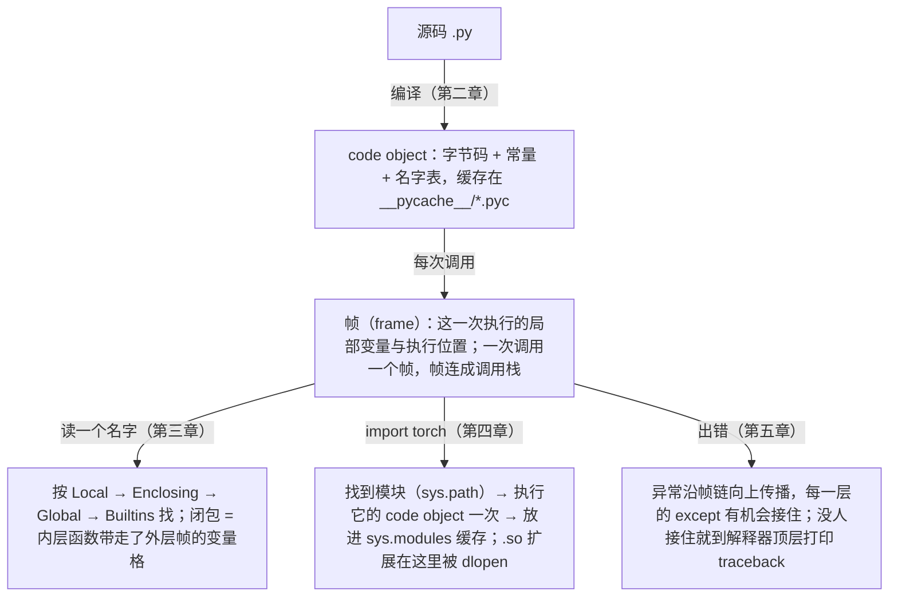

Python 常被认为是一门"简单易学"的语言。但在深度学习框架、推理服务和分布式训练系统里，真正需要掌握的不是语法，而是语法背后的运行时模型。下面这些在 AI-Infra 代码里随处可见的写法，每一行都依赖一个可以被替换、被拦截、被扩展的机制：

```text
import torch                       触发 .so 扩展加载、算子注册、后端初始化
model(x)                           走的是 __call__，中间可能插入 hooks
for batch in loader                迭代协议 + 生成器的暂停与恢复
with torch.inference_mode()        上下文管理协议：进入时改状态、退出时恢复
@register("cuda")                  装饰器在模块导入时执行，注册表能否填上取决于谁导入了它
self.linear = nn.Linear(4, 4)      __setattr__ 拦截赋值，把子模块登记到 _modules
except Exception: log; raise       异常是否重抛，决定 Worker 是否退出
```

这七行里，`import torch` 与 `except ... raise` 两行是本篇的内容（第四、五章）——**代码怎么被加载、怎么跑、出错了怎么传播**；其余五行关于对象——`__call__`、迭代协议、上下文管理器、装饰器、`__setattr__`——在[下篇](/python-object-model-protocols-decorators-and-generators.html)。不理解这些机制，读 PyTorch 或 vLLM 的源码就只能逐行翻译语法；理解之后，才能看出一个框架"为什么这样设计"，也才能解释那些经典故障——"本地能跑、换台机器就 `ImportError`"、"明明写了注册装饰器、运行时却找不到后端"、"`python -m` 能跑、`python script.py` 不能"。

本篇只回答一个问题：

> **一段 Python 代码从文本变成正在运行的帧，名称在帧里怎么解析，模块怎么被找到并执行，异常又怎么沿着帧传播？[^q0]**

## 一、总览




### 1. 一个贯穿上下两篇的例子

为了让后面的机制讨论有一个共同的落点，先给出一个极简的推理组件。它没有任何真实的模型逻辑，但用到了上下两篇要讲的每一种机制：

```python
# runner.py
from contextlib import nullcontext

REGISTRY = {}


def registered(name):                        # 带参数的装饰器：注册表
    def decorator(cls):
        if name in REGISTRY:
            raise ValueError(f"duplicate registration: {name}")
        REGISTRY[name] = cls
        return cls

    return decorator


class InferenceContext:                      # 上下文管理器：进入/退出推理模式
    def __enter__(self):
        print("enter inference mode")
        return self

    def __exit__(self, exc_type, exc, tb):
        print("exit inference mode")
        return False


@registered("runner")
class Runner:
    def __init__(self, model, inference=True):
        self.model = model
        self.inference = inference

    def __call__(self, batch):               # 可调用协议
        context = InferenceContext() if self.inference else nullcontext()
        with context:
            return self.model(batch)

    def stream(self, batch):                 # 生成器：流式输出
        yield from self.model.generate(batch)
```

这段代码从写下到跑完，Python 运行时做了这些事：

1. 另一个模块执行 `import runner`，导入系统找到文件、编译成字节码、执行模块顶层代码——`REGISTRY` 被创建，`@registered("runner")` 在这一刻把 `Runner` 写进注册表；
2. `Runner(model)` 创建实例，经过 `__new__` 和 `__init__`；
3. `runner(batch)` 触发 `__call__`，其中 `with context:` 进入并退出上下文；
4. `for out in runner.stream(batch)` 创建生成器，逐步暂停与恢复；
5. 任何一步抛出异常，异常沿执行帧向上传播，途经 `__exit__` 和调用方的 `try/except`。

第 1 步和第 5 步是本篇的内容：编译、帧、名称解析、导入、异常传播；第 2–4 步关于对象——创建、调用、协议、生成器、上下文——在[下篇](/python-object-model-protocols-decorators-and-generators.html)，下篇最后一章再把五步串起来完整追踪一遍。

### 2. 本篇的主线：从源码到帧

```text
源码 ──编译──► code object ──封装──► 函数/类对象 ──调用──► 执行帧
                                                          │
  ▲ 第二章 执行模型                                        │ 第三章 作用域与闭包：帧里的名称怎么解析
  │                                                       ▼
import 语句 ──finder/loader──► 模块对象 ──执行顶层代码──► 注册表、类定义生效
  ▲ 第四章 导入系统                                        │
                                                          ▼
                                       异常沿帧链向上传播，途经 finally / __exit__ ──► [下篇第二章](/python-object-model-protocols-decorators-and-generators.html#二类与对象模型对象如何被创建和查找)
```

各章之间的依赖是单向的：第三章的闭包依赖第二章的函数对象与帧；第四章的导入以"执行模块顶层代码"收尾，用到第二章的编译单元；[下篇第二章](/python-object-model-protocols-decorators-and-generators.html#二类与对象模型对象如何被创建和查找)的异常沿第二章的帧链传播。

### 3. 本文的章节安排

| 章 | 主题 | 内容 |
|---|---|---|
| 二 | 执行模型：源码如何变成正在运行的代码 | code object、字节码、函数对象、执行帧、名称绑定 |
| 三 | 作用域与闭包：名称在哪里被解析 | LEGB 的编译期本质、cell、`nonlocal`、延迟绑定 |
| 四 | 模块与导入系统：代码如何被加载 | `import` 的执行过程、`meta_path` / `PathFinder` / loader 三层机制、`sys.path` 与启动方式、项目布局与 editable 安装、`sys.modules` 与注册前提、循环导入、动态导入、导入语法 |
| 五 | 异常处理与失败传播 | 层级、错误边界、异常链、记录并重抛 |
| 六 | 本文小结 |  |
| 七 | 自测 | 2 道题 |

Table: 本文的章节安排

## 二、执行模型：源码如何变成正在运行的代码

Python 源码在运行前会先被编译成字节码，解释器执行的是字节码，不是源文件的文本。这一章讲清这条链路——源码怎么变成 code object、函数对象、执行帧，以及编译在什么时候发生——后面的导入、闭包、生成器都建在它上面。

### 1. Python 不是"逐行解释"

"解释器读一行、执行一行"是入门时的近似，但它解释不了为什么一个函数里的语法错误会让整个模块都无法导入，也解释不了为什么闭包能记住外层变量。实际过程是：

```text
源代码(.py)  ──parser──►  AST  ──compiler──►  code object（含字节码）  ──解释器──►  在执行帧中运行
```

Python 没有 `javac` 那样一个单独的编译步骤，但编译确实发生，而且有明确的触发时机：

| 触发 | 编译什么 | 产物放哪 |
|---|---|---|
| `python script.py` 启动 | 整个 `script.py` | 内存里的 code object；**不**写 `.pyc` |
| 第一次 `import mod`（第四章） | 整个 `mod.py`，含其中每个函数体、类体 | 内存里的 code object，并写到 `__pycache__/mod.cpython-312.pyc` 缓存；下次导入若源文件没变，直接读 `.pyc` 跳过编译 |
| `exec(src)` / `eval(expr)` / `compile(src, ...)` | 传入的字符串 | 返回或直接执行 code object——这是"运行时编译"的显式入口 |
| 交互式解释器每输入一条语句 | 那一条语句 | 立刻执行 |

Table: Python 编译的触发时机与产物

所以说"运行时编译"是指：编译发生在**进程运行期间、第一次用到某个模块时**，而不是在一个独立的构建阶段；单位是**整个模块**——一个函数里的语法错误会让整个文件编译失败，于是 `import` 报 `SyntaxError`，哪怕那个函数从未被调用。编译的产物里，每个函数体、类体、生成器体各自是一个嵌套的 code object；`def` 语句执行时只是把已经编译好的 code object 包成函数对象（§2），不再编译。与 Java 对照：`javac` 在构建期把每个类编成 `.class`，JVM 启动后按需加载并**再次**即时编译成机器码；Python 只有前一半（源码 → 字节码）且发生在运行期，字节码之后就是解释执行。

用 `dis` 可以看到函数的字节码：

```python
import dis


def add(x, y):
    return x + y


dis.dis(add)
```

CPython 3.12 的输出：

```text
  4           0 RESUME                   0

  5           2 LOAD_FAST                0 (x)
              4 LOAD_FAST                1 (y)
              6 BINARY_OP                0 (+)
             10 RETURN_VALUE
```

四条指令：把两个局部变量压栈、做二元运算、返回。指令集会随 CPython 版本变化（3.11 起大量指令被重写以支持自适应特化），但读法是稳定的：左列是源码行号，中间是字节偏移，右边是指令名和参数。

code object 本身是一个普通对象，函数只是它的一个引用：

```python
c = add.__code__
print(type(c))                                    # <class 'code'>
print(c.co_varnames, c.co_argcount, c.co_consts)  # ('x', 'y') 2 (None,)
```

这里需要分清几个概念，后面每一章都会用到：

| 对象 | 是什么 | 什么时候产生 |
| :--- | :--- | :--- |
| 源代码 | `.py` 文本 | 开发者编写 |
| code object | 编译产物：字节码、常量表、变量名表、行号表 | 模块被首次导入（或脚本启动）时整体编译；每个作用域一个 |
| 函数对象 | code object + 默认参数 + 全局命名空间 + 闭包 + 注解 | 执行到 `def` 语句时 |
| 执行帧（frame） | 一次调用的运行状态：局部变量、当前指令位置、指向调用者的链 | 每次调用时创建 |
| 解释器 | 执行字节码，维护调用栈、异常状态 | 进程级 |

Table: 源代码、code object、函数对象与执行帧

字节码格式和执行循环属于 CPython 实现细节，不属于语言规范。但 code object、函数对象、帧这三个概念在所有主流实现中都存在，理解它们不会被版本差异推翻。

### 2. 函数对象：code object 的运行时封装

执行到 `def` 语句时，解释器用编译好的 code object 创建一个函数对象，并把名称绑定到它。函数对象携带了运行这段代码所需的全部上下文：

```python
def predict(x, scale=2):
    """Scale the input."""
    return x * scale


print(type(predict))            # <class 'function'>
print(predict.__code__)         # <code object predict at 0x..., file "...", line 1>
print(predict.__defaults__)     # (2,)
print(predict.__doc__)          # Scale the input.
print(predict.__qualname__)     # predict
print(predict.__globals__ is globals())   # True
```

`__globals__` 是函数定义所在模块的命名空间字典——这决定了函数里的全局名称在**定义它的模块**中查找，而不是在调用它的模块中。第三章的作用域规则、第四章"模块的顶层代码执行后名称才存在"，都以 `__globals__` 这个字段为基础——查全局名称就是查这个字典。

`def` 是语句，每执行一次就创建一个新的函数对象。两个函数对象可以共享同一个 code object：

```python
def make():
    def f():
        return 1
    return f


a, b = make(), make()
print(a is b, a.__code__ is b.__code__)   # False True
```

这就是为什么函数在 Python 里是"一等对象"：它可以被赋值、传参、返回、放进容器、动态添加属性——本质上它就是一个带有 `__call__` 的普通对象。[下篇第四章](/python-object-model-protocols-decorators-and-generators.html#四装饰器用闭包和描述符改写调用路径)的装饰器把这件事用到极致：`@log_call` 只是把名称 `predict` 重新绑定到另一个函数对象。

### 3. 执行帧与调用栈

每次调用函数，解释器创建一个执行帧，包含局部变量、当前执行到的指令位置、指向调用者帧的引用。帧对象可以被观察：

```python
import inspect


def show_frame():
    frame = inspect.currentframe()
    print(frame.f_code.co_name, list(frame.f_locals), frame.f_back.f_code.co_name)


show_frame()    # show_frame ['frame'] <module>
```

traceback 显示的调用链，就是异常发生时沿 `f_back` 串起来的帧：

```python
def inner():
    raise ValueError("boom")


def outer():
    inner()


try:
    outer()
except ValueError as exc:
    tb = exc.__traceback__
    while tb:
        print(tb.tb_frame.f_code.co_name, tb.tb_lineno)
        tb = tb.tb_next
```

```text
<module> 9
outer 6
inner 2
```

帧这个概念解释了后面几件事：

- 第三章：局部变量、闭包变量、全局变量的查找方式不同，因为它们存放在帧的不同位置；
- [下篇第四章](/python-object-model-protocols-decorators-and-generators.html#四装饰器用闭包和描述符改写调用路径)：装饰器会在调用栈里多插入一层 `wrapper` 帧，所以 traceback 里会出现它；
- [下篇第五章](/python-object-model-protocols-decorators-and-generators.html#五生成器与惰性执行)：生成器的本质是"一个可以被挂起、之后再恢复的帧"；
- 第五章：异常传播就是沿帧链逐层向上寻找 `except`。

生产代码不应依赖 `inspect.currentframe()` 或修改帧对象，但调试器、profiler、`logging` 的调用位置记录都建立在帧之上。

### 4. 名称绑定：名称不是变量盒子

Python 的赋值不是"把值放进一个盒子"，而是"让一个名称指向一个对象"。

```python
x = []
y = x
y.append(1)
print(x, y, x is y)     # [1] [1] True
```

这里只有一个列表对象，`x` 和 `y` 是它的两个名称。因此要分开四件事：**名称**、**对象**、**对象身份**（`id()`、`is`）、**对象可变性**。

`==` 比较值，`is` 比较身份。对值做 `is` 判断结果不可预期：

```python
a = 1000
b = 1000
print(a == b, a is b)                         # True True   —— 同一编译单元里的常量被合并
p = int("1000")
q = int("1000")
print(p == q, p is q)                         # True False  —— 运行时各自创建
```

第一组为 `True` 只是因为编译器把同一 code object 里相同的常量合并进了常量表；第二组是运行时分别创建的两个对象。所以工程代码中 `is` 只用于单例：`is None`、`is True`、哨兵对象。

在 AI-Infra 中，名称绑定和别名会直接影响：

- 配置对象被传入多个组件后，某个组件的原地修改会被其他组件看到；
- 一个 Batch 被 DataLoader、预处理器和模型共享时，谁做了原地操作；
- 缓存里放的是可变对象时，缓存内容会随外部修改而"漂移"；
- 多进程 Worker 各自持有的是**副本**（`fork` 后各自的地址空间），进程内的全局注册表并不共享——这一点在第四章 §6 会再遇到。

### 5. 与 Java 的对照

Java 程序员对上面大部分内容并不陌生：Java 的对象变量同样是引用，`==` 比较引用、`equals()` 比较值，`.class` 文件里的字节码也需要 JVM 解释或 JIT 执行。真正的差异在两处：

| | Python | Java |
| :--- | :--- | :--- |
| 名称携带类型吗 | 不。名称只是绑定，任何对象都能绑上去 | 变量有静态类型，编译期检查 |
| 编译发生在什么时候 | 导入/启动时按模块编译，编译产物（`.pyc`）只是缓存 | 构建期生成 `.class`，运行期由类加载器加载 |
| 函数是对象吗 | 是，`def` 是运行时语句 | 方法不是对象；lambda 是函数式接口的实例 |
| 帧能被程序访问吗 | 能，`inspect.currentframe()`、traceback 对象 | 只能通过 `StackTraceElement` 等有限视图 |

Table: 执行模型与对象模型：Python 与 Java 的差异

最重要的一条是第一行：Python 名称没有类型，类型信息全在对象上。这也是为什么本系列第二篇要单独讨论类型系统——Python 把"提供类型信息"和"消费类型信息"拆成了两层。

## 三、作用域与闭包：名称在哪里被解析

第二章说函数对象携带 `__globals__`，帧里存放局部变量。那么函数体里写下一个名称时，Python 在哪里找它？答案是**编译期就决定了**——这是理解闭包、`nonlocal` 和"循环里的 lambda 全都返回同一个值"的钥匙。

### 1. LEGB 是编译期规则

名称查找的四层通常叫 LEGB：Local（当前函数）→ Enclosing（外层函数）→ Global（模块）→ Builtins。

```python
value = "global"


def outer():
    value = "enclosing"

    def inner():
        return value

    return inner


f = outer()
print(f())      # enclosing
```

关键在于：编译器在编译 `inner` 时，扫描整个函数体，把每个名称分类——有赋值的是局部变量，没有赋值但在外层函数中有定义的是**自由变量**（free variable），其余都当作全局/内置。

这条规则值得单独强调，因为它是 Python 与 Java 这类静态语言在"变量"这件事上最大的差别：**Python 没有变量声明，一个名称属于哪个作用域由"这个函数体里有没有对它赋值"决定，而且是在编译期、看整个函数体一次决定的。** Java 里 `int count;` 声明了类型和作用域，之后的 `count++` 只是使用；Python 里 `count += 1` 这一句本身就宣告了"`count` 是本函数的局部变量"——不管它出现在函数的第几行、前面有没有读过它。三个直接后果：

1. 同一个名称在一个函数里只能属于一个作用域，不存在"前半段是全局、后半段是局部"；
2. 一个名称是局部变量与它**有没有被赋过值**是两回事：局部变量可以"存在但还没有值"，读它会得到 `UnboundLocalError`（§3 的例子）；
3. 要在函数里改外层的变量，必须用 `nonlocal` / `global` 显式声明"这个赋值不是在造局部变量"。

分类结果直接体现在字节码里：

```python
import dis
dis.dis(f)
```

```text
              0 COPY_FREE_VARS           1

  7           2 RESUME                   0

  8           4 LOAD_DEREF               0 (value)
              6 RETURN_VALUE
```

`LOAD_DEREF` 表示"从 cell 中取值"，而不是 `LOAD_FAST`（局部）或 `LOAD_GLOBAL`（全局）。查找**位置**是编译期确定的，运行时只是按位置取值。这也是为什么在函数里对一个名称赋值，会让**整个函数**中该名称都变成局部变量，哪怕赋值语句在后面——下面 §3 的 `UnboundLocalError` 就是这个规则的直接后果。

### 2. 闭包就是"函数对象 + cell"

`outer()` 返回之后，它的帧已经销毁，`inner` 为什么还能读到 `value`？因为编译器发现 `value` 被内层函数引用，就把它存放在一个 **cell** 对象里而不是普通局部槽位；`inner` 的函数对象通过 `__closure__` 持有这些 cell：

```python
print(outer.__code__.co_cellvars)        # ('value',)   outer 中被内层引用的变量
print(f.__code__.co_freevars)            # ('value',)   inner 中来自外层的变量
print(f.__closure__)                     # (<cell at 0x...: str object at 0x...>,)
print(f.__closure__[0].cell_contents)    # enclosing
```

所以闭包不是什么魔法："外层帧销毁了，但 cell 对象被内层函数对象引用着，所以还活着。" 这就是**词法作用域**：名称的解析依据函数**定义时**的代码结构，与调用位置无关。

在 AI-Infra 中闭包常用来携带少量配置进入回调：后端名、重试次数、指标标签、模型引用。但它也是隐式依赖——读者无法从函数签名看出它依赖了什么。

### 3. `nonlocal` 与 `UnboundLocalError`

读外层变量不需要声明，**重新绑定**外层变量需要 `nonlocal`：

```python
def make_counter(start=0):
    count = start

    def increment():
        nonlocal count
        count += 1
        return count

    return increment


counter = make_counter()
print(counter(), counter())                 # 1 2
print(counter.__closure__[0].cell_contents)  # 2   —— 修改的是同一个 cell
```

去掉 `nonlocal` 会得到：

```text
UnboundLocalError: cannot access local variable 'count' where it is not associated with a value
```

按 §1 的规则，`count += 1` 是赋值，编译器因此把 `count` 判定为 `increment` 的**局部变量**；执行时先读局部槽位，而它还没有值。这个错误经常出现在把一个模块级计数器、开关或缓存直接在函数里 `+=` 的时候——那时需要的是 `global`。

### 4. 延迟绑定：cell 是共享的

闭包最常见的陷阱：

```python
def make_fns():
    fns = []
    for i in range(3):
        fns.append(lambda: i)
    return fns


print([fn() for fn in make_fns()])          # [2, 2, 2]
```

先看清 `lambda: i` 这个写法本身。`lambda 参数列表: 表达式` 定义一个匿名函数，冒号前是参数、冒号后是返回值；`lambda: i` 的参数列表是**空的**，所以 `i` 不是参数，而是一个要到外层去找的自由变量——每次调用它，都去 `make_fns` 的作用域里取 `i` **当前**的值。

用 §2 的知识解释结果：`i` 是 `make_fns` 的 cell 变量，三个 lambda 的 `__closure__` 指向**同一个** cell（可以打印 `id(fn.__closure__[0])` 验证，三者相同）。lambda 体里的 `i` 在**调用时**才 `LOAD_DEREF`，此时循环早已结束，cell 里是最后一个值。

修法是在创建时就把值固定下来——用默认参数（默认值在 `def`/`lambda` 求值时计算一次）：

```python
fns.append(lambda i=i: i)                    # [0, 1, 2]
```

`i=i` 里等号左边是 lambda 自己的参数 `i`，右边是循环变量 `i` 此刻的值，被当作默认值存进函数对象（`fn.__defaults__`）；调用 `fn()` 时不传参，就用这个默认值，于是 lambda 体里的 `i` 变成了局部变量，不再去外层找。注意不能写成 `lambda i: i`——那是一个**必须**接收一个参数的恒等函数，`fn()` 会直接报 `TypeError: <lambda>() missing 1 required positional argument: 'i'`。

或者用 `functools.partial(handler, i)`，语义更明确。构造一批 Worker 回调、为每个 GPU 生成一个任务函数、在循环里注册 hook，都会遇到这个问题。

### 5. 闭包还是类

闭包和类都能"把状态和行为绑在一起"。取舍标准是状态的数量和生命周期：

- 一两个只读配置、一个简单计数：闭包即可，代码短；
- 状态多于两三个、需要被外部检查或重置、有清理逻辑：用类。类的状态在 `__dict__` 里可见可调试，闭包的状态藏在 `cell_contents` 里。

[下篇第四章](/python-object-model-protocols-decorators-and-generators.html#四装饰器用闭包和描述符改写调用路径)会看到，装饰器既可以用闭包写，也可以用类写，取舍标准相同。

### 6. 与 Java 的对照

Java 的 lambda 和匿名内部类也能捕获外层变量，但捕获的变量必须是 **effectively final**——编译器直接禁止 §4 那种"捕获一个会变的循环变量"的写法，也就不存在延迟绑定问题。注意 final 约束的是**引用**不能重新赋值，引用指向的对象本身照样可以修改：lambda 里不能写 `count++`，但可以 `counter.incrementAndGet()` 或 `holder[0]++`。所以 Java 无法像 §3 那样用 `nonlocal` 直接重绑一个外层局部变量，而是要把可变状态装进一个对象——数组、`AtomicInteger` 或对象字段——再捕获这个对象的引用。

两种设计的根本差异：Java 捕获的是**值**（拷贝进 lambda 对象），Python 捕获的是**变量**（共享 cell）。读 Python 代码时要时刻记得这点：闭包看到的是变量的当前值，不是创建时的快照。

## 四、模块与导入系统：代码如何被加载

前两章讨论的是一个函数内部发生的事。但函数要先存在才能被调用，而让它存在的动作是 `import`：找到文件、编译、执行顶层代码、把结果放进一个模块对象。第一章的 `Runner` 之所以能出现在 `REGISTRY` 里，唯一的原因是 `runner.py` 被导入并执行过。这一章把导入系统拆开：它由哪几层组成、`sys.path` 从哪里来、为什么同一份代码换一种启动方式就 `ImportError`。

### 1. 模块是对象，包是带 `__path__` 的模块

一个 `.py` 文件导入后就是一个模块对象，它的属性字典就是那份文件的全局命名空间：

```python
import json, types

print(type(json), isinstance(json, types.ModuleType))   # <class 'module'> True
print(list(json.__dict__)[:6])
# ['__name__', '__doc__', '__package__', '__loader__', '__spec__', '__path__']
```

前几个名字是导入系统写入的元数据。`json.dumps` 这样的属性访问，就是在这个字典里查键。第二章说函数对象的 `__globals__` 指向定义它的模块命名空间——指的正是这个 `__dict__`。

包是**多了一个 `__path__` 属性**的模块。`__path__` 是一个目录列表，告诉导入系统"这个包的子模块去哪里找"：

```python
print(json.__path__)      # ['.../lib/python3.12/json']
print(json.__package__)   # json
import json.decoder
print(json.decoder.__package__)   # json
```

`mypackage/__init__.py` 是包被导入时执行的模块体。它有两个合理用途：把内部模块的公共对象提升到包级（`from .model import Model`），以及用 `__all__` 声明 `from mypackage import *` 的导出集合。`__all__` 只影响 `import *`、文档和静态分析工具，不是访问控制。

`__init__.py` 里不应放重逻辑。导入包就会执行它，一个 `import mypackage.utils` 会先跑完 `mypackage/__init__.py`——如果那里面 `import torch`、检查 CUDA、建立连接，所有导入方都要付这个代价，并且更容易形成循环导入（§7）。没有 `__init__.py` 的目录是**命名空间包**（PEP 420），能被导入，但缺少一个明确的初始化入口；后面 §4 会看到 PyTorch 自己的一个报错正是命名空间包造成的。

### 2. `import` 语句的执行过程

`import mypackage.model` 在解释器内部大致经历以下步骤（对应 CPython 标准库 `importlib/_bootstrap.py` 中的 `_find_and_load` → `_find_spec` → `_load_unlocked`）：

```text
1. 查 sys.modules["mypackage.model"]，命中则直接返回                   —— 缓存
2. 未命中：先确保父包 "mypackage" 已导入（递归走同一流程）
3. 依次询问 sys.meta_path 里的每个 finder：find_spec(name, path)
   第一个返回非 None 的 ModuleSpec 胜出；全部 None → ModuleNotFoundError    —— 查找
4. spec.loader.create_module(spec) 创建空模块对象，写入 __name__/__spec__/__file__ 等元数据
5. sys.modules[name] = module                                             —— 注意：在执行之前
6. spec.loader.exec_module(module)：编译（或读 .pyc）并在 module.__dict__ 中执行顶层代码   —— 执行
7. 把结果绑定到当前命名空间：import a.b 绑定 a；from a.b import c 绑定 c
```

有三点决定了后面几节的全部内容：

- **第 1 步**说明同一个模块名在一个进程里只执行一次。注册表、单例、模块级缓存都依赖这一点（§6）。
- **第 5 步在第 6 步之前**。模块在顶层代码执行完之前就已经在 `sys.modules` 里了，此时它是一个"部分初始化"的模块。循环导入之所以表现为 `AttributeError`/`ImportError: cannot import name`，就是有人在这个窗口期拿到了它（§7）。
- **第 3 步是可插拔的**。`sys.meta_path` 是一个普通列表，谁都可以往里插 finder。下一节展开。

### 3. 三层查找机制：`sys.meta_path`、`PathFinder` 与 loader

Python 的导入系统不是"在目录里找 `.py` 文件"，而是一个三层协议。先看一个模块导入之后留下的痕迹：

```python
import json
print(json.__spec__)
```

```text
ModuleSpec(name='json',
           loader=<_frozen_importlib_external.SourceFileLoader object at 0x...>,
           origin='/.../lib/python3.12/json/__init__.py',
           submodule_search_locations=['/.../lib/python3.12/json'])
```

`ModuleSpec` 是 finder 交给 loader 的"工单"：模块叫什么、从哪来（`origin`）、由谁加载（`loader`）、如果是包则子模块去哪找（`submodule_search_locations`，也就是 `__path__` 的来源）。

**第一层：`sys.meta_path` 里的 finder**

```python
import sys
for finder in sys.meta_path:
    print(finder)
```

在一个装了 setuptools 的 venv 里：

```text
<_distutils_hack.DistutilsMetaFinder object at 0x...>
<class '_frozen_importlib.BuiltinImporter'>
<class '_frozen_importlib.FrozenImporter'>
<class '_frozen_importlib_external.PathFinder'>
```

三个内建 finder 各管一类来源：`BuiltinImporter` 负责编译进解释器的 C 模块（`math.__spec__` 的 `origin` 是 `'built-in'`，没有 `__file__`），`FrozenImporter` 负责冻结进解释器的启动模块，`PathFinder` 负责文件系统。第一个不是内建的——它是 setuptools 通过 `site-packages/distutils-precedence.pth` 装进来的，用来把 `import distutils` 重定向到 setuptools 自带的副本。这是一个真实生产环境中"第三方代码接管导入过程"的例子，后面 §5 的 editable 安装也用同样的手法。

**第二层：`PathFinder` 沿 `sys.path` 找目录 finder**

`PathFinder.find_spec` 遍历 `sys.path`（子模块则遍历父包的 `__path__`），对每个目录调用 `sys.path_hooks` 中的钩子，得到一个负责该目录的 finder，并缓存在 `sys.path_importer_cache`：

```python
for hook in sys.path_hooks:
    print(hook)
```

```text
<class 'zipimport.zipimporter'>
<function FileFinder.path_hook.<locals>.path_hook_for_FileFinder at 0x...>
```

所以 zip 文件和普通目录都能出现在 `sys.path` 上：前者由 `zipimporter` 接管，后者由 `FileFinder` 接管。

**第三层：`FileFinder` 按后缀选 loader**

`FileFinder` 在自己负责的目录里查找 `name/__init__.py`、`name.<后缀>`，后缀与 loader 的对应表来自 `importlib.machinery`：

```python
import importlib.machinery as m
print(m.SOURCE_SUFFIXES)       # ['.py']                                     → SourceFileLoader
print(m.BYTECODE_SUFFIXES)     # ['.pyc']                                    → SourcelessFileLoader
print(m.EXTENSION_SUFFIXES)    # ['.cpython-312-darwin.so', '.abi3.so', '.so'] → ExtensionFileLoader
```

这张表说明了一件初学者容易漏掉的事：**`import` 能导入的不只是 `.py` 文件。** 同一条 `import foo` 语句，目录里如果是 `foo.py`，就编译执行它；如果是 `foo.cpython-312-darwin.so`（Linux 上是 `foo.cpython-312-x86_64-linux-gnu.so`），就把它当作**扩展模块**（extension module）加载——一个用 C / C++ 编译出来的共享库，只要它导出一个名为 `PyInit_foo` 的 C 函数。`ExtensionFileLoader` 就是 C 扩展进入 Python 的入口：它 `dlopen` 这个 `.so`，调用其中的 `PyInit_<name>` 函数拿到模块对象；从此 `foo.bar()` 调的是 C 函数，`import` 语句本身看不出任何差别。C++ 系列第一篇会从 C++ 这一侧讲 `torch/csrc/stub.c` 里那个 `PyInit__C` 长什么样、它又拉起了哪些 `.so`。看一个真实的扩展模块：

```python
import numpy, sys
m = sys.modules["numpy._core._multiarray_umath"]
print(m.__spec__.loader)   # <_frozen_importlib_external.ExtensionFileLoader object at 0x...>
print(m.__spec__.origin)   # .../site-packages/numpy/_core/_multiarray_umath.cpython-312-darwin.so
```

`import torch` 时加载的 `torch._C` 走的是完全相同的路径：`torch/__init__.py` 里的 `from torch._C import *` 让 `PathFinder` 在 `torch/` 目录下找到 `_C.cpython-312-x86_64-linux-gnu.so`，由 `ExtensionFileLoader` 载入——数百 MB 的 libtorch 就这样进入进程。

**为什么这套机制是插件系统的基础**

上面三层的每一层都是可编程的，这直接支撑了三类 AI-Infra 中的常见做法：

① **不导入就能探测**。`importlib.util.find_spec` 只走查找阶段，不执行模块：

```python
import importlib.util
print(importlib.util.find_spec("triton"))    # None —— 没装，且没有触发任何导入副作用
```

"如果装了 Triton/flash-attn 就用它"这类可选依赖判断，用 `find_spec` 比 `try: import` 更轻，因为后者会真的加载扩展库。

② **往 `sys.meta_path` 插 finder 就能拦截导入**。下面这个 finder 让测试代码可以模拟"某个依赖没安装"：

```python
import importlib.abc, sys


class Blocker(importlib.abc.MetaPathFinder):
    def __init__(self, names):
        self.names = names

    def find_spec(self, fullname, path, target=None):
        if fullname in self.names:
            raise ModuleNotFoundError(f"{fullname} blocked for testing", name=fullname)
        return None


sys.meta_path.insert(0, Blocker({"numpy"}))
import numpy    # ModuleNotFoundError: numpy blocked for testing
```

`find_spec` 返回 `None` 表示"不归我管，问下一个"；返回 spec 或抛异常则终结查找。把 `Blocker` 换成一个记录 `fullname` 的 finder，就能看到 `import xml.dom.minidom` 实际请求了 `xml`、`xml.dom`、`xml.dom.domreg`、`xml.dom.minidom`、`copy`……——这是排查"启动时到底导入了什么"的最直接手段。

③ **手工构造 spec 就能加载任意位置的文件**。PyTorch 的 JIT 扩展编译（`torch.utils.cpp_extension.load`）编译出 `.so` 之后，通过 `_import_module_from_library` 把它变成模块（`torch/utils/cpp_extension.py`）：

```python
spec = importlib.util.spec_from_file_location(module_name, filepath)
module = importlib.util.module_from_spec(spec)
spec.loader.exec_module(module)
```

`spec_from_file_location` 根据文件后缀自动选出 `ExtensionFileLoader`，剩下的两步就是 §2 中的第 4 和第 6 步。这里没有任何 `sys.path` 参与——所以刚编译出来的扩展可以放在临时目录里。

至此可以回答本节开头的问题：finder 决定"从哪找"、loader 决定"怎么变成模块"、`ModuleSpec` 是二者之间的契约。三层都可替换，所以 zip 包、命名空间包、editable 安装、被 mock 掉的依赖、JIT 编译出来的 `.so`，都能被同一条 `import` 语句处理。

### 4. `sys.path` 的构成，以及 `python script.py` 与 `python -m` 的差别

`PathFinder` 沿 `sys.path` 找，那么 `sys.path` 里有什么？启动时它按顺序由这几部分拼成：

```text
sys.path[0]         取决于启动方式（见下）
PYTHONPATH          环境变量中的目录
标准库               .../lib/python3.12、python312.zip、lib-dynload
site-packages       当前解释器或虚拟环境的第三方包目录
.pth 文件里的行      site 模块处理 site-packages 下的 *.pth：每行一个目录追加到 sys.path，
                    以 import 开头的行会被直接执行（§3 的 DistutilsMetaFinder 就是这么装进来的）
```

真正制造差异的是 `sys.path[0]`。规则是：

| 启动方式 | `sys.path[0]` | `__name__` | `__package__` |
| :--- | :--- | :--- | :--- |
| `python path/to/script.py` | **脚本所在目录** | `__main__` | `None` |
| `python -m pkg.mod` | **当前工作目录** | `__main__` | `pkg` |
| `python -c` / 交互式 | `''`（当前目录） | `__main__` | `None` |

Table: 不同启动方式下的 sys.path[0]、__name__ 与 __package__

用一个 src 布局的项目验证。`src/myproject/cli.py` 打印自己的身份，然后做一次相对导入：

```python
# src/myproject/cli.py
import sys
print("__name__    =", __name__)
print("__package__ =", __package__)
print("sys.path[0] =", repr(sys.path[0]))
from .core import register
print("relative import ok")
```

第一种启动方式：

```bash
$ python src/myproject/cli.py
__name__    = __main__
__package__ = None
sys.path[0] = '/.../proj/src/myproject'
ImportError: attempted relative import with no known parent package
```

第二种启动方式（在仓库根目录，包已 editable 安装，安装方式见 §5）：

```bash
$ python -m myproject.cli
__name__    = __main__
__package__ = myproject
sys.path[0] = '/.../proj'
relative import ok
```

差别的机制：

- **相对导入依赖 `__package__`**。`from .core import x` 被解析成 `__package__ + ".core"`。作为脚本运行时 `__package__` 是 `None`，解释器不知道"当前包"是谁，于是报错。`python -m` 则是先把 `myproject.cli` 当作一个**模块**找到（走 §3 的全部流程，因此需要 `myproject` 可导入），再把它当作 `__main__` 执行，`__package__` 由此得到正确的值。
- **`sys.path[0]` 是脚本目录，会制造"意外可导入"**。在 `cli.py` 里写 `import core`（绝对导入一个叫 `core` 的顶层模块）用第一种方式能成功——因为 `src/myproject/` 恰好在 `sys.path[0]`。但这个模块的名字是 `core` 而不是 `myproject.core`；一旦别处以 `myproject.core` 导入同一个文件，它会被**第二次执行**，得到两个互不相认的模块。

第二点值得单独演示，因为它是"注册表里出现重复项"和"`isinstance` 莫名其妙为 False"的常见根源。一个脚本 `app.py` 通过装饰器注册 `Runner`，同时它又被别的模块按模块名导入：

```python
# app.py
from registry import register

@register
class Runner: ...

if __name__ == "__main__":
    import app                    # 模拟别的模块（如 worker）按模块名导入 app
    print(Runner is app.Runner, isinstance(app.Runner(), Runner))
```

```bash
$ python app.py
duplicate registration: Runner False
False False
```

同一个文件以 `__main__` 和 `app` 两个名字各执行了一遍，`sys.modules` 里有两个条目，两个 `Runner` 类对象，注册表里第二个覆盖了第一个。规避方法是让入口文件尽量薄：`__main__` 里只 `from myproject.cli import main; main()`，业务代码不放在会被当作脚本运行的文件里。

PyTorch 源码里有一段专门针对这个陷阱的报错文案。`torch/__init__.py` 在 `from torch._C import _initExtension` 失败后检查 `torch._C.__file__ is None`，如果成立就提示：

> It appears that PyTorch has loaded the `torch/_C` folder of the PyTorch repository rather than the C extensions ... This error can generally be solved ... by running Python from a different directory.

原因正是上面的规则：在 PyTorch 仓库根目录执行 `python -c "import torch"`，`sys.path[0]` 是 `''`（当前目录），`PathFinder` 先在这里找到源码树中的 `torch/` 目录，而不是 `site-packages` 里安装好的那个；源码树里 `torch/_C/` 只是一个放 `.pyi` 存根的目录、没有 `__init__.py`，于是被当作命名空间包导入，`__file__` 为 `None`，所有 C 函数都不存在。

### 5. 项目布局、测试与 editable 安装

§4 的规则解释了 flat 布局与 src 布局之争的全部内容。两种布局：

```text
flat 布局                        src 布局
myproject/                       myproject/
├── pyproject.toml               ├── pyproject.toml
├── myproject/                   ├── src/
│   ├── __init__.py              │   └── myproject/
│   └── core.py                  │       ├── __init__.py
└── tests/                       │       └── core.py
    └── test_core.py             └── tests/
                                     └── test_core.py
```

用一个只做 `import myproject.core` 的测试，在**没有安装**包的情况下分别运行：

| 布局 | 命令 | 结果 | 原因 |
| :--- | :--- | :--- | :--- |
| flat | `python -m pytest tests/` | 通过 | `-m` 把当前目录（仓库根）放进 `sys.path`，源码树直接可导入 |
| flat | `pytest tests/` | `ModuleNotFoundError` | `pytest` 可执行文件不加当前目录；pytest 默认的 prepend 模式只把 `tests/` 插入 `sys.path` |
| flat | `pytest tests/`，且 `tests/__init__.py` 存在 | 通过 | prepend 模式向上找到第一个不含 `__init__.py` 的目录（仓库根）插入 `sys.path` |
| src | 任何方式 | `ModuleNotFoundError` | `src/` 不在任何路径上 |

Table: flat 与 src 布局在未安装时的导入结果

flat 布局的三行结果说明了什么叫"测试环境可以导入、安装后不能"：测试通过与否取决于用 `pytest` 还是 `python -m pytest`、`tests/` 下有没有 `__init__.py`，而这些都与包装得对不对无关。`pyproject.toml` 里漏掉一个子包、忘了带上数据文件，flat 布局的测试照样绿——因为测的根本不是安装产物。

src 布局把这条路堵死：源码树不在任何默认路径上，测试**只能**导入安装后的包。开发时用 editable 安装让"安装后的包"指回源码：

```bash
$ pip install -e .
$ ls site-packages | grep myproject
__editable__.myproject-0.1.0.pth
myproject-0.1.0.dist-info
$ cat site-packages/__editable__.myproject-0.1.0.pth
/.../proj/src
```

这一行 `.pth` 就是 §4 开头那份 `sys.path` 构成清单里的最后一项——`site` 模块启动时把 `src/` 追加到 `sys.path`，`PathFinder` 由此能找到 `src/myproject/`。这是 setuptools 对 src 布局这类"简单布局"的做法；当包结构无法用一条路径表达时（多个源码根、包名与目录名不一致、`--config-settings editable_mode=strict`），setuptools 64 及以后（PEP 660）会改为生成一个 `__editable___<name>_finder.py`，并通过 `.pth` 把其中的 `MetaPathFinder` 插进 `sys.meta_path`——也就是 §3 第一层的自定义 finder。两种方式殊途同归：**editable 安装不是复制文件，而是修改导入系统的查找路径**。

由此可以推出它的边界：修改 `.py` 文件立即生效（每次导入都重新走查找与编译）；但新增顶层包、修改 `[project.scripts]` 入口、变更依赖，都需要重新 `pip install -e .`，因为这些信息记录在 `dist-info` 和 `.pth` 里，不会自动更新。

`pyproject.toml` 的完整写法、依赖锁定与打包分发，见本系列第七篇[《工程化与生产交付》](/python-engineering-and-production-delivery.html)。

### 6. `sys.modules` 缓存、导入副作用与注册机制

回到 §2 的第 1 步：同一个模块名在同一进程里只执行一次。

```python
import sys, json
first = sys.modules["json"]
import json as j2
print(j2 is json, sys.modules["json"] is first)     # True True
```

这条规则是**所有基于导入的注册机制的前提**。第一章的 `@registered("runner")` 在模块顶层执行，意味着：

- 模块被导入 → 注册发生一次；
- 模块没被任何人导入 → 注册表是空的。"写了装饰器却找不到后端"，原因永远是这一条；
- 模块被以两个名字导入（§4 的 `__main__`/`app`）→ 注册两次，后者覆盖前者；
- `importlib.reload(module)` → 顶层代码重新执行，注册表被再写一遍；
- 多进程 → 每个进程有自己的 `sys.modules`，注册表在 `fork` 之后是各自的副本，主进程后来的注册子进程看不到。

因此导入不是"声明依赖"，而是"执行代码"。AI-Infra 中导入触发的典型副作用有：算子/后端注册、插件发现、CUDA 扩展加载、环境变量读取、设备初始化、日志配置、全局缓存创建。这些副作用本身不是坏事——PyTorch 的算子注册就依赖它——但它们的**时机**由导入顺序决定，而导入顺序通常不是显式控制的。工程上的两条原则：

- 顶层只做"声明式"的事（定义类、注册名字），把创建连接、加载模型、初始化 CUDA 放进显式调用的函数；
- 需要保证注册发生时，显式导入插件模块，不要依赖"总会有人导入它"。

### 7. 循环导入与依赖方向

```python
# a.py
from b import B          # ← 执行到这里时，a 已在 sys.modules，但 A 还没定义
class A: ...

# b.py
from a import A          # ← 拿到的是部分初始化的 a，A 不存在 → ImportError: cannot import name 'A'
class B: ...
```

按 §2 的步骤：导入 `a` → `a` 进入 `sys.modules` → 执行 `a` 顶层 → 遇到 `from b import B` → 导入 `b` → 执行 `b` 顶层 → 遇到 `from a import A` → `a` 已在 `sys.modules`，直接取 → 但 `a` 的顶层代码还停在第一行，`A` 尚未定义 → 失败。

`import a` 而不是 `from a import A` 有时能"绕过去"，因为它只绑定模块对象，属性访问推迟到运行时；`TYPE_CHECKING` 块和函数内的局部导入同理。但这些只是改变了**导入时机**，没有消除模块之间的环。首选解法是调整依赖方向：

```text
原结构：   runner ──► backend ──► runner
调整后：   runner ──► protocols ◄── backend        protocols 只放接口与数据结构，不依赖实现
```

如果一个项目需要靠局部导入来"修"循环导入，通常说明模块边界需要重新划分。

### 8. 动态导入：`importlib.import_module`

模块名在运行时才确定时用 `importlib.import_module`：

```python
import importlib


def load_backend(name):
    module = importlib.import_module(f"mypackage.backends.{name}")
    return module.create_backend()
```

它走的是 §2 的同一条流程，只是名字来自字符串。代价是依赖关系对静态工具不可见、拼写错误延迟到运行时、字符串来自不可信输入时会变成任意代码执行。按配置加载后端、`pkgutil.iter_modules` 扫描插件包、`importlib.metadata.entry_points` 发现第三方插件——这三种插件发现方式的对比与选型，在本系列第四篇[《反射、元编程与插件架构》](/python-reflection-metaprogramming-and-plugin-architecture.html)中展开。

### 9. 导入语法，以及与 Java `import` 的对照

`import math`、`import numpy as np`、`from math import sqrt` 三种写法的区别只有一点：**§2 第 7 步绑定什么名称**。`import` 绑定模块名；`as` 只是在当前命名空间起一个别名，不会创建第二个模块对象（`import numpy as np; import numpy; np is numpy` 为 `True`）；`from ... import` 直接绑定成员，简洁但来源不明显、容易被同名覆盖。

工程惯例：模块级依赖用 `import package.submodule`，生态约定的缩写用 `as`（`np`、`pd`），少量稳定的公共对象用 `from ... import`（`Path`、`contextmanager`），不用 `from module import *`。

Java 程序员最需要注意的差异不在语法，而在语义：

| | Python `import` | Java `import` |
| :--- | :--- | :--- |
| 本质 | **运行时语句**：查找、加载、执行模块顶层代码、绑定名称 | **编译期声明**：简化类名书写，不产生任何运行时动作 |
| 执行代码吗 | 会。模块顶层代码在首次导入时执行 | 不会。类初始化推迟到首次主动使用（`new`、静态成员访问） |
| 缓存 | `sys.modules`，按模块名 | 类加载器，按（加载器, 全限定名） |
| 别名 | `as` | 无 |
| 导入成员 | `from m import f` | `import static C.f` |
| 可以放在函数里吗 | 可以，作为延迟导入 | 不可以 |

Table: Python import 与 Java import 的语义对照

Java 中"加载类"这件事由类加载器在**使用时**惰性完成，代码不会因为写了一行 `import` 就去执行什么；Python 的 `import` 则是一个会产生副作用的动作，且顺序由代码书写顺序决定。§6 的注册机制、§7 的循环导入，在 Java 里几乎没有对应的问题——反过来，Java 的类加载器隔离、`ClassNotFoundException` vs `NoClassDefFoundError` 那些问题，在 Python 里对应的是 `sys.path`、`sys.modules` 和 §4 的启动方式差异。

## 五、异常处理与失败传播

前面每一章都有一个"异常发生时会怎样"的分支：`__exit__` 收到异常、`finally` 在生成器关闭时执行、导入失败让注册表为空。这一章讨论异常本身：它如何沿帧链传播，以及在 AI-Infra 中什么样的处理方式是安全的。

### 1. `try` 结构与传播路径

```python
try:
    result = run()
except ValueError as exc:
    handle(exc)
else:
    process(result)          # 只在 try 块没有异常时执行
finally:
    cleanup()                # 总是执行，包括 return 和未被捕获的异常
```

异常发生时，解释器沿当前帧的 `f_back` 链向上寻找匹配的 `except`；每经过一帧，就把这一帧记进 `__traceback__`。找不到就终止线程（主线程则终止进程）。这就是第二章 §3 中看到的 traceback 结构。

### 2. `BaseException` 层级

```text
BaseException
├── BaseExceptionGroup        3.11+
├── Exception                 ← 业务代码应捕获的根
├── GeneratorExit             生成器/协程被关闭（[下篇第五章](/python-object-model-protocols-decorators-and-generators.html#五生成器与惰性执行)）
├── KeyboardInterrupt         Ctrl+C
└── SystemExit                sys.exit()
```

`except BaseException:` 或裸 `except:` 会吞掉 `KeyboardInterrupt` 和 `SystemExit`——Worker 收到终止信号却继续跑；也会吞掉 `GeneratorExit`，让生成器无法关闭。业务代码捕获 `Exception` 即可。

### 3. 自定义异常与错误边界

异常类型是给**调用方**用的，它应该回答"发生了什么"以及"能怎么办"：

```python
class BackendError(Exception): ...
class BackendUnavailableError(BackendError): ...     # 可以换后端
class BackendExecutionError(BackendError): ...       # 可以重试


try:
    run_backend()
except BackendUnavailableError:
    fallback_to_cpu()
except BackendExecutionError:
    retry()
```

按业务边界建一个异常基类，让调用方可以选择粗粒度（`except BackendError`）或细粒度处理。错误边界就是"在哪一层把底层异常翻译成调用方能决策的类型"——通常在模块或服务的公共接口处。

### 4. 异常链：`from exc` 与 `from None`

在处理一个异常时抛出另一个，Python 自动记录原异常：

```python
try:
    load_config()
except OSError as exc:
    raise RuntimeError("failed to load configuration") from exc
```

`from exc` 设置 `__cause__`，traceback 显示 "The above exception was the direct cause of the following exception"；不写 `from` 则隐式记录到 `__context__`，显示 "During handling of the above exception, another exception occurred"。两者都保留根因，区别只是措辞和意图的明确程度。`from None` 抑制链条——只在底层异常确实对调用方无意义时使用，否则排障时会丢掉关键信息。

### 5. 记录并重抛：`raise` 与 `raise exc` 的区别

```python
try:
    worker.run()
except Exception:
    logger.exception("worker failed")    # 记录完整 traceback
    raise                                # 原样重抛
```

裸 `raise` 重新抛出当前异常，traceback 不变；`raise exc` 则会把**当前这一行**追加进 traceback，实验中同一个异常的帧列表从 `['<module>', 'w']` 变成 `['<module>', '<module>', 'w']`，多出一层噪音。

只记录不重抛是最常见的错误处理反模式：

```python
except Exception as exc:
    logger.error(str(exc))     # 丢了 traceback，也丢了异常本身
```

上层以为任务成功，Worker 带着不一致的状态继续跑，分布式训练中表现为某个 rank 悄悄掉队、其他 rank 在集合通信上无限等待。原则是：**能处理就处理并明确恢复到一致状态，不能处理就重抛；日志不是处理**。

### 6. 与 Java 的对照

Python 没有受检异常，所有异常都是 Java 意义上的 `RuntimeException`；方法签名不声明会抛什么，这是文档和类型注解（第二篇）的职责。`raise ... from exc` 对应 Java 的 `new RuntimeException(msg, cause)`，`__cause__` 对应 `getCause()`。裸 `raise` 对应 `throw;`——Java 里 `throw e;` 不会改变 `e` 的栈信息（栈在构造时固定），而 Python 的 traceback 是在传播过程中逐帧累加的，所以 §5 的差别在 Java 里不存在。`finally` 语义一致；`else` 子句是 Python 独有的。

## 六、本文小结

本篇讲的四种机制，都围绕**帧**这一个东西：

```text
执行模型      源码在第一次导入时整模块编译成 code object；函数对象 = code + __globals__ + 默认值 + cell；
              每次调用创建一个帧，帧里放局部变量与指令位置；名称是绑定到对象的标签，不是盒子
    │
作用域与闭包   名称的归属在编译期决定（LEGB）；闭包 = 函数对象 + cell；cell 是共享的，所以有延迟绑定
    │
导入系统      import 是运行时动作：sys.modules → meta_path finder → loader → 执行顶层代码
              sys.path[0] 由启动方式决定；editable 安装修改的是查找路径；注册机制的前提是"每个模块只执行一次"
    │
异常          沿帧链 f_back 向上传播，每经过一帧记进 __traceback__，途经每个 __exit__ 和 finally；只记录不重抛是反模式
```

回到开头那七行里属于本篇的两行：

| 开头的写法 | 背后的机制 | 在哪一节 |
|---|---|---|
| `import torch` 触发 `.so` 加载、算子注册 | `import` 是运行时动作：`PathFinder` 找到 `torch/_C.*.so`，`ExtensionFileLoader` `dlopen` 它并调 `PyInit__C`；顶层代码顺带执行注册 | 四 §3、§6 |
| `except Exception: log; raise` | 异常沿帧链传播，途经每个 `__exit__` 和 `finally`；只记录不重抛，Worker 会带着错误状态继续跑；裸 `raise` 保留原始 traceback | 五 §1、§5 |

Table: 开头两行代码背后的机制

读 AI-Infra 代码时的这些疑问，也都落在本篇的机制上：

- 一个后端为什么"写了注册装饰器却找不到"——它所在的模块没被导入，或被以两个名字导入了；
- 一份代码为什么"`python -m` 能跑、`python script.py` 不能"——`sys.path[0]` 和 `__package__` 不同；
- 测试为什么"本地过、装完挂"——flat 布局让测试导入的是源码树而不是安装产物；
- `import torch` 为什么能加载几百 MB 的 C++ 库——`ExtensionFileLoader` 是导入系统的一个普通 loader；
- 一个 Worker 为什么带着错误状态继续跑——异常被记录后没有重抛。

下篇从"对象"这一侧接着讲：类怎么被 `type` 创建、`obj.attr` 是一个什么算法、`runner(batch)` 与 `for`、`with` 这些语法背后是哪些特殊方法，装饰器与生成器又怎么用本篇的闭包和帧搭出来。

配套代码：本文验证各个结论用的小脚本（`dis` 与 code object、import 系统、自定义 `MetaPathFinder`）在 [ai-learning-labs/python-for-ai-infra/01-language-mechanisms](https://github.com/arganzheng/ai-learning-labs/tree/main/python-for-ai-infra/01-language-mechanisms)，只依赖标准库。

## 七、自测

1. `import torch` 为什么能把几百 MB 的 C++ 库加载进来并完成算子注册？涉及导入系统的哪两个组件？

   <details markdown="1"><summary>答案</summary>

   `PathFinder` 在 `sys.path` 上找到 `torch/_C.*.so`，`ExtensionFileLoader` 用 `dlopen` 加载它并调用 `PyInit__C`；`.so` 只是导入系统里一种普通的 loader 处理的模块。算子注册是 `torch/__init__.py` 及子模块顶层代码执行的副作用——`import` 是运行时动作。

   </details>

2. 一个函数里写了 `x = x + 1`，而 `x` 是全局变量，为什么读它会报 `UnboundLocalError` 而不是拿到全局值？

   <details markdown="1"><summary>答案</summary>

   名称的归属在**编译期**决定：函数体内出现对 `x` 的赋值，`x` 就是这个函数的局部变量，整个函数里都是——不存在"前半段全局、后半段局部"。读到 `x + 1` 时局部 `x` 还没有值，于是 `UnboundLocalError`。要改全局的 `x` 必须 `global x`（外层函数的变量则 `nonlocal`）。

   </details>

## 下一篇

[Python 在 AI-Infra（01 下）：对象如何工作——对象模型、协议、装饰器与生成器](/python-object-model-protocols-decorators-and-generators.html)

[^q0]: 分四个阶段看。**被加载**：`import` 是运行时动作——`PathFinder` 沿 `sys.path` 找到模块，`.py` 编译成字节码后执行顶层代码，`.so` 由 `ExtensionFileLoader` `dlopen` 并调用 `PyInit_*`；装饰器注册、类创建这些副作用就发生在这一步，所以「注册表为什么是空的」几乎总是导入问题（[第二章](#二执行模型源码如何变成正在运行的代码)、[第四章](#四模块与导入系统代码如何被加载)）。**创建对象**：`Runner(model)` 走 `type.__call__` → `__new__` → `__init__`，之后每次 `obj.attr` 按「数据描述符 → 实例 `__dict__` → 类 MRO 上的非数据描述符 / 类属性 → `__getattr__`」查找，`nn.Module` 的 `__setattr__` / `__getattr__` 就插在这条链上（[下篇第二章](/python-object-model-protocols-decorators-and-generators.html#二类与对象模型对象如何被创建和查找)、[下篇第三章](/python-object-model-protocols-decorators-and-generators.html#三对象协议语法背后的特殊方法)）。**执行任务**：`model(x)` 查类型上的 `__call__`，经过 hooks 再到 `forward`；`for` 用迭代协议，生成器是挂起在 `yield` 处的帧；装饰器在定义时执行一次、返回一个替代对象（[下篇第三章](/python-object-model-protocols-decorators-and-generators.html#三对象协议语法背后的特殊方法)至[下篇第五章](/python-object-model-protocols-decorators-and-generators.html#五生成器与惰性执行)）。**释放资源**：`with` 展开为 `__enter__` / `__exit__`，异常沿帧链向外传播、途经每个 `__exit__` 与 `finally`；对象在引用计数归零时立即释放，循环引用交给 GC（[下篇第六章](/python-object-model-protocols-decorators-and-generators.html#六上下文管理器把资源生命周期交给协议)、[第五章](#五异常处理与失败传播)）。[下篇第七章](/python-object-model-protocols-decorators-and-generators.html#七一个推理组件的完整运行时追踪)把这四步在一个推理组件上从头追了一遍。
