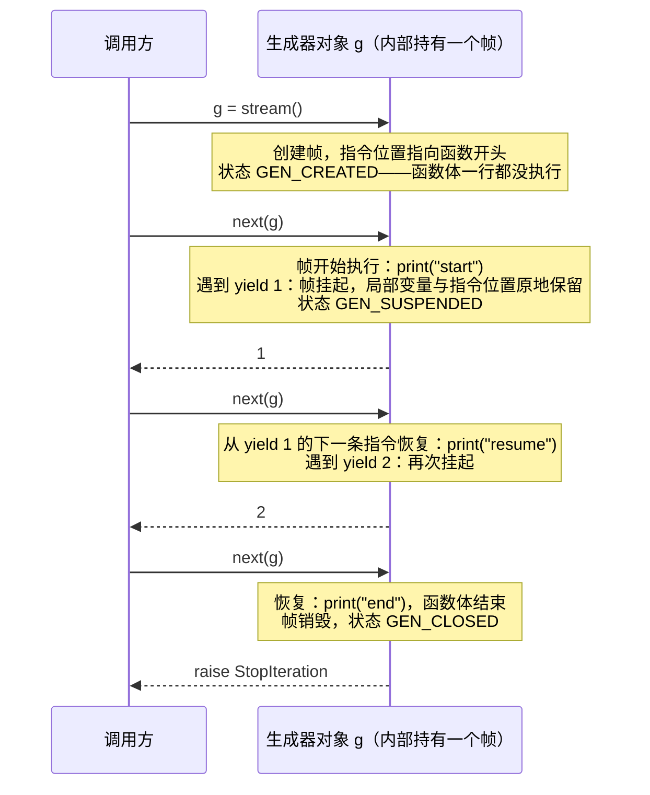

[上篇](/python-execution-model-scopes-imports-and-exceptions.html)讲的是代码怎么跑：源码编译成 code object，调用创建帧，名称在帧里按 LEGB 解析，`import` 找到并执行模块，异常沿帧链传播。本篇讲**对象怎么工作**——上篇开头那七行里剩下的五行：

```text
model(x)                           走的是 __call__，中间可能插入 hooks
for batch in loader                迭代协议 + 生成器的暂停与恢复
with torch.inference_mode()        上下文管理协议：进入时改状态、退出时恢复
@register("cuda")                  装饰器在模块导入时执行，注册表能否填上取决于谁导入了它
self.linear = nn.Linear(4, 4)      __setattr__ 拦截赋值，把子模块登记到 _modules
```

这五行分别在第三、三 / 五、六、四、二章展开，第四章会把上下两篇的机制串在一起，逐步追踪开头那个 `Runner` 从导入到异常的完整生命周期。

本篇只回答一个问题：

> **`Runner(model)`、`runner(batch)`、`runner.stream(batch)` 这几行背后，对象是怎么被创建的、属性和方法是怎么被找到的、语法是怎么交给对象自己决定的？**

答案分四层：类由 `type` 创建，`obj.attr` 是一个固定算法（描述符协议是它的可编程点）；`runner(batch)`、`for`、`with`、`[]` 这些语法查的是类型上的特殊方法；装饰器用上篇的闭包加本篇的描述符改写调用路径；生成器让上篇的帧挂起而不销毁。

## 一、总览

### 1. 例子与依赖关系

例子仍是上篇的 `runner.py`——一个用了装饰器注册表、上下文管理器、`__call__` 与生成器的极简推理组件：

```python
# runner.py
from contextlib import nullcontext

REGISTRY = {}


def registered(name):                        # 带参数的装饰器：注册表
    def decorator(cls):
        if name in REGISTRY:
            raise ValueError(f"duplicate registration: {name}")
        REGISTRY[name] = cls
        return cls

    return decorator


class InferenceContext:                      # 上下文管理器：进入/退出推理模式
    def __enter__(self):
        print("enter inference mode")
        return self

    def __exit__(self, exc_type, exc, tb):
        print("exit inference mode")
        return False


@registered("runner")
class Runner:
    def __init__(self, model, inference=True):
        self.model = model
        self.inference = inference

    def __call__(self, batch):               # 可调用协议
        context = InferenceContext() if self.inference else nullcontext()
        with context:
            return self.model(batch)

    def stream(self, batch):                 # 生成器：流式输出
        yield from self.model.generate(batch)
```

上篇解释了它被 `import` 时发生了什么（第 1 步）以及异常怎么传播（第 5 步）；本篇解释中间三步：`Runner(model)` 创建实例，`runner(batch)` 触发 `__call__` 并进入 `with`，`runner.stream(batch)` 创建生成器。

```text
类语句 ──type──► 类对象 ──__call__──► 实例 ──属性查找/描述符──► 方法、property
  ▲ [上篇第二章](/python-execution-model-scopes-imports-and-exceptions.html#二执行模型源码如何变成正在运行的代码) 类与对象模型      ▲ [上篇第三章](/python-execution-model-scopes-imports-and-exceptions.html#三作用域与闭包名称在哪里被解析) 对象协议：__call__、迭代、__getitem__ ...
  │
装饰器改写调用路径（[上篇第四章](/python-execution-model-scopes-imports-and-exceptions.html#四模块与导入系统代码如何被加载)）→ 生成器暂停帧（第二章）→ 上下文管理器管资源（第三章）→ 完整追踪（第四章）
```

各章之间的依赖是单向的：[上篇第二章](/python-execution-model-scopes-imports-and-exceptions.html#二执行模型源码如何变成正在运行的代码)的方法绑定、`property` 依赖描述符协议，所以描述符放在[上篇第二章](/python-execution-model-scopes-imports-and-exceptions.html#二执行模型源码如何变成正在运行的代码)内部讲，而不是拖到对象协议之后；[上篇第四章](/python-execution-model-scopes-imports-and-exceptions.html#四模块与导入系统代码如何被加载)装饰器同时依赖闭包（上篇[上篇第三章](/python-execution-model-scopes-imports-and-exceptions.html#三作用域与闭包名称在哪里被解析)）和描述符（本篇[上篇第二章](/python-execution-model-scopes-imports-and-exceptions.html#二执行模型源码如何变成正在运行的代码)），因此排在两者之后；第二章生成器建立在上篇[上篇第二章](/python-execution-model-scopes-imports-and-exceptions.html#二执行模型源码如何变成正在运行的代码)的帧之上；第三章 `contextlib` 的实现又建立在第二章的生成器之上。

### 2. 本文的章节安排

| 章 | 主题 | 内容 |
|---|---|---|
| 二 | 类与对象模型：对象如何被创建和查找 | `type`、属性查找算法、描述符、方法绑定与三种内建描述符、`__getattr__`、`__new__` / `__init__`、MRO 与 `super`、Mixin 与组合 |
| 三 | 对象协议：语法背后的特殊方法 | `__call__`、迭代协议、`__getitem__`、真值、`__eq__` / `__hash__` |
| 四 | 装饰器：用闭包和描述符改写调用路径 | 基本机制、`wraps`、参数化、类装饰器与注册、与描述符的叠放顺序、异步 |
| 五 | 生成器与惰性执行 | 帧的挂起、惰性的成本、`yield from`、关闭与清理 |
| 六 | 上下文管理器 | `with` 的展开、`contextlib`、AI-Infra 中的用法、异步版本 |
| 七 | 一个推理组件的完整运行时追踪 | 按导入、创建、调用、流式、异常五个阶段追踪 `Runner`，并归纳工程建议 |
| 八 | 本文小结 |  |
| 九 | 自测 | 5 道题 |

## 二、类与对象模型：对象如何被创建和查找

模块被导入、顶层代码执行时，`class Runner:` 语句创建了一个类对象。接下来 `Runner(model)` 创建实例，`runner.model`、`runner.stream` 读取属性。这一章回答的核心问题只有一个：**`obj.attr` 到底做了什么**。方法绑定、`property`、`classmethod`、`__getattr__`、`nn.Module` 把子模块藏在 `_modules` 里却能用 `self.linear` 访问——全部是这一个算法的不同分支。

### 1. 类也是对象：`type` 创建类

`class` 是运行时语句。执行它时，解释器：

1. 新建一个命名空间字典，在其中执行类体（所以类体里的 `def` 创建的是普通函数对象，并被放进这个字典）；
2. 调用元类（默认是 `type`）：`type(name, bases, namespace)`，得到类对象；
3. 把名称绑定到类对象。

```python
class Runner:
    def run(self, batch):
        return batch


print(type(Runner))                       # <class 'type'>
print(Runner.__mro__)                     # (<class 'Runner'>, <class 'object'>)
print(type(Runner.__dict__))              # <class 'mappingproxy'>   类属性字典的只读视图
print(type(Runner.__dict__["run"]))       # <class 'function'>       类里存的是普通函数
```

第 2 步可以手工做，效果完全相同：

```python
Runner = type("Runner", (object,), {"run": lambda self, batch: batch})
```

两个事实值得记住：**类的 `__dict__` 里存的方法就是普通函数对象**（后面 §5 解释它如何变成"方法"）；**类由 `type` 创建**，所以替换 `type` 为自定义元类就能干预类的创建——`nn.Module` 没有用元类，但许多 ORM、配置框架和 `abc.ABC` 用了。元类的用法在本系列第四篇展开，这里只需知道它是 `class` 语句的第 2 步。

### 2. 实例属性与类属性

实例有自己的 `__dict__`，类有类的 `__dict__`：

```python
class Demo:
    value = 10


obj = Demo()
print(obj.__dict__)                     # {}            实例字典是空的，value 在类上
obj.value = 20
print(obj.__dict__)                     # {'value': 20}
print(Demo.__dict__["value"], Demo.value, obj.value)   # 10 10 20
```

赋值 `obj.value = 20` 写的是实例字典，类属性不受影响。反过来，可变的类属性会被所有实例共享——`class Bad: items = []` 之后 `a.items.append(1)` 会让 `b.items` 也变成 `[1]`，因为没有任何赋值发生在实例上，`a.items` 读到的是类字典里的同一个列表。需要每实例独立的可变状态，在 `__init__` 里创建。

### 3. 属性查找算法：`object.__getattribute__`

现在可以给出核心算法。`obj.attr` 默认调用 `type(obj).__getattribute__(obj, "attr")`，对普通对象它的逻辑是：

```python
def __getattribute__(obj, name):                 # object.__getattribute__ 的等价伪代码
    cls = type(obj)
    cls_attr = lookup_in_mro(cls, name)          # ① 沿 cls.__mro__ 逐个查 __dict__，找到第一个就停

    if cls_attr is not None and is_data_descriptor(cls_attr):    # ② 数据描述符（有 __set__ 或 __delete__）优先
        return cls_attr.__get__(obj, cls)

    if name in obj.__dict__:                     # ③ 实例字典
        return obj.__dict__[name]

    if cls_attr is not None:
        if hasattr(cls_attr, "__get__"):         # ④ 非数据描述符（只有 __get__）：函数、classmethod、staticmethod
            return cls_attr.__get__(obj, cls)
        return cls_attr                          # ⑤ 普通类属性

    raise AttributeError(name)                   # ⑥ 都没有 → 抛出；若类定义了 __getattr__，解释器接着调它
```

用三个实验验证这个顺序。首先，数据描述符（`property` 有 `__set__`）赢过实例字典：

```python
class D:
    @property
    def value(self):
        return "from property"


d = D()
d.__dict__["value"] = "from instance dict"
print(d.value)          # from property      —— ② 先于 ③
```

其次，非数据描述符（普通函数）输给实例字典：

```python
class Runner2:
    def run(self):
        return "method"


r = Runner2()
r.__dict__["run"] = lambda: "instance attr"
print(r.run())          # instance attr      —— ③ 先于 ④
```

最后，§2 的 `obj.value = 20` 之所以能覆盖类属性 `10`，是因为 `int` 不是描述符，走的是 ③ 先于 ⑤。

这个顺序设计的意图：`property` 这类需要**控制读写**的东西必须不能被实例字典绕过，所以放最前；方法这类**只提供默认行为**的东西允许被实例覆盖（monkey patch 单个对象的方法就靠这一点），所以放实例字典之后。

### 4. 描述符协议：属性查找的可编程点

算法里的 ② 和 ④ 都在调用一个东西的 `__get__`。凡是定义了 `__get__`、`__set__` 或 `__delete__` 之一的对象，放在**类属性**位置上，就是描述符：

- 只有 `__get__`：**非数据描述符**，可被实例字典覆盖；
- 有 `__set__` 或 `__delete__`：**数据描述符**，优先于实例字典。

一个做类型校验的描述符：

```python
class Typed:
    def __init__(self, expected_type):
        self.expected_type = expected_type

    def __set_name__(self, owner, name):      # 类创建时被调用，拿到自己在类里的名字
        self.name = name

    def __get__(self, obj, objtype=None):
        if obj is None:                       # 通过类访问（Config.batch_size）时 obj 为 None
            return self
        return obj.__dict__.get(self.name)

    def __set__(self, obj, value):
        if not isinstance(value, self.expected_type):
            raise TypeError(f"{self.name} expects {self.expected_type.__name__}, got {type(value).__name__}")
        obj.__dict__[self.name] = value


class Config:
    batch_size = Typed(int)
    device = Typed(str)

    def __init__(self, batch_size, device):
        self.batch_size = batch_size          # 触发 Typed.__set__
        self.device = device


config = Config(32, "cuda")
config.batch_size = "big"                    # TypeError: batch_size expects int, got str
```

描述符必须放在类上才生效——算法第 ① 步只查类的 MRO，实例字典里的对象即便有 `__get__` 也不会被调用。

`__slots__` 是描述符的一个内建应用：`class S: __slots__ = ("a",)` 会让 `type` 为每个槽位在类上创建一个 `member_descriptor`（数据描述符），直接读写实例的固定内存偏移，实例因此不再需要 `__dict__`。第五篇讨论内存时会回到它。

### 5. 方法绑定、`classmethod`、`staticmethod`、`property`：描述符的四种形态

有了 §3 的算法和 §4 的协议，"方法"就不再需要单独解释：**函数对象实现了 `__get__`**，所以它是非数据描述符。

```python
class Runner3:
    def run(self, batch):
        return batch


r3 = Runner3()
print(Runner3.run)          # <function Runner3.run at 0x...>          通过类访问：__get__(None, cls) 返回函数本身
print(r3.run)               # <bound method Runner3.run of <Runner3 ...>>  通过实例访问：__get__(r3, cls) 返回绑定方法
print(r3.run.__self__ is r3, r3.run.__func__ is Runner3.run)          # True True
print(Runner3.__dict__["run"].__get__(r3, Runner3))                    # 手工调用 __get__，得到同样的绑定方法
```

绑定方法是一个小对象，持有实例（`__self__`）和原函数（`__func__`），调用时把 `__self__` 塞到第一个参数位置。`self` 不是关键字，只是这个协议约定的第一个参数。

`classmethod`、`staticmethod`、`property` 是三个内建的描述符类型，区别只在 `__get__` 返回什么，以及是否有 `__set__`：

```python
class K:
    @classmethod
    def c(cls): return cls
    @staticmethod
    def s(): return "s"
    @property
    def p(self): return "p"


print(type(K.__dict__["c"]), type(K.__dict__["s"]), type(K.__dict__["p"]))
# <class 'classmethod'> <class 'staticmethod'> <class 'property'>
print(hasattr(classmethod, "__set__"), hasattr(staticmethod, "__set__"), hasattr(property, "__set__"))
# False False True
```

| 类属性上的对象 | `__get__(obj, cls)` 返回 | 数据描述符？ | 效果 |
| :--- | :--- | :--- | :--- |
| 函数 | `obj` 为 `None` 时返回函数；否则返回绑定 `obj` 的方法 | 否 | 实例方法 |
| `classmethod` | 无论怎么访问，都返回绑定 **`cls`** 的方法 | 否 | 第一个参数是类 |
| `staticmethod` | 原函数本身，不绑定任何东西 | 否 | 普通函数挂在类命名空间 |
| `property` | 调用 `fget(obj)` 的结果 | **是**（有 `__set__`，未提供 setter 时抛 `AttributeError`） | 计算属性，且不可被实例字典覆盖 |

从这张表能直接推出三者的用法：

- **`classmethod` 的价值在于 `cls` 是"实际被调用的那个类"**。`Sub.c()` 和 `Sub().c()` 都返回 `Sub`，不是 `K`。这让它成为替代构造函数的标准写法：

  ```python
  class Runner:
      @classmethod
      def from_config(cls, config):
          return cls(model=config["model"], device=config.get("device", "cpu"))


  class GPURunner(Runner): ...


  GPURunner.from_config(cfg)     # 创建的是 GPURunner 实例
  ```

  对象尚未存在，所以不能是实例方法；需要构造"当前类或子类"，所以不该写死 `Runner(...)`——`cls(...)` 自动跟随继承。

- **`staticmethod` 只是命名空间归属**。既不需要实例也不需要类的函数，放在类里是为了表达"逻辑上属于它"；很多时候放模块级更简单。
- **`property` 是数据描述符**，所以 §3 的第一个实验成立。它适合"看起来像字段、实际需要计算或校验"的场景；不适合隐藏昂贵操作——调用方看到 `runner.device` 不会预期它去查询硬件。

**与 Java 的对照**

| Python | Java 中最接近的形式 | 差异 |
| :--- | :--- | :--- |
| 实例方法 | 实例方法 | 相同；Python 的 `self` 显式出现在签名里 |
| `staticmethod` | `static` 方法 | 相同 |
| `property` | getter/setter 约定，或 record 的访问器 | Java 没有语法级支持，`obj.getX()` 不能写成 `obj.x` |
| `classmethod` | 静态工厂方法 | 见下 |

`classmethod` 与 Java 静态工厂的差异需要说准确。Java 的静态方法**不按接收者分派**：`GPURunner.fromConfig(cfg)` 在编译期就被解析为 `Runner.fromConfig(cfg)`，方法体内没有任何途径知道调用方写的是 `GPURunner`，`new Runner(...)` 写死了就只能造 `Runner`：

```java
class Runner {
    static Runner fromConfig(Map<String, Object> cfg) {
        return new Runner((Model) cfg.get("model"));     // 只能造 Runner；GPURunner.fromConfig(cfg) 得到的也是 Runner
    }
}
class GPURunner extends Runner { ... }
```

要让工厂创建子类，必须由调用方**显式传入**类型信息。两种写法：

```java
// 写法一：Class<T> 令牌 + 反射
static <T extends Runner> T fromConfig(Class<T> cls, Map<String, Object> cfg) throws Exception {
    return cls.getDeclaredConstructor(Model.class).newInstance((Model) cfg.get("model"));
}
GPURunner r = Runner.fromConfig(GPURunner.class, cfg);

// 写法二：把构造函数当参数传进来
static <T extends Runner> T fromConfig(Function<Model, T> ctor, Map<String, Object> cfg) {
    return ctor.apply((Model) cfg.get("model"));
}
GPURunner r = Runner.fromConfig(GPURunner::new, cfg);
```

这并不难写，但类对象是调用方**传**进去的；Python 的 `classmethod` 则由描述符协议在 `__get__` 时**自动**把实际的类绑定进 `cls`：

```python
class Runner:
    @classmethod
    def from_config(cls, cfg):
        return cls(cfg["model"])          # cls 是谁调的就是谁

class GPURunner(Runner): ...

GPURunner.from_config(cfg)                # 得到 GPURunner，不用传任何类型信息
```

两者能达到同样的目的，区别在"谁负责提供类对象"：Java 靠调用方传参，Python 靠属性查找机制注入。

### 6. `__getattr__` 与 `__getattribute__`：查找失败后的钩子

§3 算法的第 ⑥ 步：`__getattribute__` 抛出 `AttributeError` 之后，如果类定义了 `__getattr__`，解释器会调用它作为最后手段。

```python
class Cfg:
    def __init__(self):
        self.a = 1

    def __getattr__(self, name):
        print("  __getattr__ called for", name)
        return None


c = Cfg()
print(c.a)      # 1                                —— 正常查找命中，__getattr__ 不参与
print(c.b)      # __getattr__ called for b / None  —— 只在失败后调用
```

`__getattribute__` 则拦截**所有**属性访问，包括 `self.__dict__`。重写它时必须用 `object.__getattribute__(self, name)` 去取真实值，否则无限递归。业务代码几乎不需要它。

`__getattr__` 有一个隐蔽的陷阱：**它会掩盖 `property` 内部的 `AttributeError`**。

```python
class P:
    @property
    def v(self):
        raise AttributeError("bug inside property")   # 比如 property 里访问了一个拼错的字段

    def __getattr__(self, name):
        return f"fallback({name})"


print(P().v)    # fallback(v)
```

`property` 的 getter 抛出 `AttributeError`，`__getattribute__` 把它当作"没找到 `v`"，转而调用 `__getattr__("v")`——真正的 bug 被吞掉，换成一个看似合理的返回值。有 `__getattr__` 的类里，`property` 中的异常应转换成其他类型再抛出。

一个真实的例子是 `torch.nn.Module`。它把参数、缓冲区和子模块分别存在 `_parameters`、`_buffers`、`_modules` 三个字典里，**不放在实例 `__dict__`**。这依靠两个钩子配合（PyTorch 2.9.0，`torch/nn/modules/module.py`）：

```python
# Module.__setattr__ 的骨架
def __setattr__(self, name, value):
    if isinstance(value, Parameter):
        remove_from(self.__dict__, self._buffers, self._modules, ...)   # 保证同名只存在于一处
        self.register_parameter(name, value)
    elif isinstance(value, Module):
        remove_from(self.__dict__, self._parameters, self._buffers, ...)
        self._modules[name] = value
    else:
        super().__setattr__(name, value)                                  # 普通属性才进 __dict__


# Module.__getattr__ 的骨架
def __getattr__(self, name):
    if name in self.__dict__["_parameters"]: return self.__dict__["_parameters"][name]
    if name in self.__dict__["_buffers"]:    return self.__dict__["_buffers"][name]
    if name in self.__dict__["_modules"]:    return self.__dict__["_modules"][name]
    raise AttributeError(f"'{type(self).__name__}' object has no attribute '{name}'")
```

于是 `self.linear = nn.Linear(4, 4)` 被 `__setattr__` 截获，写进 `_modules`；之后 `self.linear` 走 §3 的算法在类和实例字典都找不到，落到 `__getattr__`，从 `_modules` 取回。这就是 `parameters()`、`state_dict()`、`.to(device)` 能够递归遍历所有子模块的原因——它们只需遍历三个字典，而不需要扫描 `__dict__` 猜哪些属性是模块。代价是每次访问子模块都多走一次失败查找加一次 Python 级函数调用，所以在热路径上 PyTorch 自己也会先把 `self.linear` 取到局部变量。

模块级也有同样的钩子（PEP 562）：在模块顶层定义 `__getattr__(name)`，访问不存在的模块属性时会被调用。`torch/__init__.py` 用它做两件事——对已废弃的名字发出 `DeprecationWarning` 后返回替代品，以及对少数子模块做惰性导入（第一次访问时才 `importlib.import_module`）。

### 7. 对象创建：`__new__`、`__init__` 与 `type.__call__`

`Runner(model)` 是对**类对象**的调用，按第三章的可调用协议，执行的是 `type(Runner).__call__`，即 `type.__call__`。它做两件事：

```python
def __call__(cls, *args, **kwargs):          # type.__call__ 的等价伪代码
    obj = cls.__new__(cls, *args, **kwargs)  # 分配并返回实例
    if isinstance(obj, cls):
        obj.__init__(*args, **kwargs)        # 初始化实例；返回值必须是 None
    return obj
```

`__new__` 是静态方法（唯一一个不需要写 `@staticmethod` 的特例），负责"造出对象"；`__init__` 负责"填充对象"。重写 `__new__` 的场景很少：不可变类型（`int`、`tuple`、`str`）的子类化必须在 `__new__` 里改值，因为 `__init__` 拿到的已经是造好的不可变对象；单例、实例缓存、根据参数返回不同子类的工厂类也在这里做。其他情况只写 `__init__`。

如果 `__new__` 返回的不是 `cls` 的实例，`__init__` 不会被调用——这是"工厂类"模式的机制基础。

### 8. 继承、MRO 与协作式 `super()`

属性查找算法第 ① 步"沿 `cls.__mro__` 查找"，MRO（Method Resolution Order）就是这个顺序。单继承时它就是从子类到 `object` 的链；多继承时由 C3 线性化算法计算，保证子类先于父类、多个父类之间保持声明顺序：

```python
class A:
    def run(self): return ["A"]
class B:
    def run(self): return ["B"]
class C(A, B): pass


print([k.__name__ for k in C.__mro__], C().run())    # ['C', 'A', 'B', 'object'] ['A']
```

`C().run()` 找到 `A.run` 就停，**不会**自动接着调 `B.run`。想让链上的每一层都执行，每一层必须自己调 `super()`：

```python
class Base:
    def run(self): return ["base"]
class Logging:
    def run(self):
        result = super().run(); result.append("logging"); return result
class Metrics:
    def run(self):
        result = super().run(); result.append("metrics"); return result
class Run(Logging, Metrics, Base): pass


print([k.__name__ for k in Run.__mro__])   # ['Run', 'Logging', 'Metrics', 'Base', 'object']
print(Run().run())                         # ['base', 'metrics', 'logging']
```

`Logging.run` 里的 `super().run()` 调到的是 `Metrics.run`，不是 `Base.run`——`super()` 的含义是"**在实例的 MRO 中，当前类之后的下一个**"，它取决于实例的类型，而不是写代码时看到的父类。`Logging` 类的作者并不知道 `Metrics` 的存在，链条却能接上，这就是协作式多继承。

零参数 `super()` 之所以知道"当前类"是谁，是因为编译器在使用了 `super()` 的方法里注入了一个名为 `__class__` 的闭包变量（可以用 `Child.run.__code__.co_freevars` 看到 `('__class__',)`）——[上篇第三章](/python-execution-model-scopes-imports-and-exceptions.html#三作用域与闭包名称在哪里被解析)的 cell 机制在这里又出现了一次。

协作式多继承的约定：每一层都调 `super()`（包括 `__init__`）；同名方法签名兼容，通常用 `*args, **kwargs` 透传；不假设 `super()` 指向某个具体类。任何一层漏掉 `super()`，它之后的所有层都会被跳过。声明顺序不一致时 C3 会直接拒绝：`class X(A, C)` 抛出 `TypeError: Cannot create a consistent method resolution order (MRO) for bases A, C`，因为 `C` 已经要求 `A` 在自己之后。

### 9. Mixin 与组合

Mixin 是协作式多继承的一种受限用法：一个只提供横向能力（日志、指标、序列化）、不代表完整实体、不持有业务依赖的类，被放在基类列表前部：

```python
class LoggingMixin:
    def log(self, message):
        print(f"[LOG] {message}")


class Runner(LoggingMixin, BaseRunner):
    def run(self):
        self.log("start")
```

Mixin 没有绕开 MRO 的复杂性，只是把它限制在一个容易验证的范围内。约束是：职责单一；对宿主类的要求明确；`__init__` 遵守协作式 `super()`；用 `__mro__` 和测试固定实际顺序。

而 `model`、`scheduler`、`tokenizer` 这类**业务依赖**，应该用组合——持有而不是继承：

```python
class InferenceRunner:
    def __init__(self, model, scheduler, tokenizer):
        self.model = model
        self.scheduler = scheduler
        self.tokenizer = tokenizer
```

组合的依赖是显式的（构造参数），可以注入替身，不依赖 MRO 和 `super()` 协议。选择规则：

| 关系 | 方式 |
| :--- | :--- |
| 稳定的"是一种"关系、遵守框架协议（如 `nn.Module`） | 继承 |
| 复用独立的横向能力 | Mixin，谨慎 |
| 给单个函数加日志、重试、tracing | 装饰器（第四章） |
| 管理业务依赖 | 组合 |

**与 Java 的对照**：Java 单继承加接口，接口的 default 方法能提供一部分 Mixin 的效果，但没有 MRO——两个接口的同名 default 方法冲突时必须在实现类里显式选择，不存在"沿链自动接力"的 `super()`。Java 的 `super.method()` 永远指向直接父类，是静态的；Python 的 `super()` 是动态的，取决于实例的 MRO。这一点是 Java 程序员读 Python 多继承代码时最容易误判的地方。

## 三、对象协议：语法背后的特殊方法

第二章解释了 `obj.attr`。但 `runner(batch)`、`for x in loader`、`batch[0]`、`if tensor:`、`with ctx:` 这些**不是**属性访问的语法，Python 也是交给对象自己决定的——通过一组以双下划线命名的特殊方法。这一章讨论其中最常见的几个；`with` 和 `yield` 分别留给第八、九章。

### 1. 语法到特殊方法的映射，且在类型上查找

| 表达式 | 特殊方法 |
| :--- | :--- |
| `x(...)` | `__call__` |
| `for item in x` | `__iter__`，然后对迭代器反复 `__next__` |
| `x[key]`、`x[key] = v`、`del x[key]` | `__getitem__`、`__setitem__`、`__delitem__` |
| `len(x)` | `__len__` |
| `if x`、`bool(x)` | `__bool__`，缺失时退化为 `__len__` |
| `x == y`、`hash(x)` | `__eq__`、`__hash__` |
| `x + y` | `__add__`，失败时尝试 `y.__radd__` |
| `with x:` | `__enter__`、`__exit__` |
| `obj.attr` | `__getattribute__`、`__getattr__`（第二章） |

有一个规则与第二章的属性查找不同：**特殊方法由解释器直接在类型上查找，跳过实例字典**。

```python
class C:
    def __call__(self):
        return "type-level"


c = C()
c.__call__ = lambda: "instance-level"
print(c())              # type-level        —— 解释器查的是 type(c).__call__
print(c.__call__())     # instance-level    —— 普通属性访问才看实例字典
```

这是性能考虑的结果：`a + b` 如果每次都走完整的属性查找算法太慢，CPython 在类型对象上为每个特殊方法维护了一个槽位（slot），运算时直接取槽位。后果是"给单个对象打补丁换掉 `__call__`"不起作用——必须换类，或者在类的 `__call__` 里做转发。

### 2. 可调用对象：`__call__`

实现 `__call__` 的实例可以像函数一样被调用。第一章的 `Runner.__call__` 就是这样让 `runner(batch)` 成立的。相比函数，可调用对象能同时携带配置、缓存、依赖和生命周期状态，因此模型、推理器、预处理器、Hook、Loss 大多是可调用对象。

`nn.Module` 是最典型的例子。`model(x)` 不直接调 `forward`，而是 `Module.__call__`——在 PyTorch 2.9.0 中它被赋值为 `_wrapped_call_impl`（`torch/nn/modules/module.py`）：先检查有没有 `torch.compile` 生成的编译版本，再进入 `_call_impl`；`_call_impl` 在没有任何 hook 注册时直接调用 `forward`，否则依次执行 forward pre-hooks、`forward`、forward hooks，并处理 backward hooks 的挂载。所以直接调 `model.forward(x)` 会绕过全部 hook——这就是文档要求"调用模块而不是 forward"的机制原因。

### 3. 迭代协议：可迭代对象与迭代器

`for item in x` 展开为：

```python
it = iter(x)               # 调 x.__iter__()，得到迭代器
while True:
    try:
        item = next(it)    # 调 it.__next__()
    except StopIteration:
        break
    ...
```

**可迭代对象**（iterable）实现 `__iter__` 并返回一个迭代器；**迭代器**（iterator）实现 `__next__`，并且自己的 `__iter__` 返回自己。两者常被混为一谈，但差别决定了能否重复遍历：

```python
lst = [1, 2]
print(iter(lst) is lst)                 # False   列表每次 iter() 返回一个新迭代器，可反复遍历


class CountDown:                        # 既是可迭代对象又是迭代器
    def __init__(self, start): self.current = start
    def __iter__(self): return self
    def __next__(self):
        if self.current <= 0: raise StopIteration
        self.current -= 1
        return self.current + 1


c = CountDown(2)
print(list(c), list(c))                 # [2, 1] []    —— 第二次遍历是空的：迭代器耗尽后不会重置
```

`torch.utils.data.DataLoader` 是可迭代对象——每个 epoch 的 `for batch in loader` 都调用 `loader.__iter__()` 创建一个**新的**迭代器（在多 worker 模式下这意味着重新启动 worker 进程）。而 `loader.__iter__()` 返回的那个对象是迭代器，用完即弃。理解这一层，就能解释为什么 `iter(loader)` 拿出来手工 `next()` 的对象不能跨 epoch 复用。

还有一条历史兼容规则：没有 `__iter__` 但有 `__getitem__` 的对象也可迭代——解释器从 0 开始调 `__getitem__` 直到 `IndexError`。`Dataset` 子类只实现 `__getitem__` 和 `__len__` 就能被 `for` 遍历，靠的就是它。

### 4. `__getitem__` 与容器协议

```python
class Batch:
    def __init__(self, values): self.values = values
    def __getitem__(self, index): return self.values[index]


batch = Batch([1, 2, 3])
print(batch[0], batch[1:])              # 1 [2, 3]     —— 切片对象 slice(1, None, None) 原样传给 __getitem__
```

`__getitem__` 收到的 `index` 可以是整数、切片、元组（`x[i, j]` 传入 `(i, j)`）、甚至任意对象——Tensor 的高级索引 `t[mask]`、`t[..., 0]` 全部走这一个方法，由实现自己解释参数。

### 5. 真值判断

`if x:` 先找 `__bool__`，没有则用 `__len__` 是否为零，两者都没有则一律为真。这带来一个 AI-Infra 特有的陷阱：多元素 Tensor 的真值没有明确定义，PyTorch 会抛 `RuntimeError: Boolean value of Tensor with more than one value is ambiguous`。所以 `if tensor:`、`tensor and other`、`x if mask else y` 在 Tensor 上都不安全，要用 `.any()`/`.all()`/`torch.where` 明确意图。同理，`if batch:` 判断"是否有数据"时，要确认 `Batch` 类实现了 `__len__` 或 `__bool__`，否则永远为真。

### 6. `__eq__` 与 `__hash__`

`==` 调 `__eq__`；作为字典键或集合元素则需要 `__hash__`。两者有一条契约：**相等的对象必须有相同的哈希值**。为了防止违反它，只定义 `__eq__` 会让 Python 把 `__hash__` 设为 `None`：

```python
class User:
    def __init__(self, uid): self.uid = uid
    def __eq__(self, other): return isinstance(other, User) and self.uid == other.uid


print(User.__hash__)     # None
{User(1)}                # TypeError: unhashable type: 'User'
```

需要哈希就显式实现 `__hash__`，并且只使用参与 `__eq__` 且在对象生命周期内不变的字段。`@dataclass(frozen=True)` 会自动生成一致的两者；可变的 dataclass 默认也是不可哈希的，原因相同。

### 7. 与 Java 的对照

Java 的做法是**接口**：想被 `for-each` 遍历就实现 `Iterable<T>`，想能 `try-with-resources` 就实现 `AutoCloseable`，`equals`/`hashCode` 契约与 Python 完全一致（`HashMap` 同样依赖它）。Python 的特殊方法是**协议**：不需要声明实现了什么，只要方法存在、签名对得上，语法就生效。

差异带来两点后果：Python 里"这个对象能不能 `for`"无法从类型声明得知，只能看有没有 `__iter__`（第二篇的 `Protocol` 就是为了给这类协议补上静态描述）；Java 没有对应 `__call__` 的机制，"可调用对象"要么是函数式接口的实例、要么是显式的 `.apply()`/`.call()`，`model(x)` 这种写法不存在，`nn.Module` 那种"在调用路径上插 hook"只能靠动态代理或 AOP 实现。

## 四、装饰器：用闭包和描述符改写调用路径

第一章的 `@registered("runner")` 让 `Runner` 在被定义的同时进入注册表。装饰器的全部机制在前面已经准备好了：函数是对象（[上篇第二章](/python-execution-model-scopes-imports-and-exceptions.html#二执行模型源码如何变成正在运行的代码)），闭包能记住参数（[上篇第三章](/python-execution-model-scopes-imports-and-exceptions.html#三作用域与闭包名称在哪里被解析)），类属性上的函数是描述符（第二章）。这一章把它们组装起来。

### 1. 基本机制

```python
def log_call(func):
    def wrapper(*args, **kwargs):
        print("calling", func.__name__)
        return func(*args, **kwargs)
    return wrapper


@log_call
def predict(x):
    return x * 2
```

`@log_call` 是语法糖，等价于在 `def` 执行完之后立刻做一次重新绑定：

```python
def predict(x): ...
predict = log_call(predict)
```

所以：装饰器在**定义时**执行一次（模块导入时、类体执行时），返回的对象在**每次调用**时执行。此后名称 `predict` 指向 `wrapper`，原函数只存在于 `wrapper` 的闭包 cell 里。多个装饰器从下往上应用：

```python
@outer
@inner
def run(): ...
# run = outer(inner(run))     调用时先进 outer 的 wrapper，再进 inner 的
```

### 2. 装饰器与闭包的关系

`wrapper` 能在 `log_call` 返回之后仍然找到 `func`，靠的是[上篇第三章](/python-execution-model-scopes-imports-and-exceptions.html#三作用域与闭包名称在哪里被解析)的 cell：`wrapper.__closure__[0].cell_contents is predict_original`。闭包是实现装饰器最常见的方式，但不是必需的——任何"接收可调用对象、返回可调用对象"的东西都是装饰器，包括类：

```python
class LogCall:
    def __init__(self, func):
        self.func = func

    def __call__(self, *args, **kwargs):
        print("calling", self.func.__name__)
        return self.func(*args, **kwargs)


@LogCall
def predict(x): ...
```

状态少用闭包，状态多、需要暴露方法（如 `cache.clear()`）用类——与[上篇第三章](/python-execution-model-scopes-imports-and-exceptions.html#三作用域与闭包名称在哪里被解析) §5 的取舍一致。注意类实现的装饰器用在**方法**上时有一个坑，见 §6。

### 3. `functools.wraps` 与 `__wrapped__`

`wrapper` 是一个新函数对象，它的 `__name__`、`__doc__`、`__module__`、`__qualname__`、`__annotations__` 都是自己的。不处理的话，`predict.__name__` 变成 `'wrapper'`，日志、文档、`pickle`、测试框架的参数化 ID 全部受影响。`functools.wraps` 把这些元数据从原函数复制过来，并额外设置 `wrapper.__wrapped__ = func`：

```python
from functools import wraps


def log_call(func):
    @wraps(func)
    def wrapper(*args, **kwargs):
        return func(*args, **kwargs)
    return wrapper
```

`__wrapped__` 让 `inspect.signature` 能穿透装饰器看到原始签名，也让调试时可以用 `predict.__wrapped__` 拿回原函数。`wraps` 复制的只是元数据，不改变行为：包装器仍然可能改变参数校验、返回值、异常类型和执行时机。

### 4. 带参数的装饰器

`@retry(max_attempts=3)` 多一层：先用参数调用 `retry`，得到真正的装饰器，再用它装饰函数。

```python
def retry(max_attempts, exceptions=(TimeoutError,)):
    def decorator(func):
        @wraps(func)
        def wrapper(*args, **kwargs):
            for attempt in range(max_attempts):
                try:
                    return func(*args, **kwargs)
                except exceptions:
                    if attempt == max_attempts - 1:
                        raise
        return wrapper
    return decorator
```

```text
retry(max_attempts)  →  decorator(func)  →  wrapper(*args, **kwargs)
   配置层                 装饰层                运行层
```

`max_attempts` 和 `exceptions` 经由两层闭包到达 `wrapper`。重试装饰器应只捕获明确可重试的异常，让其余异常原样传播——`except Exception` 会把断言失败、类型错误和 CUDA OOM 一起重试。

### 5. 装饰类：注册表

先说清装饰器**接收什么**：`@deco` 写在什么定义的上面，`deco` 收到的就是那个定义产生的对象——`def` 上面收到函数对象，`class` 上面收到类对象，`async def` 上面收到协程函数；因为方法也是函数，写在方法上面收到的同样是函数（§6 讲它与 `property` / `staticmethod` 叠放时的顺序）。没有第四种：Python 只允许把装饰器写在 `def` 和 `class` 前面。至于装饰器**返回**什么则完全自由——通常是同类型的替代品（包装函数、原类），但也可以是任何对象：`@property` 收到函数、返回一个 `property` 描述符对象；`@functools.lru_cache` 收到函数、返回一个带 `cache_info()` 方法的可调用对象；`@dataclass` 收到类、原地改造后返回同一个类。

装饰器的参数可以是类，返回原类不变、只做登记，就是第一章的 `registered`：

```python
def registered(name):
    def decorator(cls):
        if name in REGISTRY:
            raise ValueError(f"duplicate registration: {name}")
        REGISTRY[name] = cls
        return cls
    return decorator
```

由 §1 的时机规则和[上篇第四章](/python-execution-model-scopes-imports-and-exceptions.html#四模块与导入系统代码如何被加载) §6 的导入规则可推出它的全部行为：注册发生在类定义执行时，也就是模块被导入时；模块没被导入则注册表为空；模块以两个名字导入则第二次触发 `duplicate registration`——这正是[上篇第四章](/python-execution-model-scopes-imports-and-exceptions.html#四模块与导入系统代码如何被加载) §4 那个 `__main__`/`app` 双重导入实验里看到的报错。重复注册抛异常而不是静默覆盖，是刻意的：它把"同一个文件被导入了两次"这个隐蔽问题变成一个显眼的启动失败。

### 6. 装饰方法时的叠放顺序：与描述符的交互

装饰器应用在**类体执行时**，此时 `def` 产生的还是普通函数（第二章 §1），描述符协议要等到属性访问时才起作用。这决定了几件事：

```python
class Runner:
    @classmethod
    @log_call                  # 先应用：包装的是普通函数，wrapper 还是普通函数
    def create(cls): ...       # 再应用 classmethod：把 wrapper 包成 classmethod 对象
```

- `log_call` 必须在 `classmethod`/`staticmethod`/`property` **下面**。反过来写，`log_call` 收到的是一个 `classmethod` 对象，它不可调用，`wrapper` 里 `func(*args)` 会报 `TypeError: 'classmethod' object is not callable`。
- `wrapper(*args, **kwargs)` 的 `args[0]` 是 `self`/`cls`——因为 `wrapper` 作为普通函数放在类上，本身就是非数据描述符，绑定后 `self` 会正常传入。这是函数式装饰器能"透明"用于方法的原因。
- §2 那种用类实现的装饰器**不能**透明用于方法：`LogCall` 实例没有 `__get__`，不是描述符，`obj.method` 得到的是 `LogCall` 实例本身，调用时不会传 `self`（报 `TypeError: S.m() missing 1 required positional argument: 'self'`）。要修复就给 `LogCall` 加一个 `__get__`，返回 `functools.partial(self, obj)` 或 `types.MethodType(self, obj)`。

第二章的知识在这里直接决定了代码能不能跑。

### 7. 同步与异步装饰器

`async def` 函数被调用时只返回协程对象，不执行函数体。同步 `wrapper` 包裹异步函数时，`func(*args)` 立即返回一个协程，`wrapper` 的"结束"日志在函数体真正运行之前就打出来了，异常也捕获不到。异步函数需要异步包装器：

```python
def async_log_call(func):
    @wraps(func)
    async def wrapper(*args, **kwargs):
        print("start")
        result = await func(*args, **kwargs)
        print("end")
        return result
    return wrapper
```

需要同时支持两种函数的装饰器，用 `inspect.iscoroutinefunction(func)` 分派。并发与异步在本系列第三篇展开。

### 8. 与 Java 的对照

Java 的注解（`@Transactional`、`@Retryable`）只是**元数据**，本身不改变任何行为；行为来自框架在运行时扫描注解、生成代理对象（Spring AOP 的 JDK 动态代理或 CGLIB 子类）并拦截调用。Python 的装饰器则是**普通函数调用**，在定义处直接替换掉目标对象，没有框架也能工作。

后果是双向的：Python 装饰器透明得多——`grep` 就能找到它做了什么，调试时能直接进 `wrapper`；但它也没有 Java 代理的"边界"——Spring 的自调用不经过代理是常见坑，Python 里则是 §6 的描述符顺序和 §7 的同步/异步区分。两边共同的原则是：被包装的调用路径必须能被开发者看到。

## 五、生成器与惰性执行

[上篇第二章](/python-execution-model-scopes-imports-and-exceptions.html#二执行模型源码如何变成正在运行的代码)说函数调用创建一个帧，返回时销毁它。生成器打破了这个规则：`yield` 让帧**挂起**而不销毁，下次 `next()` 时从原地恢复。第一章的 `Runner.stream` 用它实现流式输出。

### 1. `yield`：帧被挂起而不是销毁

```python
import inspect


def stream():
    print("  start")
    yield 1
    print("  resume")
    yield 2
    print("  end")


g = stream()
print(type(g), inspect.getgeneratorstate(g))   # <class 'generator'> GEN_CREATED   —— 函数体一行都没执行
print(next(g))                                  #   start / 1
print(inspect.getgeneratorstate(g))            # GEN_SUSPENDED
print(next(g))                                  #   resume / 2
next(g)                                         #   end → StopIteration；状态变为 GEN_CLOSED
```

把这段执行画出来——左边是调用方，右边是生成器对象里那个帧：



调用生成器函数不执行函数体，只创建一个生成器对象，它内部持有一个帧（`g.gi_frame`）；第一次 `next()` 才开始执行；到 `yield` 处暂停，帧里的局部变量、指令位置全部保留（`g.gi_frame.f_locals` 可以直接看到）；函数体结束时抛出 `StopIteration`。普通函数的帧在 `return` 时销毁，生成器的帧在两次 `next()` 之间一直活着——这就是"惰性"的全部实现。生成器同时实现了 `__iter__`（返回自己）和 `__next__`，所以它是第三章意义上的迭代器，可以直接放进 `for`。

### 2. 惰性的价值与成本

生成器让"生产一个、消费一个"成为默认模式，不需要把全部结果放进内存：

```python
def read_lines(path):
    with open(path) as file:
        for line in file:
            yield line
```

流式 Token 输出、大数据集分片读取、Batch 生成、日志消费都是这个模式。但惰性有两个经常被忽视的成本：

- **生成器持有资源的时间等于它存活的时间**。上面 `read_lines` 的文件句柄在第一次 `next()` 时打开，要到生成器结束或被关闭时才关——如果消费方中途 `break` 并把生成器丢在一边，文件就一直开着（§4）。GPU 张量、数据库游标、进程间队列同理。
- **错误延迟出现**。生成器函数里的 bug 在 `next()` 时才暴露，traceback 的调用方是消费者而不是创建者。

### 3. `yield from`

`yield from sub()` 把 `sub` 产生的每个值直接转发给外层的消费者，同时把 `send()`、`throw()`、`close()` 也透传给子生成器，并且能拿到子生成器的返回值：

```python
def sub():
    yield 1
    return "sub-result"


def outer():
    result = yield from sub()
    print("sub returned:", result)      # sub returned: sub-result
```

它不只是嵌套 `for` 的简写。`Runner.stream` 用 `yield from self.model.generate(batch)` 把模型的生成器**原样**暴露给调用方，包括调用方 `close()` 时能一路传到模型层面做清理。`async`/`await` 在语法上就是从 `yield from` 演化来的。

### 4. 关闭与清理：`GeneratorExit`、`finally` 与 `break`

`g.close()` 在生成器挂起的 `yield` 处抛入 `GeneratorExit`，让 `try/finally` 和 `with` 的清理逻辑有机会执行：

```python
def reader():
    print("  open")
    try:
        yield 1
        yield 2
    finally:
        print("  close file")


r = reader()
next(r)          #   open
r.close()        #   close file
```

`for` 循环正常跑完会耗尽生成器，`finally` 自然执行；但 `break` 只是**退出循环**，不会关闭生成器：

```python
r = reader()
for v in r:
    break
print("after break")      # 此时 "close file" 还没有出现
del r                     #   close file   —— 引用计数归零时，生成器的析构才调用 close()
```

在 CPython 里，生成器对象被回收时会自动 `close()`，所以上面的例子在 `del` 后立刻清理。但依赖这一点是脆弱的：生成器被别处引用（放进列表、被 traceback 持有、被闭包捕获）就不会及时回收；在其他实现或存在循环引用时，回收时机不确定。**需要确定性清理的生成器，要么由消费方在 `finally` 里显式 `close()`，要么用 `contextlib.closing(gen)` 包起来放进 `with`。** 对象回收的细节在本系列第五篇。

### 5. 与 Java 的对照

Java 的 `Iterator`/`Stream` 也是惰性的，但它们是**对象**，"暂停"靠的是对象字段记录状态，每一步的状态机要自己写；Python 的生成器把状态机交给帧，一个 `yield` 就完成了。Java 没有对应 `yield` 的语言机制（Loom 的 `Continuation` 是内部 API），流式响应通常靠回调或 `Flow.Publisher`。另一方面，Java 的 `Stream` 有明确的"终止操作"边界，而 Python 的生成器随时可能被半途丢弃，所以 §4 的清理问题在 Java 中要少得多。

## 六、上下文管理器：把资源生命周期交给协议

第五章的结论是"资源的释放时机不能靠猜"。`with` 语句就是为此设计的：把"进入/退出"两个动作绑定到一个代码块上，无论块内是正常结束、`return`、还是抛异常，退出动作都执行。第一章的 `InferenceContext` 和 `torch.inference_mode()` 都是这个协议。

### 1. `with` 的展开

```python
with resource() as value:
    use(value)
```

等价于：

```python
manager = resource()
value = manager.__enter__()
normal_exit = True
try:
    use(value)
except BaseException as exc:
    normal_exit = False
    if not manager.__exit__(type(exc), exc, exc.__traceback__):
        raise                                   # __exit__ 返回假值 → 异常继续传播
finally:
    if normal_exit:
        manager.__exit__(None, None, None)      # 正常结束、return、break、continue 都走这里
```

（PEP 343 的官方展开就是 try / except / finally 这种形状。常见的 try / except / **else** 写法是错的：块内 `return` 或 `break` 时 `else` 分支不会执行，`__exit__` 就漏掉了——本地 3.12 验证过，用 `else` 版本在 `return` 时上下文管理器不会退出。）

由展开可以读出几条规则，每一条都在实验中验证过：

- `__enter__` 抛异常时，`__exit__` **不会**被调用——资源还没获取，无需释放；
- `__exit__` 收到异常三元组，返回 `True` 表示**抑制**该异常（块外看不到），返回 `False`/`None` 则异常照常传播；`contextlib.suppress` 就是一个返回 `True` 的 `__exit__`；
- 块内 `return`、`break` 同样触发 `__exit__`，因为它们也走 `try` 的退出路径。

### 2. 类实现与 `contextlib.contextmanager`

类实现直接写两个方法：

```python
class Resource:
    def __enter__(self):
        print("acquire"); return self
    def __exit__(self, exc_type, exc, tb):
        print("release"); return False
```

生成器实现更短——`@contextmanager` 把一个只 `yield` 一次的生成器包装成上下文管理器：

```python
from contextlib import contextmanager


@contextmanager
def resource():
    handle = acquire()
    try:
        yield handle              # yield 之前是 __enter__，之后是 __exit__
    finally:
        release(handle)
```

它的机制是第五章的内容：`__enter__` 调一次 `next()` 跑到 `yield`；`__exit__` 在没有异常时再调一次 `next()` 让它跑完，有异常时用 `gen.throw(exc)` 把异常**在 `yield` 那一行抛出**。所以 `try/finally` 不是可选的——没有它，块内的异常会让生成器在 `yield` 处直接终止，`release` 永远不会执行。同理，想在 `@contextmanager` 里抑制异常，要在 `except` 里捕获并不再抛出。

### 3. AI-Infra 中的上下文管理器

`torch.inference_mode()`、`torch.autocast()`、`torch.profiler.profile()`、`torch.cuda.stream(s)`、`torch.no_grad()`、分布式通信组的生命周期，大多数是"**进入时切换一个全局或线程局部状态，退出时恢复原值**"，而不是获取/释放一个句柄。读这类代码时要问：

1. 进入时改了什么状态？是线程局部还是进程全局？（`no_grad` 是线程局部的；多线程数据加载时要注意）
2. 退出时是否恢复到**进入前**的值，还是恢复到某个默认值？嵌套使用时二者行为不同；
3. 异常路径是否也恢复？（用 `try/finally` 或类实现的 `__exit__` 才能保证）
4. 作为装饰器使用时（`@torch.no_grad()`）语义是否一致？

第一章的 `Runner.__call__` 用 `nullcontext()` 处理"不需要上下文"的分支，避免了 `if` 两个分支重复写 `self.model(batch)`——这是 `contextlib` 里最常用的小工具之一。

### 4. 异步上下文管理器

`async with` 对应 `__aenter__`/`__aexit__`，两者都是协程，允许在进入和退出时 `await`（建立连接、优雅关闭）。`contextlib.asynccontextmanager` 是对应的生成器版本。

### 5. 与 Java 的对照

Java 7 的 try-with-resources 是同一个思路：实现 `AutoCloseable`，`close()` 在块结束时自动调用。差异有三点：Java 只有"退出"钩子，没有 `__enter__` 的返回值和 `__exit__` 的异常参数，因此**不能抑制异常**，也不能根据异常类型做不同清理；Java 的资源必须是一个对象，Python 的 `@contextmanager` 让任何一段"前置/后置"逻辑都能变成上下文管理器；Java 生态里几乎没有 §3 那种"临时切换全局状态"的惯用法，这是 Python 科学计算生态特有的模式。

## 七、一个推理组件的完整运行时追踪

回到第一章的 `runner.py`。现在可以按时间顺序，用上下两篇的机制精确描述它的每一步——上篇的导入、帧与异常传播，本篇的对象创建、属性查找、协议、生成器与上下文管理器。

### 1. 导入阶段

某个模块执行 `import runner`（或 `from runner import Runner`）：

1. `sys.modules` 中没有 `"runner"`，进入查找（[上篇第四章](/python-execution-model-scopes-imports-and-exceptions.html#四模块与导入系统代码如何被加载) §2）；
2. `sys.meta_path` 上的 `PathFinder` 沿 `sys.path` 找到 `runner.py`，`FileFinder` 按 `.py` 后缀选出 `SourceFileLoader`，生成 `ModuleSpec`（[上篇第四章](/python-execution-model-scopes-imports-and-exceptions.html#四模块与导入系统代码如何被加载) §3）；
3. 创建空模块对象，写入 `sys.modules["runner"]`——此刻它还是空的（[上篇第四章](/python-execution-model-scopes-imports-and-exceptions.html#四模块与导入系统代码如何被加载) §7 循环导入的窗口期）；
4. 编译整个文件为 code object（[上篇第二章](/python-execution-model-scopes-imports-and-exceptions.html#二执行模型源码如何变成正在运行的代码) §1），在模块 `__dict__` 中执行顶层代码：
   - `from contextlib import nullcontext`：`contextlib` 已在 `sys.modules`，直接绑定名称；
   - `REGISTRY = {}`：创建字典；
   - `def registered(name)`：创建函数对象，`__globals__` 指向本模块的 `__dict__`（[上篇第二章](/python-execution-model-scopes-imports-and-exceptions.html#二执行模型源码如何变成正在运行的代码) §2）；
   - `class InferenceContext:`：执行类体、调用 `type` 创建类对象（第二章 §1）；
   - `@registered("runner") class Runner:`：先执行类体得到类对象，然后调用 `registered("runner")` 得到 `decorator`（闭包持有 `name`，[上篇第三章](/python-execution-model-scopes-imports-and-exceptions.html#三作用域与闭包名称在哪里被解析) §2），再调用 `decorator(Runner)`——写入 `REGISTRY`，返回原类（第四章 §5）；名称 `Runner` 绑定到它。
5. 导入方拿到模块对象或 `Runner` 名称。

如果没有任何模块导入 `runner`，第 4 步不会发生，`REGISTRY` 里不会有 `"runner"`。如果 `runner.py` 同时被当作脚本运行又被别的模块导入，第 4 步会执行两次，第二次抛出 `duplicate registration`（[上篇第四章](/python-execution-model-scopes-imports-and-exceptions.html#四模块与导入系统代码如何被加载) §4）。

### 2. 创建对象阶段

`runner = Runner(model)`：

1. `Runner` 是类对象，调用它执行 `type.__call__(Runner, model)`（第二章 §7）；
2. `Runner.__new__(Runner)` 分配实例（未重写，走 `object.__new__`）；
3. `Runner.__init__(instance, model)` 执行：`self.model = model`、`self.inference = True`，两次赋值走默认 `__setattr__`，写入实例 `__dict__`（第二章 §2）；
4. 返回实例，名称 `runner` 绑定到它。

### 3. 调用阶段

`output = runner(batch)`：

1. 解释器在 `type(runner)` 上查找 `__call__` 槽位（第三章 §1），找到 `Runner.__call__`；
2. 函数作为非数据描述符被绑定，`self = runner`（第二章 §5），创建新的执行帧（[上篇第二章](/python-execution-model-scopes-imports-and-exceptions.html#二执行模型源码如何变成正在运行的代码) §3）；
3. `self.inference`：类 MRO 上没有同名描述符，实例 `__dict__` 中命中（第二章 §3 的 ③）；
4. `InferenceContext()` 创建上下文管理器实例；
5. `with context:` 调用 `__enter__`，打印 `enter inference mode`（第六章 §1）；
6. `self.model(batch)`：`model` 是什么类型就走什么类型的 `__call__`——如果是 `nn.Module`，进入 `_wrapped_call_impl` → hooks → `forward`（第三章 §2）；
7. `return` 触发 `with` 的退出路径，`__exit__(None, None, None)` 打印 `exit inference mode`，返回 `False`；
8. 帧销毁，返回值绑定到 `output`。

### 4. 流式执行阶段

`for out in runner.stream(batch):`：

1. `runner.stream` 绑定为方法，调用它**不执行函数体**，返回一个 `GEN_CREATED` 状态的生成器对象（第五章 §1）；
2. `for` 调用 `iter()`，生成器返回自身（第三章 §3）；
3. 第一次 `next()`：进入函数体，`self.model.generate(batch)` 被调用，返回模型的生成器；`yield from` 开始转发（第五章 §3）；
4. 每产生一个 token，两个生成器的帧都挂起，控制权回到 `for` 循环体；
5. 模型生成器结束，`yield from` 收到 `StopIteration`，`stream` 的帧也结束，`for` 退出。

如果调用方在第 4 步 `break`，两个生成器都停在挂起状态；它们持有的资源要到生成器对象被回收（或显式 `close()`）时才释放（第五章 §4）。

### 5. 异常阶段

若第 3 阶段第 6 步 `self.model(batch)` 抛出 `RuntimeError`：

1. 异常在 `model` 的帧中产生，沿 `f_back` 回到 `Runner.__call__` 的帧（[上篇第五章](/python-execution-model-scopes-imports-and-exceptions.html#五异常处理与失败传播) §1）；
2. 经过 `with` 块：`InferenceContext.__exit__(RuntimeError, exc, tb)` 被调用，打印 `exit inference mode`，返回 `False`，异常继续传播（第六章 §1）；
3. `__call__` 的帧被加入 traceback 后销毁；
4. 到达调用方的 `try`：

   ```python
   try:
       output = runner(batch)
   except Exception:
       logger.exception("inference failed")
       raise
   ```

   记录完整 traceback 后原样重抛（[上篇第五章](/python-execution-model-scopes-imports-and-exceptions.html#五异常处理与失败传播) §5）；再向上由 Worker 主循环决定重试、降级还是退出。

五个阶段对应的机制：

| 阶段 | 机制 | 章节 |
| :--- | :--- | :--- |
| 导入 | finder/loader、`sys.modules`、顶层代码执行、装饰器注册 | 四、七 |
| 创建 | `type.__call__`、`__new__`/`__init__`、`__setattr__` | 五 |
| 调用 | `__call__` 槽位、方法绑定、属性查找、`with` | 五、六、九 |
| 流式 | 生成器帧挂起、`yield from`、迭代协议 | 六、八 |
| 异常 | 沿帧传播、`__exit__` 参与、异常链与重抛 | 九、十 |

### 6. 从追踪到工程建议

上面的追踪也解释了为什么下面这些常见建议是对的：

- **减少导入副作用**。顶层代码在 `import` 时执行，时机由导入顺序决定。把"定义类、注册名字"留在顶层，把"加载模型、初始化 CUDA、建立连接"放进显式调用的函数。
- **入口文件要薄**。被当作脚本运行的文件不要包含会被别处导入的定义，否则会出现 `__main__`/模块名双重导入。
- **依赖方向单向**。`基础 → 核心 → 服务`，循环依赖用提取协议模块解决，不用局部导入掩盖。
- **隐式机制留给框架层**。`__getattr__`、元类、自定义 finder、复杂装饰器在业务代码里应该很少见；它们让"这行代码到底调了什么"不再能靠阅读得知。
- **资源清理走协议**。文件、锁、连接、CUDA 上下文、通信组都用 `with` 或 `try/finally`；生成器持有资源时要有确定性的关闭路径。
- **异常要么处理要么重抛**。`except Exception: log` 不是处理；捕获 `BaseException` 会吞掉终止信号。
- **给重要对象一个好的 `__repr__`**。日志里 `Request(id='r-1', batch_size=32, device='cuda:0')` 比五个字段各打一行更容易排查。
- **不确定就做实验**。`dis`、`inspect`、`sys.modules`、`__mro__`、`__closure__`、`gi_frame` 都是现成的观察工具。本文的所有输出都是这样得到的，而不是凭记忆写的。

## 八、本文小结

本篇讲的五种机制，都围绕**对象**：

```text
类与对象模型   类由 type 创建；obj.attr 是一个固定算法：数据描述符 → 实例字典 → 非数据描述符 → __getattr__
              方法、classmethod、staticmethod、property 都只是描述符的 __get__ 返回值不同
    │
对象协议      语法交给类型上的特殊方法；特殊方法跳过实例字典
    │
装饰器        定义时执行一次的函数调用；靠闭包记参数，靠描述符协议对方法透明
    │
生成器        帧被挂起而非销毁；资源随生成器存活；break 不等于 close
    │
上下文管理器   __enter__/__exit__ 绑定到代码块；@contextmanager 把异常 throw 进 yield
```

回到开头那五行代码，现在每一行都有了答案：

| 开头的写法 | 背后的机制 | 在哪一节 |
|---|---|---|
| `model(x)` 走 `__call__`，中间插入 hooks | 调用语法查的是**类型**上的 `__call__`；`nn.Module.__call__` = `_wrapped_call_impl` → pre-hooks → `forward` → hooks，所以 `model.forward(x)` 绕过全部 hook | 三 §1、§2 |
| `for batch in loader` | 迭代协议：`for` 先调 `loader.__iter__()` 拿一个新迭代器（每个 epoch 一个），再反复调它的 `__next__`；用生成器写迭代器时，"暂停 / 恢复"就是帧在 `yield` 处挂起、下一次 `next` 恢复 | 三 §3、五 §1 |
| `with torch.inference_mode()` | `with` 展开为 `__enter__` / `__exit__`；这类上下文管理器进入时切换一个线程局部状态、退出时恢复，异常也照样恢复 | 六 §1、§3 |
| `@register("cuda")` 注册表能否填上取决于谁导入了它 | 装饰器在**定义时**执行一次；定义所在的模块没被导入、或被以两个名字导入，注册就不会发生或发生两次 | 四 §5、上篇四 §6 |
| `self.linear = nn.Linear(4, 4)` 登记到 `_modules` | `Module.__setattr__` 拦截赋值写进 `_modules`（不进 `__dict__`），读取时属性查找算法在类和实例字典都找不到，落到 `__getattr__` 从 `_modules` 取回 | 二 §3、§6 |

读 AI-Infra 代码时的这些疑问，也都落在本篇的机制上：

- `nn.Module` 为什么能用 `self.linear` 访问一个不在 `__dict__` 里的子模块——`__setattr__` 拦截写、`__getattr__` 兜底读；
- `model(x)` 和 `model.forward(x)` 为什么不等价——`__call__` 在类型上查找，hooks 挂在那里；
- `super().__init__()` 为什么不一定调到"父类"——它调的是实例 MRO 中的下一个；
- 一个用类实现的装饰器为什么用在方法上就报 `missing self`——它不是描述符，绑定不会发生；
- 一个生成器持有的文件为什么一直没关——消费方 `break` 了但没 `close()`。

这是从"会写 Python"到"能读懂 Python 工程和 AI-Infra 框架"的第一步。后续六篇分别讨论类型系统、并发与异步、动态机制与插件架构、内存管理、测试与调试、工程化与交付，每一篇都会用到上下两篇的某一组机制。

配套代码：本文验证各个结论用的小脚本（描述符优先级、生成器与上下文管理器、装饰器顺序）在 [ai-learning-labs/python-for-ai-infra/01-language-mechanisms](https://github.com/arganzheng/ai-learning-labs/tree/main/python-for-ai-infra/01-language-mechanisms)，只依赖标准库。

## 九、自测

1. `model(x)` 与 `model.forward(x)` 为什么不等价？

   <details markdown="1"><summary>答案</summary>

   调用语法查的是**类型**上的 `__call__`：`nn.Module.__call__` → `_wrapped_call_impl` → pre-hooks → `forward` → hooks。直接调 `forward` 绕过全部 hook（包括 `register_forward_hook` 注册的），行为可能不同。

   </details>

2. 写了 `@register("cuda")` 装饰器的后端在注册表里找不到，两个最常见的原因是什么？

   <details markdown="1"><summary>答案</summary>

   装饰器在**定义时**执行一次：（1）它所在的模块从未被导入，注册没发生；（2）同一模块被以两个名字导入（如 `pkg.mod` 与 `mod`，`sys.path[0]` 差异导致），注册发生了两次或落到另一份模块对象里。

   </details>

3. `self.linear = nn.Linear(4, 4)` 之后 `self.linear` 为什么不在 `self.__dict__` 里却能访问？

   <details markdown="1"><summary>答案</summary>

   `Module.__setattr__` 拦截赋值，把子模块写进 `_modules` 字典而不是实例 `__dict__`；读取时属性查找在类与实例字典都找不到，落到 `__getattr__`，它从 `_modules` / `_parameters` / `_buffers` 取回。

   </details>

4. `for batch in loader` 里 `for` 对 `loader` 做了什么？为什么每个 epoch 能重新迭代？

   <details markdown="1"><summary>答案</summary>

   `for` 先调用 `loader.__iter__()` 得到一个**新的**迭代器对象，再反复调它的 `__next__` 直到 `StopIteration`；`DataLoader.__iter__` 每次都返回新迭代器（含新的 worker 进程），所以下一个 epoch 从头开始。

   </details>

5. 用类实现的装饰器（`__init__` 存函数、`__call__` 转发）用在普通函数上没问题，用在方法上却报 `missing 1 required positional argument: 'self'`，为什么？

   <details markdown="1"><summary>答案</summary>

   方法能拿到 `self` 靠的是函数对象实现了 `__get__`（非数据描述符），`obj.method` 时被绑定；装饰后类属性上放的是装饰器类的实例，它没有 `__get__`，`obj.method` 得到的就是这个实例本身，调用时不会传 `self`。给装饰器类补一个 `__get__`（返回 `functools.partial(self, obj)` 或 `MethodType`），或改用闭包实现，都能修好。

   </details>

## 下一篇

[类型系统与数据契约设计](/python-type-expression-and-the-typing-toolbox.html)

