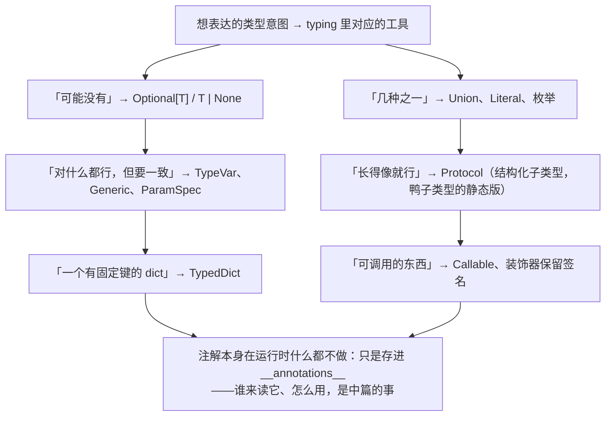

Python 是动态类型语言，但这不意味着"无类型"。自 Python 3.5 引入 `typing` 模块以来，类型注解已经从"可选装饰"演变为大型项目的工程标配。PyTorch、vLLM、FastAPI 等 AI Infra 项目大量依赖类型系统的高级特性。

与 Java 把类型声明、编译检查、`.class` 文件携带类型信息、运行时反射合为一体不同，Python 的类型系统由两个协作层构成——**类型信息提供层**和**类型信息消费层**。而在这两层之上，还有一层工程落地：用它们构建**数据契约**。

本系列这一讲围绕的核心问题是：

> **Python 的类型信息从哪里来、被谁消费，又如何在系统边界上落成可执行的数据契约？[^q0]**


这条链路太长，一篇放不下，所以拆成三篇：**上篇**讲类型表达——`typing` 工具箱里每个工具解决什么问题（本篇）；**中篇**讲类型信息怎么分发、被谁消费——存根与 `py.typed`、mypy / pyright、运行时怎么读注解（[python-type-information-distribution-and-consumption](/python-type-information-distribution-and-consumption.html)）；**下篇**讲用这些能力构建数据契约——dataclass、Pydantic、序列化与配置（[python-data-contract-design-dataclass-pydantic-and-settings](/python-data-contract-design-dataclass-pydantic-and-settings.html)）。

本篇是上篇：**类型表达**。`typing` 模块的每个工具都会说明它解决什么问题、怎么用、Java 中对应什么、在 AI Infra 真实项目中长什么样。

## 一、总览




### 1. 提供层、消费层与数据契约：三篇的地图

```
                   类型信息提供层
┌──────────────────────────────────────────────┐
│ 类型表达                                      │
│ ├── Python 内建注解语法                       │
│ ├── 内建泛型：list[str]、dict[str, int]       │
│ ├── typing                                    │
│ └── typing_extensions                         │
│                                               │
│ 类型载体与分发                                 │
│ ├── inline types：.py                         │
│ ├── stub：.pyi                                │
│ ├── typeshed                                  │
│ ├── types-*                                   │
│ └── py.typed / PEP 561                        │
└──────────────────────────────────────────────┘
                       │
                       │ 读取、解释、推理、执行
                       ▼
                   类型信息消费层
┌──────────────────────────────────────────────┐
│ 静态消费                                      │
│ ├── mypy                                      │
│ ├── Pyright / Pylance                         │
│ ├── IDE、CI                                   │
│ └── 类型推断、收窄、兼容性检查                 │
│                                               │
│ 动态消费                                      │
│ ├── isinstance / issubclass                   │
│ ├── get_type_hints / __annotations__          │
│ ├── @dataclass（读注解生成代码）               │
│ ├── Pydantic（元类 + pydantic-core）           │
│ ├── beartype                                  │
│ └── Annotated 元数据解析                      │
└──────────────────────────────────────────────┘
                       │
                       │ 用消费层的能力构建
                       ▼
                 工程落地：数据契约
┌──────────────────────────────────────────────┐
│ 数据建模                                      │
│ ├── @dataclass：内部数据传递                  │
│ ├── Pydantic BaseModel：边界校验              │
│ └── TypedDict：字典形状约束                   │
│                                               │
│ 契约的输入输出                                 │
│ ├── 序列化 / 反序列化                         │
│ ├── JSON Schema / OpenAPI 生成                │
│ └── BaseSettings：配置即契约                  │
└──────────────────────────────────────────────┘
```

- **提供层**解决"类型信息从哪里来"——包括如何用语法表达类型意图（`typing` 模块的各种工具），以及如何把类型信息分发给消费方（`.pyi` 存根、`py.typed` 标记等）。
- **消费层**解决"类型信息被谁使用"——静态分析工具（mypy、pyright）在开发时检查类型正确性，动态工具（Pydantic、beartype）在运行时读取注解并据此生成代码或执行校验。
- **数据契约**解决"用这些能力构建什么"——把类型注解落到具体的数据结构上：请求体、配置项、模型元数据。这是 AI Infra 中类型系统最主要的落地形式。

Java 把前两件事合为一体：类型写在源码里，编译器既是提供者也是消费者，`.class` 文件既是载体也是运行时反射的依据。Python 则把提供和消费拆开，各层可以单独使用，也可以组合使用。

Java 把前两件事合为一体：类型写在源码里，编译器既是提供者也是消费者，`.class` 文件既是载体也是运行时反射的依据。Python 则把提供和消费拆开，各层可以单独使用，也可以组合使用。本篇只讲图里最上面那格——**类型表达**。

### 2. 本文的章节安排

| 章 | 主题 | 内容 |
|---|---|---|
| 二 | 类型表达 | 从基础注解到 TypeVar、Protocol、TypedDict、ParamSpec、TypeGuard、overload 等 typing 工具 |
| 三 | 附录 | typing 速查表；Java 与 Python 类型系统对照 |
| 四 | 本文小结 |  |
| 五 | 自测 | 2 道题 |

## 二、类型表达：从基础注解到 typing 工具箱

提供层解决"类型信息从哪里来"。它包括两部分：**类型表达**——用什么语法和工具把类型意图写出来，是本章的全部内容；**类型载体与分发**——如何让没有源码注解的库也能提供类型信息给消费方，在[中篇第二章](/python-type-information-distribution-and-consumption.html#二类型载体与分发存根typeshed-与-pytyped)。

这一部分覆盖所有"把类型意图表达出来"的语法和工具——从 Python 内建的类型注解语法，到 `typing` 模块提供的高级类型构造，再到 `typing_extensions` 对旧版本的兼容。

> **关于 `typing_extensions`**：Python 类型系统演进很快，每个小版本都有新特性。但很多项目需要支持旧版本（AI Infra 项目线上常见 3.8 或 3.10）。`typing_extensions` 把新版本的特性向后移植，是 PyTorch、Pydantic、vLLM、FastAPI 的必装依赖。本文在介绍各特性时会标注版本要求；如果你的项目需要兼容旧版本，从 `typing_extensions` 导入即可。

### 1. 基础注解：变量、函数与容器

**变量和函数注解**

```python
# 变量注解
name: str = "Alice"
age: int = 18
scores: list[float] = [95.5, 87.0]

# 函数注解
def greet(name: str, *, excited: bool = False) -> str:
    suffix = "!" if excited else "."
    return f"Hello, {name}{suffix}"
```

对应 Java：

```java
String name = "Alice";
int age = 18;
List<Double> scores = List.of(95.5, 87.0);

String greet(String name, boolean excited) {
    String suffix = excited ? "!" : ".";
    return "Hello, " + name + suffix;
}
```

核心区别：Java 的类型声明是语法强制的，编译器检查；Python 的类型注解**默认不影响运行时**，需要 mypy/pyright 做静态检查（见消费层"静态分析与推理"部分）。

**内置容器类型注解的演进**

Python 的容器类型注解经历了三个阶段：

```python
# 阶段一：Python 3.5-3.8，必须从 typing 导入
from typing import List, Dict, Set, Tuple, FrozenSet
def process(items: List[str]) -> Dict[str, int]:
    ...

# 阶段二：Python 3.9+，内置类型直接支持下标
def process(items: list[str]) -> dict[str, int]:
    ...

# 阶段三：Python 3.12+，泛型类/函数的新语法（后面详述）
def first[T](items: list[T]) -> T:
    return items[0]
```

**推荐**：如果项目的最低 Python 版本 >= 3.9，直接用小写 `list`、`dict`、`set`、`tuple`，不需要从 `typing` 导入。

**真实项目中的基础注解**

```python
# FastAPI: fastapi/applications.py
class FastAPI(Starlette):
    def add_api_route(
        self,
        path: str,
        endpoint: Callable[..., Any],
        *,
        response_model: type[Any] | None = None,
        status_code: int | None = None,
        tags: list[str | Enum] | None = None,
        summary: str | None = None,
    ) -> None: ...

# PyTorch: torch/_C/_VariableFunctions.pyi
def matmul(input: Tensor, other: Tensor, *, out: Tensor | None = None) -> Tensor: ...
```

完整的内置容器对照表：

| typing 旧写法 | 3.9+ 新写法 | Java 对应 | 说明 |
|---|---|---|---|
| `List[str]` | `list[str]` | `List<String>` | 有序、可变 |
| `Dict[str, int]` | `dict[str, int]` | `Map<String, Integer>` | 键值映射 |
| `Set[int]` | `set[int]` | `Set<Integer>` | 无序、唯一 |
| `Tuple[int, str]` | `tuple[int, str]` | 无直接对应 | 固定长度、异构 |
| `Tuple[int, ...]` | `tuple[int, ...]` | 无直接对应 | 不定长度、同构 |
| `FrozenSet[str]` | `frozenset[str]` | `Set.of(...)` | 不可变集合 |
| `Sequence[int]` | `collections.abc.Sequence[int]` | `List<Integer>` | 只读序列 |
| `Mapping[str, int]` | `collections.abc.Mapping[str, int]` | `Map<String, Integer>` | 只读映射 |


### 2. Union、Optional 与 None：表达"可能性"

**Union 类型**

```python
# 旧写法：Python 3.5+
from typing import Union

def parse_id(raw: Union[str, int]) -> int:
    if isinstance(raw, str):
        return int(raw)
    return raw
```

```python
# 新写法：Python 3.10+
def parse_id(raw: str | int) -> int:
    if isinstance(raw, str):
        return int(raw)
    return raw
```

对应 Java：Java 没有直接的 Union 类型。Java 21 的 sealed interface + pattern matching 可以实现类似效果：

```java
sealed interface RawId permits StringId, IntId {}
record StringId(String value) implements RawId {}
record IntId(int value) implements RawId {}

int parseId(RawId raw) {
    return switch (raw) {
        case StringId s -> Integer.parseInt(s.value());
        case IntId i -> i.value();
    };
}
```

**Optional：可空类型**

```python
# 三种等价写法
from typing import Optional

# 写法一：旧式
def find_user(user_id: int) -> Optional[User]:
    ...

# 写法二：Union 写法
def find_user(user_id: int) -> Union[User, None]:
    ...

# 写法三：3.10+ 推荐写法
def find_user(user_id: int) -> User | None:
    ...
```

`Optional[X]` 就是 `Union[X, None]` 的语法糖，仅此而已。

对应 Java：

```java
// Java: Optional<User> 是一个包装类型
Optional<User> findUser(long userId) {
    ...
}
```

关键区别：Java 的 `Optional` 是一个运行时包装对象，有 `map`、`orElse` 等方法；Python 的 `X | None` 纯粹是类型注解，运行时就是 `X` 的实例或 `None`，没有额外包装。

对于 3.10+ 的项目更推荐 `X | None`，因为它：

- **更简洁**：不需要从 `typing` 导入 `Optional` 或 `Union`；
- **更易读**：`|` 直观地表达了"或者（OR）"的概念。

三者在类型检查时完全等价，`Optional[User]`、`Union[User, None]`、`User | None` 对 mypy/pyright 而言是同一个类型。

> **延伸：`|` 在 Python 中身兼数职**
>
> 这一段与类型系统无关，但有助于理解为什么 Python 选了 `|` 来表示联合类型。
>
> Python 官方设计团队非常喜欢复用 `|`，因为它的直观语义就是"合并 / 或者"。这使得 `|` 在不同上下文中扮演完全不同的角色。
>
> 很早的版本中，`|` 就用作集合的并集（Set Union）：
>
> ```python
> set_a = {1, 2, 3}
> set_b = {3, 4, 5}
>
> # 合并生成新集合
> union_set = set_a | set_b
> print(union_set)  # {1, 2, 3, 4, 5}
>
> # |= 就地更新（求并集并赋给自身）
> set_a |= set_b
> print(set_a)      # set_a 本身已被改变：{1, 2, 3, 4, 5}
> ```
>
> Python 3.9+ 又把它泛化到字典合并与更新。在 3.9 之前合并字典需要 `**` 解包或 `.update()`，比较冗长：
>
> - `|`（合并）：返回新字典。键冲突时右边的值覆盖左边。
> - `|=`（就地更新）：类似 `+=`，直接修改左边的字典。
>
> ```python
> defaults = {"host": "localhost", "port": 8080, "debug": True}
> overrides = {"port": 9000, "debug": False}
>
> merged = defaults | overrides
> print(merged)    # {'host': 'localhost', 'port': 9000, 'debug': False}
>
> defaults |= overrides
> print(defaults)  # defaults 本身已被改变
> ```
>
> 所以 Python 3.10 用 `X | Y` 表示联合类型，是这个"合并"语义的自然延续——只不过合并的对象从值变成了类型。

**真实项目中的用法**

```python
# vLLM: sampling_params.py
@dataclass
class SamplingParams:
    temperature: float = 1.0
    top_p: float = 1.0
    max_tokens: int | None = None  # None 表示不限制
    stop: list[str] = field(default_factory=list)
```


### 3. Any、Never 与 NoReturn：类型系统的边界

**Any：逃逸舱**

```python
from typing import Any

def process(data: Any) -> Any:
    # Any 与所有类型兼容，类型检查器不会报错
    return data.whatever()
```

`Any` 类似 Java 的裸类型（raw type）：`List` 而不是 `List<String>`。它告诉类型检查器"不要管这个"。

**使用场景**：和无类型注解的第三方库交互、快速原型阶段。**不要**把它当作"我不知道该写什么类型"的默认选择。

**真实项目中的 Any**

```python
# PyTorch: torch/nn/modules/module.py
# __setattr__ 用 Any 接收灵活的子模块注册——value 可能是 Parameter、Module、Tensor 或普通属性
class Module:
    def __setattr__(self, name: str, value: Any) -> None: ...

# Pydantic: pydantic/main.py
# model_validate 接受任意数据源——JSON dict、ORM 对象、甚至原始字符串都行
class BaseModel:
    @classmethod
    def model_validate(cls, obj: Any, *, strict: bool | None = None) -> Self: ...

# FastAPI: fastapi/params.py
# Depends 的 dependency 参数接受任意可调用对象
class Depends:
    def __init__(self, dependency: Callable[..., Any] | None = None, *, use_cache: bool = True): ...
```

`Any` 在成熟项目中通常出现在两种位置：

1. **对外接口的入口**——接受用户传入的任意数据（如 Pydantic 的 `model_validate`、FastAPI 的 `Depends`）
2. **动态分发的边界**——对象在运行时才确定具体类型（如 PyTorch 的 `Module.__setattr__`）

核心内部逻辑尽量避免使用 `Any`，用它意味着你主动放弃了类型检查的保护。

**Never 与 NoReturn**

```python
from typing import Never, NoReturn

# NoReturn: 函数永远不会正常返回（抛异常或无限循环）
def fail(message: str) -> NoReturn:
    raise RuntimeError(message)

# Never (3.11+): 不可能存在的类型
# 在大多数场景下 Never 和 NoReturn 可以互换
# Never 更语义化：表示"这个类型不可能被实例化"
def assert_never(value: Never) -> Never:
    raise AssertionError(f"Unexpected value: {value}")
```

对应 Java：Java 没有直接对应的类型；最接近的是 Kotlin 的 `Nothing`。

**实际用途**：`Never` 配合穷尽检查非常有用：

```python
from enum import Enum

class Status(Enum):
    ACTIVE = "active"
    INACTIVE = "inactive"

def handle(status: Status) -> str:
    match status:
        case Status.ACTIVE:
            return "ok"
        case Status.INACTIVE:
            return "disabled"
        case _ as unreachable:
            assert_never(unreachable)  # 如果遗漏了某个枚举值，mypy 会报错
```

**真实项目中的 NoReturn / Never**

```python
# click（命令行框架）: click/exceptions.py
# 所有 Abort/UsageError 最终调用的退出函数
class ClickException(Exception):
    def show(self, file: t.IO[t.Any] | None = None) -> None: ...
    def format_message(self) -> str:
        return self.message

# sys.exit 本身的类型声明（typeshed）
def exit(code: int = ...) -> NoReturn: ...

# 穷尽检查实战：click + Literal 组合
# 来源：https://purarue.xyz/x/blog/click-choice-type-narrowing/
from typing import Literal, assert_never, get_args
import click

OutputFormat = Literal["text", "json"]

@click.command()
@click.option("-o", "--output", type=click.Choice(get_args(OutputFormat)), default="text")
def main(output: OutputFormat) -> None:
    match output:
        case "text":
            print(data)
        case "json":
            print({"data": data})
        case _:
            assert_never(output)  # 新增 Literal 值时，mypy 立刻报错提醒你处理
```

`assert_never` 是 Python 3.11 加入 `typing` 模块的内置函数，底层就是 `def assert_never(arg: Never) -> Never`。

**AI-Infra 中的穷尽检查**

穷尽检查在 AI Infra 代码中极为重要——后端选型、硬件架构、量化方法等枚举分支**必须全部处理**，遗漏一个就可能导致运行时静默失败：

```python
from enum import Enum
from typing import assert_never

# vLLM 风格：推理后端选型
class Backend(Enum):
    CUDA = "cuda"
    ROCM = "rocm"
    CPU = "cpu"
    TPU = "tpu"

def get_attention_impl(backend: Backend) -> type:
    match backend:
        case Backend.CUDA:
            return FlashAttention
        case Backend.ROCM:
            return ROCmFlashAttention
        case Backend.CPU:
            return PagedAttention
        case Backend.TPU:
            return TPUAttention
        case _ as unreachable:
            assert_never(unreachable)
    # 如果后续新增 Backend.XPU 但忘记处理，mypy 立刻报错：
    # error: Argument 1 to "assert_never" has incompatible type "Literal[Backend.XPU]"

# DeepSpeed 风格：硬件架构分支
class DeviceArch(Enum):
    AMPERE = "ampere"       # A100
    HOPPER = "hopper"       # H100
    ADA = "ada"             # L40S/RTX 4090

def select_kernel(arch: DeviceArch, dtype: str) -> str:
    match arch:
        case DeviceArch.AMPERE:
            return "flash_attn_v2"
        case DeviceArch.HOPPER:
            return "flash_attn_v3" if dtype == "fp8" else "flash_attn_v2"
        case DeviceArch.ADA:
            return "flash_attn_v2"
        case _ as unreachable:
            assert_never(unreachable)
```

这种模式的核心价值：**把运行时的"找不到匹配分支"错误，提前到开发期的 mypy 检查阶段暴露**。在 GPU 硬件快速迭代的 AI Infra 领域，新增硬件/后端是家常便饭，穷尽检查能确保每次新增枚举值时，所有相关的分支逻辑都被更新。


### 4. Literal：字面量类型

`Literal` 将类型限制为特定的字面值，类似 Java 中枚举的部分功能，但更轻量。

```python
from typing import Literal

# 只允许这三个字符串值
Mode = Literal["train", "eval", "export"]

def set_mode(mode: Mode) -> None:
    print(f"Setting mode to {mode}")

set_mode("train")    # OK
set_mode("debug")    # mypy 报错：不在允许的值中
```

对应 Java：

```java
// Java: 通常用枚举实现
enum Mode { TRAIN, EVAL, EXPORT }
void setMode(Mode mode) { ... }
```

区别：`Literal` 是纯静态的，运行时不做检查；Java 枚举是运行时的真实类型。

**真实项目中的 Literal**

```python
# vLLM: vllm/config.py — 量化方法限定为几个固定字符串
QuantMethod = Literal["awq", "gptq", "squeezellm", "marlin"]

# Pydantic: pydantic/fields.py — 字段的 JSON Schema 模式
JsonSchemaMode = Literal["validation", "serialization"]

# httpx: httpx/_types.py — HTTP 方法限定
HttpMethod = Literal["GET", "POST", "PUT", "DELETE", "PATCH", "HEAD", "OPTIONS"]
```

`Literal` 非常适合替代那些"只接受几个固定字符串"的场景——不值得定义一个完整 Enum 类，但又想让类型检查器帮你约束。


### 5. TypeVar 与泛型

**TypeVar 基础**

`TypeVar` 对应 Java 的类型参数 `<T>`，用于表达"输入和输出之间的类型关系"。

```python
from typing import TypeVar

T = TypeVar("T")

def first(items: list[T]) -> T:
    return items[0]

# 类型检查器知道：
result = first([1, 2, 3])     # result: int
result = first(["a", "b"])    # result: str
```

对应 Java：

```java
<T> T first(List<T> items) {
    return items.get(0);
}
```

**bound：类型上界**

```python
from typing import TypeVar

# T 必须是 SupportsFloat 的子类型（即支持 float() 转换的类型）
T = TypeVar("T", bound="SupportsFloat")

def normalize(value: T) -> float:
    return float(value) / 100.0

# 更常见的实际用法：bound 到自定义基类
from torch.nn import Module
M = TypeVar("M", bound=Module)

def freeze(model: M) -> M:
    """冻结模型参数，返回值类型与传入类型一致"""
    for p in model.parameters():
        p.requires_grad_(False)
    return model
```

对应 Java 的 `<T extends Number>` 或 `<M extends Module>`。

**约束到特定类型**

```python
# T 只能是 str 或 bytes，不能是其他类型
StrOrBytes = TypeVar("StrOrBytes", str, bytes)

def concat(a: StrOrBytes, b: StrOrBytes) -> StrOrBytes:
    return a + b
```

这比 `Union[str, bytes]` 更严格：它要求 `a` 和 `b` 必须是**同一个类型**。

**自定义泛型类**

```python
from typing import TypeVar, Generic

T = TypeVar("T")

class Stack(Generic[T]):
    def __init__(self) -> None:
        self._items: list[T] = []

    def push(self, item: T) -> None:
        self._items.append(item)

    def pop(self) -> T:
        return self._items.pop()

stack = Stack[int]()
stack.push(1)       # OK
stack.push("a")     # mypy 报错
```

对应 Java：

```java
public class Stack<T> {
    private final List<T> items = new ArrayList<>();

    public void push(T item) { items.add(item); }
    public T pop() { return items.remove(items.size() - 1); }
}
```

**协变与逆变**

Java 程序员熟悉 `? extends T`（协变）和 `? super T`（逆变）。Python 通过 TypeVar 的参数来表达：

```python
from typing import TypeVar, Generic

T_co = TypeVar("T_co", covariant=True)      # 协变：只读场景
T_contra = TypeVar("T_contra", contravariant=True)  # 逆变：只写场景
```

什么时候需要关心？看一个具体例子：

```python
from typing import TypeVar, Generic, Iterator

T_co = TypeVar("T_co", covariant=True)

class ReadOnlyList(Generic[T_co]):
    """只读容器——协变是安全的：ReadOnlyList[Cat] 可以赋值给 ReadOnlyList[Animal]"""
    def __getitem__(self, index: int) -> T_co: ...
    def __iter__(self) -> Iterator[T_co]: ...

# 类比 Java: List<? extends Animal>
```

| | 协变 (covariant) | 逆变 (contravariant) | 不变 (invariant) |
|---|---|---|---|
| Java | `? extends T` | `? super T` | `T` (默认) |
| Python 旧语法 | `TypeVar(..., covariant=True)` | `TypeVar(..., contravariant=True)` | `TypeVar(...)` (默认) |
| Python 3.12+ | 类型参数后加 `+` | 类型参数后加 `-` | 无标记 |
| 适用场景 | 只读/生产者 | 只写/消费者 | 可读可写 |

在实践中，很少需要手动声明协变/逆变——Protocol 中类型检查器会自动推断。主要在定义泛型容器/接口类时才需要关心。

**Python 3.12+ 的新语法**

Python 3.12 引入了更简洁的泛型语法，不再需要手动创建 `TypeVar`。上面的所有写法都有对应的新形式：

```python
# === 旧写法 ===
from typing import TypeVar, Generic

T = TypeVar("T")

class Stack(Generic[T]):
    def push(self, item: T) -> None: ...
    def pop(self) -> T: ...

def first(items: list[T]) -> T:
    return items[0]

# === 新写法：Python 3.12+ ===
class Stack[T]:
    def push(self, item: T) -> None: ...
    def pop(self) -> T: ...

def first[T](items: list[T]) -> T:
    return items[0]

# 带 bound 约束
def freeze[M: Module](model: M) -> M:
    for p in model.parameters():
        p.requires_grad_(False)
    return model

# 协变/逆变：PEP 695 语法**没有** +T / -T 这种写法（那是 Kotlin / Scala 的，写了是 SyntaxError，3.12 实测）
# 变性由类型检查器根据 T 在类里的用法自动推断——只在返回位置出现即协变，只在参数位置出现即逆变
class ReadOnlyList[T]:      # 检查器推断为协变（对应旧写法 TypeVar('T', covariant=True)）
    def __getitem__(self, index: int) -> T: ...

class WriteOnlyList[T]:     # 检查器推断为逆变（对应旧写法 contravariant=True）
    def append(self, item: T) -> None: ...
```

新语法更接近 Java 和 TypeScript 的泛型声明方式。如果项目目标版本 >= 3.12，推荐使用。不过截至目前，大多数主流项目（PyTorch、vLLM、Pydantic）仍使用旧语法以兼容 3.10/3.11。

**真实项目中的 TypeVar 与泛型**

```python
# SQLAlchemy: sqlalchemy/orm/session.py
# Session.get() 使用 TypeVar + bound 确保返回值类型安全
_O = TypeVar("_O", bound=object)

class Session:
    def get(self, entity: type[_O], ident: Any) -> _O | None:
        # 返回类型和传入的 entity 类型一致
        ...

# 用法：类型检查器能推断 user 的类型
user = session.get(User, 42)  # user: User | None

# vLLM: vllm/v1/utils.py — 泛型工具类
T = TypeVar("T")

class CpuGpuBuffer(Generic[T]):
    """在 CPU 和 GPU 之间同步的缓冲区"""
    def __init__(self, *size: int, dtype: torch.dtype, device: torch.device): ...
    def get_cpu_value(self) -> T: ...
    def get_gpu_value(self) -> T: ...

# 调用方指定具体类型后，类型检查器自动推断返回值：
buf = CpuGpuBuffer[torch.Tensor](1024, dtype=torch.float32, device="cuda:0")
cpu_val = buf.get_cpu_value()   # cpu_val: torch.Tensor（自动推断）
gpu_val = buf.get_gpu_value()   # gpu_val: torch.Tensor

# typing 模块标准库自身就是 TypeVar 协变/逆变的最大用户
# typing.py
T_co = TypeVar("T_co", covariant=True)

class Iterator(Iterable[T_co]):
    """Iterator 是协变的：Iterator[Cat] 可以赋值给 Iterator[Animal]"""
    @abstractmethod
    def __next__(self) -> T_co: ...
```

### 6. Callable：函数类型

**基本用法**

```python
from typing import Callable

# 接受两个 int 参数，返回 int 的函数
def apply(fn: Callable[[int, int], int], a: int, b: int) -> int:
    return fn(a, b)

apply(lambda x, y: x + y, 1, 2)  # OK
```

对应 Java：

```java
// Java: 函数式接口
int apply(BiFunction<Integer, Integer, Integer> fn, int a, int b) {
    return fn.apply(a, b);
}
```

**更灵活的可调用类型**

`Callable[[int, int], int]` 无法表达 keyword-only 参数、默认值等复杂签名。如果需要精确描述，使用 Protocol：

```python
from typing import Protocol

class Comparator(Protocol):
    def __call__(self, a: str, b: str, *, reverse: bool = False) -> int: ...

def sort_with(items: list[str], cmp: Comparator) -> list[str]:
    ...
```

**任意参数的 Callable**

```python
from typing import Callable

# 接受任意参数的函数
handler: Callable[..., None]  # ... 表示"任意参数"
```

**真实项目中的 Callable**

```python
# PyTorch: torch/optim/optimizer.py
# 优化器的 step() 接受一个 closure 参数（用于重新计算 loss）
class Optimizer:
    def step(self, closure: Callable[[], float] | None = None) -> float | None:
        ...

# vLLM: vllm/entrypoints/llm.py
# use_tqdm 参数既接受 bool，也接受自定义的 tqdm 工厂函数
class LLM:
    def generate(
        self,
        prompts: PromptType | Sequence[PromptType],
        sampling_params: SamplingParams | None = None,
        *,
        use_tqdm: bool | Callable[..., tqdm] = True,  # Callable[..., tqdm]
    ) -> list[RequestOutput]: ...

# FastAPI: fastapi/params.py
# Depends 接受一个 Callable 作为依赖注入的工厂函数
class Depends:
    def __init__(
        self,
        dependency: Callable[..., Any] | None = None,
        *,
        use_cache: bool = True,
    ): ...
```

### 7. `type[C]`：类对象本身

上一节的 `Callable` 描述"可以被调用的东西"。而在 Python 里，**类本身就是一个可以被调用的对象**——调用它会返回实例。这引出一个容易被忽略但极其重要的注解：`type[C]`。

**实例 vs 类对象**

这是 Python 类型注解里最需要分清的一组区别：

```python
class Model: ...

def run(m: Model) -> None: ...        # 参数是"一个 Model 实例"
def build(c: type[Model]) -> Model:   # 参数是"Model 这个类本身"
    return c()                        # 检查器知道调用它得到 Model 实例

run(Model())      # OK
run(Model)        # 错误：期望实例，给了类
build(Model)      # OK
build(Model())    # 错误：期望类，给了实例
```

`type[C]` 也接受 `C` 的**任意子类**（协变），这正符合直觉：

```python
class LlamaModel(Model): ...

build(LlamaModel)   # OK，type[LlamaModel] 是 type[Model] 的子类型
```

不带参数的裸 `type` 表示"任意类"，等价于 `type[Any]`——和裸 `list` 一样，属于放弃了类型信息的写法，尽量避免。

对应 Java：

```java
// Java: Class<T> 就是 type[C] 的对应物
Model build(Class<? extends Model> cls) throws Exception {
    return cls.getDeclaredConstructor().newInstance();
}
```

| Python | Java | 说明 |
| :--- | :--- | :--- |
| `Model` | `Model` | 实例类型 |
| `type[Model]` | `Class<? extends Model>` | 类对象，含子类 |
| `type` / `type[Any]` | `Class<?>` | 任意类 |
| `c()` | `cls.getDeclaredConstructor().newInstance()` | Python 里类天生可调用 |
| `type(x)` | `x.getClass()` | 取运行时类型 |
| `issubclass(a, b)` | `b.isAssignableFrom(a)` | 子类判定 |
| `isinstance(x, C)` | `C.isInstance(x)` / `instanceof` | 实例判定 |

两个实质差异：

1. **构造是一等操作。** Java 拿到 `Class<T>` 后要经过反射才能 `newInstance()`，还要处理一堆受检异常；Python 里 `c()` 就是普通调用，类型检查器甚至会**校验构造参数**——传错参数是静态错误，不是运行时才炸的 `NoSuchMethodException`。
2. **没有类型擦除。** Java 的 `Class<T>` 之所以常被用作"运行时类型令牌"（比如 `Gson.fromJson(json, Foo.class)`），正是因为泛型被擦除了，运行时拿不到 `T`。Python 没有擦除问题——注解本身在运行时就可以读取（见[中篇第四章](/python-type-information-distribution-and-consumption.html#四类型信息消费层下动态消费运行时如何读取类型注解)）——所以 `type[C]` 的用途更纯粹：它就是"我需要一个类，而不是一个实例"。

**典型用途：工厂与注册表**

`type[C]` 最常见的场景是把类当作值来传递和存储：

```python
from typing import TypeVar

T = TypeVar("T", bound=Model)

# 泛型工厂：输入什么类，就返回什么类的实例
def create(cls: type[T], **kwargs) -> T:
    return cls(**kwargs)

model = create(LlamaModel, hidden_size=4096)   # 推断为 LlamaModel，不是 Model
```

这里 `type[T]` 和 `TypeVar` 的配合是关键。如果写成 `def create(cls: type[Model]) -> Model`，返回值就退化成基类，调用方拿不到子类特有的方法。**这与 Java 里 `<T> T create(Class<T> cls)` 而不是 `Model create(Class<?> cls)` 是完全相同的动机。**

注册表则是插件化架构的基础形态：

```python
_REGISTRY: dict[str, type[Model]] = {}

def register(name: str) -> Callable[[type[T]], type[T]]:
    def decorator(cls: type[T]) -> type[T]:
        _REGISTRY[name] = cls
        return cls                    # 装饰器必须原样返回类
    return decorator

@register("llama")
class LlamaModel(Model): ...

def load(name: str) -> Model:
    return _REGISTRY[name]()
```

注意装饰器的签名 `Callable[[type[T]], type[T]]`——**接收类、返回类**。写成 `Callable[[type], type]` 会丢失具体类型，被装饰的类在下游就变成了 `type[Any]`。

**`type[C]` vs `Callable[..., C]`**

两者都能表达"能造出 C 的东西"，但语义不同：

```python
def a(factory: type[Model]) -> Model: ...      # 必须是类
def b(factory: Callable[..., Model]) -> Model: # 类或函数都行
```

- 需要访问**类属性、classmethod 或做 `issubclass` 判断**时，必须用 `type[C]`；
- 只关心"能调用出实例"，允许传入 `functools.partial`、lambda 或工厂函数时，用 `Callable[..., C]` 更宽松。

一个常见坑：**抽象类不满足 `type[C]` 的可实例化预期**。mypy 会对下面这段报 `Only concrete class can be given where "type[AbstractModel]" is expected`：

```python
from abc import ABC, abstractmethod

class AbstractModel(ABC):
    @abstractmethod
    def forward(self) -> None: ...

def build(cls: type[AbstractModel]) -> AbstractModel:
    return cls()

build(AbstractModel)     # mypy 报错：抽象类不能实例化
```

这其实是件好事——静态检查器帮你拦住了 `TypeError: Can't instantiate abstract class`。如果确实只想传递类而不实例化（比如存进注册表），把返回类型改成 `type[AbstractModel]` 即可。

**classmethod 与 `Self`**

classmethod 的第一个参数 `cls` 隐式就是 `type[Self]`，所以通常不需要显式标注：

```python
from typing import Self

class Config:
    @classmethod
    def from_dict(cls, data: dict) -> Self:    # cls 隐式是 type[Self]
        return cls(**data)


class TrainConfig(Config): ...

cfg = TrainConfig.from_dict({})   # 推断为 TrainConfig，不是 Config
```

用 `Self` 而不是 `Config` 作返回类型，子类才能拿到正确的推断结果（`Self` 见第二章 §14）。这解决的正是 Java 里"自限定泛型" `class Config<T extends Config<T>>` 那套笨重写法要解决的问题。

**与元类的关系**

`type` 除了作为注解，它本身还是 **Python 中所有类的类**——这就是元类的起点：

```python
class Model: ...

type(Model())      # <class 'Model'>       实例的类型是类
type(Model)        # <class 'type'>        类的类型是 type
type(type)         # <class 'type'>        type 是自己的实例，递归终点
```

所以自定义元类都写成 `class Meta(type)`：元类就是"类的类"，继承 `type` 才能拦截类的创建过程。Pydantic 的 `ModelMetaclass` 正是这么来的（见[中篇第四章](/python-type-information-distribution-and-consumption.html#四类型信息消费层下动态消费运行时如何读取类型注解) §2）。

两个用法之间的桥梁是：**如果一个类的元类是 `Meta`，那么这个类对象的类型就是 `Meta`**，可以直接用来注解：

```python
class Meta(type): ...
class Base(metaclass=Meta): ...

def configure(cls: Meta) -> None:     # 只接受元类为 Meta 的类
    ...
```

> **注意区分两个 `type`**：内置的 `type`（本节讨论的类对象），和 Python 3.12 引入的软关键字 `type`（用于声明类型别名，如 `type Vector = list[float]`，见第二章 §14）。两者拼写相同但毫无关系，靠语法位置区分。

**版本说明**

`typing.Type[C]` 从 Python 3.9 起被内置的 `type[C]` 取代（PEP 585），新代码一律用小写。这和 `List` → `list`、`Dict` → `dict` 是同一次演进。

**真实项目中的 `type[C]`**

```python
# transformers: transformers/models/auto/configuration_auto.py
# AutoConfig 的核心是一张 "模型类型字符串 -> 配置类" 的注册表，
# from_pretrained 读到 config.json 里的 model_type 后据此查表并实例化
CONFIG_MAPPING_NAMES: OrderedDict[str, str] = ...   # 惰性加载，值是类名
# 实际查表后得到的就是 type[PretrainedConfig]

# vLLM: vllm/model_executor/models/registry.py
# 架构名（来自 HF config 的 architectures 字段）-> 模型实现类
class _ModelRegistry:
    models: dict[str, _BaseRegisteredModel]

    def register_model(self, model_arch: str, model_cls: type[nn.Module]) -> None:
        ...

    def resolve_model_cls(self, architectures: str | list[str]) -> tuple[type[nn.Module], str]:
        ...

# Starlette: starlette/applications.py
# 异常处理器注册：键可以是异常类本身，也可以是 HTTP 状态码
def add_exception_handler(
    self,
    exc_class_or_status_code: type[Exception] | int,
    handler: Callable[[Request, Exception], Response],
) -> None: ...

# Pydantic: pydantic/main.py
# model_validate 是 classmethod，返回 Self 而非 BaseModel，
# 这样 MyModel.model_validate(...) 才能推断成 MyModel
class BaseModel:
    @classmethod
    def model_validate(cls, obj: Any, *, strict: bool | None = None) -> Self: ...
```

这几个例子体现了同一个模式：**框架把"用户提供的类"当作数据存起来，在运行时按需实例化**。这正是 Python 插件化架构的骨架——注册表的值类型永远是 `type[SomeBase]`，而不是 `SomeBase`。Java 里对应的是 Spring 的 `BeanDefinition` 持有 `Class<?>`、或 SPI 的 `ServiceLoader<S>`。

### 8. ABC 与 Protocol：接口的两种方式

Python 定义"接口"有两种机制：**ABC（抽象基类）**和 **Protocol（协议）**。它们的定位不同，适用场景不同，理解两者的区别是读懂 AI Infra 源码的关键。

**ABC：抽象基类（名义类型）**

ABC（Abstract Base Class）来自标准库的 `abc` 模块，对应 Java 的 `abstract class` + `interface`。

```python
from abc import ABC, abstractmethod

class Animal(ABC):
    @abstractmethod
    def speak(self) -> str:
        """子类必须实现此方法"""
        ...

    def breathe(self) -> str:
        """可以提供默认实现"""
        return "breathing..."

class Dog(Animal):
    def speak(self) -> str:
        return "Woof!"

# 如果忘记实现抽象方法，实例化时立刻报 TypeError
class BadAnimal(Animal):
    pass

BadAnimal()  # TypeError: Can't instantiate abstract class BadAnimal
             # with abstract method speak
```

**真实项目中的 ABC**

ABC 在主流框架中大量使用，特别是作为**框架基类**：

```python
# PyTorch: torch/nn/modules/module.py
# nn.Module 继承了 ABC——这是 PyTorch 整个模型体系的根基
class Module:
    # 虽然 Module 没有直接写 (ABC)，但它的 forward 方法
    # 通过 raise NotImplementedError 达到了类似抽象方法的效果
    def forward(self, *input: Any) -> Any:
        raise NotImplementedError(
            f"Module [{type(self).__name__}] is missing the required 'forward' function"
        )

# 用户必须继承并实现 forward
class MyModel(nn.Module):
    def forward(self, x: torch.Tensor) -> torch.Tensor:
        return self.linear(x)

# collections.abc: Python 标准库中最重要的 ABC 集合
# 这些 ABC 定义了 Python 核心数据结构的"接口契约"
from collections.abc import Iterable, Iterator, Sequence, Mapping, MutableMapping

# 任何实现了 __iter__ 的类都可以注册为 Iterable
# 任何实现了 __getitem__ + __len__ 的类都可以注册为 Sequence

# SQLAlchemy: sqlalchemy/engine/interfaces.py
# 数据库方言的抽象接口
class Dialect(ABC):
    @abstractmethod
    def connect(self, *cargs: Any, **cparams: Any) -> DBAPIConnection: ...

    @abstractmethod
    def create_connect_args(self, url: URL) -> ConnectArgsType: ...
```

**collections.abc 速查**

| ABC | 需要实现的方法 | Java 对应 | 说明 |
|---|---|---|---|
| `Iterable` | `__iter__` | `Iterable<T>` | 可迭代 |
| `Iterator` | `__iter__`, `__next__` | `Iterator<T>` | 迭代器 |
| `Sequence` | `__getitem__`, `__len__` | `List<T>`（只读） | 有序序列 |
| `MutableSequence` | + `__setitem__`, `__delitem__`, `insert` | `List<T>` | 可变序列 |
| `Mapping` | `__getitem__`, `__len__`, `__iter__` | `Map<K,V>`（只读） | 映射 |
| `MutableMapping` | + `__setitem__`, `__delitem__` | `Map<K,V>` | 可变映射 |
| `Set` | `__contains__`, `__iter__`, `__len__` | `Set<T>` | 集合 |
| `Callable` | `__call__` | `Function<T,R>` | 可调用 |
| `Hashable` | `__hash__` | 重写 `hashCode()` | 可哈希 |
| `Sized` | `__len__` | 无直接对应 | 有长度 |

在类型注解中，当你希望参数是"只读"的时候，用 `Sequence` 而不是 `list`，用 `Mapping` 而不是 `dict`——这和 Java 中用 `List<T>` 接口而不是 `ArrayList<T>` 作为参数类型是同一个道理。

**Protocol：结构化子类型（静态鸭子类型）**

ABC 要求显式继承，但 Python 是鸭子类型语言——"如果它走路像鸭子、叫声像鸭子，那它就是鸭子"。`Protocol`（Python 3.8+）将这种理念形式化为类型系统的一部分：**不需要显式继承，只要方法签名匹配就算实现了该协议**。

```python
from typing import Protocol

class Closeable(Protocol):
    def close(self) -> None: ...

def cleanup(resource: Closeable) -> None:
    resource.close()

# 任何有 close() 方法的对象都可以传入，不需要继承 Closeable
class DatabaseConnection:
    def close(self) -> None:
        print("disconnected")

class FileHandle:
    def close(self) -> None:
        print("file closed")

cleanup(DatabaseConnection())  # OK —— 没有继承 Closeable，但有 close() 方法就行
cleanup(FileHandle())          # OK
```

对应 Java：

```java
// Java: 必须显式 implements
interface Closeable {
    void close();
}

class DatabaseConnection implements Closeable {  // 必须写 implements
    public void close() { ... }
}
```

**ABC vs Protocol：选择指南**

| 特性 | Java interface | Python ABC | Python Protocol |
|---|---|---|---|
| 显式继承 | 必须 `implements` | 必须继承 | **不需要** |
| 默认实现 | default method | 普通方法 | 不支持 |
| 运行时检查 | `instanceof` | `isinstance` | 需要 `@runtime_checkable` |
| 检查时机 | 编译期 | 实例化时 | 静态分析时 |
| 核心理念 | 名义类型 | 名义类型 | **结构化类型** |

**何时选 ABC：**

- 你在写**框架基类**，需要强制子类实现某些方法（如 PyTorch `nn.Module`）
- 需要在实例化时立刻报错（而不是等到调用时）
- 需要提供**默认实现**（抽象方法 + 普通方法混合）
- 需要 `isinstance` 运行时检查

**何时选 Protocol：**

- 你不控制第三方类的代码（无法让它继承你的基类）
- 只想约束"这个对象需要有某些方法"，不关心它的继承关系
- 跨库/跨团队的接口约定
- 更灵活，更 Pythonic

简单记忆：**框架作者用 ABC，框架使用者用 Protocol**。

**带 `@runtime_checkable` 的 Protocol**

默认情况下 Protocol 只在静态检查时有效。加上 `@runtime_checkable` 后可以用 `isinstance` 做运行时检查：

```python
from typing import Protocol, runtime_checkable

@runtime_checkable
class Sized(Protocol):
    def __len__(self) -> int: ...

print(isinstance([1, 2, 3], Sized))  # True
print(isinstance(42, Sized))          # False
```

注意：`@runtime_checkable` 只检查方法**是否存在**，不检查签名是否匹配。

**泛型 Protocol**

```python
from typing import Protocol, TypeVar

T_co = TypeVar("T_co", covariant=True)

class Reader(Protocol[T_co]):
    def read(self) -> T_co: ...

def process(reader: Reader[str]) -> str:
    return reader.read().upper()
```

**真实项目中的 Protocol**

```python
# PyTorch 风格：任何实现了 forward 和 __call__ 的对象
class ForwardModule(Protocol):
    def forward(self, x: torch.Tensor) -> torch.Tensor: ...
    def __call__(self, x: torch.Tensor) -> torch.Tensor: ...

# vLLM 风格：可替换的 executor 接口
class ExecutorBase(Protocol):
    def initialize(self, num_gpu_blocks: int) -> None: ...
    def execute_model(self, seq_group_metadata: list) -> list: ...
```

### 9. TypedDict：字典的类型约束

Python 中大量使用 `dict` 传递数据。`TypedDict` 让你能对字典的"形状"（哪些 key、每个 key 的值类型）进行静态约束。

**基本用法**

```python
from typing import TypedDict

class MovieRecord(TypedDict):
    title: str
    year: int
    rating: float

movie: MovieRecord = {
    "title": "Inception",
    "year": 2010,
    "rating": 8.8,
}

# mypy 会报错：
bad: MovieRecord = {"title": "X"}  # 缺少 year 和 rating
```

对应 Java：Java 通常用 DTO / record 代替，很少直接使用 `Map<String, Object>`。

**可选字段**

```python
from typing import TypedDict, Required, NotRequired

# 方式一：total=False 让所有字段都可选
class Config(TypedDict, total=False):
    host: str
    port: int
    debug: bool

# 方式二：精确控制（3.11+）
class Config(TypedDict):
    host: Required[str]
    port: NotRequired[int]
    debug: NotRequired[bool]
```

**TypedDict 与其他数据定义方式的关系**

Python 有三种主流的"结构化数据"定义方式：`TypedDict`（约束字典形状，运行时仍是普通 `dict`）、`dataclass`（标准库数据类，类似 Java Record）、Pydantic `BaseModel`（带运行时校验，类似 Java Bean Validation）。

`TypedDict` 与后两者的根本区别在于：**它不创建新的对象类型**。`MovieRecord` 在运行时就是一个普通 `dict`，类型约束只对静态检查器生效。所以如果数据本身已经是 dict（JSON API 返回值、配置文件解析结果），用 `TypedDict` 约束形状最自然；如果需要创建新的结构化对象，则用 `dataclass` 或 Pydantic。

> 三者的完整对比、选型决策树以及"边界校验、内部传递"的工程模式，见[下篇第二章](/python-data-contract-design-dataclass-pydantic-and-settings.html#二工程落地数据契约设计)「工程落地：数据契约设计」的选型指南一节。

**用 TypedDict 约束 `**kwargs`（3.12+）**

```python
from typing import Unpack, TypedDict

class Options(TypedDict, total=False):
    timeout: float
    retries: int
    verbose: bool

def request(url: str, **kwargs: Unpack[Options]) -> str:
    ...

# 类型检查器知道 kwargs 只能包含 timeout、retries、verbose
request("https://api.example.com", timeout=5.0)        # OK
request("https://api.example.com", unknown_key=True)    # mypy 报错
```

**真实项目中的 TypedDict**

```python
# PyTorch: torch/optim/optimizer.py
# 优化器状态用 TypedDict 描述每个参数组的结构
class _RequiredParameter(TypedDict):
    params: list[Tensor]

class _AdamState(TypedDict):
    step: int
    exp_avg: Tensor
    exp_avg_sq: Tensor

# Pydantic-AI: examples/pydantic_ai_examples/chat_app.py
# 聊天消息用 TypedDict 描述传给前端的 JSON 形状
from typing_extensions import TypedDict
class ChatMessage(TypedDict):
    role: str
    timestamp: str
    content: str

# SQLAlchemy: 查询选项
class ExecuteOptions(TypedDict, total=False):
    stream_results: bool
    max_row_buffer: int
    yield_per: int
```

### 10. Annotated：给类型附加元数据

`Annotated` 允许在类型上附加额外的元数据，类型检查器本身忽略这些元数据，但框架（如 FastAPI、Pydantic）可以读取并使用。

```python
from typing import Annotated

# 基本语法：Annotated[类型, 元数据1, 元数据2, ...]
UserId = Annotated[int, "must be positive"]
```

**Pydantic 中的 Annotated**

```python
from typing import Annotated
from pydantic import BaseModel, Field

class User(BaseModel):
    name: Annotated[str, Field(min_length=2, max_length=50)]
    age: Annotated[int, Field(ge=0, le=150)]
```

**FastAPI 中的 Annotated**

```python
from typing import Annotated
from fastapi import Depends, Header, Query

# 把依赖注入、校验规则等信息附加到类型上
async def list_items(
    q: Annotated[str | None, Query(max_length=50)] = None,
    limit: Annotated[int, Query(ge=1, le=100)] = 10,
    token: Annotated[str, Header()],
    db: Annotated[Session, Depends(get_db)],
) -> list[Item]:
    ...
```

对应 Java：最接近的概念是**注解（Annotation）**。Java 的 `@NotNull`、`@Size(max=50)` 作用在参数或字段上；Python 的 `Annotated` 把元数据嵌入到类型本身。

```java
// Java 的方式
void createUser(@NotNull @Size(min=2, max=50) String name,
                @Min(0) @Max(150) int age) { ... }
```


### 11. ParamSpec 与 Concatenate：保留装饰器的类型信息

**问题：装饰器吃掉了类型信息**

```python
from functools import wraps

def logged(fn):
    @wraps(fn)
    def wrapper(*args, **kwargs):
        print(f"Calling {fn.__name__}")
        return fn(*args, **kwargs)
    return wrapper

@logged
def add(a: int, b: int) -> int:
    return a + b

# 问题：类型检查器认为 add 的签名变成了 (*args, **kwargs) -> Any
# 原始的 (a: int, b: int) -> int 信息丢失了
```

**ParamSpec 解决方案**

```python
from typing import ParamSpec, TypeVar, Callable
from functools import wraps

P = ParamSpec("P")
R = TypeVar("R")

def logged(fn: Callable[P, R]) -> Callable[P, R]:
    @wraps(fn)
    def wrapper(*args: P.args, **kwargs: P.kwargs) -> R:
        print(f"Calling {fn.__name__}")
        return fn(*args, **kwargs)
    return wrapper

@logged
def add(a: int, b: int) -> int:
    return a + b

# 现在类型检查器知道 add 仍然是 (a: int, b: int) -> int
```

`ParamSpec` 捕获了被装饰函数的**完整参数签名**并透传出来。

**Concatenate：装饰器添加参数**

如果装饰器需要在原始函数前面添加参数：

```python
from typing import Callable, Concatenate, ParamSpec, TypeVar

P = ParamSpec("P")
R = TypeVar("R")

def with_request(
    fn: Callable[Concatenate[Request, P], R]
) -> Callable[P, R]:
    @wraps(fn)
    def wrapper(*args: P.args, **kwargs: P.kwargs) -> R:
        request = get_current_request()
        return fn(request, *args, **kwargs)
    return wrapper

@with_request
def handle(request: Request, user_id: int) -> Response:
    ...

# 装饰后：handle(user_id: int) -> Response
# request 参数被装饰器自动注入了
```

Java 没有对应概念——Java 的注解处理器不会改变方法签名。

**真实项目中的 ParamSpec**

```python
# Tenacity（重试库）: tenacity/__init__.py
# retry 装饰器用 ParamSpec 保留原始函数签名
from typing import ParamSpec, TypeVar, Callable
P = ParamSpec("P")
R = TypeVar("R")

class Retrying:
    def __call__(self, fn: Callable[P, R]) -> Callable[P, R]:
        @wraps(fn)
        def wrapper(*args: P.args, **kwargs: P.kwargs) -> R:
            ...  # 重试逻辑
            return fn(*args, **kwargs)
        return wrapper

# Celery（任务队列）: celery/app/task.py 风格
# 异步任务装饰器保留函数签名
def task(fn: Callable[P, R]) -> Task[P, R]:
    ...

# Pydantic-AI: 用 ParamSpec 在 pydantic_ai 的 agent 装饰器中保留工具函数签名
from typing_extensions import ParamSpec
P = ParamSpec("P")
```

`ParamSpec` 是装饰器密集型项目的"救星"——Python 生态有大量装饰器（retry、cache、trace、auth），没有 `ParamSpec` 之前类型信息全部丢失。

**AI-Infra 中的 ParamSpec 与 Concatenate**

在 AI Infra 中，装饰器模式无处不在：训练循环的 hook、性能分析、分布式通信包装、自动混合精度等等。`ParamSpec` 和 `Concatenate` 让这些装饰器不再是类型信息的黑洞。

```python
from typing import ParamSpec, TypeVar, Callable, Concatenate
from functools import wraps

P = ParamSpec("P")
R = TypeVar("R")

# 场景一：PyTorch 风格的性能分析装饰器
# 包装任意函数，记录 CUDA 事件耗时，但不改变函数签名
def cuda_timer(fn: Callable[P, R]) -> Callable[P, R]:
    @wraps(fn)
    def wrapper(*args: P.args, **kwargs: P.kwargs) -> R:
        start = torch.cuda.Event(enable_timing=True)
        end = torch.cuda.Event(enable_timing=True)
        start.record()
        result = fn(*args, **kwargs)
        end.record()
        torch.cuda.synchronize()
        print(f"{fn.__name__}: {start.elapsed_time(end):.2f}ms")
        return result
    return wrapper

@cuda_timer
def forward_pass(model: nn.Module, x: torch.Tensor) -> torch.Tensor:
    return model(x)

# 类型检查器知道 forward_pass 仍然是 (nn.Module, torch.Tensor) -> torch.Tensor

# 场景二：Concatenate——自动注入分布式 rank 参数
def with_rank(
    fn: Callable[Concatenate[int, P], R]
) -> Callable[P, R]:
    """自动在第一个参数注入当前进程的 rank"""
    @wraps(fn)
    def wrapper(*args: P.args, **kwargs: P.kwargs) -> R:
        rank = torch.distributed.get_rank()
        return fn(rank, *args, **kwargs)
    return wrapper

@with_rank
def log_metrics(rank: int, loss: float, step: int) -> None:
    if rank == 0:  # 只在主进程打印
        print(f"Step {step}: loss={loss:.4f}")

# 装饰后签名变为：log_metrics(loss: float, step: int) -> None
# rank 被自动注入，调用方不需要传
log_metrics(loss=0.5, step=100)
```

这在分布式训练框架中特别有用——很多函数需要 `rank`/`world_size`/`device` 等上下文参数，通过 `Concatenate` 装饰器自动注入后，调用方的代码更干净，类型检查也不会丢失。

### 12. TypeGuard 与 TypeIs：类型收窄

**TypeGuard（3.10+）**

类型收窄函数：返回 `True` 时，告诉类型检查器参数是特定类型。

```python
from typing import TypeGuard

def is_str_list(val: list[object]) -> TypeGuard[list[str]]:
    return all(isinstance(x, str) for x in val)

def process(data: list[object]) -> None:
    if is_str_list(data):
        # 这里 mypy 知道 data 是 list[str]
        print(data[0].upper())
```

对应 Java 的 `instanceof` pattern matching：

```java
if (data instanceof List<?> list && isStringList(list)) {
    // 但 Java 的类型擦除让这种检查比较有限
}
```

**TypeIs（3.13+；3.12 及更早从 `typing_extensions` 导入）**

`TypeIs` 是 `TypeGuard` 的改进版，行为更直观：

```python
from typing_extensions import TypeIs   # 3.13+ 可直接 from typing import TypeIs

def is_string(val: object) -> TypeIs[str]:
    return isinstance(val, str)

def process(val: str | int) -> None:
    if is_string(val):
        print(val.upper())   # val: str
    else:
        print(val + 1)       # val: int（TypeIs 能正确收窄 else 分支）
```

`TypeGuard` 和 `TypeIs` 的区别：`TypeIs` 在 `else` 分支也会收窄类型，`TypeGuard` 不会。`typing.TypeIs` 是 3.13 才进标准库的（PEP 742），3.12 上 `from typing import TypeIs` 会 ImportError——用 `typing_extensions.TypeIs`；能用就优先用它。

**真实项目中的 TypeGuard**

```python
# Pydantic: pydantic/_internal/_utils.py
# 判断一个值是否是 Pydantic 模型实例
from typing import TypeGuard

def is_model_instance(value: Any) -> TypeGuard[BaseModel]:
    return isinstance(value, BaseModel)

# typeshed（Python 官方类型存根库）: builtins.pyi
# callable() 内置函数本身的类型声明就用了 TypeGuard
def callable(obj: object) -> TypeGuard[Callable[..., object]]: ...

# pandas-stubs: 判断 DataFrame 的列类型
def is_numeric_dtype(arr_or_dtype: Any) -> TypeGuard[np.number]: ...
```

`TypeGuard` 在大型项目中使用相对低频——因为大多数场景 `isinstance` 已经能自动收窄。它主要出现在需要自定义复杂检查逻辑的地方（如容器内元素类型检查），以及类型存根（`.pyi`）文件中。

**AI-Infra 中的 TypeGuard / TypeIs**

在 AI Infra 代码中，TypeGuard/TypeIs 最典型的场景是**根据模型/张量的运行时属性做类型分支**——这些属性无法通过简单的 `isinstance` 判断：

```python
from typing import TypeGuard, TypeIs

# 场景一：判断张量是否在 CUDA 上
# isinstance 无法区分 CPU Tensor 和 CUDA Tensor（它们是同一个类）
# 但我们可以用 TypeGuard 让类型检查器理解分支逻辑

class CUDATensor(torch.Tensor):
    """标记类型：表示已经在 GPU 上的张量"""
    device: torch.device  # device.type == "cuda"

def is_cuda_tensor(t: torch.Tensor) -> TypeGuard[CUDATensor]:
    return t.is_cuda

def process(t: torch.Tensor) -> torch.Tensor:
    if is_cuda_tensor(t):
        # 类型检查器知道这里 t 是 CUDATensor
        return torch.ops.custom_cuda_kernel(t)
    else:
        return t.to("cuda")

# 场景二：判断模型是否已量化
class QuantizedModel:
    """标记类型：已经过量化处理的模型"""
    quantization_config: dict

def is_quantized(model: nn.Module) -> TypeIs[QuantizedModel]:
    return hasattr(model, "quantization_config") and model.quantization_config is not None

def optimize(model: nn.Module) -> nn.Module:
    if is_quantized(model):
        # TypeIs: 这里 model 被收窄为 QuantizedModel
        print(f"Already quantized: {model.quantization_config}")
        return model
    else:
        # TypeIs: else 分支也能收窄（TypeGuard 做不到）
        return quantize(model)
```

这种模式在 vLLM 的模型加载器、PyTorch 的 quantization 模块中都有类似逻辑——虽然不一定用了 `TypeGuard` 注解（很多是运行时 `if` 检查），但理解 TypeGuard 的思路有助于写出更清晰的分支代码。

### 13. overload：多签名声明

`@overload` 不是运行时重载（Python 没有函数重载），而是给类型检查器提供多个调用签名的描述。

```python
from typing import overload

@overload
def fetch(url: str, as_json: Literal[True]) -> dict: ...
@overload
def fetch(url: str, as_json: Literal[False]) -> str: ...
@overload
def fetch(url: str) -> str: ...

# 实际实现（运行时只有这一个）
def fetch(url: str, as_json: bool = False) -> dict | str:
    response = requests.get(url)
    if as_json:
        return response.json()
    return response.text
```

对应 Java：Java 的方法重载是编译器真正支持的多个方法；Python 的 `@overload` 只是类型检查层面的声明，运行时只有最后一个实现生效。

**真实项目中的 overload**

```python
# PyTorch: torch/_C/_VariableFunctions.pyi (类型存根文件)
# zeros 支持两种调用方式
@overload
def zeros(size: Sequence[int], *, dtype: torch.dtype = ...) -> Tensor: ...
@overload
def zeros(*size: int, dtype: torch.dtype = ...) -> Tensor: ...

# vLLM: vllm/entrypoints/llm.py
# generate() 同时支持新旧两种 API 风格
class LLM:
    @overload
    def generate(
        self,
        prompts: PromptType | Sequence[PromptType],
        /,
        sampling_params: SamplingParams | None = None,
    ) -> list[RequestOutput]: ...

    @overload  # LEGACY: 旧式参数
    @deprecated("'prompt_token_ids' will become part of 'prompts'")
    def generate(
        self,
        prompts: str,
        sampling_params: SamplingParams | None = None,
        prompt_token_ids: list[int] | None = None,
    ) -> list[RequestOutput]: ...

# httpx: httpx/_client.py
# Client.request() 根据 stream 参数返回不同类型
class Client:
    @overload
    def request(self, method: str, url: URL, *, stream: Literal[True]) -> Response: ...
    @overload
    def request(self, method: str, url: URL, *, stream: Literal[False] = ...) -> Response: ...
```

`@overload` 在需要向后兼容旧 API 的项目中尤其常见（如 vLLM 的 generate 方法同时支持新旧调用方式）。

### 14. 其他实用工具

**Final 和 ClassVar**

```python
from typing import Final, ClassVar

class Config:
    MAX_RETRIES: Final = 3                # 常量，不允许重新赋值
    instances: ClassVar[int] = 0          # 类变量，不是实例变量
    name: str = "default"                 # 普通实例变量
```

- `Final` 对应 Java 的 `final`
- `ClassVar` 对应 Java 的 `static` 字段（在 dataclass 中特别有用，防止被当作构造参数）

```python
# vLLM: vllm/entrypoints/llm.py — ClassVar 在真实项目中的用法
class LLM:
    DEPRECATE_LEGACY: ClassVar[bool] = False  # 类级别开关，不是实例属性

# Pydantic: BaseModel 的 model_config 就是 ClassVar
class User(BaseModel):
    model_config: ClassVar[ConfigDict] = ConfigDict(strict=True)
    name: str  # 这是实例字段

# PyTorch: torch/nn/modules/module.py — Final 标记不可重写的方法
class Module:
    dump_patches: bool = False
    _version: int = 1

    # training 是 Final，子类不应该重写
    training: bool
```

**Self（3.11+）**

```python
from typing import Self

class Builder:
    def set_name(self, name: str) -> Self:
        self.name = name
        return self  # 返回 Self 让子类继承后链式调用仍然正确

    def set_value(self, value: int) -> Self:
        self.value = value
        return self
```

对应 Java 中 Builder 模式返回 `this` 的场景。在 `Self` 出现之前，Python 中实现这个需要复杂的 TypeVar bound。

```python
# httpx: httpx/_client.py — 上下文管理器返回 Self
class Client:
    def __enter__(self) -> Self:
        return self
    def __exit__(self, *args: Any) -> None:
        self.close()

class AsyncClient(Client):
    async def __aenter__(self) -> Self:  # 子类仍然返回正确的类型
        return self

# Pydantic: pydantic/main.py — model_validate 返回 Self
class BaseModel:
    @classmethod
    def model_validate(cls, obj: Any, *, strict: bool | None = None) -> Self: ...

# 子类继承后类型仍然正确：
class UserModel(BaseModel):
    name: str
user = UserModel.model_validate(data)  # user: UserModel（不是 BaseModel）

# SQLAlchemy: Query 的链式调用
class Query(Generic[_T]):
    def filter(self, *criterion: Any) -> Self: ...
    def order_by(self, *clauses: Any) -> Self: ...
    def limit(self, limit: int) -> Self: ...
```

`Self` 在返回 `self` 的链式调用和 `@classmethod` 工厂方法中特别有价值——PEP 673 统计发现它在 typeshed 中的使用频率是 `Callable` 的 40%，非常常见。

**TypeAlias（3.10+）与 `type` 语句（3.12+）**

```python
# 3.10+: 显式声明类型别名
from typing import TypeAlias

Vector: TypeAlias = list[float]
Matrix: TypeAlias = list[Vector]

# 3.12+: 新语法
type Vector = list[float]
type Matrix = list[Vector]

# 支持延迟求值——可以引用尚未定义的类型
type Tree[T] = T | list[Tree[T]]  # 递归类型别名
```

对应 Java 的 `typedef`——哦等等，Java 没有 typedef。这是 Python 类型系统比 Java 灵活的一个方面。

```python
# PyTorch: torch/types.py — 大量使用 TypeAlias 简化复杂类型
from typing import TypeAlias
Device: TypeAlias = str | torch.device | int
Number: TypeAlias = int | float

# vLLM: vllm/inputs/data.py — 输入类型的别名
PromptType: TypeAlias = str | TextPrompt | TokensPrompt

# Pydantic: pydantic/fields.py
JsonValue: TypeAlias = int | float | str | bool | None | list["JsonValue"] | dict[str, "JsonValue"]
```

TypeAlias 在大型项目中极为常见——它让复杂的联合类型和嵌套泛型变得可读。

**cast：类型断言**

```python
from typing import cast

# 告诉类型检查器："相信我，这个值就是这个类型"
raw = get_value()                        # 返回 object
value = cast(int, raw)                   # 类型检查器认为 value: int
```

对应 Java 的强制类型转换 `(int) raw`。关键区别：Python 的 `cast` **运行时什么都不做**，只是给类型检查器的提示。

```python
# vLLM: vllm/entrypoints/llm.py — 用 cast 在类型检查器无法推断时提供帮助
from typing import cast
outputs = cast(list[RequestOutput], req_outputs)

# PyTorch: torch/jit/_script.py — 从动态注册表中取回已知类型
fn = cast(ScriptFunction, _get_function(qualified_name))

# SQLAlchemy: sqlalchemy/engine/result.py — 窄化 row 类型
row = cast(tuple[str, int], result.fetchone())
```

`cast` 的使用频率在成熟项目中相当高。它的典型场景：1) 从 `dict`/`list` 中取值后类型检查器无法推断；2) 经过动态注册/反射后丢失了类型信息。

**TYPE_CHECKING：避免循环导入**

```python
from __future__ import annotations
from typing import TYPE_CHECKING

if TYPE_CHECKING:
    # 这个 import 只在类型检查时执行，运行时不执行
    from heavy_module import HeavyClass

class Light:
    def process(self, obj: "HeavyClass") -> None:
        ...
```

这是解决循环导入的标准做法：把只用于类型注解的 import 放在 `if TYPE_CHECKING:` 块中。

**真实项目中的 TYPE_CHECKING**

```python
# vLLM: vllm/entrypoints/openai/generate/api_router.py
# 经典用法：避免在运行时导入重型引擎模块
from typing import TYPE_CHECKING

from fastapi import FastAPI

if TYPE_CHECKING:
    from argparse import Namespace
    from vllm.engine.protocol import EngineClient
    from vllm.entrypoints.logger import RequestLogger
    from vllm.tasks import SupportedTask
else:
    RequestLogger = object  # 运行时用 object 占位

async def init_generate_state(
    engine_client: "EngineClient",       # 引号内的前向引用
    args: "Namespace",
    request_logger: RequestLogger | None,
    supported_tasks: tuple["SupportedTask", ...],
): ...

# SQLAlchemy: sqlalchemy/orm/relationships.py
# ORM 关系定义中解决 Model 之间的循环引用
from typing import TYPE_CHECKING
if TYPE_CHECKING:
    from .mapper import Mapper

class RelationshipProperty:
    mapper: "Mapper"  # 只在类型检查时需要 Mapper 的导入
```

`TYPE_CHECKING` 在 vLLM 源码中出现超过 200 次，在 PyTorch 中出现超过 500 次。它是大型 Python 项目管理模块依赖的标准手段。

## 三、附录：typing 功能速查表与 Java 类型系统对照
### 1. typing 功能速查表

| 工具 | 版本 | 一句话说明 | Java 对应 | 频次 |
|---|---|---|---|---|
| `list[str]` | 3.9 | 内置容器泛型 | `List<String>` | ★★★★★ |
| `X ∣ Y` | 3.10 | 联合类型 | sealed interface | ★★★★★ |
| `Optional[X]` | 3.5 | `X ∣ None` 的语法糖 | `Optional<X>` | ★★★★★ |
| `Any` | 3.5 | 逃逸舱，跳过检查 | 裸类型 `List` | ★★★★☆ |
| `Literal` | 3.8 | 字面量类型 | `enum` | ★★★★☆ |
| `TypeVar` | 3.5 | 泛型类型变量 | `<T>` | ★★★★☆ |
| `Generic[T]` | 3.5 | 泛型基类 | `class Foo<T>` | ★★★★☆ |
| `ABC` | 2.6 | 抽象基类 | `abstract class` | ★★★★★ |
| `Protocol` | 3.8 | 结构化子类型 | 无直接对应 | ★★★☆☆ |
| `TypedDict` | 3.8 | 字典形状约束 | DTO / record | ★★★☆☆ |
| `Annotated` | 3.9 | 附加元数据 | `@Annotation` | ★★★★☆ |
| `Callable` | 3.5 | 函数类型 | `Function<T,R>` | ★★★★☆ |
| `ParamSpec` | 3.10 | 保留函数签名 | 无直接对应 | ★★☆☆☆ |
| `Concatenate` | 3.10 | 装饰器添加参数 | 无直接对应 | ★☆☆☆☆ |
| `TypeGuard` | 3.10 | 类型收窄函数 | `instanceof` | ★★☆☆☆ |
| `TypeIs` | 3.12 | 改进的类型收窄 | `instanceof` | ★☆☆☆☆ |
| `overload` | 3.5 | 多签名声明 | 方法重载 | ★★★★☆ |
| `Final` | 3.8 | 常量标记 | `final` | ★★★☆☆ |
| `ClassVar` | 3.5.3 | 类变量（非实例） | `static` | ★★★☆☆ |
| `Self` | 3.11 | 返回自身类型 | 返回 `this` | ★★★☆☆ |
| `Never` | 3.11 | 不可能的类型 | Kotlin `Nothing` | ★★☆☆☆ |
| `cast` | 3.5 | 类型断言 | `(Type) obj` | ★★★★☆ |
| `TYPE_CHECKING` | 3.5.2 | 避免循环导入 | 无直接对应 | ★★★★★ |
| `TypeAlias` | 3.10 | 类型别名 | 无 | ★★★★☆ |
| `get_type_hints()` | 3.5 | 运行时获取注解 | `Field.getGenericType()` | ★★★☆☆ |

> 表里的 `X ∣ Y` 是 `X | Y`——Markdown 表格里写不出竖线，用了形近的 ∣ 代替。频次说明：基于 PyTorch、vLLM、FastAPI、Pydantic、httpx、SQLAlchemy 等主流项目源码中的实际出现情况估算。★★★★★ 表示几乎每个模块都会用到，★☆☆☆☆ 表示仅在特定场景出现。

### 2. Java 与 Python 类型系统对照

| 维度 | Java 泛型 | Python 泛型 |
|---|---|---|
| 引入版本 | Java 5 (2004) | Python 3.5 (2015) |
| 实现方式 | 类型擦除（编译后泛型信息消失） | **纯注解**（运行时完全没有泛型检查） |
| 运行时获取泛型信息 | 困难（需要反射技巧） | `get_type_hints()` 可以获取 |
| 通配符 | `? extends T` / `? super T` | `TypeVar(covariant/contravariant)` |
| 上界约束 | `<T extends Number>` | `TypeVar("T", bound=Number)` |
| 多重约束 | `<T extends A & B>` | 不直接支持（可用 Protocol 组合） |
| 协议/接口 | 名义类型（必须 implements） | Protocol 结构化类型（不需要继承） |
| 检查时机 | 编译期 | 开发时（mypy/pyright）或运行时（Pydantic） |
| 新语法 | 无变化 | 3.12+ `class Stack[T]:` |

## 四、本文小结

本篇是三篇里的"词汇表"：`typing` 工具箱里每一个工具，解决的都是"**把一个类型意图写下来**"这件事里的一个具体困难——`Union` / `Optional` 写"可能性"，`TypeVar` 写"输入输出的类型关系"，`Protocol` 写"结构接口"，`TypedDict` 写"字典的形状"，`Annotated` 给类型挂元数据，`ParamSpec` 让装饰器不丢签名，`TypeGuard` / `TypeIs` 让收窄可表达，`overload` 写多签名。附录的速查表是这一篇的索引。

写下来的类型意图**默认什么都不发生**——解释器只把它存进 `__annotations__`。谁来读它、怎么把它随包分发给别人、静态检查器和运行时框架各读到什么，是[中篇](/python-type-information-distribution-and-consumption.html)的内容；用它们构建数据契约（dataclass、Pydantic、配置），是[下篇](/python-data-contract-design-dataclass-pydantic-and-settings.html)的内容。

## 五、自测

1. `Optional[Tensor]`、`Tensor | None`、`Union[Tensor, None]` 有区别吗？mypy 会怎么对待一个没标注的函数？

   <details markdown="1"><summary>答案</summary>

   语义相同，`X | None` 是 3.10+ 的写法。没标注的函数 mypy 默认不检查函数体（参数视为 `Any`），`--check-untyped-defs` 或 `strict` 才检查——所以“过了 mypy”不等于“被检查过”。

   </details>

2. `Protocol` 与 `ABC` 各表达什么样的接口？推理引擎的后端抽象更适合哪个？

   <details markdown="1"><summary>答案</summary>

   `ABC` 是名义子类型（必须显式继承），`Protocol` 是结构子类型（有这些方法就算实现）。第三方后端不必依赖你的基类时 `Protocol` 更松；需要强制注册、共享默认实现时 `ABC`。两者 mypy 都能检查。

   </details>

## 下一篇

[Python 在 AI-Infra（02 中）：类型系统——类型信息的分发与消费](/python-type-information-distribution-and-consumption.html)

[^q0]: **从哪里来**：开发者写在函数签名与类属性上的注解，解释器只把它存进 `__annotations__`，不检查也不转换；第三方库通过 stub（`.pyi`）与 `py.typed` 标记把类型信息随包分发（[第二章](#二类型表达从基础注解到-typing-工具箱)、[中篇第二章](/python-type-information-distribution-and-consumption.html#二类型载体与分发存根typeshed-与-pytyped)）。**被谁消费**：人（当文档读）、IDE、静态检查器 mypy / pyright（不运行代码就推断与报错），以及运行时主动读注解的库——`dataclasses` 据此生成 `__init__`，Pydantic 据此生成校验器，FastAPI 据此解析请求（[中篇第三章](/python-type-information-distribution-and-consumption.html#三类型信息消费层上静态分析与推理)、[中篇第四章](/python-type-information-distribution-and-consumption.html#四类型信息消费层下动态消费运行时如何读取类型注解)）。**怎么落成数据契约**：在系统边界（配置文件、HTTP 请求、外部输入）用 Pydantic 模型把「类型 + 约束」变成可执行的解析与校验，错误在启动或入口处暴露；内部热路径用 `@dataclass` 传递、不做运行时检查（[下篇第二章](/python-data-contract-design-dataclass-pydantic-and-settings.html#二工程落地数据契约设计)）。这条链路在 Python 里是拆开的，每一环都可以只用一部分，所以要自己决定在哪里投入：注解要写、边界要校验、热路径要干净。
