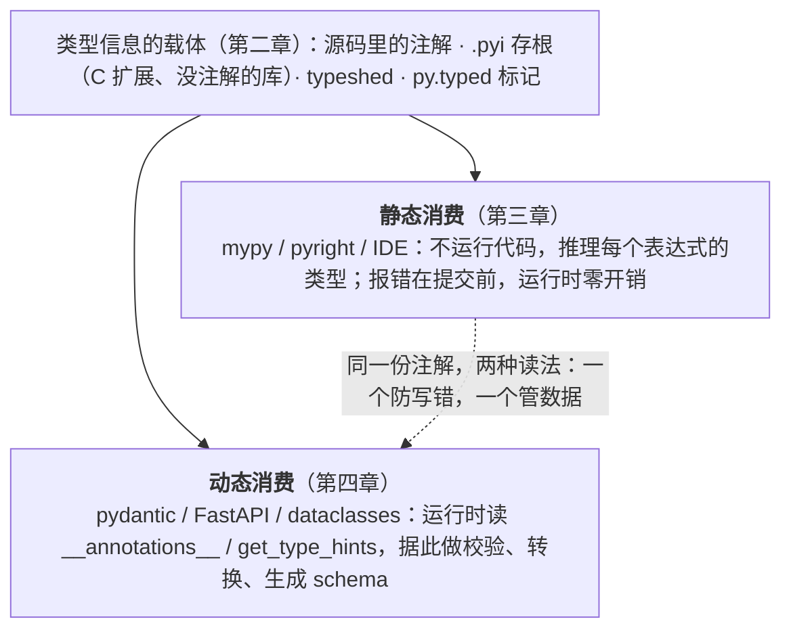

[上篇](/python-type-expression-and-the-typing-toolbox.html)讲了怎么**写**类型：`typing` 工具箱里每个工具表达哪一种类型意图。但写下来的注解在 Python 里默认什么都不发生——解释器只是把它存进 `__annotations__`，不检查、不转换。类型信息要产生作用，得有人**读**它。本篇讲的就是这条链路的中间两段：

- **分发**：我写的注解怎么随包发给别人？没有源码注解的库（`torch._C` 这类 C 扩展）怎么提供类型信息？——`.pyi` 存根、typeshed、`types-*`、`py.typed` / PEP 561；
- **消费**：谁在读注解、什么时候读、读到之后做什么？——静态一侧是 mypy / pyright 在开发时推理与检查；动态一侧是 `get_type_hints()`、`@dataclass` 的代码生成、Pydantic 的元类、beartype 的运行时校验。

本篇围绕的核心问题是：

> **一条 `x: Tensor | None` 从写下到起作用，经过了哪些环节？静态检查器和运行时框架读到的是同一份信息吗，各自能做什么、不能做什么？**

理解了"框架怎么读注解"，[下篇](/python-data-contract-design-dataclass-pydantic-and-settings.html)讨论"**用**这些框架怎么设计数据结构"时，dataclass 与 Pydantic 就不再是两个黑盒，而是同一份注解的两种消费方式。

## 一、总览




### 1. 在三篇地图上的位置

```
                   类型信息提供层
┌──────────────────────────────────────────────┐
│ 类型表达                                      │
│ ├── Python 内建注解语法                       │
│ ├── 内建泛型：list[str]、dict[str, int]       │
│ ├── typing                                    │
│ └── typing_extensions                         │
│                                               │
│ 类型载体与分发                                 │
│ ├── inline types：.py                         │
│ ├── stub：.pyi                                │
│ ├── typeshed                                  │
│ ├── types-*                                   │
│ └── py.typed / PEP 561                        │
└──────────────────────────────────────────────┘
                       │
                       │ 读取、解释、推理、执行
                       ▼
                   类型信息消费层
┌──────────────────────────────────────────────┐
│ 静态消费                                      │
│ ├── mypy                                      │
│ ├── Pyright / Pylance                         │
│ ├── IDE、CI                                   │
│ └── 类型推断、收窄、兼容性检查                 │
│                                               │
│ 动态消费                                      │
│ ├── isinstance / issubclass                   │
│ ├── get_type_hints / __annotations__          │
│ ├── @dataclass（读注解生成代码）               │
│ ├── Pydantic（元类 + pydantic-core）           │
│ ├── beartype                                  │
│ └── Annotated 元数据解析                      │
└──────────────────────────────────────────────┘
                       │
                       │ 用消费层的能力构建
                       ▼
                 工程落地：数据契约
┌──────────────────────────────────────────────┐
│ 数据建模                                      │
│ ├── @dataclass：内部数据传递                  │
│ ├── Pydantic BaseModel：边界校验              │
│ └── TypedDict：字典形状约束                   │
│                                               │
│ 契约的输入输出                                 │
│ ├── 序列化 / 反序列化                         │
│ ├── JSON Schema / OpenAPI 生成                │
│ └── BaseSettings：配置即契约                  │
└──────────────────────────────────────────────┘
```

本篇讲图里中间的两格：提供层下半的**类型载体与分发**，以及整个**消费层**——静态与动态。

### 2. 本文的章节安排

| 章 | 主题 | 内容 |
|---|---|---|
| 二 | 类型载体与分发 | .pyi 存根、typeshed、types-*、`py.typed/PEP` 561、inline types vs stub |
| 三 | 类型信息消费层（上）：静态分析与推理 | mypy 与 pyright、配置与渐进式引入、静态检查的能力边界 |
| 四 | 类型信息消费层（下）：动态消费 | `__annotations__` 与 `get_type_hints`、@dataclass 与 Pydantic 如何读注解、beartype、静态与运行时的分工 |
| 五 | 本文小结 |  |
| 六 | 自测 | 2 道题 |

Table: 本文的章节安排

## 二、类型载体与分发：存根、typeshed 与 py.typed

类型注解要对库的使用者生效，不仅需要写在源码中，还需要以类型检查器能够发现和读取的形式随库分发。

对于普通 Python 模块，类型信息通常直接写在 `.py` 文件中。对于 C/C++ 扩展、动态生成的 API，或者缺少源码注解的第三方库，类型信息则可以通过 `.pyi` 存根文件、独立的类型存根包、`typeshed`、`py.typed`/PEP 561，以及类型检查器插件等机制提供。

以类似 PyTorch `torch._C` 的底层扩展模块为例，类型检查器通常无法直接分析 `.so`、`.pyd` 等二进制文件内部的 C/C++ 实现。因此，库作者需要通过其他类型载体描述其对外暴露的 Python API，例如：

```python
# _native.pyi

def matmul(a: Tensor, b: Tensor) -> Tensor: ...
```

这里的 `.pyi` 文件不包含具体实现，只向类型检查器声明模块的接口、参数类型和返回值类型。类型检查器在分析下游代码时，可以读取这些声明，而不需要理解底层 C/C++ 实现。

因此，类型载体与分发机制解决的核心问题不是“如何给没有 Python 源码的库添加注解”，而是：

> **如何将库的公开 API 以类型检查器可发现、可读取和可传播的形式提供给下游代码。**

常见机制的分工如下：

| 机制 | 分工 |
|---|---|
| `.py` | 类型信息与 Python 实现写在同一个文件中 |
| `.pyi` | 单独描述模块的接口和类型信息 |
| typeshed | 为标准库及部分第三方库提供外部存根 |
| `types-*` | 以独立软件包形式分发第三方库的类型存根 |
| `py.typed` | 声明包内的类型信息可以提供给下游类型检查器 |
| PEP 561 | 规定 Python 包分发类型信息的相关机制 |

Table: 类型信息载体的分工

需要注意的是，C/C++ 扩展并不一定没有类型信息；它们通常只是无法通过二进制实现本身被类型检查器直接推导。类型信息仍然可以由 `.pyi` 文件、Python 包装层、外部存根包或类型检查器插件提供。下面我们就展开介绍这种外部存根包的类型信息提供机制。

### 1. .pyi 存根文件与 typeshed

**.pyi 文件**

`.pyi`（Python Interface）文件只包含签名，不包含实现。它告诉类型检查器一个模块里有什么函数、什么类型：

```python
# torch/_C/__init__.pyi — PyTorch 的 C++ 扩展模块的类型存根

def _get_tracing_state() -> bool: ...
def _set_grad_enabled(enabled: bool) -> None: ...

class TensorBase:
    def dim(self) -> int: ...
    def size(self, dim: int | None = None) -> Size: ...
    def to(self, device: Device, dtype: dtype | None = None) -> Tensor: ...
```

`.pyi` 文件的语法和普通 Python 完全一样，只是函数体都用 `...`（Ellipsis）代替。

**typeshed**

[typeshed](https://github.com/python/typeshed) 是 Python 官方维护的类型存根仓库，覆盖：

- **Python 标准库**的所有模块（`os`、`sys`、`json`、`asyncio` 等）
- **部分知名第三方库**（`requests`、`docutils` 等）

mypy 和 pyright 都**内置了 typeshed**，所以你用标准库时不需要手动安装任何存根。

**types-* 独立存根包**

对于 typeshed 不覆盖的第三方库，社区通过 PyPI 发布独立的存根包，命名规则为 `types-<package>`：

```bash
pip install types-requests     # requests 的类型存根
pip install types-PyYAML       # PyYAML 的类型存根
pip install types-redis        # redis 的类型存根
pip install types-Pillow       # Pillow 的类型存根
```

mypy 安装后会自动发现并使用这些存根。

**存根文件的查找优先级**

类型检查器按以下顺序查找类型信息（以 mypy 为例）：

1. **包内 inline 类型**：库自带的类型注解（源码中直接写的）
2. **包内存根**：库自带的 `.pyi` 文件（如 PyTorch 的 `torch/_C/__init__.pyi`）
3. **独立存根包**：通过 pip 安装的 `types-*` 包
4. **typeshed**：内置的标准库和知名库存根
5. **自定义存根**：项目内 `mypy.ini` 或 `pyproject.toml` 指定的路径

对应 Java：Java 没有存根文件的概念——类型信息编译进 `.class` 文件。最接近的是 `.jar` 中不含实现的接口定义。


### 2. py.typed、PEP 561 与类型信息发布

**PEP 561：类型信息的发布标准**

[PEP 561](https://peps.python.org/pep-0561/) 定义了 Python 库如何声明"我提供了类型信息"。这个标准让类型检查器知道哪些库是"类型安全"的。

核心机制非常简单——在包的根目录放一个空文件 `py.typed`：

```
mypackage/
├── __init__.py
├── py.typed          ← 标记文件，可以是空文件
├── core.py           ← 源码中直接写类型注解
└── _internal.pyi     ← 或者提供 .pyi 存根
```

有了 `py.typed`，类型检查器就知道这个包的类型信息是**官方提供**的（不是第三方猜的），可以放心使用。

**三种类型信息发布方式**

| 方式 | 说明 | 例子 |
|---|---|---|
| **Inline types** | 源码中直接写注解 + `py.typed` | FastAPI, Pydantic, httpx |
| **包内存根** | `.pyi` 文件随包发布 + `py.typed` | PyTorch (`torch/_C/*.pyi`) |
| **独立存根包** | 单独的 `types-*` 包 | `types-requests`, `types-PyYAML` |

Table: 三种类型信息发布方式

主流 AI Infra 项目的选择：

- **FastAPI / Pydantic / httpx**：inline types——源码本身就有完整注解，加 `py.typed` 标记
- **PyTorch**：混合——Python 代码用 inline types，C++ 扩展用 `.pyi` 存根
- **NumPy**：从 1.20 开始提供 inline types + `py.typed`
- **requests**：本身无注解，依赖社区的 `types-requests` 独立存根包


### 3. inline types vs stub：如何选择

如果你在**开发一个库**，需要决定如何提供类型信息：

| 考量 | Inline types（推荐） | .pyi 存根 |
|---|---|---|
| 维护成本 | 低——类型和代码一起改 | 高——改代码后要同步改存根 |
| 适用场景 | 纯 Python 库 | C 扩展、需要对外隐藏实现 |
| 对调用方的体验 | 跳转到源码能看到完整实现 | 跳转到 `.pyi` 只能看签名 |
| 运行时开销 | 极小（3.13 及之前注解在定义时求值，除非 `from __future__ import annotations`；3.14 起 PEP 649 才默认惰性） | 零 |

Table: Inline types 与 .pyi 存根的选择考量

**推荐**：如果你的库是纯 Python，直接在源码中写类型注解 + 加 `py.typed` 标记。只有 C 扩展模块才需要 `.pyi` 存根。

```bash
# 发布一个带类型信息的包
mypackage/
├── __init__.py
├── py.typed              # 空文件即可
├── core.py               # def process(data: list[str]) -> dict[str, int]: ...
└── _c_extension.pyi      # C 扩展的存根
```

在 `pyproject.toml` 中确保 `py.typed` 被打包：

```toml
[tool.setuptools.package-data]
mypackage = ["py.typed", "*.pyi"]
```

这一步很容易漏——`py.typed` 在源码目录里存在，但如果没配 `package-data`，构建 wheel 时不会被打进去，下游依然看不到类型信息。

> `pyproject.toml` 的完整配置、wheel 与 sdist 的区别、带 C/CUDA 扩展的包如何构建与发布，见[《Python 项目工程化与生产交付》](/python-engineering-and-production-delivery.html)的"打包与分发"一章。

## 三、类型信息消费层（上）：静态分析与推理

类型信息写好了、分发好了，接下来就是"谁来用"。消费方分为两种：**静态分析工具**在开发时检查类型正确性，**动态工具**在运行时利用类型信息做校验和解析。两者互补，不是替代关系。

类型注解写在源码中，但 Python 解释器**完全忽略**它们——不会做任何检查。真正让类型注解产生价值的是**静态类型检查器**。这一部分关于"谁来检查、怎么检查、检查到什么程度"。

### 1. mypy 与 pyright

**mypy**

mypy 是 Python 官方的类型检查器，由 Guido van Rossum 本人发起，也是历史最久、社区最广的选择。

```bash
pip install mypy

mypy src/                 # 基本检查
mypy --strict src/        # 严格模式（推荐新项目）
```

**pyright**

pyright 由 Microsoft 开发，用 TypeScript 编写，是 VS Code 插件 Pylance 的后端。速度是它的最大优势。

```bash
pip install pyright

pyright src/
```

**对比**

| 特性 | mypy | pyright |
|---|---|---|
| 语言 | Python | TypeScript (Node.js) |
| 速度 | 较慢（大项目可达分钟级） | **快很多**（通常秒级） |
| IDE 集成 | 需要插件 | VS Code Pylance **内置** |
| 严格程度 | 可配置，默认较宽松 | 默认更严格 |
| 维护方 | Python 官方 + 社区 | Microsoft |
| 增量检查 | 支持（`--incremental`，默认开启） | 支持（文件级缓存） |
| CI 常见度 | **更常见**（老牌标准） | 在增长 |

Table: mypy 与 pyright 对比

两者都广泛使用。如果用 VS Code 开发，pyright 通过 Pylance 自动工作；CI 中 mypy 更常见。很多项目**同时**配置两者——本地开发用 pyright 获得即时反馈，CI 用 mypy 做门禁。

**类型推断**

和 Java 的 `var` 一样，类型检查器也能自动推断类型，不需要处处手写注解：

```python
x = 42              # mypy/pyright 推断 x: int
items = [1, 2, 3]   # 推断 items: list[int]
d = {"a": 1}        # 推断 d: dict[str, int]

def double(n: int) -> int:
    return n * 2

result = double(5)  # 推断 result: int
```

但在以下场景推断会失败，需要显式注解：

```python
# 空容器——无法推断元素类型
items: list[str] = []

# 复杂的工厂/注册表模式
registry: dict[str, Callable[..., Module]] = {}

# 函数参数——必须注解（mypy --strict 要求）
def process(data):    # mypy --strict: error: Function is missing a type annotation
    ...
```


### 2. 配置实践与渐进式引入

**pyproject.toml 配置**

```toml
# mypy 配置
[tool.mypy]
python_version = "3.11"
strict = true
warn_return_any = true
warn_unused_configs = true

# 对没有类型存根的第三方库禁用检查
[[tool.mypy.overrides]]
module = "torch.*"
ignore_missing_imports = true

[[tool.mypy.overrides]]
module = "transformers.*"
ignore_missing_imports = true
```

```toml
# pyright 配置
[tool.pyright]
pythonVersion = "3.11"
typeCheckingMode = "standard"  # off / basic / standard / strict
reportMissingImports = true
reportMissingTypeStubs = false
```

**渐进式引入策略**

对于已有大型项目，不可能一步到位开启 `--strict`。推荐的渐进策略：

**第一步：仅检查新代码**

```toml
[tool.mypy]
# 不开 strict，只检查有注解的代码
check_untyped_defs = true
```

**第二步：对关键模块开启严格检查**

```toml
[[tool.mypy.overrides]]
module = "myproject.api.*"
strict = true

[[tool.mypy.overrides]]
module = "myproject.models.*"
strict = true
```

**第三步：CI 中逐步收紧**

```bash
# 只检查本次 PR 修改的文件
git diff --name-only origin/main | grep '\.py$' | xargs mypy
```

**第四步：全面严格模式**

```toml
[tool.mypy]
strict = true
```

vLLM、FastAPI 等项目都是逐步引入类型检查的——早期代码有大量 `Any` 和 `# type: ignore`，新代码则要求严格注解。


### 3. 静态检查的能力边界

类型检查器不是万能的。理解它做不到什么，才能在"加注解"和"写 `# type: ignore`"之间做正确选择。

**做不到的事情**

**1. 运行时动态行为**

```python
# 动态属性——类型检查器无法追踪
class Config:
    pass

config = Config()
config.debug = True     # mypy: error: "Config" has no attribute "debug"
                        # 但运行时完全合法

# __getattr__ 让对象可以响应任意属性
class Flexible:
    def __getattr__(self, name: str) -> Any:
        return 42

f = Flexible()
f.anything   # 运行时返回 42，但 mypy 无法推断
```

**2. 复杂的元编程**

```python
# dataclass 的 __init__ 由装饰器在运行时生成
# mypy 有专门的插件支持 dataclass，但自定义元类可能无法推断

# SQLAlchemy 的声明式 ORM：Column 定义到属性类型的映射需要 mypy 插件
class User(Base):
    __tablename__ = "users"
    id = Column(Integer, primary_key=True)  # mypy 不知道 self.id 是 int
    name = Column(String)                   # 需要 sqlalchemy-stubs 或 mypy 插件
```

**3. 跨进程/跨语言边界**

```python
# C 扩展模块——需要 .pyi 存根文件提供类型信息（见"类型载体与分发"部分）
import numpy as np
arr = np.array([1, 2, 3])  # 没有存根就是 Any

# RPC / 序列化结果——类型信息在传输中丢失
result = pickle.loads(data)  # result: Any
```

**什么时候用 `# type: ignore`**

合理的使用场景：

```python
# 1. 你确认代码正确，但类型检查器的能力有限
value = getattr(obj, attr_name)  # type: ignore[attr-defined]

# 2. 和没有类型存根的 C 扩展交互
import some_c_extension  # type: ignore[import-untyped]

# 3. 临时绕过，附上 TODO
result = complex_dynamic_call()  # type: ignore[no-any-return]  # TODO: add proper types
```

不合理的使用：**用 `# type: ignore` 压制所有错误来让 CI 通过**——这意味着类型注解形同虚设。

**不同检查器对同一代码的判断可能不同**

```python
from typing import TypeVar

T = TypeVar("T")

def identity(x: T) -> T:
    return x

reveal_type(identity(42))
# mypy:    Revealed type is "builtins.int"
# pyright: Type of identity(42) is "int"
# 结果一样

# 但在某些边界情况下，两者的推断会有差异
# 特别是涉及 overload 解析、TypeVar 的多重约束时
```

如果项目同时使用 mypy 和 pyright，偶尔需要同时满足两者的要求。遇到冲突时，优先修正代码而不是加 `# type: ignore`。

## 四、类型信息消费层（下）：动态消费——运行时如何读取类型注解

类型注解在运行时**默认被忽略**——Python 解释器不会因为 `x: int = "hello"` 而报错。但注解本身是保留在对象上的，任何代码都可以在运行时把它读出来加以利用：有的用来生成代码（`@dataclass`），有的用来生成校验器（Pydantic），有的用来做即时检查（beartype）。

这一节关注的是**机制**：运行时工具通过什么途径拿到注解、在什么时机拿、拿到之后做了什么。至于用这些工具**怎么设计数据结构**（建模、校验、序列化、配置），是[下篇第二章](/python-data-contract-design-dataclass-pydantic-and-settings.html#二工程落地数据契约设计)「工程落地：数据契约设计」的主题。

### 1. isinstance、`__annotations__` 与 get_type_hints()：原生能力

**isinstance：最基本的运行时类型检查**

```python
def process(value: int | str) -> str:
    if isinstance(value, int):
        return str(value * 2)
    elif isinstance(value, str):
        return value.upper()
```

`isinstance` 是 Python 内置的运行时类型检查，不依赖 `typing` 模块。它的限制：

- **不支持泛型**：`isinstance(x, list[int])` 会报错（`list[int]` 不是运行时类型）
- **不支持 Union**：`isinstance(x, int | str)` 从 3.10 开始才支持
- **不支持 Protocol**：除非加了 `@runtime_checkable`

**`__annotations__`：注解存放在哪里**

在 Python 中，当你在类内部写下 `id: int` 但不赋值时，解释器并不会把它当作普通类变量，而是把这个映射关系存入类的 `__annotations__` 字典：

```python
class RawUser:
    id: int
    name: str

print(RawUser.__annotations__)
# {'id': <class 'int'>, 'name': <class 'str'>}
```

普通的类对这个字典视而不见——它就静静躺在那里，不影响任何运行时行为。但 `@dataclass` 装饰器和 Pydantic 的元类正是通过读取它，拿到了模型所需的字段名和目标类型。**这是所有"运行时消费类型注解"的框架的共同起点。**

函数也一样：

```python
def greet(name: str, age: int = 18) -> str:
    return f"{name} is {age}"

print(greet.__annotations__)
# {'name': <class 'str'>, 'age': <class 'int'>, 'return': <class 'str'>}
```

**get_type_hints()：更可靠的注解读取**

```python
from typing import get_type_hints

class User:
    name: str
    age: int
    email: str | None = None

hints = get_type_hints(User)
# {'name': <class 'str'>, 'age': <class 'int'>, 'email': str | None}
```

`get_type_hints()` 返回一个类或函数的类型注解字典。它比直接读 `__annotations__` 更可靠，差别有三点：

| | `__annotations__` | `get_type_hints()` |
|---|---|---|
| 字符串注解 | 原样返回字符串 | 求值为真正的类型对象 |
| 继承来的字段 | 只有当前类自己的 | 合并整条 MRO 上的注解 |
| `Optional` 补全 | 不处理 | 带 `None` 默认值的参数自动补成 `X ∣ None` |

Table: __annotations__ 与 get_type_hints() 的差别

第一点尤其重要。开启 `from __future__ import annotations` 后（或使用前向引用），所有注解都会以字符串形式保存：

```python
from __future__ import annotations

class Node:
    value: int
    next: Node | None       # 此时 Node 还没定义完

print(Node.__annotations__)
# {'value': 'int', 'next': 'Node | None'}   ← 是字符串，不是类型

from typing import get_type_hints
print(get_type_hints(Node))
# {'value': <class 'int'>, 'next': Node | None}   ← 已求值
```

所以框架读注解时基本都用 `get_type_hints()` 而不是裸的 `__annotations__`——这是 Pydantic、beartype 等框架的底层基础：它们在运行时读取注解，然后根据注解生成校验逻辑。

对应 Java：`get_type_hints()` 类似 Java 的反射 API `Field.getGenericType()`，但由于 Java 有类型擦除，运行时拿不到完整的泛型信息。Python 反而更好——注解信息在运行时完整保留。

```python
# 框架底层原理示意
def validate(cls, data: dict) -> object:
    hints = get_type_hints(cls)
    instance = cls.__new__(cls)
    for field_name, field_type in hints.items():
        value = data[field_name]
        if not isinstance(value, field_type):   # 简化版——实际框架处理更复杂
            raise TypeError(f"{field_name} expects {field_type}, got {type(value)}")
        setattr(instance, field_name, value)
    return instance
```


### 2. 框架如何消费注解：代码生成与元类

上一节的 `validate()` 是一个玩具示例。真实框架读到注解之后做什么？主要有两条技术路线：**装饰器 + 代码生成**（`@dataclass`）和**元类 + 验证树**（Pydantic）。理解这两条路线，就理解了 Python 数据类框架的全部"魔法"。

**`@dataclass`：读注解，生成代码，但不校验**

标准库的 `@dataclass` 是一个装饰器。当它包裹一个类时：

1. 读取该类的 `__annotations__` 字典，得到字段名和字段顺序；
2. 在内存中拼接一段形如 `def __init__(self, id, name): self.id = id ...` 的**源码字符串**；
3. 用内置的 `exec()` 把这段字符串编译成真正的函数对象，绑定到类上。

本质是在类定义完成之后，由外挂的装饰器往类里塞方法。可以直接把生成的结果打印出来：

```python
from dataclasses import dataclass
import inspect

@dataclass
class User:
    id: int
    name: str

print(inspect.signature(User.__init__))
# (self, id: int, name: str) -> None      ← 这个 __init__ 是 exec 生成的
```

这里有一个**必须说清楚的点**：`@dataclass` 只用注解做了"字段声明"这一件事，它**完全不做类型校验**。注解在这里是触发器，不是检查依据：

```python
user = User(id="not an int", name=123)   # 不报错！
print(user.id)                            # 'not an int'
```

`dataclasses` 甚至不关心注解的内容是不是一个合法类型——写 `id: "随便什么字符串"` 它也照样生成 `__init__`。所以在类型信息的消费谱系里，`@dataclass` 属于**最轻度**的消费者：它只关心"有哪些字段"，不关心"字段是什么类型"。

**Pydantic：元类拦截 + 构建验证树**

Pydantic 走的是更底层的**元类**机制。当模型继承 `BaseModel` 时，Python 在**类创建阶段**（不是实例化阶段，更不是调用阶段）就会触发 Pydantic 的自定义元类。

Pydantic v2 中元类的核心流程：

1. **类创建期的拦截与组装**：元类拦截类的创建过程，遍历 `__annotations__` 的每个字段，检查是否附带 `EmailStr`、`Field()`、`Annotated[...]` 等高级定义；
2. **构建验证树**：为该模型构建一套验证树结构。v2 为了性能，把这部分核心校验逻辑编译后交给 Rust 编写的引擎 `pydantic-core` 驱动；
3. **重写 `__init__`**：生成一个特殊的 `__init__`。调用 `User(id="123")` 时它不直接赋值，而是把入参丢进验证树——先清洗与转换（`"123"` → `123`），再执行复杂校验（正则、范围），通过后写入实例；失败则收集**所有**错误路径，一次性抛出结构化的 `ValidationError`。

关键在于**时机**：验证树是在类定义时一次性构建好的，实例化时只是执行它。这也是 Pydantic v2 比 v1 快一个数量级的原因之一——把工作从"每次实例化"挪到了"仅一次的类创建"。

```python
from pydantic import BaseModel

class User(BaseModel):
    id: int
    name: str

# 类定义完成的那一刻，验证器就已经生成好了
print(type(User))               # <class 'pydantic._internal._model_construction.ModelMetaclass'>
print(User.__pydantic_core_schema__ is not None)   # True
```

上面 `type(User)` 打印出 `ModelMetaclass` 而不是 `type`，正是[上篇第二章](/python-type-expression-and-the-typing-toolbox.html#二类型表达从基础注解到-typing-工具箱) §7 "类的类型是 `type`，自定义元类则是 `type` 的子类"那条规则的直接体现。换句话说，`User` 这个**类对象**的类型是 `ModelMetaclass`，所以任何接受 `type[BaseModel]` 的函数都能拿到它。

> 元类本身的机制（`type` 的三参数形式、`__new__` 的拦截时机、与 `__init_subclass__` 的取舍）在[《Python 动态机制及 AI-Infra 实践》](/python-reflection-metaprogramming-and-plugin-architecture.html)的"元类：控制类的创建过程"一节有完整展开，这里只关注它作为注解消费者的角色。

**两条路线的对比**

| | `@dataclass` | Pydantic `BaseModel` |
|---|---|---|
| 介入方式 | 装饰器，类创建**之后** | 元类，类创建**过程中** |
| 读注解的手段 | `__annotations__` | `get_type_hints()`（处理前向引用） |
| 拿注解干什么 | 只取字段名和顺序，生成 `__init__` | 解析类型语义，构建验证树 |
| 注解内容是否被理解 | **否**，只当占位符 | **是**，驱动转换与校验 |
| 运行时校验 | 无 | 有（Rust 实现的 `pydantic-core`） |
| 实现技术 | `exec()` 动态代码生成 | 元类 + Rust 扩展 |

Table: @dataclass 与 Pydantic BaseModel 消费注解的两条路线

对应 Java：`@dataclass` 类似 Lombok——编译期往类里塞方法，注解只是生成指令；Pydantic 类似 Hibernate Validator——真正解析注解的语义并在运行时执行校验。差别是 Lombok 在编译期改 AST，`@dataclass` 在运行时 `exec` 字符串。

> **接下来**：这一节讲的是"框架怎么读注解"。至于**用**这些框架怎么设计数据结构——什么时候该用 `dataclass`、什么时候该上 Pydantic、如何做序列化和配置管理——见[下篇第二章](/python-data-contract-design-dataclass-pydantic-and-settings.html#二工程落地数据契约设计)「工程落地：数据契约设计」。


### 3. beartype 与其他运行时检查工具

**beartype：零配置的运行时类型检查**

如果你不需要 Pydantic 的完整数据建模能力，只想在运行时检查函数参数类型，[beartype](https://github.com/beartype/beartype) 是一个轻量级选择：

```python
from beartype import beartype

@beartype
def add(a: int, b: int) -> int:
    return a + b

add(1, 2)       # OK
add(1, "2")     # beartype.roar.BeartypeCallHintParamViolation:
                # @beartyped add() parameter b="2" violates hint <class 'int'>
```

beartype 的特点：

| 特性 | beartype | Pydantic | 纯 isinstance |
|---|---|---|---|
| 使用方式 | `@beartype` 装饰器 | 继承 `BaseModel` | 手动写 `if isinstance` |
| 校验时机 | 函数调用时 | 对象实例化时 | 你调用时 |
| 支持泛型 | 支持（`list[int]`） | 支持 | 不支持 |
| 性能开销 | 极低（O(1) 抽样检查） | 中等（完整校验） | 最低 |
| 数据转换 | 不做 | 自动转换 | 不做 |
| 适用场景 | 防御式编程、调试期 | API 边界、数据建模 | 简单分支判断 |

Table: beartype、Pydantic 与纯 isinstance 的对比

**typeguard：另一个运行时检查库**

```python
from typeguard import typechecked

@typechecked
def process(data: list[str]) -> dict[str, int]:
    return {s: len(s) for s in data}
```

[typeguard](https://github.com/agronholm/typeguard) 功能类似 beartype，但做**完整**检查（不是抽样），性能开销更大。适合测试环境。

**何时需要运行时类型检查**

**需要的场景**：
- API 入参校验（用 Pydantic）
- 外部数据解析（JSON、配置文件、用户输入）
- 调试期防御（用 beartype，发版时可关闭）

**不需要的场景**：
- 内部函数调用——静态检查已经足够
- 性能关键路径——任何运行时检查都有开销
- 类型检查器已经保证正确的代码


### 4. 静态与运行时的协作边界

Python 类型系统的一个核心设计原则是：**静态检查和运行时检查是互补的，不是替代关系**。

**分工**

| | 静态检查（mypy / pyright） | 运行时检查（Pydantic / beartype） |
|---|---|---|
| 覆盖范围 | 你写的代码 + 有存根的库 | 所有实际运行的数据 |
| 检查时机 | 开发时 / CI | 运行时 |
| 性能开销 | 零（不影响运行） | 有（校验成本） |
| 能做到 | 推断、收窄、穷尽检查 | 精确值校验（范围、格式、正则） |
| 做不到 | 校验外部输入的具体值 | 类型推断、代码可读性提升 |

Table: 静态检查与运行时检查的分工

**推荐实践**

**1. 信任边界（Trust Boundary）模式**：在系统的**入口处**做运行时校验，内部用静态检查。

```python
# 入口：运行时校验——外部数据不可信
@app.post("/v1/completions")
async def create_completion(request: CompletionRequest):  # Pydantic 校验
    # 经过 Pydantic 校验后，内部可以信任类型正确
    result = engine.generate(request.prompt, request.params)
    return result

# 内部：静态检查——数据已经可信
def generate(prompt: str, params: SamplingParams) -> GenerateOutput:
    tokens = self.tokenizer.encode(prompt)  # mypy 确保 prompt 是 str
    ...
```

**2. 保持一致**：静态注解和运行时校验的类型要匹配。

```python
# 好：Pydantic 模型的字段注解 == mypy 看到的类型
class Config(BaseModel):
    batch_size: int = 32

# 坏：运行时校验和类型注解不一致
class Config(BaseModel):
    batch_size: Any = 32  # 运行时不校验，mypy 也不检查——两头都放弃了
```

**3. 不要在热路径上做运行时检查**

```python
# 坏：每次 forward 都做运行时类型检查
@beartype
def forward(self, x: torch.Tensor) -> torch.Tensor:  # GPU 推理瓶颈
    ...

# 好：只在初始化时检查
@beartype
def __init__(self, config: ModelConfig) -> None:  # 只调用一次
    ...
```

## 五、本文小结

上篇写下的注解，经过本篇的三段才起作用：**分发**——inline 注解随源码走，C 扩展与无注解的库靠 `.pyi` 存根，`py.typed` 告诉检查器"这个包的注解可信"，typeshed 与 `types-*` 补第三方的缺口；**静态消费**——mypy / pyright 在开发时做推理、收窄与兼容性检查，但只看到"写下来的"，看不到运行时的真实数据；**动态消费**——`__annotations__` / `get_type_hints()` 是原生入口，`@dataclass` 读注解生成代码（把注解当字段清单，不理解语义），Pydantic 用元类在类创建时读注解并编成校验器（理解语义），beartype 在调用时按注解检查。

两侧的分工可以收成一句话：**静态检查管"写得对不对"，运行时校验管"来的数据对不对"**——前者零运行时开销但看不见外部输入，后者看得见外部输入但每次都要付钱。所以边界上用运行时校验、内部靠静态检查，这就是[下篇](/python-data-contract-design-dataclass-pydantic-and-settings.html)数据契约设计的出发点。

## 六、自测

1. Python 的类型注解在运行时默认做什么？谁在消费它？

   <details markdown="1"><summary>答案</summary>

   什么都不做——解释器只把注解存进 `__annotations__`，不检查、不转换。消费者是人（文档）、静态检查器（mypy / pyright）、以及运行时库（Pydantic、dataclasses、FastAPI）主动读取注解。

   </details>

2. 一个纯 Python 包写满了注解，为什么用户的 mypy 仍把它当成无类型（`Any`）？怎么修？

   <details markdown="1"><summary>答案</summary>

   PEP 561 要求包里放一个空的 `py.typed` 标记文件，检查器才会读取它的 inline 注解；没有这个文件，mypy 把整个包视作无类型来源，所有导入都是 `Any`。修法是在包目录加 `py.typed` 并确保它进 wheel（`package_data`）；C 扩展或不想暴露源码的部分则提供 `.pyi` 存根。

   </details>

## 下一篇

[Python 在 AI-Infra（02 下）：类型系统——数据契约设计](/python-data-contract-design-dataclass-pydantic-and-settings.html)

