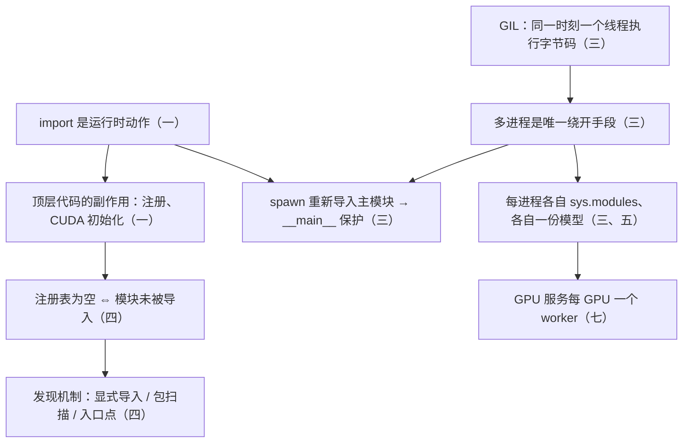

七篇正文回答了一个问题：**在 AI-Infra 系统里，Python 不承担最重的计算，那它到底承担什么，为此需要掌握它的哪些机制**。答案是组织、调度、扩展、观测和交付——Python 是控制平面和胶水层。第一篇讲代码是怎么运转的，第二篇讲类型如何被表达与消费，第三篇讲任务如何协作，第四篇讲系统如何扩展而不失控，第五篇讲内存如何被占用与回收，第六篇讲怎么确认它真的对、出了问题怎么查，第七篇讲怎么把它可复现地交付出去。前六篇解决"写对"，第七篇解决"交付"。

本文不讲新内容，做三件事：把七篇压成一张表与七段回顾，把贯穿七篇的几条线拎出来，然后给一套三段式的通关自测——判断与计算、跨篇综合、面试题。各篇末尾的自测检验的是"这一篇读懂了没有"，这里检验的是"七篇能不能连起来用"。第七篇末尾那一节"关于这个系列"的内容，也并入本文。

> **读完这七篇，你应该能回答哪些问题？[^q0] 哪些数字与结论必须能脱口而出？[^q1] 怎么判断自己是"读过"还是"掌握"了？[^q2]**

## 一、总览：系列回答的问题与主线

系列的一句话主张是：**Python 的语法很容易，Python 工程不容易——难的不是怎么写，而是语法背后哪些机制在起作用、这些机制的代价是什么、什么时候不该用**。七篇沿同一条链递进（代码怎么运转 → 怎么写得健壮 → 怎么协作 → 怎么扩展 → 内存怎么优化 → 怎么确认没问题 → 怎么交付），用同一个参照系（Java：每个特性说明它对应什么、对照在哪里失效），例子取自同一批真实项目（PyTorch、vLLM、FastAPI、Pydantic）。这条链是有依赖的：不理解 `import` 的副作用就看不懂插件注册（一 → 四）；不理解注解如何被运行时消费就说不清 Pydantic 的校验从哪来（二 → 七）；不理解 GIL 就判断不了推理服务该起几个 worker（三 → 七）。

| 篇 | 回答的问题 | 一句话结论 | 必记的数字 / 判据 |
|---|---|---|---|
| 第一篇：语言机制与运行时原理（[上](/python-language-mechanisms-and-runtime-internals.html) · [下](/python-object-model-protocols-decorators-and-generators.html)） | 一段代码从被加载、创建对象、执行任务到释放资源，运行时做了什么？ | 每行"简单"语法背后是一个可替换的协议：`import` 是运行时动作，`obj.attr` 是一个固定算法，`model(x)` 查类型上的 `__call__`，装饰器在定义时执行一次，生成器是挂起的帧 | 属性查找：数据描述符 → 实例字典 → 非数据描述符 → `__getattr__`；`sys.path[0]` 由启动方式决定；`sys.modules` 每进程一份；`super()` 是 MRO 里的下一个；`break` 不等于 `close()` |
| 第二篇：类型系统与数据契约设计（[上](/python-type-system-and-data-contract-design.html) · [中](/python-type-information-distribution-and-consumption.html) · [下](/python-data-contract-design-dataclass-pydantic-and-settings.html)） | 类型信息从哪来、被谁消费、怎么落成可执行的契约？ | 提供与消费拆成两层：解释器只把注解存进 `__annotations__`；`@dataclass` 读注解只当字段清单、用 `exec` 生成代码；Pydantic 用元类在类创建时构建验证树 | 边界校验一次、内部零开销；`Protocol` 3.8、`X \| Y` 3.10、`ParamSpec` 3.10、`Self` 3.11；`get_type_hints()` 比 `__annotations__` 多做三件事；`@runtime_checkable` 只查方法存在 |
| [第三篇：并发、异步与任务协作](/python-concurrency-asynchrony-and-task-collaboration.html) | 瓶颈在哪？任务怎么协作？下游跟不上时系统怎么稳？ | 按瓶颈选模型不按 API 流行度：线程管阻塞 I/O，进程绕开 GIL，asyncio 管大量 I/O 协作；背压、超时、取消、批处理是过载时的稳定手段 | 线程池默认 $$\min(32, \text{cpu} + 4)$$；OS 线程约 8 MB 栈、协程几 KB；`fork` 只复制调用线程，3.14 起 Linux 默认 `forkserver`；`/dev/shm` 默认 64 MB；队列默认无界、`asyncio.Lock` 不可重入、`CancelledError` 是 `BaseException`；FastAPI `def` 端点线程池 40 |
| [第四篇：Python 的动态机制及工程实践](/python-reflection-metaprogramming-and-plugin-architecture.html) | 运行时怎么访问和改造程序结构？怎么用它做插件系统与路由，又不失控？ | 反射观察、元编程改造、动态加载导入；插件化 = 注册表 + 发现 + 契约 + 边界；动态机制只在启动时"选择"，热路径必须静态 | 侵入性递增：显式注册 → 装饰器 → 描述符 → `__init_subclass__` → 元类；`getattr` ≈ 23 ns（2.3×）、`inspect.signature` ≈ 3700 ns（约 370×）；三种发现机制；用户输入能选名字、不能造名字 |
| [第五篇：内存管理与优化](/python-memory-management-and-optimization.html) | 哪些内存归 Python、哪些在原生缓冲区或设备上？哪些操作复制或延长生命周期？增长怎么定位？ | 内存问题多数不是"泄漏"而是"被意外长期持有"；Python 归还内存是分层的，对象释放不等于 RSS 下降 | 引用计数归零立即释放，循环靠分代 GC，阈值 `(700, 10, 10)`；pymalloc 管 ≤ 512 字节，arena 256 KB / pool 4 KB；小整数 −5 到 256 缓存；`memory_reserved` ≥ `memory_allocated`；先分三类再找源 |
| [第六篇：单元测试、问题定位与调试实践](/python-unit-testing-troubleshooting-and-debugging.html) | 怎么验证行为符合预期？异步时序、Mock、动态调用、内存、卡死各用哪个工具？ | 工具不难，难在按症状选工具；日志要分调试期与生产期；`raise ... from` 与带上下文的日志是所有工具的前提 | `Mock` 不能 `await`、要用 `AsyncMock`；替换"被测模块里实际用的名字"；logger 与 handler 两道级别关卡；库只建 logger 不配输出；`python -X faulthandler`、`PYTHONTRACEMALLOC=25`、`pytest -W error::RuntimeWarning` |
| [第七篇：项目工程化与生产交付](/python-engineering-and-production-delivery.html) | 依赖怎么声明和锁定、环境怎么隔离、质量怎么把关、制品怎么打包、镜像怎么分层？ | Python 把 Java 里由框架和编译器强制的事交还给你：锁文件进 CI、torch 交给固定 tag 的基础镜像、静态检查是编译器的替代品 | `pip install torch` 2 GB+、环境 5–8 GB、镜像 8–12 GB；装 torch 用 `--index-url` 不用 `--extra-index-url`；CUDA 三层、同大版本向前兼容；GPU 服务每 GPU 一个 worker（4 × 14 GB = 56 GB）；`uv sync --frozen`；tag 不能是 `latest` |

### 1. 本文的章节安排

| 章 | 内容 |
|---|---|
| 二 | 逐篇回顾：核心问题、结论、必记、常见误解 |
| 三 | 贯穿七篇的五条线：import 是运行时动作、边界与热路径、GIL 决定部署形态、引用与生命周期、Java 对照哪里失效 |
| 四 | 常见误区表 |
| 五 | 通关自测：A 判断与计算 10 题、B 跨篇综合 5 题、C 面试题 7 题、D 掌握判据 |
| 六 | 下一步 |

## 二、逐篇回顾

### 1. 第一篇：语言机制与运行时原理

（拆成[上：代码如何被执行](/python-language-mechanisms-and-runtime-internals.html)与[下：对象如何工作](/python-object-model-protocols-decorators-and-generators.html)两篇。）

**核心问题**：一段 AI-Infra 代码从被加载、创建对象、执行任务到释放资源，Python 运行时究竟做了什么？`import torch` 为什么能加载几百 MB 的 C++ 库，`model(x)` 与 `model.forward(x)` 为什么不等价，写了 `@register` 为什么注册表还是空的？

**结论**：沿"一段代码的生命周期"看，九组机制层层依赖。源码按模块编译成 code object，函数对象封装它，调用时创建帧；名称归属在编译期决定，闭包是"函数对象 + cell"且 cell 是共享的（循环里的 `lambda: i` 全返回最后一个值）。`import` 不是声明而是运行时动作：查 `sys.modules` → `sys.meta_path` 上的 finder 给出 `ModuleSpec` → loader 执行顶层代码；`.so` 由 `ExtensionFileLoader` `dlopen` 并调 `PyInit_*`，所以 `torch._C` 与一个 `.py` 走的是同一条路。模块在顶层代码执行完之前就已在 `sys.modules` 里，这是循环导入报 `cannot import name` 的窗口期。类由 `type` 创建；`obj.attr` 是一个固定算法（数据描述符 → 实例 `__dict__` → 非数据描述符或类属性 → `__getattr__`），方法、`classmethod`、`staticmethod`、`property` 只是描述符 `__get__` 返回值不同；`nn.Module` 靠 `__setattr__` 拦截写、`__getattr__` 兜底读把子模块藏进 `_modules`。特殊方法在类型上查找、跳过实例字典，所以 `model(x)` 走 `nn.Module.__call__`（hooks 挂在这里），`model.forward(x)` 绕过全部 hook。装饰器在定义时执行一次、返回替代对象，靠闭包记参数、靠描述符协议对方法透明；生成器是被挂起而非销毁的帧，资源随生成器存活；`with` 展开为 `__enter__` / `__exit__`，异常沿帧链传播、途经每个 `__exit__` 与 `finally`，只记录不重抛是反模式。

**必记**：

- `sys.path[0]`：`python script.py` 是脚本所在目录、`__package__` 为 `None`；`python -m pkg.mod` 是当前目录、`__package__` 为 `pkg`。相对导入依赖 `__package__`，所以脚本方式跑会报 `attempted relative import with no known parent package`。
- 同一文件以 `__main__` 和模块名两个名字导入会执行两次：注册表里出现重复项、`isinstance` 莫名为 `False`；入口文件要薄。
- editable 安装不复制文件，只改查找路径：一行 `.pth` 把 `src/` 追加进 `sys.path`（复杂布局下 setuptools 64 起用 `MetaPathFinder`，PEP 660）；改 `.py` 立即生效，新增顶层包、改 `[project.scripts]` 要重装。
- flat 布局下测试通过与否取决于 `pytest` 还是 `python -m pytest`、`tests/` 下有没有 `__init__.py`，与包装得对不对无关；src 布局把这条路堵死。
- 只定义 `__eq__` 会让 `__hash__` 被置为 `None`；`@dataclass(frozen=True)` 自动生成一致的两者，可变 dataclass 默认不可哈希。
- `break` 只退出循环不关闭生成器，CPython 靠引用计数归零时析构 `close()`；需要确定性清理用 `finally` 里 `close()` 或 `contextlib.closing`。`except BaseException` 会吞掉 `KeyboardInterrupt`、`SystemExit`、`GeneratorExit`。
- 裸 `raise` 不改 traceback，`raise exc` 多追加当前一行；`from exc` 设 `__cause__`，不写 `from` 记到 `__context__`，`from None` 切断链。

**常见误解**："`import` 只是声明依赖"——它执行模块顶层代码，算子注册、CUDA 初始化、日志配置都可能发生在这一步，时机由导入顺序决定。另一个："`super()` 调的是父类"——它调的是实例 MRO 中当前类之后的下一个，`Logging.run` 里的 `super().run()` 可能调到 `Metrics.run`；任何一层漏掉 `super()`，之后的层全被跳过。

### 2. 第二篇：类型系统与数据契约设计

（拆成[上：类型表达](/python-type-system-and-data-contract-design.html)、[中：分发与消费](/python-type-information-distribution-and-consumption.html)、[下：数据契约](/python-data-contract-design-dataclass-pydantic-and-settings.html)三篇。）

**核心问题**：Python 的类型信息从哪里来、被谁消费，又如何在系统边界上落成可执行的数据契约？为什么 `x: int = "hello"` 不报错，`@dataclass` 读了注解却不校验，Pydantic 又凭什么能校验？

**结论**：与 Java 把声明、编译检查、`.class` 载体、运行时反射合为一体不同，Python 把"提供类型信息"与"消费类型信息"拆成两层。提供层是注解语法、`typing`、`typing_extensions`，以及把类型随包分发的 `.pyi` 存根、typeshed、`types-*`、`py.typed`（PEP 561）；消费层分静态（mypy、pyright 在开发时推断与报错）与动态（`isinstance`、`get_type_hints`、`@dataclass`、Pydantic、beartype 在运行时读注解）。解释器自己是最不消费注解的那个：只存进 `__annotations__`。`@dataclass` 是最轻度的消费者——读 `__annotations__` 拿字段名与顺序，拼一段源码字符串再 `exec` 成 `__init__`，注解内容是不是合法类型它都不管；Pydantic 用元类在类创建阶段遍历注解、构建验证树，v2 把校验交给 Rust 写的 `pydantic-core`，实例化时只是执行——把工作从"每次实例化"挪到"仅一次的类创建"是 v2 比 v1 快一个数量级的原因之一。`ABC` 是名义子类型（必须继承、实例化时报错、可带默认实现），`Protocol` 是结构子类型（有这些方法就算实现，不控制第三方类代码时用）；`ParamSpec` 让装饰器不吃掉签名。工程落地的核心原则：**在系统边界用 Pydantic 校验一次，内部传递零开销的 `@dataclass`**——vLLM 的 API 层用 Pydantic、引擎内部（`SamplingParams`、`SchedulerConfig`）一律 `@dataclass`。

**必记**：

- `get_type_hints()` 比裸 `__annotations__` 多做三件事：把字符串注解（`from __future__ import annotations` 后全是字符串）求值成类型对象、合并整条 MRO 的注解、给带 `None` 默认值的参数补成 `X | None`。框架都用它。
- mypy 默认不检查没标注的函数体（参数视为 `Any`），`check_untyped_defs` 或 `strict` 才检查——"过了 mypy"不等于"被检查过"。
- `@runtime_checkable` 只检查方法是否存在，不检查签名；`isinstance(x, list[int])` 报错，`isinstance(x, int | str)` 3.10 起才支持。
- `py.typed` 在源码目录存在不够，还要在 `[tool.setuptools.package-data]` 里带上，否则构建 wheel 时不会打进去，下游依然看不到类型。
- Pydantic 校验默认发生、是 `__init__` 的一部分且会转换（`"1"` → `1`）、错误一次性全部报出（`loc` 是字段路径，FastAPI 拿它生成 422）；Java 的 Bean Validation 要 `@Valid` 触发才发生。`BaseSettings` 优先级：显式传入 > 环境变量 > `.env` > 默认值；`Settings()` 那一瞬间失败——把配置错误从运行期挪到启动期。
- `TypedDict` 运行时就是 `dict`、零开销，只约束形状；`@dataclass(slots=True)`（3.10+）用于实例数量极大的内部对象。

**常见误解**："类型注解会在运行时生效"——不会，除非有 Pydantic、beartype 这类消费者；写了注解不等于做了检查。另一个："`@dataclass` 就是 Lombok，`X | None` 就是 `Optional<T>`"——Lombok 在编译期改 AST、`@dataclass` 在运行时 `exec` 字符串；`Optional<T>` 是运行时包装对象、`X | None` 是纯注解。

### 3. 第三篇：并发、异步与任务协作

**核心问题**：当前瓶颈是 CPU、GPU、网络还是外部服务？任务之间应该如何协作？当下游处理速度跟不上上游输入速度时，系统如何保持稳定？

**结论**：GIL 保证任一时刻只有一个线程执行字节码，所以多线程对纯 Python CPU 计算无效、对阻塞 I/O 有效（等待时释放 GIL）；NumPy、PyTorch 的 C 扩展在长计算前主动释放 GIL，所以多线程能并行推动 GPU。三种执行模型按同一组维度对照：线程由 OS 抢占调度、1:1 映射 OS 线程、运行中不能取消（`Future.cancel()` 只对未开始的任务有效）；进程有独立解释器和独立 GIL、数据要 pickle 或走共享内存、上下文不传播、只能 kill 但也是唯一能打断纯计算的手段、worker 崩溃让 `ProcessPoolExecutor` 整池报废（`BrokenProcessPool`）；asyncio 是一个线程里的事件循环、只在 `await` 处切换、能在下一个 `await` 点协作式取消。Java 21 的虚拟线程与协程同在 M:N 这一层，但让出方式相反——JDK 在阻塞点自动卸载，Python 只在显式 `await` 让出，所以 `requests.get()` 在虚拟线程里是正确的高并发写法、在协程里是卡死整个服务的事故。过载时靠三层：有界队列的背压（异步生成器天然拉取式背压）、超时与取消（`asyncio.timeout()` 是取消作用域，上游真的会停；Java 的 `orTimeout()` 不会）、批处理（`max_batch_size` + `batch_wait_timeout`，vLLM 的 continuous batching 每个 decode step 重新组批）。真实服务三种模型一起用：asyncio 做入口与编排，线程池承载只有同步接口的库和 GPU 推理，进程池做 CPU 预处理，靠 `to_thread` / `run_in_executor` 搭桥——桥只能把阻塞挪出事件循环，不能赋予它可取消性。

**必记**：

- `ThreadPoolExecutor` 默认 `max_workers = min(32, os.cpu_count() + 4)`；`ProcessPoolExecutor` 默认 `os.cpu_count()`（3.13 起 `os.process_cpu_count()`，尊重 cgroup）。一个 OS 线程约 8 MB 虚拟内存栈、一个协程几 KB，所以大规模并发 I/O 的答案是 asyncio 不是线程池。
- `fork` 快但只复制调用线程，父进程有多线程或已初始化 CUDA 时可能死锁（`Cannot re-initialize CUDA in forked subprocess`）；`spawn` 重新导入主模块，所以要 `if __name__ == "__main__":`；Python 3.14 把 Linux 默认从 `fork` 改成 `forkserver`。
- 进程间传 1 GB 数组 = 1 GB 序列化 + 1 GB 管道拷贝 + 1 GB 反序列化；大数据走 `shared_memory`，谁 `create` 谁 `unlink`。DataLoader 的 worker 是主进程的完整拷贝，`fork` 的 copy-on-write 因引用计数写入而失效；容器 `/dev/shm` 默认 64 MB，不够就 `Bus error`。
- 默认值对不上：三种队列都默认无界（OOM 常见来源）；`asyncio.Lock` 不可重入（无 `RLock`）；`asyncio.Semaphore` FIFO 公平而 Java 默认非公平；`CancelledError` 自 3.8 起是 `BaseException`，不会被 `except Exception` 误吞；`asyncio.Queue` 没有 `timeout=` 参数。
- `TaskGroup`（3.11 起稳定）：一个子任务失败取消其余、异常以 `ExceptionGroup` 上抛（`except*`）；`gather` 默认一个失败其他继续、只报第一个。`cancel()` 之后必须 `await`，否则清理逻辑没机会执行。
- FastAPI：`async def` 端点在事件循环上跑，普通 `def` 端点自动进线程池（AnyIO 默认 40 个线程）——处理函数阻塞时改回 `def` 反而更安全。`non_blocking=True` 只在源张量位于 pinned memory 时才真正异步。

**常见误解**："改成 `async` 就更快"——异步改善的是并发组织方式，不消除网络延迟、GPU 排队、模型执行时间；把 CPU 计算写进 `async def` 只会阻塞事件循环。另一个："把 Java 的 `ExecutorService` + CPU 计算翻译成 `ThreadPoolExecutor`"——16 线程和 1 线程一样慢，`ProcessPoolExecutor` 存在的唯一理由就是 GIL。

### 4. 第四篇：Python 的动态机制及工程实践

**核心问题**：Python 在运行时如何访问和操作已有的程序结构？如何在程序定义、创建或执行过程中介入？这些能力如何应用到 AI-Infra 的插件系统与路由分发，又怎么不把系统弄成"什么都能做、什么都看不懂"？

**结论**：先纠正一个层次混淆——反射（`getattr`、`inspect`、`__dict__`：观察）、元编程（装饰器、描述符、`__init_subclass__`、元类：改造）、动态加载（`importlib`、入口点：导入）是语言机制，插件化是叠加导入系统与注册发现能力构建出的架构模式。AI-Infra 需要它们，是因为核心逻辑不能写成一串 `if backend == "cuda"`，必须建立一层"名字 → 实现"的映射，围绕它有四个语言不替你回答的问题：名字从哪来、映射到什么、实现何时进内存、映射到的可信吗。插件系统的构建顺序是注册表 → 发现机制 → 契约校验 → 正式边界（身份、接口、配置、生命周期、能力声明）→ 版本与热加载。注册代码必须被执行，而"被执行"等价于"所属模块被导入过"，所以发现机制回答的是"谁负责导入插件模块"：显式导入（可控、可审计）、包扫描（`pkgutil.iter_modules`，顺序不确定、失败面大）、入口点（`importlib.metadata.entry_points`，第三方 pip 包接入，vLLM 的 platform plugin 用它）——默认显式，多到难维护再扫描，要让别人扩展才上入口点。路由分发与插件化骨架完全一样，区别只在 key 的空间（插件名 vs `(method, path)`）和热度，所以要把 `inspect.signature()` 压缩到启动时的"路由编译期"。全文最核心的一条原则：**初始化可以动态，热路径必须静态；系统边界可以动态，核心算法必须显式**。代价分三类——性能、可维护性（栈里三个都叫 `wrapper` 的帧、注册表返回 `Any` 让 pyright 抓不到拼错的方法名、元类注入的属性 IDE 补全为空）、安全（任意导入、任意属性访问、`eval`）。

**必记**：

- 侵入性递增：显式注册函数 → 装饰器 / 类装饰器 → 描述符 → `__init_subclass__` → 元类；只有上一层做不到才下沉。写元类只为"在类定义时做点什么"，几乎总该换成 `__init_subclass__` 或类装饰器；元类不可替代的场景是控制类本身的行为。
- 热路径开销（CPython 3.9 实测，数量级参考）：`obj.x` ≈ 10 ns、`getattr(obj, "x")` ≈ 23 ns（2.3×）、`hasattr` ≈ 30 ns、`inspect.signature(f)` ≈ 3700 ns（约 370×）；`importlib.import_module` 首次导入毫秒级。修法是启动时解析一次、固化成普通引用。
- 契约要静态 + 运行时两手：`Protocol` 在开发阶段约束，`inspect` 在加载阶段确认；`hasattr` 不够，还要看 `callable` 和签名参数。`cast()` 编译期无成本、运行时无校验，只能紧跟一次真实校验之后。
- 三种版本要分开：插件版本、核心框架版本、插件 API 版本。热加载是蓝绿发布不是 `importlib.reload()`——`reload` 只重跑模块代码，不处理已创建对象、后台线程、GPU 资源、其他模块持有的引用。
- 插件失败要分级：`REQUIRED` 失败拒绝启动并 `raise ... from exc`，`OPTIONAL` 失败记录并降级，降级状态要进健康检查与指标；故障隔离只处理"加载失败"，运行时异常靠超时、熔断、资源限额。
- 用户输入可以决定"选哪个名字"（在白名单里查表），不能决定"名字长什么样"（不能拿用户字串去 `import_module`、`getattr`、`eval`）。

**常见误解**："反射很慢所以不能用"——单次几十纳秒，放在启动阶段无论多大都不值得优化；问题只在它被放进每请求、每 token 的路径。另一个："`@property` 与 `nn.Parameter` 的登记都是描述符"——`property` 是数据描述符，`nn.Module` 登记参数走的是 `__setattr__` 拦截；一个在描述符层、一个在实例层。

### 5. 第五篇：内存管理与优化

**核心问题**：在 AI-Infra 服务里，哪些内存由 Python 管理、哪些在原生缓冲区或设备上，哪些操作会创建副本或延长对象生命周期，内存持续增长时又该如何定位来源？

**结论**：一个请求经过 JSON 解析 → `np.array` → `torch.from_numpy` → GPU → `.cpu().numpy().tolist()` → JSON 序列化，每一步都可能创建对象、转换格式或复制，峰值远高于输入本身。Python 标量是完整对象，容器保存的是引用，所以 `list[float]` 与 NumPy 数组的内存特征完全不同；`__slots__` 省掉每实例的 `__dict__`，但收益取决于对象数量。赋值不是复制，浅拷贝只复制最外层，深拷贝代价高且对含锁、句柄的对象有问题；列表切片创建新容器，NumPy 切片是视图——共享减少复制，代价是一个很小的视图让整个大缓冲区活着。"零拷贝"要满足 dtype、布局、生命周期等一串条件：`torch.from_numpy` 共享，`torch.tensor(array, dtype=...)` 换 dtype 就复制，`astype(copy=False)` 只是"尽量"。Python 内存不等于进程内存：`tracemalloc` 只看 Python 层，RSS 涨而它不涨，问题在 C 扩展、框架分配器、mmap；CPU 内存与 GPU 显存是不同资源，`del tensor` 只减引用计数。回收机制：引用计数归零立即释放，循环引用交给分代 GC（三代、按分配计数触发，大量存活对象时 Gen 2 回收有延迟尖刺，一些框架 `gc.disable()`）；`__del__` 时机不可控、可能复活对象，用 `weakref.finalize` 或 `with`。pymalloc 管小对象，pool 归还 arena、arena 只有全部 pool 释放才归还 OS，所以对象释放了 RSS 也可能不降——这是"分配器保留"，不是泄漏。贯穿全篇的判断：内存问题多数不是"某处泄漏"，而是"某处被意外长期持有"——无界缓存、闭包捕获大模型、Task 与异常对象持有的请求上下文和 traceback、全局历史列表，它们语义上都是合理引用，只是生命周期比预期长。

**必记**：

- 小整数 −5 到 256 预先创建并全局共享（`256 is 256` 为 `True`、`257 is 257` 可能为 `False`）；`sys.getrefcount(a)` 至少返回 2（参数本身算一个）；`sys.getsizeof` 只算浅层大小。
- `gc.get_threshold()` 默认 `(700, 10, 10)`：Gen 0 分配数减释放数达 700 触发 Gen 0 回收，Gen 0 回收 10 次触发 Gen 1，Gen 1 回收 10 次触发 Gen 2；GC 触发按分配计数，不按内存大小。
- pymalloc 管 ≤ 512 字节的小对象；结构是 Arena（256 KB，向 OS 申请）→ Pool（4 KB，按 size class）→ Block（8、16、…、512 字节）；大对象直接走系统 `malloc`。
- 复制判据：`x[::2]`、`x.view(-1)`、`x.numpy()` 不复制；`clone()` 总是复制；`contiguous()` 只在不连续时复制；`.tolist()` 把连续数组变回大量 Python 对象，是推理服务里内存与延迟问题的常见来源。
- `torch.cuda.memory_reserved()` 通常大于 `memory_allocated()`——缓存分配器保留已释放的块以复用，不是泄漏；`nvidia-smi` 看到的还包括 CUDA context 本身几百 MB；`empty_cache()` 可归还但让下次分配变慢。
- 排查先分三类：仍被业务对象引用（`tracemalloc` 快照对比、`gc.get_referrers`、`objgraph`）、分配器保留（理解 pymalloc，不指望 RSS 回到初始值）、原生或设备持有（`memray`、`memory_summary()`、`nvidia-smi`）；把这些指标放在同一时间线上才能判断。

**常见误解**："对象不可达、`gc.collect()` 也执行了，RSS 却没降，所以有泄漏"——arena 中只要还有存活对象就不归还 OS，这是分配器保留。另一个："`nvidia-smi` 显示 60 GB 但 `memory_allocated()` 只有 30 GB，另外 30 GB 漏了"——那是 caching allocator 缓存的空闲块加 CUDA context，`memory_reserved − memory_allocated` 就是它。

### 6. 第六篇：单元测试、问题定位与调试实践

**核心问题**：如何验证一段 AI-Infra Python 代码的行为真的符合预期，以及当异步时序、Mock、动态调用、内存增长或进程卡死出问题时，该用哪个工具从哪里下手？

**结论**：AI-Infra 代码的正确性不能靠阅读判断——逻辑对但时序错、类型匹配但值不符、不报错但内存涨。测试侧：`pytest` 写参数化、异常与边界测试，fixture 按 scope 与 `yield` 管资源、`conftest.py` 共享；`Mock` 替同步、`AsyncMock` 替异步（用 `Mock` 替 `async def`，`await mock()` 报 `TypeError`），`patch` 支持 `autospec` 与嵌套、`monkeypatch` 在测试结束自动还原；`pytest-asyncio` 的 `asyncio_mode = "auto"` 让 `async def test_*` 自动跑，测超时把参数注入成 0.01 秒而不真等，测取消要断言 `finally` 执行过。`monkeypatch` 必须替换"被测模块中实际使用的名字"（`service.download_model`）而不是定义它的原始模块——这是第一篇名称绑定规则的直接后果。调试侧：`pdb` / `breakpoint()` 看现场；日志分调试期（临时 DEBUG 看路径）与生产期（`Logger` / `Handler` / `Formatter` / `Filter` 四个组件，logger 树与 `propagate`，库只建 logger 不配输出、应用在入口 `basicConfig(force=True)` 配一次，JSON 结构化输出到 stdout 不写文件，`contextvars` + `Filter` 自动注入 request ID，惰性格式化用 `%s` 不用 f-string，`QueueHandler` + `QueueListener` 把 I/O 移出协程）；`raise ... from exc` 保留异常链；`inspect.getmodule` / `getsourcefile` / `signature` / `iscoroutinefunction` 确认插件、装饰器与动态调用背后的真实对象；`tracemalloc` 快照对比定位 Python 分配；`faulthandler` 转储所有线程栈排查卡死；`cProfile` 看 Python 层热点但看不到 GPU 与其他线程。最后收敛成一张按症状选工具的决策树。

**必记**：

- 决策树：测试失败看现场 → `pytest -x --pdb`；未 `await` 的协程 → `pytest -W error::RuntimeWarning`；插件加载了错误实现 → `inspect.getmodule()`；RSS 涨 → `PYTHONTRACEMALLOC=25 python app.py`；卡死无日志 → `python -X faulthandler app.py` 或 `faulthandler.dump_traceback_later(10, repeat=True)`；Python 层慢 → `python -m cProfile -s cumulative`。
- 级别有两道关卡：先过 logger 的级别，再过 handler 的级别；同一条日志出现两遍通常是子 logger 与 root 都加了 handler 且 `propagate` 为 `True`。
- 库代码里 `basicConfig()` 或 `addHandler(StreamHandler())` 是错的——它配置的是 root logger，属于应用的决策权；库想避免警告加 `NullHandler`。压掉 `httpx`、`urllib3`、`filelock`、`transformers` 的 DEBUG 几乎必备。
- 容器里日志输出到 stdout 并设 `PYTHONUNBUFFERED=1`，否则崩溃时缓冲区里的日志丢失。
- `patch` 裸 `start()` 忘 `stop()` 会泄漏到其他测试；`autospec=True` 保留原签名让调用错误暴露。
- `cProfile` 显示某函数占 60% 但 GPU 利用率只有 30%，要先用 `torch.profiler` / Nsight 看 GPU 是否在等 CPU，是才值得优化那 60%。

**常见误解**："覆盖率高说明测试质量高"——只跑成功路径的测试分支覆盖仍不足，异常、超时与取消、生命周期清理、插件加载失败路径才是要盯的。另一个："`except Exception: raise RuntimeError('load failed')` 只是换了个异常类型"——它丢了原始 traceback 与异常链，之后无法判断问题在网络、后端还是转换层。

### 7. 第七篇：项目工程化与生产交付

**核心问题**：怎么把一个 AI-Infra Python 项目变成可以复现、可以交付的东西——依赖怎么声明和锁定、环境怎么隔离、质量怎么把关、制品怎么打包、镜像怎么分层？

**结论**：Java 工程师在这里落差最大：`pyproject.toml` 本身不含依赖解析器（pip / uv / Poetry 要自选）；没有 classpath，`sys.path` 默认含全局 `site-packages`，同一解释器下一个包只能一个版本，所以每个项目一个虚拟环境——激活只是改 `PATH`，不激活直接 `.venv/bin/python` 在 CI 与 Dockerfile 里更可靠；虚拟环境不隔离解释器版本、glibc、CUDA driver、系统工具。抽象依赖（`pyproject.toml`，表达兼容范围，人手写）与锁定依赖（`uv.lock`，记录这次装的每个版本与 hash，工具生成不手改）职责不同、不能互相替代；`requirements.txt` 三重不可复现（范围浮动、传递依赖无约束、无 hash）。AI-Infra 特有的坑来自 torch 不是纯 Python 包：`+cu121` 是 PEP 440 本地版本标识，PyPI 不接受，必须走 PyTorch 自己的索引且用 `--index-url` 而非 `--extra-index-url`（后者在多个索引里选版本最高的，会装到别的变体，也是 dependency confusion 的入口）；CUDA 兼容矩阵有三层——driver（内核态、全机唯一、`nvidia-smi` 显示的是它能支持的最高版本）、runtime / toolkit、torch wheel 链接的 runtime——同大版本内次要版本向前兼容；同一份抽象依赖在 macOS 与 Linux + GPU 上解析结果不同，锁文件跨平台失效，最省事的做法是在与生产同构的容器里锁一个平台。最有价值的一条建议：**把 torch 与 CUDA 交给固定 tag 的基础镜像**，项目依赖里不含 torch——同时解决体积、构建缓存、跨平台锁文件三个问题，代价是可复现性的责任从锁文件转移到镜像 tag，所以 tag 绝不能是 `latest`。质量把关靠 Ruff（Rust 实现，快 10–100 倍，`B008`、`B023` 抓 Python 特有陷阱）+ mypy + pre-commit 进 CI 门禁——Python 没有编译器把关，这道门得自己装。交付单位是容器镜像：先拷依赖声明装依赖再拷代码，`uv sync --frozen --no-install-project --no-dev`；容器里仍用 venv 是为了多阶段构建时 `COPY --from` 一次拷走；模型权重不进镜像；`uvicorn` 的每个 worker 是独立进程、各有 GIL 与事件循环、各自加载一份模型，GPU 推理服务每个 GPU 一个进程，进程内靠单事件循环 + continuous batching 提吞吐；健康检查分 liveness 与 readiness。

**必记**：

- `pip install torch` 在 Linux 上装的是捆绑 CUDA 运行时的默认变体（2 GB+，连带 `nvidia-*` 库），一个只写了 `torch` 的项目环境 5–8 GB；镜像 8–12 GB 里 torch + CUDA 库占 5–7 GB，`python:3.11-slim` 只约 150 MB。十个服务共用同一个基础镜像那 7 GB 只存一份，各自 `pip install torch` 存十份。
- `torch==2.4.0` 这个约束可以被 `2.4.0+cu121` 满足，但锁文件记下 `+cu121` 后只对同样的 CUDA 目标有效。uv 用 `[[tool.uv.index]]` 的 `explicit = true` + `[tool.uv.sources]` 让只有 torch 走 PyTorch 索引。
- 报错对应的层：`CUDA driver version is insufficient` 是 driver 太老；`is_available() == False` 但有 GPU 是装了 `+cpu` 或容器没挂 GPU；`undefined symbol: ...cudnn...` 是 cuDNN 版本不一致；`no kernel image is available` 是 GPU 架构不在 wheel 编译目标里。
- 版本上界：应用用 `>=` 就够（可复现由锁文件保证）；库默认不加上界，已知不兼容用 `!=` 排除具体版本。`uv sync --frozen` 是 CI 的形式——锁文件与 `pyproject.toml` 不一致就直接失败。
- worker 数：纯 I/O 转发 2–4 个靠 asyncio 撑并发；Python 层有 CPU 工作约等于核数；本地 GPU 推理 = 1（或按 GPU 数），4 个 worker × 14 GB 模型 = 56 GB 显存直接 OOM。
- Dockerfile 三层：基础层（CUDA + torch，几乎不变）、依赖层（锁文件变才重建）、代码层（每次提交重建）；顺序错了每次提交都重装全部依赖。`.dockerignore` 排掉 `.venv/`、`.git/`、`*.pt`、`*.safetensors`。

**常见误解**："`requirements.txt` 里全写 `==` 就可复现"——传递依赖仍浮动，且没有 hash 校验；真正的可复现要锁文件带 hash 并 `--require-hashes` 或 `uv sync --frozen`。另一个："`nvidia-smi` 右上角的 CUDA Version 是已安装的 toolkit 版本"——它是 driver 能支持的最高版本，与 wheel 链接的 runtime 是不同层。

## 三、贯穿全系列的几条线

### 1. import 是运行时动作

第一篇建立的这一条，后面五篇各用了一次。`import` 查 `sys.modules`、找 finder、执行顶层代码，所以注册装饰器、算子注册、CUDA 初始化都是导入副作用，时机由导入顺序决定；`sys.path[0]` 由启动方式决定，同一文件可能以两个名字被执行两次。第四篇把它变成插件系统的前提："注册代码必须被执行"等价于"所属模块被导入过"，三种发现机制回答的都是"谁负责导入"，而"写了装饰器却找不到后端"的唯一根源就是第一篇那条规则。

第三篇在两处遇到它：`spawn` / `forkserver` 会重新导入主模块，所以多进程脚本必须写 `if __name__ == "__main__":`，否则子进程导入主模块时又创建进程池；`fork` 之后每个进程有自己的 `sys.modules`，主进程后来的注册子进程看不到。第六篇的 `monkeypatch` 必须替换"被测模块里实际使用的名字"（`service.download_model` 而不是 `loader.download_model`），因为 `from loader import download_model` 在导入时把名字绑定进了 `service` 的命名空间。第七篇的 src 布局与 editable 安装、容器里 `ENV PATH` 而不 `source activate`，都是在控制 `sys.path` 里有什么。

### 2. 边界校验一次，内部静态、零开销，启动时失败

第二篇给出原则：外部数据不可信，在系统边界用 Pydantic 校验一次，进门后用零开销的 `@dataclass` 传递，靠 mypy 做静态保障；`BaseSettings` 让配置错误在 `Settings()` 那一瞬间暴露，而不是加载了几十 GB 权重之后。第四篇把同一条边界画在时间轴上：初始化阶段可以动态（导入、`inspect` 签名、插件校验、路由预编译），热路径必须静态（缓存好的字典、已绑定的方法引用）；插件契约在启动阶段验证，`REQUIRED` 插件失败就拒绝启动。

第五篇从内存侧说同一件事：在明确的边界完成必要的转换（`np.array`、`.tolist()`），不在链路中反复改变数据表示；请求对象只存活在请求范围内。第七篇把边界推到进程外：`ruff check` + `mypy src/` + `pytest` + `uv lock --check` 进 CI 门禁，任何一项失败就不产出制品——Python 没有编译器把关，这道门是自己装的；readiness 探针让模型没加载完时流量不进来。四篇说的是一条纪律：把不确定性挡在入口，让运行期只做确定的事。

### 3. GIL 与执行模型决定部署形态

第三篇的 GIL 是根：多线程不能让纯 Python CPU 代码并行，绕开它的唯一手段是多进程，代价是隔离——数据要 pickle 或走共享内存、上下文不传播、每个 worker 都是主进程的完整拷贝。第五篇解释了为什么"完整拷贝"比想象中更贵：Python 读一个对象也要改引用计数，`fork` 的 copy-on-write 因此失效，8 个 DataLoader worker 就是 8 份 `Dataset` 里的大字典；`shared_memory` 是让 Tensor 跨进程只传句柄的机制。

第七篇把这条线落到部署：`uvicorn --workers N` 的每个 worker 是独立进程、各有 GIL 与事件循环、各自加载一份模型进显存，所以 GPU 推理服务每个 GPU 一个进程，进程内用单事件循环 + continuous batching（第三篇第五章的批处理）提吞吐，横向扩容靠多容器各绑一块 GPU。第六篇的 `faulthandler` 是这条线的诊断工具：事件循环被同步调用阻塞、某个线程卡在锁上，`dump_traceback_later` 能把每个线程的栈打出来。

### 4. 引用与生命周期

第一篇里生命周期问题出现了三次：闭包持有 cell 所以 `outer()` 返回后 `value` 还活着；生成器被 `break` 后帧挂起、文件句柄一直开着；异常对象的 traceback 持有整条帧链。第三篇加上任务：`create_task` 的 Task、Future、回调都持有请求上下文，`cancel()` 之后不 `await` 清理逻辑没机会执行；无界队列是"内存慢慢涨"的常见来源。

第五篇把这些统一为一句话——内存问题多数不是"泄漏"而是"被意外长期持有"：无界缓存、`lru_cache` 的强引用、闭包捕获大模型、`except ... as e` 后 `e` 持有栈上局部变量、全局历史列表；一个很小的 NumPy 视图让整块大缓冲区活着；非所有权关系用 `weakref`。第六篇给出验证手段：`weakref.ref(obj)` 后 `del obj; gc.collect()` 断言引用为 `None`，`tracemalloc` 快照对比找分配点，测取消要断言 `finally` 真的执行了。

### 5. 以 Java 为参照系，并标出对照失效的地方

每篇都用 Java 做脚手架，也都指出对照在哪里断掉——这是系列的方法论。第一篇：Python 的 `import` 是运行时语句而 Java 的是编译期声明，`super()` 是动态的 MRO 下一个而 Java 的 `super` 静态指向直接父类，装饰器是普通函数调用而注解只是元数据。第二篇：`@dataclass` 不是 Lombok（运行时 `exec` vs 编译期改 AST），`X | None` 不是 `Optional<T>`，`Protocol` 是"不需要 `implements` 的 interface"。

第三篇的总结最直接："概念对得上，默认值经常对不上"——队列默认无界、`asyncio.Lock` 不可重入、`Semaphore` 公平性相反、`CancelledError` 是 `BaseException` 而 `InterruptedException` 是 `Exception`、`orTimeout()` 不取消上游而 `asyncio.timeout()` 会；虚拟线程与协程同在 M:N 层但让出方式相反。第五篇：Java 原语不装箱、`int[]` 连续，Python 一切皆对象、`list` 存引用；`finalize()` 已废弃对应 `__del__` 有陷阱。第七篇：Maven 内建解析 vs `pyproject.toml` 不含解析器，classpath 隔离 vs 一个解释器一个版本，jar 自包含 vs wheel 不含解释器且绑平台与 CUDA，Spring 统摄一切 vs 没有等价物。架构层两边高度相似（`ServiceLoader` 与 `entry_points`、`@RequestMapping` 与 `@route`），真正因语言而异的只是底下那层机制。

| 概念 | 出现的篇 | 关系 |
|---|---|---|
| `import` 的副作用、`sys.modules`、`sys.path` | 一、三、四、六、七 | 一给机制；四靠它做注册与发现；三的 `spawn` 重新导入、`fork` 各自一份；六的 `monkeypatch` 目标；七的 src 布局与 venv |
| 描述符、`__getattr__`、`__setattr__` | 一、四 | 一给属性查找算法与 `nn.Module` 的实现；四把描述符放进元编程工具箱并与 `property`、`__init_subclass__`、元类排序 |
| 装饰器 | 一、二、四、六 | 一给机制（定义时执行、`wraps`、与描述符叠放）；二用 `ParamSpec` 保住签名；四用它做注册并算栈追踪代价；六用 `__wrapped__` 与 `inspect` 排查 |
| 注解的消费者 | 二、四、七 | 二给 `@dataclass` / Pydantic 两条路线；四用 `Protocol` 做插件契约、泛型注册表消除 `Any`；七的 FastAPI 消费 Pydantic 做校验与 OpenAPI |
| GIL、进程、worker | 三、五、七 | 三给三种模型与 GIL 释放时机；五解释 `fork` 的拷贝为什么贵；七定 worker 数与每 GPU 一进程 |
| 边界与热路径 | 二、四、五、七 | 二校验一次内部 `@dataclass`；四初始化动态热路径静态；五在边界做转换；七 CI 门禁与 readiness |
| 引用与生命周期 | 一、三、五、六 | 一的闭包 / 生成器 / traceback；三的 Task 与队列；五统一为"意外长期持有"；六给验证手段 |
| 异常链与重抛 | 一、四、六 | 一给 `raise` / `from exc` / `from None` 与"日志不是处理"；四的插件加载失败要 `from exc`；六用 `__cause__` 测试异常链 |
| 日志与上下文 | 三、六、七 | 三的 `contextvars` 替代 `threading.local`；六用它注入 request ID、库与应用分工；七的 stdout + `PYTHONUNBUFFERED` |

## 四、常见误区

| 误区 | 为什么错 | 正确的说法 | 出处 |
|---|---|---|---|
| `import` 只是声明依赖 | 它执行模块顶层代码，注册、CUDA 初始化都在这一步发生 | `import` 是运行时动作，副作用时机由导入顺序决定；顶层只做声明式的事 | [第一篇](/python-language-mechanisms-and-runtime-internals.html) |
| `model.forward(x)` 与 `model(x)` 一样 | 调用语法查类型上的 `__call__`，hooks 挂在 `nn.Module.__call__` 里 | 直接调 `forward` 绕过全部 hook | [第一篇](/python-language-mechanisms-and-runtime-internals.html) |
| `super()` 调父类 | 它调的是实例 MRO 中当前类之后的下一个 | 协作式多继承每一层都要调 `super()`，漏一层之后全被跳过 | [第一篇](/python-language-mechanisms-and-runtime-internals.html) |
| 类型注解在运行时生效 | 解释器只把注解存进 `__annotations__` | 只有 Pydantic、beartype 这类消费者主动读取时才生效 | [第二篇](/python-type-system-and-data-contract-design.html) |
| `@dataclass` 会按注解校验 | 它只读字段名与顺序、`exec` 生成 `__init__`，不理解注解语义 | `User(id="abc")` 静默通过；要校验用 Pydantic 或 `__post_init__` | [第二篇](/python-type-system-and-data-contract-design.html) |
| 过了 mypy 就是被检查过了 | 默认不检查没标注的函数体 | `check_untyped_defs` 或 `strict` 才检查 | [第二篇](/python-type-system-and-data-contract-design.html) |
| 多线程能加速 CPU 计算 | GIL 让字节码执行期间只有一个线程 | 线程只对阻塞 I/O 与释放了 GIL 的 C 扩展有效，纯 Python CPU 用进程 | [第三篇](/python-concurrency-asynchrony-and-task-collaboration.html) |
| 在协程里调 `requests.get()` 没问题 | Python 不会替你把阻塞变非阻塞，事件循环整个停摆 | 用异步客户端或 `asyncio.to_thread()`；虚拟线程里这样写才是对的 | [第三篇](/python-concurrency-asynchrony-and-task-collaboration.html) |
| `Future.cancel()` 能停掉运行中的线程 | 只对未开始的任务有效，运行中的线程无法取消 | 线程不能取消、进程只能 kill、协程在下一个 `await` 点协作式取消 | [第三篇](/python-concurrency-asynchrony-and-task-collaboration.html) |
| 子类自动注册应该用元类 | 元类改变类的类型、语义隐式、让 mypy 失效 | `__init_subclass__` 或类装饰器几乎总是更好；元类只在要控制类本身的行为时用 | [第四篇](/python-reflection-metaprogramming-and-plugin-architecture.html) |
| 插件系统一上来就用入口点 | 最灵活的方式失败定位最难、导入顺序不确定 | 默认显式导入，多到难维护再包扫描，要让别人扩展才上入口点 | [第四篇](/python-reflection-metaprogramming-and-plugin-architecture.html) |
| RSS 不降就是泄漏 | pymalloc 的 arena 只在全部 pool 释放后才归还 OS | 先分三类：仍被引用、分配器保留、原生或设备持有 | [第五篇](/python-memory-management-and-optimization.html) |
| 用 `__del__` 释放 GPU 句柄 | 调用时机不可控、可能在解释器关闭时才调、对象可能复活 | 用 `with` 或 `weakref.finalize` | [第五篇](/python-memory-management-and-optimization.html) |
| 在库里 `logging.basicConfig()` | 它配置 root logger，篡改了应用的全局配置 | 库只 `getLogger(__name__)`，最多加 `NullHandler`；应用在入口配一次 | [第六篇](/python-unit-testing-troubleshooting-and-debugging.html) |
| `requirements.txt` 全写 `==` 就可复现 | 传递依赖仍浮动，且没有 hash 校验 | 锁文件带 hash，CI 用 `uv sync --frozen` | [第七篇](/python-engineering-and-production-delivery.html) |
| 装 torch 用 `--extra-index-url` | pip 在多个索引里选版本最高的，可能装到 PyPI 的默认变体 | 用 `--index-url`，或 uv 的 `explicit = true` 按包指定索引 | [第七篇](/python-engineering-and-production-delivery.html) |
| GPU 服务多开几个 worker 提吞吐 | 每个 worker 各自加载一份模型进显存 | 每 GPU 一个进程，进程内靠 asyncio + 批处理 | [第七篇](/python-engineering-and-production-delivery.html) |

## 五、通关自测

### A. 判断与计算（10 题）

1. 项目是 src 布局，`src/myproject/cli.py` 里有一行 `from .core import register`。在仓库根目录分别执行 `python src/myproject/cli.py` 与 `python -m myproject.cli`（包已 editable 安装），各自的 `sys.path[0]`、`__package__` 是什么，相对导入能否成功？

   

答案

   前者：`sys.path[0]` 是脚本所在目录 `src/myproject`，`__package__` 为 `None`，报 `attempted relative import with no known parent package`；后者：`sys.path[0]` 是当前工作目录，`__package__` 为 `myproject`，相对导入成功——`-m` 先把 `myproject.cli` 当模块找到再当 `__main__` 执行。

   

2. 类 `D` 上有 `@property def value`，且 `d.__dict__["value"] = "x"`；类 `R` 上有普通方法 `run`，且 `r.__dict__["run"] = lambda: "y"`。`d.value` 与 `r.run()` 各返回什么？

   

答案

   `d.value` 返回 property 的结果——`property` 有 `__set__`，是数据描述符，优先于实例字典；`r.run()` 返回 `"y"`——函数只有 `__get__`，是非数据描述符，输给实例字典。这正是 monkey patch 单个对象方法能成立、而 `property` 不能被实例字典绕过的原因。

   

3. `Base.run` 返回 `["base"]`，`Logging.run` 与 `Metrics.run` 都是 `result = super().run(); result.append(名字); return result`。`class Run(Metrics, Logging, Base)` 的 `Run().run()` 返回什么？若 `Logging.run` 漏写 `super().run()` 呢？

   

答案

   MRO 是 `Run → Metrics → Logging → Base → object`，返回 `["base", "logging", "metrics"]`（与第一篇 `Run(Logging, Metrics, Base)` 得到的 `["base", "metrics", "logging"]` 相反）。漏写后 `Logging` 之后的 `Base` 被跳过，`Logging.run` 里 `result` 未定义直接报错——链在它那里断了。

   

4. 一个类只定义了 `__eq__`；一个可变的 `@dataclass`；一个 `@dataclass(frozen=True)`。三者能否作为 `dict` 的键？

   

答案

   不能 / 不能 / 能。只定义 `__eq__` 会让 `__hash__` 被置为 `None`（相等的对象必须有相同哈希，Python 用这个防止违约）；可变 dataclass 默认同样不可哈希；`frozen=True` 自动生成一致的 `__eq__` 与 `__hash__`。

   

5. 一台 8 核机器上 `ThreadPoolExecutor()` 与 `ProcessPoolExecutor()` 各默认几个 worker？若为了并发 I/O 开 2000 个线程，虚拟内存栈大约要多少？

   

答案

   线程池 $$\min(32, 8 + 4) = 12$$；进程池 8（3.13 起 `os.process_cpu_count()`，尊重 cgroup）。2000 个 OS 线程按每个约 8 MB 栈是约 16 GB 虚拟内存——大规模并发 I/O 应该用 asyncio，一个协程只有几 KB。

   

6. `Dataset.__init__` 里加载了一个 2 GB 的字典，`DataLoader(num_workers=8)` 在 Linux 上用 `fork` 启动。物理内存大约多出多少？为什么 copy-on-write 没帮上忙？容器里还可能撞上哪个默认值？

   

答案

   约 8 × 2 GB = 16 GB：Python 读对象也要改引用计数，"只读"的页照样被复制，COW 失效。容器 `/dev/shm` 默认只有 64 MB，worker 通过共享内存回传 Tensor 时不够就 `Bus error`，要 `--shm-size` 或调小 `num_workers`。

   

7. 协程里写了 `try: await work() except Exception: log`，外层 `async with asyncio.timeout(2.0)` 超时了。取消信号会被吞掉吗？换成 `except BaseException` 呢？Java 的 `orTimeout(2, SECONDS)` 会停掉上游计算吗？

   

答案

   不会——`CancelledError` 自 3.8 起是 `BaseException`，`except Exception` 抓不到它；换成 `except BaseException` 就会吞掉，任务永远停不下来。`asyncio.timeout()` 是取消作用域，上游真的停；Java 的 `orTimeout()` / `get(timeout)` 只让下游不再等，上游继续跑，要显式 `cancel(true)` 或 `StructuredTaskScope`。

   

8. 一个路由分发函数每次请求都调 `inspect.signature(fn)`，服务 10000 请求/秒。按第四篇实测（≈ 3700 ns），这一项每秒花多少 CPU？换成启动时解析一次、运行时只做一次 `getattr` 呢？

   

答案

   $$3700 \text{ ns} \times 10000 = 37 \text{ ms}$$，约占一个核的 3.7%，且构造大量临时对象让延迟不可预测；`getattr` ≈ 23 ns，同样次数只要 0.23 ms，而预绑定后连这一次也可省成局部变量读取。原则：动态机制在启动时"选择"，热路径只做直接调用。

   

9. `gc.get_threshold()` 为 `(700, 10, 10)`。最少经过多少次 Gen 0 的"净分配"才会触发一次 Gen 2 回收？一个 100 字节的对象由谁分配？一个 arena 里有多少个 pool？

   

答案

   700 × 10 × 10 = 70000 次净分配（Gen 0 每 700 次一轮，10 轮触发 Gen 1，Gen 1 10 轮触发 Gen 2）；100 字节 ≤ 512 字节走 pymalloc；arena 256 KB ÷ pool 4 KB = 64 个 pool。GC 按分配计数触发，不按内存大小。

   

10. 一张 80 GB 的 GPU、一个 20 GB 的模型，`uvicorn --workers 4` 会怎样？正确的做法是什么？十个服务各自 `pip install torch` 与共用 `nvcr.io/nvidia/pytorch:24.10-py3`，磁盘上 torch 层各占多少？

    

答案

    4 × 20 GB = 80 GB，加上 CUDA context 直接 OOM；GPU 服务 worker = 1（每 GPU 一个进程），进程内靠单事件循环 + continuous batching，扩容起多个容器各绑一块 GPU。各自安装即使版本相同层哈希也不同，约 7 GB × 10 = 70 GB；共用基础镜像只存一份约 7 GB。

    

### B. 跨篇综合（5 题）

1. 后端模块 `backends/trt.py` 顶层写了 `@register("tensorrt")`，服务启动后 `registry.create("tensorrt")` 抛 `KeyError`。给出三个层面的排查与修法。

   

答案

   第一篇：装饰器在定义时执行、模块被导入才注册——最可能是没有任何模块导入过 `backends.trt`，或它以两个名字被导入（`sys.path[0]` 差异）而注册落到另一份模块对象；第四篇：插件系统必须显式回答"谁负责导入"，用显式导入列表（可容忍 `ImportError` 但不放过其他异常）或入口点，并让注册表报错时列出候选集合、启动时打印一次完整清单；第六篇：用 `inspect.getmodule()` / `getsourcefile()` 与 `sys.modules` 确认加载的是哪份代码，用 `pytest -x --pdb` 停在注册处。

   

2. 推理服务的请求体用 Pydantic 校验，引擎内部每个 token 都要构造一个 `RequestContext`。内部对象该用什么、为什么？这条决定同时用到了哪几篇的结论？

   

答案

   第二篇：边界校验一次、内部零开销——`RequestContext` 用 `@dataclass`，每 token 跑 Pydantic 校验是常见性能事故；第五篇：实例数量极大、结构稳定、生命周期短的对象用 `@dataclass(slots=True)`，省掉每实例的 `__dict__`，收益取决于对象数量；第四篇：热路径必须静态，`__slots__` 同时省内存与属性访问时间，缓存绑定方法把每次属性查找降成局部变量读取。

   

3. FastAPI 里一个 `async def predict()` 端点直接调 `model.predict(x)`（同步、几百毫秒），线上 p99 暴涨且监控端点也没响应。解释原因并给出两种修法，再说明 worker 数该怎么定。

   

答案

   第三篇：`async def` 端点在事件循环上跑，同步调用阻塞整个循环，所有协程包括健康检查都停摆；修法一是改成普通 `def`，Starlette 自动 `run_in_threadpool`（AnyIO 默认 40 个线程）；修法二是 `await loop.run_in_executor(infer_pool, ...)` 放进专用推理线程池（模型不线程安全时 `max_workers=1`）。第七篇：GPU 推理服务 worker = 1（每 GPU 一进程），多 worker 会各自加载一份模型；第一篇补一条：同步 `wrapper` 包异步函数会在函数体运行前就"结束"，装饰器也要按 `iscoroutinefunction` 分派。

   

4. 服务 RSS 每小时涨 200 MB，`gc.collect()` 无效。按什么顺序定位？每一步用哪篇的哪个工具？

   

答案

   第五篇：先分三类——`tracemalloc` 两次快照 `compare_to` 看 Python 分配点是否同步增长；涨而 `tracemalloc` 不涨是原生或 pymalloc arena 保留（`memray`、`malloc_trim`）；`memory_reserved` 涨是 CUDA 缓存或碎片（`memory_summary()`）。第六篇：`PYTHONTRACEMALLOC=25` 启动、`gc.get_referrers` / `objgraph.show_backrefs` 找谁还引用着，`weakref.ref` 断言对象已释放。第三篇：检查无界 `asyncio.Queue`、没被 `await` 清理的 Task、`except ... as e` 持有的 traceback——这些在语义上都是"合理的引用"，只是活得比预期长。

   

5. 本地 `pytest` 全绿，镜像里启动报 `ModuleNotFoundError: myproject.backends`。可能的原因是什么？哪些布局与构建选择能在本地就暴露它？

   

答案

   第一篇：flat 布局下 `python -m pytest` 把仓库根放进 `sys.path`，测的是源码树而不是安装产物，`pyproject.toml` 漏了子包测试照样绿；src 布局把源码放到 `src/` 之外任何路径都找不到，测试只能导入 `pip install -e .` 之后的包，漏打包本地就报错。第七篇：镜像里 `uv sync --frozen --no-install-project --no-dev` 再 `COPY src/` 再 `uv sync --frozen --no-dev`，锁文件与声明不一致直接失败；第二篇的同类坑——`py.typed` 没进 `package-data` 也是"源码里有、wheel 里没有"。

   

### C. 面试题（7 题）

1. AI-Infra 系统的重计算都在 CUDA / C++ 里，Python 到底承担什么？为此要掌握它的哪些机制？

   

答案

   **答案要点**：(1) Python 是控制平面和胶水层——组织、调度、扩展、观测、交付；(2) 因此要掌握的不是"写得更短"而是机制：`import` 与对象模型（读懂 PyTorch / vLLM 源码）、类型如何被消费（Pydantic 校验从哪来）、GIL 与三种执行模型（该起几个 worker）、反射与元编程（插件系统）、内存所有权边界（`del tensor` 之后发生什么）、测试与调试工具、依赖与镜像；(3) 每个机制都有代价与边界：元类让 mypy 失效、beartype 不进热路径、Pydantic 每次实例化付费、`__slots__` 收益看对象数；(4) Java 心智模型在哪里失效：`import`、`super()`、`@dataclass`、`X | None`、线程池、默认值。
   **追问方向**：`import torch` 做了什么；为什么 free-threaded（3.13，PEP 703）短期改变不了什么；为什么这份自由度让 Python 项目腐化得更快。
   **好答案与一般答案的区别**：一般答案说"Python 好写、生态好"；好答案说出定位（控制平面）并把每个机制与一个具体的线上故障对上。

   

2. 让你设计推理引擎的后端插件系统（CUDA / ROCm / CPU / 第三方），怎么做？说出构建顺序与每一步的坑。

   

答案

   **答案要点**：(1) 注册表：名字 → 实现，值是类或工厂，重名抛异常而不静默覆盖；(2) 发现：注册要被执行等于模块被导入，内置后端显式导入、第三方走 `entry_points`，不一上来就用最灵活的；(3) 契约：`Protocol` 静态约束 + 加载期 `inspect` 校验签名，注册表泛型化消除 `Any`；(4) 边界：身份、接口、配置、生命周期、能力声明；插件 API 版本与插件版本分开；(5) 失败分级 `REQUIRED` / `OPTIONAL`，`raise ... from exc`，降级状态进健康检查；(6) 启动时"选择"、热路径直接调用，`inspect.signature` 只在启动期；(7) 用户输入只能选白名单里的名字。
   **追问方向**：元类、`__init_subclass__`、类装饰器选哪个；热加载为什么不是 `importlib.reload()`；可选依赖用 `find_spec` 探测而不 `try: import`。
   **好答案与一般答案的区别**：一般答案说"写个装饰器往 dict 里注册"；好答案说出"谁负责导入"这个前提、契约的两手、以及启动期与运行期的边界。

   

3. 一个 LLM 推理服务，请求入口、GPU 推理、CPU 预处理各放在哪种执行模型里？worker 起几个？过载时怎么稳？

   

答案

   **答案要点**：(1) 入口 asyncio（少量重请求 + 长等待，单进程维持成千上万连接，流式用异步生成器）；GPU 推理放专用线程池 `run_in_executor`（C 扩展释放 GIL），模型不线程安全则 `max_workers=1`；CPU 预处理进程池，注意 pickle 成本与 `initializer`；(2) worker 数看瓶颈：纯 I/O 2–4 个，CPU 工作约核数，本地 GPU 每 GPU 一个进程；(3) 过载三层：有界队列背压（三种队列都默认无界）、`asyncio.timeout()` 取消作用域让超时请求真的停、动态批处理 `max_batch_size` + `batch_wait_timeout`（vLLM continuous batching）；(4) 客户端断开要 `engine.abort()`，`CancelledError` 要重抛；(5) 关闭流程：停接新请求 → 等关键请求 → `cancel()` 后 `await` → 释放池与 GPU。
   **追问方向**：`fork` vs `spawn` 与 CUDA；`TaskGroup` 与 `gather` 的差别；`non_blocking=True` 什么时候真异步；虚拟线程为什么在 Python 里没有对应。
   **好答案与一般答案的区别**：一般答案说"用 async"；好答案把三种模型拼在一张图上，并说出每个默认值在哪里埋着雷。

   

4. 类型注解在 Python 里到底做什么？Pydantic 与 `@dataclass` 该各放在哪、为什么？

   

答案

   **答案要点**：(1) 解释器只把注解存进 `__annotations__`，提供层与消费层拆开；(2) 静态消费 mypy / pyright（默认不检查未标注函数体），动态消费 `get_type_hints`（求值字符串注解、合并 MRO、补 `None`）；(3) `@dataclass` 读注解当字段清单、`exec` 生成 `__init__`、不校验；Pydantic 元类在类创建时建验证树、v2 交给 Rust 的 `pydantic-core`，校验默认发生且会转换、错误聚合；(4) 边界用 Pydantic 校验一次（请求体、YAML、`BaseSettings` 启动即失败），内部 `@dataclass` 零开销，vLLM 就是这么分的；(5) `Protocol` 与 `ABC`、`ParamSpec` 保住装饰器签名、`py.typed` 随包分发。
   **追问方向**：`from __future__ import annotations` 后框架为什么还能工作；`@runtime_checkable` 检查到什么程度；`TypedDict` 什么时候用；Lombok 与 `@dataclass` 的差别在哪。
   **好答案与一般答案的区别**：一般答案说"Pydantic 校验、dataclass 不校验"；好答案说出两者读注解的机制差异（装饰器 + `exec` vs 元类 + 验证树）与由此推出的放置位置。

   

5. `del tensor` 之后 `nvidia-smi` 没变，进程 RSS 也不降，是不是泄漏？怎么查？

   

答案

   **答案要点**：(1) `del` 只减引用计数，其他 view / storage 引用仍让数据活着；(2) 显存：`memory_reserved − memory_allocated` 是 caching allocator 缓存的空闲块，加 CUDA context 几百 MB，不是泄漏，`empty_cache()` 可归还但变慢；(3) CPU：pymalloc 的 arena 只有全部 pool 释放才归还 OS，对象释放不等于 RSS 下降；(4) 分三类定位：`tracemalloc` 快照对比看 Python 分配、涨而不涨看原生（`memray`）、`memory_summary()` 看设备；(5) 真正的长期持有多来自无界缓存、闭包、Task、`except ... as e` 的 traceback、小视图持有大缓冲区，用 `gc.get_referrers` / `objgraph` 找引用链。
   **追问方向**：`__del__` 为什么不可靠；`gc.disable()` 为什么有框架敢用；`x[::2]` / `clone()` / `contiguous()` 哪些复制；GC 阈值 `(700, 10, 10)` 的含义。
   **好答案与一般答案的区别**：一般答案说"加 `gc.collect()` 和 `empty_cache()`"；好答案先把内存分层（Python 对象 / 分配器 / 原生 / 设备），再说每层用什么工具、什么现象不是泄漏。

   

6. 怎么让一个依赖 torch 的服务可复现地交付？锁文件、torch、镜像、CI 门禁各怎么处理？

   

答案

   **答案要点**：(1) 抽象依赖写 `pyproject.toml`、锁文件（`uv.lock`，带 hash）提交并在 CI `uv sync --frozen`，两者不能互相替代；(2) torch 是几 GB 的平台相关二进制，`+cu121` 本地版本 PyPI 不接受，装它用 `--index-url` 不用 `--extra-index-url`，锁文件跨平台会失效；(3) 最有价值的一条：把 torch 与 CUDA 交给固定 tag 的基础镜像（不能 `latest`，记录 digest），项目依赖里不含 torch——同时解决体积、缓存、跨平台锁；(4) Dockerfile 按变化频率分层：基础层 → 依赖层（`--no-install-project --no-dev`）→ 代码层，权重不进镜像，`.dockerignore`，容器里仍用 venv 便于 `COPY --from`；(5) CI 门禁 `ruff check` + `ruff format --check` + `mypy src/` + `pytest` + `uv lock --check`，任一失败不产出制品——这是 Python 的"编译器"；(6) CUDA 三层兼容矩阵与四种典型报错。
   **追问方向**：库项目该不该加版本上界；conda 什么时候真的需要；`nvidia-smi` 的 CUDA Version 是什么；readiness 与 liveness 为什么要分。
   **好答案与一般答案的区别**：一般答案说"用 Docker 就可复现"；好答案说出可复现性的责任在锁文件与镜像 tag 之间怎么转移、代价是什么。

   

7. 线上一个推理 worker 卡住不动也没日志，另一个 worker 带着错误状态继续跑。分别怎么定位、根因通常是什么？

   

答案

   **答案要点**：(1) 卡死：预埋 `faulthandler.dump_traceback_later` 或 `register(SIGUSR1)`，没预埋用 `py-spy dump --pid`，原生栈 `gdb` + `py-bt`；常见根因是协程里的同步调用阻塞事件循环、线程卡在锁上、`fork` 后子进程持有父进程线程的锁；(2) 带错继续跑：`except Exception: log` 不重抛，上层以为成功，分布式训练里表现为某个 rank 悄悄掉队；修法是"能处理就恢复到一致状态，不能就重抛，日志不是处理"；(3) 排查前提是日志带 request ID（`contextvars` + `Filter`）与 `raise ... from exc` 保留异常链，否则拿到的现场是残缺的；(4) 容器里 stdout + `PYTHONUNBUFFERED=1`，否则崩溃时日志丢在缓冲区；(5) 复现后补回归测试，异步用 `pytest-asyncio`，取消要断言 `finally` 执行。
   **追问方向**：`CancelledError` 为什么是 `BaseException`；`BrokenProcessPool` 之后要做什么；`cProfile` 看到的 60% 为什么可能不是瓶颈；logger 与 handler 两道级别关卡。
   **好答案与一般答案的区别**：一般答案说"加日志、重启"；好答案按症状选工具（决策树），并把根因追到执行模型（阻塞事件循环）与异常处理反模式上。

   

### D. 掌握判据

| 水平 | 表现 |
|---|---|
| 读过 | 能说出七篇各讲什么；知道 GIL、描述符、`Protocol`、`__init_subclass__`、pymalloc、`tracemalloc`、`uv.lock` 这些名词 |
| 掌握 | A 组能不翻书答出 8 题以上；B 组能说出每题用了哪几篇的什么；读 vLLM / PyTorch 源码时遇到 `__getattr__`、元类、`ParamSpec`、`contextvars` 不再当黑盒；拿到一份 Dockerfile 或 `pyproject.toml` 能指出哪里会让构建不可复现 |
| 能教人 | C 组每题能给出全部要点并预判追问；能解释七篇里每个反直觉结论（`import` 是执行代码、`super()` 不是父类、多线程不加速 CPU、RSS 不降不是泄漏、GPU 服务 worker 只开一个、torch 不该进锁文件）为什么成立，并说出对应的 Java 对照在哪里失效 |

通关标准：A 组至少 8 题、B 组至少 4 题、C 组每题能说出一半以上要点。没过的部分回到第二章对应篇的"必记"，再回该篇正文。

## 六、下一步

七篇讲的是 Python 这门语言在 AI-Infra 中的用法，不是训练框架或推理系统的架构。张量计算如何执行、调度器如何组 batch、KV Cache 如何管理、多卡如何协同，本系列只借用它们的源码作为语言特性的例子，不展开原理。往外走有三个方向：

- **系统层本身**——本系列是 [《AI Infra 学习地图》](/ai-infra-learning-roadmap.html)的 01，PyTorch 内部实现、推理引擎、通信与互联等后续系列在那张地图上按顺序排开。
- **算法侧的使用层**——[《算法工程师的工具箱》](/tooling-for-ai-algorithm-engineers.html)只讲训练代码里用到的 Python 子集与 PyTorch 用法，把语言机制与运行时交给本系列；它和本系列是同一层的两面，算法方向的读者按需读。
- **全局定位**——本系列同时是[《AI 算法工程师学习地图》](/ai-algorithm-engineer-learning-roadmap.html) L1 工具箱的深入篇，两张地图共享。

回到总纲：[《Python 在 AI-Infra：从语言机制到生产交付》](/python-for-ai-infra.html)。

[^q0]: 七个：一段代码从加载到释放运行时做了什么（`import` 的三层查找、属性查找算法、`__call__` 与 hooks、生成器与 `with`）；类型信息从哪来被谁消费怎么落成契约（`__annotations__`、`@dataclass` 的 `exec` 与 Pydantic 的元类、边界校验一次）；瓶颈在哪、任务怎么协作、过载怎么稳（GIL、三种模型、背压 / 超时 / 取消 / 批处理）；运行时怎么观察与改造程序结构并做成插件系统而不失控（反射 / 元编程 / 动态加载、注册 → 发现 → 契约 → 边界、启动时选择热路径静态）；哪些内存归 Python、哪些操作复制或延长生命周期、增长怎么定位（引用计数 + 分代 GC + pymalloc、视图与副本、三类增长）；怎么验证行为符合预期、出问题用哪个工具（pytest / Mock / pytest-asyncio、按症状选工具的决策树）；怎么可复现地交付（抽象依赖与锁文件、torch 交给基础镜像、CUDA 三层、镜像分层、CI 门禁）。详见[第二章](#二逐篇回顾)。
[^q1]: 属性查找顺序（数据描述符 → 实例字典 → 非数据描述符 → `__getattr__`）；`sys.path[0]` 由启动方式决定、同一文件两个名字执行两次；`@dataclass` 用 `exec` 不校验、Pydantic 元类建验证树、v2 快一个数量级；线程池默认 $$\min(32, \text{cpu} + 4)$$、OS 线程约 8 MB、协程几 KB；`fork` 只复制调用线程、3.14 起 Linux 默认 `forkserver`、`/dev/shm` 默认 64 MB；队列默认无界、`asyncio.Lock` 不可重入、`CancelledError` 是 `BaseException`；`getattr` ≈ 23 ns、`inspect.signature` ≈ 3700 ns（约 370×）；GC 阈值 `(700, 10, 10)`、pymalloc ≤ 512 字节、arena 256 KB / pool 4 KB、小整数 −5 到 256；`memory_reserved` ≥ `memory_allocated`；`pip install torch` 2 GB+、镜像 8–12 GB 里 torch 占 5–7 GB、4 × 14 GB = 56 GB；`--index-url` 不用 `--extra-index-url`；`uv sync --frozen`、tag 不能 `latest`。详见[第一章](#一总览系列回答的问题与主线)、[第三章](#三贯穿全系列的几条线)。
[^q2]: 用第五章的三段自测：A 组 10 题判断与计算（至少 8 题）、B 组 5 题跨篇综合（至少 4 题）、C 组 7 道面试题（每题说出一半以上要点）；D 组的表给出"读过 / 掌握 / 能教人"三级的表现。详见[第五章](#五通关自测)。
