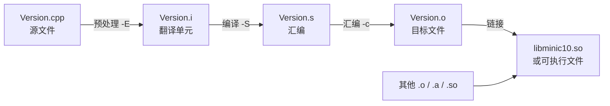
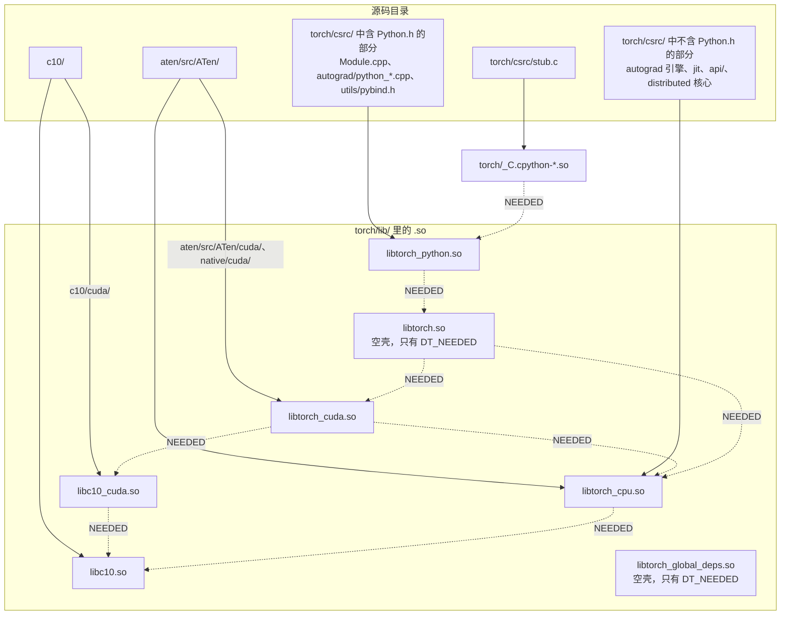

`import torch` 背后，Python 解释器真正加载的第一个 C 语言文件只有 15 行。它是 `torch/csrc/stub.c`，全文如下：

```c
#include <Python.h>

extern PyObject* initModule(void);

#ifndef _WIN32
#ifdef __cplusplus
extern "C"
#endif
__attribute__((visibility("default"))) PyObject* PyInit__C(void);
#endif

PyMODINIT_FUNC PyInit__C(void)
{
  return initModule();
}
```

这个文件看起来简单到不需要解释，但对一个 Java 工程师来说，几乎每一行都有陌生的东西：

- `extern PyObject* initModule(void);`——这只是一个声明，函数体在哪里？编译器怎么知道去哪儿找？
- 为什么 `PyInit__C` 要先声明一次再定义一次？`visibility("default")` 是什么，不写会怎样？
- `#ifndef _WIN32`、`#ifdef __cplusplus`——这是代码还是配置？
- 这个文件编出来是什么？它怎么和 `torch/csrc/Module.cpp` 里那个真正的 `initModule()` 接上？

如果打开 `torch/csrc/Module.cpp` 找到 `initModule` 的定义，会发现它前面还有一行 `extern "C" TORCH_PYTHON_API PyObject* initModule();`——`TORCH_PYTHON_API` 又是什么？

这些问题都不是 PyTorch 的问题，而是 C++ **编译模型**的问题。Java 工程师第一次面对 C++ 项目时，最陌生的往往不是语法，而是它是怎么编译出来的：为什么有 `.h` 和 `.cpp` 两种文件？为什么改一个头文件要重编半个项目？什么是"未定义的引用"？为什么同一个函数在两个文件里定义会报错？为什么一个 pip 包里有 `libc10.so`、`libtorch_cpu.so`、`libtorch_python.so` 好几个二进制？

本文要回答的核心问题是：

> **`import torch` 时加载了哪些 `.so`？它们之间是什么依赖关系？我写的扩展链接到哪一个？**

全文按下面的顺序展开：

1. 四个阶段：一个 `.cpp` 是怎么变成机器码的；
2. 翻译单元、声明与定义、头文件的职责；
3. One Definition Rule，以及 `inline`、`static`、匿名命名空间；
4. 目标文件、静态库、动态库、符号与查看它们的工具；
5. 动态链接与加载：`LD_LIBRARY_PATH`、RPATH、`dlopen`；
6. 命名空间：`c10::`、`at::`、`torch::` 的分工；
7. PyTorch 的源码布局与库布局：`c10/` → `aten/` → `torch/csrc/`；
8. 回到源码：`c10/CMakeLists.txt`、`caffe2/CMakeLists.txt`、`torch/CMakeLists.txt`、`torch/csrc/stub.c`、`setup.py`；
9. 实践一：手写 `g++` 命令把一个 libtorch 程序链接到 PyTorch 的 `.so`；
10. 实践二：mini-c10 的目录结构与第一个可链接的库；
11. 工程实践建议与常见错误；
12. 总结。

Java 是全篇的参照系。Java 的世界里只有一种编译产物（`.class`）、一种打包格式（`.jar`）和一个负责在运行时按需找类的类加载器；C++ 的世界里有翻译单元、目标文件、静态库、动态库、符号表和链接器，而且大部分"找不到"的错误发生在编译期和加载期，不是运行期。理解这个差别，是读懂 PyTorch 和 vLLM 目录结构的前提。


## 一、四个阶段：一个 `.cpp` 是怎么变成机器码的

### 1.1 Java 的一步与 C++ 的四步

Java 的构建流程可以概括为一步：`javac` 把 `.java` 编成 `.class`，`.class` 里带着完整的类型信息、方法签名、常量池和字节码，谁引用了谁全部记在文件里。运行时，JVM 的类加载器按需读 `.class`、解析、链接、初始化。"链接"这个词在 Java 里也存在，但它发生在运行时，由 JVM 负责，程序员几乎感觉不到。

C++ 的构建流程有四个阶段，每个阶段都是独立的程序，有自己的输入和输出：



平时用 `g++ -c foo.cpp` 或者 CMake 构建时，四步是被驱动程序（`g++`/`clang++`）串起来一次跑完的，所以初学者往往感觉不到它们的存在。但**每一类错误只会出现在某一个阶段**：找不到头文件是预处理错误；类型不匹配是编译错误；"undefined reference"是链接错误；"cannot open shared object file"是加载错误。分清阶段，是排错的第一步。

下面用本文最后要建的 mini-c10 里的一个文件走一遍。先给出它的内容（第十节会解释设计）：

```cpp
// minic10/core/Version.h
#pragma once

#include <cstdint>
#include <string>

namespace minic10 {

constexpr int kVersionMajor = 0;
constexpr int kVersionMinor = 1;

std::string version_string();

inline int version_number() {
  return kVersionMajor * 1000 + kVersionMinor;
}

} // namespace minic10
```

```cpp
// minic10/core/Version.cpp
#include <minic10/core/Version.h>

namespace minic10 {

namespace {
const char* build_flavor() {
#ifdef NDEBUG
  return "release";
#else
  return "debug";
#endif
}
} // namespace

std::string version_string() {
  return std::to_string(kVersionMajor) + "." + std::to_string(kVersionMinor) +
      " (" + build_flavor() + ")";
}

} // namespace minic10
```

### 1.2 预处理：把文本拼成翻译单元

预处理器（preprocessor）只做文本处理，不懂 C++：

- `#include <x>` 把文件 `x` 的内容原地粘贴进来（递归地）；
- `#define A B` 之后，所有出现的 `A` 被替换成 `B`；
- `#ifdef`/`#ifndef`/`#if`/`#else`/`#endif` 按条件保留或删除一段文本；
- `#pragma once` 告诉编译器这个文件在同一次编译里只粘贴一次。

用 `-E` 可以只跑预处理：

```bash
clang++ -std=c++17 -I. -E minic10/core/Version.cpp | wc -l
```

在本机（macOS，Apple clang 21）实际输出是 `40222`：一个 20 行的源文件，加上 `<string>` 和 `<cstdint>` 展开后，变成四万行。这就是**翻译单元**（translation unit）——预处理器输出的那一整段文本，是编译器真正看到的输入。

`stub.c` 里那些 `#ifndef _WIN32`、`#ifdef __cplusplus` 就在这个阶段生效。`_WIN32` 是 Windows 编译器预定义的宏，`__cplusplus` 是 C++ 编译器预定义的宏（C 编译器不定义它）。`stub.c` 是一个 `.c` 文件，用 C 编译器编译时 `__cplusplus` 不存在，`extern "C"` 那行被删掉；如果有人用 C++ 编译器编它，`extern "C"` 保留，保证 `PyInit__C` 的符号名不被 C++ 修饰（第四节讲修饰）。

Java 没有预处理器。Java 里"条件编译"靠 `if (System.getProperty(...))` 在运行时判断，靠 `final static boolean` 常量让 JIT 消除死代码；C++ 在文本层面就把不需要的代码删掉了，二进制里根本不存在另一个分支。这是第五篇的主题，这里只需要知道：**预处理之后，头文件就不存在了，只剩一个巨大的翻译单元。**

### 1.3 编译：把翻译单元变成汇编

编译器（严格说是编译器前端 + 优化器 + 后端）读入翻译单元，做词法分析、语法分析、语义分析（类型检查、重载决议、模板实例化），然后生成汇编代码。用 `-S` 可以停在这一步：

```bash
clang++ -std=c++17 -I. -S minic10/core/Version.cpp -o Version.s
grep -n "version_string" Version.s | head -3
```

本机输出：

```text
3:	.globl	__ZN7minic1014version_stringEv  ; -- Begin function _ZN7minic1014version_stringEv
5:__ZN7minic1014version_stringEv:         ; @_ZN7minic1014version_stringEv
```

`minic10::version_string()` 在汇编里变成了 `_ZN7minic1014version_stringEv`（macOS 上还多一个前导下划线）。这个奇怪的名字是**符号**（symbol），第四节会讲它的编码规则。这里先记住一个事实：**编译器一次只看一个翻译单元**。编译 `Version.cpp` 时，它完全不知道 `hello.cpp` 的存在；它只知道 `Version.h` 里说过"有一个叫 `version_string` 的函数，返回 `std::string`"，于是放心地生成对它的调用或定义。

这解释了 `stub.c` 里 `extern PyObject* initModule(void);` 的作用：告诉编译器"有这么一个函数，签名如此，定义在别处"，让编译器能生成 `return initModule();` 这条调用。真正的定义在 `torch/csrc/Module.cpp`，编译 `stub.c` 时编译器根本没看过它。

`javac` 编译 `A.java` 时如果引用了 `B`，会去 classpath 上找 `B.class` 或 `B.java` 读出签名。C++ 编译器不会去找任何别的 `.cpp`；它只信头文件里的声明。这是两种语言最根本的差别之一：**Java 的编译器能看到整个 classpath，C++ 的编译器只能看到当前翻译单元。**

### 1.4 汇编：生成目标文件

汇编器把 `.s` 变成 `.o`（目标文件，object file），Linux 上是 ELF 格式，macOS 上是 Mach-O，Windows 上是 COFF。`-c` 让驱动程序停在这一步：

```bash
clang++ -std=c++17 -Wall -fPIC -I. -c minic10/core/Version.cpp -o Version.o
```

目标文件里有机器码、数据，以及一张**符号表**：本文件定义了哪些符号（可以给别人用）、引用了哪些别处的符号（需要别人提供）。第四节会用 `nm` 看它。

### 1.5 链接：把符号对上

链接器（`ld`、`lld`、`gold`、macOS 的 `ld64`）收集所有 `.o` 和库，做两件事：

1. **符号解析**（symbol resolution）：每个"我引用了 X 但没定义"的地方，都要找到唯一一个"我定义了 X"；
2. **重定位**（relocation）：确定每段代码和数据的最终地址，把所有引用处的占位地址改成真实地址。

```bash
clang++ -std=c++17 -shared -o libminic10.so Version.o
clang++ -std=c++17 -I. examples/hello.cpp -L. -lminic10 -o hello
```

第一条把 `Version.o` 链接成动态库；第二条编译 `hello.cpp`，并把它对 `minic10::version_string()` 的引用解析到 `libminic10.so` 里的定义。

两类最常见的链接错误都发生在符号解析阶段：

```text
undefined reference to `helper()'          # 有人引用了，没人定义
multiple definition of `helper()'          # 不止一个人定义了
```

（以上是 Linux GNU ld 的措辞；macOS ld64 分别说 `Undefined symbols for architecture arm64` 和 `duplicate symbol`。本文所有"预期输出"以 Linux 为准，macOS 差异随文标注。）

### 1.6 第五个阶段：加载

对动态库来说还有一个阶段在运行时：**加载**（loading）。链接 `hello` 时，链接器并没有把 `libminic10.so` 的代码拷进 `hello`，只是记录了一条"运行时需要 `libminic10.so`"和"`version_string` 在那个库里"。真正把库读进内存、把地址填上的是操作系统的**动态加载器**（Linux 上是 `ld-linux-x86-64.so.2`，也叫 `ld.so`），发生在程序启动时或 `dlopen` 时。第五节专门讲它。

把四加一个阶段与 Java 对上：

| 阶段 | C++ | Java 对应 | 说明 |
|---|---|---|---|
| 预处理 | `#include`/`#define` 展开 | 无 | Java 没有文本级预处理 |
| 编译 | 翻译单元 → 汇编 | `javac` | Java 编译器能看到 classpath，C++ 只看当前翻译单元 |
| 汇编 | 汇编 → `.o` | 无（`.class` 已是最终产物） | |
| 链接 | 多个 `.o`/库 → 可执行文件或 `.so` | 无直接对应 | Java 把这一步推迟到运行时由 JVM 做 |
| 加载 | `ld.so` 加载 `.so` | 类加载器加载 `.class` | 最接近的类比，但 C++ 加载时要解析的符号在链接期已确定 |


## 二、翻译单元、声明与定义、头文件

### 2.1 为什么要分 `.h` 和 `.cpp`

既然编译器一次只看一个翻译单元，而 `hello.cpp` 想调用 `Version.cpp` 里的函数，就必须有一种办法让 `hello.cpp` 的翻译单元里出现 `version_string` 的**签名**，同时不出现它的**函数体**（否则两个翻译单元各有一份函数体，链接时就是 multiple definition）。

这个办法就是**声明与定义分离**：

- **声明**（declaration）：告诉编译器一个名字的类型/签名。`std::string version_string();` 是声明；`extern PyObject* initModule(void);` 是声明；`class Tensor;` 是声明。
- **定义**（definition）：给出实体本身。带函数体的函数是定义；带大括号的类是定义；不带 `extern` 的全局变量是定义。

头文件（`.h`/`.hpp`）放声明，源文件（`.cpp`/`.cc`）放定义，所有需要用这个名字的 `.cpp` 都 `#include` 这个头文件。一个声明可以出现任意多次（每个翻译单元一次），一个定义在整个程序里只能有一次——这就是第三节的 ODR。

Java 没有这个区分：一个 `.java` 文件就是类的完整定义，其他类通过 `import` 引用它时，编译器自己去读 `.class` 提取签名。C++ 把"提取签名"这件事交给了程序员——头文件就是手写的签名文件。C++20 引入的 modules 试图改变这一点，但 PyTorch 和 vLLM 都还没用，本系列不讨论。

### 2.2 真实例子：`c10/core/Device.h` 与 `Device.cpp`

`c10::Device` 是 PyTorch 里表示"设备"的小类型（`cpu`、`cuda:0` 这些）。它的头文件 `c10/core/Device.h` 开头是：

```cpp
#pragma once

#include <c10/core/DeviceType.h>
#include <c10/macros/Export.h>
#include <c10/util/Exception.h>

#include <cstddef>
#include <cstdint>
#include <functional>
#include <iosfwd>
#include <string>

namespace c10 {

using DeviceIndex = int8_t;

struct C10_API Device final {
  using Type = DeviceType;

  /* implicit */ Device(DeviceType type, DeviceIndex index = -1)
      : type_(type), index_(index) {
    validate();
  }

  /* implicit */ Device(const std::string& device_string);

  // ...

  bool is_cuda() const noexcept {
    return type_ == DeviceType::CUDA;
  }

  // ...

  /// Same string as returned from operator<<.
  std::string str() const;

 private:
  DeviceType type_;
  DeviceIndex index_ = -1;
  void validate() {
    // ...
  }
};

C10_API std::ostream& operator<<(std::ostream& stream, const Device& device);

} // namespace c10
```

注意三种成员：

- `Device(DeviceType, DeviceIndex)`、`is_cuda()`、`validate()` **在类内直接给出函数体**。类内定义的成员函数隐含 `inline`（第三节解释为什么这样就不违反 ODR）。它们一两行就完，放在头文件里让编译器可以内联。
- `Device(const std::string&)` 和 `str()` **只有声明**。它们的定义在 `c10/core/Device.cpp`：

```cpp
#include <c10/core/Device.h>
#include <c10/util/Exception.h>

// ...

namespace c10 {
namespace {
DeviceType parse_type(const std::string& device_string) {
  // ...
}
// ...
} // namespace

Device::Device(const std::string& device_string) : Device(Type::CPU) {
  TORCH_CHECK(!device_string.empty(), "Device string must not be empty");
  // ... 解析 "cuda:0" 这类字符串
  validate();
}

std::string Device::str() const {
  std::string str = DeviceTypeName(type(), /* lower case */ true);
  if (has_index()) {
    str.push_back(':');
    str.append(std::to_string(index()));
  }
  return str;
}

std::ostream& operator<<(std::ostream& stream, const Device& device) {
  stream << device.str();
  return stream;
}

} // namespace c10
```

  字符串解析有几十行，不适合放头文件（放了会让每个包含 `Device.h` 的翻译单元都编一遍，而 `Device.h` 几乎被所有文件间接包含）。所以只在头文件里声明，定义放 `.cpp`，编进 `libc10.so`。

- `parse_type` **只在 `.cpp` 里，头文件里没有它**。它是实现细节，被匿名命名空间包住（第三节讲）。

`Device.cpp` 里 `Device::Device(...)` 和 `Device::str()` 前面的 `Device::` 是作用域限定：告诉编译器"我在定义前面声明过的那个成员函数"。Java 里方法定义必须在类体内，没有这种"类外定义"的语法。

`C10_API` 暂时可以读作"这个符号要从 `libc10.so` 导出给别人用"，第四节和第五篇会展开。

### 2.3 头文件的职责与 `#pragma once`

一个头文件通常包含：

| 内容 | 例子（`c10/core/Device.h`） | 说明 |
|---|---|---|
| 类型定义 | `struct Device { ... };` | 类的定义本身（成员列表）必须在头文件里，否则使用者不知道它多大 |
| 函数声明 | `std::string str() const;` | 定义在 `.cpp` |
| 小函数的 inline 定义 | `bool is_cuda() const noexcept { ... }` | 允许内联 |
| 类型别名 | `using DeviceIndex = int8_t;` | |
| 常量 | `constexpr int kX = 1;` | |
| 模板 | 第三篇 | 模板几乎必须全部放头文件 |
| 宏 | `C10_API` | 第五篇 |

头文件会被间接包含很多次。`Device.h` 包含 `Exception.h`，`ScalarType.h` 也包含 `Exception.h`，一个同时包含 `Device.h` 和 `ScalarType.h` 的文件里 `Exception.h` 就被粘贴两次——第二次会因为重复定义 `class Error` 而编译失败。`#pragma once` 解决这个问题：同一个文件在同一个翻译单元里只展开一次。

传统写法是 include guard：

```cpp
#ifndef C10_MACROS_EXPORT_H_
#define C10_MACROS_EXPORT_H_
// ...
#endif // C10_MACROS_EXPORT_H_
```

`torch/headeronly/macros/Export.h` 两种都用了（`#pragma once` 在第一行，紧接着 `#ifndef C10_MACROS_EXPORT_H_`），这是历史遗留。PyTorch 新代码统一用 `#pragma once`。`#pragma once` 不是标准 C++，但所有主流编译器都支持；它按文件身份判重，include guard 按宏名判重，实际效果一样。

### 2.4 为什么改一个头文件要重编半个项目

现在可以回答开头的问题了。`#include` 是文本粘贴，`Device.h` 的内容是每一个包含它的翻译单元的一部分。改了 `Device.h`，所有包含它的翻译单元的**输入**都变了，构建系统（CMake/Ninja 通过编译器生成的依赖文件 `.d` 追踪这种关系）必须把它们全部重编。

看看 `c10/core/ScalarType.h` 开头包含了多少东西：

```cpp
#pragma once

#include <c10/util/BFloat16.h>
#include <c10/util/Exception.h>
#include <c10/util/Float4_e2m1fn_x2.h>
#include <c10/util/Float8_e4m3fn.h>
#include <c10/util/Float8_e4m3fnuz.h>
#include <c10/util/Float8_e5m2.h>
#include <c10/util/Float8_e5m2fnuz.h>
#include <c10/util/Float8_e8m0fnu.h>
#include <c10/util/Half.h>
#include <c10/util/bits.h>
#include <c10/util/complex.h>
#include <c10/util/qint32.h>
#include <c10/util/qint8.h>
#include <c10/util/quint2x4.h>
#include <c10/util/quint4x2.h>
#include <c10/util/quint8.h>

#include <array>
// ...
```

`ScalarType` 是 dtype，几乎每一个 ATen 文件都要用它。改一下 `c10/util/Half.h`，`ScalarType.h` 的所有包含者都要重编，也就是几乎整个 `libtorch_cpu.so`——上千个翻译单元，一小时级别。这就是 PyTorch 开发者对"往 c10 头文件里加东西"极其谨慎的原因，也是 `c10/CMakeLists.txt` 开头那段注释的背景（第八节）。

Java 里改一个类只需重编它自己和直接依赖它的类（Gradle 的增量编译粒度是类级别的 ABI 变化）。C++ 的粒度是"文本包含"，粗得多。这带来了 C++ 项目特有的两个工程习惯：

1. **前向声明**（forward declaration）：只需要"知道有这个类型"而不需要"知道它多大"时，写 `class Tensor;` 而不是 `#include <ATen/core/Tensor.h>`。`aten/src/ATen/templates/TensorBody.h`（生成 `ATen/core/TensorBody.h` 的模板）开头就是一串：

```cpp
namespace c10{
template<class T> class List;
template<class T> class IListRef;
}
namespace at {
struct Generator;
struct Type;
class DeprecatedTypeProperties;
class Tensor;
} // namespace at
// ...
namespace torch { namespace autograd {

struct Node;

}} // namespace torch::autograd
```

   指针和引用只需要前向声明；按值持有成员、调用成员函数、`sizeof` 才需要完整定义。这是第二篇会反复用到的规则。

2. **`-inl.h` 拆分和 `#include <iosfwd>`**：`Device.h` 包含 `<iosfwd>`（只有 `std::ostream` 的前向声明）而不是 `<ostream>`（完整定义），因为它只需要声明 `operator<<`。

### 2.5 `extern` 与全局变量

对函数来说，不带函数体就是声明，所以 `stub.c` 里 `extern PyObject* initModule(void);` 的 `extern` 其实可以省略——函数声明默认就是 `extern`。对变量则不同：

```cpp
int counter;          // 定义（分配存储）
extern int counter;   // 声明（别处有定义）
```

头文件里放变量时必须写 `extern`，否则每个包含者都定义一份，链接时 multiple definition。PyTorch 源码里全局变量很少直接暴露，多半用函数包装（如 `c10::DeviceTypeName(...)`），或者用 `thread_local`（第六篇）。


## 三、One Definition Rule：同一个名字只能有一个定义

### 3.1 规则本身

ODR 的核心可以概括为两句话：

1. 任何翻译单元里，一个变量、函数、类、枚举、模板最多只能有一个定义；
2. 整个程序里，每个非 inline 的函数和变量**恰好**一个定义（用到了却没有 → undefined reference；多于一个 → multiple definition）。

类、inline 函数、模板可以在多个翻译单元里各有一个定义，但**所有定义必须逐字相同**（token-for-token identical），编译器和链接器假定它们相同并任选一份。违反这一条不会报错，是**未定义行为**——程序可能用了 A 文件的版本，也可能用了 B 文件的版本，也可能崩溃。

Java 里不存在这个问题：一个类只有一个 `.class`，JVM 按全限定名找到它，同名类冲突时类加载器有明确的优先规则（父加载器优先）。C++ 没有这层运行时仲裁，全靠链接器在构建时把名字对上。

### 3.2 两种链接错误

用两个最小文件复现：

```cpp
// dup1.cpp
int helper() { return 1; }
// dup2.cpp
int helper() { return 2; }
int main() { return helper(); }
```

```bash
g++ -std=c++17 dup1.cpp dup2.cpp -o dup
```

预期输出（Linux GNU ld）：

```text
/usr/bin/ld: /tmp/ccXXXX.o: in function `helper()':
dup2.cpp:(.text+0x0): multiple definition of `helper()'; /tmp/ccYYYY.o:dup1.cpp:(.text+0x0): first defined here
```

本机 macOS ld64 的实际输出是 `duplicate symbol 'helper()' in: ... ld: 1 duplicate symbols`。

反过来：

```cpp
// undef.cpp
int helper();
int main() { return helper(); }
```

预期输出（Linux）：

```text
/usr/bin/ld: /tmp/ccXXXX.o: in function `main':
undef.cpp:(.text+0x5): undefined reference to `helper()'
```

macOS 实际输出：`Undefined symbols for architecture arm64: "helper()", referenced from: _main in undef-xxxx.o`。

注意错误信息里的 `helper()`——链接器本来看到的是修饰后的 `_Z6helperv`，现代链接器会自动"反修饰"（demangle）给人看。第四节讲修饰。

读 PyTorch 扩展的构建日志时，`undefined reference to ‘at::empty_like(...)’` 和 `undefined symbol: _ZN2at10empty_like...`（这是加载期的版本）是最常见的两类，分别说明"链接时少了 `-ltorch_cpu`"和"运行时找到了错误版本的 `libtorch_cpu.so`"。

### 3.3 `inline`：允许多份相同定义

头文件里放函数定义，被 N 个翻译单元包含，就有 N 份定义——违反 ODR 第二条。`inline` 关键字把这个函数变成"允许多份，但必须相同，链接器任选一份"的类别：

```cpp
// minic10/core/Version.h
inline int version_number() {
  return kVersionMajor * 1000 + kVersionMinor;
}
```

现代 C++ 里 `inline` 的主要含义就是这个**链接属性**，"建议编译器内联展开"只是次要含义（编译器基本不听建议，自己决定）。三种情况隐含 `inline`：

- 类内定义的成员函数（`Device::is_cuda()` 那种）；
- 模板（函数模板、类模板的成员），因为模板本来就在每个用到它的翻译单元里各实例化一份；
- `constexpr` 函数；C++17 起 `constexpr` 静态数据成员和 `inline` 变量也是。

`c10/core/ScalarType.h` 里一串工具函数就是显式 `inline`：

```cpp
inline size_t elementSize(ScalarType t) {
#define CASE_ELEMENTSIZE_CASE(ctype, name) \
  case ScalarType::name:                   \
    return sizeof(ctype);

  switch (t) {
    AT_FORALL_SCALAR_TYPES_WITH_COMPLEX_AND_QINTS(CASE_ELEMENTSIZE_CASE)
    default:
      TORCH_CHECK(false, "Unknown ScalarType");
  }
#undef CASE_ELEMENTSIZE_CASE
}

inline bool isFloatingType(ScalarType t) {
  return t == ScalarType::Double || t == ScalarType::Float ||
      isReducedFloatingType(t);
}
```

它们被上千个翻译单元包含，每个翻译单元里都有一份 `elementSize` 的机器码（如果编译器没把它内联掉），链接器最后保留一份。在 `nm` 输出里这类符号标记为 `W`（weak），下一节会看到。

**`inline` 的陷阱**：如果同一个 inline 函数在两个翻译单元里编出来的代码不一样，链接器保留哪一份是不确定的。`caffe2/CMakeLists.txt` 里有一段真实的踩坑记录：

```cmake
# NOTE [ Linking AVX and non-AVX files ]
#
# Regardless of the CPU capabilities, we build some files with AVX2, and AVX512
# instruction set. If the host CPU doesn't support those, we simply ignore their
# functions at runtime during dispatch.
#
# We must make sure that those files are at the end of the input list when
# linking the torch_cpu library. Otherwise, the following error scenario might
# occur:
# 1. A non-AVX2 and an AVX2 file both call a function defined with the `inline`
#    keyword
# 2. The compiler decides not to inline this function
# 3. Two different versions of the machine code are generated for this function:
#    one without AVX2 instructions and one with AVX2.
# 4. When linking, the AVX2 version is found earlier in the input object files,
#    so the linker makes the entire library use it, even in code not guarded by
#    the dispatcher.
# 5. A CPU without AVX2 support executes this function, encounters an AVX2
#    instruction and crashes.
```

源码相同、编译选项不同（`-mavx2` 与否）→ 机器码不同 → ODR 违反 → 在不支持 AVX2 的机器上非法指令崩溃。PyTorch 的解法是控制链接顺序，让非 AVX 版本先被链接器看到。这个注释值得记住：**ODR 关心的是"定义相同"，而"相同"包括编译方式。**

### 3.4 `static` 与匿名命名空间：内部链接

另一条路是反过来：不让符号被其他翻译单元看见。`static` 修饰的全局函数/变量，以及匿名命名空间 `namespace { ... }` 里的所有东西，都是**内部链接**（internal linkage）——只在本翻译单元可见，不进入全局符号表，不参与跨翻译单元的符号解析。两个 `.cpp` 各有一个 `static int helper()` 互不冲突。

`c10/core/Device.cpp` 用匿名命名空间：

```cpp
namespace c10 {
namespace {
DeviceType parse_type(const std::string& device_string) {
  // ...
}
enum DeviceStringParsingState { START, INDEX_START, INDEX_REST, ERROR };
} // namespace

Device::Device(const std::string& device_string) : Device(Type::CPU) {
  // ...
}
```

`c10/core/DeviceType.cpp` 用 `static`：

```cpp
static std::atomic<bool> privateuse1_backend_name_set;
static std::string privateuse1_backend_name;
static std::mutex privateuse1_lock;
```

两种写法效果一样，C++ 风格指南倾向匿名命名空间（能包住类型和模板，`static` 不能）。PyTorch 的 kernel 文件大量使用这个模式——`aten/src/ATen/native/cpu/BinaryOpsKernel.cpp` 从第 22 行开始整个 kernel 实现都在匿名命名空间里，文件末尾只有一排 `REGISTER_DISPATCH(...)` 把函数指针注册出去：

```cpp
namespace at::native {

namespace {

// ... 一千四百行 kernel 实现 ...

} // namespace

REGISTER_DISPATCH(add_clamp_stub, &add_clamp_kernel)
REGISTER_DISPATCH(mul_stub, &mul_kernel)
REGISTER_DISPATCH(div_true_stub, &div_true_kernel)
// ...
```

这样做有两个好处：不同 kernel 文件里同名的辅助函数不会冲突；符号不导出，`.so` 的符号表更小，加载更快。第五篇讲静态注册时会重看这个文件。

对比 Java：`private` 和包私有控制的是**编译期的访问权限**，但类和方法在 `.class` 里始终有名字，反射能找到。C++ 的内部链接是**真的没有外部可见的名字**——目标文件的全局符号表里没它，别的翻译单元想引用也引用不了。

### 3.5 小结：四种链接属性

| 写法 | 链接属性 | 多个翻译单元定义会怎样 | 典型用途 |
|---|---|---|---|
| 普通函数/变量 | 外部链接 | multiple definition 错误 | `.cpp` 里的实现 |
| `inline`、类内成员函数、模板、`constexpr` | 外部链接 + 允许重复（vague linkage） | 合法，链接器任选一份，必须逐字相同 | 头文件里的小函数、模板 |
| `static`、匿名命名空间 | 内部链接 | 互不相干 | `.cpp` 里的私有辅助 |
| `extern` 声明 | 声明而非定义 | 不算定义 | 头文件里引用别处的变量 |


## 四、目标文件、库与符号

### 4.1 用 `nm` 看目标文件里的符号表

编译好 `Version.o` 之后：

```bash
nm -C Version.o
```

`-C` 让 `nm` 反修饰名字。预期输出（Linux，g++，节选）：

```text
0000000000000000 t minic10::(anonymous namespace)::build_flavor()
0000000000000000 T minic10::version_string()
                 U std::__cxx11::basic_string<char, ...>::append(char const*)
                 U std::__cxx11::to_string(int)
                 U __cxa_begin_catch
```

每行三列：地址、类型字母、名字。类型字母最常用的几个：

| 字母 | 含义 | 本例 |
|---|---|---|
| `T` | 本文件**定义**的全局函数（text 段） | `version_string()` |
| `t` | 本文件定义的**局部**函数（内部链接） | `build_flavor()`——匿名命名空间的效果 |
| `U` | **未定义**，需要别人提供 | `std::to_string`、`__cxa_begin_catch`（异常运行时） |
| `W` | weak，inline/模板生成的可重复定义 | 下面 `hello.o` 里的 `version_number()` |
| `D`/`d` | 已初始化的全局/局部数据 | |
| `B`/`b` | 未初始化数据（bss） | |

再看 `hello.o`（只编译不链接 `examples/hello.cpp`）：

```bash
clang++ -std=c++17 -I. -c examples/hello.cpp -o hello.o
nm -C hello.o | grep minic10
```

预期输出（Linux）：

```text
0000000000000000 W minic10::version_number()
                 U minic10::version_string()
```

`version_number()` 是 inline，在 `hello.o` 里有一份定义，标 `W`；`version_string()` 只有声明，标 `U`。链接 `hello` 时，链接器要为这个 `U` 找到一个 `T`——它在 `libminic10.so` 里。

本机 macOS 实际输出中 `version_number()` 标 `T` 而非 `W`（Mach-O 用另一套机制标记可合并的弱定义，`nm -m` 能看到 `weak`），符号名多一个前导下划线；语义相同。

### 4.2 Name mangling：符号名为什么长得像乱码

C 的符号名就是函数名：`initModule`。C++ 支持重载、命名空间、模板，`minic10::version_string()` 和 `other::version_string(int)` 必须是不同的符号，所以编译器把命名空间、函数名、参数类型编码进符号名，这叫**名字修饰**（name mangling）：

```text
_ZN7minic1014version_stringEv
 │ │ │      │ │             │└ v: 参数列表为 void
 │ │ │      │ │             └ E: 嵌套名结束
 │ │ │      │ └ 14version_string: 长度 14 的标识符
 │ │ │      └ 7minic10: 长度 7 的标识符
 │ │ └ N: 嵌套名开始
 │ └ Z: 修饰名标记
 └ _: 前缀
```

这是 Itanium C++ ABI 的规则，GCC 和 Clang 在 Linux/macOS 上都用它；MSVC 用另一套（`?version_string@minic10@@YA...`）。`c++filt` 可以手工反修饰：

```bash
echo _ZN7minic1014version_stringEv | c++filt
# minic10::version_string()
```

两个直接后果：

1. **C++ 编译器之间的二进制兼容**取决于修饰规则一致。GCC 和 Clang 一致，和 MSVC 不一致，所以 Linux 上编的 `.so` 不可能被 Windows 用，反之亦然。更细的问题——同一编译器不同版本、不同标准库配置（`_GLIBCXX_USE_CXX11_ABI`）——是第七篇 ABI 一节的主题。上面输出里的 `std::__cxx11::basic_string` 就是 libstdc++ 新 ABI 的痕迹。
2. **要给 C 或 Python 调用的函数必须关掉修饰**，写法是 `extern "C"`。这就是 `torch/csrc/Module.cpp` 里那一行：

```cpp
extern "C" TORCH_PYTHON_API PyObject* initModule();
// separate decl and defn for msvc error C2491
PyObject* initModule() {
  HANDLE_TH_ERRORS
  // ...
```

`initModule` 是 C++ 函数，但被 C 文件 `stub.c` 引用，`stub.c` 编译时只会生成对 `initModule` 这个**未修饰**符号的引用；如果 `Module.cpp` 不加 `extern "C"`，导出的会是 `_Z10initModulev`，两边对不上，链接失败。同理，`PyInit__C` 是 Python 解释器用 `dlsym` 按名字查找的入口，名字必须精确为 `PyInit__C`，Python 的 `PyMODINIT_FUNC` 宏在 C++ 编译时会展开出 `extern "C"`。

Java 对照：JNI 也有一套名字规则（`Java_com_example_Foo_bar`），本质上是同一个问题——两个运行时之间约定一个不依赖任何一方修饰规则的名字。

### 4.3 静态库与动态库

多个 `.o` 可以打包成库。两种库的差别决定了 PyTorch 的整个发布形态：

| | 静态库 `.a` | 动态库 `.so`（macOS `.dylib`，Windows `.dll`） |
|---|---|---|
| 是什么 | `.o` 文件的归档（`ar` 打包），没有链接过 | 已经链接过的、可被加载的镜像 |
| 链接到程序时 | 需要的 `.o` 被**拷贝**进最终产物 | 只记录一条依赖（`DT_NEEDED`），代码留在 `.so` 里 |
| 运行时 | 无外部依赖 | 需要 `ld.so` 找到并加载 `.so` |
| 多个程序共享 | 各自一份 | 内存中共享同一份只读代码页 |
| 符号解析发生在 | 链接期 | 链接期检查一次，加载期再解析一次 |
| 更新库 | 必须重新链接程序 | 替换 `.so` 即可（ABI 兼容的前提下） |
| 未被引用的 `.o` | **不会**被拉进来（下一段） | 整个库都加载 |

静态库有一个让很多人踩坑的性质：链接器从 `.a` 里只取**被引用了的** `.o`。一个 `.o` 如果没有任何符号被别人引用——典型就是"只靠静态初始化把自己注册进全局表"的算子文件（第五篇）——就会被整个丢掉，注册代码根本不存在于最终产物里。`cmake/TorchConfig.cmake.in` 里 `append_wholearchive_lib_if_found(torch torch_cpu)` 用 `-Wl,--whole-archive` 强制链接器把 `libtorch_cpu.a` 全部拉进来，就是为了这个。PyTorch 的默认发布形态是动态库（`BUILD_SHARED_LIBS=ON`），不存在这个问题；vLLM、TorchServe 等下游一律链接动态库。

Java 里没有这个二分法：`.jar` 就是 `.class` 的 zip 包，运行时按需加载，最接近"动态库"；但 JVM 只在真的用到某个类时才加载它，这又有点像"静态库只取被引用的 `.o`"——只是 Java 是运行期惰性，C++ 是链接期裁剪。

### 4.4 符号可见性：`.so` 导出了什么

动态库有自己的"公开/私有"概念。默认情况下，`.so` 里所有外部链接的符号都被导出（`nm -D` 能看到），任何人都能链接到它们。这有两个问题：符号表巨大（`libtorch_cpu.so` 有几十万个符号），加载慢；内部实现细节被人依赖，无法改动。

GCC/Clang 用 `-fvisibility=hidden` 把默认改成"全部不导出"，再用 `__attribute__((visibility("default")))` 逐个标出要导出的。PyTorch 就是这么做的。`cmake/public/utils.cmake` 里 `torch_compile_options` 函数对每个库目标：

```cmake
  if(NOT WIN32 AND NOT USE_ASAN)
    # Enable hidden visibility by default to make it easier to debug issues with
    # TORCH_API annotations. Hidden visibility with selective default visibility
    # behaves close enough to Windows' dllimport/dllexport.
    # ...
    target_compile_options(${libname} PRIVATE
        $<$<COMPILE_LANGUAGE:CXX>: -fvisibility=hidden>)
  endif()
```

然后 `torch/headeronly/macros/Export.h`（`c10/macros/Export.h` 现在只是 `#include` 它——PyTorch 2.x 中的变化：2.8 前后引入了 `torch/headeronly/` 目录，把不依赖 libtorch 的头文件搬了过去）定义：

```cpp
#if defined(__GNUC__)
#define C10_EXPORT __attribute__((__visibility__("default")))
#define C10_HIDDEN __attribute__((__visibility__("hidden")))
#else // defined(__GNUC__)
#define C10_EXPORT
#define C10_HIDDEN
#endif // defined(__GNUC__)
#define C10_IMPORT C10_EXPORT

// This one is being used by libc10.so
#ifdef C10_BUILD_MAIN_LIB
#define C10_API C10_EXPORT
#else
#define C10_API C10_IMPORT
#endif

// This one is being used by libtorch.so
#ifdef CAFFE2_BUILD_MAIN_LIB
#define TORCH_API C10_EXPORT
#else
#define TORCH_API C10_IMPORT
#endif
```

`struct C10_API Device` 里的 `C10_API` 展开成 `__attribute__((__visibility__("default")))`，意思是"`Device` 的成员函数要从 `libc10.so` 导出"。`TORCH_API` 是 `libtorch_cpu.so` 的，`TORCH_CUDA_CPP_API`/`TORCH_CUDA_CU_API` 是 `libtorch_cuda.so` 的，`TORCH_PYTHON_API`（定义在 `torch/csrc/Export.h`）是 `libtorch_python.so` 的。`C10_BUILD_MAIN_LIB`、`CAFFE2_BUILD_MAIN_LIB`、`THP_BUILD_MAIN_LIB` 这些宏由 CMake 在编译对应库时定义（`c10/CMakeLists.txt` 第 55 行 `target_compile_options(c10 PRIVATE "-DC10_BUILD_MAIN_LIB")`，第八节会看到），在 Windows 上区分 `dllexport`/`dllimport`，在 Linux 上两者一样。

回到 `stub.c`：`__attribute__((visibility("default"))) PyObject* PyInit__C(void);` 那行就是在说"这个符号必须导出"——Python 解释器要 `dlsym` 它。如果 `_C.so` 用 `-fvisibility=hidden` 编译而没有这行，`import torch` 会报 `dynamic module does not define module export function (PyInit__C)`。`_C` 是由 `setup.py` 的 setuptools `Extension` 编译的（8.4 节），走的是默认可见性，但 PyTorch 仍显式写了这一行，保证换成 `-fvisibility=hidden` 也不会出问题。

第五篇会详细讨论可见性如何影响静态注册。这里只需要建立一个直觉：**一个符号在 PyTorch 的 `.so` 里能不能被扩展链接到，取决于它的声明上有没有 `C10_API`/`TORCH_API`**。没有这个宏的函数，即使在头文件里声明了，链接扩展时也会 undefined reference。这是给 PyTorch 加新 API 时最常见的遗漏之一。

### 4.5 工具箱

| 工具 | 用途 | 常用命令 |
|---|---|---|
| `nm` | 列符号表 | `nm -C foo.o`；`nm -DC libfoo.so`（只看动态导出符号）；`nm -DC lib.so \| grep ' U '`（看依赖了哪些外部符号） |
| `c++filt` | 反修饰 | `echo _ZN... \| c++filt` |
| `objdump` | 反汇编、看段 | `objdump -d foo.o`（反汇编）；`objdump -t foo.o`（符号表）；`objdump -p libfoo.so \| grep NEEDED`（依赖库） |
| `readelf` | 读 ELF 结构 | `readelf -d libfoo.so`（动态段：NEEDED、RPATH、RUNPATH、SONAME）；`readelf -Ws libfoo.so`（符号） |
| `ldd` | 列运行时会加载的库及解析到的路径 | `ldd hello`；`ldd torch/lib/libtorch_python.so` |
| `strings` | 找字符串 | `strings libtorch_cpu.so \| grep GLIBCXX` 看依赖的 libstdc++ 版本 |

macOS 对应：`nm`、`c++filt` 一样；`otool -L` 代替 `ldd`；`otool -l` 代替 `readelf -d`；`dyld_info` 代替部分 `objdump -p`。Windows 用 `dumpbin`。

这些工具在第八篇（调试）会再次出现。本篇最后的实践一会用 `ldd` 和 `nm` 看真实的 PyTorch 库。

### 4.6 Java 对照：`.class`/`.jar` 与翻译单元/目标文件/库

| Java | C++ | 类比成立处 | 类比误导处 |
|---|---|---|---|
| `.java` | `.cpp` + `.h` | 都是源码 | Java 一个文件是一个完整的类；C++ 一个 `.cpp` 是一个翻译单元，可以有任意多个类的定义，头文件是手写的接口 |
| `.class` | `.o` | 都是单个源文件的编译产物，都带符号表 | `.class` 自描述、含完整类型信息，任何 JVM 能加载；`.o` 只有符号名和机器码，没有类型信息，未链接不能运行 |
| `.jar` | `.a` / `.so` | 都是多个编译单元的打包 | `.jar` 只是 zip，加载器按需读；`.a` 链接期裁剪，`.so` 已链接、整体加载 |
| classpath | `-L` + `-l`、`LD_LIBRARY_PATH`、RPATH | 都是"去哪儿找" | Java 只有运行时一次查找；C++ 有链接期（`-L`）和加载期（RPATH 等）两次，路径可以不同 |
| `ClassNotFoundException` | `undefined reference`（链接期）/ `cannot open shared object file`（加载期） | 都是找不到 | Java 是运行时异常可捕获；C++ 是构建失败或进程直接起不来 |
| `NoSuchMethodError` | `undefined symbol: _ZN...`（加载期） | 都是"类找到了但方法不对" | C++ 的通常是 ABI 不匹配（第七篇） |
| `public`/包私有 | `visibility("default")`/`hidden` | 都是"对外暴露什么" | Java 是编译期检查，反射可绕；C++ 的 hidden 符号在 `.so` 里没有名字，无法绕过 |


## 五、动态链接与加载

### 5.1 链接期与加载期的两次解析

链接 `hello` 时写 `-L. -lminic10`，链接器找到 `libminic10.so`，检查 `version_string` 确实在里面，然后在 `hello` 里记录两件事：

1. `DT_NEEDED: libminic10.so`——运行时需要这个库（记录的是库的 SONAME，不是路径）；
2. `version_string` 是一个需要在运行时解析的导入符号。

运行 `./hello` 时，内核把控制权交给动态加载器 `ld.so`，它读 `hello` 的 `DT_NEEDED` 列表，按一套搜索规则找到每个库，递归加载它们的依赖，然后做第二次符号解析——把 `hello` 里 `version_string` 的调用地址填成 `libminic10.so` 里的实际地址（通常是惰性的：第一次调用时才解析，`RTLD_LAZY`）。

```bash
ldd hello
```

预期输出（Linux）：

```text
	linux-vdso.so.1 (0x00007ffd...)
	libminic10.so => not found
	libstdc++.so.6 => /lib/x86_64-linux-gnu/libstdc++.so.6 (0x00007f...)
	libc.so.6 => /lib/x86_64-linux-gnu/libc.so.6 (0x00007f...)
	...
```

`libminic10.so => not found`——链接期用 `-L.` 找到了它，但加载期 `ld.so` 不知道去当前目录找。这就是下一小节。

### 5.2 搜索路径：`LD_LIBRARY_PATH`、RPATH、RUNPATH、`$ORIGIN`

`ld.so` 按下面的顺序找 `DT_NEEDED` 里的库（Linux glibc；细节以 `man ld.so` 为准）：

1. 可执行文件（或正在加载的 `.so`）里的 `DT_RPATH`（如果没有 `DT_RUNPATH`）；
2. 环境变量 `LD_LIBRARY_PATH`；
3. `DT_RUNPATH`；
4. `/etc/ld.so.cache`（由 `ldconfig` 从 `/etc/ld.so.conf` 生成）；
5. 默认目录 `/lib`、`/usr/lib`（及 64 位变体）。

三个可控的手段：

**`LD_LIBRARY_PATH`**：最省事，也最脏——它影响进程里所有库的查找，经常导致"设了 CUDA 路径结果 libstdc++ 也被换掉了"这种事故。`torch/__init__.py` 里有一段注释提到过这类问题（`_load_global_deps` 函数里关于 `nvjitlink` 的注释：设了 `LD_LIBRARY_PATH` 后系统会选到错误/旧版本的库）。适合调试，不适合部署。

**RPATH/RUNPATH**：把搜索路径**烧进二进制**。链接时加 `-Wl,-rpath,/path/to/lib`。现代链接器默认写的是 `DT_RUNPATH`（可以被 `LD_LIBRARY_PATH` 覆盖，且不传递给依赖的依赖），加 `-Wl,--disable-new-dtags` 才写老的 `DT_RPATH`。

**`$ORIGIN`**：RPATH 里的特殊标记，表示"这个二进制自己所在的目录"。`-Wl,-rpath,'$ORIGIN/lib'` 让程序无论被拷到哪里都能找到它旁边 `lib/` 目录里的库。这正是 pip 包能工作的原因。`setup.py` 里 `_C` 扩展的链接参数：

```python
    def make_relative_rpath_args(path: str) -> list[str]:
        if IS_DARWIN:
            return ["-Wl,-rpath,@loader_path/" + path]
        elif IS_WINDOWS:
            return []
        else:
            return ["-Wl,-rpath,$ORIGIN/" + path]

    # ...
    C = Extension(
        "torch._C",
        libraries=main_libraries,          # ["torch_python"]
        sources=main_sources,              # ["torch/csrc/stub.c"]
        language="c",
        # ...
        library_dirs=library_dirs,         # [torch/lib]
        extra_link_args=[
            *extra_link_args,
            *main_link_args,
            *make_relative_rpath_args("lib"),
        ],
    )
```

`_C.cpython-312-x86_64-linux-gnu.so` 在 `site-packages/torch/`，它的 RPATH 是 `$ORIGIN/lib`，即 `site-packages/torch/lib/`，`libtorch_python.so`、`libtorch_cpu.so`、`libc10.so` 全在那里。`torch/lib/` 里的各个 `.so` 之间的 RPATH 则是 `$ORIGIN`（同目录）。所以 `import torch` 不需要用户设任何环境变量。

查看一个二进制的 RPATH：

```bash
readelf -d torch/_C.cpython-312-x86_64-linux-gnu.so | grep -E 'RPATH|RUNPATH|NEEDED'
```

预期输出形如：

```text
 0x0000000000000001 (NEEDED)             Shared library: [libtorch_python.so]
 0x0000000000000001 (NEEDED)             Shared library: [libc.so.6]
 0x000000000000001d (RUNPATH)            Library runpath: [$ORIGIN/lib]
```

修好上面 `hello` 的方法：

```bash
clang++ -std=c++17 -I. examples/hello.cpp -L. -lminic10 -Wl,-rpath,'$ORIGIN' -o hello
```

（macOS 上 `$ORIGIN` 对应 `@loader_path`，`ldd` 对应 `otool -L`。本机验证时用的是 `DYLD_LIBRARY_PATH=. ./hello`，对应 Linux 的 `LD_LIBRARY_PATH`。）

### 5.3 `dlopen`：运行时显式加载

除了启动时按 `DT_NEEDED` 自动加载，程序还可以调 `dlopen("libfoo.so", flags)` 手工加载一个库，用 `dlsym` 按名字取符号。Python 的 `import` 一个 C 扩展就是 `dlopen` 它，然后 `dlsym("PyInit__C")`。

`dlopen` 有一个重要的 flag：`RTLD_LOCAL`（默认）还是 `RTLD_GLOBAL`。`RTLD_LOCAL` 加载的库的符号只对这个库自己及它的依赖可见；`RTLD_GLOBAL` 让它的符号进入全局命名空间，之后加载的任何库都能解析到它们。Python 默认用 `RTLD_LOCAL` 加载扩展，这就产生了一个问题：`libtorch_python.so` 依赖 MKL/OpenMP/CUDA runtime，而这些库自己又会 `dlopen` 插件并假定全局能看到它们的符号。

`caffe2/CMakeLists.txt` 里有专门的注释和一个专门的空库解决这个问题：

```cmake
# Note [Global dependencies]
# Some libraries (e.g. OpenMPI) like to dlopen plugins after they're initialized,
# and they assume that all of their symbols will be available in the global namespace.
# On the other hand we try to be good citizens and avoid polluting the symbol
# namespaces, so libtorch is loaded with all its dependencies in a local scope.
# That usually leads to missing symbol errors at run-time, so to avoid a situation like
# this we have to preload those libs in a global namespace.
if(BUILD_SHARED_LIBS)
  add_library(torch_global_deps SHARED ${TORCH_SRC_DIR}/csrc/empty.c)
  # ...
  if(CAFFE2_USE_MKL)
    target_link_libraries(torch_global_deps caffe2::mkl)
  endif()
  if(USE_CUDA)
    target_link_libraries(torch_global_deps ${Caffe2_PUBLIC_CUDA_DEPENDENCY_LIBS})
    target_link_libraries(torch_global_deps torch::cudart)
    # ...
  endif()
  install(TARGETS torch_global_deps DESTINATION "${TORCH_INSTALL_LIB_DIR}")
endif()
```

`libtorch_global_deps.so` 是一个由空文件 `torch/csrc/empty.c` 编出来的库，自己没有任何代码，只有一串 `DT_NEEDED`（MKL、cudart 等）。`torch/__init__.py` 在 `import torch._C` 之前先用 `RTLD_GLOBAL` 加载它：

```python
# See Note [Global dependencies]
def _load_global_deps() -> None:
    if platform.system() == "Windows":
        return

    # Determine the file extension based on the platform
    lib_ext = ".dylib" if platform.system() == "Darwin" else ".so"
    lib_name = f"libtorch_global_deps{lib_ext}"
    here = os.path.abspath(__file__)
    global_deps_lib_path = os.path.join(os.path.dirname(here), "lib", lib_name)

    try:
        ctypes.CDLL(global_deps_lib_path, mode=ctypes.RTLD_GLOBAL)
        # ...
    except OSError as err:
        # Can happen for wheel with cuda libs as PYPI deps
        # As PyTorch is not purelib, but nvidia-*-cu12 is
        _preload_cuda_deps(err)
        ctypes.CDLL(global_deps_lib_path, mode=ctypes.RTLD_GLOBAL)
```

```python
else:
    # Easy way.  You want this most of the time, because it will prevent
    # C++ symbols from libtorch clobbering C++ symbols from other
    # libraries, leading to mysterious segfaults.
    # ...
    if USE_GLOBAL_DEPS:
        _load_global_deps()
    from torch._C import *  # noqa: F403
```

这样 MKL、cudart 的符号全局可见（它们的插件能工作），而 libtorch 自己的几十万个 C++ 符号仍是 `RTLD_LOCAL`（不会和别的库——比如另一个也带了自己 libstdc++ 的扩展——打架）。注释里"mysterious segfaults"是真实的历史：早期 PyTorch 用 `RTLD_GLOBAL` 加载整个 libtorch，和其他同样导出 C++ 符号的库（如 OpenCV）冲突导致崩溃。

这一段值得反复读，因为它把本节的所有概念用在了一个真实的工程决策上：`DT_NEEDED`、加载顺序、`RTLD_GLOBAL` vs `RTLD_LOCAL`、符号污染。

### 5.4 Java 对照：类加载器与 `ld.so`

`ld.so` 和 Java 类加载器是本文最贴切的一组类比，也是最容易误导的一组。

**成立的地方**：两者都在运行时把代码从文件加载进进程；都有"搜索路径"（classpath vs RPATH/`LD_LIBRARY_PATH`）；都有"命名空间隔离"的概念（不同类加载器加载的同名类是不同的类 vs `RTLD_LOCAL` 让不同库的同名符号互不可见）；都能被程序显式调用（`Class.forName` / `URLClassLoader` vs `dlopen`/`dlsym`）。

**误导的地方**：

1. **解析时机**。Java 类加载器加载 `A.class` 时，`A` 引用的 `B` 不会立即加载，第一次真正用到 `B` 时才加载、解析、初始化——完全按需，并且"找不到 `B`"是一个可以 `catch` 的 `NoClassDefFoundError`。`ld.so` 加载一个 `.so` 时会**递归加载它 `DT_NEEDED` 的全部库**（不管用不用），找不到任何一个就整个失败，`import torch` 直接 `ImportError: libcudart.so.12: cannot open shared object file`。函数级的惰性绑定（`RTLD_LAZY`）只推迟"填地址"，不推迟"加载库"。
2. **类型信息**。类加载器加载的 `.class` 带完整类型，JVM 会做字节码验证，签名不匹配会在链接阶段报 `NoSuchMethodError`/`IncompatibleClassChangeError`。`ld.so` 只对**名字**，名字对上就填地址，参数类型、返回值、结构体布局全靠修饰名里编码的那一点信息和编译时的信任。改了一个类的成员而没有重编所有使用者——Java 会报错，C++ 会静默地读错内存。这是第七篇 ABI 一节的核心。
3. **谁在查找**。Java 里每个类加载器有自己的查找逻辑，可以写自定义加载器从网络、数据库加载。`ld.so` 只认文件系统路径。
4. **符号解析在哪个阶段完成**。这是总纲强调的差别：C++ 的"找不到符号"错误出现在**编译期**（头文件里没声明）、**链接期**（没有 `.o`/库提供定义）和**加载期**（`.so` 找不到或版本不对），这三个阶段都在程序的业务逻辑开始运行之前。Java 的 `ClassNotFoundException` 可以在程序跑了三天之后第一次走到某条路径时才冒出来。C++ 用构建时的严格换来了运行时的确定。


## 六、命名空间：`c10::`、`at::`、`torch::` 的分工

### 6.1 命名空间的语法

C++ 的 `namespace` 和 Java 的 `package` 目的相同——避免名字冲突、给名字分层——但机制很不一样：

```cpp
namespace c10 {
struct Device { /* ... */ };
}                          // 可以在任意文件、任意多次“重新打开”同一个命名空间

namespace at::native {     // C++17：嵌套命名空间的简写
Tensor add(const Tensor& self, const Scalar& other, const Scalar& alpha);
}

c10::Device d(c10::DeviceType::CPU);   // 限定名
using c10::Device;                      // using 声明：引入一个名字
using namespace at;                     // using 指令：引入整个命名空间的所有名字
namespace ptx = ::cuda::ptx;            // 命名空间别名
```

与 Java `package` 的差别：

| Java `package` | C++ `namespace` |
|---|---|
| 一个文件属于一个 package | 一个文件可以打开任意多个命名空间，一个命名空间跨任意多个文件 |
| package 和目录结构一一对应 | 命名空间和目录无关（PyTorch 恰好让它们大致对应，这是约定不是规则） |
| `import` 引入类名，编译期 | `using` 引入名字，纯编译期，不影响二进制 |
| 没有"把一个包的所有名字注入另一个包"的手段 | `namespace torch { using namespace at; }` 可以（下面会看到） |
| 类名也是运行时身份（`Class.getName()`） | 命名空间只影响修饰后的符号名，运行时没有"命名空间"对象 |

匿名命名空间（第三节）是 Java 完全没有的：它的目的不是组织名字，而是控制链接属性。

### 6.2 三个命名空间对应三个层次

PyTorch 的 C++ 源码分三层，每层一个主命名空间、一个主目录、一个（或一组）`.so`：

| 命名空间 | 目录 | 库 | 职责 | 典型类型 |
|---|---|---|---|---|
| `c10::` | `c10/` | `libc10.so`（CUDA 部分 `libc10_cuda.so`） | 最底层的核心抽象：Tensor 的元数据实现、设备、dtype、分配器、Dispatcher 的键、智能指针、错误处理。**不依赖任何算子**，不知道 `add` 是什么 | `c10::TensorImpl`、`c10::StorageImpl`、`c10::Device`、`c10::ScalarType`、`c10::intrusive_ptr`、`c10::DispatchKey`、`c10::Error` |
| `at::` | `aten/src/ATen/` | `libtorch_cpu.so`（CUDA 部分 `libtorch_cuda.so`） | "A Tensor library"：`Tensor` 句柄类、所有算子（`at::add`、`at::empty_like`）、Dispatcher 本体、CPU/CUDA kernel | `at::Tensor`、`at::TensorIterator`、`at::native::*`、`at::parallel_for`、`at::Dispatcher`（实际定义在 `c10::` 里，`at::` 有别名） |
| `torch::` | `torch/csrc/` | `libtorch_cpu.so`（Python 无关部分）+ `libtorch_python.so`（Python 绑定） | 面向用户的 C++ API（`torch::nn`、`torch::optim`）、Autograd 引擎、JIT、分布式、Python 绑定 | `torch::Tensor`（就是 `at::Tensor`）、`torch::autograd::Node`、`torch::jit::Graph`、`torch::Library` |

名字里的历史：c10 是 "Caffe2 + ATen → C-ten" 的谐音（Caffe2 是 PyTorch 1.0 时期合并进来的另一个框架），`caffe2/CMakeLists.txt` 这个文件名也是那时留下的——今天它是构建 `libtorch_cpu.so` 的主 CMake 文件，和 Caffe2 框架已经没有关系。

依赖方向是单向的：`torch::` 依赖 `at::` 依赖 `c10::`。`c10/CMakeLists.txt` 开头的注释说得很直接：

```cmake
# Main build file for the C10 library.
#
# Note that the C10 library should maintain minimal dependencies - especially,
# it should not depend on any library that is implementation specific or
# backend specific. It should in particular NOT be dependent on any generated
# protobuf header files, because protobuf header files will transitively force
# one to link against a specific protobuf version.
```

### 6.3 `torch::` 如何"包含"`at::`

读 libtorch C++ 代码时会看到 `torch::Tensor`、`torch::ones`、`torch::kFloat`，读 ATen 代码时看到的是 `at::Tensor`、`at::ones`、`at::kFloat`。它们是同一个东西。`torch/csrc/api/include/torch/types.h`：

```cpp
namespace torch {

// NOTE [ Exposing declarations in `at::` to `torch::` ]
//
// The following line `using namespace at;` is responsible for exposing all
// declarations in `at::` namespace to `torch::` namespace.
//
// ...
// This means that if both `at::` and `torch::` namespaces have a function with
// the same signature (e.g. both `at::func()` and `torch::func()` exist), after
// `namespace torch { using namespace at; }`, when we call `torch::func()`, the
// `func()` function defined in `torch::` namespace will always be called, and
// the `func()` function defined in `at::` namespace is always hidden.
using namespace at; // NOLINT

// ...

using Dtype = at::ScalarType;

/// Fixed width dtypes.
constexpr auto kUInt8 = at::kByte;
constexpr auto kInt8 = at::kChar;
// ...
constexpr auto kFloat32 = at::kFloat;
constexpr auto kFloat64 = at::kDouble;
```

`namespace torch { using namespace at; }` 让所有 `at::` 里的名字可以通过 `torch::` 找到。注释解释了一个微妙之处：如果 `torch::` 自己也定义了同名函数，`torch::func()` 优先——这被用来让 `torch::ones(...)` 指向 `torch/csrc/autograd/generated/variable_factories.h` 里带 Autograd 支持的版本，而不是 `at::ones`。这是 `using namespace` 作为**接口分层手段**的用法，Java 没有对应物。

类似地，`c10/core/DeviceType.h` 末尾：

```cpp
namespace torch {
// NOLINTNEXTLINE(misc-unused-using-decls)
using c10::DeviceType;
} // namespace torch
```

以及 `torch/csrc/autograd/variable.h` 里 `using Variable = at::Tensor;`——早年 `Variable` 和 `Tensor` 是两个类，合并后留下这个别名。读老代码看到 `Variable` 就当 `Tensor`。

### 6.4 其他常见子命名空间

| 命名空间 | 含义 |
|---|---|
| `at::native::` | 算子的"原生"实现（`aten/src/ATen/native/`），即 `native_functions.yaml` 里 `dispatch:` 指向的函数 |
| `at::cuda::`、`c10::cuda::` | CUDA 相关（stream、guard、allocator） |
| `c10::impl::`、`at::impl::`、`torch::detail::` | 实现细节，用户不应直接依赖 |
| `torch::autograd::` | Autograd 引擎 |
| `torch::jit::` | TorchScript |
| `torch::nn::`、`torch::optim::`、`torch::data::` | C++ 前端 |
| `torch::headeronly::` | 2.x 新增，不依赖 libtorch 的纯头文件工具（`torch/headeronly/`） |
| `torch::stable::` | 2.x 新增的稳定 ABI 层（`torch/csrc/stable/`），供扩展跨 PyTorch 版本使用；vLLM 0.15 尚未使用 |

vLLM 的 `csrc/` 没有自己的顶层命名空间约定，大部分 kernel 直接写在 `namespace vllm { ... }` 里，调用 PyTorch 时用 `torch::Tensor`。

### 6.5 一个命名空间可以横跨多个库

命名空间和库没有对应关系，这一点必须明确。`torch::` 命名空间里的 `torch::autograd::Engine` 在 `libtorch_cpu.so`（`torch/csrc/autograd/engine.cpp` 在 `build_variables.bzl` 的 `libtorch_core_sources` 列表里），而 `torch::autograd::THPVariable_Wrap` 在 `libtorch_python.so`（`torch/csrc/autograd/python_variable.cpp` 在 `libtorch_python_core_sources` 里）。同一个目录 `torch/csrc/autograd/`、同一个命名空间，两个库。区分它们的规则是**是否 `#include <Python.h>`**：碰 Python 对象的进 `libtorch_python.so`，不碰的进 `libtorch_cpu.so`。`torch/csrc/README.md` 开头一句话说明了这个分界：

```text
The csrc directory contains all of the code concerned with integration
with Python.  This is in contrast to lib, which contains the Torch
libraries that are Python agnostic.  csrc depends on lib, but not vice
versa.
```

（这段话是老的：如今 `torch/csrc/` 里也有大量 Python 无关代码，但"Python 相关依赖 Python 无关，反之不成立"这条原则没变。）


## 七、PyTorch 的源码布局与库布局

### 7.1 目录 → 库



实线是"源码编进哪个库"，虚线是"库依赖哪个库"（`DT_NEEDED`）。图中省略了 `libshm.so`（`torch/lib/libshm/`，共享内存管理，`libtorch_python.so` 依赖它）以及 MKL、OpenMP、cudart、cuDNN、NCCL 等第三方库。

### 7.2 每一层编成什么

**`c10/` → `libc10.so`**。`c10/CMakeLists.txt` 用 `file(GLOB ...)` 收集 `c10/*.cpp`、`core/`、`core/impl/`、`mobile/`、`macros/`、`util/` 下的所有 `.cpp`，`add_library(c10 ...)` 编成一个库。`c10/cuda/` 单独编成 `libc10_cuda.so`（`c10/cuda/CMakeLists.txt`：`torch_cuda_based_add_library(c10_cuda ...)`，`target_link_libraries(c10_cuda PUBLIC ${C10_LIB} torch::cudart)`）。

**`aten/` + `torch/csrc/`（Python 无关部分）→ `libtorch_cpu.so`**。这是最大的库（CPU wheel 里几百 MB）。`caffe2/CMakeLists.txt` 第 47 行 `add_subdirectory(../aten aten)` 让 `aten/src/ATen/CMakeLists.txt` 收集 ATen 的源文件到 `ATen_CPU_SRCS`，第 55 行 `list(APPEND Caffe2_CPU_SRCS ${ATen_CPU_SRCS})` 合并；`torch/csrc/` 的 Python 无关源文件通过 `append_filelist("libtorch_cmake_sources" ...)` 从 `build_variables.bzl` 读取（这个 `.bzl` 文件是 CMake 和 Buck 两套构建系统共用的源文件清单）。最后 `add_library(torch_cpu ${Caffe2_CPU_SRCS})`。

**CUDA 部分 → `libtorch_cuda.so`**。`aten/src/ATen/cuda/`、`aten/src/ATen/native/cuda/`、`torch/csrc/cuda/` 的非 Python 部分，`add_library(torch_cuda ...)`。ROCm 对应 `libtorch_hip.so`，XPU 对应 `libtorch_xpu.so`。

**`libtorch.so`**：一个空壳。`caffe2/CMakeLists.txt`：

```cmake
# Wrapper library for people who link against torch and expect both CPU and CUDA support
# Contains "torch_cpu" and "torch_cuda"
add_library(torch ${DUMMY_EMPTY_FILE})
# ...
target_link_libraries(torch PUBLIC torch_cpu_library)

if(USE_CUDA)
  target_link_libraries(torch PUBLIC torch_cuda_library)
elseif(USE_ROCM)
  target_link_libraries(torch PUBLIC torch_hip_library)
endif()
```

它由一个空文件（`${CMAKE_BINARY_DIR}/empty.cpp`）编出来，自身没有代码，只有 `DT_NEEDED: libtorch_cpu.so`、`libtorch_cuda.so`。存在的意义是让下游只需写 `-ltorch` 就同时拿到 CPU 和 CUDA 两个库，不用关心装的是哪种 build。

**`torch/csrc/`（Python 部分）→ `libtorch_python.so`**。`torch/CMakeLists.txt`：`add_library(torch_python SHARED ${TORCH_PYTHON_SRCS})`，源文件来自 `build_variables.bzl` 的 `libtorch_python_core_sources`（`torch/csrc/Module.cpp`、`torch/csrc/autograd/python_variable.cpp` 等），加上 torchgen 生成的 Python 绑定代码 `${GENERATED_CXX_PYTHON}`。链接 `${TORCH_LIB}`（即 `torch`）和 `Python::Module`、`pybind::pybind11`、`shm` 等。

**`torch/csrc/stub.c` → `torch/_C.cpython-*.so`**。15 行的 stub 单独编成 Python 扩展模块，链接 `torch_python`。它是整个 PyTorch 里唯一不由 CMake 编译的二进制：`setup.py` 把它声明为 setuptools 的 `Extension("torch._C", sources=["torch/csrc/stub.c"], libraries=["torch_python"], ...)`，由 setuptools 的 `build_ext` 在 CMake 构建完成之后编译（8.4 节）。

为什么要一个 stub 而不是把 `libtorch_python.so` 直接命名为 `_C.so`？因为 Python 扩展模块的文件名必须是 `_C.cpython-312-x86_64-linux-gnu.so` 这种带 ABI tag 的形式，且放在 `torch/` 包目录下；而 `libtorch_python.so` 需要一个稳定的 SONAME 放在 `torch/lib/` 供其他 C++ 扩展链接（`torch.utils.cpp_extension` 的默认库列表里有 `torch_python`）。一个 15 行的 stub 把两个需求解耦。

### 7.3 `import torch` 时加载了什么

按时间顺序：

1. Python 执行 `torch/__init__.py`；
2. `_load_global_deps()`：`ctypes.CDLL("torch/lib/libtorch_global_deps.so", RTLD_GLOBAL)`。`ld.so` 递归加载它的 `DT_NEEDED`：MKL（`libmkl_*.so`，如果用了）、OpenMP（`libgomp.so`/`libiomp5.so`）、CUDA build 还有 `libcudart.so.12`、`libcublas.so.12`、`libcudnn.so.9`、`libnccl.so.2` 等——用 `RTLD_GLOBAL`，符号全局可见；
3. `from torch._C import *`：Python `dlopen("torch/_C.cpython-312-x86_64-linux-gnu.so", RTLD_LOCAL)`。`ld.so` 按它的 RPATH `$ORIGIN/lib` 找到 `libtorch_python.so`，再递归：`libtorch.so` → `libtorch_cpu.so`、`libtorch_cuda.so` → `libc10.so`、`libc10_cuda.so`、`libshm.so`……已经在第 2 步加载过的库（cudart 等）直接复用；
4. 所有库加载完成后，**运行每个库的静态初始化代码**——这就是几千个算子被注册进 Dispatcher 的时刻（第五篇）；
5. Python 调 `dlsym("PyInit__C")` → `stub.c` 的 `PyInit__C` → `Module.cpp` 的 `initModule()`，创建 `torch._C` 模块对象，注册 `Tensor` 类型等；
6. 回到 `torch/__init__.py` 继续导入 Python 子模块。

在一台装了 CPU wheel 的 Linux 机器上，可以这样验证：

```bash
cd $(python -c 'import torch, os; print(os.path.dirname(torch.__file__))')
ls lib/
ldd _C.cpython-*.so
ldd lib/libtorch_python.so | grep torch
readelf -d lib/libtorch.so | grep NEEDED
```

预期输出（CPU wheel，路径和版本号因环境而异）：

```text
$ ls lib/
libc10.so  libgomp-xxxx.so.1  libshm.so  libtorch.so  libtorch_cpu.so
libtorch_global_deps.so  libtorch_python.so  ...

$ ldd _C.cpython-312-x86_64-linux-gnu.so
	libtorch_python.so => /.../torch/lib/libtorch_python.so
	libc.so.6 => /lib/x86_64-linux-gnu/libc.so.6
	libtorch.so => /.../torch/lib/libtorch.so
	libtorch_cpu.so => /.../torch/lib/libtorch_cpu.so
	libc10.so => /.../torch/lib/libc10.so
	libshm.so => /.../torch/lib/libshm.so
	libstdc++.so.6 => /lib/x86_64-linux-gnu/libstdc++.so.6
	libgomp-xxxx.so.1 => /.../torch/lib/libgomp-xxxx.so.1
	...

$ readelf -d lib/libtorch.so | grep NEEDED
 0x0000000000000001 (NEEDED)  Shared library: [libtorch_cpu.so]
 0x0000000000000001 (NEEDED)  Shared library: [libc.so.6]
```

CUDA wheel 会多出 `libtorch_cuda.so`、`libc10_cuda.so`，以及 `libcudart.so.12` 等指向 `nvidia/*/lib/` 的条目（PyTorch 2.x 中的变化：CUDA 库从 wheel 内 `torch/lib/` 拆成了独立的 `nvidia-*-cu12` PyPI 包，`_load_global_deps` 里的 `_preload_cuda_deps` 就是为此而写）。

也可以在 Python 进程里直接看哪些库已被映射：

```python
import torch
print(open("/proc/self/maps").read().count("libtorch_cpu.so") > 0)
```

（`torch/__init__.py` 自己就在 `_load_global_deps` 里读 `/proc/self/maps` 判断 `libcudart.so` 是否已加载。）

### 7.4 我写的扩展链接到哪一个

一个 C++ 扩展（用 `torch.utils.cpp_extension` 编出来的 `.so`）会引用三类符号：

| 用到的东西 | 符号在哪个库 | 需要的 `-l` |
|---|---|---|
| `c10::Device`、`c10::intrusive_ptr`、`TORCH_CHECK` 抛的 `c10::Error` | `libc10.so` | `-lc10` |
| `at::Tensor` 的方法、`at::empty_like`、`at::parallel_for`、`torch::Library`（`TORCH_LIBRARY` 宏） | `libtorch_cpu.so` | `-ltorch_cpu`（或 `-ltorch` 间接） |
| CUDA stream、`c10::cuda::CUDAGuard` | `libc10_cuda.so`、`libtorch_cuda.so` | `-lc10_cuda -ltorch_cuda` |
| pybind11 的 `at::Tensor` 类型转换器、`THPVariable_Wrap` | `libtorch_python.so` | `-ltorch_python` |

`torch/utils/cpp_extension.py` 的 `CppExtension` 函数替你把这些加上：

```python
    libraries = kwargs.get('libraries', [])
    libraries.append('c10')
    libraries.append('torch')
    libraries.append('torch_cpu')
    if not kwargs.get('py_limited_api', False):
        # torch_python uses more than the python limited api
        libraries.append('torch_python')
    if IS_WINDOWS:
        libraries.append("sleef")
```

`CUDAExtension` 再加：

```python
    if IS_HIP_EXTENSION:
        libraries.append('amdhip64')
        libraries.append('c10_hip')
        libraries.append('torch_hip')
    else:
        libraries.append('cudart')
        libraries.append('c10_cuda')
        libraries.append('torch_cuda')
```

注意 `torch_python` 是有条件的：如果扩展声明了 `py_limited_api=True`（只用 Python 稳定 ABI，以便一个 `.so` 跑在多个 Python 版本上），就不能链接 `libtorch_python.so`，因为后者用了非稳定 API——这意味着扩展里不能用 pybind11 的 `at::Tensor` caster，只能走 `TORCH_LIBRARY` 注册算子、由 `torch.ops` 调用。这正是 vLLM 的选择（第七篇）。

对照 vLLM。`vllm/CMakeLists.txt`：

```cmake
#
# Update cmake's `CMAKE_PREFIX_PATH` with torch location.
#
append_cmake_prefix_path("torch" "torch.utils.cmake_prefix_path")
# ...
#
# Import torch cmake configuration.
# Torch also imports CUDA (and partially HIP) languages with some customizations,
# so there is no need to do this explicitly with check_language/enable_language,
# etc.
#
find_package(Torch REQUIRED)
```

`append_cmake_prefix_path`（`cmake/utils.cmake`）运行 `python -c "import torch; print(torch.utils.cmake_prefix_path)"` 拿到 `site-packages/torch/share/cmake`，`find_package(Torch)` 在那里找到 `TorchConfig.cmake`（源码是 PyTorch 的 `cmake/TorchConfig.cmake.in`），它定义一个导入目标 `torch`，带上头文件路径和所有依赖库。然后 `cmake/utils.cmake` 的 `define_extension_target` 函数：

```cmake
  Python_add_library(${MOD_NAME} MODULE USE_SABI ${ARG_USE_SABI} ${SOABI_KEYWORD} "${ARG_SOURCES}")
  # ...
  target_compile_definitions(${MOD_NAME} PRIVATE
    "-DTORCH_EXTENSION_NAME=${MOD_NAME}")

  target_link_libraries(${MOD_NAME} PRIVATE torch ${ARG_LIBRARIES})

  # Don't use `TORCH_LIBRARIES` for CUDA since it pulls in a bunch of
  # dependencies that are not necessary and may not be installed.
  if (ARG_LANGUAGE STREQUAL "CUDA")
    target_link_libraries(${MOD_NAME} PRIVATE torch CUDA::cudart CUDA::cuda_driver ${ARG_LIBRARIES})
  else()
    target_link_libraries(${MOD_NAME} PRIVATE torch ${TORCH_LIBRARIES} ${ARG_LIBRARIES})
  endif()
```

`USE_SABI 3` 是 Python 稳定 ABI，`target_link_libraries(... torch ...)` 只链接 `libtorch.so`（间接拿到 `libtorch_cpu.so`、`libtorch_cuda.so`、`libc10.so`），**不链接 `libtorch_python.so`**。所以 vLLM 的 `_C.abi3.so` 和 PyTorch 的交互只有 `TORCH_LIBRARY` 注册算子这一条路。

### 7.5 `torch/headeronly/`：一个新的层

PyTorch 2.x 中的变化：2.8 之后源码树里多了 `torch/headeronly/`，它在 CMake 里是一个 `INTERFACE` 库（`torch/headeronly/CMakeLists.txt`：`add_library(headeronly INTERFACE ${HEADERONLY_HEADERS})`），没有任何 `.cpp`，不产生 `.so`。`c10` 链接它（`c10/CMakeLists.txt`：`target_link_libraries(c10 PUBLIC headeronly)`）只是为了继承头文件路径。`torch/headeronly/README.md` 解释了目的：让 `ScalarType`、`Half`、`BFloat16`、`STD_TORCH_CHECK` 这些不依赖 `libtorch` 的工具可以被扩展在**不链接任何 PyTorch 库**的前提下使用，配合 `torch/csrc/stable/` 的稳定 ABI，让一个扩展二进制能跨多个 PyTorch 版本工作。这是 PyTorch 对本文所讨论的"链接"问题的最新回应。


## 八、回到源码

带着前面七节的概念，把总纲清单里的文件逐段读一遍。

### 8.1 `c10/CMakeLists.txt`：最底层的库

```cmake
cmake_minimum_required(VERSION 3.27 FATAL_ERROR)
project(c10 CXX)

set(CMAKE_CXX_STANDARD 17 CACHE STRING "The C++ standard whose features are requested to build this target.")
set(CMAKE_EXPORT_COMPILE_COMMANDS ON)
```

第一个值得注意的地方：**`CMAKE_CXX_STANDARD 17`**。v2.10.0 顶层 `CMakeLists.txt` 第 47 行同样是 `set(CMAKE_CXX_STANDARD 17 ...)`，前面几行还会检查环境变量里有没有人塞了 `-std=c++`，有就警告"PyTorch requires -std=c++17"；`torch/utils/cpp_extension.py` 给扩展传的也是 `-std=c++17`（`cpp_flag_prefix + 'c++17'`，nvcc 同样 `-std=c++17`）；vLLM v0.15.0 的 `CMakeLists.txt` 亦是 `set(CMAKE_CXX_STANDARD 17)`。本系列以 C++17 为基线讲解语言特性，与二者一致。PyTorch 源码里对 C++20 特性只有零星的条件编译（如 `torch/headeronly/util/bit_cast.h` 在 `__cpp_lib_bit_cast` 可用时才用 `std::bit_cast`，否则自己实现），并不要求编译器开启 C++20。**编译扩展时的 `-std=` 参数要跟 PyTorch 保持一致**，第九节的 g++ 命令会用 `-std=c++17`。

`CMAKE_EXPORT_COMPILE_COMMANDS ON` 生成 `compile_commands.json`，clangd 靠它理解项目（第八篇）。

```cmake
  file(GLOB C10_SRCS
          *.cpp
          core/*.cpp
          core/impl/*.cpp
          mobile/*.cpp
          macros/*.cpp
          util/*.cpp
        )
  file(GLOB C10_HEADERS
          *.h
          core/*.h
          # ...
        )
if(NOT BUILD_LIBTORCHLESS)
  add_library(c10 ${C10_SRCS} ${C10_HEADERS})
  torch_compile_options(c10)
```

`file(GLOB ...)` 按通配符收集源文件——注意 `c10/cuda/` 不在列表里，它是另一个库。`add_library(c10 ...)` 没写 `SHARED`/`STATIC`，由全局变量 `BUILD_SHARED_LIBS` 决定，默认 ON，所以是 `libc10.so`。`torch_compile_options(c10)` 就是 4.4 节看到的那个函数，加上 `-fvisibility=hidden` 和一堆警告选项。

```cmake
  # If building shared library, set dllimport/dllexport proper.
  target_compile_options(c10 PRIVATE "-DC10_BUILD_MAIN_LIB")
  # Enable hidden visibility if compiler supports it.
  if(${COMPILER_SUPPORTS_HIDDEN_VISIBILITY})
    target_compile_options(c10 PRIVATE "-fvisibility=hidden")
  endif()
```

`-DC10_BUILD_MAIN_LIB` 只在编译 `c10` 自己的源文件时定义（`PRIVATE`），于是 `C10_API` 在 `libc10.so` 内部展开成"导出"，在所有使用者那里展开成"导入"（Linux 上两者一样，Windows 上不同）。

```cmake
  target_link_libraries(c10 PUBLIC headeronly)
  target_link_libraries(c10 PRIVATE fmt::fmt-header-only)
  target_link_libraries(c10 PRIVATE nlohmann)
  target_link_libraries(c10 PRIVATE moodycamel)
  # ...
  if(LINUX)
    target_link_libraries(c10 PRIVATE Threads::Threads)
    target_link_libraries(c10 PRIVATE dl)
  endif()
```

`PUBLIC` 表示"我依赖它，链接我的人也自动依赖它"；`PRIVATE` 表示"只有我内部用"。`headeronly` 是 `PUBLIC`（使用者需要它的头文件路径），`fmt`、`nlohmann`（JSON）、`moodycamel`（无锁队列）是 `PRIVATE`（实现细节，不暴露）。`dl` 是 `dlopen` 所在的库。这些关键字的完整语义在第八篇。

```cmake
  target_include_directories(
      c10 PUBLIC
      $<BUILD_INTERFACE:${CMAKE_CURRENT_SOURCE_DIR}/../>
      $<BUILD_INTERFACE:${CMAKE_BINARY_DIR}>
      $<INSTALL_INTERFACE:include>)
```

头文件搜索路径是 `c10/` 的**父目录**（源码树根），所以源码里写 `#include <c10/core/Device.h>` 而不是 `#include <core/Device.h>`——这就是 PyTorch 所有 `#include` 都从仓库根开始写的原因。安装后对应 `site-packages/torch/include/`。

```cmake
if(NOT BUILD_LIBTORCHLESS)
  # ---[ Installation
  # Note: for now, we will put all export path into one single Caffe2Targets group
  # to deal with the cmake deployment need. Inside the Caffe2Targets set, the
  # individual libraries like libc10.so and libcaffe2.so are still self-contained.
  install(TARGETS c10 EXPORT Caffe2Targets DESTINATION lib)
endif()

install(DIRECTORY ${CMAKE_CURRENT_LIST_DIR}
        DESTINATION include
        FILES_MATCHING PATTERN "*.h")
```

`install(TARGETS c10 EXPORT Caffe2Targets ...)` 把 `c10` 加入导出集合 `Caffe2Targets`，这个集合最终生成 `share/cmake/Caffe2/Caffe2Targets.cmake`，被 `TorchConfig.cmake` 包含——这就是 vLLM `find_package(Torch)` 之后能拿到 `c10` 这个目标的链路。第二个 `install` 把所有 `.h` 拷到 `include/c10/`。

### 8.2 `caffe2/CMakeLists.txt`：`torch_cpu`、`torch_cuda`、`torch`

这个 2000 多行的文件是 `libtorch_cpu.so` 的主构建脚本。关键片段：

```cmake
if(NOT BUILD_LIBTORCHLESS)
add_library(torch_cpu ${Caffe2_CPU_SRCS})
if(HAVE_SOVERSION)
  set_target_properties(torch_cpu PROPERTIES
      VERSION ${TORCH_VERSION} SOVERSION ${TORCH_SOVERSION})
endif()
torch_compile_options(torch_cpu)  # see cmake/public/utils.cmake
```

`Caffe2_CPU_SRCS` 在前面几百行里被一步步 `list(APPEND ...)` 填满：ATen 的 `ATen_CPU_SRCS`、`build_variables.bzl` 里的 `libtorch_cmake_sources`、torchgen 生成的 `GENERATED_CXX_TORCH`……并按 3.3 节说的 AVX 顺序排列。`SOVERSION` 决定 `libtorch_cpu.so` 是否带版本后缀（pip wheel 里不带）。

```cmake
target_link_libraries(torch_cpu PUBLIC c10)
target_link_libraries(torch_cpu PUBLIC ${Caffe2_PUBLIC_DEPENDENCY_LIBS})
target_link_libraries(torch_cpu PRIVATE ${Caffe2_DEPENDENCY_LIBS})
target_link_libraries(torch_cpu PRIVATE ${Caffe2_DEPENDENCY_WHOLE_LINK_LIBS})
# ...
target_compile_definitions(torch_cpu PRIVATE CAFFE2_BUILD_MAIN_LIB)
if(USE_CUDA)
  target_compile_definitions(torch_cpu PRIVATE TORCH_CUDA_BUILD_MAIN_LIB)
endif()
```

`torch_cpu PUBLIC c10`：`libtorch_cpu.so` 依赖 `libc10.so`，且链接 `torch_cpu` 的人自动链接 `c10`。`CAFFE2_BUILD_MAIN_LIB` 让 `TORCH_API` 在这个库里展开成导出（4.4 节）。`Caffe2_DEPENDENCY_WHOLE_LINK_LIBS` 是需要 `--whole-archive` 链接的静态库（4.3 节讨论的静态注册问题）。

CUDA 库：

```cmake
elseif(USE_CUDA)
  # ...
    add_library(torch_cuda ${Caffe2_GPU_SRCS} ${Caffe2_GPU_CU_SRCS})
  # ...
  torch_compile_options(torch_cuda)  # see cmake/public/utils.cmake
  target_compile_definitions(torch_cuda PRIVATE USE_CUDA)
```

```cmake
# ---[ CUDA library.
if(USE_CUDA)
  # ...
  target_link_libraries(torch_cuda INTERFACE torch::cudart)
  target_link_libraries(torch_cuda PUBLIC c10_cuda)
  # ...
  target_link_libraries(torch_cuda PUBLIC torch_cpu_library ${Caffe2_PUBLIC_CUDA_DEPENDENCY_LIBS})
```

`libtorch_cuda.so` 依赖 `libc10_cuda.so` 和 `libtorch_cpu.so`。`torch_cpu_library` 是 `caffe2_interface_library(torch_cpu torch_cpu_library)` 生成的接口目标，处理一些链接顺序和 whole-archive 细节。

空壳 `torch` 目标（7.2 节已引）在这两个之后定义，用 `PUBLIC` 依赖把它们串起来。`install(TARGETS torch_cpu torch_cpu_library EXPORT Caffe2Targets ...)`、`install(TARGETS torch torch_library EXPORT Caffe2Targets ...)` 把它们加进同一个导出集合。

### 8.3 `torch/CMakeLists.txt` 与 `torch/csrc/stub.c`：Python 绑定

```cmake
set(TORCH_PYTHON_SRCS
    ${GENERATED_THNN_CXX}
    ${GENERATED_CXX_PYTHON}
    )
append_filelist("libtorch_python_core_sources" TORCH_PYTHON_SRCS)
```

源文件 = torchgen 生成的 Python 绑定 + `build_variables.bzl` 里的 `libtorch_python_core_sources`（`torch/csrc/Module.cpp`、`torch/csrc/autograd/python_variable.cpp` 等）。

```cmake
set(TORCH_PYTHON_LINK_LIBRARIES
    Python::Module
    pybind::pybind11
    opentelemetry::api
    httplib
    nlohmann
    moodycamel
    shm
    fmt::fmt-header-only
    ATEN_CPU_FILES_GEN_LIB)
```

`Python::Module` 是 CMake 的 `FindPython` 提供的目标，带 `Python.h` 的路径；`pybind::pybind11` 是第七篇的主角；`shm` 是 `libshm.so`。

```cmake
add_library(torch_python SHARED ${TORCH_PYTHON_SRCS})
torch_compile_options(torch_python)  # see cmake/public/utils.cmake
if(APPLE)
  target_compile_options(torch_python PRIVATE
      $<$<COMPILE_LANGUAGE:CXX>: -fvisibility=default>)
endif()
# ...
target_compile_definitions(torch_python PRIVATE "-DTHP_BUILD_MAIN_LIB")

target_link_libraries(torch_python PRIVATE ${TORCH_LIB} ${TORCH_PYTHON_LINK_LIBRARIES})
```

这里显式写了 `SHARED`——`libtorch_python.so` 永远是动态库。`THP_BUILD_MAIN_LIB` 对应 `torch/csrc/Export.h` 里的 `TORCH_PYTHON_API`（`THP` = TorcH Python，老前缀）。`${TORCH_LIB}` 是 `torch`，即 7.2 节的空壳，间接带来 `torch_cpu`、`torch_cuda`、`c10`。注意是 `PRIVATE`——链接 `torch_python` 的人（`_C`）不会自动传递依赖，但因为动态库的 `DT_NEEDED` 是递归加载的，运行时还是全部会被加载。

然后是 `_C`。它不在 `torch/CMakeLists.txt` 里——这是 PyTorch 里唯一由 setuptools 而不是 CMake 编译的二进制。`setup.py` 的 `configure_extension_build()`：

```python
    main_compile_args: list[str] = []
    main_libraries: list[str] = ["torch_python"]

    main_link_args: list[str] = []
    main_sources: list[str] = ["torch/csrc/stub.c"]

    if BUILD_LIBTORCH_WHL:
        main_libraries = ["torch"]
        main_sources = []
    # ...
    C = Extension(
        "torch._C",
        libraries=main_libraries,
        sources=main_sources,
        language="c",
        extra_compile_args=[
            *main_compile_args,
            *extra_compile_args,
        ],
        include_dirs=[],
        library_dirs=library_dirs,
        extra_link_args=[
            *extra_link_args,
            *main_link_args,
            *make_relative_rpath_args("lib"),
        ],
    )
    ext_modules.append(C)
```

setuptools 的 `Extension` 就是 Python 扩展模块的标准描述：`language="c"` 用 C 编译器编 `stub.c`（所以 `__cplusplus` 不会被定义，1.2 节），产物自动带 `.cpython-312-x86_64-linux-gnu` 后缀；`libraries=["torch_python"]` 加 `library_dirs=[torch/lib]` 就是 `-L torch/lib -ltorch_python`；`make_relative_rpath_args("lib")` 是 5.2 节讲的 `-Wl,-rpath,$ORIGIN/lib`。`BUILD_LIBTORCH_WHL` 是 split build 的 libtorch 半边，那时不需要 `_C`，后面 `ext_modules = []` 直接清空。

现在回到开头的 `stub.c`，每一行都能解释了：

```c
#include <Python.h>                         // PyObject、PyMODINIT_FUNC 的声明

extern PyObject* initModule(void);          // 声明：定义在 libtorch_python.so 的 Module.cpp 里，
                                            // 那边用 extern "C" 保证符号名就是 initModule

#ifndef _WIN32                              // 预处理：非 Windows 才需要显式 visibility
#ifdef __cplusplus                          // 预处理：如果被当 C++ 编译（实际是 .c，不会）
extern "C"
#endif
__attribute__((visibility("default"))) PyObject* PyInit__C(void);   // 声明并标记导出
#endif

PyMODINIT_FUNC PyInit__C(void)              // 定义：Python 解释器 dlsym 的入口
{
  return initModule();                      // 转发。链接期解析到 libtorch_python.so 的 initModule
}
```

这个文件编成 `_C.cpython-*.so`，它的 `nm -D` 输出预期只有寥寥几行：`T PyInit__C`，`U initModule`，以及 libc 的东西。它就是一个把 Python 的入口约定翻译给 C++ 世界的转接头。

### 8.4 `setup.py`：`.so` 如何进 wheel

v2.10.0 的 `setup.py` 分两步：`main()` 先调 `build_deps()`，由 `tools/setup_helpers/cmake.py` 运行 CMake 把 `libc10.so`、`libtorch_cpu.so`、`libtorch_python.so` 等全部编好、安装到 `torch/lib/`；然后交给 setuptools，它只编译 8.3 节那个 `Extension("torch._C", ...)`（setuptools 自带的 `build_ext` 被子类化，加了拷贝 Windows 导出库、生成 `compile_commands.json` 等杂事），并按 `package_data` 决定把哪些文件打进 wheel。关键片段：

```python
BUILD_LIBTORCH_WHL = str2bool(os.getenv("BUILD_LIBTORCH_WHL"))
BUILD_PYTHON_ONLY = str2bool(os.getenv("BUILD_PYTHON_ONLY"))

if BUILD_PYTHON_ONLY:
    os.environ["BUILD_LIBTORCHLESS"] = "ON"
    os.environ["LIBTORCH_LIB_PATH"] = (_get_package_path("torch") / "lib").as_posix()
```

```python
    torch_package_data = [
        "py.typed",
        "bin/*",
        "test/*",
        "*.pyi",
        "**/*.pyi",
        # ...
        "lib/*shm*",
        "lib/torch_shm_manager",
        "lib/*.h",
        "lib/**/*.h",
        "include/*.h",
        "include/**/*.h",
        # ...
        "share/cmake/ATen/*.cmake",
        "share/cmake/Caffe2/*.cmake",
        # ...
        "share/cmake/Torch/*.cmake",
        # ...
    ]

    if not BUILD_LIBTORCH_WHL:
        torch_package_data += [
            "lib/libtorch_python.so",
            "lib/libtorch_python.dylib",
            "lib/libtorch_python.dll",
        ]
    if not BUILD_PYTHON_ONLY:
        torch_package_data += [
            "lib/*.so*",
            "lib/*.dylib*",
            "lib/*.dll",
            "lib/*.lib",
        ]
```

```python
    if not BUILD_LIBTORCH_WHL:
        package_data["torchgen"] = torchgen_package_data
        exclude_package_data["torchgen"] = ["*.py[co]"]
    else:
        # no extensions in BUILD_LIBTORCH_WHL mode
        ext_modules = []

    setup(
        name=TORCH_PACKAGE_NAME,
        version=TORCH_VERSION,
        ext_modules=ext_modules,
        cmdclass=cmdclass,
        packages=packages,
        entry_points=entry_points,
        install_requires=install_requires,
        package_data=package_data,
        # ...
```

三类东西进 wheel：`_C.cpython-*.so`（setuptools 作为 `ext_modules` 编出来，自动放在包根目录）、`lib/*.so*`（CMake 装进 `torch/lib/` 的所有动态库，作为 `package_data` 原样打包）、`include/**/*.h` + `share/cmake/**/*.cmake`（让下游能编译和链接扩展）。`BUILD_LIBTORCH_WHL` 和 `BUILD_PYTHON_ONLY` 两个环境变量开关对应"split build"：把 `libtorch.so` 及依赖单独打一个叫 `torch_no_python` 的 wheel（不带 `_C`，`ext_modules = []`），Python 部分打另一个。这也解释了 `c10/CMakeLists.txt` 里的 `BUILD_LIBTORCHLESS` 分支——`BUILD_PYTHON_ONLY` 时 `setup.py` 设 `BUILD_LIBTORCHLESS=ON`，`c10` 不再构建而是 `find_library(C10_LIB c10 PATHS $ENV{LIBTORCH_LIB_PATH})` 找现成的。

这段代码里体现的"库依赖"，就是本文的答案：`site-packages/torch/` 是一个自带 `include/`、`lib/`、`share/cmake/` 的完整 C++ SDK。任何扩展——不管用 `torch.utils.cpp_extension`、vLLM 那样的 CMake，还是第九节手写的 `g++`——找的都是这三个目录。

### 8.5 对照 vLLM 的 `setup.py`

vLLM 的 `setup.py` 走的是同一条路的下游：它定义一个 `cmake_build_ext` 命令类，在 `build_extensions` 里调 `cmake` 配置和构建 `CMakeLists.txt`（7.4 节看过的 `find_package(Torch)` 那个），把产物 `_C.abi3.so`、`_moe_C.abi3.so` 等拷进 `vllm/` 包目录。它对 PyTorch 的依赖完全通过 `torch.utils.cmake_prefix_path` 解析，所以 vLLM 的 wheel 必须和特定 PyTorch 版本配对——`.so` 里 `DT_NEEDED` 的 `libtorch_cpu.so` 只是名字，而里面符号的修饰名和结构体布局是编译时那个 PyTorch 版本的（第七篇 ABI）。


## 九、实践一：手写 `g++` 命令链接一个 libtorch 程序

这一节要在一台装了 PyTorch（Linux，pip 安装的 CPU 或 CUDA wheel）的机器上做。本机没有 libtorch，下面的命令是按 v2.10.0 源码树里的头文件路径和库名写的，输出标注为"预期"。

### 9.1 程序

```cpp
// hello_torch.cpp
#include <torch/torch.h>

#include <iostream>

int main() {
  torch::Tensor t = torch::ones({2, 3});
  torch::Tensor u = t * 2.5 + 1.0;
  std::cout << u << '\n';
  std::cout << "sum = " << u.sum().item<float>() << '\n';
  std::cout << "device = " << u.device() << ", dtype = " << u.dtype() << '\n';
  return 0;
}
```

`<torch/torch.h>` 在 `torch/csrc/api/include/torch/torch.h`，它包含 `torch/all.h`，后者包含 `torch/types.h`（6.3 节的 `using namespace at`）等。`torch::ones`、`torch::Tensor`、`u.device()` 分别落在 `libtorch_cpu.so`（算子和 `Tensor` 方法）和 `libc10.so`（`c10::Device` 的 `operator<<`）。

### 9.2 找到头文件和库

```bash
TORCH_DIR=$(python -c 'import torch, os; print(os.path.dirname(torch.__file__))')
echo $TORCH_DIR
ls $TORCH_DIR/include | head
ls $TORCH_DIR/lib
```

预期：`$TORCH_DIR` 形如 `/.../site-packages/torch`；`include/` 下有 `ATen/`、`c10/`、`torch/`、`pybind11/` 等；`lib/` 下是 7.3 节列的那些 `.so`。

### 9.3 编译（只编译）

```bash
g++ -std=c++17 -c hello_torch.cpp -o hello_torch.o \
    -I$TORCH_DIR/include \
    -I$TORCH_DIR/include/torch/csrc/api/include
```

两个 `-I`：第一个让 `#include <c10/...>`、`<ATen/...>`、`<torch/csrc/...>` 能找到；第二个让 `#include <torch/torch.h>` 能找到（C++ 前端头文件在 `torch/csrc/api/include/` 下，和 `torch/csrc/` 是两套路径前缀）。`torch/CMakeLists.txt` 的 `TORCH_PYTHON_INCLUDE_DIRECTORIES` 和 `cpp_extension.py` 的 `include_paths()` 加的就是这两个。

`-std=c++17`：见 8.1 节，与 PyTorch 自身和 `cpp_extension.py` 传给扩展的标准一致。PyTorch 的头文件用到了 C++17 特性（`std::optional`、`if constexpr`、嵌套命名空间简写等），用更低的标准编会直接报语法错误。

这一步只需要头文件，不需要任何 `.so`。看一下它引用了什么：

```bash
nm -C hello_torch.o | grep ' U ' | grep -E 'at::|c10::|torch::' | head
```

预期输出（节选）：

```text
                 U at::_ops::ones::call(c10::ArrayRef<c10::SymInt>, std::optional<c10::ScalarType>, ...)
                 U at::_ops::sum::call(at::Tensor const&, std::optional<c10::ScalarType>)
                 U at::print(std::ostream&, at::Tensor const&, long)
                 U c10::operator<<(std::ostream&, c10::Device const&)
                 U c10::TensorImpl::...
```

（具体列表依赖优化级别和 PyTorch 版本；`torch::ones` 是头文件里的 inline 函数，最终调到 `at::_ops::ones::call`。）这就是"我写的扩展依赖哪些符号"的精确答案。

### 9.4 链接

```bash
g++ hello_torch.o -o hello_torch \
    -L$TORCH_DIR/lib \
    -ltorch -ltorch_cpu -lc10 \
    -Wl,-rpath,$TORCH_DIR/lib
```

- `-L$TORCH_DIR/lib`：链接期去哪找库；
- `-ltorch -ltorch_cpu -lc10`：`libtorch.so`（空壳，可省，但写上和 CMake 行为一致）、`libtorch_cpu.so`、`libc10.so`。`-l` 顺序原则上是"引用者在前、被引用者在后"，动态库对顺序不敏感，静态库敏感；
- `-Wl,-rpath,$TORCH_DIR/lib`：把库路径烧进 `hello_torch`，运行时不用设 `LD_LIBRARY_PATH`。

如果省掉 `-lc10`：

```text
/usr/bin/ld: hello_torch.o: undefined reference to `c10::operator<<(std::ostream&, c10::Device const&)'
```

（现代 GNU ld 默认 `--no-copy-dt-needed-entries`，不会通过 `libtorch_cpu.so` 的 `DT_NEEDED` 间接满足 `hello_torch.o` 对 `libc10.so` 符号的引用，必须显式 `-lc10`。这是新手常见的一个坑：链接错误提示的符号明明在 `libc10.so` 里，却因为没写 `-lc10` 而找不到。）

如果省掉 `-Wl,-rpath`：链接成功，运行报错：

```text
./hello_torch: error while loading shared libraries: libtorch.so: cannot open shared object file: No such file or directory
```

这是加载期错误，不是链接期。用 `LD_LIBRARY_PATH=$TORCH_DIR/lib ./hello_torch` 可以临时绕过。

### 9.5 运行与观察

```bash
./hello_torch
```

预期输出：

```text
 3.5000  3.5000  3.5000
 3.5000  3.5000  3.5000
[ CPUFloatType{2,3} ]
sum = 21
device = cpu, dtype = float
```

```bash
ldd hello_torch | grep -E 'torch|c10'
```

预期：

```text
	libtorch.so => /.../torch/lib/libtorch.so
	libtorch_cpu.so => /.../torch/lib/libtorch_cpu.so
	libc10.so => /.../torch/lib/libc10.so
```

CUDA wheel 还会多出 `libtorch_cuda.so`、`libc10_cuda.so`、`libcudart.so.12` 等——虽然程序一行 CUDA 代码都没有，但 `libtorch.so` 的 `DT_NEEDED` 把它们全拉进来了（5.4 节说的"递归加载全部依赖，不管用不用"）。

```bash
readelf -d hello_torch | grep -E 'NEEDED|RUNPATH'
nm -DC $TORCH_DIR/lib/libc10.so | grep 'c10::Device::str'
```

预期：

```text
 0x0000000000000001 (NEEDED)  Shared library: [libtorch.so]
 0x0000000000000001 (NEEDED)  Shared library: [libtorch_cpu.so]
 0x0000000000000001 (NEEDED)  Shared library: [libc10.so]
 ...
 0x000000000000001d (RUNPATH)  Library runpath: [/.../torch/lib]

00000000000xxxxx T c10::Device::str[abi:cxx11]() const
```

最后这一行的 `[abi:cxx11]` 标签是 libstdc++ 新 ABI 的痕迹（第七篇）。如果扩展编译时用了 `-D_GLIBCXX_USE_CXX11_ABI=0`，它引用的会是没有这个标签的 `c10::Device::str() const`，加载时报 `undefined symbol`——这是 PyTorch 2.6 之前 Linux wheel 用旧 ABI 时最常见的事故；PyTorch 2.x 中的变化：2.6 起 Linux wheel 切换到 CXX11 ABI，`cpp_extension.py` 不再显式传这个宏。

### 9.6 与 CMake 的对应

上面手写的每个参数在 CMake 里都有对应物：

| 手写 g++ | CMake（vLLM `cmake/utils.cmake` 的写法） |
|---|---|
| `-I$TORCH_DIR/include ...` | `find_package(Torch)` 后 `target_link_libraries(x PRIVATE torch)` 自动带上 `TORCH_INCLUDE_DIRS` |
| `-L$TORCH_DIR/lib -ltorch -ltorch_cpu -lc10` | 同上，`torch` 目标的 `INTERFACE_LINK_LIBRARIES` |
| `-Wl,-rpath,...` | `CMAKE_INSTALL_RPATH` / `BUILD_RPATH`，或 `set_target_properties(... INSTALL_RPATH ...)` |
| `-std=c++17` | `CMAKE_CXX_STANDARD 17`；`TorchConfig.cmake` 也给导入目标 `torch` 设了 `CXX_STANDARD 17` |

第八篇会系统讲 CMake。这里的目的是让读者知道：**CMake 生成的最终命令和手写的没有本质区别，出了链接问题可以把 `ninja -v` 打出的命令拿出来单独跑。**


## 十、实践二：mini-c10 的目录结构与第一个可链接的库

mini-c10 是贯穿全系列的练手项目，模仿 `c10/` 和 ATen Dispatcher 的核心结构。本篇只做三件事：建目录、写 CMake 骨架、编出第一个能被链接的 `libminic10.so`。后面每一篇往里加文件。

### 10.1 目录结构

```text
mini-c10/
├── CMakeLists.txt                # 本篇：骨架；第 8 篇补 gtest、ASan、compile_commands
├── minic10/                      # 库：libminic10.so，namespace minic10
│   ├── core/
│   │   ├── Version.h             # 本篇：第一个符号
│   │   └── Version.cpp
│   ├── macros/Macros.h           # 第 5 篇：MINI_API、MINI_CHECK、...
│   ├── util/intrusive_ptr.h      # 第 2 篇
│   ├── util/ArrayRef.h           # 第 3 篇
│   ├── core/ScalarType.h         # 第 3 篇
│   ├── core/DispatchKey.h        # 第 4 篇
│   ├── core/Allocator.h          # 第 2 篇
│   ├── core/StorageImpl.h        # 第 2 篇
│   ├── core/TensorImpl.h         # 第 2 篇
│   ├── core/Tensor.h             # 第 2 篇
│   ├── core/Dispatch.h           # 第 3 篇
│   ├── dispatch/                 # 第 4 篇：KernelFunction.h、OperatorEntry.h、Dispatcher.h
│   ├── library.h                 # 第 5 篇：MINI_LIBRARY 宏
│   ├── core/GradMode.h           # 第 6 篇
│   ├── Parallel.h                # 第 6 篇
│   └── ops/                      # 第 3 篇起：add.cpp、mul.cpp
├── examples/
│   └── hello.cpp                 # 本篇：链接 libminic10 的最小可执行文件
├── python/minic10_python.cpp     # 第 7 篇
└── test/                         # 第 8 篇
```

和 PyTorch 对照：`minic10/` 对应 `c10/` + `aten/src/ATen/core/`；`minic10/ops/` 对应 `aten/src/ATen/native/`；`python/` 对应 `torch/csrc/`；命名空间统一 `minic10`，对应 `c10`/`at`。头文件路径从项目根开始写（`#include <minic10/core/Version.h>`），和 PyTorch 的 `#include <c10/core/Device.h>` 同一个约定。

### 10.2 第一个符号：`Version.h` / `Version.cpp`

内容在 1.1 节已经给出，这里解释设计上的四个选择，每个都对应本文的一个概念：

```cpp
// minic10/core/Version.h
#pragma once                                  // 2.3 节：防止重复包含

#include <cstdint>
#include <string>

namespace minic10 {                           // 6 节：所有东西在 minic10:: 下

constexpr int kVersionMajor = 0;              // 3.3 节：constexpr 变量隐含 inline，
constexpr int kVersionMinor = 1;              //         放头文件不违反 ODR

std::string version_string();                 // 2.2 节：声明；定义在 Version.cpp，编进 .so

inline int version_number() {                 // 3.3 节：头文件里的函数定义必须 inline
  return kVersionMajor * 1000 + kVersionMinor;
}

} // namespace minic10
```

```cpp
// minic10/core/Version.cpp
#include <minic10/core/Version.h>             // 先包含自己的头文件，保证声明与定义一致

namespace minic10 {

namespace {                                   // 3.4 节：内部链接，不导出，不与别的 .cpp 冲突
const char* build_flavor() {
#ifdef NDEBUG                                 // 1.2 节：预处理条件编译；CMake Release 构建定义 NDEBUG
  return "release";
#else
  return "debug";
#endif
}
} // namespace

std::string version_string() {                // 2.2 节：定义
  return std::to_string(kVersionMajor) + "." + std::to_string(kVersionMinor) +
      " (" + build_flavor() + ")";
}

} // namespace minic10
```

```cpp
// examples/hello.cpp
#include <minic10/core/Version.h>

#include <iostream>

int main() {
  std::cout << "mini-c10 " << minic10::version_string()
            << ", number=" << minic10::version_number() << '\n';
  return 0;
}
```

"`.cpp` 第一行先包含自己的头文件"是 PyTorch 的惯例（`c10/core/Device.cpp` 第一行 `#include <c10/core/Device.h>`），目的是让编译器在编译 `.cpp` 时就能对照头文件里的声明检查签名——如果头文件里写 `std::string version_string();` 而 `.cpp` 里写 `const char* version_string()`，编译期就报错，而不是等到链接期出现莫名的 undefined reference。

### 10.3 手工走一遍四个阶段

在 `mini-c10/` 目录下：

```bash
# 编译（预处理 + 编译 + 汇编）：-fPIC 是动态库的要求，-I. 让 <minic10/...> 能找到
clang++ -std=c++17 -Wall -Wextra -fPIC -I. -c minic10/core/Version.cpp -o Version.o

# 链接成动态库
clang++ -std=c++17 -shared -o libminic10.so Version.o          # macOS 用 .dylib

# 编译并链接可执行文件
clang++ -std=c++17 -Wall -Wextra -I. examples/hello.cpp -L. -lminic10 -Wl,-rpath,'$ORIGIN' -o hello

./hello
```

以上命令（macOS 上把 `.so` 换成 `.dylib`、`-Wl,-rpath,'$ORIGIN'` 换成 `DYLD_LIBRARY_PATH=.`）已在本机用 Apple clang 21 实际验证，`-Wall -Wextra` 无警告，输出：

```text
mini-c10 0.1 (debug), number=1
```

再看符号（4.1 节讨论过预期的 Linux 输出，这里是本机 macOS 的实际输出，去掉了 libc++ 的内部符号）：

```text
$ nm -C Version.o | grep minic10
0000000000000218 t minic10::(anonymous namespace)::build_flavor()
0000000000000000 T minic10::version_string()

$ nm -gC libminic10.dylib | grep minic10
0000000000000498 T minic10::version_string()

$ nm -C hello.o | grep minic10
0000000000000190 T minic10::version_number()
                 U minic10::version_string()

$ otool -L hello        # Linux: ldd hello
hello:
	libminic10.dylib (compatibility version 0.0.0, current version 0.0.0)
	/usr/lib/libc++.1.dylib (...)
	/usr/lib/libSystem.B.dylib (...)
```

四个观察：`build_flavor` 是小写 `t`（内部链接），在 `libminic10.dylib` 的导出表（`-g`）里根本不出现；`version_string` 是 `T`，被导出；`hello.o` 里 `version_number` 有定义（inline，在 Linux 上是 `W`）、`version_string` 是 `U`；`hello` 的依赖表里有 `libminic10`。这和 `libc10.so`/`libtorch_cpu.so`/`_C.so` 之间的关系是同一个模型，只是规模差了五个数量级。

### 10.4 CMake 骨架

```cmake
# mini-c10/CMakeLists.txt
cmake_minimum_required(VERSION 3.18)
project(minic10 CXX)

# 与 PyTorch 2.10 / vLLM 0.15 一致（两者的 CMakeLists.txt 都是 CMAKE_CXX_STANDARD 17）
set(CMAKE_CXX_STANDARD 17)
set(CMAKE_CXX_STANDARD_REQUIRED ON)
set(CMAKE_CXX_EXTENSIONS OFF)

# 第 8 篇会用到 compile_commands.json（clangd）
set(CMAKE_EXPORT_COMPILE_COMMANDS ON)

# 默认构建动态库，与 PyTorch 的 BUILD_SHARED_LIBS 默认值一致
option(BUILD_SHARED_LIBS "Build minic10 as a shared library" ON)

# ---- 库：libminic10 ----------------------------------------------------------
# 后续各篇往这个列表里加 .cpp；头文件不需要列出（只要能被 include 到即可），
# 列出是为了让 IDE 显示它们，与 c10/CMakeLists.txt 的做法一致
set(MINIC10_SRCS
    minic10/core/Version.cpp
)
set(MINIC10_HEADERS
    minic10/core/Version.h
)

add_library(minic10 ${MINIC10_SRCS} ${MINIC10_HEADERS})

# 头文件从项目根开始写：#include <minic10/core/Version.h>
# PUBLIC：链接 minic10 的目标自动获得这个 include 路径（对应 c10 的 $<BUILD_INTERFACE:.../..>）
target_include_directories(minic10 PUBLIC
    $<BUILD_INTERFACE:${CMAKE_CURRENT_SOURCE_DIR}>
    $<INSTALL_INTERFACE:include>)

# 与 c10 相同的警告级别起点；第 8 篇再加 -Werror、sanitizer
target_compile_options(minic10 PRIVATE -Wall -Wextra)

# 第 5 篇会在这里加 -fvisibility=hidden 和 -DMINIC10_BUILD_MAIN_LIB，
# 并给需要导出的符号加 MINI_API。本篇先用默认可见性（全部导出）。

# ---- 示例可执行文件 ---------------------------------------------------------
add_executable(hello examples/hello.cpp)
target_link_libraries(hello PRIVATE minic10)

# 让 build 目录里的 hello 能直接跑（RPATH 指向 libminic10.so 所在目录）
set_target_properties(hello PROPERTIES
    BUILD_RPATH "${CMAKE_CURRENT_BINARY_DIR}")

# ---- 安装 -------------------------------------------------------------------
install(TARGETS minic10 DESTINATION lib)
install(DIRECTORY minic10/ DESTINATION include/minic10 FILES_MATCHING PATTERN "*.h")
```

使用：

```bash
cmake -S . -B build -DCMAKE_BUILD_TYPE=Release -G Ninja
cmake --build build
./build/hello
# 预期：mini-c10 0.1 (release), number=1      （Release 构建定义了 NDEBUG）
```

本机没有安装 CMake，这份 `CMakeLists.txt` 未实际运行；它只用了 CMake 最基础的命令，每一条都与 `c10/CMakeLists.txt` 中的对应项一一对照：

| mini-c10 | `c10/CMakeLists.txt` |
|---|---|
| `add_library(minic10 ${MINIC10_SRCS} ${MINIC10_HEADERS})` | `add_library(c10 ${C10_SRCS} ${C10_HEADERS})` |
| `target_include_directories(minic10 PUBLIC $<BUILD_INTERFACE:${CMAKE_CURRENT_SOURCE_DIR}> ...)` | `target_include_directories(c10 PUBLIC $<BUILD_INTERFACE:${CMAKE_CURRENT_SOURCE_DIR}/../> ...)`（c10 的根在上一级） |
| `target_compile_options(minic10 PRIVATE -Wall -Wextra)` | `torch_compile_options(c10)` |
| （第 5 篇）`-fvisibility=hidden`、`-DMINIC10_BUILD_MAIN_LIB` | `-fvisibility=hidden`、`-DC10_BUILD_MAIN_LIB` |
| `install(TARGETS minic10 DESTINATION lib)` | `install(TARGETS c10 EXPORT Caffe2Targets DESTINATION lib)` |
| `install(DIRECTORY minic10/ DESTINATION include/minic10 ...)` | `install(DIRECTORY ${CMAKE_CURRENT_LIST_DIR} DESTINATION include FILES_MATCHING PATTERN "*.h")` |

第八篇会把 `EXPORT`、`find_package` 支持、gtest、sanitizer 补齐。

### 10.5 本篇留下的问题

mini-c10 现在只有一个函数，但它已经是一个"库"：有头文件和实现的分离，有导出和不导出的符号，有一个链接它的可执行文件。接下来的问题是往里放东西——第二篇要放的是 `intrusive_ptr`、`TensorImpl`、`StorageImpl` 和 `Tensor` 句柄，那时候"对象放在哪里、活多久、谁负责释放"就成了主题。


## 十一、工程实践建议与常见错误

### 11.1 按阶段定位错误

| 错误信息（节选） | 阶段 | 常见原因 |
|---|---|---|
| `fatal error: torch/torch.h: No such file or directory` | 预处理 | 少 `-I`；`torch/torch.h` 需要 `include/torch/csrc/api/include` 这个额外路径 |
| `error: 'Tensor' was not declared in this scope` / `'at' has not been declared` | 编译 | 少 `#include`，或者只有前向声明却用了完整定义 |
| `error: invalid use of incomplete type 'class at::Tensor'` | 编译 | 前向声明了但没包含完整定义（2.4 节） |
| `undefined reference to 'at::xxx'` | 链接 | 少 `-ltorch_cpu`/`-lc10`；或函数声明了没定义；或声明上没有 `TORCH_API`（符号没导出） |
| `multiple definition of 'xxx'` | 链接 | 头文件里的函数定义忘了 `inline`；或同一个 `.cpp` 被加进两个目标 |
| `error while loading shared libraries: libtorch.so: cannot open shared object file` | 加载 | 没有 RPATH 也没设 `LD_LIBRARY_PATH` |
| `undefined symbol: _ZN2at...` （`import` 时） | 加载 | 编译扩展用的 PyTorch 头文件和运行时加载的 `.so` 版本不一致；或 ABI 不匹配（`[abi:cxx11]`）；或 `-std=` 不一致导致某些 inline 函数签名不同 |
| `dynamic module does not define module export function (PyInit_xxx)` | 加载 | 扩展用了 `-fvisibility=hidden` 却没给 `PyInit_xxx` 加默认可见性；或模块名和 `PYBIND11_MODULE`/`TORCH_EXTENSION_NAME` 不一致 |
| 运行时算子"不存在"，但 `nm` 里能看到注册代码 | 链接/加载 | 静态库没用 `--whole-archive`，注册所在的 `.o` 被丢弃（4.3 节，第五篇） |

### 11.2 头文件卫生

- 每个头文件 `#pragma once`；每个头文件自包含（单独 `#include` 它就能编译，不依赖包含顺序）。PyTorch 的 lint 会检查这一点。
- 能前向声明就不要 `#include`；头文件里不要 `using namespace`（`torch/types.h` 那种是在自己的命名空间里做接口设计，是例外，不是范例）。
- 头文件里定义的函数必须 `inline`（或是模板/`constexpr`/类内成员）；头文件里的变量必须 `extern`、`inline`（C++17）或 `constexpr`。
- `.cpp` 第一行包含自己的头文件。
- 只在 `.cpp` 里用的辅助函数放匿名命名空间。

### 11.3 链接与部署

- 扩展的编译选项（`-std=`、`-D_GLIBCXX_USE_CXX11_ABI`、编译器大版本）要和 PyTorch 一致。`torch.utils.cpp_extension` 会替你做；手写 CMake 时用 `find_package(Torch)` 的 `TORCH_CXX_FLAGS`。
- 用 RPATH（`$ORIGIN`）而不是 `LD_LIBRARY_PATH` 部署。
- 不要把 `libtorch_*.so` 拷到系统目录或另一个 Python 环境里"共享"——它们和特定的 wheel 版本、CUDA 版本、Python 版本（`libtorch_python.so`）绑定。
- 出链接问题时，`ninja -v` 或 `make VERBOSE=1` 拿到完整命令，用 `nm -DC lib.so | grep symbol` 确认符号到底在不在、是不是导出的、修饰名是否一致。
- 出加载问题时，`LD_DEBUG=libs python -c 'import torch'` 让 `ld.so` 打印每一个库的查找过程。

### 11.4 阅读 PyTorch 源码时的定位技巧

- 看到一个类型，先看它的命名空间猜它在哪个目录、哪个库：`c10::` → `c10/` → `libc10.so`；`at::` → `aten/` → `libtorch_cpu.so`；`torch::` → `torch/csrc/` → 看是否碰 Python 决定 `libtorch_cpu.so` 还是 `libtorch_python.so`。
- 看到 `C10_API`/`TORCH_API`/`TORCH_PYTHON_API`，它就是这个库的"公开 API"标记。
- `build_variables.bzl` 是"哪个 `.cpp` 进哪个库"的权威清单，比读 CMake 快。
- `aten/src/ATen/templates/` 是 torchgen 的模板，`ATen/core/TensorBody.h`、`ATen/Functions.h`、`ATen/ops/*.h` 这些在源码树里找不到的头文件由它们生成到 build 目录（第五篇）。
- 找一个函数的定义：先在同名 `.h` 的同目录找同名 `.cpp`；找不到，看 `native_functions.yaml` 的 `dispatch:` 字段（`at::empty_like` → `aten/src/ATen/native/TensorFactories.cpp` 的 `empty_like`）。


## 十二、总结

回到开头的问题。

**`import torch` 时加载了哪些 `.so`？** 先是 `libtorch_global_deps.so`（`RTLD_GLOBAL`，只为把 MKL/OpenMP/CUDA runtime 带进全局符号空间），然后是 `torch/_C.cpython-*.so`（`RTLD_LOCAL`），后者通过 `$ORIGIN/lib` 的 RPATH 递归拉起 `libtorch_python.so` → `libtorch.so` → `libtorch_cpu.so`（+ `libtorch_cuda.so`）→ `libc10.so`（+ `libc10_cuda.so`）和 `libshm.so`。

**它们之间是什么依赖关系？** 单向的四层：`c10` 不依赖任何 PyTorch 代码；`torch_cpu` 依赖 `c10`；`torch_cuda` 依赖 `torch_cpu` 和 `c10_cuda`；`torch` 是把 CPU 和 CUDA 打包的空壳；`torch_python` 依赖 `torch` 和 Python；`_C` 是 15 行 stub 到 `torch_python` 的转接头。命名空间 `c10::`/`at::`/`torch::` 大致对应前三层，但 `torch::` 横跨 `libtorch_cpu.so` 和 `libtorch_python.so`。

**我写的扩展链接到哪一个？** 用了 `c10::` 的类型链 `-lc10`；用了 `at::Tensor`、算子、`TORCH_LIBRARY` 链 `-ltorch_cpu`（或 `-ltorch`）；用了 CUDA 链 `-lc10_cuda -ltorch_cuda`；用了 pybind11 的 Tensor 转换链 `-ltorch_python`。`torch.utils.cpp_extension` 默认全加；vLLM 为了 Python 稳定 ABI 只链 `torch`，不链 `torch_python`。

支撑这些答案的 C++ 机制：

| 机制 | 一句话 | 在 PyTorch 里的体现 |
|---|---|---|
| 四阶段编译 | 预处理拼文本、编译看单个翻译单元、汇编出 `.o`、链接对符号；加载是运行时的第五步 | 每类错误只在一个阶段出现 |
| 声明与定义 | 头文件放声明和 inline 小函数，`.cpp` 放定义 | `c10/core/Device.h` / `Device.cpp` |
| `#pragma once` | 一个翻译单元里头文件只展开一次 | 所有头文件第一行 |
| ODR | 非 inline 实体全程序一个定义；inline/模板/类可多份但必须相同 | `ScalarType.h` 的 `inline` 工具函数；AVX 链接顺序注释 |
| 内部链接 | `static`/匿名命名空间的符号不出翻译单元 | `Device.cpp` 的 `parse_type`；kernel 文件的大匿名命名空间 |
| 符号与修饰 | C++ 把命名空间和参数类型编进符号名；`extern "C"` 关掉它 | `initModule` 的 `extern "C"`；`[abi:cxx11]` 标签 |
| 可见性 | `-fvisibility=hidden` + `C10_API`/`TORCH_API` 决定 `.so` 导出什么 | `torch_compile_options`；`Export.h` |
| 静态库 vs 动态库 | `.a` 链接期裁剪拷贝，`.so` 记依赖加载期解析 | `--whole-archive`；`BUILD_SHARED_LIBS` |
| RPATH / `$ORIGIN` | 把库搜索路径烧进二进制 | `setup.py` 给 `_C` 传的 `-Wl,-rpath,$ORIGIN/lib` |
| `dlopen` / `RTLD_GLOBAL` | 运行时显式加载，符号是否全局可见 | `libtorch_global_deps.so`；`_load_global_deps()` |
| 命名空间 | 组织名字、决定修饰名，与目录和库无对应关系 | `c10::`/`at::`/`torch::`；`namespace torch { using namespace at; }` |

Java 工程师需要放弃的三个直觉：**"编译器能看到整个项目"**（不能，只能看到一个翻译单元，头文件是手写的接口）；**"找不到类是运行时异常"**（在 C++ 里它是构建失败或进程起不来，三个阶段都在业务代码运行之前）；**"一个包就是一个 jar"**（命名空间、目录、库是三个独立的维度，PyTorch 只是让它们大致对齐）。

第二篇进入对象模型：`at::Tensor y = x;` 之后 `y` 和 `x` 是什么关系，数据什么时候被释放。


## 下一篇

[值、引用与所有权——对象模型与 RAII](/cpp-value-semantics-ownership-and-raii.html)
