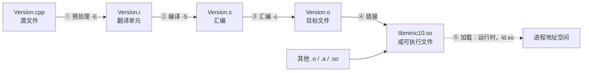
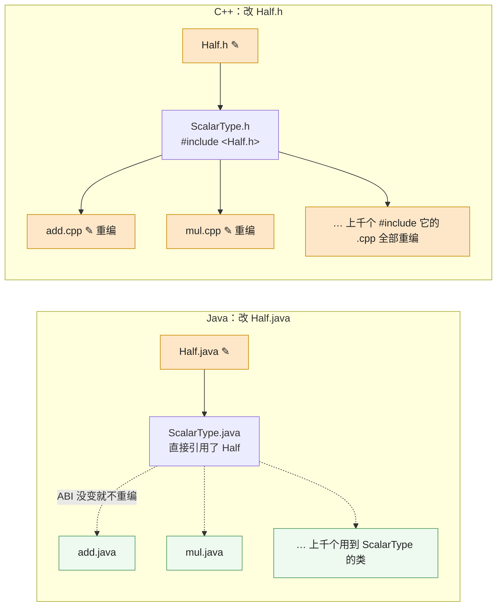
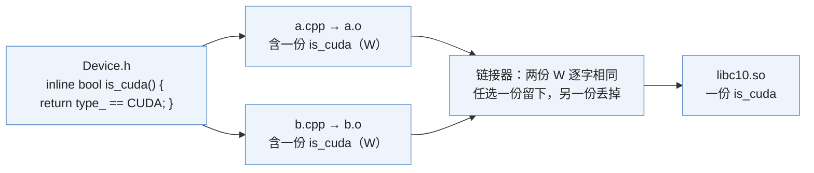

`import torch` 背后，Python 解释器真正加载的第一个 C 语言文件只有 15 行。先说清楚一件事：`import` 导入的不一定是 `.py` 文件。目录里如果放的是一个编译好的共享库 `_C.cpython-312-x86_64-linux-gnu.so`，同一条 `import` 语句会 `dlopen` 它并调用其中一个名为 `PyInit__C` 的 C 函数拿到模块对象——这是 Python 系列[第一篇第四章](/python-execution-model-scopes-imports-and-exceptions.html)讲的 `ExtensionFileLoader`。本篇从 C++ 这一侧接着讲：那个 `PyInit__C` 在哪、它编成了什么、又拉起了什么。它在 `torch/csrc/stub.c`，全文如下：

```c
#include <Python.h>

extern PyObject* initModule(void);

#ifndef _WIN32
#ifdef __cplusplus
extern "C"
#endif
__attribute__((visibility("default"))) PyObject* PyInit__C(void);
#endif

PyMODINIT_FUNC PyInit__C(void)
{
  return initModule();
}
```

这个文件看起来简单到不需要解释，但对一个 Java 工程师来说，几乎每一行都有陌生的东西：

- `extern PyObject* initModule(void);`——这只是一个声明，函数体在哪里？编译器怎么知道去哪儿找？[^q0]
- 为什么 `PyInit__C` 要先声明一次再定义一次？`visibility("default")` 是什么，不写会怎样？[^q1]
- `#ifndef _WIN32`、`#ifdef __cplusplus`——这是代码还是配置？[^q2]
- 这个文件编出来是什么？它怎么和 `torch/csrc/Module.cpp` 里那个真正的 `initModule()` 接上？[^q3]

如果打开 `torch/csrc/Module.cpp` 找到 `initModule` 的定义，会发现它前面还有一行 `extern "C" TORCH_PYTHON_API PyObject* initModule();`——`TORCH_PYTHON_API` 又是什么？

这些问题都不是 PyTorch 的问题，而是 C++ **编译模型**的问题。Java 工程师第一次面对 C++ 项目时，最陌生的往往不是语法，而是它是怎么编译出来的：为什么有 `.h` 和 `.cpp` 两种文件？为什么改一个头文件要重编半个项目？什么是"未定义的引用"？为什么同一个函数在两个文件里定义会报错？为什么一个 pip 包里有 `libc10.so`、`libtorch_cpu.so`、`libtorch_python.so` 好几个二进制？

本文要回答的核心问题是：

> **一个 `.cpp` 文件是怎么变成机器码、再变成一个能被加载的 `.so` 的？每个阶段各做什么，"找不到"的错误分别发生在哪个阶段？**

本篇讲编译模型本身——四个阶段、翻译单元、ODR、符号与库、动态链接——最后手写一遍编译命令把一个程序链接到 PyTorch 的库上。几千个翻译单元怎么组织成 `libc10.so`、`libtorch_cpu.so`、`libtorch_python.so` 这几个库、`import torch` 到底加载了什么、我写的扩展该链接到哪一个，是[下篇](/cpp-project-layout-namespaces-libraries-and-cmake.html)的内容。

## 一、总览

### 1. 参照系：Java 的一种产物与 C++ 的多种产物

Java 是全篇的参照系。Java 的世界里只有一种编译产物（`.class`）、一种打包格式（`.jar`）和一个负责在运行时按需找类的类加载器；C++ 的世界里有翻译单元、目标文件、静态库、动态库、符号表和链接器，而且大部分"找不到"的错误发生在编译期和加载期，不是运行期。理解这个差别，是读懂 PyTorch 和 vLLM 目录结构的前提。

### 2. 本文的章节安排

本篇只讲"一个翻译单元怎么变成一个 `.so`"：前五章是编译模型的五个阶段与它们各自的规则，第七章把这些规则落到一次真实的手工编译上。

| 章 | 主题 | 内容 |
|---|---|---|
| 二 | 四个阶段 | 一个 .cpp 怎么经预处理、编译、汇编、链接变成机器码；加载是运行时的第五步 |
| 三 | 翻译单元、声明与定义、头文件 | 为什么分 .h 和 .cpp；`c10/core/Device.h` 与 `Device.cpp` 的实例；改一个头文件为什么重编半个项目 |
| 四 | One Definition Rule | 同一个名字只能有一个定义；inline、static、匿名命名空间；四种链接属性 |
| 五 | 目标文件、库与符号 | nm 看符号表；name mangling；静态库与动态库；符号可见性与工具箱 |
| 六 | 动态链接与加载 | 链接期与加载期的两次解析；`LD_LIBRARY_PATH`、RPATH/RUNPATH、$ORIGIN；dlopen |
| 七 | 实践一 | 手写编译命令把一个 libtorch 程序链接到 PyTorch 的库，用 ldd / otool 和 nm 观察 |
| 八 | 本文小结 |  |
| 九 | 自测 | 5 道题 |

## 二、四个阶段：一个 `.cpp` 是怎么变成机器码的

### 1. Java 的一步与 C++ 的四步

Java 的构建流程可以概括为一步：`javac` 把 `.java` 编成 `.class`，`.class` 里带着完整的类型信息、方法签名、常量池和字节码，谁引用了谁全部记在文件里。运行时，JVM 的类加载器按需读 `.class`、解析、链接、初始化。"链接"这个词在 Java 里也存在，但它发生在运行时，由 JVM 负责，程序员几乎感觉不到。

C++ 的构建流程有四个阶段——预处理、编译、汇编、链接——每个阶段都是独立的程序，有自己的输入和输出；对动态库来说，运行时还有第五步**加载**（§6）：



平时用 `g++ -c foo.cpp` 或者 CMake 构建时，前四步是被驱动程序（`g++`/`clang++`）串起来一次跑完的，所以初学者往往感觉不到它们的存在。但**每一类错误只会出现在某一个阶段**：

| 阶段 | 典型报错 |
|---|---|
| ① 预处理 | `fatal error: xxx.h: No such file or directory`——找不到头文件 |
| ② 编译 | 类型不匹配、未声明的名字、语法错误 |
| ③ 汇编 | 几乎不会出错（输入是编译器生成的） |
| ④ 链接 | `undefined reference to ...`、`multiple definition of ...` |
| ⑤ 加载 | `cannot open shared object file`、`undefined symbol`（运行时才发现） |

分清阶段，是排错的第一步。

下面用下篇要建的 mini-c10 里的三个文件走一遍（[下篇第五章](/cpp-project-layout-namespaces-libraries-and-cmake.html#五实践二mini-c10-的目录结构与第一个可链接的库)会解释设计）：一个头文件 `Version.h`、实现它的 `Version.cpp`，以及一个调用它的小程序 `examples/hello.cpp`。前两个编成库 `libminic10.so`，第三个链接这个库：

```cpp
// minic10/core/Version.h
#pragma once

#include <cstdint>
#include <string>

namespace minic10 {

constexpr int kVersionMajor = 0;
constexpr int kVersionMinor = 1;

std::string version_string();

inline int version_number() {
  return kVersionMajor * 1000 + kVersionMinor;
}

} // namespace minic10
```

```cpp
// minic10/core/Version.cpp
#include <minic10/core/Version.h>

namespace minic10 {

namespace {
const char* build_flavor() {
#ifdef NDEBUG
  return "release";
#else
  return "debug";
#endif
}
} // namespace

std::string version_string() {
  return std::to_string(kVersionMajor) + "." + std::to_string(kVersionMinor) +
      " (" + build_flavor() + ")";
}

} // namespace minic10
```

```cpp
// examples/hello.cpp
#include <minic10/core/Version.h>

#include <iostream>

int main() {
  std::cout << "mini-c10 " << minic10::version_string()
            << ", number=" << minic10::version_number() << '\n';
}
```

### 2. 预处理：把文本拼成翻译单元

预处理器（preprocessor）只做文本处理，不懂 C++：

- `#include <x>` 把文件 `x` 的内容原地粘贴进来（递归地）；
- `#define A B` 之后，所有出现的 `A` 被替换成 `B`；
- `#ifdef`/`#ifndef`/`#if`/`#else`/`#endif` 按条件保留或删除一段文本；
- `#pragma once` 告诉编译器这个文件在同一次编译里只粘贴一次。

用 `-E` 可以只跑预处理：

```bash
clang++ -std=c++17 -I. -E minic10/core/Version.cpp | wc -l
```

实际输出（macOS，Apple clang 21）是 `40222`：一个 20 行的源文件，加上 `<string>` 和 `<cstdint>` 展开后，变成四万行。这就是**翻译单元**（translation unit）——预处理器输出的那一整段文本，是编译器真正看到的输入。

`stub.c` 里那些 `#ifndef _WIN32`、`#ifdef __cplusplus` 就在这个阶段生效。`_WIN32` 是 Windows 编译器预定义的宏，`__cplusplus` 是 C++ 编译器预定义的宏（C 编译器不定义它）。`stub.c` 是一个 `.c` 文件，用 C 编译器编译时 `__cplusplus` 不存在，`extern "C"` 那行被删掉；如果有人用 C++ 编译器编它，`extern "C"` 保留，保证 `PyInit__C` 的符号名不被 C++ 修饰（第五章讲修饰）。

Java 没有预处理器。Java 里"条件编译"靠 `if (System.getProperty(...))` 在运行时判断，靠 `final static boolean` 常量让 JIT 消除死代码；C++ 在文本层面就把不需要的代码删掉了，二进制里根本不存在另一个分支。这是第五篇的主题，这里只需要知道：**预处理之后，头文件就不存在了，只剩一个巨大的翻译单元。**

### 3. 编译：把翻译单元变成汇编

编译器（严格说是编译器前端 + 优化器 + 后端）读入翻译单元，做词法分析、语法分析、语义分析（类型检查、重载决议、模板实例化），然后生成汇编代码。用 `-S` 可以停在这一步：

```bash
clang++ -std=c++17 -I. -S minic10/core/Version.cpp -o Version.s
grep -n "version_string" Version.s | head -3
```

输出（macOS 上符号名多一个前导下划线，Mach-O 的惯例）：

```text
3:	.globl	__ZN7minic1014version_stringEv  ; -- Begin function _ZN7minic1014version_stringEv
5:__ZN7minic1014version_stringEv:         ; @_ZN7minic1014version_stringEv
```

`minic10::version_string()` 在汇编里变成了 `_ZN7minic1014version_stringEv`（macOS 上还多一个前导下划线）。这个奇怪的名字是**符号**（symbol），第五章会讲它的编码规则。这里先记住一个事实：**编译器一次只看一个翻译单元**。编译 `Version.cpp` 时，它完全不知道 `hello.cpp` 的存在；它只知道 `Version.h` 里说过"有一个叫 `version_string` 的函数，返回 `std::string`"，于是放心地生成对它的调用或定义。

这解释了 `stub.c` 里 `extern PyObject* initModule(void);` 的作用：告诉编译器"有这么一个函数，签名如此，定义在别处"，让编译器能生成 `return initModule();` 这条调用。真正的定义在 `torch/csrc/Module.cpp`，编译 `stub.c` 时编译器根本没看过它。

`javac` 编译 `A.java` 时如果引用了 `B`，会去 classpath 上找 `B.class` 或 `B.java` 读出签名。C++ 编译器不会去找任何别的 `.cpp`；它只信头文件里的声明。这是两种语言最根本的差别之一：**Java 的编译器能看到整个 classpath，C++ 的编译器只能看到当前翻译单元。**

### 4. 汇编：生成目标文件

这一步的名字容易误解："汇编"（assemble）不是生成汇编语言，而是**把汇编语言翻成机器码**——上一步编译器输出的 `.s` 是人能读的汇编文本，汇编器（assembler）把每条汇编指令翻成对应的二进制机器指令，写进 `.o`（目标文件，object file）。名字来自它处理的**输入**是汇编语言，就像"编译器"的名字来自它处理的是源语言。目标文件 Linux 上是 ELF 格式，macOS 上是 Mach-O，Windows 上是 COFF。`-c` 让驱动程序停在这一步：

```bash
clang++ -std=c++17 -Wall -fPIC -I. -c minic10/core/Version.cpp -o Version.o
```

目标文件里有机器码、数据，以及一张**符号表**：本文件定义了哪些符号（可以给别人用）、引用了哪些别处的符号（需要别人提供）。第五章会用 `nm` 看它。

### 5. 链接：把符号对上

链接器（`ld`、`lld`、`gold`、macOS 的 `ld64`）收集所有 `.o` 和库，做两件事：

1. **符号解析**（symbol resolution）：每个"我引用了 X 但没定义"的地方，都要找到唯一一个"我定义了 X"；
2. **重定位**（relocation）：确定每段代码和数据的最终地址，把所有引用处的占位地址改成真实地址。


图 2 画出这两件事。左边是链接前的两个 `.o`：各自的代码从地址 0 开始排，`hello.o` 的符号表里 `version_string` 标着 `U`（引用了、没定义），`Version.o` 里标着 `T`（定义了、对外可见）。右边是链接后的样子：可执行文件被装进进程的**虚拟地址空间**——每个进程一份，从低到高依次是代码段（`.text`）、全局变量（`.data` / `.bss`）、向上生长的堆、动态库的映射区、向下生长的栈；链接器给 `main` 和 `version_string` 各定下一个最终地址，再把 `hello.o` 里 `call ???` 的占位改成 `version_string` 的真实地址。第五章会用 `nm` 看这些字母，第六章讲动态库的情况——`version_string` 在 `.so` 里时，②这一步推迟到运行时由 `ld.so` 完成。

```bash
clang++ -std=c++17 -shared -o libminic10.so Version.o
clang++ -std=c++17 -I. examples/hello.cpp -L. -lminic10 -o hello
```

第一条把 `Version.o` 链接成动态库；第二条编译 `hello.cpp`，并把它对 `minic10::version_string()` 的引用解析到 `libminic10.so` 里的定义。两条命令里的每个选项：

| 选项 | 含义 | 出现在 |
|---|---|---|
| `-std=c++17` | 按 C++17 标准编译 | 两条 |
| `-shared` | 输出动态库（`.so`），而不是可执行文件 | 第一条 |
| `-o <文件>` | 输出文件名 | 两条 |
| `-I.` | 头文件搜索路径加上当前目录：`#include <minic10/core/Version.h>` 在这里找 | 第二条 |
| `-L.` | 库文件搜索路径加上当前目录：`-lminic10` 在这里找 | 第二条 |
| `-lminic10` | 链接名为 `libminic10.so`（或 `.a`）的库——`-l` 后面写去掉 `lib` 前缀和后缀的名字 | 第二条 |
| `-c` | 只编译到 `.o`，不链接（§4） | 前面 |
| `-fPIC` | 生成位置无关代码：动态库会被装到任意地址，代码里不能写死绝对地址（§4） | 前面 |
| `-Wall` | 打开常用警告 | 前面 |

两类最常见的链接错误都发生在符号解析阶段：

```text
undefined reference to `helper()'          # 有人引用了，没人定义
multiple definition of `helper()'          # 不止一个人定义了
```

（以上是 Linux GNU ld 的措辞；macOS ld64 分别说 `Undefined symbols for architecture arm64` 和 `duplicate symbol`。本文的命令行输出以 Linux 为准，macOS 差异随文标注。）

### 6. 第五个阶段：加载

对动态库来说还有一个阶段在运行时：**加载**（loading）。链接 `hello` 时，链接器并没有把 `libminic10.so` 的代码拷进 `hello`，只是记录了一条"运行时需要 `libminic10.so`"和"`version_string` 在那个库里"。真正把库读进内存、把地址填上的是操作系统的**动态加载器**（Linux 上是 `ld-linux-x86-64.so.2`，也叫 `ld.so`），发生在程序启动时或 `dlopen` 时。第六章专门讲它。

把四加一个阶段与 Java 对上：

| 阶段 | C++ | Java 对应 | 说明 |
|---|---|---|---|
| 预处理 | `#include`/`#define` 展开 | 无 | Java 没有文本级预处理 |
| 编译 | 翻译单元 → 汇编 | `javac` | Java 编译器能看到 classpath，C++ 只看当前翻译单元 |
| 汇编 | 汇编 → `.o` | 无（`.class` 已是最终产物） | |
| 链接 | 多个 `.o`/库 → 可执行文件或 `.so` | 无直接对应 | Java 把这一步推迟到运行时由 JVM 做 |
| 加载 | `ld.so` 加载 `.so` | 类加载器加载 `.class` | 最接近的类比，但 C++ 加载时要解析的符号在链接期已确定 |

## 三、翻译单元、声明与定义、头文件

### 1. 为什么要分 `.h` 和 `.cpp`

既然编译器一次只看一个翻译单元，而 `hello.cpp` 想调用 `Version.cpp` 里的函数，就必须有一种办法让 `hello.cpp` 的翻译单元里出现 `version_string` 的**签名**，同时不出现它的**函数体**（否则两个翻译单元各有一份函数体，链接时就是 multiple definition）。

这个办法就是**声明与定义分离**：

- **声明**（declaration）：告诉编译器一个名字的类型/签名。`std::string version_string();` 是声明；`extern PyObject* initModule(void);` 是声明；`class Tensor;` 是声明。
- **定义**（definition）：给出实体本身。带函数体的函数是定义；带大括号的类是定义；不带 `extern` 的全局变量是定义。

头文件（`.h`/`.hpp`）放声明，源文件（`.cpp`/`.cc`）放定义，所有需要用这个名字的 `.cpp` 都 `#include` 这个头文件。一个声明可以出现任意多次（每个翻译单元一次），一个定义在整个程序里只能有一次——这就是第四章的 ODR。

Java 没有这个区分：一个 `.java` 文件就是类的完整定义，其他类通过 `import` 引用它时，编译器自己去读 `.class` 提取签名。C++ 把"提取签名"这件事交给了程序员——头文件就是手写的签名文件。C++20 引入的 modules 试图改变这一点，但 PyTorch 和 vLLM 都还没用，本系列不讨论。

### 2. 真实例子：`c10/core/Device.h` 与 `Device.cpp`

`c10::Device` 是 PyTorch 里表示"设备"的小类型（`cpu`、`cuda:0` 这些）。它的头文件 `c10/core/Device.h` 开头是：

```cpp
#pragma once

#include <c10/core/DeviceType.h>
#include <c10/macros/Export.h>
#include <c10/util/Exception.h>

#include <cstddef>
#include <cstdint>
#include <functional>
#include <iosfwd>
#include <string>

namespace c10 {

using DeviceIndex = int8_t;

struct C10_API Device final {
  using Type = DeviceType;

  /* implicit */ Device(DeviceType type, DeviceIndex index = -1)
      : type_(type), index_(index) {
    validate();
  }

  /* implicit */ Device(const std::string& device_string);

  // ...

  bool is_cuda() const noexcept {
    return type_ == DeviceType::CUDA;
  }

  // ...

  /// Same string as returned from operator<<.
  std::string str() const;

 private:
  DeviceType type_;
  DeviceIndex index_ = -1;
  void validate() {
    // ...
  }
};

C10_API std::ostream& operator<<(std::ostream& stream, const Device& device);

} // namespace c10
```

先认几个 Java 里没有的记号，后文会反复出现：

| 记号 | 含义 | Java 里 |
|---|---|---|
| `using DeviceIndex = int8_t;` | **类型别名**：给 `int8_t` 起一个新名字 `DeviceIndex`，两者是同一个类型（老写法是 `typedef int8_t DeviceIndex;`）；类内的 `using Type = DeviceType;` 同理 | 没有；最接近的是用一个 `record` 包一层，但那是新类型 |
| `C10_API` | 一个**宏**，展开成"这个符号要从 `libc10.so` 导出给别人用"（Linux 上是 `__attribute__((visibility("default")))`）；第五章和第五篇展开 | 没有；Java 的 `public` 类天然可被别的 jar 用 |
| `constexpr int kVersionMajor = 0;` | **编译期常量**：值在编译时就确定，可以用在数组长度、模板参数这些必须编译期已知的地方；比 `const` 严格 | `static final int`，但 Java 不保证编译期求值 |
| `final` | 类不能被继承 | `final class` |
| `noexcept` | 函数保证不抛异常 | 没有对应 |
| `Device::str()` | 作用域限定：`.cpp` 里定义头文件声明过的成员函数时写类名前缀 | 方法只能写在类体内 |

注意三种成员：

- ① `Device(DeviceType, DeviceIndex)`、`is_cuda()`、`validate()` **在类内直接给出函数体**。类内定义的成员函数隐含 `inline`（第四章解释为什么这样就不违反 ODR）。它们一两行就完，放在头文件里让编译器可以内联。
- ② `Device(const std::string&)` 和 `str()` **只有声明**。它们的定义在 `c10/core/Device.cpp`（代码里标 ②）：

```cpp
#include <c10/core/Device.h>
#include <c10/util/Exception.h>

// ...

namespace c10 {
namespace {                                                    // ③ 匿名命名空间：只在本文件可见
DeviceType parse_type(const std::string& device_string) {     // ③ 实现细节，头文件里没有它
  // ...
}
// ...
} // namespace

Device::Device(const std::string& device_string) : Device(Type::CPU) {   // ② 头文件里只声明、这里定义
  TORCH_CHECK(!device_string.empty(), "Device string must not be empty");
  // ... 解析 "cuda:0" 这类字符串
  validate();
}

std::string Device::str() const {                              // ② 同上
  std::string str = DeviceTypeName(type(), /* lower case */ true);
  if (has_index()) {
    str.push_back(':');
    str.append(std::to_string(index()));
  }
  return str;
}

std::ostream& operator<<(std::ostream& stream, const Device& device) {
  stream << device.str();
  return stream;
}

} // namespace c10
```

  字符串解析有几十行，不适合放头文件（放了会让每个包含 `Device.h` 的翻译单元都编一遍，而 `Device.h` 几乎被所有文件间接包含）。所以只在头文件里声明，定义放 `.cpp`，编进 `libc10.so`。

- ③ `parse_type` **只在 `.cpp` 里，头文件里没有它**。它是实现细节，被匿名命名空间包住（第四章讲）。


### 3. 头文件的职责与 `#pragma once`

一个头文件通常包含：

| 内容 | 例子（`c10/core/Device.h`） | 说明 |
|---|---|---|
| 类型定义 | `struct Device { ... };` | 类的定义本身（成员列表）必须在头文件里，否则使用者不知道它多大 |
| 函数声明 | `std::string str() const;` | 定义在 `.cpp` |
| 小函数的 inline 定义 | `bool is_cuda() const noexcept { ... }` | 允许内联 |
| 类型别名 | `using DeviceIndex = int8_t;` | |
| 常量 | `constexpr int kX = 1;` | |
| 模板 | 第三篇 | 模板几乎必须全部放头文件 |
| 宏 | `C10_API` | 第五篇 |

头文件会被间接包含很多次。`Device.h` 包含 `Exception.h`，`ScalarType.h` 也包含 `Exception.h`，一个同时包含 `Device.h` 和 `ScalarType.h` 的文件里 `Exception.h` 就被粘贴两次——第二次会因为重复定义 `class Error` 而编译失败。`#pragma once` 解决这个问题：同一个文件在同一个翻译单元里只展开一次。

传统写法是 include guard：

```cpp
#ifndef C10_MACROS_EXPORT_H_
#define C10_MACROS_EXPORT_H_
// ...
#endif // C10_MACROS_EXPORT_H_
```

`torch/headeronly/macros/Export.h` 两种都用了（`#pragma once` 在第一行，紧接着 `#ifndef C10_MACROS_EXPORT_H_`），这是历史遗留。PyTorch 新代码统一用 `#pragma once`。`#pragma once` 不是标准 C++，但所有主流编译器都支持；它按文件身份判重，include guard 按宏名判重，实际效果一样。

### 4. 为什么改一个头文件要重编半个项目

现在可以回答开头的问题了。`#include` 是文本粘贴，`Device.h` 的内容是每一个包含它的翻译单元的一部分。改了 `Device.h`，所有包含它的翻译单元的**输入**都变了，构建系统（CMake/Ninja 通过编译器生成的依赖文件 `.d` 追踪这种关系）必须把它们全部重编。

看看 `c10/core/ScalarType.h` 开头包含了多少东西：

```cpp
#pragma once

#include <c10/util/BFloat16.h>
#include <c10/util/Exception.h>
#include <c10/util/Float4_e2m1fn_x2.h>
#include <c10/util/Float8_e4m3fn.h>
#include <c10/util/Float8_e4m3fnuz.h>
#include <c10/util/Float8_e5m2.h>
#include <c10/util/Float8_e5m2fnuz.h>
#include <c10/util/Float8_e8m0fnu.h>
#include <c10/util/Half.h>
#include <c10/util/bits.h>
#include <c10/util/complex.h>
#include <c10/util/qint32.h>
#include <c10/util/qint8.h>
#include <c10/util/quint2x4.h>
#include <c10/util/quint4x2.h>
#include <c10/util/quint8.h>

#include <array>
// ...
```

`ScalarType` 是 dtype，几乎每一个 ATen 文件都要用它。改一下 `c10/util/Half.h`，`ScalarType.h` 的所有包含者都要重编，也就是几乎整个 `libtorch_cpu.so`——上千个翻译单元，一小时级别。这就是 PyTorch 开发者对"往 c10 头文件里加东西"极其谨慎的原因，也是 `c10/CMakeLists.txt` 开头那段注释的背景（第九章）。

Java 里改一个类只需重编它自己和直接依赖它的类（Gradle 的增量编译粒度是类级别的 ABI 变化）。C++ 的粒度是"文本包含"，粗得多——两边画出来：



同一个改动在两种语言里的重编范围。Java 里 `Half` 的改动只要不改它对外的签名，`javac` 增量编译到 `ScalarType` 就停了；C++ 里 `Half.h` 的文本是每个间接包含它的翻译单元的一部分，改一个字节，上千个 `.cpp` 的输入都变了。这带来了 C++ 项目特有的两个工程习惯：

1. **前向声明**（forward declaration）。一行 `class Tensor;` 只告诉编译器"有一个叫 `Tensor` 的类"，不说它有哪些成员、多大——这就是前向声明。什么时候够用：只用它的**指针或引用**（`Tensor*`、`const Tensor&`）时，编译器不需要知道它多大，一个指针总是 8 字节。什么时候不够：按值持有成员（`Tensor t_;` 要知道多大）、调用成员函数、`sizeof`，这些都需要完整定义，必须 `#include`。所以头文件里能用前向声明就不 `#include`——包含者就不必因为 `Tensor.h` 变了而重编。`aten/src/ATen/templates/TensorBody.h`（生成 `ATen/core/TensorBody.h` 的模板）开头就是一串前向声明，每一行都是"只说有、不说多大"：

   ```cpp
   namespace c10 {
   template <class T> class List;        // 前向声明一个类模板
   template <class T> class IListRef;
   }

   namespace at {
   struct Generator;                     // 前向声明：struct 与 class 在这里等价
   struct Type;
   class DeprecatedTypeProperties;
   class Tensor;                         // Tensor 自己也被前向声明——TensorBody.h 后面才定义它
   } // namespace at

   namespace torch { namespace autograd {
   struct Node;                          // Tensor 只持有 Node 的指针，不需要 Node 的定义
   }} // namespace torch::autograd
   ```

   这是第二篇会反复用到的规则。

2. **`-inl.h` 拆分和 `#include <iosfwd>`**：`Device.h` 包含 `<iosfwd>`（只有 `std::ostream` 的前向声明）而不是 `<ostream>`（完整定义），因为它只需要声明 `operator<<`。

### 5. `extern` 与全局变量

对函数来说，不带函数体就是声明，所以 `stub.c` 里 `extern PyObject* initModule(void);` 的 `extern` 其实可以省略——函数声明默认就是 `extern`。对变量则不同：

```cpp
int counter;          // 定义（分配存储）
extern int counter;   // 声明（别处有定义）
```

头文件里放变量时必须写 `extern`，否则每个包含者都定义一份，链接时 multiple definition。PyTorch 源码里全局变量很少直接暴露，多半用函数包装（如 `c10::DeviceTypeName(...)`），或者用 `thread_local`（第六篇）。

## 四、One Definition Rule：同一个名字只能有一个定义

### 1. 规则本身

ODR 的核心可以概括为两句话：

1. 任何翻译单元里，一个变量、函数、类、枚举、模板最多只能有一个定义；
2. 整个程序里，每个非 inline 的函数和变量**恰好**一个定义（用到了却没有 → undefined reference；多于一个 → multiple definition）。

第二条有一个"非 inline"的限定，反过来说：**类、inline 函数、模板允许在多个翻译单元里各有一份定义。** 这听起来违反直觉，但它是头文件机制的必然结果：`Device.h` 里的 `is_cuda()` 是类内定义的 inline 函数，每个 `#include <c10/core/Device.h>` 的 `.cpp` 编出来的 `.o` 里都有一份 `is_cuda` 的机器码——编译器一次只看一个翻译单元，它没法知道别的 `.o` 里已经有了，也必须有一份才能内联。于是规则改成：多份可以，但**所有定义必须逐字相同**（token-for-token identical），链接器假定它们相同并任选一份、丢掉其余（下一章 `nm` 里标 `W` 的就是这种"可合并的弱定义"）。



inline 函数为什么可以有多份定义——每个翻译单元各编一份，链接器按"逐字相同"的假定合并。危险在于**违反"逐字相同"不会报错**：如果 `a.cpp` 编译时定义了某个宏让 `is_cuda` 的函数体多了一行，两份就不同了，链接器照样任选一份——这是**未定义行为**，程序可能用了 A 文件的版本，也可能用了 B 文件的版本，也可能崩溃。

Java 里不存在这个问题：一个类只有一个 `.class`，JVM 按全限定名找到它，同名类冲突时类加载器有明确的优先规则（父加载器优先）。C++ 没有这层运行时仲裁，全靠链接器在构建时把名字对上。

### 2. 两种链接错误

用两个最小文件复现：

```cpp
// dup1.cpp
int helper() { return 1; }
// dup2.cpp
int helper() { return 2; }
int main() { return helper(); }
```

```bash
g++ -std=c++17 dup1.cpp dup2.cpp -o dup
```

GNU ld 的报错：

```text
/usr/bin/ld: /tmp/ccXXXX.o: in function `helper()':
dup2.cpp:(.text+0x0): multiple definition of `helper()'; /tmp/ccYYYY.o:dup1.cpp:(.text+0x0): first defined here
```

反过来：

```cpp
// undef.cpp
int helper();
int main() { return helper(); }
```

GNU ld 的报错：

```text
/usr/bin/ld: /tmp/ccXXXX.o: in function `main':
undef.cpp:(.text+0x5): undefined reference to `helper()'
```

（macOS 的 ld64 对这两种错误的措辞分别是 `duplicate symbol` 和 `Undefined symbols for architecture arm64`，意思相同。）

注意错误信息里的 `helper()`——链接器本来看到的是修饰后的 `_Z6helperv`，现代链接器会自动"反修饰"（demangle）给人看。第五章讲修饰。

读 PyTorch 扩展的构建日志时，`undefined reference to ‘at::empty_like(...)’` 和 `undefined symbol: _ZN2at10empty_like...`（这是加载期的版本）是最常见的两类，分别说明"链接时少了 `-ltorch_cpu`"和"运行时找到了错误版本的 `libtorch_cpu.so`"。

### 3. `inline`：允许多份相同定义

头文件里放函数定义，被 N 个翻译单元包含，就有 N 份定义——违反 ODR 第二条。`inline` 关键字把这个函数变成"允许多份，但必须相同，链接器任选一份"的类别：

```cpp
// minic10/core/Version.h
inline int version_number() {
  return kVersionMajor * 1000 + kVersionMinor;
}
```

现代 C++ 里 `inline` 的主要含义就是这个**链接属性**，"建议编译器内联展开"只是次要含义（编译器基本不听建议，自己决定）。三种情况隐含 `inline`：

- 类内定义的成员函数（`Device::is_cuda()` 那种）；
- 模板（函数模板、类模板的成员），因为模板本来就在每个用到它的翻译单元里各实例化一份；
- `constexpr` 函数；C++17 起 `constexpr` 静态数据成员和 `inline` 变量也是。

`c10/core/ScalarType.h` 里一串工具函数就是显式 `inline`：

```cpp
inline size_t elementSize(ScalarType t) {
#define CASE_ELEMENTSIZE_CASE(ctype, name) \
  case ScalarType::name:                   \
    return sizeof(ctype);

  switch (t) {
    AT_FORALL_SCALAR_TYPES_WITH_COMPLEX_AND_QINTS(CASE_ELEMENTSIZE_CASE)
    default:
      TORCH_CHECK(false, "Unknown ScalarType");
  }
#undef CASE_ELEMENTSIZE_CASE
}

inline bool isFloatingType(ScalarType t) {
  return t == ScalarType::Double || t == ScalarType::Float ||
      isReducedFloatingType(t);
}
```

它们被上千个翻译单元包含，每个翻译单元里都有一份 `elementSize` 的机器码（如果编译器没把它内联掉），链接器最后保留一份。在 `nm` 输出里这类符号标记为 `W`（weak），下一节会看到。

**`inline` 的陷阱**：如果同一个 inline 函数在两个翻译单元里编出来的代码不一样，链接器保留哪一份是不确定的。`caffe2/CMakeLists.txt` 里有一段真实的踩坑记录：

```cmake
# NOTE [ Linking AVX and non-AVX files ]
#
# Regardless of the CPU capabilities, we build some files with AVX2, and AVX512
# instruction set. If the host CPU doesn't support those, we simply ignore their
# functions at runtime during dispatch.
#
# We must make sure that those files are at the end of the input list when
# linking the torch_cpu library. Otherwise, the following error scenario might
# occur:
# 1. A non-AVX2 and an AVX2 file both call a function defined with the `inline`
#    keyword
# 2. The compiler decides not to inline this function
# 3. Two different versions of the machine code are generated for this function:
#    one without AVX2 instructions and one with AVX2.
# 4. When linking, the AVX2 version is found earlier in the input object files,
#    so the linker makes the entire library use it, even in code not guarded by
#    the dispatcher.
# 5. A CPU without AVX2 support executes this function, encounters an AVX2
#    instruction and crashes.
```

源码相同、编译选项不同（`-mavx2` 与否）→ 机器码不同 → ODR 违反 → 在不支持 AVX2 的机器上非法指令崩溃。PyTorch 的解法是控制链接顺序，让非 AVX 版本先被链接器看到。这个注释值得记住：**ODR 关心的是"定义相同"，而"相同"包括编译方式。**

### 4. `static` 与匿名命名空间：内部链接

另一条路是反过来：不让符号被其他翻译单元看见。`static` 修饰的全局函数/变量，以及匿名命名空间 `namespace { ... }` 里的所有东西，都是**内部链接**（internal linkage）——只在本翻译单元可见，不进入全局符号表，不参与跨翻译单元的符号解析。两个 `.cpp` 各有一个 `static int helper()` 互不冲突。

`c10/core/Device.cpp` 用匿名命名空间：

```cpp
namespace c10 {
namespace {
DeviceType parse_type(const std::string& device_string) {
  // ...
}
enum DeviceStringParsingState { START, INDEX_START, INDEX_REST, ERROR };
} // namespace

Device::Device(const std::string& device_string) : Device(Type::CPU) {
  // ...
}
```

`c10/core/DeviceType.cpp` 用 `static`：

```cpp
static std::atomic<bool> privateuse1_backend_name_set;
static std::string privateuse1_backend_name;
static std::mutex privateuse1_lock;
```

两种写法效果一样，C++ 风格指南倾向匿名命名空间（能包住类型和模板，`static` 不能）。PyTorch 的 kernel 文件大量使用这个模式——`aten/src/ATen/native/cpu/BinaryOpsKernel.cpp` 从第 22 行开始整个 kernel 实现都在匿名命名空间里，文件末尾只有一排 `REGISTER_DISPATCH(...)` 把函数指针注册出去：

```cpp
namespace at::native {

namespace {

// ... 一千四百行 kernel 实现 ...

} // namespace

REGISTER_DISPATCH(add_clamp_stub, &add_clamp_kernel)
REGISTER_DISPATCH(mul_stub, &mul_kernel)
REGISTER_DISPATCH(div_true_stub, &div_true_kernel)
// ...
```

这样做有两个好处：不同 kernel 文件里同名的辅助函数不会冲突；符号不导出，`.so` 的符号表更小，加载更快。第五篇讲静态注册时会重看这个文件。

对比 Java：`private` 和包私有控制的是**编译期的访问权限**，但类和方法在 `.class` 里始终有名字，反射能找到。C++ 的内部链接是**真的没有外部可见的名字**——目标文件的全局符号表里没它，别的翻译单元想引用也引用不了。

### 5. 小结：四种链接属性

| 写法 | 链接属性 | 多个翻译单元定义会怎样 | 典型用途 |
|---|---|---|---|
| 普通函数/变量 | 外部链接 | multiple definition 错误 | `.cpp` 里的实现 |
| `inline`、类内成员函数、模板、`constexpr` | 外部链接 + 允许重复（vague linkage） | 合法，链接器任选一份，必须逐字相同 | 头文件里的小函数、模板 |
| `static`、匿名命名空间 | 内部链接 | 互不相干 | `.cpp` 里的私有辅助 |
| `extern` 声明 | 声明而非定义 | 不算定义 | 头文件里引用别处的变量 |

## 五、目标文件、库与符号

### 1. 用 `nm` 看目标文件里的符号表

编译好 `Version.o` 之后：

```bash
nm -C Version.o
```

`-C` 让 `nm` 反修饰名字。输出（Linux，g++，节选）：

```text
0000000000000000 t minic10::(anonymous namespace)::build_flavor()
0000000000000000 T minic10::version_string()
                 U std::__cxx11::basic_string<char, ...>::append(char const*)
                 U std::__cxx11::to_string(int)
                 U __cxa_begin_catch
```

每行三列：地址、类型字母、名字。类型字母最常用的几个：

| 字母 | 含义 | 本例 |
|---|---|---|
| `T` | 本文件**定义**的全局函数（text 段） | `version_string()` |
| `t` | 本文件定义的**局部**函数（内部链接） | `build_flavor()`——匿名命名空间的效果 |
| `U` | **未定义**，需要别人提供 | `std::to_string`、`__cxa_begin_catch`（异常运行时） |
| `W` | weak，inline/模板生成的可重复定义 | 下面 `hello.o` 里的 `version_number()` |
| `D`/`d` | 已初始化的全局/局部数据 | |
| `B`/`b` | 未初始化数据（bss） | |

再看 `hello.o`（只编译不链接 `examples/hello.cpp`）：

```bash
clang++ -std=c++17 -I. -c examples/hello.cpp -o hello.o
nm -C hello.o | grep minic10
```

输出（Linux）：

```text
0000000000000000 W minic10::version_number()
                 U minic10::version_string()
```

`version_number()` 是 inline，在 `hello.o` 里有一份定义，标 `W`；`version_string()` 只有声明，标 `U`。链接 `hello` 时，链接器要为这个 `U` 找到一个 `T`——它在 `libminic10.so` 里。（macOS 的 `nm` 把 `version_number()` 标 `T` 而非 `W`——Mach-O 用另一套机制标记可合并的弱定义，`nm -m` 能看到 `weak`；符号名多一个前导下划线；语义相同。）

### 2. Name mangling：符号名为什么长得像乱码

C 的符号名就是函数名：`initModule`。C++ 支持重载、命名空间、模板，`minic10::version_string()` 和 `other::version_string(int)` 必须是不同的符号，所以编译器把命名空间、函数名、参数类型编码进符号名，这叫**名字修饰**（name mangling）：

```text
_ZN7minic1014version_stringEv
 │ │ │      │ │             │└ v: 参数列表为 void
 │ │ │      │ │             └ E: 嵌套名结束
 │ │ │      │ └ 14version_string: 长度 14 的标识符
 │ │ │      └ 7minic10: 长度 7 的标识符
 │ │ └ N: 嵌套名开始
 │ └ Z: 修饰名标记
 └ _: 前缀
```

这是 Itanium C++ ABI 的规则，GCC 和 Clang 在 Linux/macOS 上都用它；MSVC 用另一套（`?version_string@minic10@@YA...`）。`c++filt` 可以手工反修饰：

```bash
echo _ZN7minic1014version_stringEv | c++filt
# minic10::version_string()
```

两个直接后果：

1. **C++ 编译器之间的二进制兼容**取决于修饰规则一致。GCC 和 Clang 一致，和 MSVC 不一致，所以 Linux 上编的 `.so` 不可能被 Windows 用，反之亦然。更细的问题——同一编译器不同版本、不同标准库配置（`_GLIBCXX_USE_CXX11_ABI`）——是第七篇 ABI 一节的主题。上面输出里的 `std::__cxx11::basic_string` 就是 libstdc++ 新 ABI 的痕迹。
2. **要给 C 或 Python 调用的函数必须关掉修饰**，写法是 `extern "C"`。这就是 `torch/csrc/Module.cpp` 里那一行：

```cpp
extern "C" TORCH_PYTHON_API PyObject* initModule();
// separate decl and defn for msvc error C2491
PyObject* initModule() {
  HANDLE_TH_ERRORS
  // ...
```

`initModule` 是 C++ 函数，但被 C 文件 `stub.c` 引用，`stub.c` 编译时只会生成对 `initModule` 这个**未修饰**符号的引用；如果 `Module.cpp` 不加 `extern "C"`，导出的会是 `_Z10initModulev`，两边对不上，链接失败。同理，`PyInit__C` 是 Python 解释器用 `dlsym` 按名字查找的入口，名字必须精确为 `PyInit__C`，Python 的 `PyMODINIT_FUNC` 宏在 C++ 编译时会展开出 `extern "C"`。

Java 对照：JNI 也有一套名字规则（`Java_com_example_Foo_bar`），本质上是同一个问题——两个运行时之间约定一个不依赖任何一方修饰规则的名字。

### 3. 静态库与动态库

多个 `.o` 可以打包成库。两种库的差别决定了 PyTorch 的整个发布形态：

| | 静态库 `.a` | 动态库 `.so`（macOS `.dylib`，Windows `.dll`） |
|---|---|---|
| 是什么 | `.o` 文件的归档（`ar` 打包），没有链接过 | 已经链接过的、可被加载的镜像 |
| 链接到程序时 | 需要的 `.o` 被**拷贝**进最终产物 | 只记录一条依赖（`DT_NEEDED`），代码留在 `.so` 里 |
| 运行时 | 无外部依赖 | 需要 `ld.so` 找到并加载 `.so` |
| 多个程序共享 | 各自一份 | 内存中共享同一份只读代码页 |
| 符号解析发生在 | 链接期 | 链接期检查一次，加载期再解析一次 |
| 更新库 | 必须重新链接程序 | 替换 `.so` 即可（ABI 兼容的前提下） |
| 未被引用的 `.o` | **不会**被拉进来（下一段） | 整个库都加载 |

静态库有一个让很多人踩坑的性质：链接器从 `.a` 里只取**被引用了的** `.o`。一个 `.o` 如果没有任何符号被别人引用——典型就是"只靠静态初始化把自己注册进全局表"的算子文件（第五篇）——就会被整个丢掉，注册代码根本不存在于最终产物里。`cmake/TorchConfig.cmake.in` 里 `append_wholearchive_lib_if_found(torch torch_cpu)` 用 `-Wl,--whole-archive` 强制链接器把 `libtorch_cpu.a` 全部拉进来，就是为了这个。PyTorch 的默认发布形态是动态库（`BUILD_SHARED_LIBS=ON`），不存在这个问题；vLLM、TorchServe 等下游一律链接动态库。

Java 里没有这个二分法：`.jar` 就是 `.class` 的 zip 包，运行时按需加载，最接近"动态库"；但 JVM 只在真的用到某个类时才加载它，这又有点像"静态库只取被引用的 `.o`"——只是 Java 是运行期惰性，C++ 是链接期裁剪。

### 4. 符号可见性：`.so` 导出了什么

动态库有自己的"公开/私有"概念。默认情况下，`.so` 里所有外部链接的符号都被导出（`nm -D` 能看到），任何人都能链接到它们。这有两个问题：符号表巨大（`libtorch_cpu.so` 有几十万个符号），加载慢；内部实现细节被人依赖，无法改动。

GCC/Clang 用 `-fvisibility=hidden` 把默认改成"全部不导出"，再用 `__attribute__((visibility("default")))` 逐个标出要导出的。PyTorch 就是这么做的。`cmake/public/utils.cmake` 里 `torch_compile_options` 函数对每个库目标：

```cmake
  if(NOT WIN32 AND NOT USE_ASAN)
    # Enable hidden visibility by default to make it easier to debug issues with
    # TORCH_API annotations. Hidden visibility with selective default visibility
    # behaves close enough to Windows' dllimport/dllexport.
    # ...
    target_compile_options(${libname} PRIVATE
        $<$<COMPILE_LANGUAGE:CXX>: -fvisibility=hidden>)
  endif()
```

然后 `torch/headeronly/macros/Export.h`（`c10/macros/Export.h` 现在只是 `#include` 它——PyTorch 2.x 中的变化：2.8 前后引入了 `torch/headeronly/` 目录，把不依赖 libtorch 的头文件搬了过去）定义：

```cpp
#if defined(__GNUC__)
#define C10_EXPORT __attribute__((__visibility__("default")))
#define C10_HIDDEN __attribute__((__visibility__("hidden")))
#else // defined(__GNUC__)
#define C10_EXPORT
#define C10_HIDDEN
#endif // defined(__GNUC__)
#define C10_IMPORT C10_EXPORT

// This one is being used by libc10.so
#ifdef C10_BUILD_MAIN_LIB
#define C10_API C10_EXPORT
#else
#define C10_API C10_IMPORT
#endif

// This one is being used by libtorch.so
#ifdef CAFFE2_BUILD_MAIN_LIB
#define TORCH_API C10_EXPORT
#else
#define TORCH_API C10_IMPORT
#endif
```

`struct C10_API Device` 里的 `C10_API` 展开成 `__attribute__((__visibility__("default")))`，意思是"`Device` 的成员函数要从 `libc10.so` 导出"。`TORCH_API` 是 `libtorch_cpu.so` 的，`TORCH_CUDA_CPP_API`/`TORCH_CUDA_CU_API` 是 `libtorch_cuda.so` 的，`TORCH_PYTHON_API`（定义在 `torch/csrc/Export.h`）是 `libtorch_python.so` 的。`C10_BUILD_MAIN_LIB`、`CAFFE2_BUILD_MAIN_LIB`、`THP_BUILD_MAIN_LIB` 这些宏由 CMake 在编译对应库时定义（`c10/CMakeLists.txt` 第 55 行 `target_compile_options(c10 PRIVATE "-DC10_BUILD_MAIN_LIB")`，第九章会看到），在 Windows 上区分 `dllexport`/`dllimport`，在 Linux 上两者一样。

回到 `stub.c`：`__attribute__((visibility("default"))) PyObject* PyInit__C(void);` 那行就是在说"这个符号必须导出"——Python 解释器要 `dlsym` 它。如果 `_C.so` 用 `-fvisibility=hidden` 编译而没有这行，`import torch` 会报 `dynamic module does not define module export function (PyInit__C)`。`_C` 是由 `setup.py` 的 setuptools `Extension` 编译的（[下篇 4.4 节](/cpp-project-layout-namespaces-libraries-and-cmake.html)），走的是默认可见性，但 PyTorch 仍显式写了这一行，保证换成 `-fvisibility=hidden` 也不会出问题。

第五篇会详细讨论可见性如何影响静态注册。这里只需要建立一个直觉：**一个符号在 PyTorch 的 `.so` 里能不能被扩展链接到，取决于它的声明上有没有 `C10_API`/`TORCH_API`**。没有这个宏的函数，即使在头文件里声明了，链接扩展时也会 undefined reference。这是给 PyTorch 加新 API 时最常见的遗漏之一。

### 5. 工具箱

| 工具 | 用途 | 常用命令 |
|---|---|---|
| `nm` | 列符号表 | `nm -C foo.o`；`nm -DC libfoo.so`（只看动态导出符号）；`nm -DC lib.so \| grep ' U '`（看依赖了哪些外部符号） |
| `c++filt` | 反修饰 | `echo _ZN... \| c++filt` |
| `objdump` | 反汇编、看段 | `objdump -d foo.o`（反汇编）；`objdump -t foo.o`（符号表）；`objdump -p libfoo.so \| grep NEEDED`（依赖库） |
| `readelf` | 读 ELF 结构 | `readelf -d libfoo.so`（动态段：NEEDED、RPATH、RUNPATH、SONAME）；`readelf -Ws libfoo.so`（符号） |
| `ldd` | 列运行时会加载的库及解析到的路径 | `ldd hello`；`ldd torch/lib/libtorch_python.so` |
| `strings` | 找字符串 | `strings libtorch_cpu.so \| grep GLIBCXX` 看依赖的 libstdc++ 版本 |

macOS 对应：`nm`、`c++filt` 一样；`otool -L` 代替 `ldd`；`otool -l` 代替 `readelf -d`；`dyld_info` 代替部分 `objdump -p`。Windows 用 `dumpbin`。

这些工具在第八篇（调试）会再次出现。本篇最后的实践一会用 `ldd` 和 `nm` 看真实的 PyTorch 库。

### 6. Java 对照：`.class`/`.jar` 与翻译单元/目标文件/库

| Java | C++ | 类比成立处 | 类比误导处 |
|---|---|---|---|
| `.java` | `.cpp` + `.h` | 都是源码 | Java 一个文件是一个完整的类；C++ 一个 `.cpp` 是一个翻译单元，可以有任意多个类的定义，头文件是手写的接口 |
| `.class` | `.o` | 都是单个源文件的编译产物，都带符号表 | `.class` 自描述、含完整类型信息，任何 JVM 能加载；`.o` 只有符号名和机器码，没有类型信息，未链接不能运行 |
| `.jar` | `.a` / `.so` | 都是多个编译单元的打包 | `.jar` 只是 zip，加载器按需读；`.a` 链接期裁剪，`.so` 已链接、整体加载 |
| classpath | `-L` + `-l`、`LD_LIBRARY_PATH`、RPATH | 都是"去哪儿找" | Java 只有运行时一次查找；C++ 有链接期（`-L`）和加载期（RPATH 等）两次，路径可以不同 |
| `ClassNotFoundException` | `undefined reference`（链接期）/ `cannot open shared object file`（加载期） | 都是找不到 | Java 是运行时异常可捕获；C++ 是构建失败或进程直接起不来 |
| `NoSuchMethodError` | `undefined symbol: _ZN...`（加载期） | 都是"类找到了但方法不对" | C++ 的通常是 ABI 不匹配（第七篇） |
| `public`/包私有 | `visibility("default")`/`hidden` | 都是"对外暴露什么" | Java 是编译期检查，反射可绕；C++ 的 hidden 符号在 `.so` 里没有名字，无法绕过 |

## 六、动态链接与加载

### 1. 链接期与加载期的两次解析

链接 `hello` 时写 `-L. -lminic10`，链接器找到 `libminic10.so`，检查 `version_string` 确实在里面，然后在 `hello` 里记录两件事：

1. `DT_NEEDED: libminic10.so`——运行时需要这个库（记录的是库的 SONAME，不是路径）；
2. `version_string` 是一个需要在运行时解析的导入符号。

运行 `./hello` 时，内核把控制权交给动态加载器 `ld.so`，它读 `hello` 的 `DT_NEEDED` 列表，按一套搜索规则找到每个库，递归加载它们的依赖，然后做第二次符号解析——把 `hello` 里 `version_string` 的调用地址填成 `libminic10.so` 里的实际地址（通常是惰性的：第一次调用时才解析，`RTLD_LAZY`）。

```bash
ldd hello
```

Linux 上的输出形如：

```text
	linux-vdso.so.1 (0x00007ffd...)
	libminic10.so => not found
	libstdc++.so.6 => /lib/x86_64-linux-gnu/libstdc++.so.6 (0x00007f...)
	libc.so.6 => /lib/x86_64-linux-gnu/libc.so.6 (0x00007f...)
	...
```

`libminic10.so => not found`——链接期用 `-L.` 找到了它，但加载期 `ld.so` 不知道去当前目录找。这就是下一小节。

### 2. 搜索路径：`LD_LIBRARY_PATH`、RPATH、RUNPATH、`$ORIGIN`

`ld.so` 按下面的顺序找 `DT_NEEDED` 里的库（Linux glibc；细节以 `man ld.so` 为准）：

1. 可执行文件（或正在加载的 `.so`）里的 `DT_RPATH`（如果没有 `DT_RUNPATH`）；
2. 环境变量 `LD_LIBRARY_PATH`；
3. `DT_RUNPATH`；
4. `/etc/ld.so.cache`（由 `ldconfig` 从 `/etc/ld.so.conf` 生成）；
5. 默认目录 `/lib`、`/usr/lib`（及 64 位变体）。

三个可控的手段：

**`LD_LIBRARY_PATH`**：最省事，也最脏——它影响进程里所有库的查找，经常导致"设了 CUDA 路径结果 libstdc++ 也被换掉了"这种事故。`torch/__init__.py` 里有一段注释提到过这类问题（`_load_global_deps` 函数里关于 `nvjitlink` 的注释：设了 `LD_LIBRARY_PATH` 后系统会选到错误/旧版本的库）。适合调试，不适合部署。

**RPATH/RUNPATH**：把搜索路径**烧进二进制**。链接时加 `-Wl,-rpath,/path/to/lib`。现代链接器默认写的是 `DT_RUNPATH`（可以被 `LD_LIBRARY_PATH` 覆盖，且不传递给依赖的依赖），加 `-Wl,--disable-new-dtags` 才写老的 `DT_RPATH`。

**`$ORIGIN`**：RPATH 里的特殊标记，表示"这个二进制自己所在的目录"。`-Wl,-rpath,'$ORIGIN/lib'` 让程序无论被拷到哪里都能找到它旁边 `lib/` 目录里的库。这正是 pip 包能工作的原因。`setup.py` 里 `_C` 扩展的链接参数：

```python
    def make_relative_rpath_args(path: str) -> list[str]:
        if IS_DARWIN:
            return ["-Wl,-rpath,@loader_path/" + path]
        elif IS_WINDOWS:
            return []
        else:
            return ["-Wl,-rpath,$ORIGIN/" + path]

    # ...
    C = Extension(
        "torch._C",
        libraries=main_libraries,          # ["torch_python"]
        sources=main_sources,              # ["torch/csrc/stub.c"]
        language="c",
        # ...
        library_dirs=library_dirs,         # [torch/lib]
        extra_link_args=[
            *extra_link_args,
            *main_link_args,
            *make_relative_rpath_args("lib"),
        ],
    )
```

`_C.cpython-312-x86_64-linux-gnu.so` 在 `site-packages/torch/`，它的 RPATH 是 `$ORIGIN/lib`，即 `site-packages/torch/lib/`，`libtorch_python.so`、`libtorch_cpu.so`、`libc10.so` 全在那里。`torch/lib/` 里的各个 `.so` 之间的 RPATH 则是 `$ORIGIN`（同目录）。所以 `import torch` 不需要用户设任何环境变量。

查看一个二进制的 RPATH：

```bash
readelf -d torch/_C.cpython-312-x86_64-linux-gnu.so | grep -E 'RPATH|RUNPATH|NEEDED'
```

Linux wheel 上的输出形如（macOS 对应 `otool -l _C.cpython-312-darwin.so | grep -A2 LC_RPATH`，看到 `path @loader_path/lib`）：

```text
 0x0000000000000001 (NEEDED)             Shared library: [libtorch_python.so]
 0x0000000000000001 (NEEDED)             Shared library: [libc.so.6]
 0x000000000000001d (RUNPATH)            Library runpath: [$ORIGIN/lib]
```

修好上面 `hello` 的方法：

```bash
clang++ -std=c++17 -I. examples/hello.cpp -L. -lminic10 -Wl,-rpath,'$ORIGIN' -o hello
```

（macOS 上 `$ORIGIN` 对应 `@loader_path`，`ldd` 对应 `otool -L`，`LD_LIBRARY_PATH` 对应 `DYLD_LIBRARY_PATH`。）

### 3. `dlopen`：运行时显式加载

除了启动时按 `DT_NEEDED` 自动加载，程序还可以调 `dlopen("libfoo.so", flags)` 手工加载一个库，用 `dlsym` 按名字取符号。Python 的 `import` 一个 C 扩展就是 `dlopen` 它，然后 `dlsym("PyInit__C")`。

`dlopen` 有一个重要的 flag：`RTLD_LOCAL`（默认）还是 `RTLD_GLOBAL`。`RTLD_LOCAL` 加载的库的符号只对这个库自己及它的依赖可见；`RTLD_GLOBAL` 让它的符号进入全局命名空间，之后加载的任何库都能解析到它们。Python 默认用 `RTLD_LOCAL` 加载扩展，这就产生了一个问题：`libtorch_python.so` 依赖 MKL/OpenMP/CUDA runtime，而这些库自己又会 `dlopen` 插件并假定全局能看到它们的符号。

`caffe2/CMakeLists.txt` 里有专门的注释和一个专门的空库解决这个问题：

```cmake
# Note [Global dependencies]
# Some libraries (e.g. OpenMPI) like to dlopen plugins after they're initialized,
# and they assume that all of their symbols will be available in the global namespace.
# On the other hand we try to be good citizens and avoid polluting the symbol
# namespaces, so libtorch is loaded with all its dependencies in a local scope.
# That usually leads to missing symbol errors at run-time, so to avoid a situation like
# this we have to preload those libs in a global namespace.
if(BUILD_SHARED_LIBS)
  add_library(torch_global_deps SHARED ${TORCH_SRC_DIR}/csrc/empty.c)
  # ...
  if(CAFFE2_USE_MKL)
    target_link_libraries(torch_global_deps caffe2::mkl)
  endif()
  if(USE_CUDA)
    target_link_libraries(torch_global_deps ${Caffe2_PUBLIC_CUDA_DEPENDENCY_LIBS})
    target_link_libraries(torch_global_deps torch::cudart)
    # ...
  endif()
  install(TARGETS torch_global_deps DESTINATION "${TORCH_INSTALL_LIB_DIR}")
endif()
```

`libtorch_global_deps.so` 是一个由空文件 `torch/csrc/empty.c` 编出来的库，自己没有任何代码，只有一串 `DT_NEEDED`（MKL、cudart 等）。`torch/__init__.py` 在 `import torch._C` 之前先用 `RTLD_GLOBAL` 加载它：

```python
# See Note [Global dependencies]
def _load_global_deps() -> None:
    if platform.system() == "Windows":
        return

    # Determine the file extension based on the platform
    lib_ext = ".dylib" if platform.system() == "Darwin" else ".so"
    lib_name = f"libtorch_global_deps{lib_ext}"
    here = os.path.abspath(__file__)
    global_deps_lib_path = os.path.join(os.path.dirname(here), "lib", lib_name)

    try:
        ctypes.CDLL(global_deps_lib_path, mode=ctypes.RTLD_GLOBAL)
        # ...
    except OSError as err:
        # Can happen for wheel with cuda libs as PYPI deps
        # As PyTorch is not purelib, but nvidia-*-cu12 is
        _preload_cuda_deps(err)
        ctypes.CDLL(global_deps_lib_path, mode=ctypes.RTLD_GLOBAL)
```

```python
else:
    # Easy way.  You want this most of the time, because it will prevent
    # C++ symbols from libtorch clobbering C++ symbols from other
    # libraries, leading to mysterious segfaults.
    # ...
    if USE_GLOBAL_DEPS:
        _load_global_deps()
    from torch._C import *  # noqa: F403
```

这样 MKL、cudart 的符号全局可见（它们的插件能工作），而 libtorch 自己的几十万个 C++ 符号仍是 `RTLD_LOCAL`（不会和别的库——比如另一个也带了自己 libstdc++ 的扩展——打架）。注释里"mysterious segfaults"是真实的历史：早期 PyTorch 用 `RTLD_GLOBAL` 加载整个 libtorch，和其他同样导出 C++ 符号的库（如 OpenCV）冲突导致崩溃。

这一段值得反复读，因为它把本节的所有概念用在了一个真实的工程决策上：`DT_NEEDED`、加载顺序、`RTLD_GLOBAL` vs `RTLD_LOCAL`、符号污染。

### 4. Java 对照：类加载器与 `ld.so`

`ld.so` 和 Java 类加载器是本文最贴切的一组类比，也是最容易误导的一组。

**成立的地方**：两者都在运行时把代码从文件加载进进程；都有"搜索路径"（classpath vs RPATH/`LD_LIBRARY_PATH`）；都有"命名空间隔离"的概念（不同类加载器加载的同名类是不同的类 vs `RTLD_LOCAL` 让不同库的同名符号互不可见）；都能被程序显式调用（`Class.forName` / `URLClassLoader` vs `dlopen`/`dlsym`）。

**误导的地方**：

1. **解析时机**。Java 类加载器加载 `A.class` 时，`A` 引用的 `B` 不会立即加载，第一次真正用到 `B` 时才加载、解析、初始化——完全按需，并且"找不到 `B`"是一个可以 `catch` 的 `NoClassDefFoundError`。`ld.so` 加载一个 `.so` 时会**递归加载它 `DT_NEEDED` 的全部库**（不管用不用），找不到任何一个就整个失败，`import torch` 直接 `ImportError: libcudart.so.12: cannot open shared object file`。函数级的惰性绑定（`RTLD_LAZY`）只推迟"填地址"，不推迟"加载库"。
2. **类型信息**。类加载器加载的 `.class` 带完整类型，JVM 会做字节码验证，签名不匹配会在链接阶段报 `NoSuchMethodError`/`IncompatibleClassChangeError`。`ld.so` 只对**名字**，名字对上就填地址，参数类型、返回值、结构体布局全靠修饰名里编码的那一点信息和编译时的信任。改了一个类的成员而没有重编所有使用者——Java 会报错，C++ 会静默地读错内存。这是第七篇 ABI 一节的核心。
3. **谁在查找**。Java 里每个类加载器有自己的查找逻辑，可以写自定义加载器从网络、数据库加载。`ld.so` 只认文件系统路径。
4. **符号解析在哪个阶段完成**。这是总纲强调的差别：C++ 的"找不到符号"错误出现在**编译期**（头文件里没声明）、**链接期**（没有 `.o`/库提供定义）和**加载期**（`.so` 找不到或版本不对），这三个阶段都在程序的业务逻辑开始运行之前。Java 的 `ClassNotFoundException` 可以在程序跑了三天之后第一次走到某条路径时才冒出来。C++ 用构建时的严格换来了运行时的确定。

## 七、实践一：手写编译命令链接一个 libtorch 程序

这一节在一台 pip 安装了 PyTorch CPU wheel 的机器上做。下面的输出来自 macOS（Apple clang 21，`torch==2.14.0` 的 CPU wheel）——与 Linux 的差别只在文件名与工具名：`.so` ↔ `.dylib`、`g++` ↔ `clang++`、`ldd` ↔ `otool -L`、`readelf -d` ↔ `otool -l`、`RUNPATH` ↔ `LC_RPATH`、`LD_LIBRARY_PATH` ↔ `DYLD_LIBRARY_PATH`。每一步先给 Linux 的写法，再给 macOS 实际跑出来的结果。

### 1. 程序

```cpp
// hello_torch.cpp
#include <torch/torch.h>

#include <iostream>

int main() {
  torch::Tensor t = torch::ones({2, 3});
  torch::Tensor u = t * 2.5 + 1.0;
  std::cout << u << '\n';
  std::cout << "sum = " << u.sum().item<float>() << '\n';
  std::cout << "device = " << u.device() << ", dtype = " << u.dtype() << '\n';
  return 0;
}
```

`<torch/torch.h>` 在 `torch/csrc/api/include/torch/torch.h`，它包含 `torch/all.h`，后者包含 `torch/types.h`（[下篇 2.3 节](/cpp-project-layout-namespaces-libraries-and-cmake.html)的 `using namespace at`）等。`torch::ones`、`torch::Tensor`、`u.device()` 分别落在 `libtorch_cpu.so`（算子和 `Tensor` 方法）和 `libc10.so`（`c10::Device` 的 `operator<<`）。

### 2. 找到头文件和库

```bash
TORCH_DIR=$(python -c 'import torch, os; print(os.path.dirname(torch.__file__))')
echo $TORCH_DIR
ls $TORCH_DIR/include | head -5
ls $TORCH_DIR/lib
```

```text
/Users/.../.venv/lib/python3.12/site-packages/torch
ATen  c10  caffe2  clog.h  cpuinfo.h
libc10.dylib  libomp.dylib  libshm.dylib  libtorch.dylib  libtorch_cpu.dylib
libtorch_global_deps.dylib  libtorch_python.dylib
```

`include/` 下有 `ATen/`、`c10/`、`torch/`、`pybind11/` 等；`lib/` 下是 [下篇 3.3 节](/cpp-project-layout-namespaces-libraries-and-cmake.html)列的那些库（Linux 上后缀是 `.so`，CUDA wheel 多出 `libtorch_cuda`、`libc10_cuda`）。

### 3. 编译（只编译）

```bash
g++ -std=c++17 -c hello_torch.cpp -o hello_torch.o \
    -I$TORCH_DIR/include \
    -I$TORCH_DIR/include/torch/csrc/api/include
```

两个 `-I`：第一个让 `#include <c10/...>`、`<ATen/...>`、`<torch/csrc/...>` 能找到；第二个让 `#include <torch/torch.h>` 能找到（C++ 前端头文件在 `torch/csrc/api/include/` 下，和 `torch/csrc/` 是两套路径前缀）。`torch/CMakeLists.txt` 的 `TORCH_PYTHON_INCLUDE_DIRECTORIES` 和 `cpp_extension.py` 的 `include_paths()` 加的就是这两个。

`-std=c++17` 是本系列基线 v2.10.0 的要求（[下篇 4.1 节](/cpp-project-layout-namespaces-libraries-and-cmake.html)）。**版本提醒**：2.14.0 的头文件已经要求 C++20——用 `-std=c++17` 编这一步会在 `torch/all.h` 第 5 行停住：

```text
torch/include/torch/csrc/api/include/torch/all.h:5:2: error: C++20 or later compatible compiler is required to use PyTorch.
```

换成 `-std=c++20` 即可。这正是"编译扩展时的 `-std=` 要跟 PyTorch 保持一致"的实例：标准由你装的那个 wheel 决定，不由文章决定。下面的输出用 `-std=c++20` 编出，4.7 秒——一个 12 行的程序，因为 `torch/torch.h` 展开后是几十万行的翻译单元。

这一步只需要头文件，不需要任何库。看一下它引用了什么：

```bash
nm -C hello_torch.o | grep ' U ' | grep -E 'at::|c10::|torch::' | head -8
```

```text
U at::_ops::add_Scalar::call(at::Tensor const&, c10::Scalar const&, c10::Scalar const&)
U at::_ops::mul_Scalar::call(at::Tensor const&, c10::Scalar const&)
U at::_ops::sum::call(at::Tensor const&, std::optional<c10::ScalarType>)
U at::_ops::ones::call(c10::ArrayRef<c10::SymInt>, std::optional<c10::ScalarType>, std::optional<c10::Layout>, std::optional<c10::Device>, std::optional<bool>)
U at::print(std::ostream&, at::Tensor const&, long long)
U c10::TensorImpl::set_autograd_meta(std::unique_ptr<c10::AutogradMetaInterface>)
U c10::UndefinedTensorImpl::_singleton
U c10::AutogradMetaInterface::~AutogradMetaInterface()
```

（为了可读，去掉了 libc++ 的 `std::__1::` 前缀。）`torch::ones`、`t * 2.5`、`+ 1.0`、`.sum()` 这四个源码里的调用，变成了四个 `at::_ops::*::call` 的 `U`——`torch::ones` 是头文件里的 inline 函数，最终调到 `at::_ops::ones::call`；后三个 `c10::` 符号来自 `Tensor` 构造与析构走过的头文件里的 inline 代码。这就是"我写的扩展依赖哪些符号"的精确答案：前五个在 `libtorch_cpu`，后三个在 `libc10`。

### 4. 链接

```bash
g++ hello_torch.o -o hello_torch \
    -L$TORCH_DIR/lib \
    -ltorch -ltorch_cpu -lc10 \
    -Wl,-rpath,$TORCH_DIR/lib
```

- `-L$TORCH_DIR/lib`：链接期去哪找库；
- `-ltorch -ltorch_cpu -lc10`：`libtorch.so`（空壳，可省，但写上和 CMake 行为一致）、`libtorch_cpu.so`、`libc10.so`。`-l` 顺序原则上是"引用者在前、被引用者在后"，动态库对顺序不敏感，静态库敏感；
- `-Wl,-rpath,$TORCH_DIR/lib`：把库路径烧进 `hello_torch`，运行时不用设 `LD_LIBRARY_PATH`。

如果省掉 `-lc10`，链接器为上面那三个 `c10::` 的 `U` 找不到 `T`（macOS ld64 的措辞；GNU ld 说 `undefined reference to`）：

```text
Undefined symbols for architecture arm64:
  "c10::TensorImpl::set_autograd_meta(std::unique_ptr<c10::AutogradMetaInterface>)", referenced from:
      torch::autograd::make_variable(at::Tensor, bool, bool) in hello_torch.o
  ...
```

（现代 GNU ld 默认 `--no-copy-dt-needed-entries`，macOS ld64 也一样：不会通过 `libtorch_cpu` 的依赖间接满足 `hello_torch.o` 对 `libc10` 符号的引用，必须显式 `-lc10`。这是新手常见的一个坑：链接错误提示的符号明明在 `libc10` 里，却因为没写 `-lc10` 而找不到。）

如果省掉 `-Wl,-rpath`：链接成功，运行报错——

```text
dyld[69854]: Library not loaded: @rpath/libtorch.dylib
  Referenced from: /tmp/hello_torch/hello_torch_norpath
  Reason: no LC_RPATH's found
```

Linux 上是 `./hello_torch: error while loading shared libraries: libtorch.so: cannot open shared object file: No such file or directory`。这是加载期错误，不是链接期。用 `LD_LIBRARY_PATH=$TORCH_DIR/lib ./hello_torch`（macOS：`DYLD_LIBRARY_PATH`）可以临时绕过。

### 5. 运行与观察

```bash
./hello_torch
```

```text
 3.5000  3.5000  3.5000
 3.5000  3.5000  3.5000
[ CPUFloatType{2,3} ]
sum = 21
device = cpu, dtype = float
```

```bash
ldd hello_torch | grep -E 'torch|c10'        # macOS: otool -L hello_torch
```

```text
	@rpath/libtorch.dylib (compatibility version 0.0.0, current version 0.0.0)
	@rpath/libtorch_cpu.dylib (compatibility version 0.0.0, current version 0.0.0)
	@rpath/libc10.dylib (compatibility version 0.0.0, current version 0.0.0)
```

三个库正是 `-l` 的三个；Linux 的 `ldd` 会直接印出解析后的绝对路径 `libtorch.so => /.../torch/lib/libtorch.so`。CUDA wheel 还会多出 `libtorch_cuda`、`libc10_cuda`、`libcudart.so.12` 等——虽然程序一行 CUDA 代码都没有，但 `libtorch` 的 `DT_NEEDED` 把它们全拉进来了（6.4 节说的"递归加载全部依赖，不管用不用"）。

```bash
readelf -d hello_torch | grep -E 'NEEDED|RUNPATH'     # macOS: otool -l hello_torch | grep -A2 LC_RPATH
nm -DC $TORCH_DIR/lib/libc10.so | grep 'c10::Device::str'   # macOS: nm -C libc10.dylib
```

```text
         path /Users/.../site-packages/torch/lib (offset 12)

000000000000da78 T c10::Device::str() const
```

第一行是 `-Wl,-rpath` 烧进去的路径（Linux 上是 `(RUNPATH) Library runpath: [/.../torch/lib]`，前面还有三行 `(NEEDED)`）；第二行是 `c10::Device::str` 在 `libc10` 里的定义，`T`——第五章那张符号表的字母。Linux 的 wheel 上这一行会带 `[abi:cxx11]` 标签：`T c10::Device::str[abi:cxx11]() const`，那是 libstdc++ 新 ABI 的痕迹（第七篇）。如果扩展编译时用了 `-D_GLIBCXX_USE_CXX11_ABI=0`，它引用的会是没有这个标签的 `c10::Device::str() const`，加载时报 `undefined symbol`——这是 PyTorch 2.6 之前 Linux wheel 用旧 ABI 时最常见的事故；PyTorch 2.x 中的变化：2.6 起 Linux wheel 切换到 CXX11 ABI，`cpp_extension.py` 不再显式传这个宏。macOS 用 libc++，没有这个标签，也就没有这个坑。

### 6. 与 CMake 的对应

上面手写的每个参数在 CMake 里都有对应物：

| 手写 g++ | CMake（vLLM `cmake/utils.cmake` 的写法） |
|---|---|
| `-I$TORCH_DIR/include ...` | `find_package(Torch)` 后 `target_link_libraries(x PRIVATE torch)` 自动带上 `TORCH_INCLUDE_DIRS` |
| `-L$TORCH_DIR/lib -ltorch -ltorch_cpu -lc10` | 同上，`torch` 目标的 `INTERFACE_LINK_LIBRARIES` |
| `-Wl,-rpath,...` | `CMAKE_INSTALL_RPATH` / `BUILD_RPATH`，或 `set_target_properties(... INSTALL_RPATH ...)` |
| `-std=c++17` | `CMAKE_CXX_STANDARD 17`；`TorchConfig.cmake` 也给导入目标 `torch` 设了 `CXX_STANDARD 17` |

第八篇会系统讲 CMake。这里的目的是让读者知道：**CMake 生成的最终命令和手写的没有本质区别，出了链接问题可以把 `ninja -v` 打出的命令拿出来单独跑。**

## 八、本文小结

回到开头 `stub.c` 的那几个问题。**`extern PyObject* initModule(void);` 的函数体在哪？**在另一个翻译单元里；编译器不需要知道，它只生成一条"引用未定义符号"的记录，把符号解析成地址是链接器的事（第三、五章）。**为什么先声明再定义、`visibility("default")` 是什么？**声明是为了挂属性；PyTorch 全局 `-fvisibility=hidden`，不标 default 的符号不进动态符号表，`dlsym` 找不到入口（第五章）。**`#ifndef`、`#ifdef` 是代码还是配置？**是预处理指令，决定编译器能看到哪些行（第二章）。**这个文件编成什么、怎么接上 `initModule`？**编成一个 `.o`，链进 `torch/_C.*.so`，链接期解析到 `libtorch_python.so`，加载期由动态链接器沿 `DT_NEEDED` 接上（第五、六章）。

支撑这些答案的 C++ 机制：

| 机制 | 一句话 | 在 PyTorch 里的体现 |
|---|---|---|
| 四阶段编译 | 预处理拼文本、编译看单个翻译单元、汇编出 `.o`、链接对符号；加载是运行时的第五步 | 每类错误只在一个阶段出现 |
| 声明与定义 | 头文件放声明和 inline 小函数，`.cpp` 放定义 | `c10/core/Device.h` / `Device.cpp` |
| `#pragma once` | 一个翻译单元里头文件只展开一次 | 所有头文件第一行 |
| ODR | 非 inline 实体全程序一个定义；inline/模板/类可多份但必须相同 | `ScalarType.h` 的 `inline` 工具函数；AVX 链接顺序注释 |
| 内部链接 | `static`/匿名命名空间的符号不出翻译单元 | `Device.cpp` 的 `parse_type`；kernel 文件的大匿名命名空间 |
| 符号与修饰 | C++ 把命名空间和参数类型编进符号名；`extern "C"` 关掉它 | `initModule` 的 `extern "C"`；`[abi:cxx11]` 标签 |
| 可见性 | `-fvisibility=hidden` + `C10_API`/`TORCH_API` 决定 `.so` 导出什么 | `torch_compile_options`；`Export.h` |
| 静态库 vs 动态库 | `.a` 链接期裁剪拷贝，`.so` 记依赖加载期解析 | `--whole-archive`；`BUILD_SHARED_LIBS` |
| RPATH / `$ORIGIN` | 把库搜索路径烧进二进制 | `setup.py` 给 `_C` 传的 `-Wl,-rpath,$ORIGIN/lib` |
| `dlopen` / `RTLD_GLOBAL` | 运行时显式加载，符号是否全局可见 | `libtorch_global_deps.so`；`_load_global_deps()` |

Java 工程师需要放弃的两个直觉：**"编译器能看到整个项目"**（不能，只能看到一个翻译单元，头文件是手写的接口）；**"找不到类是运行时异常"**（在 C++ 里它是构建失败或进程起不来，三个阶段都在业务代码运行之前）。第三个直觉——"一个包就是一个 jar"——留给下篇：命名空间、目录、库是三个独立的维度。

下篇把镜头从一个翻译单元拉远到整个 PyTorch：几千个 `.cpp` 怎么分层成几个库、`import torch` 加载了哪些 `.so`、我写的扩展链接到哪一个。

## 九、自测

1. `undefined reference to at::foo(...)`、`error: 'foo' was not declared in this scope`、`symbol lookup error: undefined symbol` 各出现在编译的哪个阶段？

   <details markdown="1"><summary>答案</summary>

   分别是链接期（找不到定义）、编译期（找不到声明——头文件没包含）、加载期（运行时动态链接器在 `.so` 依赖链里找不到符号，常见于 ABI 不匹配或库没导出）。四阶段加加载是第五步，每类错误只在一个阶段出现。

   </details>

2. 一个 `inline` 函数写在头文件里被十个 `.cpp` 包含，ODR 允许吗？一个普通函数呢？

   <details markdown="1"><summary>答案</summary>

   `inline`（以及模板、类定义）允许多个翻译单元各一份定义，但必须完全相同，链接器任选一份；普通非 inline 函数多份定义是 ODR 违规，链接报 multiple definition。所以头文件放声明与 inline 小函数，`.cpp` 放定义。

   </details>

3. `extern "C"` 关掉了什么？`PyInit__C` 为什么必须用它？

   <details markdown="1"><summary>答案</summary>

   关掉 C++ 的名字修饰（namespace、参数类型编进符号名）与重载。CPython 用 `dlsym` 按字符串 `PyInit__C` 查符号，修饰后的名字查不到。

   </details>

4. `-fvisibility=hidden` 之后，一个类要跨 `.so` 使用需要做什么？只标函数不标类会怎样？

   <details markdown="1"><summary>答案</summary>

   在类声明上加 `class C10_API Foo`（展开为 `__attribute__((visibility("default")))`），成员函数、vtable、typeinfo 一起导出；只标函数不标类，`dynamic_cast`、异常捕获（typeinfo 不同）与虚调用会跨库失败。

   </details>

5. 静态库里一个只有静态注册、没被任何符号引用的 `.o` 会怎样？PyTorch 怎么处理？

   <details markdown="1"><summary>答案</summary>

   链接器裁掉它，注册消失——算子“不存在”。用 `--whole-archive`（PyTorch 的 `append_wholearchive_lib_if_found`）强制把整个 `.a` 拉进来，或改用动态库（`.so` 加载时全部静态初始化都执行）。

   </details>

## 下一篇

[C++ 在 AI-Infra（01 下）：工程布局——命名空间、库的分层与 CMake](/cpp-project-layout-namespaces-libraries-and-cmake.html)

[^q0]: 函数体在另一个翻译单元（`torch/csrc/Module.cpp`）里。编译器不需要知道它在哪：编译阶段只要看到声明就能生成一条「调用未定义符号 `initModule`」的记录，把这个符号解析成地址是**链接器**的事——它在所有目标文件和库里找唯一一个定义。详见[第三章](#三翻译单元声明与定义头文件)、[第五章](#五目标文件库与符号)。
[^q1]: 先声明是为了给它加属性（`extern "C"`、可见性），定义时就不用重复写。`visibility("default")` 表示这个符号要**导出**到动态符号表；PyTorch 全局用 `-fvisibility=hidden` 编译，不写的话 `PyInit__C` 会被藏起来，Python 的 `dlopen` 之后 `dlsym` 找不到入口，`import torch._C` 直接失败。详见[第五章](#五目标文件库与符号)、[第六章](#六动态链接与加载)。
[^q2]: 都不是——是**预处理器指令**，在编译之前按文本处理：`#ifdef __cplusplus` 让同一个头文件被 C 与 C++ 编译器都能读，`#ifndef _WIN32` 按平台裁掉不适用的代码。它们决定「哪些行会被编译器看到」，属于构建配置在源码里的投影。详见[第二章](#二四个阶段一个-cpp-是怎么变成机器码的)。
[^q3]: 这个文件编成一个目标文件，再链接成扩展模块 `torch/_C.cpython-*.so`——一个只含很薄的入口的动态库。它对 `initModule` 的引用在链接时解析到 `libtorch_python.so`（`Module.cpp` 编进了那里），加载时由动态链接器沿 `DT_NEEDED` 把两者接上。详见[第五章](#五目标文件库与符号)、[第六章](#六动态链接与加载)、[下篇第四章](/cpp-project-layout-namespaces-libraries-and-cmake.html#四回到源码)。
