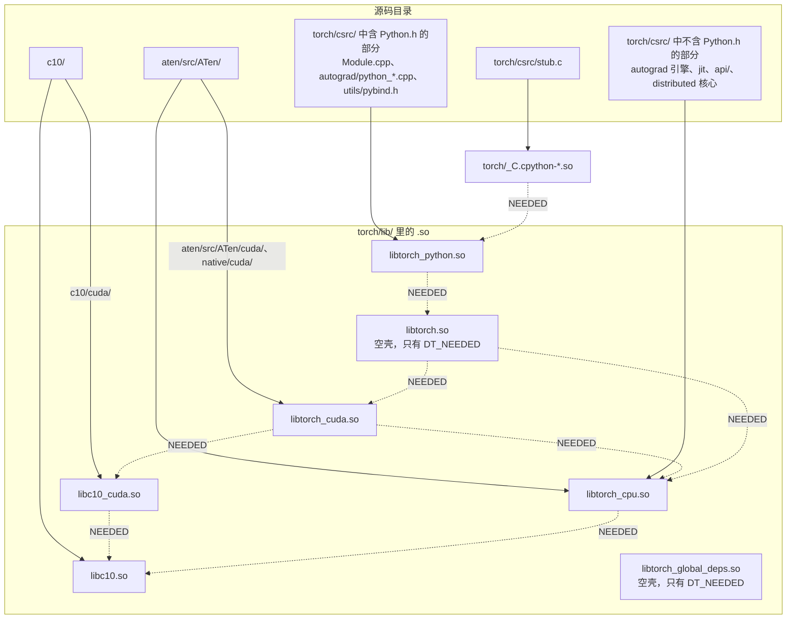

[上篇](/cpp-compilation-model-from-cpp-to-shared-object.html)讲的是**一个**翻译单元怎么变成一个 `.so`：预处理、编译、汇编、链接四个阶段，声明与定义、ODR、符号与可见性、动态链接。PyTorch 有几千个翻译单元，最终编成的不是一个 `.so` 而是十几个——`libc10.so`、`libtorch_cpu.so`、`libtorch_cuda.so`、`libtorch.so`、`libtorch_python.so`、`torch/_C.cpython-*.so`……本篇讲**几千个翻译单元怎么组织成几个库**：靠什么划分层次（命名空间）、每一层编成什么（库的分层）、谁来描述这些规则（CMake），以及自己动手搭一个同样结构的最小骨架。

Java 工程师在这里要放弃的直觉是**"一个包就是一个 jar"**。Java 里 `package`、目录、`.jar` 三者天然对齐；C++ 里命名空间、目录、库是三个**独立的维度**——`torch::` 命名空间横跨两个 `.so`，`c10/` 目录编成一个库但 `aten/` 目录编进 `torch_cpu`，而库与库之间的依赖写在 CMake 里而不是源码里。PyTorch 只是让这三个维度**大致**对齐，读懂它的目录结构就是读懂这三个维度各自的规则。

上篇开头那个 15 行的 `torch/csrc/stub.c` 在这里再贴一遍——它是 `import torch` 加载的第一个 C 文件，本篇第四章会逐行解释它编成什么、链到哪：

```c
#include <Python.h>

extern PyObject* initModule(void);

#ifndef _WIN32
#ifdef __cplusplus
extern "C"
#endif
__attribute__((visibility("default"))) PyObject* PyInit__C(void);
#endif

PyMODINIT_FUNC PyInit__C(void)
{
  return initModule();
}
```

本文要回答的核心问题是：

> **`import torch` 时加载了哪些 `.so`？[^q4] 它们之间是什么依赖关系？[^q5] 我写的扩展链接到哪一个？[^q6]**

PyTorch 在本篇里是被拆开看的样本，与系列其他篇一样——目的不是记住它的目录，而是学会看任何一个大 C++ 项目的目录时该问的三个问题：这个命名空间对应哪些库？这个目录编进哪个 `.so`？我的代码要用它，得链接哪一个？

## 一、总览

### 1. 三个独立的维度：命名空间、目录、库

上篇的参照系是"Java 一种产物 vs C++ 多种产物"，本篇的参照系是"Java 一个维度 vs C++ 三个维度"。Java 的 `package com.foo.bar` 同时决定了源码目录 `com/foo/bar/`、类的全名，以及它大概率在哪个 jar 里。C++ 里这三件事由三套互不相关的机制决定：**命名空间**是语言特性，只影响名字（与修饰后的符号名）；**目录**是构建系统的约定，CMake 决定哪些目录编进哪个库；**库**是链接器的产物，依赖关系写在 `target_link_libraries` 里。本篇按这个顺序展开，最后用 mini-c10 把三者亲手搭一遍。

### 2. 本文的章节安排

前三章是 PyTorch 的三个维度各是怎么划的，第五章动手搭一个同样结构的骨架，第六章是读任何大 C++ 项目时的定位技巧。

| 章 | 主题 | 内容 |
|---|---|---|
| 二 | 命名空间 | c10::、at::、torch:: 的分工；一个命名空间可以横跨多个库 |
| 三 | PyTorch 的源码布局与库布局 | c10/ -> aten/ -> torch/csrc/ 各编成什么；import torch 加载了什么；扩展链接到哪一个 |
| 四 | 回到源码 | `c10/CMakeLists.txt`、`caffe2/CMakeLists.txt`、`torch/CMakeLists.txt`、`stub.c`、`setup.py` |
| 五 | 实践二 | mini-c10 的目录结构与第一个可链接的库 |
| 六 | 工程实践建议与常见错误 | 按阶段定位错误、头文件卫生、链接与部署、读源码的定位技巧 |
| 七 | 本文小结 |  |
| 八 | 自测 | 3 道题 |

## 二、命名空间：`c10::`、`at::`、`torch::` 的分工

### 1. 命名空间的语法

C++ 的 `namespace` 和 Java 的 `package` 目的相同——避免名字冲突、给名字分层——但机制很不一样：

```cpp
namespace c10 {
struct Device { /* ... */ };
}                          // 可以在任意文件、任意多次“重新打开”同一个命名空间

namespace at::native {     // C++17：嵌套命名空间的简写
Tensor add(const Tensor& self, const Scalar& other, const Scalar& alpha);
}

c10::Device d(c10::DeviceType::CPU);   // 限定名
using c10::Device;                      // using 声明：引入一个名字
using namespace at;                     // using 指令：引入整个命名空间的所有名字
namespace ptx = ::cuda::ptx;            // 命名空间别名
```

与 Java `package` 的差别：

| Java `package` | C++ `namespace` |
|---|---|
| 一个文件属于一个 package | 一个文件可以打开任意多个命名空间，一个命名空间跨任意多个文件 |
| package 和目录结构一一对应 | 命名空间和目录无关（PyTorch 恰好让它们大致对应，这是约定不是规则） |
| `import` 引入类名，编译期 | `using` 引入名字，纯编译期，不影响二进制 |
| 没有"把一个包的所有名字注入另一个包"的手段 | `namespace torch { using namespace at; }` 可以（下面会看到） |
| 类名也是运行时身份（`Class.getName()`） | 命名空间只影响修饰后的符号名，运行时没有"命名空间"对象 |

匿名命名空间（[上篇第四章](/cpp-compilation-model-from-cpp-to-shared-object.html#四one-definition-rule同一个名字只能有一个定义)）是 Java 完全没有的：它的目的不是组织名字，而是控制链接属性。

### 2. 三个命名空间对应三个层次

PyTorch 的 C++ 源码分三层，每层一个主命名空间、一个主目录、一个（或一组）`.so`：

| 命名空间 | 目录 | 库 | 职责 | 典型类型 |
|---|---|---|---|---|
| `c10::` | `c10/` | `libc10.so`（CUDA 部分 `libc10_cuda.so`） | 最底层的核心抽象：Tensor 的元数据实现、设备、dtype、分配器、Dispatcher 的键、智能指针、错误处理。**不依赖任何算子**，不知道 `add` 是什么 | `c10::TensorImpl`、`c10::StorageImpl`、`c10::Device`、`c10::ScalarType`、`c10::intrusive_ptr`、`c10::DispatchKey`、`c10::Error` |
| `at::` | `aten/src/ATen/` | `libtorch_cpu.so`（CUDA 部分 `libtorch_cuda.so`） | "A Tensor library"：`Tensor` 句柄类、所有算子（`at::add`、`at::empty_like`）、Dispatcher 本体、CPU/CUDA kernel | `at::Tensor`、`at::TensorIterator`、`at::native::*`、`at::parallel_for`、`at::Dispatcher`（实际定义在 `c10::` 里，`at::` 有别名） |
| `torch::` | `torch/csrc/` | `libtorch_cpu.so`（Python 无关部分）+ `libtorch_python.so`（Python 绑定） | 面向用户的 C++ API（`torch::nn`、`torch::optim`）、Autograd 引擎、JIT、分布式、Python 绑定 | `torch::Tensor`（就是 `at::Tensor`）、`torch::autograd::Node`、`torch::jit::Graph`、`torch::Library` |

名字里的历史：c10 是 "Caffe2 + ATen → C-ten" 的谐音（Caffe2 是 PyTorch 1.0 时期合并进来的另一个框架），`caffe2/CMakeLists.txt` 这个文件名也是那时留下的——今天它是构建 `libtorch_cpu.so` 的主 CMake 文件，和 Caffe2 框架已经没有关系。

依赖方向是单向的：`torch::` 依赖 `at::` 依赖 `c10::`。`c10/CMakeLists.txt` 开头的注释说得很直接：

```cmake
# Main build file for the C10 library.
#
# Note that the C10 library should maintain minimal dependencies - especially,
# it should not depend on any library that is implementation specific or
# backend specific. It should in particular NOT be dependent on any generated
# protobuf header files, because protobuf header files will transitively force
# one to link against a specific protobuf version.
```

### 3. `torch::` 如何"包含"`at::`

读 libtorch C++ 代码时会看到 `torch::Tensor`、`torch::ones`、`torch::kFloat`，读 ATen 代码时看到的是 `at::Tensor`、`at::ones`、`at::kFloat`。它们是同一个东西。`torch/csrc/api/include/torch/types.h`：

```cpp
namespace torch {

// NOTE [ Exposing declarations in `at::` to `torch::` ]
//
// The following line `using namespace at;` is responsible for exposing all
// declarations in `at::` namespace to `torch::` namespace.
//
// ...
// This means that if both `at::` and `torch::` namespaces have a function with
// the same signature (e.g. both `at::func()` and `torch::func()` exist), after
// `namespace torch { using namespace at; }`, when we call `torch::func()`, the
// `func()` function defined in `torch::` namespace will always be called, and
// the `func()` function defined in `at::` namespace is always hidden.
using namespace at; // NOLINT

// ...

using Dtype = at::ScalarType;

/// Fixed width dtypes.
constexpr auto kUInt8 = at::kByte;
constexpr auto kInt8 = at::kChar;
// ...
constexpr auto kFloat32 = at::kFloat;
constexpr auto kFloat64 = at::kDouble;
```

`namespace torch { using namespace at; }` 让所有 `at::` 里的名字可以通过 `torch::` 找到。注释解释了一个微妙之处：如果 `torch::` 自己也定义了同名函数，`torch::func()` 优先——这被用来让 `torch::ones(...)` 指向 `torch/csrc/autograd/generated/variable_factories.h` 里带 Autograd 支持的版本，而不是 `at::ones`。这是 `using namespace` 作为**接口分层手段**的用法，Java 没有对应物。

类似地，`c10/core/DeviceType.h` 末尾：

```cpp
namespace torch {
// NOLINTNEXTLINE(misc-unused-using-decls)
using c10::DeviceType;
} // namespace torch
```

以及 `torch/csrc/autograd/variable.h` 里 `using Variable = at::Tensor;`——早年 `Variable` 和 `Tensor` 是两个类，合并后留下这个别名。读老代码看到 `Variable` 就当 `Tensor`。

### 4. 其他常见子命名空间

| 命名空间 | 含义 |
|---|---|
| `at::native::` | 算子的"原生"实现（`aten/src/ATen/native/`），即 `native_functions.yaml` 里 `dispatch:` 指向的函数 |
| `at::cuda::`、`c10::cuda::` | CUDA 相关（stream、guard、allocator） |
| `c10::impl::`、`at::impl::`、`torch::detail::` | 实现细节，用户不应直接依赖 |
| `torch::autograd::` | Autograd 引擎 |
| `torch::jit::` | TorchScript |
| `torch::nn::`、`torch::optim::`、`torch::data::` | C++ 前端 |
| `torch::headeronly::` | 2.x 新增，不依赖 libtorch 的纯头文件工具（`torch/headeronly/`） |
| `torch::stable::` | 2.x 新增的稳定 ABI 层（`torch/csrc/stable/`），供扩展跨 PyTorch 版本使用；vLLM 0.15 尚未使用 |

vLLM 的 `csrc/` 没有自己的顶层命名空间约定，大部分 kernel 直接写在 `namespace vllm { ... }` 里，调用 PyTorch 时用 `torch::Tensor`。

### 5. 一个命名空间可以横跨多个库

命名空间和库没有对应关系，这一点必须明确。`torch::` 命名空间里的 `torch::autograd::Engine` 在 `libtorch_cpu.so`（`torch/csrc/autograd/engine.cpp` 在 `build_variables.bzl` 的 `libtorch_core_sources` 列表里），而 `torch::autograd::THPVariable_Wrap` 在 `libtorch_python.so`（`torch/csrc/autograd/python_variable.cpp` 在 `libtorch_python_core_sources` 里）。同一个目录 `torch/csrc/autograd/`、同一个命名空间，两个库。区分它们的规则是**是否 `#include <Python.h>`**：碰 Python 对象的进 `libtorch_python.so`，不碰的进 `libtorch_cpu.so`。`torch/csrc/README.md` 开头一句话说明了这个分界：

```text
The csrc directory contains all of the code concerned with integration
with Python.  This is in contrast to lib, which contains the Torch
libraries that are Python agnostic.  csrc depends on lib, but not vice
versa.
```

（这段话是老的：如今 `torch/csrc/` 里也有大量 Python 无关代码，但"Python 相关依赖 Python 无关，反之不成立"这条原则没变。）

## 三、PyTorch 的源码布局与库布局

### 1. 目录 → 库



实线是"源码编进哪个库"，虚线是"库依赖哪个库"（`DT_NEEDED`）。图中省略了 `libshm.so`（`torch/lib/libshm/`，共享内存管理，`libtorch_python.so` 依赖它）以及 MKL、OpenMP、cudart、cuDNN、NCCL 等第三方库。

### 2. 每一层编成什么

**`c10/` → `libc10.so`**。`c10/CMakeLists.txt` 用 `file(GLOB ...)` 收集 `c10/*.cpp`、`core/`、`core/impl/`、`mobile/`、`macros/`、`util/` 下的所有 `.cpp`，`add_library(c10 ...)` 编成一个库。`c10/cuda/` 单独编成 `libc10_cuda.so`（`c10/cuda/CMakeLists.txt`：`torch_cuda_based_add_library(c10_cuda ...)`，`target_link_libraries(c10_cuda PUBLIC ${C10_LIB} torch::cudart)`）。

**`aten/` + `torch/csrc/`（Python 无关部分）→ `libtorch_cpu.so`**。这是最大的库（CPU wheel 里几百 MB）。`caffe2/CMakeLists.txt` 第 47 行 `add_subdirectory(../aten aten)` 让 `aten/src/ATen/CMakeLists.txt` 收集 ATen 的源文件到 `ATen_CPU_SRCS`，第 55 行 `list(APPEND Caffe2_CPU_SRCS ${ATen_CPU_SRCS})` 合并；`torch/csrc/` 的 Python 无关源文件通过 `append_filelist("libtorch_cmake_sources" ...)` 从 `build_variables.bzl` 读取（这个 `.bzl` 文件是 CMake 和 Buck 两套构建系统共用的源文件清单）。最后 `add_library(torch_cpu ${Caffe2_CPU_SRCS})`。

**CUDA 部分 → `libtorch_cuda.so`**。`aten/src/ATen/cuda/`、`aten/src/ATen/native/cuda/`、`torch/csrc/cuda/` 的非 Python 部分，`add_library(torch_cuda ...)`。ROCm 对应 `libtorch_hip.so`，XPU 对应 `libtorch_xpu.so`。

**`libtorch.so`**：一个空壳。`caffe2/CMakeLists.txt`：

```cmake
# Wrapper library for people who link against torch and expect both CPU and CUDA support
# Contains "torch_cpu" and "torch_cuda"
add_library(torch ${DUMMY_EMPTY_FILE})
# ...
target_link_libraries(torch PUBLIC torch_cpu_library)

if(USE_CUDA)
  target_link_libraries(torch PUBLIC torch_cuda_library)
elseif(USE_ROCM)
  target_link_libraries(torch PUBLIC torch_hip_library)
endif()
```

它由一个空文件（`${CMAKE_BINARY_DIR}/empty.cpp`）编出来，自身没有代码，只有 `DT_NEEDED: libtorch_cpu.so`、`libtorch_cuda.so`。存在的意义是让下游只需写 `-ltorch` 就同时拿到 CPU 和 CUDA 两个库，不用关心装的是哪种 build。

**`torch/csrc/`（Python 部分）→ `libtorch_python.so`**。`torch/CMakeLists.txt`：`add_library(torch_python SHARED ${TORCH_PYTHON_SRCS})`，源文件来自 `build_variables.bzl` 的 `libtorch_python_core_sources`（`torch/csrc/Module.cpp`、`torch/csrc/autograd/python_variable.cpp` 等），加上 torchgen 生成的 Python 绑定代码 `${GENERATED_CXX_PYTHON}`。链接 `${TORCH_LIB}`（即 `torch`）和 `Python::Module`、`pybind::pybind11`、`shm` 等。

**`torch/csrc/stub.c` → `torch/_C.cpython-*.so`**。15 行的 stub 单独编成 Python 扩展模块，链接 `torch_python`。它是整个 PyTorch 里唯一不由 CMake 编译的二进制：`setup.py` 把它声明为 setuptools 的 `Extension("torch._C", sources=["torch/csrc/stub.c"], libraries=["torch_python"], ...)`，由 setuptools 的 `build_ext` 在 CMake 构建完成之后编译（4.4 节）。

为什么要一个 stub 而不是把 `libtorch_python.so` 直接命名为 `_C.so`？因为 Python 扩展模块的文件名必须是 `_C.cpython-312-x86_64-linux-gnu.so` 这种带 ABI tag 的形式，且放在 `torch/` 包目录下；而 `libtorch_python.so` 需要一个稳定的 SONAME 放在 `torch/lib/` 供其他 C++ 扩展链接（`torch.utils.cpp_extension` 的默认库列表里有 `torch_python`）。一个 15 行的 stub 把两个需求解耦。

### 3. `import torch` 时加载了什么

按时间顺序：

1. Python 执行 `torch/__init__.py`；
2. `_load_global_deps()`：`ctypes.CDLL("torch/lib/libtorch_global_deps.so", RTLD_GLOBAL)`。`ld.so` 递归加载它的 `DT_NEEDED`：MKL（`libmkl_*.so`，如果用了）、OpenMP（`libgomp.so`/`libiomp5.so`）、CUDA build 还有 `libcudart.so.12`、`libcublas.so.12`、`libcudnn.so.9`、`libnccl.so.2` 等——用 `RTLD_GLOBAL`，符号全局可见；
3. `from torch._C import *`：Python `dlopen("torch/_C.cpython-312-x86_64-linux-gnu.so", RTLD_LOCAL)`。`ld.so` 按它的 RPATH `$ORIGIN/lib` 找到 `libtorch_python.so`，再递归：`libtorch.so` → `libtorch_cpu.so`、`libtorch_cuda.so` → `libc10.so`、`libc10_cuda.so`、`libshm.so`……已经在第 2 步加载过的库（cudart 等）直接复用；
4. 所有库加载完成后，**运行每个库的静态初始化代码**——这就是几千个算子被注册进 Dispatcher 的时刻（第五篇）；
5. Python 调 `dlsym("PyInit__C")` → `stub.c` 的 `PyInit__C` → `Module.cpp` 的 `initModule()`，创建 `torch._C` 模块对象，注册 `Tensor` 类型等；
6. 回到 `torch/__init__.py` 继续导入 Python 子模块。

在一台装了 CPU wheel 的 Linux 机器上，可以这样验证：

```bash
cd $(python -c 'import torch, os; print(os.path.dirname(torch.__file__))')
ls lib/
ldd _C.cpython-*.so
ldd lib/libtorch_python.so | grep torch
readelf -d lib/libtorch.so | grep NEEDED
```

在一份 macOS 的 CPU wheel（`torch==2.14.0`）上实际看到的（`ldd` 换成 `otool -L`，`readelf -d` 换成 `otool -l`；Linux 上文件名是 `.so`、`ldd` 会直接印出解析后的绝对路径，其余相同）：

```text
$ ls lib/
libc10.dylib  libomp.dylib  libshm.dylib  libtorch.dylib  libtorch_cpu.dylib
libtorch_global_deps.dylib  libtorch_python.dylib

$ otool -L _C.cpython-312-darwin.so
	@loader_path/lib/libtorch_python.dylib
	/usr/lib/libSystem.B.dylib

$ otool -L lib/libtorch_python.dylib | grep -E 'torch|c10|shm'
	@loader_path/libtorch.dylib
	@loader_path/libshm.dylib
	@loader_path/libtorch_cpu.dylib
	@loader_path/libc10.dylib

$ otool -L lib/libtorch.dylib | grep -E 'torch|c10'
	@loader_path/libtorch_cpu.dylib
	@loader_path/libc10.dylib

$ nm -C _C.cpython-312-darwin.so | grep -E 'PyInit|initModule'
0000000000000d48 T _PyInit__C
                 U _initModule
```

逐行对回前面几节：`_C` 只依赖 `libtorch_python`（加系统库），它的符号表里只有一个定义 `PyInit__C` 和一个引用 `initModule`——就是 `stub.c` 那 15 行；`libtorch_python` 依赖 `libtorch`、`libtorch_cpu`、`libc10`、`libshm`；`libtorch` 这个"空壳"自己只依赖 `libtorch_cpu` 与 `libc10`。`@loader_path/lib` 就是 Linux 上的 `$ORIGIN/lib`（[上篇 6.2 节](/cpp-compilation-model-from-cpp-to-shared-object.html)）。

CUDA wheel 会多出 `libtorch_cuda.so`、`libc10_cuda.so`，以及 `libcudart.so.12` 等指向 `nvidia/*/lib/` 的条目（PyTorch 2.x 中的变化：CUDA 库从 wheel 内 `torch/lib/` 拆成了独立的 `nvidia-*-cu12` PyPI 包，`_load_global_deps` 里的 `_preload_cuda_deps` 就是为此而写）。

也可以在 Python 进程里直接看哪些库已被映射：

```python
import torch
print(open("/proc/self/maps").read().count("libtorch_cpu.so") > 0)
```

（`torch/__init__.py` 自己就在 `_load_global_deps` 里读 `/proc/self/maps` 判断 `libcudart.so` 是否已加载。）

### 4. 我写的扩展链接到哪一个

一个 C++ 扩展（用 `torch.utils.cpp_extension` 编出来的 `.so`）会引用三类符号：

| 用到的东西 | 符号在哪个库 | 需要的 `-l` |
|---|---|---|
| `c10::Device`、`c10::intrusive_ptr`、`TORCH_CHECK` 抛的 `c10::Error` | `libc10.so` | `-lc10` |
| `at::Tensor` 的方法、`at::empty_like`、`at::parallel_for`、`torch::Library`（`TORCH_LIBRARY` 宏） | `libtorch_cpu.so` | `-ltorch_cpu`（或 `-ltorch` 间接） |
| CUDA stream、`c10::cuda::CUDAGuard` | `libc10_cuda.so`、`libtorch_cuda.so` | `-lc10_cuda -ltorch_cuda` |
| pybind11 的 `at::Tensor` 类型转换器、`THPVariable_Wrap` | `libtorch_python.so` | `-ltorch_python` |

`torch/utils/cpp_extension.py` 的 `CppExtension` 函数替你把这些加上：

```python
    libraries = kwargs.get('libraries', [])
    libraries.append('c10')
    libraries.append('torch')
    libraries.append('torch_cpu')
    if not kwargs.get('py_limited_api', False):
        # torch_python uses more than the python limited api
        libraries.append('torch_python')
    if IS_WINDOWS:
        libraries.append("sleef")
```

`CUDAExtension` 再加：

```python
    if IS_HIP_EXTENSION:
        libraries.append('amdhip64')
        libraries.append('c10_hip')
        libraries.append('torch_hip')
    else:
        libraries.append('cudart')
        libraries.append('c10_cuda')
        libraries.append('torch_cuda')
```

注意 `torch_python` 是有条件的：如果扩展声明了 `py_limited_api=True`（只用 Python 稳定 ABI，以便一个 `.so` 跑在多个 Python 版本上），就不能链接 `libtorch_python.so`，因为后者用了非稳定 API——这意味着扩展里不能用 pybind11 的 `at::Tensor` caster，只能走 `TORCH_LIBRARY` 注册算子、由 `torch.ops` 调用。这正是 vLLM 的选择（第七篇）。

对照 vLLM。`vllm/CMakeLists.txt`：

```cmake
#
# Update cmake's `CMAKE_PREFIX_PATH` with torch location.
#
append_cmake_prefix_path("torch" "torch.utils.cmake_prefix_path")
# ...
#
# Import torch cmake configuration.
# Torch also imports CUDA (and partially HIP) languages with some customizations,
# so there is no need to do this explicitly with check_language/enable_language,
# etc.
#
find_package(Torch REQUIRED)
```

`append_cmake_prefix_path`（`cmake/utils.cmake`）运行 `python -c "import torch; print(torch.utils.cmake_prefix_path)"` 拿到 `site-packages/torch/share/cmake`，`find_package(Torch)` 在那里找到 `TorchConfig.cmake`（源码是 PyTorch 的 `cmake/TorchConfig.cmake.in`），它定义一个导入目标 `torch`，带上头文件路径和所有依赖库。然后 `cmake/utils.cmake` 的 `define_extension_target` 函数：

```cmake
  Python_add_library(${MOD_NAME} MODULE USE_SABI ${ARG_USE_SABI} ${SOABI_KEYWORD} "${ARG_SOURCES}")
  # ...
  target_compile_definitions(${MOD_NAME} PRIVATE
    "-DTORCH_EXTENSION_NAME=${MOD_NAME}")

  target_link_libraries(${MOD_NAME} PRIVATE torch ${ARG_LIBRARIES})

  # Don't use `TORCH_LIBRARIES` for CUDA since it pulls in a bunch of
  # dependencies that are not necessary and may not be installed.
  if (ARG_LANGUAGE STREQUAL "CUDA")
    target_link_libraries(${MOD_NAME} PRIVATE torch CUDA::cudart CUDA::cuda_driver ${ARG_LIBRARIES})
  else()
    target_link_libraries(${MOD_NAME} PRIVATE torch ${TORCH_LIBRARIES} ${ARG_LIBRARIES})
  endif()
```

`USE_SABI 3` 是 Python 稳定 ABI，`target_link_libraries(... torch ...)` 只链接 `libtorch.so`（间接拿到 `libtorch_cpu.so`、`libtorch_cuda.so`、`libc10.so`），**不链接 `libtorch_python.so`**。所以 vLLM 的 `_C.abi3.so` 和 PyTorch 的交互只有 `TORCH_LIBRARY` 注册算子这一条路。

### 5. `torch/headeronly/`：一个新的层

PyTorch 2.x 中的变化：2.8 之后源码树里多了 `torch/headeronly/`，它在 CMake 里是一个 `INTERFACE` 库（`torch/headeronly/CMakeLists.txt`：`add_library(headeronly INTERFACE ${HEADERONLY_HEADERS})`），没有任何 `.cpp`，不产生 `.so`。`c10` 链接它（`c10/CMakeLists.txt`：`target_link_libraries(c10 PUBLIC headeronly)`）只是为了继承头文件路径。`torch/headeronly/README.md` 解释了目的：让 `ScalarType`、`Half`、`BFloat16`、`STD_TORCH_CHECK` 这些不依赖 `libtorch` 的工具可以被扩展在**不链接任何 PyTorch 库**的前提下使用，配合 `torch/csrc/stable/` 的稳定 ABI，让一个扩展二进制能跨多个 PyTorch 版本工作。这是 PyTorch 对本文所讨论的"链接"问题的最新回应。

## 四、回到源码

带着前面七节的概念，把总纲清单里的文件逐段读一遍。

### 1. `c10/CMakeLists.txt`：最底层的库

```cmake
cmake_minimum_required(VERSION 3.27 FATAL_ERROR)
project(c10 CXX)

set(CMAKE_CXX_STANDARD 17 CACHE STRING "The C++ standard whose features are requested to build this target.")
set(CMAKE_EXPORT_COMPILE_COMMANDS ON)
```

第一个值得注意的地方：**`CMAKE_CXX_STANDARD 17`**。v2.10.0 顶层 `CMakeLists.txt` 第 47 行同样是 `set(CMAKE_CXX_STANDARD 17 ...)`，前面几行还会检查环境变量里有没有人塞了 `-std=c++`，有就警告"PyTorch requires -std=c++17"；`torch/utils/cpp_extension.py` 给扩展传的也是 `-std=c++17`（`cpp_flag_prefix + 'c++17'`，nvcc 同样 `-std=c++17`）；vLLM v0.15.0 的 `CMakeLists.txt` 亦是 `set(CMAKE_CXX_STANDARD 17)`。本系列以 C++17 为基线讲解语言特性，与二者一致。PyTorch 源码里对 C++20 特性只有零星的条件编译（如 `torch/headeronly/util/bit_cast.h` 在 `__cpp_lib_bit_cast` 可用时才用 `std::bit_cast`，否则自己实现），并不要求编译器开启 C++20。**编译扩展时的 `-std=` 参数要跟 PyTorch 保持一致**，第十章的 g++ 命令会用 `-std=c++17`。

`CMAKE_EXPORT_COMPILE_COMMANDS ON` 生成 `compile_commands.json`，clangd 靠它理解项目（第八篇）。

```cmake
  file(GLOB C10_SRCS
          *.cpp
          core/*.cpp
          core/impl/*.cpp
          mobile/*.cpp
          macros/*.cpp
          util/*.cpp
        )
  file(GLOB C10_HEADERS
          *.h
          core/*.h
          # ...
        )
if(NOT BUILD_LIBTORCHLESS)
  add_library(c10 ${C10_SRCS} ${C10_HEADERS})
  torch_compile_options(c10)
```

`file(GLOB ...)` 按通配符收集源文件——注意 `c10/cuda/` 不在列表里，它是另一个库。`add_library(c10 ...)` 没写 `SHARED`/`STATIC`，由全局变量 `BUILD_SHARED_LIBS` 决定，默认 ON，所以是 `libc10.so`。`torch_compile_options(c10)` 就是 [上篇 5.4 节](/cpp-compilation-model-from-cpp-to-shared-object.html)看到的那个函数，加上 `-fvisibility=hidden` 和一堆警告选项。

```cmake
  # If building shared library, set dllimport/dllexport proper.
  target_compile_options(c10 PRIVATE "-DC10_BUILD_MAIN_LIB")
  # Enable hidden visibility if compiler supports it.
  if(${COMPILER_SUPPORTS_HIDDEN_VISIBILITY})
    target_compile_options(c10 PRIVATE "-fvisibility=hidden")
  endif()
```

`-DC10_BUILD_MAIN_LIB` 只在编译 `c10` 自己的源文件时定义（`PRIVATE`），于是 `C10_API` 在 `libc10.so` 内部展开成"导出"，在所有使用者那里展开成"导入"（Linux 上两者一样，Windows 上不同）。

```cmake
  target_link_libraries(c10 PUBLIC headeronly)
  target_link_libraries(c10 PRIVATE fmt::fmt-header-only)
  target_link_libraries(c10 PRIVATE nlohmann)
  target_link_libraries(c10 PRIVATE moodycamel)
  # ...
  if(LINUX)
    target_link_libraries(c10 PRIVATE Threads::Threads)
    target_link_libraries(c10 PRIVATE dl)
  endif()
```

`PUBLIC` 表示"我依赖它，链接我的人也自动依赖它"；`PRIVATE` 表示"只有我内部用"。`headeronly` 是 `PUBLIC`（使用者需要它的头文件路径），`fmt`、`nlohmann`（JSON）、`moodycamel`（无锁队列）是 `PRIVATE`（实现细节，不暴露）。`dl` 是 `dlopen` 所在的库。这些关键字的完整语义在第八篇。

```cmake
  target_include_directories(
      c10 PUBLIC
      $<BUILD_INTERFACE:${CMAKE_CURRENT_SOURCE_DIR}/../>
      $<BUILD_INTERFACE:${CMAKE_BINARY_DIR}>
      $<INSTALL_INTERFACE:include>)
```

头文件搜索路径是 `c10/` 的**父目录**（源码树根），所以源码里写 `#include <c10/core/Device.h>` 而不是 `#include <core/Device.h>`——这就是 PyTorch 所有 `#include` 都从仓库根开始写的原因。安装后对应 `site-packages/torch/include/`。

```cmake
if(NOT BUILD_LIBTORCHLESS)
  # ---[ Installation
  # Note: for now, we will put all export path into one single Caffe2Targets group
  # to deal with the cmake deployment need. Inside the Caffe2Targets set, the
  # individual libraries like libc10.so and libcaffe2.so are still self-contained.
  install(TARGETS c10 EXPORT Caffe2Targets DESTINATION lib)
endif()

install(DIRECTORY ${CMAKE_CURRENT_LIST_DIR}
        DESTINATION include
        FILES_MATCHING PATTERN "*.h")
```

`install(TARGETS c10 EXPORT Caffe2Targets ...)` 把 `c10` 加入导出集合 `Caffe2Targets`，这个集合最终生成 `share/cmake/Caffe2/Caffe2Targets.cmake`，被 `TorchConfig.cmake` 包含——这就是 vLLM `find_package(Torch)` 之后能拿到 `c10` 这个目标的链路。第二个 `install` 把所有 `.h` 拷到 `include/c10/`。

### 2. `caffe2/CMakeLists.txt`：`torch_cpu`、`torch_cuda`、`torch`

这个 2000 多行的文件是 `libtorch_cpu.so` 的主构建脚本。关键片段：

```cmake
if(NOT BUILD_LIBTORCHLESS)
add_library(torch_cpu ${Caffe2_CPU_SRCS})
if(HAVE_SOVERSION)
  set_target_properties(torch_cpu PROPERTIES
      VERSION ${TORCH_VERSION} SOVERSION ${TORCH_SOVERSION})
endif()
torch_compile_options(torch_cpu)  # see cmake/public/utils.cmake
```

`Caffe2_CPU_SRCS` 在前面几百行里被一步步 `list(APPEND ...)` 填满：ATen 的 `ATen_CPU_SRCS`、`build_variables.bzl` 里的 `libtorch_cmake_sources`、torchgen 生成的 `GENERATED_CXX_TORCH`……并按 [上篇 4.3 节](/cpp-compilation-model-from-cpp-to-shared-object.html)说的 AVX 顺序排列。`SOVERSION` 决定 `libtorch_cpu.so` 是否带版本后缀（pip wheel 里不带）。

```cmake
target_link_libraries(torch_cpu PUBLIC c10)
target_link_libraries(torch_cpu PUBLIC ${Caffe2_PUBLIC_DEPENDENCY_LIBS})
target_link_libraries(torch_cpu PRIVATE ${Caffe2_DEPENDENCY_LIBS})
target_link_libraries(torch_cpu PRIVATE ${Caffe2_DEPENDENCY_WHOLE_LINK_LIBS})
# ...
target_compile_definitions(torch_cpu PRIVATE CAFFE2_BUILD_MAIN_LIB)
if(USE_CUDA)
  target_compile_definitions(torch_cpu PRIVATE TORCH_CUDA_BUILD_MAIN_LIB)
endif()
```

`torch_cpu PUBLIC c10`：`libtorch_cpu.so` 依赖 `libc10.so`，且链接 `torch_cpu` 的人自动链接 `c10`。`CAFFE2_BUILD_MAIN_LIB` 让 `TORCH_API` 在这个库里展开成导出（[上篇 5.4 节](/cpp-compilation-model-from-cpp-to-shared-object.html)）。`Caffe2_DEPENDENCY_WHOLE_LINK_LIBS` 是需要 `--whole-archive` 链接的静态库（[上篇 5.3 节](/cpp-compilation-model-from-cpp-to-shared-object.html)讨论的静态注册问题）。

CUDA 库：

```cmake
elseif(USE_CUDA)
  # ...
    add_library(torch_cuda ${Caffe2_GPU_SRCS} ${Caffe2_GPU_CU_SRCS})
  # ...
  torch_compile_options(torch_cuda)  # see cmake/public/utils.cmake
  target_compile_definitions(torch_cuda PRIVATE USE_CUDA)
```

```cmake
# ---[ CUDA library.
if(USE_CUDA)
  # ...
  target_link_libraries(torch_cuda INTERFACE torch::cudart)
  target_link_libraries(torch_cuda PUBLIC c10_cuda)
  # ...
  target_link_libraries(torch_cuda PUBLIC torch_cpu_library ${Caffe2_PUBLIC_CUDA_DEPENDENCY_LIBS})
```

`libtorch_cuda.so` 依赖 `libc10_cuda.so` 和 `libtorch_cpu.so`。`torch_cpu_library` 是 `caffe2_interface_library(torch_cpu torch_cpu_library)` 生成的接口目标，处理一些链接顺序和 whole-archive 细节。

空壳 `torch` 目标（3.2 节已引）在这两个之后定义，用 `PUBLIC` 依赖把它们串起来。`install(TARGETS torch_cpu torch_cpu_library EXPORT Caffe2Targets ...)`、`install(TARGETS torch torch_library EXPORT Caffe2Targets ...)` 把它们加进同一个导出集合。

### 3. `torch/CMakeLists.txt` 与 `torch/csrc/stub.c`：Python 绑定

```cmake
set(TORCH_PYTHON_SRCS
    ${GENERATED_THNN_CXX}
    ${GENERATED_CXX_PYTHON}
    )
append_filelist("libtorch_python_core_sources" TORCH_PYTHON_SRCS)
```

源文件 = torchgen 生成的 Python 绑定 + `build_variables.bzl` 里的 `libtorch_python_core_sources`（`torch/csrc/Module.cpp`、`torch/csrc/autograd/python_variable.cpp` 等）。

```cmake
set(TORCH_PYTHON_LINK_LIBRARIES
    Python::Module
    pybind::pybind11
    opentelemetry::api
    httplib
    nlohmann
    moodycamel
    shm
    fmt::fmt-header-only
    ATEN_CPU_FILES_GEN_LIB)
```

`Python::Module` 是 CMake 的 `FindPython` 提供的目标，带 `Python.h` 的路径；`pybind::pybind11` 是第七篇的主角；`shm` 是 `libshm.so`。

```cmake
add_library(torch_python SHARED ${TORCH_PYTHON_SRCS})
torch_compile_options(torch_python)  # see cmake/public/utils.cmake
if(APPLE)
  target_compile_options(torch_python PRIVATE
      $<$<COMPILE_LANGUAGE:CXX>: -fvisibility=default>)
endif()
# ...
target_compile_definitions(torch_python PRIVATE "-DTHP_BUILD_MAIN_LIB")

target_link_libraries(torch_python PRIVATE ${TORCH_LIB} ${TORCH_PYTHON_LINK_LIBRARIES})
```

这里显式写了 `SHARED`——`libtorch_python.so` 永远是动态库。`THP_BUILD_MAIN_LIB` 对应 `torch/csrc/Export.h` 里的 `TORCH_PYTHON_API`（`THP` = TorcH Python，老前缀）。`${TORCH_LIB}` 是 `torch`，即 3.2 节的空壳，间接带来 `torch_cpu`、`torch_cuda`、`c10`。注意是 `PRIVATE`——链接 `torch_python` 的人（`_C`）不会自动传递依赖，但因为动态库的 `DT_NEEDED` 是递归加载的，运行时还是全部会被加载。

然后是 `_C`。它不在 `torch/CMakeLists.txt` 里——这是 PyTorch 里唯一由 setuptools 而不是 CMake 编译的二进制。`setup.py` 的 `configure_extension_build()`：

```python
    main_compile_args: list[str] = []
    main_libraries: list[str] = ["torch_python"]

    main_link_args: list[str] = []
    main_sources: list[str] = ["torch/csrc/stub.c"]

    if BUILD_LIBTORCH_WHL:
        main_libraries = ["torch"]
        main_sources = []
    # ...
    C = Extension(
        "torch._C",
        libraries=main_libraries,
        sources=main_sources,
        language="c",
        extra_compile_args=[
            *main_compile_args,
            *extra_compile_args,
        ],
        include_dirs=[],
        library_dirs=library_dirs,
        extra_link_args=[
            *extra_link_args,
            *main_link_args,
            *make_relative_rpath_args("lib"),
        ],
    )
    ext_modules.append(C)
```

setuptools 的 `Extension` 就是 Python 扩展模块的标准描述：`language="c"` 用 C 编译器编 `stub.c`（所以 `__cplusplus` 不会被定义，[上篇 2.2 节](/cpp-compilation-model-from-cpp-to-shared-object.html)），产物自动带 `.cpython-312-x86_64-linux-gnu` 后缀；`libraries=["torch_python"]` 加 `library_dirs=[torch/lib]` 就是 `-L torch/lib -ltorch_python`；`make_relative_rpath_args("lib")` 是 [上篇 6.2 节](/cpp-compilation-model-from-cpp-to-shared-object.html)讲的 `-Wl,-rpath,$ORIGIN/lib`。`BUILD_LIBTORCH_WHL` 是 split build 的 libtorch 半边，那时不需要 `_C`，后面 `ext_modules = []` 直接清空。

现在回到开头的 `stub.c`（上篇用它引出编译模型，本篇用它收尾），每一行都能解释了：

```c
#include <Python.h>                         // PyObject、PyMODINIT_FUNC 的声明

extern PyObject* initModule(void);          // 声明：定义在 libtorch_python.so 的 Module.cpp 里，
                                            // 那边用 extern "C" 保证符号名就是 initModule

#ifndef _WIN32                              // 预处理：非 Windows 才需要显式 visibility
#ifdef __cplusplus                          // 预处理：如果被当 C++ 编译（实际是 .c，不会）
extern "C"
#endif
__attribute__((visibility("default"))) PyObject* PyInit__C(void);   // 声明并标记导出
#endif

PyMODINIT_FUNC PyInit__C(void)              // 定义：Python 解释器 dlsym 的入口
{
  return initModule();                      // 转发。链接期解析到 libtorch_python.so 的 initModule
}
```

这个文件编成 `_C.cpython-*.so`，它的符号表只有寥寥几行：`T PyInit__C`，`U initModule`，以及 libc 的东西（3.3 节实际看过）。它就是一个把 Python 的入口约定翻译给 C++ 世界的转接头。

### 4. `setup.py`：`.so` 如何进 wheel

v2.10.0 的 `setup.py` 分两步：`main()` 先调 `build_deps()`，由 `tools/setup_helpers/cmake.py` 运行 CMake 把 `libc10.so`、`libtorch_cpu.so`、`libtorch_python.so` 等全部编好、安装到 `torch/lib/`；然后交给 setuptools，它只编译 4.3 节那个 `Extension("torch._C", ...)`（setuptools 自带的 `build_ext` 被子类化，加了拷贝 Windows 导出库、生成 `compile_commands.json` 等杂事），并按 `package_data` 决定把哪些文件打进 wheel。关键片段：

```python
BUILD_LIBTORCH_WHL = str2bool(os.getenv("BUILD_LIBTORCH_WHL"))
BUILD_PYTHON_ONLY = str2bool(os.getenv("BUILD_PYTHON_ONLY"))

if BUILD_PYTHON_ONLY:
    os.environ["BUILD_LIBTORCHLESS"] = "ON"
    os.environ["LIBTORCH_LIB_PATH"] = (_get_package_path("torch") / "lib").as_posix()
```

```python
    torch_package_data = [
        "py.typed",
        "bin/*",
        "test/*",
        "*.pyi",
        "**/*.pyi",
        # ...
        "lib/*shm*",
        "lib/torch_shm_manager",
        "lib/*.h",
        "lib/**/*.h",
        "include/*.h",
        "include/**/*.h",
        # ...
        "share/cmake/ATen/*.cmake",
        "share/cmake/Caffe2/*.cmake",
        # ...
        "share/cmake/Torch/*.cmake",
        # ...
    ]

    if not BUILD_LIBTORCH_WHL:
        torch_package_data += [
            "lib/libtorch_python.so",
            "lib/libtorch_python.dylib",
            "lib/libtorch_python.dll",
        ]
    if not BUILD_PYTHON_ONLY:
        torch_package_data += [
            "lib/*.so*",
            "lib/*.dylib*",
            "lib/*.dll",
            "lib/*.lib",
        ]
```

```python
    if not BUILD_LIBTORCH_WHL:
        package_data["torchgen"] = torchgen_package_data
        exclude_package_data["torchgen"] = ["*.py[co]"]
    else:
        # no extensions in BUILD_LIBTORCH_WHL mode
        ext_modules = []

    setup(
        name=TORCH_PACKAGE_NAME,
        version=TORCH_VERSION,
        ext_modules=ext_modules,
        cmdclass=cmdclass,
        packages=packages,
        entry_points=entry_points,
        install_requires=install_requires,
        package_data=package_data,
        # ...
```

三类东西进 wheel：`_C.cpython-*.so`（setuptools 作为 `ext_modules` 编出来，自动放在包根目录）、`lib/*.so*`（CMake 装进 `torch/lib/` 的所有动态库，作为 `package_data` 原样打包）、`include/**/*.h` + `share/cmake/**/*.cmake`（让下游能编译和链接扩展）。`BUILD_LIBTORCH_WHL` 和 `BUILD_PYTHON_ONLY` 两个环境变量开关对应"split build"：把 `libtorch.so` 及依赖单独打一个叫 `torch_no_python` 的 wheel（不带 `_C`，`ext_modules = []`），Python 部分打另一个。这也解释了 `c10/CMakeLists.txt` 里的 `BUILD_LIBTORCHLESS` 分支——`BUILD_PYTHON_ONLY` 时 `setup.py` 设 `BUILD_LIBTORCHLESS=ON`，`c10` 不再构建而是 `find_library(C10_LIB c10 PATHS $ENV{LIBTORCH_LIB_PATH})` 找现成的。

这段代码里体现的"库依赖"，就是本文的答案：`site-packages/torch/` 是一个自带 `include/`、`lib/`、`share/cmake/` 的完整 C++ SDK。任何扩展——不管用 `torch.utils.cpp_extension`、vLLM 那样的 CMake，还是第十章手写的 `g++`——找的都是这三个目录。

### 5. 对照 vLLM 的 `setup.py`

vLLM 的 `setup.py` 走的是同一条路的下游：它定义一个 `cmake_build_ext` 命令类，在 `build_extensions` 里调 `cmake` 配置和构建 `CMakeLists.txt`（3.4 节看过的 `find_package(Torch)` 那个），把产物 `_C.abi3.so`、`_moe_C.abi3.so` 等拷进 `vllm/` 包目录。它对 PyTorch 的依赖完全通过 `torch.utils.cmake_prefix_path` 解析，所以 vLLM 的 wheel 必须和特定 PyTorch 版本配对——`.so` 里 `DT_NEEDED` 的 `libtorch_cpu.so` 只是名字，而里面符号的修饰名和结构体布局是编译时那个 PyTorch 版本的（第七篇 ABI）。

## 五、实践二：mini-c10 的目录结构与第一个可链接的库

mini-c10 是贯穿全系列的练手项目，模仿 `c10/` 和 ATen Dispatcher 的核心结构。本篇只做三件事：建目录、写 CMake 骨架、编出第一个能被链接的 `libminic10.so`。后面每一篇往里加文件。

### 1. 目录结构

```text
mini-c10/
├── CMakeLists.txt                # 本篇：骨架；第 8 篇补 gtest、ASan、compile_commands
├── minic10/                      # 库：libminic10.so，namespace minic10
│   ├── core/
│   │   ├── Version.h             # 本篇：第一个符号
│   │   └── Version.cpp
│   ├── macros/Macros.h           # 第 5 篇：MINI_API、MINI_CHECK、...
│   ├── util/intrusive_ptr.h      # 第 2 篇
│   ├── util/ArrayRef.h           # 第 3 篇
│   ├── core/ScalarType.h         # 第 3 篇
│   ├── core/DispatchKey.h        # 第 4 篇
│   ├── core/Allocator.h          # 第 2 篇
│   ├── core/StorageImpl.h        # 第 2 篇
│   ├── core/TensorImpl.h         # 第 2 篇
│   ├── core/Tensor.h             # 第 2 篇
│   ├── core/Dispatch.h           # 第 3 篇
│   ├── dispatch/                 # 第 4 篇：KernelFunction.h、OperatorEntry.h、Dispatcher.h
│   ├── library.h                 # 第 5 篇：MINI_LIBRARY 宏
│   ├── core/GradMode.h           # 第 6 篇
│   ├── Parallel.h                # 第 6 篇
│   └── ops/                      # 第 3 篇起：add.cpp、mul.cpp
├── examples/
│   └── hello.cpp                 # 本篇：链接 libminic10 的最小可执行文件
├── python/minic10_python.cpp     # 第 7 篇
└── test/                         # 第 8 篇
```

和 PyTorch 对照：`minic10/` 对应 `c10/` + `aten/src/ATen/core/`；`minic10/ops/` 对应 `aten/src/ATen/native/`；`python/` 对应 `torch/csrc/`；命名空间统一 `minic10`，对应 `c10`/`at`。头文件路径从项目根开始写（`#include <minic10/core/Version.h>`），和 PyTorch 的 `#include <c10/core/Device.h>` 同一个约定。

### 2. 第一个符号：`Version.h` / `Version.cpp`

内容在 [上篇 2.1 节](/cpp-compilation-model-from-cpp-to-shared-object.html)已经给出，这里解释设计上的四个选择，每个都对应本文的一个概念：

```cpp
// minic10/core/Version.h
#pragma once                                  // [上篇 3.3 节](/cpp-compilation-model-from-cpp-to-shared-object.html)：防止重复包含

#include <cstdint>
#include <string>

namespace minic10 {                           // 6 节：所有东西在 minic10:: 下

constexpr int kVersionMajor = 0;              // [上篇 4.3 节](/cpp-compilation-model-from-cpp-to-shared-object.html)：constexpr 变量隐含 inline，
constexpr int kVersionMinor = 1;              //         放头文件不违反 ODR

std::string version_string();                 // [上篇 3.2 节](/cpp-compilation-model-from-cpp-to-shared-object.html)：声明；定义在 Version.cpp，编进 .so

inline int version_number() {                 // [上篇 4.3 节](/cpp-compilation-model-from-cpp-to-shared-object.html)：头文件里的函数定义必须 inline
  return kVersionMajor * 1000 + kVersionMinor;
}

} // namespace minic10
```

```cpp
// minic10/core/Version.cpp
#include <minic10/core/Version.h>             // 先包含自己的头文件，保证声明与定义一致

namespace minic10 {

namespace {                                   // [上篇 4.4 节](/cpp-compilation-model-from-cpp-to-shared-object.html)：内部链接，不导出，不与别的 .cpp 冲突
const char* build_flavor() {
#ifdef NDEBUG                                 // [上篇 2.2 节](/cpp-compilation-model-from-cpp-to-shared-object.html)：预处理条件编译；CMake Release 构建定义 NDEBUG
  return "release";
#else
  return "debug";
#endif
}
} // namespace

std::string version_string() {                // [上篇 3.2 节](/cpp-compilation-model-from-cpp-to-shared-object.html)：定义
  return std::to_string(kVersionMajor) + "." + std::to_string(kVersionMinor) +
      " (" + build_flavor() + ")";
}

} // namespace minic10
```

```cpp
// examples/hello.cpp
#include <minic10/core/Version.h>

#include <iostream>

int main() {
  std::cout << "mini-c10 " << minic10::version_string()
            << ", number=" << minic10::version_number() << '\n';
  return 0;
}
```

"`.cpp` 第一行先包含自己的头文件"是 PyTorch 的惯例（`c10/core/Device.cpp` 第一行 `#include <c10/core/Device.h>`），目的是让编译器在编译 `.cpp` 时就能对照头文件里的声明检查签名——如果头文件里写 `std::string version_string();` 而 `.cpp` 里写 `const char* version_string()`，编译期就报错，而不是等到链接期出现莫名的 undefined reference。

### 3. 手工走一遍四个阶段

在 `mini-c10/` 目录下：

```bash
# 编译（预处理 + 编译 + 汇编）：-fPIC 是动态库的要求，-I. 让 <minic10/...> 能找到
clang++ -std=c++17 -Wall -Wextra -fPIC -I. -c minic10/core/Version.cpp -o Version.o

# 链接成动态库
clang++ -std=c++17 -shared -o libminic10.so Version.o          # macOS 用 .dylib

# 编译并链接可执行文件
clang++ -std=c++17 -Wall -Wextra -I. examples/hello.cpp -L. -lminic10 -Wl,-rpath,'$ORIGIN' -o hello

./hello
```

以上命令用 Apple clang 21 在 macOS 上实际运行（把 `.so` 换成 `.dylib`、`-Wl,-rpath,'$ORIGIN'` 换成 `DYLD_LIBRARY_PATH=.`），`-Wall -Wextra` 无警告，输出：

```text
mini-c10 0.1 (debug), number=1
```

再看符号（[上篇 5.1 节](/cpp-compilation-model-from-cpp-to-shared-object.html)给的是 Linux 的输出，这里是 macOS 的，去掉了 libc++ 的内部符号）：

```text
$ nm -C Version.o | grep minic10
0000000000000218 t minic10::(anonymous namespace)::build_flavor()
0000000000000000 T minic10::version_string()

$ nm -gC libminic10.dylib | grep minic10
0000000000000498 T minic10::version_string()

$ nm -C hello.o | grep minic10
0000000000000190 T minic10::version_number()
                 U minic10::version_string()

$ otool -L hello        # Linux: ldd hello
hello:
	libminic10.dylib (compatibility version 0.0.0, current version 0.0.0)
	/usr/lib/libc++.1.dylib (...)
	/usr/lib/libSystem.B.dylib (...)
```

四个观察：`build_flavor` 是小写 `t`（内部链接），在 `libminic10.dylib` 的导出表（`-g`）里根本不出现；`version_string` 是 `T`，被导出；`hello.o` 里 `version_number` 有定义（inline，在 Linux 上是 `W`）、`version_string` 是 `U`；`hello` 的依赖表里有 `libminic10`。这和 `libc10.so`/`libtorch_cpu.so`/`_C.so` 之间的关系是同一个模型，只是规模差了五个数量级。

### 4. CMake 骨架

```cmake
# mini-c10/CMakeLists.txt
cmake_minimum_required(VERSION 3.18)
project(minic10 CXX)

# 与 PyTorch 2.10 / vLLM 0.15 一致（两者的 CMakeLists.txt 都是 CMAKE_CXX_STANDARD 17）
set(CMAKE_CXX_STANDARD 17)
set(CMAKE_CXX_STANDARD_REQUIRED ON)
set(CMAKE_CXX_EXTENSIONS OFF)

# 第 8 篇会用到 compile_commands.json（clangd）
set(CMAKE_EXPORT_COMPILE_COMMANDS ON)

# 默认构建动态库，与 PyTorch 的 BUILD_SHARED_LIBS 默认值一致
option(BUILD_SHARED_LIBS "Build minic10 as a shared library" ON)

# ---- 库：libminic10 ----------------------------------------------------------
# 后续各篇往这个列表里加 .cpp；头文件不需要列出（只要能被 include 到即可），
# 列出是为了让 IDE 显示它们，与 c10/CMakeLists.txt 的做法一致
set(MINIC10_SRCS
    minic10/core/Version.cpp
)
set(MINIC10_HEADERS
    minic10/core/Version.h
)

add_library(minic10 ${MINIC10_SRCS} ${MINIC10_HEADERS})

# 头文件从项目根开始写：#include <minic10/core/Version.h>
# PUBLIC：链接 minic10 的目标自动获得这个 include 路径（对应 c10 的 $<BUILD_INTERFACE:.../..>）
target_include_directories(minic10 PUBLIC
    $<BUILD_INTERFACE:${CMAKE_CURRENT_SOURCE_DIR}>
    $<INSTALL_INTERFACE:include>)

# 与 c10 相同的警告级别起点；第 8 篇再加 -Werror、sanitizer
target_compile_options(minic10 PRIVATE -Wall -Wextra)

# 第 5 篇会在这里加 -fvisibility=hidden 和 -DMINIC10_BUILD_MAIN_LIB，
# 并给需要导出的符号加 MINI_API。本篇先用默认可见性（全部导出）。

# ---- 示例可执行文件 ---------------------------------------------------------
add_executable(hello examples/hello.cpp)
target_link_libraries(hello PRIVATE minic10)

# 让 build 目录里的 hello 能直接跑（RPATH 指向 libminic10.so 所在目录）
set_target_properties(hello PROPERTIES
    BUILD_RPATH "${CMAKE_CURRENT_BINARY_DIR}")

# ---- 安装 -------------------------------------------------------------------
install(TARGETS minic10 DESTINATION lib)
install(DIRECTORY minic10/ DESTINATION include/minic10 FILES_MATCHING PATTERN "*.h")
```

使用：

```bash
cmake -S . -B build -DCMAKE_BUILD_TYPE=Release -G Ninja
cmake --build build
./build/hello
# mini-c10 0.1 (release), number=1      （Release 构建定义了 NDEBUG，所以 build_flavor 是 release）
```

这份 `CMakeLists.txt` 只用了 CMake 最基础的命令，每一条都与 `c10/CMakeLists.txt` 中的对应项一一对照：

| mini-c10 | `c10/CMakeLists.txt` |
|---|---|
| `add_library(minic10 ${MINIC10_SRCS} ${MINIC10_HEADERS})` | `add_library(c10 ${C10_SRCS} ${C10_HEADERS})` |
| `target_include_directories(minic10 PUBLIC $<BUILD_INTERFACE:${CMAKE_CURRENT_SOURCE_DIR}> ...)` | `target_include_directories(c10 PUBLIC $<BUILD_INTERFACE:${CMAKE_CURRENT_SOURCE_DIR}/../> ...)`（c10 的根在上一级） |
| `target_compile_options(minic10 PRIVATE -Wall -Wextra)` | `torch_compile_options(c10)` |
| （第 5 篇）`-fvisibility=hidden`、`-DMINIC10_BUILD_MAIN_LIB` | `-fvisibility=hidden`、`-DC10_BUILD_MAIN_LIB` |
| `install(TARGETS minic10 DESTINATION lib)` | `install(TARGETS c10 EXPORT Caffe2Targets DESTINATION lib)` |
| `install(DIRECTORY minic10/ DESTINATION include/minic10 ...)` | `install(DIRECTORY ${CMAKE_CURRENT_LIST_DIR} DESTINATION include FILES_MATCHING PATTERN "*.h")` |

第八篇会把 `EXPORT`、`find_package` 支持、gtest、sanitizer 补齐。

### 5. 本篇留下的问题

mini-c10 现在只有一个函数，但它已经是一个"库"：有头文件和实现的分离，有导出和不导出的符号，有一个链接它的可执行文件。接下来的问题是往里放东西——第二篇要放的是 `intrusive_ptr`、`TensorImpl`、`StorageImpl` 和 `Tensor` 句柄，那时候"对象放在哪里、活多久、谁负责释放"就成了主题。

## 六、工程实践建议与常见错误

### 1. 按阶段定位错误

| 错误信息（节选） | 阶段 | 常见原因 |
|---|---|---|
| `fatal error: torch/torch.h: No such file or directory` | 预处理 | 少 `-I`；`torch/torch.h` 需要 `include/torch/csrc/api/include` 这个额外路径 |
| `error: 'Tensor' was not declared in this scope` / `'at' has not been declared` | 编译 | 少 `#include`，或者只有前向声明却用了完整定义 |
| `error: invalid use of incomplete type 'class at::Tensor'` | 编译 | 前向声明了但没包含完整定义（[上篇 3.4 节](/cpp-compilation-model-from-cpp-to-shared-object.html)） |
| `undefined reference to 'at::xxx'` | 链接 | 少 `-ltorch_cpu`/`-lc10`；或函数声明了没定义；或声明上没有 `TORCH_API`（符号没导出） |
| `multiple definition of 'xxx'` | 链接 | 头文件里的函数定义忘了 `inline`；或同一个 `.cpp` 被加进两个目标 |
| `error while loading shared libraries: libtorch.so: cannot open shared object file` | 加载 | 没有 RPATH 也没设 `LD_LIBRARY_PATH` |
| `undefined symbol: _ZN2at...` （`import` 时） | 加载 | 编译扩展用的 PyTorch 头文件和运行时加载的 `.so` 版本不一致；或 ABI 不匹配（`[abi:cxx11]`）；或 `-std=` 不一致导致某些 inline 函数签名不同 |
| `dynamic module does not define module export function (PyInit_xxx)` | 加载 | 扩展用了 `-fvisibility=hidden` 却没给 `PyInit_xxx` 加默认可见性；或模块名和 `PYBIND11_MODULE`/`TORCH_EXTENSION_NAME` 不一致 |
| 运行时算子"不存在"，但 `nm` 里能看到注册代码 | 链接/加载 | 静态库没用 `--whole-archive`，注册所在的 `.o` 被丢弃（[上篇 5.3 节](/cpp-compilation-model-from-cpp-to-shared-object.html)，第五篇） |

### 2. 头文件卫生

- 每个头文件 `#pragma once`；每个头文件自包含（单独 `#include` 它就能编译，不依赖包含顺序）。PyTorch 的 lint 会检查这一点。
- 能前向声明就不要 `#include`；头文件里不要 `using namespace`（`torch/types.h` 那种是在自己的命名空间里做接口设计，是例外，不是范例）。
- 头文件里定义的函数必须 `inline`（或是模板/`constexpr`/类内成员）；头文件里的变量必须 `extern`、`inline`（C++17）或 `constexpr`。
- `.cpp` 第一行包含自己的头文件。
- 只在 `.cpp` 里用的辅助函数放匿名命名空间。

### 3. 链接与部署

- 扩展的编译选项（`-std=`、`-D_GLIBCXX_USE_CXX11_ABI`、编译器大版本）要和 PyTorch 一致。`torch.utils.cpp_extension` 会替你做；手写 CMake 时用 `find_package(Torch)` 的 `TORCH_CXX_FLAGS`。
- 用 RPATH（`$ORIGIN`）而不是 `LD_LIBRARY_PATH` 部署。
- 不要把 `libtorch_*.so` 拷到系统目录或另一个 Python 环境里"共享"——它们和特定的 wheel 版本、CUDA 版本、Python 版本（`libtorch_python.so`）绑定。
- 出链接问题时，`ninja -v` 或 `make VERBOSE=1` 拿到完整命令，用 `nm -DC lib.so | grep symbol` 确认符号到底在不在、是不是导出的、修饰名是否一致。
- 出加载问题时，`LD_DEBUG=libs python -c 'import torch'` 让 `ld.so` 打印每一个库的查找过程。

### 4. 阅读 PyTorch 源码时的定位技巧

- 看到一个类型，先看它的命名空间猜它在哪个目录、哪个库：`c10::` → `c10/` → `libc10.so`；`at::` → `aten/` → `libtorch_cpu.so`；`torch::` → `torch/csrc/` → 看是否碰 Python 决定 `libtorch_cpu.so` 还是 `libtorch_python.so`。
- 看到 `C10_API`/`TORCH_API`/`TORCH_PYTHON_API`，它就是这个库的"公开 API"标记。
- `build_variables.bzl` 是"哪个 `.cpp` 进哪个库"的权威清单，比读 CMake 快。
- `aten/src/ATen/templates/` 是 torchgen 的模板，`ATen/core/TensorBody.h`、`ATen/Functions.h`、`ATen/ops/*.h` 这些在源码树里找不到的头文件由它们生成到 build 目录（第五篇）。
- 找一个函数的定义：先在同名 `.h` 的同目录找同名 `.cpp`；找不到，看 `native_functions.yaml` 的 `dispatch:` 字段（`at::empty_like` → `aten/src/ATen/native/TensorFactories.cpp` 的 `empty_like`）。

## 七、本文小结

回到开头的问题。

**`import torch` 时加载了哪些 `.so`？** 先是 `libtorch_global_deps.so`（`RTLD_GLOBAL`，只为把 MKL/OpenMP/CUDA runtime 带进全局符号空间），然后是 `torch/_C.cpython-*.so`（`RTLD_LOCAL`），后者通过 `$ORIGIN/lib` 的 RPATH 递归拉起 `libtorch_python.so` → `libtorch.so` → `libtorch_cpu.so`（+ `libtorch_cuda.so`）→ `libc10.so`（+ `libc10_cuda.so`）和 `libshm.so`。

**它们之间是什么依赖关系？** 单向的四层：`c10` 不依赖任何 PyTorch 代码；`torch_cpu` 依赖 `c10`；`torch_cuda` 依赖 `torch_cpu` 和 `c10_cuda`；`torch` 是把 CPU 和 CUDA 打包的空壳；`torch_python` 依赖 `torch` 和 Python；`_C` 是 15 行 stub 到 `torch_python` 的转接头。命名空间 `c10::`/`at::`/`torch::` 大致对应前三层，但 `torch::` 横跨 `libtorch_cpu.so` 和 `libtorch_python.so`。

**我写的扩展链接到哪一个？** 用了 `c10::` 的类型链 `-lc10`；用了 `at::Tensor`、算子、`TORCH_LIBRARY` 链 `-ltorch_cpu`（或 `-ltorch`）；用了 CUDA 链 `-lc10_cuda -ltorch_cuda`；用了 pybind11 的 Tensor 转换链 `-ltorch_python`。`torch.utils.cpp_extension` 默认全加；vLLM 为了 Python 稳定 ABI 只链 `torch`，不链 `torch_python`。

上篇的机制表里还差一行，本篇补上：

| 机制 | 一句话 | 在 PyTorch 里的体现 |
|---|---|---|
| 命名空间 | 组织名字、决定修饰名，与目录和库无对应关系 | `c10::`/`at::`/`torch::`；`namespace torch { using namespace at; }` |
| 目录 → 库 | 哪些目录编进哪个库由 CMake 决定，不由目录层级决定 | `c10/` → `libc10.so`；`aten/` + `torch/csrc/` 的大部分 → `libtorch_cpu.so` |
| 库的分层 | 每层只依赖更低的层，只导出标了 `*_API` 的符号 | `c10` ← `torch_cpu` ← `torch` ← `torch_python` ← `_C` |
| `setup.py` 与 wheel | `.so` 与 RPATH 一起进 wheel，`$ORIGIN/lib` 让它们在任何安装位置都能互相找到 | `-Wl,-rpath,$ORIGIN/lib` |

Java 工程师需要放弃的第三个直觉：**"一个包就是一个 jar"**——命名空间、目录、库是三个独立的维度，PyTorch 只是让它们大致对齐。

第二篇进入对象模型：`at::Tensor y = x;` 之后 `y` 和 `x` 是什么关系，数据什么时候被释放。

## 八、自测

1. `torch::` 命名空间里的东西都在 `libtorch.so` 里吗？`c10/` 目录下的代码都编进 `libc10.so` 吗？

   <details markdown="1"><summary>答案</summary>

   都不是。`torch::` 横跨 `libtorch_cpu.so`（`torch::jit`、`torch::autograd` 的大部分）与 `libtorch_python.so`（`torch::` 下的 Python 绑定），`libtorch.so` 本身几乎是空壳；`c10/` 下的 `c10/cuda/` 单独编成 `libc10_cuda.so`。命名空间、目录、库是三个独立的维度，对应关系由 CMake 决定。

   </details>

2. 一个只用了 `at::Tensor` 与 `TORCH_LIBRARY` 注册算子的 CPU 扩展，最少要链接哪些库？加了 pybind11 的 Tensor 转换之后呢？

   <details markdown="1"><summary>答案</summary>

   `-lc10 -ltorch_cpu`（或 `-ltorch`，它会拉起 `torch_cpu`）；pybind11 的 `at::Tensor` ↔ `torch.Tensor` 转换在 `libtorch_python.so` 里，要再加 `-ltorch_python`，同时扩展就绑死了 Python 版本——vLLM 为了 Python 稳定 ABI 只链 `torch`、不链 `torch_python`。

   </details>

3. `import torch` 为什么先以 `RTLD_GLOBAL` 加载 `libtorch_global_deps.so`，再以默认的 `RTLD_LOCAL` 加载 `torch/_C.*.so`？

   <details markdown="1"><summary>答案</summary>

   前者只为把 MKL / OpenMP / CUDA runtime 这类第三方库的符号放进**全局**符号空间，让之后加载的任何 `.so`（包括用户扩展）都能解析到同一份；`_C` 及其 `DT_NEEDED` 链上的 PyTorch 自己的库则保持 `RTLD_LOCAL`，符号只在依赖链内可见，避免与别的扩展模块冲突。

   </details>

## 下一篇

[值、引用与所有权：对象模型与 RAII](/cpp-value-semantics-ownership-and-raii.html)

[^q4]: `import torch` 先由 `_load_global_deps()` 以 `RTLD_GLOBAL` `dlopen` `libtorch_global_deps.so`（把 CUDA runtime、cuDNN、NCCL 的符号放进全局命名空间），再导入扩展模块 `torch/_C.*.so`，它的 `DT_NEEDED` 链上是 `libtorch_python.so` → `libtorch.so` → `libtorch_cpu.so` / `libtorch_cuda.so` → `libc10.so` / `libc10_cuda.so`。详见[第三章](#三pytorch-的源码布局与库布局)、[第四章](#四回到源码)。
[^q5]: `c10` 是最底层（Tensor 元数据、Device、Allocator、Dispatcher 核心），`torch_cpu` / `torch_cuda` 是算子与 kernel，`torch` 是把两者拼起来的空壳，`torch_python` 是 Python 绑定；每一层只导出标了 `C10_API` / `TORCH_API` 的符号，其余在 `-fvisibility=hidden` 下不可见。详见[第二章](#二命名空间c10attorch-的分工)、[第三章](#三pytorch-的源码布局与库布局)。
[^q6]: 用 `torch.utils.cpp_extension` 构建的扩展链接 `libc10.so`、`libtorch.so`、`libtorch_cpu.so`（CUDA 扩展再加 `libc10_cuda.so`、`libtorch_cuda.so`），用了 pybind11 / Python API 时再加 `libtorch_python.so`，并用 `-Wl,-rpath` 把搜索路径烧进去。符号在加载期由动态链接器解析，所以扩展的 ABI（`_GLIBCXX_USE_CXX11_ABI`、编译器版本）必须与这些库一致。详见[第四章](#四回到源码)、[上篇第七章](/cpp-compilation-model-from-cpp-to-shared-object.html#七实践一手写编译命令链接一个-libtorch-程序)。
