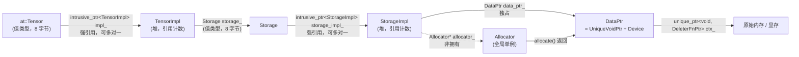

打开 `aten/src/ATen/core/TensorBase.h`，`at::Tensor` 的基类是这样定义的（类定义开头和结尾）：

```cpp
class TORCH_API TensorBase {
 public:
  TensorBase() = default;
  explicit TensorBase(
      c10::intrusive_ptr<TensorImpl, UndefinedTensorImpl> tensor_impl)
      : impl_(std::move(tensor_impl)) {
    TORCH_CHECK(impl_.get(), "TensorImpl with nullptr is not supported");
  }
  TensorBase(const TensorBase&) = default;
  TensorBase(TensorBase&&) noexcept = default;
  ~TensorBase() noexcept = default;
  // ...
 protected:
  c10::intrusive_ptr<TensorImpl, UndefinedTensorImpl> impl_;
};
```

一个 Java 工程师第一次读到这里，几乎每一行都有疑问：`= default` 是什么意思，为什么要显式写出"用默认的"？`TensorBase&&` 那两个 `&` 是什么？`std::move` 移动了什么？`intrusive_ptr` 又是什么，为什么不用标准库的 `shared_ptr`？最根本的：一个 `Tensor` 对象里只有一个 `impl_` 字段，那数据在哪里？

再看总纲开篇那段扩展代码的签名和最后一行：

```cpp
at::Tensor scale_shift_cpu(const at::Tensor& x, double alpha, double beta) {
  // ...
  auto out = at::empty_like(x_c);
  // ...
  return out;
}
```

参数写成 `const at::Tensor&`，返回值却写成 `at::Tensor`。按 Java 的直觉，"返回一个对象"就是返回一个引用，不花钱；但在 C++ 里返回值默认是按值返回，也就是拷贝。那这个函数会不会把整个 tensor 的数据拷一遍？答案是不会，而且理由有两层：`Tensor` 是一个句柄，拷贝它只拷贝一个指针；即使是这个指针，编译器也会用移动或者直接省略（RVO）的方式避免拷贝。要说清楚这两层，就需要 C++ 的对象模型：对象在哪里、值和引用怎么区分、谁拥有谁、什么时候析构。

这是全系列最重要的一篇。Java 里所有对象都在堆上、变量都是引用、生命周期由 GC 决定；C++ 这三点都不同，而且是理解后面所有内容——模板、多态、注册、并发、与 Python 交互——的前提。本文的核心问题是总纲里的这句话：

> **`at::Tensor y = x;` 之后 `y` 和 `x` 是什么关系？什么时候数据真正被释放？**

全文按下面的顺序展开：

1. 对象在哪里：栈、堆与值语义；拷贝在哪里发生；
2. 引用与指针：`T&`、`const T&`、`T*` 各自的使用场景；`const` 的位置与 `const` 成员函数；
3. 六大特殊成员函数：构造、析构、拷贝构造、拷贝赋值、移动构造、移动赋值；Rule of Zero 与 Rule of Five；
4. 右值引用与 `std::move`：移动语义为什么让按值返回没有代价；RVO/NRVO；
5. RAII：把资源的生命周期绑定到对象的生命周期；与 `try-with-resources` 的能力差异；
6. 标准库的三种智能指针：`unique_ptr`、`shared_ptr`、`weak_ptr` 及其代价；
7. `c10::intrusive_ptr`：PyTorch 为什么自己实现一套引用计数，比 `shared_ptr` 省了什么，和裸指针互转对 Python 绑定意味着什么；
8. 回到源码：`Tensor → TensorImpl → Storage → StorageImpl → DataPtr → Allocator` 的完整持有链，CUDA 显存如何借 `DataPtr` 归还，以及核心问题的完整回答；
9. mini-c10：实现 `intrusive_ptr`、`DataPtr`/`Allocator`、`StorageImpl`、`TensorImpl`、`Tensor`，让第一个 Tensor 跑起来，用析构打印证明释放时序；
10. 工程实践建议与常见错误；
11. 总结。

正文以 C++17 为基线（本机 PyTorch v2.10.0 源码树的顶层 `CMakeLists.txt` 把 `CMAKE_CXX_STANDARD` 设为 17，vLLM v0.15.0 的 `CMakeLists.txt` 也是 17，与本系列一致；所有 mini-c10 片段用 `clang++ -std=c++17 -Wall` 验证）。


## 一、对象在哪里：栈、堆与值语义

### 1.1 Java 的模型：变量是引用，对象在堆上

Java 里写 `Tensor y = x;`，发生的事情是：`x` 和 `y` 是两个引用（本质上是指针），指向堆上的同一个对象。对象什么时候被回收，由 GC 在某个不确定的时刻决定。除了八种基本类型，Java 没有"对象在栈上"这个概念，也没有"把一个对象按值拷贝一份"的默认语义——要拷贝必须显式调用 `clone()` 或拷贝构造。

这个模型简单统一，但它有一个隐藏成本：**每个对象都是一次堆分配，每次访问都是一次间接寻址**。JIT 的逃逸分析能消除一部分，但语言层面没有表达"这个对象就住在这里"的手段。

### 1.2 C++ 的模型：变量就是对象

C++ 的默认恰好相反。声明一个变量，就是在当前作用域里创建一个对象；这个对象的存储空间在栈上（或者作为另一个对象的成员，嵌在那个对象里）；作用域结束，对象析构，空间回收。

```cpp
struct Point { double x, y; };

void f() {
  Point p{1.0, 2.0};      // p 就是一个 16 字节的对象，住在 f 的栈帧里
  Point q = p;            // q 是另一个对象，拷贝了 p 的 16 字节
  q.x = 3.0;              // 改 q 不影响 p
}                         // p、q 在这里析构（对 Point 来说什么都不做）
```

这叫**值语义**（value semantics）：变量代表值本身，赋值和传参默认拷贝值，两个变量之间没有隐藏的共享。`std::vector<int> b = a;` 会把 `a` 的所有元素拷一份；`std::string s2 = s1;` 也一样。

堆对象需要显式创建：

```cpp
Point* hp = new Point{1.0, 2.0};   // 在堆上分配，hp 是一个指针（本身在栈上）
delete hp;                         // 必须手工释放；忘了就泄漏，删两次就崩
```

现代 C++ 几乎不直接写 `new`/`delete`，而是用智能指针（第六节）或容器来管理堆对象。但要明白：**智能指针管理的对象在堆上，智能指针本身是一个栈上（或成员）的值对象**。`std::unique_ptr<Point> up = std::make_unique<Point>();` 里，`up` 是一个 8 字节的栈对象，它指向的 `Point` 在堆上。`up` 析构时顺手 `delete` 了那个 `Point`。这就是第五节要讲的 RAII 的雏形。

### 1.3 拷贝在哪里发生

值语义意味着拷贝会在很多不显眼的地方发生。对一个类型 `T`，下面每一处都会调用 `T` 的拷贝构造函数（除非编译器能省略）：

```cpp
T b = a;                 // 1. 初始化
T c(a);                  // 同上，另一种写法
void f(T t);  f(a);      // 2. 按值传参
T g() { T t; return t; } // 3. 按值返回（通常被优化掉，见第四节）
std::vector<T> v; v.push_back(a);   // 4. 放进容器
auto lam = [a]() {};     // 5. lambda 按值捕获
```

而这些地方**不会**拷贝：

```cpp
T& r = a;                // 引用：r 是 a 的别名
const T& cr = a;         // 常量引用：同上，但不能通过 cr 修改
T* p = &a;               // 指针：p 存的是 a 的地址
void f(const T& t); f(a);// 按常量引用传参：不拷贝
```

用一个打印每次构造/析构的类可以直接观察到这些。下面的 `Tracer` 会在本文多次出现：

```cpp
struct Tracer {
  std::string name;
  Tracer(std::string n) : name(std::move(n)) { std::printf("ctor      %s\n", name.c_str()); }
  ~Tracer()                                    { std::printf("dtor      %s\n", name.c_str()); }
  Tracer(const Tracer& o) : name(o.name + "'") { std::printf("copy-ctor %s\n", name.c_str()); }
  // 移动构造/赋值见第四节
};

void by_value(Tracer t) { /* ... */ }
void by_cref(const Tracer& t) { /* ... */ }

int main() {
  Tracer a("a");
  Tracer b = a;       // copy-ctor a'
  by_value(b);        // copy-ctor a''  ...  dtor a''（函数返回时参数析构）
  by_cref(b);         // 什么都不打印
}                     // dtor a'  dtor a（逆序析构）
```

用 `clang++ -std=c++17` 编译运行，输出：

```text
ctor      a
copy-ctor a'
copy-ctor a''
dtor      a''
dtor      a'
dtor      a
```

三点值得注意：`by_value` 一进一出就是一次拷贝构造加一次析构；`by_cref` 什么都没发生；作用域结束时，对象按声明的**逆序**析构（`b` 先于 `a`）。逆序析构是 C++ 的硬性规则，后面讲 `TensorImpl` 成员释放顺序时会用到。

### 1.4 Java 对照：`=` 的含义完全不同

| 表达式 | Java | C++ |
|---|---|---|
| `T b = a;` | `b`、`a` 引用同一对象 | `b` 是 `a` 的一份拷贝（新对象） |
| `b.x = 1;` | `a.x` 也变了 | `a.x` 不变 |
| `f(a)` | 传引用（引用本身按值拷贝） | 默认拷贝整个对象；写 `const T&` 才是"传引用" |
| 对象何时销毁 | GC 决定 | 作用域结束时，确定 |
| 对象在哪 | 堆 | 默认栈/成员内嵌；`new` 才在堆 |

理解这张表之后再看 `at::Tensor y = x;`，会产生一个正确的担心：这是不是拷贝了整个 tensor？答案是"拷贝了整个 `Tensor` 对象，但 `Tensor` 对象只有一个指针那么大"。`Tensor` 是一个刻意设计成**值语义外壳、引用语义内核**的类型：拷贝它很便宜，拷贝之后两个 `Tensor` 共享同一个 `TensorImpl`。这种设计叫句柄（handle）或者 pimpl，第八节会完整拆开。


## 二、引用与指针：`T&`、`const T&`、`T*`

### 2.1 引用是别名

`T&` 是"对 `T` 的引用"。它不是一个新对象，而是已有对象的另一个名字：

```cpp
int a = 1;
int& r = a;   // r 就是 a
r = 2;        // a == 2
```

引用有三条硬性规则：必须在声明时绑定到一个对象；绑定后不能再改绑到别的对象；不能为空。这三条使引用比指针安全得多，也使它成为传参的默认选择。

Java 的引用可以为 `null`，可以重新赋值指向别的对象；C++ 的引用两者都不行。因此"Java 引用"更接近 C++ 的指针而不是 C++ 的引用。

### 2.2 三种传参方式与选择规则

一个函数要接收一个 `Tensor`，有三种主要写法：

```cpp
void f(at::Tensor t);          // 按值：拷贝一个句柄，refcount +1，函数结束 -1
void f(const at::Tensor& t);   // 按常量引用：零开销，函数内不能改 t
void f(at::Tensor& t);         // 按非常量引用：零开销，函数内可以改 t
```

选择规则可以归纳成一张表：

| 写法 | 拷贝？ | 函数内能修改？ | 能接受临时对象？ | 典型用途 |
|---|---|---|---|---|
| `T` | 是 | 是（改的是副本） | 是 | 小对象（`int`、`double`、`Device`）；或函数需要自己持有一份（sink 参数，第四节） |
| `const T&` | 否 | 否 | 是 | **只读输入的默认选择** |
| `T&` | 否 | 是 | 否 | 输出参数、in-place 修改 |
| `T*` | 否 | 看 `const` | 是（传地址） | 可以为空；或者表达"非拥有"关系 |
| `T&&` | 否 | 是 | 只接受临时对象 | 移动构造/移动赋值（第四节） |

回到 `scale_shift_cpu(const at::Tensor& x, double alpha, double beta)`：`x` 只读，用 `const at::Tensor&`；`alpha`、`beta` 是 8 字节的 `double`，按值传比按引用传还便宜（引用底层是指针，也是 8 字节，还多一次解引用）。这正是 PyTorch 生成的算子签名的约定：Tensor 用 `const Tensor&`，标量按值。

vLLM 的 `csrc/cache.h` 提供了 `T&` 和 `const T&` 并存的例子：

```cpp
void reshape_and_cache(torch::Tensor& key, torch::Tensor& value,
                       torch::Tensor& key_cache, torch::Tensor& value_cache,
                       torch::Tensor& slot_mapping,
                       const std::string& kv_cache_dtype,
                       torch::Tensor& k_scale, torch::Tensor& v_scale);

void gather_and_maybe_dequant_cache(
    torch::Tensor const& src_cache,     // [NUM_BLOCKS, BLOCK_SIZE, ENTRIES...]
    torch::Tensor const& dst,           // [TOT_TOKENS, ENTRIES...]
    torch::Tensor const& block_table,   // [BATCH, BLOCK_INDICES]
    // ...
    std::optional<torch::Tensor> seq_starts = std::nullopt);
```

`key_cache`、`value_cache` 是要被写入的 KV cache，用 `torch::Tensor&`；`src_cache`、`block_table` 只读，用 `torch::Tensor const&`。注意 `torch::Tensor const&` 与 `const torch::Tensor&` 完全等价，前者叫 "east const" 风格，vLLM 两种写法混用，读的时候不必在意。`std::optional<torch::Tensor>` 按值传，因为 `optional<Tensor>` 也只是一个句柄加一个 bool，拷贝很便宜，而且这样调用方可以传 `std::nullopt` 或者临时对象。

顺带一提：`torch::Tensor&` 在这里其实有些多余——`Tensor` 是句柄，通过 `const Tensor&` 也能修改它指向的数据（下一小节解释）。vLLM 这样写更多是历史习惯，PyTorch 自己的 `native_functions.yaml` 生成的算子对 in-place 输出参数也统一用 `const Tensor&` 或 `Tensor&`。

### 2.3 `const` 的位置与含义

`const` 是 C++ 里出现频率最高、位置最灵活的关键字。规则是：**`const` 修饰它左边最近的东西；左边没东西就修饰右边的**。

```cpp
const int a = 1;        // a 是常量 int
int const b = 1;        // 同上（east const）
const int* p;           // p 指向 const int：不能通过 p 改值，但 p 可以改指向
int* const q = &x;      // q 是常量指针：q 不能改指向，但能通过 q 改值
const int* const r;     // 两者都不能改
const Tensor& t;        // 对 const Tensor 的引用
```

对读源码最重要的是**`const` 成员函数**：在成员函数参数列表后面加 `const`，表示"这个函数不修改对象状态"，于是它可以在 `const T&` 上调用。`TensorBase.h` 里几乎所有的访问器都是 const 成员函数：

```cpp
  bool defined() const {
    return impl_;
  }
  size_t use_count() const noexcept {
    return impl_.use_count();
  }
  bool is_contiguous(at::MemoryFormat memory_format=at::MemoryFormat::Contiguous) const {
    return impl_->is_contiguous(memory_format);
  }
  TensorImpl * unsafeGetTensorImpl() const {
    return impl_.get();
  }
```

如果 `defined()` 不加 `const`，那么 `void f(const at::Tensor& x) { x.defined(); }` 就编不过——`x` 是 const 的，只能调用 const 成员函数。这就是为什么写类的时候要给所有"只读"方法加 `const`，否则这个类型没法通过 `const T&` 传递。

这里有一个细节值得停下来：`Tensor` 是句柄，`const Tensor&` 保护的是**句柄**不被改（不能让它指向别的 `TensorImpl`），但不保护它**指向的数据**。`mutable_data_ptr()` 在 `TensorBase.h` 里就是 const 成员函数：

```cpp
  void* mutable_data_ptr() const {
    return this->unsafeGetTensorImpl()->mutable_data();
  }
```

所以 `const at::Tensor& out` 作为参数时，函数体里照样能往 `out` 的数据里写。这是 PyTorch 有意的设计（`const` 只是浅层的），读 in-place 算子时不要被 `const` 误导。

另一个相关关键字是 `mutable`：标记在成员上，表示即使对象是 const，这个成员也可以改。`intrusive_ptr_target` 的引用计数就是 `mutable` 的（下一节引用），因为对一个 `const TensorImpl` 增减引用计数并不改变它的"逻辑状态"。

### 2.4 指针用在哪里

现代 C++ 里，裸指针 `T*` 主要保留两个用途：

**第一，表达"非拥有"（non-owning）关系**：我知道这个对象在哪，但我不负责它的生死。`StorageImpl` 持有的 `Allocator*` 就是典型：

```cpp
// c10/core/StorageImpl.h，私有成员
  DataPtr data_ptr_;
  SymInt size_bytes_;
  // ...
  Allocator* allocator_;
```

`Allocator` 是进程级的全局对象（`c10/core/Allocator.h` 里 `SetAllocator` 的注释写明 "The passed in allocator pointer is expected to have static lifetime; this function does NOT take ownership of the raw pointer"），成千上万个 `StorageImpl` 都指向同一个，谁也不拥有它。用裸指针正好。

**第二，表达"可以为空"**：引用不能为空，需要"可能没有"的语义时用指针（或者 `std::optional`）。

裸指针**不**再用来表达所有权。看到 `T*` 就应该默认它不拥有对象；拥有关系用 `unique_ptr`、`shared_ptr`、`intrusive_ptr` 表达。PyTorch 源码里凡是名字带 `unsafe` 的、返回裸指针的方法——`unsafeGetTensorImpl()`、`unsafeGetStorageImpl()`——都是在说"我把内部指针借给你看一眼，你别拿它做所有权操作"。

### 2.5 悬垂引用：C++ 没有 GC 兜底

引用和指针都不延长对象的寿命。对象死了，引用就悬垂（dangling），再访问是未定义行为——可能崩，可能读到垃圾，可能碰巧正常。Java 里不存在这个问题，因为只要有引用，对象就活着。

`TensorBase.h` 里有一行专门防止一种悬垂：

```cpp
  // Use .contiguous() instead. Trying to borrow from a prvalue
  // will only lead to trouble and dangling references.
  c10::MaybeOwned<TensorBase> expect_contiguous(
      MemoryFormat memory_format=MemoryFormat::Contiguous) && = delete;
```

`expect_contiguous()` 返回一个"可能是借用、可能是拥有"的包装（`MaybeOwned`，第八节再讲）。如果在一个临时 `Tensor` 上调用它，借用的对象在这个表达式结束时就死了，返回值立刻悬垂。`&& = delete` 的意思是"禁止在右值上调用这个函数"（`&&` 限定符见第四节），把这种错误从运行期提前到编译期。

这一节的要点：引用是零开销的别名，`const T&` 是只读输入的默认传参方式；`const` 成员函数决定了一个类型能不能在 `const T&` 上使用；裸指针表达非拥有和可空；引用不延长寿命，悬垂是 C++ 特有的风险。


## 三、六大特殊成员函数与 Rule of Zero/Five

### 3.1 编译器会替你写的六个函数

C++ 的每个类都有六个"特殊成员函数"，如果你不写，编译器在需要时会按规则生成：

```cpp
struct T {
  T();                          // 1. 默认构造
  ~T();                         // 2. 析构
  T(const T& other);            // 3. 拷贝构造
  T& operator=(const T& other); // 4. 拷贝赋值
  T(T&& other) noexcept;        // 5. 移动构造（C++11）
  T& operator=(T&& other) noexcept; // 6. 移动赋值（C++11）
};
```

编译器生成的版本做的事情是"逐成员"（memberwise）操作：默认构造逐成员默认构造，拷贝构造逐成员拷贝，析构逐成员析构（逆序）。对只包含 `int`、`double`、`std::string`、`std::vector` 这类成员的结构体，编译器生成的六个函数就是正确的，一个字都不用写。

Java 只有构造函数（和几乎不用的 `finalize`），没有拷贝构造、赋值运算符、移动这些概念——因为 Java 的 `=` 永远是引用赋值，不需要定义"拷贝一个对象是什么意思"。C++ 的 `=` 是值操作，所以每个类型都要回答这个问题。

### 3.2 `= default` 与 `= delete`

C++11 加了两个声明方式：

- `T(const T&) = default;`：显式要求编译器生成默认版本。作用是把"隐含的"写成"明确的"，读代码的人一眼就知道这个类是可拷贝的、行为是逐成员拷贝。
- `T(const T&) = delete;`：显式禁止。任何试图拷贝的代码都会编译失败。

再看本文开头 `TensorBase` 的那几行，现在完全能读懂了：

```cpp
  TensorBase(const TensorBase&) = default;
  TensorBase(TensorBase&&) noexcept = default;
  ~TensorBase() noexcept = default;
  // ...
  TensorBase& operator=(const TensorBase& x) & = default;
  TensorBase& operator=(TensorBase&& x) & noexcept = default;
```

`TensorBase` 唯一的成员是 `impl_`（一个 `intrusive_ptr`），逐成员拷贝就是拷贝这个 `intrusive_ptr`——引用计数 +1。所以 `TensorBase` 的拷贝、移动、析构全部 `= default`，作者只是把它们写出来，明确"这个类是可拷贝可移动的值类型"。

`TensorImpl` 则是反面（`c10/core/TensorImpl.h`，类定义开头附近）：

```cpp
struct C10_API TensorImpl : public c10::intrusive_ptr_target {
  TensorImpl() = delete;
  ~TensorImpl() override;
  // ...
 public:
  TensorImpl(const TensorImpl&) = delete;
  TensorImpl& operator=(const TensorImpl&) = delete;
  TensorImpl(TensorImpl&&) = delete;
  TensorImpl& operator=(TensorImpl&&) = delete;
```

`TensorImpl` 是被引用计数管理的、独一无二的对象，拷贝它没有意义（两个 `TensorImpl` 共享一个引用计数？共享一个 `PyObject` 槽？），所以六个函数里除了析构全部删除，连默认构造都不允许（必须带着 `Storage` 和 `DispatchKeySet` 构造）。`StorageImpl` 同样（`c10/core/StorageImpl.h`）：

```cpp
  StorageImpl& operator=(StorageImpl&& other) = delete;
  StorageImpl& operator=(const StorageImpl&) = delete;
  StorageImpl() = delete;
  StorageImpl(StorageImpl&& other) = delete;
  StorageImpl(const StorageImpl&) = delete;
  ~StorageImpl() override = default;
```

这是一个非常实用的阅读线索：**看一个类的特殊成员函数是 `default` 还是 `delete`，就知道它是"值"还是"实体"**。`Tensor`、`Storage`、`Device`、`ScalarType` 是值，随便拷；`TensorImpl`、`StorageImpl`、`Allocator` 是实体，只能通过指针/引用/智能指针访问。

### 3.3 Rule of Zero 与 Rule of Five

上面两种极端之外还有第三种情况：类直接管理某种资源（裸内存、文件句柄、引用计数），编译器生成的逐成员拷贝是**错的**——两个对象会同时认为自己拥有同一份资源，析构时释放两次。这时必须手写。经验法则有两条：

**Rule of Zero**：如果你的类的所有成员都已经正确管理了自己的资源（`std::string`、`std::vector`、`unique_ptr`、`shared_ptr`、`intrusive_ptr`……），那么六个特殊成员函数一个都不要写，让编译器生成。`TensorBase` 就是 Rule of Zero 的教科书例子——它写了 `= default`，但等价于不写。

**Rule of Five**：如果你不得不手写其中任何一个（通常是析构函数，因为要释放资源），那么六个都要考虑（默认构造除外，所以是 Five）。因为一旦你手写了析构，编译器就**不会再生成移动构造和移动赋值**，拷贝构造和拷贝赋值虽然还会生成，但几乎肯定是错的。

`c10::intrusive_ptr` 就是 Rule of Five 的教科书例子。它直接管理一个裸指针 `target_` 和它指向对象里的引用计数，六个函数全部手写（`c10/util/intrusive_ptr.h`，`intrusive_ptr` 类的 public 部分）：

```cpp
  intrusive_ptr() noexcept
      : intrusive_ptr(NullType::singleton(), raw::DontIncreaseRefcount{}) {}

  intrusive_ptr(intrusive_ptr&& rhs) noexcept : target_(rhs.target_) {
    rhs.target_ = NullType::singleton();
  }

  intrusive_ptr(const intrusive_ptr& rhs) : target_(rhs.target_) {
    retain_();
  }

  ~intrusive_ptr() noexcept {
    reset_();
  }

  intrusive_ptr& operator=(intrusive_ptr&& rhs) & noexcept {
    return this->template operator= <TTarget, NullType>(std::move(rhs));
  }

  template <class From, class FromNullType>
  intrusive_ptr& operator=(intrusive_ptr<From, FromNullType>&& rhs) & noexcept {
    // ...
    intrusive_ptr tmp = std::move(rhs);
    swap(tmp);
    return *this;
  }

  // Assignment is implemented using copy and swap. That's safe for self
  // assignment.
  intrusive_ptr& operator=(const intrusive_ptr& rhs) & noexcept {
    return this->template operator= <TTarget, NullType>(rhs);
  }

  template <class From, class FromNullType>
  intrusive_ptr& operator=(
      const intrusive_ptr<From, NullType>& rhs) & noexcept {
    // ...
    intrusive_ptr tmp = rhs;
    swap(tmp);
    return *this;
  }
```

逐个对照六大函数：默认构造把 `target_` 设为空（`NullType::singleton()`，第七节解释）；移动构造"偷"走 `rhs` 的指针并把 `rhs` 置空，计数不变；拷贝构造复制指针然后 `retain_()`（计数 +1）；析构 `reset_()`（计数 -1，归零就 `delete`）；两个赋值都用了 copy-and-swap 惯用法：先用参数构造一个临时 `tmp`（拷贝或移动），再和 `*this` 交换指针，函数返回时 `tmp` 析构、顺手释放 `*this` 原来持有的引用。这个写法一石三鸟：自赋值安全、异常安全、代码复用。

（模板版本的 `operator=` 是为了支持从 `intrusive_ptr<Derived>` 赋给 `intrusive_ptr<Base>`，第三篇讲模板时再看。这里只需知道非模板版本转发给了模板版本。）

### 3.4 `noexcept` 与移动

上面的移动构造、移动赋值和析构都标了 `noexcept`（承诺不抛异常），拷贝构造没标。这不是随手写的。`std::vector<T>` 在扩容搬迁元素时，只有当 `T` 的移动构造是 `noexcept` 时才会用移动，否则为了保证异常安全会退回拷贝。`std::vector<at::Tensor>` 是 PyTorch 里极常见的类型（`TensorList` 的底层就常是它），如果 `Tensor` 的移动不是 `noexcept`，每次扩容都会做几十次引用计数加减而不是几十次指针拷贝。所以 `TensorBase(TensorBase&&) noexcept = default;` 里那个 `noexcept` 是有性能意义的。

### 3.5 赋值运算符后面的 `&`

`operator=(const intrusive_ptr& rhs) &` 里参数列表后面那个 `&` 叫**引用限定符**（ref-qualifier），意思是"这个成员函数只能在左值上调用"。`TensorBase.h` 里有一对对应的删除：

```cpp
  // Ban assignment to rvalues, since at::Tensor (weirdly) performs a deep copy here
  TensorBase& operator=(const TensorBase&) && = delete;
  TensorBase& operator=(TensorBase&&) && noexcept = delete;
```

`&&` 版本被删掉，禁止 `some_function_returning_tensor() = x;` 这种对临时对象赋值的代码——它要么是笔误，要么是想做 in-place 拷贝但写错了。第 2.5 节的 `expect_contiguous() && = delete` 是同一个机制。


## 四、右值引用、`std::move` 与按值返回

### 4.1 左值与右值

C++ 把表达式分成两大类。粗略地说：**左值**（lvalue）是有名字、可以取地址、表达式结束后还活着的东西；**右值**（rvalue）是临时的、没名字的、表达式结束就消失的东西。

```cpp
Tensor a = ...;
a;                   // 左值：有名字
at::empty({2, 3});   // 右值：函数返回的临时对象
a + b;               // 右值：运算结果
std::move(a);        // 右值：见下文
```

区分它们的意义在于：**右值反正马上要死，它的资源可以被"偷"走而不必拷贝**。一个即将析构的 `std::vector` 里的堆缓冲区，与其拷贝一份再把原来的释放，不如直接把缓冲区指针拿过来、把原来的置空。这就是移动语义。

### 4.2 `T&&` 与 `std::move`

`T&&` 是右值引用：只能绑定到右值。它的存在就是为了写出"只接受临时对象"的重载：

```cpp
struct Tracer {
  // ...
  Tracer(Tracer&& o) noexcept : name(std::move(o.name)) {
    o.name = "(moved-from)";
    std::printf("move-ctor %s\n", name.c_str());
  }
  Tracer& operator=(Tracer&& o) noexcept {
    name = std::move(o.name);
    o.name = "(moved-from)";
    return *this;
  }
};
```

`std::move(x)` 是最容易被名字误导的标准库函数：**它什么都不移动**。它只是一个类型转换，把左值 `x` 转成右值引用 `T&&`，从而让重载决议选中移动构造/移动赋值。真正"移动"资源的是被选中的那个构造函数。

```cpp
Tracer a("a");
Tracer b = a;              // copy-ctor：a 是左值
Tracer c = std::move(a);   // move-ctor：std::move(a) 是右值；之后 a 处于 moved-from 状态
```

moved-from 对象的状态是"有效但未指定"（valid but unspecified）：可以析构、可以重新赋值，但不应该读它的内容。对 `Tensor` 来说，moved-from 的 `Tensor` 是 undefined 的（`impl_` 为空），`defined()` 返回 `false`。

`TensorBody.h` 中 `Tensor` 与 `TensorBase` 的互转把拷贝和移动的差别写得很直白：

```cpp
  // Implicitly move-constructible from TensorBase, but must be explicit to increase refcount
  explicit Tensor(const TensorBase &base): TensorBase(base) {}
  /*implicit*/ Tensor(TensorBase &&base): TensorBase(std::move(base)) {}
```

从 `const TensorBase&` 构造要增加引用计数（有代价），所以要求 `explicit`，调用方必须写 `Tensor(base)` 表明自己知道这件事；从 `TensorBase&&` 构造只是偷一个指针，零成本，允许隐式转换。

### 4.3 移动在 PyTorch 源码里的样子

有了移动，C++ 库里到处是 `std::move`。最典型的模式是"sink 参数"：函数需要自己持有一份参数的拷贝，就按值接收，然后 `std::move` 进成员：

```cpp
// c10/core/Storage.h
  Storage(c10::intrusive_ptr<StorageImpl> ptr)
      : storage_impl_(std::move(ptr)) {}
```

调用方如果传左值，在参数处发生一次拷贝（+1）；传右值就是一次移动（零成本）。然后 `std::move(ptr)` 把参数移进成员，又是零成本。总共最多一次引用计数操作。如果写成 `const intrusive_ptr<StorageImpl>& ptr` 然后 `storage_impl_(ptr)`，那不论调用方传什么都要一次拷贝；写成两个重载又重复代码。按值 + move 是最简洁的正确写法。

另一种是显式要求右值的 `T&&` 参数。`TensorImpl` 的构造函数只接受 `Storage&&`：

```cpp
// c10/core/TensorImpl.h
  TensorImpl(
      Storage&& storage,
      DispatchKeySet /*key_set*/,
      const caffe2::TypeMeta data_type);
```

```cpp
// c10/core/TensorImpl.cpp
TensorImpl::TensorImpl(
    ImplType /*type*/,
    Storage&& storage,
    DispatchKeySet key_set,
    const caffe2::TypeMeta data_type)
    : storage_(std::move(storage)),
      numel_(0),
      data_type_(data_type),
      device_opt_(storage_.device()),
      key_set_(key_set - c10::python_ks) { // See [Note: Python key removal]
  init_bitfields();
  // ...
}
```

`Storage&&` 强迫调用方写 `std::move(storage)` 或传临时对象，明确表达"这个 Storage 的所有权转交给新的 TensorImpl"。注意初始化列表里 `storage_(std::move(storage))` 之后，`device_opt_(storage_.device())` 用的是成员 `storage_` 而不是参数 `storage`——参数已经被移走了，再读它就是读 moved-from 对象。这是 `std::move` 最常见的坑：**move 之后不要再用原对象**。

顺便说一下：形参 `Storage&& storage` 在函数体内是一个**左值**（它有名字），所以要再移进成员时必须再写一次 `std::move`。"右值引用类型的变量本身是左值"这条规则初看别扭，但它保证了不会在不知情的情况下被偷走资源。

### 4.4 按值返回为什么没有代价：RVO 与 NRVO

回到开头的问题：`return out;` 会拷贝吗？

首先，C++17 规定了**强制的拷贝省略**（guaranteed copy elision）：`return T(...);` 或 `return some_function_returning_T();` 这种返回纯右值（prvalue）的情形，对象直接在调用方的接收位置构造，连移动都没有。这叫 RVO（Return Value Optimization）。

其次，`return out;` 里 `out` 是一个有名字的局部变量，这叫 NRVO（Named RVO）。标准没有强制，但所有主流编译器在能做的时候都会做——`out` 直接被构造在调用方的返回槽里。即使编译器因为某种原因做不了 NRVO（比如函数有多个返回不同局部变量的 `return`），标准也规定 `return` 一个局部变量时**自动当作右值**处理，会调用移动构造而不是拷贝构造。

用 `Tracer` 验证：

```cpp
Tracer make() {
  Tracer t("ret");
  return t;
}
Tracer a = make();   // 只打印一行 "ctor ret"：NRVO，没有 copy 也没有 move
```

所以 `scale_shift_cpu` 的 `return out;`：最好情况零成本，最坏情况一次 `intrusive_ptr` 的移动（拷贝一个指针、置空另一个）。不管哪种情况都**不碰引用计数、更不碰数据**。

`aten/src/ATen/EmptyTensor.cpp` 里 `_empty_generic` 就是这么写的：

```cpp
template <typename T>
static TensorBase _empty_generic(
    ArrayRef<T> size,
    c10::Allocator* allocator,
    c10::DispatchKeySet ks,
    ScalarType scalar_type,
    std::optional<c10::MemoryFormat> memory_format_opt) {
  // ...
  auto storage_impl = c10::make_intrusive<StorageImpl>(
      c10::StorageImpl::use_byte_size_t(),
      size_bytes,
      allocator,
      /*resizeable=*/true);

  auto tensor = detail::make_tensor_base<TensorImpl>(
      std::move(storage_impl), ks, dtype);
  // ...
  return tensor;
}
```

`storage_impl` 被 `std::move` 进 `TensorImpl`；`tensor` 用 NRVO 返回。整个函数里没有一次多余的引用计数操作。

### 4.5 `x.contiguous()` 返回的对象要拷贝数据吗

总纲"最终目标"一节的第三个问题现在也能回答了。`TensorBase.h`：

```cpp
  TensorBase contiguous(MemoryFormat memory_format=MemoryFormat::Contiguous) const {
    if (is_contiguous_or_false(memory_format)) {
      return *this;
    } else {
      return __dispatch_contiguous(memory_format);
    }
  }
```

如果已经连续，`return *this;` 拷贝一个句柄（引用计数 +1），返回的 `Tensor` 与原来共享同一个 `TensorImpl`；不连续才真正分配新 storage 并拷贝数据。所以 `auto x_c = x.contiguous();` 在多数情况下只是多了一个指向同一 `TensorImpl` 的句柄。

### 4.6 两个常见误用

**不要写 `return std::move(local);`**。它会阻止 NRVO，把零成本变成一次移动。编译器会给警告（`-Wpessimizing-move`）。

**不要 move 之后再用**。前面 `TensorImpl` 构造函数的例子已经说明了。特别隐蔽的是在循环里 move 一个循环外的变量——第二次迭代时它已经空了。


## 五、RAII：把资源绑定到对象的生命周期

### 5.1 确定性析构是 C++ 最重要的语言特性

前面几节反复出现"作用域结束时析构"。这件事在 C++ 里是**确定的、同步的、可预测的**：对象离开作用域（正常退出、`return`、`break`、抛异常）的那一刻，析构函数立刻运行。

RAII（Resource Acquisition Is Initialization）就是把这个特性用在资源管理上：**在构造函数里获取资源，在析构函数里释放资源**。于是资源的生命周期与对象的生命周期完全一致，不需要任何显式的释放调用。

```cpp
class FileHandle {
  FILE* f_;
 public:
  explicit FileHandle(const char* path) : f_(std::fopen(path, "r")) {}
  ~FileHandle() { if (f_) std::fclose(f_); }
  FileHandle(const FileHandle&) = delete;             // 不能拷贝：两个对象会 fclose 两次
  FileHandle& operator=(const FileHandle&) = delete;
  FileHandle(FileHandle&& o) noexcept : f_(o.f_) { o.f_ = nullptr; }   // 可以移动
  // ...
};

void read_config() {
  FileHandle fh("config.txt");
  parse(fh);                  // 如果 parse 抛异常……
}                             // ……fh 照样析构，文件照样关闭
```

第一节的 `Tracer`、第三节的 `intrusive_ptr`、第六节的 `unique_ptr`、第八节的 `DataPtr`——它们全都是 RAII 类型。"资源"可以是堆内存、显存、文件、锁、引用计数、一段"当前设备"上下文（第六篇的 `DeviceGuard`）、任何需要成对操作（获取/释放、进入/退出、加一/减一）的东西。

### 5.2 Java 对照：`try-with-resources` 与 GC 的边界

Java 也有释放资源的机制，但它们和 RAII 的能力边界差别很大：

| | Java `try-with-resources` | Java GC / `finalize` / `Cleaner` | C++ RAII |
|---|---|---|---|
| 释放时机 | 块结束时，确定 | 不确定，可能永远不 | 对象析构时，确定 |
| 作用范围 | 只能管理**块作用域内**的局部变量 | 任何对象 | 局部变量、成员、容器元素、临时对象 |
| 能否作为成员传递所有权 | 不能；对象成员必须手工 `close()` | — | 可以：成员随外层对象析构，移动即转移所有权 |
| 能否放进容器 | 放进去后 `try` 管不到 | — | `std::vector<unique_ptr<T>>` 析构时逐个释放 |
| 管什么 | 实现了 `AutoCloseable` 的对象 | 内存 | 任何资源 |

`try-with-resources` 解决的是"一个函数内打开、同一个函数内关闭"的场景。但 AI-Infra 里的资源大多**不是**这样：一块显存被一个 `Tensor` 持有，`Tensor` 被放进 `std::vector`，`vector` 是某个 `Module` 的成员，`Module` 又被 Python 对象持有。这条链上没有任何一个块作用域能覆盖显存的整个寿命。RAII 让显存的释放跟着所有者走：最后一个持有者析构的那一刻，显存归还。

GC 的问题则是另一种：它管理的只是 JVM 堆内存。GPU 显存、文件描述符、锁、外部库分配的内存，GC 根本不知道它们存在。Java 的 GPU 库（如 DJL、TornadoVM）都不得不引入手工的 `close()` 或者 `NDManager` 这种作用域管理器，本质上是在 Java 里模拟 RAII。而在 C++ 里这就是语言本身。

### 5.3 析构的顺序

RAII 的正确性依赖析构顺序的确定性。规则有两条：

1. 同一作用域内的局部对象，按声明的**逆序**析构；
2. 一个对象析构时，先执行析构函数体，再按声明**逆序**析构各成员，最后析构基类。

第二条对读 `TensorImpl` 很重要。`TensorImpl` 的成员按声明顺序有 `storage_`（一个 `Storage`，里面是 `intrusive_ptr<StorageImpl>`）、`autograd_meta_`（`unique_ptr`）、`extra_meta_`、`version_counter_`、`pyobj_slot_`、`sizes_and_strides_`……当最后一个 `Tensor` 句柄析构、`TensorImpl` 的引用计数归零时：

```text
delete target                          (intrusive_ptr::reset_not_null_)
  → ~TensorImpl()                      函数体是 = default，什么都不做
    → 逆序析构成员：... → ~unique_ptr(autograd_meta_) → ~Storage(storage_)
      → ~intrusive_ptr<StorageImpl>    StorageImpl 引用计数 -1
        → 若归零：delete StorageImpl
          → ~StorageImpl()             函数体 = default
            → ~DataPtr(data_ptr_)      → ~UniqueVoidPtr → unique_ptr 调 deleter → 内存归还
```

整条链没有一行手写的释放代码。`TensorImpl::~TensorImpl() = default;`（`c10/core/TensorImpl.cpp`）、`~StorageImpl() override = default;`，全靠成员的析构函数层层传递。这就是总纲那句"整条链上没有一处需要手工 `delete`，这就是 RAII"的具体含义。第八节会把每一层的代码摊开看。

### 5.4 异常安全是 RAII 的副产品

Java 用 `finally` 保证清理；C++ 用 RAII。差别是：`finally` 要在每个需要清理的地方写一遍，RAII 写在类型里一次，所有使用点自动获得。PyTorch 的算子实现几乎不写 `try`/`catch`（`TORCH_CHECK` 失败直接抛），却不会泄漏——因为所有中间 `Tensor`、所有 guard 都是 RAII 对象，栈展开时自动清理。


## 六、标准智能指针：`unique_ptr`、`shared_ptr`、`weak_ptr`

RAII 用于堆内存的标准化产物就是智能指针。C++11 提供了三种，它们表达三种不同的**所有权关系**。

### 6.1 `std::unique_ptr`：独占所有权，零开销

```cpp
std::unique_ptr<AutogradMeta> meta = std::make_unique<AutogradMeta>();
meta->grad_fn_ = ...;
// meta 析构时 delete 它指向的对象
```

`unique_ptr` 不能拷贝（`= delete`），只能移动。它的大小与裸指针相同（8 字节），解引用没有额外开销——它就是"一个会在析构时 `delete` 的裸指针"。`TensorImpl` 用它持有可选的 autograd 元数据（`c10/core/TensorImpl.h`，私有成员）：

```cpp
  // This pointer points to an AutogradMeta struct that stores autograd-specific
  // fields (such as grad_ / grad_fn_ / grad_accumulator_). This pointer always
  // has unique ownership (meaning only one TensorImpl can own it at a time).
  //
  // autograd_meta_ can be nullptr, as an optimization.  When this occurs, it is
  // equivalent to having an autograd_meta_ pointing to a default constructed
  // AutogradMeta; intuitively, tensors which don't require grad will have this
  // field set to null.
  // ...
  std::unique_ptr<c10::AutogradMetaInterface> autograd_meta_ = nullptr;
```

注释说得很清楚：一个 `AutogradMeta` 只属于一个 `TensorImpl`，是独占关系；而且它可以为空（大多数不需要梯度的 tensor 不分配它，省下几十个字节）。`unique_ptr` 恰好同时表达了"独占"和"可空"。

`unique_ptr` 的第二个模板参数是删除器类型。默认是 `std::default_delete<T>`（调 `delete`），但可以换成函数指针或函数对象，让 `unique_ptr` 管理任何"有释放函数"的资源。PyTorch 的 `DataPtr` 底层正是一个 `std::unique_ptr<void, void(*)(void*)>`（第八节），用函数指针删除器让同一个类型能管理 `malloc` 出来的内存、`cudaMalloc` 出来的显存、mmap 的文件、别的框架借来的缓冲区。

### 6.2 `std::shared_ptr`：共享所有权，有代价

```cpp
auto sp1 = std::make_shared<Node>();
auto sp2 = sp1;              // 引用计数 2
sp1.reset();                 // 引用计数 1
// sp2 析构时计数归零，delete Node
```

`shared_ptr` 允许多个所有者，最后一个析构时释放对象。为了做到这一点，它需要一个引用计数，而这个计数必须放在所有 `shared_ptr` 都能找到的地方——`shared_ptr` 的做法是在堆上分配一个**控制块**（control block），里面放强引用计数、弱引用计数、删除器、分配器。每个 `shared_ptr` 对象里存两个指针：一个指向被管理对象，一个指向控制块。

这带来几项代价：

| 代价 | 具体表现 |
|---|---|
| 大小 | `sizeof(shared_ptr<T>) == 16`（两个指针），`unique_ptr` 和裸指针是 8 |
| 额外分配 | 控制块要单独 `new`；用 `make_shared` 能把对象和控制块合并成一次分配，但 `shared_ptr<T>(new T)` 就是两次 |
| 原子操作 | 计数增减是原子的（`lock add`），拷贝一个 `shared_ptr` 比拷贝一个裸指针慢一到两个数量级 |
| 缓存局部性 | 对象和控制块可能在不同的 cache line 上 |
| 从裸指针恢复 | 拿到一个 `T*` 无法找到它的控制块，除非 `T` 继承 `enable_shared_from_this`（它在对象里塞了一个 `weak_ptr`，又多 16 字节） |

对一般应用代码这些代价可以忽略。但对 PyTorch 来说，`Tensor` 是最高频被拷贝的对象——每次算子调用、每次放进 `std::vector<Tensor>`、每次从 Python 传到 C++——16 字节对 8 字节、两个 cache line 对一个 cache line，是真实的差别。`c10/core/TensorImpl.h` 末尾 Note [TensorImpl size constraints] 里有这样一段：

```cpp
// Struct size matters.  In some production systems at Facebook, we have
// 400M live tensors during a training run.  Do the math: every 64-bit
// word you add to Tensor is an extra 3.2 gigabytes in RAM.
```

这就是第七节 `intrusive_ptr` 存在的动机。

### 6.3 `std::weak_ptr`：观察但不拥有

`weak_ptr` 指向一个由 `shared_ptr` 管理的对象，但不增加强引用计数。它用来打破循环引用（A 持有 B、B 持有 A，两者永远不会归零），或者表达"我想知道它是否还活着，但不想让它因为我而活着"。使用时必须先 `lock()` 拿到一个临时 `shared_ptr`（如果对象已死则为空）。

控制块里的弱引用计数就是为它准备的：强计数归零时对象析构，但控制块要等弱计数也归零才释放，否则 `weak_ptr::lock()` 没地方查"对象死了没有"。

Java 有 `WeakReference`，语义相近：不阻止 GC 回收，`get()` 可能返回 `null`。区别是 Java 的对象死亡时间不确定，`WeakReference` 主要用于缓存；C++ 的 `weak_ptr` 更多用于打破所有权环。

### 6.4 选择规则

```text
谁拥有这个对象？
  ├── 恰好一个所有者，其他人只是借用      → unique_ptr + 裸指针/引用借用
  ├── 多个所有者，最后一个负责释放        → shared_ptr（或 intrusive_ptr）
  │     └── 其中某些持有者不想延长寿命    → weak_ptr（或 weak_intrusive_ptr）
  └── 没人拥有（全局/静态生命周期）        → 裸指针（如 Allocator*）
```

PyTorch 的选择：`TensorImpl` 用 `unique_ptr` 持有 `AutogradMeta`（独占）；`Tensor` 用 `intrusive_ptr` 持有 `TensorImpl`（共享，但要比 `shared_ptr` 便宜）；`StorageImpl` 用裸指针持有 `Allocator`（不拥有）。


## 七、`c10::intrusive_ptr`：PyTorch 为什么自己造一个

### 7.1 侵入式引用计数的思路

`shared_ptr` 的所有代价都来自一件事：引用计数放在对象**外面**（控制块），所以要多一个指针去找它。如果把计数放在对象**里面**——要求被管理的类继承一个含计数字段的基类——那么 `intrusive_ptr` 只需要一个指针，从对象指针就能找到计数，从裸指针也能恢复出智能指针。这叫**侵入式**（intrusive）引用计数，Boost 的 `boost::intrusive_ptr` 是最早的实现，`c10::intrusive_ptr` 是 PyTorch 自己的版本。

`c10/util/intrusive_ptr.h` 开头的注释就是这个意思：

```cpp
/**
 * intrusive_ptr<T> is an alternative to shared_ptr<T> that has better
 * performance because it does the refcounting intrusively
 * (i.e. in a member of the object itself).
 * Your class T needs to inherit from intrusive_ptr_target to allow it to be
 * used in an intrusive_ptr<T>. Your class's constructor should not allow
 *`this` to escape to other threads or create an intrusive_ptr from `this`.
 */
```

### 7.2 `intrusive_ptr_target`：计数住在哪里

被管理的类必须继承 `intrusive_ptr_target`。它的核心就是一个 64 位原子整数和几个虚函数（`c10/util/intrusive_ptr.h`，`intrusive_ptr_target` 类）：

```cpp
class C10_API intrusive_ptr_target {
  // Note [Weak references for intrusive refcounting]
  // ~~~~~~~~~~~~~~~~~~~~~~~~~~~~~~~~~~~~~~~~~~~~~~~~
  // Here's the scheme:
  //
  //  - refcount == number of strong references to the object
  //    weakcount == number of weak references to the object,
  //      plus one more if refcount > 0
  //    An invariant: refcount > 0  =>  weakcount > 0
  //
  //  - c10::StorageImpl stays live as long as there are any strong
  //    or weak pointers to it (weakcount > 0, since strong
  //    references count as a +1 to weakcount)
  //
  //  - finalizers are called and data_ptr is deallocated when refcount == 0
  //
  //  - Once refcount == 0, it can never again be > 0 (the transition
  //    from > 0 to == 0 is monotonic)
  // ...
  //.We use a single combined count for refcount and weakcount so that
  // we can atomically operate on both at the same time for performance
  // and defined behaviors.
  // ...
  mutable std::atomic<uint64_t> combined_refcount_;
  static_assert(sizeof(std::atomic<uint64_t>) == 8);
  static_assert(alignof(std::atomic<uint64_t>) == 8);

  template <typename T, typename NullType>
  friend class intrusive_ptr;
  // ...

 protected:
  // protected destructor. We never want to destruct intrusive_ptr_target*
  // directly.
  virtual ~intrusive_ptr_target() { /* debug 断言：refcount 与 weakcount 必须已归零 */ }

  constexpr intrusive_ptr_target() noexcept : combined_refcount_(0) {}

  // intrusive_ptr_target supports copy and move: but refcount and weakcount
  // don't participate (since they are intrinsic properties of the memory
  // location)
  intrusive_ptr_target(intrusive_ptr_target&& /*other*/) noexcept
      : intrusive_ptr_target() {}
  intrusive_ptr_target(const intrusive_ptr_target& /*other*/) noexcept
      : intrusive_ptr_target() {}
  // ...

 private:
  /**
   * This is called when refcount reaches zero.
   * You can override this to release expensive resources.
   * There might still be weak references, so your object might not get
   * destructed yet, but you can assume the object isn't used anymore,
   * ...
   */
  virtual void release_resources() {}

  /**
   * These two methods are called when the refcount transitions between one
   * and two and the object has a PyObject wrapper.
   */
  virtual void incref_pyobject() const noexcept {}
  virtual void decref_pyobject() const noexcept {}
  virtual bool try_incref_pyobject() const noexcept { return false; }
  // ...
};
```

几个细节逐一对应前面几节讲过的机制：

- **`mutable`**（2.3 节）：对 `const TensorImpl` 拷贝一个 `intrusive_ptr` 也要改计数，所以计数是 `mutable`。
- **`protected` 虚析构**：不允许任何人 `delete` 一个 `intrusive_ptr_target*`——只有 `intrusive_ptr` 内部（是 `friend`）在计数归零时可以。虚析构保证通过基类指针 `delete` 时会调用派生类（`TensorImpl`）的析构函数，第四篇详细讲。
- **拷贝/移动构造把计数重置为 0**：计数是"这块内存有几个人指着"，拷贝出来的新对象当然还没人指着。这是"计数是内存位置的属性而不是值的属性"的准确表达。
- **`release_resources()`**：强引用归零但还有弱引用时，对象暂时不能 `delete`（弱引用还要查它死没死），但可以先把昂贵的资源放掉。`TensorImpl::release_resources()` 就是把 `autograd_meta_` 和 `storage_` 重置（`c10/core/TensorImpl.cpp`）：

```cpp
void TensorImpl::release_resources() {
  autograd_meta_.reset();
  if (storage_) {
    storage_ = {};
  }
}
```

`StorageImpl::release_resources()` 则是 `data_ptr_.clear();`——数据在强引用归零时立刻归还，不用等弱引用。

PyTorch 2.x 中的变化：早期 2.x 版本里这是两个独立的 `std::atomic<uint32_t> refcount_` 和 `weakcount_`；v2.10.0 已经合并成一个 `combined_refcount_`（低 32 位强计数，高 31 位弱计数，最高位 `kHasPyObject` 标记"是否有 Python 包装对象"），这样一次原子操作就能同时读到两个计数，`reset_not_null_` 里的快速路径就依赖这一点。`TensorImpl.h` 末尾的 size 注释里还留着 "strong refcount / weak refcount TODO: pack these into one word"，说明那段注释比代码旧。本文后面统一说"强计数"和"弱计数"，不再区分它们的物理布局。

### 7.3 `intrusive_ptr` 的两个核心操作

`intrusive_ptr<TTarget, NullType>` 的数据成员只有一个 `TTarget* target_;`。它的全部逻辑集中在两个私有函数上。增加引用（`retain_`）：

```cpp
  void retain_() noexcept {
    if (target_ != NullType::singleton()) {
      uint64_t combined = detail::atomic_combined_refcount_increment(
          target_->combined_refcount_, detail::kReferenceCountOne);
      uint32_t new_refcount = detail::refcount(combined);
      TORCH_INTERNAL_ASSERT_DEBUG_ONLY(
          new_refcount != 1,
          "intrusive_ptr: Cannot increase refcount after it reached zero.");

      if constexpr (detail::TargetTraits<TTarget>::can_have_pyobject) {
        // If the refcount transitioned from 1 to 2, we need to incref the
        // PyObject. ...
        if (detail::has_pyobject(combined) && detail::refcount(combined) == 2) {
          target_->incref_pyobject();
        }
      }
      // ...
    }
  }
```

减少引用（`reset_` → `reset_not_null_`）：

```cpp
  C10_NOINLINE static void reset_not_null_(TTarget* target) noexcept {
    if (detail::is_uniquely_owned(
            target->combined_refcount_.load(std::memory_order_acquire))) {
      // Both counts are 1, so there are no weak references and
      // we are releasing the last strong reference. No other
      // threads can observe the effects of this target deletion
      // call (e.g. calling use_count()) without a data race.
      target->combined_refcount_.store(0, std::memory_order_relaxed);
      delete target;
      return;
    }

    auto combined_refcount = detail::atomic_combined_refcount_decrement(
        target->combined_refcount_, detail::kReferenceCountOne);
    uint32_t new_refcount = detail::refcount(combined_refcount);
    bool has_pyobject = detail::has_pyobject(combined_refcount);
    if (new_refcount == 0) {
      if (detail::weakcount(combined_refcount) == 1) {
        delete target;
        return;
      }
      // See comment above about weakcount. As long as refcount>0,
      // weakcount is one larger than the actual number of weak references.
      // So we need to decrement it here.
      release_resources_and_decrement_weakrefs_(target);
    } else if constexpr (detail::TargetTraits<TTarget>::can_have_pyobject) {
      // If the refcount transitioned from 2 to 1, we need to decref the
      // PyObject. ...
      if (has_pyobject && new_refcount == 1) {
        target->decref_pyobject();
      }
    }
    // ...
  }
```

读这段代码需要的知识全在前面几节：`delete target` 通过虚析构调到 `~TensorImpl`（第五节的析构链由此开始）；`release_resources_and_decrement_weakrefs_` 对应弱引用还在的情况；`std::memory_order_acquire`/`relaxed` 是第六篇的内容，这里只需知道 `atomic_combined_refcount_increment` 用 `relaxed`、`decrement` 用 `acq_rel`，和 `shared_ptr` 的实现一致。`if constexpr` 是第三篇的编译期分支，`TargetTraits<TTarget>::can_have_pyobject` 对 `TensorImpl`、`StorageImpl` 及其子类为 `true`，其他类型这段代码根本不会被编进去。

关于 PyObject 的那两段是 PyTorch 特有的：当一个 `TensorImpl` 有 Python 包装对象（`torch.Tensor` 实例）时，Python 对象持有 C++ 对象的一个强引用；反过来，只要 C++ 侧还有**其他**强引用（计数从 1 变 2），C++ 就 `incref` Python 对象，保证 Python 端的 `id(t)` 和附着在上面的属性（`t.my_attr = ...`）不会因为 Python 端暂时没人引用而丢失。计数从 2 回到 1 时再 `decref`。这是第七篇 "Python 对象生命周期与 C++ 对象生命周期的交叉"的入口，这里只需知道 `intrusive_ptr` 的引用计数逻辑里有这么一个钩子。

### 7.4 比 `shared_ptr` 省了什么

把 6.2 节的表反过来看：

| `shared_ptr` 的代价 | `intrusive_ptr` 怎么省 |
|---|---|
| 16 字节（两个指针） | 8 字节（一个指针）；`sizeof(intrusive_ptr<T>) == sizeof(T*)` |
| 控制块单独分配 | 没有控制块；计数是对象的成员，与对象一次分配 |
| 对象和计数可能不在同一 cache line | 计数在对象开头（基类子对象），访问对象时计数大概率已在缓存里 |
| 从裸指针无法恢复 `shared_ptr` | 从 `T*` 直接 `reclaim`/`reclaim_copy` 出 `intrusive_ptr`，无需 `enable_shared_from_this` |
| 空指针只能是 `nullptr` | `NullType` 模板参数可以指定一个"哨兵对象"作为空值（7.7 节） |
| 弱引用要保留控制块到弱计数归零 | 弱引用要保留整个对象到弱计数归零（这一点 `intrusive_ptr` 更差——但 `release_resources()` 让昂贵资源提前释放，缓解了这个问题） |

代价是侵入性：`T` 必须继承 `intrusive_ptr_target`，多一个 8 字节的计数字段和一个 vtable 指针。对 `TensorImpl`、`StorageImpl`、`c10::ivalue::Object`、`c10::ivalue::Future`、`c10d::ProcessGroup` 这些本来就是多态类、本来就要被引用计数管理的类型，这个代价等于零。

### 7.5 创建：`make_intrusive` 与私有的裸指针构造

`intrusive_ptr` 从裸指针构造的构造函数是**私有**的：

```cpp
  // raw pointer constructors are not public because we shouldn't make
  // intrusive_ptr out of raw pointers except from inside the make_intrusive(),
  // reclaim() and weak_intrusive_ptr::lock() implementations.

  // This constructor will increase the ref counter for you.
  // This constructor will be used by the make_intrusive(), and also pybind11,
  // ...
  explicit intrusive_ptr(TTarget* target)
      : intrusive_ptr(target, raw::DontIncreaseRefcount{}) {
    if (target_ != NullType::singleton()) {
      // We just created result.target_, so we know no other thread has
      // access to it, so we know we needn't care about memory ordering.
      // (On x86_64, a store with memory_order_relaxed generates a plain old
      // `mov`, whereas an atomic increment does a lock-prefixed `add`, which is
      // much more expensive: https://godbolt.org/z/eKPzj8.)
      TORCH_INTERNAL_ASSERT_DEBUG_ONLY(
          target_->combined_refcount_.load(std::memory_order_relaxed) == 0,
          "intrusive_ptr: Newly-created target had non-zero refcounts. Does its "
          "constructor do something strange like incref or create an "
          "intrusive_ptr from `this`?");
      target_->combined_refcount_.store(
          detail::kUniqueRef, std::memory_order_relaxed);
    }
  }
```

正常创建路径是 `make_intrusive<T>(args...)`，它 `new` 一个 `T` 然后调这个私有构造，把计数直接**写**成 1（强）+1（弱）——不是原子加，因为新对象还没有第二个人能看到，普通 `mov` 就够了。这是对 `shared_ptr`/`make_shared` 的又一处微优化。

```cpp
template <
    class TTarget,
    class NullType = detail::intrusive_target_default_null_type<TTarget>,
    class... Args>
inline intrusive_ptr<TTarget, NullType> make_intrusive(Args&&... args) {
  return intrusive_ptr<TTarget, NullType>::make(std::forward<Args>(args)...);
}
```

为什么不允许公开地 `intrusive_ptr<T>(new T)` 或者 `intrusive_ptr<T>(&stack_object)`？文件里 Note [Stack allocated intrusive_ptr_target safety] 解释了：`intrusive_ptr_target` 的构造函数把计数初始化为 0，只有 `make_intrusive` 会把它置为 1。所以任何从 `T*` 恢复 `intrusive_ptr` 的操作都可以检查"计数是否为 0"来判断这个对象是不是被正规创建的——一个栈对象、一个 `new` 出来但没经过 `make_intrusive` 的对象，计数是 0，debug 构建会立刻断言失败，而不是等到析构时 `delete` 一个栈地址。

### 7.6 与裸指针互转：`release`、`reclaim` 及其变体

这是 `intrusive_ptr` 相对 `shared_ptr` 最重要的能力，也是它能穿过 C API、Python C API、pybind11 这些"只认裸指针"的边界的原因。相关方法都在 `intrusive_ptr` 类的 public 部分：

```cpp
  /**
   * Returns an owning (!) pointer to the underlying object and makes the
   * intrusive_ptr instance invalid. That means the refcount is not decreased.
   * You *must* put the returned pointer back into a intrusive_ptr using
   * intrusive_ptr::reclaim(ptr) to properly destruct it.
   * This is helpful for C APIs.
   */
  TTarget* release() noexcept {
    TTarget* result = target_;
    target_ = NullType::singleton();
    return result;
  }

  /**
   * Takes an owning pointer to TTarget* and creates an intrusive_ptr that takes
   * over ownership. That means the refcount is not increased.
   * This is the counter-part to intrusive_ptr::release() and the pointer
   * passed in *must* have been created using intrusive_ptr::release().
   */
  static intrusive_ptr reclaim(TTarget* owning_ptr) {
    // ... debug 断言
    return intrusive_ptr(owning_ptr, raw::DontIncreaseRefcount{});
  }

  /**
   * Takes an owning pointer to TTarget* and creates an intrusive_ptr
   * representing a new reference, i.e. the raw pointer retains
   * ownership.
   */
  static intrusive_ptr reclaim_copy(TTarget* owning_ptr) {
    auto ret = reclaim(owning_ptr);
    ret.retain_();
    return ret;
  }
```

用所有权的语言概括：

| 操作 | 计数变化 | 语义 | 对应的 Python C API 概念 |
|---|---|---|---|
| `release()` | 不变 | 智能指针放手，把"一个引用"交给裸指针的持有者 | 返回 new reference（调用方负责 decref） |
| `reclaim(p)` | 不变 | 从裸指针接回"一个引用"，恢复成智能指针 | 接管一个 new reference |
| `reclaim_copy(p)` | +1 | 裸指针继续持有它的引用，我再加一个 | 对 borrowed reference 做 `Py_INCREF` |
| `unsafe_reclaim_from_nonowning(p)` | +1 | 同上，但 `p` 是非拥有的（相当于 `shared_from_this`） | 同上 |
| `unsafe_steal_from_new(p)` | 0→1 | 接管一个刚 `new` 出来、还没有任何引用的对象 | — |
| `unsafe_adapt_non_heap_allocated(p, n)` | 设为一个巨大值 | 让一个非堆对象（arena/placement new）伪装成被引用计数管理，永远不会归零 | — |

`release()`/`reclaim()` 必须严格配对：`release` 出去的裸指针带着一个引用，最终必须被 `reclaim` 回来（或者 `raw::intrusive_ptr::decref`），否则泄漏。这和 Python C API 里 new reference 必须 `Py_DECREF` 是同一个纪律。文件末尾的 `c10::raw::intrusive_ptr` 命名空间提供了直接对裸指针操作的版本：

```cpp
namespace raw {
namespace intrusive_ptr {

// WARNING: Unlike the reclaim() API, it is NOT valid to pass
// NullType::singleton to this function
inline void incref(intrusive_ptr_target* self) {
  if (self) {
    uint64_t combined = detail::atomic_combined_refcount_increment(
        self->combined_refcount_, detail::kReferenceCountOne);
    // ...
  }
}

// WARNING: Unlike the reclaim() API, it is NOT valid to pass
// NullType::singleton to this function
inline void decref(intrusive_ptr_target* self) {
  // Let it die
  c10::intrusive_ptr<intrusive_ptr_target>::reclaim(self);
  // NB: Caller still has 'self' pointer, but it's now invalid.
  // If you want more safety, used the actual c10::intrusive_ptr class
}
```

`decref` 的实现只有一行：把裸指针 `reclaim` 成一个临时 `intrusive_ptr`，让它在语句结束时析构——RAII 完成了减计数和可能的 `delete`。这是"用一个临时 RAII 对象执行一次释放"的惯用法，PyTorch 源码里多次出现。

**这对 Python 绑定意味着什么。** Python 世界只认 `PyObject*`，pybind11 的类型转换也是围绕裸指针和"holder"设计的。`intrusive_ptr` 能与裸指针无损互转，使它可以直接充当 pybind11 的 holder（`torch/csrc/utils/pybind.h`）：

```cpp
// This makes intrusive_ptr to be available as a custom pybind11 holder type,
// see
// https://pybind11.readthedocs.io/en/stable/advanced/smart_ptrs.html#custom-smart-pointers
PYBIND11_DECLARE_HOLDER_TYPE(T, c10::intrusive_ptr<T>, true)
```

这就是 `intrusive_ptr.h` 开头为什么要前向声明 `pybind11::class_` 并把它声明为 `friend`——pybind11 需要调用那个私有的 `intrusive_ptr(TTarget*)` 构造函数。`c10d::ProcessGroup`、`c10::ivalue::Object` 等一大批类型就是这样暴露给 Python 的。

`Tensor` 本身走的是另一条路，没有用 pybind11 holder，而是手工的 Python C API（第七篇的主题）。`torch/csrc/autograd/python_variable.h` 里 Python 端 `torch.Tensor` 对象的 C 结构是：

```cpp
// Python object that backs torch.autograd.Variable
struct THPVariable {
  PyObject_HEAD
  // Payload
  at::Tensor cdata;
  // ...
};
```

Python 对象内嵌一个 `at::Tensor`（PyTorch 2.x 中的变化：早期 2.x 版本这里是 `c10::MaybeOwned<at::Tensor> cdata`，v2.10.0 简化为直接持有 `at::Tensor`）。所以一个 `torch.Tensor` 对 `TensorImpl` 贡献一个强引用；反方向，`TensorImpl` 用一个 `PyObjectSlot` 存 `PyObject*`（`c10/core/impl/PyObjectSlot.h`）：

```cpp
struct C10_API PyObjectSlot {
 public:
  PyObjectSlot() : pyobj_interpreter_(nullptr), pyobj_(nullptr) {}

  PyObject* load_pyobj() const {
    return pyobj_.load(std::memory_order_acquire);
  }
  // ...
 private:
  // This is now always the global interpreter if the PyObject is set.
  // Maybe we can remove this field some day...
  std::atomic<PyInterpreter*> pyobj_interpreter_;

  // The PyObject representing this Tensor or nullptr. Ownership is managed
  // by intrusive_ptr. By the time the PyObjectSlot is destroyed, this
  // reference is already dead.
  std::atomic<PyObject*> pyobj_;
};
```

`python_variable.cpp` 里的 `THPVariable_WrapWithType` 把一个 C++ `Tensor` 包成 Python 对象时，用 placement new 在 Python 对象的内存里构造 `cdata`：

```cpp
  obj = type->tp_alloc(type, 0);
  // ...
  auto v = reinterpret_cast<THPVariable*>(obj);
  new (&v->cdata) Tensor(std::forward<T>(var));
  // ...
  return obj;
```

`THPVariable_dealloc` 在 Python 对象释放时手工调用析构：

```cpp
static void THPVariable_dealloc(PyObject* self) {
  PyObject_GC_UnTrack(self);
  THPVariable_clear((THPVariable*)self);
  ((THPVariable*)self)->cdata.~Variable();
  Py_TYPE(self)->tp_free(self);
}
```

`new (&v->cdata) Tensor(...)` 是 placement new（在指定地址构造对象，不分配内存），`cdata.~Variable()` 是显式析构调用。这是 C++ 对象嵌在由 C 运行时（CPython）分配的内存里时的标准做法。`Tensor` 析构 → `intrusive_ptr` 减计数 → 可能触发第五节那条析构链。Python 端的 `del t` 最终就是这样走到 C++ 端的显存释放的。第七篇会完整讲这条路径上的 GIL 和引用计数细节，这里只需要看到：**因为 `Tensor` 是一个可以在任意内存位置构造/析构的值类型，它才能嵌进 `PyObject`。**

### 7.7 `NullType`：`UndefinedTensorImpl` 作为空值

`intrusive_ptr<TensorImpl, UndefinedTensorImpl>` 的第二个模板参数一直没解释。`intrusive_ptr` 的"空"不一定是 `nullptr`，而是 `NullType::singleton()` 返回的那个指针。默认的 `NullType` 返回 `nullptr`：

```cpp
template <class TTarget>
struct intrusive_target_default_null_type final {
  static constexpr TTarget* singleton() noexcept {
    return nullptr;
  }
};
```

`Tensor` 用的是 `UndefinedTensorImpl`（`c10/core/UndefinedTensorImpl.h`）：

```cpp
struct C10_API UndefinedTensorImpl final : public TensorImpl {
 public:
  // ...
  static constexpr inline TensorImpl* singleton() {
    return &_singleton;
  }
  // ...
 private:
  UndefinedTensorImpl();
  static UndefinedTensorImpl _singleton;
  // ...
};
```

于是一个默认构造的 `Tensor`（`Tensor t;`）的 `impl_` 不是空指针，而是指向一个全局的 `UndefinedTensorImpl` 单例。`retain_()`/`reset_()` 里的 `if (target_ != NullType::singleton())` 保证不会对这个单例做计数操作。这样做的好处是：对一个 undefined 的 `Tensor` 调用 `t.dim()`、`t.sizes()` 不会解引用空指针崩掉，而是调到 `UndefinedTensorImpl` 的虚函数，抛出一个可读的错误（"...is not defined"）。`defined()` 就是 `impl_ != UndefinedTensorImpl::singleton()`。

Java 里对应的模式叫 Null Object。差别是 C++ 把它做进了智能指针的类型参数里，零运行时开销。

### 7.8 `weak_intrusive_ptr`：打破 autograd 图里的环

先看 autograd 里用标准库 `weak_ptr` 打破环的例子（`torch/csrc/autograd/variable.h`，`AutogradMeta`）——autograd 的 `Node` 在 v2.10.0 里由 `std::shared_ptr` 管理（`Node` 继承 `std::enable_shared_from_this<Node>`，`torch/csrc/autograd/function.h`），没有走 `intrusive_ptr`：

```cpp
struct TORCH_API AutogradMeta : public c10::AutogradMetaInterface {
  std::string name_;

  Variable grad_;
  std::shared_ptr<Node> grad_fn_;
  std::weak_ptr<Node> grad_accumulator_;
  // ...
```

一个叶子 tensor 的 `grad_accumulator_`（累加梯度的节点）会反过来持有这个 tensor；如果 `AutogradMeta` 用强引用持有 `grad_accumulator_`，就形成 tensor → AutogradMeta → Node → tensor 的环，永远不释放。用弱引用断开这个环：`Node` 活着是因为反向图持有它，图算完释放，`grad_accumulator_` 自动过期。`grad_fn_` 则用强引用——中间结果的 `grad_fn` 就是靠输出 tensor 持有才活着的。

`weak_intrusive_ptr<T>` 是同一思路的侵入式版本：持有 `intrusive_ptr_target` 里的弱计数，`lock()` 在强计数不为零时返回一个 `intrusive_ptr`，`expired()` 查对象是否已死。它用于被 `intrusive_ptr` 管理的类型，如 `TensorImpl` 和 `StorageImpl`。`VariableHooks::retain_grad`（`torch/csrc/autograd/variable.cpp`）就是一例：要给一个非叶子 tensor 注册一个"反向时把梯度存回自己"的 hook，hook 被 `grad_fn` 持有，如果 hook 再强持有这个 tensor，就是 tensor → grad_fn → hook → tensor 的环，所以 hook 里捕获的是弱引用：

```cpp
  c10::weak_intrusive_ptr<c10::TensorImpl> weak_self(self.getIntrusivePtr());

  auto retain_grad_hook = [weak_self](const at::TensorBase& grad_base) {
    at::Tensor grad{grad_base};
    if (!weak_self.expired() && grad.defined()) {
      auto var = weak_self.lock();
      // ... 把 grad 累加到 var->mutable_grad()
    }
    return at::TensorBase{};
  };
```

`Storage::getWeakStorageImpl()`（`c10/core/Storage.h`）也返回一个 `weak_intrusive_ptr<StorageImpl>`，供需要观察 storage 是否还活着但不想延长其寿命的地方使用（如 `c10d` 和 `ivalue::Future` 记录一次通信涉及的 storage）。


## 八、回到源码：从 `Tensor` 到显存的完整持有链

前面七节的机制在这一节全部汇合。目标是把下面这条链的每一段都对应到源码：



三种箭头对应三种所有权：`intrusive_ptr` 是共享所有权（多个 `Tensor` 可以指向一个 `TensorImpl`，多个 `TensorImpl` 可以指向一个 `StorageImpl`——view 就是这样实现的）；`DataPtr` 里的 `unique_ptr` 是独占所有权（一块内存只属于一个 `StorageImpl`）；`Allocator*` 是非拥有。

### 8.1 `Tensor`/`TensorBase`：句柄

`aten/src/ATen/core/TensorBase.h` 的类注释：

```cpp
// TensorBase aims to break up these header dependencies, and improve
// incremental build times for all PyTorch developers. TensorBase
// represents a reference counted handle to TensorImpl, exactly the
// same as Tensor. However, TensorBase doesn't have code generated
// methods in its API and thus no dependence on native_functions.yaml.
```

`Tensor` 继承 `TensorBase`，只是多了几千个由 `native_functions.yaml` 生成的算子方法（`aten/src/ATen/templates/TensorBody.h` 是模板，生成到 `ATen/core/TensorBody.h`），没有新增数据成员。所以 `sizeof(at::Tensor) == sizeof(void*)`。`TensorBody.h` 的类注释把句柄语义说得很直接：

```cpp
// Tensor is a "generic" object holding a pointer to the underlying TensorImpl object, which
// has an embedded reference count. In this way, Tensor is similar to boost::intrusive_ptr.
//
// For example:
//
// void func(Tensor a) {
//   Tensor b = a;
//   ...
// }
//
// In this example, when we say Tensor b = a, we are creating a new object that points to the
// same underlying TensorImpl, and bumps its reference count. When b goes out of scope, the
// destructor decrements the reference count by calling release() on the TensorImpl it points to.
// The existing constructors, operator overloads, etc. take care to implement the correct semantics.
```

`TensorBase` 上有几个与所有权直接相关的方法：

```cpp
  TensorImpl * unsafeGetTensorImpl() const {
    return impl_.get();
  }
  TensorImpl * unsafeReleaseTensorImpl() {
    return impl_.release();
  }
  const c10::intrusive_ptr<TensorImpl, UndefinedTensorImpl>& getIntrusivePtr() const {
    return impl_;
  }

  c10::intrusive_ptr<TensorImpl, UndefinedTensorImpl> unsafeReleaseIntrusivePtr() {
    return std::move(impl_);
  }

  bool defined() const {
    return impl_;
  }

  void reset() {
    impl_.reset();
  }
  // ...
  bool is_same(const TensorBase& other) const noexcept {
    return impl_ == other.impl_;
  }
  size_t use_count() const noexcept {
    return impl_.use_count();
  }
```

`is_same` 比较的是 `impl_` 指针——两个 `Tensor` 是不是同一个 tensor，由它们是否指向同一个 `TensorImpl` 决定，与数据内容无关。`use_count()` 直接暴露引用计数，调试所有权问题时非常有用。

### 8.2 `TensorImpl`：元数据 + 一个 `Storage`

`TensorImpl` 是真正的"tensor 对象"：形状、步长、dtype、device、dispatch key、autograd 元数据、版本计数器、Python 对象槽——以及一个 `Storage`。`c10/core/TensorImpl.h` 的成员区（删节）：

```cpp
 protected:
  Storage storage_;

 private:
  std::unique_ptr<c10::AutogradMetaInterface> autograd_meta_ = nullptr;

 protected:
  std::unique_ptr<c10::ExtraMeta> extra_meta_ = nullptr;

  c10::VariableVersion version_counter_;

  impl::PyObjectSlot pyobj_slot_;

  c10::impl::SizesAndStrides sizes_and_strides_;

  int64_t storage_offset_ = 0;
  int64_t numel_ = 1;

  // INVARIANT: When storage is non-null, this type meta must
  // agree with the type meta in storage
  caffe2::TypeMeta data_type_;

  std::optional<c10::Device> device_opt_;

  // ... 一组位域：is_contiguous_、is_channels_last_ 等
  DispatchKeySet key_set_;
```

注意 `storage_` 是**按值**持有的 `Storage`，不是指针。`Storage` 自己是一个只包装了 `intrusive_ptr<StorageImpl>` 的值类型，所以这里的"按值"仍然只有 8 字节。多个 `TensorImpl` 可以持有指向同一个 `StorageImpl` 的 `Storage`——`x.view(...)`, `x[0]`, `x.t()` 返回的 tensor 各有自己的 `TensorImpl`（不同的 sizes/strides/storage_offset），但共享 `StorageImpl`。这就是"view 不拷贝数据"的实现。

### 8.3 `Storage`：又一层值类型包装

`c10/core/Storage.h`：

```cpp
struct C10_API Storage {
 public:
  // ...
  Storage() = default;
  Storage(c10::intrusive_ptr<StorageImpl> ptr)
      : storage_impl_(std::move(ptr)) {}

  // Allocates memory buffer using given allocator and creates a storage with it
  Storage(
      use_byte_size_t /*use_byte_size*/,
      const SymInt& size_bytes,
      Allocator* allocator = nullptr,
      bool resizable = false)
      : storage_impl_(c10::make_intrusive<StorageImpl>(
            StorageImpl::use_byte_size_t(),
            size_bytes,
            allocator,
            resizable)) {}
  // ...
  size_t use_count() const {
    return storage_impl_.use_count();
  }

  inline bool unique() const {
    return storage_impl_.unique();
  }

  bool is_alias_of(const Storage& other) const {
    return (
        storage_impl_ == other.storage_impl_ ||
        isSharedStorageAlias(*this, other));
  }
  // ...
 protected:
  c10::intrusive_ptr<StorageImpl> storage_impl_;
};
```

`Storage` 对 `StorageImpl` 的关系与 `Tensor` 对 `TensorImpl` 的关系完全一样：值类型句柄 + 引用计数的实体。所有特殊成员函数都是隐式默认的（Rule of Zero）。

### 8.4 `StorageImpl`：拥有一个 `DataPtr`

`c10/core/StorageImpl.h` 的构造函数和关键成员：

```cpp
struct C10_API StorageImpl : public c10::intrusive_ptr_target {
 public:
  struct use_byte_size_t {};

  StorageImpl(
      use_byte_size_t /*use_byte_size*/,
      SymInt size_bytes,
      at::DataPtr data_ptr,
      at::Allocator* allocator,
      bool resizable)
      : data_ptr_(std::move(data_ptr)),
        size_bytes_(std::move(size_bytes)),
        // ...
        allocator_(allocator) {
    // ...
  }

  StorageImpl(
      use_byte_size_t /*use_byte_size*/,
      const SymInt& size_bytes,
      at::Allocator* allocator,
      bool resizable)
      : StorageImpl(
            use_byte_size_t(),
            size_bytes,
            size_bytes.is_heap_allocated()
                ? allocator->allocate(0)
                : allocator->allocate(size_bytes.as_int_unchecked()),
            allocator,
            resizable) {}
  // ...
  // Destructor doesn't call release_resources because it's
  // unnecessary; don't forget to change that if needed!
  void release_resources() override {
    data_ptr_.clear();
  }
  // ...
 private:
  DataPtr data_ptr_;
  SymInt size_bytes_;
  // ...
  Allocator* allocator_;
  impl::PyObjectSlot pyobj_slot_;
  std::unique_ptr<StorageExtraMeta> extra_meta_ = nullptr;
};
```

第二个构造函数展示了"分配"发生的位置：`allocator->allocate(n)` 返回一个 `DataPtr`（按值，一个右值），被 `std::move` 进 `data_ptr_`。`DataPtr` 是 sink 参数（第 4.3 节的模式）。文件顶部的注释还强调了一个不变式："storage is supposed to uniquely own a data pointer; e.g., two non-null data pointers alias if and only if they are from the same storage"——一块内存只属于一个 `StorageImpl`，这是 `DataPtr` 独占语义的体现。

### 8.5 `DataPtr` 与 `UniqueVoidPtr`：带删除器的独占指针

`c10/core/Allocator.h`：

```cpp
// A DataPtr is a unique pointer (with an attached deleter and some
// context for the deleter) to some memory, which also records what
// device is for its data.
//
// nullptr DataPtrs can still have a nontrivial device; this allows
// us to treat zero-size allocations uniformly with non-zero allocations.
//
class C10_API DataPtr {
 private:
  c10::detail::UniqueVoidPtr ptr_;
  Device device_;

 public:
  // Choice of CPU here is arbitrary; if there's an "undefined" device
  // we could use that too
  DataPtr() : device_(DeviceType::CPU) {}
  DataPtr(void* data, Device device) : ptr_(data), device_(device) {}
  DataPtr(void* data, void* ctx, DeleterFnPtr ctx_deleter, Device device)
      : ptr_(data, ctx, ctx_deleter), device_(device) {}
  // ...
  void clear() {
    ptr_.clear();
  }
  void* get() const {
    return ptr_.get();
  }
  // ...
  void* release_context() {
    return ptr_.release_context();
  }
  // ...
  DeleterFnPtr get_deleter() const {
    return ptr_.get_deleter();
  }
  // ...
  Device device() const {
    return device_;
  }
  // ...
};
```

`DataPtr` 自己没写任何特殊成员函数——Rule of Zero。它的可移动、不可拷贝性质完全继承自成员 `UniqueVoidPtr`（`c10/util/UniqueVoidPtr.h`）：

```cpp
using DeleterFnPtr = void (*)(void*);

namespace detail {

// A detail::UniqueVoidPtr is an owning smart pointer like unique_ptr, but
// with three major differences:
//
//    1) It is specialized to void
//
//    2) It is specialized for a function pointer deleter
//       void(void* ctx); i.e., the deleter doesn't take a
//       reference to the data, just to a context pointer
//       (erased as void*).  In fact, internally, this pointer
//       is implemented as having an owning reference to
//       context, and a non-owning reference to data; this is why
//       you release_context(), not release() (the conventional
//       API for release() wouldn't give you enough information
//       to properly dispose of the object later.)
//
//    3) The deleter is guaranteed to be called when the unique
//       pointer is destructed and the context is non-null; this is different
//       from std::unique_ptr where the deleter is not called if the
//       data pointer is null.
//
class UniqueVoidPtr {
 private:
  // Lifetime tied to ctx_
  void* data_;
  std::unique_ptr<void, DeleterFnPtr> ctx_;

 public:
  UniqueVoidPtr() : data_(nullptr), ctx_(nullptr, &deleteNothing) {}
  explicit UniqueVoidPtr(void* data)
      : data_(data), ctx_(nullptr, &deleteNothing) {}
  UniqueVoidPtr(void* data, void* ctx, DeleterFnPtr ctx_deleter)
      : data_(data), ctx_(ctx, ctx_deleter ? ctx_deleter : &deleteNothing) {}
  // ...
  void clear() {
    ctx_ = nullptr;
    data_ = nullptr;
  }
  void* get() const {
    return data_;
  }
  // ...
};
```

核心就是那一行 `std::unique_ptr<void, DeleterFnPtr> ctx_;`——第六节说的"带自定义删除器的 `unique_ptr`"。`DeleterFnPtr` 是一个普通函数指针 `void(*)(void*)`，而不是 `std::function`：函数指针只有 8 字节、调用是一次间接跳转，`std::function` 可能要堆分配、还要多一次类型擦除的间接层。代价是删除器**不能捕获任何状态**——它只能拿到一个 `void*`。所以 `UniqueVoidPtr` 把"数据指针"和"上下文指针"分开：删除器收到的是 `ctx_`，不是 `data_`。大多数情况下两者相同（CPU 分配就是这样），但 DLPack 导入时 `ctx` 是一个 `DLManagedTensor*`，`data` 是它里面的数据指针；`from_blob` 传自定义 `std::function` 删除器时，`ctx` 是一个堆上的 `InefficientStdFunctionContext`（`Allocator.h` 里定义，名字里的 Inefficient 提醒你它多了一次分配）。

第三条差异也值得注意：`std::unique_ptr` 在指针为空时不调删除器，`UniqueVoidPtr` 只看 `ctx_` 不看 `data_`——因为有些分配器对零字节分配也返回一个需要归还的上下文。

### 8.6 `Allocator`：分配的一端，也决定释放的一端

`c10/core/Allocator.h`：

```cpp
struct C10_API Allocator {
  virtual ~Allocator() = default;

  virtual DataPtr allocate(size_t n) = 0;
  // ...
  // If this returns a non nullptr, it means that allocate()
  // is guaranteed to return a unique_ptr with this deleter attached;
  // it means the rawAllocate and rawDeallocate APIs are safe to use.
  // This function MUST always return the same BoundDeleter.
  virtual DeleterFnPtr raw_deleter() const {
    return nullptr;
  }
  void* raw_allocate(size_t n) {
    auto dptr = allocate(n);
    AT_ASSERT(dptr.get() == dptr.get_context());
    return dptr.release_context();
  }
  void raw_deallocate(void* ptr) {
    auto d = raw_deleter();
    AT_ASSERT(d);
    d(ptr);
  }
  // ...
};
```

关键在于 `allocate()` 的返回类型是 `DataPtr` 而不是 `void*`。**分配器在分配的同时就决定了怎么释放**（把删除器塞进 `DataPtr`），之后无论这块内存被谁持有、被移动到哪里，释放逻辑都跟着它走。`StorageImpl` 完全不需要知道内存是 `malloc` 的还是 `cudaMalloc` 的。这就是"接口里没有 `deallocate()` 方法"的原因：释放不是接口的一部分，而是返回值的一部分。

CPU 分配器（`c10/core/CPUAllocator.cpp`）：

```cpp
struct C10_API DefaultCPUAllocator final : at::Allocator {
  DefaultCPUAllocator() = default;
  at::DataPtr allocate(size_t nbytes) override {
    void* data = nullptr;
    try {
      data = c10::alloc_cpu(nbytes);
    } catch (c10::Error& e) {
      profiledCPUMemoryReporter().OutOfMemory(nbytes);
      throw e;
    }
    profiledCPUMemoryReporter().New(data, nbytes);
    return {data, data, &ReportAndDelete, at::Device(at::DeviceType::CPU)};
  }

  static void ReportAndDelete(void* ptr) {
    if (!ptr) {
      return;
    }
    profiledCPUMemoryReporter().Delete(ptr);
    free_cpu(ptr);
  }

  at::DeleterFnPtr raw_deleter() const override {
    return &ReportAndDelete;
  }
  // ...
};
```

`return {data, data, &ReportAndDelete, ...}` 构造一个 `DataPtr`：数据指针和上下文指针都是 `data`，删除器是静态函数 `ReportAndDelete`。

### 8.7 CUDA caching allocator：显存怎么借 `DataPtr` 归还

从所有权的角度看，CUDA 分配器与 CPU 分配器**没有任何区别**。`c10/cuda/CUDACachingAllocator.cpp` 里 `NativeCachingAllocator::allocate`（删节）：

```cpp
  DataPtr allocate(size_t size) override {
    // ...
    c10::DeviceIndex device = 0;
    C10_CUDA_CHECK(c10::cuda::GetDevice(&device));
    void* devPtr = nullptr;
    void (*deleteFunc)(void*) = &local_raw_delete;
    CUDAStream stream = cuda::getCurrentCUDAStream(device);

    if (forceUncachedAllocator() || !isEnabled()) {
      deleteFunc = &uncached_delete;
      devPtr = uncached_allocate(size);
    } else {
      if (size != 0) {
        this->malloc(&devPtr, device, size, stream);
      }
    }
    // ...
    return {devPtr, devPtr, deleteFunc, Device(DeviceType::CUDA, device)};
  }
```

删除器是 `local_raw_delete`，它把显存**还给缓存池**而不是 `cudaFree`：

```cpp
static NativeCachingAllocator allocator;

void local_raw_delete(void* ptr) {
  // ...
  allocator.free(ptr);
}
```

只有在缓存分配器被禁用（或通过 `PYTORCH_NO_CUDA_MEMORY_CACHING` 强制不缓存）时，删除器才是直接 `cudaFree` 的 `uncached_delete`。所以"`del t` 之后 `nvidia-smi` 显存没有下降"这个所有 PyTorch 用户都遇到过的现象，从 C++ 所有权的角度看是：`Tensor` 析构 → `TensorImpl` 计数归零 → `StorageImpl` 计数归零 → `DataPtr` 析构 → 调 `local_raw_delete` → 显存回到 caching allocator 的空闲块列表，**可以被下一次 `allocate` 复用**，但没有还给驾动。`torch.cuda.empty_cache()` 才会真正 `cudaFree`。缓存池内部怎么切块、怎么处理 stream 语义，是分配器算法的事，不在本文范围；本文只需看到：**整条 RAII 链在 `DataPtr` 这一层结束，最后一步做什么，完全由分配时塞进去的那个函数指针决定。**

顺便说明一下为什么 `Allocator` 是全局裸指针而不是被 `StorageImpl` 拥有：`NativeCachingAllocator` 是一个 `static` 对象，生命周期与进程相同；成百万个 `StorageImpl` 都指向它，它比任何一个 `StorageImpl` 都活得久。用 `shared_ptr` 持有它只会白白多做几百万次原子操作。

### 8.8 一次完整的创建：`at::empty`

把上面各层串起来，看一个 tensor 是怎么诞生的。`aten/src/ATen/EmptyTensor.cpp` 的 `_empty_generic`（4.4 节引过）做了三件事：

1. `c10::make_intrusive<StorageImpl>(use_byte_size_t(), size_bytes, allocator, /*resizable=*/true)`：`new` 一个 `StorageImpl`，它的构造函数调 `allocator->allocate(size_bytes)` 拿到 `DataPtr`（内存在这里分配，删除器在这里确定），强计数置 1。
2. `detail::make_tensor_base<TensorImpl>(std::move(storage_impl), ks, dtype)`：`intrusive_ptr<StorageImpl>` 隐式转换成 `Storage`（`Storage(c10::intrusive_ptr<StorageImpl> ptr)` 构造函数），再作为 `Storage&&` 移进新 `new` 的 `TensorImpl`；`TensorImpl` 用 `make_intrusive` 创建，强计数置 1；`TensorBase` 包住它。

```cpp
// aten/src/ATen/core/TensorBase.h
template <typename T, typename... Args>
TensorBase make_tensor_base(Args&&... args) {
  return TensorBase(c10::make_intrusive<T>(std::forward<Args>(args)...));
}
```

3. `return tensor;`：NRVO。

整个过程两次堆分配（`StorageImpl`、`TensorImpl`）加一次 `allocate`，没有一次多余的引用计数操作，没有一次数据拷贝。

### 8.9 回答核心问题

现在可以完整回答 **`at::Tensor y = x;` 之后 `y` 和 `x` 是什么关系？什么时候数据真正被释放？**

`at::Tensor y = x;` 调用 `Tensor(const Tensor&) = default`，逐成员拷贝 → 拷贝 `impl_` → `intrusive_ptr(const intrusive_ptr&)` → `target_ = rhs.target_; retain_();`。结果：

- `y` 和 `x` 是两个独立的 8 字节栈对象，各自可以被赋值、析构、移动；
- 它们的 `impl_` 指向**同一个** `TensorImpl`，该 `TensorImpl` 的强计数从 1 变 2；`x.is_same(y)` 为 `true`，`x.use_count()` 为 2；
- 因为是同一个 `TensorImpl`，它们共享一切：sizes、strides、dtype、requires_grad、grad、version counter、Python 对象槽。`y.add_(1)` 之后 `x` 也变了；`y.resize_(...)` 之后 `x` 的形状也变了。这一点与 view 不同——`x.view(...)` 会创建**新的** `TensorImpl`，只共享 `StorageImpl`，所以 view 有自己的形状但共享数据。

三种关系的对照：

| 操作 | `TensorImpl` | `StorageImpl` | 数据 | 修改一方，另一方看到什么 |
|---|---|---|---|---|
| `Tensor y = x;` | 共享（计数 +1） | 共享 | 共享 | 一切：数据、形状、autograd 状态 |
| `auto y = x.view(...)` / `x[0]` / `x.t()` | 新建 | 共享（计数 +1） | 共享 | 数据；形状各自独立 |
| `auto y = x.clone()` | 新建 | 新建 | 拷贝 | 什么都看不到 |

Java 对照：`Tensor y = x;` 在效果上最接近 Java 的引用赋值（两个名字指向同一个对象），但机制上是值拷贝——拷贝的是一个带引用计数的句柄。Java 里两个引用指向同一对象不需要任何记账；C++ 这里要做一次原子加，将来还要做一次原子减。这也是为什么 PyTorch 内部大量函数用 `const Tensor&` 而不是 `Tensor` 传参：省掉这两次原子操作。

**数据什么时候释放**：当且仅当

1. 所有指向该 `TensorImpl` 的 `Tensor` 句柄都析构了（包括 C++ 局部变量、容器元素、`THPVariable::cdata`、autograd 图里 `SavedVariable` 保存的引用……），`TensorImpl` 强计数归零，`delete` 它（或者还有弱引用时调 `release_resources()` 把 `storage_` 清空）；
2. 且没有其他 `TensorImpl`（view）还持有同一个 `StorageImpl`——`StorageImpl` 的强计数也归零；
3. 此时 `StorageImpl` 析构（或 `release_resources()`），成员 `data_ptr_` 析构，`UniqueVoidPtr::ctx_` 这个 `unique_ptr` 析构，调用分配时塞进去的删除器；
4. 删除器做什么取决于分配器：CPU 是 `free_cpu`，CUDA 默认是还给缓存池。

上面每一步都是同步的、确定的、发生在最后那个 `Tensor` 析构的那条语句里。没有 GC 的延迟，也没有 finalizer 的不确定性。这就是 C++ 能精确控制显存生命周期的原因，也是为什么 PyTorch 可以在 Python 端 `del` 一个 tensor 后立刻把显存给下一个 tensor 用。

一个常见的困惑："我 `del x` 了，为什么显存没释放？"按上面四步逐条排查：还有别的 Python 变量引用它（步骤 1，Python 端引用）；它被 autograd 图保存了（步骤 1，`SavedVariable`）；它的某个 view 还活着（步骤 2）；释放了但在缓存池里（步骤 4）。每一种都对应链上的一个环节。

### 8.10 借用：`MaybeOwned` 与 `ExclusivelyOwned`

最后提一下两个为了**省掉引用计数**而存在的工具类型，它们在 `TensorBase.h`、`Storage.h`、`intrusive_ptr.h` 里都有 traits 特化。

`c10::MaybeOwned<Tensor>` 表示"可能拥有、可能只是借用"。`expect_contiguous()` 用它：已经连续时借用 `*this`（不加计数），不连续时拥有新建的 tensor。它通过 `TensorBase` 那个 protected 的 `unsafe_borrow_t` 构造函数创建一个 +0 引用计数的 `Tensor`，并在析构时用 `unsafeReleaseTensorImpl()` "泄漏"它，从而抵消——这正是 7.6 节 `release()`/`reclaim()` 那对操作在库内部的用法：

```cpp
  // Create a Tensor with a +0 reference count. Special care must be
  // taken to avoid decrementing this reference count at destruction
  // time. Intended to support MaybeOwnedTraits<Tensor>.
  explicit TensorBase(unsafe_borrow_t /*unused*/, const TensorBase& rhs)
      : impl_(c10::intrusive_ptr<at::TensorImpl, UndefinedTensorImpl>(rhs.impl_.get(), c10::raw::DontIncreaseRefcount{})) {}
```

`c10::ExclusivelyOwned<Tensor>` 表示"我确定我是唯一的持有者"，析构时可以跳过原子减直接 `delete`。这两个类型是 PyTorch 在热路径上压榨引用计数开销的手段。读到它们时，只需要知道它们是 `Tensor` 的"零成本借用视图"和"确定独占视图"，不用深究实现。


## 九、mini-c10：让第一个 Tensor 跑起来

按系列约定，本篇实现 `minic10/util/intrusive_ptr.h`、`minic10/core/Allocator.h`、`minic10/core/StorageImpl.h`、`minic10/core/TensorImpl.h`、`minic10/core/Tensor.h`。所有片段用 `clang++ -std=c++17 -Wall -Wextra` 编译验证过。命名空间 `minic10`，引用计数字段 `refcount_`。

为了让 `TensorImpl` 能编译，需要第三、四篇才会完整实现的 `core/ScalarType.h` 和 `core/DispatchKey.h`，这里先按约定放最小版本：

```cpp
// minic10/core/ScalarType.h（第 3 篇会补上到 C++ 类型的映射）
#pragma once
#include <cstddef>
namespace minic10 {
enum class ScalarType { Float, Double, Long };
inline size_t itemsize(ScalarType t) {
  switch (t) {
    case ScalarType::Float: return 4;
    case ScalarType::Double: return 8;
    case ScalarType::Long: return 8;
  }
  return 0;
}
}  // namespace minic10
```

```cpp
// minic10/core/DispatchKey.h（第 4 篇的内容）
#pragma once
namespace minic10 {
enum class DispatchKey { CPU, Meta, Autograd, NumKeys };
}
```

### 9.1 `util/intrusive_ptr.h`

对照 `c10/util/intrusive_ptr.h` 做了三处简化：计数暂时是普通 `uint32_t`（第六篇改成 `std::atomic` 并讨论内存序）；没有 `weak_intrusive_ptr` 和 `NullType` 参数；没有 PyObject 钩子。保留了所有与所有权相关的形状：私有裸指针构造、`make`、`release`/`reclaim`、copy-and-swap 赋值。

```cpp
// minic10/util/intrusive_ptr.h
#pragma once
#include <cstddef>
#include <cstdint>
#include <utility>

namespace minic10 {

// 被 intrusive_ptr 管理的对象必须继承它：引用计数就住在对象里。
class intrusive_ptr_target {
  template <class T> friend class intrusive_ptr;

  // 第 6 篇会把它改成 std::atomic<uint32_t>，并讨论内存序。
  mutable uint32_t refcount_ = 0;

 protected:
  // 析构函数是 protected + virtual：不允许外界 delete 一个 intrusive_ptr_target*，
  // 但允许 intrusive_ptr 通过基类指针 delete 派生类对象。
  virtual ~intrusive_ptr_target() = default;
  constexpr intrusive_ptr_target() noexcept = default;

  // 拷贝/移动不带走引用计数：计数是"这块内存"的属性，不是"这个值"的属性。
  intrusive_ptr_target(const intrusive_ptr_target&) noexcept : refcount_(0) {}
  intrusive_ptr_target& operator=(const intrusive_ptr_target&) noexcept { return *this; }
};

template <class T>
class intrusive_ptr final {
  T* target_ = nullptr;

  void retain_() noexcept {
    if (target_) ++target_->refcount_;
  }
  void reset_() noexcept {
    if (target_ && --target_->refcount_ == 0) {
      delete target_;   // 通过 T* 删除；~intrusive_ptr_target 是虚的，派生类析构会被调用
    }
    target_ = nullptr;
  }

  // 私有：只允许 make_intrusive / reclaim 从裸指针构造
  struct DontIncreaseRefcount {};
  intrusive_ptr(T* target, DontIncreaseRefcount) noexcept : target_(target) {}

 public:
  using element_type = T;

  intrusive_ptr() noexcept = default;
  /* implicit */ intrusive_ptr(std::nullptr_t) noexcept {}

  // 六大特殊成员函数中的四个：拷贝构造、移动构造、拷贝赋值、移动赋值
  intrusive_ptr(const intrusive_ptr& rhs) noexcept : target_(rhs.target_) { retain_(); }
  intrusive_ptr(intrusive_ptr&& rhs) noexcept : target_(rhs.target_) { rhs.target_ = nullptr; }
  intrusive_ptr& operator=(const intrusive_ptr& rhs) noexcept {
    intrusive_ptr tmp(rhs);   // copy-and-swap：先拿到新引用，再释放旧引用，天然处理自赋值
    swap(tmp);
    return *this;
  }
  intrusive_ptr& operator=(intrusive_ptr&& rhs) noexcept {
    intrusive_ptr tmp(std::move(rhs));
    swap(tmp);
    return *this;
  }
  ~intrusive_ptr() noexcept { reset_(); }

  T* get() const noexcept { return target_; }
  T& operator*() const noexcept { return *target_; }
  T* operator->() const noexcept { return target_; }
  explicit operator bool() const noexcept { return target_ != nullptr; }
  bool defined() const noexcept { return target_ != nullptr; }
  uint32_t use_count() const noexcept { return target_ ? target_->refcount_ : 0; }
  void reset() noexcept { reset_(); }
  void swap(intrusive_ptr& rhs) noexcept { std::swap(target_, rhs.target_); }

  // 与裸指针互转：release() 交出所有权（不减计数），reclaim() 接回所有权（不加计数）。
  // 第 7 篇的 Python 绑定会用到这一对。
  T* release() noexcept {
    T* r = target_;
    target_ = nullptr;
    return r;
  }
  static intrusive_ptr reclaim(T* owning_ptr) noexcept {
    return intrusive_ptr(owning_ptr, DontIncreaseRefcount{});
  }

  template <class... Args>
  static intrusive_ptr make(Args&&... args) {
    intrusive_ptr p(new T(std::forward<Args>(args)...), DontIncreaseRefcount{});
    p.target_->refcount_ = 1;   // 新对象没人能看到，直接写 1，不用原子加
    return p;
  }
};

template <class T, class... Args>
inline intrusive_ptr<T> make_intrusive(Args&&... args) {
  return intrusive_ptr<T>::make(std::forward<Args>(args)...);
}

template <class T>
inline bool operator==(const intrusive_ptr<T>& a, const intrusive_ptr<T>& b) noexcept {
  return a.get() == b.get();
}

}  // namespace minic10
```

（`Args&&...` 与 `std::forward` 是第三篇的变参模板与完美转发，这里照抄 `c10` 的写法即可；它的作用是把任意参数原样转给 `T` 的构造函数。）

### 9.2 `core/Allocator.h`

对照 `c10/core/Allocator.h` + `c10/util/UniqueVoidPtr.h` + `c10/core/CPUAllocator.cpp`。`DataPtr` 直接用 `std::unique_ptr<void, DeleterFnPtr>`，不区分 data 与 context（那是 DLPack 等场景才需要的）。`CPUAllocator` 在分配和释放时打印，用来观察时序。

```cpp
// minic10/core/Allocator.h
#pragma once
#include <cstddef>
#include <cstdio>
#include <cstdlib>
#include <memory>

namespace minic10 {

using DeleterFnPtr = void (*)(void*);

// DataPtr：一块"带删除器"的裸内存的唯一所有者。
// 谁分配的、怎么还回去，由 deleter 决定；DataPtr 自己不关心。
class DataPtr {
  std::unique_ptr<void, DeleterFnPtr> ptr_;

  static void deleteNothing(void*) {}

 public:
  DataPtr() : ptr_(nullptr, &deleteNothing) {}
  DataPtr(void* data, DeleterFnPtr deleter)
      : ptr_(data, deleter ? deleter : &deleteNothing) {}

  // unique_ptr 成员已经把"只能移动、不能拷贝"传染给了 DataPtr：Rule of Zero
  void* get() const noexcept { return ptr_.get(); }
  explicit operator bool() const noexcept { return static_cast<bool>(ptr_); }
  void clear() { ptr_.reset(); }
  DeleterFnPtr get_deleter() const noexcept { return ptr_.get_deleter(); }
};

struct Allocator {
  virtual ~Allocator() = default;
  virtual DataPtr allocate(size_t nbytes) = 0;
  virtual DeleterFnPtr raw_deleter() const = 0;
};

struct CPUAllocator final : Allocator {
  static void Delete(void* p) {
    std::printf("  [CPUAllocator] free %p\n", p);
    std::free(p);
  }
  DataPtr allocate(size_t nbytes) override {
    void* p = nbytes == 0 ? nullptr : std::malloc(nbytes);
    std::printf("  [CPUAllocator] malloc %zu bytes -> %p\n", nbytes, p);
    return DataPtr(p, &Delete);
  }
  DeleterFnPtr raw_deleter() const override { return &Delete; }
};

inline Allocator* GetCPUAllocator() {
  static CPUAllocator allocator;   // 生命周期与进程相同；Allocator 从不被 Tensor 拥有
  return &allocator;
}

}  // namespace minic10
```

### 9.3 `core/StorageImpl.h`

```cpp
// minic10/core/StorageImpl.h
#pragma once
#include <cstdio>
#include <utility>
#include "minic10/core/Allocator.h"
#include "minic10/util/intrusive_ptr.h"

namespace minic10 {

struct StorageImpl : intrusive_ptr_target {
  StorageImpl(size_t nbytes, Allocator* allocator)
      : data_(allocator->allocate(nbytes)), nbytes_(nbytes), allocator_(allocator) {
    std::printf("  StorageImpl(%p) ctor, %zu bytes\n", (void*)this, nbytes_);
  }
  ~StorageImpl() override {
    std::printf("  StorageImpl(%p) dtor -> DataPtr 析构 -> deleter\n", (void*)this);
    // data_ 作为成员在这之后自动析构：这就是显存/内存被归还的时刻
  }
  StorageImpl(const StorageImpl&) = delete;
  StorageImpl& operator=(const StorageImpl&) = delete;

  void* data() const noexcept { return data_.get(); }
  size_t nbytes() const noexcept { return nbytes_; }
  Allocator* allocator() const noexcept { return allocator_; }

 private:
  DataPtr data_;
  size_t nbytes_;
  Allocator* allocator_;   // 非拥有：Allocator 是全局的
};

}  // namespace minic10
```

与真实的 `c10::StorageImpl` 一样：拥有一个 `DataPtr`，非拥有地指向一个 `Allocator`，拷贝被删除。析构函数体只是打印，真正的释放由成员 `data_` 的析构完成（5.3 节的规则）。

### 9.4 `core/TensorImpl.h`

```cpp
// minic10/core/TensorImpl.h
#pragma once
#include <cstdio>
#include <vector>
#include "minic10/core/DispatchKey.h"
#include "minic10/core/ScalarType.h"
#include "minic10/core/StorageImpl.h"
#include "minic10/util/intrusive_ptr.h"

namespace minic10 {

struct TensorImpl : intrusive_ptr_target {
  TensorImpl(intrusive_ptr<StorageImpl> storage, std::vector<int64_t> sizes,
             ScalarType dtype, DispatchKey key)
      : storage_(std::move(storage)), sizes_(std::move(sizes)), dtype_(dtype), key_(key) {
    strides_.resize(sizes_.size());
    int64_t s = 1;
    for (size_t i = sizes_.size(); i-- > 0;) {
      strides_[i] = s;
      s *= sizes_[i];
    }
    std::printf("  TensorImpl(%p) ctor\n", (void*)this);
  }
  // 虚析构：第 4 篇解释为什么 TensorImpl 需要而 Tensor 不需要
  ~TensorImpl() override {
    std::printf("  TensorImpl(%p) dtor -> 释放对 StorageImpl 的引用\n", (void*)this);
  }
  TensorImpl(const TensorImpl&) = delete;
  TensorImpl& operator=(const TensorImpl&) = delete;

  const std::vector<int64_t>& sizes() const noexcept { return sizes_; }
  const std::vector<int64_t>& strides() const noexcept { return strides_; }
  ScalarType dtype() const noexcept { return dtype_; }
  DispatchKey key() const noexcept { return key_; }
  int64_t numel() const noexcept {
    int64_t n = 1;
    for (auto s : sizes_) n *= s;
    return n;
  }
  const intrusive_ptr<StorageImpl>& storage() const noexcept { return storage_; }
  void* data() const noexcept { return storage_ ? storage_->data() : nullptr; }

 private:
  intrusive_ptr<StorageImpl> storage_;
  std::vector<int64_t> sizes_;
  std::vector<int64_t> strides_;
  ScalarType dtype_;
  DispatchKey key_;
};

}  // namespace minic10
```

构造函数的两个 sink 参数（`intrusive_ptr<StorageImpl> storage`、`std::vector<int64_t> sizes`）按值接收再 `std::move` 进成员——4.3 节的模式。这里直接持有 `intrusive_ptr<StorageImpl>`，省掉了真实源码里的 `Storage` 那层包装。第三篇会把 `std::vector<int64_t>` 换成 `IntArrayRef`/`SmallVector`。

### 9.5 `core/Tensor.h`

```cpp
// minic10/core/Tensor.h
#pragma once
#include <utility>
#include <vector>
#include "minic10/core/Allocator.h"
#include "minic10/core/TensorImpl.h"
#include "minic10/util/intrusive_ptr.h"

namespace minic10 {

// Tensor 是句柄：唯一的数据成员是一个 intrusive_ptr<TensorImpl>。
// 拷贝 Tensor = 拷贝一个指针 + 引用计数 +1；从不拷贝数据。
class Tensor {
  intrusive_ptr<TensorImpl> impl_;

 public:
  Tensor() = default;
  explicit Tensor(intrusive_ptr<TensorImpl> impl) : impl_(std::move(impl)) {}
  // Rule of Zero：拷贝/移动/析构全部交给 impl_ 的 intrusive_ptr 生成，一行都不用写。

  bool defined() const noexcept { return impl_.defined(); }
  uint32_t use_count() const noexcept { return impl_.use_count(); }
  const std::vector<int64_t>& sizes() const { return impl_->sizes(); }
  const std::vector<int64_t>& strides() const { return impl_->strides(); }
  ScalarType dtype() const { return impl_->dtype(); }
  int64_t numel() const { return impl_->numel(); }
  template <typename T>
  T* data_ptr() const { return static_cast<T*>(impl_->data()); }

  TensorImpl* unsafeGetTensorImpl() const noexcept { return impl_.get(); }
  TensorImpl* unsafeReleaseTensorImpl() noexcept { return impl_.release(); }
  bool is_same(const Tensor& other) const noexcept { return impl_ == other.impl_; }
};

// 按值返回：调用方拿到的是移动/RVO 过来的句柄，没有数据拷贝
inline Tensor empty(std::vector<int64_t> sizes, ScalarType dtype) {
  int64_t numel = 1;
  for (auto s : sizes) numel *= s;
  auto storage = make_intrusive<StorageImpl>(numel * itemsize(dtype), GetCPUAllocator());
  return Tensor(make_intrusive<TensorImpl>(std::move(storage), std::move(sizes), dtype,
                                           DispatchKey::CPU));
}

}  // namespace minic10
```

`empty()` 就是 `_empty_generic` 的缩影：`make_intrusive<StorageImpl>`（此时 `malloc`）→ `make_intrusive<TensorImpl>`（`std::move` 进 storage）→ 包成 `Tensor` → 按值返回。

### 9.6 验证释放时序

```cpp
// main.cpp
#include <cstdio>
#include "minic10/core/Tensor.h"

using minic10::Tensor;

void print_use(const char* tag, const Tensor& t) {
  std::printf("%s use_count=%u\n", tag, t.use_count());
}

Tensor make_and_fill() {
  Tensor t = minic10::empty({2, 3}, minic10::ScalarType::Float);   // 1 次 malloc
  float* p = t.data_ptr<float>();
  for (int64_t i = 0; i < t.numel(); ++i) p[i] = static_cast<float>(i);
  return t;   // NRVO / 移动：不拷贝 TensorImpl，更不拷贝数据
}

int main() {
  std::printf("== 1. 创建 x ==\n");
  Tensor x = make_and_fill();
  print_use("x", x);

  std::printf("== 2. Tensor y = x ==\n");
  Tensor y = x;                       // 拷贝句柄：refcount 1 -> 2
  print_use("x", x);
  std::printf("same impl? %s, y[4]=%g\n", x.is_same(y) ? "yes" : "no", y.data_ptr<float>()[4]);

  {
    std::printf("== 3. 内层作用域再拷一份 z ==\n");
    Tensor z = y;                     // 2 -> 3
    print_use("x", x);
    std::printf("== 3'. z 离开作用域 ==\n");
  }                                   // ~Tensor(z): 3 -> 2，没有任何释放
  print_use("x", x);

  std::printf("== 4. x = Tensor() ==\n");
  x = Tensor();                       // 2 -> 1：y 还活着，数据不能释放
  print_use("y", y);

  std::printf("== 5. Tensor w = std::move(y) ==\n");
  Tensor w = std::move(y);            // 移动：计数不变，y 变成 undefined
  std::printf("y.defined()=%d, w use_count=%u\n", y.defined(), w.use_count());

  std::printf("== 6. 最后一个句柄 w 离开 main ==\n");
  return 0;
}                                     // ~Tensor(w): 1 -> 0 -> ~TensorImpl -> ~StorageImpl -> ~DataPtr -> free
```

编译运行：

```bash
clang++ -std=c++17 -Wall -Wextra -I. main.cpp -o demo && ./demo
```

输出（地址每次不同）：

```text
== 1. 创建 x ==
  [CPUAllocator] malloc 24 bytes -> 0x100d599a0
  StorageImpl(0x100d59970) ctor, 24 bytes
  TensorImpl(0x100d599c0) ctor
x use_count=1
== 2. Tensor y = x ==
x use_count=2
same impl? yes, y[4]=4
== 3. 内层作用域再拷一份 z ==
x use_count=3
== 3'. z 离开作用域 ==
x use_count=2
== 4. x = Tensor() ==
y use_count=1
== 5. Tensor w = std::move(y) ==
y.defined()=0, w use_count=1
== 6. 最后一个句柄 w 离开 main ==
  TensorImpl(0x100d599c0) dtor -> 释放对 StorageImpl 的引用
  StorageImpl(0x100d59970) dtor -> DataPtr 析构 -> deleter
  [CPUAllocator] free 0x100d599a0
```

逐段对照第八节的结论：

- 步骤 1：`malloc` 发生在 `StorageImpl` 构造函数的成员初始化里（`data_(allocator->allocate(nbytes))`），所以打印顺序是 malloc → StorageImpl ctor → TensorImpl ctor。`make_and_fill` 按值返回，没有多余的构造/析构打印——NRVO 生效。
- 步骤 2、3：拷贝句柄只改计数，`is_same` 为真，通过 `y` 读到的是 `x` 写进去的数据。内层作用域的 `z` 析构只让计数从 3 回到 2，没有任何释放。
- 步骤 4：`x = Tensor()` 是移动赋值——copy-and-swap 让 `x` 原来持有的引用在临时对象析构时释放，计数 2 → 1。`y` 还活着，数据当然不能释放。
- 步骤 5：`std::move` 不改计数，只是把 `y` 的指针偷给 `w`，`y` 变成 undefined。
- 步骤 6：`main` 返回，最后一个句柄 `w` 析构，计数 1 → 0，三行析构打印严格按 `TensorImpl → StorageImpl → free` 的顺序出现，而且发生在 `main` 的最后一条语句之后、进程退出之前——确定的时刻，不是"某个时候"。

把 `CPUAllocator::Delete` 换成 `cudaFree`、或者换成"放回空闲块列表"，其余任何一行都不用改。这就是 8.7 节说的"整条 RAII 链在 `DataPtr` 这一层结束，最后一步做什么由删除器决定"。

第三篇会在这个骨架上加 `ScalarType` 到 C++ 类型的映射和 `MINI_DISPATCH_FLOATING_TYPES`，实现第一个 `add` kernel；第四篇加 `DispatchKey` 分发；第六篇把 `refcount_` 改成原子的。


## 十、工程实践建议与常见错误

结合前面的机制，读写 PyTorch/vLLM 风格 C++ 时最常遇到的所有权问题和建议：

**传参**

1. 只读的 `Tensor` 参数写 `const at::Tensor&`。写成 `at::Tensor` 会多两次原子操作；写成 `at::Tensor&` 会拒绝临时对象（`f(x.contiguous())` 编不过）。
2. 小的值类型（`int64_t`、`double`、`bool`、`c10::Device`、`c10::ScalarType`、`std::optional<int64_t>`）按值传。
3. 需要"存下来"的参数（存进成员、放进容器）按值接收再 `std::move`，不要 `const T&` 再拷贝。
4. `std::optional<Tensor>` 按值或 `const std::optional<Tensor>&` 都可以，PyTorch 生成的签名用后者。

**返回值**

5. 返回 `Tensor` 直接按值返回，`return out;`，不要 `return std::move(out);`，也不要试图返回 `const Tensor&` 指向局部变量（悬垂）。
6. 返回成员的引用（`const std::vector<int64_t>& sizes() const`）是可以的，但调用方不能在对象死后还用它。这是 `sizes()` 返回 `IntArrayRef`（第三篇）而不是 `std::vector` 拷贝的原因，也是它有风险的原因。

**所有权**

7. 看到裸指针，默认它是非拥有的。名字带 `unsafe` 的方法（`unsafeGetTensorImpl`、`unsafeReleaseTensorImpl`、`unsafeGetStorageImpl`）是在说"这里绕过了所有权检查，你自己负责"。
8. `release()` 出去的指针必须 `reclaim()` 回来，一次且仅一次。这类代码只应出现在与 C API / Python C API 交界的地方。
9. 不要在构造函数里从 `this` 创建 `intrusive_ptr`——此时计数还是 0，debug 构建会断言失败，release 构建会在第一次析构时 double free。`intrusive_ptr.h` 开头的注释专门警告了这一点。
10. 不要在栈上创建 `TensorImpl`/`StorageImpl` 再包进 `intrusive_ptr`。它们的计数为 0，`reclaim` 会断言；就算绕过断言，作用域结束时会 `delete` 一个栈地址。

**移动**

11. `std::move` 之后不要再读原对象。特别注意构造函数初始化列表里 `member_(std::move(param))` 之后再用 `param`——要用 `member_`。
12. 移动构造/移动赋值/析构要标 `noexcept`，否则 `std::vector` 扩容时会退回拷贝。
13. 循环里不要 `std::move` 循环外的变量。

**const**

14. 所有不修改逻辑状态的成员函数都加 `const`，否则这个类型没法通过 `const T&` 使用。
15. 记住 `const Tensor&` 保护的是句柄不是数据。in-place 算子的输出参数即使写成 `const Tensor&` 也能写数据，这是 PyTorch 的约定而不是 bug。

**释放时机排查**

16. "`del` 了显存没降"按 8.9 节的四步排查：别的 Python 引用 → autograd 保存 → view 还活着 → 在缓存池里。C++ 端 `x.use_count()` 和 `x.storage().use_count()` 直接告诉你前三种情况。
17. 析构里不要做可能抛异常的事（`TensorBase` 的析构是 `noexcept`），也不要做耗时的事——`THPVariable_clear` 释放大 tensor 前会先放掉 GIL，就是因为某些分配器（`MapAllocator`）的释放很慢。

**Java 直觉需要修正的地方**

18. `=` 是拷贝，不是起别名；要别名用引用或指针。
19. 对象没有 GC 兜底，引用不延长寿命，悬垂是真实存在的。
20. 拷贝一个"看起来很大"的对象（`Tensor`）可能很便宜，拷贝一个"看起来很小"的对象（`std::vector<int64_t>`）可能很贵——要看它是句柄还是值。


## 十一、总结

本文围绕 C++ 的对象模型，把 PyTorch `Tensor` 的持有链从上到下拆开了一遍。要点：

**对象在哪里**：C++ 变量默认就是对象，在栈上或内嵌在外层对象里；堆对象需要显式创建，由智能指针管理。`=` 和按值传参、返回默认是拷贝。

**引用与指针**：`const T&` 是只读输入的默认传法，零开销；`T&` 用于输出；`T*` 表达非拥有或可空；引用不延长寿命。`const` 成员函数决定类型能否通过 `const T&` 使用；`Tensor` 的 `const` 是浅的。

**六大特殊成员函数**：`= default` 的是值类型（`Tensor`、`Storage`），`= delete` 的是实体（`TensorImpl`、`StorageImpl`）；成员都会自我管理时用 Rule of Zero，手写析构时用 Rule of Five；赋值用 copy-and-swap；移动标 `noexcept`。

**移动与按值返回**：`std::move` 只是 cast；移动是偷资源；NRVO 让 `return out;` 零成本；sink 参数按值接收再 move。

**RAII**：资源生命周期绑定对象生命周期，析构确定、同步、逆序；比 `try-with-resources` 强在可以作为成员、被移动、放进容器；GC 管不了显存，RAII 什么都能管。

**智能指针**：`unique_ptr` 独占零开销、可带自定义删除器；`shared_ptr` 共享但要控制块、16 字节、原子计数；`weak_ptr` 打破环。

**`c10::intrusive_ptr`**：计数放进对象，8 字节、无控制块、可与裸指针互转；`make_intrusive` 直接写计数不用原子加；`release`/`reclaim` 是穿越 C/Python 边界的桥；`NullType` 让 undefined `Tensor` 不是空指针；`release_resources()` 让弱引用不拖住显存；`combined_refcount_` 的最高位联动 Python 对象的生死。

**持有链**：`Tensor`（值）→ `intrusive_ptr<TensorImpl>` → `TensorImpl`（实体）→ `Storage`（值）→ `intrusive_ptr<StorageImpl>` → `StorageImpl`（实体）→ `DataPtr`（独占）→ `unique_ptr<void, DeleterFnPtr>` → 删除器 → `free`/`cudaFree`/缓存池。`Allocator*` 在旁边非拥有地站着。`at::Tensor y = x;` 只是让两个 8 字节句柄指向同一个 `TensorImpl`，数据在最后一个句柄（包括所有 view 的 `TensorImpl`、所有 Python 包装对象）析构的那一刻释放。

最后把 Java 对照集中列一次：

| 概念 | Java | C++ | 类比失效的地方 |
|---|---|---|---|
| `T b = a;` | 引用赋值 | 值拷贝 | Java 没有"拷贝对象"的默认语义 |
| 传参 | 引用按值传 | 默认拷贝；`const T&` 才是传引用 | Java 无法表达"零开销只读传递" vs "拷贝" |
| 对象死亡 | GC，不确定 | 作用域/最后一个所有者析构，确定 | Java 不能依赖析构做资源释放 |
| 资源释放 | `try-with-resources` / `close()` | RAII | 前者只覆盖块作用域 |
| 共享所有权 | 一切皆共享，无需记账 | `shared_ptr`/`intrusive_ptr`，显式计数 | Java 无循环引用问题（GC 处理），C++ 要用 weak 断环 |
| `null` 对象 | `null` | `nullptr` / Null Object（`UndefinedTensorImpl`） | — |
| `WeakReference` | 不阻止 GC | `weak_ptr`/`weak_intrusive_ptr`，需 `lock()` | 用途不同：Java 多用于缓存，C++ 多用于断环 |
| JNI `jobject` 引用 | local/global ref | `release()`/`reclaim()` 出入的裸指针 | 概念直接对应，第七篇展开 |

下一篇进入模板：`AT_DISPATCH_FLOATING_TYPES` 里的 `scalar_t` 从哪里来，`data_ptr<scalar_t>()` 的 `<>` 为什么和 Java 泛型完全不是一回事，以及 `IntArrayRef`、`std::optional`、lambda 这些"轻量视图"类型如何与本篇的所有权规则配合。


## 下一篇

[模板与泛型编程](/cpp-templates-and-generic-programming.html)
