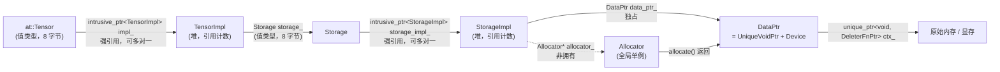

> 本文是[《C++ 在 AI-Infra：从对象模型到算子扩展》](/cpp-for-ai-infra.html)系列的第 2 篇（共八篇）。上一篇：[从源码到二进制：编译模型与项目布局](/cpp-compilation-model-and-project-layout.html)；下一篇：[模板与泛型编程](/cpp-templates-and-generic-programming.html)

打开 `aten/src/ATen/core/TensorBase.h`，`at::Tensor` 的基类是这样定义的（类定义开头和结尾）：

```cpp
class TORCH_API TensorBase {
 public:
  TensorBase() = default;
  explicit TensorBase(
      c10::intrusive_ptr<TensorImpl, UndefinedTensorImpl> tensor_impl)
      : impl_(std::move(tensor_impl)) {
    TORCH_CHECK(impl_.get(), "TensorImpl with nullptr is not supported");
  }
  TensorBase(const TensorBase&) = default;
  TensorBase(TensorBase&&) noexcept = default;
  ~TensorBase() noexcept = default;
  // ...
 protected:
  c10::intrusive_ptr<TensorImpl, UndefinedTensorImpl> impl_;
};
```

一个 Java 工程师第一次读到这里，几乎每一行都有疑问：`= default` 是什么意思，为什么要显式写出"用默认的"？`TensorBase&&` 那两个 `&` 是什么？`std::move` 移动了什么？`: impl_(std::move(tensor_impl))` 这种写在函数体前面的冒号是什么语法？`intrusive_ptr` 又是什么，为什么不用标准库的 `shared_ptr`？最根本的：一个 `Tensor` 对象里只有一个 `impl_` 字段，那数据在哪里？

再看总纲开篇那段扩展代码的签名和最后一行：

```cpp
at::Tensor scale_shift_cpu(const at::Tensor& x, double alpha, double beta) {
  // ...
  auto out = at::empty_like(x_c);
  // ...
  return out;
}
```

参数写成 `const at::Tensor&`，返回值却写成 `at::Tensor`。按 Java 的直觉，"返回一个对象"就是返回一个引用，不花钱；但在 C++ 里返回值默认是按值返回，也就是拷贝。那这个函数会不会把整个 tensor 的数据拷一遍？答案是不会，而且理由有两层：`Tensor` 是一个句柄，拷贝它只拷贝一个指针；即使是这个指针，编译器也会用移动或者直接省略（RVO）的方式避免拷贝。要说清楚这两层，就需要 C++ 的对象模型：对象在哪里、值和引用怎么区分、谁拥有谁、什么时候析构。

这是全系列最重要的一篇。Java 里所有对象都在堆上、变量都是引用、生命周期由 GC 决定；C++ 这三点都不同，而且是理解后面所有内容——模板、多态、注册、并发、与 Python 交互——的前提。本文的核心问题是总纲里的这句话：

> **`at::Tensor y = x;` 之后 `y` 和 `x` 是什么关系？什么时候数据真正被释放？**

读完本文，上面 `TensorBase` 的每一行都应该能读懂；第十章会逐行回头对照。


## 一、总览

### 1. 本文的读者与读法

本文假设读者是 C++ 的初学者：会 Java（或 Go），理解类、对象、接口、泛型、GC 这些概念，但没有系统写过 C++，或者只在学校写过 `cout << "hello"` 级别的程序。为此，本文的每一章都按同一个节奏展开：

1. **先用一段十几行、能独立编译运行的玩具代码把机制跑出来**，给出真实的输出，逐行解释；
2. **再看 PyTorch 源码里同一个机制长什么样**。源码摘录只保留说明要点的几行，删掉的部分用 `// ...` 标出；
3. **需要 Java 对照的地方，就放在对应知识点旁边**，不集中到最后。

第二章是一份"读本文需要的 C++ 语法最小集"。C++ 老手可以跳过它直接从第三章开始；初学者建议先通读一遍，后文遇到不认识的关键字时再翻回来查。第三章开始的正文，凡用到第二章之外的新语法，都会在首次出现处解释。

真实源码有两类：一类是本文正在讲的机制的直接例子（比如讲拷贝构造时看 `TensorBase` 的拷贝构造），会紧跟在玩具代码之后；另一类是需要综合多个机制才能读懂的（比如 `intrusive_ptr` 的引用计数实现、`Tensor` 到显存的整条持有链），集中放在第九、十章，那时前面的机制都已经具备。第十一章的 mini-c10 则是把所有机制用自己的代码再实现一遍。

### 2. 语言标准与版本基线

正文以 C++17 为基线（本机 PyTorch v2.10.0 源码树的顶层 `CMakeLists.txt` 把 `CMAKE_CXX_STANDARD` 设为 17，vLLM v0.15.0 的 `CMakeLists.txt` 也是 17，与本系列一致）。所有玩具代码和 mini-c10 片段用 `clang++ -std=c++17 -Wall -Wextra` 编译验证，文中给出的输出都是实际运行结果（内存地址每次运行不同）。

### 3. 本文的章节安排

```text
第二章    读本文需要的 C++ 语法最小集         类的写法、构造/析构、初始化列表、this 与 ->、关键字速查、模板怎么读
第三章    对象在哪里：栈、堆与值语义          先建立内存的图像；变量就是对象；拷贝在哪里发生；Java 的 = 与 C++ 的 = 含义完全不同
第四章    引用与指针                        T&、const T&、T* 各自的使用场景；const 的位置与含义；const 成员函数；悬垂引用
第五章    六大特殊成员函数与 Rule of Zero/Five  编译器替你写的六个函数；一个 double free 的完整案例；= default 与 = delete
第六章    右值引用、std::move 与按值返回       左值与右值；移动构造；std::move 什么都不移动；RVO/NRVO；noexcept 与移动
第七章    RAII                            确定性析构；与 try-with-resources 的边界；析构顺序；异常安全
第八章    标准智能指针                      unique_ptr、shared_ptr、weak_ptr：三种所有权关系及其代价
第九章    c10::intrusive_ptr                先用 60 行玩具版讲原理，再读真实源码；比 shared_ptr 省了什么；release/reclaim；NullType；弱引用
第十章    回到源码：从 Tensor 到显存的完整持有链  Tensor -> TensorImpl -> Storage -> StorageImpl -> DataPtr -> Allocator；回答核心问题
第十一章  mini-c10：让第一个 Tensor 跑起来      intrusive_ptr、Allocator、StorageImpl、TensorImpl、Tensor；用析构打印验证释放时序
第十二章  工程实践建议与常见错误
第十三章  本文小结
```


## 二、读本文需要的 C++ 语法最小集

这一章不讲机制，只讲"这段代码怎么读"。每一条都很短，目标是让后面章节里的代码片段没有一个符号是陌生的。

### 1. 一个最小的类

```cpp
struct Point {        // struct 定义一个类型；结尾的分号不能少
  double x, y;        // 两个数据成员（Java 叫字段）
};                    // <- 这个分号是初学者最常漏掉的

class Counter {
 public:                              // 从这里开始的成员是公开的
  void inc() { n_++; }                // 成员函数（Java 叫方法），直接在类里写函数体
  int get() const { return n_; }      // 参数列表后的 const 见第四章
 private:                             // 从这里开始的成员是私有的
  int n_ = 0;                         // 数据成员可以有默认值；PyTorch 习惯给私有成员加下划线后缀
};
```

`struct` 和 `class` 在 C++ 里几乎是一回事，唯一的区别是默认访问权限：`struct` 的成员默认 `public`，`class` 的成员默认 `private`。PyTorch 源码里两者混用，`struct TensorImpl`、`class TensorBase` 都有，看到 `struct` 不要以为它是"没有方法的数据结构"——`c10::TensorImpl` 是一个有几百个方法的 `struct`。

`public:`、`private:`、`protected:` 是分段标签，不是每个成员前面都写一遍（Java 是每个成员单独写）。一个标签管到下一个标签为止。`protected` 的含义与 Java 类似：子类可见、外界不可见。

成员函数可以直接在类定义里写函数体（如上），也可以在类里只写声明、在 `.cpp` 文件里写定义（上一篇讲过声明与定义的区别）。前一种写法在头文件里很常见，因为小函数写在类里会被当作 `inline`（上一篇第四章），可以被编译器内联，也不会违反 ODR。本文引用的 PyTorch 源码大多是这种写在头文件里的短函数。

### 2. 构造函数、成员初始化列表、析构函数

```cpp
#include <string>
#include <cstdio>

struct Tracer {
  std::string name;

  // 构造函数：名字与类名相同，没有返回类型
  Tracer(std::string n) : name(n) {          // ": name(n)" 是成员初始化列表
    std::printf("ctor %s\n", name.c_str());  // 函数体在成员都初始化完之后才运行
  }

  // 析构函数：波浪号 + 类名，无参数、无返回类型；对象销毁时自动调用
  ~Tracer() {
    std::printf("dtor %s\n", name.c_str());
  }
};
```

**成员初始化列表**（member initializer list）是本文出现频率最高、又最容易让 Java 读者迷惑的语法。它写在构造函数参数列表之后、函数体之前，以冒号开头，用逗号分隔，形式是 `成员名(初始值)`。含义是：**在进入函数体之前，用括号里的值初始化这个成员**。

为什么不像 Java 那样在函数体里写 `name = n;`？因为 C++ 的成员是真正的对象（不是引用），它们在构造函数的函数体开始运行之前**就已经被构造出来了**。如果写成：

```cpp
Tracer(std::string n) { name = n; }   // 能编译，但是两步：先默认构造一个空 string，再赋值
```

那么 `name` 先被默认构造成一个空字符串，然后在函数体里被赋值一次——两次操作。用初始化列表 `: name(n)` 则是直接用 `n` 构造 `name`，一次操作。对 `int` 这种基本类型两种写法没差别，对 `std::string`、`std::vector`、智能指针这类"有内容的"成员，初始化列表是唯一正确的写法。而且有三种成员**只能**用初始化列表：`const` 成员、引用成员、没有默认构造函数的成员。

初始化列表里成员的初始化**顺序由它们在类里的声明顺序决定**，与列表里写的顺序无关。编译器会对不一致的写法给警告（`-Wreorder`）。这一点第七章讲析构顺序时会再用到。

析构函数 `~Tracer()` 是 Java 里没有的东西：对象销毁时自动运行的函数。什么时候"销毁"，是第三章和第七章的主题。这里只需记住：**析构函数从来不需要手工调用**（第九章有一个特例，会专门指出）。

### 3. `this`、`.` 与 `->`、`*` 与 `&`

C++ 里访问成员有两个运算符：对象用 `.`，指针用 `->`。

```cpp
Point p{1.0, 2.0};    // p 是一个 Point 对象
Point* ptr = &p;      // ptr 是一个指针，存的是 p 的地址
p.x                   // 通过对象访问成员
ptr->x                // 通过指针访问成员，等价于 (*ptr).x
```

`this` 是成员函数里指向"当前对象"的**指针**（Java 的 `this` 是引用），所以访问成员写 `this->n_`，不是 `this.n_`。返回当前对象本身要写 `return *this;`（先解引用），第五章的赋值运算符里会看到。

`*` 和 `&` 各有两个含义，取决于出现的位置：

| 符号 | 出现在类型后面（声明里） | 出现在表达式前面 |
|---|---|---|
| `&` | `int& r = a;` 声明 `r` 是一个**引用** | `&a` 取 `a` 的**地址** |
| `*` | `int* p = &a;` 声明 `p` 是一个**指针** | `*p` **解引用**：`p` 指向的那个对象 |

这两个符号的双重含义是 C++ 初学者最大的阅读障碍之一。一个可靠的判读办法：紧跟在类型名（`int`、`Tensor`、`const T`）后面的是声明，其余情况是运算。`Tensor&&` 里两个连写的 `&` 是第三种东西（右值引用），第六章讲。

### 4. 关键字速查

后文源码里会反复出现下面这些关键字。此处只给一句话含义和它在本文哪一章展开：

| 关键字 | 含义 | 展开 |
|---|---|---|
| `explicit` | 加在单参数构造函数前，禁止隐式类型转换：`Tensor t = impl;` 编不过，必须写 `Tensor t(impl);` | 第六章 |
| `= default` | 显式要求编译器生成默认实现 | 第五章 |
| `= delete` | 显式禁止某个函数，调用它编译失败 | 第五章 |
| `noexcept` | 承诺这个函数不抛异常；对移动构造有性能意义 | 第六章 |
| `virtual` | 虚函数，通过基类指针调用时按实际类型分派（Java 方法默认就是虚的） | 第四篇 |
| `override` | 标记"我在覆写基类的虚函数"，写错签名时编译器报错（同 Java 的 `@Override`） | 第四篇 |
| `final` | 类不能再被继承，或虚函数不能再被覆写（同 Java） | 第四篇 |
| `static` | 类里的 `static` 成员属于类而不属于对象（同 Java）；函数里的 `static` 局部变量只初始化一次、寿命到进程结束 | 第九、十章 |
| `friend` | 允许另一个类或函数访问本类的私有成员 | 第九章 |
| `mutable` | 标在数据成员上：即使对象是 `const`，这个成员也允许修改 | 第四章 |
| `constexpr` | 编译期常量或可在编译期求值的函数 | 第三篇 |
| `inline` | 允许同一个函数定义出现在多个翻译单元 | 上一篇 |
| `nullptr` | 空指针（Java 的 `null`） | 第四章 |
| `auto` | 让编译器推导变量类型（类似 Java 10 的 `var`）：`auto out = at::empty_like(x);` | 第三篇 |
| `using X = Y;` | 类型别名（`using DeleterFnPtr = void (*)(void*);`） | 第十章 |
| `enum class` | 强类型枚举，必须写 `ScalarType::Float`，不能隐式转成 `int` | 第十一章 |

### 5. 模板怎么读

C++ 的模板是第三篇的主题，本文用到的模板只需按 Java 泛型的方式读，能读对九成：

```cpp
c10::intrusive_ptr<TensorImpl>                  // 读作"指向 TensorImpl 的 intrusive_ptr"
c10::intrusive_ptr<TensorImpl, UndefinedTensorImpl>   // 第二个参数是"空值用什么表示"，第九章
std::unique_ptr<void, void (*)(void*)>          // 第二个参数是删除器的类型，第八章
std::vector<at::Tensor>                         // Tensor 的动态数组
std::optional<int64_t>                          // 可能有值也可能没有（同 Java 的 Optional<Long>）

template <class T>                              // 定义一个模板：T 是类型参数
class intrusive_ptr { T* target_; /* ... */ };  // 类体里可以用 T 声明成员、参数、返回值
```

三点差别需要提前知道：第一，C++ 的模板参数可以是基本类型（`std::vector<int>` 合法，Java 必须 `List<Integer>`）；第二，模板参数还可以不是类型（`std::array<float, 4>` 的 `4`）；第三，也是最重要的：Java 泛型编译后只有一份代码，C++ 模板为每组参数生成一份独立的类——`intrusive_ptr<TensorImpl>` 和 `intrusive_ptr<StorageImpl>` 是两个互不相干的类型，没有共同的父类。

源码里还会出现 `template <class... Args>` 和 `Args&&... args`、`std::forward<Args>(args)...` 这种写法。它们的意思是"接受任意个任意类型的参数，并原样转发给别的函数"，本文遇到时只需这样读，机制留给第三篇。

### 6. 其他

- **命名空间**：`c10::intrusive_ptr`、`std::move`、`at::Tensor` 里的 `::` 是命名空间分隔符，相当于 Java 包名里的 `.`。上一篇第七章讲过 `c10::`、`at::`、`torch::` 的分工。
- **`std::printf` 与格式符**：本文用 C 风格的 `printf` 而不是 `std::cout`，因为输出格式更紧凑。`%p` 打印指针，`%zu` 打印 `size_t`，`%g` 打印浮点，`%s` 打印 C 字符串（`std::string` 要用 `.c_str()` 转）。
- **`sizeof(T)`**：类型 `T` 的一个对象占多少字节，编译期常量。本文会多次用它说明"这个对象有多大"。
- **花括号初始化**：`Point p{1.0, 2.0};` 按成员顺序初始化；`Tensor t{};` 是默认初始化。C++11 之后推荐的统一写法。
- **头文件**：`#include <memory>` 引入智能指针，`<utility>` 引入 `std::move`，`<cstdio>` 引入 `printf`。上一篇讲过 `#include` 是文本拼接。
- **`std::string` / `std::vector`**：与 Java 的 `String`/`ArrayList` 对应的标准库类型，但它们是**值类型**——这正是第三章要讲的第一件事。

有了这些，就可以进入正文了。


## 三、对象在哪里：栈、堆与值语义

### 1. 先建立内存的图像

Java 工程师很少需要想"对象在内存的哪个位置"，因为语言不让你看到地址。C++ 里地址随处可见，所以先把图像建立起来。一个正在运行的程序，内存里有两块与本文有关的区域：

- **栈**（stack）：每次函数调用在栈顶压入一个**栈帧**（stack frame），存放这次调用的参数和局部变量；函数返回时整个栈帧弹出，里面的东西全部消失。分配和释放都只是移动一下栈顶指针，几乎零成本，但生命周期被函数调用严格限制。
- **堆**（heap）：由 `new`/`malloc` 按需分配、由 `delete`/`free` 归还的区域。生命周期不受函数调用限制，但每次分配要走分配器，有开销，而且**谁分配、谁负责释放**是程序员的责任。

Java 里除了基本类型和引用本身，所有对象都在堆上。C++ 里对象默认在栈上，或者嵌在别的对象里，只有显式 `new` 才在堆上。用一个小程序把这两种情况都打印出来：

```cpp
#include <cstdio>
struct Point { double x, y; };

int main() {
  Point p{1.0, 2.0};      // 栈上的对象
  Point q = p;            // 另一个栈上的对象，内容从 p 拷贝
  q.x = 3.0;
  Point* hp = &p;         // hp 是一个指针变量（本身在栈上），存的是 p 的地址
  std::printf("sizeof(Point)=%zu\n", sizeof(Point));
  std::printf("p at %p  q at %p  hp=%p\n", (void*)&p, (void*)&q, (void*)hp);
  std::printf("p.x=%g q.x=%g hp->x=%g\n", p.x, q.x, hp->x);

  Point* heap = new Point{5.0, 6.0};   // 堆上的对象
  std::printf("heap object at %p, pointer variable itself at %p\n", (void*)heap, (void*)&heap);
  delete heap;
}
```

输出（地址每次不同，但相对关系不变）：

```text
sizeof(Point)=16
p at 0x16b3fecb0  q at 0x16b3feca0  hp=0x16b3fecb0
p.x=1 q.x=3 hp->x=1
heap object at 0x104f4dc30, pointer variable itself at 0x16b3fec90
```

逐行看：

- `Point` 有两个 `double`，所以一个 `Point` 对象占 16 字节。`p` 和 `q` 是两个不同的对象，地址相差 16——它们在 `main` 的栈帧里紧挨着。
- `hp` 的**值**等于 `p` 的地址。`hp->x` 就是"顺着 `hp` 找到那个对象，取它的 `x`"，所以是 `p.x` 的 1，不是 `q.x` 的 3。
- 堆对象的地址（`0x104f...`）与栈上变量的地址（`0x16b3...`）明显在不同的区域。指针变量 `heap` 自己在栈上，它指向的 `Point` 在堆上。`delete heap` 释放的是堆上那 16 字节，`heap` 这个 8 字节的指针变量要等 `main` 返回、栈帧弹出时才消失。

把这幅图画出来（`main` 返回前的瞬间）：

```text
栈（main 的栈帧）                              堆
┌──────────────────────────────┐
│ p:    x=1.0  y=2.0  (16 B)   │◄──┐
│ q:    x=3.0  y=2.0  (16 B)   │   │
│ hp:   0x16b3fecb0   (8 B) ───┼───┘         ┌────────────────────┐
│ heap: 0x104f4dc30   (8 B) ───┼────────────►│ x=5.0  y=6.0 (16 B)│
└──────────────────────────────┘             └────────────────────┘
```

本文后面所有关于"拷贝"、"引用"、"所有权"、"析构"的讨论，都可以放回这幅图里检验。

### 2. Java 的模型：变量是引用，对象在堆上

Java 里写 `Tensor y = x;`，发生的事情是：`x` 和 `y` 是两个引用（本质上就是上图里 `hp` 这样的指针），指向堆上的同一个对象。对象什么时候被回收，由 GC 在某个不确定的时刻决定。除了八种基本类型，Java 没有"对象在栈上"这个概念，也没有"把一个对象按值拷贝一份"的默认语义——要拷贝必须显式调用 `clone()` 或拷贝构造。

这个模型简单统一，但它有一个隐藏成本：**每个对象都是一次堆分配，每次访问都是一次间接寻址**。JIT 的逃逸分析能消除一部分，但语言层面没有表达"这个对象就住在这里"的手段。

### 3. C++ 的模型：变量就是对象

C++ 的默认恰好相反。声明一个变量，就是在当前作用域里创建一个对象；这个对象的存储空间在栈上（或者作为另一个对象的成员，嵌在那个对象里）；作用域结束，对象析构，空间回收。上面的 `Point p{1.0, 2.0};` 就是这样：`p` 不是"指向一个 Point 的引用"，`p` **就是**那 16 字节。

这叫**值语义**（value semantics）：变量代表值本身，赋值和传参默认拷贝值，两个变量之间没有隐藏的共享。`Point q = p;` 之后改 `q.x` 不影响 `p.x`，上面的输出已经证明了。`std::vector<int> b = a;` 会把 `a` 的所有元素拷一份；`std::string s2 = s1;` 也一样——这两个在 Java 里是引用类型的东西，在 C++ 里是值类型。

"嵌在别的对象里"这一点也值得单独强调。Java 里一个类的字段如果是对象类型，字段存的是引用，对象另在堆上；C++ 里字段就是对象本身：

```cpp
struct Line { Point a; Point b; };   // sizeof(Line) == 32：两个 Point 直接嵌在 Line 里
```

`Line` 对象里没有任何指针，32 字节就是两个 `Point` 排在一起。第十章会看到 `TensorImpl` 里嵌着一个 `Storage`、`Storage` 里嵌着一个 `intrusive_ptr`，都是这种"成员就是对象"的嵌套。

堆对象需要显式创建：

```cpp
Point* hp = new Point{1.0, 2.0};   // 在堆上分配，hp 是一个指针（本身在栈上）
delete hp;                         // 必须手工释放；忘了就泄漏，删两次就崩
```

现代 C++ 几乎不直接写 `new`/`delete`，而是用智能指针（第八章）或容器来管理堆对象。但要明白：**智能指针管理的对象在堆上，智能指针本身是一个栈上（或成员）的值对象**。`std::unique_ptr<Point> up = std::make_unique<Point>();` 里，`up` 是一个 8 字节的栈对象，它指向的 `Point` 在堆上。`up` 析构时顺手 `delete` 了那个 `Point`。这就是第七章要讲的 RAII 的雏形。

### 4. 拷贝在哪里发生

值语义意味着拷贝会在很多不显眼的地方发生。对一个类型 `T`，下面每一处都会调用 `T` 的**拷贝构造函数**（用一个已有对象初始化一个新对象的构造函数，第五章详述），除非编译器能省略：

```cpp
T b = a;                 // 1. 用 a 初始化 b
T c(a);                  // 同上，另一种写法
void f(T t);  f(a);      // 2. 按值传参：形参 t 是 a 的拷贝
T g() { T t; return t; } // 3. 按值返回（通常被优化掉，见第六章）
std::vector<T> v; v.push_back(a);   // 4. 放进容器：容器里存的是拷贝
auto lam = [a]() {};     // 5. lambda 按值捕获
```

而这些地方**不会**拷贝：

```cpp
T& r = a;                // 引用：r 是 a 的别名（第四章）
const T& cr = a;         // 常量引用：同上，但不能通过 cr 修改
T* p = &a;               // 指针：p 存的是 a 的地址
void f(const T& t); f(a);// 按常量引用传参：不拷贝
```

光看代码不容易相信"这里真的拷贝了"，所以做一个能自己报告构造和析构的类。下面这个 `Tracer` 会在本文多次出现，每次多加几个成员函数：

```cpp
#include <cstdio>
#include <string>

struct Tracer {
  std::string name;
  Tracer(std::string n) : name(n)              { std::printf("ctor      %s\n", name.c_str()); }
  ~Tracer()                                    { std::printf("dtor      %s\n", name.c_str()); }
  Tracer(const Tracer& o) : name(o.name + "'") { std::printf("copy-ctor %s\n", name.c_str()); }
};

void by_value(Tracer t)       { std::printf("  in by_value, got %s\n", t.name.c_str()); }
void by_cref(const Tracer& t) { std::printf("  in by_cref, got %s\n", t.name.c_str()); }

int main() {
  Tracer a("a");
  Tracer b = a;
  by_value(b);
  by_cref(b);
  std::printf("end of main\n");
}
```

第三个构造函数 `Tracer(const Tracer& o)` 就是拷贝构造函数：参数是"对另一个 `Tracer` 的常量引用"，函数体决定"拷贝"是什么意思——这里是把名字加一个撇号，方便在输出里区分谁是谁的拷贝。输出：

```text
ctor      a
copy-ctor a'
copy-ctor a''
  in by_value, got a''
dtor      a''
  in by_cref, got a'
end of main
dtor      a'
dtor      a
```

对照代码：

- `Tracer a("a")`：构造 `a`。
- `Tracer b = a`：调用拷贝构造，得到 `a'`。此刻栈上有两个 `Tracer` 对象。
- `by_value(b)`：形参 `t` 是 `b` 的拷贝（`a''`），函数返回时 `t` 所在的栈帧弹出，`a''` 析构。一进一出，一次拷贝构造加一次析构。
- `by_cref(b)`：什么构造都没发生，函数里的 `t` 就是 `b` 本身。
- `main` 结束：`b`（`a'`）和 `a` 析构，注意顺序是**先 `b` 后 `a`**——与声明顺序相反。

逆序析构是 C++ 的硬性规则：同一作用域里后构造的先析构。第七章讲 `TensorImpl` 成员释放顺序时会用到。

### 5. Java 对照：`=` 的含义完全不同

| 表达式 | Java | C++ |
|---|---|---|
| `T b = a;` | `b`、`a` 引用同一对象 | `b` 是 `a` 的一份拷贝（新对象） |
| `b.x = 1;` | `a.x` 也变了 | `a.x` 不变 |
| `f(a)` | 传引用（引用本身按值拷贝） | 默认拷贝整个对象；写 `const T&` 才是"传引用" |
| 对象何时销毁 | GC 决定 | 作用域结束时，确定 |
| 对象在哪 | 堆 | 默认栈/成员内嵌；`new` 才在堆 |
| 类的字段 | 引用，对象另在堆上 | 对象本身嵌在外层对象里 |

理解这张表之后再看 `at::Tensor y = x;`，会产生一个正确的担心：这是不是拷贝了整个 tensor？答案是"拷贝了整个 `Tensor` 对象，但 `Tensor` 对象只有一个指针那么大"。`Tensor` 是一个刻意设计成**值语义外壳、引用语义内核**的类型：拷贝它很便宜，拷贝之后两个 `Tensor` 共享同一个 `TensorImpl`。这种设计叫句柄（handle）——`Tensor` 对象本身只是一个"把手"，真正的东西在它指向的地方。第十章会完整拆开。


## 四、引用与指针：`T&`、`const T&`、`T*`

### 1. 引用是别名

`T&` 是"对 `T` 的引用"。它不是一个新对象，而是已有对象的另一个名字：

```cpp
#include <cstdio>
int main() {
  int a = 1;
  int& r = a;      // r 就是 a 的别名
  int* p = &a;     // p 是指针，存 a 的地址
  r = 2;
  std::printf("a=%d r=%d *p=%d\n", a, r, *p);
  *p = 3;
  std::printf("a=%d r=%d *p=%d\n", a, r, *p);
  std::printf("&a=%p &r=%p p=%p\n", (void*)&a, (void*)&r, (void*)p);
  int b = 10;
  r = b;           // 注意：这不是让 r 改指 b，而是把 b 的值赋给 a
  std::printf("a=%d b=%d &r==&a? %d\n", a, b, &r == &a);
}
```

```text
a=2 r=2 *p=2
a=3 r=3 *p=3
&a=0x16ae2acdc &r=0x16ae2acdc p=0x16ae2acdc
a=10 b=10 &r==&a? 1
```

三点观察：通过 `r` 赋值改的就是 `a`；`&r` 和 `&a` 是同一个地址，`r` 没有自己的存储；最后一行最关键——`r = b;` **不是**"让 `r` 指向 `b`"，而是"把 `b` 的值写进 `r` 所指的对象（也就是 `a`）"，之后 `&r` 仍然等于 `&a`。

引用有三条硬性规则：必须在声明时绑定到一个对象；绑定后不能再改绑到别的对象；不能为空。这三条使引用比指针安全得多，也使它成为传参的默认选择。

Java 的引用可以为 `null`，可以重新赋值指向别的对象；C++ 的引用两者都不行。因此"Java 引用"更接近 C++ 的**指针**而不是 C++ 的引用。读到 `Tensor&` 时不要按 Java 的"引用变量"去想，要想成"这个函数直接操作调用方的那个对象"。

### 2. 三种传参方式与选择规则

一个函数要接收一个 `Tensor`，有三种主要写法：

```cpp
void f(at::Tensor t);          // 按值：拷贝一个句柄，refcount +1，函数结束 -1
void f(const at::Tensor& t);   // 按常量引用：零开销，函数内不能改 t
void f(at::Tensor& t);         // 按非常量引用：零开销，函数内可以改 t
```

选择规则可以归纳成一张表。表里的"临时对象"指没有名字、只在一条语句里存在的对象，比如 `f(x.contiguous())` 中 `x.contiguous()` 的返回值，第六章会给它正式的名字（右值）：

| 写法 | 拷贝？ | 函数内能修改？ | 能接受临时对象？ | 典型用途 |
|---|---|---|---|---|
| `T` | 是 | 是（改的是副本） | 是 | 小对象（`int`、`double`、`Device`）；或函数需要自己持有一份（sink 参数，第六章） |
| `const T&` | 否 | 否 | 是 | **只读输入的默认选择** |
| `T&` | 否 | 是 | 否 | 输出参数、in-place 修改 |
| `T*` | 否 | 看 `const` | 是（传地址） | 可以为空；或者表达"非拥有"关系 |
| `T&&` | 否 | 是 | 只接受临时对象 | 移动构造/移动赋值（第六章） |

为什么 `T&` 不能接受临时对象？因为 `T&` 的语义是"我要修改调用方的对象"，而临时对象在语句结束就消失了，修改它没有意义，编译器干脆禁止。`const T&` 承诺不修改，所以允许绑定临时对象（编译器会让临时对象活到引用失效为止）。

回到 `scale_shift_cpu(const at::Tensor& x, double alpha, double beta)`：`x` 只读，用 `const at::Tensor&`；`alpha`、`beta` 是 8 字节的 `double`，按值传比按引用传还便宜（引用底层是指针，也是 8 字节，还多一次解引用）。这正是 PyTorch 生成的算子签名的约定：Tensor 用 `const Tensor&`，标量按值。

vLLM 的 `csrc/cache.h` 提供了 `T&` 和 `const T&` 并存的例子：

```cpp
void reshape_and_cache(torch::Tensor& key, torch::Tensor& value,
                       torch::Tensor& key_cache, torch::Tensor& value_cache,
                       torch::Tensor& slot_mapping,
                       const std::string& kv_cache_dtype,
                       torch::Tensor& k_scale, torch::Tensor& v_scale);

void gather_and_maybe_dequant_cache(
    torch::Tensor const& src_cache,     // [NUM_BLOCKS, BLOCK_SIZE, ENTRIES...]
    torch::Tensor const& dst,           // [TOT_TOKENS, ENTRIES...]
    torch::Tensor const& block_table,   // [BATCH, BLOCK_INDICES]
    // ...
    std::optional<torch::Tensor> seq_starts = std::nullopt);
```

`key_cache`、`value_cache` 是要被写入的 KV cache，用 `torch::Tensor&`；`src_cache`、`block_table` 只读，用 `torch::Tensor const&`。注意 `torch::Tensor const&` 与 `const torch::Tensor&` 完全等价，前者叫 "east const" 风格（下一节解释为什么等价），vLLM 两种写法混用，读的时候不必在意。`std::optional<torch::Tensor>` 按值传，因为 `optional<Tensor>` 也只是一个句柄加一个 bool，拷贝很便宜，而且这样调用方可以传 `std::nullopt` 或者临时对象。

顺带一提：`torch::Tensor&` 在这里其实有些多余——`Tensor` 是句柄，通过 `const Tensor&` 也能修改它指向的数据（4.3 节第五点解释）。vLLM 这样写更多是历史习惯。

### 3. `const` 的位置与含义

`const` 是 C++ 里出现频率最高、位置最灵活的关键字，也是初学者读源码时最常被绊倒的地方。它可以出现在五个位置上，含义各不相同，下面逐个用编译器的反应来验证。

**第一，修饰变量：这个变量的值不能改。**

```cpp
const int a = 1;
a = 2;      // error: cannot assign to variable 'a' with const-qualified type 'const int'
```

`int const a = 1;` 与 `const int a = 1;` 完全等价。C++ 的规则是**`const` 修饰它左边最近的东西；左边没有东西时才修饰右边的**。`int const` 里 `const` 左边是 `int`，`const int` 里 `const` 左边没东西、修饰右边的 `int`，结果一样。把 `const` 写在类型右边的风格叫 "east const"，PyTorch 少用，vLLM 有些文件用。

**第二，与指针搭配：`const` 在 `*` 左边还是右边，意思完全不同。** 这是最容易混的地方，用上面的规则判读：

```cpp
int x = 1, y = 2;

const int* p = &x;   // const 修饰 int：p 指向的东西是常量，p 自己可以改指向
*p = 2;              // error: read-only variable is not assignable
p = &y;              // OK

int* const q = &x;   // const 修饰 *（指针本身）：q 不能改指向，但通过 q 可以改值
*q = 5;              // OK
q = &y;              // error: cannot assign to variable 'q' with const-qualified type 'int *const'

const int* const r = &x;   // 两个都不能改
```

记法：从变量名往左读。`p` → `*`（是个指针）→ `const int`（指向 const int）；`q` → `const`（自己是常量）→ `*`（是个指针）→ `int`（指向 int）。PyTorch 源码里绝大多数是第一种 `const T*`（"指向只读数据的指针"），例如 `const float* in = x.data_ptr<float>();`。

**第三，与引用搭配：`const T&` 表示"通过这个引用只能读、不能写"。**

```cpp
const Tensor& t = x;   // 通过 t 不能修改 x（但 x 自己还是可以改）
```

引用本身不能改绑，所以不存在"引用是 const"和"引用指向的东西是 const"两种情况，`const T&` 只有一种含义。它是上一节说的"只读输入的默认传参方式"。

**第四，修饰成员函数：这个函数不修改对象。** 这是对读源码最重要的一种。写法是在成员函数的参数列表**后面**加 `const`：

```cpp
struct Counter {
  int n = 0;
  int get() { return n; }          // 忘了加 const
  void inc() { n++; }
};

int read(const Counter& c) {
  return c.get();
}
```

这段代码编不过：

```text
error: 'this' argument to member function 'get' has type 'const Counter',
       but function is not marked const
```

原因是：`c` 是 `const Counter&`，通过它只能调用**承诺不修改对象**的成员函数，而承诺的方式就是在函数后面写 `const`。`get()` 没写，编译器就不知道它会不会改 `n`，于是拒绝。把声明改成 `int get() const { return n; }` 就通过了。在 `const` 成员函数里，`this` 的类型是 `const Counter*`，任何修改成员的语句（`n++`）都会报错——所以这个 `const` 是编译器强制检查的承诺，不是注释。

回头看 `TensorBase.h`，几乎所有的访问器都是 `const` 成员函数：

```cpp
  bool defined() const {
    return impl_;
  }
  size_t use_count() const noexcept {
    return impl_.use_count();
  }
  bool is_contiguous(at::MemoryFormat memory_format=at::MemoryFormat::Contiguous) const {
    return impl_->is_contiguous(memory_format);
  }
```

如果 `defined()` 不加 `const`，那么 `void f(const at::Tensor& x) { x.defined(); }` 就编不过。这就是为什么写类的时候要给所有"只读"方法加 `const`——否则这个类型没法通过 `const T&` 传递，整个 PyTorch 的算子签名约定就用不了。

**第五，`Tensor` 的 `const` 是浅的。** 这一点要特别小心：`const Tensor&` 保护的是**句柄**不被改（不能让它指向别的 `TensorImpl`），但不保护它**指向的数据**。`mutable_data_ptr()` 在 `TensorBase.h` 里就是 `const` 成员函数：

```cpp
  void* mutable_data_ptr() const {
    return this->unsafeGetTensorImpl()->mutable_data();
  }
```

为什么一个"返回可写数据指针"的函数能标 `const`？因为它确实没有修改 `Tensor` 对象本身——`Tensor` 对象里只有一个 `impl_` 指针，函数只是顺着指针取了一个地址返回，`impl_` 没变。C++ 的 `const` 只看这个对象自己的字节有没有被改，不追踪指针指向的地方。所以 `const at::Tensor& out` 作为参数时，函数体里照样能往 `out` 的数据里写。这是 PyTorch 有意的设计，读 in-place 算子时不要被 `const` 误导。Java 里没有对应概念（`final` 只管引用不能重新赋值，与此处的浅 `const` 倒是相似）。

**补充：`mutable`。** 标记在数据成员上，表示即使对象是 `const`、即使在 `const` 成员函数里，这个成员也可以改。典型用途是缓存和引用计数：对一个 `const TensorImpl` 增减引用计数并不改变它的"逻辑状态"，所以第九章会看到 `intrusive_ptr_target` 的计数字段是 `mutable` 的。

### 4. 指针用在哪里

有了引用和智能指针（第八章）之后，现代 C++ 里裸指针 `T*` 主要保留两个用途。

**第一，表达"非拥有"（non-owning）关系**：我知道这个对象在哪，但我不负责它的生死。`StorageImpl` 持有的 `Allocator*` 就是典型（`c10/core/StorageImpl.h`，私有成员）：

```cpp
  DataPtr data_ptr_;
  SymInt size_bytes_;
  // ...
  Allocator* allocator_;
```

`Allocator` 是进程级的全局对象（`c10/core/Allocator.h` 里 `SetAllocator` 的注释写明 "The passed in allocator pointer is expected to have static lifetime; this function does NOT take ownership of the raw pointer"），成千上万个 `StorageImpl` 都指向同一个，谁也不拥有它。用裸指针正好。

**第二，表达"可以为空"**：引用不能为空，需要"可能没有"的语义时用指针（或者 `std::optional`）。`nullptr` 是 C++11 引入的空指针字面量，对应 Java 的 `null`；旧代码里的 `NULL` 和 `0` 是同一个意思。

裸指针**不**再用来表达所有权。看到 `T*` 就应该默认它不拥有对象；拥有关系用 `unique_ptr`、`shared_ptr`、`intrusive_ptr` 表达。PyTorch 源码里凡是名字带 `unsafe` 的、返回裸指针的方法——`unsafeGetTensorImpl()`、`unsafeGetStorageImpl()`——都是在说"我把内部指针借给你看一眼，你别拿它做所有权操作"。

### 5. 悬垂引用：C++ 没有 GC 兜底

引用和指针都不延长对象的寿命。对象死了，引用就悬垂（dangling），再访问是**未定义行为**（undefined behavior）——可能崩，可能读到垃圾，可能碰巧正常，编译器不做任何保证。Java 里不存在这个问题，因为只要有引用，对象就活着。

最经典的悬垂是返回局部变量的引用：

```cpp
const std::string& bad() {
  std::string local = "hello";
  return local;          // local 在函数返回时析构，返回的引用指向一块已经回收的栈内存
}
int main() { const std::string& s = bad(); /* 使用 s 是未定义行为 */ }
```

clang 会给警告：

```text
warning: reference to stack memory associated with local variable 'local' returned
         [-Wreturn-stack-address]
```

但编译器只能识别最简单的情形。把引用存进成员、放进容器、被 lambda 捕获，然后对象在别处析构——这些编译器都查不出来。

`TensorBase.h` 里有一行专门防止一种悬垂：

```cpp
  // Use .contiguous() instead. Trying to borrow from a prvalue
  // will only lead to trouble and dangling references.
  c10::MaybeOwned<TensorBase> expect_contiguous(
      MemoryFormat memory_format=MemoryFormat::Contiguous) && = delete;
```

`expect_contiguous()` 返回一个"可能是借用、可能是拥有"的包装（`MaybeOwned`，第十章再讲）。如果在一个临时 `Tensor` 上调用它，借用的对象在这个表达式结束时就死了，返回值立刻悬垂。参数列表后面的 `&&` 是"引用限定符"，意思是"这个版本的函数只在临时对象上被调用"，`= delete` 则是"禁止"（第五章）。合起来就是"禁止在临时对象上调用这个函数"，把这种错误从运行期提前到编译期。第六章讲完左值右值之后再回头看这一行会更清楚。

这一章的要点：引用是零开销的别名，`const T&` 是只读输入的默认传参方式；`const` 的五个位置各有含义，其中 `const` 成员函数决定了一个类型能不能在 `const T&` 上使用；`Tensor` 的 `const` 是浅的；裸指针表达非拥有和可空；引用不延长寿命，悬垂是 C++ 特有的风险。


## 五、六大特殊成员函数与 Rule of Zero/Five

### 1. 编译器会替你写的六个函数

Java 里一个类只需要关心构造函数；C++ 的每个类都有六个"特殊成员函数"，如果你不写，编译器在需要时会按规则生成：

```cpp
struct T {
  T();                              // 1. 默认构造：T t; 或 T t{}; 时调用
  ~T();                             // 2. 析构：对象销毁时调用
  T(const T& other);                // 3. 拷贝构造：T b = a; 或按值传参、按值返回时调用
  T& operator=(const T& other);     // 4. 拷贝赋值：已有对象 b 再执行 b = a; 时调用
  T(T&& other) noexcept;            // 5. 移动构造（C++11）：从一个临时对象初始化新对象
  T& operator=(T&& other) noexcept; // 6. 移动赋值（C++11）：从一个临时对象赋给已有对象
};
```

3 和 4 的区别值得停一下：`T b = a;` 是**构造**一个新对象 `b`（此前 `b` 不存在），走拷贝构造；`b = a;` 是给**已经存在**的 `b` 赋新值，走拷贝赋值。后者的签名 `T& operator=(const T&)` 是运算符重载——C++ 允许类为 `=`、`+`、`==`、`[]` 等运算符定义自己的行为，`operator=` 就是 `=` 的定义。它返回 `T&`（`*this` 的引用）是为了支持 `a = b = c;` 这种链式写法。5 和 6 是第六章的主题，这里先知道它们存在。

编译器生成的版本做的事情是"逐成员"（memberwise）操作：默认构造逐成员默认构造，拷贝构造逐成员拷贝构造，拷贝赋值逐成员赋值，析构逐成员析构（逆序）。对只包含 `int`、`double`、`std::string`、`std::vector` 这类成员的结构体，编译器生成的六个函数就是正确的，一个字都不用写——因为 `std::string` 和 `std::vector` 自己知道怎么正确地拷贝和释放。

Java 只有构造函数（和几乎不用的 `finalize`），没有拷贝构造、赋值运算符、移动这些概念——因为 Java 的 `=` 永远是引用赋值，不需要定义"拷贝一个对象是什么意思"。C++ 的 `=` 是值操作，所以每个类型都要回答这个问题。

### 2. 一个 double free 的完整案例

编译器生成的逐成员拷贝在什么时候是**错**的？当类直接管理某种资源（裸内存、文件句柄、引用计数）的时候。看一个最小的例子——一个自己 `new` 内存的缓冲区：

```cpp
#include <cstdio>
struct Buffer {
  float* data;
  int n;
  Buffer(int n_) : data(new float[n_]), n(n_) { std::printf("alloc %p\n", (void*)data); }
  ~Buffer() { std::printf("free  %p\n", (void*)data); delete[] data; }
  // 没写拷贝构造：编译器生成一个"逐成员拷贝"的版本
};

int main() {
  Buffer a(4);
  Buffer b = a;        // 编译器生成的拷贝构造：b.data = a.data; b.n = a.n;
  std::printf("a.data=%p b.data=%p\n", (void*)a.data, (void*)b.data);
}
```

运行：

```text
alloc 0x104c09c00
a.data=0x104c09c00 b.data=0x104c09c00
free  0x104c09c00
free  0x104c09c00
[进程被系统中止：malloc: pointer being freed was not allocated]
```

发生了什么：`Buffer b = a;` 逐成员拷贝，两个对象的 `data` 指向**同一块**堆内存。`main` 结束时 `b` 先析构、`delete[]` 那块内存；然后 `a` 析构、再 `delete[]` 一次同一个地址。这就是 **double free**，C++ 里最经典的内存错误之一。画出来：

```text
栈                                       堆
┌───────────────────┐
│ a: data ──────────┼────────┐
│    n = 4          │        ▼
│ b: data ──────────┼────► ┌──────────────────┐
│    n = 4          │      │ float[4] (16 B)  │   <- 被 delete[] 两次
└───────────────────┘      └──────────────────┘
```

Java 里没有这个问题：两个引用指向同一对象是常态，GC 只回收一次。C++ 里"两个对象都认为自己拥有同一份资源"就是 bug。修法是**自己写**拷贝构造和拷贝赋值，定义"拷贝一个 `Buffer`"的正确含义——分配一块新内存并复制内容：

```cpp
#include <algorithm>
#include <cstdio>
#include <utility>

struct Buffer {
  float* data = nullptr;
  int n = 0;

  Buffer() = default;
  explicit Buffer(int n_) : data(new float[n_]), n(n_) { std::printf("alloc %p\n", (void*)data); }
  ~Buffer() { if (data) std::printf("free  %p\n", (void*)data); delete[] data; }   // delete[] nullptr 是安全的

  // 拷贝构造：深拷贝
  Buffer(const Buffer& o) : data(new float[o.n]), n(o.n) {
    std::copy(o.data, o.data + n, data);
    std::printf("copy  %p -> %p\n", (void*)o.data, (void*)data);
  }
  // 移动构造：偷走对方的指针，对方置空（第六章详解，这里先照抄）
  Buffer(Buffer&& o) noexcept : data(o.data), n(o.n) {
    o.data = nullptr; o.n = 0;
    std::printf("move  %p (stolen)\n", (void*)data);
  }
  // 两个赋值运算符都用 copy-and-swap 惯用法（见下文）
  Buffer& operator=(const Buffer& o) { Buffer tmp(o); swap(tmp); return *this; }
  Buffer& operator=(Buffer&& o) noexcept { Buffer tmp(std::move(o)); swap(tmp); return *this; }

  void swap(Buffer& o) noexcept { std::swap(data, o.data); std::swap(n, o.n); }
};

int main() {
  Buffer a(4);
  Buffer b = a;               // 拷贝构造
  Buffer c = std::move(a);    // 移动构造
  std::printf("a.data=%p b.data=%p c.data=%p\n", (void*)a.data, (void*)b.data, (void*)c.data);
  b = c;                      // 拷贝赋值
  std::printf("after b = c\n");
}
```

```text
alloc 0x1009edbc0
copy  0x1009edbc0 -> 0x1009edbd0
move  0x1009edbc0 (stolen)
a.data=0x0 b.data=0x1009edbd0 c.data=0x1009edbc0
copy  0x1009edbc0 -> 0x1009edbe0
free  0x1009edbd0
after b = c
free  0x1009edbc0
free  0x1009edbe0
```

对照输出：`b` 拿到了一块新内存（`...bd0`）；`c` 从 `a` 手里**偷**走了 `...bc0`，`a.data` 变成空；`b = c` 时先把 `c` 深拷贝成一个临时对象 `tmp`（`...be0`），再把 `tmp` 和 `b` 的内容交换，函数返回时 `tmp` 析构、顺手释放了 `b` 原来的 `...bd0`——这就是 `after b = c` 之前那行 `free`。最后 `main` 结束，`c`、`b` 逆序析构，各释放自己那块，`a` 的 `data` 是空所以没有打印。每块内存恰好释放一次。

**copy-and-swap** 值得多说一句，因为 `c10::intrusive_ptr` 的赋值也是这么写的（第九章）。赋值运算符最麻烦的地方是：要释放自己原来的资源、要接收新资源、还要处理 `a = a;` 这种自赋值和"拷贝过程中抛异常"的情况。copy-and-swap 把这三件事一次解决：先用参数构造一个临时对象（如果这一步抛异常，`*this` 还没被碰过，安然无恙），再和 `*this` 交换（交换指针不会抛异常），临时对象析构时带走旧资源。自赋值时 `tmp` 是自己的拷贝，交换后再析构掉，结果正确只是多做了一次拷贝。

### 3. `= default` 与 `= delete`

C++11 加了两个声明方式，让"用编译器生成的"和"禁止"都能写在代码里：

- `T(const T&) = default;`：显式要求编译器生成默认版本。作用是把"隐含的"写成"明确的"，读代码的人一眼就知道这个类是可拷贝的、行为是逐成员拷贝。
- `T(const T&) = delete;`：显式禁止。任何试图拷贝的代码都会编译失败，错误信息是 "call to deleted constructor"。

再看本文开头 `TensorBase` 的那几行，现在能读懂了：

```cpp
  TensorBase(const TensorBase&) = default;
  TensorBase(TensorBase&&) noexcept = default;
  ~TensorBase() noexcept = default;
  // ...
  TensorBase& operator=(const TensorBase& x) & = default;
  TensorBase& operator=(TensorBase&& x) & noexcept = default;
```

`TensorBase` 唯一的成员是 `impl_`（一个 `intrusive_ptr`），逐成员拷贝就是拷贝这个 `intrusive_ptr`——而 `intrusive_ptr` 的拷贝构造会把引用计数 +1（第九章）。所以 `TensorBase` 的拷贝、移动、析构全部 `= default` 就是正确的，作者只是把它们写出来，明确"这个类是可拷贝可移动的值类型"。（赋值运算符参数列表后面的 `&` 是引用限定符，第六章解释。）

`TensorImpl` 则是反面（`c10/core/TensorImpl.h`，类定义开头附近）：

```cpp
struct C10_API TensorImpl : public c10::intrusive_ptr_target {
  TensorImpl() = delete;
  ~TensorImpl() override;
  // ...
 public:
  TensorImpl(const TensorImpl&) = delete;
  TensorImpl& operator=(const TensorImpl&) = delete;
  TensorImpl(TensorImpl&&) = delete;
  TensorImpl& operator=(TensorImpl&&) = delete;
```

`TensorImpl` 是被引用计数管理的、独一无二的对象，拷贝它没有意义（两个 `TensorImpl` 共享一个引用计数？共享一个 `PyObject` 槽？），所以六个函数里除了析构全部删除，连默认构造都不允许（必须带着 `Storage` 和 `DispatchKeySet` 构造）。`StorageImpl` 同样（`c10/core/StorageImpl.h`）。

这是一个非常实用的阅读线索：**看一个类的特殊成员函数是 `default` 还是 `delete`，就知道它是"值"还是"实体"**。`Tensor`、`Storage`、`Device`、`ScalarType` 是值，随便拷；`TensorImpl`、`StorageImpl`、`Allocator` 是实体，只能通过指针/引用/智能指针访问。Java 里所有对象都是"实体"（只能通过引用访问），所以 Java 工程师读 C++ 代码时要养成先问一句"这个类型是值还是实体"的习惯。

### 4. Rule of Zero 与 Rule of Five

上面的例子引出两条经验法则：

**Rule of Zero**：如果你的类的所有成员都已经正确管理了自己的资源（`std::string`、`std::vector`、`unique_ptr`、`shared_ptr`、`intrusive_ptr`……），那么六个特殊成员函数**一个都不要写**，让编译器生成。`TensorBase` 就是 Rule of Zero 的教科书例子——它写了 `= default`，但等价于不写。第十章的 `Storage`、`DataPtr` 也都是。

**Rule of Five**：如果你不得不手写其中任何一个（通常是析构函数，因为要释放资源），那么六个都要考虑（默认构造除外，所以是 Five）。上面的 `Buffer` 就是。原因有两层：第一，一旦你手写了析构，说明这个类直接管理资源，编译器生成的逐成员拷贝几乎肯定是错的（double free）；第二，一旦你手写了析构或拷贝，编译器就**不会再生成移动构造和移动赋值**，本来能移动的地方都会退化成拷贝——这一点第六章会看到性能后果。

`c10::intrusive_ptr` 就是 Rule of Five 的教科书例子：它直接管理一个裸指针和它指向对象里的引用计数，六个函数全部手写。它的完整实现放在第九章，那时第六章的移动语义已经具备。这里先记住结论：**手写析构 ⇒ 六个都要想一遍**。


## 六、右值引用、`std::move` 与按值返回

### 1. 左值与右值

C++ 把表达式分成两大类。粗略地说：**左值**（lvalue）是有名字、可以取地址、表达式结束后还活着的东西；**右值**（rvalue）是临时的、没名字、表达式结束就消失的东西。名字来自"能出现在赋值号左边的是左值"，但这个解释在 C++ 里不完全准确，按"有没有名字、会不会马上消失"来理解更可靠。

```cpp
Tensor a = ...;
a;                   // 左值：有名字
at::empty({2, 3});   // 右值：函数返回的临时对象，这条语句结束就没了
a + b;               // 右值：运算结果
std::move(a);        // 右值：见下文
```

区分它们的意义在于：**右值反正马上要死，它的资源可以被"偷"走而不必拷贝**。一个即将析构的 `std::vector` 里的堆缓冲区，与其拷贝一份再把原来的释放，不如直接把缓冲区指针拿过来、把原来的置空。这就是移动语义。上一章 `Buffer` 的移动构造做的正是这件事。

编译器怎么知道一个表达式是左值还是右值？这是编译期的分类，不是运行时判断。用两个重载就能看到编译器的选择：

```cpp
void take(const Tracer&) { std::printf("  take(const Tracer&)\n"); }
void take(Tracer&&)      { std::printf("  take(Tracer&&)\n"); }

Tracer a("a");
take(a);                  // a 是左值            -> take(const Tracer&)
take(Tracer("tmp"));      // 临时对象是右值       -> take(Tracer&&)
take(std::move(a));       // std::move(a) 是右值  -> take(Tracer&&)
```

```text
  take(const Tracer&)
ctor      tmp
  take(Tracer&&)
dtor      tmp
  take(Tracer&&)
```

`Tracer("tmp")` 这个临时对象在 `take` 返回后、语句结束时就析构了（`dtor tmp`）。这就是"右值表达式结束就消失"。

### 2. `T&&` 与 `std::move`

`T&&` 是**右值引用**：只能绑定到右值。它的存在就是为了写出"只接受临时对象"的重载——上面的 `take(Tracer&&)`，以及最重要的：移动构造和移动赋值。给 `Tracer` 加上移动构造：

```cpp
struct Tracer {
  // ... 前面的构造、析构、拷贝构造不变
  Tracer(Tracer&& o) noexcept : name(std::move(o.name)) {   // 偷走 o.name 的内部缓冲区
    o.name = "(moved-from)";                                 // 给被偷的对象一个可识别的状态
    std::printf("move-ctor %s\n", name.c_str());
  }
};
```

`std::move(x)` 是最容易被名字误导的标准库函数：**它什么都不移动**。它只是一个类型转换，把左值 `x` 转成右值引用 `T&&`，从而让重载决议选中移动构造/移动赋值。真正"移动"资源的是被选中的那个构造函数的函数体（上面的 `name(std::move(o.name))` 里，是 `std::string` 的移动构造在偷缓冲区）。它的名字如果叫 `std::rvalue_cast` 会准确得多。

```cpp
Tracer a("a");
Tracer b = a;              // copy-ctor：a 是左值
Tracer c = std::move(a);   // move-ctor：std::move(a) 是右值；之后 a 处于 moved-from 状态
std::printf("a now: %s\n", a.name.c_str());
```

```text
copy-ctor a'
move-ctor a
a now: (moved-from)
```

**moved-from 对象**的状态是"有效但未指定"（valid but unspecified）：可以析构、可以重新赋值，但不应该读它的内容——上面故意把 `name` 设成 `"(moved-from)"` 是为了演示，标准库类型不会这样做。对 `Tensor` 来说，moved-from 的 `Tensor` 是 undefined 的（`impl_` 为空），`defined()` 返回 `false`。

### 3. `explicit`：拷贝有代价时要求调用方明说

`TensorBody.h` 中 `Tensor` 与 `TensorBase` 的互转把拷贝和移动的差别写得很直白：

```cpp
  // Implicitly move-constructible from TensorBase, but must be explicit to increase refcount
  explicit Tensor(const TensorBase &base): TensorBase(base) {}
  /*implicit*/ Tensor(TensorBase &&base): TensorBase(std::move(base)) {}
```

先解释 `explicit`。一个单参数的构造函数默认允许**隐式转换**：如果有 `Tensor(const TensorBase&)`，那么写 `Tensor t = some_tensor_base;` 或者把 `TensorBase` 传给一个接收 `Tensor` 的函数，编译器都会自动调用它。加上 `explicit` 就禁止了这种自动调用，必须写 `Tensor t(some_tensor_base);` 或 `Tensor(some_tensor_base)`。

这里的用法很有讲究：从 `const TensorBase&` 构造要增加引用计数（有代价），所以标 `explicit`，调用方必须显式写出来，表明自己知道这件事；从 `TensorBase&&` 构造只是偷一个指针，零成本，所以允许隐式转换。**`explicit` 在 PyTorch 源码里几乎总是这个含义：这个转换不是免费的。** 本文开头 `TensorBase` 从 `intrusive_ptr` 构造的那个构造函数也是 `explicit`。

### 4. 移动在 PyTorch 源码里的样子

有了移动，C++ 库里到处是 `std::move`。最典型的模式是 **sink 参数**：函数需要自己持有一份参数的拷贝，就按值接收，然后 `std::move` 进成员：

```cpp
// c10/core/Storage.h
  Storage(c10::intrusive_ptr<StorageImpl> ptr)
      : storage_impl_(std::move(ptr)) {}
```

调用方如果传左值，在参数处发生一次拷贝（+1）；传右值就是一次移动（零成本）。然后 `std::move(ptr)` 把参数移进成员，又是零成本。总共最多一次引用计数操作。如果写成 `const intrusive_ptr<StorageImpl>& ptr` 然后 `storage_impl_(ptr)`，那不论调用方传什么都要一次拷贝；写成两个重载又重复代码。按值 + move 是最简洁的正确写法。第三章 `Tracer` 的构造函数 `Tracer(std::string n) : name(n)` 也是 sink 参数，现在可以把它改成 `name(std::move(n))`，省掉一次字符串拷贝。

另一种是显式要求右值的 `T&&` 参数。`TensorImpl` 的构造函数只接受 `Storage&&`（`c10/core/TensorImpl.cpp`）：

```cpp
TensorImpl::TensorImpl(
    ImplType /*type*/,
    Storage&& storage,
    DispatchKeySet key_set,
    const caffe2::TypeMeta data_type)
    : storage_(std::move(storage)),
      numel_(0),
      data_type_(data_type),
      device_opt_(storage_.device()),
      key_set_(key_set - c10::python_ks) { // See [Note: Python key removal]
  init_bitfields();
  // ...
}
```

`Storage&&` 强迫调用方写 `std::move(storage)` 或传临时对象，明确表达"这个 Storage 的所有权转交给新的 TensorImpl"。注意初始化列表里 `storage_(std::move(storage))` 之后，`device_opt_(storage_.device())` 用的是成员 `storage_` 而不是参数 `storage`——参数已经被移走了，再读它就是读 moved-from 对象。这是 `std::move` 最常见的坑：**move 之后不要再用原对象**。

还有一条初看别扭的规则：形参 `Storage&& storage` 在函数体内是一个**左值**（它有名字！），所以要再把它移进成员时必须再写一次 `std::move`。这条规则保证了不会在不知情的情况下被偷走资源——只有你显式写了 `std::move`，资源才可能被偷。

### 5. 按值返回为什么没有代价：RVO 与 NRVO

回到开头的问题：`return out;` 会拷贝吗？用 `Tracer` 直接验证：

```cpp
Tracer make()     { Tracer t("ret");  return t; }
Tracer make_bad() { Tracer t("ret2"); return std::move(t); }

Tracer d = make();
Tracer e = make_bad();
```

```text
ctor      ret            <- make()：只有一行，没有 copy 也没有 move
ctor      ret2           <- make_bad()：
move-ctor ret2              多了一次移动
dtor      (moved-from)      和一次析构
```

`make()` 只打印了一行构造——局部变量 `t` 直接被构造在调用方 `d` 的位置上，连移动都没有。这叫 **NRVO**（Named Return Value Optimization）：返回一个有名字的局部变量时，编译器把它直接建在返回槽里。标准没有强制 NRVO，但所有主流编译器在能做的时候都会做；即使做不了（比如函数里有多个 `return` 返回不同的局部变量），标准也规定 `return` 一个局部变量时**自动当作右值**处理，会调用移动构造而不是拷贝构造。

`return T(...);` 或 `return some_function_returning_T();` 这种返回临时对象的情形，C++17 更进一步规定了**强制的拷贝省略**（guaranteed copy elision），对象一定直接在接收位置构造。这叫 RVO。

`make_bad()` 是初学者常犯的错误：以为加 `std::move` 能"帮编译器优化"，结果恰恰阻止了 NRVO，把零成本变成一次移动加一次析构。clang 会警告：

```text
warning: moving a local object in a return statement prevents copy elision [-Wpessimizing-move]
```

所以 `scale_shift_cpu` 的 `return out;`：最好情况零成本，最坏情况一次 `intrusive_ptr` 的移动（拷贝一个指针、置空另一个）。不管哪种情况都**不碰引用计数、更不碰数据**。

`aten/src/ATen/EmptyTensor.cpp` 里 `_empty_generic` 就是这么写的：

```cpp
  auto storage_impl = c10::make_intrusive<StorageImpl>(
      c10::StorageImpl::use_byte_size_t(),
      size_bytes,
      allocator,
      /*resizeable=*/true);

  auto tensor = detail::make_tensor_base<TensorImpl>(
      std::move(storage_impl), ks, dtype);
  // ...
  return tensor;
```

`storage_impl` 被 `std::move` 进 `TensorImpl`；`tensor` 用 NRVO 返回。整个函数里没有一次多余的引用计数操作。

### 6. `noexcept` 与移动

上一章 `Buffer` 的移动构造标了 `noexcept`（承诺不抛异常），拷贝构造没标；`TensorBase(TensorBase&&) noexcept = default;` 也是。这不是随手写的。`std::vector<T>` 在扩容搬迁元素时要保证异常安全：如果搬了一半有元素抛异常，旧缓冲区里的元素已经被移走一部分，无法恢复。所以 `vector` 的策略是：**只有当 `T` 的移动构造是 `noexcept` 时才用移动，否则退回拷贝**（拷贝失败旧缓冲区还完好；如果 `T` 根本不可拷贝，才不得已用移动）。

```cpp
struct Good { Good(const Good&) { std::printf("Good copy\n"); } Good(Good&&) noexcept { std::printf("Good move\n"); } /*...*/ };
struct Bad  { Bad(const Bad&)   { std::printf("Bad copy\n"); }  Bad(Bad&&)            { std::printf("Bad move\n"); }  /*...*/ };

std::vector<Good> g; g.reserve(2); g.emplace_back(); g.emplace_back();
g.emplace_back();   // 容量 2 -> 扩容，搬迁 2 个已有元素
std::vector<Bad> b;  b.reserve(2); b.emplace_back(); b.emplace_back();
b.emplace_back();
```

```text
-- Good: push 3rd, capacity 2 -> grow
Good move
Good move
-- Bad: push 3rd, capacity 2 -> grow
Bad copy
Bad copy
```

`std::vector<at::Tensor>` 是 PyTorch 里极常见的类型，如果 `Tensor` 的移动不是 `noexcept`，每次扩容都会做几十次引用计数加减（拷贝）而不是几十次指针拷贝（移动）。所以 `TensorBase` 上那个 `noexcept` 是有性能意义的。经验法则：**移动构造、移动赋值、析构、`swap` 总是标 `noexcept`**。

### 7. 引用限定符：`&` 与 `&&` 写在函数后面

第五章 `TensorBase` 的赋值运算符是这样的：

```cpp
  TensorBase& operator=(const TensorBase& x) & = default;
  TensorBase& operator=(TensorBase&& x) & noexcept = default;

  // Ban assignment to rvalues, since at::Tensor (weirdly) performs a deep copy here
  TensorBase& operator=(const TensorBase&) && = delete;
  TensorBase& operator=(TensorBase&&) && noexcept = delete;
```

参数列表后面的 `&`、`&&` 叫**引用限定符**（ref-qualifier），限定"这个成员函数只能在什么样的对象上调用"：`&` 表示只能在左值上调用，`&&` 表示只能在右值（临时对象）上调用。它和第四章的 `const` 成员函数处于同一个语法位置，都是对 `this` 的限定。

上面四行的意思是：对有名字的 `Tensor` 变量赋值（左值版本）用默认实现；对临时对象赋值（右值版本）被删掉，所以 `some_function_returning_tensor() = x;` 这种代码编不过——它要么是笔误，要么是想做 in-place 拷贝但写错了。第四章末尾的 `expect_contiguous() && = delete` 是同一个机制：禁止在临时 `Tensor` 上调用，避免悬垂。

### 8. `x.contiguous()` 返回的对象要拷贝数据吗

总纲"最终目标"一节的第三个问题现在也能回答了。`TensorBase.h`：

```cpp
  TensorBase contiguous(MemoryFormat memory_format=MemoryFormat::Contiguous) const {
    if (is_contiguous_or_false(memory_format)) {
      return *this;
    } else {
      return __dispatch_contiguous(memory_format);
    }
  }
```

如果已经连续，`return *this;` 拷贝一个句柄（`*this` 是左值，不能被 NRVO 也不能移动，所以是一次拷贝构造，引用计数 +1），返回的 `Tensor` 与原来共享同一个 `TensorImpl`；不连续才真正分配新 storage 并拷贝数据。所以 `auto x_c = x.contiguous();` 在多数情况下只是多了一个指向同一 `TensorImpl` 的句柄。

### 9. 两个常见误用

**不要写 `return std::move(local);`**。6.5 节已经演示：它会阻止 NRVO，把零成本变成一次移动。

**不要 move 之后再用**。6.4 节 `TensorImpl` 构造函数的例子已经说明了。特别隐蔽的是在循环里 move 一个循环外的变量——第二次迭代时它已经空了。


## 七、RAII：把资源绑定到对象的生命周期

### 1. 确定性析构是 C++ 最重要的语言特性

前面几章反复出现"作用域结束时析构"。这件事在 C++ 里是**确定的、同步的、可预测的**：对象离开作用域（正常退出、`return`、`break`、抛异常）的那一刻，析构函数立刻运行。

RAII（Resource Acquisition Is Initialization，"资源获取即初始化"）就是把这个特性用在资源管理上：**在构造函数里获取资源，在析构函数里释放资源**。于是资源的生命周期与对象的生命周期完全一致，不需要任何显式的释放调用。名字很别扭，但它是 C++ 最核心的惯用法，没有之一。

```cpp
#include <cstdio>
#include <stdexcept>

struct Guard {
  const char* name;
  explicit Guard(const char* n) : name(n) { std::printf("acquire %s\n", name); }   // 获取
  ~Guard() { std::printf("release %s\n", name); }                                  // 释放
  Guard(const Guard&) = delete;             // 资源不能被两个对象同时"拥有"（第五章的教训）
  Guard& operator=(const Guard&) = delete;
};

void work(bool fail) {
  Guard g("local");
  if (fail) throw std::runtime_error("boom");
  std::printf("work done normally\n");
}

int main() {
  std::printf("== normal\n");
  work(false);
  std::printf("== exception\n");
  try { work(true); } catch (const std::exception& e) { std::printf("caught: %s\n", e.what()); }
}
```

```text
== normal
acquire local
work done normally
release local
== exception
acquire local
release local
caught: boom
```

第二段最重要：`work(true)` 在 `acquire` 之后抛了异常，函数体后面的代码一行都没执行，但 `release local` 照样打印了，而且是在 `catch` 之前——异常传播出 `work` 的过程中（叫"栈展开"，stack unwinding），`g` 所在的栈帧被销毁，`g` 的析构函数运行。**不需要 `finally`，不需要 `try-with-resources`，资源释放写在类型里一次，所有使用点自动获得。**

把 `Guard` 里的 `printf` 换成 `fopen`/`fclose`、`cudaMalloc`/`cudaFree`、`mutex.lock()`/`unlock()`、`cudaSetDevice(new)`/`cudaSetDevice(old)`、`refcount++`/`refcount--`——任何成对的操作，就得到了一个 RAII 类型。第三章的 `Tracer`、第五章的 `Buffer`、第八章的 `unique_ptr`、第九章的 `intrusive_ptr`、第十章的 `DataPtr`，全都是 RAII 类型。

### 2. Java 对照：`try-with-resources` 与 GC 的边界

Java 也有释放资源的机制，但它们和 RAII 的能力边界差别很大：

| | Java `try-with-resources` | Java GC / `finalize` / `Cleaner` | C++ RAII |
|---|---|---|---|
| 释放时机 | 块结束时，确定 | 不确定，可能永远不 | 对象析构时，确定 |
| 作用范围 | 只能管理**块作用域内**的局部变量 | 任何对象 | 局部变量、成员、容器元素、临时对象 |
| 能否作为成员传递所有权 | 不能；对象成员必须手工 `close()` | — | 可以：成员随外层对象析构，移动即转移所有权 |
| 能否放进容器 | 放进去后 `try` 管不到 | — | `std::vector<unique_ptr<T>>` 析构时逐个释放 |
| 管什么 | 实现了 `AutoCloseable` 的对象 | 内存 | 任何资源 |

`try-with-resources` 解决的是"一个函数内打开、同一个函数内关闭"的场景。但 AI-Infra 里的资源大多**不是**这样：一块显存被一个 `Tensor` 持有，`Tensor` 被放进 `std::vector`，`vector` 是某个 `Module` 的成员，`Module` 又被 Python 对象持有。这条链上没有任何一个块作用域能覆盖显存的整个寿命。RAII 让显存的释放跟着所有者走：最后一个持有者析构的那一刻，显存归还。

GC 的问题则是另一种：它管理的只是 JVM 堆内存。GPU 显存、文件描述符、锁、外部库分配的内存，GC 根本不知道它们存在。Java 的 GPU 库（如 DJL、TornadoVM）都不得不引入手工的 `close()` 或者 `NDManager` 这种作用域管理器，本质上是在 Java 里模拟 RAII。而在 C++ 里这就是语言本身。

### 3. 析构的顺序

RAII 的正确性依赖析构顺序的确定性。规则有两条：

1. 同一作用域内的局部对象，按声明的**逆序**析构（第三章已经看到）；
2. 一个对象析构时，先执行析构函数体，再按声明**逆序**析构各成员，最后析构基类子对象。

用一个带基类、带成员的例子验证第二条：

```cpp
struct Tag { const char* n; Tag(const char* s) : n(s) { std::printf("ctor %s\n", n); } ~Tag() { std::printf("dtor %s\n", n); } };
struct Base    { Tag t{"Base::t"}; ~Base() { std::printf("~Base body\n"); } };
struct Derived : Base { Tag a{"Derived::a"}; Tag b{"Derived::b"}; ~Derived() { std::printf("~Derived body\n"); } };

{ Derived d; }
```

```text
ctor Base::t          <- 构造：先基类，再成员按声明顺序
ctor Derived::a
ctor Derived::b
~Derived body         <- 析构：先派生类函数体
dtor Derived::b          再成员逆序
dtor Derived::a
~Base body               再基类函数体
dtor Base::t             再基类的成员
```

构造和析构严格镜像。这条规则对读 `TensorImpl` 很重要。`TensorImpl` 的成员按声明顺序有 `storage_`（一个 `Storage`，里面是 `intrusive_ptr<StorageImpl>`）、`autograd_meta_`（`unique_ptr`）、`extra_meta_`、`version_counter_`、`pyobj_slot_`、`sizes_and_strides_`……当最后一个 `Tensor` 句柄析构、`TensorImpl` 的引用计数归零时：

```text
delete target                          (intrusive_ptr 内部，第九章)
  → ~TensorImpl()                      函数体是 = default，什么都不做
    → 逆序析构成员：... → ~unique_ptr(autograd_meta_) → ~Storage(storage_)
      → ~intrusive_ptr<StorageImpl>    StorageImpl 引用计数 -1
        → 若归零：delete StorageImpl
          → ~StorageImpl()             函数体 = default
            → ~DataPtr(data_ptr_)      → ~UniqueVoidPtr → unique_ptr 调 deleter → 内存归还
```

整条链没有一行手写的释放代码。`TensorImpl::~TensorImpl() = default;`（`c10/core/TensorImpl.cpp`）、`~StorageImpl() override = default;`，全靠成员的析构函数层层传递。这就是总纲那句"整条链上没有一处需要手工 `delete`，这就是 RAII"的具体含义。第十章会把每一层的代码摊开看。

### 4. 异常安全是 RAII 的副产品

Java 用 `finally` 保证清理；C++ 用 RAII。差别是：`finally` 要在每个需要清理的地方写一遍，RAII 写在类型里一次，所有使用点自动获得。PyTorch 的算子实现几乎不写 `try`/`catch`（`TORCH_CHECK` 失败直接抛），却不会泄漏——因为所有中间 `Tensor`、所有 guard 都是 RAII 对象，栈展开时自动清理。7.1 节的 `Guard` 例子就是这个道理的最小版本。


## 八、标准智能指针：`unique_ptr`、`shared_ptr`、`weak_ptr`

RAII 用于堆内存的标准化产物就是智能指针：一个栈上（或成员）的小对象，构造时接管一个堆对象，析构时释放它。C++11 提供了三种，它们表达三种不同的**所有权关系**——"谁负责释放这个对象"。Java 没有这个概念，因为释放是 GC 的事；C++ 里每个堆对象都必须有明确的所有者。

### 1. `std::unique_ptr`：独占所有权，零开销

```cpp
#include <cstdio>
#include <memory>

int main() {
  std::unique_ptr<int> q(new int(7));       // q 拥有这个 int
  std::unique_ptr<int> r = std::move(q);    // 所有权转给 r；q 变空
  std::printf("q==nullptr? %d  *r=%d\n", q == nullptr, *r);
}                                           // r 析构时 delete 那个 int；q 是空的，什么都不做
```

```text
q==nullptr? 1  *r=7
```

`unique_ptr` 的拷贝构造和拷贝赋值是 `= delete` 的，只能移动——因为"独占"的意思就是同一时刻只能有一个所有者，拷贝会制造两个所有者，正是第五章 `Buffer` 的 double free 问题。它的大小与裸指针相同（8 字节），解引用没有额外开销——它就是"一个会在析构时 `delete` 的裸指针"，编译后的代码和手写 `new`/`delete` 一样，但不会忘记 `delete`。

`TensorImpl` 用它持有可选的 autograd 元数据（`c10/core/TensorImpl.h`，私有成员）：

```cpp
  // This pointer points to an AutogradMeta struct that stores autograd-specific
  // fields (such as grad_ / grad_fn_ / grad_accumulator_). This pointer always
  // has unique ownership (meaning only one TensorImpl can own it at a time).
  //
  // autograd_meta_ can be nullptr, as an optimization.  When this occurs, it is
  // equivalent to having an autograd_meta_ pointing to a default constructed
  // AutogradMeta; intuitively, tensors which don't require grad will have this
  // field set to null.
  // ...
  std::unique_ptr<c10::AutogradMetaInterface> autograd_meta_ = nullptr;
```

注释说得很清楚：一个 `AutogradMeta` 只属于一个 `TensorImpl`，是独占关系；而且它可以为空（大多数不需要梯度的 tensor 不分配它，省下几十个字节）。`unique_ptr` 恰好同时表达了"独占"和"可空"。

**自定义删除器。** `unique_ptr` 的第二个模板参数是删除器类型。默认是 `std::default_delete<T>`（调 `delete`），但可以换成函数指针，让 `unique_ptr` 管理任何"有释放函数"的资源：

```cpp
void my_free(void* p) { std::printf("my_free(%p)\n", p); std::free(p); }

std::unique_ptr<void, void(*)(void*)> p(std::malloc(16), &my_free);
std::printf("sizeof=%zu  get()=%p\n", sizeof(p), p.get());
// p 析构时调用 my_free(p.get())
```

```text
sizeof=16  get()=0x10141dbc0
my_free(0x10141dbc0)
```

`void(*)(void*)` 是"接收一个 `void*`、无返回值的函数指针"类型（C 风格的函数指针语法，读法是从名字位置往外看：`(*)` 是指针，右边 `(void*)` 是参数列表，左边 `void` 是返回类型）。因为删除器现在是一个运行时的值，`unique_ptr` 要把它存下来，所以大小变成 16 字节。

PyTorch 的 `DataPtr` 底层正是一个 `std::unique_ptr<void, void(*)(void*)>`（第十章）。用函数指针删除器让同一个类型能管理 `malloc` 出来的内存、`cudaMalloc` 出来的显存、mmap 的文件、别的框架借来的缓冲区——**分配的人在分配时决定怎么释放，持有的人不需要知道。**

### 2. `std::shared_ptr`：共享所有权，有代价

```cpp
struct Node { const char* name; explicit Node(const char* n) : name(n) {} ~Node() { std::printf("~Node %s\n", name); } };

auto sp1 = std::make_shared<Node>("n1");
std::printf("use_count=%ld\n", sp1.use_count());
{ auto sp2 = sp1; std::printf("use_count=%ld\n", sp1.use_count()); }
std::printf("use_count=%ld\n", sp1.use_count());
sp1.reset();                 // 最后一个所有者放手 -> delete Node
```

```text
use_count=1
use_count=2
use_count=1
~Node n1
```

`shared_ptr` 允许多个所有者，最后一个析构时释放对象。为了做到这一点，它需要一个**引用计数**：有几个 `shared_ptr` 正指着这个对象。这个计数必须放在所有 `shared_ptr` 都能找到的地方——`shared_ptr` 的做法是在堆上分配一个**控制块**（control block），里面放强引用计数、弱引用计数、删除器。每个 `shared_ptr` 对象里存两个指针：一个指向被管理对象，一个指向控制块。

```text
栈                                堆
┌──────────────────────┐
│ sp1: obj ptr ────────┼───────────────────────┐
│      ctrl ptr ───────┼─────┐                 │
│ sp2: obj ptr ────────┼─────┼─────────────────┤
│      ctrl ptr ───────┼─────┤                 ▼
└──────────────────────┘     ▼           ┌───────────┐
                       ┌────────────┐    │  Node     │
                       │ strong = 2 │    │  name=... │
                       │ weak   = 0 │    └───────────┘
                       │ deleter    │
                       └────────────┘
                        控制块
```

（`make_shared` 会把控制块和对象合并成一次分配、放在相邻位置；`shared_ptr<T>(new T)` 则是两次分配。）这带来几项代价：

| 代价 | 具体表现 |
|---|---|
| 大小 | `sizeof(shared_ptr<T>) == 16`（两个指针），`unique_ptr` 和裸指针是 8 |
| 额外分配 | 控制块要单独 `new`；`make_shared` 能合并成一次，但 `shared_ptr<T>(new T)` 就是两次 |
| 原子操作 | 计数增减是原子的（多线程安全），拷贝一个 `shared_ptr` 比拷贝一个裸指针慢一到两个数量级 |
| 缓存局部性 | 对象和控制块可能在不同的 cache line 上 |
| 从裸指针恢复 | 拿到一个 `T*` 无法找到它的控制块，除非 `T` 继承 `enable_shared_from_this`（它在对象里塞了一个 `weak_ptr`，又多 16 字节） |

对一般应用代码这些代价可以忽略。但对 PyTorch 来说，`Tensor` 是最高频被拷贝的对象——每次算子调用、每次放进 `std::vector<Tensor>`、每次从 Python 传到 C++——16 字节对 8 字节、两个 cache line 对一个 cache line，是真实的差别。`c10/core/TensorImpl.h` 末尾 Note [TensorImpl size constraints] 里有这样一段：

```cpp
// Struct size matters.  In some production systems at Facebook, we have
// 400M live tensors during a training run.  Do the math: every 64-bit
// word you add to Tensor is an extra 3.2 gigabytes in RAM.
```

这就是第九章 `intrusive_ptr` 存在的动机。

### 3. `std::weak_ptr`：观察但不拥有

`weak_ptr` 指向一个由 `shared_ptr` 管理的对象，但不增加强引用计数。使用时必须先 `lock()` 拿到一个临时 `shared_ptr`（如果对象已死则为空）：

```cpp
std::weak_ptr<Node> wp = sp1;
std::printf("expired=%d use_count=%ld\n", wp.expired(), wp.use_count());
if (auto locked = wp.lock()) std::printf("locked -> %s, use_count=%ld\n", locked->name, locked.use_count());
sp1.reset();
std::printf("after reset: expired=%d, lock()==nullptr? %d\n", wp.expired(), wp.lock() == nullptr);
```

```text
expired=0 use_count=1            <- weak_ptr 不算进 use_count
locked -> n1, use_count=2        <- lock() 得到的临时 shared_ptr 算
~Node n1
after reset: expired=1, lock()==nullptr? 1
```

控制块里的弱引用计数就是为它准备的：强计数归零时对象析构，但控制块要等弱计数也归零才释放，否则 `weak_ptr::lock()` 没地方查"对象死了没有"。

`weak_ptr` 最重要的用途是**打破循环引用**。两个对象互相用 `shared_ptr` 持有，计数永远不会归零，谁也不会析构：

```cpp
struct B;
struct A { std::shared_ptr<B> b; ~A() { std::printf("~A\n"); } };
struct B { std::shared_ptr<A> a; ~B() { std::printf("~B\n"); } };
struct D;
struct C { std::shared_ptr<D> d; ~C() { std::printf("~C\n"); } };
struct D { std::weak_ptr<C> c;   ~D() { std::printf("~D\n"); } };   // 反向边用 weak_ptr

{
  auto a = std::make_shared<A>(); auto b = std::make_shared<B>();
  a->b = b; b->a = a;
  std::printf("cycle: a.use_count=%ld b.use_count=%ld\n", a.use_count(), b.use_count());
}
std::printf("-- left scope\n");
{
  auto c = std::make_shared<C>(); auto d = std::make_shared<D>();
  c->d = d; d->c = c;
  std::printf("weak: c.use_count=%ld d.use_count=%ld\n", c.use_count(), d.use_count());
}
std::printf("-- left scope\n");
```

```text
cycle: a.use_count=2 b.use_count=2
-- left scope                       <- ~A、~B 从未打印：泄漏
weak: c.use_count=1 d.use_count=2
~C                                  <- c 离开作用域，计数 1 -> 0，析构
~D                                  <- C 的成员 d 析构，D 的计数 2 -> 1；然后局部变量 d 析构，1 -> 0
-- left scope
```

第一段里，局部变量 `a`、`b` 离开作用域后，堆上的 `A` 和 `B` 还互相持有，计数各是 1，永远不会析构。第二段把反向边改成 `weak_ptr`，`D` 不再"拥有" `C`，环就断了。

Java 有 `WeakReference`，语义相近：不阻止 GC 回收，`get()` 可能返回 `null`。区别是 Java 的 GC 能自动处理循环引用（可达性分析），`WeakReference` 主要用于缓存；C++ 的引用计数处理不了环，`weak_ptr` 的主要用途就是断环。第九章会看到 autograd 图里的环是怎么断的。

### 4. 选择规则

```text
谁拥有这个对象？
  ├── 恰好一个所有者，其他人只是借用      → unique_ptr + 裸指针/引用借用
  ├── 多个所有者，最后一个负责释放        → shared_ptr（或 intrusive_ptr）
  │     └── 其中某些持有者不想延长寿命    → weak_ptr（或 weak_intrusive_ptr）
  └── 没人拥有（全局/静态生命周期）        → 裸指针（如 Allocator*）
```

PyTorch 的选择：`TensorImpl` 用 `unique_ptr` 持有 `AutogradMeta`（独占）；`Tensor` 用 `intrusive_ptr` 持有 `TensorImpl`（共享，但要比 `shared_ptr` 便宜）；`StorageImpl` 用裸指针持有 `Allocator`（不拥有）。


## 九、`c10::intrusive_ptr`：PyTorch 为什么自己造一个

### 1. 侵入式引用计数的思路

`shared_ptr` 的所有代价都来自一件事：引用计数放在对象**外面**（控制块），所以要多一个指针去找它。如果把计数放在对象**里面**——要求被管理的类继承一个含计数字段的基类——那么智能指针只需要一个指针，从对象指针就能找到计数，从裸指针也能恢复出智能指针：

```text
shared_ptr<T>                              intrusive_ptr<T>
┌──────────┐   ┌───────────┐               ┌──────────┐
│ obj ptr ─┼──►│  T        │               │ target_ ─┼──►┌───────────────┐
│ ctrl ptr ┼─┐ └───────────┘               └──────────┘   │ refcount_  (基类部分) │
└──────────┘ │ ┌───────────┐                8 字节         │ T 的其他成员    │
  16 字节    └►│ 控制块     │                              └───────────────┘
               └───────────┘
```

这叫**侵入式**（intrusive）引用计数——"侵入"是指它要求被管理的类型配合（继承一个基类），而 `shared_ptr` 对被管理类型没有任何要求。Boost 的 `boost::intrusive_ptr` 是最早的实现，`c10::intrusive_ptr` 是 PyTorch 自己的版本。`c10/util/intrusive_ptr.h` 开头的注释就是这个意思：

```cpp
/**
 * intrusive_ptr<T> is an alternative to shared_ptr<T> that has better
 * performance because it does the refcounting intrusively
 * (i.e. in a member of the object itself).
 * Your class T needs to inherit from intrusive_ptr_target to allow it to be
 * used in an intrusive_ptr<T>. Your class's constructor should not allow
 *`this` to escape to other threads or create an intrusive_ptr from `this`.
 */
```

### 2. 先写一个能跑的玩具版

真实的 `c10::intrusive_ptr` 有 1000 多行，混杂了原子操作、弱引用、Python 对象钩子等多个关注点。先用前面八章的知识写一个 80 行的版本，把"所有权"这一个关注点讲清楚。这个文件就是 mini-c10 的 `minic10/util/intrusive_ptr.h`，第十一章直接使用：

```cpp
// minic10/util/intrusive_ptr.h
#pragma once
#include <cstddef>
#include <cstdint>
#include <utility>

namespace minic10 {

// 被 intrusive_ptr 管理的对象必须继承它：引用计数就住在对象里。
class intrusive_ptr_target {
  template <class T> friend class intrusive_ptr;   // 只允许 intrusive_ptr 碰 refcount_

  // 第 6 篇会把它改成 std::atomic<uint32_t>，并讨论内存序。
  mutable uint32_t refcount_ = 0;

 protected:
  // 析构函数是 protected + virtual：不允许外界 delete 一个 intrusive_ptr_target*，
  // 但允许 intrusive_ptr 通过基类指针 delete 派生类对象。
  virtual ~intrusive_ptr_target() = default;
  constexpr intrusive_ptr_target() noexcept = default;

  // 拷贝/移动不带走引用计数：计数是"这块内存"的属性，不是"这个值"的属性。
  intrusive_ptr_target(const intrusive_ptr_target&) noexcept : refcount_(0) {}
  intrusive_ptr_target& operator=(const intrusive_ptr_target&) noexcept { return *this; }
};

template <class T>
class intrusive_ptr final {
  T* target_ = nullptr;                    // 唯一的数据成员：8 字节

  void retain_() noexcept {                // 计数 +1
    if (target_) ++target_->refcount_;
  }
  void reset_() noexcept {                 // 计数 -1，归零就 delete
    if (target_ && --target_->refcount_ == 0) {
      delete target_;   // 通过 T* 删除；~intrusive_ptr_target 是虚的，派生类析构会被调用
    }
    target_ = nullptr;
  }

  // 私有：只允许 make_intrusive / reclaim 从裸指针构造
  struct DontIncreaseRefcount {};
  intrusive_ptr(T* target, DontIncreaseRefcount) noexcept : target_(target) {}

 public:
  using element_type = T;

  intrusive_ptr() noexcept = default;
  /* implicit */ intrusive_ptr(std::nullptr_t) noexcept {}

  // 六大特殊成员函数中的四个：拷贝构造、移动构造、拷贝赋值、移动赋值
  intrusive_ptr(const intrusive_ptr& rhs) noexcept : target_(rhs.target_) { retain_(); }
  intrusive_ptr(intrusive_ptr&& rhs) noexcept : target_(rhs.target_) { rhs.target_ = nullptr; }
  intrusive_ptr& operator=(const intrusive_ptr& rhs) noexcept {
    intrusive_ptr tmp(rhs);   // copy-and-swap：先拿到新引用，再释放旧引用，天然处理自赋值
    swap(tmp);
    return *this;
  }
  intrusive_ptr& operator=(intrusive_ptr&& rhs) noexcept {
    intrusive_ptr tmp(std::move(rhs));
    swap(tmp);
    return *this;
  }
  ~intrusive_ptr() noexcept { reset_(); }

  T* get() const noexcept { return target_; }
  T& operator*() const noexcept { return *target_; }
  T* operator->() const noexcept { return target_; }
  explicit operator bool() const noexcept { return target_ != nullptr; }
  bool defined() const noexcept { return target_ != nullptr; }
  uint32_t use_count() const noexcept { return target_ ? target_->refcount_ : 0; }
  void reset() noexcept { reset_(); }
  void swap(intrusive_ptr& rhs) noexcept { std::swap(target_, rhs.target_); }

  // 与裸指针互转：release() 交出所有权（不减计数），reclaim() 接回所有权（不加计数）。
  // 第 7 篇的 Python 绑定会用到这一对。
  T* release() noexcept {
    T* r = target_;
    target_ = nullptr;
    return r;
  }
  static intrusive_ptr reclaim(T* owning_ptr) noexcept {
    return intrusive_ptr(owning_ptr, DontIncreaseRefcount{});
  }

  template <class... Args>
  static intrusive_ptr make(Args&&... args) {
    intrusive_ptr p(new T(std::forward<Args>(args)...), DontIncreaseRefcount{});
    p.target_->refcount_ = 1;   // 新对象没人能看到，直接写 1，不用原子加
    return p;
  }
};

template <class T, class... Args>
inline intrusive_ptr<T> make_intrusive(Args&&... args) {
  return intrusive_ptr<T>::make(std::forward<Args>(args)...);
}

template <class T>
inline bool operator==(const intrusive_ptr<T>& a, const intrusive_ptr<T>& b) noexcept {
  return a.get() == b.get();
}

}  // namespace minic10
```

逐段对照前面的章节：

- **`intrusive_ptr_target`**：只有一个 `refcount_`。它是 `mutable`（第四章）因为对 `const` 对象也要能加减计数；`friend class intrusive_ptr` 让 `intrusive_ptr` 能访问这个私有成员，其他人不能。析构函数 `protected` + `virtual`：`protected` 保证外界不能 `delete` 一个基类指针（只有 `intrusive_ptr` 内部可以），`virtual` 保证 `delete target_` 时调用的是派生类（`Widget`、`TensorImpl`）的析构函数而不只是基类的（第四篇详解虚析构）。拷贝构造把计数重置为 0：拷贝出来的新对象还没人指着，当然计数是 0。
- **`retain_()` / `reset_()`**：引用计数的全部逻辑。`reset_()` 里的 `delete target_` 就是第七章那条析构链的起点。
- **六大函数**：第五章 Rule of Five 的实例。拷贝构造 = 复制指针 + `retain_()`；移动构造 = 复制指针 + 把对方置空（计数不变）；两个赋值都是 copy-and-swap；析构 = `reset_()`。默认构造是 `= default`（`target_` 已有默认值 `nullptr`）。
- **私有的裸指针构造 + `make()`**：外界不能写 `intrusive_ptr<T>(new T)`，只能 `make_intrusive<T>(...)`。`make()` 里 `new` 之后直接把计数**写**成 1——不需要 `retain_()`，因为新对象此刻没有第二个人能看到。
- **`release()` / `reclaim()`**：把"一个引用"在智能指针和裸指针之间搬来搬去而不改计数。9.7 节解释为什么需要它们。

用一个测试验证行为：

```cpp
struct Widget : intrusive_ptr_target {
  int id;
  explicit Widget(int i) : id(i) { std::printf("Widget(%d) ctor\n", id); }
  ~Widget() override { std::printf("Widget(%d) dtor\n", id); }
};

int main() {
  std::printf("sizeof(intrusive_ptr<Widget>)=%zu sizeof(Widget*)=%zu\n",
              sizeof(intrusive_ptr<Widget>), sizeof(Widget*));
  intrusive_ptr<Widget> a = make_intrusive<Widget>(1);
  std::printf("a.use_count=%u\n", a.use_count());
  {
    intrusive_ptr<Widget> b = a;                 // 拷贝：+1
    std::printf("after copy: use_count=%u, same? %d\n", a.use_count(), a == b);
    intrusive_ptr<Widget> c = std::move(b);      // 移动：计数不变，b 变空
    std::printf("after move: use_count=%u, b.defined=%d\n", a.use_count(), b.defined());
  }                                              // c 析构：-1
  std::printf("after scope: use_count=%u\n", a.use_count());

  Widget* raw = a.release();                     // 交出所有权：计数不变，a 变空
  std::printf("after release: a.defined=%d raw->id=%d\n", a.defined(), raw->id);
  a = intrusive_ptr<Widget>::reclaim(raw);       // 接回所有权：计数不变
  std::printf("after reclaim: use_count=%u\n", a.use_count());
  a = nullptr;                                   // 最后一个引用：-1 -> 0 -> delete
  std::printf("end\n");
}
```

```text
sizeof(intrusive_ptr<Widget>)=8 sizeof(Widget*)=8
Widget(1) ctor
a.use_count=1
after copy: use_count=2, same? 1
after move: use_count=2, b.defined=0
after scope: use_count=1
after release: a.defined=0 raw->id=1
after reclaim: use_count=1
Widget(1) dtor
end
```

`sizeof` 与裸指针相同；拷贝加计数、移动不加、作用域结束减、`release`/`reclaim` 不改；`a = nullptr` 让最后一个引用消失，`Widget(1) dtor` 在 `end` 之前打印——确定的时刻。这个 80 行的类已经具备了 `c10::intrusive_ptr` 所有与所有权相关的形状，下面看真实版本多了什么。

### 3. 真实的 `intrusive_ptr_target`：计数住在哪里

`c10/util/intrusive_ptr.h` 里的 `intrusive_ptr_target`（删节）：

```cpp
class C10_API intrusive_ptr_target {
  // Note [Weak references for intrusive refcounting]
  // ~~~~~~~~~~~~~~~~~~~~~~~~~~~~~~~~~~~~~~~~~~~~~~~~
  // Here's the scheme:
  //
  //  - refcount == number of strong references to the object
  //    weakcount == number of weak references to the object,
  //      plus one more if refcount > 0
  //    An invariant: refcount > 0  =>  weakcount > 0
  //  ...
  //  - finalizers are called and data_ptr is deallocated when refcount == 0
  //  ...
  mutable std::atomic<uint64_t> combined_refcount_;

  template <typename T, typename NullType>
  friend class intrusive_ptr;
  // ...

 protected:
  // protected destructor. We never want to destruct intrusive_ptr_target*
  // directly.
  virtual ~intrusive_ptr_target() { /* debug 断言：refcount 与 weakcount 必须已归零 */ }

  constexpr intrusive_ptr_target() noexcept : combined_refcount_(0) {}

  // intrusive_ptr_target supports copy and move: but refcount and weakcount
  // don't participate (since they are intrinsic properties of the memory
  // location)
  intrusive_ptr_target(intrusive_ptr_target&& /*other*/) noexcept
      : intrusive_ptr_target() {}
  intrusive_ptr_target(const intrusive_ptr_target& /*other*/) noexcept
      : intrusive_ptr_target() {}
  // ...

 private:
  /**
   * This is called when refcount reaches zero.
   * You can override this to release expensive resources.
   * There might still be weak references, so your object might not get
   * destructed yet, but you can assume the object isn't used anymore,
   * ...
   */
  virtual void release_resources() {}
  // ...
};
```

与玩具版的对应关系一目了然：`mutable` 的计数、`friend class intrusive_ptr`、`protected` 虚析构、拷贝/移动构造把计数重置为 0——注释里那句 "intrinsic properties of the memory location"（内存位置的固有属性）正是玩具版注释的出处。差别有三点：

- **计数是 `std::atomic<uint64_t>`**，多线程下的增减是原子操作。这是玩具版明确留给第六篇的事。
- **一个 64 位整数里同时放了强计数和弱计数**（`combined_refcount_`：低 32 位强计数，高 31 位弱计数，最高位是"有 Python 包装对象"的标记）。这样一次原子操作能同时读到两个计数。早期 2.x 版本是两个独立的 `std::atomic<uint32_t>`，v2.10.0 已合并。本文后面统一说"强计数"和"弱计数"，不区分物理布局。
- **`release_resources()` 钩子**：强引用归零但还有弱引用时，对象暂时不能 `delete`（弱引用还要查它死没死），但可以先把昂贵的资源放掉。`TensorImpl::release_resources()` 就是把 `autograd_meta_` 和 `storage_` 重置，`StorageImpl::release_resources()` 是 `data_ptr_.clear();`——数据在强引用归零时立刻归还，不用等弱引用。

### 4. 真实的 `retain_()` 与 `reset_()`

`intrusive_ptr<TTarget, NullType>` 的数据成员和玩具版一样只有一个 `TTarget* target_;`。增加引用（删节）：

```cpp
  void retain_() noexcept {
    if (target_ != NullType::singleton()) {
      uint64_t combined = detail::atomic_combined_refcount_increment(
          target_->combined_refcount_, detail::kReferenceCountOne);
      uint32_t new_refcount = detail::refcount(combined);
      TORCH_INTERNAL_ASSERT_DEBUG_ONLY(
          new_refcount != 1,
          "intrusive_ptr: Cannot increase refcount after it reached zero.");
      // ... PyObject 相关钩子，见 9.5 节
    }
  }
```

减少引用（`reset_()` 在非空时调用 `reset_not_null_()`，删节）：

```cpp
  C10_NOINLINE static void reset_not_null_(TTarget* target) noexcept {
    if (detail::is_uniquely_owned(
            target->combined_refcount_.load(std::memory_order_acquire))) {
      // Both counts are 1, so there are no weak references and
      // we are releasing the last strong reference. ...
      target->combined_refcount_.store(0, std::memory_order_relaxed);
      delete target;
      return;
    }

    auto combined_refcount = detail::atomic_combined_refcount_decrement(
        target->combined_refcount_, detail::kReferenceCountOne);
    uint32_t new_refcount = detail::refcount(combined_refcount);
    if (new_refcount == 0) {
      if (detail::weakcount(combined_refcount) == 1) {
        delete target;
        return;
      }
      // 还有弱引用：先放掉昂贵资源，弱计数 -1，对象本身留给最后一个 weak_intrusive_ptr 删
      release_resources_and_decrement_weakrefs_(target);
    }
    // ... PyObject 相关钩子，见 9.5 节
  }
```

骨架和玩具版的 `++refcount_` / `--refcount_ == 0 → delete` 完全一致，多出来的是三件事：原子操作和 `std::memory_order_*` 参数（第六篇的内容，这里只需知道它们保证多线程正确性）；一个快速路径——如果强弱计数都是 1，说明只有我一个人持有，不需要原子减，直接 `delete`；以及弱引用存在时的分支。`delete target` 通过虚析构调到 `~TensorImpl`，第七章那条析构链由此开始。

`NullType::singleton()` 是"空值是什么"，玩具版里就是 `nullptr`，真实版本允许指定别的东西，9.8 节解释。

### 5. Python 对象钩子（进阶，可先跳过）

上面两处 `// ... PyObject 相关钩子` 是 PyTorch 特有的：当一个 `TensorImpl` 有 Python 包装对象（`torch.Tensor` 实例）时，Python 对象持有 C++ 对象的一个强引用；反过来，只要 C++ 侧还有**其他**强引用（强计数从 1 变 2），C++ 就给 Python 对象 `Py_INCREF`，保证 Python 端的 `id(t)` 和附着在上面的属性（`t.my_attr = ...`）不会因为 Python 端暂时没人引用而丢失；强计数从 2 回到 1 时再 `Py_DECREF`。`combined_refcount_` 的最高位就是"有没有 Python 包装对象"的标记。这是第七篇"Python 对象生命周期与 C++ 对象生命周期的交叉"的入口，本文只需知道 `intrusive_ptr` 的引用计数逻辑里有这么一个钩子。

### 6. 六大函数与 `make_intrusive`

真实版本的拷贝构造、移动构造、析构和玩具版几乎逐字相同（`c10/util/intrusive_ptr.h`，`intrusive_ptr` 类的 public 部分）：

```cpp
  intrusive_ptr(intrusive_ptr&& rhs) noexcept : target_(rhs.target_) {
    rhs.target_ = NullType::singleton();
  }

  intrusive_ptr(const intrusive_ptr& rhs) : target_(rhs.target_) {
    retain_();
  }

  ~intrusive_ptr() noexcept {
    reset_();
  }

  // Assignment is implemented using copy and swap. That's safe for self
  // assignment.
  intrusive_ptr& operator=(const intrusive_ptr& rhs) & noexcept {
    return this->template operator= <TTarget, NullType>(rhs);
  }
```

赋值运算符多了一层：非模板版本转发给一个模板版本，后者支持从 `intrusive_ptr<Derived>` 赋给 `intrusive_ptr<Base>`（第三篇讲模板时再看）。模板版本的函数体就是 `intrusive_ptr tmp = rhs; swap(tmp); return *this;`——copy-and-swap。注意参数列表后面的 `&`，第六章的引用限定符：只允许对左值赋值。

创建对象的入口是 `make_intrusive`：

```cpp
template <
    class TTarget,
    class NullType = detail::intrusive_target_default_null_type<TTarget>,
    class... Args>
inline intrusive_ptr<TTarget, NullType> make_intrusive(Args&&... args) {
  return intrusive_ptr<TTarget, NullType>::make(std::forward<Args>(args)...);
}
```

它调用的裸指针构造函数是**私有**的（`// raw pointer constructors are not public because we shouldn't make intrusive_ptr out of raw pointers except from inside the make_intrusive(), reclaim() and weak_intrusive_ptr::lock() implementations.`），和玩具版一样，`new` 之后把计数直接 `store` 成 1（强）+1（弱），不用原子加——源码注释还特意说明 "On x86_64, a store with memory_order_relaxed generates a plain old `mov`, whereas an atomic increment does a lock-prefixed `add`, which is much more expensive"。

为什么不允许公开地 `intrusive_ptr<T>(new T)` 或者 `intrusive_ptr<T>(&stack_object)`？文件里 Note [Stack allocated intrusive_ptr_target safety] 解释了：`intrusive_ptr_target` 的构造函数把计数初始化为 0，只有 `make_intrusive` 会把它置为 1。所以任何从 `T*` 恢复 `intrusive_ptr` 的操作都可以检查"计数是否为 0"来判断这个对象是不是被正规创建的——一个栈对象、一个 `new` 出来但没经过 `make_intrusive` 的对象，计数是 0，debug 构建会立刻断言失败，而不是等到析构时 `delete` 一个栈地址。

### 7. 与裸指针互转：`release`、`reclaim` 及其变体

这是 `intrusive_ptr` 相对 `shared_ptr` 最重要的能力，也是它能穿过 C API、Python C API、pybind11 这些"只认裸指针"的边界的原因。玩具版已经有了 `release()`/`reclaim()`，真实版本多几个变体：

| 操作 | 计数变化 | 语义 | 对应的 Python C API 概念 |
|---|---|---|---|
| `release()` | 不变 | 智能指针放手，把"一个引用"交给裸指针的持有者 | 返回 new reference（调用方负责 decref） |
| `reclaim(p)` | 不变 | 从裸指针接回"一个引用"，恢复成智能指针 | 接管一个 new reference |
| `reclaim_copy(p)` | +1 | 裸指针继续持有它的引用，我再加一个 | 对 borrowed reference 做 `Py_INCREF` |
| `unsafe_reclaim_from_nonowning(p)` | +1 | 同上，但 `p` 是非拥有的（相当于 `shared_from_this`） | 同上 |
| `unsafe_steal_from_new(p)` | 0→1 | 接管一个刚 `new` 出来、还没有任何引用的对象 | — |

`release()`/`reclaim()` 必须严格配对：`release` 出去的裸指针带着一个引用，最终必须被 `reclaim` 回来，否则泄漏。这和 Python C API 里 new reference 必须 `Py_DECREF` 是同一个纪律。文件末尾的 `c10::raw::intrusive_ptr` 命名空间提供了直接对裸指针操作的版本，其中 `decref` 的实现只有一行：

```cpp
inline void decref(intrusive_ptr_target* self) {
  // Let it die
  c10::intrusive_ptr<intrusive_ptr_target>::reclaim(self);
  // NB: Caller still has 'self' pointer, but it's now invalid.
  // If you want more safety, used the actual c10::intrusive_ptr class
}
```

把裸指针 `reclaim` 成一个临时 `intrusive_ptr`，让它在语句结束时析构——RAII 完成了减计数和可能的 `delete`。这是"用一个临时 RAII 对象执行一次释放"的惯用法，PyTorch 源码里多次出现。

**这对 Python 绑定意味着什么。** Python 世界只认 `PyObject*`。`Tensor` 暴露给 Python 的方式是：Python 端 `torch.Tensor` 对象的 C 结构里**内嵌一个 `at::Tensor`**（`torch/csrc/autograd/python_variable.h`）：

```cpp
// Python object that backs torch.autograd.Variable
struct THPVariable {
  PyObject_HEAD
  // Payload
  at::Tensor cdata;
  // ...
};
```

所以一个 `torch.Tensor` 对 `TensorImpl` 贡献一个强引用。`python_variable.cpp` 里的 `THPVariable_WrapWithType` 把一个 C++ `Tensor` 包成 Python 对象时，在 Python 对象的内存里构造 `cdata`；`THPVariable_dealloc` 在 Python 对象释放时手工调用析构：

```cpp
  new (&v->cdata) Tensor(std::forward<T>(var));    // WrapWithType 里
  // ...
  ((THPVariable*)self)->cdata.~Variable();          // dealloc 里（Variable 是 Tensor 的别名）
```

`new (地址) T(...)` 叫 **placement new**：不分配内存，在给定地址上构造对象。`obj.~T()` 是**显式析构调用**——第二章说过析构函数从不手工调用，这就是那个特例：因为这块内存是 CPython 分配的（`tp_alloc`），C++ 不知道它什么时候消失，只能在 CPython 的 `dealloc` 回调里手工析构。`Tensor` 析构 → `intrusive_ptr` 减计数 → 可能触发第七章那条析构链。Python 端的 `del t` 最终就是这样走到 C++ 端的显存释放的。第七篇会完整讲这条路径上的 GIL 和引用计数细节，这里只需要看到：**因为 `Tensor` 是一个可以在任意内存位置构造/析构的值类型，它才能嵌进 `PyObject`。**

### 8. `NullType`：`UndefinedTensorImpl` 作为空值

`intrusive_ptr<TensorImpl, UndefinedTensorImpl>` 的第二个模板参数一直没解释。`intrusive_ptr` 的"空"不一定是 `nullptr`，而是 `NullType::singleton()` 返回的那个指针。默认的 `NullType` 返回 `nullptr`：

```cpp
template <class TTarget>
struct intrusive_target_default_null_type final {
  static constexpr TTarget* singleton() noexcept {
    return nullptr;
  }
};
```

`Tensor` 用的是 `UndefinedTensorImpl`（`c10/core/UndefinedTensorImpl.h`）：

```cpp
struct C10_API UndefinedTensorImpl final : public TensorImpl {
 public:
  // ...
  static constexpr inline TensorImpl* singleton() {
    return &_singleton;
  }
  // ...
 private:
  UndefinedTensorImpl();
  static UndefinedTensorImpl _singleton;
  // ...
};
```

于是一个默认构造的 `Tensor`（`Tensor t;`）的 `impl_` 不是空指针，而是指向一个全局的 `UndefinedTensorImpl` 单例。`retain_()`/`reset_()` 里的 `if (target_ != NullType::singleton())` 保证不会对这个单例做计数操作。这样做的好处是：对一个 undefined 的 `Tensor` 调用 `t.dim()`、`t.sizes()` 不会解引用空指针崩掉，而是调到 `UndefinedTensorImpl` 的虚函数，抛出一个可读的错误（"...is not defined"）。`defined()` 就是 `impl_ != UndefinedTensorImpl::singleton()`。

Java 里对应的模式叫 Null Object。差别是 C++ 把它做进了智能指针的类型参数里，零运行时开销。

### 9. 比 `shared_ptr` 省了什么

把 8.2 节的表反过来看：

| `shared_ptr` 的代价 | `intrusive_ptr` 怎么省 |
|---|---|
| 16 字节（两个指针） | 8 字节（一个指针）；`sizeof(intrusive_ptr<T>) == sizeof(T*)` |
| 控制块单独分配 | 没有控制块；计数是对象的成员，与对象一次分配 |
| 对象和计数可能不在同一 cache line | 计数在对象开头（基类子对象），访问对象时计数大概率已在缓存里 |
| 从裸指针无法恢复 `shared_ptr` | 从 `T*` 直接 `reclaim`/`reclaim_copy` 出 `intrusive_ptr`，无需 `enable_shared_from_this` |
| 空指针只能是 `nullptr` | `NullType` 模板参数可以指定一个"哨兵对象"作为空值 |
| 弱引用要保留控制块到弱计数归零 | 弱引用要保留整个对象到弱计数归零（这一点 `intrusive_ptr` 更差——但 `release_resources()` 让昂贵资源提前释放，缓解了这个问题） |

代价是侵入性：`T` 必须继承 `intrusive_ptr_target`，多一个 8 字节的计数字段和一个 vtable 指针。对 `TensorImpl`、`StorageImpl`、`c10::ivalue::Future`、`c10d::ProcessGroup` 这些本来就是多态类、本来就要被引用计数管理的类型，这个代价等于零。

### 10. `weak_intrusive_ptr`：打破 autograd 图里的环

8.3 节讲了 `weak_ptr` 断环。autograd 里就有一个真实的环。`torch/csrc/autograd/variable.h` 的 `AutogradMeta`（autograd 的 `Node` 在 v2.10.0 里由 `std::shared_ptr` 管理，没有走 `intrusive_ptr`）：

```cpp
struct TORCH_API AutogradMeta : public c10::AutogradMetaInterface {
  std::string name_;

  Variable grad_;
  std::shared_ptr<Node> grad_fn_;
  std::weak_ptr<Node> grad_accumulator_;
  // ...
```

一个叶子 tensor 的 `grad_accumulator_`（累加梯度的节点）会反过来持有这个 tensor；如果 `AutogradMeta` 用强引用持有 `grad_accumulator_`，就形成 tensor → AutogradMeta → Node → tensor 的环，永远不释放——正是 8.3 节 `A`/`B` 的情形。用弱引用断开这个环：`Node` 活着是因为反向图持有它，图算完释放，`grad_accumulator_` 自动过期。`grad_fn_` 则用强引用——中间结果的 `grad_fn` 就是靠输出 tensor 持有才活着的。

`weak_intrusive_ptr<T>` 是同一思路的侵入式版本：持有 `intrusive_ptr_target` 里的弱计数，`lock()` 在强计数不为零时返回一个 `intrusive_ptr`，`expired()` 查对象是否已死。`VariableHooks::retain_grad`（`torch/csrc/autograd/variable.cpp`）就是一例：要给一个非叶子 tensor 注册一个"反向时把梯度存回自己"的 hook，hook 被 `grad_fn` 持有，如果 hook 再强持有这个 tensor，就是 tensor → grad_fn → hook → tensor 的环，所以 hook 里捕获的是弱引用：

```cpp
  c10::weak_intrusive_ptr<c10::TensorImpl> weak_self(self.getIntrusivePtr());

  auto retain_grad_hook = [weak_self](const at::TensorBase& grad_base) {
    at::Tensor grad{grad_base};
    if (!weak_self.expired() && grad.defined()) {
      auto var = weak_self.lock();
      // ... 把 grad 累加到 var->mutable_grad()
    }
    return at::TensorBase{};
  };
```

`[weak_self](...) { ... }` 是 lambda（匿名函数），方括号里是它捕获的变量，第三篇详细讲；这里只需看到捕获的是 `weak_self` 而不是 `self`。


## 十、回到源码：从 `Tensor` 到显存的完整持有链

前面九章的机制在这一章全部汇合。先兑现开头的承诺，把那段 `TensorBase` 逐行重读一遍；再沿着 `Tensor` → 显存这条链，把每一段对应到源码；最后回答核心问题。

### 1. 开头那段 `TensorBase` 逐行重读

```cpp
class TORCH_API TensorBase {
 public:
  TensorBase() = default;
  explicit TensorBase(
      c10::intrusive_ptr<TensorImpl, UndefinedTensorImpl> tensor_impl)
      : impl_(std::move(tensor_impl)) {
    TORCH_CHECK(impl_.get(), "TensorImpl with nullptr is not supported");
  }
  TensorBase(const TensorBase&) = default;
  TensorBase(TensorBase&&) noexcept = default;
  ~TensorBase() noexcept = default;
  // ...
 protected:
  c10::intrusive_ptr<TensorImpl, UndefinedTensorImpl> impl_;
};
```

| 行 | 现在的读法 |
|---|---|
| `class TORCH_API TensorBase` | `TORCH_API` 是符号可见性宏（上一篇第五章）；`class` 默认 private，所以下面显式写 `public:` |
| `TensorBase() = default;` | 默认构造用编译器生成的：`impl_` 默认构造成"空"，即指向 `UndefinedTensorImpl` 单例（9.8 节） |
| `explicit TensorBase(intrusive_ptr<...> tensor_impl)` | sink 参数按值接收（6.4 节）；`explicit` 因为从 `intrusive_ptr` 到 `Tensor` 的转换不应该悄悄发生（6.3 节） |
| `: impl_(std::move(tensor_impl))` | 成员初始化列表（2.2 节）；`std::move` 把参数移进成员，零成本（6.2 节） |
| `TORCH_CHECK(impl_.get(), ...)` | `get()` 返回裸指针供检查，非拥有（4.4 节） |
| `TensorBase(const TensorBase&) = default;` | 拷贝构造 = 逐成员拷贝 = 拷贝一个 `intrusive_ptr` = 强计数 +1（5.3 节、9.2 节） |
| `TensorBase(TensorBase&&) noexcept = default;` | 移动构造 = 偷指针、对方置空，计数不变；`noexcept` 让 `std::vector<Tensor>` 扩容时用移动（6.6 节） |
| `~TensorBase() noexcept = default;` | 析构 = 析构 `impl_` = 强计数 -1，归零则开始第七章的析构链 |
| `protected: intrusive_ptr<TensorImpl, UndefinedTensorImpl> impl_;` | 唯一的数据成员，8 字节；第二个模板参数是空值哨兵（9.8 节）。`protected` 让子类 `Tensor` 能访问 |

一个 `Tensor` 对象就是这 8 字节。数据在哪里？顺着 `impl_` 往下找。

### 2. 持有链全图



三种箭头对应第八章的三种所有权：`intrusive_ptr` 是共享所有权（多个 `Tensor` 可以指向一个 `TensorImpl`，多个 `TensorImpl` 可以指向一个 `StorageImpl`——view 就是这样实现的）；`DataPtr` 里的 `unique_ptr` 是独占所有权（一块内存只属于一个 `StorageImpl`）；`Allocator*` 是非拥有。

链上交替出现"值类型的句柄"和"堆上的实体"：`Tensor`（值）→ `TensorImpl`（实体）→ `Storage`（值）→ `StorageImpl`（实体）→ `DataPtr`（值）→ 内存。第五章说的"看特殊成员函数是 `default` 还是 `delete`"在这条链上每一层都成立。

### 3. `Tensor`/`TensorBase`：句柄

`aten/src/ATen/core/TensorBody.h` 的类注释把句柄语义说得很直接：

```cpp
// Tensor is a "generic" object holding a pointer to the underlying TensorImpl object, which
// has an embedded reference count. In this way, Tensor is similar to boost::intrusive_ptr.
//
// For example:
//
// void func(Tensor a) {
//   Tensor b = a;
//   ...
// }
//
// In this example, when we say Tensor b = a, we are creating a new object that points to the
// same underlying TensorImpl, and bumps its reference count. When b goes out of scope, the
// destructor decrements the reference count by calling release() on the TensorImpl it points to.
// The existing constructors, operator overloads, etc. take care to implement the correct semantics.
```

`Tensor` 继承 `TensorBase`，只是多了几千个由 `native_functions.yaml` 生成的算子方法，没有新增数据成员。所以 `sizeof(at::Tensor) == sizeof(void*)`。`TensorBase` 上有几个与所有权直接相关的方法：

```cpp
  TensorImpl * unsafeGetTensorImpl() const {
    return impl_.get();
  }
  TensorImpl * unsafeReleaseTensorImpl() {
    return impl_.release();
  }
  const c10::intrusive_ptr<TensorImpl, UndefinedTensorImpl>& getIntrusivePtr() const {
    return impl_;
  }
  bool defined() const {
    return impl_;
  }
  bool is_same(const TensorBase& other) const noexcept {
    return impl_ == other.impl_;
  }
  size_t use_count() const noexcept {
    return impl_.use_count();
  }
```

`is_same` 比较的是 `impl_` 指针——两个 `Tensor` 是不是同一个 tensor，由它们是否指向同一个 `TensorImpl` 决定，与数据内容无关。`use_count()` 直接暴露引用计数，调试所有权问题时非常有用。

### 4. `TensorImpl`：元数据 + 一个 `Storage`

`TensorImpl` 是真正的"tensor 对象"：形状、步长、dtype、device、dispatch key、autograd 元数据、版本计数器、Python 对象槽——以及一个 `Storage`。`c10/core/TensorImpl.h` 的成员区（删节）：

```cpp
 protected:
  Storage storage_;

 private:
  std::unique_ptr<c10::AutogradMetaInterface> autograd_meta_ = nullptr;

 protected:
  std::unique_ptr<c10::ExtraMeta> extra_meta_ = nullptr;
  c10::VariableVersion version_counter_;
  impl::PyObjectSlot pyobj_slot_;
  c10::impl::SizesAndStrides sizes_and_strides_;
  int64_t storage_offset_ = 0;
  int64_t numel_ = 1;
  caffe2::TypeMeta data_type_;
  std::optional<c10::Device> device_opt_;
  // ... 一组位域：is_contiguous_、is_channels_last_ 等
  DispatchKeySet key_set_;
```

注意 `storage_` 是**按值**持有的 `Storage`，不是指针——第三章说的"成员就是对象"。`Storage` 自己是一个只包装了 `intrusive_ptr<StorageImpl>` 的值类型，所以这里的"按值"仍然只有 8 字节。多个 `TensorImpl` 可以持有指向同一个 `StorageImpl` 的 `Storage`——`x.view(...)`、`x[0]`、`x.t()` 返回的 tensor 各有自己的 `TensorImpl`（不同的 sizes/strides/storage_offset），但共享 `StorageImpl`。这就是"view 不拷贝数据"的实现。

### 5. `Storage`：又一层值类型包装

`c10/core/Storage.h`（删节）：

```cpp
struct C10_API Storage {
 public:
  Storage() = default;
  Storage(c10::intrusive_ptr<StorageImpl> ptr)
      : storage_impl_(std::move(ptr)) {}

  // Allocates memory buffer using given allocator and creates a storage with it
  Storage(
      use_byte_size_t /*use_byte_size*/,
      const SymInt& size_bytes,
      Allocator* allocator = nullptr,
      bool resizable = false)
      : storage_impl_(c10::make_intrusive<StorageImpl>(
            StorageImpl::use_byte_size_t(),
            size_bytes,
            allocator,
            resizable)) {}
  // ...
  size_t use_count() const {
    return storage_impl_.use_count();
  }
  bool is_alias_of(const Storage& other) const {
    return (
        storage_impl_ == other.storage_impl_ ||
        isSharedStorageAlias(*this, other));
  }
  // ...
 protected:
  c10::intrusive_ptr<StorageImpl> storage_impl_;
};
```

`Storage` 对 `StorageImpl` 的关系与 `Tensor` 对 `TensorImpl` 的关系完全一样：值类型句柄 + 引用计数的实体。所有特殊成员函数都是隐式默认的——Rule of Zero。第一个构造函数是 6.4 节的 sink 参数模式。

### 6. `StorageImpl`：拥有一个 `DataPtr`

`c10/core/StorageImpl.h`（删节）：

```cpp
struct C10_API StorageImpl : public c10::intrusive_ptr_target {
 public:
  struct use_byte_size_t {};

  StorageImpl(
      use_byte_size_t /*use_byte_size*/,
      SymInt size_bytes,
      at::DataPtr data_ptr,
      at::Allocator* allocator,
      bool resizable)
      : data_ptr_(std::move(data_ptr)),
        size_bytes_(std::move(size_bytes)),
        // ...
        allocator_(allocator) {
    // ...
  }

  StorageImpl(
      use_byte_size_t /*use_byte_size*/,
      const SymInt& size_bytes,
      at::Allocator* allocator,
      bool resizable)
      : StorageImpl(
            use_byte_size_t(),
            size_bytes,
            size_bytes.is_heap_allocated()
                ? allocator->allocate(0)
                : allocator->allocate(size_bytes.as_int_unchecked()),
            allocator,
            resizable) {}
  // ...
  void release_resources() override {
    data_ptr_.clear();
  }
  // ...
 private:
  DataPtr data_ptr_;
  SymInt size_bytes_;
  // ...
  Allocator* allocator_;
  // ...
};
```

第二个构造函数展示了"分配"发生的位置：`allocator->allocate(n)` 返回一个 `DataPtr`（按值，一个右值），转交给第一个构造函数，被 `std::move` 进 `data_ptr_`——`DataPtr` 是 sink 参数。文件顶部的注释还强调了一个不变式："storage is supposed to uniquely own a data pointer"——一块内存只属于一个 `StorageImpl`，这是 `DataPtr` 独占语义的体现。`Allocator*` 是 4.4 节说的非拥有裸指针。

### 7. `DataPtr` 与 `UniqueVoidPtr`：带删除器的独占指针

`c10/core/Allocator.h`（删节）：

```cpp
// A DataPtr is a unique pointer (with an attached deleter and some
// context for the deleter) to some memory, which also records what
// device is for its data.
class C10_API DataPtr {
 private:
  c10::detail::UniqueVoidPtr ptr_;
  Device device_;

 public:
  DataPtr() : device_(DeviceType::CPU) {}
  DataPtr(void* data, void* ctx, DeleterFnPtr ctx_deleter, Device device)
      : ptr_(data, ctx, ctx_deleter), device_(device) {}
  // ...
  void clear() {
    ptr_.clear();
  }
  void* get() const {
    return ptr_.get();
  }
  Device device() const {
    return device_;
  }
  // ...
};
```

`DataPtr` 自己没写任何特殊成员函数——Rule of Zero。它的可移动、不可拷贝性质完全继承自成员 `UniqueVoidPtr`（`c10/util/UniqueVoidPtr.h`）：

```cpp
using DeleterFnPtr = void (*)(void*);

// A detail::UniqueVoidPtr is an owning smart pointer like unique_ptr, but
// with three major differences:
//
//    1) It is specialized to void
//
//    2) It is specialized for a function pointer deleter
//       void(void* ctx); i.e., the deleter doesn't take a
//       reference to the data, just to a context pointer
//       (erased as void*). ...
//
//    3) The deleter is guaranteed to be called when the unique
//       pointer is destructed and the context is non-null; this is different
//       from std::unique_ptr where the deleter is not called if the
//       data pointer is null.
//
class UniqueVoidPtr {
 private:
  // Lifetime tied to ctx_
  void* data_;
  std::unique_ptr<void, DeleterFnPtr> ctx_;

 public:
  UniqueVoidPtr() : data_(nullptr), ctx_(nullptr, &deleteNothing) {}
  UniqueVoidPtr(void* data, void* ctx, DeleterFnPtr ctx_deleter)
      : data_(data), ctx_(ctx, ctx_deleter ? ctx_deleter : &deleteNothing) {}
  // ...
};
```

核心就是那一行 `std::unique_ptr<void, DeleterFnPtr> ctx_;`——8.1 节演示过的"带函数指针删除器的 `unique_ptr`"。`DeleterFnPtr` 是一个普通函数指针 `void(*)(void*)`，而不是 `std::function`：函数指针只有 8 字节、调用是一次间接跳转，`std::function` 可能要堆分配、还要多一次类型擦除的间接层。代价是删除器**不能捕获任何状态**——它只能拿到一个 `void*`。所以 `UniqueVoidPtr` 把"数据指针"和"上下文指针"分开：删除器收到的是 `ctx_`，不是 `data_`。大多数情况下两者相同（CPU 分配就是这样），但 DLPack 导入时 `ctx` 是一个 `DLManagedTensor*`，`data` 是它里面的数据指针；`from_blob` 传自定义 `std::function` 删除器时，`ctx` 是一个堆上的 `InefficientStdFunctionContext`（`Allocator.h` 里定义，名字里的 Inefficient 提醒你它多了一次分配）。

### 8. `Allocator`：分配的一端，也决定释放的一端

`c10/core/Allocator.h`（删节）：

```cpp
struct C10_API Allocator {
  virtual ~Allocator() = default;

  virtual DataPtr allocate(size_t n) = 0;
  // ...
  virtual DeleterFnPtr raw_deleter() const {
    return nullptr;
  }
  // ...
};
```

关键在于 `allocate()` 的返回类型是 `DataPtr` 而不是 `void*`。**分配器在分配的同时就决定了怎么释放**（把删除器塞进 `DataPtr`），之后无论这块内存被谁持有、被移动到哪里，释放逻辑都跟着它走。`StorageImpl` 完全不需要知道内存是 `malloc` 的还是 `cudaMalloc` 的。这就是"接口里没有 `deallocate()` 方法"的原因：释放不是接口的一部分，而是返回值的一部分。

CPU 分配器（`c10/core/CPUAllocator.cpp`，删节）：

```cpp
struct C10_API DefaultCPUAllocator final : at::Allocator {
  at::DataPtr allocate(size_t nbytes) override {
    void* data = nullptr;
    // ... data = c10::alloc_cpu(nbytes);
    profiledCPUMemoryReporter().New(data, nbytes);
    return {data, data, &ReportAndDelete, at::Device(at::DeviceType::CPU)};
  }

  static void ReportAndDelete(void* ptr) {
    if (!ptr) {
      return;
    }
    profiledCPUMemoryReporter().Delete(ptr);
    free_cpu(ptr);
  }
  // ...
};
```

`return {data, data, &ReportAndDelete, ...}` 用花括号构造一个 `DataPtr`：数据指针和上下文指针都是 `data`，删除器是静态函数 `ReportAndDelete`。

CUDA 分配器从所有权的角度看**没有任何区别**。`c10/cuda/CUDACachingAllocator.cpp` 里 `NativeCachingAllocator::allocate`（删节）：

```cpp
  DataPtr allocate(size_t size) override {
    // ...
    void* devPtr = nullptr;
    void (*deleteFunc)(void*) = &local_raw_delete;
    // ...
    if (forceUncachedAllocator() || !isEnabled()) {
      deleteFunc = &uncached_delete;
      devPtr = uncached_allocate(size);
    } else {
      if (size != 0) {
        this->malloc(&devPtr, device, size, stream);
      }
    }
    // ...
    return {devPtr, devPtr, deleteFunc, Device(DeviceType::CUDA, device)};
  }
```

删除器是 `local_raw_delete`，它把显存**还给缓存池**而不是 `cudaFree`。所以"`del t` 之后 `nvidia-smi` 显存没有下降"这个所有 PyTorch 用户都遇到过的现象，从 C++ 所有权的角度看是：`Tensor` 析构 → `TensorImpl` 计数归零 → `StorageImpl` 计数归零 → `DataPtr` 析构 → 调 `local_raw_delete` → 显存回到 caching allocator 的空闲块列表，**可以被下一次 `allocate` 复用**，但没有还给驱动。`torch.cuda.empty_cache()` 才会真正 `cudaFree`。缓存池内部怎么切块、怎么处理 stream 语义，是分配器算法的事，不在本文范围；本文只需看到：**整条 RAII 链在 `DataPtr` 这一层结束，最后一步做什么，完全由分配时塞进去的那个函数指针决定。**

顺便说明一下为什么 `Allocator` 是全局裸指针而不是被 `StorageImpl` 拥有：`NativeCachingAllocator` 是一个 `static` 对象，生命周期与进程相同；成百万个 `StorageImpl` 都指向它，它比任何一个 `StorageImpl` 都活得久。用 `shared_ptr` 持有它只会白白多做几百万次原子操作。

### 9. 一次完整的创建：`at::empty`

把上面各层串起来，看一个 tensor 是怎么诞生的。`aten/src/ATen/EmptyTensor.cpp` 的 `_empty_generic`（6.5 节引过）做了三件事：

1. `c10::make_intrusive<StorageImpl>(use_byte_size_t(), size_bytes, allocator, /*resizable=*/true)`：`new` 一个 `StorageImpl`，它的构造函数调 `allocator->allocate(size_bytes)` 拿到 `DataPtr`（内存在这里分配，删除器在这里确定），强计数置 1。
2. `detail::make_tensor_base<TensorImpl>(std::move(storage_impl), ks, dtype)`：`intrusive_ptr<StorageImpl>` 隐式转换成 `Storage`（`Storage(c10::intrusive_ptr<StorageImpl> ptr)` 构造函数没有 `explicit`），再作为 `Storage&&` 移进新 `new` 的 `TensorImpl`；`TensorImpl` 用 `make_intrusive` 创建，强计数置 1；`TensorBase` 包住它。
3. `return tensor;`：NRVO。

整个过程两次堆分配（`StorageImpl`、`TensorImpl`）加一次 `allocate`，没有一次多余的引用计数操作，没有一次数据拷贝。

### 10. 回答核心问题

现在可以完整回答 **`at::Tensor y = x;` 之后 `y` 和 `x` 是什么关系？什么时候数据真正被释放？**

`at::Tensor y = x;` 调用 `Tensor(const Tensor&) = default`，逐成员拷贝 → 拷贝 `impl_` → `intrusive_ptr(const intrusive_ptr&)` → `target_ = rhs.target_; retain_();`。结果：

- `y` 和 `x` 是两个独立的 8 字节栈对象，各自可以被赋值、析构、移动；
- 它们的 `impl_` 指向**同一个** `TensorImpl`，该 `TensorImpl` 的强计数从 1 变 2；`x.is_same(y)` 为 `true`，`x.use_count()` 为 2；
- 因为是同一个 `TensorImpl`，它们共享一切：sizes、strides、dtype、requires_grad、grad、version counter、Python 对象槽。`y.add_(1)` 之后 `x` 也变了；`y.resize_(...)` 之后 `x` 的形状也变了。这一点与 view 不同——`x.view(...)` 会创建**新的** `TensorImpl`，只共享 `StorageImpl`，所以 view 有自己的形状但共享数据。

三种关系的对照：

| 操作 | `TensorImpl` | `StorageImpl` | 数据 | 修改一方，另一方看到什么 |
|---|---|---|---|---|
| `Tensor y = x;` | 共享（计数 +1） | 共享 | 共享 | 一切：数据、形状、autograd 状态 |
| `auto y = x.view(...)` / `x[0]` / `x.t()` | 新建 | 共享（计数 +1） | 共享 | 数据；形状各自独立 |
| `auto y = x.clone()` | 新建 | 新建 | 拷贝 | 什么都看不到 |

Java 对照：`Tensor y = x;` 在效果上最接近 Java 的引用赋值（两个名字指向同一个对象），但机制上是值拷贝——拷贝的是一个带引用计数的句柄。Java 里两个引用指向同一对象不需要任何记账；C++ 这里要做一次原子加，将来还要做一次原子减。这也是为什么 PyTorch 内部大量函数用 `const Tensor&` 而不是 `Tensor` 传参：省掉这两次原子操作。

**数据什么时候释放**：当且仅当

1. 所有指向该 `TensorImpl` 的 `Tensor` 句柄都析构了（包括 C++ 局部变量、容器元素、`THPVariable::cdata`、autograd 图里 `SavedVariable` 保存的引用……），`TensorImpl` 强计数归零，`delete` 它（或者还有弱引用时调 `release_resources()` 把 `storage_` 清空）；
2. 且没有其他 `TensorImpl`（view）还持有同一个 `StorageImpl`——`StorageImpl` 的强计数也归零；
3. 此时 `StorageImpl` 析构（或 `release_resources()`），成员 `data_ptr_` 析构，`UniqueVoidPtr::ctx_` 这个 `unique_ptr` 析构，调用分配时塞进去的删除器；
4. 删除器做什么取决于分配器：CPU 是 `free_cpu`，CUDA 默认是还给缓存池。

上面每一步都是同步的、确定的、发生在最后那个 `Tensor` 析构的那条语句里。没有 GC 的延迟，也没有 finalizer 的不确定性。这就是 C++ 能精确控制显存生命周期的原因，也是为什么 PyTorch 可以在 Python 端 `del` 一个 tensor 后立刻把显存给下一个 tensor 用。

一个常见的困惑："我 `del x` 了，为什么显存没释放？"按上面四步逐条排查：还有别的 Python 变量引用它（步骤 1，Python 端引用）；它被 autograd 图保存了（步骤 1，`SavedVariable`）；它的某个 view 还活着（步骤 2）；释放了但在缓存池里（步骤 4）。每一种都对应链上的一个环节。

### 11. 借用：`MaybeOwned` 与 `ExclusivelyOwned`（进阶）

最后提一下两个为了**省掉引用计数**而存在的工具类型。`c10::MaybeOwned<Tensor>` 表示"可能拥有、可能只是借用"，4.5 节的 `expect_contiguous()` 用它：已经连续时借用 `*this`（不加计数），不连续时拥有新建的 tensor。它通过 `TensorBase` 一个 protected 的构造函数创建一个 +0 引用计数的 `Tensor`，并在析构时用 `unsafeReleaseTensorImpl()` "泄漏"它，从而抵消——这正是 9.7 节 `release()`/`reclaim()` 那对操作在库内部的用法。`c10::ExclusivelyOwned<Tensor>` 表示"我确定我是唯一的持有者"，析构时可以跳过原子减直接 `delete`。读到它们时，只需要知道它们是 `Tensor` 的"零成本借用视图"和"确定独占视图"，不用深究实现。


## 十一、mini-c10：让第一个 Tensor 跑起来

按系列约定，本篇实现 `minic10/util/intrusive_ptr.h`（9.2 节已经写好）、`minic10/core/Allocator.h`、`minic10/core/StorageImpl.h`、`minic10/core/TensorImpl.h`、`minic10/core/Tensor.h`。所有文件用 `clang++ -std=c++17 -Wall -Wextra` 编译验证过。命名空间 `minic10`。

为了让 `TensorImpl` 能编译，需要第三、四篇才会完整实现的 `core/ScalarType.h` 和 `core/DispatchKey.h`，这里先按约定放最小版本：

```cpp
// minic10/core/ScalarType.h（第 3 篇会补上到 C++ 类型的映射）
#pragma once
#include <cstddef>
namespace minic10 {
enum class ScalarType { Float, Double, Long };
inline size_t itemsize(ScalarType t) {
  switch (t) {
    case ScalarType::Float: return 4;
    case ScalarType::Double: return 8;
    case ScalarType::Long: return 8;
  }
  return 0;
}
}  // namespace minic10
```

```cpp
// minic10/core/DispatchKey.h（第 4 篇的内容）
#pragma once
namespace minic10 {
enum class DispatchKey { CPU, Meta, Autograd, NumKeys };
}
```

### 1. `core/Allocator.h`

对照 `c10/core/Allocator.h` + `c10/util/UniqueVoidPtr.h` + `c10/core/CPUAllocator.cpp`。`DataPtr` 直接用 `std::unique_ptr<void, DeleterFnPtr>`，不区分 data 与 context（那是 DLPack 等场景才需要的）。`CPUAllocator` 在分配和释放时打印，用来观察时序。

```cpp
// minic10/core/Allocator.h
#pragma once
#include <cstddef>
#include <cstdio>
#include <cstdlib>
#include <memory>

namespace minic10 {

using DeleterFnPtr = void (*)(void*);

// DataPtr：一块"带删除器"的裸内存的唯一所有者。
// 谁分配的、怎么还回去，由 deleter 决定；DataPtr 自己不关心。
class DataPtr {
  std::unique_ptr<void, DeleterFnPtr> ptr_;

  static void deleteNothing(void*) {}

 public:
  DataPtr() : ptr_(nullptr, &deleteNothing) {}
  DataPtr(void* data, DeleterFnPtr deleter)
      : ptr_(data, deleter ? deleter : &deleteNothing) {}

  // unique_ptr 成员已经把"只能移动、不能拷贝"传染给了 DataPtr：Rule of Zero
  void* get() const noexcept { return ptr_.get(); }
  explicit operator bool() const noexcept { return static_cast<bool>(ptr_); }
  void clear() { ptr_.reset(); }
  DeleterFnPtr get_deleter() const noexcept { return ptr_.get_deleter(); }
};

struct Allocator {
  virtual ~Allocator() = default;
  virtual DataPtr allocate(size_t nbytes) = 0;
  virtual DeleterFnPtr raw_deleter() const = 0;
};

struct CPUAllocator final : Allocator {
  static void Delete(void* p) {
    std::printf("  [CPUAllocator] free %p\n", p);
    std::free(p);
  }
  DataPtr allocate(size_t nbytes) override {
    void* p = nbytes == 0 ? nullptr : std::malloc(nbytes);
    std::printf("  [CPUAllocator] malloc %zu bytes -> %p\n", nbytes, p);
    return DataPtr(p, &Delete);
  }
  DeleterFnPtr raw_deleter() const override { return &Delete; }
};

inline Allocator* GetCPUAllocator() {
  static CPUAllocator allocator;   // 生命周期与进程相同；Allocator 从不被 Tensor 拥有
  return &allocator;
}

}  // namespace minic10
```

`virtual DataPtr allocate(size_t nbytes) = 0;` 里的 `= 0` 表示纯虚函数（Java 的抽象方法），`Allocator` 因此是抽象类；`CPUAllocator` 用 `override` 实现它。函数里的 `static CPUAllocator allocator;` 只在第一次调用时构造一次、寿命到进程结束——2.4 节速查表里 `static` 的第二种用法。

### 2. `core/StorageImpl.h`

```cpp
// minic10/core/StorageImpl.h
#pragma once
#include <cstdio>
#include <utility>
#include "minic10/core/Allocator.h"
#include "minic10/util/intrusive_ptr.h"

namespace minic10 {

struct StorageImpl : intrusive_ptr_target {
  StorageImpl(size_t nbytes, Allocator* allocator)
      : data_(allocator->allocate(nbytes)), nbytes_(nbytes), allocator_(allocator) {
    std::printf("  StorageImpl(%p) ctor, %zu bytes\n", (void*)this, nbytes_);
  }
  ~StorageImpl() override {
    std::printf("  StorageImpl(%p) dtor -> DataPtr 析构 -> deleter\n", (void*)this);
    // data_ 作为成员在这之后自动析构：这就是显存/内存被归还的时刻
  }
  StorageImpl(const StorageImpl&) = delete;
  StorageImpl& operator=(const StorageImpl&) = delete;

  void* data() const noexcept { return data_.get(); }
  size_t nbytes() const noexcept { return nbytes_; }
  Allocator* allocator() const noexcept { return allocator_; }

 private:
  DataPtr data_;
  size_t nbytes_;
  Allocator* allocator_;   // 非拥有：Allocator 是全局的
};

}  // namespace minic10
```

与真实的 `c10::StorageImpl` 一样：拥有一个 `DataPtr`，非拥有地指向一个 `Allocator`，拷贝被删除。析构函数体只是打印，真正的释放由成员 `data_` 的析构完成（7.3 节的规则：函数体先跑，成员再逆序析构）。

### 3. `core/TensorImpl.h`

```cpp
// minic10/core/TensorImpl.h
#pragma once
#include <cstdio>
#include <vector>
#include "minic10/core/DispatchKey.h"
#include "minic10/core/ScalarType.h"
#include "minic10/core/StorageImpl.h"
#include "minic10/util/intrusive_ptr.h"

namespace minic10 {

struct TensorImpl : intrusive_ptr_target {
  TensorImpl(intrusive_ptr<StorageImpl> storage, std::vector<int64_t> sizes,
             ScalarType dtype, DispatchKey key)
      : storage_(std::move(storage)), sizes_(std::move(sizes)), dtype_(dtype), key_(key) {
    strides_.resize(sizes_.size());
    int64_t s = 1;
    for (size_t i = sizes_.size(); i-- > 0;) {
      strides_[i] = s;
      s *= sizes_[i];
    }
    std::printf("  TensorImpl(%p) ctor\n", (void*)this);
  }
  // 虚析构：第 4 篇解释为什么 TensorImpl 需要而 Tensor 不需要
  ~TensorImpl() override {
    std::printf("  TensorImpl(%p) dtor -> 释放对 StorageImpl 的引用\n", (void*)this);
  }
  TensorImpl(const TensorImpl&) = delete;
  TensorImpl& operator=(const TensorImpl&) = delete;

  const std::vector<int64_t>& sizes() const noexcept { return sizes_; }
  const std::vector<int64_t>& strides() const noexcept { return strides_; }
  ScalarType dtype() const noexcept { return dtype_; }
  DispatchKey key() const noexcept { return key_; }
  int64_t numel() const noexcept {
    int64_t n = 1;
    for (auto s : sizes_) n *= s;
    return n;
  }
  const intrusive_ptr<StorageImpl>& storage() const noexcept { return storage_; }
  void* data() const noexcept { return storage_ ? storage_->data() : nullptr; }

 private:
  intrusive_ptr<StorageImpl> storage_;
  std::vector<int64_t> sizes_;
  std::vector<int64_t> strides_;
  ScalarType dtype_;
  DispatchKey key_;
};

}  // namespace minic10
```

构造函数的两个 sink 参数（`intrusive_ptr<StorageImpl> storage`、`std::vector<int64_t> sizes`）按值接收再 `std::move` 进成员——6.4 节的模式。这里直接持有 `intrusive_ptr<StorageImpl>`，省掉了真实源码里的 `Storage` 那层包装。`sizes()` 返回 `const std::vector<int64_t>&`——返回成员的常量引用，零拷贝，但调用方不能在对象死后还用它（4.5 节）。第三篇会把 `std::vector<int64_t>` 换成 `IntArrayRef`/`SmallVector`。

### 4. `core/Tensor.h`

```cpp
// minic10/core/Tensor.h
#pragma once
#include <utility>
#include <vector>
#include "minic10/core/Allocator.h"
#include "minic10/core/TensorImpl.h"
#include "minic10/util/intrusive_ptr.h"

namespace minic10 {

// Tensor 是句柄：唯一的数据成员是一个 intrusive_ptr<TensorImpl>。
// 拷贝 Tensor = 拷贝一个指针 + 引用计数 +1；从不拷贝数据。
class Tensor {
  intrusive_ptr<TensorImpl> impl_;

 public:
  Tensor() = default;
  explicit Tensor(intrusive_ptr<TensorImpl> impl) : impl_(std::move(impl)) {}
  // Rule of Zero：拷贝/移动/析构全部交给 impl_ 的 intrusive_ptr 生成，一行都不用写。

  bool defined() const noexcept { return impl_.defined(); }
  uint32_t use_count() const noexcept { return impl_.use_count(); }
  const std::vector<int64_t>& sizes() const { return impl_->sizes(); }
  const std::vector<int64_t>& strides() const { return impl_->strides(); }
  ScalarType dtype() const { return impl_->dtype(); }
  int64_t numel() const { return impl_->numel(); }
  template <typename T>
  T* data_ptr() const { return static_cast<T*>(impl_->data()); }

  TensorImpl* unsafeGetTensorImpl() const noexcept { return impl_.get(); }
  TensorImpl* unsafeReleaseTensorImpl() noexcept { return impl_.release(); }
  bool is_same(const Tensor& other) const noexcept { return impl_ == other.impl_; }
};

// 按值返回：调用方拿到的是移动/RVO 过来的句柄，没有数据拷贝
inline Tensor empty(std::vector<int64_t> sizes, ScalarType dtype) {
  int64_t numel = 1;
  for (auto s : sizes) numel *= s;
  auto storage = make_intrusive<StorageImpl>(numel * itemsize(dtype), GetCPUAllocator());
  return Tensor(make_intrusive<TensorImpl>(std::move(storage), std::move(sizes), dtype,
                                           DispatchKey::CPU));
}

}  // namespace minic10
```

`empty()` 就是 `_empty_generic` 的缩影：`make_intrusive<StorageImpl>`（此时 `malloc`）→ `make_intrusive<TensorImpl>`（`std::move` 进 storage）→ 包成 `Tensor` → 按值返回。`static_cast<T*>(void*)` 是 C++ 的显式类型转换（比 C 风格的 `(T*)p` 更安全、可搜索），第三篇再展开。

### 5. 验证释放时序

```cpp
// main.cpp
#include <cstdio>
#include "minic10/core/Tensor.h"

using minic10::Tensor;

void print_use(const char* tag, const Tensor& t) {
  std::printf("%s use_count=%u\n", tag, t.use_count());
}

Tensor make_and_fill() {
  Tensor t = minic10::empty({2, 3}, minic10::ScalarType::Float);   // 1 次 malloc
  float* p = t.data_ptr<float>();
  for (int64_t i = 0; i < t.numel(); ++i) p[i] = static_cast<float>(i);
  return t;   // NRVO / 移动：不拷贝 TensorImpl，更不拷贝数据
}

int main() {
  std::printf("== 1. 创建 x ==\n");
  Tensor x = make_and_fill();
  print_use("x", x);

  std::printf("== 2. Tensor y = x ==\n");
  Tensor y = x;                       // 拷贝句柄：refcount 1 -> 2
  print_use("x", x);
  std::printf("same impl? %s, y[4]=%g\n", x.is_same(y) ? "yes" : "no", y.data_ptr<float>()[4]);

  {
    std::printf("== 3. 内层作用域再拷一份 z ==\n");
    Tensor z = y;                     // 2 -> 3
    print_use("x", x);
    std::printf("== 3'. z 离开作用域 ==\n");
  }                                   // ~Tensor(z): 3 -> 2，没有任何释放
  print_use("x", x);

  std::printf("== 4. x = Tensor() ==\n");
  x = Tensor();                       // 2 -> 1：y 还活着，数据不能释放
  print_use("y", y);

  std::printf("== 5. Tensor w = std::move(y) ==\n");
  Tensor w = std::move(y);            // 移动：计数不变，y 变成 undefined
  std::printf("y.defined()=%d, w use_count=%u\n", y.defined(), w.use_count());

  std::printf("== 6. 最后一个句柄 w 离开 main ==\n");
  return 0;
}                                     // ~Tensor(w): 1 -> 0 -> ~TensorImpl -> ~StorageImpl -> ~DataPtr -> free
```

编译运行：

```bash
clang++ -std=c++17 -Wall -Wextra -I. main.cpp -o demo && ./demo
```

输出（地址每次不同）：

```text
== 1. 创建 x ==
  [CPUAllocator] malloc 24 bytes -> 0x101459c20
  StorageImpl(0x101459bf0) ctor, 24 bytes
  TensorImpl(0x101459a50) ctor
x use_count=1
== 2. Tensor y = x ==
x use_count=2
same impl? yes, y[4]=4
== 3. 内层作用域再拷一份 z ==
x use_count=3
== 3'. z 离开作用域 ==
x use_count=2
== 4. x = Tensor() ==
y use_count=1
== 5. Tensor w = std::move(y) ==
y.defined()=0, w use_count=1
== 6. 最后一个句柄 w 离开 main ==
  TensorImpl(0x101459a50) dtor -> 释放对 StorageImpl 的引用
  StorageImpl(0x101459bf0) dtor -> DataPtr 析构 -> deleter
  [CPUAllocator] free 0x101459c20
```

逐段对照第十章的结论：

- 步骤 1：`malloc` 发生在 `StorageImpl` 构造函数的成员初始化列表里（`data_(allocator->allocate(nbytes))`），所以打印顺序是 malloc → StorageImpl ctor → TensorImpl ctor。`make_and_fill` 按值返回，没有多余的构造/析构打印——NRVO 生效。
- 步骤 2、3：拷贝句柄只改计数，`is_same` 为真，通过 `y` 读到的是 `x` 写进去的数据。内层作用域的 `z` 析构只让计数从 3 回到 2，没有任何释放。
- 步骤 4：`x = Tensor()` 是移动赋值——copy-and-swap 让 `x` 原来持有的引用在临时对象析构时释放，计数 2 → 1。`y` 还活着，数据当然不能释放。
- 步骤 5：`std::move` 不改计数，只是把 `y` 的指针偷给 `w`，`y` 变成 undefined。
- 步骤 6：`main` 返回，最后一个句柄 `w` 析构，计数 1 → 0，三行析构打印严格按 `TensorImpl → StorageImpl → free` 的顺序出现，而且发生在 `main` 的最后一条语句之后、进程退出之前——确定的时刻，不是"某个时候"。

把 `CPUAllocator::Delete` 换成 `cudaFree`、或者换成"放回空闲块列表"，其余任何一行都不用改。这就是 10.8 节说的"整条 RAII 链在 `DataPtr` 这一层结束，最后一步做什么由删除器决定"。

第三篇会在这个骨架上加 `ScalarType` 到 C++ 类型的映射和 `MINI_DISPATCH_FLOATING_TYPES`，实现第一个 `add` kernel；第四篇加 `DispatchKey` 分发；第六篇把 `refcount_` 改成原子的。


## 十二、工程实践建议与常见错误

结合前面的机制，读写 PyTorch/vLLM 风格 C++ 时最常遇到的所有权问题和建议：

**传参**

1. 只读的 `Tensor` 参数写 `const at::Tensor&`。写成 `at::Tensor` 会多两次原子操作；写成 `at::Tensor&` 会拒绝临时对象（`f(x.contiguous())` 编不过）。
2. 小的值类型（`int64_t`、`double`、`bool`、`c10::Device`、`c10::ScalarType`、`std::optional<int64_t>`）按值传。
3. 需要"存下来"的参数（存进成员、放进容器）按值接收再 `std::move`，不要 `const T&` 再拷贝。
4. `std::optional<Tensor>` 按值或 `const std::optional<Tensor>&` 都可以，PyTorch 生成的签名用后者。

**返回值**

5. 返回 `Tensor` 直接按值返回，`return out;`，不要 `return std::move(out);`，也不要试图返回 `const Tensor&` 指向局部变量（悬垂）。
6. 返回成员的引用（`const std::vector<int64_t>& sizes() const`）是可以的，但调用方不能在对象死后还用它。这是 `sizes()` 返回 `IntArrayRef`（第三篇）而不是 `std::vector` 拷贝的原因，也是它有风险的原因。

**所有权**

7. 看到裸指针，默认它是非拥有的。名字带 `unsafe` 的方法（`unsafeGetTensorImpl`、`unsafeReleaseTensorImpl`、`unsafeGetStorageImpl`）是在说"这里绕过了所有权检查，你自己负责"。
8. `release()` 出去的指针必须 `reclaim()` 回来，一次且仅一次。这类代码只应出现在与 C API / Python C API 交界的地方。
9. 不要在构造函数里从 `this` 创建 `intrusive_ptr`——此时计数还是 0，debug 构建会断言失败，release 构建会在第一次析构时 double free。`intrusive_ptr.h` 开头的注释专门警告了这一点。
10. 不要在栈上创建 `TensorImpl`/`StorageImpl` 再包进 `intrusive_ptr`。它们的计数为 0，`reclaim` 会断言；就算绕过断言，作用域结束时会 `delete` 一个栈地址。
11. 自己写管理资源的类时，先问"能不能用 Rule of Zero"——把资源交给 `unique_ptr`/`vector`/`string` 成员，一个特殊成员函数都不写。只有直接持有裸资源时才走 Rule of Five，而且六个都要想一遍。

**移动**

12. `std::move` 之后不要再读原对象。特别注意构造函数初始化列表里 `member_(std::move(param))` 之后再用 `param`——要用 `member_`。
13. 移动构造/移动赋值/析构要标 `noexcept`，否则 `std::vector` 扩容时会退回拷贝。
14. 循环里不要 `std::move` 循环外的变量。

**const**

15. 所有不修改逻辑状态的成员函数都加 `const`，否则这个类型没法通过 `const T&` 使用。
16. 记住 `const Tensor&` 保护的是句柄不是数据。in-place 算子的输出参数即使写成 `const Tensor&` 也能写数据，这是 PyTorch 的约定而不是 bug。

**释放时机排查**

17. "`del` 了显存没降"按 10.10 节的四步排查：别的 Python 引用 → autograd 保存 → view 还活着 → 在缓存池里。C++ 端 `x.use_count()` 和 `x.storage().use_count()` 直接告诉你前三种情况。
18. 析构里不要做可能抛异常的事（`TensorBase` 的析构是 `noexcept`），也不要做耗时的事——`THPVariable_clear` 释放大 tensor 前会先放掉 GIL，就是因为某些分配器（`MapAllocator`）的释放很慢。

**Java 直觉需要修正的地方**

19. `=` 是拷贝，不是起别名；要别名用引用或指针。
20. 对象没有 GC 兜底，引用不延长寿命，悬垂是真实存在的。
21. 拷贝一个"看起来很大"的对象（`Tensor`）可能很便宜，拷贝一个"看起来很小"的对象（`std::vector<int64_t>`）可能很贵——要看它是句柄还是值。
22. 读一个类时先问"它是值还是实体"：特殊成员函数 `= default`（或没写）的是值，`= delete` 的是实体。


## 十三、本文小结

本文围绕 C++ 的对象模型，把 PyTorch `Tensor` 的持有链从上到下拆开了一遍。要点：

**对象在哪里**：C++ 变量默认就是对象，在栈上或内嵌在外层对象里；堆对象需要显式创建，由智能指针管理。`=` 和按值传参、返回默认是拷贝。

**引用与指针**：`const T&` 是只读输入的默认传法，零开销；`T&` 用于输出；`T*` 表达非拥有或可空；引用不延长寿命。`const` 有五个位置，其中 `const` 成员函数决定类型能否通过 `const T&` 使用；`Tensor` 的 `const` 是浅的。

**六大特殊成员函数**：编译器默认逐成员生成；直接管理资源的类逐成员拷贝会 double free，必须手写（Rule of Five）；成员都会自我管理时一个都不写（Rule of Zero）。`= default` 的是值类型（`Tensor`、`Storage`），`= delete` 的是实体（`TensorImpl`、`StorageImpl`）；赋值用 copy-and-swap。

**移动与按值返回**：右值是马上要死的临时对象，资源可以被偷；`std::move` 只是类型转换；NRVO 让 `return out;` 零成本；sink 参数按值接收再 move；移动标 `noexcept`。

**RAII**：资源生命周期绑定对象生命周期，析构确定、同步、逆序，异常时也运行；比 `try-with-resources` 强在可以作为成员、被移动、放进容器；GC 管不了显存，RAII 什么都能管。

**智能指针**：`unique_ptr` 独占零开销、可带自定义删除器；`shared_ptr` 共享但要控制块、16 字节、原子计数；`weak_ptr` 打破环。

**`c10::intrusive_ptr`**：计数放进对象，8 字节、无控制块、可与裸指针互转；80 行玩具版已具备全部所有权语义，真实版本多了原子操作、弱引用、Python 对象钩子；`make_intrusive` 直接写计数不用原子加；`release`/`reclaim` 是穿越 C/Python 边界的桥；`NullType` 让 undefined `Tensor` 不是空指针；`release_resources()` 让弱引用不拖住显存。

**持有链**：`Tensor`（值）→ `intrusive_ptr<TensorImpl>` → `TensorImpl`（实体）→ `Storage`（值）→ `intrusive_ptr<StorageImpl>` → `StorageImpl`（实体）→ `DataPtr`（独占）→ `unique_ptr<void, DeleterFnPtr>` → 删除器 → `free`/`cudaFree`/缓存池。`Allocator*` 在旁边非拥有地站着。`at::Tensor y = x;` 只是让两个 8 字节句柄指向同一个 `TensorImpl`，数据在最后一个句柄（包括所有 view 的 `TensorImpl`、所有 Python 包装对象）析构的那一刻释放。

最后把 Java 对照集中列一次：

| 概念 | Java | C++ | 类比失效的地方 |
|---|---|---|---|
| `T b = a;` | 引用赋值 | 值拷贝 | Java 没有"拷贝对象"的默认语义 |
| 传参 | 引用按值传 | 默认拷贝；`const T&` 才是传引用 | Java 无法表达"零开销只读传递" vs "拷贝" |
| 对象死亡 | GC，不确定 | 作用域/最后一个所有者析构，确定 | Java 不能依赖析构做资源释放 |
| 资源释放 | `try-with-resources` / `close()` | RAII | 前者只覆盖块作用域 |
| 共享所有权 | 一切皆共享，无需记账 | `shared_ptr`/`intrusive_ptr`，显式计数 | Java 无循环引用问题（GC 处理），C++ 要用 weak 断环 |
| `null` 对象 | `null` | `nullptr` / Null Object（`UndefinedTensorImpl`） | — |
| `WeakReference` | 不阻止 GC | `weak_ptr`/`weak_intrusive_ptr`，需 `lock()` | 用途不同：Java 多用于缓存，C++ 多用于断环 |
| JNI `jobject` 引用 | local/global ref | `release()`/`reclaim()` 出入的裸指针 | 概念直接对应，第七篇展开 |

下一篇进入模板：`AT_DISPATCH_FLOATING_TYPES` 里的 `scalar_t` 从哪里来，`data_ptr<scalar_t>()` 的 `<>` 为什么和 Java 泛型完全不是一回事，以及 `IntArrayRef`、`std::optional`、lambda 这些"轻量视图"类型如何与本篇的所有权规则配合。


## 下一篇

[模板与泛型编程](/cpp-templates-and-generic-programming.html)
